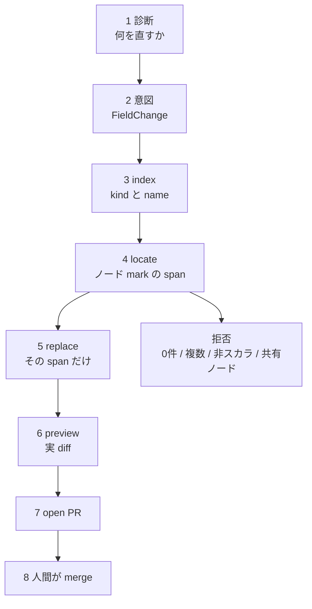

GitOpsの修復は、モデルにマニフェスト全文や unified diff を書かせた瞬間に壊れます。
壊れる形は拒否だけではありません。
reject されない誤適用と、seed ごとに正誤が入れ替わる破壊です。

Davineni の [Don't Let the Model Write the YAML](https://arxiv.org/abs/2609.00227) は、意味判断と構文操作を分けます。
モデルは「どのリソースのどのフィールドを何にするか」だけを出します。
YAML のバイト列は、パーサが見つけたスカラ span を 1 箇所だけ書き換える適用器が担います。

保証の対象は「既知の変更を忠実に適用すること」です。
その変更が運用として正しいかは、人間の PR レビューに残します。

:::message alert
本記事は 2026-08-31 投稿の arXiv preprint（[arXiv:2609.00227v1](https://arxiv.org/abs/2609.00227)）を解説したものです。会議採録の一次証拠は確認していません。実装の確認ピンは KubeAstra `main`（locate.py は 2026-09-01 に alias 拒否を追加）です。
:::


*この記事の全体像。以下、順に解説します。*

## 壊れるのは診断ではなく適用である

エージェントにクラスタの異常を説明させ、Deployment の `replicas` や container image を直させる設計は、いま珍しくありません。
診断がそれらしい文章になることと、Git 上の YAML が意図どおりに変わることは別問題です。

論文が測っているのは後者です。
同じ既知変更を 3 つの生成戦略に渡し、パース後の葉がオラクルと一致するかを見ます。
整形だけの差は Correct に含め、fidelity は別指標にします。

全文再生成は、強いモデルなら高い Correct に見えます。
しかし seed で正誤が入れ替わるタスクが残ります。
unified diff は、ほぼ適用不能です。
retry を足しても、同じ失敗モードを再生成します。

無人 GitOps で GNU `patch --fuzz` にモデル diff を流す設計は、論文データと GNU 仕様の両方から外します。
一方で「モデルに YAML を一切書かせてはならない」は強すぎます。
unique-match 適用と RFC 6902 JSON Patch は、同じ fail-closed を別経路で既に持っています。

## モデルは意図だけを出しバイトは触らない

責任境界は短いです。
モデルの出力は `FieldChange` です。
適用器は位置特定、引用符の維持、最小 diff です。

```json
{
  "kind": "Deployment",
  "name": "frontend",
  "namespace": "default",
  "field_path": "spec.template.spec.containers[name=server].image",
  "new_value": "gcr.io/example/frontend:1.2.3",
  "reason": "pin image to a known-good digest"
}
```

`field_path` はリストを index ではなく `name` で辿ります。
`containers` と `env` が対象です。
並び替えで壊れる index は使いません。

適用器はファイルを再シリアライズしません。
コメント、キー順、引用符は、書き換え span の外に残ります。
0 件、複数件、非スカラ、パース不能は拒否します。
推測しません。

Git への反映は preview と PR までです。
merge は人です。
CI で merge API を呼ばないことをテストする、と論文は書いています（C3 / G6）。



[OpenGitOps](https://opengitops.dev/) の Declarative と Versioned and Immutable に乗るのは 6 から 8 です。
live の `kubectl patch` はこの列を外れます。

SUT は 83 タスク × 5 seed = 415 run で Correct 1.000、collateral 0、flaky 0 です（論文 Table 1-2）。
モデル非依存です。
ただしコーパスはほぼ 1 ファイルです。
Online Boutique が約 80/83 を占めます。
母集団推定ではありません（論文 §6.2）。

実装は Apache-2.0 の [KubeAstra](https://github.com/astraverse-io/KubeAstra) です。
ベンチは [kubeastra-bench](https://github.com/astraverse-io/kubeastra-bench) です。
2026-09-03 時点で KubeAstra は約 6 stars、kubeastra-bench は 0 stars です。

## テキスト生成は既知変更でも崩れる

論文は同じ既知変更を 3 戦略に渡します。

| 戦略 | Flash Correct | Sonnet 5 Correct | 失格の形 |
|---|---|---|---|
| SUT span-edit | 1.000 | 1.000 | 主コーパス内ではなし（既知 intent の in-scope スカラ。拒否対象は別 stratum） |
| B1 全ファイル再生成 | 0.024 | 0.976 | Flash は再フロー（collateral 0.976、平均 921.3 行）。Sonnet は 6/83 タスクが seed で正誤が入れ替わる |
| B2 unified diff（strict） | 0.036 | 0.012 | ほぼ適用不能。多くは `@@` 行番号の誤り |
| B3 diff + 最大 2 retry | 0.092 | 0.108 | retry も同じ失敗モードを再生成する |

出典は論文 Table 1-2 です。PDF pp.5-6 を直接確認しています。

Sonnet B1 と SUT の Correct 差は 10/415（405 vs 415）です。
論文は精度差に依拠しません。
軸は決定論、O(1) 生成、能力非依存です。

`max_tokens=4000` だと B1 が 2.4% に見えます。
ファイル再生成を測るなら、cap がファイル長を超える必要があります（§6.5）。
見出しがハーネスで反転する失敗です。

強いモデルに全文を書かせれば足りる、という読みは、この表では持ちません。
平均 Correct 0.976 でも、6/83 が flaky なら無人適用の性質として足りません。

## 適用できたは正しかったではない

GNU `patch` は「当たった」と「正しかった」を混ぜます。
Table 5 は Sonnet B2 を別途キャプチャした 415 件で、適用器だけを変えます。
bench README の再現期待値と一致します。
Table 1 のメインラン Sonnet B2 Correct 0.012 とはサンプルが異なります。
論文 §6.7 は strict 0.027 との差を認め、大効果に依拠すると書いています。

| 適用器 | Applied | Correct | Misapplied |
|---|---|---|---|
| strict（文脈完全一致） | 0.027 | 0.027 | 0.000 |
| offset-tolerant（YAML 安全、内容 unique） | 0.675 | 0.675 | 0.000 |
| whitespace-insensitive | 0.675 | 0.670 | 0.005 |
| GNU `patch --fuzz=3` | 0.964 | 0.824 | 0.140 |
| GNU `patch --fuzz=3 -l` | 0.964 | 0.761 | 0.202 |

GNU man は fuzz を上げると faulty patch の確率が上がると書きます。
default fuzz は 2 です。
論文は `--fuzz=3` です。
通常 3 行の context を全部無視し得る設定です。

Table 5 の Misapplied 0.140 / 0.202 は 415 件全体を分母とします。
Applied 分を分母にすると約 14.5% / 21.0% です。
要旨の「約 1/7（14-20%）」と揃います。

失格にする対象は「寛容パッチ一般」ではありません。
`--fuzz` で reject されず、機械判定可能な失敗シグナルが無い誤配置です。
offset-tolerant は misapply 0 で 67.5% に止まります。
拒否の方が、誤って隣の同形フィールドを書き換えるより安全です。

YAML はインデントが意味を持ちます。
whitespace-insensitive が誤適用を増やすのは仕様どおりです。
論文とベンチは kubeconform を評価していません。
同型の別フィールドへの誤配置は、一般的なスキーマ検証だけでは検出しにくいです。

GitOps の本番経路はワーキングツリーへのファイル書き込みと commit であり、GNU patch を経由しないことが多いです。
それでも「モデル diff を `patch --fuzz` に流す」設計は残ります。
その設計だけを論文は定量で潰しています。

参考までに、GNU Patch 2.7.6 には不正 patch から `ed` 経由でコード実行できる [CVE-2018-1000156](https://nvd.nist.gov/vuln/detail/CVE-2018-1000156) もあります。
論文の主軸は誤配置率であり、この CVE に依拠しません。
fuzz 経路を本番に残す理由は、どちらにせよ増えません。

## コストはファイル長に比例させない

Table 4 は概数です。モデルは Sonnet 5 です。

| 手法 | 出力 token / 編集 | スケール |
|---|---|---|
| SUT | 約 50-150（意図の固定長） | O(1) |
| B1 | 約 9,300 | O(ファイル長) |
| B2 | 約 200、Correct あたり 約 16,700 | O(1) だがほぼ失敗 |
| B3 | 約 560、Correct あたり 約 5,200 | O(1) |

1 ラン（83×5、3 ベースライン）は 34.69 USD です（論文 §6.6）。
絶対額よりスケールが意思決定に効きます。
マニフェストが長くなるほど、全文再生成は高く、span-edit の意図は伸びません。

## 契約は既存スカラの外へ安易に伸ばせない

v1 は既存スカラだけです。
構造追加、Helm / Argo の値間接、生成物は非ゴールです（§7）。
拡張は「同じ保証のまま足す」より「拒否カテゴリを増やす」が先になります。

| 対象 | v1 の扱い | 拡張の契約 |
|---|---|---|
| 名前付きリスト（containers, env） | `name` で解決 | 既存。K8s SMP の merge key と同じ発想 |
| `args` / `command` / name なし配列 | 拒否 | index は並び替えで壊れる。JSON Pointer の `/0` も同じ弱点 |
| `ports`（merge key は containerPort） | `name` が無いと拒否 | キーをリソース型ごとに宣言する必要がある |
| YAML アンカー / エイリアス | 論文 v1: リーク（recall 0.889）。compose が alias を anchor ノードに畳む | [KubeAstra#85](https://github.com/astraverse-io/KubeAstra/pull/85)（merged 2026-09-01）で共有ノードと `&` 開始を拒否。単一 span では複数サイトを忠実に変えられない |
| 複数文書 `---` | `doc_index` + `(kind, name)`。重複は overlay 優先、だめなら拒否 | 文書境界は既に扱っている |
| Helm `{{ }}` | パース不能なら skip。values 間接は拒否 | ソース行が無い対象は Git 上の values へ resolver が要る |
| Kustomize 生成リソース | strategic-merge patch をファイル追加 | API サーバの strategic patch は CR 非対応（[Kubernetes 公式 Note](https://kubernetes.io/docs/tasks/manage-kubernetes-objects/update-api-object-kubectl-patch/)）。Kustomize の SMP はクライアント側で、custom OpenAPI が無いと使えない場合がある。スキーマ未設定時は JSON6902 が安全側 |
| CRD 本体の Git YAML | kind 非依存のスカラ span は動く | 壊れるのは API/SMP 意味論。RFC 6902 `replace` は対象欠落で失敗し fail-closed を共有する |

G5 の論文数値は precision 1.00、control coverage 1.00、recall 0.889 です。
欠ける 1 カテゴリが alias です。
実装 `main` は論文より先に閉じています。
bench `refusal.py` は 2026-09-02 時点でも KNOWN GAP と書いてあり、再現ピンを分ける必要があります。

[RFC 6902](https://datatracker.ietf.org/doc/html/rfc6902) §4.3 は、`replace` が対象不在なら失敗すると書きます。
§5 は、失敗したらパッチ全体を成功とみなしてはならないと書きます。
これは論文 G5 と同型の契約です。
再シリアライズとコメント喪失が span-edit との差になります。

[YAML 1.2.2](https://yaml.org/spec/1.2.2/#3222-anchors-and-aliases) のアンカーとエイリアスは、単一ノードを複数箇所で共有します。
1 span の置換では、共有先をすべて忠実に変えられません。
拒否が先です。

## この論文が支持することと支持しないこと

本評価条件（Kubernetes YAML スカラ、Online Boutique 偏重）では、無人適用器にモデルが書いた YAML 全文や `patch --fuzz` 可能な unified diff を渡す設計は支持されません。
スカラ Git YAML では意図を構造化し、unique span または JSON6902 で fail-closed に適用します。
本コーパスの Sonnet 5 B1 はレビュー候補として集計精度が高いです。
無人 merge は非決定性のため避けます。

支持する事実は次です。

- Table 5: GNU `--fuzz=3` は 415 件中 Misapplied 0.140（Applied 分では約 14.5%）。`-l` で 0.202。reject されない
- Table 2: 本コーパスの Sonnet B1 は 6/83 が flaky。平均 0.976 でも無人適用の性質として足りない
- YAML はインデントが意味を持つ。whitespace-insensitive が誤適用を増やすのは仕様どおり
- 同型フィールドへの誤配置は、一般的なスキーマ検証だけでは検出しにくい
- 論文と実装は merge を人に残す。診断の誤りはレビューで拾う前提である

結論を弱める事実もあります。

- 論文自身が span-edit primitive は既知だと書く（§4.3）。新規性は LLM 意図との組である
- RFC 6902 `replace` と Kustomize JSON6902 は path と value の決定論適用と欠落時失敗を既に持つ。yq の代入は欠落パスを生成でき、同じ fail-closed ではない
- Table 5 の offset-tolerant は misapply 0。unique-match は失格していない
- [Aider の edit formats](https://aider.chat/docs/more/edit-formats.html) は `diff`（SEARCH/REPLACE）、`whole`（全ファイル）、`udiff` を用途別に持つ。本番コーディングエージェントは unique ブロックで失敗させる
- SUT 100% は「既知 intent のバイト置換」である。修復が正しいことではない（論文 §7）
- 83 タスクの約 80 が 1 ファイル。Independent Researcher。第三者再現は著者リポ以外に未確認
- 実装の脅威モデルは「人間が merge」であり、論文が論じる「無人 commit-and-ship」より狭い

分解そのものは残ります。
少なくとも本評価条件の Kubernetes YAML スカラ修復では、無人の全文適用と fuzz 付き diff 適用は支持されません。
権限は「意図を出す」と「バイトを変える」に分けます。
後者は決定論に固定します。
決定論の実装は span-edit 一択ではありません。

診断品質は未評価です。
間違った `replicas` を 100% 忠実に書く経路は残ります。
flaky 6 タスクの原因は未解析です。
他リポで再現するかは不明です（論文 §7）。
モデルは 2 点です。
capability-dependent の単調性は未証明です。
CRD の OpenAPI merge key が無い配列を、拒否以外でどう扱うかは未解決です。
Helm values と live Deployment の対応 resolver は将来課題です。

無人 merge を今すぐ足す判断はブロックします。
レビュー付き PR でスカラを変える設計は、分解を入れれば進めてよいです。

## エージェントのツール面を意図提出に落とす

実務で先に変えるのは、モデルの賢さではなくツール契約です。

1. エージェントに `write_file` や `apply_patch --fuzz` 相当を GitOps マニフェストへ直接渡さない。ツールは `propose_field_change` に落とす
2. 適用器は fail-closed にする。0 件と複数件はエラーを返し、推測しない
3. 配列はリソース型ごとの merge key を宣言する。無いキーは拒否する。CR への Kustomize fallback は、custom OpenAPI が無いなら JSON6902 にする。API サーバの strategic patch を CR 一般へ外挿しない
4. アンカーとエイリアスは編集せず拒否する（#85 の契約）。共有ノードを 1 span で変えない
5. 評価は「適用の忠実さ」と「意図の正しさ」を分ける。後者は別オラクル（ポリシー、dry-run、人間）である

逆転条件は 2 つです。
コーパスが 50 リポ以上に広がり、unique-match diff でも YAML 隣接誤爆が無視できない率で残るなら、span-edit の優先度が上がります。
診断まで無人で正しくなる一次証拠が出ても、構文操作は決定論に残します。

## まとめ

GitOps の修復適用は、モデルにファイルや unified diff を書かせる段階で壊れます。
意味判断はモデルに残し、構文操作は unique span または JSON6902 の fail-closed に閉じます。
本評価条件では、無人の全文再生成と `patch --fuzz` 適用は支持されません。
SUT の 100% は既知 intent の忠実適用であり、診断の正しさではありません。
merge は人に残します。

この記事が少しでも参考になった、あるいは改善点などがあれば、ぜひリアクションやコメント、SNSでのシェアをいただけると励みになります！

## 参考リンク

- P. Davineni, “Don't Let the Model Write the YAML.” arXiv:2609.00227v1, 2026-08-31. https://arxiv.org/abs/2609.00227
- KubeAstra（Apache-2.0）。gitops 実装は `ui/backend/gitops`。https://github.com/astraverse-io/KubeAstra
- kubeastra-bench（Apache-2.0）。https://github.com/astraverse-io/kubeastra-bench
- astraverse-io/KubeAstra#85。closed/merged 2026-09-01。alias/anchor を locate で拒否。https://github.com/astraverse-io/KubeAstra/pull/85
- CNCF OpenGitOps Principles v1.0.0。https://opengitops.dev/
- Kubernetes, “Update API Objects in Place Using kubectl patch.” Strategic merge patch is not supported for custom resources. https://kubernetes.io/docs/tasks/manage-kubernetes-objects/update-api-object-kubectl-patch/
- YAML 1.2.2 §3.2.2.2 Anchors and Aliases。https://yaml.org/spec/1.2.2/#3222-anchors-and-aliases
- GNU patch `--fuzz`。https://www.mankier.com/1/patch
- RFC 6902 JSON Patch §4.3 replace, §5 error handling。https://datatracker.ietf.org/doc/html/rfc6902
- Aider, Edit formats（`whole` / `diff` / `udiff`）。https://aider.chat/docs/more/edit-formats.html
- CVE-2018-1000156。GNU Patch 2.7.6、不正 patch からの `ed` 経由コード実行。https://nvd.nist.gov/vuln/detail/CVE-2018-1000156
