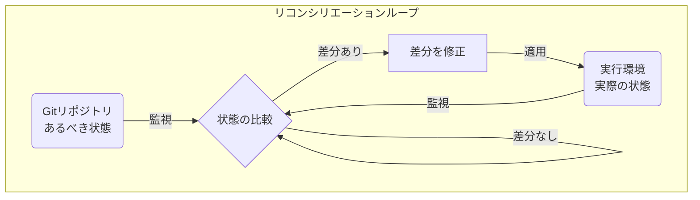
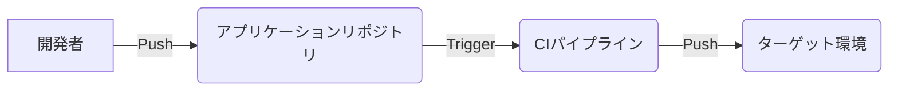
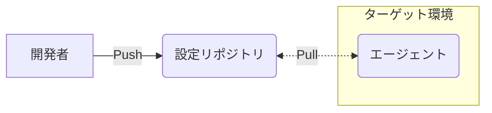
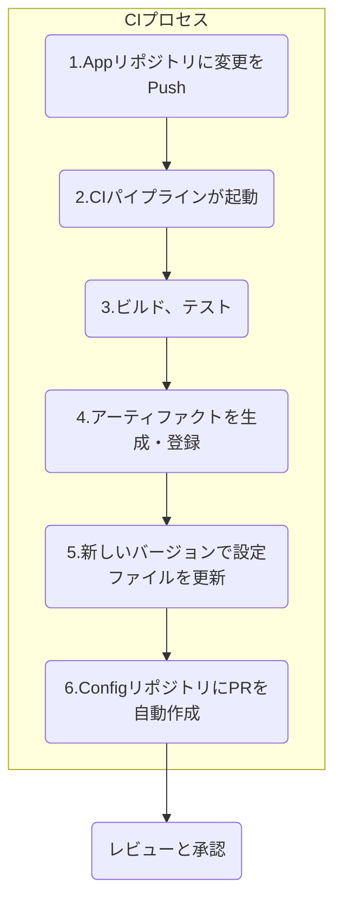
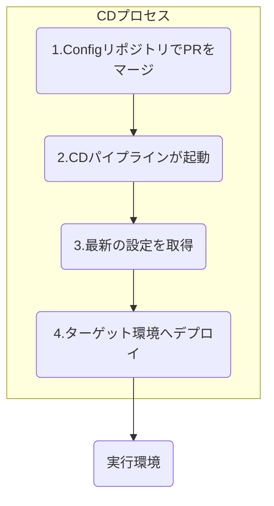

以前の記事でマイクロサービスのCI/CD戦略として、マルチステージCIとGitOpsの組み合わせを紹介しました。この戦略は、実行環境がKubernetesでなくても適用することができます。

https://zenn.dev/suwash/articles/microservices_cicd_20250912

GitOpsは、システムの「あるべき状態」をGitで宣言的に管理する強力な運用モデルですが、その議論はしばしばKubernetesが中心となります。「Kubernetesは導入できないが、手動デプロイから脱却し、デプロイプロセスをモダン化したい」――そんな課題を抱える開発者やインフラエンジニアは少なくないでしょう。

本稿では、そのギャップを埋めるべく、**Kubernetesを使わない多様な環境（オンプレミスVM、AWS、GCP、Azure）でGitOpsの原則を適用する実践的な方法**を解説します。CI/CDパイプラインを通じてデプロイを自動化する具体的なワークフローと、すぐに使える実装パターンを提示し、信頼性と開発生産性の高い運用を実現する一助となれば幸いです。

## GitOpsの基本原則

GitOpsは特定のツールではなく、4つの基本原則に基づいた運用フレームワークです。

### 1\. 唯一の信頼できる情報源としてのGit

システムのあるべき状態は、すべてGitリポジトリで宣言的に記述し、一元管理します。アプリケーションコードだけでなく、インフラ設定、ネットワークポリシーなども含みます。

これにより、すべての変更は追跡可能となり、Pull Request (PR) を通じたレビューと承認プロセスが、変更の透明性と監査性を保証します。

### 2\. 宣言的な状態記述

システムの管理には、最終的な「あるべき状態（What）」を定義する宣言的アプローチを採用します。これは、手順を記述する「命令的（How）」アプローチとは対照的です。

例えば、AWS CloudFormationやServerless Frameworkの`serverless.yml`は、この宣言的アプローチの代表例です。

### 3\. 状態を保証する自動化

Gitリポジトリのmainブランチへのマージなどをトリガーとして、CI/CDパイプラインが自動的に動き出します。このパイプラインが、Gitで定義されたあるべき状態を実際の環境へ適用します。

  - **CI (継続的インテグレーション)**
      - アプリケーションコードのテスト、ビルド、アーティファクト（コンテナイメージなど）の生成
  - **CD (継続的デリバリー/デプロイ)**
      - アーティファクトをデプロイするための設定変更を環境に反映

### 4\. 継続的リコンシリエーション

「継続的リコンシリエーション（状態調整）」は、GitOpsの中核をなす原則です。



| 要素名 | 説明 |
| :--- | :--- |
| Gitリポジトリ | システムのあるべき状態が宣言的に定義された、唯一の信頼できる情報源 |
| 実行環境 | アプリケーションが実際に稼働しているインフラ |
| 状態の比較 | あるべき状態と実際の状態を常に比較するプロセス |
| 差分を修正 | 状態間に差異（ドリフト）が検出された場合に、あるべき状態に一致するように自動修正するプロセス |

Kubernetes環境外ではネイティブな機構が存在しないため、定期的なパイプライン実行やカスタムエージェントでこのループを模倣する必要があります。

## アーキテクチャの選択：Push型 vs Pull型

GitOpsの実装には、Push型とPull型の2つの主要なアーキテクチャがあります。非Kubernetes環境では、**厳格な運用ルール（手動デプロイの禁止）を前提としたPushモデルが最も現実的**です。

### Pushモデル：CI主導のデプロイ

CI/CDパイプラインが、Gitリポジトリの変更をトリガーとして、ターゲット環境に設定変更を直接「プッシュ」します。



| 要素名 | 説明 |
| :--- | :--- |
| 開発者 | アプリケーションコードを変更し、リポジトリにプッシュ |
| アプリケーションリポジトリ | アプリケーションのソースコードを管理 |
| CIパイプライン | コードのビルド、テスト、アーティファクトの生成、ターゲット環境へのデプロイを実行 |
| ターゲット環境 | アプリケーションがデプロイされる実行環境 |

### Pullモデル：エージェント主導のリコンシリエーション

ターゲット環境内で動作するエージェントが、定期的にGitリポジトリを監視し、あるべき状態を「プル」して自己の状態を更新します。



| 要素名 | 説明 |
| :--- | :--- |
| 開発者 | 設定リポジトリに変更をプッシュ |
| 設定リポジトリ | システムのあるべき状態を管理 |
| エージェント | ターゲット環境内で動作し、設定リポジトリを監視して状態を同期 |

### モデルの比較と選択

| 評価基準 | Pushモデル | Pullモデル |
| :--- | :--- | :--- |
| **セキュリティ** | CIシステムが本番環境のクレデンシャルを要するため、比較的低い | クレデンシャルが環境内に留まるため、高い |
| **実装の複雑さ (非K8s)** | 既存のCI/CDツールを活用でき、低い | カスタムエージェントの開発・管理が必要で、高い |
| **ドリフト検出** | 別途、定期的な監査が必要 | エージェントが継続的に監視・自動修正するため、強い |
| **デプロイ速度** | Gitイベントをトリガーに即時実行 | エージェントのポーリング間隔に依存し、遅延の可能性あり |
| **推奨アプローチ** | **Pushモデル** + IAMロールや短期トークンによるリスク緩和 | - |

## CI/CDワークフロー

アプリケーションコードの変更からデプロイまでの流れを、CIとCDの2つのワークフローに分けて解説します。

### CIワークフロー：変更からデプロイの意図へ

アプリケーションの変更を、環境に対する「宣言的な変更意図」へと変換するプロセスです。



| 要素名 | 説明 |
| :--- | :--- |
| Appリポジトリ | アプリケーションのソースコードを管理するリポジトリ |
| CIパイプライン | GitHub Actionsなどで構築された自動化プロセス |
| アーティファクト | ビルドによって生成されたコンテナイメージやJARファイルなど |
| Configリポジトリ | 環境設定（マニフェスト）を管理するリポジトリ。Appリポジトリとは分離を推奨 |
| PR (Pull Request) | 変更内容をレビューし、承認するための仕組み |
| レビューと承認 | チームによる変更内容の確認と、本番環境へのマージ承認 |

#### 1\. リポジトリの分離

アプリケーションのソースコードリポジトリと、環境設定リポジトリは分離します。

  - **CIループの回避**: 意図しないパイプラインの連鎖実行を防止
  - **権限の分離**: 開発者と運用者の権限を明確に分離
  - **関心の分離**: アプリケーション開発とインフラ構成のライフサイクルを分離

#### 2\. アーティファクトのビルドと登録

GitHub ActionsなどのCIツールで、アプリケーションをビルドし、コンテナレジストリやストレージに登録します。アーティファクトには追跡可能性のため、GitのコミットSHAなどをタグとして付与します。

#### 3\. 設定の更新とPRの自動作成

CIジョブが、登録した新しいアーティファクトのタグ（バージョン）で設定リポジトリ内のマニフェストファイルを更新し、mainブランチへのPull Requestを自動で作成します。このPRが、環境への変更意図を記録する監査ログとなります。

### CDワークフロー：あるべき状態の適用

承認されたPRをトリガーとして、変更を実際の環境に適用するプロセスです。



| 要素名 | 説明 |
| :--- | :--- |
| Configリポジトリ | PRがマージされ、あるべき状態が更新される |
| CDパイプライン | 設定リポジトリのmainブランチへのマージをトリガーに起動 |
| ターゲット環境 | 実際のアプリケーションが稼働するインフラ |

#### 1\. デプロイのトリガー

設定リポジトリのmainブランチへのPRマージをトリガーとして、CDパイプライン（GitHub Actionsなど）を起動します。

#### 2\. デプロイの実行

CDパイプラインは、最新の設定リポジトリの内容をチェックアウトし、ターゲット環境へ認証後、各プラットフォームに応じたコマンドを実行して変更を適用します。

#### 3\. ドリフトの検出と修正 (Pushモデル)

Pushモデルでは状態の自動修復機能がないため、意図しない変更（ドリフト）の検出が重要です。

定期実行（cronなど）の**監査パイプライン**を構築し、Git上の「あるべき状態」（例: AnsibleのPlaybook, `serverless.yml`）と環境の「実際の状態」（例: VMのパッケージバージョン, Lambdaの環境変数）を比較します。例えば、Ansibleであれば`--check`フラグ（ドライランモード）を定期実行して差分を検知したり、AWSであれば設定情報を取得するスクリプト（AWS CLIやSDKを使用）を実行し、Git上の定義と比較したりする方法が考えられます。

差異を検知した場合は、単に通知するだけでなく、**自動でIssueを起票したり、修正を促すPRを自動作成したりする**ことで、GitOpsのワークフローに則った修正を促す仕組みを構築することが理想です。

#### 4\. ロールバック戦略

デプロイに問題が発生した場合、設定リポジトリで原因となったコミットを`git revert`します。これにより、以前の安定した状態にシステムを戻すCDパイプラインが自動的にトリガーされます。

## 実装パターン

各環境への具体的なデプロイ方法を解説します。

### オンプレミスVMへのデプロイ (Javaアプリケーション)

GitHub ActionsとAnsibleを利用したPush型ワークフローです。

  - **構成管理**: Ansible Playbookでサーバーの状態を宣言的に記述します。
  - **CDパイプライン**:
    1.  CIでビルドされたJARファイルをダウンロードします。
    2.  GitHub Actionsの`webfactory/ssh-agent`などを用いてVMへSSH接続します。
    3.  `ansible-playbook`コマンドを実行し、アプリケーションをデプロイします。

**CDワークフローのサンプル (`.github/workflows/cd.yml`)**

```yaml
name: Deploy Java App to On-Prem VM
on:
  push:
    branches:
      - main
jobs:
  deploy:
    runs-on: ubuntu-latest
    steps:
      - name: Checkout code
        uses: actions/checkout@v4
      - name: Download JAR artifact
        run: echo "Downloading artifact..." # S3などからアーティファクトをダウンロード
      - name: Setup SSH connection
        uses: webfactory/ssh-agent@v0.9.0
        with:
          ssh-private-key: ${{ secrets.SSH_PRIVATE_KEY }}
      - name: Add SSH known hosts
        run: ssh-keyscan -H ${{ secrets.SSH_HOST }} >> ~/.ssh/known_hosts
      - name: Run Ansible Playbook
        run: |
          ansible-playbook \
            -i "${{ secrets.SSH_HOST }}," \ # インベントリを動的に指定
            --user ${{ secrets.SSH_USER }} \ # SSH接続ユーザー
            deploy.yml # 実行するPlaybookファイル
```

### AWS

#### VM: Amazon EC2

AWS CodeDeployを利用します。

  - **デプロイ定義**: `appspec.yml`でファイルのコピー先やライフサイクルフックで実行するスクリプトを定義します。
  - **CDパイプライン**: `aws deploy create-deployment`コマンドを実行し、指定したGitHubリポジトリのコミットをリビジョンとしてデプロイを開始します。

**CDパイプラインのサンプル**

```yaml
- name: Deploy to Amazon EC2
  run: |
    aws deploy create-deployment \
      --application-name ${{ secrets.CODEDEPLOY_APP_NAME }} \ # CodeDeployのアプリケーション名
      --deployment-group-name ${{ secrets.CODEDEPLOY_DG_NAME }} \ # デプロイグループ名
      --github-location repository=${{ github.repository }},commitId=${{ github.sha }} # デプロイ対象のコミット
```

#### CaaS: Amazon ECS

AWS公式のGitHub Actionsを利用します。

  - **CDパイプライン**:
    1.  `aws-actions/amazon-ecs-render-task-definition`で、タスク定義ファイル内のコンテナイメージを新しいバージョンに更新します。
    2.  `aws-actions/amazon-ecs-deploy-task-definition`で、更新したタスク定義を適用し、サービスを更新します。

**CDパイプラインのサンプル**

```yaml
- name: Deploy to Amazon ECS
  uses: aws-actions/amazon-ecs-deploy-task-definition@v1
  with:
    # CIステップで生成されたタスク定義ファイルを指定
    task-definition: ${{ steps.task-def.outputs.task-definition }}
    service: ${{ secrets.ECS_SERVICE }} # 更新対象のECSサービス名
    cluster: ${{ secrets.ECS_CLUSTER }} # 対象のECSクラスタ名
    wait-for-service-stability: true # デプロイの完了を待つ
```

#### FaaS: AWS Lambda

Serverless Frameworkを利用します。

  - **CDパイプライン**: `serverless deploy`コマンドを実行します。CIプロセスで`serverless.yml`内のアーティファクトパスは更新済みとします。

**CDパイプラインのサンプル**

```yaml
- name: Serverless Deploy
  run: serverless deploy --stage production # 'production'ステージにデプロイ
  env:
    AWS_ACCESS_KEY_ID: ${{ secrets.AWS_ACCESS_KEY_ID }}
    AWS_SECRET_ACCESS_KEY: ${{ secrets.AWS_SECRET_ACCESS_KEY }}
```

### GCP

#### VM: Compute Engine

Cloud Buildと`gcloud` CLIを利用します。

  - **CDパイプライン (`cloudbuild.yaml`)**:
    1.  `gcr.io/cloud-builders/gsutil`でアーティファクトをCloud Storageから取得します。
    2.  `gcloud compute scp`でVMにファイルを転送します。
    3.  `gcloud compute ssh`でリモートコマンドを実行し、サービスを再起動します。

**CDパイプラインのサンプル**

```yaml
steps:
- name: 'gcr.io/google.com/cloudsdktool/cloud-sdk'
  entrypoint: 'gcloud'
  args:
    - 'compute'
    - 'ssh'
    - 'instance-1' # ターゲットのVMインスタンス名
    - '--zone=us-central1-a' # VMのゾーン
    - '--command=sudo systemctl restart my-app' # VM上で実行するコマンド
```

#### CaaS: Cloud Run

Cloud Buildを利用します。

  - **CDパイプライン (`cloudbuild.yaml`)**: `gcloud run deploy`コマンドで、新しいコンテナイメージを指定してサービスを更新します。

**CDパイプラインのサンプル**

```yaml
steps:
- name: 'gcr.io/google.com/cloudsdktool/cloud-sdk'
  entrypoint: gcloud
  args:
    - 'run'
    - 'deploy'
    - 'my-app-service' # デプロイ対象のCloud Runサービス名
    - '--image'
    - 'gcr.io/$PROJECT_ID/my-app:$COMMIT_SHA' # 新しいコンテナイメージ
    - '--region'
    - 'us-central1' # サービスが稼働するリージョン
```

#### FaaS: Cloud Functions

Cloud Buildを利用します。

  - **CDパイプライン (`cloudbuild.yaml`)**: `gcloud functions deploy`コマンドで、ソースコードから直接関数をデプロイします。

**CDパイプラインのサンプル**

```yaml
steps:
- name: 'gcr.io/google.com/cloudsdktool/cloud-sdk'
  args:
    - 'functions'
    - 'deploy'
    - 'my-java-function' # デプロイする関数名
    - '--region=us-central1' # リージョン
    - '--source=.' # ソースコードの場所
    - '--trigger-http' # トリガーの種類 (ここではHTTP)
    - '--runtime=java17' # ランタイム
```

### Azure

#### VM: Azure Virtual Machines

Azure PipelinesとAnsibleを利用します。

  - **CDパイプライン (`azure-pipelines.yml`)**:
    1.  `DownloadPipelineArtifact`タスクでアーティファクトをダウンロードします。
    2.  `Ansible@0`タスクで、セキュアファイルとして保存されたSSH秘密鍵を使い、Ansible Playbookを実行します。

**CDパイプラインのサンプル**

```yaml
- task: Ansible@0
  inputs:
    ansibleFile: '$(Pipeline.Workspace)/drop/ansible/deploy.yml' # Playbookファイルのパス
    inventories: 'inline'
    inline: | # インベントリを直接記述
      [webservers]
      ${{ secrets.AZURE_VM_IP }} ansible_user=${{ secrets.AZURE_VM_USER }}
    secureFiles:
    - name: privateKey # セキュアファイルに登録したSSH秘密鍵名
```

#### CaaS: Azure Container Apps

Azure PipelinesとAzure CLIを利用します。

  - **CDパイプライン (`azure-pipelines.yml`)**: `AzureCLI@2`タスク内で`az containerapp update`コマンドを実行し、新しいコンテナイメージでContainer Appを更新します。

**CDパイプラインのサンプル**

```yaml
- task: AzureCLI@2
  inputs:
    azureSubscription: 'YourServiceConnection' # Azureへのサービス接続名
    scriptType: 'bash'
    inlineScript: |
      az containerapp update \
        --name my-container-app \ # Container App名
        --resource-group my-resource-group \ # リソースグループ名
        --image myregistry.azurecr.io/my-app:${{ variables.buildId }} # 新しいコンテナイメージ
```

#### FaaS: Azure Functions

Azure Pipelinesの専用タスクを利用します。

  - **CDパイプライン (`azure-pipelines.yml`)**: `AzureFunctionApp@1`タスクを使用し、CIで作成されたZIPアーティファクトを指定のFunction Appにデプロイします。

**CDパイプラインのサンプル**

```yaml
- task: AzureFunctionApp@1
  inputs:
    azureSubscription: '$(azureSubscription)' # Azureへのサービス接続
    appType: 'functionApp' # アプリケーションのタイプ
    appName: '$(functionAppName)' # Function App名
    package: '$(Pipeline.Workspace)/**/*.zip' # デプロイするパッケージのパス
    runtimeStack: 'JAVA|17' # ランタイムスタック
```

## 高度な考慮事項

### シークレット管理

データベースのパスワードなどの機密情報は、以下のいずれかの方法で安全に管理します。

| 戦略 | 説明 |
| :--- | :--- |
| **外部シークレットマネージャ** | AWS Secrets ManagerやHashiCorp Vaultなどの専用サービスを利用。CI/CD実行時に動的に参照。**(推奨)** |
| **Gitリポジトリでの暗号化** | Mozilla SOPSやgit-cryptなどを用いて、リポジトリ内のシークレットファイル自体を暗号化 |

### オブザーバビリティ

CI/CDパイプラインとデプロイされたアプリケーションの両方を監視します。

  - **パイプラインの監視**: 実行時間、成功率などを監視し、デプロイプロセスのボトルネックを特定
  - **アプリケーションの監視**: Gitの「あるべき状態」と監視ツールによる「実際の状態」が一致していることを検証。デプロイによる影響（パフォーマンス、エラーレート）を評価し、問題があれば`git revert`によるロールバックに繋げます

### プラットフォームエンジニアリングへの拡張

本稿で示したGitOpsパターンは、組織全体の開発プロセスを標準化する「内部開発者プラットフォーム（IDP）」のエンジンとして機能します。

  - **標準化されたワークフロー**: プラットフォームチームがCI/CDのテンプレートを提供し、ガバナンスを確保
  - **開発者体験の向上**: 開発者は使い慣れたGitのフローでインフラを意識せずデプロイを完結
  - **ガバナンスと自律性の両立**: 統制を効かせつつ、開発チームの俊敏性を向上

## まとめ

本稿では、「Kubernetesは導入できないが、手動デプロイからは脱却したい」という課題に対し、Kubernetes以外の環境でGitOpsの原則を実現するための具体的なアプローチを解説しました。

1.  **Gitを信頼できる唯一の情報源**とし、宣言的な設定を管理します。
2.  非K8s環境では、厳格なルールを前提とした**Push型アーキテクチャが現実的**な選択肢です。
3.  CI/CDワークフローを分離し、**CIで「変更の意図」をPRとして生成**し、**CDで承認された変更を適用**します。
4.  オンプレミスVMから主要クラウドの各種サービスまで、**環境に応じたツールとパイプライン**を構築することで、GitOpsライクな運用は実現可能です。

GitOpsはツールではなく文化です。手動での変更をなくし、すべての変更をGitの追跡可能な履歴として残すことで、システムの安定性と開発チームの生産性は飛躍的に向上します。この記事が、あなたの環境にGitOpsのベストプラクティスを導入するための一歩となれば幸いです。

この記事が少しでも参考になった、あるいは改善点などがあれば、ぜひリアクションやコメント、SNSでのシェアをいただけると励みになります！

---

## 参考リンク

### GitOpsの基本概念と原則

  - **GitOpsとは**
      - [What is GitOps? - GitLab](https://about.gitlab.com/topics/gitops/)
      - [GitOps: Standard workflow for application development - Red Hat Developer](https://developers.redhat.com/topics/gitops)
      - [GitOps - Cloud Native Glossary](https://glossary.cncf.io/gitops/)
      - [What is GitOps? - Red Hat](https://www.redhat.com/en/topics/devops/what-is-gitops)
      - [GitOpsビギナーガイド - Splunk](https://www.splunk.com/ja_jp/blog/devops/gitops.html)
      - [What is GitOps: The Beginner's Guide - Splunk](https://www.splunk.com/en_us/blog/learn/gitops.html)
      - [The GitOps Guide: Principles, Examples, Tools & Best Practices - Configu](https://configu.com/blog/the-gitops-guide-principles-examples-tools-best-practices/)
  - **アーキテクチャ (Push vs Pull)**
      - [Push vs. Pull-Based Architecture in GitOps | Akamai - Linode](https://www.linode.com/blog/devops/push-vs-pull-based-architecture-in-gitops/)
      - [GitOps Approach: Pull Vs Push - DevOpsSchool.com](https://www.devopsschool.com/blog/gitops-approach-pull-vs-push/)
      - [What Is GitOps? Deployment Strategies & Advantages Explained - KodeKloud](https://kodekloud.com/blog/gitops-deployment-advantages/)
      - [Why should you use a pull architecture in gitops? : r/devops - Reddit](https://www.reddit.com/r/devops/comments/1gnz23p/why_should_you_use_a_pull_architecture_in_gitops/)
      - [GitOps: Push vs Pull? Choosing the Right Approach for Production Deployments - NetEye](https://www.neteye-blog.com/2024/12/gitops-push-vs-pull-choosing-the-right-approach-for-production-deployments/)
  - **Kubernetes環境でのGitOps**
      - [Core Concepts - Flux CD](https://fluxcd.io/flux/concepts/)
      - [Understanding GitOps: key principles and components for Kubernetes environments](https://www.datadoghq.com/blog/gitops-principles-and-components/)
      - [What is ArgoCD? Kubernetes GitOps Controller - Devtron](https://devtron.ai/what-is-argocd)
      - [Argo CD. A Complete Overview of ArgoCD with a… | by manojkumar | Medium](https://medium.com/@akulamanojkumar988/argo-cd-a909b5c62acb)
  - **非Kubernetes環境への応用**
      - [Implementing GitOps without Kubernetes - INNOQ](https://www.innoq.com/en/articles/2025/01/gitops-kubernetes/)
      - [Why GitOps Is Gaining Momentum Outside Kubernetes | by INI8 Labs | Medium](https://medium.com/@INI8labs/why-gitops-is-gaining-momentum-outside-kubernetes-8193cb75bbf4)

### プラットフォーム/ツール別実装ガイド

  - **AWS**
      - [Getting Started with GitOps on AWS: Concepts, Tools, and Best Practices - Microtica](https://www.microtica.com/blog/how-to-use-gitops-on-aws-in-your-organization-a-complete-guide)
      - [Tutorial: Lambda function deployments with CodePipeline - AWS Documentation](https://docs.aws.amazon.com/codepipeline/latest/userguide/tutorials-lambda-deploy.html)
      - [CodeDeploy AppSpec file reference - AWS Documentation](https://docs.aws.amazon.com/codedeploy/latest/userguide/reference-appspec-file.html)
      - [Integrating with GitHub Actions – CI/CD pipeline to deploy a Web ...](https://aws.amazon.com/blogs/devops/integrating-with-github-actions-ci-cd-pipeline-to-deploy-a-web-app-to-amazon-ec2/)
      - [Automated Java Application Deployment to EC2 with GitHub Actions | by Fayas Akram](https://medium.com/@fayas_akram/automated-java-application-deployment-to-ec2-with-github-actions-0fd454f31dee)
  - **Google Cloud (GCP)**
      - [GitOps best practices | Config Sync - Google Cloud](https://cloud.google.com/kubernetes-engine/enterprise/config-sync/docs/concepts/gitops-best-practices)
      - [Deploy to Compute Engine | Cloud Build Documentation | Google ...](https://cloud.google.com/build/docs/deploying-builds/deploy-compute-engine)
      - [Deploying to Cloud Run using Cloud Build | Cloud Build ...](https://cloud.google.com/build/docs/deploying-builds/deploy-cloud-run)
      - [gcloud run deploy](https://cloud.google.com/sdk/gcloud/reference/run/deploy)
      - [Deploying to Cloud Run functions | Cloud Build Documentation ...](https://cloud.google.com/build/docs/deploying-builds/deploy-functions)
  - **Azure**
      - [CI/CD baseline architecture with Azure Pipelines - Microsoft Learn](https://learn.microsoft.com/en-us/azure/devops/pipelines/architectures/devops-pipelines-baseline-architecture?view=azure-devops)
      - [Publish revisions with Azure Pipelines in Azure Container Apps ...](https://learn.microsoft.com/en-us/azure/container-apps/azure-pipelines)
      - [Continuously update function app code using Azure Pipelines ...](https://learn.microsoft.com/en-us/azure/azure-functions/functions-how-to-azure-devops)
      - [Using Ansible to Automate Azure Deployments - Spacelift](https://spacelift.io/blog/ansible-azure)
  - **Serverless**
      - [Getting Started with GitOps for Amazon Lambda - TechZone360](https://www.techzone360.com/topics/techzone/articles/2023/06/12/456144-getting-started-with-gitops-amazon-lambda.htm)
      - [GitOps for Serverless Functions: Streamlining Deployments for Microservices](https://platformengineer.hashnode.dev/gitops-for-serverless-functions-streamlining-deployments-for-microservices)
      - [Use Cases of GitOps for Serverless - DevOpsSchool.com](https://www.devopsschool.com/blog/use-cases-of-gitops-for-serverless/)
  - **Terraform / Ansible**
      - [Terraform & GitOps Workflows: Automating Cloud Infrastructure with Version Control - Firefly](https://www.firefly.ai/academy/terraform-gitops-workflows-automating-infrastructure-with-version-control)
      - [Taking Automation to the Next Level: Using Ansible GitOps to Manage the L - DevOpsChat](https://www.devopschat.co/articles/taking-automation-to-the-next-level-using-ansible-gitops-to-manage-the-l)
      - [Using Ansible Automation Webhooks for GitOps - Red Hat](https://www.redhat.com/en/blog/ansible-webhooks-gitops)

### CI/CDパイプラインとワークフロー

  - **GitHub Actions**
      - [Pull Request Action - GitHub Marketplace](https://github.com/marketplace/actions/pull-request-action)
      - [Update Pull Request from Branch · Actions · GitHub Marketplace](https://github.com/marketplace/actions/update-pull-request-from-branch)
      - [GitHub Actions Auto Pull Request - Flux CD](https://fluxcd.io/flux/use-cases/gh-actions-auto-pr/)
      - [Automation with GitHub Actions and Kustomize - GAP](https://gap.gjensidige.io/docs/guides/ci-automation-with-kustomize)
      - [Deployment with GitHub Actions: Quick Tutorial and 5 Best Practices](https://codefresh.io/learn/github-actions/deployment-with-github-actions-quick-tutorial-and-5-best-practices/)
  - **Kustomize連携**
      - ["kustomize edit set image" does not retain image tag information on setting newName · Issue \#4375 · kubernetes-sigs/kustomize](https://github.com/kubernetes-sigs/kustomize/issues/4375)
      - [GitHub Actions: Deployment to EKS with Kustomize | CodeFlex](https://codeflex.co/github-actions-deployment-to-eks-with-kustomize/)
      - [Setting up multiple deployment environments with GitHub Actions, GKE, and Kustomize](https://community.latenode.com/t/setting-up-multiple-deployment-environments-with-github-actions-gke-and-kustomize/33514)
  - **Cloud Build**
      - [GitOps-style continuous delivery with Cloud Build | Kubernetes Engine](https://cloud.google.com/kubernetes-engine/docs/tutorials/gitops-cloud-build)

### トラブルシューティングとコミュニティの知見

  - **Stack Overflow**
      - [Configure appspec.yml file for a spring boot application - Stack Overflow](https://stackoverflow.com/questions/60116520/configure-appspec-yml-file-for-a-spring-boot-application)
      - [azure container app does not update when updating it using cli - Stack Overflow](https://stackoverflow.com/questions/72669731/azure-container-app-does-not-update-when-updating-it-using-cli)
  - **Reddit**
      - [How to use Ansible to deploy on AWS from Azure DevOps : r/azuredevops - Reddit](https://www.reddit.com/r/azuredevops/comments/1fa87vr/how_to_use_ansible_to_deploy_on_aws_from_azure/)
