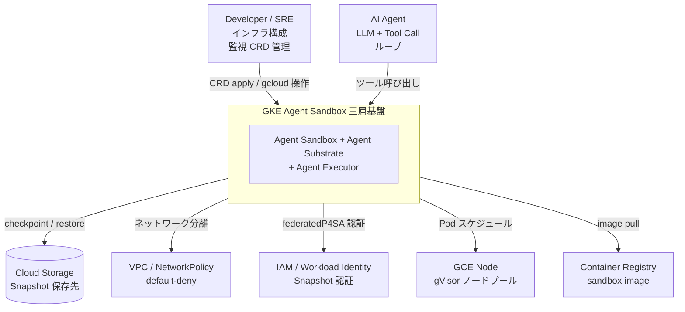
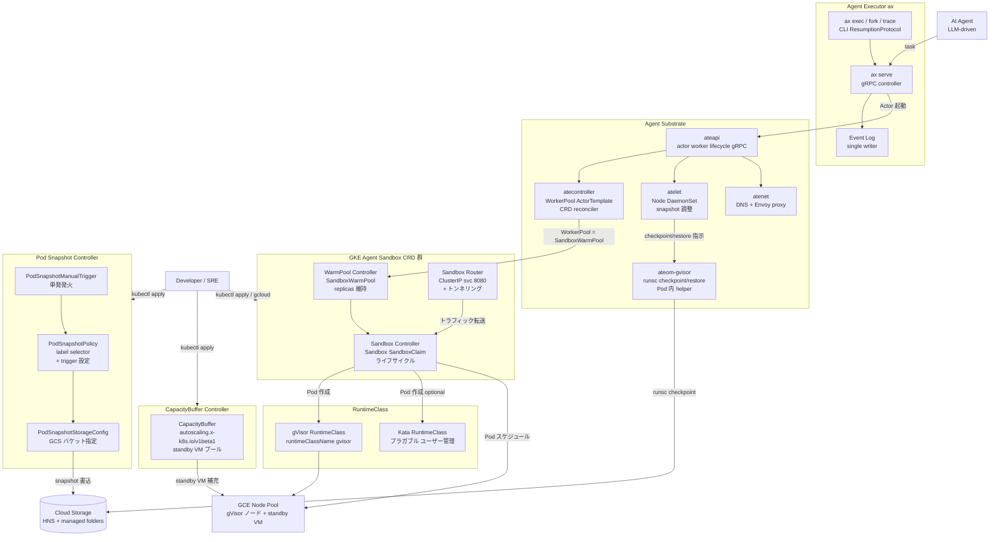
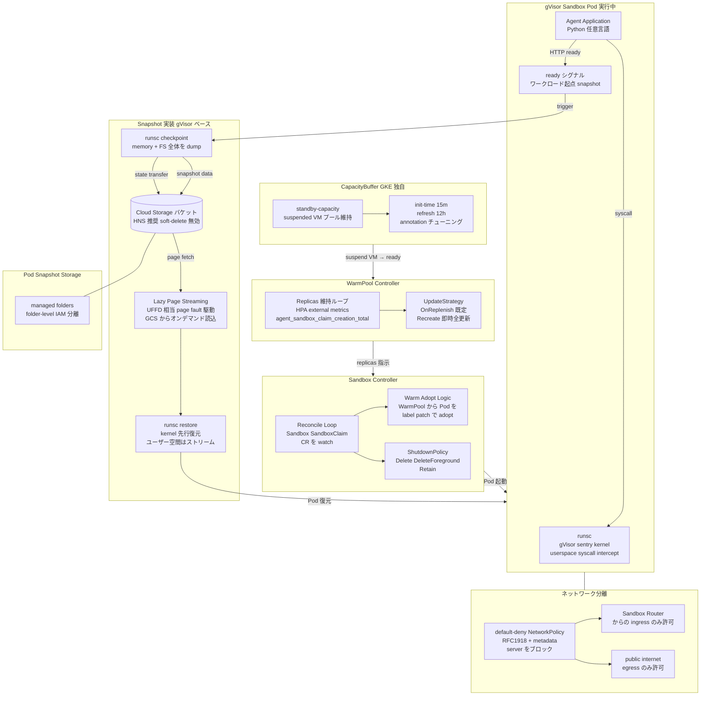
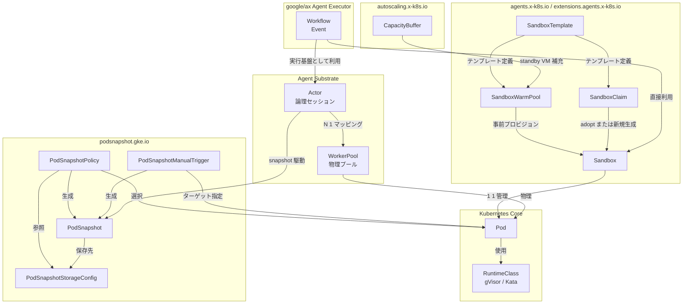
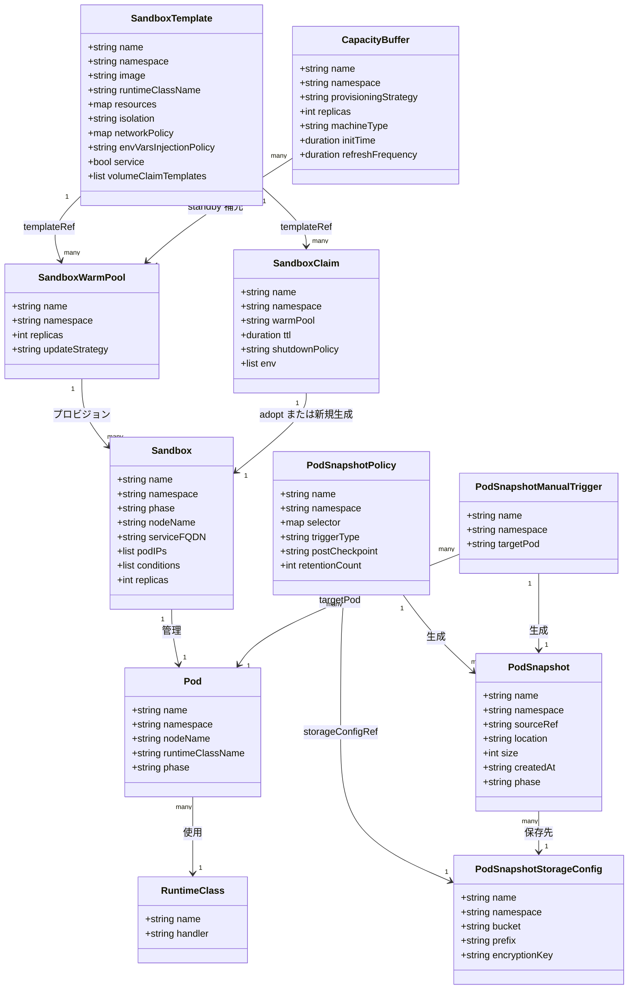

調査日: 2026-05-22 / GA: 2026-05-21 / 対象バージョン: GKE 1.35.2-gke.1269000 以降（Rapid channel）

---

## 概要

GKE Agent Sandbox は、untrusted な LLM 生成コードを Kubernetes 標準のリソースモデルで安全かつ大量に、休止再開可能に実行するための基盤です。2026-05-21、Google Cloud は GKE Agent Sandbox を GA とし、同日に **Agent Substrate**（OSS preview、133★）と **Agent Executor**（`github.com/google/ax`、OSS preview、237★）を発表しました。

プレビュー開始（2025-11、KubeCon NA 2025）から GA までの 5 か月間で、GKE 上のサンドボックス利用は 16 倍超の成長を記録しています。LangChain と Lovable が本番採用を表明しており、Google 自身の Gemini インフラも同じ gVisor 技術を基盤とします。

提供形態は OSS とマネージドの二層です。

| 層 | 名称 | 提供元 |
|---|---|---|
| OSS | `kubernetes-sigs/agent-sandbox` | Kubernetes SIG Apps |
| マネージド | GKE Agent Sandbox add-on | Google Cloud（ライフサイクル・アップグレード・セキュリティパッチを Google が管理） |


三層スタックの責務は次のとおりです。


| 層 | コンポーネント | 責務 | 形態 |
|---|---|---|---|
| ランタイム | **Agent Executor (`ax`)** | Durable Execution / Secure Isolation / Session Consistency / Connection Recovery / Trajectory Branching | OSS preview (237★) |
| オーケストレーション | **Agent Substrate** | Actor/Worker 多重化、kube-apiserver bypass、データローカリティ最適化 | OSS preview (133★) |
| 実行基盤 | **GKE Agent Sandbox** | gVisor 隔離、WarmPool、Pod Snapshot | GKE add-on GA |

---

## 特徴

### 1. gVisor デフォルトの隔離方式

Firecracker microVM ではなく gVisor（ユーザー空間カーネル）を標準の隔離方式として採用しています。Google 自身の Gemini インフラで実戦テスト済みの技術であり、コンテナとの互換性が高く軽量です。Kata Containers への `RuntimeClass` 切替でさらに強い隔離も選択できます。

- デフォルト: `runtimeClassName: gvisor`
- 拡張オプション: Kata Containers（ユーザー責任で構成）
- ネットワーク: default-deny NetworkPolicy が前提

### 2. WarmPool による 300 sandboxes/sec

`SandboxWarmPool` CRD で事前に Pod を起動・待機させておき、`SandboxClaim` リクエスト到着時に即座に払い出します。

- **300 sandboxes/sec / クラスター**、90% を **200ms 以内** で払い出し（出典: Google Cloud Blog 2026-05-21、SLA 未保証）
- HPA が外部メトリクス `agent_sandbox_claim_creation_total` を参照してプールサイズを自動調整
- `CapacityBuffer` の `provisioningStrategy: buffer.gke.io/standby-capacity` で suspended VM を低コストに補充（コールドプール）

### 3. Pod Snapshot による休止・再開

アイドル状態の sandbox を停止し、状態を Cloud Storage に保存して後から復元します。

- 保存対象: Pod のメモリとファイルシステム全体（PVC はスナップショット対象外）
- バックエンド: Cloud Storage with HNS（hierarchical namespaces）+ managed folders
- 認証: Workload Identity Federation for GKE が必須
- トリガ: `PodSnapshotManualTrigger`（手動）または `triggerConfig.type: workload`（アプリ ready シグナル）
- 復元: 新しい `SandboxClaim` 作成時に最新 snapshot を自動選択して復元

### 4. Agent Substrate の Actor/Worker 多重化

Agent Substrate は標準 Kubernetes の「Pod = 1 Agent」モデルを取らず、1 Pod 内で多数の Actor を多重化します。

- デモで **30x oversubscription**（250 actors / 8 pods）を実証（Google Cloud 公式ブログ 2026-05-21 のデモ値）
- kube-apiserver を hot path から外し、数百万単位の亜秒ツール呼び出しを捌く
- スケジューラにデータローカリティを組み込み、エージェント状態とスケジューリングを協調

### 5. 追加課金ゼロのコスト構造

Agent Sandbox add-on 自体は追加料金なしです。ユーザーが負担するのは既存 GKE のリソース料金のみです。

- ノード VM（GCE 単価）
- Cloud Storage（Pod Snapshot 保存料）
- Standby VM（CapacityBuffer 経由、warm pool 補充分）
- Axion（Arm）プロセッサ使用時は他社比 30% 優れた価格性能を主張

E2B の per-second sandbox billing や AWS Bedrock AgentCore Runtime の active CPU billing（$0.0895/vCPU-hr）とは異なり、専用のサンドボックス単価を持たない点が特徴です。

### 6. CRD の API バージョン並走

OSS Go 型実装では `v1beta1`（`agents.x-k8s.io/v1beta1`）への移行が進む一方、GKE 公式 docs と YAML サンプルには `v1alpha1` が残存しています。検証・実装時にバージョン差異の確認が必要です。

### 7. GKE 1.35+ Rapid channel が前提

| 機能 | 最小 GKE バージョン |
|---|---|
| Agent Sandbox add-on | 1.35.2-gke.1269000 |
| Pod Snapshots | 1.35.3-gke.1234000 |
| Standby Capacity Buffer | 1.35.2-gke.1842002 |
| GPU subset × Snapshot | 1.35.0-gke.1738000 |

Stable channel 運用組織では半年以上の待ちが発生します。E2 マシンタイプは Pod Snapshot 非対応のため、Autopilot のデフォルト機種選定時に注意が必要です。

### 競合比較

| 製品 | 隔離方式 | 起動速度 | 休止・再開 | 課金モデル | 既存基盤統合 |
|---|---|---|---|---|---|
| GKE Agent Sandbox | gVisor（Kata 切替可） | WarmPool 90% < 200ms / 300/sec | Pod Snapshot（memory + FS → GCS） | GKE ノード + GCS のみ | GKE / IAM / VPC / NetworkPolicy / HPA をそのまま利用 |
| AWS Bedrock AgentCore Runtime | Firecracker microVM | 未公表 | Session Storage 最大 8h / 1GB / I/O wait 中無料 | $0.0895/vCPU-hr + $0.00945/GB-hr | 7 コンポーネント一体（Memory/Gateway/Identity/Browser/Code Interpreter/Observability） |
| E2B | Firecracker microVM | p50 約 78ms | Pause/Resume API 最大 24h | $0.0504/vCPU-hr 秒単位 | Python/TS SDK、K8s 統合なし |
| Modal | コンテナ + カスタムランタイム（詳細未公開） | CPU sub-second / GPU 数秒〜 | Memory snapshot (preview) | $0.1419/physical core-hr 秒単位 | Python デコレータ |
| Cloudflare Sandbox SDK | Container + V8 Isolate | ms〜数百ms (edge) | backup/restore + Durable Object | $0.00002/vCPU-sec | Workers Bindings / 300+ 拠点 |
| Fly Machines | Firecracker microVM | sub-second | scale-to-zero + Volume | 秒単位 | REST Machines API |
| Vercel Sandbox (Beta) | Firecracker microVM | 未公表 | 限定的 | $0.128/active CPU-hr | Vercel AI SDK / v0 |

### ユースケース別推奨

| ユースケース | 推奨 | 理由 |
|---|---|---|
| 既存 GKE での本番運用 | GKE Agent Sandbox | IAM/VPC/Snapshot 統合が地続き |
| AWS / Bedrock 中心 | AWS Bedrock AgentCore Runtime | 7 コンポーネント一体で組み立てコスト低 |
| PoC / SDK 重視 | E2B / Daytona | 1 時間で end-to-end 統合 |
| エッジ低レイテンシ / TS | Cloudflare Sandbox SDK | 300+ 拠点 sub-second |
| サーバーレス GPU | Modal | GPU + Python デコレータの手触り |
| idle 課金ゼロ | SaaS 系全般 | GKE WarmPool は idle Pod + standby VM コスト発生 |
| 規制業界 / untrusted code | AWS Bedrock AgentCore | Firecracker per-session microVM |

---

## 構造

### システムコンテキスト図



#### 説明

| 要素 | 説明 |
|---|---|
| AI Agent | LLM が生成した tool-call を sandbox に送り込む実行主体 |
| Developer / SRE | CRD テンプレート・WarmPool・CapacityBuffer の設計と監視 |
| GKE Agent Sandbox 三層基盤 | Agent Sandbox + Substrate + Executor の三層一体 |
| Cloud Storage | Pod Snapshot（memory + FS）の永続化先 |
| VPC / NetworkPolicy | default-deny による sandbox の通信分離 |
| IAM / Workload Identity | Snapshot 読み書きの認証基盤（federatedP4SA） |
| GCE Node | gVisor ノードプールおよび standby VM 実体 |
| Container Registry | sandbox コンテナイメージの配布 |

### コンテナ図



#### Agent Executor (ax)

| 要素 | 説明 |
|---|---|
| ax serve | event-log を中心に agentic loop を durable に管理するメインサーバー |
| Event Log | 全 execution イベントの append-only ログ。再開・分岐の基盤 |
| ax exec / fork / trace | 実行開始・checkpoint ブランチ・trace WebUI を操作する CLI |

#### Agent Substrate

| 要素 | 説明 |
|---|---|
| ateapi | Actor/Worker ライフサイクルを管理する gRPC 制御面。kube-apiserver を hot path から外す |
| atecontroller | WorkerPool / ActorTemplate CRD を reconcile する Kubernetes controller |
| atelet | ノード単位 DaemonSet。物理 worker Pod の監督と snapshot 調整 |
| atenet | DNS + Envoy ベースの actor 名 routing + proxy sidecar |
| ateom-gvisor | sandbox Pod 内 helper。`runsc checkpoint` / `restore` を直接実行 |

#### GKE Agent Sandbox CRD 群

| 要素 | 説明 |
|---|---|
| Sandbox Controller | `Sandbox` / `SandboxClaim` のライフサイクル（作成・adopt・削除）を管理 |
| WarmPool Controller | `SandboxWarmPool` の replicas 維持。HPA と連動してスケール |
| Sandbox Router | ClusterIP Service（:8080）+ トンネリングで安定エンドポイントを提供 |

#### Pod Snapshot Controller

| 要素 | 説明 |
|---|---|
| PodSnapshotPolicy | label selector で対象 Pod を選定し、trigger / retention を設定 |
| PodSnapshotManualTrigger | 特定 Pod に対して即座に snapshot を発火 |
| PodSnapshotStorageConfig | GCS バケット・パス・認証（podKSA / federatedP4SA）を指定 |

#### CapacityBuffer Controller

| 要素 | 説明 |
|---|---|
| CapacityBuffer | `provisioningStrategy: buffer.gke.io/standby-capacity` で suspended VM プールを維持。WarmPool の補充源 |

#### RuntimeClass

| 要素 | 説明 |
|---|---|
| gVisor RuntimeClass | デフォルト。ユーザー空間カーネル（runsc）による syscall 分離 |
| Kata RuntimeClass | プラガブル選択肢。Google 非管理、ユーザー責任 |

### コンポーネント図

GKE Agent Sandbox 単体（CRD 群 + ノード側実装）をドリルダウンします。



#### 説明

| 要素 | 説明 |
|---|---|
| runsc | gVisor userspace カーネル。syscall を傍受し Linux kernel を模倣 |
| runsc checkpoint | メモリ・全 fd・CPU レジスタ・FS を GCS に dump。CRIU ではなく gVisor 独自実装 |
| Lazy Page Streaming | kernel 復元後、ユーザーメモリを page fault 駆動で GCS から読込。UFFD 相当 |
| runsc restore | gVisor kernel を先行復元 → ユーザー空間をストリームで補完。cold restore は数秒（SLA 未公表） |
| Reconcile Loop | `Sandbox` / `SandboxClaim` CR を watch し Pod ライフサイクルを管理 |
| Warm Adopt Logic | WarmPool 内 Pod の label / annotation を patch して claim に adopt。新規 Pod 起動なし |
| ShutdownPolicy | Delete / DeleteForeground / Retain。既定 Retain |
| Replicas 維持ループ | external metrics `agent_sandbox_claim_creation_total` を HPA が参照し replicas を伸縮 |
| UpdateStrategy | OnReplenish（既定）: 次の adopt 時に stale Pod を置換。Recreate: 即時全更新 |
| standby-capacity | GKE 独自拡張。suspended VM を安価に保持 |
| Cloud Storage バケット | HNS 推奨、soft-delete 無効推奨 |
| default-deny NetworkPolicy | RFC1918 + metadata server をブロック。`SandboxTemplate.spec.networkPolicy` で egress allowlist 追記 |

---

## データ

### 概念モデル



### 情報モデル



### API group / バージョン対応表

| Kind | API group | バージョン |
|---|---|---|
| Sandbox | agents.x-k8s.io | v1alpha1（GKE docs）/ v1beta1（OSS） |
| SandboxTemplate | extensions.agents.x-k8s.io | v1alpha1（GKE docs）/ v1beta1（OSS） |
| SandboxClaim | extensions.agents.x-k8s.io | v1alpha1（GKE docs）/ v1beta1（OSS） |
| SandboxWarmPool | extensions.agents.x-k8s.io | v1alpha1（GKE docs）/ v1beta1（OSS） |
| PodSnapshotStorageConfig | podsnapshot.gke.io | v1 |
| PodSnapshotPolicy | podsnapshot.gke.io | v1 |
| PodSnapshotManualTrigger | podsnapshot.gke.io | v1 |
| CapacityBuffer | autoscaling.x-k8s.io | v1beta1 |

`kubectl get crd sandboxtemplates.extensions.agents.x-k8s.io -o jsonpath='{.spec.versions[*].name}'` で served バージョンを確認してから apply してください。GKE add-on マネージド環境では現状 `v1alpha1` が served されているケースが多く、本記事の YAML サンプルは OSS 版を基準に `v1beta1` で記述しています。GKE マネージドで apply する場合は `v1alpha1` に書き換えてください。

### Sandbox.phase の遷移

`Pending` → `Running` → `Suspended`（snapshot 後） → `Running`（restore 後） → `Finished`

Conditions は `Suspended` / `Ready` / `Finished` の 3 種です。

---

:::message alert
**apiVersion 注意**: 本記事の YAML サンプルは OSS 実装基準で `extensions.agents.x-k8s.io/v1beta1` / `agents.x-k8s.io/v1beta1` で記述しています。GKE managed add-on（2026-05-22 時点）は `v1alpha1` を served しているため、apply 前に `kubectl get crd sandboxtemplates.extensions.agents.x-k8s.io -o jsonpath='{.spec.versions[*].name}'` で served バージョンを必ず確認し、必要に応じて `v1alpha1` に書き換えてください。
:::

## 構築方法

### 前提条件

- GKE バージョン: **1.35.2-gke.1269000 以降**（Rapid channel）
- gcloud CLI に `beta` コンポーネントがインストール済み
- 対応マシンシリーズ（E2 は非対応）のノードを使用
- Autopilot の場合は追加ノードプール作成不要

環境変数を事前に設定しておきます。

```bash
export PROJECT_ID=YOUR_PROJECT_ID
export CLUSTER_NAME=agent-sandbox-cluster
export LOCATION=us-central1
export CLUSTER_VERSION=1.35.2-gke.1269000
export NODE_POOL_NAME=gvisor-pool
export MACHINE_TYPE=n2-standard-4
```

### 必須パラメータ

| パラメータ | 値 / 選択肢 | 備考 |
|---|---|---|
| `runtimeClassName` | `gvisor` / `kata-qemu` | Pod Snapshots は `gvisor` 必須 |
| 対応マシンシリーズ | N2, N4, C3, C3D, N2D, Axion (C4A) | gVisor 対応系 |
| 非対応マシンシリーズ | **E2** | Pod Snapshots / Agent Sandbox 非対応 |
| GKE バージョン | 1.35.2-gke.1269000 以降 | Rapid channel 推奨 |
| gcloud surface | `gcloud beta container` | GA 直後も beta surface を使用 |

### クラスタ作成（Autopilot）

```bash
gcloud beta container clusters create-auto ${CLUSTER_NAME} \
  --location=${LOCATION} \
  --cluster-version=${CLUSTER_VERSION} \
  --enable-agent-sandbox
```

### クラスタ作成（Standard）

```bash
# Step 1: クラスタ作成
gcloud beta container clusters create ${CLUSTER_NAME} \
  --location=${LOCATION} \
  --num-nodes=1 \
  --cluster-version=${CLUSTER_VERSION}

# Step 2: gVisor 対応ノードプールを追加
gcloud container node-pools create ${NODE_POOL_NAME} \
  --cluster=${CLUSTER_NAME} \
  --machine-type=${MACHINE_TYPE} \
  --location=${LOCATION} \
  --num-nodes=1 \
  --image-type=cos_containerd \
  --sandbox=type=gvisor

# Step 3: Agent Sandbox アドオン有効化
gcloud beta container clusters update ${CLUSTER_NAME} \
  --location=${LOCATION} \
  --enable-agent-sandbox
```

### 既存クラスタへの有効化

```bash
gcloud beta container clusters update ${CLUSTER_NAME} \
  --location=${LOCATION} \
  --enable-agent-sandbox
```

### バージョン確認

```bash
gcloud container clusters describe ${CLUSTER_NAME} \
  --location=${LOCATION} \
  --format="value(currentMasterVersion, addonsConfig.agentSandboxConfig.enabled)"
```

`True` が返れば Agent Sandbox が有効です。

### gVisor RuntimeClass 確認

```bash
kubectl get runtimeclass
kubectl get crd | grep agents.x-k8s.io
```

期待出力:

```
NAME         HANDLER   AGE
gvisor       runsc     5m

sandboxclaims.extensions.agents.x-k8s.io
sandboxtemplates.extensions.agents.x-k8s.io
sandboxwarmpools.extensions.agents.x-k8s.io
sandboxes.agents.x-k8s.io
```

---

## 利用方法

### SandboxTemplate 作成

```yaml
apiVersion: extensions.agents.x-k8s.io/v1beta1
kind: SandboxTemplate
metadata:
  name: python-runtime-template
  namespace: default
spec:
  podTemplate:
    metadata:
      labels:
        sandbox: python-sandbox-example
    spec:
      runtimeClassName: gvisor
      automountServiceAccountToken: false
      securityContext:
        runAsNonRoot: true
      nodeSelector:
        sandbox.gke.io/runtime: gvisor
      tolerations:
      - key: "sandbox.gke.io/runtime"
        value: "gvisor"
        effect: "NoSchedule"
      containers:
      - name: python-runtime
        image: registry.k8s.io/agent-sandbox/python-runtime-sandbox:v0.1.0
        ports:
        - containerPort: 8888
        readinessProbe:
          httpGet:
            path: "/"
            port: 8888
        resources:
          requests:
            cpu: "250m"
            memory: "512Mi"
          limits:
            cpu: "500m"
            memory: "1Gi"
        securityContext:
          capabilities:
            drop: ["ALL"]
      restartPolicy: "OnFailure"
```

**Pod の禁止事項**: `hostNetwork`, `hostPID`, `hostIPC`, `privileged`, HostPath volumes, `hostPort`, capabilities 追加, カスタム `sysctls`。

### SandboxClaim による Sandbox 払い出し

```yaml
apiVersion: extensions.agents.x-k8s.io/v1beta1
kind: SandboxClaim
metadata:
  name: my-sandbox-claim
  namespace: default
spec:
  sandboxTemplateRef:
    name: python-runtime-template
  lifecycle:
    shutdownPolicy: DeleteForeground
  warmpool: default
  env:
  - name: USER_SESSION
    value: "abc123"
```

```bash
kubectl get sandboxclaim my-sandbox-claim -n default -o yaml
kubectl get sandbox -n default
```

### SandboxWarmPool 設定

```yaml
apiVersion: extensions.agents.x-k8s.io/v1beta1
kind: SandboxWarmPool
metadata:
  name: python-sdk-warmpool
  namespace: default
spec:
  replicas: 10
  sandboxTemplateRef:
    name: python-runtime-template
  updateStrategy:
    type: OnReplenish
```

HPA による自動スケール:

```bash
kubectl autoscale sandboxwarmpool python-sdk-warmpool \
  --min=5 --max=50 --cpu-percent=60
```

### PodSnapshotStorageConfig と PodSnapshotPolicy

```bash
gcloud storage buckets create gs://agent-sandbox-snapshots-${PROJECT_ID} \
  --location=${LOCATION} \
  --enable-hierarchical-namespace \
  --uniform-bucket-level-access \
  --soft-delete-duration=0d
```

`--enable-hierarchical-namespace` でスループット向上を有効化します。Snapshot 書き込みには `roles/storage.objectAdmin` 相当（または write 権限を含む custom role）が必要です。Workload Identity Federation 経由で sandbox の KSA にバインドしてください。

```yaml
apiVersion: podsnapshot.gke.io/v1
kind: PodSnapshotStorageConfig
metadata:
  name: cpu-pssc-gcs
  namespace: default
spec:
  snapshotStorageConfig:
    gcs:
      bucket: "agent-sandbox-snapshots-${PROJECT_ID}"
      path: "my-snapshots"
---
apiVersion: podsnapshot.gke.io/v1
kind: PodSnapshotPolicy
metadata:
  name: cpu-psp
  namespace: default
spec:
  storageConfigName: cpu-pssc-gcs
  selector:
    matchLabels:
      sandbox: python-sandbox-example
  triggerConfig:
    type: manual
    postCheckpoint: resume
```

### PodSnapshotManualTrigger による手動スナップショット

```yaml
apiVersion: podsnapshot.gke.io/v1
kind: PodSnapshotManualTrigger
metadata:
  name: cpu-snapshot-trigger
  namespace: default
spec:
  targetPod: python-sandbox-example-abc123  # 実 Pod 名を指定する（label `sandbox: python-sandbox-example` から `kubectl get pods -l sandbox=python-sandbox-example` で取得）
```

### CapacityBuffer 設定

```yaml
apiVersion: autoscaling.x-k8s.io/v1beta1
kind: CapacityBuffer
metadata:
  name: customized-standby-buffer
  namespace: default
  annotations:
    buffer.gke.io/standby-capacity-init-time: "15m"
    buffer.gke.io/standby-capacity-refresh-frequency: "12h"
spec:
  podTemplateRef:
    name: buffer-unit-template
  replicas: 3
  provisioningStrategy: "buffer.gke.io/standby-capacity"
```

| 値 | 内容 |
|---|---|
| `buffer.x-k8s.io/active-capacity` | 起動済み VM を保持するアクティブバッファ（upstream 標準） |
| `buffer.gke.io/standby-capacity` | **GKE 独自**。suspended VM を保持。低コストで容量確保 |

### kubectl 状態確認

```bash
kubectl get crd | grep agents.x-k8s.io
kubectl get runtimeclass
kubectl get sandboxtemplate -A
kubectl get sandboxwarmpool -A
kubectl get sandbox -A
kubectl get sandboxclaim -A
kubectl describe sandbox <sandbox-name> -n <namespace>
kubectl get podsnapshot -A
```

---

## 運用

### Sandbox 状態確認

```bash
kubectl get sandbox -n <namespace>
kubectl describe sandbox <name> -n <namespace>
kubectl wait --for=condition=Ready sandbox <name> -n <namespace> --timeout=120s
```

| Condition | True の意味 |
|---|---|
| `Ready` | Pod が Running かつ readinessProbe 通過 |
| `Suspended` | replicas=0 で Pod が停止中（PVC は保持） |
| `Finished` | shutdownPolicy に従い終了処理完了 |

### WarmPool 監視

```bash
watch -n 5 "kubectl get sandboxwarmpool -n <namespace> \
  -o custom-columns=NAME:.metadata.name,REPLICAS:.spec.replicas,READY:.status.readyReplicas"

kubectl describe hpa <hpa-name> -n <namespace>
```

WarmPool 枯渇アラート: `readyReplicas < spec.replicas * 0.3` を条件に Cloud Monitoring カスタムメトリクスアラートを設定します。

### スナップショット運用

手動スナップショット（会話ターン境界・セッション境界で実行）:

```bash
kubectl apply -f - <<EOF
apiVersion: podsnapshot.gke.io/v1
kind: PodSnapshotManualTrigger
metadata:
  name: session-end-snapshot-$(date +%s)
  namespace: <namespace>
spec:
  targetPod: <sandbox-pod-name>
EOF
```

復元:

```bash
kubectl delete pod <sandbox-pod-name> -n <namespace>
kubectl wait --for=condition=Ready pod/<new-pod-name> -n <namespace> --timeout=60s
```

GCS ライフサイクル管理:

```bash
gsutil lifecycle set lifecycle.json gs://<snapshot-bucket>
```

```json
{
  "lifecycle": {
    "rule": [
      {
        "action": {"type": "Delete"},
        "condition": {"age": 30}
      }
    ]
  }
}
```

### Sandbox の停止・削除

```bash
# 一時停止（replicas=0、PVC 保持）
kubectl patch sandbox <name> -n <namespace> \
  --type='merge' -p '{"spec":{"replicas":0}}'

# 再開
kubectl patch sandbox <name> -n <namespace> \
  --type='merge' -p '{"spec":{"replicas":1}}'

# 完全削除
kubectl delete sandbox <name> -n <namespace>
```

### GKE バージョン更新

```bash
gcloud container clusters update <cluster-name> \
  --location=<location> \
  --release-channel=rapid

gcloud container clusters upgrade <cluster-name> \
  --location=<location> --master

gcloud container node-pools upgrade <pool-name> \
  --cluster=<cluster-name> --location=<location>
```

更新前チェックリスト:

- gVisor issue #11064（stdout stuck）のパッチ適用状況を `runsc --version` で確認
- CVE-2025-2713 対応バージョン（patch commit `586c38d7` 以降）の確認
- Agent Sandbox CRD バージョン（v1alpha1 / v1beta1）の served 状況を `kubectl get crd | grep agents.x-k8s.io` で確認

### ログ確認

```bash
gcloud logging read \
  'resource.type="k8s_container" AND resource.labels.container_name="agent-sandbox-controller"' \
  --limit=50 --format=json

kubectl get events -n <namespace> \
  --field-selector=reason=PodSnapshotTaken \
  --sort-by='.lastTimestamp'

gcloud logging read \
  'logName="projects/<project>/logs/cloudaudit.googleapis.com%2Factivity" \
   AND protoPayload.resourceName=~"sandboxclaims"' \
  --limit=20
```

### コスト監視

| 軸 | 内容 | 監視方法 |
|---|---|---|
| **VM コスト** | gVisor ノードプールの instance time | Cloud Billing でラベル `gke-nodepool=<gvisor-pool>` でフィルタ |
| **Standby VM コスト** | CapacityBuffer の suspended VM | Billing エクスポートで `product.type="Compute Engine"` かつ instance-state=suspended |
| **GCS コスト** | Snapshot 保存・読み出し | Storage バケットの Billing alert + lifecycle ルール |

```bash
gsutil du -sh gs://<snapshot-bucket>
```

---

## ベストプラクティス

### WarmPool サイジング

- 目標: `readyReplicas / spec.replicas >= 0.7` を常時維持
- `min-replicas` は「1 分あたりの最大セッション開始数 × 平均セッション長（分）」で算出
- HPA による自動スケールと CapacityBuffer（suspended VM）を組み合わせて hot/cold 2 層に分離

```yaml
apiVersion: autoscaling/v2
kind: HorizontalPodAutoscaler
metadata:
  name: warmpool-hpa
  namespace: <namespace>
spec:
  scaleTargetRef:
    apiVersion: extensions.agents.x-k8s.io/v1beta1
    kind: SandboxWarmPool
    name: <pool-name>
  minReplicas: 10
  maxReplicas: 100
  metrics:
  - type: External
    external:
      metric:
        name: custom.googleapis.com|agent_sandbox_claim_creation_total
      target:
        type: AverageValue
        averageValue: "5"
```

`agent_sandbox_claim_creation_total` を Cloud Monitoring の external metrics として参照します。CPU ベース HPA でも動作しますが、Claim 払い出し速度に直結する external metrics を使うほうが本来の用途に合います。

- Spot/Preemptible VM を WarmPool に混ぜない（preempt のたびに cold restore が必要になる）
- machine series は 1 種類に統一（restore 時の machine series 一致が必須）

### Snapshot 戦略

- セッション境界・会話ターン境界で手動 trigger
- LLM streaming response 保持中にスナップショットを取らない（gVisor issue #11064）
- in-memory な外部接続（gRPC stream・DB session・TLS）はアプリ層で再確立ロジックを実装
- `triggerConfig.postCheckpoint: stop` で checkpoint 後に Pod 停止 → WarmPool に戻す運用

### machine type 選定

| machine series | Snapshot 対応 | 用途 |
|---|---|---|
| **N2 / N2D** | ○ | 汎用 CPU。Snapshot 公式チュートリアル使用 |
| **C3** | ○ | 計算集約型。gVisor 最適化済み |
| **N4 / C4A (Axion)** | ○ | 最新世代。price-performance 最良 |
| **E2** | **× 非対応** | Autopilot 既定。Custom ComputeClass で明示回避 |
| **A2 / A3 (GPU)** | ○（1.35.0-gke.1738000+ で subset 可） | GPU ワークロード |

Autopilot で E2 を回避する Custom ComputeClass:

```yaml
apiVersion: cloud.google.com/v1
kind: ComputeClass
metadata:
  name: sandbox-compute-class
spec:
  priorities:
  - machineFamily: n2
  - machineFamily: c3
```

### gVisor 互換性 CI

| syscall / 機能 | gVisor 対応 | 代替策 |
|---|---|---|
| `io_uring` | 未サポート | epoll / aio ベースの fallback |
| `pidfd` 系 | 部分サポート（issue #13170-#13178） | SIGCHLD + waitpid |
| `mount_setattr` | 未実装 | overlay mount の代替構成 |
| `getrandom(GRND_INSECURE)` | 未実装 | `/dev/urandom` 直接使用 |
| `CLONE_CLEAR_SIGHAND` | 未実装 | fork 後 signal mask 手動クリア |

```bash
strace -c -e trace=all python -c "import <new_library>; <basic_test>"
docker run --runtime=runsc <your-image> python -c "import <new_library>"
```

### CRD バージョン差異吸収

- 新規マニフェストは `v1beta1` で記述
- 既存 v1alpha1 YAML は conversion webhook で透過的に変換される
- CI/CD パイプラインで `apiVersion` の grep チェックを入れ、v1alpha1 を誤投入しないように保護

### セキュリティ層分離

GKE Agent Sandbox の kernel-level isolation は防御の 1 レイヤにすぎません。

| レイヤ | 内容 |
|---|---|
| レイヤ4 | intent-level 検査（behavioral detection、OPA、custom admission webhook、runtime 監視） |
| レイヤ3 | network perimeter（VPC Service Controls） |
| レイヤ2 | IAM / Workload Identity（最小権限） |
| レイヤ1 | GKE Agent Sandbox（syscall 隔離、gVisor） |

エージェントが「正当な HTTPS で BigQuery にアクセスして大量データを exfiltrate」するケースは gVisor で止まりません。VPC Service Controls の perimeter を必ず設定し、metadata server・内部 RFC1918 アドレスへの egress を NetworkPolicy でブロックします。

### IAM / Workload Identity 統合

```bash
gcloud iam service-accounts create agent-sandbox-sa --project=<project-id>

gcloud projects add-iam-policy-binding <project-id> \
  --member="serviceAccount:agent-sandbox-sa@<project-id>.iam.gserviceaccount.com" \
  --role="roles/storage.objectViewer"  # 読み取り権限のみ。Snapshot 書き込みが必要な KSA には objectAdmin 相当を別途付与

gcloud iam service-accounts add-iam-policy-binding \
  agent-sandbox-sa@<project-id>.iam.gserviceaccount.com \
  --role="roles/iam.workloadIdentityUser" \
  --member="serviceAccount:<project-id>.svc.id.goog[<namespace>/agent-ksa]"
```

`automountServiceAccountToken: false` を必須設定とし、Workload Identity Federation を使う Pod のみに KSA をアノテーション付与します。

---

## トラブルシューティング

| 症状 | 原因 | 対処 |
|---|---|---|
| restore 失敗（`Machine series mismatch`） | Snapshot 取得ノードと restore ノードの machine series / architecture が異なる | 同一 machine series のノードプールに固定。Autopilot では Custom ComputeClass で E2 除外 |
| Snapshot 後に stdout が詰まる | gVisor issue #11064: stdout 書込中の goroutine が restore 後 stuck | LLM streaming response や journal 系プロセスが書込中にスナップショットを取らない。`postCheckpoint: stop` で Pod 停止後に snapshot |
| `io_uring` / `pidfd` 系 syscall エラー | gVisor 未対応 syscall | 互換性マップ確認 → epoll / aio fallback 有効バージョンに固定 |
| `systemd` 関連の warning / error | `mount_setattr`, `getrandom(GRND_INSECURE)`, `CLONE_CLEAR_SIGHAND` 等 gVisor 未実装（issue #13170-#13178） | distroless / alpine ベースに変更、または systemd 依存を除去 |
| E2 マシンで snapshot 不可 | E2 は Pod Snapshot 非対応 | Custom ComputeClass で N2 / C3 / N4 に誘導。Standard では `--machine-type=n2-standard-4` 等を明示 |
| WarmPool 枯渇（SandboxClaim タイムアウト） | `min-replicas` が p99 バーストに不足。SKU 在庫不足 | HPA の `minReplicas` を増やす。別 zone / region にノードプール追加 |
| GCS 課金が想定外 | lazy streaming で restore ごとに全ページ read。snapshot 蓄積でサイズ膨張 | ライフサイクルポリシーで古い snapshot を削除。`gsutil du -sh` で使用量確認 |
| CVE-2025-2713 未対応 | runsc が patch commit `586c38d7` 未満 | `runsc --version` で確認。Rapid channel でパッチ適用済みバージョンへ更新 |
| EROFS dentry cache が膨張して OOM | gVisor issue #13195: 150 万ファイル規模で dentry cache が 2.3GB まで unbounded 増大 | `--dcache` フラグで per-mount キャッシュサイズ制限。WarmPool Pod を定期再作成 |
| gVisor ノードプールが Pending のまま | `runtimeClassName: gvisor` 指定だが gVisor ノードプール不在 / taint 不一致 | `kubectl get runtimeclass gvisor` で RuntimeClass 確認。Pod に `nodeSelector` と `tolerations` を追加 |
| Substrate の Actor が activate されない | Agent Substrate は "VERY early development"（破壊的変更予定） | 本番利用不可。GKE Agent Sandbox (GA) を使用する |

---

## まとめ

GKE Agent Sandbox は、untrusted な LLM 生成コードを Kubernetes 標準のリソースモデルで安全・大量・休止再開可能に動かす実行基盤として GA しました。gVisor デフォルトの隔離方式、WarmPool による 300 sandboxes/sec 払い出し、`runsc checkpoint/restore` ベースの Pod Snapshot を CRD で組み合わせる設計が特徴で、既存 GKE 顧客であれば IAM・VPC・NetworkPolicy・HPA の運用知見をそのまま転用できます。一方で gVisor の syscall 制約、E2 マシン非対応、Rapid channel 必須など運用上の落とし穴も並走するため、競合（AWS Bedrock AgentCore Runtime / E2B / Cloudflare Sandbox SDK）との比較とセキュリティ層の分離設計を踏まえた採用判断が重要です。

この記事が少しでも参考になった、あるいは改善点などがあれば、ぜひリアクションやコメント、SNSでのシェアをいただけると励みになります！

## 参考リンク

### 公式ドキュメント

- [About GKE Agent Sandbox](https://cloud.google.com/kubernetes-engine/docs/concepts/machine-learning/agent-sandbox)
- [Isolate AI code execution with Agent Sandbox](https://cloud.google.com/kubernetes-engine/docs/how-to/agent-sandbox)
- [Enable Agent Sandbox on GKE](https://cloud.google.com/kubernetes-engine/docs/how-to/how-install-agent-sandbox)
- [Save and restore with Pod snapshots](https://cloud.google.com/kubernetes-engine/docs/how-to/agent-sandbox-pod-snapshots)
- [About GKE Pod snapshots](https://cloud.google.com/kubernetes-engine/docs/concepts/pod-snapshots)
- [Pod snapshot CRDs reference](https://cloud.google.com/kubernetes-engine/docs/reference/crds/podsnapshot)
- [CapacityBuffer CRD reference](https://cloud.google.com/kubernetes-engine/docs/reference/crds/capacitybuffer)
- [Configure capacity buffers](https://cloud.google.com/kubernetes-engine/docs/how-to/configure-capacity-buffer)
- [Agent Sandbox CRDs reference](https://cloud.google.com/kubernetes-engine/docs/reference/crds/agentsandbox)
- [GKE Audit logging](https://cloud.google.com/kubernetes-engine/docs/how-to/audit-logging)
- [GKE Release notes (Rapid)](https://cloud.google.com/kubernetes-engine/docs/release-notes-rapid)

### Google Cloud Blog

- [Bringing you Agent Sandbox on GKE and Agent Substrate (GA 2026-05-21)](https://cloud.google.com/blog/products/containers-kubernetes/bringing-you-agent-sandbox-on-gke-and-agent-substrate/)
- [Agent Executor: Google's distributed agent runtime](https://cloud.google.com/blog/products/ai-machine-learning/agent-executor-googles-distributed-agent-runtime)
- [Agentic AI on Kubernetes and GKE](https://cloud.google.com/blog/products/containers-kubernetes/agentic-ai-on-kubernetes-and-gke)

### OSS

- [kubernetes-sigs/agent-sandbox](https://github.com/kubernetes-sigs/agent-sandbox)
- [hpa-swp-scaling example](https://github.com/kubernetes-sigs/agent-sandbox/tree/main/examples/hpa-swp-scaling)
- [agent-substrate/substrate](https://github.com/agent-substrate/substrate)
- [google/ax (Agent Executor)](https://github.com/google/ax)
- [google/gvisor](https://github.com/google/gvisor)

### 解説記事・実機検証

- [Google Announces GKE Agent Sandbox and Hypercluster at Next '26 — InfoQ](https://www.infoq.com/news/2026/05/gke-agent-sandbox-hypercluster/)
- [Agent Sandbox on Kubernetes: how it works and how to run it in production — Northflank](https://northflank.com/blog/agent-sandbox-on-kubernetes)
- [Cold Starts Are Costing You: Fix Them with GKE Pod Snapshots — Medium](https://medium.com/google-cloud/cold-starts-are-costing-you-fix-them-with-gke-pod-snapshots-733d4c1808c9)
- [GKE Pod Snapshots Cut Startup Times for Heavy Workloads — Medium](https://medium.com/@simardeep.oberoi/gke-pod-snapshots-cut-startup-times-for-heavy-workloads-d8eee7494d96)
- [Deploying Secure AI Agents on GKE — Google Codelabs](https://codelabs.developers.google.com/codelabs/gke/ai-agents-on-gke)
- [Code Generation Agent on GKE — Google Codelabs Next '26](https://codelabs.developers.google.com/next26/code-generation-agent-gke)

### セキュリティ・反証

- [Securing AI Agents on GKE: Where gVisor, Workload Identity, and VPC SC Stop Working — ARMO](https://www.armosec.io/blog/sandboxing-ai-agents-gke-workload-identity/)
- [AI Agent Security Framework on GKE — ARMO](https://www.armosec.io/blog/implement-ai-agent-security-framework-gke/)
- [CVE-2025-2713 (GitHub Advisory)](https://github.com/advisories/GHSA-4fj4-9m67-3mj3)
- [CVE-2025-2713 — Wiz vulnerability DB](https://www.wiz.io/vulnerability-database/cve/cve-2025-2713)
- [gVisor issue #11064: checkpoint restored guest process stuck](https://github.com/google/gvisor/issues/11064)

### gVisor リファレンス

- [gVisor Performance Guide](https://gvisor.dev/docs/architecture_guide/performance/)
- [gVisor Applications Compatibility](https://gvisor.dev/docs/user_guide/compatibility/)
- [gVisor Linux/amd64 syscall map](https://gvisor.dev/docs/user_guide/compatibility/linux/amd64/)
- [gVisor Filesystem (dcache フラグ)](https://gvisor.dev/docs/user_guide/filesystem/)
