Google Cloud が 2026-07-14 に OSS 公開した **k8s-aibom** の技術調査です。稼働中の Kubernetes クラスタから AI 資産を自動発見し、runtime の ML-BOM (Machine Learning Bill of Materials) を生成するコントローラを、構造・データ・構築・利用・運用の観点で整理します。

- 対象リポジトリ: https://github.com/GoogleCloudPlatform/k8s-aibom (Apache 2.0)
- 公式発表: https://cloud.google.com/blog/products/identity-security/introducing-k8s-aibom-on-gke-for-automated-ai-bills-of-materials/
- ステータス: v1.0 alpha (安定 API を v1.x 系で維持)

## ■概要

### k8s-aibom とは

- **k8s-aibom** (Kubernetes AI Bill of Materials) は Google Cloud が 2026-07-14 に公開した OSS です。
- ライセンスは Apache 2.0 です。
- ステータスは **v1.0 alpha** です。安定 API を v1.x 系で維持する方針です。非クリティカルな観測用途では production 利用可能です。
- 位置づけは **軽量・非特権の Kubernetes コントローラ** です。
- 実行中の AI ワークロードを継続監視し、runtime の ML-BOM を自動生成します。
- 公式サポート対象外です (Not an officially supported Google product)。

### なぜ生まれたか

- 課題は **Shadow AI** です。開発者が形式的な登録なしにデプロイする AI ワークロードが、既存のセキュリティスキャナーから漏れます。
- 組織は開発速度を落としたくありません。同時に、特権 DaemonSet・カーネルレベルアクセス・Pod spec 改変を要求するツールの導入には躊躇します。
- 公式 blog はこの膠着状態を「デッドロック」と呼び、k8s-aibom をそれを break するものと位置づけています。

### build-time SBOM と runtime BOM の違い

- **build-time AIBOM ツール** は、静止したアーティファクト (コンテナイメージ・モデルファイル・パッケージマニフェスト) から BOM を生成します。
- build-time BOM が記述するのは「デプロイされる予定だった構成」、つまり **意図** です。
- 一方 k8s-aibom は、稼働中クラスタの観測から BOM を生成します。
- runtime BOM が記述するのは「今実際に serving・学習している実体」、つまり **事実** です。
- README の記述: "Build-time AI bill-of-materials tools describe what was intended to be deployed. Runtime tools describe what is in fact serving inference." (公式 blog も同趣旨を別の言い回しで述べています)
- 両者は代替関係ではなく補完関係です。意図と実態の両方を突き合わせて初めて、乖離 (未申告デプロイ・設定ドリフト) を検知できます。

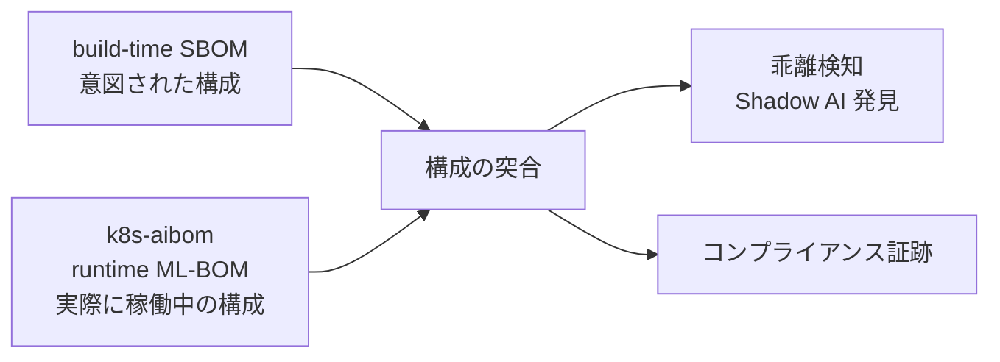

### GKE / 全社 AI 統制における位置づけ

- 想定利用者は **コンプライアンスレビュアー・SecOps・プラットフォームエンジニア** です。
- 公式 blog は既存ツールの限界をこう指摘します。"Few, if any, of these tools help compliance reviewers, security operations teams, and platform engineers understand what is running right now, what is it connected to, and how can we verify those assertions."
- k8s-aibom は **CISO の可視性要件** と **SRE のクラスタ安定性要件** を同時に満たす設計です。
- 開発者フリクションはゼロを志向します。sidecar なし、eBPF カーネルモジュールなし、特権 DaemonSet なし、既存 Pod spec の改変なしです。
- クラウド中立です。GKE 上で公式に紹介されていますが、実装は特定クラウドに依存しません。GCS sink は Google Cloud 固有ですが、Webhook sink や CR status sink はクラウド非依存です。
- エコシステム上の位置づけは、OWASP CycloneDX を出力スキーマとして採用し、将来的に OpenSSF GUAC のメタデータグラフへの取り込み (v1.1 ロードマップ) と Sigstore 署名検証を予定します。単体の台帳ではなく、より大きな AI 資産グラフへの **データ供給源** として設計されています。


## ■特徴

- **非特権・単一 Deployment**
  - `k8s-aibom-system` namespace 内の 1 つの Deployment のみで動作します。
  - sidecar・eBPF カーネルモジュール・特権 DaemonSet・pod spec 改変・CI/CD 改変を一切要求しません。
  - namespace 単位の opt-in ラベルを付けたワークロードだけを対象にします。

- **conservative-detection (保守的検出)**
  - false positive (誤検出) より unresolved (未解決フラグ) を優先する設計方針です。
  - 確信を持てない値は `unresolved` として明示し、レビュー対象としてフラグを立てます。
  - README は unit / envtest / 実クラスタ smoke の 3 層にわたり 316 件のテストを整備していると述べています。

- **CycloneDX 1.6 ML-BOM 準拠**
  - OWASP CycloneDX 1.6 の ML-BOM フォーマットで BOM を生成します。
  - ベンダー独自形式ではなく標準フォーマットのため、他ツール・他組織との相互運用性があります。

- **決定性 (byte-identical BOM)**
  - 同一のクラスタ入力からは、timestamp を除いて byte-identical な ML-BOM を生成します。
  - Kubernetes クラスタ状態を純粋関数の入力として扱う設計です。
  - content-addressable な扱い・diff・変更検知に向いています。GitOps との親和性が高い特性です。

- **クラウド中立**
  - Kubernetes 1.27 以上 (1.27〜1.35 でテスト済み、1.23 まで動作見込み) であれば、GKE 以外でも動作します。
  - GCS sink 以外に、クラウド非依存の Webhook sink・CR status sink を持ちます。

- **confidence + evidence モデル**
  - BOM の各コンポーネントに confidence flag と evidence locator (根拠の所在) を付与します。
  - `declared` (workload spec に明示。例: `--model` 引数、`HF_MODEL_ID` env、`model.k8saibom.dev/name` annotation)。
  - `inferred` (ヒューリスティック由来。例: image が `^vllm/.*` に一致)。
  - `unresolved` (確信を持って値を決められない。例: 未 pull の image digest)。
  - v1.1 で `verified` (Sigstore/OMS 署名 + 有効な Rekor entry) を追加予定です。v1.0 時点では検証インタフェースのみ存在し、実装は `NoopVerifier` です。

- **コンプライアンス証跡の自動生成**
  - EU AI Act の Article 12 (logging/traceability) と Article 50 (transparency) に対応する技術的証跡を出します。
  - NIST AI RMF の Govern/Map/Measure/Manage の各機能に資産可視化データを提供します。
  - ISO/IEC 42001 (AI マネジメントシステム) の資産・ライフサイクル管理を裏付けます。
  - あくまで **証跡を出す** ツールであり、認証・認定そのものを行うものではありません。

- **監査グレードのセキュリティモデル**
  - sink へ書き込む identity はコントローラのみです。専用 Service Account は最小権限 (`roles/storage.objectCreator` 等) に限定されます。
  - GCS sink は `DoesNotExist` precondition により、同一 path への 2 回目の書き込みを設計上失敗させます。書き込み後の改ざん・上書きを防ぐ不変性設計です。
  - webhook 認証情報はコントローラ namespace の Secret からのみ参照し、workload pod からは読めません。

### 関連技術との比較

#### build-time AIBOM ツール vs k8s-aibom (runtime controller)

| 観点 | build-time AIBOM ツール | k8s-aibom (runtime) |
|---|---|---|
| 入力元 | 静止アーティファクト (コンテナイメージ・モデルファイル・パッケージマニフェスト) | 稼働中クラスタの観測 (workload spec + pod status) |
| 記述対象 | デプロイされる予定だった構成 (意図) | 実際に稼働中の構成 (事実) |
| 生成タイミング | CI/CD パイプライン時点、1 回限りのスナップショット | reconcile loop による継続生成 |
| 検出できないもの | 実行時の設定上書き・動的モデルロード・未申告デプロイ (Shadow AI) | ビルド前の依存関係・未デプロイ状態の脆弱性 |
| 出力形式 | ツールごとにベンダー独自形式が多い | OWASP CycloneDX 1.6 ML-BOM 準拠 |
| 技術的根拠 | アーティファクトスキャン方式。デプロイ前の静的解析が前提 | Kubernetes API 経由のライブ観測が前提。README: "Runtime tools describe what is in fact serving inference." |

#### eBPF / sidecar 方式 vs k8s-aibom (単一 Deployment)

| 観点 | eBPF エージェント (特権 DaemonSet) | sidecar 方式 | k8s-aibom (単一 Deployment) |
|---|---|---|---|
| 実行方式 | 全ノードにカーネルレベルで常駐する特権 DaemonSet | 各 Pod にコンテナを追加注入 | namespace opt-in のみ。K8s API を監視する単一 Deployment 1 個 |
| 特権要否 | 必要 (カーネルアクセス相当の権限) | 不要だが pod spec 改変が必須 | 不要。K8s API の read 権限のみ |
| pod spec 改変 | 不要 | 必須 (サイドカー注入) | 不要 |
| リソース消費の目安 | ノードあたり数百 MB RAM + 0.1〜0.3 vCPU 規模 (一般的な eBPF observability の目安、k8s-aibom 固有値ではない) | Pod ごとに追加オーバーヘッド (一般的な監視 sidecar の目安、k8s-aibom 固有値ではない) | コントローラ全体で常時 ~15m CPU / ~85Mi memory (k8s-aibom 実測値) |
| 検出タイミング | リアルタイム (パケット/syscall レベル) | リアルタイム (プロキシ層) | reconcile 単位。1 reconcile は低 single-digit ms |
| 開発者への影響 | pod spec 改変不要、ただしノード特権が必要 | pod spec 改変・注入が必須 | pod spec 改変不要、CI/CD 改変不要 |

- 表中の eBPF / sidecar のリソース消費値は、一般的な Kubernetes observability 事例からの目安であり、一次情報として記載があるのは k8s-aibom 側の固有値 (~15m CPU / ~85Mi memory) のみです。
- k8s-aibom は v2 ロードマップで eBPF scraper の追加を予定しています。v1.0 では検出精度より操作性・安全性 (非特権) を優先した設計判断です。

## ■構造

k8s-aibom の内部アーキテクチャを C4 model の 3 段階で図解します。

### ●システムコンテキスト図

k8s-aibom controller と、周辺のアクター・外部システムとの関係です。

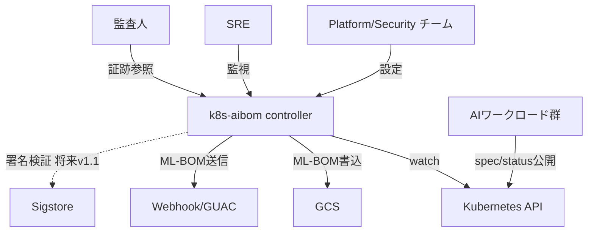

| 要素名 | 説明 |
|---|---|
| Platform/Security チーム | namespace opt-inラベルとAIBOMControllerConfigを設定するアクターです |
| SRE | controllerの稼働状況とメトリクスを監視するアクターです |
| 監査人 | 生成されたML-BOMをコンプライアンス証跡として参照するアクターです |
| k8s-aibom controller | 実行中のAIワークロードを監視しruntimeのML-BOMを自動生成する軽量・非特権controllerです |
| Kubernetes API | ワークロードのspecとpod statusを保持し、controllerがwatchする対象です |
| AIワークロード群 | Deployment/StatefulSet/DaemonSet/Job/KServe InferenceServiceとして稼働するAIスタックです |
| GCS | ML-BOMの書き込み先の一つです。immutabilityをprecondition書込で担保します |
| Webhook/GUAC | ML-BOMをHTTPS POSTで受け取る外部エンドポイントです |
| Sigstore | モデル署名の暗号学的検証に使う外部システムです。v1.0時点は接続なし(NoopVerifier)、v1.1で接続予定です |

### ●コンテナ図

k8s-aibom controller は namespace `k8s-aibom-system` の単一 Deployment です。sidecar・eBPF・特権 DaemonSet は持ちません。

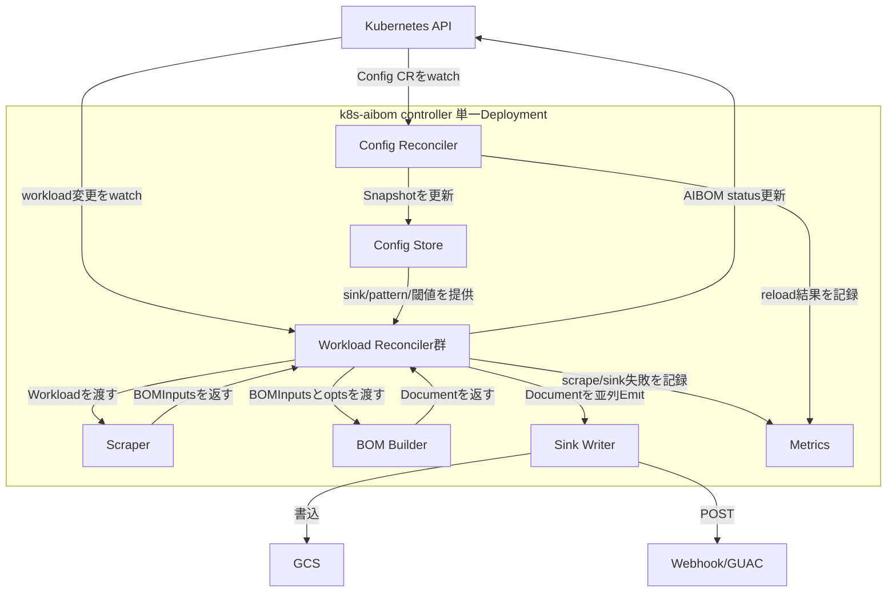

#### k8s-aibom controller 内部コンテナ

| 要素名 | 説明 |
|---|---|
| Workload Reconciler群 | Deployment/StatefulSet/DaemonSet/Job/KServeの5種類の per-kind reconcilerです。共通ロジックを1つの型に集約し委譲する構成です |
| Scraper | ワークロードkindごとにルーティングしてBOM入力を抽出する構成要素です |
| BOM Builder | ScraperのBOMInputsとworkload識別情報からCycloneDX 1.6のDocumentを組み立てます |
| Config Reconciler | singletonのAIBOMControllerConfig CRを監視し、Config Storeへhot-reloadします。不正configはlast-known-goodを維持し拒否します |
| Config Store | 有効なConfig Snapshotを保持するメモリ内ストアです。1 reconcile内は同一Snapshotを使い続けます |
| Sink Writer | Config Storeが指す外部sink群(GCS/Webhook)へDocumentを並列emitします |
| Metrics | sink失敗数・scraper抽出エラー数・config reload結果などをPrometheusへ公開します |

#### 外部システム

| 要素名 | 説明 |
|---|---|
| Kubernetes API | Workload Reconciler群とConfig Reconciler双方がwatch対象とするAPIサーバーです。AIBOM CRのstatus更新先でもあります |
| GCS | Sink Writerの書込先の一つです |
| Webhook/GUAC | Sink WriterのPOST先の一つです |

### ●コンポーネント図

Scraper と BOM Builder のドリルダウンです。

#### Scraper 内部構成

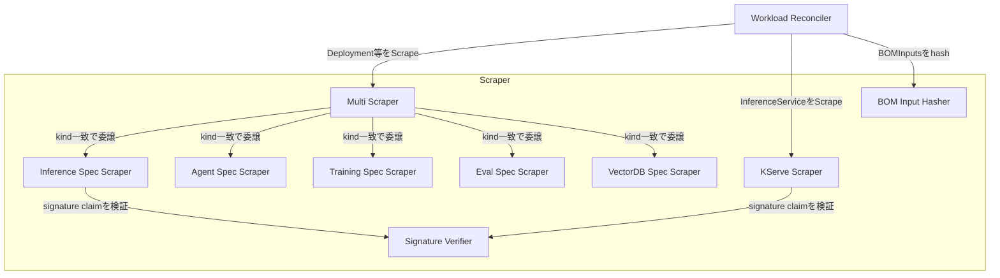

| 要素名 | 説明 |
|---|---|
| Workload Reconciler | ScraperのScrape()を呼び出す呼び出し元コンテナです。Deployment/StatefulSet/DaemonSet/JobはMulti Scraperを、KServeはKServe Scraperを使います |
| Multi Scraper | 複数のkind別scraperの結果を統合し、confidenceが低い方に降格させます |
| Inference Spec Scraper | Deployment/StatefulSet/DaemonSetのcontainer image・env・argsからvLLM/TGI/Triton/Ollama/Ray Serve等のruntimeを同定します |
| KServe Scraper | InferenceService specの宣言フィールド(modelFormat/storageUri)からdeclared confidenceで抽出します |
| Agent Spec Scraper | LangChain/AutoGen/CrewAI/Langflow/Flowise/Chainlit等のエージェントスタックと外部LLM API依存を抽出します |
| Training Spec Scraper | Job上のPyTorch/KubeRay/JAX/HF Accelerateと、mountしたdataset/HF Hub/W&B連携を抽出します (README は CronJob も挙げますが、v1.0 は reconciler 登録・RBAC とも Job のみで CronJob は未対応です) |
| Eval Spec Scraper | lm-evaluation-harness/Ragas/Trulens等の評価ハーネスを抽出します |
| VectorDB Spec Scraper | Milvus/Qdrant/Weaviate/Chroma/pgvector等のベクトルDBを抽出します |
| Signature Verifier | signature claimを検証するインタフェースです。v1.0はNoopVerifierのみでSignatureVerifiedを返しません |
| BOM Input Hasher | BOMInputsのsha256正規ハッシュを計算します。Workload Reconcilerのdedup判定に使われます |

#### BOM Builder 内部構成

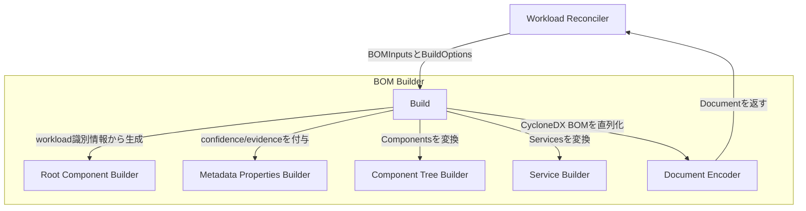

| 要素名 | 説明 |
|---|---|
| Workload Reconciler | BuilderのBuild()を呼び出す呼び出し元コンテナです |
| Build | Builderのエントリポイントです。以下の各builderを呼び出しcdx.BOMを組み立てます |
| Root Component Builder | workload識別情報(kind/namespace/name等)からmetadata.componentを生成します |
| Metadata Properties Builder | confidence・evidence・controllerのtool情報をmetadata.propertiesへ付与します |
| Component Tree Builder | 例えばvLLMのmodel/runtime/frameworkといったComponentをCycloneDXのcomponentsへ変換します |
| Service Builder | 例えば外部LLM API依存といったServiceをCycloneDXのservicesへ変換します |
| Document Encoder | cdx.BOMを決定的なJSONへ直列化し、sha256とともにDocumentへ格納します |

### ●制御フロー補足

watch → scrape → identify → build → sink の流れと、担当コンテナの対応です。

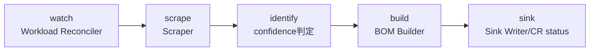

| 要素名 | 説明 |
|---|---|
| watch | Workload Reconciler群がKubernetes APIのworkload変更イベントを受けて起動します |
| scrape | Scraperがcontainer image/env/args/spec からBOM入力を抽出します |
| identify | Scraper内のパターンマッチでAIスタックを同定し、declared/inferred/unresolvedのconfidenceを付与します |
| build | BOM BuilderがBOM入力をCycloneDX 1.6のDocumentへ変換します |
| sink | Sink WriterがConfig Store設定に従い外部sinkへ並列emitし、Workload ReconcilerがAIBOM CR statusを更新します |

## ■データ

k8s-aibom が扱うデータは大きく 4 層に分かれます。

- ワークロード単位の BOM リソース (`AIBOM` CRD)
- コントローラ挙動と sink 設定 (`AIBOMControllerConfig` CRD、singleton)
- 生成される CycloneDX 1.6 ML-BOM 文書そのもの (metadata / component / service)
- 検出対象のワークロードと、そこからの抽出結果 (`Workload` / `BOMInputs`)

各層の属性には confidence (declared / inferred / unresolved) と evidence (抽出元 + locator) が付与されます。付与される単位はエンティティごとに異なるため、データセクション末尾の表で正確な付与位置を示します。フィールド名・型・enum 値は `api/v1alpha1/*_types.go` と `internal/scraper/types.go` / `internal/bom/builder.go` の Go 型定義を正としています。

### ●概念モデル

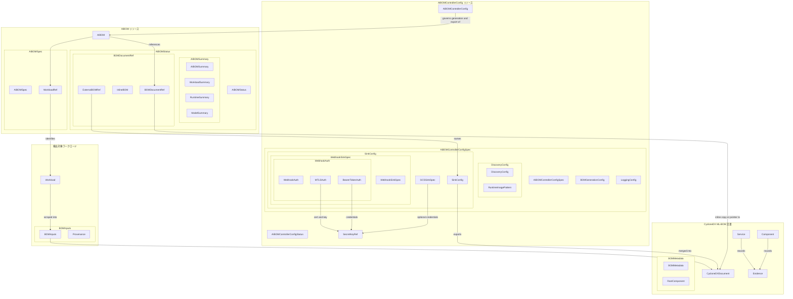

#### エンティティ一覧

| エンティティ | グループ | 概要 |
|---|---|---|
| AIBOM | AIBOM リソース | ワークロード 1 個に対して 1 個作成される namespace-scoped CRD |
| AIBOMSpec | AIBOM リソース | 対象ワークロードの識別情報と BOM フォーマットを保持する spec |
| WorkloadRef | AIBOM リソース | 対象ワークロードの API バージョン / kind / 名前 |
| AIBOMStatus | AIBOM リソース | コントローラが書き込む観測結果 |
| AIBOMSummary | AIBOM リソース | 監査者向けの小さな要約 (常時ベストエフォートで埋まる) |
| WorkloadSummary | AIBOM リソース | ワークロードの座標とライフサイクル分類 |
| RuntimeSummary | AIBOM リソース | 検出された推論ランタイム |
| ModelSummary | AIBOM リソース | 主張または推測されたモデル識別子 (複数可) |
| BOMDocumentRef | AIBOM リソース | フル BOM の所在 (inline / external / truncated のいずれか) |
| InlineBOM | AIBOM リソース | CR status に直接格納された BOM 本体 |
| ExternalBOMRef | AIBOM リソース | 外部 sink に置かれた BOM への参照 |
| AIBOMControllerConfig | AIBOMControllerConfig リソース | コントローラ挙動を決める cluster-scoped singleton (`name=default` のみ有効) |
| AIBOMControllerConfigSpec | AIBOMControllerConfig リソース | discovery / BOM 生成 / sinks / logging の設定本体 |
| DiscoveryConfig | AIBOMControllerConfig リソース | 追跡対象 namespace とランタイム検出パターンの設定 |
| RuntimeImagePattern | AIBOMControllerConfig リソース | イメージ参照からランタイムを検出する正規表現ルール |
| BOMGenerationConfig | AIBOMControllerConfig リソース | inline 格納の閾値と stale 判定閾値 |
| SinkConfig | AIBOMControllerConfig リソース | 1 個の外部 sink 設定 (GCS または Webhook) |
| GCSSinkSpec | AIBOMControllerConfig リソース | GCS バケットと出力パステンプレート |
| WebhookSinkSpec | AIBOMControllerConfig リソース | Webhook エンドポイントと認証 |
| WebhookAuth | AIBOMControllerConfig リソース | Webhook 認証方式の選択 (排他) |
| BearerTokenAuth | AIBOMControllerConfig リソース | Bearer トークン認証 |
| MTLSAuth | AIBOMControllerConfig リソース | mTLS クライアント証明書認証 |
| SecretKeyRef | AIBOMControllerConfig リソース | コントローラ namespace 内の Secret への参照 |
| LoggingConfig | AIBOMControllerConfig リソース | ログレベルとフォーマット |
| AIBOMControllerConfigStatus | AIBOMControllerConfig リソース | 設定読み込み結果の状態 |
| CycloneDXDocument | CycloneDX ML-BOM 文書 | 生成された BOM 文書全体 (JSON + 構造化表現) |
| BOMMetadata | CycloneDX ML-BOM 文書 | タイムスタンプ、ツール情報、ワークロード識別コンポーネント |
| RootComponent | CycloneDX ML-BOM 文書 | `metadata.component` に載るワークロード自身 |
| Component | CycloneDX ML-BOM 文書 | 検出された個々の要素 (ランタイム、コンテナ、モデル、データ等) |
| Service | CycloneDX ML-BOM 文書 | 観測されたサービス / エンドポイント (v1 は未使用) |
| Evidence | CycloneDX ML-BOM 文書 | 値の抽出元 (source) と場所 (locator) |
| Workload | 検出対象ワークロード | discovery 層が追跡する 1 個の K8s トップレベルオブジェクトと所属 Pod 群 |
| BOMInputs | 検出対象ワークロード | 1 個の Scraper 実行が生成した部分的な抽出結果 |
| Provenance | 検出対象ワークロード | どの Scraper が・いつ・どの方式で寄与したかの記録 |

### ●情報モデル

#### AIBOM リソース

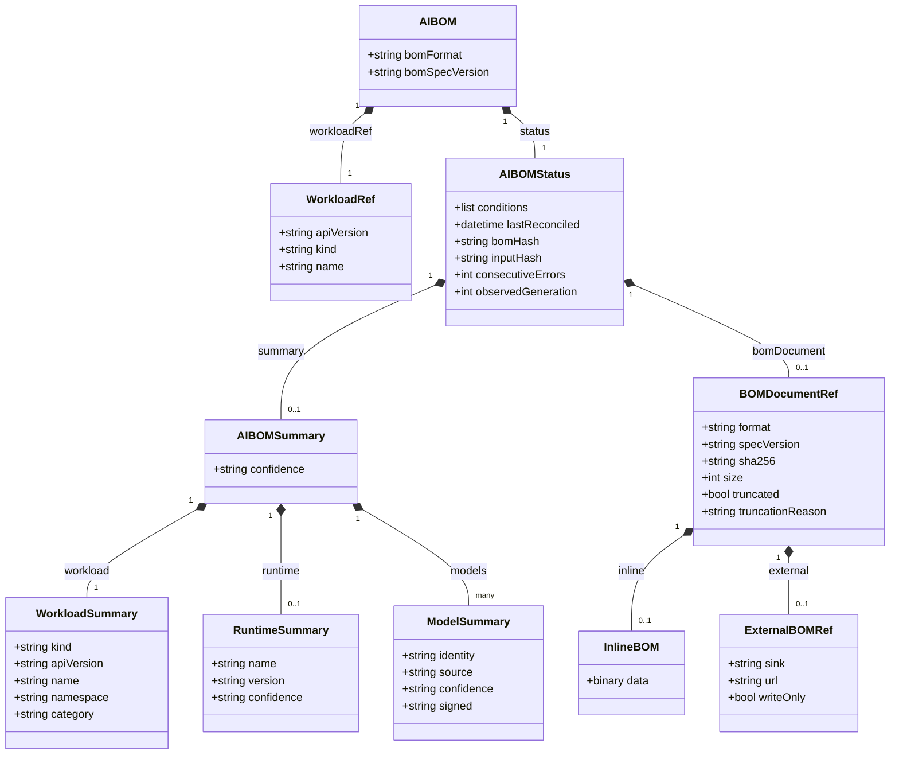

| 属性 / クラス | 補足 |
|---|---|
| AIBOM.bomFormat | v1 は `CycloneDX` のみ (enum は将来拡張可能な設計) |
| AIBOM.bomSpecVersion | v1 は `1.6` 固定 |
| BOMDocumentRef.inline / external / truncated | 排他。サイズが `inlineThresholdBytes` 未満なら inline、超過かつ sink 設定ありなら external、超過かつ sink 未設定なら truncated=true (inline も external も空) |
| ExternalBOMRef.writeOnly | GCS など読み取り可能な sink では false、webhook のような書き込み専用 sink では true |
| ModelSummary.signed | `unsigned` / `claimed` / `verified` の 3 値。confidence とは別軸の署名確認状態。v1 は `verified` を出力しない |
| RuntimeSummary.confidence | v1 はイメージパターン一致由来の `inferred` のみを出力し、`declared` は出力しない |

#### AIBOMControllerConfig リソース

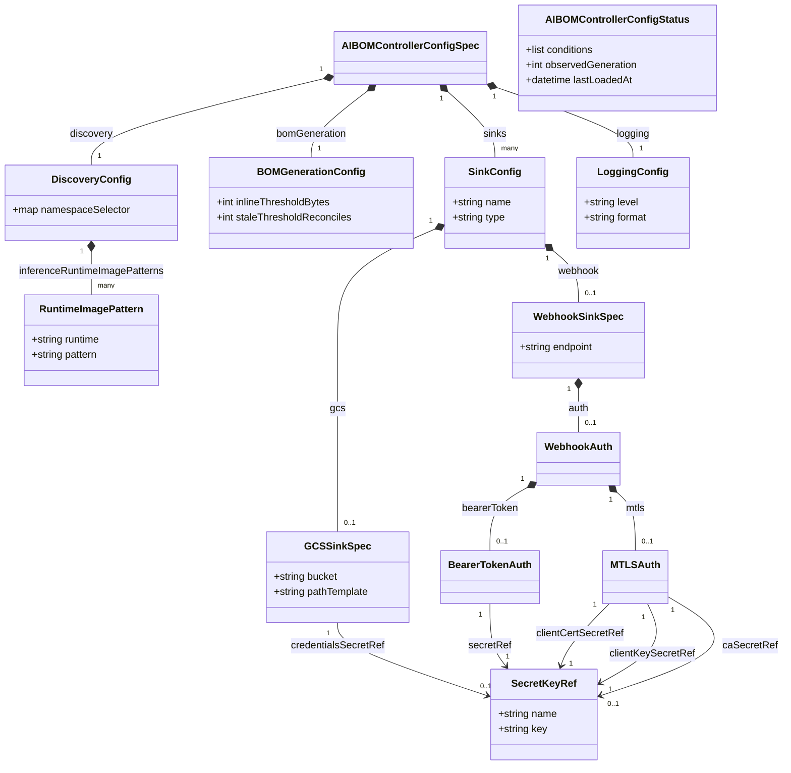

| 属性 / クラス | 補足 |
|---|---|
| AIBOMControllerConfig (図外の親クラス) | `metadata.name` が `default` の CR のみコントローラが参照する singleton。他の名前の CR は作成できても無視される (v1 は admission webhook による強制なし) |
| SinkConfig.type | `GCS` / `Webhook` の 2 値 enum。Type に応じて gcs または webhook のどちらか一方のみ設定する |
| CR status sink | 常時有効な既定 sink で、SinkConfig の一覧には現れない。`AIBOM.status.bomDocument.inline` がその実体 |
| GCSSinkSpec.credentialsSecretRef | 省略時は Application Default Credentials (Workload Identity 等) を使用 |
| SecretKeyRef の参照先 Secret | コントローラ namespace 内に存在する必要がある (namespace をまたぐ参照は不可) |

#### CycloneDX ML-BOM 文書構造

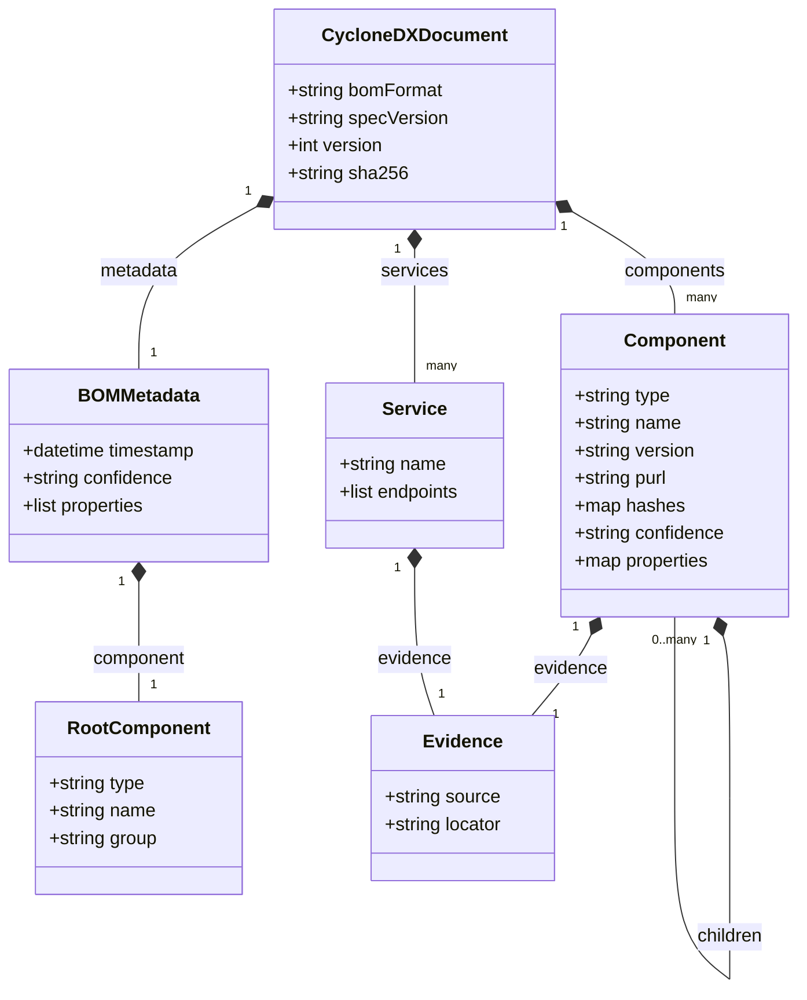

| 属性 / クラス | 補足 |
|---|---|
| Component.type の実装値 | `container` / `application` / `machine-learning-model` / `data` の 4 種のみ (`internal/scraper.ComponentType`)。未知の内部種別は安全側で `application` にフォールバックする |
| CycloneDX 仕様上の `library` / `model-card` | 仕様には存在するが v1 は出力しない。ML モデルは `machine-learning-model` 型止まりで、CycloneDX の `Component.ModelCard` 構造化フィールドは未使用 |
| RootComponent | ワークロード自身を表す唯一のコンポーネント (`metadata.component`)。`aibom.workload.*` プロパティ (kind/group/apiVersion/namespace/name/uid/category) を持つが confidence も evidence も持たない |
| dependencies グラフ | CycloneDX の `dependencies` 配列は v1 では出力しない。コンポーネント間の関係は `Component.children` (入れ子) のみで表現する |
| Component.hashes | `sha256`/`sha384`/`sha512`/`sha1`/`md5` の 5 種の鍵のみ許可。不明な鍵はビルドエラーになる |
| BOMMetadata.confidence | ワークロード集約値。`metadata.properties[]` の `aibom.confidence` として出力される。あわせて Provenance が `aibom.scrape.N.*` として平坦化格納される |
| Service | v1 のスクレイパー群はいずれも Service を生成しない (将来の eBPF / mesh telemetry スクレイパー向けの受け皿) |

#### 検出対象 Workload と BOMInputs

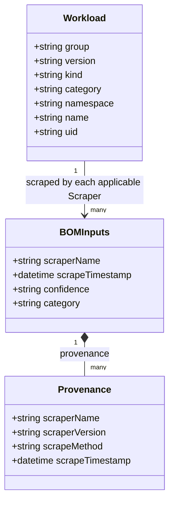

| 属性 / クラス | 補足 |
|---|---|
| Workload.category | `inference` / `agent` / `evaluation` / `pipeline` / `notebook` の 5 値 enum。v1 は discovery 層が主に `inference` を割り当てる |
| Workload.kind の対象 | Deployment / StatefulSet / DaemonSet / Job / KServe InferenceService (v1.0 の main.go に登録された 5 reconciler + RBAC 対象)。README は CronJob も挙げますが、reconciler 登録・RBAC ともに CronJob は含まれず v1.0 では未対応です |
| モデル識別 (model identity) | `Component{type: machine-learning-model}` として表現。evidence.source は `container_arg` (例 `--model`) や `env_var` (例 `HF_MODEL_ID`) |
| フレームワーク検出 (framework) | `Component{type: application}` として表現。`properties["runtime.name"]` にランタイム名 (vllm 等) を格納 |
| 外部 LLM API 依存 | 専用の関連エンティティは持たず、`Component{type: machine-learning-model, properties["dependency.type"]="remote-api"}` として表現される (`internal/scraper/agent.go` の `ExternalAPISignatures`: OPENAI_API_KEY 等の env var 検出) |
| dataset | `Component{type: data}` として表現。evidence.source は主に `volume_source` (PVC マウント等) |
| BOMInputs → CycloneDXDocument | Builder が複数 BOMInputs の Components / Services をまとめて 1 個の CycloneDXDocument に変換する (Workload : CycloneDXDocument は概念上 1 : 1) |

#### Confidence と Evidence の付与位置

| エンティティ | confidence 属性 | 値域 | evidence 属性 | 備考 |
|---|---|---|---|---|
| Component | confidence (1 個) | declared / inferred / unresolved | evidence (source + locator、1 個) | CycloneDX 出力では `properties[]` の `aibom.confidence` / `aibom.evidence.source` / `aibom.evidence.locator` として平坦化される (v1 は CycloneDX 標準の `Component.Evidence` 構造は未使用) |
| Service | なし | - | evidence (source + locator、1 個) | Service には confidence フィールドが存在しない (Go 型定義上の仕様)。v1 はいずれのスクレイパーも Service を生成しない |
| BOMInputs | confidence (1 個、スクレイパー単位の集約値) | 型としては declared / inferred / unresolved | なし (代わりに Provenance で出所を記録) | BOM 生成時に `metadata.properties` の `aibom.confidence` に転記される |
| AIBOMSummary | confidence (1 個、ワークロード単位の集約値) | declared / inferred / unresolved | なし | CR status の要約に格納 |
| RuntimeSummary | confidence (1 個) | v1 は inferred のみ | なし | イメージパターン一致由来のみ検出するため |
| ModelSummary | confidence (1 個) | declared / inferred | なし | 別軸で signed (unsigned/claimed/verified) を保持。v1 は verified を出力しない |
| RootComponent (metadata.component) | なし | - | なし | ワークロード識別情報のみを持ち、確信度評価の対象外 |
| Evidence.source の値域 | - | - | pod_annotation / pod_template_annotation / workload_annotation / image_reference / container_arg / init_container_arg / env_var / env_var_name_present / image_pattern / image_label / crd_field / volume_source / resource_request / node_selector / pod_status の 15 種 (`internal/scraper.EvidenceSource`) | 閉じた enum。locator は自由記述だが機密値を含めない規約 |

## ■構築方法

### 前提条件

k8s-aibom は Google が prebuilt image を配布していません。導入前に自前のコンテナレジストリを用意する必要があります。

| 項目 | 要件 |
|---|---|
| Kubernetes | 1.27 以上 (1.27〜1.35 でテスト済み、1.23 までは動作見込みだが未テスト) |
| kubectl | クラスタに接続設定済み |
| Docker | イメージビルド用 (`make image` が使用) |
| Helm | 3系 |
| コンテナレジストリ | **自前で用意必須**。Google は prebuilt image / Helm リポジトリを配布しない |

> [!WARNING]
> **Terraform 手段**は Cloud Build と Artifact Registry を使うため、`cloudbuild.googleapis.com` と `artifactregistry.googleapis.com` の API 有効化と、それに伴う課金が発生します。**Cloud Shell tutorial** はイメージビルドを Cloud Shell 上で `make image` (ローカル `docker build`) として実行し、Cloud Build は使いません。有効化するのは `artifactregistry.googleapis.com` と `container.googleapis.com` (GKE) で、Artifact Registry と GKE の課金が発生します。

### 導入手段は3つ

| 手段 | 想定シーン | 概要 |
|---|---|---|
| ①Cloud Shell tutorial | GCP 上でとにかく早く試したい | `teachme .cloudshell/tutorial.md` でブラウザ内に対話式チュートリアルが開き、GKE クラスタ作成〜`make image` (Cloud Shell 上のローカルビルド)〜Helm デプロイまで案内 |
| ②Terraform | GCP 上で IaC / GitOps に組み込みたい | Artifact Registry 作成 → Cloud Build によるビルド → Helm デプロイまでを Terraform module で実行 |
| ③手動 (Docker + Helm) | GCP 以外、またはローカルでビルドしたい | `git clone` → `make image` → `make docker-push` → `helm install` を手動実行 |

#### ①Cloud Shell tutorial

GitHub の README にある "Open in Cloud Shell" ボタンから起動するか、Cloud Shell 上で直接コマンドを叩きます。

```bash
teachme .cloudshell/tutorial.md
```

tutorial の主な流れは、API 有効化 → Docker 認証 → GKE クラスタ作成 → Artifact Registry リポジトリ作成 → `make image` / `make docker-push` によるビルド & push → `helm install` です。イメージ参照は `IMG` 環境変数を Makefile が参照します。

```bash
# 例: Artifact Registry を push 先にする場合
export PROJECT_ID=$(gcloud config get-value project)
export IMG=us-central1-docker.pkg.dev/${PROJECT_ID}/aibom-repo/k8s-aibom:v1.0.0
make image
make docker-push

helm install k8s-aibom ./charts/k8s-aibom \
  --namespace k8s-aibom-system \
  --create-namespace \
  --set image.repository=us-central1-docker.pkg.dev/${PROJECT_ID}/aibom-repo/k8s-aibom \
  --set image.tag=v1.0.0
```

#### ②Terraform

`terraform/` 配下の module を使います。Artifact Registry 作成・Cloud Build でのイメージビルド・Helm デプロイまでを自動化します。

```bash
cd terraform
terraform init
terraform plan   # project_id / cluster_name 等の入力を求められる
terraform apply
```

#### ③手動デプロイ (Docker + Helm)

GCP を使わない場合、またはローカルでビルドする場合はこちらです。

```bash
git clone https://github.com/GoogleCloudPlatform/k8s-aibom.git
cd k8s-aibom

# push 先レジストリを指定
export IMG=my-registry.example.com/k8s-aibom:v1.0.0

# ビルド & push
make image
make docker-push
```

> [!WARNING]
> `make image` はホストのネイティブアーキテクチャ向けにビルドします。Apple Silicon Mac 上でビルドすると `linux/arm64` イメージになり、AMD64 の Kubernetes クラスタにデプロイすると `exec format error` で CrashLoop します。クロスビルドするときは `make image-multiarch` を使ってください。

```bash
# クロスアーキテクチャビルドが必要な場合
make image-multiarch
```

Helm でクラスタにデプロイします。

```bash
helm install k8s-aibom ./charts/k8s-aibom \
  --namespace k8s-aibom-system \
  --create-namespace \
  --set image.repository=my-registry.example.com/k8s-aibom \
  --set image.tag=v1.0.0
```

`make` の主要 target は次のとおりです (Makefile より抜粋)。

| target | 内容 |
|---|---|
| `make image` | ホストアーキテクチャ向けにイメージをビルド |
| `make image-multiarch` | `linux/amd64,linux/arm64` のマルチアーキビルド |
| `make docker-push` | ビルドしたイメージを push |
| `make manifests` | CRD / RBAC YAML を Go マーカーから再生成 |
| `make test` | envtest を使ったユニット/結合テスト |

### private レジストリの imagePullSecrets

レジストリが認証を要求する場合は、Helm install 時に `imagePullSecrets` を追加します。

```bash
helm install k8s-aibom ./charts/k8s-aibom \
  --namespace k8s-aibom-system \
  --create-namespace \
  --set image.repository=my-registry.example.com/k8s-aibom \
  --set image.tag=v1.0.0 \
  --set imagePullSecrets[0].name=my-secret
```

`values.yaml` の既定値は空配列 (`imagePullSecrets: []`) です。

### バージョン確認

インストール済みのバージョンは Helm リリースまたは Deployment のイメージタグから確認します。

```bash
# Helm リリースのチャートバージョン/appVersion
helm list -n k8s-aibom-system

# 実際にデプロイされているイメージタグ
kubectl get deployment k8s-aibom -n k8s-aibom-system \
  -o jsonpath='{.spec.template.spec.containers[0].image}'
```

Chart の `appVersion` は `charts/k8s-aibom/Chart.yaml` で管理されています (2026-07-14 時点で `1.0.0`)。

## ■利用方法

### 前提・主要パラメータ早見表

| 項目 | 値 | 備考 |
|---|---|---|
| namespace opt-in ラベル | `aibom.k8saibom.dev/enabled=true` | ラベル未設定の namespace は監視対象外 |
| AIBOM (CR) | API group `aibom.k8saibom.dev/v1alpha1`, kind `AIBOM`, shortName `aibom`, namespace-scoped | ワークロード1つにつき1個、コントローラが作成/GC を管理。ユーザーによる直接作成は v1.0 未サポート |
| AIBOMControllerConfig (CR) | 同 API group, kind `AIBOMControllerConfig`, cluster-scoped | **名前は必ず `default`**。それ以外の名前の CR は無視される (singleton 規約) |
| declared 用 annotation | `model.k8saibom.dev/name` | container の `--model` arg・`HF_MODEL_ID` env と同格の「宣言」ソース |
| inline 閾値 | 既定 262144 bytes (256 KiB) | `AIBOMControllerConfig.spec.bomGeneration.inlineThresholdBytes` |

### namespace を opt-in する

コントローラはクラスタ全体にインストールされますが、ラベルを付けた namespace だけを監視します。

```bash
kubectl label namespace my-ai-namespace aibom.k8saibom.dev/enabled=true
```

対象を絞り込みたい場合は、`AIBOMControllerConfig` の `spec.discovery.namespaceSelector` で `matchLabels` / `matchExpressions` を上書きできます (既定はこのラベルの `matchLabels`)。

### BOM を参照する

opt-in した namespace 内で対象ワークロード (Deployment / StatefulSet / DaemonSet / KServe InferenceService / Job / CronJob) が動いていると、ワークロードごとに1つ `AIBOM` リソースが生成されます。

```bash
# クラスタ全体の AIBOM 一覧
kubectl get aibom -A
```

個別の BOM 詳細は `describe` で確認します。リソース名は `<kind小文字>-<workload名>` の規則です。

```bash
kubectl describe aibom -n my-ai-namespace deployment-my-workload
```

### AIBOMControllerConfig で sink を設定する

既定では BOM は `AIBOM.status` にのみ格納され、クラスタ外にはデータが出ません。GCS や Webhook へ出力したい場合は、cluster-scoped の singleton `default` を編集します。

```yaml
apiVersion: aibom.k8saibom.dev/v1alpha1
kind: AIBOMControllerConfig
metadata:
  name: default
spec:
  sinks:
    - name: audit-archive
      type: GCS
      gcs:
        bucket: my-aibom-archive
        pathTemplate: "aibom/{namespace}/{kind}-{name}/{timestamp}.json"
    - name: graph-ingest
      type: Webhook
      webhook:
        endpoint: https://guac.internal.example.com/ingest
        auth:
          bearerToken:
            secretRef:
              name: graph-ingest-creds
              key: token
```

> [!NOTE]
> README のサンプルには `gcs.workloadIdentity` という項目が載っていますが、実際の CRD スキーマ (`config/crd/bases/aibom.k8saibom.dev_aibomcontrollerconfigs.yaml`) の `gcs` には `bucket` / `credentialsSecretRef` / `pathTemplate` のみが定義されており、`workloadIdentity` フィールドは存在しません (構造化スキーマのため未知フィールドは適用時に pruning されます)。GCS 認証は `credentialsSecretRef` を省略すると Application Default Credentials (GKE の Workload Identity 環境ではそのまま利用可能) にフォールバックします。GSA への bind 自体は GKE 側の Workload Identity 設定 (IAM) で行ってください。

適用は次のコマンドです。設定変更は次の reconcile で反映され、コントローラの再起動は不要です。

```bash
kubectl apply -f controller-config.yaml
```

sink 設定の主なフィールドは次のとおりです (CRD `aibom.k8saibom.dev_aibomcontrollerconfigs.yaml` より)。

| フィールド | 説明 |
|---|---|
| `spec.sinks[].name` | sink の識別名。DNS-1123 label 形式必須 |
| `spec.sinks[].type` | `GCS` または `Webhook` |
| `spec.sinks[].gcs.bucket` | GCS バケット名 (必須) |
| `spec.sinks[].gcs.pathTemplate` | 出力パステンプレート。プレースホルダは `{namespace}` `{kind}` `{name}` `{timestamp}` 等 |
| `spec.sinks[].gcs.credentialsSecretRef` | 未指定時は Application Default Credentials (Workload Identity 推奨) |
| `spec.sinks[].webhook.endpoint` | POST 先の HTTPS URL (必須) |
| `spec.sinks[].webhook.auth.bearerToken.secretRef` | Bearer token を格納した Secret 参照 |
| `spec.sinks[].webhook.auth.mtls` | クライアント証明書による mTLS 認証 (任意) |

不正な設定は拒否され、直前の正常な設定 (last-known-good) を維持したまま `AIBOMControllerConfig` の condition にエラーが表面化します。

Webhook sink の実際の HTTP リクエストは次の形です (`docs/webhook-sink-protocol.md` より)。

```
POST <endpoint>
Content-Type: application/vnd.cyclonedx+json; version=1.6
X-Aibom-Document-Hash: sha256:<hex>
X-Aibom-Workload-Kind: <kind>
X-Aibom-Workload-Namespace: <namespace>
X-Aibom-Workload-Name: <name>
X-Aibom-Workload-Category: <category>
X-Aibom-Controller-Version: <semver>
Authorization: Bearer <token>      (設定時のみ)

<CycloneDX 1.6 ML-BOM の JSON>
```

受信側が `4xx` を返すとリトライされず設定不備として condition に表出し、`5xx`・ネットワーク/TLS エラーは指数バックオフで再試行されます。

### declared 用 annotation で model 識別を明示する

model 名をコンテナ起動引数や環境変数で判定できない場合、annotation で明示的に宣言できます。宣言された値は confidence `declared` として扱われます。

```bash
kubectl annotate deployment my-workload \
  -n my-ai-namespace \
  model.k8saibom.dev/name=meta-llama/Llama-3-8B-Instruct
```

`declared` と判定される他のソースは次のとおりです。

| ソース | 例 |
|---|---|
| container args | `--model` |
| 環境変数 | `HF_MODEL_ID` |
| annotation | `model.k8saibom.dev/name` |

一方 `inferred` は image パターンマッチなどヒューリスティック由来 (例: `vllm/.*` に一致する image から runtime `vllm` を推定)、`unresolved` は確信を持てない値 (例: 未 pull の image digest) です。

### status.bomDocument の見方

`AIBOM.status.bomDocument` は BOM の格納場所を示します。3状態は互いに排他です。

| 状態 | 条件 | 内容 |
|---|---|---|
| `inline` | BOM サイズが `inlineThresholdBytes` (既定 256 KiB) 未満 | `inline.data` に BOM JSON 本体 |
| `external` | サイズが閾値超過 **かつ** 外部 sink が設定済み | `external.sink` (sink 名) と `external.url` (取得可能な場合の URL。write-only sink は配送先を示すのみ) |
| `truncated` | サイズが閾値超過 **かつ** 外部 sink 未設定 | `inline` も `external` も設定されない「正直な劣化」状態。`truncationReason` に理由が入る |

いずれの状態でも `status.summary` は常にベストエフォートで埋まるため、`kubectl get aibom -o yaml` だけでも監査に必要な要点 (confidence・model 識別・runtime 名・ワークロード種別) は確認できます。

```bash
kubectl get aibom -n my-ai-namespace deployment-my-workload -o yaml
```

inline 閾値を変更したい場合は `AIBOMControllerConfig.spec.bomGeneration.inlineThresholdBytes` を編集します (etcd オブジェクトサイズ制限を踏まえた上限があります)。

opt-in から BOM 出力までの流れは次のとおりです。

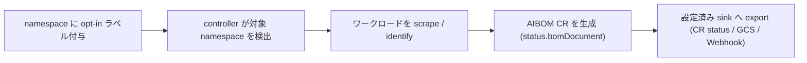

## ■運用

### 状態確認

稼働中の k8s-aibom を確認する基本コマンドです。

```bash
# 追跡中の AIBOM リソース一覧 (全namespace)
kubectl get aibom -A

# 特定ワークロードの BOM 詳細
kubectl describe aibom -n <namespace> deployment-<workload>

# コントローラ自体のログ (単一Deployment、namespace k8s-aibom-system)
kubectl logs -n k8s-aibom-system deployment/k8s-aibom -f
```

- コントローラは `k8s-aibom-system` namespace の単一 Deployment です。sidecar / DaemonSet はありません。
- `AIBOMControllerConfig` (name: `default`) の `status.conditions[Ready]` で設定読み込み状態を確認できます。

### メトリクス監視

`internal/metrics/metrics.go` で定義されている Prometheus メトリクスです。

| メトリクス名 | 種別 | 意味 |
|---|---|---|
| `aibom_external_sink_emit_failures_total` | Counter | 外部sinkへのBOM書き込み失敗数 |
| `aibom_scraper_extraction_errors_total` | Counter | scraping中の非致命的な抽出エラー数 |
| `aibom_workloads_total` | Gauge | 現在追跡中のAIワークロード数 |
| `aibom_controller_config_reloads_total` | Counter | 設定リロードイベント数 |

`grafana/dashboard.json` に Controller Health ダッシュボードが同梱されており、config reload 数・sink emit 失敗数 (GCS/Webhook 別)・scraper 抽出エラー率のパネルを持ちます。

スクレイピングは `grafana/podmonitoring.yaml` の Google Cloud Managed Service for Prometheus (GMP) 用 `PodMonitoring` リソースが担います。

```yaml
apiVersion: monitoring.googleapis.com/v1
kind: PodMonitoring
metadata:
  name: k8s-aibom-metrics
  namespace: k8s-aibom-system
spec:
  selector:
    matchLabels:
      app.kubernetes.io/name: k8s-aibom
  endpoints:
  - port: metrics
    interval: 30s
```

- GMP 以外 (self-managed Prometheus 等) を使う場合は、同じ `port: metrics` / `interval: 30s` の考え方で `ServiceMonitor` 等に読み替えます。
- リソース使用量の基準線は README 記載の実測値 (~15m CPU / ~85Mi memory、1 reconcile あたり低 single-digit ms) です。大規模クラスタではメモリ使用量を継続監視し、必要に応じて Deployment の resources を調整してください。

### 更新 (helm upgrade)

k8s-aibom は prebuilt image を配布していないため、更新も build → push → upgrade の手順になります。

```bash
# 1. 新バージョンをbuild & push (自前レジストリへ)
export IMG=my-registry.example.com/k8s-aibom:v1.1.0
make image          # クロス配布する場合は make image-multiarch
make docker-push

# 2. Helm upgrade
helm upgrade k8s-aibom ./charts/k8s-aibom \
  --namespace k8s-aibom-system \
  --set image.repository=my-registry.example.com/k8s-aibom \
  --set image.tag=v1.1.0
```

controller Deployment の再起動を伴いますが、`AIBOMControllerConfig` の内容自体は CR のため引き継がれます。

### config hot-reload (再起動不要・last-known-good)

`AIBOMControllerConfig` (`default`) の編集は、コントローラ再起動なしに次 reconcile から反映されます。不正な設定は拒否され、直前の正常設定 (last-known-good) を維持したまま `Ready` condition にエラーを出します。

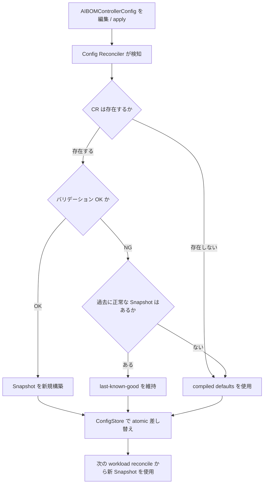

- 検証は「all-or-nothing」です。CR 内の一部フィールドだけが不正でも、正常なフィールドを部分適用せず、CR 全体をまとめて不採用にします (`internal/config/loader.go`)。
- 不正理由は spec 内のパスと具体的説明の組で `AIBOMControllerConfig.status.conditions[Ready].message` に連結表示されます。
- `ConfigStore` は atomic pointer swap で保護されており、reconcile 中のワークロードは開始時に読んだ Snapshot をそのまま使い切ります (`internal/controller/config_hotreload_test.go` で保証)。

### unresolved 資産のレビュー運用

k8s-aibom は「false positive より unresolved を優先する (conservative-detection)」設計です。不確かな値は宣言・推定せず、素直に `unresolved` として扱われます。

- ワークロード単位の Confidence は、`unresolved` な属性を除外した残りの最低ティア (`declared` > `inferred`) で決まります。すべての属性が `unresolved` ならワークロード全体が `unresolved` になります (`docs/scraper-heuristics.md`)。
- `unresolved` になる典型パターンは次の2つです。
  - イメージ digest が未確定 (spec 側に `@sha256:` が無く、かつ pod がまだ起動しておらず `containerStatuses[].imageID` も無い)
  - モデル識別に使えるシグナル (`--model` 等の args、`HF_MODEL_ID` 等の env、`model.k8saibom.dev/` annotation) が何も無い
- 運用としては、`unresolved` なワークロードを定期的に (例: 週次) 棚卸しし、レビュー対象バックログとして扱うことを推奨します。放置すると「AI 資産台帳に載っているが中身が空」の状態が積み上がります。

### GCS 監査アーカイブの diff / 変更検知

同一入力からは常に byte-identical (タイムスタンプ除く) な ML-BOM が生成されます。この決定性を活かして、GCS に書き出した BOM 群を GitOps 的に扱えます。

- Webhook 配信では `X-Aibom-Document-Hash: sha256:<hex>` ヘッダが BOM 本体の content hash を表すため、受信側はこのハッシュで重複排除できます (`docs/webhook-sink-protocol.md`)。
- GCS のオブジェクトパスはテンプレートに従い、reconcile ごとに新規オブジェクトが追加される追記専用ログになります。
- 「あるワークロードの直近2オブジェクトを diff する」運用で、モデル差し替え・イメージ更新・runtime 変更などの変化点を BOM 本文の差分として検知できます。差分検知パイプライン自体は k8s-aibom 側の機能ではなく、GCS 上のオブジェクト列を利用者側で処理する運用です。

## ■ベストプラクティス

### 最小権限 sink 設計 (storage.objectCreator のみ)

GCS sink に必要な権限は `roles/storage.objectCreator` のみです。オブジェクトの読み取り (`storage.objects.get`) ・一覧 (`storage.objects.list`) ・削除 (`storage.objects.delete`) ・上書き (`storage.objects.update`) ・バケット設定変更 (`storage.buckets.*`) は不要かつ付与すべきではありません。

認証経路は次の優先順で選択します (`docs/security-model.md`)。

1. ADC + GKE Workload Identity (推奨。クレデンシャルをクラスタ内に一切保持しない)
2. ADC + Workload Identity Federation (EKS/AKS/オンプレ等の非 GKE)
3. サービスアカウントキーファイル (Secret マウント)。ローテーションは顧客責任でコントローラ側に自動ローテーション機構は無いため、本番では避けます。

Webhook sink の bearer token は、コントローラの namespace (`k8s-aibom-system`) 内の Secret からのみ読み込まれます。ワークロード pod はこの Secret を読めません。

### GCS immutability (DoesNotExist precondition) を監査証跡に活かす

GCS sink はすべての書き込みに `DoesNotExist` precondition を付与し、既存オブジェクトへの上書きが構造的にできません。加えてコントローラは `storage.objects.delete` 権限自体を要求しないため、コントローラが侵害されても既存 BOM の削除・改ざんはできません。

本番バケットの推奨構成 (`docs/security-model.md`):

- Uniform bucket-level access (UBLA) — per-object ACL の攻撃面を排除
- オブジェクト保持ポリシー — 監査保持要件に合わせる
- ライフサイクルルール — 一定期間後のコールドストレージ移行
- CMEK — データレジデンシー要件がある場合
- `storage.objects.create` の監査ログ有効化 — 「コントローラ以外の書き込みがあればアラート」の基盤にする

### namespace opt-in の統制運用

既定では namespace に `aibom.k8saibom.dev/enabled=true` ラベルが付いていない限り、そのワークロードはスキャンされません。

- `AIBOMControllerConfig.spec.discovery.namespaceSelector` を明示指定すれば、既定ラベル以外のセレクタに置き換え可能です。ただし空セレクタ (`{}`) を明示すると全 namespace が対象になります。これは意図的に許容された挙動であり、`internal/config/loader.go` のコメントでも「security-relevant」と明記されています。
- namespace ラベルの付与自体は k8s-aibom の RBAC 外 (通常の namespace 編集権限) のため、誰が opt-in ラベルを付けられるかは別途クラスタ側の RBAC / ポリシー (Kyverno/OPA 等) で統制する必要があります。

### AI BOM を「作るだけ」で終わらせない

k8s-aibom は証跡 (evidence) を生成するだけで、判断や是正は行いません。threat-model の「Out of scope」に明記されている通り、モデル成果物の脆弱性スキャン・Admission control / enforcement・ランタイム脅威検知は明示的にスコープ外です。

したがって導入組織側で、次を運用として設計する必要があります。

- `unresolved` 資産・所有者不明資産を誰がトリアージするか (namespace owner? プラットフォームチーム?)
- モデル更新・データ来歴の変化を BOM diff から検知した際、誰が承認 / 廃止判断を行うか
- 生成された BOM (モデル識別 Component 群) を既存の脆弱性管理台帳・GRC ワークフローへどう接続するか (Webhook sink を既存パイプラインに向ける、将来的には v1.1 の GUAC sink 経由 等)

「AI BOM が自動生成されている」ことと「AI BOM が運用されている」ことは別物である、という前提を関係者と合意しておくことが重要です。

### build-time SBOM との併用

k8s-aibom は「何が build されたか」ではなく「何が実際に動いているか (runtime)」を記述します。README「Relationship to other projects」にある通り、build-time AIBOM ツールとは競合ではなく補完関係です。サプライチェーン全体を見るには両方が必要です。

### GUAC / Sigstore ロードマップを見据えた設計

- v1.1: OpenSSF GUAC 向けの native sink、Sigstore/OMS 署名検証による `verified` confidence、singleton 強制用 admission webhook、CR 経由の workload-kind allowlist
- v1.2: llm-d/KAITO/Seldon Core 向け CRD scraper、KServe の深い抽出、Semantic Kernel/Haystack/DSPy 対応
- v1.3: 可変 image タグに対する active な registry digest 解決、Artifact Registry からのイメージ SBOM 抽出、resource requests からの GPU/TPU 抽出
- v2: eBPF ベースの scraper、SPDX 3.0 AI profile 出力、service mesh telemetry 連携

v1.1 を待たずとも、v1.0 の Webhook sink を GUAC の collector に向ければ同等の取り込みが可能です。将来の GUAC/Sigstore 連携を見据えるなら、Webhook sink の endpoint 切り替えだけで移行できるよう sink 設定を疎結合に保っておくことを推奨します。

### EU AI Act / NIST AI RMF / ISO42001 への証跡マッピング

生成される BOM は次のコンプライアンス文脈の証跡として位置づけられています。ただし「証跡を出す」だけであり、認証・適合そのものを意味しません。

| フレームワーク | マッピング先 |
|---|---|
| EU AI Act | Article 12 (logging/traceability)、Article 50 (transparency) |
| NIST AI RMF | Govern / Map / Measure / Manage の各機能 |
| ISO/IEC 42001 | AI マネジメントシステムにおける資産・ライフサイクル管理 |

証跡として提出可能な状態を維持するには、「不変性 (GCS immutability)」と「決定性 (byte-identical BOM)」が監査人への説明の核になります。

## ■トラブルシューティング

| 症状 | 原因 | 対処 |
|---|---|---|
| AIBOM リソースが作られない | 対象 namespace に `aibom.k8saibom.dev/enabled=true` ラベルが付いていない、またはカスタム `namespaceSelector` の条件に合致しない | `kubectl label namespace <ns> aibom.k8saibom.dev/enabled=true` を付与。カスタムセレクタ使用時は `spec.discovery.namespaceSelector` と namespace ラベルの対応を確認 |
| Confidence が `unresolved` だらけ | イメージが未 pull で `imageID` が未確定 (かつ spec にも `@sha256:` が無い)、または args/env/annotation にモデル識別シグナルが一切ない | pod 起動を待つか、イメージ参照を `@sha256:...` 付きにする。`model.k8saibom.dev/name` annotation や `HF_MODEL_ID` 等を追加して declared/inferred へ引き上げる |
| GCS sink への書き込みに失敗する | Workload Identity バインディング未設定、`roles/storage.objectCreator` 権限不足、または `DoesNotExist` precondition 衝突 | IAM バインディングと `roles/storage.objectCreator` 付与を確認。precondition 衝突は次 reconcile の新 timestamp で自己解決するため、繰り返す場合のみ IAM 側を疑う |
| Webhook sink が 401 を返す | `secretRef` の name/key 指定ミス、または Secret が controller namespace (`k8s-aibom-system`) 以外にある | `spec.sinks[].webhook.auth.bearerToken.secretRef` の name/key と実際の Secret を照合。Secret は controller namespace 配下にのみ配置可能 |
| `AIBOMControllerConfig` を編集しても反映されない | CR のバリデーション NG (sink 形状不正、正規表現コンパイル失敗、`namespaceSelector` 不正等)。last-known-good を維持したまま | `status.conditions[Ready].message` の LoadError を確認し、指摘された spec パスを修正して再 apply |
| 大きい BOM が `status.bomDocument` に inline されない | BOM サイズが既定閾値 256 KiB (`inlineThresholdBytes`) を超過 | 外部 sink (GCS/Webhook) を設定し、CR status の参照から BOM 本体を取得する |
| prebuilt image が無くデプロイできない | Google は prebuilt image を配布していない。自前レジストリへの build/push が必須 | `make image && make docker-push` で build し、`image.repository`/`image.tag` を自レジストリに向けて `helm install`/`upgrade`。Apple Silicon 等で build した場合は `make image-multiarch` でクロスビルドしないと AMD64 クラスタで `exec format error` になる |

## ■まとめ

k8s-aibom は、稼働中の Kubernetes クラスタを非特権コントローラで観測し、実際に serving・学習している AI 資産を CycloneDX 1.6 ML-BOM として自動生成します。証跡を出すだけで是正・承認・廃止判断は行わないため、`unresolved` 資産の棚卸しや BOM diff の統制フローを導入組織側で設計してはじめて「AI 資産台帳の運用」になります。

この記事が少しでも参考になった、あるいは改善点などがあれば、ぜひリアクションやコメント、SNSでのシェアをいただけると励みになります！

## ■参考リンク

- 公式 / 概要
  - [Introducing k8s-aibom on GKE for automated AI bills of materials (Google Cloud Blog)](https://cloud.google.com/blog/products/identity-security/introducing-k8s-aibom-on-gke-for-automated-ai-bills-of-materials/)
  - [GoogleCloudPlatform/k8s-aibom (GitHub)](https://github.com/GoogleCloudPlatform/k8s-aibom)
  - [k8s-aibom README](https://raw.githubusercontent.com/GoogleCloudPlatform/k8s-aibom/main/README.md)
  - [k8s-aibom (deepwiki)](https://deepwiki.com/GoogleCloudPlatform/k8s-aibom)
- GitHub (実装ソース / 型定義)
  - [cmd/manager/main.go](https://raw.githubusercontent.com/GoogleCloudPlatform/k8s-aibom/main/cmd/manager/main.go)
  - [internal/controller/workload_reconciler.go](https://raw.githubusercontent.com/GoogleCloudPlatform/k8s-aibom/main/internal/controller/workload_reconciler.go)
  - [internal/controller/aibomcontrollerconfig_reconciler.go](https://raw.githubusercontent.com/GoogleCloudPlatform/k8s-aibom/main/internal/controller/aibomcontrollerconfig_reconciler.go)
  - [internal/scraper/scraper.go](https://raw.githubusercontent.com/GoogleCloudPlatform/k8s-aibom/main/internal/scraper/scraper.go)
  - [internal/scraper/multi.go](https://raw.githubusercontent.com/GoogleCloudPlatform/k8s-aibom/main/internal/scraper/multi.go)
  - [internal/scraper/agent.go](https://raw.githubusercontent.com/GoogleCloudPlatform/k8s-aibom/main/internal/scraper/agent.go)
  - [internal/bom/builder.go](https://raw.githubusercontent.com/GoogleCloudPlatform/k8s-aibom/main/internal/bom/builder.go)
  - [internal/bom/document.go](https://raw.githubusercontent.com/GoogleCloudPlatform/k8s-aibom/main/internal/bom/document.go)
  - [api/v1alpha1/aibom_types.go](https://raw.githubusercontent.com/GoogleCloudPlatform/k8s-aibom/main/api/v1alpha1/aibom_types.go)
  - [api/v1alpha1/aibomcontrollerconfig_types.go](https://raw.githubusercontent.com/GoogleCloudPlatform/k8s-aibom/main/api/v1alpha1/aibomcontrollerconfig_types.go)
  - [golden 出力例 (vllm-deployment-output.json)](https://raw.githubusercontent.com/GoogleCloudPlatform/k8s-aibom/main/internal/bom/testdata/golden/vllm-deployment-output.json)
  - [internal/metrics/metrics.go](https://raw.githubusercontent.com/GoogleCloudPlatform/k8s-aibom/main/internal/metrics/metrics.go)
  - [internal/config/loader.go](https://raw.githubusercontent.com/GoogleCloudPlatform/k8s-aibom/main/internal/config/loader.go)
- GitHub (ドキュメント / 構築)
  - [docs/security-model.md](https://raw.githubusercontent.com/GoogleCloudPlatform/k8s-aibom/main/docs/security-model.md)
  - [docs/threat-model.md](https://raw.githubusercontent.com/GoogleCloudPlatform/k8s-aibom/main/docs/threat-model.md)
  - [docs/scraper-heuristics.md](https://raw.githubusercontent.com/GoogleCloudPlatform/k8s-aibom/main/docs/scraper-heuristics.md)
  - [docs/webhook-sink-protocol.md](https://raw.githubusercontent.com/GoogleCloudPlatform/k8s-aibom/main/docs/webhook-sink-protocol.md)
  - [docs/schema-divergences.md](https://raw.githubusercontent.com/GoogleCloudPlatform/k8s-aibom/main/docs/schema-divergences.md)
  - [Makefile](https://raw.githubusercontent.com/GoogleCloudPlatform/k8s-aibom/main/Makefile)
  - [charts/k8s-aibom/values.yaml](https://raw.githubusercontent.com/GoogleCloudPlatform/k8s-aibom/main/charts/k8s-aibom/values.yaml)
  - [.cloudshell/tutorial.md](https://raw.githubusercontent.com/GoogleCloudPlatform/k8s-aibom/main/.cloudshell/tutorial.md)
  - [config/crd/bases/aibom.k8saibom.dev_aibomcontrollerconfigs.yaml](https://raw.githubusercontent.com/GoogleCloudPlatform/k8s-aibom/main/config/crd/bases/aibom.k8saibom.dev_aibomcontrollerconfigs.yaml)
- 関連標準 / プロジェクト
  - [OWASP CycloneDX ML-BOM](https://cyclonedx.org/capabilities/mlbom/)
  - [OWASP AI SBOM Initiative (OWASP Gen AI Security Project)](https://genai.owasp.org/initiatives/ai-sbom-initiative/)
  - [OpenSSF GUAC](https://guac.sh/)
