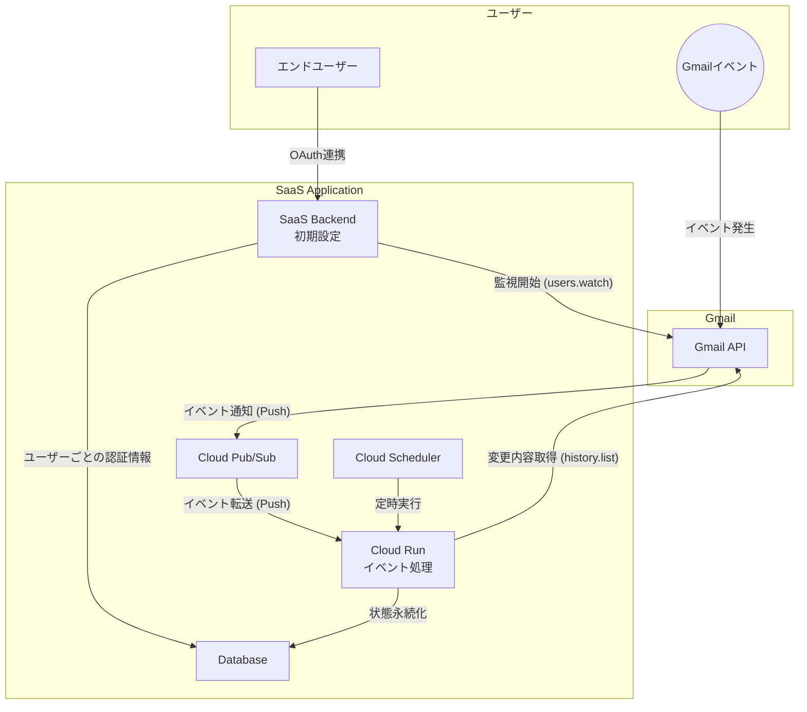
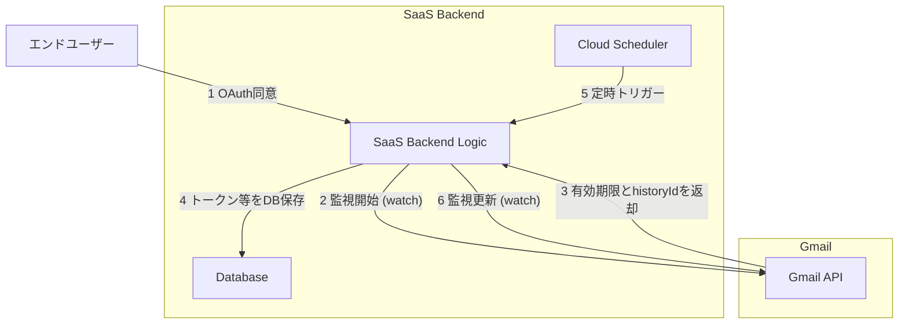
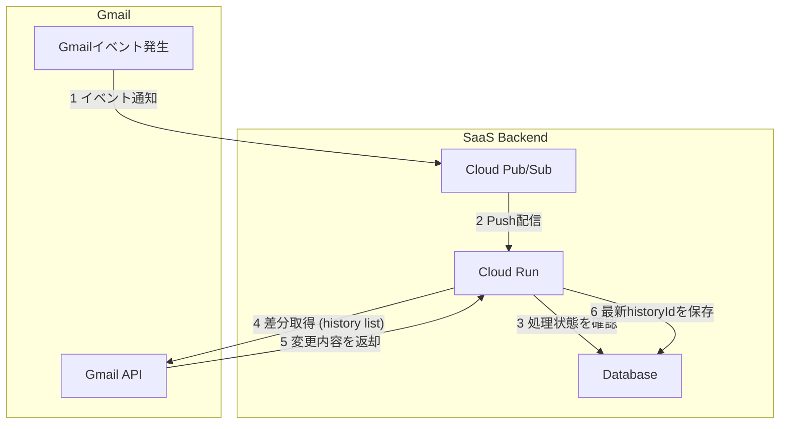
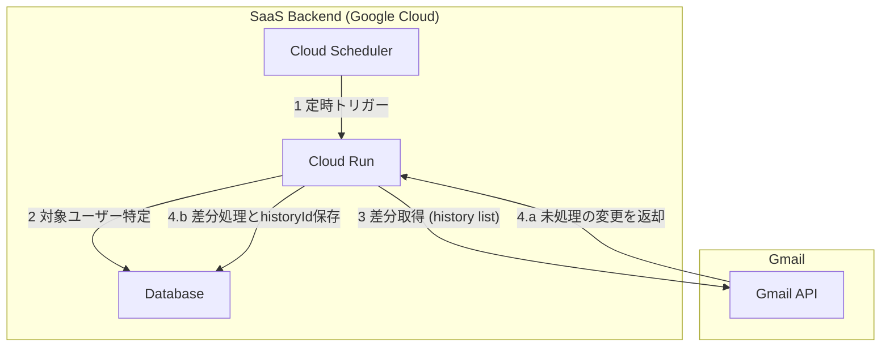

## ■はじめに

本稿では、Gmail APIのPush Notifications機能を利用して、SaaSアプリケーションがGmailイベントを**リアルタイムに、かつ大規模に**処理するための、スケーラブルで信頼性の高いアーキテクチャを解説します。

Cloud Pub/SubとCloud Runを中核に据えることで、多数のユーザーからのイベントを効率的に一元処理します。この構成は、**リアルタイム性、耐障害性、スケーラビリティ、そしてコスト効率**のバランスを追求したものです。

## ■アーキテクチャ選定のポイント

このアーキテクチャは、以下の理由から採用しています。

  * **Push方式によるリアルタイム性と効率性**: 全ユーザーの変更を定期的に確認するポーリング方式に比べ、変更があった瞬間に通知が来るPush方式は、**即時性が高く、不要なAPI呼び出しをなくせる**ため効率的です。
  * **Pub/Subによるスケーラビリティと疎結合**: Gmailからの通知を一旦Cloud Pub/Subで一元的に受け取ることで、大量の通知をバッファリングし、後続の処理（Cloud Run）への負荷を平準化します。これにより、**急なトラフィックスパイクにも耐えられるスケーラブルな構成**を実現します。
  * **Cloud Runによるコスト効率と保守性**: イベント処理をサーバーレスコンテナのCloud Runで実行することで、**トラフィックがない時はコストがゼロ**になり、必要な時だけ自動でスケールします。コンテナベースのため、ローカルでの開発やテストがしやすい点もメリットです。

## ■アーキテクチャ



| 要素名 | 説明 |
| :--- | :--- |
| エンドユーザー | SaaSアプリケーションの利用者。 |
| Gmailイベント | メールの送受信など、ユーザーのGmail上で発生するアクション。 |
| **SaaS Application** | |
| SaaS Backend | ユーザーの初期登録やOAuth連携を処理するバックエンド。 |
| Cloud Pub/Sub | Gmailからの変更通知を**一元的に受け取り**、Cloud Runへ非同期に配信するメッセージングハブ。 |
| Cloud Scheduler | 監視の更新やフォールバック処理を**定期的に起動**するフルマネージドなスケジューラ。 |
| Cloud Run | Pub/SubやSchedulerをトリガーとして、メインのイベント処理を**コンテナで実行**するサーバーレス基盤。 |
| Database | ユーザートークンや`historyId`などの状態を永続化するデータベース（例: Cloud SQL, Firestore）。 |
| **Gmail** | |
| Gmail API | 監視設定やデータ取得など、GmailのデータにアクセスするためのAPI。 |

このアーキテクチャは、以下の3つの独立したフローで構成されます。

1.  **監視の開始と維持**: ユーザーのGmailアカウントの監視を開始し、定期的に更新します。
2.  **イベント処理（Push通知）**: Gmailで発生したイベントをリアルタイムに処理します。
3.  **フォールバック処理**: 通知の欠損に備え、定期的に差分を確認します。

### ●フロー1: 監視の開始と維持

ユーザーがSaaSとの連携を許可した際に監視を開始し、Cloud Schedulerによって定期的に監視を維持（更新）します。



| ステップ | 要素 | 説明 |
| :--- | :--- | :--- |
| **1** | エンドユーザー → SaaS Backend | ユーザーはSaaSアプリケーションに対し、自身のGmailアカウントへのアクセスをOAuth 2.0フローを通じて許可します。 |
| **2** | SaaS Backend → Gmail API | バックエンドは取得したユーザーの認証情報を使い、`users.watch` APIを呼び出して、Gmailイベントの監視を開始するようリクエストします。通知先としてSaaS用のPub/Subトピックを指定します。 |
| **3** | Gmail API → SaaS Backend | Gmail APIは監視を開始し、その監視の**有効期限 (`expiration`)** と、その時点でのメールボックス履歴のIDである **初期`historyId`** をバックエンドに返却します。 |
| **4** | SaaS Backend → Database | バックエンドは、ユーザーの認証トークン、返された有効期限、`historyId`をデータベースに紐づけて保存します。 |
| **5** | Cloud Scheduler → SaaS Backend | Cloud Schedulerは設定されたスケジュール（例: 毎日）に従い、監視の有効期限を確認・更新するためのジョブを定期的にトリガーします。 |
| **6** | SaaS Backend → Gmail API | バックエンドは、DBから有効期限が近いユーザーを特定し、そのユーザーの`users.watch` APIを再度呼び出して監視を更新し、停止を防ぎます。 |

### ●フロー2: イベント処理（Push通知）

ユーザーのGmailでイベントが発生した際に実行される、メインのリアルタイム処理パイプラインです。



| ステップ | 要素 | 説明 |
| :--- | :--- | :--- |
| **1** | Gmail → Cloud Pub/Sub | ユーザーのGmailアカウントでメールの受信などのイベントが発生すると、設定された`watch`に基づき、GoogleのシステムがPub/Subトピックに通知メッセージを発行します。 |
| **2** | Cloud Pub/Sub → Cloud Run | Pub/Subは受け取ったメッセージを、Pushサブスクリプションを通じてCloud RunのエンドポイントにHTTPSリクエストとして即座に転送します。 |
| **3** | Cloud Run → Database | Cloud Runは、メッセージに含まれる`historyId`が既に処理済みでないかDB（またはキャッシュ）で確認し、**重複実行（冪等性）を防ぎます。** |
| **4** | Cloud Run → Gmail API | 未処理の場合、Cloud RunはDBから取得した前回の`historyId`を使い、`history.list` APIを呼び出して、具体的な変更内容（新規メッセージIDなど）のリストを取得します。 |
| **5** | Gmail API → Cloud Run | Gmail APIは、指定された`historyId`以降に発生した変更点の詳細をCloud Runに返却します。 |
| **6** | Cloud Run → Database | Cloud Runは取得した変更内容に基づきビジネスロジックを実行し、完了後、今回の処理で得られた**最新の`historyId`**を次の処理のためにDBに保存します。 |

### ●フロー3: フォールバック処理（通知欠損への備え）

通知の遅延や欠損に備える"保険"として、Cloud Schedulerが定期的に実行する処理です。



| ステップ | 要素 | 説明 |
| :--- | :--- | :--- |
| **1** | Cloud Scheduler → Cloud Run | Cloud Schedulerは設定されたスケジュール（例: 1時間ごと）に従い、通知欠損をチェックするためのフォールバック処理を起動します。 |
| **2** | Cloud Run → Database | Cloud RunはDBをスキャンし、**一定期間イベント通知が途絶えている**（`historyId`が更新されていない）ユーザーを特定します。 |
| **3** | Cloud Run → Gmail API | 対象ユーザーが見つかった場合、そのユーザーのDBに保存されている最後の`historyId`を使い、`history.list` APIを能動的に呼び出して差分を確認します。 |
| **4.a** | Gmail API → Cloud Run | もし未処理の変更（通知漏れしていたイベント）があれば、Gmail APIはその差分データをCloud Runに返却します。変更がなければ空のレスポンスを返します。 |
| **4.b** | Cloud Run → Database | 差分データを受け取った場合、フロー2と同様にビジネスロジックを実行し、完了後に最新の`historyId`をDBに保存します。 |

## ■アーキテクチャを支えるコア処理の実装

このアーキテクチャを実装する上で重要な処理を解説します。

### ●ユーザーごとの監視設定と維持

  - **役割**: ユーザーのGmailアカウントに対する監視を開始し、停止しないように定期更新します。
  - **処理の流れ**:
    1.  ユーザーからOAuth 2.0でGmailへのアクセス権限（リフレッシュトークンを含む）を取得し、暗号化してデータベースに保存。
    2.  ユーザーのトークンを使い、`users.watch` APIを呼び出し。通知先には**SaaS全体で共有する単一のPub/Subトピック**を指定。
    3.  レスポンスの`expiration`（有効期限）と`historyId`をユーザーごとに記録。
          - **注意**: `expiration`は最大7日間ですが、Googleの都合でより短くなる可能性があります。
    4.  Cloud Schedulerで定期的にジョブを起動し、有効期限が近いユーザーの`watch`を再実行して監視を更新。

### ●イベント受信と冪等性の確保

  - **役割**: Pub/Subから通知を受け取り、変更内容を取得してビジネスロジックを**重複なく**実行します。
  - **処理の流れ**:
    1.  Pub/SubからHTTPS POSTリクエストとして通知を受信。
    2.  リクエストボディの`message.data`をBase64デコードし、`emailAddress`と`historyId`を取得。
    3.  **冪等性の確保**: Pub/Subは「At-Least-Once（少なくとも1回）」の配信を保証するため、**重複処理の防止が不可欠**です。
          - ビジネスロジック実行前に、共有データストアで`historyId`が処理済みか確認します。この確認処理は高速である必要があるため、**Cloud Memorystore (Redis) のような低レイテンシなインメモリキャッシュ**が最適です。
          - **処理済みの場合**: 即座に処理をスキップし、HTTPステータスコード `200 OK` などを返却してPub/Subの再送を停止させます。
          - **未処理の場合**: 次の処理へ進みます。
    4.  `emailAddress`でユーザーを特定し、DBに保存された前回の`historyId`以降の変更内容を`history.list` APIで取得。
    5.  取得した情報に基づきビジネスロジックを実行。
    6.  処理完了後、今回の`historyId`を「処理済み」として共有データストアに記録。

### ●耐障害性と監視維持の自動化

  - **役割**: システムの信頼性を担保し、監視を永続的に維持するためのバックグラウンド処理です。
  - **処理の流れ**:
      - **`watch`の自動更新**: Cloud Schedulerで定期ジョブを実行し、有効期限が近づいたユーザーの`watch`を更新します。
      - **Push通知欠損のフォールバック**: 定期ジョブで「一定期間通知がないユーザー」を特定し、`history.list` APIを能動的に呼び出して差分を確認します。

## ■本番運用に向けた信頼性の強化

堅牢なシステムを維持するため、以下の4つの観点を必ず考慮します。

### ●デッドレターキュー (DLQ) の設定

Cloud Runのバグなどで処理に繰り返し失敗するメッセージを、Pub/Subのデッドレタートピック機能で別のキューに隔離します。これにより、**問題のあるメッセージがシステム全体をブロックするのを防ぎ**、後からの原因調査や手動での再処理を可能にします。

### ●APIレート制限への対応

Gmail APIの呼び出しがレート制限に達した場合に備え、**Exponential Backoff（指数バックオフ）**を用いたリトライ処理をクライアントライブラリレベルで実装します。

### ●監視とアラート

Cloud Monitoringを活用し、システムの健全性を常に把握します。

  - **Pub/Sub**: 未配信メッセージ数(`subscription/num_undelivered_messages`)、DLQのメッセージ数を監視。
  - **Cloud Run**: 5xx系サーバーエラー率、レイテンシを監視。
  - **Gmail API**: API呼び出しのエラー率を監視。
  - **アラート**: 各指標で閾値を超えた場合に通知し、問題の早期発見と迅速な対応を実現します。

### ●詳細なロギング

各処理ステップで、**トレースID**、ユーザー情報、`historyId`を含む構造化ログを出力します。これにより、障害発生時の原因特定とデバッグが大幅に容易になります。

## ■セキュリティとコストの考慮点

### ●セキュリティ: サービス間通信の保護

Pub/SubからCloud RunへのPushリクエストが、**意図しない第三者から送信されることを防ぐ**必要があります。

  - **解決策**: Pushサブスクリプションで**認証を有効化**します。Google Cloudが管理するサービスアカウント（OIDCトークン）を指定することで、Cloud Runはリクエストの`Authorization`ヘッダーを検証し、正当なPub/Subからの呼び出しのみを受け付けるようになります。これは必ず設定すべき項目です。

### ●コスト: 効率的なリソース利用

このアーキテクチャはサーバーレス中心でコスト効率が良いですが、以下の点を意識することでさらに最適化できます。

  - **Cloud Runの最小インスタンス数**: トラフィックがない時間帯は**最小インスタンス数を0**に設定することで、待機コストを完全にゼロにできます。
  - **Pub/Subのバッチ処理**: (もし実装が許せば) Pub/Subからのメッセージを複数まとめて処理することで、Cloud Runの起動回数やAPIコール数を削減できます。

## ■よくある質問（FAQ）

**Q1. Push通知が来たのに、なぜ改めて `history.list` APIを呼び出す必要があるのですか？**

**A1. 呼び出しは不可欠です。** Push通知は「変更があったこと」を知らせる軽量な **合図（シグナル）** であり、変更内容そのものは含まないためです。

  - **Push通知の内容**: `emailAddress`（どのユーザーか）と `historyId`（どの時点までか）のみ。
  - **`history.list`の役割**: 通知をトリガーにこのAPIを呼び出し、「何が変更されたか」（新規メッセージID、ラベル変更など）という**具体的な情報を取得**します。

この2段階の構成により、通知システム全体の効率性、信頼性、セキュリティを高めています。

**Q2. Pub/Subのデッドレターキューに溜まったメッセージは自動で再処理されますか？**

**A2. いいえ、自動では再処理されません。** これは、処理失敗の原因（コードのバグなど）が解決されない限り、再処理しても再び失敗する可能性が高いため、意図された安全設計です。

デッドレターキューは、失敗したメッセージを安全に隔離する「待避所」です。**根本原因を解決した後**に、以下のいずれかの方法で手動または自動で再処理を行います。

| 再処理方法 | 概要 | 適したケース |
| :--- | :--- | :--- |
| **1. 手動（Google Cloudコンソール）** | コンソール上でメッセージをコピーし、元のトピックに再度手動で公開する。 | 少数のメッセージを緊急で処理する場合。 |
| **2. スクリプト（gcloud CLI）** | `gcloud`コマンドでDLQからメッセージをPullし、元のトピックにPublishするスクリプトを実行する。 | 多数のメッセージを一括で処理する場合。 |
| **3. 自動化（Cloud Functions）** | DLQをトリガーとする専用のCloud Functionを作成し、メッセージを自動で元のトピックに再発行する仕組みを構築する。 | 高度な回復力を持つ堅牢なシステムを目指す場合。 |

**最も重要なのは、再処理の前に必ず根本原因を特定し、修正することです。**

### ●スクリプトによる再処理の例 (方法2)

以下は、`gcloud`と`jq`を利用して、デッドレターキューのメッセージを元のトピックに再発行するシェルスクリプトの例です。

```bash
#!/bin/bash

# --- 設定 ---
PROJECT_ID="your-gcp-project-id"
DLQ_SUBSCRIPTION_ID="your-dlq-subscription-id" # デッドレターキューのサブスクリプションID
ORIGINAL_TOPIC_ID="your-original-topic-id"     # 再発行先の元のトピックID
MAX_MESSAGES=100 # 一度に処理する最大メッセージ数
# -------------

echo "Pulling messages from DLQ subscription: $DLQ_SUBSCRIPTION_ID"

# デッドレターキューからメッセージをpullし、一時ファイルに保存
gcloud pubsub subscriptions pull "$DLQ_SUBSCRIPTION_ID" \
  --project="$PROJECT_ID" \
  --auto-ack \
  --limit="$MAX_MESSAGES" \
  --format="json(message.data)" > messages_to_reprocess.json

# ファイルが存在し、中身が空でないことを確認
if [ ! -s messages_to_reprocess.json ]; then
  echo "No messages found in the DLQ subscription."
  exit 0
fi

# 各メッセージを元のトピックに再発行
echo "Republishing messages to topic: $ORIGINAL_TOPIC_ID"
jq -r '.[] | .message.data' messages_to_reprocess.json | while read -r msg_data; do
  DECODED_DATA=$(echo "$msg_data" | base64 --decode)
  gcloud pubsub topics publish "$ORIGINAL_TOPIC_ID" \
    --project="$PROJECT_ID" \
    --message="$DECODED_DATA"
done

# 一時ファイルを削除
rm messages_to_reprocess.json

echo "Reprocessing complete."
```

少しでも参考になった、あるいは改善点などがあれば、ぜひリアクションやコメント、SNSでのシェアをいただけると励みになります！
