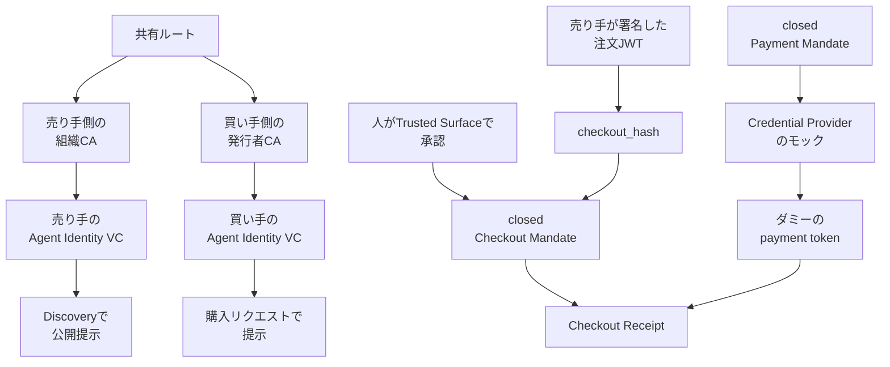
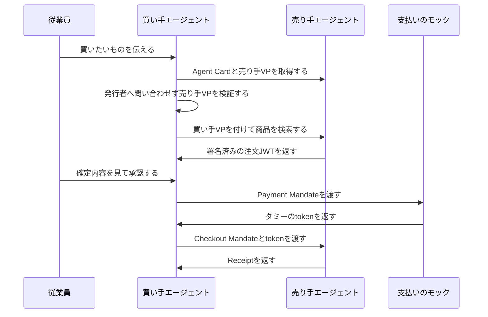

GMOグローバルサイン・ホールディングスと株式会社VESS Labsは、企業をまたいで接続するAIエージェントの身元と、人の購入承認を、相手の認可サーバへその場で問い合わせずに検証する仕組みを、2026年4月から9月に共同で実証しました。買い手側のエージェントはGMOグローバルサイン・ホールディングスが、売り手側のエージェントはVESS Labsが、別々に実装しています。この記事では、2026年9月15日作成の共同研究レポート（26ページ）と、2026年9月24日のプレスリリースに書かれた確認の単位と手順を整理します。数値と手順は、特記のない限りこの二つの公開資料によります。

*この記事の全体像。以下、順に解説します。*

## 企業をまたぐAI取引の相手確認とは

実証の対象は、社外のエージェントへ発注を渡すときの確認です。確認は二つに分かれます。一つは、相手がどの組織のエージェントかです。もう一つは、人が画面で見た確定注文を、その人が承認したかです。

二者は、検証可能なデジタル証明書で相手のエージェントを確認したあと、人が画面で承認した注文を発注し、模擬の支払い処理までつなぎました。成果は、上記の共同研究レポートと、VESS Labsのプレスリリースとして公開されています。

### 提示する二つのもの

エージェントの身元は、A2AのAgent CardをSD-JWT VCで包んだAgent Identity VCとして提示します。`sub`には、Agent CardのURLを入れます。

個別の取引の許可は、身元とは別です。AP2のCheckout Mandateが、売り手の署名済み注文への人の承認を、ハッシュで結びます。

検証は、相手の発行者へその場で問い合わせません。共有したルート認証局までの証明書チェーンと、提示の署名で行います。

売り手の証明書は、公開のAgent Cardに載せます。買い手の証明書は、購入リクエストの中だけに載せます。

通したエンドツーエンドは、人がTrusted Surfaceで確定内容を承認するHuman Presentです。

支払い側のCredential Providerはモックです。ダミーのpayment tokenを返します。決済ネットワークへは転送しません。

共同研究レポートは、次の入力を拒否するテストを通した、と書いています。nonceの再利用、失効済み証明書、`checkout_hash`の不一致、売り手署名でない注文JWTです。

### 証明書の出どころ

取引の前段は身元の提示です。後段は、人の承認と模擬の支払いです。

共通のルート認証局から、売り手側は自組織のCAへ、買い手側は外部の発行者を想定したCAへ、証明書が出ます。本実証では、発行者がエージェントの能力を本格審査する工程は対象外です。仮想的に組んだ証明書チェーンの上で、相互認証しています。

人から売り手までのメッセージは、次の順です。

身元のVCが通っても、Mandateが無ければ発注は成立しません。この二層が、設計の骨格です。

商品を選ぶ自然文の解釈には、買い手側だけがLLMを使います。署名検証、ハッシュ照合、失効確認には、どちら側もLLMを使いません。

### 接続のたびに見るもの

買い手と売り手は別組織が実装し、A2Aの`SendMessage`で疎通した、と当事者は書いています。実行モデルも意図的に揃えていません。買い手はリクエスト単位です。売り手は常駐プロセスです。

検証パイプラインは10ステップです。失効確認が無いVCは、fail-closeで拒否する、とレポートは書いています。

信頼は、接続のたびにVPを検証する側に置きます。発見用の静的Registryは、相手を見つけるために使います。

identity chainingのdraft-17は、ドメインBがドメインAの公開鍵を信頼する関係を前提にします。文書日付は2026年7月19日です。この実証の検証は、相手の認可サーバへその場で問い合わせません。

OID4VPとOID4VCIは、手順としては使っていません。SD-JWT VCとKB-JWTのデータモデルだけを流用した、とレポートは書いています。

Trusted Surfaceの署名鍵は、本実証では買い手企業自身が持ちます。ただしエージェント本体とは別の鍵と証明書チェーンです。エージェント単独では、Mandateに署名できません。

## 公開資料が名指ししている部品

この実証全体を指す製品名は、公開資料にありません。一つの標準の名前も、書かれていません。名指しされているのは、層ごとの部品です。

| 層 | レポートが名指しするもの |
|---|---|
| エージェント間の輸送 | A2A。表はv1.0.1（2026-05-28）。参照はv1.0の§8.4 |
| 決済の承認 | AP2 v0.2。closed Checkout Mandateの`vct`は`mandate.checkout.1` |
| 選択的開示 | SD-JWT。RFC 9901（November 2025、Standards Track） |
| VCの形式 | SD-JWT VC draft-18。レポートはIESG提出済みと書く |
| 失効 | Token Status List draft-21。レポートはIESG提出済みと書く |
| 組織横断OAuth | identity chaining draft-17。二者間の事前信頼が要る、と比較している |
| 商取引のaction | `catalog.search`、`cart.create`、`checkout`。独自仕様で、UCP非準拠と自己記述する |

`a2aproject/A2A`のリリースv1.0.1の`published_at`は、2026-05-28T11:34:36Zです。

独自拡張のURIは`https://github.com/vesslabs-gmogshd/agent-identity-vc/v0.1`です。AP2発見用のURIは`https://github.com/vesslabs-gmogshd/ap2/tree/v0.2`です。後者は、公式の拡張URIが見つからないための暫定だと、レポート自身が書いています。

closed Checkout Mandateでは、`checkout_hash`を、売り手署名の注文JWTのSHA-256として埋めます。双方が改ざんすると、検証が失敗する構造です。

## 注意点

見出しと、エンドツーエンドで固定した範囲は、一致しません。規格の版も、レポート執筆時から動いています。

### 模擬支払いは、決済の完了ではない

プレスとレポートの見出しは「認証から発注・模擬支払いまで」です。決済の完了や、取消の実証ではありません。

レポート4.2.1は、支払いネットワークへの転送をmockで代替し、payment tokenの中身は検証せず素通しした、と書いています。Merchant Payment Processorは、モックとしても未実装で、対象外です。取消、返金、チャージバックの手順は、レポート本文にもプレスにもありません。

ITmedia キーマンズネット（2026年9月25日）のリードは「発注、決済まで担う時代」と置きます。同じ記事の後段は「実際の決済や商取引は行っていない」と書いています。

同じ企業グループのGMOペイメントゲートウェイが決算説明で触れるagentic commerceやUCPは、別法人の資料です。グローバルサイン・ホールディングスのこの実証と同じ取り組みとしては扱いません。

### 通過件数は、当事者の申告である

281件は、売り手側のunitとe2eが2026年8月28日時点で通過した、という当事者の自己申告です。独立監査の件数ではありません。実装の実測日として、レポートは2026年8月28日を置いています。

この実証を対象とするCVE、独立監査、実決済の取消を示す一次資料は、2026年9月27日時点の公開資料には見当たりません。見当たりないことは、穴が無いことの証明にはなりません。

デモ動画のURL `https://youtube.com/watch?v=tHjOwEQURn4` は、レポートが載せています。動画の操作は、この記事の手順の根拠にしていません。

### 共有ルートの外は、検証していない

「事前の個別合意なしに初対面を検証できる」は、共通のルートをすでに共有している参加者のあいだの話です。

レポート6.3は、そのルートから双方の発行者までのチェーンを仮想的に組み、Trust Frameworkの策定と、誰がルートを運営するかは対象外だ、と書いています。発行者が「実在する組織か」「申告どおりの能力か」を審査する工程も、対象外です。証明書が通ることは、このPoCの中では、審査済みの企業であることの証明にはなっていません。

仮想ルートを、複数社が参加できるTrust Frameworkへ誰が運営するかは、公開資料では決まっていません。

### 人が見ない発注は、エンドツーエンドでは固定していない

Human Presentの疎通は、人が取引のたびに承認します。人が見ずに、金額や品目の上限の中でエージェントが発注するHuman Not Presentは、売り手側の検証ロジックが一部実装済みです。買い手側のopen Mandate発行と、エンドツーエンドは未検証です。

レポート5.1が委任状の中身として挙げる「上限金額」「この売り手だけ」「この時刻まで」は、open Mandateの説明です。エンドツーエンドで固定したのは、売り手が署名した確定注文のハッシュです。

売り手側のHuman Not Present検証が、AP2の`checkout.allowed_merchants`と`checkout.line_items`の評価規則とどこまで同じかは、公開されていません。名前は近いです。テストベクタの突合は、公開されていません。

### 規格の版と識別子は、固定されていない

AP2のCheckout Mandate文書は、人が承認するのはTrusted Surface上の確定checkoutで、マーチャントが検証する、と書いています。レポートのHuman Presentの役割分担は、この文書と正面から矛盾しません。

`checkout_hash`のバイト列が、AP2文書のbase64urlと一致するかは、公開資料だけでは確認できません。レポートはSHA-256と書き、AP2文書は`checkout_jwt`のハッシュのbase64urlと書きます。latestのA2A仕様§8.4は、Agent CardのJWS署名をMAYとしています。

VCの形式は、レポート執筆時のdraft-18から、2026年9月27日時点のdraft-19へ進んでいます。失効リストのdraft-21は、RFC Ed Queueに入っています。どちらもRFC番号はありません。依拠する形式は、レポートの版番号からも動いています。

拡張URI `https://github.com/vesslabs-gmogshd/agent-identity-vc/v0.1` について、2026年9月27日にGitHubの公開リポジトリAPIを引くとHTTP 404でした。公開の仕様リポジトリとしては取得できません。非公開である可能性は残ります。中身がリポジトリとして存在するのか、識別子だけなのかは、公開資料では決まりません。

短期のBearerへ切り替えたあとに、失効が反映されるまでの隙間をどう扱うかは、レポート6.2が今後の論点として残しています。checkout JWTの署名鍵は、いまはVCのHolder鍵と共用です。いつ分離するかは、レポート自身が将来課題にしています。

商取引フローのaction名とPartの構造は独自です。UCPへ置き換える前の暫定です。

## 身元と権限と支払いを別の問いにする

実証が分けた問いは、次の三つです。混ぜると、証明書が通ったことを発注権限や決済完了と読んでしまいます。

| 問い | 実証が扱ったもの | 扱っていないもの |
|---|---|---|
| 誰のエージェントか | Agent Identity VC。Agent CardをSD-JWT VCで包み、`sub`にAgent CardのURLを入れる | 発行者による本格的なエージェント審査 |
| どこまで権限があるか | closed Checkout Mandate。`checkout_hash`を、売り手署名の注文JWTのSHA-256として埋め、双方の改ざんで検証が失敗する構造 | 上限金額の範囲での自律発注。Human Not PresentのE2E |
| 支払いは誰が承認し、取り消せるか | closed Payment MandateをモックのCredential Providerへ渡し、ダミーtokenを売り手へ渡す | 実在のカード会社、決済ネットワーク、取消、返金 |

人のログインセッションをエージェントが借りる方式は、この実証と比べるとき、一点が足りません。売り手は、借りたセッションから「どの人が、どの注文に署名したか」を、自分の認可サーバへ問い合わせずに検証できません。このPoCは、その検証をMandateの署名と`checkout_hash`に置いています。

身元の証明書だけを、発注権限と読まない、ということです。人が画面で見た確定注文と、署名の対象がハッシュで一致することを、相手が単独で検証できる形にしています。人間のログインセッションを渡すだけでは、その一致を相手に説明できません。

## 社外の許可リストを置き換える判断には使わない

この実証は、社外取引の許可リストを置き換える製品として採用する判断には使いません。方式の全体名が無く、商取引の運ぶ形が独自で、信頼の運営主体が対象外で、支払いが模擬だからです。

判断に使ってよいのは、検証単位の分け方です。社内ツールの許可リストとは別に、社外との取引では「どの企業のエージェントか」と「この注文を誰が承認したか」を、別の検証対象にします。前者は長期の身元です。後者は取引ごとのMandateです。

再評価する条件は、次の三つが揃うことです。公開された商取引フローへ置き換わっていること。発行者の審査基準と、ルートの運営主体が文書になっていること。Credential Providerが、ダミーtokenではなく実在の支払い手段を扱うこと。

その条件が揃う前に、社内の委任設計の問いとして使う分には、このレポートは足ります。問いは、社外へ渡す前に、操作主体と権限範囲を機械が検証できる単位へ分けるか、です。

## まとめ

GMOグローバルサイン・ホールディングスとVESS Labsの実証は、企業をまたぐAIエージェントの身元と、人が見た確定注文への承認を、別の検証に分けました。検証は相手の認可サーバへその場で問い合わせず、共有ルートまでの証明書チェーンと、提示の署名と、`checkout_hash`で行います。支払いは模擬で、取消は対象外です。証明書が通ることは、発行者の審査済みであることの証明にはなっていません。

社外の発注では、身元のVCと、その注文のMandateを同じ許可と読まないことが、いま使える判断です。許可リストを置き換える製品として採用する判断は、商取引フローと、信頼の運営主体と、実在の支払い手段が文書になるまで待ちます。

この記事が少しでも参考になった、あるいは改善点などがあれば、ぜひリアクションやコメント、SNSでのシェアをいただけると励みになります！

## 参考リンク

- [共同研究レポート「AIエージェント同士が、企業間で商取引を完結させる」（PDF、作成2026-09-15）](http://www.gmogshd.com/wp-content/uploads/2026/09/ai-agent-identity-poc-report.pdf)
- [株式会社VESS Labs プレスリリース（2026-09-24）](https://prtimes.jp/main/html/rd/p/000000023.000105972.html)
- [ITmedia キーマンズネット（2026-09-25）](https://kn.itmedia.co.jp/kn/article/2609/25/2000001724/)
- [RFC 9901, Selective Disclosure for JSON Web Tokens](https://datatracker.ietf.org/doc/rfc9901/)
- [A2A v1.0.1](https://github.com/a2aproject/A2A/releases/tag/v1.0.1)
- [A2A Protocol Specification（latest、§8.4）](https://a2a-protocol.org/latest/specification/)
- [draft-ietf-oauth-sd-jwt-vc](https://datatracker.ietf.org/doc/draft-ietf-oauth-sd-jwt-vc/)
- [draft-ietf-oauth-status-list](https://datatracker.ietf.org/doc/draft-ietf-oauth-status-list/)
- [draft-ietf-oauth-identity-chaining](https://datatracker.ietf.org/doc/draft-ietf-oauth-identity-chaining/)
- [AP2 Checkout Mandate](https://github.com/google-agentic-commerce/AP2/blob/main/docs/ap2/checkout_mandate.md)
