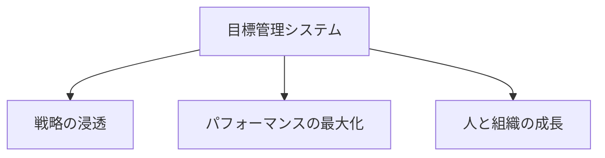
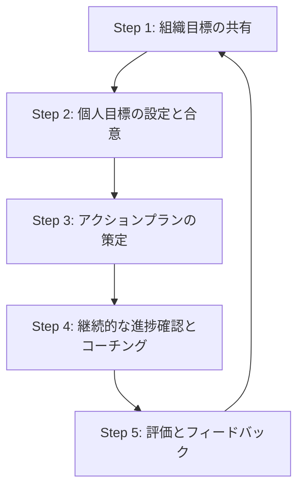
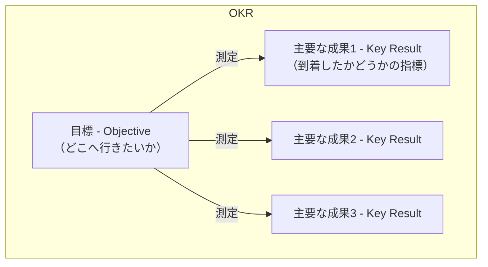
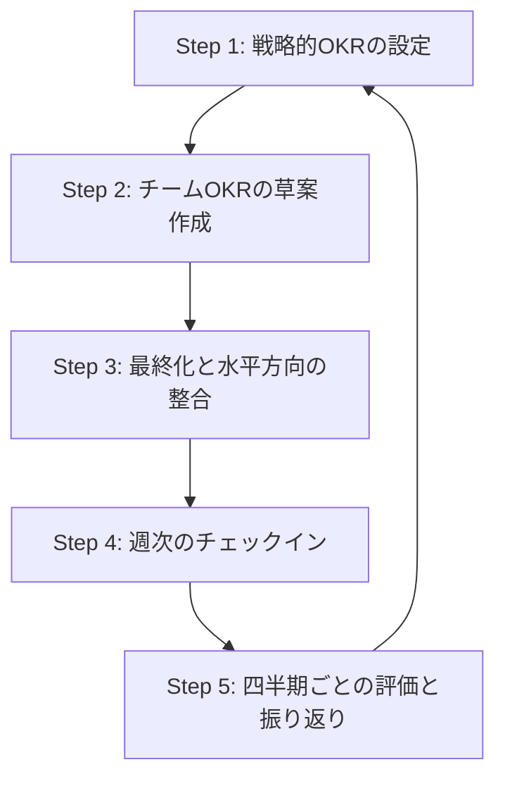

現代の複雑な経営環境において、組織の成長と戦略実行の成否は、効果的な「目標管理」にかかっていると言っても過言ではありません。しかし、MBO、OKR、SMARTなど、様々な手法が乱立し、「自社に最適なのはどれか？」「どうすれば形骸化させずに運用できるのか？」と悩む方も多いのではないでしょうか。

この記事では、代表的な目標管理フレームワークを**体系的に整理し、それぞれの本質から具体的な実践方法、そして導入で失敗しないための秘訣までを網羅的に解説**します。この記事を最後まで読めば、あなたの組織に最適な手法を選び、明日から自信を持って目標管理を実践できるようになるはずです。

### 1. なぜ今、目標管理が重要なのか？

目標管理とは、単なるタスク管理ではありません。それは、**組織のビジョンと個人の業務を結びつけ、従業員の自律的な貢献を最大化する経営システム**そのものです。

#### 1.1. 目標管理の本質：「Why」の共有

優れた目標管理は、業務の「What（何をすべきか）」だけでなく、「**Why（なぜそれを行うのか）**」を組織全体で共有します。これにより、従業員は自らの仕事の意義を深く理解し、内発的なモチベーションを持って日々の業務に取り組むことができます。

#### 1.2. 目標管理が組織にもたらす3つの力

効果的な目標管理システムは、組織に以下の3つの強力な機能を提供します。

| 機能 | 説明 |
| :--- | :--- |
| **戦略の浸透** | 会社、部門、チーム、個人の目標を一気通貫させ、組織全体のエネルギーを最重要課題に集中させます。 |
| **パフォーマンスの最大化** | 明確なゴールが従業員の集中力を高め、日々の意思決定の質を向上させ、生産性を飛躍的に高めます。 |
| **人と組織の成長** | 目標達成への挑戦プロセスが従業員の能力開発を促し、組織への貢献実感とエンゲージメントを高めます。 |

### 2. MBO（目標による管理）：計画と評価のフレームワーク

MBOは、経営の神様ピーター・ドラッカーが提唱した、古典的かつ強力な目標管理手法です。個人の目標設定への主体的な参加を通じて、自己管理能力を引き出すことを重視します。

#### 2.1. MBOの強みと弱み

MBOは計画通りの実行管理に優れますが、その運用を誤ると「弊害」も生じます。

| 強み | 弱み（陥りやすい罠） |
| :--- | :--- |
| モチベーションと主体性の向上 | 達成が容易な「低い目標」を設定してしまう |
| 明確で公平な評価基準の提供 | 設定目標以外の重要業務が軽視される（視野狭窄） |
| 組織内での戦略的な整合性の確保 | 環境変化に対応できず、制度が形骸化する |
| - | 定量化しにくい業務（例：部下育成）への適用が難しい |

#### 2.2. MBOの運用プロセス：5つのステップ

MBOは、以下の5つのステップからなるサイクルを継続的に回すことが成功の鍵です。

| 要素名 | 説明 |
| :--- | :--- |
| **Step 1: 組織目標の設定と展開** | 経営層が組織全体の戦略目標を定義し、全社に共有します。 |
| **Step 2: 個人目標の設定と合意** | 従業員が組織目標に基づき目標案を作成し、上司との対話を通じて最終目標を決定します。 |
| **Step 3: アクションプランの策定** | 目標達成のための具体的な行動計画、中間目標、KPIを設定します。 |
| **Step 4: 継続的な進捗確認とコーチング** | 定期的な1on1などを通じて進捗を確認し、上司は部下の障害克服を支援します。 |
| **Step 5: 最終評価とフィードバック** | 期末に結果とプロセスの両面から評価を行い、次期に向けた対話を実施します。 |

#### 2.3. MBO目標設定サンプル（営業マネージャー）

| 項目 | 記載例 |
| :--- | :--- |
| **職務** | 営業マネージャー |
| **期間** | 2024年4月1日〜2024年9月30日 |
| **組織目標との関連** | 全社売上目標10億円、営業本部目標5億円への貢献 |
| **目標1（定量的）** | 担当チームの新規契約売上として、半期で1億円を達成する。 |
| **アクションプラン** | ・新規リード獲得のため、週5件のテレアポを実施 ・既存顧客へのアップセル提案を月10件実施 ・チームメンバーの商談に週2回同行し、クロージングを支援 |
| **目標2（定性的）** | チームメンバー3名の育成と、営業プロセスの標準化を実現する。 |
| **アクションプラン** | ・週1回のチームミーティングで成功事例と失敗事例を共有 ・各メンバーと月1回の1on1を実施し、個別のスキル開発計画を策定 ・商談から契約までの標準的な流れをマニュアル化し、チーム内に展開 |

### 2.4. MBO運用管理項目のサンプル

MBOは人事評価と連動することが多いため、評価期間全体を通した「評価シート」としての側面が強くなります。

**【MBO運用管理シート】**

| 管理項目 | 記載例 | 補足説明 |
| :--- | :--- | :--- |
| **評価期間** | 2024年度 上期（4月1日〜9月30日） | 管理の基本単位となる期間。 |
| **氏名 / 職位** | 山田 太郎 / 営業マネージャー | 対象者を明確にします。 |
| **上位目標** | 営業本部目標：売上5億円 | 個人の目標がどの組織目標に基づいているかを示します。 |
| **No.** | 1 | 目標を複数設定する場合の通し番号。 |
| **目標カテゴリ** | 定量目標（成果） | 「定量」「定性（プロセス）」「能力開発」などに分類します。 |
| **目標の重み** | 60% | この目標が評価全体に占める重要度（ウェイト）を設定します。 |
| **目標設定 (Goal)** | 担当チームの新規契約売上として、半期で1億円を達成する。 | 具体的な目標内容（SMARTであることが望ましい）。 |
| **達成基準** | 100%達成：1億円 80%達成：8,000万円 120%達成：1億2,000万円 | 評価ランク（S, A, B, C...）と達成度を紐付けます。 |
| **主なアクションプラン** | ・週5件のテレアポ実施 ・月10件のアップセル提案 | 目標達成のための主要な行動計画。 |
| **中間レビュー（面談記録）** | （7月15日実施） ・テレアポ数は目標通りだが、成約率が課題。 ・後半は既存顧客の深掘りに注力。 | 期中での進捗確認と軌道修正の記録を残します。 |
| **期末自己評価（達成度）** | 9,000万円（90%達成） | 期末に本人による実績の申告。 |
| **期末自己評価（コメント）** | 新規大型案件の失注が響いたが、既存アップセルでカバー。 | 達成・未達の要因分析を本人が記述します。 |
| **最終評価（一次評価者）** | A評価（100%達成相当） | 上司による評価ランク。 |
| **最終評価（コメント）** | 目標は未達だが、困難な市場環境下でプロセスを工夫し、チームを牽引した点を評価する。 | 評価の理由とプロセス面での評価を具体的に記述します。 |
| **次期へのフィードバック** | ・クロージング精度の向上。 ・メンバーAさんの育成。 | 評価結果を元にした次期への改善点や期待。 |

#### 2.5. MBOを形骸化させないための対策

| よくある失敗 | 対策 |
| :--- | :--- |
| **目標が低すぎる、または高すぎる** | ・上司と部下の対話を通じて、本人の能力や意欲を踏まえた「**絶妙な挑戦**」となる難易度を設定する。 ・過去の実績を基準にしつつ、少し挑戦的な「ストレッチ目標」を推奨する。 |
| **人事評価を意識しすぎて挑戦を避ける** | ・「達成度100%」だけを評価するのではなく、**目標の難易度やプロセスでの努力**も評価対象に含める。 ・「評価面談」と「育成面談」を分離し、心理的安全性を確保した対話の場を設ける。 |
| **「設定して終わり」で実行が伴わない** | ・目標設定時に具体的なアクションプランとKPIまで落とし込む。 ・**週次や月次の1on1**で進捗を定期的に確認し、軌道修正を支援する。 |
| **期末評価がただのセレモニーになる** | ・期中の継続的なフィードバックを重視し、期末評価はその集大成と位置づける。 ・評価結果の理由を具体的に説明し、**次期の成長に向けた計画**を共に立てる。 |

:::message
**成功の鍵:** MBOは「評価制度」である前に「**育成制度**」であると捉えること。評価のための対話ではなく、成長のための対話が中心です。
:::

### 3. OKR（目標と主要な成果）：成長を加速させるフレームワーク

OKRは、GoogleやIntelで採用され、変化の速い環境で組織の爆発的な成長を促すために設計されたフレームワークです。

#### 3.1. OKRのシンプルな構成要素

OKRは、**心を躍らせるような「目標（Objective）」**と、その**達成度を測る定量的な「主要な成果（Key Results）」**という2つの要素で構成されます。

| 要素 | 説明 |
| :--- | :--- |
| **目標 (Objective)** | 「何を達成したいか」を示す、**定性的で野心的な宣言**。人を鼓舞するような言葉で表現されます。 |
| **主要な成果 (Key Result)** | 目標達成を測るための、3〜5個の**定量的で測定可能な成果指標**。活動（タスク）ではなく、結果（アウトカム）で定義します。 |

#### 3.2. OKRを支える4つの原則

OKRの成功は、以下の原則に基づいています。これらはOKRの「魂」とも言える部分です。

| 原則 | 説明 |
| :--- | :--- |
| **野心的な目標（ムーンショット）** | 達成率60〜70%で「大成功」と見なす挑戦的な目標を設定し、組織の限界を突破させます。 |
| **アジャイルなリズム** | 四半期ごとの短いサイクルで設定・レビューを行い、環境変化へ迅速に対応します。 |
| **報酬との分離** | 挑戦を奨励するため、達成度を**直接的な報酬や人事評価に結びつけません**。 |
| **徹底した透明性** | 全社のOKRを誰もが閲覧できるようにし、部門間の連携と目標の整合性を高めます。 |

#### 3.3. OKRの運用サイクル：アジャイルな学習ループ

| 要素名 | 説明 |
| :--- | :--- |
| **Step 1: 戦略的OKRの設定** | 経営層が年間の方向性と、最初の四半期の全社OKRを設定します。 |
| **Step 2: チームOKRの草案作成** | 各チームが全社OKRへの貢献を考え、自チームのOKRを作成します。 |
| **Step 3: 最終化と水平方向の整合** | チーム間でOKRを共有し、依存関係や矛盾を調整して最終化します。 |
| **Step 4: 週次のチェックイン** | 毎週チームで進捗と課題を共有し、迅速な軌道修正を行います。 |
| **Step 5: 四半期ごとの評価と振り返り** | 期末に達成度を評価し、結果から得られた学びを次のサイクルに活かします。 |

#### 3.4. OKR設定サンプル（開発チーム）

| 項目 | 記載例 |
| :--- | :--- |
| **チーム** | モバイルアプリ開発チーム |
| **期間** | 2024年 第4四半期（10月〜12月） |
| **目標 (Objective)** | **ユーザーが熱狂するほどの、爆速で安定したアプリ体験を提供する** |
| **主要な成果1 (KR1)** | アプリ起動時間を500ミリ秒から200ミリ秒に短縮する。 |
| **主要な成果2 (KR2)** | クラッシュフリーユーザー率を99.5%から99.9%に改善する。 |
| **主要な成果3 (KR3)** | ユーザー満足度調査（NPS）のスコアを+10から+30に向上させる。 |

### 3.5. OKR運用管理項目のサンプル

OKRは、四半期ごとのアジャイルな進捗管理とチーム全体での透明性を重視します。評価シートというより「進捗トラッカー」としての側面が強くなります。

**【OKR進捗管理トラッカー】**

| 管理項目 | 記載例 | 補足説明 |
| :--- | :--- | :--- |
| **期間** | 2024年 第4四半期（10月〜12月） | OKRのサイクル（通常は四半期）。 |
| **チーム名** | モバイルアプリ開発チーム | OKRは個人単位よりチーム単位での運用が推奨されます。 |
| **目標 (Objective)** | **ユーザーが熱狂するほどの、爆速で安定したアプリ体験を提供する** | チームを鼓舞する定性的な目標。 |
| **KR No.** | 1 | 主要な成果の通し番号。 |
| **主要な成果 (Key Result)** | アプリ起動時間を500msから200msに短縮する。 | 成果を測る定量的な指標。 |
| **担当者** | 鈴木、佐藤 | このKRの達成に責任を持つメンバー（複数可）。 |
| **目標値 (Target)** | 200 ms | この四半期で目指す最終的な数値。 |
| **開始値 (Start)** | 500 ms | 四半期開始時点での数値。 |
| **現在値 (Current)** | 280 ms | 週次のチェックインなどで更新される最新の数値。 |
| **進捗率 (Progress)** | 73% | `(開始値 - 現在値) / (開始値 - 目標値)` で自動計算。 |
| **自信度 (Confidence)** | 中 | 「このまま進めてKRを達成できる自信はどれくらいか？」を自己申告（高/中/低など）。 |
| **週次ステータス / 課題** | ・レンダリング処理のボトルネック特定。 ・来週、画像圧縮ライブラリをテスト予定。 | 週次のチェックインで共有する進捗や課題。 |
| **KR No.** | 2 | ...以下、同様に管理... |

#### 3.6. OKR導入で失敗しないための対策

| よくある失敗 | 対策 |
| :--- | :--- |
| **KRが成果(Outcome)でなく、活動(Output)になる** | ・「そのタスクを完了したら、**顧客やビジネスにどんな良い変化**が起きますか？」と問いかける。 ・KRはユーザー行動の変化や事業指標の向上など、測定可能な「成果」で定義する。 |
| **野心的な目標（ムーンショット）を設定できない** | ・**OKR達成度を人事評価から完全に切り離し**、失敗を許容し、そこから学ぶ文化を醸成する。 ・最初は達成可能な目標から始め、徐々に挑戦のレベルを引き上げる。 |
| **週次のチェックインが形骸化する** | ・チェックインを「進捗報告会」ではなく「**問題解決の作戦会議**」と位置づける。 ・進捗が芳しくないKRに焦点を当て、チームで解決策を議論する時間を確保する。 |
| **経営層のコミットメントが不足している** | ・経営層自身が自らのOKRを設定・公開し、運用を率先して実践する。 ・OKR導入の目的とメリットを全社に繰り返し伝え、**変革の「なぜ」**を浸透させる。 |

:::message
**成功の鍵:** OKRは単なる目標設定ツールではなく、 **アジャイルな学習と挑戦を促す「組織文化の変革プログラム」** であると理解すること。
:::

### 4. MBO vs OKR：どちらを選ぶべきか？

MBOとOKRは目的や思想が異なります。どちらか一方が優れているわけではなく、自社の文化や事業環境に応じて選択することが重要です。

| 比較軸 | MBO（目標による管理） | OKR（目標と主要な成果） |
| :--- | :--- | :--- |
| **核心的な目的** | **評価と管理**。「約束したことを実行したか？」 | **挑戦と連携**。「最重要課題で飛躍的な進歩を遂げているか？」 |
| **目標の性質** | **必達目標**。現実的な目標の100%達成が成功。 | **挑戦目標**。野心的な目標の60〜70%達成が成功。 |
| **サイクル** | 長期的（年次、半期） | 短期的・アジャイル（四半期） |
| **報酬との連動** | **強く連動**。人事評価や賞与の直接的な根拠。 | **意図的に分離**。挑戦を促すため、直接連動させない。 |
| **透明性** | 限定的（本人と上司） | 全社的にオープン |
| **最適な環境** | 安定的な事業、計画実行を重視する文化 | 変化の速い事業、イノベーションを重視する文化 |

### 5. SMART：あらゆる目標設定の品質を高める基礎技術

SMARTは、MBOやOKRといったフレームワークの中で、質の高い目標を設定するための**普遍的で強力なチェックリスト**です。

  - **S - Specific（具体的に）**: 誰が読んでも同じ解釈ができるか？
  - **M - Measurable（測定可能に）**: 進捗や達成度を客観的に測れるか？
  - **A - Achievable（達成可能に）**: 現実的に達成できる範囲か？（MBOは100%、OKRは60-70%達成を想定）
  - **R - Relevant（関連性を持たせる）**: より大きな組織目標と繋がっているか？
  - **T - Time-bound（期限を設ける）**: いつまでに達成するのか明確か？

#### 5.1. SMART目標設定サンプル（マーケティング担当者）

| 要素 | 悪い例 | 良い例（SMART） |
| :--- | :--- | :--- |
| **目標** | ウェブサイトのトラフィックを増やす。 | **3ヶ月後（Time-bound）までに、自社ブログからの自然検索流入数を現状の月間1万から1.5万へ50%増加させる（Specific, Measurable, Achievable, Relevant）。** |
| **S (具体的)** | 曖昧 | 具体的なチャネル（ブログ）、流入経路（自然検索）、数値目標が明確 |
| **M (測定可能)** | 測定不能 | Google Analyticsなどで月間セッション数を正確に測定可能 |
| **A (達成可能)** | 不明 | 過去の成長率や施策の効果を考慮し、現実的なストレッチ目標として設定 |
| **R (関連性)** | 不明 | リード獲得数の増加という事業目標に直接貢献する |
| **T (期限)** | なし | 「3ヶ月後まで」と明確な期限を設定 |

#### 5.2. SMART基準を使いこなすためのヒント

| よくある失敗 | 対策 |
| :--- | :--- |
| **「測定可能(M)」に固執し、重要な定性目標を避ける** | ・すべての目標が数値化可能である必要はないと理解する。 ・定性目標の場合は、「**達成した状態を具体的に記述する**」ことで具体性(S)と達成基準を担保する。 |
| **「達成可能(A)」を「簡単」と勘違いする** | ・現状維持ではなく、能力を少し伸ばすことで達成できるレベルに設定する。 ・「関連性(R)」と連動させ、上位目標への貢献から適切な挑戦レベルを考える。 |
| **「関連性(R)」が個人目標に閉じてしまう** | ・目標設定の面談で、**その目標がチームや組織の成功にどう貢献するのか**を必ず議論する。 ・OKRのように、上位目標を常に参照できる透明な仕組みを導入する。 |

:::message
**成功の鍵:** SMARTは目標を縛るルールではなく、**目標をより強力にし、対話を円滑にするためのツール**として活用すること。
:::

### 6. 導入成功に共通する6つの原則

どのフレームワークを選ぶかにかかわらず、目標管理を成功させるためには、以下の原則が極めて重要です。

1. **経営層が「なぜやるのか」を自らの言葉で語り、実践する。** (Whyの発信)
2. **マネジャーを「評価者」から「コーチ」へと育成する。** (役割の転換)
3. **フィードバックは「頻繁に」「未来志向で」「双方向に」行う。** (対話の質の向上)
4. **「育成のための対話」と「報酬のための対話」は明確に分離する。** (心理的安全性の確保)
5. **完璧を目指さず、小さく始めて、継続的に改善する。** (アジャイルな導入)
6. **テクノロジーは、人間同士の「対話の質」を高めるための支援ツールと位置づける。** (手段の目的化の防止)

### まとめ

**ツールではなく「対話」こそが本質**

ここまでMBO、OKR、SMARTという目標管理のフレームワークを解説してきました。しかし、最も重要なことを忘れてはなりません。それは、**いかなる優れた制度も、それを使う人々の「対話の質」を超えることはできない**ということです。

目標管理の本当の目的は、シートを埋めることではありません。上司と部下、チーム、そして組織全体が、 **「どこを目指すのか」「今どこにいるのか」「どうすればもっと良くなるのか」** について、オープンで質の高い対話を繰り返すことにあります。

今回紹介したフレームワークは、そのための強力な羅針盤であり、共通言語です。ぜひ、自社の文化や目指す姿に合ったフレームワークを選び、まずは小さな一歩から「対話」を始めてみてください。それが、組織を次のステージへと導く、最も確実な道となるでしょう。

この記事が、あなた組織での目標管理を前に進める一助になれば幸いです。

この記事が少しでも参考になった、あるいは改善点などがあれば、ぜひリアクションやコメント、SNSでのシェアをいただけると励みになります！

-----

### 参考リンク

- **MBO（目標による管理）**
  - [MBO（目標管理制度）とは？実施手順や注意点を詳しく解説 - HR NOTE](https://hrnote.jp/contents/soshiki-mbo-20230417/)
  - [MBO（目標による管理）とは？必要性や方法と目標管理シートの書き方を分かりやすく解説 - HRBrain](https://www.hrbrain.jp/media/evaluation/mbo-managementbyobjectives)
  - [MBO（目標管理制度）とは？目標設定の方法やOKRとの違いを解説 - SmartDB](https://hibiki.dreamarts.co.jp/smartdb/learning/le-sp211109/)
  - [MBOにおける目標設定の方法を解説！メリットや運用方法についてもご紹介！](https://coteam.jp/note/personnel-evaluation-and-target-management/mbo-target-setting/)
  - [MBO（目標管理制度）とは？手法や目標設定の例・メリットを解説 | 記事一覧 | 法人のお客さま](https://www.persol-group.co.jp/service/business/article/303/)
  - [目標管理制度（MBO）の徹底ガイド｜概要から適切な運用方法までまとめて解説｜AGS media](https://www.agsc.co.jp/ags-media/mbo/)
  - [MBO（エムビーオー）｜グロービス経営大学院 創造と変革のMBA](https://mba.globis.ac.jp/about_mba/glossary/detail-11655.html)
  - [MBOとは？MBOのメリット・デメリット、成功・失敗事例からMBO評価を活用した評価制度の構築方法まで徹底解説します - タナベコンサルティング](https://www.tanabeconsulting.co.jp/hr/eye/detail108.html)
  - [MBO(目標管理制度)の成功例と失敗例 - e-評価ナビ](https://www.tenbin-web.net/management-by-objective/case.html)
  - [MBOの導入事例｜運用のポイントや成功事例・失敗事例について解説 - SOICO株式会社](https://www.soico.jp/case-mBO/)
  - [MBOとOKR、何が違う？｜太田 昂志｜ゆめみCHRO - note](https://note.com/oh1ta/n/nab0958baa88e)
  - [MBO（目標管理制度）とは？メリット・デメリットやOKR・KPIとの違い、導入ステップを徹底解説](https://www.cbase.co.jp/column/article13/)
- **OKR（目標と主要な成果）**
  - [OKRとは？Googleやメルカリも導入する目標管理手法を解説 | HR大学 - HRBrain](https://www.hrbrain.jp/media/evaluation/okr)
  - [やってみたけどうまくいかなかった？OKR、失敗例とその理由 | HR大学 - HRBrain](https://www.hrbrain.jp/media/evaluation/okr-re)
  - [OKR導入事例から学ぶOKR成功のポイントと注意点 - Unipos HRコラム](https://media.unipos.me/okr-case-study)
  - [OKRとは？組織力を高める目標設定の手順や運用方法、導入事例などを解説](https://www.jmam.co.jp/hrm/column/0052-okr.html)
  - [「OKR導入に失敗」OKRと日本企業の相性が悪い3つの理由 - メディカルトラスト](https://www.medical-tt.co.jp/1467)
  - [OKRが失敗する7つの要因 KPIやMBOとの違いも解説 - PROFFIT](https://proffit.jp/column/1/ubU2jGIz)
  - [OKRとは？意味やKPIとの違い、具体例、企業事例などを解説 - NECソリューションイノベータ](https://www.nec-solutioninnovators.co.jp/sp/contents/column/20230310_okr.html)
  - [OKRとMBOとの違いとは？ 導入のメリットや運用方法を解説 | ソリューションサイト](https://solution.lmi.ne.jp/column/8291)
  - [OKRを導入して半年。多くの成功と少しの失敗から学んだこと。 - グレート・ビーンズ](https://gb-jp.com/topics/knowledge/3110)
  - [OKRとは？他の目標管理手法との違いと導入までの全手順 - LISKUL](https://liskul.com/okr-96235)
  - [什么是目标与关键成果法(OKR)？| IBM](https://www.ibm.com/cn-zh/think/topics/okrs)
  - [目标与关键结果- 维基百科，自由的百科全書](https://zh.wikipedia.org/zh-cn/%E7%9B%AE%E6%A0%87%E4%B8%8E%E5%85%B3%E9%94%AE%E7%BB%93%E6%9E%9C)
  - [目標與關鍵結果- 維基百科，自由的百科全書](https://zh.wikipedia.org/zh-tw/%E7%9B%AE%E6%A0%87%E4%B8%8E%E5%85%B3%E9%94%AE%E7%BB%93%E6%9E%9C)
  - [OKR简介：目标与关键结果的力量- 飞书系统](https://www.feishu.cn/template/intro-and-powers-of-okr)
  - [什么是目标和关键结果(OKR)？ - Amazon Ads](https://advertising.amazon.com/zh-cn/library/guides/objectives-and-key-results)
  - [什麼是OKR？ 定義及其重要性| 亞馬遜廣告 - Amazon Ads](https://advertising.amazon.com/zh-tw/library/guides/objectives-and-key-results)
- **SMART基準**
  - [SMARTの法則とは？メリット・デメリットや目標設定の方法・具体例を解説！ - HR NOTE](https://hrnote.jp/contents/soshiki-smart-laws-20241006/)
  - [SMARTの法則とは？ 目標設定の意味・メリット・具体例を解説 - カオナビ人事用語集](https://www.kaonavi.jp/dictionary/smart-criteria/)
  - [「SMART」とは？パフォーマンスを向上させる目標設定のフレームワーク - グロービス経営大学院](https://mba.globis.ac.jp/careernote/1567.html)
  - [目標管理のスマートな方法：SMARTゴールの設定と達成術 | 株式会社ディアイスクエア](https://di-square.co.jp/tech_info/smart-goal/)
  - [SMART 目標とは？設定方法とヒント、具体例を紹介 [2025] • Asana](https://asana.com/ja/resources/smart-goals)
  - [SMARTゴールの意味と使い方、事例](https://hr-mitas.jp/blogs/okr-performance-management/19/)
  - [SMARTゴール：目標設定方法と事例 - Build+](https://buildplus.io/jp/blog/smart-goals-goal-setting)
  - [SMART 目標とは？ 独自の SMART 目標の設定方法と概要を解説 - Tableau](https://www.tableau.com/ja-jp/learn/articles/smart-goals-criteria)
  - [目標達成の秘訣: SMART 目標設定のガイド｜yw - note](https://note.com/yw_pm/n/n685164eaf817)
  - [SMARTとは？成果に繋がる目標設定の方法や、活用の注意点など徹底解説](https://bow-now.jp/media/column/smart/)
- **目標管理（全般・その他）**
  - [タレントマネジメント失敗事例10選に学ぶ！システム選定ポイントと成功の鍵とは | HR大学](https://www.hrbrain.jp/media/human-resources-development/talentmanagement-failure)
  - [目標管理制度導入成功５ポイントと効果を引き出す運用４つの課題 - Unipos HRコラム](https://media.unipos.me/management_by_objectives)
  - [目標管理とは？OKR・KPIとの違いや導入方法、注意点なども解説](https://www.jmam.co.jp/hrm/column/0045-mbo.html)
  - [目標管理シート（目標設定シート）の書き方や項目、活用のポイントを解説｜全45職種の例文も紹介](https://www.kaonavi.jp/dictionary/mbo-mokuhyo-sample/)
  - [目標管理の形骸化を防ぐ5つの実践ステップ！MBO・OKRを生きた仕組みに](https://ai-keiei.shift-ai.co.jp/goal-management-formalization-prevention/)
  - [目標管理とは？基礎知識と企業で起きやすい問題・成功のヒントを解説](https://www.growing-labo.com/hrmsystem-objectives-management/)
  - [目標管理制度（MBO）とは？効果を出すポイントや実施方法、OKRとの違いを解説 - あしたのチーム](https://www.ashita-team.com/jinji-online/evaluation/9678)
  - [管理職の目標設定のコツとは？ 考え方や手順、フレームワークを紹介](https://www.recruit-ms.co.jp/glossary/dtl/0000000250/)
