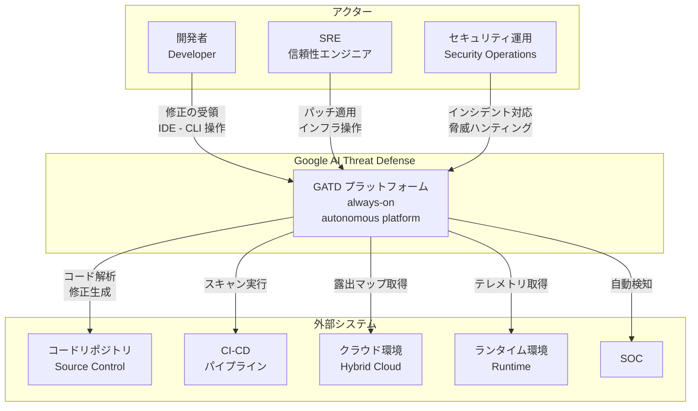
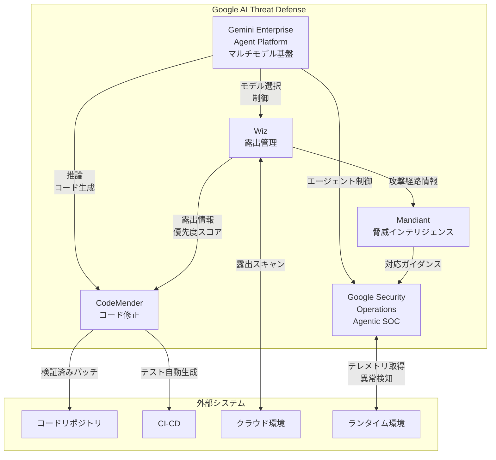
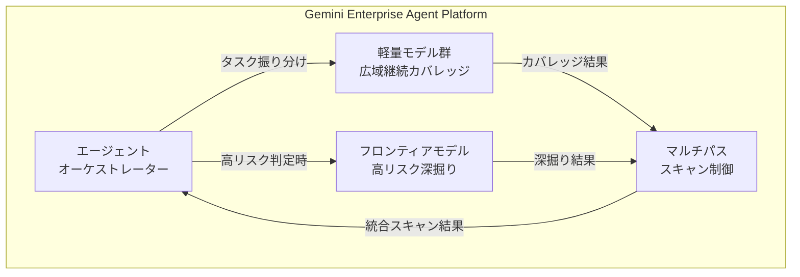
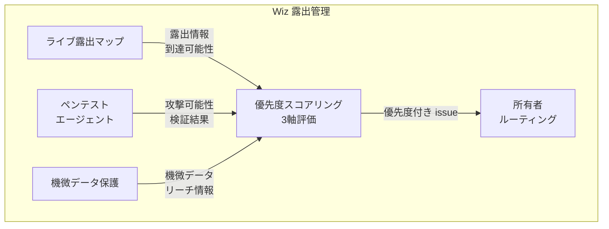
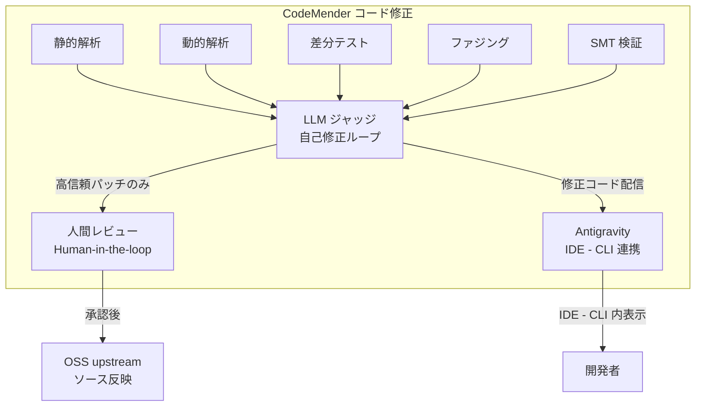
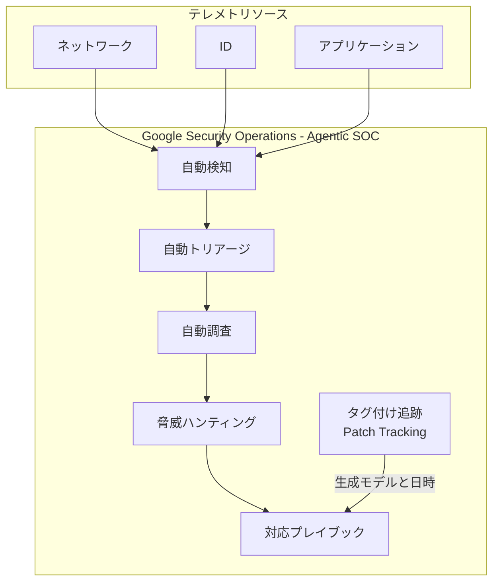
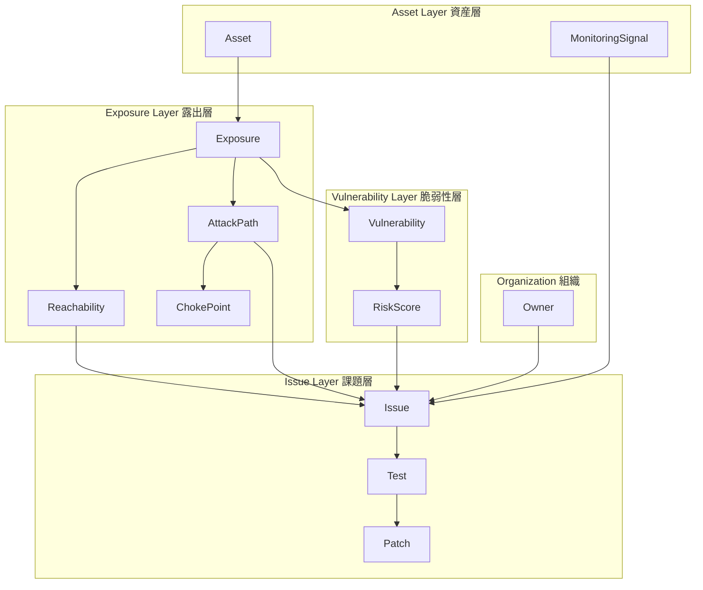
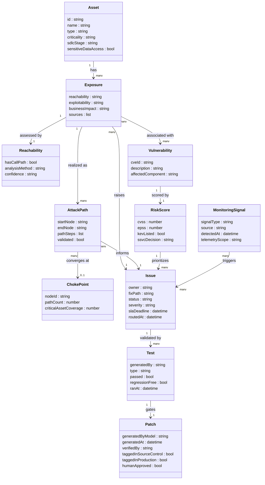

> 検証日: 2026-05-29 / 対象読者: 実装エンジニア・SRE・セキュリティ運用・LLMOps
> 本稿は防御セキュリティ (defensive security) の運用ガバナンスを扱います。攻撃手法の詳細・エクスプロイト再現は対象外です。

## 概要

### 発表と位置づけ

2026-05-28、Google Cloud は **Google AI Threat Defense (GATD)** を公表しました。公式ブログ (S1) における定義は次のとおりです。

> 「a comprehensive AI-powered cybersecurity solution — Google AI Threat Defense — an **always-on autonomous security platform**」
> 「an automated security system designed to help you **continuously monitor for and stop AI-powered threats before they can impact your business**」

位置づけは「Google 自身の脅威対処アプローチを製品化したもの」とされます (S1 逐語:「based on Google's own approach to combating today's threats and transforming vulnerability management across a four-step framework」)。

複数の Google 製品を融合した統合プラットフォームです。S1 の記述を引くと「fuses the reasoning power of **Gemini** and other frontier models, the contextual risk prioritization of **Wiz**, the code remediation capabilities of **CodeMender**, and the frontline expertise of **Mandiant**」となります。なお CodeMender 自体は GATD より前の 2025-10-06 に DeepMind から発表された AI コード修正エージェントで、GATD はこれを修正生成の構成要素として取り込みます。

> 注: 公式製品ページ (S2) は取得時にコンテンツが truncated となり、GA 状況・価格・提供時期は **未確認** です。CodeMender の Agent Platform 統合は「available soon」とされます [二次情報: csoonline.com / infoworld.com]。

### 「発見して通知」からの脱却という設計思想

GATD の差別化メッセージは S1 に明示されています。

> 「While other model providers focus on using AI to _find_ and flag vulnerabilities, Google AI Threat Defense differentiates itself by **actively prioritizing your most critical real-world risks and accelerating their remediation**」
> 「Unlike other model providers that simply hand security teams a massive, **unprioritized list of AI-generated alerts**, we deliver **prioritized fixes** to accelerate remediation and secure the Defender's Advantage」

この転換の背景には「exploit window (脆弱性発見から攻撃までの時間) が weeks から hours へ短縮している」という課題認識があります (S1)。GATD の目標は「remediate までの時間を **weeks → minutes** に縮める」ことに置かれます。

> 注: 競合として二次報道では Anthropic「Mythos」・OpenAI「Daybreak」が名指しされますが、S1 本文では「other model providers」と総称のみです。固有名対比は **二次情報のみ** で、一次ソースによる確認はできていません。

### 4段階フレームワークと CTEM の対応

GATD は脆弱性管理を以下の「four-step framework」に再編します (S1 逐語)。

| 段階 | S1 逐語 | 概要 |
|------|---------|------|
| **1. Prepare** | 「Harden your foundation, and operationalize your framework for machine-speed prioritization and response.」 | 基盤の堅牢化とマシンスピードでの優先順位付け・対応のための運用整備 |
| **2. Scan and Prioritize** | 「Conduct deep-dive analysis and AI-driven posture validation.」 | 深掘り分析と AI 駆動のポスチャ検証。マルチ AI スキャンでカバレッジとコスト効率を両立 |
| **3. Remediate** | 「Implement a workflow to autonomously verify and accelerate the patching of vulnerabilities.」 | 脆弱性パッチを自律的に検証し適用を加速するワークフロー |
| **4. Monitor** | 「Transition to continuous detection and rehearsed, active response playbooks.」 | 継続的検知とリハーサル済みのアクティブ対応プレイブックへの移行 |

この4段階は、Gartner が 2022 年に提唱した **CTEM (Continuous Threat Exposure Management)** の5段階 (Scoping / Discovery / Prioritization / Validation / Mobilization) と対応づけられます。

| GATD 段階 | 対応する CTEM 段階 |
|-----------|-----------------|
| Prepare | Scoping |
| Scan and Prioritize | Discovery + Prioritization + Validation |
| Remediate | Mobilization |
| Monitor | 継続サイクル全体 |

CTEM の構造的な核は、Discovery (検出) と Prioritization (優先度付け) を分け、さらに **Validation (実際に悪用可能かの検証)** を独立段階に置いたことです。GATD はこれを「Scan and Prioritize」の1段階に包含する形で製品化しています。

## 特徴

### 優先順位付けの3軸

GATD は「Any exposed application, service, or technology should be prioritized based on **reachability, exploitability, and business impact**」と明示します (S1)。

| 軸 | 問い | GATD における実装 |
|---|---|---|
| **Reachability (到達可能性)** | 脆弱な経路はアプリから実際に到達可能か | Wiz が live exposure map を継続生成し、不要な reachability を削減 |
| **Exploitability (攻撃可能性)** | その経路は実際に悪用できるか | Wiz の AI pen-testing agent が attack path をシミュレートして validate |
| **Business impact (業務影響)** | 悪用されたら業務に何が起きるか | 機微データ・本番サービス・認証ロジックへの到達でランク付け |

この設計思想を裏付けるデータとして、XM Cyber「The State of Exposure Management in 2024」(4,000 万超の露出を分析) があります。

- 検出された露出の **74% は攻撃者にとって行き止まり (dead end)** で、横展開や深部到達につながりません
- 致命的な露出は **2% の choke point (複数経路の収束点)** に集中します
- CVE ベースの脆弱性は **全露出の 1% 未満** です。特に remote-code-executable な CVE は全露出の 1% 未満かつ critical exposures の 11% 未満にとどまります [出典: XM Cyber 2024 report、The Hacker News 経由で確認]

### その他の主要な特徴

- **ライブ露出マップと継続スキャン**: Wiz がアプリ・インフラ・API・ID・ランタイム環境を継続発見し live exposure map を生成します。リスクコンテキストは「exposure, vulnerabilities, identity, sensitive data access, and runtime signals」を統合します (S1)。
- **マルチモデル戦略**: 「No single model will catch everything」を前提に、軽量モデルで広域・継続カバレッジ、frontier モデルで高リスク領域を深掘りします。基盤は Gemini Enterprise Agent Platform です (S1)。
- **修正の IDE/CLI 内インライン生成**: CodeMender が Antigravity・Wiz と協調し、開発者の IDE または CLI 内で脆弱性修正コードを生成し、memory-safe 言語への書き換えまで行います (S1)。
- **検証済みパッチと監査証跡**: 「Before any patch goes live, the platform automatically generates tests to verify every fix」、修正後は「libraries are tagged across both source control and production environments」「see which model was used to generate what patches and when」(S1)。CodeMender の検証基準は「root cause 修正 / functional correctness / no regressions / style guideline 準拠」で、高信頼パッチのみ human researcher がレビューします (S3)。
- **Agentic SOC による継続監視**: Google Security Operations の agentic SOC が「automated detections, triage and investigation, and hunting」を network・identity・application テレメトリ横断で実行します (S1)。
- **管理単位の転換**: 検出数主義から「攻撃可能性が実証され・所有者が割り当たり・修正経路と検証手段を持つ issue」へ管理単位を移します。所有者への高速ルーティングは S1 に明示されます (「a fast process to route the issue to the right owner and drive remediation」)。

### 競合・近接製品との比較

3社とも「reachability/exploitability × business impact で優先順位付けし、自律修復で加速する」という設計思想は共通します。差異は起点と流通モデルにあります。

| 製品 | 優先順位付けの軸 | 修復アプローチ | 流通モデル |
|------|----------------|--------------|-----------|
| **Google AI Threat Defense** | Wiz の cloud exposure map + pen-testing agent による attack path 検証 | CodeMender が IDE/CLI 内でコード生成。適用前にテスト自動生成で検証。マルチモデル戦略 | Google Cloud 統合 (GA/価格は未確認) |
| **Microsoft Security Copilot** | Security Copilot agents による signals 分析。Intune Vulnerability Remediation Agent が脅威出現に応じ継続検知 | Vulnerability Remediation Agent が workflow 実行 [二次情報: Microsoft CTO 証言「Two-week process → two-minute process」] | M365 E5/E7 ライセンスに同梱 [二次情報] |
| **CrowdStrike Charlotte AI** | Exposure Prioritization Agent が Falcon エンドポイントテレメトリで exploitability を検証し business-critical assets への影響をマッピング | Charlotte Agentic SOAR が reason / decide / act。7 エージェント体制 | Falcon プラットフォーム [二次情報] |

> 注: Microsoft / CrowdStrike の機能記述は各社公式ブログ (C1/C2) を参照しましたが、価格・ライセンス条件の詳細は二次情報に依拠しています。

## 構造

C4 model の3段階で、GATD の論理構成を図解します。

### システムコンテキスト図



| 要素名 | 説明 |
|--------|------|
| 開発者 | IDE または CLI 経由で脆弱性修正コードを受け取り、レビュー・マージを担当するアクター |
| SRE | パッチ適用・インフラ変更・SLA 管理を担当するアクター |
| セキュリティ運用 | インシデント対応・脅威ハンティング・対応プレイブック実行を担当するアクター |
| GATD プラットフォーム | always-on autonomous security platform として脆弱性管理の4段階フレームワークを実行する中核システム |
| コードリポジトリ | ソースコードと修正パッチを格納する外部システム。修正後はライブラリをタグ付け |
| CI-CD パイプライン | ビルド・テスト・デプロイを実行する外部システム。スキャンと自動テスト生成の実行基盤 |
| クラウド環境 | アプリ・インフラ・API・ID・機微データが存在する外部システム。Wiz が露出マップを作成する対象 |
| ランタイム環境 | 本番稼働中アプリが生成するネットワーク・ID・アプリケーションテレメトリの発生源 |
| SOC | 検知・トリアージ・調査・インシデント対応を担う外部オペレーションセンター |

### コンテナ図



| 要素名 | 説明 |
|--------|------|
| Gemini Enterprise Agent Platform | 複数の frontier モデルをオーケストレーションするマルチモデル基盤。軽量モデルで広域カバレッジ、frontier モデルを高リスク領域に予約 |
| Wiz 露出管理 | クラウド環境の継続スキャンで live exposure map を生成し、コンテキスト考慮型のリスク優先度付けを担当。pen-testing agent が攻撃経路を検証 |
| CodeMender コード修正 | Antigravity と協調し、開発者の IDE または CLI 内で脆弱性修正コードを生成。適用前に自動テストを生成して検証 |
| Mandiant 脅威インテリジェンス | frontline expertise と対応ガイダンスを提供し、脅威情報を Wiz の優先度付けと SecOps の対応に供給 |
| Google Security Operations Agentic SOC | 自動検知・トリアージ・調査・脅威ハンティングを実行する agentic SOC 機能を担当 |

### コンポーネント図

各コンテナの内部コンポーネントをドリルダウンします。

#### Gemini Enterprise Agent Platform



| 要素名 | 説明 |
|--------|------|
| エージェント オーケストレーター | 複数の AI セキュリティエージェントを管理し、タスクを適切なモデルへ振り分け |
| 軽量モデル群 | 資産横断の広域・継続カバレッジを担当。コスト効率を優先する対象に使用 |
| フロンティアモデル | internet-facing アプリ・認証ロジック・機微データ到達経路など最高リスク領域の深掘りを担当 |
| マルチパス スキャン制御 | 複数モデルの複数パス結果を統合し、単一モデルでは見逃す脆弱性のカバレッジ向上を実現 |

#### Wiz 露出管理



| 要素名 | 説明 |
|--------|------|
| ライブ露出マップ | アプリ・インフラ・API・ID・ランタイム環境を継続発見し、露出状態をリアルタイムでマッピング |
| ペンテスト エージェント | 攻撃をシミュレートして複雑な攻撃経路を特定・検証。従来のテストが見落とすアプリ層・ID 起因のリスクを発見 |
| 優先度スコアリング 3軸評価 | reachability × exploitability × business impact の3軸で優先度を決定 |
| 機微データ保護 | リスクワークロードから到達可能な機微データサービスを特定し、暗号化・ID・ネットワーク制御・流出監視の優先付けに使用 |
| 所有者ルーティング | 優先度付き issue を適切な所有者へ高速ルーティング |

#### CodeMender コード修正



| 要素名 | 説明 |
|--------|------|
| 静的解析 | コードを実行せずにソースコードの脆弱性パターンを解析 |
| 動的解析 | 実行時の挙動を観測して脆弱性を検出 |
| 差分テスト | ground-truth 修正版と生成パッチの runtime 挙動を比較して正確性を検証 |
| ファジング | 自動生成入力でコードを実行し、新たなクラッシュや回帰が出ないことを確認 |
| SMT 検証 | 充足可能性モジュール理論による数学的検証を実施 |
| LLM ジャッジ 自己修正ループ | 各検証結果をもとに LLM が自己評価・修正を繰り返し、根本原因修正・機能的正確性・回帰なし・スタイル準拠を確認 |
| Antigravity IDE - CLI 連携 | Wiz の露出情報と CodeMender の生成パッチを開発者の IDE または CLI へ配信 |
| 人間レビュー Human-in-the-loop | 検証通過した高信頼パッチのみを人間が確認し、upstream 提出または PR マージを承認 |

#### Google Security Operations Agentic SOC



| 要素名 | 説明 |
|--------|------|
| 自動検知 | ネットワーク・ID・アプリケーションテレメトリを横断して異常を継続検知 |
| 自動トリアージ | 検知イベントを自動分類・優先付けし、対応を要する事案を識別 |
| 自動調査 | 不審なアクティビティを自律的に調査し、攻撃の全体像を把握 |
| 脅威ハンティング | リアルタイムで潜在的な脅威を能動的に探索 |
| 対応プレイブック | リハーサル済みの対応手順を実行し、ライブ攻撃への対処を加速 |
| タグ付け追跡 | source control と production 環境の両方でライブラリをタグ付けし、生成モデルと日時を追跡 |

## データ

### 概念モデル

エンティティ間の所有関係を subgraph、利用関係を矢印で示します。



| 要素名 | 説明 |
|--------|------|
| Asset | 組織が保有する資産 (アプリ・API・インフラ・ID・ランタイム環境)。Wiz が live exposure map として継続発見 (S1) |
| Exposure | Asset の露出状態。reachability・exploitability・businessImpact の3軸で評価 (S1) |
| Reachability | 脆弱な関数へのコールパスが実在するかの判定。SCA のコールグラフ解析や CTEM の Validation に対応 |
| Vulnerability | CVE などの個別脆弱性 |
| RiskScore | CVSS / EPSS / KEV / SSVC による優先度スコア |
| AttackPath | 侵入起点から重要資産への経路。Wiz の pen-testing agent が検証 (S1) |
| ChokePoint | 複数の AttackPath が収束するノード。XM Cyber 調査では全露出の 2% が致命的経路の大半を占める |
| Issue | 攻撃可能性が実証され、所有者が割り当たり、修正経路と検証手段を持つ単位。従来の CVE リストとの設計差 |
| Test | パッチを検証するテスト (自動生成 / 回帰 / differential) |
| Patch | 検証済みパッチの管理単位。生成モデルと日時を source control と production にタグ付け (S1) |
| MonitoringSignal | agentic SOC が network・identity・application テレメトリから検出するシグナル (S1) |

### 情報モデル

主要属性のみ記載します。型は汎用名 (list / map / string / bool / number / datetime) を使います。



属性の出典と補完注記は次のとおりです。

| エンティティ | 出典 | 補完注記 |
|---|---|---|
| Exposure.reachability / exploitability / businessImpact | S1 一次 (逐語) | |
| Patch.generatedByModel / generatedAt / taggedInSourceControl / taggedInProduction | S1 一次 (逐語) | |
| Patch.verifiedBy / humanApproved | S1 + S3 (CodeMender: human researcher review) | |
| RiskScore.cvss / epss / kevListed | FIRST EPSS / CISA KEV / Endor Labs (一次) | |
| RiskScore.ssvcDecision | CMU SEI SSVC (一次) | |
| ChokePoint.pathCount / criticalAssetCoverage | XM Cyber 2024 report (一次) | |
| Issue.slaDeadline / routedAt | S1 + RBVM 業界標準 (既存実装から補完) | |
| Test.regressionFree | S3 CodeMender + Meta AutoPatchBench (一次) | |
| Asset.sdlcStage | S1 (SDLC Visibility 言及) + 既存実装から補完 | |
| MonitoringSignal.telemetryScope | S1 (network, identity, and application telemetry 逐語) | |

## 構築方法

GATD は GA/価格が未確認のため、構築方法は CTEM/exposure 運用モデルを自社の脆弱性運用・変更管理フローに組み込む導入手順として記述します。

### 前提条件の整備

CTEM 運用モデルの導入前に、次の3つの基盤が揃わないと優先度付けの入力が成立しません。

- **資産インベントリ**: CMDB 等で外部公開・内部サービス・コンテナ・クラウドリソースを一元管理します。「本番に近いか」「機微データを扱うか」という business impact のランクを資産メタデータに付与します。インベントリが不完全だと discovery の死角と attack path 分析の前提崩れを招きます。
- **CI/CD への SAST/SCA 統合**: プルリクエスト段階で SAST と SCA を実行し、マージ前に脆弱性候補を検出します。GitHub Code Scanning (CodeQL) や Semgrep のように SARIF 出力できるツールを選びます。reachability フィルタ付き SCA (Endor Labs / Semgrep SCA) で「アプリコードから実際に呼ばれる経路がある」脆弱性に絞り込みます。
- **KEV / EPSS データの取得設定**: CISA KEV カタログ (`known_exploited_vulnerabilities.json`) と FIRST EPSS API (`https://api.first.org/data/1.0/epss`) を定期取得します。いずれも無償です。検出 CVE に KEV・EPSS をエンリッチメントする仕組みをパイプラインまたはバッチに組み込みます。

### CTEM 5段階の自社フローへのマッピング

| CTEM 段階 | 自社フローの対応作業 | 担当・ツール例 |
|---|---|---|
| **1. Scoping** | スキャン対象資産の優先度クラス (外部公開・本番・開発) を定義。脅威モデルと照合 | セキュリティアーキテクト / CMDB |
| **2. Discovery** | CI/CD の SAST・SCA、インフラ構成スキャン (CSPM) を継続実行。CVE・設定不備・過剰権限を検出 | CodeQL / Semgrep / Trivy / Wiz |
| **3. Prioritization** | KEV→EPSS→CVSS+reachability の多層スタックで優先度付け。SSVC で対応区分を判定 | EPSS API / KEV JSON / Endor Labs |
| **4. Validation** | 上位 issue が実際に悪用可能かを attack path シミュレーション・PoC 再実行で確認。False positive を除去 | Wiz pen-testing agent / nuclei |
| **5. Mobilization** | 検証済み issue を所有者へルーティング。PR/チケット・SLA を自動生成し承認フローへ | JIRA / GitHub Issues / PagerDuty |

### 優先度付けスタックの構成

優先度付けは「KEV → EPSS → CVSS + reachability」の順で多層化します。

**なぜ CVSS 単独では不十分か**: NVD の CVSS 評価済み脆弱性のうち約 58% が High または Critical と評価され、CVSS だけでは差別化できません (出典: Endor Labs 集計、一次は NVD ダッシュボード)。

1. **KEV First**: CISA KEV 掲載 CVE は「今まさに悪用が確認されている」事実です。重大度に関わらず最優先で対応します。
2. **EPSS で次の候補を絞る**: EPSS v3 で閾値 0.088 を用いると、既知 CVE のうち 7.3% にパッチを当てるだけで、実際に悪用された脆弱性の約 82% をカバーできます (出典: Endor Labs の集計。EPSS v3 研究 arXiv:2302.14172 に基づく。FIRST 公式サイトには当該の閾値別カバレッジ数値は未掲載)。
3. **CVSS + reachability で影響度を補正**: CVSS は業務影響と組み合わせて補助指標に使います。reachability フィルタで「アプリコードから呼ばれない脆弱な関数」を除外します。

補助フレームワークとして、SSVC (CMU SEI) は対応タイミングを Track / Track* / Attend / Act の決定木で判定します。VEX は自社に影響しない脆弱性を機械可読に表明し、ダウンストリームの triage 負荷を下げます。

### 所有者ルーティングの定義

「誰が直すか」を事前定義しないと、優先度付けが完成しても修正が止まります。

- 資産 × 環境境界 (本番/ステージング/開発) × サービス単位で所有者を CMDB または IaC タグに記録します。
- コードリポジトリは CODEOWNERS で所有者を定義し、CI/CD から自動アサインできる状態にします。
- 所有者不明の例外はセキュリティ champions チームにエスカレーションします。

リスク × 到達可能性でクラス分けし、クラス別に SLA を設定します。

| クラス | 条件例 | SLA 目安 |
|---|---|---|
| Critical+ | KEV 掲載 かつ 外部公開 | 24時間以内 |
| Critical | EPSS > 0.5 かつ reachable | 72時間以内 |
| High | EPSS > 0.088 または CVSS ≥ 9.0 | 30日以内 |
| Medium | CVSS 7.0〜8.9 かつ reachable | 60日以内 |
| Low / 行き止まり | reachability 未解決 または EPSS < 0.01 | 90日以内または Monitor |

> 注: SLA のしきい値は規制要件・資産重要度・組織キャパで調整します。上記は代表例です (出典: ActiveState / Tenable)。

## 利用方法

### EPSS / KEV を使った優先度付けの実例

以下のスクリプトは、SCA/SAST が出力した CVE リスト (CSV) に KEV 掲載フラグと EPSS スコアを付与し、優先度付け済み JSON を生成する実装案です。パイプラインに合わせて調整してください。

```python
# 実装案: cve_prioritize.py
# 補完元: FIRST EPSS API (https://api.first.org/data/1.0/epss)
#          CISA KEV JSON (https://www.cisa.gov/sites/default/files/feeds/known_exploited_vulnerabilities.json)
import json
import csv
import urllib.request

EPSS_API = "https://api.first.org/data/1.0/epss"
KEV_URL  = "https://www.cisa.gov/sites/default/files/feeds/known_exploited_vulnerabilities.json"

def fetch_kev_set() -> set:
    """CISA KEV カタログから CVE ID のセットを取得する"""
    with urllib.request.urlopen(KEV_URL) as resp:
        data = json.loads(resp.read())
    return {v["cveID"] for v in data["vulnerabilities"]}

def fetch_epss(cve_ids: list) -> dict:
    """EPSS API から CVE ごとのスコアとパーセンタイルを取得する"""
    # API は cve パラメータをカンマ区切りで受け付ける (最大 100 件/リクエスト)
    results = {}
    for i in range(0, len(cve_ids), 100):
        chunk = ",".join(cve_ids[i:i+100])
        url = f"{EPSS_API}?cve={chunk}"
        with urllib.request.urlopen(url) as resp:
            data = json.loads(resp.read())
        for item in data.get("data", []):
            results[item["cve"]] = {
                "epss": float(item["epss"]),
                "percentile": float(item["percentile"]),
            }
    return results

def prioritize(input_csv: str, output_json: str,
               epss_threshold: float = 0.088) -> None:
    """
    input_csv: cve_id, cvss_score, package, service の列を持つ CSV
    output_json: 優先度付け済みの issue リスト (JSON)
    """
    kev_set  = fetch_kev_set()
    with open(input_csv) as f:
        rows = list(csv.DictReader(f))

    cve_ids  = [r["cve_id"] for r in rows]
    epss_map = fetch_epss(cve_ids)

    issues = []
    for row in rows:
        cve    = row["cve_id"]
        epss   = epss_map.get(cve, {}).get("epss", 0.0)
        in_kev = cve in kev_set
        cvss   = float(row.get("cvss_score", 0))

        # 優先度クラスを決定する
        if in_kev:
            priority = "critical+"       # KEV = 即時対応
        elif epss >= 0.5:
            priority = "critical"
        elif epss >= epss_threshold:     # Endor Labs / EPSS v3 論文由来の代表閾値 0.088 (FIRST 公式の推奨閾値ではない)
            priority = "high"
        elif cvss >= 7.0:
            priority = "medium"
        else:
            priority = "low"

        issues.append({
            "cve_id": cve, "priority": priority, "in_kev": in_kev,
            "epss": epss, "cvss": cvss,
            "package": row.get("package"), "service": row.get("service"),
        })

    order = {"critical+": 0, "critical": 1, "high": 2, "medium": 3, "low": 4}
    issues.sort(key=lambda x: (order[x["priority"]], -x["epss"]))

    with open(output_json, "w") as f:
        json.dump(issues, f, indent=2, ensure_ascii=False)
    print(f"[OK] {len(issues)} issues prioritized -> {output_json}")

if __name__ == "__main__":
    prioritize("scan_results.csv", "prioritized_issues.json")
```

### reachability フィルタの適用

EPSS/KEV でスコアを付けた後、「アプリコードから実際に呼ばれるか」を reachability でさらに絞り込みます。Endor Labs は reachability + EPSS + CVSS + Fix availability + Code type filtering を重ねがけした結果として actionable findings を 92% 削減できると主張しています [ベンダー自社値: Endor Labs]。

```python
# 実装案: reachability_filter.py
# 補完元: Endor Labs API または Semgrep SCA の reachability 出力 (SARIF/JSON)
# 前提: reachability_results は {"cve_id": bool} の dict (True = reachable)

def apply_reachability_filter(
    issues: list,
    reachability_results: dict,
    deprioritize_unreachable: bool = True,
) -> list:
    """
    reachability が False (到達不能) の issue を low に降格する。
    静的解析の限界 (リフレクション・DI・多言語境界) を踏まえ、
    除外ではなく降格 (deprioritize) を推奨する。
    """
    filtered = []
    for issue in issues:
        cve       = issue["cve_id"]
        reachable = reachability_results.get(cve)
        if reachable is False and deprioritize_unreachable:
            issue = {**issue, "priority": "low", "reachability": "unreachable"}
        elif reachable is True:
            issue = {**issue, "reachability": "reachable"}
        else:
            # 判定不能 (リフレクション・動的ロード等) はそのまま保持する
            issue = {**issue, "reachability": "unknown"}
        filtered.append(issue)
    return filtered
```

> 注意: 静的 reachability 解析はリフレクション・動的ロード・DI フレームワーク (Spring Boot 等)・多言語境界 (JS→ネイティブ) でコールパスを解決できない場合があります。`reachability: unknown` の issue を除外すると false negative になるため、降格 (deprioritize) に留めることを推奨します。

### 検証済みパッチのゲート設計

「生成できること」と「正しいこと」は別物です。Meta の AutoPatchBench (2025-04-29、136件の C/C++ 脆弱性を分析) によると、LLM の build/crash 再現段での生成成功率は約 60% ですが、fuzzing + differential testing 後の正答率は約 5〜11% まで低下します (Gemini 1.5 Pro: 生成成功 61.1% → 検証後正答 5.3%)。

検証済みパッチとして扱うには次の3段ゲートを通過させます。

| ゲート | 確認内容 | 実装手段 |
|---|---|---|
| **1. Build & PoC 再実行** | コンパイルが通る、かつ元の PoC/crash input がもはや failure を起こさない | CI の unit test + crash reproducer |
| **2. 回帰テスト (Fuzzing Pass)** | 既存テストが通る、かつ fuzzing harness で新たな crash が出ない | GitHub Actions regression job / OSS-Fuzz |
| **3. Differential Testing** | パッチ済みバイナリと ground-truth 修正版の runtime 挙動が一致する | CodeMender の LLM judge / 手動 diff |

主要ツールはいずれも「LLM が生成、人間が承認・マージ」という境界を設け、セキュリティパッチの無人自動マージを既定にしていません (出典: GitHub Docs / Google DeepMind CodeMender)。

```yaml
# 実装案: .github/workflows/security-patch-gate.yml
# 補完元: GitHub Docs - Responsible use of Copilot Autofix
name: Security Patch Gate

on:
  pull_request:
    branches: [main]
    types: [opened, synchronize]

jobs:
  codeql-verify:
    runs-on: ubuntu-latest
    permissions:
      security-events: read
    steps:
      - uses: actions/checkout@v4
      - name: Run CodeQL Analysis
        uses: github/codeql-action/analyze@v3
        with:
          category: "/language:python"
      - name: Check alerts resolved
        run: |
          gh api repos/${{ github.repository }}/code-scanning/alerts \
            --jq '[.[] | select(.state == "open")] | length' | \
          xargs -I{} sh -c '[ {} -eq 0 ] || (echo "FAIL: {} open alerts remain" && exit 1)'
        env:
          GH_TOKEN: ${{ secrets.GITHUB_TOKEN }}

  regression-test:
    runs-on: ubuntu-latest
    steps:
      - uses: actions/checkout@v4
      - uses: actions/setup-python@v5
        with:
          python-version: "3.12"
      - run: pip install -r requirements.txt
      - name: Run regression tests
        run: pytest tests/ -v --tb=short
      - name: Run PoC reproducer (if exists)
        run: |
          if [ -f tests/security/reproduce_poc.sh ]; then
            bash tests/security/reproduce_poc.sh && echo "PoC: no longer triggers" \
            || echo "FAIL: PoC still triggers"
          fi
```

### PR / 承認フロー

1. **自動 PR 生成**: Copilot Autofix または CodeMender が検証済みパッチを draft pull request として作成します (約 30 秒以内)。PR には対象 CVE・EPSS スコア・KEV フラグ・reachability 判定・変更サマリを自動付与します。
2. **CI ゲート通過の確認**: 3段ゲート全ジョブが green になるまでマージを保護します (Branch Protection の required status checks に登録)。
3. **所有者レビュー**: CODEOWNERS に基づいて対象サービスの開発者に自動アサインします。レビュアーは「CI 通過」と「アラート resolved」の2点を確認してから Approve します。
4. **承認後マージ**: Approve を得た上で手動マージします。セキュリティパッチの自動マージは既定で無効にします。

```markdown
<!-- .github/pull_request_template/security_patch.md -->
## セキュリティパッチ

### 対象 CVE
- CVE ID: <!-- 例: CVE-2024-12345 -->
- KEV 掲載: <!-- Yes / No -->
- EPSS スコア: <!-- 例: 0.23 (82nd percentile) -->
- reachability: <!-- reachable / unreachable / unknown -->

### 検証チェックリスト (レビュアー確認)
- [ ] CI の全ゲートが green になっている
- [ ] CodeQL アラートが resolved になっている
- [ ] PoC/crash reproducer で問題が再現しないことを確認した
- [ ] 回帰テストが通っている
- [ ] 依存パッケージ追加時、fabricated/悪性パッケージでないことを確認した

### 生成メタデータ
- 生成ツール: <!-- Copilot Autofix / CodeMender / 手動 -->
- 生成日時: <!-- 自動付与 -->
```

## 運用

### CSPM 型「検知 → 修正 → 再検証」ループ

継続的攻撃経路管理の根幹は、一度の修正で終わらせない継続サイクルにあります。CSPM (Cloud Security Posture Management) 型の運用ループは次の3ステップを繰り返します。

1. **検知**: 環境変化・設定変更・新規デプロイのたびに再スキャンし、misconfiguration・コンプライアンス違反・脆弱性をリアルタイム検知します。
2. **修正**: 検証済みパッチを適用し、サービス所有者が承認・マージします。
3. **再検証**: 修正後に同じ検知ロジックを走らせ、アラートが resolved になったことを確認します。これを post-fix regression testing と呼びます。

```text
[継続監視サイクル]
  検知 (CSPM / OSS-Fuzz / exposure scan)
    ↓
  優先度付け (KEV → EPSS → reachability → business impact)
    ↓
  修正生成 → 検証ゲート → 人間承認 → マージ
    ↓
  再検証 (同 crash input が failure を起こさないか)
    ↓──────────────── (ループ)
```

Google は OSS-Fuzz と AI 修正ツールを統合し、修正後に同一の fuzzing harness で regression を継続検証する体制を採ります (一次: arXiv:2411.03346 / Google Online Security Blog 2024-01-31)。upstream に修正が存在することと、全配布物が修正済みであることは別問題です。下流の appliance・コンテナ・静的リンクバイナリ・組込みファームウェアへの反映状況を別途追う必要があります。

### Drift・下流バイナリ再露出の継続検知

- **drift 検知**: CSPM は固定ルールに加え ML モデルで異常パターンと configuration drift をリアルタイムに検出し、「audit finding になる前に early に drift を捕捉」する設計を持ちます [二次情報: Wiz / Sysdig / CrowdStrike CSPM ガイド]。
- **下流再露出**: upstream パッチが出ても、downstream のコンテナイメージや静的リンクバイナリには未適用のまま残りうるため、SCA で依存ライブラリのバージョンを継続追跡します。
- **recurring issue の追跡**: 同一 CVE が再発する場合、根本修正でなく回避策に留まっていることが多く、CSPM のトレンドビューで永続的修正を別タスクとして管理します。

### MTTR / SLA の重大度別設計

| 重大度 | 定義の目安 | SLA 目標の目安 |
|---|---|---|
| **Critical** | KEV 掲載 / EPSS > 0.7 / internet-facing RCE | 24 時間以内に修正適用 |
| **High** | EPSS > 0.3 または CVSS ≥ 9.0 かつ reachable | 7 日以内 |
| **Medium** | CVSS 7.0〜8.9 かつ reachable | 30 日以内 |
| **Low** | CVSS < 7.0 または unreachable と判断 | 次回定期パッチサイクル |

MTTR は「アラート生成日時 → 修正が verified かつ本番反映された日時」で計測します。「チケットをクローズした日時」は MTTR の代替になりません。

### エージェント権限・監査証跡の設計

- **最小権限の原則**: エージェント権限を「修正生成 + PR 作成」に限定し、本番環境への直接書き込みや secrets へのアクセスは与えません。最小権限を強制する組織のインシデント率は 17% で、未強制の 76% と大きく異なります [二次情報: Obsidian Security]。
- **監査証跡の必須化**: 「誰が・どのモデルで・いつ・どのパッチを生成したか」をタグとして source control と production の両方に記録します。GATD はこれを「see which model was used to generate what patches and when」として明示します (一次: S1)。
- **自律修復権限の制限**: 組織の 14% が既に AI に人間の監督なしの自律修復権限を付与しています [二次情報: Obsidian Security]。自律修復の範囲は明示的に定義し、定期的にレビューします。

## ベストプラクティス

### KPI を「検出数」から「MTTR / 攻撃可能 issue 数」へ移す

XM Cyber の分析 (4,000万超の露出、2024年) によれば、検出露出の 74% は行き止まりで、致命的な露出は 2% の choke point に集中します。検出数を全件つぶす運用は、74% の行き止まりに労力を浪費し、本当に危険な 2% を埋もれさせます。

| KPI | 定義 |
|---|---|
| **攻撃可能 issue 数** | reachability + exploitability が実証された issue の残存数 |
| **重大度別 MTTR** | アラート生成 → 本番反映完了までの平均時間 (重大度別) |
| **SLA 達成率** | 各重大度の修正期限内完了率 |
| **verified patch 適用率** | 検証ゲート通過パッチの全修正に占める割合 |
| **再発率** | 一度 resolved になった issue が再びアラートを出した割合 |

### Fixable Unit への集約

1つの脆弱性が 200 インスタンスに存在する場合でも、200 チケットを発行しません。サービス所有者 × 環境境界で1つの fixable unit にまとめ、1チケット・1オーナー・1修正経路を対応させます。集約なしには修正担当者が同じ作業を繰り返し、全体の MTTR を押し上げます。

### 検証済みパッチをゲートにする

AutoPatchBench の定量データ (生成成功 約60% → 検証後正答 約5〜11%) が示すとおり、生成と正当性は別物です。CodeBLEU 等のテキスト類似度はパッチ正当性の指標に使わず、動的テスト (PoC/crash 再実行) で評価することが arXiv:2411.03346 と Meta の共通結論です。検証ゲート通過分のみを人間レビューに上げると、レビュー負荷を高信頼候補に絞れます。

### 最小権限・監査証跡の徹底

```yaml
# エージェントロールの例 (最小権限原則)
agent_role:
  allowed:
    - create_branch
    - commit_patch
    - open_draft_pr
    - run_ci_checks
  denied:
    - merge_pr          # 人間が行う
    - write_production  # 本番直書き禁止
    - read_secrets      # secrets アクセス禁止
    - delete_resources  # リソース削除禁止
audit_log:
  fields:
    - agent_id
    - model_name
    - model_version
    - cve_id
    - patch_hash
    - generated_at
    - verified_by
    - approved_by
```

### マルチモデル戦略のコスト最適化

GATD は「No single model will catch everything」と明示し、軽量モデルと frontier モデルを使い分けます (一次: S1)。

| 用途 | 推奨モデル規模 | 理由 |
|---|---|---|
| 広域・継続スキャン (low/medium リスク) | 軽量モデル | コスト・スループット優先 |
| 高リスク領域 (internet-facing・認証・機微データ) | frontier モデル | 精度・推論深度優先 |
| パッチ生成 (C/C++ 等の複雑な修正) | frontier モデル + 検証ループ | 誤修正の混入リスクが高いため |

モデル選定はコスト効率の実測値に基づくことを推奨します。現時点では「軽量広域 vs frontier 深掘り」の最適配分の公開実測値は未確認です。

## トラブルシューティング

「発見→通知」から「攻撃経路管理」への再設計を阻む4つの落とし穴を「症状 → 原因 → 対処」で整理します。

| # | 症状 | 原因 | 対処 |
|---|---|---|---|
| 1 | reachability で「到達不能」判定 → 後に実際に悪用される | リフレクション・動的ロード・DI・多言語境界でコールパスを解決できない false negative | 動的解析を併用。DI 部分は人手/ランタイム観測で補完。unreachable を「修正不要」と同義に扱わない |
| 2 | AI 生成パッチをマージしたら新規脆弱性が混入 | LLM は eval injection (CWE-95)・insecure deserialization (CWE-502) を不釣り合いに多く混入する独自パターン | 検証ゲート + 人間レビュー必須。SAST 追加実行で新規 CWE を検出 |
| 3 | 大量発見で triage が追いつかず確認率が急落 | 提出コストが AI でゼロ化する一方、triage コストは不変 (非対称) | fixable unit 集約と重大度別 SLA。low-quality report の自動フィルタ |
| 4 | 修復エージェントが本番を無断変更、監査証跡なし | 過剰権限付与と監査証跡設計の欠如。無監督自律修復権限 | エージェントは draft PR + CI まで。マージは人間。audit log に必須フィールド定義 |

### 落とし穴 1: Reachability false negative

静的 reachability 解析は Java/JS/Python のランタイム動的ロード・リフレクション、Spring Boot 等の DI 注入、言語境界跨ぎ、深い推移的依存でコールパスを解決できません [二次情報: Oligo Security / Socket.dev / Coana]。「到達不能」と誤判定された脆弱性が deprioritize され、検出数主義より発見が遅れる形で表面化します。対処は (1) 動的解析の併用、(2) DI/リフレクション部分の人手確認、(3) unreachable issue を low 優先度で別管理しつつ定期再評価、です。

### 落とし穴 2: AI 生成パッチへの新規脆弱性混入

arXiv:2507.02976v3「How Safe Are AI-Generated Patches?」(SWE-bench 上の大規模研究、一次) の結果は次のとおりです。

- Llama 3.3 (70B) 単体は 20,000 件超の GitHub issue 修正で **135 件の新規脆弱性**を混入しました。開発者の 12 件に対し**約 11 倍**です。
- eval injection (CWE-95)・insecure deserialization (CWE-502) を不釣り合いに多く混入する LLM 固有のパターンです。
- agentic フレームワークでも OpenHands 44 件・AutoCodeRover 3 件・HoneyComb 2 件の新規脆弱性が確認されています。

著者の結論 (引用): 生成パッチは「既存のコードレビュー・セキュリティプロセスを迂回すべきでない」。加えて Sonatype 2025 は、フロンティアモデルが 36,870 件の依存アップグレード推奨で頻繁に faulty/fabricated な推奨を出すと報告します [二次情報]。対処は検証ゲート (Build / Fuzzing / Differential Testing) + パッチへの SAST 追加実行 + 人間レビュー必須です。eval・deserialization・file I/O 周辺のパッチは重点レビューします。

### 落とし穴 3: 大量発見が下流の修正キャパを圧迫する

Daniel Stenberg (curl 作者) のブログ「The end of the curl bug-bounty」(2026-01-26、一次) の定量データは次のとおりです。

- 確定脆弱性率が 2025 年以前の「15% 超」から 2025 年は「**5% 未満**」に急落し、「20 件に 1 件も real でない」状態になりました。
- 生涯 87 件の確認・10 万 USD 超を出してきたバグバウンティを **2026-01-31 で終了**しました。

提出コストが AI でゼロに近づく一方、メンテナの triage・debunk コストは不変という非対称構造が核心です [二次情報: VulnCheck 集計では 2026 YTD で CVE 公開が Chrome +563.2% / Apache +170.3% 等のサージ]。対処は fixable unit 集約と重大度別 SLA での防衛、triage 負荷の計測、AI report の品質フィルタ、そして「発見の自動化」と「修正・検証の自動化」を同時に進めることです。

### 落とし穴 4: エージェント過剰権限・監査証跡欠如

組織の 14% が既に人間の監督なしの自律修復権限を AI に付与し、認可されていないエージェントが実権限で機微データにアクセスして監査証跡を残さないケースが確認されています [二次情報: Obsidian Security / Cyberhaven]。最小権限を強制しない組織のインシデント率は 76% で、強制する組織の 17% と大きく異なります [二次情報]。

**スコアベース自動化の罠**: EPSS > 0.7 の高スコア脆弱性の修正期間が中央値 109 日で、低 EPSS の 76 日より長くなる逆転が報告されています [二次情報: arXiv 2506.01220]。CVSS 中スコアにとどまる CVE のうち 2025 Q1 に悪用されたものが 28% を占めます [二次情報: Picus / FIRST]。「スコアが高いから先に直す」自動化ルールが誤った優先順位を生む典型例であり、エージェントへのスコアベース自動修復権限付与を慎重にすべき理由です。対処は最小権限設計 (draft PR + CI まで、マージ権限は人間保持)、audit log の必須化、自律修復スコープの文書化と四半期レビュー、runtime enforcement です。

## まとめ

Google AI Threat Defense は、脆弱性運用の管理単位を「CVE のリスト」から「攻撃可能性が実証され・所有者が割り当たり・修正経路と検証手段を持つ issue」へ移す運用モデルを、Wiz の露出管理・CodeMender の修正生成・検証済みパッチの監査証跡という製品融合で体現しました。ただし reachability の false negative・AI 生成パッチの新規脆弱性混入・大量発見による下流圧迫・修復エージェントの権限ガバナンスという4つの落とし穴を同時に設計しないと、検出数主義より危険になりかねません。GATD を導入するか否かにかかわらず、KEV→EPSS→reachability の多層優先度付けと「検証済みパッチをゲートにする」設計は、いまの自社フローにそのまま組み込めます。

まずは自社の脆弱性運用に、KEV→EPSS→reachability の多層優先度付けと verified patch ゲートを既存フローと照らして組み込めるか確認してみてください。実運用での差分や「ここは自社だとこうなる」という疑問点があれば、ぜひコメントで教えてください。この記事が参考になった、あるいは改善点があれば、リアクションや SNS でのシェアもいただけると励みになります！

## 参考リンク

- GATD / Google 一次ソース
  - [Introducing Google AI Threat Defense](https://cloud.google.com/blog/products/identity-security/introducing-google-ai-threat-defense/)
  - [AI Threat Defense 製品ページ](https://cloud.google.com/security/ai-threat-defense)
  - [Introducing CodeMender: an AI agent for code security](https://deepmind.google/blog/introducing-codemender-an-ai-agent-for-code-security/)
  - [From Naptime to Big Sleep](https://projectzero.google/2024/10/from-naptime-to-big-sleep.html)
  - [Scaling security with AI: from detection to solution](https://security.googleblog.com/2024/01/scaling-security-with-ai-from-detection.html)
- CTEM / 優先度付け
  - [CrowdStrike: What Is CTEM?](https://www.crowdstrike.com/en-us/cybersecurity-101/exposure-management/continuous-threat-exposure-management-ctem/)
  - [Endor Labs: CVE/EPSS/SSVC/Reachability/VEX](https://www.endorlabs.com/learn/cve-vulnerability-epss-ssvc-reachability-vex)
  - [Endor Labs: SCA with Reachability](https://www.endorlabs.com/use-cases/reachability-sca)
  - [Semgrep: Dependency Reachability in SCA](https://semgrep.dev/blog/2025/what-you-should-know-about-dependency-reachability-in-sca/)
  - [FIRST EPSS](https://www.first.org/epss/)
  - [CISA Known Exploited Vulnerabilities Catalog](https://www.cisa.gov/known-exploited-vulnerabilities-catalog)
  - [Microsoft Learn: Attack paths in Security Exposure Management](https://learn.microsoft.com/en-us/security-exposure-management/work-attack-paths-overview)
  - [XM Cyber: State of Exposure Management 2024](https://thehackernews.com/2024/05/new-xm-cyber-research-80-of-exposures.html)
  - [Carnegie Mellon SEI: SSVC](https://github.com/CERTCC/SSVC)
- 修正生成・検証
  - [GitHub Docs: Responsible use of Copilot Autofix](https://docs.github.com/en/code-security/responsible-use/responsible-use-autofix-code-scanning)
  - [Meta Engineering: AutoPatchBench](https://engineering.fb.com/2025/04/29/ai-research/autopatchbench-benchmark-ai-powered-security-fixes/)
  - [arXiv:2411.03346 Fixing Security Vulnerabilities with AI in OSS-Fuzz](https://arxiv.org/abs/2411.03346)
  - [Tenable: MTTR and vulnerability response](https://www.tenable.com/cybersecurity-guide/learn/mean-time-to-remediate-mttr)
  - [ActiveState: Vulnerability Remediation for DevSecOps](https://www.activestate.com/resources/quick-reads/vulnerability-remediation/)
- 反証・限界
  - [arXiv:2507.02976 How Safe Are AI-Generated Patches?](https://arxiv.org/abs/2507.02976)
  - [Daniel Stenberg: The end of the curl bug-bounty](https://daniel.haxx.se/blog/2026/01/26/the-end-of-the-curl-bug-bounty/)
  - [VulnCheck: The First CVE Wave](https://www.vulncheck.com/blog/ai-assisted-vulnerability-discovery)
  - [BleepingComputer: curl ending bug bounty program after flood of AI slop reports](https://www.bleepingcomputer.com/news/security/curl-ending-bug-bounty-program-after-flood-of-ai-slop-reports/)
- 競合・近接製品
  - [Microsoft unveils Microsoft Security Copilot agents](https://www.microsoft.com/en-us/security/blog/2025/03/24/microsoft-unveils-microsoft-security-copilot-agents-and-new-protections-for-ai/)
  - [CrowdStrike delivers seven agents to build agentic security workforce](https://www.crowdstrike.com/en-us/blog/crowdstrike-delivers-seven-agents-to-build-agentic-security-workforce/)
