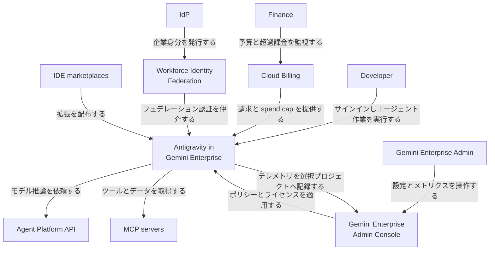
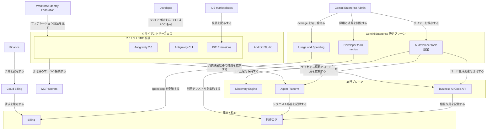
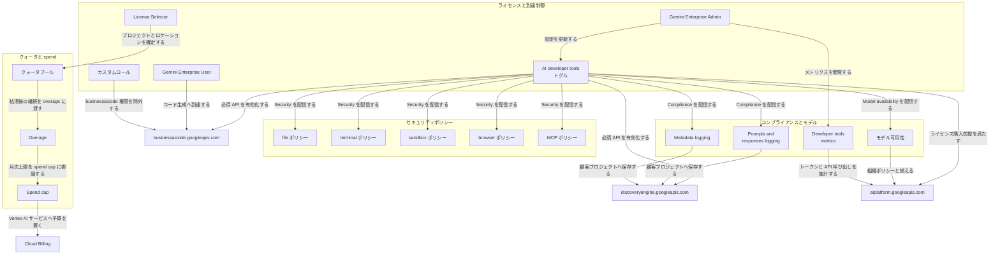
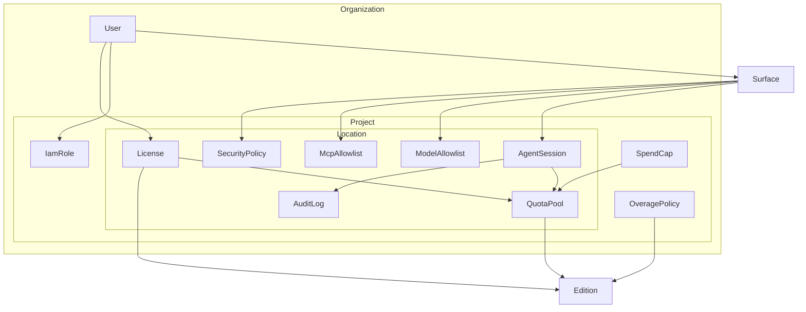
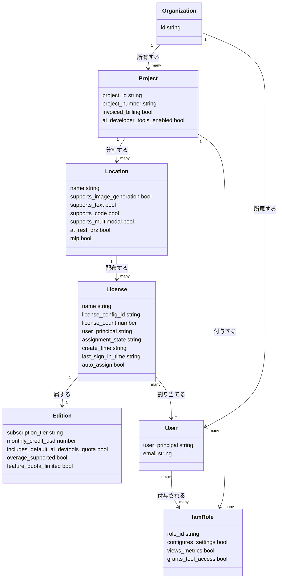
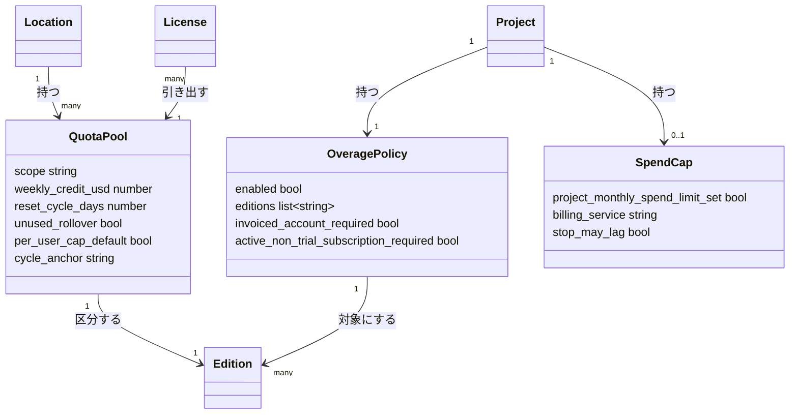
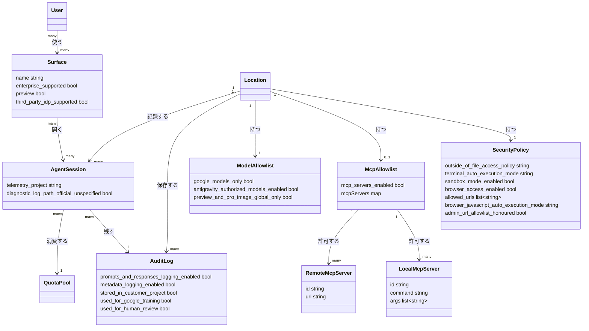

2026-08-21、Google Cloud が [Expanding Google Antigravity for enterprise customers](https://cloud.google.com/blog/products/ai-machine-learning/expanding-google-antigravity-for-enterprise-customers) を公開しました。Antigravity 製品側の [Bringing Antigravity to Gemini Enterprise](https://www.antigravity.google/blog/antigravity-enterprise) は前日の 2026-08-20 です。

この記事は、Antigravity を全社導入するときに審査すべき**管理プレーン**（ID・予算枠・実行境界・監査ログ・モデル可用性）の構造を、公式ドキュメントの記述範囲で整理したものです。読み終えると、次の判断ができます。

- どのライセンス経路を選ぶか（Agent Platform 直結かライセンス同梱か）
- クォータがどう執行されるか（月次表記だが実体は 7 日ローリング）
- どの設定が既定で開いていて、どこを締めるべきか
- 何が管理プレーンの**外**に漏れる経路なのか

前提として、導入審査は「どのモデルを許可するか」では終わりません。ファイル・ターミナル・ブラウザ・MCP という実行面と、それを誰の予算で回すかまでが 1 つの審査単位になります。


*この記事の全体像。以下、順に解説します。*

## 概要

Google Antigravity は、コードベース調査・ローカルビルド・ブラウザ操作・複数ステップの実装をエージェントへ委任する agent-first な開発プラットフォームです。2026-08-21 の発表は、この実行面を **Gemini Enterprise の管理プレーン**（ライセンス、支出、セキュリティ、可観測性、利用メトリクス）へ同梱する動きです。

位置づけは 3 層に分かれます。

| 層 | 役割 |
|---|---|
| 実行サーフェス | Antigravity 2.0、Antigravity CLI（バイナリ名 `agy`）、Antigravity IDE Extensions、同梱の Android Studio |
| 管理プレーン | Gemini Enterprise admin console（Settings > AI developer tools、Developer tools metrics、Usage and Spending） |
| 推論・課金基盤 | Gemini Enterprise Agent Platform（`aiplatform.googleapis.com`）と Cloud Billing |


対象ライセンスは Gemini Enterprise **Standard**、**Plus**、**Standard Emerging Market**、および invoiced アカウント向け **Pay-as-you-go** です。Cloud Blog は Standard / Plus / Standard Emerging Market を eligible とし、broader support は近日と案内しています。

前提は **invoiced Cloud Billing**（月次請求書が発行されるオフライン課金）です。多くの AI developer tools ドキュメントは、件名 `[Billing Update] New Gemini Enterprise overage billing controls launching August 17, 2026` の案内を受けたアカウントを対象に書かれています。この 1 点が後述するドキュメント分岐の起点になるので、最初に自社アカウントの状態を確認してください。

### 2 つの接続経路

公式は接続を 2 経路に分けています。

| 経路 | 課金 | 得られるもの |
|---|---|---|
| Gemini Enterprise Agent Platform | Agent Platform の消費課金 | 組織 GCP 上のモデルエンドポイントへ直結。Cloud ToS、データレジデンシ、VPC Service Controls |
| Gemini Enterprise license | シート同梱クォータ + 管理された overage | 同梱クレジット、edition 単位の共有プール、AI developer tools の管理設定（サンドボックス、ブラウザ、MCP、監査、モデル可用性） |

Agent Platform 経路は I/O 2026（2026-05）時点の企業向け入口でした。2026-08 の発表は、license 経路へ included quotas / managed overages / advanced administrative controls を足す段階です。

### サーフェスの対応範囲

公式が同一の agent harness を共有すると説明するのは Antigravity 2.0 と CLI です。IDE 拡張は初回起動時にローカルの `agy` バックエンドを入れる作りで、実体としては CLI と同じ系統に載ります。Android Studio は同じ Gemini Enterprise ライセンスに同梱される AI developer tools ですが、公式一覧では Antigravity とは別ツールとして扱われます。

| サーフェス | 位置づけ | Enterprise |
|---|---|---|
| Antigravity 2.0 | デスクトップのオーケストレーション | 対応 |
| Antigravity CLI（`agy`） | 端末・SSH・headless。ADC あり | 対応 |
| Antigravity IDE Extensions | 既存エディタ内。VS Code は GA、Visual Studio / JetBrains / Zed は Preview | 対応 |
| スタンドアロン Antigravity IDE | エディタ一体型の個人向けサーフェス | 全社展開の対象外。IDE は Extensions 経路を使う |
| Android Studio（canary） | 同梱の AI developer tools | 対応。第三者 IdP は対象外 |
| Python SDK（`google-antigravity`） | プログラムからのエージェント構築 | admin console の対象外。公式 README は API キーに加え `vertex=True` と ADC をサポート |

2026-05-19、Google は端末体験の主軸を Gemini CLI から Antigravity CLI へ移すと発表しました。企業の既存 Gemini CLI / Code Assist アクセスは継続します。これからエージェントを全社展開する組織向けの新経路が、Gemini Enterprise 同梱の Antigravity という位置づけです。

### 何を選ぶかの目安

類似ツールとの差はコーディング能力ではなく、**ID・予算・監査・サンドボックス・MCP 統制をどこに集約するか**にあります。Antigravity in Gemini Enterprise は、GCP 請求・VPC-SC・データレジデンシと同じ管理プレーンへ、エージェントのファイル / ターミナル / ブラウザ / MCP を載せます。

ただし、操作するコンソールは 1 つではありません。責任分界は次のとおりです。

| コンソール | 担当範囲 |
|---|---|
| Gemini Enterprise admin console | ライセンス配布、Security / Compliance / Model availability、MCP allowlist、利用メトリクス、overage の切替 |
| Cloud Billing | 予算・spend cap（Vertex AI サービス単位）、invoiced アカウントの請求 |

「集約」は、この 2 つが同じ GCP プロジェクトと同じ請求体系の上に載る、という意味です。

| ユースケース | 推奨 |
|---|---|
| 既存 IDE を維持した全社展開 | IDE Extensions + Gemini Enterprise license |
| SSH、CI、headless、ADC | Antigravity CLI（`agy`） |
| 複数エージェントの可視化 | Antigravity 2.0 |
| まず消費課金で GCP に載せる | Agent Platform 経路 |
| 予算・監査・MCP を経理/情シスに見せる | Gemini Enterprise license 経路 |
| パワーユーザー偏在、シート余りを減らす | license の pooled quotas |
| クォータ到達後も作業を止めない | overage + Billing の spend cap |

## 特徴

エージェント機能そのものは次の範囲です。

- コード変更と PR の欠陥・脆弱性・スタイル違反の検出、修正提案
- テスト失敗・ビルド破損・ランタイムエラーのログ / スタック追跡と修正提案
- 機能実装、レガシー refactor、API 移行、テストスイート生成などの複数ステップ委任
- ブラウザ操作と MCP 経由の追加データ源・ツール接続（admin 許可時）
- サーフェス横断（2.0 / `agy` / IDE / Android Studio）での同一コーポレート ID

管理プレーン側で足されたものが、今回の本体です。

| 面 | 内容 |
|---|---|
| ライセンス集約 | eligible な Gemini Enterprise シートに Antigravity を同梱 |
| ID | Business account SSO、License Selector（project + location は `global` / `us` / `eu`、1 license per project and location）、WIF、CLI の ADC |
| 権限分離 | Admin ロールは設定とメトリクス。`businessaicode.` 系の実行権限は User ロールの一覧にのみ載る。Admin 単体で使えるかは公式間で記述が割れる（後述） |
| 予算 | プロジェクト monthly caps。Standard $10 / Plus $15 の月次表記を 7 日ローリング共有プールで執行 |
| 監査 | Prompts and responses logging / Metadata logging。顧客プロジェクト保管。Google は訓練・人手レビューに使わない |
| 実行境界 | ワークスペース外ファイル、ターミナル、isolated sandbox、外部 Web、JavaScript、MCP allowlist |
| モデル | Google 製のみ。preview モデルと画像生成は `global` のみ |
| 観測 | Developer tools metrics（Preview）。Daily Tool Calls 系はデータ非表示 |
| ネットワーク境界 | Agent Platform API を VPC-SC ペリメータへ追加 |


### いまの境界

導入判断で効いてくる制約を、公式の記述範囲で挙げます。

- 全社展開の対象サーフェスは 2.0 / CLI / IDE Extensions（スタンドアロン IDE は個人向け）
- ブラウザ URL allowlist は Antigravity browser agent 向け。admin URL allowlist はまだ honoured されない
- Outside of file access の初回既定は Deny（ドキュメント上の期待既定 Always ask と異なる既知状態）
- 画像生成は `global` のみ（`us` / `eu` は Text / Code / Multimodal）
- 対象外コンプライアンス: Access Transparency、FedRAMP Moderate/High、IL4/IL5、ISO 27001/42001、ITAR、SOC 1/2/3
- 必須 API はライセンス購入前に有効化する（`aiplatform.googleapis.com` の伝播は約 5 分）

モデル名まわりは公式ページ間で表記が割れています。Settings は画像生成に Gemini 3 Pro Image と書き、Models の Additional Models は Nano Banana 2 と書きます。[Data residency / locations](https://docs.cloud.google.com/gemini/enterprise/docs/locations) は Gemini 3 Pro Image（Nano Banana Pro）と Gemini 3.1 Flash Image（Nano Banana 2）を**別モデル**として、いずれも `global` のみと書きます。別名として畳まずに読むのが安全です。

## 構造

接続経路は前述の 2 つ（Agent Platform 直結の消費課金、ライセンス接続の同梱クォータ + managed overages + 管理統制）です。対応サーフェスは Antigravity 2.0、Antigravity CLI `agy`、IDE Extensions、同梱の Android Studio（canary）で、スタンドアロン Antigravity IDE は enterprise 非対応です。[Antigravity in Gemini Enterprise](https://antigravity.google/docs/enterprise/) は Antigravity 2.0 と CLI を中核に据え、IDE 拡張は [IDE Extensions](https://antigravity.google/docs/ide/extensions) 側で案内されます。[AI developer tools overview](https://docs.cloud.google.com/gemini/enterprise/docs/ai-developer-tools-overview) は Antigravity 本体と IDE 向け、Android Studio をそれぞれ別項目として並べます。**どこまでを 1 つの製品として数えるかは公式ページごとに粒度が違う**ので、対応表を作るときは参照元を揃えてください。

### システムコンテキスト

登場する主体と外部システムの関係です。



アクター:

| 要素名 | 説明 |
|---|---|
| Developer | 対応サーフェスから Business account でサインインし、ライセンス選択後にエージェント作業を行う。必要ロールは Gemini Enterprise User |
| Gemini Enterprise Admin | Admin Console で AI developer tools の有効化、セキュリティ・コンプライアンス・モデル可用性、overage、メトリクス閲覧を行う。権限一覧上は `businessaicode.` 系の実行権限を持たない |
| Finance | 請求アカウント種別の確認、プロジェクト月次 spend cap、overage 費用の監視を Cloud Billing 側で担う |
| IdP | 企業の外部 Identity Provider。Workforce Identity Federation 経由で BYOID サインインの主体になる |

調査対象と外部システム:

| 要素名 | 説明 |
|---|---|
| Antigravity in Gemini Enterprise | 組織の Google Cloud プロジェクト上で Antigravity を動かす統合。セッションは Google Cloud Terms of Service、データレジデンシ、VPC Service Controls の対象になる |
| Gemini Enterprise Admin Console | Settings の AI developer tools タブ、Usage and Spending、Developer tools metrics を操作するコンソール |
| Agent Platform API | モデルエンドポイント。API ID は `aiplatform.googleapis.com`。ライセンス購入前の有効化が必要。消費課金経路の接続先でもある |
| Cloud Billing | invoiced アカウント前提の請求基盤。overage と AI developer tools の課金は Vertex AI サービス `aiplatform.googleapis.com` として計上する |
| Workforce Identity Federation | BYOID の仲介。Advanced WIF Configuration で構成文字列を渡す。Agent Platform on Antigravity 2.0 は未サポート |
| MCP servers | エージェントが追加データ源・ツールへ接続するローカルおよびリモートの MCP サーバ。管理プレーンの allowlist 対象 |
| IDE marketplaces | VS Code Marketplace、Visual Studio Marketplace、JetBrains Marketplace、Zed 拡張配布面。VS Code は GA、他は Preview |

### コンテナ

設定プレーン・実行プレーン・課金/監査の 3 ブロックと、クライアントサーフェスの関係です。



クライアントサーフェス:

| 要素名 | 説明 |
|---|---|
| Antigravity 2.0 | デスクトップのエージェント開発環境。ブラウザ SSO と License Selector を持つ。スタンドアロン Antigravity IDE とは別製品 |
| Antigravity CLI | 端末とヘッドレス向け。バイナリ名は `agy`。SSO に加え CLI 限定の Application Default Credentials を持つ |
| IDE Extensions | 既存 IDE へエージェント作業を載せる拡張。ライセンス経路のサインインは SSO（`oauth-business`）。JetBrains / Zed の Agent Platform Preview は `auth.type: agent-platform` と ADC を案内する |
| Android Studio | 同梱の AI developer tools。canary。第三者 IdP は対象外。ADC は持たない |

Android Studio の扱いには注意が必要です。Antigravity Enterprise ページが対応製品として前面に出すのは 2.0 と CLI で、Android Studio は Gemini Enterprise 側の AI developer tools 一覧に**別ツールとして**載ります。上図では同じライセンス・同じ設定プレーンの配下という意味でクライアント群に置いていますが、Antigravity と同一の agent harness を共有するかどうかは公式が明示していません。ポリシー適用先としては同列に、製品としては別物として扱うのが安全です。

設定プレーン:

| 要素名 | 説明 |
|---|---|
| AI developer tools 設定 | トグルで機能を有効化し、Security、Compliance、Model availability をプロジェクトへ適用する。トグル時に必須 API の有効化を検査する |
| Developer tools metrics | Preview の採用・トークン・API 呼び出しダッシュボード。Admin ロール必須。遅延は 5〜15 分 |
| Usage and Spending | edition 単位の overage 切替と、プロジェクト月次 spend limit への入口 |

実行プレーンと課金/監査:

| 要素名 | 説明 |
|---|---|
| Discovery Engine | Gemini Enterprise のコア基盤。API ID は `discoveryengine.googleapis.com`。設定管理、セキュリティとコンプライアンス制御、ライセンス設定を提供する |
| Business AI Code API | Antigravity in Gemini Enterprise 向けのコード生成到達面。API ID は `businessaicode.googleapis.com`。有効化だけでは利用できず、IAM とライセンスが別途必要 |
| Agent Platform | モデル推論と消費課金経路。リージョンは `global` / `us` / `eu`。VPC Service Controls の対象 API。ライセンス経路でもモデル組織ポリシーとの整合が必要 |
| Billing | 同梱クレジット消化、overage、Pay-as-you-go を Cloud Billing の Vertex AI サービスへ結びつける課金制御。invoiced アカウント必須 |
| 監査ログ | 開発者相互作用と製品メタデータのコンプライアンス記録、および Agent Platform のリクエスト応答ログ。顧客プロジェクト内に保存する |

### コンポーネント

管理プレーンの内部を、ライセンス到達制御・クォータ/spend・セキュリティポリシー・コンプライアンス/モデルの 4 群に分けます。



ライセンスと到達制御:

| 要素名 | 説明 |
|---|---|
| AI developer tools トグル | 既存サブスクリプションではロケーションごとに手動有効化。新規 Standard / Plus / Pay-as-you-go は対応ロケーションで既定オン。有効化時に Discovery Engine と Business AI Code API を自動有効化できる |
| License Selector | SSO 後に割り当て済みライセンスを表示し、紐づくプロジェクトを確定する。Other でプロジェクト ID とロケーション `global` / `us` / `eu` を自己割当できる。1 ライセンスはプロジェクトとロケーションの組に 1 つ |
| Gemini Enterprise Admin | ロール ID は `roles/discoveryengine.agentspaceAdmin`。設定とメトリクス権限。権限一覧に `businessaicode.` 系の実行権限は載らない |
| Gemini Enterprise User | ロール ID は `roles/discoveryengine.agentspaceUser`。`businessaicode.` 系の実行権限を含む唯一の事前定義ロール |
| カスタムロール | User ロールから `businessaicode.` で始まる権限を除いたロール。AI developer tools への到達を封じる |

クォータと spend:

| 要素名 | 説明 |
|---|---|
| クォータプール | Standard と Plus の AI developer tools クレジットを、edition ごと・プロジェクトとロケーション単位の共有プールとして執行する。表現は月次 per-user だが執行は 7 日ローリング。未使用は翌週へ繰越さない。Standard Emerging Market は公開クォータ表に AI developer tools の金額掲載がない。Pay-as-you-go は機能クォータなし |
| Overage | Usage and Spending の Feature usage で edition 単位に有効化する。プール枯渇後も Agent Platform 価格で継続する。Pay-as-you-go には適用しない |
| Spend cap | プロジェクト月次上限。Gemini Enterprise app、Agent Platform、Antigravity を含む。Cloud Billing の予算スコープは Vertex AI `aiplatform.googleapis.com`。停止反映まで数分遅れ得る。per-user / team は later this year |

セキュリティポリシー:

| 要素名 | 説明 |
|---|---|
| file ポリシー | 作業フォルダ外ファイルへのエージェント権限。Deny / Always ask / Allow。初回設定時の既定は Deny |
| terminal ポリシー | 端末コマンド実行。Require review / Proceed in sandbox / Always proceed。既定は Always proceed |
| sandbox ポリシー | エージェントツールを隔離サンドボックスへ制限する。既定は Disabled |
| browser ポリシー | 外部 Web アクセス、URL allowlist、JavaScript 実行。allowlist は Antigravity browser agent に適用。Admin URL allowlist は未統合 |
| MCP ポリシー | MCP サーバへのアクセス管理と管理者定義の allowlist。既定は Disabled |

コンプライアンスとモデル:

| 要素名 | 説明 |
|---|---|
| Prompts and responses logging | 開発者と AI の対話を記録し、利用指標と監査証跡にする。顧客プロジェクト内保存。既定 Disabled |
| Metadata logging | 製品メタデータを記録し組織横断の利用分析に使う。既定 Disabled |
| モデル可用性 | Antigravity がプロジェクト内で使える Google 製モデルを制限する。preview と Gemini 3 Pro Image は `global` のみ。Agent Platform の組織ポリシーと不一致だとクォータ超過後の pay-as-you-go が失敗し得る |
| Developer tools metrics | アクティブユーザー、Total Tokens、Daily Token Usage、Daily API Calls を表示する。Daily Tool Calls と Daily Tool Calls Accepted はデータ非表示 |

## データ

管理プレーンが扱う資源の所有関係と属性を整理します。一次情報に実体があるものだけを採用しています。AgentSession の独立 API リソース名は公式未明示のため、属性は公式に書かれた範囲に限っています。

### 概念モデル

所有は subgraph の入れ子、利用は矢印で表しています。



| 要素 | 役割 |
|---|---|
| Organization | GCP 組織。Project と User を束ねる。Gemini Enterprise 購読そのものの所有単位ではない |
| Project | ライセンス配布、AI developer tools 設定、テレメトリ格納、spend の単位 |
| Location | ライセンスと設定の分割単位。同一 Project でも location が違えば別 License が要る |
| License | project+location に配布した座席と、User への割当。1 license per project and location |
| Edition | Standard / Plus / Standard Emerging Market / Pay-as-you-go。クォータと overage の区分 |
| QuotaPool | 同一 edition・同一 project+location の共有枠。AI developer tools は 7 日ローリング |
| OveragePolicy | プール超過後に pay-as-you-go 継続するかを edition 単位で決める |
| SpendCap | Project の月次支出上限。overage と Pay-as-you-go を止める |
| SecurityPolicy | ファイル外アクセス、端末、sandbox、ブラウザ、JavaScript |
| McpAllowlist | MCP の有効化と local / remote サーバ許可 |
| ModelAllowlist | Antigravity が使ってよい Google 製モデル |
| AuditLog | プロンプト/レスポンスと product metadata の記録。顧客 Project 内に保存 |
| User | ライセンス割当対象。IAM とは別軸 |
| IamRole | 設定/メトリクス（Admin）とツール実行権限（User）を分ける |
| AgentSession | Surface 上の 1 実行。選択した License の Project へテレメトリを書く |
| Surface | Antigravity 2.0、CLI、IDE 拡張、Android Studio |

OveragePolicy と SpendCap は Usage and Spending が Project 単位のため、Location の外に置いています。Edition と Surface はカタログ / 製品面であり、顧客資源の所有物ではありません。

### 情報モデル

型は `string` / `bool` / `number` / `list` / `map` のみで、メソッドは持ちません。見通しのため、テナンシ / 予算 / ポリシーの 3 つに分けて示します。

まずテナンシとライセンスです。



次に予算まわりです。



最後にポリシー・監査・セッションです。



読み解きのポイントです。

| 要素 | 説明 |
|---|---|
| License と User | 1 人の User は project+location ごとに License を持つ。同一 Project の `us` と `global` は別 License。上図の License は購読・割当・エクスポートを 1 つに畳んだ説明用のクラスで、**属性名は API / CSV の正式フィールド名ではない**。実装では公式名を確認する。公式 REST は購読側 `billingAccounts/{id}/billingAccountLicenseConfigs/{id}` と、割当側 `projects/{id}/locations/{location}/userStores/default_user_store` に分かれ、REST は camelCase、CSV エクスポートは snake_case。割当状態には未ログイン系の値も存在する |
| QuotaPool | edition ごとに 1。同一 Location に edition が複数あると QuotaPool は many。edition をまたいで合算しない |
| IamRole | 事前定義 2 種が中核。カスタムロールは `businessaicode.*` を外した User 相当 |
| SpendCap | 未設定可（0..1）。未設定のまま overage を入れると制限なく課金される |
| SecurityPolicy 既定 | Outside of file = Deny。Terminal = Always proceed。sandbox / browser / JS / MCP = Disabled |
| MCP JSON | 公式キーは `mcpServers.local_servers` の `id` / `command` / `args` と `mcpServers.remote_servers` の `id` / `url` |
| QuotaPool 執行 | weekly_credit_usd = monthly_credit_usd / 4 × purchased seats。reset_cycle_days = 7。unused_rollover = false |
| AuditLog 既定 | Prompts and responses logging と Metadata logging は Disabled。保存先は顧客プロジェクト |

Edition 別のクレジット:

| 属性 | Standard | Plus | Standard Emerging Market | Pay-as-you-go |
|---|---|---|---|---|
| monthly_credit_usd | 10 | 15 | 公開表に金額の掲載なし | 枠なし（Agent Platform 価格） |
| includes_default_ai_devtools_quota | true | true | 公式間で記述が不一致 | false |
| overage_supported | true | true | true | 非適用（全量が PAYG） |

Location 能力とデータレジデンシ:

| Location | Text / Code / Multimodal | Image Generation | AI developer tools の at-rest DRZ | AI developer tools の MLP |
|---|---|---|---|---|
| `global` | 対応 | 対応 | 公式は US/EU 表で別管理。機能・最新モデル優先 | 公式は US/EU 表で別管理 |
| `us` | 対応 | 対象外 | 対応 | 対応 |
| `eu` | 対応 | 対象外 | 対応 | 対応 |
| in-country（`ca` / `in` / `asia-northeast1` / `sg` / `europe-west2`） | 本統合の対象外 | 対象外 | 対象外 | 対象外 |

at-rest DRZ は静止時の顧客データ所在地コミットメント、MLP は学習・予測などの機械学習処理の所在地コミットメントです。AI developer tools（Antigravity 2.0 / CLI / IDE / Android Studio）は US / EU で両方に対応し、in-country ではどちらも対象外です。

QuotaPool の `cycle_anchor` は、プロジェクトで AI developer tools へ最初に送った prompt / request の時刻です。そこから 7 日で週次プールがリセットされます。

Surface 対応:

| name | enterprise_supported | preview | third_party_idp_supported |
|---|---|---|---|
| Antigravity 2.0 | true | false | BYOID は 2.0 で提供。Agent Platform 経路は BYOID 不可 |
| Antigravity CLI | true | false | ADC あり |
| Visual Studio Code 拡張 | true | false（GA） | 公式未明示 |
| Visual Studio 拡張 | true | true | 公式未明示 |
| JetBrains 拡張 | true | true | 公式未明示 |
| Zed 拡張 | true | true | 公式未明示 |
| Android Studio | true（canary） | true（canary） | false |
| Antigravity IDE（スタンドアロン） | false | — | — |

## 導入手順

### 前提条件

- 対象 edition は Gemini Enterprise Standard / Plus / Standard Emerging Market / Pay-as-you-go です。
- Standard Emerging Market は eligible 顧客のみで、Google アカウントチームが判定します。
- AI developer tools は invoiced Cloud Billing が必須です。
- 多くの AI developer tools ページは、件名 `[Billing Update] New Gemini Enterprise overage billing controls launching August 17, 2026` のメール受信を前提にしています。
- メール受信済みアカウントのクォータ正本は [Quotas and overages (Legacy)](https://docs.cloud.google.com/gemini/enterprise/docs/overages) です。現行の [Quotas and overages](https://docs.cloud.google.com/gemini/enterprise/docs/quotas-and-overages) は冒頭で、受信者にこのページのクォータを適用しないと明記しています。
- Standard $10 / Plus $15、7 日ローリング、未使用繰越なしは Legacy と現行の両方にあります。この記事の金額は Legacy の AI developer tools 節に基づきます。
- Standard Emerging Market の同梱クォータは公式間で記述が揃いません。現行ページの Emerging Market 表には AI developer tools 行がなく、Legacy の Emerging Markets 表にも Antigravity 行はありません。一方で Cloud Blog は同 edition を eligible として挙げます。**対象可否と同梱額は Google アカウントチームへ確認する事項**として扱ってください。
- スタンドアロン Antigravity IDE は使いません。2.0 / CLI / IDE 拡張のみです。

必須パラメータ:

| 種別 | 名前 | 値 / パス |
|---|---|---|
| API | Agent Platform API | `aiplatform.googleapis.com`。**ライセンス購入前に有効化**し、伝播を約 5 分待つ |
| API | Gemini Enterprise API | `discoveryengine.googleapis.com` |
| API | Business AI Code API | `businessaicode.googleapis.com`。有効化だけでは利用権は付かない |
| IAM | Gemini Enterprise Admin | `roles/discoveryengine.agentspaceAdmin`。設定とメトリクス |
| IAM | Gemini Enterprise User | `roles/discoveryengine.agentspaceUser`。ツール利用。管理者にも付与しておくのが安全 |
| リージョン | License location | `global` / `us` / `eu`。1 license per project and location |

### 必須 API を先に入れる

ライセンス購入より先に Agent Platform API を有効化します。手順は「プロジェクトを選ぶ（または専用プロジェクトを作る）→ Cloud Billing がアクティブか確認 → API 有効化 → 約 5 分待つ」です。

```bash
gcloud services enable aiplatform.googleapis.com --project PROJECT_ID
gcloud services list --enabled --project PROJECT_ID --filter="config.name:aiplatform.googleapis.com"
```

```bash
gcloud projects add-iam-policy-binding PROJECT_ID \
  --member="user:ADMIN@example.com" \
  --role="roles/discoveryengine.agentspaceAdmin"
gcloud projects add-iam-policy-binding PROJECT_ID \
  --member="user:DEV@example.com" \
  --role="roles/discoveryengine.agentspaceUser"
```

Gemini Enterprise API と Business AI Code API は、コンソールの **AI developer tools** トグルを入れると未有効なら自動で有効化されます。API 有効化は IAM ロールとライセンスの代替にはなりません。

### IAM の設計

- 管理者が自分でツールを使う場合も、安全側に倒して User を別途付与しておきます（可否は後述のとおり公式間で記述が割れます）。
- license 経路の利用ロールは `roles/discoveryengine.agentspaceUser` です。VS Code / Visual Studio Marketplace の説明は接続に Agent Platform User（`roles/aiplatform.user`）を要求します。両ロールが同時必須かは公式が経路別に書いており、実機未検証です。
- ライセンス購入・配布には Admin に加え、課金側で `roles/billing.admin` と `roles/serviceusage.serviceUsageConsumer` が必要です。
- ツール利用を禁じたいユーザーには既定 User を付けず、カスタムロールを使います。

### ライセンス購入順序

```text
1. aiplatform.googleapis.com を有効化
2. 約 5 分待つ
3. Gemini Enterprise で Create subscription
4. プロジェクトと Location (global | us | eu) に Distribute
5. Manage users で手動割当、または自動割当
6. 利用者に roles/discoveryengine.agentspaceUser を付与
```

- ライセンスは project × location 単位です。
- 同一プロジェクトの `us` と `global` にアプリがある場合、ロケーションごとに別ライセンスが要ります。
- コンソール席数上限は Self-serve / resold が最大 25 席、Invoiced が最大 1,000 席です。

### コンソールで AI developer tools を有効化

新規 Standard / Plus / Pay-as-you-go は購入ロケーションが対応していれば既定で有効です。既存サブスクリプションはロケーションごとに管理者が手動で入れます。

1. `https://console.cloud.google.com/gemini-enterprise/` を開く。
2. Settings → AI developer tools タブ。
3. AI developer tools トグルをオンにする。
4. Security / Compliance / Model availability を設定する。

Outside of file access の初回既定は Deny です。Ask にしたい場合は明示的に変更してください。

### セキュリティ設定

Settings > AI developer tools > Security です。管理者ポリシーはユーザー側で上書きできない強制設定として配信されます。

| 設定 | 選択肢 | 公式の既定 |
|---|---|---|
| Outside of file access | Deny / Always ask / Allow | Deny（初回。期待される Always ask ではない） |
| Terminal 自動実行 | Require review / Proceed in sandbox / Always proceed | Always proceed |
| Isolated sandbox | Enabled / Disabled | Disabled |
| External web access | 有効 / 無効 | Disabled |
| JavaScript | Disabled / Request review / Allowed | Disabled |
| MCP servers | 有効 / 無効 | Disabled |

MCP を許可する場合は allowlist JSON を書きます。UI がフィールドを検証します。

```json
{
  "mcpServers": {
    "local_servers": [
      {
        "id": "gopls-mcp-server",
        "command": "go",
        "args": ["run", "golang.org/x/tools/gopls@latest", "mcp"]
      }
    ],
    "remote_servers": [
      { "id": "bigquery" },
      {
        "id": "custom-remote-server",
        "url": "https://mcp.example.com/mcp"
      }
    ]
  }
}
```

- `local_servers`: `id` は必須。`command` / `args` は任意で、指定するとユーザーローカル設定を上書きします。
- `remote_servers`: `id` は必須。カスタム remote は `url` 必須、プリセット remote は任意です。

VPC-SC を使う場合は Agent Platform API を perimeter に入れます。

### コンプライアンス設定

| 設定 | 内容 | 既定 |
|---|---|---|
| Prompts and responses logging（対話ログ） | 開発者と AI の対話を記録。利用メトリクスと監査用 | Disabled |
| Metadata logging（製品メタデータログ） | プロダクトメタデータを記録 | Disabled |

ログは顧客プロジェクト内に保存されます。Google はモデル訓練にも人手レビューにも使わない、と設定ページは述べています。保持期間と Cloud Logging のリソースタイプ名は、AI developer tools 設定ページには記載がありません（公式未明示）。

別系統として、Agent Platform の [request/response logging](https://docs.cloud.google.com/gemini-enterprise-agent-platform/models/capabilities/request-response-logging)（Preview）は BigQuery テーブルへサンプルを書きます。保存先例は `bq://PROJECT_ID.DATASET_NAME.TABLE_NAME`、既定テーブル名は `request_response_logging` です。これはコンソールの Compliance トグルとは別機能です。Enterprise の AI developer tools で使えるのは Google 製モデルのみのため、MaaS partner への data sharing はこの経路の対象外です。

適合判定のために、Antigravity in Gemini Enterprise が対象外とする認証・規格を挙げておきます。

- Access Transparency (AXT)
- FedRAMP Moderate / High
- IL4 / IL5
- ISO 27001 / ISO 42001
- ITAR
- SOC 1 / SOC 2 / SOC 3

### モデル設定

- Gemini Enterprise の AI developer tools で選べるのは Google 製モデルのみです。
- 許可リストは [Models の Enterprise 列](https://antigravity.google/docs/models) を見ます。
- Gemini Enterprise でモデルを許可しても、Agent Platform の organization policy は上書きされません。両側の許可モデルを揃えます。
- Preview モデルと画像生成は `global` のみです。
- Settings はバックグラウンドに Gemini Flash Lite、画像生成に Gemini 3 Pro Image を使うと述べます。Models の Additional は生成画像ツールに Nano Banana 2 を挙げます。locations ページは Gemini 3 Pro Image（Nano Banana Pro）と Gemini 3.1 Flash Image（Nano Banana 2）を別モデルとして列挙します。

### カスタムロール

既定 User ロールは AI developer tools 利用を含みます。禁じる手順は次のとおりです。

1. IAM and Admin > Roles > Create role。
2. Add permissions で `roles/discoveryengine.agentspaceUser` を選ぶ。
3. 付いた権限のうち `businessaicode.` で始まるものをすべて除去する。
4. Create し、既定 User の代わりにそのカスタムロールを付ける。

### Overage と spend cap

週次プールの式です。

```text
weekly_pool_usd = (monthly_per_user_usd / 4) * purchased_seats
```

ドキュメントは受信メールの有無で分岐します。

- AI developer tools と新コントロール一式: 前述の Billing Update メールを受信した invoiced プロジェクト向け。クォータ正本は Legacy。
- [Configure overages](https://docs.cloud.google.com/gemini/enterprise/docs/configure-overages) の Usage and Spending トグル: そのメールを受信していない invoiced プロジェクト向け。受信済みならこの画面の overage 機能は使えないと明記されています。

つまり受信済み（この統合の主対象）の overage 手順は、Configure overages のコンソール手順では再現できません。Legacy は上限到達時に overage を選ぶ別 UX を述べます。受信済み向けの Usage and Spending 手順は、2026-08-22 時点の公開 how-to に欠けています。

Spend cap（Project monthly spend limit）の要点です。

1. Set limit で Cloud Billing の budget / spend cap を開く。
2. 予算スコープの Services で Vertex AI（`aiplatform.googleapis.com`）を選ぶ。
3. 上限到達後の停止には数分かかることがあり、超過課金がありえます。
4. overage をオンにして spend limit を付けないと、プール超過後も従量で無制限に進みます。

## 利用方法

### CLI インストール

製品名は Antigravity、実行ファイル名は `agy` です。Unix の配置先は `~/.local/bin/agy`、Windows は `%LOCALAPPDATA%\agy\bin` です。

```bash
curl -fsSL https://antigravity.google/cli/install.sh | bash
```

```powershell
irm https://antigravity.google/cli/install.ps1 | iex
```

```cmd
curl -fsSL https://antigravity.google/cli/install.cmd -o install.cmd && install.cmd && del install.cmd
```

公式が列挙するインストーラフラグは次の 2 つのみです。

- `--skip-aliases`: レガシー `agy` / `antigravity` エイリアスの purge / 更新をしない。
- `--skip-path`: shell profile への PATH 追記をしない。

[CLI Installation and auth](https://antigravity.google/docs/cli/install) は macOS / Linux の `curl | bash`、Windows PowerShell の `irm | iex`、Windows CMD の `install.cmd` を案内します。チェックサムや署名検証の手順は当該ページにはありません。配布物の検証を required にしている組織は、この点を先に確認してください。

### Antigravity 2.0 の入手

デスクトップアプリは [Antigravity のダウンロード](https://antigravity.google/download) から入れます。enterprise ページは最新の 2.0 を要求します。スタンドアロン Antigravity IDE はここでも使いません。起動後のサインインは CLI と同じ License Selector です。ADC 手順は 2.0 にはありません。

### 初回起動

プロジェクトディレクトリで起動します。

```bash
agy
```

初回はインタラクティブに次を設定します。

- Color Scheme（Solarized / Dark / Solarized Light / Terminal）
- Rendering Mode（Alt-Screen / Inline）
- Workspace Trust。承認後にエージェントがファイルを索引します。

ローカルでは OS キーリングにトークンがあればブラウザを開かずサイレント認証します。SSH 時は表示された URL をローカルブラウザで開き、authorization code をリモートのプロンプトへ貼ります。

### SSO

対象は Antigravity 2.0、CLI、対応 IDE 拡張です。

1. サーフェスを起動し Sign in。
2. Business account（Google Cloud Terms of Service）を選ぶ。
3. Continue with Google Cloud（または Advanced WIF）。
4. ブラウザで認証する。
5. License Selector で割り当て済みライセンスを確認する。
6. ライセンスに紐づくプロジェクトを選ぶ。または Other で project ID と location を入れてセルフアサインする。

プロジェクトまたはロケーションの切替は、CLI / Hub からログアウトして再ログインします。

### WIF（BYOID）

1. Business account を選ぶ。
2. Advanced WIF Configuration。
3. 管理者が渡した WIF Configuration String を入れる。
4. フェデレーション IdP でサインインする。
5. License Selector で選択またはセルフアサインする。

制約は次のとおりです。

- 同一メールが複数 IdP にある場合は、Gemini Enterprise ライセンス側の identity で入ります。
- BYOID は Agent Platform on Antigravity 2.0 を未サポートです。
- 一部ユーザーは 2.0 / CLI の再起動後に意図せずログアウトされ、再認証が必要になります。
- Android Studio は第三者 IdP 非対応です。

### ADC（CLI のみ）

ヘッドレス / 自動化向けで、Antigravity CLI 専用です。

```bash
gcloud auth application-default login --project GCP_PROJECT
```

Linux / macOS の既定パスです。

```text
~/.config/gcloud/application_default_credentials.json
```

```bash
export AGY_ADC_AUTH=true
```

解除します。

```bash
unset AGY_ADC_AUTH
```

ADC 時は Gemini 3 Flash より古いモデルが非対応です。画像生成は ADC に依存せず `global` のみで、`us` / `eu` ではサーフェスを問わず対象外です。

### Headless

[CLI Headless](https://antigravity.google/docs/cli/headless) の `-p`（エイリアス `--print` / `--prompt`）で 1 プロンプト実行して終了します。応答は stdout、診断は stderr です。キャッシュ資格情報が要ります。未認証の非対話環境は hang せず `authentication required` で終了します。

```bash
agy -p "In one sentence, what is a git rebase?" --output-format stream-json
```

`--output-format` の値は `text`（既定）/ `json` / `stream-json` のみです。stdin で複数ターンする場合は入出力とも `stream-json` が必須です。

```bash
agy --input-format stream-json --output-format stream-json
```

headless ページの Flag reference は次のとおりです。

| フラグ | 既定 | 内容 |
|---|---|---|
| `-p`, `--print`, `--prompt` | — | 非対話で 1 プロンプト |
| `--output-format` | `text` | `text` / `json` / `stream-json` |
| `--input-format` | `text` | `text` / `stream-json` |
| `--json-schema` | — | 構造化出力 |
| `--model` | — | `agy models` の slug |
| `--effort` | — | `low` / `medium` / `high` |
| `--agent` | — | `agy agents` の名前 |
| `--continue`, `-c` | `false` | 直近会話を継続 |
| `--conversation` | — | 会話 ID で再開 |
| `--dangerously-skip-permissions` | `false` | 全ツール承認 |
| `--print-timeout` | `5m` | 応答待ち上限 |
| `--sandbox` | `false` | ターミナルサンドボックス |

Headless の既定では設定の permission mode に従います。確認できないツールは soft-deny（exit 0、stderr に通知）です。シェルは既定 Ask のため、許可ルールか `--dangerously-skip-permissions` が無いと headless では soft-deny されます。CI で「成功したのに何もしていない」状態になりやすいので、許可ルールを明示します。

```json
{
  "permissions": {
    "allow": ["command(git)", "command(npm run (build|lint|test))", "write_file(src/)"]
  }
}
```

### CLI ターミナルサンドボックス

管理コンソールの Isolated sandbox とは別に、CLI ローカル設定があります。設定ファイルは `~/.gemini/antigravity-cli/settings.json` です。

```json
{
  "enableTerminalSandbox": true
}
```

`enableTerminalSandbox` の既定は `false` です。OS 実装は Linux が `nsjail`、macOS が `sandbox-exec`、Windows が `AppContainer` です。

### IDE 拡張

認証は CLI / 2.0 と共通です。IDE の企業サインイン UI 文言は **Sign in with Gemini Enterprise** です。


**Visual Studio Code（GA）**

- 前提: VS Code 1.90+。Marketplace item は [`Google.google-antigravity`](https://marketplace.visualstudio.com/items?itemName=Google.google-antigravity)。
- Activity Bar のアイコンからサインイン。初回起動でローカル `agy` バックエンドを自動インストールします。

**Visual Studio（Preview）**

- 前提: Visual Studio 2026（17.8+）、Windows 10/11。
- Marketplace item: `Google.GoogleAntigravity`。

**JetBrains（Enterprise は Preview）**

- 前提: IntelliJ 系 2026.2.1+。
- JetBrains AI > Settings > Agents で Antigravity を Install。
- Gemini Enterprise（OAuth Preview）の設定例:

```json
{
  "auth": {
    "type": "oauth-business"
  },
  "gcp": {
    "project": "<YOUR_GCP_PROJECT_ID>",
    "location": "<YOUR_GCP_REGION>"
  }
}
```

Agent Platform（Preview）は `auth.type` が `agent-platform` で、公式は Google API Key または ADC と書きます。対象は JetBrains と Zed です。この JSON の保存パスは公式ページにファイル名として出ておらず、UI 上の Agents 設定へ貼る前提です。Enterprise ドキュメントの ADC 手順は CLI 専用で、Cloud Blog は全サーフェスの WIF と ADC を広く書きます。ADC の操作手順の正本は Enterprise ドキュメント側です。

**Zed（Enterprise は Preview）**

- 前提: Zed 0.140.0+（macOS / Linux）。
- Command Palette → `agent: open settings` → External Agents > Add > Install from Registry → Antigravity。
- 認証 JSON の形は JetBrains と同じです。

### 実行許可のレイヤ

管理コンソールの Terminal 設定と、CLI ローカルの permission / sandbox は別ドキュメントに書かれています。enterprise の強制ポリシーと CLI headless のどちらが勝つかは公式未明示です。

| レイヤ | 既定 | 公式が述べる範囲 |
|---|---|---|
| Gemini Enterprise Settings の Terminal auto-execution | Always proceed | 管理者ポリシーはユーザーが上書きできない |
| CLI `enableTerminalSandbox` | false | `agy` のローカル実行 |
| CLI headless のシェル | Ask。確認できないと soft-deny（exit 0） | `-p` / stream-json。`--dangerously-skip-permissions` または permissions.allow が要る |

### クォータ確認

TUI のプロンプトで実行します。エイリアスは `/quota` です。

```text
/usage
```

stream-json セッション内では使えません。headless なら別プロセスで実行します。

```bash
agy -p /usage
```

クレジット画面は `/credits`（G1 credits）です。enterprise プールの執行モデル（7 日ローリング）とは別 UI なので、混同しないでください。

### Gemini API key 経路（管理プレーン外）

アカウントセッションを作らず Gemini API へ直結する経路です。**Gemini Enterprise のライセンス・IAM・コンソール統制の外**になります。設定と環境変数の両方が必須で、`GEMINI_API_KEY` 単独では無効です。`GOOGLE_API_KEY` と `.env` は CLI が読みません。

```json
{
  "modelProvider": "gemini"
}
```

```bash
export GEMINI_API_KEY="your-api-key"
agy
```

### ログアウト

```text
/logout
```

キーリング上の認証プロファイルを破棄します。ADC は `unset AGY_ADC_AUTH` です。API key 経路では `/logout` は無効です。

診断ログの場所です。

```text
~/.gemini/antigravity-cli/cli.log
```

```text
~/Library/Logs/Antigravity/language_server.log
```

## 運用

### クォータ監視

監視面は 3 つあります。

| 面 | 場所 | 見るもの |
|---|---|---|
| プール消費 | Gemini Enterprise > Usage and Spending > Usage | edition 別の絶対値とパーセント |
| 採用・トークン | Developer tools metrics（Preview） | アクティブユーザー、Total Tokens、Daily Token Usage、Daily API Calls（`error_type`） |
| クライアント残量 | CLI `/usage` | モデル別 remaining |

Usage タブは権限不足だと無言で誤った値を出します。

- `monitoring.timeSeries.list` 欠落 → 使用量が `0`。[View feature usage](https://docs.cloud.google.com/gemini/enterprise/docs/feature-usage) は、この権限が Gemini Enterprise Admin に含まれると明示します。
- `serviceconsumermanagement.quota.get` 欠落 → 上限が `Unknown`。この権限が Admin に含まれるかは access-control の権限一覧では確認できません。

### 7 日ローリングの計算

AI developer tools のクレジットは月次 per-user 表記ですが、7 日ローリングの edition 共有プールとして執行されます。

```text
weekly_pool_usd = (monthly_per_user_usd / 4) * purchased_seats
```

- 未使用は翌週へ繰越しません。
- 個別ユーザー上限は手動設定しない限りありません。
- リセットはプロジェクトで最初の prompt / request から 7 日です。Assistant 等の日次 PT 0:00 リセットとは別周期です。
- edition 間は合算しません。

Standard を 40 席購入した場合です。

```text
weekly_pool = (10 / 4) * 40 = $100 / 7 days
```

同一 project+location に edition が混在する場合は、プールが別々に立ちます。

| edition | seats | 週次プール |
|---|---|---|
| Standard | 100 | $(10/4)*100 = $250 |
| Plus | 50 | $(15/4)*50 = $187.50 |
| 合計 | — | 合算しない。各 edition が独立 |

### overage 切替

プール枯渇後に止めずに続けるには overage を有効化します。Pay-as-you-go は全量が従量課金のため overage という概念がありません。spend limit なしで有効化すると、プール超過後も無制限に PAYG が続きます。overage 単価は Agent Platform 価格です。

手順はメール受信の有無で分かれます。

- 受信済み（AI developer tools の前提）: Configure overages の Feature usage トグルは使えません。正本は Quotas and overages (Legacy) で、上限到達時に overage を選ぶ UX が述べられています。受信済み向けの Usage and Spending 画面手順は公開 how-to に欠けます。
- 未受信: Usage and Spending > Usage > Feature usage > Overage で Enabled をオンにし、Standard / Plus / Standard Emerging を選んで Save します。こちらはこの統合の主対象ではありません。

### spend cap

overage と Pay-as-you-go の月次上限は Cloud Billing の [spend cap](https://docs.cloud.google.com/billing/docs/how-to/budgets-spend-caps)（Preview）です。制約が多いので、期待値を先に揃えます。

- 1 project × 1 service。フォルダ / org / 複数プロジェクトは不可です。
- 期間は Monthly（月初開始）のみです。
- 対象は推定 gross コストで、クレジット・割引は含めません。
- サブスクリプション席料金は対象外です。
- Reseller アカウントは spend cap の対象外です。
- 執行は即時ではありません。超過分は通常どおり請求されます。
- 停止は数分遅延しえます。
- in-flight リクエストは完了まで課金します。新規のみブロックします。
- 解除は手動で、自動再開しません。解除後の API 復旧は最大約 1 時間です。

作成の要点です。

1. Budgets and alerts > Create new budget。
2. Spend cap enforcement を選ぶ（Alerts only からの変換は不可）。
3. Project 1 つ、Service = Vertex AI。
4. Target amount は絶対上限よりやや低く置く。
5. 通知は 50% / 80% / 100% 固定です。

### Developer tools metrics

Preview です。遅延は 5〜15 分、必要ロールは Gemini Enterprise Admin です。

使える指標:

- Hourly / Daily / Weekly / Monthly active users（Monthly は 28-day）
- Total Tokens（input+output）
- Daily Token Usage
- Daily API Calls（`error_type` は quota / auth / client 等）

使えない指標（公式既知）:

- Daily Tool Calls — データ非表示
- Daily Tool Calls Accepted — データ非表示

運用での読み方です。

- Daily API Calls の `error_type=quota` 増加 → 週次プール逼迫または spend cap
- トークン急増と DAU の乖離 → 少数パワーユーザーによるプール独占
- チャートから Cloud Monitoring アラートを作成できる（Create alert policy）

### 監査ログ有効化

既定は Prompts and responses logging も Metadata logging も Disabled です。規制業種では明示的にオンが必要です。場所は Gemini Enterprise > Settings > AI developer tools > Compliance です。Agent Platform 側の request/response logging と VPC-SC は別レイヤなので、別々に設計します。

### モデル可用性の運用

Enterprise で使えるのは Google 製モデルのみです。

| モデル | Enterprise |
|---|---|
| Gemini 3.7 / 3.6 / 3.5 Flash | 可 |
| Gemini 3.1 Pro | 可 |
| Claude Sonnet/Opus 4.6、GPT-OSS-120b | 不可 |

Preview モデルと Gemini 3 Pro Image は `global` のみです。Gemini Enterprise で許可したモデルと Agent Platform の org policy を揃えます。不一致だとクォータ超過後の PAYG が失敗します。

### MCP allowlist 更新

MCP は既定 Disabled です。有効化後、JSON allowlist で local / remote を限定します。ユーザー側は CLI `/mcp` でサーバー一覧を確認します。ツールを組織として止める場合は Settings の AI developer tools トグルをオフにします。ユーザーは直ちにアクセス不能になります。

## ベストプラクティス

### 導入審査は管理プレーン単位で行う

モデル単体の許可リスト審査で止めません。審査単位は次の面です。

| 面 | 見るもの |
|---|---|
| ID | Business account SSO、WIF/BYOID、ADC（CLI のみ）、1 license / project+location |
| 予算 | 週次共有プール、overage on/off、Vertex AI spend cap、invoiced billing |
| 実行面 | file / terminal / sandbox / browser / JS / MCP。IDE・CLI・2.0 で同一ポリシー |
| 監査 | Prompts and responses logging、Metadata logging、Cloud Monitoring アラート。Agent Platform の BQ request/response logging は別系統 |
| 対象外経路 | Gemini API key（`modelProvider: gemini`）と Python SDK（`google-antigravity`）は、Gemini Enterprise のライセンス・AI developer tools 設定・MCP allowlist・コンソール監査の対象外 |

対象外経路は、さらに 2 つに分けて考えます。

| 経路 | Gemini Enterprise の統制 | Agent Platform 側の統制 |
|---|---|---|
| Gemini API key（`modelProvider: gemini`） | 対象外 | Agent Platform / VPC-SC の対象外。ただしキーに紐づく Cloud プロジェクトの API キー制限・クォータ・課金の対象にはなる |
| Python SDK の `vertex=True` + ADC | 対象外 | IAM、組織ポリシー、VPC Service Controls、監査ログ、課金の対象 |

つまり SDK 経由でも Vertex/ADC モードなら GCP 側の統制がひととおり効きます。効かないのは AI developer tools のセキュリティポリシーと MCP allowlist、コンソールのメトリクス・Compliance トグルです。API key 経路は Agent Platform の統制からは外れますが、キーが紐づく Cloud プロジェクト側の制限・課金からは外れません。ガバナンス上は「AI developer tools の実行境界が一切かからない経路」として扱ってください。

サーフェス（2.0 / CLI / VS Code GA / VS・JetBrains・Zed Preview / Android Studio）は同じ Gemini Enterprise 設定を共有します。モデルを足すだけでは予算・監査・実行境界は動きません。

### プロジェクト単位で予算を切る

- チームや環境ごとに専用 GCP プロジェクトを切ります。ライセンスは project+location に 1 つです。
- プロジェクト切替はログアウト再ログインです。運用手順に明記します。
- spend cap は project 単位しか作れません。フォルダ合算はできません。
- per-user / team cap は 2026 年内 later（公式ブログ）です。当面はプロジェクト分割で擬似します。
- Target amount は報告遅延を見込んで絶対上限より低くします。

### 共有トークンプールを前提に配席する

- 月次クレジットは「1 人 $10」ではなく「席数で作った週次プール」です。
- パワーユーザーを別プロジェクト（または Plus のみのプロジェクト）に分離すると、Standard プールの枯渇を防げます。
- 未使用繰越はありません。
- Emerging Market は公開クォータ表に AI developer tools の金額掲載がありません。同梱額を前提に置かず、アカウントチームに確認したうえで overage か Pay-as-you-go を含めて予算を組みます。

### IDE・CLI 横断で同一ポリシーにする

管理コンソールの AI developer tools 設定が全サーフェスの正本です。

揃えるもの:

- Outside of file / Terminal / sandbox / web / JS / MCP
- 許可モデル（Google 製のみ）
- 監査トグル
- ライセンス location（画像生成が要るなら `global`）

揃えないと起きるずれ:

- CLI だけ ADC、IDE は SSO。ADC は Gemini 3 Flash より古いモデル非対応
- Android Studio だけ第三者 IdP 非対応
- browser allowlist を設定しても Antigravity 側ではまだ honoured されない

### Admin と User ロールを分ける

- 管理者にも User を別途付与しておきます。
- ライセンスはあるが coding tools を禁止したいユーザーには、User から `businessaicode.*` を除いたカスタムロールを付けます。

ただしこの点は公式ドキュメント間で記述が揃っていません。[AI developer tools overview](https://docs.cloud.google.com/gemini/enterprise/docs/ai-developer-tools-overview) は「Gemini Enterprise Admin または User」でアクセスできると読める書き方をしますが、[IAM roles and permissions](https://docs.cloud.google.com/gemini/enterprise/docs/access-control) の権限一覧では `businessaicode.` 系の実行権限が User 側にのみ載ります。導入時は実環境で管理者アカウントの権限照会と疎通を確認し、Admin への User 付与は「安全側に倒した運用策」として扱ってください。

### API はライセンス購入前に有効化する

購入前に Agent Platform API を有効化し、約 5 分待ってからライセンスを買います。未有効だと購入・プロビジョニングが失敗します（公式既知）。

本番向けの実行面は、既定のままにしないでください。

- Terminal 既定 Always proceed は、本番では Require review または Proceed in sandbox を検討します。
- Isolated sandbox 既定 Disabled は、有効化でツールを隔離します。
- Outside of file 初回 Deny は、Always ask にしたい場合に明示変更します。

## トラブルシューティング

### 診断ログの提出

サポートへ送るときは、直近セッションの診断ログを添付します。

```text
~/.gemini/antigravity-cli/cli.log
```

```text
~/Library/Logs/Antigravity/language_server.log
```

前者が CLI（Linux / macOS）、後者が Antigravity 2.0（macOS）です。

### 症状・原因・対処

頻出の失敗は 3 系統に分かれます。

- ライセンス・API 伝播・ロール欠落は、構築手順の順序ずれが原因になりやすい
- セキュリティ既定（Deny / Always proceed / sandbox Disabled）は、初回設定のまま運用すると現場と衝突する
- メトリクスの空欄は障害ではなく公式 limitation のことがある

| 症状 | 原因 | 対処 |
|---|---|---|
| License Selector が空 | 管理者が対象 edition ライセンスをアカウントに付与していない。または最新クライアントでない | 管理者にライセンス割当を依頼。2.0 / CLI / IDE 拡張を最新化。Business account → Continue with Google Cloud |
| ライセンス購入が失敗する | Agent Platform API 未有効、または伝播待ち不足 | API を有効化し約 5 分待って再購入 |
| エージェントがワークフォルダ外ファイルに触れない | Outside of file の初回既定が Deny | Settings で Always ask または Allow に明示変更 |
| browser URL allowlist が効かない | Admin URL allowlist は未統合で honoured されない | External web access 自体を Disabled にするか、ブロックされうる前提で運用。対象は `/browser` のみ |
| BYOID で再ログインを要求される | Advanced SSO 利用時、一部ユーザーが再起動後にログアウトされる | 再認証する。BYOID は Agent Platform on Antigravity 2.0 を未サポート |
| ADC が IDE で使えない / 古いモデルが選べない | ADC は CLI 専用。ADC 時は Gemini 3 Flash より古いモデル非対応 | IDE / 2.0 は SSO。CLI で古いモデルが要るなら `unset AGY_ADC_AUTH` |
| Daily Tool Calls / Accepted が空 | 公式 limitation。メトリクスがデータを出さない | 代替は Daily API Calls、Daily Token Usage、DAU |
| FedRAMP / ISO / SOC 等で使えない | AXT、FedRAMP、IL4/IL5、ISO 27001/42001、ITAR、SOC 1/2/3 を対象外 | 当該認証が必須のワークロードには載せない |
| Android Studio で AI tools が使えない | Android Studio は第三者 IdP 非対応 | 対象ユーザーを Google アカウント経路の location に移すか、Studio 以外を使う |
| 画像生成が `us` / `eu` で失敗する | Image generation は `global` のみ | ライセンス location を `global` にするか、画像タスクを global プロジェクトへ分離 |
| Standard Emerging Market でクレジットが 0 | 同梱クォータの有無が公式間で不一致。公開表に金額掲載がない | アカウントチームへ対象可否と同梱額を確認。必要なら overage か Pay-as-you-go |
| Usage が 0、上限が Unknown | `monitoring.timeSeries.list` 不足で使用量 0。`serviceconsumermanagement.quota.get` 不足で上限 Unknown | 前者は Admin に含まれる。後者は access-control 一覧で未確認のため、不足ならカスタムロールへ追加 |
| プール超過で即停止 | overage オフ、または spend cap が Enforced | Usage で overage を edition 単位オン。cap が Enforced なら手動 Lift |
| プロジェクトを変えても古いプロジェクトのまま | 1 license / project+location。切替は再ログインが必要 | CLI または Hub からログアウトし、License Selector で再選択 |
| 許可モデルなのに PAYG が失敗 | Agent Platform の org policy と Gemini Enterprise の許可モデルが不一致 | 両プレーンの allow リストを揃える |
| Admin なのに Antigravity を使えない | 権限一覧上、`businessaicode.` 系の実行権限は User 側にのみ載る | 実効権限を照会し、不足していれば User ロールを追加付与 |
| MCP サーバーがユーザー設定どおり動かない | allowlist の `command` / `args` がローカル設定を上書き | 管理 JSON を正本にする。不要なら command / args を省略 |
| GEMINI_API_KEY を入れてもサインイン画面が出る | `modelProvider: gemini` が settings.json に無い。単独 env は無効 | settings.json に `modelProvider` を書き、`GEMINI_API_KEY` を export する |
| メトリクス遅延で障害判断を誤る | 5〜15 分遅延 | 直近分は CLI `/usage` と `cli.log` で補完 |

## まとめ

Antigravity in Gemini Enterprise は、エージェント開発環境を「モデルの話」から「管理プレーンの話」へ移す変更です。導入判断で押さえるべき点をまとめます。

- **経路は 2 つ**。Agent Platform 直結（消費課金）と、ライセンス接続（同梱クォータ + managed overage + 管理統制）。予算と監査を情シス・経理へ見せたいなら後者。
- **クォータの実体は 7 日ローリング共有プール**。`(月次 per-user / 4) × 席数` で、未使用繰越なし、edition 間で合算なし。「1 人 $10」の感覚で見積もると外れます。
- **spend cap を必ず併用する**。overage を on にして上限を置かないと、プール超過後は無制限に従量課金が続きます。cap は 1 project × Vertex AI サービス単位で、停止も数分遅れます。
- **セキュリティ既定は本番向けではない**。Terminal は Always proceed、sandbox / web / JS / MCP は Disabled、Outside of file は初回 Deny。初回設定でそのまま配ると、緩い面と厳しい面が同居します。
- **管理プレーンの外に穴がある**。Gemini API key 経路（`modelProvider: gemini`）と Python SDK は、AI developer tools のセキュリティポリシー・MCP allowlist・コンソール監査の対象外です。SDK の Vertex/ADC モードは Agent Platform 側の IAM と VPC-SC が効き、API key 経路はキーに紐づく Cloud プロジェクトの制限と課金だけが効きます。実行境界を強制したいなら、別の手段が要ります。
- **未整備の箇所を織り込む**。admin URL allowlist は未 honoured、Daily Tool Calls 系はデータ非表示、Billing Update メール受信済みアカウント向けの overage 手順は公開 how-to に欠けています。

まず 1 プロジェクトを切って API 有効化 → 5 分待機 → ライセンス購入 → Security / Compliance を締める、という最小構成を通してから、席の配分と spend cap を詰めるのが安全です。

この記事が少しでも参考になった、あるいは改善点などがあれば、ぜひリアクションやコメント、SNSでのシェアをいただけると励みになります！

## 参考リンク

### 発表

- [Expanding Google Antigravity for enterprise customers](https://cloud.google.com/blog/products/ai-machine-learning/expanding-google-antigravity-for-enterprise-customers)
- [Bringing Antigravity to Gemini Enterprise](https://www.antigravity.google/blog/antigravity-enterprise)
- [Google Antigravity in Gemini Enterprise（2026-05）](https://antigravity.google/blog/google-antigravity-for-enterprises)
- [Gemini Enterprise](https://cloud.google.com/gemini-enterprise)
- [Transitioning Gemini CLI to Antigravity CLI](https://developers.googleblog.com/an-important-update-transitioning-gemini-cli-to-antigravity-cli/)

### 管理プレーン

- [Antigravity in Gemini Enterprise](https://antigravity.google/docs/enterprise/)
- [AI developer tools overview](https://docs.cloud.google.com/gemini/enterprise/docs/ai-developer-tools-overview)
- [Configure AI developer tools settings](https://docs.cloud.google.com/gemini/enterprise/docs/ai-developer-tools-settings)
- [IAM roles and permissions](https://docs.cloud.google.com/gemini/enterprise/docs/access-control)
- [Create custom roles for AI developer tools](https://docs.cloud.google.com/gemini/enterprise/docs/ai-developer-tools-creating-custom-roles)
- [Data residency / locations](https://docs.cloud.google.com/gemini/enterprise/docs/locations)
- [Antigravity 2.0 ダウンロード](https://antigravity.google/download)
- [VPC Service Controls for Agent Platform](https://docs.cloud.google.com/gemini-enterprise-agent-platform/machine-learning/general/vpc-service-controls)

### クォータ・ライセンス

- [Quotas and overages](https://docs.cloud.google.com/gemini/enterprise/docs/quotas-and-overages)
- [Quotas and overages (Legacy)](https://docs.cloud.google.com/gemini/enterprise/docs/overages)
- [Configure overages](https://docs.cloud.google.com/gemini/enterprise/docs/configure-overages)
- [Get subscriptions and assign licenses](https://docs.cloud.google.com/gemini/enterprise/docs/licenses)
- [Compare editions](https://docs.cloud.google.com/gemini/enterprise/docs/editions)
- [Models（Enterprise 列）](https://antigravity.google/docs/models)

### CLI・IDE

- [CLI Installation and auth](https://antigravity.google/docs/cli/install)
- [CLI Getting started](https://antigravity.google/docs/cli/getting-started)
- [CLI Headless](https://antigravity.google/docs/cli/headless)
- [CLI Reference](https://antigravity.google/docs/cli/reference)
- [CLI `/usage`](https://antigravity.google/docs/cli/commands/usage)
- [CLI Sandbox](https://antigravity.google/docs/cli/sandbox)
- [IDE Extensions](https://antigravity.google/docs/ide/extensions)
- [VS Code extension](https://antigravity.google/docs/ide/extensions/vscode)
- [VS Code Marketplace `Google.google-antigravity`](https://marketplace.visualstudio.com/items?itemName=Google.google-antigravity)
- [antigravity-cli GitHub](https://github.com/google-antigravity/antigravity-cli)
- [antigravity-sdk-python GitHub](https://github.com/google-antigravity/antigravity-sdk-python)

### 運用

- [View AI developer tools metrics](https://docs.cloud.google.com/gemini/enterprise/docs/ai-developer-tools-metrics)
- [View feature usage](https://docs.cloud.google.com/gemini/enterprise/docs/feature-usage)
- [View costs](https://docs.cloud.google.com/gemini/enterprise/docs/view-costs)
- [Turn off AI developer tools](https://docs.cloud.google.com/gemini/enterprise/docs/ai-developer-tools-turn-off)
- [Manage spend cap budgets](https://docs.cloud.google.com/billing/docs/how-to/budgets-spend-caps)
- [Agent Platform request-response logging](https://docs.cloud.google.com/gemini-enterprise-agent-platform/models/capabilities/request-response-logging)
