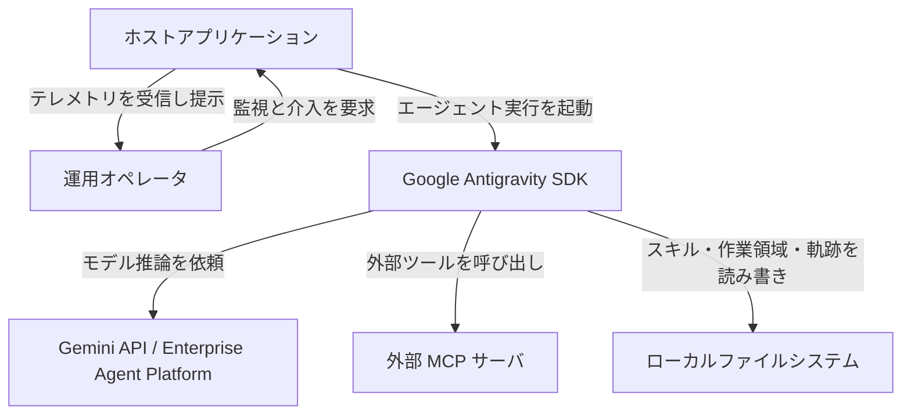
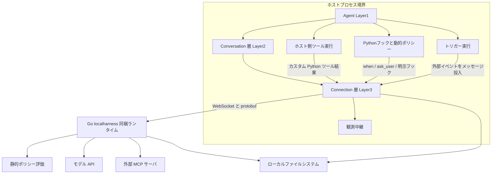
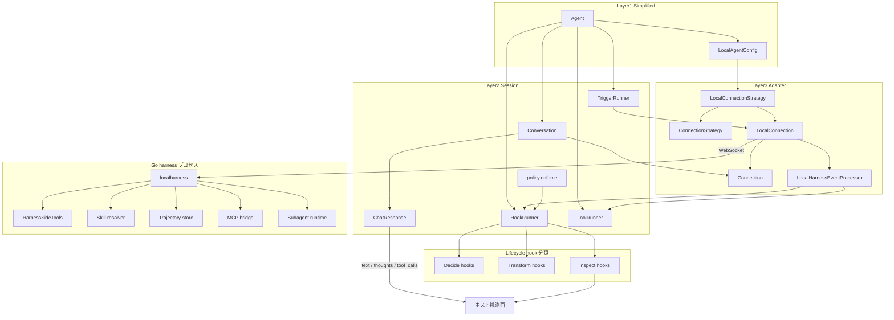
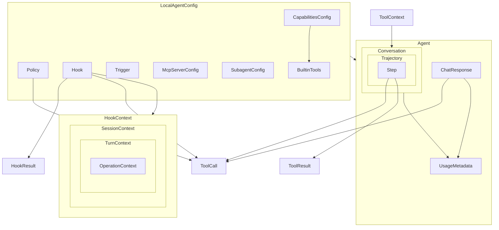
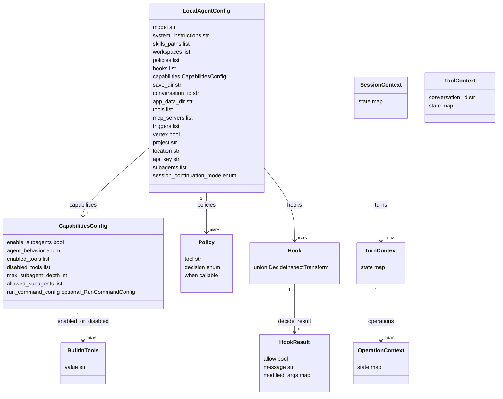
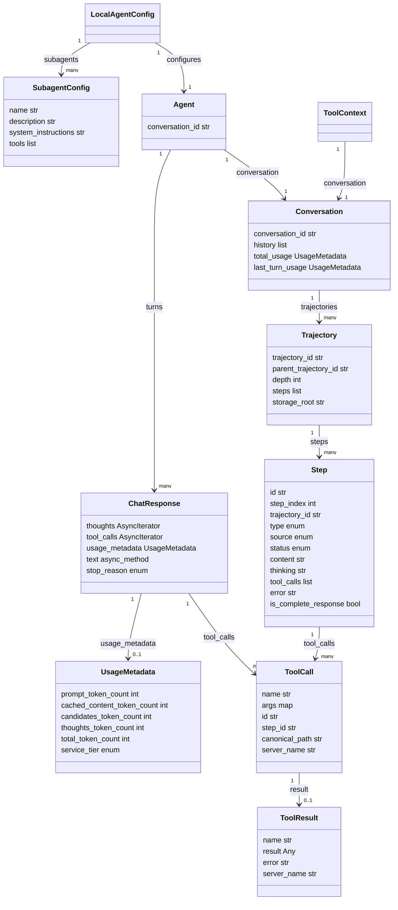

Google Antigravity SDK は、Antigravity の本番ハーネスと Gemini を前提に、自律エージェントを Python プロセスへ埋め込む SDK です。自前のエージェントハブで、実行監視・介入・状態保存を組み立てる面として使います。確認時点（2026-09-10）の PyPI 現行は `google-antigravity` 0.1.16（Alpha、Apache-2.0、Python >=3.10）です。import は `google.antigravity` です。

2026-09-09、Google Cloud Blog は [Power agent hubs or custom harnesses with the Antigravity SDK](https://cloud.google.com/blog/topics/developers-practitioners/power-agent-hubs-or-custom-harnesses-with-the-antigravity-sdk/) で、この構成を公開しました。著者は Wei Yih Yap と Paul Datta です。ページ本文の日付は September 9, 2026 です。

この記事では、Python SDK の公開 API と公式ドキュメントを突き合わせ、次を再現できる形で整理します。

- ホストプロセスへハーネスを埋め込む三層の境界
- Lifecycle Hooks と宣言的ポリシーで止める／見る／直す分担
- `save_dir` と `conversation_id` によるセッション再開


*この記事の全体像。以下、順に解説します。*

## Google Antigravity SDKとは

Google Antigravity SDK は、共有ハーネスをホストの Python プロセスへ持ち込むプログラマブル API です。

公式ドキュメントは、ツール実行・コンテキスト管理・安全ポリシー・サブエージェント委譲を含む、セキュアでステートフルなランタイムハーネスと位置づけます。ブログの主題は、自前のエージェントハブ（マルチエージェント制御プレーン）を組むときの実行監視・介入・状態保存です。

Antigravity 2.0（デスクトップ）、Antigravity CLI（バイナリ名 `agy`）、本 SDK は同じ共有ハーネスを使います。配送経路はサーフェスごとに分かれます。SDK は PyPI wheel 同梱バイナリ、2.0 / CLI は各製品のインストーラ、Managed Agents はクラウド面です。

認証の名前は次の 3 系統です。

| 認証方式 | 主な用途 |
|---|---|
| `GEMINI_API_KEY`（Gemini API） | ローカル／個人開発の API キー認証 |
| Vertex Express Mode（`vertex=True` + API key） | GCP プロジェクト／ADC を省略した高速セットアップ |
| Vertex Standard Mode（`vertex=True` + project/location + ADC） | リージョンエンドポイント向けエンタープライズ配備 |

実行に必要なコンパイル済み runtime binary は、PyPI のプラットフォーム別 wheel（0.1.16 時点で約 35〜41 MiB。PyPI の MB 表示では約 36〜43 MB）に同梱されます。公開 wheel の対象例は `macosx_11_0_arm64`、`manylinux_2_17_x86_64.musllinux_1_1_x86_64`、`manylinux_2_17_aarch64.musllinux_1_1_aarch64`、`win_amd64`、`win_arm64` です。


起点ブログが示す制御プレーンは、エージェントの思考・ツール呼び出し・状態保存を単一面で監視する構成です。


## 特徴

- 共有ハーネスの埋め込み。Antigravity 2.0 / CLI と同じ計画・ツール実行・検証ループを Python から使います。
- batteries-included な `Agent`。バイナリ発見・ツール配線・hook / ポリシー既定を async コンテキストマネージャでまとめます。
- 三層アーキテクチャ。Layer1 `Agent`、Layer2 `Conversation` / `ChatResponse` / `HookRunner`、Layer3 `Connection` / `LocalConnection`（Go `localharness` へ WebSocket）。
- 並行ストリーム。1 応答から可視テキスト・thinking・型付き `ToolCall` を独立 cursor で並行イテレートします。
- Lifecycle Hooks。Decide / Inspect / Transform の 3 分類。ツール実行前の許可、実行後レシート、エラー整形、セッション境界の観測を行います。
- 宣言的ポリシー。`deny` / `allow` / `ask_user`、優先度モデル、`when` 述語。fail-closed です。
- ワークスペース制限。`workspaces` 設定時、ファイル系ツールへ `policy.workspace_only` が自動適用されます。
- Skills。ファイルシステムの `SKILL.md` バンドルを `skills_paths` から解決します。外部レジストリは不要です。
- カスタム Python ツールと MCP。ホスト側関数と stdio / HTTP の MCP サーバを同一パイプラインへ載せます。
- セッション永続。`save_dir` と `conversation_id` で軌跡をディスクへ残し、プロセス再起動後に再開します。
- サブエージェント。動的セルフクローン（`enable_subagents`、types.py 既定 True）と静的 `SubagentConfig`。親ポリシーは子のツール呼び出しにも適用されます。
- トリガー。定期 / 外部イベントでエージェントへメッセージを投入します。
- トークン監査。`ChatResponse.usage_metadata` と `BudgetConfig`。

起点ブログが制御プレーン向けに強調する 4 ブロックは次です。

1. Skills による能力拡張
2. サンドボックス化された組み込みツールと workspace スコープ
3. `save_dir` / `conversation_id` によるセッション隔離と軌跡永続
4. Lifecycle Hooks によるリアルタイム・テレメトリと介入

### 関連技術との関係

| 技術 | 役割 | SDK との関係 |
|---|---|---|
| Antigravity 2.0 | デスクトップ上のマルチエージェント UI | 同じ共有ハーネス |
| Antigravity CLI（`agy`） | 端末 / SSH / ヘッドレス TUI | 同じ共有ハーネス。設定は `~/.gemini/antigravity-cli/` |
| Antigravity SDK（本対象） | カスタム制御プレーンを Python へ埋め込む面 | ハーネスを自プロセスへ持ち込むプログラマブル API |
| Gemini API Managed Agents | Interactions API 経由のホスト型エージェント。remote Linux サンドボックス | 同じハーネス系のクラウド面。ローカル Python runtime とは別製品 |
| ADK（Agent Development Kit） | グラフ / ツール / ルーティングをコードで所有する枠組み | ハーネスを「使う」SDK に対し、オーケストレーション自体を自前実装する層 |
| Gemini Enterprise Agent Platform | ターンキーな配備とガバナンス | マネージド正面口。SDK は自前ハブ向け |

### ユースケース別の推奨

| ユースケース | 推奨 |
|---|---|
| 自社エージェントハブ（監視ダッシュボード、承認ゲート、監査） | Antigravity SDK |
| SSH / CI / 端末での日次コーディング | CLI `agy` |
| 複数プロジェクトの並行タスクを GUI で回す | Antigravity 2.0 |
| インフラ運用を省略した単発タスク | Gemini Managed Agents |
| 独自グラフ・多言語でエージェントを設計 | ADK |
| 組織ポリシー付き本番配備 | Gemini Enterprise Agent Platform |


## 構造

ホストアプリケーションが SDK を組み込み、Go 同梱ランタイムがモデル API・MCP・ファイルシステムへ出ます。観測と介入の接点は Lifecycle Hooks と `ChatResponse` ストリームです。

### システムコンテキスト図



#### アクター

| 要素名 | 説明 |
|---|---|
| ホストアプリケーション | SDK を組み込み、セッション起動・フック実装・運用 UI 連携を担う境界外の主体です。 |
| 運用オペレータ | 実行監視と介入をホストアプリケーション経由で行う人です。 |

#### 調査対象

| 要素名 | 説明 |
|---|---|
| Google Antigravity SDK | 自律エージェントのランタイム・セッション・輸送を提供する対象です。 |

#### 外部システム

| 要素名 | 説明 |
|---|---|
| Gemini API / Enterprise Agent Platform | モデル推論の外部エンドポイントです。 |
| 外部 MCP サーバ | Model Context Protocol で追加ツールを提供する外部プロセスです。 |
| ローカルファイルシステム | スキル解決・ワークスペース操作・セッション軌跡保存の永続先です。 |

### コンテナ図



#### ホストプロセス境界

| 要素名 | 説明 |
|---|---|
| Agent Layer1 | 設定・フック・ポリシー・ツール・トリガー・MCP 配線を束ねる高レベル入口です。 |
| Conversation 層 Layer2 | 履歴・ターン・使用量・コンパクションを持つ状態付きセッションです。 |
| Connection 層 Layer3 | 輸送抽象とバックエンド接続のライフサイクルを担当します。 |
| ホスト側ツール実行 | カスタム Python ツールをプロセス内で実行します。 |
| Pythonフックと動的ポリシー | Lifecycle Hooks、`when` 述語、`ask_user` handler、`policy.enforce()` 経路をホスト側で評価します。 |
| トリガー実行 | 外部イベントを受け取りエージェントへメッセージを投入します。 |
| 観測中継 | Lifecycle Hooks が得たイベントをホスト側の監視面へ渡す中継点です。 |

#### 同梱ランタイムと外部

| 要素名 | 説明 |
|---|---|
| Go localharness | PyPI wheel 同梱のコンパイル済みエージェントコアです。組み込みツール実行・モデル対話・スキル解決・軌跡保存を担います。 |
| 静的ポリシー評価 | `LocalAgentConfig.policies` の静的ルールを `HarnessConfig.policy_config` として Go 側で評価します。 |
| モデル API | harness が推論を依頼する外部モデル面です。 |
| 外部 MCP サーバ | harness 設定経由で接続される追加ツール供給源です。 |
| ローカルファイルシステム | スキル・ワークスペース・`save_dir` 軌跡の格納先です。 |

### コンポーネント図



#### Layer1 Simplified

| 要素名 | 説明 |
|---|---|
| Agent | バイナリ発見・ツール配線・フック登録・ポリシー既定を隠す入口です。 |
| LocalAgentConfig | LocalConnectionStrategy 向けの設定オブジェクトです。 |

#### Layer2 Session

| 要素名 | 説明 |
|---|---|
| Conversation | `Connection` を包み、履歴蓄積・ターン追跡・`chat` / `send` / `receive_steps` を提供します。 |
| ChatResponse | 単一応答上の並行 iterator 面です。可視テキスト・思考差分・`ToolCall` を配信します。 |
| HookRunner | フック集合を保持し、Decide → Execute → Post の順でディスパッチします。 |
| ToolRunner | ホスト側カスタム Python ツールの登録と実行を担います。 |
| TriggerRunner | セッション寿命のバックグラウンドトリガーを起動・停止します。 |
| policy.enforce | ポリシー列から Python 側 `PreToolCallDecideHook` を生成する経路です。`LocalAgentConfig.policies` の静的ルールは Go 側 `policy_config` で評価します。 |

#### Layer3 Adapter

| 要素名 | 説明 |
|---|---|
| Connection | Layer2 が依存する輸送インターフェースです。 |
| ConnectionStrategy | バックエンド起動と認証・ヘルス確認を担当します。 |
| LocalConnection | Go harness とのライブセッションです。WebSocket 上で protobuf の InputEvent / OutputEvent をやり取りします。一部引数は JSON 文字列です。 |
| LocalConnectionStrategy | `localharness` プロセス起動と `LocalConnection` 生成を行います。 |
| LocalHarnessEventProcessor | 受信イベントを Step 化し、ツール呼び出し・質問・フックを振り分けます。 |

#### Go harness プロセス

| 要素名 | 説明 |
|---|---|
| localharness | 同梱 Go ランタイム本体です。 |
| HarnessSideTools | ファイル操作・シェル・質問・Web・画像・`start_subagent` を harness 内で実行します。 |
| Skill resolver | `skills_paths` から `SKILL.md` を解決しプロンプトを拡張します。 |
| Trajectory store | `save_dir` 配下へ軌跡・ツール領収・成果物を保存します。 |
| MCP bridge | 設定された MCP サーバへ接続します。 |
| Subagent runtime | 動的クローンまたは静的サブエージェントの隔離実行を担います。 |

#### Lifecycle hook 分類と順序

| 要素名 | 説明 |
|---|---|
| Decide hooks | ゲート用です。`PreToolCallDecideHook` / `PreTurnHook` が代表です。`HookResult` で進行可否を決めます。 |
| Transform hooks | 改変用です。`OnToolErrorHook` / `OnInteractionHook` が代表です。 |
| Inspect hooks | 観測用です。`PostToolCallHook` が代表です。実行を止めません。 |

ツール呼び出しの標準順序は次です。

1. Decide（`PreToolCallDecideHook`）
2. Execute（harness 組み込み、またはホスト `ToolRunner` / MCP）
3. Post（`PostToolCallHook`）

エラー経路では `OnToolErrorHook` が Post より先に走ります。回復結果がある場合、通常の Post 監査経路は短絡します。

起点ブログの「SDK agent core」は Go harness を含む実行核を指します。「observability middleware」は Lifecycle Hooks をホスト側で観測中継に使う構成例です。

## データ

設定境界は `LocalAgentConfig`、実行時状態は `Conversation` と `ChatResponse`、介入の戻り値は `HookResult` です。フック用コンテキストとツール用 `ToolContext` は独立した状態空間です。フックが書いた値をツールが直接読む経路はありません。Python 公開 API に `Trajectory` クラスはありません。概念上の軌跡は `Step.trajectory_id` と `Conversation.history` の束です。

### 概念モデル



| 親 | 子 | 意味 |
|---|---|---|
| LocalAgentConfig | CapabilitiesConfig / Policy / Hook / Trigger / McpServerConfig / SubagentConfig / BuiltinTools | セッション開始時の設定境界です。 |
| Agent | Conversation / ChatResponse / UsageMetadata | 実行時ファサードが会話状態とターン応答を保持します。 |
| Conversation | Trajectory | 会話が軌跡を保持します。 |
| Trajectory | Step | 軌跡が個別ステップを保持します。 |
| SessionContext | TurnContext | セッション範囲がターン範囲を包含します。 |
| TurnContext | OperationContext | ターン範囲が操作範囲を包含します。 |

### 情報モデル

公開型の主要フィールドです。Zenn の Mermaid 上限に合わせ、設定系と実行時系を分けて示します。図中の `Trajectory` は概念上の束であり、Python 公開クラスではありません。`ChatResponse.thoughts` / `tool_calls` は非同期イテレータ、`text()` は非同期メソッドです。`BuiltinTools` は文字列 Enum（識別子は `value`）、`Hook` は Decide / Inspect / Transform の Union で `kind` 属性はありません。`run_command_config` は `RunCommandConfig | None` です。





#### BuiltinTools 正式 identifier

| Enum 定数 | 識別子文字列 | グループ |
|---|---|---|
| LIST_DIR | `list_directory` | read_only / file 以外 |
| SEARCH_DIR | `search_directory` | read_only |
| FIND_FILE | `find_file` | read_only |
| VIEW_FILE | `view_file` | read_only / file_tools |
| CREATE_FILE | `create_file` | file_tools |
| EDIT_FILE | `edit_file` | file_tools |
| RUN_COMMAND | `run_command` | シェル。`workspace_only` 対象外 |
| ASK_QUESTION | `ask_question` | 対話 |
| START_SUBAGENT | `start_subagent` | サブエージェント起動 |
| GENERATE_IMAGE | `generate_image` | 画像 |
| SEARCH_WEB | `search_web` | Web。既定で有効 |
| READ_URL_CONTENT | `read_url_content` | Web。read_only に含む |
| FINISH | `finish` | 構造化終了 |

`BuiltinTools.file_tools()` は `view_file` / `create_file` / `edit_file` のみです。`policy.workspace_only` の対象はこの 3 つです。

#### conversation_id と保存先

| 項目 | 一次ソースの制約 |
|---|---|
| 文字種 | `^[a-zA-Z0-9-]+$`。アンダースコアは不可 |
| 長さ | 最低 32 文字 |
| 初回 | runtime が mint。`agent.conversation_id` で取得 |
| 再開 | 同一 `save_dir` + 同一 `conversation_id` |
| `SessionContinuationMode` | `resume` / `create_or_resume` / `create_only` |
| `save_dir` | 軌跡ルート。省略時は `antigravity_` 接頭の一時ディレクトリ |
| `app_data_dir` | フィールド既定は `~/.gemini/antigravity`。成果物実体は `{app_data_dir}/brain/<conversation_id>/`。絶対パス。相対パスと未展開の `~/` は ValidationError |

公式 lifecycle の手入力例は `session-12345678901234567890123456789012` です。

#### HookResult

| 属性 | 内容 |
|---|---|
| allow | 実行継続の可否。既定 True |
| message | 説明文 |
| modified_args | 既存 args へ浅くマージする補正 map |

`run_command` の引数キーはポリシー例で `CommandLine` です。

#### CapabilitiesConfig 既定（types.py）

| 属性 | フィールド定義の既定 |
|---|---|
| enable_subagents | True |
| enabled_tools | None（harness 既定として全 BuiltinTools を有効扱い） |
| disabled_tools | None |
| agent_behavior | AUTONOMOUS |

`enabled_tools` と `disabled_tools` は相互排他です。

## 導入

### 前提条件

- Python 3.10 以上（PyPI `requires_python`: `>=3.10`）
- Gemini API キー、または Gemini Enterprise Agent Platform 向け認証
- 実行には PyPI wheel 同梱の runtime binary が必要
- 既定モデルは `gemini-3.8-flash`、既定画像生成モデルは `gemini-3.1-flash-lite-image`（skills `agent_configuration.md`）

### インストール

推奨は PyPI です。リポジトリ clone はソース参照用で、runtime binary は wheel 側に含まれるため、clone のみでは実行環境は揃いません。

```bash
pip install google-antigravity
```

バージョン固定です。

```bash
pip install google-antigravity==0.1.16
```

ソース参照を併用する場合です。

```bash
git clone https://github.com/google-antigravity/antigravity-sdk-python.git
pip install google-antigravity
```

### バージョン確認

```bash
curl -sS https://pypi.org/pypi/google-antigravity/json
python3 -c "import importlib.metadata as m; print(m.version('google-antigravity'))"
pip show google-antigravity
```

確認時点の registry `info.version` は `0.1.16`（アップロード 2026-09-02）です。

### 認証の初期セットアップ

Gemini API です。

```bash
export GEMINI_API_KEY="your_api_key_here"
python ./examples/getting_started/hello_world.py
```

Vertex Express Mode です。

```python
from google.antigravity import Agent, LocalAgentConfig

config = LocalAgentConfig(
    vertex=True,
    api_key="your_api_key_here",
)

async with Agent(config) as agent:
    response = await agent.chat("Hello!")
    print(await response.text())
```

Vertex Standard Mode です。

```python
from google.antigravity import Agent, LocalAgentConfig

config = LocalAgentConfig(
    vertex=True,
    project="your-gcp-project",
    location="us-central1",
)

async with Agent(config) as agent:
    response = await agent.chat("Hello!")
    print(await response.text())
```

環境変数でも Standard Mode を有効化できます。明示 kwargs が env より優先します。`GOOGLE_GENAI_USE_ENTERPRISE` も Vertex 有効化に使えます。

```bash
export GOOGLE_GENAI_USE_VERTEXAI=True
export GOOGLE_CLOUD_PROJECT="your-gcp-project"
export GOOGLE_CLOUD_LOCATION="us-central1"
gcloud auth application-default login
```

## 利用方法

### 必須パラメータ

| 項目 | 必須度 | 説明 |
|---|---|---|
| `GEMINI_API_KEY` または Vertex 認証 | 実行に必須 | Gemini API キー、または Express / Standard |
| `LocalAgentConfig` | Agent 生成時に必須 | ローカル harness 向け設定 |
| `async with Agent(config)` | セッション開始に必須 | binary 発見・ツール配線・hooks / policies 適用 |
| `agent.chat(prompt)` | 対話の入口 | 非空の文字列または Content 列 |
| `save_dir` | 永続化時に必要 | 会話履歴・成果物の保存先 |
| `conversation_id` | 再開時に必要 | 最低 32 文字、`[a-zA-Z0-9-]` |
| `skills_paths` | 任意 | 個別 skill または親ディレクトリ |
| `workspaces` | 任意。既定は CWD | ファイル系ツールの作業領域 |
| `capabilities` / `policies` / `hooks` / `tools` / `mcp_servers` | 任意 | 露出制御・許可・介入・拡張 |

### 最小 chat

```python
import asyncio
from google.antigravity import Agent, LocalAgentConfig

async def main() -> None:
    config = LocalAgentConfig()
    async with Agent(config) as my_agent:
        response = await my_agent.chat("Say 'Hello World!'")
        print(await response.text())

if __name__ == "__main__":
    asyncio.run(main())
```

同一 `async with` 内で `chat` を複数回呼ぶと、同一会話上にターンが積み上がります。コンテキストマネージャ終了でセッションが閉じます。

### ChatResponse ストリーム

`await agent.chat(...)` は即時に `ChatResponse` を返します。本文は `async for token in response`、思考は `response.thoughts`、ツール呼び出しは `response.tool_calls` です。各 iterator は共有バッファ上の独立 cursor です。`asyncio.gather` で並行消費できます。ターン完了後のトークン合計は `response.usage_metadata.total_token_count` です。

```python
response = await my_agent.chat(prompt)

async for thought in response.thoughts:
    print(thought, end="", flush=True)

async for token in response:
    print(token, end="", flush=True)

async for call in response.tool_calls:
    print(call.name)
```

### Skills

`skills_paths` は個別 skill ディレクトリ（中に `SKILL.md`）と、複数 skill サブディレクトリを持つ親ディレクトリの双方を受け付けます。解決単位は `SKILL.md` を含むディレクトリです。親ディレクトリを渡すと、直下の各サブディレクトリが skill として解決されます。外部レジストリは使いません。runtime がファイルシステムから読み、システムプロンプトへ注入します。同名衝突時の優先順位は公式 tools ページに機械可読な表が無いため、パス指定を一意に保ちます。

```text
skills/code-review/
  SKILL.md
  references/
  scripts/
```

```python
from google.antigravity import Agent, LocalAgentConfig

config = LocalAgentConfig(
    skills_paths=["./skills/research", "./skills/code_review"],
)
async with Agent(config) as agent:
    response = await agent.chat("Analyze the deployment logs.")
    print(await response.text())
```

### ワークスペースと組み込みツール露出

```python
from google.antigravity import Agent, LocalAgentConfig, types

config = LocalAgentConfig(
    model="gemini-3.8-flash",
    capabilities=types.CapabilitiesConfig(
        enabled_tools=[
            types.BuiltinTools.LIST_DIR,
            types.BuiltinTools.FIND_FILE,
            types.BuiltinTools.SEARCH_DIR,
            types.BuiltinTools.VIEW_FILE,
            types.BuiltinTools.CREATE_FILE,
            types.BuiltinTools.EDIT_FILE,
        ],
    ),
    workspaces=["./workspace"],
)
```

`workspaces` を設定すると、ファイル系 3 ツールへ `policy.workspace_only` が自動適用されます。`run_command` / MCP / `search_web` は別ポリシーで制御します。

read-only 露出の明示です。

```python
from google.antigravity import LocalAgentConfig, CapabilitiesConfig
from google.antigravity.types import BuiltinTools

config = LocalAgentConfig(
    capabilities=CapabilitiesConfig(
        enabled_tools=BuiltinTools.read_only()
    )
)
```

README は「既定は read-only。`capabilities=CapabilitiesConfig()` で全ツールを有効化」と書きます。`LocalAgentConfig` 実装の default_factory は既に `CapabilitiesConfig()` で、ポリシー既定が `confirm_run_command()`（`run_command` 拒否、他許可）です。層の違いの詳細は後述の注意点です。

### セッション再開

```python
import tempfile
from google.antigravity import Agent, LocalAgentConfig

save_dir = tempfile.mkdtemp(prefix="agent_session_")

config1 = LocalAgentConfig(save_dir=save_dir)
async with Agent(config1) as agent:
    response = await agent.chat("Remember this: my favorite color is blue.")
    await response.text()
    conversation_id = agent.conversation_id

config2 = LocalAgentConfig(
    conversation_id=conversation_id,
    save_dir=save_dir,
)
async with Agent(config2) as agent:
    response = await agent.chat("What is my favorite color?")
    print(await response.text())
```

手入力 ID の公式例です。

```python
conversation_id = "session-12345678901234567890123456789012"
config = LocalAgentConfig(
    save_dir="./sessions",
    conversation_id=conversation_id,
    app_data_dir="/path/to/custom/storage",
)
```

### Lifecycle Hooks

デコレータは `from google.antigravity.hooks import hooks` です。登録は `LocalAgentConfig(hooks=[...])` です。

```python
from google.antigravity import Agent, LocalAgentConfig, types
from google.antigravity.hooks import hooks

@hooks.on_session_start
async def on_start() -> None:
    print("Session started")

@hooks.on_session_end
async def on_end() -> None:
    print("Session ended")

@hooks.pre_tool_call_decide
async def pre_tool(data: types.ToolCall) -> types.HookResult:
    print(f"Approving tool -> {data.name}")
    return types.HookResult(allow=True)

@hooks.post_tool_call
async def post_tool(data) -> None:
    print(f"Result -> {data!r}")

config = LocalAgentConfig(
    hooks=[on_start, on_end, pre_tool, post_tool],
)
```

公式 lifecycle ページは `pre_turn` と `on_tool_error` も示します。双方が併存します。`pre_turn` は SDK 側 `send()` 起点ターン向けです。trigger 起点ターンの完全ガードは Decide 側へ寄せます。

```python
from google.antigravity import Agent, LocalAgentConfig, hooks, types

@hooks.pre_turn
async def log_turn(prompt: str) -> types.HookResult:
    print(f"User prompt: {prompt}")
    return types.HookResult(allow=True)

@hooks.on_tool_error
async def handle_error(err: Exception) -> None:
    print(f"Tool execution failed: {err}")

config = LocalAgentConfig(hooks=[log_turn, handle_error])
```

#### 主要フックのシグネチャ

| デコレータ | 分類 | 引数 | 戻り値 | 発火条件 |
|---|---|---|---|---|
| `@hooks.on_session_start` | Inspect | なし | なし | セッション開始 |
| `@hooks.on_session_end` | Inspect | なし | なし | セッション終了 |
| `@hooks.pre_turn` | Decide | `prompt: str` | `HookResult` | SDK `send()` 起点ターン。trigger 起点は対象外 |
| `@hooks.pre_tool_call_decide` | Decide | `ToolCall` | `HookResult` | ツール実行前。子軌跡内のツールにも発火 |
| `@hooks.post_tool_call` | Inspect | `ToolResult` | なし | ツール完了後。OnToolError 回復時は短絡 |
| `@hooks.on_tool_error` | Transform | `Exception` | 任意の str またはなし | ツール失敗時。Post より先。LocalConnection では `RuntimeError` に正規化 |

監視と介入の分担です。

| 目的 | 使う面 | 実行を止められるか |
|---|---|---|
| 思考・トークン・ツール名の可視化 | `ChatResponse` の thoughts / text / tool_calls | 止められない |
| 完了後の監査ログ | `PostToolCallHook` | 止められない |
| 実行前の承認・拒否・引数補正 | `PreToolCallDecideHook` / `policy.enforce` | 止められる |
| エラー文言の差し替え | `OnToolErrorHook` | 実行後のモデル入力を変える |

### ポリシー

import の正本は次です。

- `from google.antigravity.hooks import policy`
- `from google.antigravity.hooks.policy import deny, allow, ask_user, enforce`
- 互換 re-export: `google.antigravity.policy`

```python
from google.antigravity import LocalAgentConfig
from google.antigravity.hooks.policy import deny, allow, ask_user

async def my_handler(tool_call):
    print(f"Tool approval requested for: {tool_call.name}")
    return True

policies = [
    deny("*"),
    allow("view_file"),
    ask_user("run_command", handler=my_handler),
]

config = LocalAgentConfig(policies=policies)
```

優先度は Specific DENY → Specific ASK_USER → Specific APPROVE → Wildcard DENY → Wildcard ASK_USER → Wildcard APPROVE です。同一レベルは first match wins です。

`LocalAgentConfig.policies` の静的ルール（ツール名と decision だけ）は Go harness 側で評価します。`when` 述語と `ask_user` handler は Python へ問い合わせます。`policy.enforce()` は Python の Decide hook を直接登録する別経路です。

`when` 述語や承認ハンドラの評価で例外が発生すると、fail-closed として呼び出しを拒否します。`ask_user` は handler 必須で、欠けると構築時に `ValueError` です。handler は `ToolCall` を受け取り `True`（承認）または `False`（拒否）を返します。

対話 preset は `policy.safe_defaults(handler=interactive.ask_user_handler)` です。既定ポリシーは `policy.confirm_run_command()` です。全許可は `policies=[policy.allow_all()]` です。

`when` 述語と MCP / Web ツールの閉じ方です。

```python
from google.antigravity import types
from google.antigravity.hooks import policy

stdio_server = types.McpStdioServer(
    name="pirate_math",
    command="python3",
    args=["mcp_server.py"],
)

async def my_handler(tool_call):
    return True

policies = [
    policy.deny_all(),
    policy.allow("view_file"),
    policy.deny(
        "run_command",
        when=lambda args: "rm" in args.get("CommandLine", ""),
    ),
    policy.ask_user("run_command", handler=my_handler),
    policy.deny("search_web"),
    policy.allow("read_url_content"),
    policy.allow(stdio_server, ["pirate_multiply"]),
    policy.deny(stdio_server, ["pirate_divide"]),
]
```

### カスタムツールと MCP

```python
from google.antigravity import Agent, LocalAgentConfig

def get_weather(city: str) -> str:
    """Returns the current weather for a city."""
    return f"It's sunny in {city}."

config = LocalAgentConfig(tools=[get_weather])
```

```python
from google.antigravity import Agent, LocalAgentConfig
from google.antigravity.types import McpStdioServer

config = LocalAgentConfig(
    mcp_servers=[
        McpStdioServer(
            name="my_server",
            command="npx",
            args=["my-mcp-server"],
        )
    ],
)
```

MCP サーバ名は `^[a-zA-Z0-9_-]+$` です。HTTP 接続は `McpStreamableHttpServer` です。

### サブエージェント

```python
from google.antigravity import Agent, LocalAgentConfig, types

config = LocalAgentConfig(
    capabilities=types.CapabilitiesConfig(enable_subagents=True)
)
```

静的サブエージェントに渡す callable は `SubagentConfig.tools` に載せます。Agent は親と子の callable を ToolRunner へ収集しますが、親セッションへ公開するツール集合は別に構築します。親の `tools` へ同じ関数を足すのは、親自身にもその関数を公開したい場合に限ります。公式ドキュメントが一律登録と書く場合でも、実行関数の登録と親へのツール公開は別です。

## 運用

### 起動と停止

- `async with Agent(config)` がセッション境界です。
- 長期監視は `triggers=[every(seconds, handler)]` を載せ、プロセスを生存させたまま、コールバック内の `ctx.send()` でエージェントへ定期ターンを投入します。
- 対話運用は `run_interactive_loop(config)` です。終了入力は `exit` / `quit` です。

```python
import asyncio
from google.antigravity import Agent, LocalAgentConfig
from google.antigravity.triggers import every

async def check_status(ctx):
    await ctx.send("Check the deployment status.")

config = LocalAgentConfig(triggers=[every(60, check_status)])

async def main():
    async with Agent(config) as agent:
        await asyncio.sleep(120)

asyncio.run(main())
```

### 状態確認

| 観測対象 | 取得方法 | 所有者 |
|---|---|---|
| 会話 ID | `agent.conversation_id` | runtime が mint。アプリが再投入 |
| ステップ履歴 | `conversation.history` / `turn_count` / `last_response` | SDK Session 層 |
| トークン | `response.usage_metadata.total_token_count` | ターン応答 |
| 軌跡ファイル | `save_dir` 配下の runtime 永続 | SDK runtime |
| ツール監査ダッシュボード | `PostToolCallHook` → アプリ側 WebSocket 中継 | アプリ |

状態保存の契約です。

| 項目 | 所有者 | 再開条件 |
|---|---|---|
| `save_dir` | アプリが用意 | 再開時も同一パス |
| `conversation_id` | 初回は runtime、再開時はアプリ | 長さ 32 以上、`[a-zA-Z0-9-]` |
| `app_data_dir` | アプリ任意 | 絶対パス |
| 再開 | 同一 `save_dir` + 同一 `conversation_id` | `RESUME` 時は ID 必須 |

### ログと監査

- Inspect 系は観測専用です。
- Decide 系はゲートです。`allow=False` で中断します。
- Transform 系はエラー文言を差し替えます。
- 実行順は Decide → Execute → Post です。
- 軌跡は runtime が残します。ダッシュボード向け構造化監査はアプリの hooks が所有者です。

```python
from google.antigravity.hooks import hooks
from google.antigravity import types

class AuditLogHook(hooks.PostToolCallHook):
    def __init__(self):
        self.log = []

    async def run(self, context, data: types.ToolResult):
        self.log.append({"tool": data.name, "result": str(data.result)})
```

### 更新とスケール

- runtime binary は PyPI wheel に同梱されます。パッケージ更新が runtime 更新の配送経路です。
- 起点ブログは「core runtime 更新が SDK agents に自動継承される」と述べます。運用ではパッケージ更新後に承認条件の回帰を実施します。
- 動的サブエージェントの `enable_subagents` 既定は True です。
- 親の Decide / Post はサブエージェント内のツール呼び出しにも発火します。
- OS サンドボックスは `RunCommandConfig(enable_sandbox=True)` です。既定は False です。ポリシー（実行可否）とサンドボックス（実行後の到達範囲）は役割が分かれます。
- レート制限は `PreToolCallDecideHook` で実装します（`examples/deep_dives/agent_middleware.py`）。

回帰観点の最小セットです。

- 同一 `policies` リストで `ask_user` が発火すること
- workspace 外への `create_file` / `edit_file` が拒否されること
- 32 文字制約を満たす `conversation_id` で再開できること
- 親 policies が子エージェントの `run_command` でも発火すること
- `OnToolError` 回復後の呼び出しが Post 監査に載らないことをテストが明示記録すること
- パッケージ bump 前後で同一 `policies` スナップショットを比較すること
- `enable_sandbox=True` を使う環境では、非対応 OS で sandbox が黙って無効にならないかを別観点で確認すること

## ベストプラクティス

### CI/CD

- SDK バージョンを lock し、wheel 更新ごとに承認回帰を走らせます。
- 本番と同一の `policies` リストを固定入力にします。
- `OnToolErrorHook` はメッセージ文字列ベースでフォールバックを返します。`isinstance` サブクラス判定は LocalConnection 境界で効きません。

### マルチ環境

| 環境 | 推奨設定の方向 |
|---|---|
| 開発 | `policies=[policy.allow_all()]` + 明示 `CapabilitiesConfig()` |
| ステージング | 本番と同一 policies。`ask_user` handler を自動承認スタブへ差し替え可能 |
| 本番 | deny-by-default + 個別 `allow` / `ask_user`。`workspaces` 固定。監査 hooks 常駐 |

- `save_dir` と `app_data_dir` は環境ごとに分離します。
- `conversation_id` は環境接頭辞付きの 32 文字以上 ID をアプリが採番するか、runtime mint 値を外部ストアへ保存します。

### リソース制限

- ターン単位のコストは `usage_metadata` で監査します。
- ツール呼び出し頻度は Decide hook のレート制限で抑えます。
- `BudgetConfig` / `CompactionConfig` でモデル呼び出し上限とコンテキスト要約間隔を寄せます。
- `enable_sandbox=True` は `run_command` 許可時の到達範囲を狭めます。

### セキュリティ

disable と deny を使い分けます。

| 手段 | 作用点 | モデルから見えるか | 向く用途 |
|---|---|---|---|
| `CapabilitiesConfig.enabled_tools` / `disabled_tools` | ハーネス設定。文脈構築前 | 隠れる | 用途外ツールの恒久除外 |
| `policy.deny()` / `ask_user()` | Decide hook。実行直前 | 見える | 引数依存・人間承認 |

- fail-closed です。Decide の deny は即中断です。
- `workspace_only` の対象は `view_file` / `create_file` / `edit_file` です。
- write ツールや MCP を有効化した状態で policies も Decide hook も空の場合、`Agent` 起動時に `ValueError` になります。明示の `allow_all` か選択的 allow を載せます。
- 既定ポリシー `confirm_run_command()` は `run_command` を拒否し、他ツールを許可します。

```python
from google.antigravity import LocalAgentConfig, types
from google.antigravity.hooks import policy

async def approve(tool_call) -> bool:
    return True

policies = [
    policy.deny_all(),
    policy.allow("view_file"),
    policy.ask_user("run_command", handler=approve),
]

config = LocalAgentConfig(
    capabilities=types.CapabilitiesConfig(),
    workspaces=["/srv/agent/ws"],
    policies=policies,
)
```

### 設定管理

- 正本は `LocalAgentConfig` の宣言値です。
- secrets は環境変数（`GEMINI_API_KEY` / Vertex 系）に分離します。
- policies・hooks・skills_paths・workspaces・save_dir を環境別定数としてバージョン管理します。

## 注意点

### ドキュメントと実装の乖離

| 対象 | 資料の記載 | 実態 | 読者への影響 |
|---|---|---|---|
| `conversation_id` 例 | 起点ブログ: `ops-session-20260820-001` | validator と lifecycle docs: 最低 32 文字、`[a-zA-Z0-9-]`。当該例は 24 文字 | ブログ例をそのまま使うと ValidationError |
| ポリシー import | ブログ: `from google.antigravity.policies import policy` | 正本は `google.antigravity.hooks.policy`。`google.antigravity.policy` は re-export。`policies` パッケージはソースに無い | ImportError |
| `workspace_only` シグネチャ | ブログ: `policies=[policy.workspace_only()]` | ソースは `workspace_only(workspaces)`。`LocalAgentConfig.workspaces` 設定時は自動適用 | 引数なし呼び出しは実装シグネチャと不一致 |
| 既定の read-only | README: 既定 read-only。`CapabilitiesConfig()` で write opt-in | 基底 `AgentConfig` の factory は `read_only()`。`LocalAgentConfig` は `CapabilitiesConfig()` + `confirm_run_command()` | 「既定」の指す層で write 可否が変わる |
| 軌跡ディレクトリ名 | ブログ: `traj-<conversation_id>` | persistence 例は `save_dir` + `conversation_id` の組のみ。成果物は `app_data_dir/brain/<conversation_id>/` 表記が binary / 例に出る | 監査パスをブログ表記だけで決め打ちすると見つからない |
| runtime 自動継承 | ブログ: core runtime 更新が SDK agents に自動継承 | README は「runtime binary は PyPI wheel 同梱」まで。pip 無し OTA の記載は SDK docs に無い | 運用はパッケージ更新 + 承認回帰で扱う |

### 資料間の食い違い

| 対象 | 資料の記載 | 実態 | 読者への影響 |
|---|---|---|---|
| Hooks の提示面 | ブログは `on_session_start` / `pre_tool_call_decide` / `post_tool_call` / `on_session_end` | lifecycle ページ例は `pre_turn` / `on_tool_error` 中心。双方が併存 | 片方だけ見て欠けていると誤認する |
| ダッシュボードの所有者 | ブログは Lifecycle Hooks のイベントを your dashboard へ WebSocket 中継 | SDK 一次資料が示すのは Hooks とストリーム API。UI はホスト実装 | SDK 単体で監視画面が立つと期待すると不足する |
| CLI hooks.json | 製品 docs サイトに CLI 向け `hooks.json` がある | SDK は Python デコレータ / `LocalAgentConfig(hooks=...)` | 制御プレーン実装で CLI 設定を流用すると設計が崩れる |
| ツール結果表の名前 | hooks README の LocalConnection 結果表は `find_by_name` / `grep_search` | BuiltinTools 正式名は `find_file` / `search_directory` | ポリシー文字列に README 表の別名を使うと一致しない |
| MCP 実行位置 | connections README は MCP を HarnessConfig に載せる | カスタム Python はホスト ToolRunner。MCP は harness 側ブリッジ。hooks README は両者をフルフックパイプライン対象と書く | 実行プロセスとフック到達範囲を混同する |
| `enable_subagents` | 公式 subagents ページ例は `enable_subagents=True` を明示 | types.py フィールド既定は True | 未設定だから動かない、は原因にならない |

### 確認時点の未確認事項

| 対象 | 未確認の内容 | 読者への影響 |
|---|---|---|
| `traj-<id>` 実ディレクトリ | ブログ表記と `brain/<id>` 表記の対応を、実行時の filesystem listing では未確認 | 監査コレクタの glob は両表記を候補にする |
| プラットフォーム未対応時の sandbox | `enable_sandbox=True` が無効な環境での警告有無 | ポリシーと併用する前提で扱う |

## トラブルシューティング

### セッションが再開されない

| 項目 | 内容 |
|---|---|
| 症状 | 再開後のターンが過去文脈を持たない |
| 原因 | `save_dir` か `conversation_id` の不一致、または ID 制約違反 |
| 対処 | 初回の `agent.conversation_id` を永続化し、同一 `save_dir` とセットで再投入する。手入力は 32 文字以上の `[a-zA-Z0-9-]` |

### Agent 起動時に ValueError

| 項目 | 内容 |
|---|---|
| 症状 | write / MCP 有効化直後に起動失敗 |
| 原因 | policies / Decide hook 未設定 |
| 対処 | `policies=[policy.allow_all()]` か deny-by-default + 個別 allow を追加する |

### run_command が常に拒否される

| 項目 | 内容 |
|---|---|
| 症状 | シェル実行が通らない |
| 原因 | 既定の `confirm_run_command()` |
| 対処 | `ask_user(..., handler=...)` か `allow_all()` へ明示切替する |

### workspace 外ファイルは拒否されるが shell は通る

| 項目 | 内容 |
|---|---|
| 症状 | ファイル write は境界内、`run_command` は境界外へ到達可能 |
| 原因 | `workspace_only` は file tools 限定 |
| 対処 | `run_command` / MCP / `search_web` に別 `deny` / `ask_user` を追加する。必要なら `RunCommandConfig(enable_sandbox=True)` |

### 承認 UI が出る前にツールが動く

| 項目 | 内容 |
|---|---|
| 症状 | 監視ダッシュボードに TOOL_CALL が出る前に実行が終わる |
| 原因 | Decide 未登録、または Inspect のみ |
| 対処 | `PreToolCallDecideHook` / `policy.enforce` を載せる。順序は Decide → Execute → Post |

### サブエージェント経由の危険ツール

| 項目 | 内容 |
|---|---|
| 症状 | 子エージェントの `run_command` まで親ポリシーが拒否する、またはその逆の期待外れ |
| 原因 | 親の Decide / Post が子軌跡内のツールにも発火する |
| 対処 | 親の policies を正とする。子専用の緩い設定に依存する設計を避ける |

### trigger 定期実行が pre_turn ログに出ない

| 項目 | 内容 |
|---|---|
| 症状 | cron 相当のターンが `pre_turn` フックを通らない |
| 原因 | `pre_turn` は SDK-side `send()` 限定 |
| 対処 | ツール介入は Decide hook、外部起点は trigger handler 側で記録する |

### OnToolErrorHook の型判定が効かない

| 項目 | 内容 |
|---|---|
| 症状 | `isinstance(err, ValueError)` が常に False |
| 原因 | LocalConnection が例外を `RuntimeError` に正規化する |
| 対処 | `str(err)` / メッセージ部分一致で分岐する |

### エラー回復後の呼び出しが監査ログに無い

| 項目 | 内容 |
|---|---|
| 症状 | fallback したツール呼び出しが PostToolCall 監査に載らない |
| 原因 | OnToolError が Post を short-circuit する |
| 対処 | 監査が必要なら error path でも別途記録する |

### SDK 更新後に承認挙動が変わった

| 項目 | 内容 |
|---|---|
| 症状 | 同じ policies なのに ask_user や workspace 拒否が変わる |
| 原因 | wheel 同梱 runtime の更新を継承した |
| 対処 | 同一 policies で `ask_user` 発火と workspace 外 write 拒否を回帰する |

## まとめ

Google Antigravity SDK は、Antigravity 2.0 / CLI と同じハーネスを Python プロセスへ持ち込み、自前のエージェントハブで実行監視・介入・状態保存を組み立てる面です。止められるのは Decide（`PreToolCallDecideHook` / `policy.enforce`）だけで、思考ストリームと `PostToolCallHook` は観測です。セッション再開は同一 `save_dir` と 32 文字以上の `conversation_id` の組が契約です。ブログ例の短い ID や `google.antigravity.policies` import は、現行 0.1.16 の validator / パッケージ配置と一致しません。

この記事が少しでも参考になった、あるいは改善点などがあれば、ぜひリアクションやコメント、SNSでのシェアをいただけると励みになります！

## 参考リンク

### 概要

- [Power agent hubs or custom harnesses with the Antigravity SDK](https://cloud.google.com/blog/topics/developers-practitioners/power-agent-hubs-or-custom-harnesses-with-the-antigravity-sdk/)
- [Choosing your surface: Antigravity 2.0, CLI, IDE, or SDK](https://cloud.google.com/blog/topics/developers-practitioners/choosing-your-surface-antigravity-20-antigravity-cli-antigravity-ide-or-antigravity-sdk)
- [Antigravity SDK 製品ページ](https://antigravity.google/product/antigravity-sdk)
- [google-antigravity · PyPI](https://pypi.org/project/google-antigravity/)
- [PyPI JSON 0.1.16](https://pypi.org/pypi/google-antigravity/json)
- [Antigravity agent（Gemini API Managed Agents）](https://ai.google.dev/gemini-api/docs/antigravity-agent)

### 構造

- [SDK Overview](https://antigravity.google/docs/sdk/overview)
- [GitHub README Architecture](https://github.com/google-antigravity/antigravity-sdk-python)
- [hooks/README.md](https://github.com/google-antigravity/antigravity-sdk-python/blob/main/google/antigravity/hooks/README.md)
- [connections/README.md](https://github.com/google-antigravity/antigravity-sdk-python/blob/main/google/antigravity/connections/README.md)
- [conversation/README.md](https://github.com/google-antigravity/antigravity-sdk-python/blob/main/google/antigravity/conversation/README.md)
- [examples/deep_dives/agent_middleware.py](https://github.com/google-antigravity/antigravity-sdk-python/blob/main/examples/deep_dives/agent_middleware.py)

### データ

- [types.py](https://github.com/google-antigravity/antigravity-sdk-python/blob/main/google/antigravity/types.py)
- [LocalAgentConfig](https://github.com/google-antigravity/antigravity-sdk-python/blob/main/google/antigravity/connections/local/local_connection_config.py)
- [AgentConfig / conversation_id validator](https://github.com/google-antigravity/antigravity-sdk-python/blob/main/google/antigravity/connections/connection.py)
- [Lifecycle hooks, triggers, and session persistence](https://antigravity.google/docs/sdk/lifecycle)

### 構築方法 / 利用方法

- [Custom tools and agent skills](https://antigravity.google/docs/sdk/tools)
- [Safety policies and permissions](https://antigravity.google/docs/sdk/policies)
- [MCP](https://antigravity.google/docs/sdk/mcp)
- [Subagents](https://antigravity.google/docs/sdk/subagents)
- [persistence.py](https://github.com/google-antigravity/antigravity-sdk-python/blob/main/examples/getting_started/persistence.py)
- [hooks.py](https://github.com/google-antigravity/antigravity-sdk-python/blob/main/examples/getting_started/hooks.py)
- [policies.py](https://github.com/google-antigravity/antigravity-sdk-python/blob/main/examples/getting_started/policies.py)

### 運用 / ベストプラクティス / 注意点 / トラブルシューティング

- [safety_policies.md](https://github.com/google-antigravity/antigravity-sdk-python/blob/main/skills/google-antigravity-sdk/references/safety_policies.md)
- [policy.py](https://github.com/google-antigravity/antigravity-sdk-python/blob/main/google/antigravity/hooks/policy.py)
- [tools/README.md](https://github.com/google-antigravity/antigravity-sdk-python/blob/main/google/antigravity/tools/README.md)
- [triggers/README.md](https://github.com/google-antigravity/antigravity-sdk-python/blob/main/google/antigravity/triggers/README.md)
