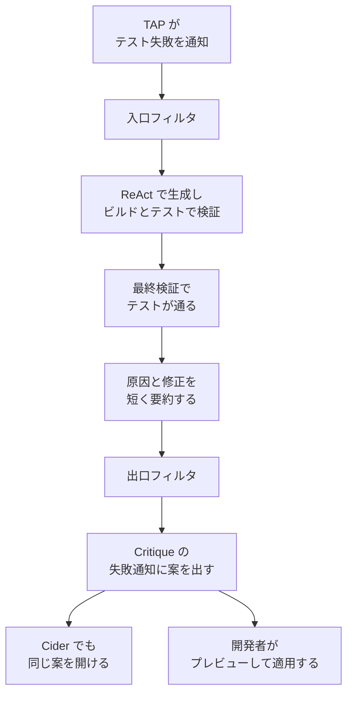

Google は、変更をリポジトリへ提出する前に、モノレポ全体の依存テストが失敗した時点で修復案を作る社内エージェント FlowAgent を論文で公開した。論文は Celal Ziftci、Spencer Greene、Ray Liu、Livio Dalloro、Lorenzo Dini による arXiv:2610.07289v1（2026年10月5日）で、第41回 ASE（2026年10月12日から16日、ミュンヘン）の Industry Showcase に採録されている。数値は Google 社内の計測であり、データと再現パッケージは公開されていない。この記事では、起動から画面表示までの経路、測られた遅延、提示と適用の件数、近い系統との違いを、論文の定義に沿って整理する。

*この記事の全体像。以下、順に解説します。*

## FlowAgentとは

FlowAgent は、提出前の outer-loop で落ちたテストを直す案を、開発者がボタンを押す前に作るエージェントである。outer-loop とは、変更を作ったあと、TAP（Testing Automation Platform）がモノレポ全体の依存テストを回し、他のコードへの回帰を探す段階を指す。inner-loop は、変更を作る前に IDE で近傍のテストを回す段階で、論文は例として Antigravity を挙げる。FlowAgent の範囲は outer-loop である。

対象はテスト失敗である。ビルド失敗は入口のフィルタで落とす。失敗時に直す対象は、プログラム側でもテスト側でもあり得る、と論文は Section 2.1 に書く。

方式は ReAct の生成と検証の反復である。社内コードとデータで fine-tune した Gemini 2.5 Pro の内部版を使い、temperature は 0.1、top_p は 0.95 である。1回の実行上限は 30 分、ツール呼び出しは 100 回までである。ツールは、ファイルの読み書きと削除、検索、ビルド、ビルド状態とログの参照、テスト実行、テスト状態とログの参照を含む。ループが diff を出したら、最終サイクルでテストを実行したことを確認するか、テストを再実行し、通った案だけを先へ進める。通ったあと、軌跡全体を1回の呼び出しに渡して、原因と修正を短く要約する。

### 入口と出口

入口では、次を落とす。

- ビルド失敗
- リポジトリで既に落ちているテスト
- 既知の flaky
- 自動ツールが作った変更
- 開発者が既に編集した版
- 画像やバイナリなど、対応しないファイル種別
- 100 ファイル超の変更
- 1000 行超の変更

出口では、処理中に開発者がその版を編集した場合と、既に提出された変更を落とす。案が古くなったためである。無関係なファイルだけを触った変更でも、混同と衝突を避けるために落とす、と論文は書く。

### 画面に出る場所

案は TAP の失敗通知の中に出す。指摘枠を別に増やさない。先に出るのはコードレビューの Critique で、同じ案は IDE の Cider からも開ける。通知には原因の要約、Cider でプレビューするリンク、Critique 上でプレビューして適用するボタンがある。開発者はいつもの画面で案を見て、適用するかを決める。エージェントはエディタをロックしない。開発者の次の編集と並行して走る。

入口を通過した失敗だけが ReAct に入る。出口を通過した案だけが画面に出る。

### 論文が数えたもの

手評価は、37 チームから無作為に選んだ 195 件である。経験 5 年以上の専門家 3 人が、変更の意図と失敗への適合を判定し、131 件を適合とした（67.18%）。131/195 は 67.1795% で、論文の 67.18% と一致する。

本番は 2025年10月に全社へ展開し、論文の “to date” まで続く。終了日の日付は本文に無い。PDF の投稿日は 2026年10月5日である。

| 段 | 件数 | 論文の矢印 | その矢印の分母 |
|---|---:|---:|---|
| テスト失敗のあった変更 | 2,567,829 | | |
| 入口フィルタで除外 | 1,785,955 | | 全失敗の 69.55% |
| 修復を試行 | 781,874 | 30.45% | 全失敗 |
| テストを通る修正を得た | 421,818 | 53.95% | 試行 |
| 出口フィルタで除外 | 126,310 | | 通過件数との差が提示件数 |
| Critique へ提示 | 295,508 | 70.06% | テストを通った件数 |
| 開発者がプレビュー | 65,069 | 22.02% | 提示 |
| 開発者が適用 | 28,554 | 43.88% | プレビュー |

試行した変更の著者は 36,479 人である。変更あたりのファイル数は平均 10.57、中央値 6。失敗テスト数は平均 16.49、中央値 2。拡張子は 917 種類である。1実行あたりの平均ツール呼び出しは 21.37、平均トークンは 424,149、累計トークンは 643 billion である。

Critique ではプレビュー 55,029 のうち適用 20,826（37.84%）。Cider ではプレビュー 21,279 のうち適用 12,702（59.69%）。論文は、開発者が Cider で見て適用する方を好む、と書く。理由の候補は、適用後にさらに手を入れることと、diff を IDE で見る習慣である。

## 注意点

論文の要旨は “highly effective” と書き、手評価 67.18% と本番の提示 295,508、適用 28,554 を続ける。3つの数は別の事象である。67.18% を 295,508 件へ掛ける読みは、論文に無い。

### 67.18% が測っているもの

判定は「変更の意図と失敗に対して修正が適切か」である。残り 64 件は、不正確、または正確そのものではない、と論文が書く。

判定した 3 人は、そのプロダクションコードもテストコードも所有者ではない。論文の脅威の節は、判定を誤った可能性がある、と書く。標本は Google 全体からの無作為 195 件で、全部の失敗を代表するとは限らない、とも書く。

### 本番のファネル

矢印の分母は行ごとに違う。試行 30.45% は全失敗 2,567,829、テスト通過 53.95% は試行 781,874、提示 70.06% はテスト通過 421,818、プレビュー 22.02% は提示 295,508、適用 43.88% はプレビュー 65,069 である。除外の行は矢印の分母にしない。

提示 295,508 に対する適用 28,554 は 9.66% になる。この 9.66% は論文の見出しには無く、整数からの検算である。

両ツールの適用を足すと 33,528 で、変更単位の 28,554 を超える。論文がこの超過の理由として書くのは、同一変更の複数版で複数の修正が出ることである。Critique で見て Cider で適用する、という観察は、その直前の別の段落にある。

入口フィルタは、初期の利用者からのフィードバックに基づく。落とす変更が多いため、評価結果は落とされた変更の性質へ一般化できない、と脅威の節は書く。プレビューと適用は、AI への態度を統制していない。インタビューは、プレビューまたは適用を経験して志願した 9 グループ 9 人、各 45 分、在籍 6 か月以上である。志願者以外の見方は、この定性結果に入っていない。

### 遅延は中央値の競争である

人間の fix attempt latency は、TAP がその版の失敗を報告してから、開発者が追加編集して次の版へ進めるまでの壁時計である。2025年9月の 30 日間の提出済み変更が母集団である。

| | p10 | p25 | p50 | p90 |
|---|---:|---:|---:|---:|
| 人間が次の編集をするまで | 2.37 分 | 6.72 分 | 27.48 分 | 本文に無い |
| エージェントが成功した修正を得るまで | 4.78 分 | 本文に無い | 9.85 分 | 25.83 分 |

エージェントの分布は、成功した修正を得るまでの時間である。上限で打ち切られた試行は、この分布に入らない。上限は実行 30 分、ツール呼び出し 100 回である。論文は、上限 30 分を Section 2.2 の fix attempt latency に合わせた（“in line with”）、と書く。人間の中央値 27.48 分と同一だとは書いていない。

論文が “within the median fix attempt latency of 27.48 minutes” と言うとき、比べているのは成功実行の中央値 9.85 分と p90 の 25.83 分である。エージェントの p10 は 4.78 分で、人間の p10 の 2.37 分より遅い。成功実行の中央値 9.85 分は、人間の p25 の 6.72 分より遅い。

出口で落ちた 126,310 件は、品質不合格ではない。処理中に開発者が変更したか、既に提出したため、案が古くなった。126,310/421,818 は 29.94% で、これも検算である。論文は、この割合は無視できず、流れに追いつくには遅延の改善が要る、と書く。インタビューでは、自分で調査を始めたあとに案が届いた、という発言がある（P-2、P-3）。残り時間の表示は、Critique が未対応で入っていない。

### テストを緑にすることと、意図を守ること

プロンプトは、失敗テストを直す変更だけを diff で出すよう求める。同時に、ログの expected と actual からテストの期待値を更新してよい、と書く。禁止として明示されているのは、コメントと空白の追加である。

論文が載せる、採用されなかった案の例は次である。

- テストに `@Ignore` を付ける
- アサーションを try/catch で飲み込む
- 期待値が近いが違う（`== 3` であるべきところを `> 2` にする）
- 変更を revert して、開発者の意図を取り消す
- 失敗テストをコメントアウトする

テストは通るが無関係な修正を、追加の検証段で落とすことは将来作業である。テスト削除や revert を出さない確認段も、論文が “currently working” と書く将来の段である。論文は、システムプロンプトに明確な指示があるにもかかわらず revert やテストのコメントアウトが出る、とも書く。掲載されている Listing 4 のプロンプト本文には、revert や `@Ignore` の禁止文は見当たらない。別の社内プロンプトが禁じているかは、論文からは確認できない。

### 適用を数えているのは開発者のクリックである

画面に出た案をプレビューし、適用した数として論文が書くのは、開発者の操作である。28,554 件のクリックが全員その変更の著者だったとは書いていない。著者だと明示しているのは、プレビューまたは適用を経験して志願したインタビューである。

所有者でない 3 人は、手評価の判定者である。本番で適用ボタンを押す人ではない。論文は、本番の適用者を著者以外の役に分ける手続きを書いていない。

### 「最初」の範囲

論文の主張は “to the best of our knowledge” である。範囲は、pre-submit の outer-loop で、失敗時に自動起動し、開発者が文脈を切り替える前の遅延制約で動く APR である。

同じ論文が、SWE-Agent、AutoCodeRover、Google の Passerine、Meta の Engineering Agent を、post-submit でオフラインに動く系統として置く。この束ねは FlowAgent 論文の分類である。

### 出典の形

- トラックは Industry Showcase である。公式プログラムは 2026年10月13日 15:15 から 15:30、Forum 8、15 分である。表示タイムゾーンは会議現地の GMT+2 である。
- 出版社の preliminary 目次では、記事 ID `ase26ind-p231-p`、Full Paper、doi `10.1145/3832783.3834511` である。
- 直前の RiskScope は `ase26ind-p212-p`、Short Paper、doi `10.1145/3832783.3834510` である。DOI を 1 つずらすと別論文になる。
- 2026年10月8日時点で、ACM DL の本文は取得していない。採録の根拠はプログラムと出版社目次である。件数は arXiv の PDF 本文から読んだ。
- 謝辞は、表の一部を LaTeX として、図の一部を Google Colab 上で、Gemini が生成した、と書く。
- 実験 HTML はマクロが未展開で、システム名が別の識別子に、精度がプレースホルダに見えることがある。名前と数の正本は PDF である。PDF のシステム名は FlowAgent である。
- Data Availability は、データも公開の再現パッケージも出さない、と書く。

## 低遅延が指している時刻

目標として論文が置いたのは、サブ秒の IDE 補完ではない。TAP の赤から、開発者が次の編集をするまでの壁時計である。設計上の上限は 30 分で、論文はこれを fix attempt latency に合わせたと書く。観測された成功実行の中央値は 9.85 分で、人間の中央値 27.48 分の内側に入る。p90 の 25.83 分も、その中央値より短い。

人の作業が切れるのは、エージェントがエディタをロックする瞬間ではない。失敗通知のあと、開発者が自分で調査を始める時刻である。その時刻の中央値は 27.48 分、速い側の 10% は 2.37 分である。案が間に合わなかった成功修正は、出口フィルタが 126,310 件捨てた。

低遅延と書くときは、成功実行の中央値と p90 が、人間の中央値より短い、と書く。速い側の 10% より先に届く、とは書かない。上限 30 分は、中央値そのものではない。

## 直してよい差分はテストだけか

論文は、失敗時に直す対象がプログラム側でもテスト側でもあり得る、と書く。プロンプトの例は、テスト期待値の更新である。ツールはファイル削除を含む。件数での内訳は論文に無い。定性的には、テストを無効化する案と、変更を revert する案の両方が観測されている。

実装を固定してから追加テストで検査する流れの前段に、この権限を置くなら、FlowAgent が持っている権限は「既にある依存テストを緑にする」ことである。期待値の書き換え、`@Ignore`、アサーションの無効化で緑にする案は、その前段では別扱いになる。論文自身が、テスト削除と revert の拒否を将来作業に置いている。

失敗テストに対応する差分だけを編集する、という実装説明は論文に無い。入口の 100 ファイルと 1000 行は、変更全体の上限である。

ここから先は、論文の実装説明に混ぜない追加の規則である。エージェントが出してよい差分は、失敗したテストに対応する変更へ限る。期待値の書き換え、テストの無効化、変更の revert は、緑であってもこの段では採用しない。パッチのファイル種別の内訳が公開され、テスト無効化と revert が本番で拒否済みだと分かったときは、この規則を実装の記述へ移せる。

## 赤にした人と、案を適用する人

本番の表が数える適用は、開発者が案を見て適用した変更である。論文は、その人が全員、赤にした変更の著者だったとは書いていない。著者だと明示しているのは、志願したインタビュー 9 人である。論文は、適用者を著者以外の役へ分ける本番手続きを書いていない。

分けてあるのは測定の側である。意図への適合 67.18% は、所有者でない 3 人が見た。適用 28,554 は、開発者がボタンを押した数である。2つの数を1つの成功率にまとめない。

「著者と採用者が本番で別役である」は、FlowAgent の実装説明ではない。適合を主張する数には所有者でない判定を使い、適用の数には開発者のクリックを使う、という追加の規則として書く。

## 近い系統との違い

| | FlowAgent | Passerine | Meta Engineering Agent |
|---|---|---|---|
| 一次資料 | arXiv:2610.07289 | arXiv:2501.07531（2025年1月13日） | arXiv:2507.18755（2025年7月24日） |
| 起動 | 提出前の TAP 失敗で自動 | 課題トラッカのバグ 178 件を評価。人間報告 78、機械報告 100 | 要旨は、ルールベースの bot が切り分けたテスト失敗から始まる、と書く。着地後・オフラインは FlowAgent 論文の分類 |
| モデル | 社内 Gemini 2.5 Pro | Gemini 1.5 Pro。要旨は 20 trajectory samples と書く。バグあたりとは書いていない | Llama。オフラインのバランス点は solve rate 42.3%、平均 11.8 回のフィードバック |
| 遅延の枠 | 成功する修正を 30 分以内に開発者の画面へ | この競争は要旨に無い | この競争は要旨に無い |
| 人が受け取る場所 | 未提出の変更上で開発者が適用 | 評価セット上のパッチ | 人間のレビューを経て land |
| 論文が主に出す率 | 手評価の適合 67.18%。提示からの適用は検算 9.66% | テストを通す plausible は機械 73%、人間 25.6%。ground-truth と意味が同等なパッチが1つ以上あるのは機械 43%、人間 17.9% | 3 か月で、生成した修正の 80% がレビューされ、レビューされたものの 31.5% が land した。生成全体では 25.5% |

Meta の要旨は百分率だけを書く。生成件数の絶対数は要旨に無いので、ここには書かない。率の分母が違うため、67.18%、73%、25.5% を同じ成功率としては並べない。

## まだ数字が無いところ

次は、論文本文が数字または手続きを出していない。

- 人間の fix attempt latency の p75 と p90
- エージェント成功実行の p25
- 126,310 件のうち、編集済みと提出済みの内訳
- パッチがテストを書き換えた件数と、本番コードを書き換えた件数
- Listing 4 以外の社内プロンプトが revert を禁じているか
- 本番の適用者を、変更の著者とそれ以外に分ける手続き

内訳が無い箇所を率で書かない。独立した批判の有無は、口頭発表（2026年10月13日）の前であり、この記事では判断しない。

## まとめ

FlowAgent は、レビュー後のオフライン APR から、提出前 outer-loop の赤の直後へ修復を動かした実測である。起動は開発者の操作より前で、提示先は未提出の変更である。時計は、開発者が次の編集をするまでの分である。Google の 2025年9月では中央値 27.48 分で、成功実行の中央値は 9.85 分、上限は 30 分である。速い側の人間（p10 は 2.37 分）より先に届く、とは書かない。

本番の適用として論文が数えるのは、開発者のプレビューを経た適用 28,554 件である。クリックした人が全員その変更の著者だとは書いていない。意図への適合 67.18% は、所有者でない 3 人の判定で、適用件数とは別の数である。

設計として足すなら、次の2つを実装説明と分けて書く。差分は失敗したテストに対応する変更へ限る。適合を主張するときは、赤にした変更の著者と、適合を判定する人を同じ役にしない。

この記事が少しでも参考になった、あるいは改善点などがあれば、ぜひリアクションやコメント、SNSでのシェアをいただけると励みになります！

## 参考リンク

- Ziftci, Greene, Liu, Dalloro, Dini. Catching Developers in the Flow: Low-Latency Agentic Program Repair at Google Scale. arXiv:2610.07289v1, 2026-10-05. [abs](https://arxiv.org/abs/2610.07289) / [pdf](https://arxiv.org/pdf/2610.07289)
- ASE 2026 Industry Showcase プログラム. [Catching Developers in the Flow](https://conf.researchr.org/details/ase-2026/ase-2026-industry-showcase/49/Catching-Developers-in-the-Flow-Low-Latency-Agentic-Program-Repair-at-Google-Scale)
- ASE 2026 preliminary table of contents. [ASE26](https://www.conference-publishing.com/toc/ASE26)
- Rondon et al. Evaluating Agent-based Program Repair at Google. arXiv:2501.07531, 2025-01-13. [abs](https://arxiv.org/abs/2501.07531)
- Maddila et al. Agentic Program Repair from Test Failures at Scale. arXiv:2507.18755, 2025-07-24. [abs](https://arxiv.org/abs/2507.18755)
