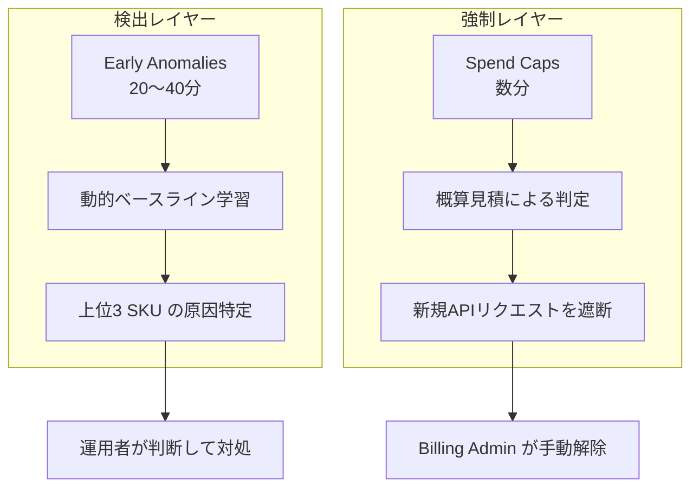
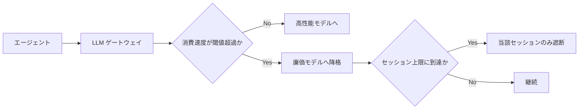

Google Cloud が 2026 年 7 月、Cloud Billing Budgets に 2 つの新機能をパブリックプレビューとして追加しました。

- **Spend Caps**: 予算上限に到達したサービスへの新規課金アクションを数分単位で強制ブロックする
- **Early Anomalies on AI Services**: Vertex AI などの AI サービスの支出急増を 20〜40 分のレイテンシで検知し、原因 SKU を提示する

この記事では、これらを単なる「コスト管理機能の追加」ではなく、**AI エージェントの権限設計に「消費可能予算」という新しい境界を持ち込むもの**として読み解きます。読み終えたときに得られるのは、次の 3 点です。

1. 2 機能が従来の予算アラートと何が違うのか（判定データと反応時間の構造的差分）
2. どの環境に Spend Caps を置き、どの環境に置いてはいけないのか（判断基準）
3. 本番環境で採るべき代替策と、エージェント権限設計への接続方法

## なぜいま「強制上限」が必要になったのか

従来のクラウド予算アラートは、確定請求データの到着を待って通知する仕組みでした。日次の請求確定には 24〜48 時間の遅延があるため、通知が届いた時点では既に費用は発生済みです。つまり **事後・情報提供型** の仕組みでした。

人間が操作する前提のワークロードであれば、これで大きな問題はありませんでした。使いすぎは翌日に気づいて止められます。

AI エージェントの登場でこの前提が崩れます。

- エージェントが自律的に `tool_use` を繰り返し、想定外の回数だけ API を叩く
- ループ判定を誤り、同じ処理を延々と再試行する
- 並列実行されたエージェント群が同時に高コストなモデルを呼ぶ

いずれも **数時間で財務的な損害が確定する** タイプの障害です。24〜48 時間遅れの通知では間に合いません。

ここで必要になるのが、通知ではなく **課金アクションそのものを止める強制境界** です。Spend Caps はそれをインフラ側の標準機能として提供します。

## 2 つの新機能を構造で捉える

### Spend Caps: 概算見積に基づく非破壊的な遮断

Spend Caps の設計上のポイントは 3 つあります。

**1. 概算見積（Gross Estimated Costs）で判定する**

確定請求ではなく、近リアルタイムの概算費用シグナルを判定に使います。これが数分単位の応答を可能にしています。裏を返すと、判定値は確定額と完全一致しません。

**2. 非破壊的なブロック**

上限到達時に止まるのは、該当サービスへの新規 API リクエストと課金対象アクションだけです。プロジェクト内のデータや既存リソースが削除されることはありません。「請求を止める」であって「環境を壊す」ではない、という設計です。

**3. 自動復旧しない**

一度ブロックが発動すると、Billing コンソールまたは API から管理者が明示的に上限を解除・引き上げるまで、ブロックは継続します。自動再開の機能はありません。

この 3 点目が、後述する適用先の判断を決定づけます。

### Early Anomalies: 検知と原因特定に振り切った機能

こちらは遮断しません。確定請求データを待たず early cost signals を用いて、20〜40 分程度のラグで異常な支出の跳ね上がりを検知します。

さらに、機械学習による動的ベースラインモデルが過去の傾向を学習し、異常検出時には **急増に最も寄与した上位 3 つの SKU** を自動特定して Cloud Billing Console に提示します。「増えている」だけでなく「何が増やしているか」まで出るため、初動調査の時間を短縮できます。

### 従来のアラートを含めた 3 者の比較

| 観点 | 従来の予算アラート | Spend Caps | Early Anomalies |
|---|---|---|---|
| 目的 | 情報提供・受動的モニタリング | 財務的破綻の強制防止 | 支出急増の早期発見 |
| 判定データ | 確定請求データ | 概算見積コスト | 近リアルタイムの early signals |
| 反応時間 | 24〜48 時間遅延 | 数分単位 | 20〜40 分 |
| システム動作 | メール / Pub/Sub 通知 | 当該サービスの新規 API を遮断 | アラート + 原因 SKU 提示 |
| 主な適用先 | 月次予算管理・経営報告 | 実験 / Sandbox / エージェント検証 | 本番環境のリアルタイム監視 |

同じ「コスト管理」というラベルで並んでいますが、**検出（Detect）** と **強制（Enforce）** という別レイヤーの機能です。片方をもう片方の代わりに使うことはできません。

## 導入判断: どこに置き、どこに置かないか

ここが本記事の核心です。Spend Caps は強力ですが、**適用先を誤ると障害要因になります**。

### 判断軸はひとつ: コスト超過リスクと可用性リスクのどちらが重いか

| 環境 | リスクの大小 | 推奨する防衛策 |
|---|---|---|
| 実験 / Sandbox / 開発 | コスト超過リスク > 可用性リスク | Spend Caps によるハードキャップ |
| 本番サービス | 可用性リスク（SLA）> コスト超過リスク | Early Anomalies + アプリ層の段階的縮退 |

Sandbox が数時間止まっても困る人はいません。逆に、開発者の誤設定やエージェントの暴走で数十万円の請求が立つほうが痛い。したがって Sandbox には迷わずハードキャップを掛けます。**コードを 1 行も足さずにインフラ側で上限を保証できる** のが Spend Caps の最大の価値です。

本番は逆です。次節で理由を掘ります。

### 本番に Spend Caps を掛けてはいけない理由

**理由 1: Denial of Wallet が Denial of Service に昇格する**

Spend Caps には自動復旧がありません。悪意ある第三者が意図的にトークンを大量消費させたり、ループに陥ったエージェントが暴走したりすると、Spend Cap が発動してサービスが硬直停止します。

つまり、**コストを狙った攻撃（Denial of Wallet）が、そのままサービス完全停止（Denial of Service）に変換される** ということです。攻撃者にとっては「課金を膨らませる」より「サービスを落とす」ほうが達成しやすくなります。防御機構が攻撃面に転化する典型例です。

**理由 2: 無条件全遮断は本番の障害モードとして粗すぎる**

インフラ側から API 呼び出しが一律で拒否されると、次が同時に起きます。

- エンドユーザーへのサービス停止
- 進行中トランザクションの破損
- SLA 違反

本番環境で必要なのは「全部止める」ではなく「安く動かし続ける」です。粒度が合っていません。

**理由 3: インフライト超過は消えない**

判定からブロック適用までに数分のレイテンシがあります。大量の並列バッチやストリーミング出力の完了処理では、Cap 到達後も一定の超過（オーバーシュート）が発生し得ます。「1 円も超えない」保証ではない点は、経営層に説明するときに落とさないほうがよいところです。

## 本番環境の代替策: 段階的縮退をアプリ層に置く

本番では、Early Anomalies を監視に使い、実際の抑制はアプリケーションプロキシ層（LiteLLM や Kong などの LLM ゲートウェイ）で行います。狙いは **止めずに安くする** ことです。

具体策は 3 段構えで考えると整理できます。

1. **モデルの自動降格**: コスト消費速度が閾値を超えたら、高性能モデルから廉価モデルへ動的にルーティングを切り替える
2. **コンテキストと tool_use の制限**: 過去コンテキストを切り詰め、高コストな外部ツール呼び出しを一時停止する
3. **セッション単位の消費上限**: ユーザーまたはセッションごとにトークン消費上限を設け、アプリ層で個別に遮断する

3 番目が重要です。インフラ側の Spend Cap はプロジェクト全体を止めますが、アプリ層の上限は **暴走している 1 セッションだけを止められます**。影響範囲を局所化できるかどうかが、本番で使えるかどうかの分かれ目です。

## エージェント権限設計への接続

ここまでを踏まえると、今回のアップデートが示す構造的な示唆は 1 点に収束します。

**エージェントの権限は、アクセス権だけでは記述しきれない。**

従来の IAM 設計が答えていたのは「このエージェントはどの API・どのデータにアクセスできるか」という機能的アクセス（Functional Access）の問いだけでした。ここに、もうひとつの軸を足す必要があります。

| 権限の軸 | 問い | 実現手段の例 |
|---|---|---|
| 機能的アクセス | 何を操作してよいか | IAM ロール / スコープ |
| 消費可能予算 | いくらまで費消してよいか | Spend Caps / ゲートウェイのセッション上限 |

「読めるが、無限には読めない」「呼べるが、月 1 万円までしか呼べない」という状態を、**設計時に明示的に定義できるセキュリティ境界として扱う** ということです。Spend Caps は、この 2 軸目をインフラ標準機能として提供した最初期の例として位置づけられます。

現時点では粒度が「1 プロジェクト × 1 サービスの月次予算」に限られており、エージェントのタスクやセッション単位の細粒度制御には届いていません。そこはアプリ層で埋めることになります。ただし、境界の概念そのものが標準機能として現れた意味は小さくありません。

## 導入前に確認すべきこと

パブリックプレビュー時点の制約を踏まえ、次の順で進めるのが安全です。

1. **適格サービスの確認**: 対象は Google AI Studio や Gemini Enterprise Agent Platform などの指定適格サービスに限定されます。自社で利用中のプロジェクトが対象かを Cloud Billing Console で確認します
2. **Sandbox での動作検証**: 非本番プロジェクトで Spend Cap を設定し、上限到達時のエラーレスポンスをアプリ側がどうハンドリングするかを実際に確認します。リトライ実装が無限リトライになっていないかを見る良い機会です
3. **復旧手順（SOP）の整備**: 手動解除が必須である以上、「Billing Admin による上限解除手順」と「緊急連絡体制」を事前に文書化しておきます。ここを決めずに本番系へ広げると、障害時の停止時間が人的な連絡待ちで伸びます

なお、Spend Caps は「1 プロジェクト × 1 サービス」単位の月次予算でのみ設定できます。複数サービスを横断した合算上限や、マルチクラウドでのポリシー統一は、現時点では利用者側で組み立てる領域です。

## まとめ

- Google Cloud Budgets に **Spend Caps（数分で強制遮断）** と **Early Anomalies（20〜40 分で検知・原因 SKU 提示）** がパブリックプレビューとして追加された
- 両者は同じコスト管理でも **強制（Enforce）と検出（Detect）** の別レイヤーであり、代替関係にない
- Spend Caps は自動復旧しないため、**Sandbox・実験環境に適し、本番環境には適さない**。本番に掛けると Denial of Wallet がそのまま Denial of Service に昇格する
- 本番では Early Anomalies による監視と、LLM ゲートウェイ層での **段階的縮退（モデル降格・コンテキスト制限・セッション上限）** を組み合わせる
- 構造的な示唆は、エージェント権限に **「消費可能予算（Spendable Budget）」という 2 本目の軸** を加えるべきだという点にある

この記事が少しでも参考になった、あるいは改善点などがあれば、ぜひリアクションやコメント、SNSでのシェアをいただけると励みになります！

## 参考リンク

- [New early anomalies and spend caps on Google Cloud Budgets - Google Cloud Blog](https://cloud.google.com/blog/topics/cost-management/new-early-anomalies-and-spend-caps-on-google-cloud-budgets/)
- [Cloud Billing Budgets & Spend Caps ドキュメント（Public Preview）](https://cloud.google.com/billing/docs/how-to/budgets-spend-caps)
