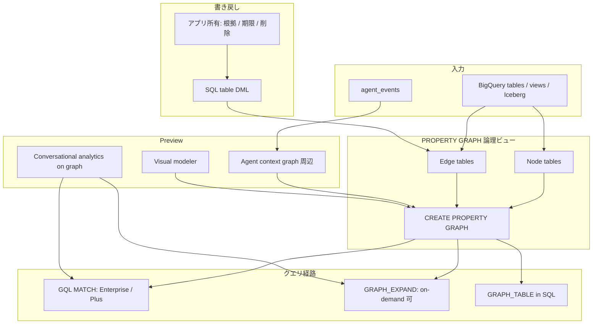

Google Cloud は 2026-09-01 に、[BigQuery Graph の一般提供](https://cloud.google.com/blog/products/data-analytics/bigquery-graph-connecting-data-and-ai-at-scale/)を発表しました。
既存のテーブルとビューをノードとエッジへ写像し、データを複製せずに ISO GQL と SQL を同じエンジンで走らせる、と [overview](https://docs.cloud.google.com/bigquery/docs/graph-overview) は述べます。

ここでの判断は「グラフ DB を買うか」ではありません。
倉庫上の多ホップ分析と監査に載せるか、対話エージェントのホットパス記憶に載せるか、です。
前者の第一候補にはなります。
後者の第一候補にはなりません。
公式の比較は、BigQuery Graph を秒から時間のオフライン分析、Spanner Graph をミリ秒から秒のリアルタイム運用に置きます。

この記事では、GA 発表と現行ドキュメントを突き合わせて、次の 4 点を整理します。

- GA のエンジンと、Preview の周辺 UX を混ぜない
- GQL を走らせるエディションと、オンデマンドで残る経路
- 行レベル権限を「継承する」と契約文書へ書く前に確認すること
- 関係の根拠、期限、削除を誰が持つか

対象読者は、すでに BigQuery にマスタがあり、エージェントの関係探索や GraphRAG を倉庫へ寄せようとしている方です。


*この記事の全体像。以下、順に解説します。*

## GAが公開したものと公開していないもの

一般提供として読めるのは、グラフエンジン、`CREATE PROPERTY GRAPH`、GQL です。
[overview](https://docs.cloud.google.com/bigquery/docs/graph-overview) は 2026-09-01 更新で、Preview バナーはありません。
一方、GA ブログ自身が「一部は Preview、一部は今後数週間で展開」と書きます。

| 機能 | 状態 | 一次ソース |
|---|---|---|
| グラフエンジン、GQL、`CREATE PROPERTY GRAPH` | GA 発表 2026-09-01 | [GA ブログ](https://cloud.google.com/blog/products/data-analytics/bigquery-graph-connecting-data-and-ai-at-scale/)、[overview](https://docs.cloud.google.com/bigquery/docs/graph-overview) |
| `GRAPH_EXPAND` | 現行 docs に Preview バナーなし。オンデマンド可 | [graph-sql-queries](https://docs.cloud.google.com/bigquery/docs/reference/standard-sql/graph-sql-queries)、[editions-intro](https://docs.cloud.google.com/bigquery/docs/editions-intro) |
| measures | 2026-08-14 ブログは Preview。docs ページ（2026-09-02 取得）に Preview バナーは無い。オンデマンド可、Standard 不可 | [measures ブログ](https://cloud.google.com/blog/products/data-analytics/bigquery-graphs-with-measures-for-trusted-agentic-workloads)、[graph-measures](https://docs.cloud.google.com/bigquery/docs/graph-measures) |
| Visual graph modeler | Preview（Pre-GA 条項） | [graph-modeler](https://docs.cloud.google.com/bigquery/docs/graph-modeler) |
| Chat with a graph | Preview。エージェントあたりグラフ最大 1。テーブルとグラフを混在不可 | [graph-chat](https://docs.cloud.google.com/bigquery/docs/graph-chat) |
| Agent skill の「提案して構築」 | rolling out soon | GA ブログ |
| Agent Analytics ADK プラグイン | GA | [agent analytics](https://docs.cloud.google.com/bigquery/docs/bigquery-agent-analytics) |
| LangGraph プラグイン | Preview | 同上 |

[release-notes](https://docs.cloud.google.com/bigquery/docs/release-notes) を 2026-09-02 に取得した時点の最新日付は August 31, 2026 です。
同日エントリに Graph GA の文言はありません。
製品 Preview の RN は 2026-04-09 です。
GA の一次はブログ 2026-09-01 と overview の更新日とします。

Visual modeler と graph chat を本番依存にしない、がここでの実務判断です。
エンジンが GA でも、会話 UI と視覚モデリングは Pre-GA 条項のままです。

## グラフは複製ではなく論理ビューである

グラフオブジェクトは、基礎テーブルの論理写像です。
ノードとエッジの実体は、基礎テーブルの行です。
[create ガイド](https://docs.cloud.google.com/bigquery/docs/graph-create) は、グラフ作成時にデータは移動もコピーもされない、と書きます。
クエリ結果は、実行時点のノードテーブルとエッジテーブルの内容に従います。

権限と鮮度の単位も、基礎テーブルです。
ストレージ課金は基礎テーブルだけにかかります。
グラフ定義の個数では増えません。



図の読み方は次です。

- エージェントが推論した関係を「グラフに書く」操作は、エッジ用テーブルへの INSERT / UPDATE / DELETE です
- Preview の会話分析と visual modeler を、GA エンジンと同一の本番面として扱わない
- グラフオブジェクト自体のカタログ lineage を、Dataplex 自動 lineage の対象として列挙した公式文は見当たらない

スキーマ側の制約もあります。
[schema overview](https://docs.cloud.google.com/bigquery/docs/graph-schema-overview) は、基礎テーブルや列の削除・変更が既存グラフを無効化するかを検査しない、と書きます。
PK / FK は `NOT ENFORCED` です。
制約を最適化に使うと不正結果になり得る、と公式が警告します。

## 公式の金融グラフでGQLとSQLの接続を見る

[create ガイド](https://docs.cloud.google.com/bigquery/docs/graph-create) の金融グラフは、複製なし写像の最小形です。
`Person` と `Account` がノード、`PersonOwnAccount` と `AccountTransferAccount` がエッジです。

```sql
CREATE OR REPLACE PROPERTY GRAPH graph_db.FinGraph
  NODE TABLES (
    graph_db.Account,
    graph_db.Person
  )
  EDGE TABLES (
    graph_db.PersonOwnAccount
      SOURCE KEY (id) REFERENCES Person (id)
      DESTINATION KEY (account_id) REFERENCES Account (id)
      LABEL Owns,
    graph_db.AccountTransferAccount
      SOURCE KEY (id) REFERENCES Account (id)
      DESTINATION KEY (to_id) REFERENCES Account (id)
      LABEL Transfers
  );
```

GQL の `MATCH` は、所有と送金を 1 本のパターンで辿ります。
次は、Dana が送金した相手を返す公式例です。

```sql
GRAPH graph_db.FinGraph
MATCH
  (person:Person {name: "Dana"})-[own:Owns]->
  (account:Account)-[transfer:Transfers]->(account2:Account)<-[own2:Owns]-(person2:Person)
RETURN
  person.name AS owner,
  transfer.amount AS amount,
  person2.name AS transferred_to
ORDER BY person2.name;
```

SQL 側からは `GRAPH_TABLE` で同じグラフを表にできます。
[graph-sql-queries](https://docs.cloud.google.com/bigquery/docs/reference/standard-sql/graph-sql-queries) の構文は次です。

```sql
SELECT name, id
FROM GRAPH_TABLE(
  graph_db.FinGraph
  MATCH (n:Person)
  RETURN n.name AS name, n.id AS id
);
```

オンデマンド課金では GQL は使えません。
代わりに `GRAPH_EXPAND` でグラフを平坦化します。
入力グラフには制約があります。
スキーマ関係グラフは単一根、非循環、到達可能、入次数は高々 1 です。
many-to-many 辺は無視されます。
キャッシュは基礎グラフ変更で無効化されません。
GraphRAG の多対多探索にこの関数を使わない、が実務上の境界です。

## GQLを走らせるエディションとクォータ

[editions-intro](https://docs.cloud.google.com/bigquery/docs/editions-intro)（Last updated 2026-08-26）は、Graph への到達を次のように分けます。

| 課金 | Graph |
|---|---|
| Standard reservation | アクセスなし |
| Enterprise / Enterprise Plus | GQL を含む Graph |
| On-demand | グラフ作成、`GRAPH_EXPAND`、measures。GQL なし |

[release-notes](https://docs.cloud.google.com/bigquery/docs/release-notes) は、core graph processing を Enterprise / Plus 必須とします。
既存 allowlist 利用者は Standard / on-demand を 2027-04-26 まで継続できます。
その後、core graph processing は非サポートです。
measures は on-demand に残ります。

Standard のまま GQL を前提にした設計は、allowlist 期限後に止まります。
分析 GraphRAG を第一候補にするなら、Enterprise reservation を前提にします。

[quotas](https://docs.cloud.google.com/bigquery/quotas) の BigQuery Graph 節は、次の上限を置きます。

| 上限 | 値 |
|---|---|
| グラフが参照するテーブル | 1,000 |
| ノード/エッジのキー列 | 16 |
| ノード参照・エッジ参照の列 | 各 16 |
| グラフ上のラベル | 1,000 |
| ノード/エッジあたりラベル | 20 |
| グラフ上のプロパティ | 5,000 |
| ラベルあたりプロパティ | 1,000 |

グラフ専用の同時 GQL 接続数は未掲載です。
クエリジョブの一般上限に従います。

IAM は `bigquery.propertyGraphs.{create,list,get,update,delete}` です。
[create ガイド](https://docs.cloud.google.com/bigquery/docs/graph-create) の推奨ロールは、データセット上の `roles/bigquery.dataEditor` です。
ノードとエッジの実データ権限は、テーブルの `getData` とグラフの `propertyGraphs.*` の組合せです。

## 既存統制を継承すると読む前に確認すること

GA ブログは、クエリが既存の行レベル権限と列レベル権限の下で走る、と述べます。
RLS / CLS / マスキングは Standard では使えません。
Enterprise / Plus / on-demand で使えます。

ここまでが確立していることです。
次はギャップです。

[using-row-level-security-with-features](https://docs.cloud.google.com/bigquery/docs/using-row-level-security-with-features) は、PROPERTY GRAPH / GQL / `GRAPH_TABLE` / `GRAPH_EXPAND` を記述しません。
ページ内でヒットする "graph" は、Query Insights の execution graph だけです。
多ホップで中間ノードが隠れたとき、辺の存在が漏れるかは、公式仕様としては未確認です。

したがって、RLS 下で 2 ホップ以上の GQL を自前テストするまで、「既存統制を継承している」と契約文書に書かない方が安全です。
ブログの一文を、グラフ走査の仕様として採用できません。

PROPERTY GRAPH オブジェクトを Dataplex 自動 lineage の対象として列挙した公式文も、見当たらない、とします。
テーブル lineage の間接継承で足りるかは、監査要件次第です。
グラフ専用のリージョン制限も、現状は dataset リージョン継承が最も近い解釈です。

## 関係の根拠と期限と削除は製品が持たない

ISO 比較表（[graph-iso-standards](https://docs.cloud.google.com/bigquery/docs/graph-iso-standards)）は、書き込み面を次のように分けます。

| | SQL/PGQ | GQL 規格 | BigQuery Graph |
|---|---|---|---|
| DML | SQL の DML を継承 | Graph-based DML あり | SQL table-based DML のみ |

[create ガイド](https://docs.cloud.google.com/bigquery/docs/graph-create) は、グラフデータの更新はノードテーブルとエッジテーブルの更新だと書きます。
`DROP PROPERTY GRAPH` は定義だけ消します。
行は残ります。
Conversational analytics からの書き込みはできません。
CA は write / DML 不可です。

したがって製品は、次を所有しません。

| 関心事 | 製品 | 誰が持つか |
|---|---|---|
| 関係の根拠（誰が、どの入力で、どのモデルが付けたか） | なし | エッジテーブルの列としてアプリが持つ |
| 期限 / TTL / 失効 | なし | パーティション、期限列、定期 DELETE |
| 削除責任 | `DROP PROPERTY GRAPH` は定義だけ消す | テーブルの DML とライフサイクルポリシー |
| Conversational analytics からの書き込み | 不可 | 別ジョブ |

Agent context graph は `agent_events` を読み、ノードテーブルとエッジテーブルへ定期マテリアライズする OSS 経路です。
`--lookback-hours` はジョブ引数です。
TTL は製品機能ではありません。

エッジテーブルには、最低限 `source_run_id`、`evidence_ref`、`created_at`、`expires_at`、`deleted_at` を持たせます。
TTL ジョブはアプリで回します。
zero-ETL で全テーブルを流し込まない、が先に置く設計です。
目的、identity、ライフサイクルを先に決めます。

## GraphRAGには向き対話記憶には向かない

公式パスは揃っています。

- [Anti-money laundering & fraud prevention with BigQuery GraphRAG](https://codelabs.developers.google.com/codelabs/graphrag-with-bigquery)
- [Trace AI Agent Decisions with BigQuery Graph](https://codelabs.developers.google.com/bqaa-context-graph)
- overview は knowledge graphs / GraphRAG をユースケースに挙げる

向き不向きは、レイテンシで切れます。

| ワークロード | BQ Graph | 代替 |
|---|---|---|
| 倉庫上の多ホップ分析、監査、バッチ GraphRAG | 適する | — |
| 対話ターンの p95 数十 ms 記憶 | 不適。公式 latency は Seconds to hours | Spanner Graph（Milliseconds to seconds）または専用 memory store |
| 数百万の per-user 小さなグラフ | 製品想定外 | 専用ストア |

Google 第一者も二層を要求します。
[BigQuery-Agent-Analytics-SDK#93](https://github.com/GoogleCloudPlatform/BigQuery-Agent-Analytics-SDK/issues/93)（OPEN、確認 2026-09-02）は、Hot Spanner Runtime for &lt;100ms と Warm BigQuery Analytics for deep lineage を対置します。
live-agent は sub-50ms を別パッケージとして要求します。
リポジトリは archived ではありません。
star は約 40（2026-09-02 時点、`gh repo view` は 42）です。

Thales のマルチホップが秒で動く、は分析 SLA の成功例です。
対話記憶の成功例ではありません。
GA ブログの 2x / 100x は、ベンダーブログでベンチ名なしの二次情報です。
設計根拠にしません。

`GRAPH_EXPAND` は GraphRAG の代替ではありません。
単一根、非循環、入次数 ≤1 です。
many-to-many 辺は無視されます。
キャッシュは基礎グラフ変更で無効化されません。

## Spanner Graphと専用ストアとの切り分け

[graph-compare](https://docs.cloud.google.com/bigquery/docs/graph-compare) の公式比較を、採用条件へ翻訳すると次です。

| 基準 | BigQuery Graph | Spanner Graph | 専用グラフDB / memory |
|---|---|---|---|
| 主ワークロード | オフライン分析 | オンライン運用 | 点取得・専用アルゴリズム / テナント記憶 |
| レイテンシ | 秒〜時間 | ミリ秒〜秒 | 製品次第 |
| データ移動 | 倉庫内ゼロ ETL | 運用データ上 | 複製が前提になりやすい |
| 言語 | GQL / SQL/PGQ | 同じ GQL 系統 | Cypher / Gremlin 等 |
| 書き込み | テーブル DML | 運用書き込み向き | グラフ DML が多い |
| 統制 | BQ IAM + 推定されるテーブル RLS | Spanner IAM | 別サイロの ACL |

最適条件は次です。

- BigQuery Graph: 既に BigQuery にマスタがあり、Enterprise 予約があり、秒単位の分析で足り、関係のライフサイクルをテーブルで設計できる
- Spanner Graph: ユーザー向けの近傍探索、強い一貫性、低遅延
- 専用 DB: Cypher / GDS、または per-subject 記憶の SLA

逆転条件は、対話 p95 &lt;100ms が必須、グラフネイティブ DML が必須、Cypher / GDS 資産が主、Standard / on-demand のまま GQL が必要、のいずれかです。
エージェント記憶のホットパスでは、公式が Spanner への reverse ETL を前提にします。

## 導入判断の順序

分析 GraphRAG と監査トレースは、BigQuery Graph を第一候補にします。
Enterprise reservation を前提にします。
対話記憶は Spanner Graph または専用ストアを第一層にします。
BigQuery はウォームな監査グラフにします。

次を本番依存にしない方が、後から巻き戻すコストを避けられます。

1. Preview の visual modeler と graph chat
2. `GRAPH_EXPAND` による GraphRAG
3. ブログの「既存 RLS を継承する」一文だけの契約記述
4. 全テーブルの zero-ETL 流し込み

エッジテーブルのライフサイクル列と TTL ジョブを、グラフ定義より先に決めます。
RLS 下の 2 ホップ以上は、公式仕様が埋まるまで自前テストします。
ネイティブグラフアルゴリズム（PageRank 等）の BQ 側 GA 時期は未確定です。
Thales 引用は「今後」と述べます。
measures の launch stage も、ブログは Preview、docs はバナーなし、で揃っていません。

## まとめ

BigQuery Graph の GA は、企業データの統制面に接続した分析グラフの第一候補です。
対話エージェント記憶の第一候補ではありません。

複製なし写像、GQL と SQL の相互運用、公式 GraphRAG Codelab は、倉庫上の多ホップ分析を支えます。
公式 latency、GQL の edition ロック、graph DML の不在、RLS 走査仕様の欠落、Preview の周辺 UX は、ホットパス記憶への採用を止めます。

エンジンを GA として読んでも、関係の根拠と期限と削除はアプリが持ちます。
分析面へ載せるなら Enterprise 予約とエッジテーブルのライフサイクルから始めます。
対話面へ載せるなら、最初から Spanner Graph または専用ストアを第一層にします。

この記事が少しでも参考になった、あるいは改善点などがあれば、ぜひリアクションやコメント、SNSでのシェアをいただけると励みになります！

## 参考リンク

- [BigQuery Graph: connecting data and AI at scale](https://cloud.google.com/blog/products/data-analytics/bigquery-graph-connecting-data-and-ai-at-scale/)（2026-09-01）
- [Introducing BigQuery Graph](https://cloud.google.com/blog/products/data-analytics/introducing-bigquery-graph/)（製品 Preview。RN は 2026-04-09）
- [Introduction to BigQuery Graph](https://docs.cloud.google.com/bigquery/docs/graph-overview)
- [Create and query a graph](https://docs.cloud.google.com/bigquery/docs/graph-create)
- [Graph schema overview](https://docs.cloud.google.com/bigquery/docs/graph-schema-overview)
- [ISO standards in BigQuery Graph](https://docs.cloud.google.com/bigquery/docs/graph-iso-standards)
- [Compare BigQuery Graph and Spanner Graph](https://docs.cloud.google.com/bigquery/docs/graph-compare)
- [Graphs within SQL](https://docs.cloud.google.com/bigquery/docs/reference/standard-sql/graph-sql-queries)
- [Graph measures](https://docs.cloud.google.com/bigquery/docs/graph-measures)
- [Chat with a graph](https://docs.cloud.google.com/bigquery/docs/graph-chat)
- [Visual graph modeler](https://docs.cloud.google.com/bigquery/docs/graph-modeler)
- [Introduction to BigQuery editions](https://docs.cloud.google.com/bigquery/docs/editions-intro)
- [BigQuery quotas](https://docs.cloud.google.com/bigquery/quotas)
- [Release notes](https://docs.cloud.google.com/bigquery/docs/release-notes)
- [Using row-level security with other BigQuery features](https://docs.cloud.google.com/bigquery/docs/using-row-level-security-with-features)
- [Anti-money laundering & fraud prevention with BigQuery GraphRAG](https://codelabs.developers.google.com/codelabs/graphrag-with-bigquery)
- [Trace AI Agent Decisions with BigQuery Graph](https://codelabs.developers.google.com/bqaa-context-graph)
- [BigQuery-Agent-Analytics-SDK issue #93](https://github.com/GoogleCloudPlatform/BigQuery-Agent-Analytics-SDK/issues/93)
