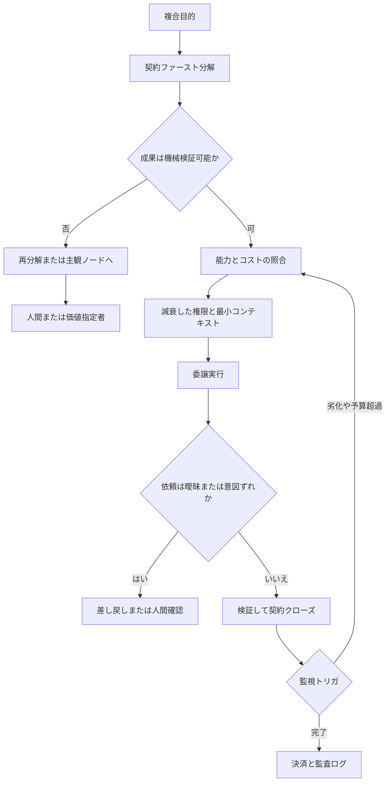

Google Cloud は 2026-08-22 のブログ [How agents can delegate better](https://cloud.google.com/blog/products/ai-machine-learning/how-agents-can-delegate-better) で、企業ワークフローのマルチエージェントを「エージェントを増やす問題」ではなく「委譲の知能の問題」として整理しました。掲げられた原則は4つです。検証可能な契約による分解、費用対効果のあるモデル照合、機微データの最小開示、曖昧な依頼への認知摩擦です。

この記事では、その4原則の出典である Google DeepMind の構想論文 [Intelligent AI Delegation](https://arxiv.org/abs/2602.11865)（arXiv:2602.11865、2026-02-12）を読み、ブログの主張と Google Cloud の公式ドキュメントを突き合わせます。読み終えたときに得られるのは次の3つです。

- 4原則がそれぞれ論文のどこに根拠を持ち、どこまでが提案でどこからが実証済みかの切り分け
- Google Cloud の現行製品が4原則のどこを実装し、どこが空いているかの対応表
- 自分のエージェント基盤に今日から入れられる、深さ上限・検証予算・人間介入条件の初期値

結論を先に置きます。**4原則は委譲設計の規範として採用できますが、Google Cloud の現行製品を「4原則の実装済み基盤」として扱うことはできません。** 論文は実験節を持たない提案文書であり、ブログの "they prove" という表現は過大です。原則2の実装としてリンクされている API Gateway Model Routing は、Public Preview の静的な `model` 文字列ルータであって、論文が描く多目的最適化ではありません。


*この記事の全体像。以下、順に解説します。*

## マルチエージェントの問題は「数」ではなく「委譲の設計」である

論文が最初に置く区別は、**委譲はタスク分割ではない**という点です（§2.1）。分割は実行グラフの最適化ですが、委譲には権限、責任、説明責任、信頼の移転が含まれます。この移転を設計しないまま並列度だけ上げると、権限だけが増幅し、責任だけが曖昧になります。

ここから4原則が導かれます。それぞれ論文の別セクションに散在している議論を、ブログが製品読者向けに4つへ圧縮した構造です。



以降、4原則を1つずつ、論文の主張と公式ドキュメントで確認できる事実に分けて見ていきます。

## 原則1: 検証可能性が分解の拘束条件になる

論文は分解を「目的の断片化」と区別します（§4.1）。分解は効率とモジュール性のための実行グラフ最適化であり、同時に安全のための拘束条件でもあるという立場です。

その拘束が **contract-first** です。出力が主観的、検証が高コスト、または複雑すぎる単位は、手元にある検証能力（単体テスト、形式証明など）に合うところまで再分解します。つまり **成果の検証方法が先に無い単位は委譲しない**、という順序です。委譲要求も入出力の対ではなく、役割、資源境界、進捗報告の頻度、能力証明までを含みます。

ブログはこれを、オーケストレータが複数のプランを比較し、監視と採点が十分に容易になるまで単位を小さくしていく動きとして説明します。同時に、**すべてを採点可能にすることは常に可能ではない**とも書いています。ここが重要です。主観評価が残る成分を見つける作業そのものが、人間の時間を使うべき場所を教えてくれます。

論文 §4.8 は検証手段を4つに分類します。

1. 直接検査（コード生成とテストのように、内在的な検証可能性が高い領域）
2. 第三者監査（専門エージェント、認定された人間、合議）
3. 暗号証明（zk-SNARK など）
4. ゲーム理論的合意（TrueBit 型）

鎖が A→B→C と伸びたとき、A は C と直接契約しません。B が C を検証し、A は B の作業と「B が C を正しく検証したこと」の両方を検証します。**責任は下流へ逃がせない**という設計です。

### 実務への落とし方

サブタスクの分割軸は「並列しやすいか」ではなく「合否を機械が判定できるか」になります。契約化できるものとできないものは、実際にはかなりはっきり分かれます。

| 契約化できる | 契約化しきれない |
|---|---|
| テスト、lint、型チェックの合否 | 調査の洞察の質 |
| 完了マーカーファイルの実在 | デザインの良しあし |
| IAM スコープ、差分の有無 | レビューの妥当性そのもの |
| スキーマ検証、コマンドの終了コード | 記事の問いの立て方 |

右列は人間ノードとして残します。ここを「レビュー担当エージェント」で埋めた気になると、後述の moral crumple zone に落ちます。

## 原則2: コストは多目的最適化で、静的ルータとは別物

論文 §4.3 の最適化対象は、速さ、安さ、正確さのどれか1つではありません。品質と費用、遅延と費用、リスク低減と費用、プライバシーと性能が同時に競合する Pareto 問題として扱われます。

さらに重要なのが**複雑さの床**です。委譲のオーバーヘッド（交渉、契約作成、検証、オーケストレータ自身の推論）がタスクの価値を超えるなら、知能的委譲を省略して直接実行するべきだと論文は書きます。委譲は無条件に得な操作ではありません。

ブログはこの原則を、給与計算を軽量モデルへ渡す失敗と、表の整形を強力なモデルへ渡す浪費の対比で説明し、実装として [Overview of model routing](https://docs.cloud.google.com/api-gateway/docs/model-routing-overview) をリンクします。

### 公式 Overview が述べている事実

リンク先（Last updated 2026-08-11 UTC）を読むと、範囲はかなり狭いことがわかります。

- Public Preview
- Public Preview 中のルーティングは、OpenAI 互換クライアントリクエスト JSON の `model` タグまたは名前に**排他的**に基づく
- 1つのルータ内の全モデルは同一 hostname（`aiplatform.googleapis.com` または単一リージョン）に属する必要がある
- VPC Service Controls 非対応
- OpenAPI 3.x のみ、POST のみ
- 既存ゲートウェイに対する routing 有無の切替は不可。新規 config と新規 gateway が必要
- `model` が欠落したリクエストを Preview 中は reject せず、誤処理する
- リクエスト単位で「どのモデルが選ばれたか」の帰属情報は Preview では提供されない

推論バックエンドのスループットはゲートウェイの能力ではなく、Model Garden 側の Organization Baseline です（[Standard PayGo](https://docs.cloud.google.com/gemini-enterprise-agent-platform/models/standard-paygo)、2026-08-21 UTC）。

| モデル | Tier 1 | Tier 2 | Tier 3 |
|---|---|---|---|
| Gemini Pro | 500,000 TPM | 1,000,000 TPM | 2,000,000 TPM |
| Flash / Flash-Lite | 2,000,000 TPM | 4,000,000 TPM | 10,000,000 TPM |

公式はこれをハード上限ではなく Baseline と best-effort burst と説明し、ティアごとに別の RPM 上限は無いと書いています。preview モデルには PayGo ティアを適用しません。429 は固定クォータ超過ではなく共有資源の競合として扱い、exponential backoff と global endpoint の利用を推奨しています。

可用性の前提も確認しておきます。[Gemini Online Inference SLA](https://cloud.google.com/vertex-ai/generative-ai/sla) は `generateContent` / `streamGenerateContent` の Monthly Uptime Percentage を 99.5%（短命な可用性モデルは 95%）としています。除外には Pre-GA、Grounding with Google Search、クォータ、短い deadline が含まれます。**Model Routing 自体は Public Preview なので、ルーティング層は SLA の対象外**です。Service Specific Terms も Pre-GA を AS IS、SLA なし、原則として個人データ処理を避ける対象としています。

### 判断

Model Routing は「クライアントが選んだモデル名を、同一ホスト上の複数バックエンドへ振り分ける入口」です。論文が描く「タスクを見て最安で十分なエンドポイントを学ぶ」機能ではありません。LiteLLM の代替として明記されている位置づけからも、その範囲は読み取れます。

したがって、コスト原則を成立させる責任は呼び出し側に残ります。整形や抽出は軽量モデル、契約判定や曖昧さ検出は高信頼モデル、というポリシーを自分の側で明示しない限り、この原則は空文になります。

## 原則3: 最小権限は「減衰」がないと再委譲で増幅する

論文の給与計算の例では、オーケストレータはサブエージェントへ全情報を渡しません。理由は2つあり、セキュリティと、コンテキスト肥大による性能劣化です。後者は実務でも効きます。渡す情報を絞る動機は、安全側だけではありません。

論文 §4.7 が求める設計は次の4点です。

- **減衰（attenuation）**: 再帰委譲で全権限を転送しない。サブタスクに必要な部分集合だけを発行する
- **JIT**: 高リスク領域では静的な資格では足りず、タスク期間にスコープした発行と、必要なら人間承認を要求する
- **意味制約**: 粒度をツールの ON/OFF ではなく、読み取り専用行、特定関数の実行だけ、といった意味レベルにする
- **回路遮断**: 信頼指標の急落や異常検知でトークンを無効化する

### Google Cloud 側の近接実装

公式ドキュメント（2026-08-21〜22 更新）で確認できる範囲では、権限側は原則1や4より手厚く整備されています。

- [Agent Identity](https://docs.cloud.google.com/gemini-enterprise-agent-platform/govern/agent-identity-overview)（2026-08-21 UTC）: 既定で複数ワークロードと共有しない、impersonate 不可、長期のサービスアカウントキーを発行できない
- [3-legged OAuth with auth manager](https://docs.cloud.google.com/iam/docs/auth-with-3lo)（2026-08-22 UTC、Preview）: ユーザー同意後、資格情報を Google 管理の vault に保存し、ADK がリクエストへ注入する。なお IAM Connectors API は GA しないという警告があり、新規実装は Agent Identity API 版の 3LO へ誘導されます
- Principal Access Boundary: IAM の許可があっても、到達できる資源を別途制限できる
- [Agent Gateway](https://docs.cloud.google.com/gemini-enterprise-agent-platform/govern/gateways/agent-gateway-overview)（2026-08-21 UTC）: MCP の tool 名と method で ALLOW/DENY を判定する。A2A の属性パースは非対応

3LO について1点補足します。**「LLM が資格情報を見ない」ことと「ランタイムプロセスがトークンを持たない」ことは別の話です。** vault 保存と ADK 注入は前者を保証しますが、後者の隔離範囲はドキュメントから断定できません。規制データを載せる前に、実際の注入経路を確認する対象です。

論文 §6 は、現行のプロトコル側にこの減衰が無いと指摘します。MCP には semantic attenuation が無く、A2A には検証用の暗号スロットが無い、という整理です。論文が示す拡張案（`verification_policy`、Delegation Capability Tokens）は illustrative であり、確定した仕様ではありません。

### 減衰の前に、そもそも認証主体が結び付いていなかった例

最小権限の設計を語る前提として、公式 SDK 側の実装を確認する価値があります。[CVE-2026-52869](https://nvd.nist.gov/vuln/detail/CVE-2026-52869)（NVD、公開 2026-07-15）です。

| 項目 | 内容 |
|---|---|
| 製品 | MCP Python SDK（PyPI `mcp`） |
| 影響バージョン | 1.27.2 未満。修正版は 1.27.2 |
| 前提条件 | SSE または stateful Streamable HTTP で、かつリクエスト認証がある構成。セッション ID を別経路で知る必要がある。stateless は対象外 |
| 内容 | セッションを `session_id` / `Mcp-Session-Id` だけで引き、作成した principal を検証しない。別の bearer クライアントが既知のセッションへ JSON-RPC を注入できる |
| 分類 | CWE-639、CVSS 3.1（CNA: GitHub）7.1 HIGH |

つまり、セッションと認証主体の結び付きという基本部分が欠けていました。対策は明確です。**MCP クライアントを 1.27.2 以上に固定し、セッション ID を秘密情報として扱う**ことです。減衰トークンの設計に進むのはその後です。

## 原則4: 認知摩擦がないと、エージェントは無思考ルータになる

論文 §2.3 は Barnard の組織論から **zone of indifference** を引きます。現行モデルの安全フィルタは「ハードな違反が無ければ従う」ゾーンを作ります。単発の依頼ならこれで足りますが、鎖が長くなると、微妙な意図ずれや文脈依存の害が下流へ急速に伝播します。各エージェントが責任ある行為者ではなく、無思考なルータになるという指摘です。

ブログはこれを、営業担当が上司からの「重要顧客のピッチに出ろ」という指示を疑わない例で紹介します。技術的には安全でも文脈的に曖昧な依頼を、ゾーンの外へ出す能力が要求されます。

対策が**動的な認知摩擦**です。曖昧なら委譲者へ差し戻すか、人間の確認を求めます。ただし論文 §5.1 は同時に、摩擦の頻度が過多になれば alarm fatigue になると警告します。人間の時間は必要なときにだけ使う、という制約付きの設計です。

論文 §5 が挙げる失敗形態は、そのまま設計時のチェック項目になります。

| 失敗形態 | 内容 | 設計上の含意 |
|---|---|---|
| 過信頼 / moral crumple zone（§5.1） | 名目上の権限だけ人間に残し、責任だけ引き受けさせる配置 | 実質的に判断していないレビュー工程を「人間介入」と数えない |
| 説明責任の真空（§5.2） | 長い鎖で誰も責任を持たない状態 | liability firebreak を置く。下流の全責任を引き受けるか、人間プリンシパルへ権限を再移転する |
| safety の贅沢品化（§5.3） | 高保証の検証コストが高く、効率のために省かれる | クラス指定の検証は効率のために省略できない床として扱う |

Google Cloud 側でこの原則に近いのは、[Semantic Governance](https://docs.cloud.google.com/gemini-enterprise-agent-platform/govern/policies/semantic-governance-overview)（2026-08-21 UTC、Preview）の DENY と rationale、3LO の明示同意、Model Armor です。ただし Semantic Governance は tool call を intent と自然言語制約で ALLOW/DENY する仕組みで、**公式ドキュメント自身が判定を誤り得ると書いています**。「曖昧なら聞き返す」というプロトコルそのものは、製品側にありません。

## 4原則とGoogle Cloud製品の対応

ここまでを1枚に畳みます。ブログが明示的にリンクしているのは原則2の Model Routing だけで、原則1・3・4 の近接実装は Agent Platform の Govern スタック側にあります。層が違うため、論文の暗号的な委譲トークンとは直接対応しません。

| ブログ原則 | 論文の置き場所 | 確認できた実装 | ギャップ |
|---|---|---|---|
| 1. Verify delegated work | §4.1 分解、§4.8 検証 | Semantic Governance が tool call を intent と自然言語制約で ALLOW/DENY（Preview） | 成果物の契約クローズ、検証スロット、zk 証明、escrow、再帰 attestation は製品に無い |
| 2. Be smart about cost | §4.3 多目的最適化 | API Gateway Model Routing。LiteLLM 代替と明記。同一ホスト上の Gemini / Claude / OpenAI MaaS | コストや検証可能性による動的選択は無い。ルールは人手の YAML |
| 3. Respect sensitive data | §4.7 権限、§2.2 Contextuality | Agent Identity、3LO（Preview）、Principal Access Boundary、Agent Gateway の MCP tool 単位 ALLOW/DENY | Macaroon 型の減衰トークンは製品に無い。Model Routing のゲートウェイ SA は `roles/aiplatform.user` |
| 4. Beware the zone of indifference | §2.3、§5.1 | Semantic Governance の DENY + rationale、3LO の明示同意、Model Armor | 「曖昧なら聞き返す」プロトコルは無い |

呼び出し経路として見ると、原則2の系列と原則3・4の系列は別のスタックに乗っています。

```
Client OpenAI 互換 JSON
  -> API Gateway Model Routing   原則2の静的ルータ / Public Preview
  -> Agent Platform Model Garden

Agent / User
  -> SPIFFE + 3LO
  -> Agent Gateway   MCP 属性 RBAC / A2A 属性パースは非対応
```

## 4原則を鵜呑みにしない: 反証されている点

原則を採用する前に、反対側の証拠を並べます。

### 論文とブログの側の弱さ

- 論文に Experiments / Results 節がありません。Abstract の動詞は propose です。ブログの "they prove" は不正確です
- ブログ自身が contract-first は常に可能ではないと書いています。原則1は完全な適用を前提にできません
- zk 証明とゲーム理論的合意は、論文自身が遅延と費用を認めています。LLM のタスク完了を低コストで証明する本番ベンチマークは、公開情報からは確認できませんでした

### 実測データから来る反証

Anthropic の [How we built our multi-agent research system](https://www.anthropic.com/engineering/multi-agent-research-system)（2025-06-13）は、本番のマルチエージェント調査システムについて次を報告しています。

- 調査タスクは事前に手順をハードコードできない。契約分割で探索そのものを固定すると失敗する
- 社内評価で、Opus 4 リード + Sonnet 4 サブの構成が単体 Opus 4 を 90.2% 上回った
- **トークン使用量が BrowseComp の性能分散の 80% を説明する。** 三因子で 95%
- マルチエージェントはチャットの約 15 倍、エージェント単体は約 4 倍のトークンを使う
- ほとんどのコーディングは並列化しにくく、リアルタイム委譲はまだ弱い

最後の点に関して、後続の解説記事 [Building multi-agent systems: when and how to use them](https://claude.com/blog/building-multi-agent-systems-when-and-how-to-use-them)（2026-01-23）は、planner / implementer / tester / reviewer のような**役割で割ると telephone game になる**と報告しています。成功しやすいのは、同じ文脈を同じエージェントに残す分割です。これは「検証境界で切れ」という原則1と正面から競合します。

なお同記事は解説記事であり、一次の実測は 2025-06-13 の engineering 記事側にあります。

### 仕様側の反証

形式検証の論文 [AgentRFC](https://arxiv.org/abs/2603.23801)（arXiv:2603.23801、2026-03-25）は、A2A 仕様が委譲スコープを規定していないこと、AASM の委譲単調性（P3）が仕様の無言部分に対する hardening 対象であることを述べています。合成した5モデルの Composition Safety 不変条件は 21 件中 20 件が違反でした。Phase 1 は 5×11 で spec-level 33 件です。ただしこれらは TLC の有限バウンドでの結果であり、実装の全確認ではありません。

### 総合評価

4原則は「エージェントを増やすな、検証可能性で切れ」という**診断**としては残ります。ただし唯一の要因ではありません。Anthropic の測定では、性能分散の主因はトークン消費量です。

したがって使い方はこうなります。契約原則は、**検証可能な工程の費用対効果を上げるための制約**として使います。探索そのものを事前契約で固定すると、調査タスクでは失敗します。オープンエンドな調査では、契約分割より文脈境界を先に決めるべきです。

## 自分のエージェント基盤へどう落とすか

ここまでの整理を、運用ルールの初期値に変換します。数値は仮説であり、実測で更新する前提です。逆転条件を併記しているのは、初期値を固定値として扱わないためです。

| 統制 | 推奨の初期値 | 根拠 | 逆転条件 |
|---|---|---|---|
| 再委譲の深さ | 既定 1（親→子）。孫は禁止。深さ 2 は検証可能な原子タスクに限り、子が責任を引き受ける firebreak を明文化する | 論文 §5.2。A2A は委譲深さを規定しない（論文 §6、AgentRFC の P3） | 子の検証証明を親が再検証できるときだけ 2 を許可する |
| 検証コスト上限 | 子の推論費用の一定割合。初期は 20% を仮説とし、実測で更新する。超過したら再分解するか直接実行する | 論文 §4.3 の複雑さの床。Anthropic の 15 倍は調査タスクに限った観測 | 高クリティカルかつ不可逆なら上限を上げる。低価値なら委譲しない |
| 人間介入 | 成功基準が選好である、不可逆である、検証の不一致が続く、依頼が曖昧で差し戻しが 2 回を超える、のいずれか | 論文 §2.2 Subjectivity / Reversibility、§5.1 | ルーブリックが機械判定可能になったら介入を外す |
| 権限 | 子には当該ステップのツール allowlist とデータパスだけを渡す。親の資格情報を渡さない。MCP SDK は 1.27.2 以上に固定する | 論文 §4.7、CVE-2026-52869 | 3LO 対象のユーザー委任は vault 経由に限る |
| モデル選択 | 整形、抽出、機械検証は軽量モデル。契約判定と曖昧さ検出は高信頼モデル。ゲートウェイの静的ルールに任せない | Model Routing Overview の exclusively | Model Routing がタスク特性で動的選択するようになったら再評価する |
| 分割軸 | 検証境界と文脈境界を両立させる。検証のためだけに文脈を割ると telephone game になる | 論文 §4.1 と Anthropic の本番報告 | ブラックボックス検証が安い工程（単体テストなど）は検証境界を優先する |

サブエージェントを起動するときの委譲契約は、論文 §4.1 と §6.1 の例を実務サイズへ縮小すると、次のフィールドに収まります。

- 目的と非目的
- 成果物パス
- 合否判定（コマンド、スキーマ、完了マーカー）
- 許可するツールとデータ
- 再委譲の可否と深さ
- 予算（トークンまたは時間）
- 曖昧なときの差し戻し先
- 不可逆操作の禁止

パイプライン全体の所有権は親が保持します。子にパイプラインごと渡すと、深さ上限と firebreak の両方が意味を失います。

主観が残るノード（記事の問いの立て方、サムネイルの良しあし、トリアージの判断）は、人間か、明示的な価値指定ステップにします。名目上のレビュー工程を置いて責任だけ人間に残す配置は、moral crumple zone そのものです。

## 残る不確実性

採用を止める理由にはなりませんが、条件付きであることを明示しておく項目です。

- Model Routing の実効 timeout。ゲートウェイ timeout は最大 3,600 秒とされる一方、OpenAPI 3.x の backend `deadline` は既定 15.0 秒、最大 600 秒とされており、ドキュメント間で衝突しています
- Agent Gateway の launch stage。ページによって Preview、Private preview、無印と食い違います
- zk で LLM のタスク完了を証明する公開の費用対効果
- 再委譲の深さの最適値が 1 か 2 かの実測
- Semantic Governance の誤 DENY / 誤 ALLOW 率が運用に耐えるか。公式が誤り得ると明記しています
- 3LO における Gateway / Gemini Enterprise の隔離範囲

いずれも「Preview 製品を規制データや SLA 前提の経路に置かない」という条件付き採用に落ち着きます。

## まとめ

- Google Cloud の4原則は、検証可能な契約付き分解、費用対効果のあるモデル照合、機微データの最小開示、曖昧依頼への認知摩擦です。委譲設計の規範として採用できます
- 出典の論文は実験節を持たない提案文書です。ブログの "they prove" は過大なので、実証済みとして扱いません
- 原則2の実装としてリンクされる API Gateway Model Routing は、Public Preview の静的な `model` 文字列ルータです。コスト最適化の責任は呼び出し側に残ります
- 権限側（Agent Identity、3LO、Principal Access Boundary、Agent Gateway）は比較的整備が進んでいますが、Macaroon 型の減衰トークンはまだありません
- 「曖昧なら聞き返す」プロトコルは製品側に存在しないため、自分で実装します
- 反証として、Anthropic の実測では性能分散の主因はトークン消費量であり、役割ベースの分割は telephone game を招きます。検証境界と文脈境界は両立させます
- 今日入れられる初期値は、再委譲の深さ 1、検証コスト上限を子の推論費用の 20%、人間介入は選好・不可逆・差し戻し 2 回超のいずれか、MCP SDK は 1.27.2 以上です

この記事が少しでも参考になった、あるいは改善点などがあれば、ぜひリアクションやコメント、SNSでのシェアをいただけると励みになります！

## 参考リンク

1. Nenad Tomašev, Matija Franklin, Simon Osindero, *Intelligent AI Delegation*, arXiv:2602.11865v1, 2026-02-12. https://arxiv.org/abs/2602.11865
2. Nenad Tomasev, Reshu Yadav, *How agents can delegate better*, Google Cloud Blog, 2026-08-22. https://cloud.google.com/blog/products/ai-machine-learning/how-agents-can-delegate-better
3. Google Cloud, *Overview of model routing*, Last updated 2026-08-11 UTC. https://docs.cloud.google.com/api-gateway/docs/model-routing-overview
4. Google Cloud, *Configure model routing*, Last updated 2026-08-11 UTC. https://docs.cloud.google.com/api-gateway/docs/model-routing-configure
5. Google Cloud, *Authenticate to tools and resources* (Agent Registry), Last updated 2026-08-11 UTC. https://docs.cloud.google.com/agent-registry/authenticate-toolsets
6. Google Cloud, *Standard PayGo*, Last updated 2026-08-21 UTC. https://docs.cloud.google.com/gemini-enterprise-agent-platform/models/standard-paygo
7. Google Cloud, *Gemini Online Inference SLA*. https://cloud.google.com/vertex-ai/generative-ai/sla
8. Google Cloud, *Semantic governance overview*, Last updated 2026-08-21 UTC. https://docs.cloud.google.com/gemini-enterprise-agent-platform/govern/policies/semantic-governance-overview
9. Google Cloud, *Agent Identity overview*, Last updated 2026-08-21 UTC. https://docs.cloud.google.com/gemini-enterprise-agent-platform/govern/agent-identity-overview
10. Google Cloud, *Agent Gateway overview*, Last updated 2026-08-21 UTC. https://docs.cloud.google.com/gemini-enterprise-agent-platform/govern/gateways/agent-gateway-overview
11. Google Cloud, *Authenticate using 3-legged OAuth with auth manager*, Last updated 2026-08-22 UTC. https://docs.cloud.google.com/iam/docs/auth-with-3lo
12. Anthropic, *How we built our multi-agent research system*, 2025-06-13. https://www.anthropic.com/engineering/multi-agent-research-system
13. Anthropic, *Building multi-agent systems: when and how to use them*, 2026-01-23. https://claude.com/blog/building-multi-agent-systems-when-and-how-to-use-them
14. Zheng and Zhang, *AgentRFC*, arXiv:2603.23801, 2026-03-25. https://arxiv.org/abs/2603.23801
15. NVD, CVE-2026-52869. https://nvd.nist.gov/vuln/detail/CVE-2026-52869
16. MCP Authorization spec, 2026-07-28. https://modelcontextprotocol.io/specification/2026-07-28/basic/authorization
17. A2A Protocol specification. https://a2a-protocol.org/latest/specification/
