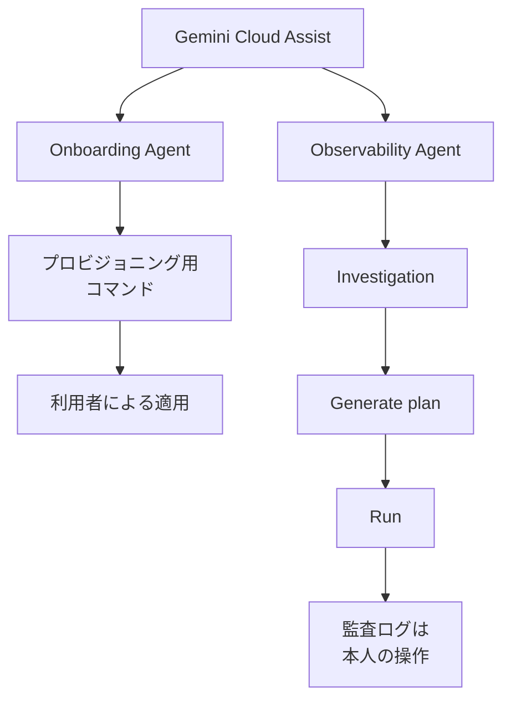
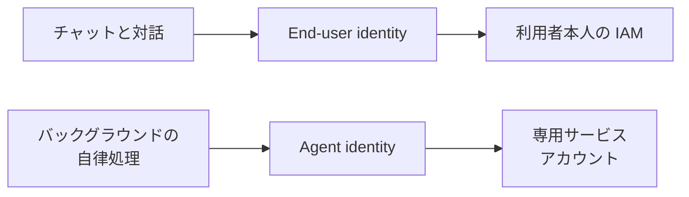

Google Cloud の Database Operations Agents は、データベースのライフサイクルを導入と稼働後に分けて出すエージェントです。公式ブログの掲載日は 2026-08-05 で、著者は Group Product Manager の Niranjan Shivprasad と Senior Product Manager の Nitesh Mehta です。InfoQ 日本語版は Sergio De Simone の記事を Naoko Koshimura が訳し、2026-09-25 に出ています。原文リンクの表記は 2026-08-28 です。日本語版ブログのページ日付は 2026-08-20 で、本文は米国時間 2026-08-05 の抄訳だと書いています。

想定しているのは、データベースの選定と導入を行う開発者と、稼働後の障害を見る SRE、DevOps、DBA です。この記事では、二つのエージェントが何をするか、利用者が触る入口、公開文書のあいだで揃わない点、変更権限をどう分けるかを順に説明します。

*この記事の全体像。以下、順に解説します。*

## Database Operations Agentsとは

Database Operations Agents は、Google Cloud がデータベースの作業を二つの名前に分けたものです。Database Onboarding Agent は Day 0 を担い、セットアップ、構成、初期デプロイを扱います。Database Observability Agent は Day 1 と Day 2 を担い、監視、トラブルシュート、継続的な保守を扱います。利用者は Gemini Cloud Assist のチャット、コンソール、CLI、MCP、IDE からこれらの能力に触ります。

Onboarding は、自然言語の要件から Google Cloud のマネージドデータベースを推奨します。ブログが例に挙げる理解対象は、IOPS、レイテンシ上限、レプリケーションラグです。選んだサービスについて、プロビジョニング、設定、デプロイに必要なコマンドを生成します。ブログは、そのコマンドを使ってインスタンスを用意するのは利用者だと書いています。

Observability は、Database Insights、Cloud Monitoring、Cloud Logging、Cloud Trace をまたいで相関し、根本原因の分析を出します。見つかった問題への推奨を出し、利用者の承認のもとで検証済みアクションを実行できる、と公式ブログは書いています。例は Cloud SQL のコネクションプーリング有効化と、インデックス追加です。インデックス追加などの validated remediations と、製品画面内の investigations は、一部顧客向けの preview です。

Gemini Cloud Assist の調査レビューは、一般手順として Generate plan と Run を持ちます。計画の例は gcloud コマンドと Kubernetes マニフェストです。チャットと対話の状態変更は、利用者の明示的な同意を要します。監査ログ上は、利用者が自分で行った操作として残ります。investigations そのものが使う OAuth 2.0 トークンは、データの変更には使わない、と investigations の注意書きは言っています。

ブログの Get started が両エージェントの対象に挙げるサービスは、AlloyDB、Bigtable、Cloud SQL（PostgreSQL、MySQL、SQL Server）、Firestore、Memorystore、Spanner です。

二つの名前は、導入の日と、稼働後の日で分かれています。変更の実行は、観測の結果から同じ利用者の画面へつながります。

対話と、バックグラウンドの自律処理は、権限の出どころが違います。

バックグラウンドの Agent identity について、概要は最小権限だと書いています。Proactive Mode の agent identity は、既定では読み取りに限られます。対話側は本人の IAM を継承します。本人が権限を持たないリソースは、アシスタントからも見えず、変更もできません。

Gemini Cloud Assist の推奨ロール表は、データベースのタスクを一行にまとめています。行の名は Deploying, updating, and troubleshooting databases です。並ぶロールは `roles/iam.databaseAdmin`、`roles/logging.viewer`、`roles/monitoring.viewer` です。

MCP の公開面は、製品ごとにツールの範囲が違います。Database Center MCP の公開リファレンスに載るツール名は list のみです。Database Insights MCP は、Cloud SQL のリファレンスではクエリとシステムメトリクスの取得です。AlloyDB のリファレンスには、それに加え集計統計、時系列、インデックス推奨の取得があります。インデックス推奨は CREATE INDEX の SQL を返します。Gemini Cloud Assist の MCP は private preview で、同意確認つきの変更と、GKE の apply / patch を含みます。`invoke_operation` は Destructive Hint が付き、Read Only Hint は付きません。公開スキーマの operation_type は `GKE_APPLY` と `GKE_PATCH` です。`ask_cloud_assist` は、VM 再起動やクラスタのスケールを例に、実行前の同意確認を書いています。

## 注意点

公式ブログのタイトルは、自律型データベース管理の未来です。同じブログと、2026-09-24 更新の対話概念ページは、状態を変える操作に利用者の同意を要求します。同意の主体は、診断している利用者本人です。第二の承認者を置く、とは書かれていません。

Generate plan と Run は、Gemini Cloud Assist の investigations の一般手順です。公式ブログが一部顧客の preview とする Cloud SQL のインデックス追加が、この Run に載るとは、調査を作成するページは書いていません。

AlloyDB のインデックス推奨の行は、返した SQL を実行するとは書いていません。公開スキーマの `invoke_operation` を、DB 変更の手段だとはページは書いていません。

investigations のトークンがデータを変更しない、という文と、Proactive Mode の agent identity が既定で読み取りに限られる、という文を、Day 1 と Day 2 の全体へ広げると、Run と本人 IAM の文と衝突します。変更権限を観測側から外すのは、公開製品の写し取りではなく、利用側がロールを割って足す設計です。

「数分で根本原因分析」は、公式ブログの宣伝文です。母数、計測期間、達成基準はブログにありません。調査を作成する手順は、完了まで数分かかることがある、と上限側を書いています。Cloud SQL や Spanner の手順は、調査ペインが約 2 分で開く、と特定のクリック経路について書いています。SLO としては読めません。

対応サービスは文書ごとに集合が違います。

| 文書 | 日付 | データベースとして名指すもの |
| --- | --- | --- |
| 公式ブログの Get started | ページ表記 2026-08-05 | AlloyDB、Bigtable、Cloud SQL 三エンジン、Firestore、Memorystore、Spanner |
| investigations の Supported products | 最終更新 2026-09-24 | Cloud SQL、Bigtable、Spanner、Memorystore for Redis。AlloyDB と Firestore は無い |
| 概要の Database and analytics troubleshooting | 最終更新 2026-09-24 | Cloud SQL for PostgreSQL、Cloud SQL for MySQL、AlloyDB for PostgreSQL、BigQuery、Spark、Spanner。Bigtable、Firestore、Memorystore、SQL Server は無い |

概要の同じ文は、遅い SQL の特定、スロットと容量の管理、性能ボトルネックの調査に加え、データ環境の構成も含みます。診断だけの境界は、この文にはありません。

製品ページ（最終更新 2026-09-24）は、AI 支援トラブルシュートを Preview とします。2026-04-10 以降、調査の作成、実行、編集は Premium Support 契約か、アカウントチーム経由でアクセスを申請した利用者に限る、と investigations の概要と作成ページは書いています。AlloyDB、Cloud SQL、Spanner の各手順ページは Premium Support 契約だけを書き、アカウントチーム経由を書いていません。過去に実行した調査結果の閲覧は残る、と作成ページは書いています。

Cloud SQL の手順は、クエリ異常検知を Enterprise Plus に限ります。Limitations は Enterprise edition、旧ネットワーク、VPC Service Controls、Access Transparency、リードレプリカを非対応に数えます。同じページの有効化手順は、Enterprise edition では Gemini Cloud Assist を有効にすれば AI 支援のトラブルシュートが使える、とも書いています。二つの文のどちらが現行の契約かは、このページだけでは決まりません。

AlloyDB の手順は、推奨が AlloyDB のストレージ分離、キャッシュ、カラムナエンジンとずれうると自分で注記しています。推奨は出発点であり、確定のガイドは AlloyDB のドキュメント側だと書いています。高度な query insights の有効化はインスタンス再起動を要します。ベースラインには 24 時間待つ、と Cloud SQL と AlloyDB の手順は推奨しています。選択期間が月曜のとき、ベースラインは 7 日前の 24 時間です。

チャットの応答は、選択中インスタンスについて直近 1 時間の情報に基づく、と Cloud SQL と AlloyDB の手順は書いています。同じ調査を再実行すると、結果が小さく変わりうる、と investigations の注意は言っています。investigations のリソース（注釈と観測）は、どの Google Cloud データセンターにも置かれえます。レジデンシー規制の対象データには investigations を使わない、と注意は言っています。範囲は、単一プロジェクトか、単一の App Hub アプリケーションです。

InfoQ 日本語版は、二エージェント、承認後の修復実行、六サービスの列挙を伝えています。preview、一部顧客、Premium Support、investigations のトークンと Run の違い、製品リストの不一致は書いていません。InfoQ の要約を、公式の提供範囲とは別に読みます。

料金ページは、Investigations、Database Troubleshooting、Database Optimization を Gemini Code Assist Enterprise 列に置きます。注記は、プレビュー期間中、Code Assist Enterprise に含まれるとマークされた機能は追加料金なし、です。時間単価のページ表記（2026-09-28 に確認）は、Enterprise の月間コミットメントが $0.073972603 / 1 hour、12 か月コミットメントが $0.061643836 / 1 hour です。月額への換算はしません。Database Center 自体は無償で、Gemini を使うフリート分析と自然言語チャットは Gemini Cloud Assist が要る、と 2026-05 の Database Center ブログは書いています。

クォータページは最終更新 2026-09-24 で存在します。項目名が Resource A、Resource B、Images、Videos のままなので、データベースエージェントの運用上限としては使いません。

investigations の VPC Service Controls は、いったん止まってから戻っています。非推奨表（最終更新 2026-09-24）は、その行を OBSOLETE とし、2026-04-13 から停止していた期間のあと、現在は supported だと書いています。リリースノートの 2026-08-04 も、Gemini Cloud Assist が VPC-SC 境界内で supported だと書いています。Cloud SQL の AI 支援手順は、VPC-SC 境界内のインスタンスを非対応のまま列挙しています。investigations 全体の対応再開と、製品手順の非対応は別です。

公式ブログの英語版と日本語抄訳は、MCP を Managed Context Protocol と書きます。Gemini Cloud Assist の概要は Model Context Protocol と書きます。表記が文書間で揃っていません。

YouTube の自動字幕（2026-07-07）は、調査している利用者が DB 変更権限を持っていればエージェントが代わりに適用する、と説明しています。公式手順の Run と方向は揃いますが、字幕を手順の正本にはしません。修復実行を組織全体で無効化できる、という説明も同じ回の字幕にあります。admin-settings の掲載項目（Grounding、ページ文脈の共有、プロンプト共有、Proactive agents、Custom instructions）に、そのスイッチはありません。専用の無効化ページは、参照した公式ドキュメントの範囲では確認できていません。

Database Center の利用手順は create, manage, and query と書く一方、リファレンスのツール名は list のみです。リファレンスの最終更新表記は 2026-04-22 で、利用手順より古い可能性があります。ライブの tools/list はここでは取っていません。

調査を作成するページが推奨 API に `monitoring.googelapis.com` と書いています。正表記の `monitoring.googleapis.com` との取り違えかは、ページ本文の綴りとしては typo に見えます。有効化コマンドへ写すと失敗しえます。

2026-06-15 の data agents ブログと、2026-05-11 の Database Center ブログには、提供段階や Testing agent に触れる検索上の断片があります。Testing agent は、インデックスやマシン変更の前に影響をシミュレートする、という名前で、Onboarding と Observability とは別です。どちらも本文全体はここでは確認していないので、提供段階の根拠には使いません。

公開文書だけでは、次は決まりません。

- Cloud SQL のインデックス追加は、ブログが言う一部顧客の preview のままか。一般の調査画面の Run に載るか。
- `invoke_operation` 以外に、DB フラグやインデックスを書く MCP ツールが private preview の先にあるか。公開スキーマだけでは未確認です。
- 修復実行だけを組織管理者が止める設定が、admin-settings 以外にあるか。
- AlloyDB が investigations の Supported products に無いのは、リストの遅れか、入口が製品ページ側に限られるのか。
- Firestore と Memorystore に、AI troubleshooting の専用手順があるか。参照した検索の範囲では確認できていません。
- Cloud SQL の AI 支援が VPC-SC 境界内インスタンスを非対応のままにしているのは、investigations 全体の VPC-SC 再開後も製品側の制約として残るか。
- Cloud SQL Enterprise edition は非対応なのか、Gemini Cloud Assist を有効にすれば使えるのか。
- クォータページの Resource A 等は未充填のテンプレートか、実際の割当か。運用数値にはしません。

## 変更権限は利用側で分ける

開発、検査、トリアージの分離をデータベース運用へ持ち込むなら、Google の公開形を二段で使います。

1. エージェント名の分割はそのまま使います。導入で決めるサービスと構成は Onboarding のコマンド生成に置き、稼働後の原因切り分けは Observability の investigations に置きます。Onboarding が自分でインスタンスを作る、という公式文は確認できていません。
2. 変更権限の分割は、公開形には無いので利用側で足します。investigations を実行する主体には `databaseAdmin` を付けません。Generate plan の Run、および MCP の変更ツールは、別の主体に残します。公式の推奨行は、デプロイ、更新、トラブルシュートを一つのロールに束ねているので、その行を診断者へそのまま写しません。
3. 同意は「ある」と書いてよいです。ただし同意者は診断者本人である、とセットで書きます。別承認者や、観測エージェントからの権限除去としては書きません。

公式が書いている支持は、次のとおりです。

- 公式ブログが Day 0 と Day 1/2 を別エージェントにしています。
- 公式ブログが “with your approval” と書いています。
- 対話概念ページが、状態変更に explicit consent を要求し、監査主体を本人にしています。
- investigations のレビュー手順が、計画確認のあと Run で実行します。
- 参照した公式文書の範囲では、人間の操作なしに DB パラメータ、インデックス、インスタンスを変えた一次記述は見つかっていません。

結論を狭める材料は、次のとおりです。

- investigations のトークンがデータを変更しないことは、Run が同じ調査画面にあることと両立します。読み取り専用エージェントの証明にはなりません。
- IAM 推奨は、デプロイ、更新、トラブルシュートを `roles/iam.databaseAdmin` に束ねます。診断用に変更権限を外す推奨は、この表にありません。
- `ask_cloud_assist` の同意確認は、無承認の証拠にはなりません。同じアシスタントに、investigations と変更が同居する、という範囲の限定にはなります。
- 六製品が同じ機能と同じ提供段階にある、という読みは、概要、Supported products、製品ごとの非対応条件と揃いません。

逆転条件は次です。公式が、Observability の実行主体を診断者以外の identity に固定し、診断ロールから mutate を除いた文書を出したら、上の 2 は不要になります。Run が DB に対して実際には出ない、と契約環境で確認できたら、ブログの「承認のもとで実行」は一部顧客の preview に限定して書きます。

## 提供範囲を判断資料に書くとき

記事や判断資料では、InfoQ の六サービス列挙と「数分」を、提供範囲と SLO の根拠にしません。製品ページの Preview、Premium Support、非対応構成を併記します。Get started の六サービス、investigations の Supported products、概要の troubleshooting 対象は、上の表のまま並べます。一つのリストへ畳みません。

料金を書くときは、ページの時間単価をそのまま置きます。月額へ換算した数字は、公開ページが示していない値です。プレビュー期間中に追加料金なし、と書けるのは、Code Assist Enterprise に含まれるとマークされた機能についてです。Database Center が無償であることと、Gemini を使う分析やチャットが Gemini Cloud Assist を要ることは、分けて書きます。

## 契約のある環境で先に見るもの

直近で確認するなら、Premium Support かアカウントチーム経由のアクセスがあるプロジェクトで、Cloud SQL の仮説に Generate plan と Run が出るかを見ます。出た計画がインデックス追加なのか、gcloud の一般操作なのかを残します。

同じ確認で、次も分けて記録します。

- 診断に使う主体のロールに `roles/iam.databaseAdmin` が付いているか。
- Run の監査ログの主体が、その診断者本人か。
- Cloud SQL の手順が VPC-SC 境界内を非対応のままにしている環境で、investigations 自体は作れるか。
- Enterprise edition で、Limitations の非対応と、有効化手順の「使える」のどちらに画面が従うか。

有効化コマンドを写すときは、作成ページの `monitoring.googelapis.com` をそのまま使わず、`monitoring.googleapis.com` かどうかを画面上の綴りで確認します。

## まとめ

Database Operations Agents は、導入のコマンド生成と、稼働後の診断を別のエージェント名に分けています。状態を変える前の同意はあり、その同意者は診断者本人です。変更権限は観測側の利用者に残るので、診断者と変更者を分けるなら、公開の推奨ロールをそのまま写さず、利用側でロールを割ります。提供範囲は、ブログの六サービスと「数分」ではなく、文書ごとの対象リスト、Preview、Premium Support、非対応構成で読みます。

この記事が少しでも参考になった、あるいは改善点などがあれば、ぜひリアクションやコメント、SNSでのシェアをいただけると励みになります！

## 参考リンク

- [Introducing Database Operations Agents](https://cloud.google.com/blog/products/databases/deep-dive-on-new-ai-powered-database-agents)（Google Cloud Blog, 2026-08-05）
- [データベース運用エージェントの紹介（日本語抄訳）](https://cloud.google.com/blog/ja/products/databases/deep-dive-on-new-ai-powered-database-agents)（ページ日付 2026-08-20）
- [Google Cloud、データベースの導入と障害対応を別エージェントに分ける](https://www.infoq.com/jp/news/2026/09/google-database-operation-agents/)（InfoQ 日本語, 2026-09-25）
- [InfoQ 英語版](https://www.infoq.com/news/2026/08/google-database-operation-agents/)（原文リンク表記 2026-08-28）
- [Gemini Cloud Assist investigations](https://docs.cloud.google.com/cloud-assist/investigations)（最終更新 2026-09-24）
- [Create a Gemini Cloud Assist investigation](https://docs.cloud.google.com/cloud-assist/create-investigation)（最終更新 2026-09-24）
- [Agent identity concepts](https://docs.cloud.google.com/cloud-assist/proactive-agents-concepts)（最終更新 2026-09-24）
- [IAM requirements](https://docs.cloud.google.com/cloud-assist/iam-requirements)（最終更新 2026-09-24）
- [Gemini Cloud Assist overview](https://docs.cloud.google.com/cloud-assist/overview)（最終更新 2026-09-24）
- [Configure administrator settings](https://docs.cloud.google.com/cloud-assist/admin-settings)（最終更新 2026-09-24）
- [Quotas and system limits](https://docs.cloud.google.com/cloud-assist/quotas)（最終更新 2026-09-24）
- [VPC-SC deprecation for investigations](https://docs.cloud.google.com/cloud-assist/deprecations/vpcsc-support)
- [Cloud SQL for PostgreSQL: monitor and troubleshoot with AI](https://docs.cloud.google.com/sql/docs/postgres/monitor-troubleshoot-with-ai)（最終更新 2026-09-24）
- [AlloyDB: monitor and troubleshoot with AI](https://docs.cloud.google.com/alloydb/docs/monitor-troubleshoot-with-ai)（最終更新 2026-09-24）
- [Spanner: monitor and troubleshoot with AI](https://docs.cloud.google.com/spanner/docs/monitor-troubleshoot-with-ai)（最終更新 2026-09-24）
- [Bigtable: investigate performance with AI](https://docs.cloud.google.com/bigtable/docs/investigate-performance-with-ai)
- [Gemini for Google Cloud pricing](https://cloud.google.com/products/gemini/pricing)
- [Google Cloud MCP supported products](https://docs.cloud.google.com/mcp/supported-products)
- [Database Center MCP reference](https://docs.cloud.google.com/database-center/docs/reference/mcp)
- [Gemini Cloud Assist MCP reference](https://docs.cloud.google.com/cloud-assist/reference/mcp)
- [Set up Proactive Mode](https://docs.cloud.google.com/cloud-assist/proactive-agents-setup)（最終更新 2026-09-24）
- [New data agents across the Agentic Data Cloud](https://cloud.google.com/blog/products/data-analytics/new-data-agents-across-the-agentic-data-cloud)（ページ日付 2026-06-15。本文全体は未確認）
- [Database Center improvements from Next ’26](https://cloud.google.com/blog/products/databases/database-center-improvements-from-next26)（本文全体は未確認）
