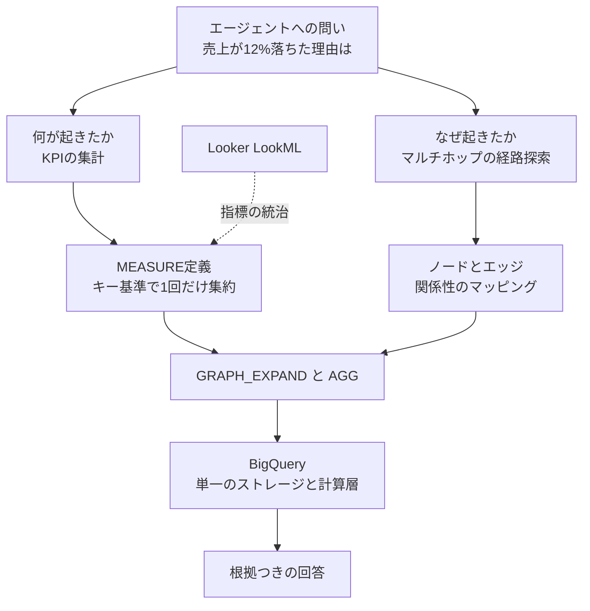

AI エージェントに社内データを分析させると、「売上が 12% 落ちた」までは正しく答えるのに、「なぜ落ちたか」で外すことがあります。原因は、モデルの賢さではなくデータ層の構造にあります。指標の定義と、エンティティ同士の関係性が別々の場所に置かれているからです。

Google Cloud がプレビューで提供する **BigQuery Graphs with measures** は、この 2 つを 1 つの層に統合します。既存の BigQuery テーブルをプロパティグラフとしてマッピングし、そのグラフ定義の中に集計指標を直接書き込む機能です。

この記事では、機能の仕組み、実際の DDL とクエリ、Looker との統合、そして本番採用をどこまで進めるべきかの判断材料を整理します。読み終えると、自社のデータ基盤にこれを入れるかどうかを、プレビュー段階のリスクも含めて判断できる状態になります。


*この記事の全体像。以下、順に解説します。*

## 「何が起きたか」と「なぜ起きたか」の分断

Google Cloud のブログは、小売業者の例でこの分断を説明しています。

- **問い**: シアトルの冬用ジャケットの売上が 12% 低下した理由は何か
- **フラットなテーブルで分かること**: 12% 低下したという事実
- **フラットなテーブルで分からないこと**: シアトルの注文 → 流通センター → 地域の嵐による仕入遅延、という因果の連鎖

関係性のコンテキストが欠けたまま推論すると、エージェントは「値引きキャンペーンを打つ」といった、需要側の問題を前提にした施策を提案します。実際には供給側の一時的な遅延なので、この施策はマージンを削るだけで終わります。

ここで効いているのは、エージェントの推論精度ではありません。**エージェントに渡されたデータ層が、因果の経路を持っていなかった**という構造の問題です。

従来この分断は、グラフ DB と DWH を並べて運用し、推論時に両者を動的に繋ぐ（stitching）ことで埋めていました。しかしこの方式は、データ同期のコスト、2 つのシステム間での指標定義のずれ、そして一貫性の欠如を抱えます。

## BigQuery Graphs with measures がやっていること

この機能は 3 つのことを同時に行います。

### 1. Zero-ETL で既存テーブルをグラフにする

既存の BigQuery テーブルを、その場所に置いたままノードとエッジとして定義します。データの複製も、別システムへの移動も発生しません。グラフは物理的な実体ではなく、テーブル群に対する論理的なマッピングです。

このため、`bigquery-public-data` のような読み取り専用のパブリックプロジェクトのテーブルも、自分のプロジェクト内に作ったグラフ定義からノード・エッジとして参照できます。

### 2. 指標の定義をグラフの中に置く

Property Graph DDL の `PROPERTIES` 句の中で、`MEASURE` キーワードを使って集計指標を定義します。指標が BI ツール側の定義ファイルではなく、**データ層のスキーマそのものに乗る**という点が本質です。

公式ドキュメントによれば、`MEASURE` でサポートされる集約関数は `SUM` / `AVG` / `COUNT` / `COUNT(DISTINCT)` / `MIN` / `MAX` です。

### 3. 集計の狂いをエンジン側で解決する

グラフを辿る処理を素の SQL JOIN で書くと、多対多の関係で行が重複し、`SUM` が二重計上になります。この「JOIN による集計の狂い」は、手書き SQL でもっとも事故が起きやすい箇所です。

BigQuery Graph は、measure の集約を **その measure が定義されたノード/エッジテーブルの `KEY` を基準に**行います。公式ドキュメントは次のように説明しています。

> Measures define their aggregation in reference to the `KEY` of the node or edge table on which they're defined.

つまり、下敷きのテーブルが行の重複を招く形で結合されても、集約は正しく 1 キーにつき 1 回だけ実行されます。エージェントが動的に生成したクエリでも、この保証はエンジン側で効きます。

## 実際の定義とクエリ

グラフの定義は `CREATE PROPERTY GRAPH` で行います。以下は Google Cloud のブログに掲載されている例です。

```sql
CREATE OR REPLACE PROPERTY GRAPH `YOUR_PROJECT_ID.YOUR_DATASET.thelook_ecommerce_graph`
NODE TABLES(
  `bigquery-public-data.thelook_ecommerce.users` AS User
    KEY(id) LABEL User
    PROPERTIES(id, city, country),
  `bigquery-public-data.thelook_ecommerce.orders` AS Order
    KEY(order_id) LABEL Order
    PROPERTIES(
      order_id,
      MEASURE(AVG(num_of_item)) AS avg_items_per_order,
      MEASURE(SUM(num_of_item)) AS total_items
    )
)
EDGE TABLES(
  `bigquery-public-data.thelook_ecommerce.orders` AS OrderedBy
    SOURCE KEY(order_id) REFERENCES Order(order_id)
    DESTINATION KEY(user_id) REFERENCES User(id)
    LABEL ORDERED_BY
);
```

`users` と `orders` という既存テーブルが、そのままノードになっています。`orders` はノードとしてもエッジとしても使われています。

クエリ側は、GQL の独自構文ではなく標準 GoogleSQL から呼べます。ここで押さえるべき制約が 2 つあります。

- measure として定義したプロパティは、GQL クエリから直接参照できない
- 参照するには `GRAPH_EXPAND` テーブル値関数でグラフを平坦化し、`AGG()` で包む

```sql
SELECT
  User_city AS city,
  ROUND(AGG(Order_avg_items_per_order), 2) AS agg_avg_items,
  ROUND(AGG(Order_total_items), 2) AS agg_total_items
FROM GRAPH_EXPAND("YOUR_PROJECT_ID.YOUR_DATASET.thelook_ecommerce_graph")
GROUP BY User_city
ORDER BY agg_total_items DESC
LIMIT 10;
```

`GRAPH_EXPAND` の出力カラム名は、テーブルのラベルとプロパティ名を連結した形（`Order_total_items` など）になります。`AGG()` で包むことで、measure に定義された集約がキーごとにちょうど 1 回だけ適用されます。

なお `GRAPH_EXPAND` は、ノード・エッジテーブルに一連の `LEFT JOIN` を適用して平坦化する関数です。この結合の性質上、**すべてのプロパティグラフを受け付けるわけではありません**。グラフの形状によっては使えないため、スキーマ設計の段階で `GRAPH_EXPAND` を通す前提かどうかを決めておく必要があります。

## Looker との統合で指標定義を一元化する

この機能のもう一つの狙いは、指標定義がロジックスタックの各層に散らばる状態（fragmented logic stack）を解消することです。Looker 側に 2 つの接続経路が用意されています。

| 方式 | パラメータ | 定義の置き場所 |
| --- | --- | --- |
| Database-managed models | `sql_analytic_model_name` | BigQuery 側のグラフ定義。Looker はそこを指すだけ |
| Looker-managed models | `derived_analytic_model` | LookML view 内。Looker が BigQuery に DDL を動的発行する |

前者は「データ層が指標の正本」、後者は「LookML が正本」という設計思想の違いです。どちらを選ぶかは、既存の LookML 資産の量と、BI 以外の利用者（エージェント、ノートブック、外部アプリ）がどれだけいるかで決まります。エージェントを主要な消費者として想定するなら、BI ツールを経由しなくても指標にアクセスできる前者が自然です。

Looker-managed 方式を選ぶ場合は、グラフのライフサイクル全体を Looker IDE 上で管理でき、Git ベースのバージョン管理と CI に乗せられます。解約率のようなコア KPI の定義変更が、レビューを経て反映される状態を作れます。

## 判断のフロー

エージェントが「計算機（SQL）」と「地図（グラフ）」のどちらを必要としているかを、データ層側が識別できる構造になります。



従来この 2 系統は別システムに分かれており、推論時に繋ぎ合わせるコストと一貫性の欠如を抱えていました。統合の価値は、クエリが速くなることよりも、**指標の意味と因果経路が同じ契約の上に乗る**ことにあります。ナレッジグラフを RAG の検索精度向上のための補助としてではなく、データ契約（Data Contract）として位置づける発想です。

BigQuery Studio 側には、DDL を手書きせずにノードとエッジを構築するビジュアルモデラーと、自然言語でグラフに問い合わせる Conversational Analytics の統合も用意されています。後者は、テーブルの結合方法を推測させる代わりに、決定論的な関係マップの上を辿らせることで、結合の取り違えによる誤答を減らす狙いです。

## 採用判断:どこまで進めるか

### 制約を先に確認する

1. **プレビュー（Pre-GA）である**
   本機能は Pre-GA Offerings Terms の対象で、本番向けの SLA は保証されていません。サポートもプレビュー用のメール窓口経由です。またリザベーションのエディションによっては利用できない場合があり、Enterprise / Enterprise Plus のリザベーションかオンデマンド課金が必要です。

2. **リアルタイム性（OLTP）がない**
   Neo4j のような index-free adjacency（ポインタによる物理的なリンク）を持つネイティブグラフ DB とは異なり、BigQuery Graphs の実体はリレーショナルテーブルの分散結合です。ミリ秒単位の応答が要る処理や、探索と同時にグラフ構造を頻繁に書き換えるトランザクション処理には向きません。

3. **スロット消費が読みにくい**
   `GRAPH_EXPAND` は通常の BigQuery スロットを消費します。エージェントが深さの制約なくマルチホップ探索を動的に生成すると、スロットを急速に消費し、コスト高騰と他の分析ワークロードへの影響を招きます。

4. **キャッシュが下敷きの変更を検知しない**
   公式ドキュメントによれば、下敷きのグラフへの変更は `GRAPH_EXPAND` クエリのキャッシュ結果を無効化しません。データ更新直後に古い結果が返る前提で運用設計する必要があります。

5. **スキーマ上の上限がある**
   1 つのグラフ定義が参照できるノード・エッジテーブルの数や、`KEY` に指定できるカラム数には上限があります。BigQuery の主キーは 16 カラムを超えられないため、複合キーで広く取る設計は早い段階で頭打ちになります。設計に入る前に公式のクォータ・制限を確認してください。

### 現時点での推奨

- **PoC にとどめる**: 「エージェントに社内の因果関係と KPI を同時に推論させる」目的では極めて強力な選択肢です。ただしプレビュー段階なので、基幹システムとしての本番採用は保留し、概念実証の範囲で価値を検証します。
- **役割を明確に分ける**: リアルタイムのトポロジー変更が要るユースケース（不正検知の即時ブロックなど）は専用グラフ DB に任せます。本機能は「バッチまたはマイクロバッチで更新される DWH 上の、信頼できる意味論分析層（OLAP）」として位置づけます。
- **エージェントのクエリに枷をかける**: Looker と統合する際は、エージェントが発行するクエリの深さに上限を設けます。BigQuery 側での事前集計（pre-aggregation）や BI Engine の併用で、パフォーマンスとコストを制御下に置く設計が前提になります。

### PoC で確かめるべきこと

判断材料として、少なくとも次の 3 点を実測してください。

1. 自社のスキーマが `GRAPH_EXPAND` の受け付ける形状に収まるか
2. 想定するホップ数での 1 クエリあたりのスロット消費と課金額
3. 既存の LookML 指標定義と、グラフ側の `MEASURE` 定義が一致するか（一致しないなら、どちらを正本にするか）

## まとめ

- BigQuery Graphs with measures は、既存テーブルを Zero-ETL でプロパティグラフにマッピングし、集計指標をそのグラフ定義の中に統合するプレビュー機能
- measure の集約はノード/エッジテーブルの `KEY` を基準に行われるため、JOIN による行の重複があっても集計が狂わない
- measure は GQL から直接参照できず、`GRAPH_EXPAND` で平坦化して `AGG()` で包む。`GRAPH_EXPAND` はグラフの形状を選ぶため、スキーマ設計時に前提を決めておく
- Looker とは `sql_analytic_model_name`（データ層が正本）と `derived_analytic_model`（LookML が正本）の 2 経路で接続でき、どちらを選ぶかは指標の正本をどこに置くかの設計判断になる
- プレビュー・OLTP 非対応・スロット消費・キャッシュ挙動・スキーマ上限という 5 つの制約があるため、現時点では PoC にとどめ、リアルタイム系は専用グラフ DB と棲み分ける

この記事が少しでも参考になった、あるいは改善点などがあれば、ぜひリアクションやコメント、SNSでのシェアをいただけると励みになります！

## 参考リンク

- [BigQuery Graphs with measures for trusted agentic workloads - Google Cloud Blog](https://cloud.google.com/blog/products/data-analytics/bigquery-graphs-with-measures-for-trusted-agentic-workloads)
- [Introduction to BigQuery Graph - Google Cloud Documentation](https://docs.cloud.google.com/bigquery/docs/graph-overview)
- [Work with measures - BigQuery Documentation](https://docs.cloud.google.com/bigquery/docs/graph-measures)
- [GQL schema statements - BigQuery Documentation](https://docs.cloud.google.com/bigquery/docs/reference/standard-sql/graph-schema-statements)
- [Graphs within SQL - BigQuery Documentation](https://docs.cloud.google.com/bigquery/docs/reference/standard-sql/graph-sql-queries)
- [Graph schema best practices - BigQuery Documentation](https://docs.cloud.google.com/bigquery/docs/graph-schema-best-practices)
- [Use primary and foreign keys - BigQuery Documentation](https://docs.cloud.google.com/bigquery/docs/primary-foreign-keys)
- [Quotas and limits - BigQuery Documentation](https://docs.cloud.google.com/bigquery/quotas)
