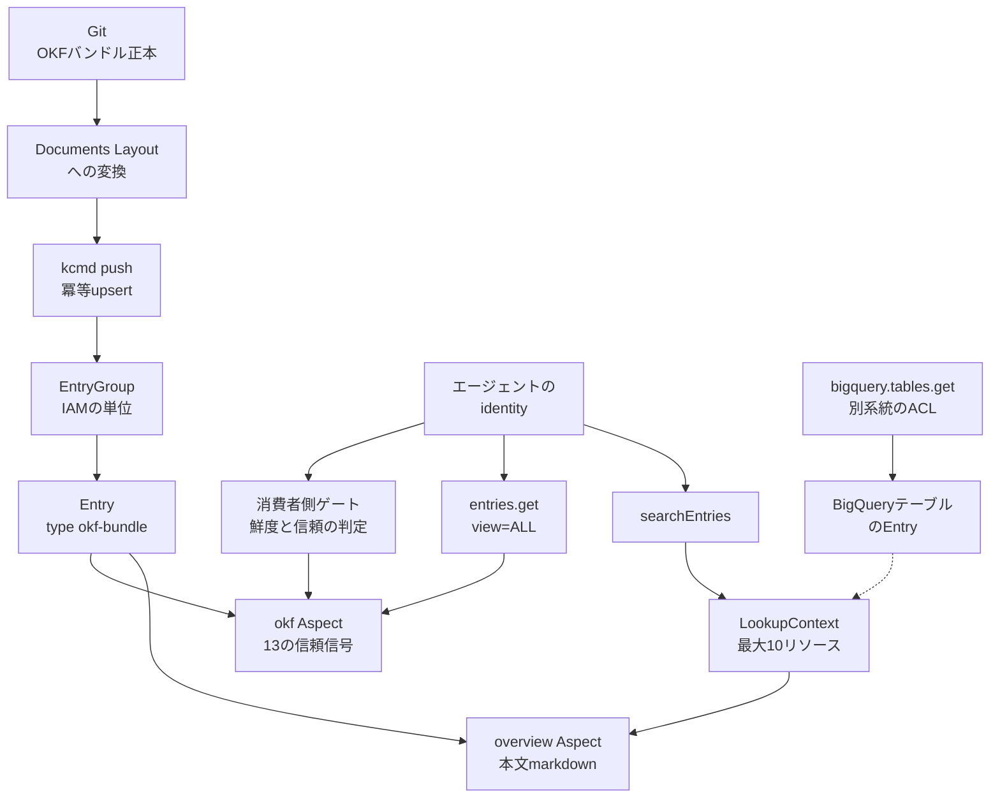

AIエージェントに「社内の概念定義」を渡す方法として、Markdown + YAML frontmatter で概念を配る Open Knowledge Format（OKF）が使われはじめています。2026-08-27 に Google Cloud が公開した記事は、その OKF バンドルを Knowledge Catalog（旧 Dataplex Universal Catalog）へ同期し、組織横断の検索と IAM の下に置く構成を示しました。

この記事では、その構成を採用するかどうかを判断するために必要な情報を整理します。具体的には次の 5 点です。

- git と Catalog がそれぞれ何を解き、何を解かないのか
- OKF v0.2 の信頼信号が Catalog 上でどう表現されるのか
- エージェントが信号を取りこぼさずに読むための取得経路
- IAM の粒度と、期待しがちだが提供されていない機能
- 削除が伝播しない問題と、CI に足すべき手当て

対象読者は、社内の概念・指標定義をエージェントへ供給する仕組みを設計する立場の方です。前提知識として Google Cloud の IAM とデータカタログの基本操作を想定します。

## OKF と Knowledge Catalog は何を分担するのか

OKF は概念 1 つを 1 ファイルとして表現するオープン仕様です。v0.2 で、来歴（`sources`）、検証（`verified`）、鮮度（`stale_after`）、ライフサイクル（`status`）、Attested Computation を frontmatter の語彙として定義しました。

一方で OKF SPEC は §1 の非ゴールに「storage, serving, or query infrastructure」を挙げています。つまり保存・配信・クエリはフォーマットの外側です。Knowledge Catalog はまさにその外側を埋める実装で、バンドルを Entry と Aspect に写して検索と IAM を提供します。

責任分界を層ごとに整理すると次のようになります。

| 層 | 解くこと | 解かないこと |
|---|---|---|
| OKF git リポジトリ | 人が読める正本、diff、来歴の語彙 | 検索、組織 IAM、実行時ゲート、署名 |
| kcmd / デモスクリプト | Documents Layout への変換、Catalog への upsert | git 削除の自動伝播 |
| Knowledge Catalog | 発見、EntryGroup 単位の ACL、データ隣接の検索 | `stale_after` の強制、概念単位 ACL、custom Aspect の LookupContext 出力 |
| 消費者エージェント | 期限切れ拒否、trust 判定、attestation 実行 | 仕様やサービスは代行しない |

ここから導かれる採用方針は明快です。**git を正本にし、Catalog は IAM 付きの配布面として使う**。コンソール上での編集を正本にすると、この分界が崩れます。

全体の流れは次の図のとおりです。



図の読み方は 2 点です。第一に、信頼信号は git の frontmatter から `okf` Aspect へ載ります。LookupContext だけを使うと本文（overview）しか返らず、機械可読な `verified` や `stale_after` は見えません。第二に、BigQuery の実データは Catalog のメタデータ IAM とは独立した ACL で守られます。

## 信頼信号は Catalog 上でどう表現されるのか

Catalog 側の写像は、EntryGroup 1 つにバンドル 1 つ、EntryType は `okf-bundle`、AspectType は 13 フィールドを持つ `okf` です。概念 1 つが Entry 1 つに対応し、本文は `overview` Aspect、構造化された信号は `okf` Aspect に入ります。

13 フィールドの内訳と、サーバ側で検索できるかどうかは次のとおりです。

| # | フィールド | 型 | サーバ検索 | 意味 |
|---|---|---|---|---|
| 1 | `okf_type` | string | 可 | OKF の `type` |
| 2 | `generated` | `{by, at}` | `generated.by` は可 | 最終的な意味変更の主体と時刻 |
| 3 | `sources` | array | 不可 | 来歴と credibility 信号 |
| 4 | `verified` | array | 不可 | 検証イベント。`human:` が最高ティア |
| 5 | `status` | string | 可 | `draft` / `stable` / `deprecated`。欠落時は stable 扱い |
| 6 | `stale_after` | datetime | 日付または範囲比較 | 絶対時刻。現在時刻が到達したら stale |
| 7 | `usage_window` | `{from, to}` | スカラーは可 | 利用回数の測定期間 |
| 8 | `runtime` | string | 可 | Attested Computation の実行系 |
| 9 | `parameters` | array | 不可 | 呼び出し側が変えてよい唯一の穴 |
| 10 | `computation` | string | 可 | 計算本体のファイルパス |
| 11 | `executor` | record | `executor.resource` は可 | 実行方法と receipt の形 |
| 12 | `attester` | record | `attester.resource` は可 | 決定論的な検証コード |
| 13 | `extra` | string | 可 | 未モデル化 frontmatter を JSON で lossless に保持 |

検索述語は次の形になります。

```text
aspect:acme-analytics.us-central1.okf.okf_type=Metric
```

実装するときの注意が 2 つあります。

- **Aspect キーはプロジェクト番号**です。公式記事の `acme-analytics` は可読化された表記であり、そのまま貼っても一致しません。
- **datetime は RFC3339 全文ではなく、裸の日付または範囲**で書きます。

`extra` フィールドが存在する理由は、OKF が未知のキーを拒否しない仕様だからです。Aspect のスキーマは有限なので、モデル化されていない残りを文字列に畳まないと、git と Catalog の間で round-trip が壊れます。

そして最も重要な制約は、**配列フィールド（`sources`、`verified`、`parameters`）はサーバ側で検索できない**ことです。「人間が検証済みの概念だけを検索で絞る」はサーバ側では実現できず、取得後にクライアント側でフィルタする実装になります。

## エージェントはどう取りに行くのか

公式が示す取得経路は 3 段構成です。段を飛ばすと信号が落ちます。

1. **`searchEntries`** — スコープはプロジェクトまたは組織。スカラーの Aspect 述語で候補を絞る。
2. **`LookupContext`** — 最大 10 リソースを `format=yaml` で取得し、本文（overview）を YAML ブロックで受け取る。`context_budget` で文字数上限を指定する。
3. **`entries.get`（`view=ALL`）** — 13 フィールドの構造化信号を取得する。配列はここからクライアント側で絞る。

実装時に踏みやすい落とし穴を挙げます。

- **LookupContext は custom Aspect を描画しません。** `okf` Aspect の中身は返らないため、鮮度や検証の判定を LookupContext だけで行う設計は成立しません。
- **LookupContext は権限不足のとき空レスポンスを返します。** 公式ドキュメントは 403 を返さないと明記してはいませんが、少なくとも空が返り得ます。エージェントは空を「概念が存在しない」と即断してはいけません。
- **リンク先の概念は自動で辿られません。** 必要な概念名は明示的に列挙します。
- **単一 location に限られます。** EntryGroup をデータと同じ location に置くと、テーブルと概念を 1 コールに載せられます。
- **Python ガイドの `options.budget` と、REST/RPC の `context_budget` は表記が異なります。** 実装では REST のキーを正とします。

MCP 経由で使う場合は、Knowledge Catalog の remote MCP と MCP Toolbox の `lookup-context` が公式経路です。OAuth スコープは `dataplex.readonly` と `dataplex.read-write` です。空レスポンスの挙動は LookupContext API 側の記述であり MCP のページには再掲されていませんが、同一 API を経由する以上は同じ挙動として扱うのが安全です。

## IAM はどの粒度で効くのか

まず、名前が紛らわしいロールの落とし穴があります。

| ロール | カタログ操作 |
|---|---|
| `roles/dataplex.viewer` / `editor` / `admin` | entries / entry groups に**届かない** |
| `roles/dataplex.catalogViewer` | 読み取り（`entries.get`、search、LookupContext） |
| `roles/dataplex.catalogEditor` | 書き込み（`entries.create` / `entries.patch`）。`setIamPolicy` は不可 |
| `roles/dataplex.catalogAdmin` / `entryGroupOwner` | IAM ポリシー設定を含むフル権限 |

`dataplex.viewer` を「カタログが読めるロール」と誤解すると、権限付与が空振りします。読み取りエージェントには `catalogViewer`、CI のサービスアカウントには `catalogEditor` を割り当てます。

そして設計上いちばん効いてくるのが粒度です。**IAM の管理単位は EntryGroup であり、個別 Entry へのポリシー設定はサポートされていません。** 公式の permissions-mapping は次のように明示しています。

> Set permission on a specific entry instead of an entry group … Not supported. IAM policies are created only for entry groups.

つまり「概念ごとに閲覧権限を分ける」は製品の既定機能ではありません。マルチチーム構成では、公式記事のとおり**バンドルを所有するチームごとに EntryGroup を 1 つ**切り、その粒度で近似します。概念単位 ACL が要件として固いなら、EntryGroup 分割で表現できるかを先に検証してください。

もう 1 つ、Catalog のメタデータ IAM と BigQuery のデータ IAM は別系統です。同じ LookupContext のレスポンスに概念とテーブルが並んでも、それぞれの既存 ACL が独立に効きます。OKF のカスタム Entry はソースが Catalog 自身なので `dataplex.entries.get` で読めます。BigQuery のようなシステム Entry で `bigquery.tables.get` が要求されるのは、公式 permissions-mapping では `lookupEntry` についての記述であり、LookupContext の権限表には同じパーミッションが載っていません。テーブルを混ぜる構成では、ソース側の ACL が効き得る前提で設計するのが安全です。

なお、製品名は Dataplex Universal Catalog から Knowledge Catalog へ改称されましたが、API・CLI・IAM ロールの識別子は `dataplex.*` のままです。

## git で削除しても Catalog に残る

運用リスクとして最大のものは削除の非伝播です。公式が示すライフサイクルは次のとおりです。

1. `kcmd push` は冪等な upsert で、再実行しても重複しない。
2. push のたびに**すべての Entry を書き直す**。
3. 概念の削除は明示的な `kcmd delete`、または `cleanup.ts` による EntryGroup ごとの削除で行う。
4. `cleanup.ts` は共有の `okf` AspectType と `okf-bundle` EntryType を残す。
5. 本番ではバンドルリポジトリの毎コミットで CI が `kcmd push` を実行する。

ここで押さえるべきは、**git からファイルを消して push しても Catalog の Entry は残る**という点です。撤回したはずの定義や誤った概念が、検索とエージェントの取得経路に残り続けます。

kcmd の一般 README には前回 pull 以降の差分 push が書かれていますが、これは Documents Layout 一般の話です。`--force-remove` フラグは semantic-model スコープ専用であり、OKF デモ経路で公式に推奨されているフラグではありません。したがって削除は次のいずれかを CI に明示的に組み込みます。

- git の差分から消えた concept ID を組み立てて `kcmd delete` を呼ぶ
- EntryGroup ごと削除して push し直す

デモの既定設定のままでは、削除は閉じません。

変換レイヤについても補足します。kcmd が期待するのは Documents Layout（`catalog/` ディレクトリと `catalog.yaml`）です。生の OKF frontmatter に書いた信頼信号は、デモが `okf` Aspect へ移して初めて機械可読になります。

規模感の参考として、公式記事の Acme Retail 例では葉の概念が 9 個、ディレクトリの index を含めて 17 Entries、さらに Dataplex が `<eg>_entry` を追加するため `entries list` は 18 行になります。

## クォータ・課金・SLA

2026-08-11 時点のクォータページと価格ページから、判断に効く数値を抜き出します。

| 項目 | 値 |
|---|---|
| entries / aspects の読み取り | 6000 / プロジェクト / リージョン / 分 |
| entries / aspects の書き込み | 1500 / プロジェクト / リージョン / 分 |
| search | 900 / プロジェクト / ユーザー / 分、1200 / プロジェクト / 分、2400 / 組織 / 分。組織の日次上限 345600 |
| LookupContext のリソース数 | 最大 10 |
| aspect の JSON サイズ | 120 KB（schema / profile を除く） |
| entry の総サイズ | 5 MB |
| search の結果件数 | キーワードのみ 500、その他 100 |
| SLA | Monthly Uptime 99.5% 以上。500 Internal が Error 扱い、クォータ起因は除外。リトライは 1 秒から 32 秒のバックオフ |
| Catalog API と search | 無償 |
| メタデータストレージ | 自動収集の技術メタデータは無償。追加ストレージは $0.002739726 / GiB-hour（およそ $2 / GiB-月） |
| Data insights | 課金開始は 2026-10-27。Catalog 本体とは別 |

LookupContext 専用の RPM 行はクォータページに存在しません。entries の読み取り枠に含まれるかどうかも明記がないため、大量呼び出しを前提とする設計では実測が必要です。

## git のみで足りるか、Catalog を足すか

3 つの選択肢を基準ごとに比較します。

| 基準 | git のみの OKF | OKF + Knowledge Catalog | 独自 RAG |
|---|---|---|---|
| 人間が読める正本 | 強い | 同じ（git が正本） | 弱い |
| 組織横断の検索 | クローン先を知る必要がある | searchEntries とデータ隣接検索 | インデックス実装次第 |
| IAM | リポジトリの ACL | EntryGroup + 既存データ ACL | 自前実装 |
| 期限切れゲート | 消費者側 | 消費者側（Catalog は保持のみ） | 自前実装 |
| 削除 | git が真実 | Catalog に残り得る | インデックス実装次第 |
| ベンダー拘束 | 低い | Catalog 経路は Google Cloud | 実装次第 |

判断の目安は次のとおりです。

**git のみで足りる場合**

- バンドル数が少なく、クローン先が固定されている
- 組織 IAM とデータカタログへの隣接が不要
- 消費者エージェントがファイルを直接読める

**Catalog 同期を足すべき場合**

- 複数チームが既に同じ Catalog の検索を使っている
- 概念を BigQuery テーブルと並べて発見したい
- エージェントの identity に EntryGroup 単位の IAM を付けたい

**どちらでも要件を満たせない場合**

- 暗号署名が必要 — SPEC に署名の規定はなく、コミュニティ提案の signed-okf（[knowledge-catalog#140](https://github.com/GoogleCloudPlatform/knowledge-catalog/issues/140)）は 2026-08-27 時点で OPEN
- 概念単位 ACL が必要 — 製品は EntryGroup のみ。EntryGroup 分割で近似できるかを検証する
- 参照元 HTTP ソースの生存確認が必要 — [knowledge-catalog#211](https://github.com/GoogleCloudPlatform/knowledge-catalog/issues/211) が OPEN。`stale_after` では代替できない

## 「信頼付きコンテキスト契約」はどこまで閉じるのか

この構成を「エージェントに渡すコンテキストの信頼契約」として説明したくなりますが、強制力がどこにあるかは正確に把握しておく必要があります。

支持できる点は次のとおりです。

- OKF v0.2 が、来歴・信頼・鮮度・ライフサイクル・attestation の 5 つを frontmatter の語彙で答えられるようにした
- Catalog の写像が 13 フィールドを Aspect にし、スカラーはサーバ側で検索できる
- 既存の Catalog クライアントと同じ LookupContext / searchEntries で届く
- catalogViewer と catalogEditor の役割分担が公式ドキュメントと公式記事で一致している
- SLA 99.5%、Catalog API 無償という運用材料がある

一方で、契約としての強制力には次の穴があります。

- **trust tier は助言であり、アクセス制御ではありません。** SPEC は未検証の概念を拒否することを求めていません。
- **`human:` は単なる文字列プレフィックスです。** 参照実装は `startswith("human:")` で判定しており、鍵による検証は行いません。
- **Catalog は `stale_after` で配信を止めません。** 鮮度ゲートは SPEC が定める消費者側の義務です。
- **参照実装の鮮度判定は日付のみの値を無視します。** `2026-12-31` のような書き方だと期限切れ判定が動きません。オフセット付きの RFC3339 で書く必要があります。
- **LookupContext は custom Aspect を返しません。** つまり「標準のコンテキスト API」側に、信頼信号を落とす経路が存在します。
- **push は削除しないため、git より古い主張が Catalog に残り得ます。**

結論として、Catalog は**発見と EntryGroup 単位の IAM** には強く、**検証の強制・鮮度の強制・改ざん検知**には弱い、と確信度を置き分けるのが妥当です。契約として運用するなら、エージェント実装と CI の削除ステップまでを仕様の一部に含める必要があります。

なお、OKF・Knowledge Catalog・kcmd に紐づく NVD / MITRE / ベンダーの脆弱性 advisory は、2026-08-27 時点では確認できませんでした。

## 導入するときの実践手順

採用を決めた場合、次の順で小さく検証すると失敗を早く見つけられます。

1. **1 ドメインの小さいバンドルを git で作る。** `stale_after` はオフセット付き RFC3339 で書き、日付のみの表記を避ける。
2. **デモの `setup.ts` / `push.ts` で EntryGroup を切る。** `catalogViewer` だけを付けたテスト identity を用意し、search → LookupContext → `entries.get view=ALL` の 3 段が通ることを確認する。
3. **削除の PR を 1 本回す。** git から概念を消して push し、Catalog に残骸が残ることを実際に観測してから、CI に delete ステップを足す。
4. **エージェント側に 2 つの前提を実装する。** 「空の LookupContext は不存在を意味しない」と「配列フィールドのフィルタはクライアント側」。

あわせて、設計上の固定方針として次を置きます。

- 正本は git。Catalog は投影であり、コンソール編集を正本にしない。
- IAM は EntryGroup 粒度で設計し、`dataplex.viewer` をカタログ権限と混同しない。データ IAM と Catalog IAM は別々に付与する。
- Attested Computation は、実行と attester を別ジョブに分ける。Catalog は計算を実行しない。
- 署名が必要なら、SPEC の対応を待たずに別レイヤで用意する。

### この判断が覆る条件

次のいずれかが実現したら、上記の制約に基づく設計判断は見直す価値があります。

- LookupContext が custom Aspect を返すようになり、かつサーバ側で `stale_after` が強制される
- 個別 Entry への IAM がサポートされる
- git の削除が push で伝播する

いずれも 2026-08-27 時点の公式ドキュメントには存在しません。

## 残る不確実性

判断をブロックはしないものの、実装前に自分の環境で確かめたい項目です。

- LookupContext 専用クォータの有無。entries の読み取り枠に含まれるかは未記載。
- EntryGroup あたりの entry 数、組織あたりの EntryGroup 数の上限。Data Catalog 時代の数値をそのまま転記しない。
- Python サンプルの `budget` と REST の `context_budget` の実装上の扱いの差。
- kcmd の `--force-remove` を OKF デモ経路で公式に推奨するかどうか。
- 毎コミット全件 upsert を本番 CI で回したときのコスト実測。クォータ表はあるが金額はケース依存。

## まとめ

- OKF は概念の**語彙**を、Knowledge Catalog は**発見と配布**を担う。正本は git に置き、Catalog は IAM 付きの投影として扱う。
- 信頼信号は `okf` Aspect の 13 フィールドに載るが、`sources` / `verified` / `parameters` の配列はサーバ側で検索できない。
- エージェントは search → LookupContext → `entries.get view=ALL` の 3 段を必須にする。LookupContext だけでは信頼信号が返らない。
- IAM の単位は EntryGroup で、個別 Entry へのポリシー設定はサポートされていない。チームごとに EntryGroup を切って近似する。
- `kcmd push` は削除を伝播しない。CI に明示的な delete ステップを足さないと、撤回した定義が残り続ける。
- 鮮度・検証・改ざん検知の強制力は消費者エージェント側にある。`stale_after` はオフセット付き RFC3339 で書く。

この記事が少しでも参考になった、あるいは改善点などがあれば、ぜひリアクションやコメント、SNSでのシェアをいただけると励みになります！

## 参考リンク

- [Using OKF with Knowledge Catalog](https://cloud.google.com/blog/products/data-analytics/scale-okf-bundles-across-an-organization-with-knowledge-catalog/)
- [OKF v0.2 adds trust signals](https://cloud.google.com/blog/products/data-analytics/okf-v0-2-adds-trust-signals)
- [How the Open Knowledge Format can improve data sharing](https://cloud.google.com/blog/products/data-analytics/how-the-open-knowledge-format-can-improve-data-sharing)
- [OKF v0.2 SPEC.md](https://github.com/GoogleCloudPlatform/open-knowledge-format/blob/main/SPEC.md)
- [okf-aspect.json](https://github.com/GoogleCloudPlatform/knowledge-catalog/blob/main/toolbox/mdcode/demo/okf/okf-aspect.json)
- [Knowledge Catalog overview](https://docs.cloud.google.com/dataplex/docs/catalog-overview)
- [IAM roles](https://docs.cloud.google.com/dataplex/docs/iam-roles)
- [IAM permissions](https://docs.cloud.google.com/dataplex/docs/iam-permissions)
- [Permissions mapping](https://docs.cloud.google.com/dataplex/docs/permissions-mapping)
- [Retrieve data context](https://docs.cloud.google.com/dataplex/docs/retrieve-data-context)
- [lookupContext REST reference](https://docs.cloud.google.com/dataplex/docs/reference/rest/v1/projects.locations/lookupContext)
- [Quotas and limits](https://docs.cloud.google.com/dataplex/docs/quotas)
- [Dataplex SLA](https://cloud.google.com/dataplex/sla)
- [Dataplex pricing](https://cloud.google.com/dataplex/pricing)
- [knowledge-catalog issue #140](https://github.com/GoogleCloudPlatform/knowledge-catalog/issues/140)
- [knowledge-catalog issue #211](https://github.com/GoogleCloudPlatform/knowledge-catalog/issues/211)
- [OKF のご紹介（日本語）](https://cloud.google.com/blog/ja/products/data-analytics/how-the-open-knowledge-format-can-improve-data-sharing/)
