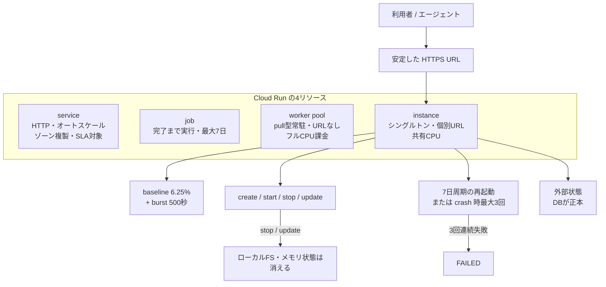

2026 年 8 月 25 日、Google Cloud が [Cloud Run instances](https://cloud.google.com/blog/products/serverless/introducing-cloud-run-instances) を Preview で公開しました。オートスケールする service とは別の、**コンテナを 1 本だけ動かすためのトップレベルリソース**です。

想定用途として公式が挙げているのは、個人向けの長寿命 AI エージェントと VPS 相当の常駐ワークロードです。「エージェントを 24 時間動かしておく場所」を VM で用意していた人にとっては、直接の代替候補になります。

この記事では、常駐エージェントの置き場として instances を採るかどうかを判断するために、**リソースモデル上の位置づけ・コスト差・4 つの制約・向き不向き**を整理します。結論を先に書くと、**低コストな実験用シングルトンとしては第一候補にしてよく、可用性契約や常時フル CPU が要る用途では第一候補にしない**、という線引きになります。


*この記事の全体像。以下、順に解説します。*

## Cloud Run instances とは何か

instances の性格は、次の 4 点に集約できます。

- **シングルトン**: オートスケールしない。project + region あたり最大 100 個(増加申請可)
- **個別 URL**: `https://INSTANCE_NAME-PROJECT_NUMBER.REGION.run.app` を持つ。更新・再起動をまたいで維持される(既定 URL の無効化も可能)
- **手動ライフサイクル**: create / deploy / start / stop / update / delete を自分で叩く。止めれば課金も止まる
- **共有 CPU 課金**: 構成 vCPU に対して持続 6.25% + バースト残高。既定は 2 vCPU / 2 GiB

デプロイできるのはコンテナイメージのみです。ソースデプロイ、functions、Git 連続デプロイには対応していません。運用ドキュメント上の CLI は `gcloud beta`、YAML の launch-stage は `BETA` です。

公式が明言している設計思想が重要です。**高可用性よりも、コストとシングルトンとしての寿命を優先している**と書かれています。つまり「自動再起動があるから可用性が高い」という読み方は、公式の意図から外れます。

## Cloud Run の 4 リソースの中での位置づけ

Cloud Run は現在、性格の異なる 4 つのリソースを持ちます。instances はその 4 番目です。



責任境界を層で切ると、どこまでが Google 側で、どこからがアプリ側の設計責任かがはっきりします。

| 層 | 誰が持つか | 何が失われるか |
|---|---|---|
| ホスト OS / ネットワーク / TLS | Cloud Run | 利用者は管理しない |
| コンテナプロセス | 利用者 + restartPolicy | 7 日再起動・crash・stop で切れる |
| ローカル FS / メモリ | コンテナの寿命 | stop / update / FAILED で消える |
| セッション・チェックポイント | アプリが外部 DB へ書く | ネットワーク FS 上の SQLite は公式制限と衝突しやすい |

エージェントの「連続性」を担保するのはアプリ側です。プロセスが再起動しても会話やタスクの文脈が続くかどうかは、Cloud Run の restartPolicy ではなく、**起動時に外部ストアから復元できるかどうか**で決まります。

## コストで見た差

instances が注目される最大の理由はコストです。us-central1、30 日 = 2,592,000 秒、無料枠を無視して同一構成に換算すると、次の桁の差が出ます。

| 基準 | Cloud Run instance | Cloud Run service (min=1, instance-based) | Cloud Run worker pool |
|---|---|---|---|
| 1 vCPU + 1 GiB × 30 日 | **$5.70** | **$51.84** | **$32.34** |
| CPU | 共有。持続 6.25% + 500 秒バースト | 構成 vCPU をライフタイムで確保 | 構成 vCPU をライフタイムで確保 |
| スケール | なし | 自動 / 手動 | 手動 |
| URL | インスタンスごとに安定 | サービス URL(ロードバランサ経由) | なし |
| HA | 公式が非優先と明記 | ゾーン複製あり。SLA 99.95% | SLA の Covered Service 外 |
| 提供段階 | Preview (Pre-GA) | GA | GA |

1 桁近い差は、**CPU をライフタイム分確保しているか、共有しているか**の違いから来ます。instances は「CPU をほとんど使わない待ち時間」に最適化された価格モデルです。LLM API のレスポンス待ちが支配的なエージェントは、まさにこの形をしています。

なお公式ブログの $5.70 は 1 vCPU + 1 GiB の例です。**既定構成は 2 vCPU / 2 GiB** なので、何も指定せずに作ると 30 日で約 $11.40 になります。見積もりはこの 2 本を持っておくのが安全です。

## 選ぶ前に押さえる 4 つの制約

コストの魅力に対して、設計へ跳ね返る制約が 4 つあります。

### 1. 持続 CPU は構成 vCPU の 6.25%

構成した vCPU に対する baseline が 6.25%、バースト残高の上限は 500 秒です。残高を使い切るとスロットリングされます。

つまり **CPU を連続して使うワークロードは想定外**です。ローカル推論、長時間のコード実行、重いツールループを回すなら、フル CPU 課金の worker pool か Compute Engine を選ぶべきです。同時実行数は 80 固定で、この点の調整余地もありません。

### 2. 7 日で必ず再起動される

restartPolicy の既定は `on-failure` です。`always` または `on-failure` の場合、およそ 7 日周期で自動再起動が入ります。この 7 日は延長できません。

失敗時の再起動は連続 3 回までで、それを超えると状態が `FAILED` になります。マルチコンテナ構成で `always` を指定していても、exit 0 で終了すれば停止します。

設計上は、**7 日再起動・update・stop・3 回失敗後の FAILED をすべて通常イベントとして扱う**必要があります。SIGTERM を受けた猶予時間内に状態を flush し、起動時に復元する経路を最初から作っておきます。

### 3. ローカル FS は揮発し、マウント先にはロックがない

update と stop で、ローカルファイルシステムと永続化していない状態は消えます。ではボリュームをマウントすればよいかというと、ここが最大の落とし穴です。

- **Cloud Storage FUSE**: POSIX 準拠ではない。ファイルロックがなく、last write wins
- **NFS / Filestore**: マウント自体は可能だが、instances では**ロック非対応(no-lock)固定**

SQLite の公式 FAQ は、[ロックが正しく機能しないネットワークファイルシステム上での利用](https://sqlite.org/faq.html#q5)を破損要因として挙げています。したがって **SQLite や JSON のセッションファイルを FUSE / NFS に置く構成は、公式の制限と正面から衝突します**。

注意が必要なのは、Google 公式の [OpenClaw を Cloud Run instances へデプロイする Codelab](https://codelabs.developers.google.com/codelabs/cloud-run/deploy-openclaw-cloud-run-instances) が、まさにホームディレクトリを GCS FUSE にマウントする構成(4 vCPU / 4 GiB)である点です。試作としては動きますが、セッションの正本置き場としては脆弱です。OpenClaw 側はセッションとトランスクリプトを SQLite 正本へ移行済み([openclaw/openclaw#98236](https://github.com/openclaw/openclaw/pull/98236))で、過去にはセッションファイルの置き換えで履歴を全損する事象も報告されています([openclaw/openclaw#68229](https://github.com/openclaw/openclaw/issues/68229))。

**状態の正本は Cloud SQL や Firestore などの DB に置く**。これが instances を使う場合の実質的な必須要件です。

### 4. Preview であり、SLA の対象外

instances は Pre-GA の Preview で、as-is 提供・限定サポートです。[Cloud Run の SLA](https://cloud.google.com/run/sla) が対象とするのは **service のみ**で、instances は Covered Service に含まれません。

API も安定していません。運用ドキュメントは `gcloud beta` を使いますが `gcloud alpha` のリファレンスも残っており、YAML の launch-stage は `BETA` です。GA までに破壊的変更が入る前提で運用スクリプトを書く必要があります。

## 向く場合と向かない場合

ここまでの制約を、そのまま判断軸に落とします。

**instances が勝つ条件**

- 同時に動くプロセスが 1 本でよい
- LLM API の待ち時間が支配的で、CPU がすぐアイドルに戻る
- 状態を DB に置いてある、または置ける
- 7 日再起動と stop を前提に、起動時 restore が実装できる
- 月数ドルの実験コストが優先で、SLO を契約する必要がない

**instances が負ける条件**

- ローカル推論や重いツールループで CPU を連続使用する
- セッションを SQLite / JSON ファイルのまま持ちたい
- 可用性 SLO やゾーン障害耐性が要件になっている
- ソースからの継続デプロイのワークフローが必要

可用性が要るなら Cloud Run service(必要なら min instances)、常時フル CPU なら worker pool か Compute Engine、という振り分けになります。instances は「安く 1 本のアドレス可能なコンテナを常駐させる」という一点に特化した選択肢です。

## 実践: 最初に確認すること

採用検討を始めるなら、順序としてはこうなります。

1. **hello コンテナを 1 本作って挙動を確かめる**。特にメモリ設定の受理可否(後述のドキュメント矛盾の決着)

   ```bash
   gcloud beta run instances create hello-agent \
     --image=us-docker.pkg.dev/cloudrun/container/hello \
     --region=us-central1 \
     --memory=1Gi
   ```

2. **状態の外出しを見積もる**。SQLite ファイル前提の実装なら、外部 DB へ出す改修工数がそのまま採用コストになります
3. **stop / start と 7 日再起動からの復元を手で一度試す**。ここが通らなければ、コストが安くても運用に載りません
4. **本番候補なら service との並列見積もりを作る**。$5.70 と $51.84 + SLA を並べて、可用性にいくら払うかを明示的に決めます

設計チェックリストとしては、次の 4 つを満たしているかどうかで判断できます。

- セッションの正本が DB にある
- SIGTERM で状態を flush している
- 起動時に外部ストアから復元する経路がある
- CPU 使用が断続的で、バースト 500 秒に収まる

## ドキュメント間で食い違っている点

Preview 直後ということもあり、公式ドキュメント間で数値が一致していない箇所があります。採用判断に効くものを挙げます。

- **メモリ下限**: [メモリ設定のページ](https://docs.cloud.google.com/run/docs/configuring/instances/memory-limits)は「最小 2 GiB」と記載しています。一方でブログの例は 1 GiB、CPU 設定の表では 128 MiB が下限として現れます。$5.70 の見積もりはこの矛盾の影響を受けるため、上で挙げた `--memory=1Gi` の受理確認が最初のアクションになります
- **再起動周期の表現**: overview は「1〜2 週のインフラ更新」と書きますが、再起動ポリシーのページの数値は 7 日です
- **ヘルスチェックの記述**: healthchecks のページに「autoscaling starts up a new container」という、オートスケールしない instances の仕様とは噛み合わない記述が残っています
- **GPU**: instances 専用の GPU ガイドは 404 で、`gcloud beta run instances create` の SYNOPSIS にも `--gpu` はありません
- **SSH**: SYNOPSIS には `--[no-]ssh` が存在しますが、ブログ上は Coming soon かつ private 申し込みです。フラグの露出とサポート状態は別物として扱う必要があります

バースト残高の回復速度についても、公式の計算式は明示されていません。500 / 0.0625 = 8,000 秒という解釈は成り立ちますが、公式の記述ではないため、実測で確認する領域です。

また Preview 公開直後のため、コミュニティからの実害報告はほとんどありません。**報告の不在は安定の証拠ではない**点は、判断材料として明示しておくべきです。

## まとめ

Cloud Run instances は、「常駐コンテナを 1 本、安いまま、安定した URL 付きで持つ」ための専用リソースです。

- **位置づけ**: service / job / worker pool と並ぶ 4 つ目のリソース。オートスケールを捨てて、シングルトンとコストを取った
- **コスト**: 同一構成換算で service の 1/9 程度。ただし共有 CPU(持続 6.25% + バースト 500 秒)という前提付き
- **制約**: 7 日で必ず再起動、ローカル FS は揮発、マウント先の FUSE / NFS はロックなし、Preview で SLA 対象外
- **設計要件**: 状態の正本は DB に置き、再起動を通常イベントとして復元経路を持つ
- **判断**: 低コストな実験用シングルトンなら第一候補。可用性 SLO・常時フル CPU・ローカル状態マシンなら第一候補にしない

「自動再起動があるから高可用」ではなく、**プロセスの生存とエージェントの連続性は別の問題**である、という切り分けがこのリソースを使う上での中心にあります。連続性を担保するのは外部ストアと復元経路であり、そこを設計しないまま VM から移すと、安くなった分だけ壊れやすくなります。

この記事が少しでも参考になった、あるいは改善点などがあれば、ぜひリアクションやコメント、SNSでのシェアをいただけると励みになります！

## 参考リンク

公式ドキュメント:

- [Introducing Cloud Run instances (Google Cloud Blog)](https://cloud.google.com/blog/products/serverless/introducing-cloud-run-instances)
- [Cloud Run release notes](https://docs.cloud.google.com/run/docs/release-notes)
- [What is Cloud Run](https://docs.cloud.google.com/run/docs/overview/what-is-cloud-run)
- [Cloud Run resource model](https://docs.cloud.google.com/run/docs/resource-model)
- [Create and manage instances](https://docs.cloud.google.com/run/docs/instances/create-and-manage-instances)
- [Instance lifecycle](https://docs.cloud.google.com/run/docs/instances/instance-lifecycle)
- [Restart policy](https://docs.cloud.google.com/run/docs/configuring/instances/restart-policy)
- [CPU configuration for instances](https://docs.cloud.google.com/run/docs/configuring/instances/cpu)
- [Memory limits for instances](https://docs.cloud.google.com/run/docs/configuring/instances/memory-limits)
- [Cloud Storage volume mounts](https://docs.cloud.google.com/run/docs/configuring/instances/cloud-storage-volume-mounts)
- [NFS volume mounts](https://docs.cloud.google.com/run/docs/configuring/instances/nfs-volume-mounts)
- [Health checks](https://docs.cloud.google.com/run/docs/configuring/instances/healthchecks)
- [Cloud Run quotas and limits](https://docs.cloud.google.com/run/quotas)
- [Cloud Run pricing](https://cloud.google.com/run/pricing)
- [Cloud Run SLA](https://cloud.google.com/run/sla)
- [Codelab: Deploy OpenClaw on Cloud Run instances](https://codelabs.developers.google.com/codelabs/cloud-run/deploy-openclaw-cloud-run-instances)

関連する GitHub の議論:

- [openclaw/openclaw#13440](https://github.com/openclaw/openclaw/issues/13440) — プラガブルな session store の要求
- [openclaw/openclaw#68229](https://github.com/openclaw/openclaw/issues/68229) — session ファイル置換で履歴が全損した報告
- [openclaw/openclaw#98236](https://github.com/openclaw/openclaw/pull/98236) — sessions / transcripts の SQLite 正本化

その他:

- [SQLite FAQ: How do I use SQLite in a multi-threaded application / network filesystems](https://sqlite.org/faq.html#q5)
