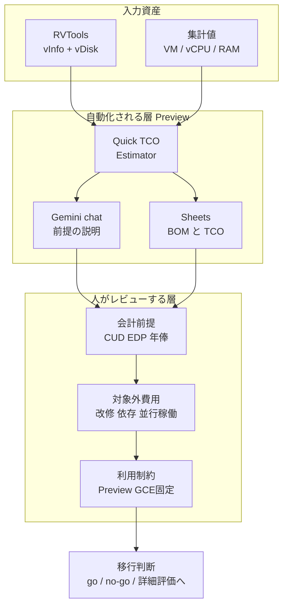
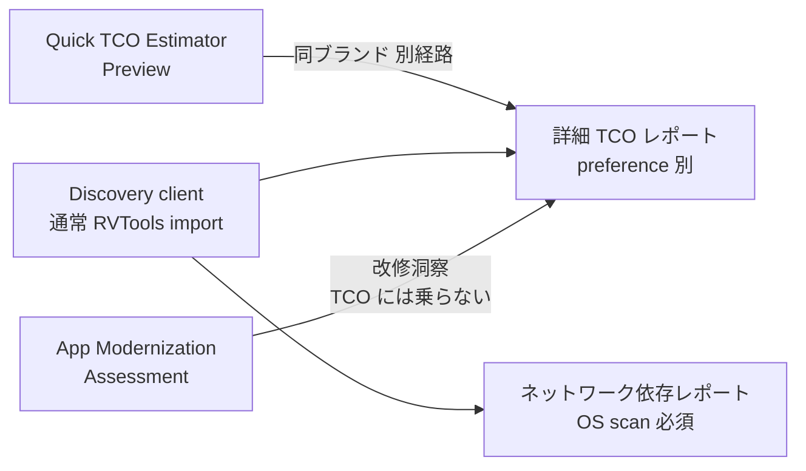

Google Cloud の Migration Center に、AI を使った初期評価機能が追加されました。中核は Preview の **Quick TCO Estimator** です。RVTools のエクスポートか手入力の集計値を渡すと、Compute Engine 前提の構成見積 (BOM) と 5 年 TCO、そして「なぜこの数字なのか」を説明する Gemini チャットが短時間で返ってきます。出力は Google Sheets へ書き出せます。

この記事では、公式ドキュメントと利用規約を突き合わせて、次の 3 点を整理します。

- Quick TCO Estimator が**何を計算し、何を計算しないのか**
- Preview 段階でどこまで使ってよいのか (リージョン・契約・データ種別)
- 自動生成された数字を**移行判断に使う前に人が何をレビューすべきか**

対象読者は、VMware 基盤からのクラウド移行を検討していて、初期の go/no-go 材料を作る立場の方です。

*この記事の全体像。以下、順に解説します。*

## Quick TCO Estimatorは何をするツールか

一言でいうと、**移行初期の「方向性インフラ TCO」を量産する装置**です。判断エンジンではありません。

| 項目 | 内容 |
|---|---|
| ステータス | 2026-06-29 に Preview 開始 (調査時点で GA 記載なし) |
| 対象 | VM とインフラの Compute Engine 移行見積 |
| 入力 | 手入力の集計値 (VM 数 / vCPU / RAM GB / Storage TiB)、または RVTools の `vInfo` + `vDisk` |
| 出力 | GCE の Compute / Storage / Network / Operation / OS ライセンス費用、オンプレ比較の 5 年 TCO、savings %、right-sizing 比較 |
| 説明 UI | Gemini チャットが計算根拠と最適化候補を説明 |
| 成果物 | Google Sheets (Workspace アカウントが必要) |
| 料金 | 評価機能自体は追加料金なし |
| 必要ロール | `roles/migrationcenter.admin`、課金有効化済みプロジェクト |

重要なのは、**「AI が移行計画を作る」のではなく「AI が前提を言語化した見積表を作る」**という位置づけである点です。公式ドキュメントは対象を GCE の見積に限定しており、データベース固有の入力は受け付けません。

なお、発表ブログは「minutes rather than months」「precise」「defensible」「automated service mapping」といった強い語を使いますが、ドキュメント側にあるのは automated TCO estimates とチャット、Sheets 出力です。期間ベンチマークの数値はブログにもドキュメントにも記載がありません。**ブログの語感でスコープを見積もると、後で足りない項目に気づくことになります。**

## 出力に入るものと入らないもの

見積を読み違えないために、ここが一番大事です。

### 入るもの

- GCE の構成と単価
- ストレージ (Persistent Disk / Hyperdisk / Hyperdisk Storage Pool)
- ネットワーク費用 (compute + storage に対するパーセント仮定)
- Operation 費用 (オンプレ側の DC 単価、管理者比率、年俸から導出)
- OS / SQL Server ライセンス (vCPU を手入力)
- CUD、EDP 割引率、パートナー資金、spend milestone credits
- VM あたりの移行費用 (1 台あたりの一時金スカラー)
- サポートレベル

### 入らない、または別経路になるもの

| 項目 | 理由 / 代替 |
|---|---|
| アプリ改修・リファクタ工数 | 入力にコードが無い。App Modernization Assessment は別機能で、TCO レポートには載らない |
| 依存関係にもとづく移行ウェーブ | ネットワーク依存レポートが別途必要。しかも discovery client の OS scan が必須で、vSphere scan では取得できない |
| 実測 egress | パーセント仮定で置かれる |
| GCVE / sole-tenant / DB エンジン別の TCO | Quick TCO も詳細コンソール TCO も GCE VM 前提 |
| デュアルラン月数、既存資産の write-off、landing zone 構築費 | 項目そのものが無い |

つまり **「移行にかかる金額」ではなく「移行後のインフラを GCE に置いたときの金額」**が出ます。改修とウェーブと並行稼働という、実プロジェクトで最も揺れる 3 つが構造的に欠けています。

この分離は Google に限った話ではありません。AWS の Migration Evaluator も公式に directional な位置づけで、移行コストのモデリングを対象外と明記し、リファクタ見積は detailed business case へ先送りします。**同じ層のツールだと理解して使うのが正解です。**

## 責任境界を4層で見る

自動化される範囲と、人が持ち続ける範囲を図にすると次のようになります。

自動生成されるのは上 2 層まで、下 2 層は人の責任という切り分けです。**この境界を曖昧にしたまま savings % を経営に出すのが、一番危険な使い方です。**

## VMware棚卸しの粒度が見積もりの前提を決める

Quick TCO が RVTools から自動分類するのは `vInfo` と `vDisk` の 2 タブです (XLSX 本文では `vDisks` 表記が混在します)。必要になるヘッダは VM UUID、OS (構成ファイル / VMware Tools)、Powerstate、CPUs、Memory、Disks、Capacity MiB、Disk path、Disk mode などです。ファイルは 1 source あたり 10GB、タブの行数は 1,048,576 行が上限です。

一方、**通常の RVTools インポートは読むタブが違います。** `tabvInfo` / `tabvCPU` / `tabvDisk` / `tabvPartition` / `tabvNetwork` / `tabvHost` を使い、RVTools 4.3.1 以降が要件で、`--DBColumnNames` オプションには対応しません。

ここから言えることは 2 つです。

1. **同じ RVTools エクスポートでも、経路によって読まれる情報量が違う。** Quick TCO 経路は構成中心の棚卸しであり、性能情報やアプリ依存の棚卸しではありません。
2. **スナップショット、vHealth、ライセンス、分散スイッチは制限リストに載っていない。** 見積の入力として扱われていないと考えるほうが安全です。

手動テーブルインポートのトラブルシュートには「UUID が欠落した行と物理マシンの行はパースしない」という記載がありますが、これは `import-data-tables` 向けのページです。Quick TCO の RVTools パーサが同じ挙動かどうかは公式には明示されていません。**実務では、RVTools 原本の行数と Sheets 出力の行数を突き合わせて確認するのが確実です。**

## Preview段階の制約を先に確認する

Preview であることの影響は、機能の粗さより契約面に出ます。

| 項目 | 内容 |
|---|---|
| 契約条件 | Pre-GA Offerings Terms が適用。as-is 提供、SLA なし、indemnity なし、原則テクニカルサポート対象外 |
| データ保護 | Cloud Data Processing Addendum は非適用。**個人データ・規制対象データを投入しない** |
| 責任上限 | Google 側の Pre-GA 責任上限は、契約上の責任上限と 25,000 USD のいずれか低い方 |
| Estimator 提供リージョン | us-central1 / europe-west1 / europe-west2 / europe-west4 の 4 つ |
| Migration Center の保管リージョン | APAC は大阪・ムンバイ・デリー・シンガポール。**東京 asia-northeast1 は locations 表に無い** |
| 資産上限 | 100,000 (システム上限)。到達後は手動インポートが停止 |
| リージョン変更 | 有効化したリージョンは後から変更できない |

Estimator の 4 リージョンは「ツールが動く場所」であり、見積対象となる GCE リージョンの制限ではありません。ただし **有効化リージョンが大阪のときに米欧 4 リージョンの Quick TCO を呼べるかは、公式に明記がありません。** 日本のデータレジデンシー要件が厳しい案件では、ここが先にブロッカーになります。

判断としては次の線引きが実務的です。

- **ブロックしない**: 非規制データを使った初期 go/no-go の材料作り
- **ブロックする**: 投資委員会への正式提出、規制データの投入、東京閉域が前提の案件

## 詳細TCOレポートとの使い分け

同じ Migration Center 内にある詳細 TCO レポートとは、別経路の別ツールです。

| 基準 | Quick TCO Estimator | 詳細 TCO レポート |
|---|---|---|
| 用途 | 方向性の GCE TCO | グループ × preference のシナリオ比較 |
| 入力 | 集計値 または RVTools `vInfo` / `vDisk` | discovery client / 通常インポート |
| 依存関係 | 含めない | 別レポート (OS scan) |
| 改修費 | 項目なし | 項目なし |
| 移行費モデル | VM 単位のスカラー | インフラ費用中心 |
| ステータス | Preview、4 リージョン | GA 系レポート |
| 計上のクセ | DB を VM インフラに丸める | 同一グループの DB とホストを GCE スタンドアロンと Cloud SQL に分けて見積もり、二重計上になり得る |

使い分けの目安です。

- **Quick TCO が合う**: 初期の「GCE リホストした場合の箱庭 TCO」を経営に見せたい。会計が前提のノブを触りたい。チャットに根拠を説明させたい
- **詳細 TCO が合う**: 性能データを使った preference の what-if。ライセンスレポート。ただし DB ホストの二重計上は人が潰す必要がある
- **どちらも足りない**: リファクタ案件、GCVE 継続、東京データレジデンシー必須、依存関係駆動のウェーブ設計、キャッシュフローまで含めた事業計画

## 自動生成された事業計画を4列でレビューする

Quick TCO の出力をそのまま事業計画として扱わないための、実務的なレビュー手順です。出力を 4 つの列に分解して、それぞれに人の作業を割り当てます。

| 列 | 中身 | 人がやること |
|---|---|---|
| 入力資産 | どのタブ、どの UUID、物理マシンの除外、性能データの有無 | 行数と欠落を RVTools 原本と突合する |
| 会計前提 | CUD、EDP%、ホスト単価、IT Ops 年俸、稼働率 | 自社の会計方針と一致するか確認して署名する |
| 対象外費用 | 改修、依存ウェーブ、デュアルラン、実測 egress、write-off | 別シートに下限〜上限で置く |
| 移行制約 | Preview、リージョン、GCE 固定、DB の丸め | 制約下で使うか、詳細評価へ送るか決める |

そのうえでの判断ルールです。

1. **GCE リホストの箱庭比較だけ**なら Quick TCO を使ってよい
2. 出力の **savings % をそのまま ROI として採用しない**
3. **チャットの説明は根拠の索引であって、財務助言ではない**
4. 依存と改修が意思決定を動かす案件は、discovery client の OS scan と App Modernization を別レーンで走らせ、TCO に後から足す

### savings %が楽観側に寄る理由

編集できるオンプレ仮定には、Hardware Life、Raw Storage Price、Monthly DC Cost、IT Ops Annual Salary、Hosts per Admin、冗長ポリシー (例 FTT1/R1)、vCPU to core ratio があります。クラウド側は CUD と EDP%、各種クレジットです。

これらを未調整のまま使うと、**デフォルトが optimized configuration 側に置かれているため savings % は楽観に寄ります。** 参考として、旧 calculator の review-defaults には「5 年超のサーバは 50%」「非 24x7 の vCPU は 50%」「ワークロード混在は C3 20% / N2 60% / E2 20%」「PD HDD 90%」といった既定値が並びます。数字の出どころを追わないまま executive 向け資料に載せるのは避けたほうがよいでしょう。

なお、旧 rapid estimate のページには「actual cloud cost can be higher or lower」という但し書きがありますが、Quick TCO のページには同じ文言がありません。**期待値の調整は読み手側でやる必要があります。**

## 棚卸しツール自体のセキュリティも移行計画に入れる

見落としがちですが、入力を作る RVTools 側にリスクがあります。

- **CVE-2026-64993**: RVTools collector 4.8.1 未満の証明書検証不備。Dell の DSA-2026-325 (初版 2026-08-03) が対応。NVD は CVSS 9.1 Critical、Dell の自己評価は 6.8 Medium と評価が分かれています
- Migration Center の通常インポート要件は **RVTools 4.3.1 以降**です。つまり **4.3.1〜4.8.0 はインポート可能でありながら CVE 対象**という帯が存在します
- 2025 年以降、RVTools を装った偽インストーラや SEO を悪用した配布、RAT の混入が複数報じられています

Google のドキュメントには公式ダウンロードの検証手順が書かれていません。運用としては次を明文化しておくのが安全です。

1. RVTools は **Dell 公式配布の 4.8.1 以降**を使う
2. 取得したインストーラの**ハッシュ検証を手順書に書く**

移行の初期調査で本番 VMware 環境の全在庫を吸い出すツールなので、ここが汚染されると影響範囲は見積もり違いでは済みません。

## 現時点で公式に確認できないこと

断定を避けるべき論点も挙げておきます。

- 発表ブログにある Cloud Billing レポートの取り込みについて、Migration Center のドキュメント側に専用手順が見当たらない (対象が AWS の CUR なのか GCP の課金データなのかも未確認)
- Quick TCO の RVTools パーサが、通常インポートや手動テーブルのエラー表と同一の挙動かどうか
- 有効化リージョンが大阪のときに、米欧 4 リージョンの Estimator を呼べるかどうか
- SQL Server 以外の DB ライセンスを、vCPU 手入力以外の方法で扱えるようになるかどうか
- 「minutes」という所要時間の実測値、および savings % の計算式 (割引率・税・残価の扱い)

また、この機能は 2026-06 に Preview 開始と新しいため、**誤った ROI 見積が原因で案件が失敗したという公開ポストモーテムは見つかりません。** これは「安全である」という意味ではなく、「事例が出るには早すぎる」と読むべきです。

入口となる get-started ドキュメントが 2026-08-11 更新でありながら、すでにシャットダウン済みの StratoZone に言及している点も、ドキュメントの鮮度を過信しないほうがよい材料です。

## 評価を見直すべきタイミング

次のいずれかが起きたら、この記事の結論は更新が必要です。

- Quick TCO が GA になり、Estimator が APAC (少なくとも大阪または東京) で提供される
- DB 固有の入力と依存関係が、同一の見積に載るようになる
- 公式が billing 取り込みの対象と計算式を公開する
- Pre-GA から外れ、CDPA と SLA が適用される

## まとめ

- Quick TCO Estimator は、**移行初期の方向性インフラ TCO を短時間で量産する装置**です。判断エンジンではありません
- 出力に入るのは **GCE のインフラ費用と会計前提**、入らないのは **改修工数・依存ウェーブ・実測 egress・並行稼働・write-off** です
- Preview なので **SLA なし、CDPA 非適用、責任上限 25,000 USD**、Estimator の提供は米欧 4 リージョン、Migration Center の保管リージョンに東京はありません
- 使うときは **入力資産 / 会計前提 / 対象外費用 / 移行制約**の 4 列に分解してレビューし、savings % をそのまま ROI にしないことです
- 入力を作る **RVTools は 4.8.1 以降を公式配布から取得し、ハッシュ検証を運用手順に入れる**ことをおすすめします

最初の一歩としては、Estimator が提供されているリージョン上で非規制データを使ってパイロットを回し、RVTools 原本の行数と Sheets の行数を突き合わせるところから始めるのが安全です。並行して、対象外費用の別シートを先にテンプレート化しておくと、後から数字が動いても慌てずに済みます。

この記事が少しでも参考になった、あるいは改善点などがあれば、ぜひリアクションやコメント、SNSでのシェアをいただけると励みになります！

## 参考リンク

- [AI-powered quick assessments in Migration Center (Google Cloud Blog)](https://cloud.google.com/blog/products/infrastructure-modernization/ai-powered-quick-assessments-in-migration-center)
- [Quick TCO Estimator (Migration Center docs)](https://docs.cloud.google.com/migration-center/docs/quick_tco_estimator)
- [Migration Center release notes](https://docs.cloud.google.com/migration-center/docs/release-notes)
- [Import data from RVTools](https://docs.cloud.google.com/migration-center/docs/import-data-rvtools)
- [Generate a TCO report](https://docs.cloud.google.com/migration-center/docs/generate-tco-report)
- [Migration Center reports](https://docs.cloud.google.com/migration-center/docs/migration-center-reports)
- [Network dependencies report](https://docs.cloud.google.com/migration-center/docs/network-dependencies-report)
- [Review default settings](https://docs.cloud.google.com/migration-center/docs/estimate/review-defaults)
- [Migration Center quotas and limits](https://docs.cloud.google.com/migration-center/docs/quotas)
- [Migration Center locations](https://docs.cloud.google.com/migration-center/docs/locations)
- [Get started with Migration Center](https://docs.cloud.google.com/migration-center/docs/get-started-with-migration-center)
- [Google Cloud Service Specific Terms (Pre-GA Offerings Terms)](https://cloud.google.com/terms/service-terms)
- [Google Cloud product launch stages](https://cloud.google.com/products#product-launch-stages)
- [AWS: Creating a directional business case](https://docs.aws.amazon.com/prescriptive-guidance/latest/application-portfolio-assessment-guide/directional-business-case.html)
- [Azure Migrate support matrix for VMware](https://learn.microsoft.com/en-us/azure/migrate/migrate-support-matrix-vmware)
- [CVE-2026-64993 (NVD)](https://nvd.nist.gov/vuln/detail/CVE-2026-64993)
- [DSA-2026-325: Security update for Dell RVTools vulnerability](https://www.dell.com/support/kbdoc/en-us/000494748/dsa-2026-325-security-update-for-dell-rvtools-vulnerability)
