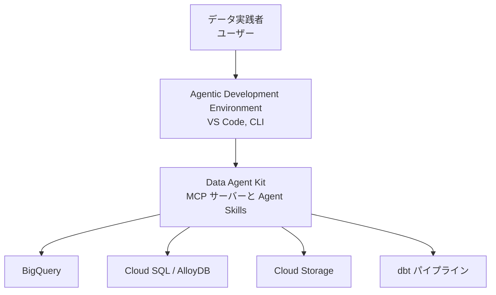
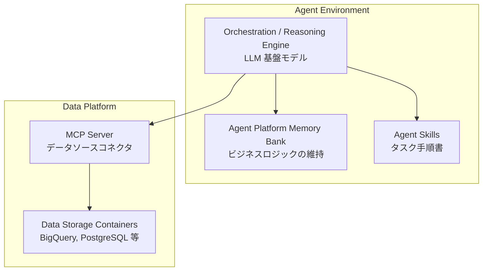
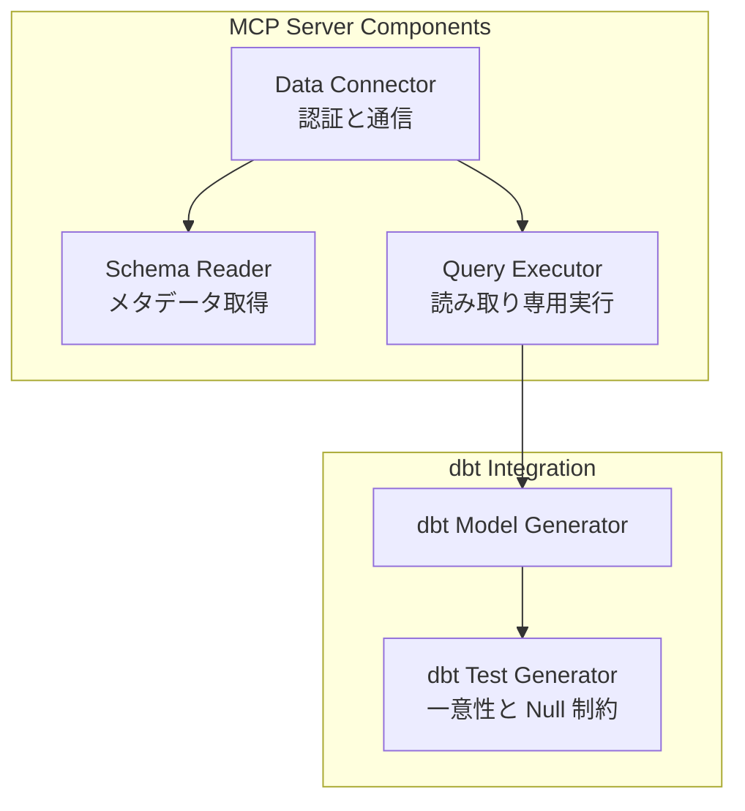
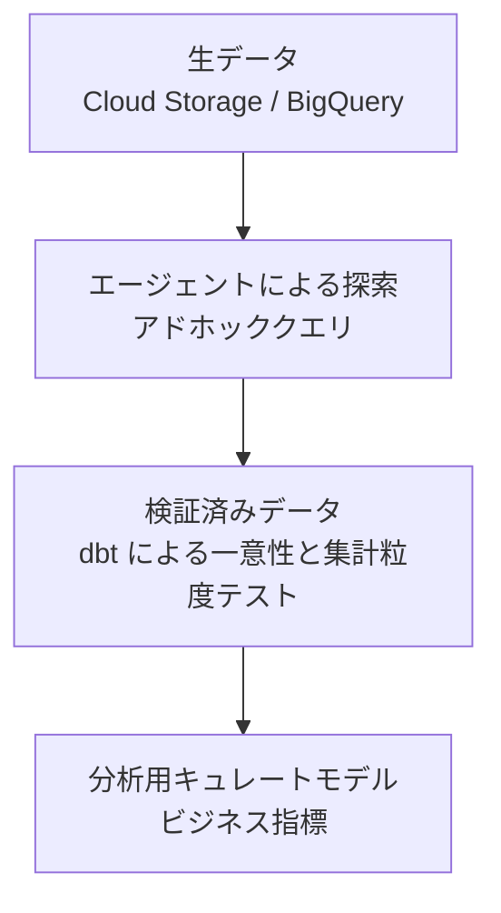
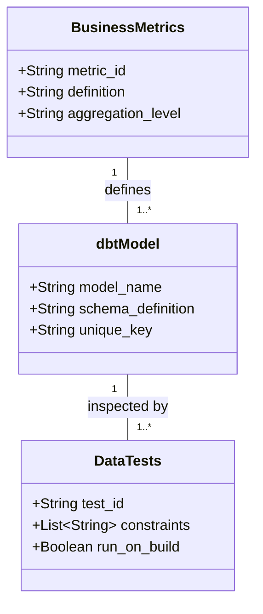

Data Agent Kit は、IDE や CLI のエージェントから BigQuery、Cloud SQL、Cloud Storage などのデータ基盤へ接続し、探索から dbt による再現可能なパイプライン検証までをつなぐオープンソースのツールセットです。
この記事では、MCP サーバーと Agent Skills の役割、データが検証済みモデルへ進む流れ、導入と運用の手順を、2026-09-09 時点の公式ブログとドキュメントに沿って整理します。
本稿の対象は Preview です。破壊的変更が入る前提で読んでください。


*この記事の全体像。以下、順に解説します。*

## Data Agent Kitとは

Data Agent Kit は、データエンジニアやデータアナリストが普段使う開発環境の中で、自然言語の意図から SQL 生成、データプロファイリング、分析、パイプライン化を進めるためのキットです。
公式ドキュメントは、対象読者をデータエンジニア、データサイエンティスト、データアプリ開発者と位置づけています。
提供形態は次の 2 系統です。

- VS Code 互換 IDE 向けの拡張機能（Antigravity IDE、Cursor など）
- Claude Code、Codex、Gemini CLI、Antigravity CLI 向けのプラグイン（[data-agent-kit-starter-pack](https://github.com/gemini-cli-extensions/data-agent-kit-starter-pack)）

核になる仕組みは 2 つです。

| 仕組み | 役割 |
|---|---|
| Model Context Protocol (MCP) | エージェントをツール、データベース、クラウド基盤へ接続する |
| Agent Skills | Markdown で書いた手順書で、特定スタックへの接し方をエージェントへ教える |

従来は、生成した SQL をコンソールへコピーして実行していました。
Data Agent Kit では、エージェントが MCP 経由でクエリを実行し、結果を同じチャットスレッドで読めます。

公式ブログの例では、平均注文金額（AOV）の低下理由を、次の 3 系統から同じセッションで追います。

- BigQuery の注文履歴
- Cloud SQL（PostgreSQL）の顧客マスタ
- Cloud Storage 上のキャンペーン JSON

調査の結果は、新しい卸売チャネルと割引コードが混ざったことで、売上総額は横ばいのまま AOV だけが下がった、という説明になります。
探索で終わらせず、同じ問いを次回も答えられる dbt モデルへ落とすところが、このキットの実務上の接続点です。

## 特徴

主な特徴は次の 4 点です。

- **MCP によるデータ接続**: BigQuery、Cloud SQL、AlloyDB、Cloud Storage などへ、リモート MCP またはローカル Toolbox 経由で接続します
- **Agent Skills による手順制御**: クエリ最適化、データ検証、dbt 変換、トラブルシュートなどの定型を Markdown スキルとして再利用します
- **dbt 連携による品質担保**: アドホック SQL を dbt モデルへ落とし、`unique` や `not_null` などのテストで一意性と粒度を検証します
- **権限と責務の分離**: 読み取りツールの承認と、パイプライン生成・実行の権限を分けます

公式ブログは、クエリ実行前に IDE が `execute_sql_readonly` などの MCP ツール利用を確認すると書いています。
一度だけ許可するか、常時許可するかを人が選べます。
エージェントが書いた SQL は実行トレイルから確認できます。

## 構造

Data Agent Kit は、開発環境のエージェントと、Google Cloud のデータ基盤のあいだに入ります。
エージェントは Skills と Memory を参照しながら推論し、MCP サーバー経由でストレージへ到達します。
探索結果を残す段階では、dbt プロジェクトが検証と永続化の受け皿になります。

### システムコンテキスト図

データ実践者は IDE や CLI に意図を伝えます。
Data Agent Kit がその意図を MCP と Skills に分解し、各データ基盤と dbt へ振り分けます。



| 要素 | 役割 | 詳細 |
|---|---|---|
| User | ユーザー | データエンジニアやデータアナリストなどのデータ実践者 |
| IDE | 開発環境 | VS Code 互換 IDE、Claude Code、Gemini CLI、Codex など |
| MCP | Data Agent Kit | MCP サーバーとエージェントスキルを提供する中核 |
| BQ | BigQuery | 大規模データウェアハウス |
| SQL | Cloud SQL / AlloyDB | トランザクショナルなリレーショナルデータベース |
| GCS | Cloud Storage | データレイクとオブジェクトストレージ |
| dbt | dbt パイプライン | 永続的なデータパイプラインとテストの実行環境 |

### コンテナ図

実行時の境界は、エージェント側の推論基盤と、データ基盤側の MCP とストレージに分かれます。
LLM は Skills を読んで手順を選び、MCP サーバーへツール呼び出しを送ります。
Memory Bank はキット標準の必須コンポーネントではありません。
エージェント基盤が別途持つ長期記憶として描いています。



| コンテナ | 役割 | 責務の範囲 |
|---|---|---|
| Engine | LLM 基盤モデル | ユーザーの意図を解釈し、スキルに基づきタスクを推論・計画する |
| Memory | Memory Bank（拡張） | エージェント基盤が別途持つ長期記憶。公式ブログと Codelab の標準手順には含まれない |
| Skills | Agent Skills | dbt テスト生成ルールなど、各種タスクの実行手順を定義する |
| MCP_Server | MCP Server | エージェントからのリクエストを解釈し、データソースへルーティングする |
| Storage | Data Storage | 実データの保管とクエリの実行 |

### コンポーネント図

MCP 側は認証、スキーマ読み取り、読み取り専用実行に分かれます。
dbt 連携側は、探索 SQL からモデルを作り、テスト定義を足します。
公式ブログの流れでは、エージェントが `dbt-bigquery` の仮想環境を作り、モデルとテストを書いたあと `dbt build` を回します。



| コンポーネント | 役割 | 実装の詳細 |
|---|---|---|
| Connector | 認証・通信 | Application Default Credentials（ADC）や OAuth、サービスアカウントなりすまし |
| SchemaReader | メタデータ取得 | 情報スキーマを読み、エージェントへコンテキストを渡す |
| QueryExecutor | 読み取り専用実行 | `execute_sql_readonly` のような読み取りツールでデータをプレビューする |
| ModelGen | dbtモデル生成 | 探索結果の SQL から dbt の `.sql` を生成する |
| TestGen | dbtテスト生成 | `.yml` に `unique` や `not_null` などの制約を追加する |

## データ

データの扱いは、生データへのアドホック探索で始まります。
一意性や集計粒度のテストを通した層が、ダッシュボードや下流システムへ出すキュレートモデルになります。

### 概念モデル

公式ブログの AOV 調査は、この流れの具体例です。
BigQuery の注文、Cloud SQL の顧客、Cloud Storage のキャンペーン定義を探索したあと、同じ結合と粒度を dbt モデルへ固定します。



| 概念 | 定義 | ビジネス上の意味 |
|---|---|---|
| 生データ | 抽出された未加工のデータ | アプリケーションから直接ロードされた未検証のデータ |
| エージェントによる探索 | AI が生成したアドホックなクエリ群 | 分布や仮説を確認するための探索プロセス |
| 検証済みデータ | dbt テストを通過したデータ | 一意性や集計粒度が保証された信頼できるデータ層 |
| 分析用キュレートモデル | セマンティックレイヤーに載せる指標の土台 | 業務指標としてダッシュボードや下流へ提供する層 |

### 情報モデル

永続化の単位は dbt モデルです。
業務指標はモデルの上に定義し、品質要件は dbt data tests で検査します。
ここでいうデータコントラクトは一般概念です。
dbt の Model contracts（スキーマ不一致ならビルドしない機能）とは別です。
公式ブログでは、注文にペット属性を直接 JOIN した結果、`order_id` の一意性テストが失敗しています。
1 注文に複数ペットが付くと行が増えるためです。
エージェントは `dbt build` の失敗を読み、粒度を直して再実行しています。



| クラス | 属性 | ロール |
|---|---|---|
| BusinessMetrics | 業務指標定義 | KPI やセマンティックレイヤーでの指標定義 |
| dbtModel | dbtモデル | テーブルやビューを生成する SQL とスキーマ情報 |
| DataTests | dbt data tests | モデル生成後に一意性、非 Null、許容値などを検査する。Model contracts とは別 |

## 構築方法

導入は、認証、プラグインまたは拡張機能のインストール、MCP の接続設定の順です。
2026-09-09 時点の手順は、公式ドキュメントの [Install the plugin](https://docs.cloud.google.com/data-agent-kit/install-plugin) と GitHub README を正とします。

### 前提条件と環境準備

次を用意します。

- Node.js と npm
- Google Cloud SDK（gcloud）
- Application Default Credentials
- VS Code 互換 IDE、または Claude Code / Gemini CLI / Codex / Antigravity CLI

```bash
gcloud auth login
gcloud auth application-default login
```

MCP 接続では、ユーザー資格情報よりサービスアカウントなりすましが推奨されています。
リモート MCP を使う場合は、プロジェクトに `roles/mcp.toolUser`（MCP Tool User）が必要です。
対象サービスごとの追加ロールは、各 MCP の製品ガイドを見てください。

### インストール手順

IDE 拡張機能はマーケットプレイスの Google Cloud Data Agent Kit から入れます。
Claude Code では、公式プラグインとして次を実行します。

```bash
/plugin install data-agent-kit-starter-pack@claude-plugins-official
```

Gemini CLI の例です。README は `--ref 0.10.1` を明示しています。

```bash
gemini extensions install https://github.com/gemini-cli-extensions/data-agent-kit-starter-pack --ref 0.10.1
```

Codex は marketplace 経由が推奨です。

```bash
codex plugin marketplace add https://github.com/gemini-cli-extensions/data-agent-kit-starter-pack
codex plugin add dak@data-agent-kit-starter-pack-marketplace
```

### プロジェクト設定

スキルはインストール直後から使えます。
MCP Toolbox は、エージェント設定へ接続情報を書いたあと、エージェントを再起動して有効になります。
確認は `/mcp` と、「どんなスキルがあるか」と尋ねるプロンプトです。

ローカル MCP は stdio で Toolbox を起動します。
公式ドキュメントの BigQuery 向け設定を、汎用 MCP クライアントの形に直すと次のようになります。

```json
{
  "mcpServers": {
    "datacloud_bigquery_toolbox": {
      "command": "npx",
      "args": [
        "-y",
        "@toolbox-sdk/server@>=1.1.0",
        "--prebuilt",
        "bigquery",
        "--stdio"
      ],
      "env": {
        "BIGQUERY_PROJECT": "my-gcp-project",
        "BIGQUERY_LOCATION": "US"
      }
    }
  }
}
```

リモート MCP は HTTP エンドポイントです。
BigQuery の例は `https://bigquery.googleapis.com/mcp` です。
AlloyDB はリージョン付き `https://alloydb.REGION.rep.googleapis.com/mcp` です。

読み取り専用化は、経路ごとに手段が違います。

- IAM の最小権限（データ閲覧とジョブ作成を分ける）
- リモート MCP では、公式ブログの `execute_sql_readonly` のように読み取り専用ツールを選び、IDE のツール承認で制御する
- ローカル Toolbox では、BigQuery Source の `writeMode` を `blocked` にすると `bigquery-execute-sql` が SELECT に制限される

次に示す `--prebuilt bigquery` は、Toolbox の既定 `writeMode: allowed` です。
この設定自体は読み取り専用ではありません。

Claude Code の実ファイルは、README によるとプラグインキャッシュ配下の `.claude-mcp.json` です。
バージョン番号を含むパスなので、インストール後の実体を確認してから編集してください。

### MCPサーバーの起動

対象データソースの MCP サーバーは、エージェントが stdio または HTTP で起動・接続します。
手動常駐は原則不要です。
ローカル Toolbox が内部で呼ぶプロセスは、次の形です。

```bash
npx -y '@toolbox-sdk/server@>=1.1.0' --prebuilt bigquery --stdio
```

ワークスペースには、再利用する Agent Skills をロードします。
プラグイン同梱のスキルに加え、チーム固有の検証手順を Markdown で足せます。

## 利用方法

利用の基本は、探索、粒度の合意、dbt モデル化、テスト実行です。
公式ブログは、AOV の内訳確認から Cloud SQL の顧客確認、Cloud Storage のキャンペーン確認、dbt プロジェクト生成までを、同じチャットで進めています。

### 探索からパイプラインへの移行

ユーザーは自然言語で探索を指示します。
エージェントは Skills を選び、MCP ツールの承認を受けてから SQL を実行します。

```text
売上データセットから、日別の売上合計とユニークユーザー数を算出するSQLを書いて。
```

公式ブログの起点プロンプトは、BigQuery の orders と order items から月次 AOV を出す、という形です。
結果を見たあと、チャネル別内訳や顧客属性へドリルダウンします。

### dbt モデルへの変換

分析開始時に、集計粒度と一意キーを合意します。
JOIN の多重度によっては行が複製され、金額の二重計上や一意性テストの失敗が起きます。
結合先キーが一意なら、粒度を合意しなくても一意性テストは通ることがあります。
一意性テストに加え、結合前後の件数と金額を照合してください。

```text
先ほどのクエリ結果をもとに dbt モデルを作成し、
一意キーに対する unique テストと not_null テストを追加してください。
```

公式ブログの指示は、BigQuery の staging と Cloud SQL の顧客・ペット属性を結合する dbt プロジェクトを作り、`order_id` に uniqueness テストを付けて `dbt build` する、というものです。
エージェントは仮想 Python 環境に `dbt-bigquery` を入れ、モデルとテストを書き、ビルドが通るまで直します。

### モデルの永続化

生成 SQL は dbt の `.sql` として保存します。
日次売上の最小例です。

```sql
-- models/daily_sales.sql
{{ config(materialized='table') }}
SELECT
    date,
    SUM(revenue) as total_revenue,
    COUNT(DISTINCT user_id) as unique_users
FROM {{ ref('stg_sales') }}
GROUP BY date
```

このモデルの一意キーは `date` です。
公式ブログの注文モデルでは、一意キーは `order_id` です。
ペット属性を注文行へ直接付けるとカーディナリティが壊れます。
属性は注文粒度へ畳むか、別モデルへ分離します。

### スキーマとテストの定義

テスト定義は `schema.yml` に置きます。

```yaml
version: 2
models:
  - name: daily_sales
    columns:
      - name: date
        tests:
          - unique
          - not_null
```

`dbt build` が落ちたら、失敗ログをエージェントへ戻します。
スキーマの再読込、重複排除、JOIN 粒度の見直しを、テストが通るまで繰り返します。

## 運用

運用の要点は、読み取り権限の最小化、人間の承認、クエリ履歴の監視です。
プラグイン README も、エージェント環境は最小権限で固めるよう求めています。

### 権限と責務の分離

データ探索用のエージェントには、読み取り専用の MCP ツールと、対応する IAM ロールだけを与えます。
パイプラインの生成と、本番適用の実行権限は分けます。
BigQuery MCP の必要ロールは、`roles/mcp.toolUser`、`roles/bigquery.jobUser`、`roles/bigquery.dataViewer` です。
クエリ実行にはジョブ作成権限が要ります。`dataViewer` だけでは 403 になります。

```bash
gcloud projects get-iam-policy my-gcp-project \
  --flatten="bindings[].members" \
  --filter="bindings.role:roles/bigquery.dataViewer"
```

リモート MCP には `roles/mcp.toolUser` が別途必要です。
サービスアカウントなりすましと、Principal Access Boundary でプロジェクト範囲を絞れます。
読み取りツールの承認と、`dbt build` やデプロイの承認は、同じ「常時許可」にまとめないでください。

### ヒューマンインザループ

本稿では、本番実行権限を分離し、人の承認を必須とする運用を推奨します。
実行可否は付与した IAM とツール承認に依存します。
公式概要はパイプラインの構築・テスト・デプロイと、GitHub Actions による自動デプロイにも触れています。
モデルとテストは feature ブランチへ出し、人が PR でレビューする形が安全です。

```bash
git add models/
git commit -m "feat: add daily sales dbt model generated by agent"
git push origin feature/daily-sales
```

公式ブログも、エージェントは大量のコードを書けるが、データ品質チェックは人が設計すると書いています。
テスト自体はエージェントに書かせてよい、という分担です。

### モニタリングの確保

エージェント用サービスアカウントが投げたジョブを、INFORMATION_SCHEMA から拾います。

```sql
SELECT query, total_bytes_billed, creation_time
FROM `region-us`.INFORMATION_SCHEMA.JOBS_BY_PROJECT
WHERE user_email = 'agent-service-account@my-gcp-project.iam.gserviceaccount.com'
ORDER BY creation_time DESC
```

リモート MCP は監査ログを集中できます。
Model Armor を載せる場合は、プロンプトと応答のペイロードがログに残る点を先に確認してください。

## ベストプラクティス

探索を早くするほど、指標定義と検証手順を先に固定する価値が上がります。
スキルとカタログに寄せると、毎回スキーマ全文をプロンプトへ貼らずに済みます。

### セマンティックレイヤーの活用

業務指標は dbt や Looker で先に定義し、安定した指標定義として渡します。
MetricFlow の旧形式 YAML の最小例です。
measure を持つモデルでは `defaults.agg_time_dimension`、対応する time dimension、主エンティティが必要です。

```yaml
semantic_models:
  - name: daily_sales
    model: ref('daily_sales')
    defaults:
      agg_time_dimension: date
    entities:
      - name: daily_sales
        type: primary
        expr: date
    dimensions:
      - name: date
        type: time
        type_params:
          time_granularity: day
    measures:
      - name: revenue
        expr: total_revenue
        agg: sum

metrics:
  - name: revenue
    label: Revenue
    type: simple
    type_params:
      measure: revenue
```

Knowledge Catalog のリモート MCP（`https://dataplex.googleapis.com/mcp`）を使うと、テーブル説明をエージェントへ渡せます。

### スキルのライブラリ化

「JOIN 前に一意性テストを実行する」などの定型は、Agent Skills 仕様の `SKILL.md` へ切り出します。
配置先はクライアントごとに違います。Claude Code ならプラグインまたはプロジェクトの skills ディレクトリです。

```markdown
---
name: dbt-join-validation
description: JOIN 前に主キーの unique と not_null テストを実行する
---

JOIN を行う前に、必ずベースとなるテーブル群に対して
主キーの unique および not_null テストを実行すること。
```

公式スターターパックは、クエリ最適化、データ検証、ドリフト確認、ガバナンス、トラブルシュート用のスキルを同梱しています。
チーム固有の粒度ルールは、同梱スキルを上書きせず別ファイルで足します。

### コンテキスト設計の展開

巨大な情報スキーマを毎回渡すより、カタログ上の説明とセマンティックレイヤーを渡します。
次の JSON は、エージェントへ渡す説明文の概念例です。
Knowledge Catalog の Entry API レスポンス（`name` / `entryType` / `aspects` など）ではありません。

```json
{
  "knowledge_catalog": {
    "sales_table": "このテーブルは日次で更新され、キャンセルされた注文も含まれる。"
  }
}
```

公式ブログの AOV 例でも、キャンペーン規則はオブジェクトストレージ上の JSON として残っています。
エージェントが読める場所へ、指標の定義と例外条件を置いてください。

## 注意点

対象の説明と手順はここまでです。
導入前に押さえる制約をまとめます。

| 対象 | 資料の記載 | 実態 | 読者への影響 |
|---|---|---|---|
| 製品ステータス | Preview / スターターパックは beta（pre-v1.0） | 2026-09-09 時点で Preview。v1.0 まで破壊的変更があり得る | 本番の唯一の経路にしない |
| エージェントの権限 | Agentic Analytics を実現する | 読み取り用 MCP と本番実行権限は設定次第で分離できる | 本稿では権限を分け、本番適用は人の PR 承認を推奨する |
| MCP の形 | キットがデータ基盤へ接続する | 単一の `@googlecloud/data-agent-kit-mcp` ではない。リモート HTTP MCP と `@toolbox-sdk/server` のローカル Toolbox | 古い単一パッケージ前提の設定例は動かない |
| 対応フォーマット | ノートブック生成や多様なソースに対応 | Spark / BigQuery ノートブック生成はできるが、任意のノートブック形式を自然言語で編集できるわけではない | 手元の特定ファイル形式では操作が止まることがある |

公式の MCP 設定は、サービスごとの remote URL または `@toolbox-sdk/server --prebuilt <service>` です。
汎用の `npx @googlecloud/data-agent-kit-mcp` という起動系は、2026-09-09 時点の公式ドキュメントにはありません。

## トラブルシューティング

ここでの対象は、読者がキットを使うときに出る症状です。

### スキーマ不一致エラー

- **症状**: 生成した dbt モデル実行時に、カラムが無い、または型が合わない
- **原因**: エージェントが古いスキーマ記憶で SQL を書いた
- **対処**: MCP 経由でスキーマ再読込を明示し、プロンプトに対象テーブルの最新メタデータを渡す

### コンテキスト上限超過

- **症状**: 巨大なスキーマや長いエラーログを渡すと、エージェントが答えなくなる
- **原因**: プロンプトのメタデータ量がトークン上限を圧迫している
- **対処**: 対象テーブルだけに絞る。セマンティックレイヤーや Knowledge Catalog の説明を先に渡す

| 症状 | 原因 | 対処 |
|---|---|---|
| dbt モデル実行時のカラム不在 | 最新スキーマではなく過去コンテキストで推論した | MCP でスキーマを再読込する |
| コンテキストウィンドウ超過による無応答 | 巨大なスキーマがトークン上限を圧迫する | 必要テーブルだけに絞るか、セマンティックレイヤーを参照させる |
| BigQuery アクセス拒否（403） | 参照権限またはジョブ作成権限が不足 | `roles/bigquery.dataViewer`、`roles/bigquery.jobUser`、リモート MCP なら `roles/mcp.toolUser` を確認する |
| MCP が Connection closed / toolbox ENOENT | 設定不足、または Toolbox バイナリ未取得 | プロジェクトとリージョンを設定し、Gemini CLI は v0.6.0 以上にする |
| ADC が見つからない | `gcloud auth application-default login` 未実施 | ADC を取り直し、エージェントを再起動する |
| dbt 一意性テスト失敗 | 生データの重複、または JOIN で粒度が壊れた | `ROW_NUMBER()` 等で重複排除するか、属性を注文粒度へ畳む |
| 複雑な JOIN のタイムアウト | 最適化前の SQL を本番相当データへ投げた | PostgreSQL は `EXPLAIN`、BigQuery は実行済みジョブの実行詳細／`statistics.query.queryPlan` を人が見る |

スターターパック README は、インストール後にエージェントを再起動すること、MCP 接続情報を更新すること、Toolbox バイナリのアーキテクチャ不一致を疑うことを挙げています。

## まとめ

Data Agent Kit は、IDE 内のエージェントに MCP と Skills を渡し、複数データ基盤の探索と dbt による再現可能な検証をつなぐキットです。
読み取りツールで仮説を確認し、一意キーと粒度を合意してからモデルへ落とし、`dbt build` の失敗を品質信号として使う、という分担がそのまま運用になります。
Preview であるため、本稿では権限を読み取りと実行で分け、本番適用は人の PR 承認を残す運用を推奨します。

この記事が少しでも参考になった、あるいは改善点などがあれば、ぜひリアクションやコメント、SNSでのシェアをいただけると励みになります！

## 参考リンク

### 公式ドキュメント

- [Agentic analytics with the Data Agent Kit | Google Cloud Blog](https://cloud.google.com/blog/products/data-analytics/agentic-analytics-with-the-data-agent-kit)
- [Google Cloud Data Agent Kit documentation](https://docs.cloud.google.com/data-agent-kit)
- [Use MCP servers | Google Cloud Data Agent Kit](https://docs.cloud.google.com/data-agent-kit/use-mcp-servers)
- [Use the BigQuery MCP server](https://docs.cloud.google.com/bigquery/docs/use-bigquery-mcp)
- [BigQuery IAM roles](https://cloud.google.com/bigquery/docs/access-control)
- [Application Default Credentials](https://cloud.google.com/docs/authentication/provide-credentials-adc)
- [Analytics with Data Agent Kit and Antigravity IDE Codelab](https://codelabs.developers.google.com/dak-analytics-eng-antigravity-ide#0)

### オープンソース

- [Data Agent Kit Starter Pack](https://github.com/gemini-cli-extensions/data-agent-kit-starter-pack)
- [Model Context Protocol (MCP)](https://modelcontextprotocol.io)
- [dbt Developer Hub](https://docs.getdbt.com)

### 関連技術

- [Google Cloud Storage](https://cloud.google.com/storage)
- [Cloud SQL](https://cloud.google.com/sql)
- [AlloyDB](https://cloud.google.com/alloydb)
