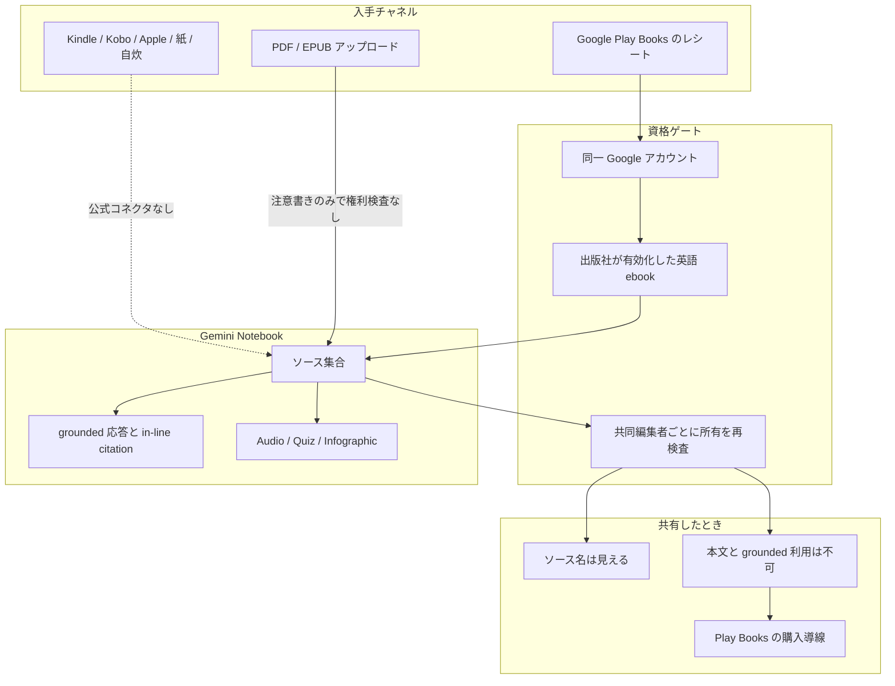

Google が 2026-08-27 に発表した Expert Intelligence は、Google Play Books で購入した ebook を Gemini Notebook（旧 NotebookLM）のソースとして扱い、その本に grounded した回答や派生コンテンツを生成する機能です。

技術的におもしろいのは「本を読める AI」そのものではありません。**検索の実行時に「その利用者はこの本を使う資格があるか」を検査し、資格がなければ中身を一切出さない**という、権利境界を持った RAG が消費者向けプロダクトとして出てきた点です。

この記事では、公開されている一次情報から Expert Intelligence の資格ゲートがどの層で効いているかを整理し、社内向け RAG を設計するときに何を持ち帰れるかを示します。対象読者は、社内文書や有償コンテンツを扱う RAG / ナレッジ基盤の設計を判断する立場の方です。

*この記事の全体像。以下、順に解説します。*

## Expert Intelligence とは何をする機能か

公式ブログ [Expert Intelligence: a new way for you to engage with trusted content](https://blog.google/innovation-and-ai/products/gemini-notebook/expert-intelligence-leading-sources/) の説明を要約すると、次のとおりです。

- Play Books で購入した対象 ebook を、Gemini Notebook のソースとして追加できる
- 追加した本に grounded した質問応答ができ、Notebook 一般仕様として in-line citation が付く
- Studio 機能（Infographics / Audio Overviews / Quizzes など）の生成元にもできる
- 位置づけは Gemini Notebook の一機能ではなく、Gemini アプリと Search の AI Mode へ広げる横断 initiative

発表時点のカタログは 10 万冊超、参加出版社として Bloomsbury / De Gruyter Brill / Johns Hopkins University Press / Macmillan / O'Reilly / Penguin Random House などが挙げられています。日記や写真といった個人ソースと書籍を同じノートに混ぜる使い方も、公式が例示しています。

つまり「購入済みの本」を、他の自前ソースと同じ土俵に載せる機能です。

## 何が新しいのか

書籍を根拠にした RAG 自体は目新しくありません。新しいのは、**ソースの利用可否がノートの閲覧権限から独立している**ことです。

一般的な RAG では、権限チェックはドキュメントの ACL に集約されます。「そのファイルを読めるか」だけを見れば、検索結果に出してよいかが決まります。

Expert Intelligence は、ここに 2 本目の軸を入れます。

| 軸 | 問い | Expert Intelligence での実装 |
|---|---|---|
| ACL | このノートを開けるか | Notebook の共有設定 |
| Entitlement | この本を使うライセンスを持っているか | Play Books のレシート照合 |

ノートを共有された相手がノートを開けても、その相手が本を所有していなければ、その本を根拠にした利用はできません。共有されたノート上では、非所有者に対して Play Books の購入導線が提示されます。

**権限（見られるか）と資格（使えるか）を分離し、後者を検索時に再評価する**という構造です。

## 資格ゲートはどの経路に付いているか

重要なのは、この資格ゲートが**すべての入力経路に付いているわけではない**ことです。ゲートは Play Books コネクタに紐づいており、利用者が自分で PDF / EPUB をアップロードする経路には、同等の検査がありません。

破線は「公式の接続経路が存在しない」ことを示します。Kindle や紙で正当に購入した本は、合法な所有であってもこのコネクタには乗りません。**資格の実体は著作権上の所有一般ではなく、Play Books のレシート**です。

一方でアップロード経路は、利用規約上の注意書きがあるだけで、レシート検証はありません。つまり Expert Intelligence の権利物語は、Gemini Notebook というプロダクト全体の保証ではなく、**特定コネクタに閉じた保証**です。設計を評価するときは、ここを混同しないことが重要です。

## 資格が成立する条件

[Google Play ヘルプの Expert Intelligence の項](https://support.google.com/googleplay/answer/17068529?hl=en) には、運用上の条件が具体的に書かれています。

- **対象は select English language ebooks**。出版社が有効化していない本、言語やフォーマットが合わない本は、所有していても対象外
- **非適格な本も一覧には表示され、グレーアウトする**。所有と利用可否が別であることが UI 上に現れる
- **Play Books と Notebook が同一 Google アカウント**であること
- **自分で Play ライブラリへアップロードした本は Play Books ソースに使えない**
- アカウントを間違えて購入した場合、サポートが entitlement を検証して移転しうる

「所有」の粒度が細かく分解されている点に注目してください。ライセンスは 1 つの真偽値ではなく、**購入者・タイトル・言語・出版社の意思・アカウント同一性の積**になっています。

なお無料配布についても、プロモコード `EXPERTINTELLIGENCE` を受け取った US-based アカウントに対象 ebook 1 冊（在庫限り、譲渡不可、現金価値なし）という限定的なもので、全米向けの無条件配布ではありません。

## 権利モデルを層で分解する

一次情報で確定していることと、まだ確定していないことを層ごとに分けると、次のようになります。

| 層 | 検査するもの | 一次情報 | 未確定なこと |
|---|---|---|---|
| ノート ACL | ノートを開けるか | Notebook の共有仕様 | — |
| ストア entitlement | Play Books で所有しているか | Google 公式ブログ | レンタル期限切れ後のソース残存 |
| カタログ entitlement | そのタイトルが有効か | Play ヘルプ（出版社 / 言語 / フォーマット） | 著者オプトインの実データ |
| 共有先 entitlement | 共同編集者も所有しているか | Google 公式ブログ | Family Library との衝突 |
| 引用 | ソースに grounded した in-line citation | Notebook ヘルプ | 書籍固有の引用粒度 |
| 学習利用 | フィードバックしなければ学習に使わない | Notebook ヘルプ | 基盤 Gemini の学習経路は別問題 |

Play ヘルプの手順見出しには「purchased or rented」とある一方、公式ブログ本文は purchased / own の表現です。レンタル・図書館貸出・Family Library での挙動は公式に記載がありません。

また、Drive のファイルをソースにする場合は Workspace 側の既存共有設定（少なくとも閲覧権限）が効き、組織のデータリージョン設定は Notebook のキャッシュには適用されないと Workspace 管理者向けドキュメントに記載があります。**書籍の entitlement と Drive の ACL は別系統**であり、片方を見ても他方の保証にはなりません。

## Kindle の Ask this Book との比較

資格付き書籍 RAG の先行例として、Amazon の Ask this Book があります。両者を比べると、Expert Intelligence の設計思想がはっきりします。

| 基準 | Google Expert Intelligence | Amazon Ask this Book |
|---|---|---|
| 資格 | Play Books での所有（公式）。ヘルプにはレンタル手順の記載もある | 購入または借用 |
| 出版社のコントロール | 契約に依存するオプトイン | Authors Guild の記録では著者・出版社のオプトアウト不可 |
| 派生生成 | Infographics / Audio Overviews / Quizzes など | チャット回答 |
| カタログ | 10 万冊超の select English | 数千冊の英語 ebook |
| 対価 | 非公開 | Authors Guild はライセンス料なしと主張 |

Expert Intelligence は、出版社のコントロールを前面に出している点で先行例より一歩踏み込んでいます。ただし契約条件は非公開であり、**全文の取り込みと Studio による派生生成は、従来の読書ライセンスを超える新しい利用になりうる**という論点は残ります。これは [Authors Guild が Amazon に対して提起した論点](https://authorsguild.org/news/statement-on-amazon-kindle-ask-this-book-ai-feature/) と同じ構造です。

さらに、2026-07-10 には Hachette / Cengage / Elsevier らが Gemini の学習を巡る集団訴訟を S.D.N.Y. に提起しています（1:26-cv-05870）。これは原告の主張であって判決ではなく、指名原告に Expert Intelligence のローンチ出版社は含まれません。ただし **grounded 検索のライセンスと学習のライセンスは別問題**であり、前者の UX が整っても後者の係争は消えない、という事実は押さえておく必要があります。

## 自社 RAG に持ち帰れる設計パターン

ここからが実務への含意です。Expert Intelligence を「Google の新機能」ではなく「権利境界付き RAG の実装例」として読むと、次の 5 点が設計チェックリストになります。

### 1. ACL と entitlement を分けて検索時に再評価する

ドキュメントを開けることと、その内容を根拠に生成してよいことは別です。有償レポート、購読契約、座席ライセンス、共有先の資格を、**インデックス時ではなく検索時に**評価してください。共有リンクの閲覧権限だけで判定すると、契約範囲を超えた再配布が生成物経由で起きます。

### 2. コネクタだけにゲートを付けて、アップロード経路を無検査で残さない

Expert Intelligence の最大の設計上の穴がここです。整った経路にだけ検査を置くと、利用者は無検査の経路へ流れます。同じ資料が「コネクタ経由なら制限あり、アップロードなら制限なし」になっていないかを確認してください。

### 3. ソース目録そのものを漏洩対象として扱う

共有時に本文が守られても、ソース名が見えれば「誰が何を読んでいるか」は伝わります。M&A 資料や人事関連の文書では、**ファイル名の存在自体が機微情報**です。コンテンツの遮断とは別に、目録の可視性を設計項目に入れてください。

### 4. 期限付きライセンスの失効時の挙動を先に決める

レンタルや購読は必ず切れます。資格が失効したときに、インデックス、埋め込みベクトル、そして**すでに生成された派生物**をどう扱うかを、導入前に決めておく必要があります。Expert Intelligence でもこの点は未定義です。

### 5. 学習ライセンスと検索ライセンスを同一契約にしない

コンテンツを「モデルの学習に使う」ことと「検索の根拠として引用する」ことは、権利者から見て別の許諾です。1 本の契約に混ぜると、片方の条件変更がもう片方を止めます。

## まだ確定していないこと

判断を保留すべき点も明示しておきます。

- レンタル中・期限切れ・Family Library でのソース残存と、生成済み Studio 成果物の扱い
- 全文を Notebook に載せる許諾の範囲（公式ブログには記載がない）
- 出版社契約の対価、期間、派生利用、学習禁止条項
- 日本語タイトルが対象になるかどうか（日本語出版社のオプトインは確認できていない）
- Play Books ソースが Notebook のソース上限にどうカウントされるか
- 基盤 Gemini の学習に Play Books の本文が使われたかどうか（訴訟の争点であり、grounded 経路とは別）

提供範囲についても、Play ヘルプが一次情報として言語を「Select English language ebooks」に限定しています。国際的な利用可否は地域ごとの契約条件次第です。日本の業務で「購入済み書籍を根拠にする」用途を検討するなら、現状は Play の英語カタログとアカウント一致に依存する、と理解しておくのが安全です。日本語の教科書や業界レポートはロードマップ上の「soon」であり、**先に着手すべきは社内文書と契約書に対する ACL + entitlement の実装**です。

なお 2026-09-02 からは、消費者向けに compute ベースの利用上限（5 時間ごとに refresh）がロールアウト予定です。書籍ソース専用のクォータは公表されていません。

## まとめ

- Expert Intelligence は、Play Books で購入した対象英語 ebook を Gemini Notebook のソースにし、grounded な応答と派生生成を行う機能
- 技術的な要点は、ノートの ACL とは独立した **entitlement 層を検索時に検査する**構造
- 資格の実体は著作権上の所有一般ではなく Play Books のレシート。他ストアでの正当な購入は公式コネクタに乗らない
- ゲートはコネクタにのみ付いており、PDF / EPUB のアップロード経路には同等の検査がない
- 自社 RAG では、ACL と entitlement の分離、無検査経路の排除、ソース目録の秘匿、資格失効時の消去方針、学習と検索の契約分離を設計項目にする
- 出版社契約の条件、レンタル時の挙動、日本語カタログは未確定であり、過大評価はできない

この記事が少しでも参考になった、あるいは改善点などがあれば、ぜひリアクションやコメント、SNSでのシェアをいただけると励みになります！

## 参考リンク

- [Expert Intelligence: a new way for you to engage with trusted content（Google Keyword, 2026-08-27）](https://blog.google/innovation-and-ai/products/gemini-notebook/expert-intelligence-leading-sources/)
- [Google Play Help: Expert Intelligence](https://support.google.com/googleplay/answer/17068529?hl=en)
- [Gemini Notebook Help: Learn about Gemini Notebook](https://support.google.com/notebooklm/answer/16164461)
- [Gemini Notebook Help: Add or discover new sources](https://support.google.com/gemininotebook/answer/16215270)
- [We're introducing flexible usage limits for Gemini Notebook（Google Keyword, 2026-08-28）](https://blog.google/innovation-and-ai/products/gemini-notebook/new-flexible-usage-limits/)
- [What is Gemini Notebook Enterprise?（Google Cloud）](https://docs.cloud.google.com/gemini/enterprise/notebooklm-enterprise/docs/overview)
- [Google's AI note-taking app now allows you to interact with books（The Verge, 2026-08-27）](https://www.theverge.com/tech/985567/google-gemini-notebook-expert-sources-books)
- [Google Launches AI Tool to Add Interactivity to E-books（Publishers Weekly, 2026-08-27）](https://www.publishersweekly.com/pw/by-topic/industry-news/publisher-news/article/101136-google-launches-expert-intelligence-adding-interactivity-to-e-books.html)
- [米Googleの「Gemini Notebook」で購入した本10万冊をAIが解説する新機能（ケータイ Watch, 2026-08-28）](https://k-tai.watch.impress.co.jp/docs/news/2136576.html)
- [Authors Guild Raises Concerns About Kindle's New "Ask This Book" AI Feature](https://authorsguild.org/news/statement-on-amazon-kindle-ask-this-book-ai-feature/)
- [Amazon: Ask this Book](https://www.amazon.com/b?ie=UTF8&node=213998535011)
- [Hachette Book Group, Inc. v. Google LLC, 1:26-cv-05870 (S.D.N.Y.)](https://www.courtlistener.com/docket/73603888/hachette-book-group-inc-v-google-llc/)
