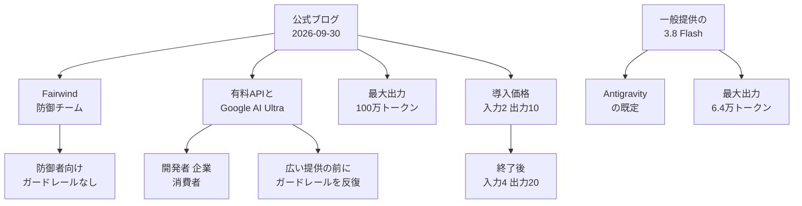

Gemini 4 Argon は、Google DeepMind が 2026年9月30日に発表したフロンティア向けのモデルです。この記事では、[公式ブログ](https://blog.google/innovation-and-ai/models-and-research/gemini-models/gemini-4-argon/)、公式比較表、評価手法の PDF から、呼び方と提供範囲と価格と出力の長さがどう分かれているかを整理します。数値は 2026年10月1日に読んだ公式本文、公式比較表、評価手法の PDF に基づきます。独立評価機関の数値は二次情報として分けて書きます。

*この記事の全体像。以下、順に解説します。*

## Gemini 4 Argonとは

Gemini 4 Argon は、実地のソフトウェア工学、法務や金融のような企業の知識作業、サイバーセキュリティの防御、クリエイティブな文章作成を対象にしたモデルです。発表者は Koray Kavukcuoglu（SVP, Google DeepMind and Chief AI Architect, Google）です。長い作業のあいだ推論を続けることを、発表は中心に置いています。

外部への出し方は段階的です。最初の相手は [Fairwind Program](https://deepmind.google/fairwind-program/) の信頼された防御者です。広い提供の起点は、有料 API の顧客と Google AI Ultra の購読者だと本文が書いています。広い提供の日付は書かれていません。

### 出力上限と価格

公式本文は、出力上限を以前の 6.4 万トークンから 100 万トークンへ拡大したと書いています。導入期の価格は、入力 100 万トークンあたり 2 ドル、出力 100 万トークンあたり 10 ドルです。キャッシュ済み入力は、入力トークン価格から 95% 引きです。導入期の入力が 2 ドルなら、キャッシュ入力は 100 万トークンあたり 0.10 ドルになります。この 0.10 ドルは本文の率からの計算です。

導入期の終了後は、入力 4 ドル、出力 20 ドルです。単位はいずれも 100 万トークンあたりです。終了日は脚注にありません。

いまの外部提供は Fairwind の一部パートナーです。信頼された防御者と Google 社内には、サイバー用ガードレールを外した版を出す、と本文が書いています。Fairwind は、パートナー組織による共有、再配布、販売を認めていません。渡せる相手は、社内のサイバーセキュリティ、事故対応、侵入テストのチームに限られます。

### 一般提供の 3.8 Flash との層の違い

Argon は、呼び方、価格、出力の長さが別々の層になっています。一般のコーディング席が今日使う Gemini 3.8 Flash とは、提供範囲と出力上限と単価が分かれます。

現行の一般提供モデル Gemini 3.8 Flash のモデル ID は `gemini-3.8-flash` です。コンテキストは 100 万トークンです。最大出力は 6.4 万トークンです。導入価格は 2026年12月31日まで、入力 0.75 ドル、出力 3.75 ドルです。標準価格は 2027年1月1日から、入力 1.50 ドル、出力 7.50 ドルです。単位はいずれも 100 万トークンあたりです。Antigravity agent の既定はこの Flash です。出典は [Gemini 3.8 Flash](https://ai.google.dev/gemini-api/docs/generate-content/latest-model) です。

図の金額は 100 万トークンあたりです。導入期の長さは図に入れていません。公式が日付を書いていないためです。

### 公式比較表が並べた行

公式比較表は 19 行あります。百分率は 2026年10月1日に[公式チャート](https://storage.googleapis.com/gweb-uniblog-publish-prod/original_images/gemini-4-argon_table_blog.gif)と [DeepMind の Gemini ページ](https://deepmind.google/models/gemini/) の HTML から転記したものです。手法は [評価 PDF](https://storage.googleapis.com/deepmind-media/gemini/gemini_4_argon_model_evaluation.pdf) に書かれています。他社列は、この PDF が別記しない限り各社の自己申告です。

| 区分 | ベンチ | Argon | GPT-6 Astra | Fable 5.1 | Opus 5.5 |
|---|---|---:|---:|---:|---:|
| 知識作業 | Vals Index | 68.9% | 63.1% | 65.8% | 67.0% |
| 知識作業 | AutomationBench | 51.3% | 41.4% | 31.4% | 42.5% |
| 知識作業 | Vals Finance Agent v2 | 65.4% | 53.5% | 58.9% | 58.6% |
| 知識作業 | Harvey 法務 | 19.6% | 5.4% | 6.7% | 3.8% |
| コーディング | DeepSWE v1.1 | 77.9% | 74.1% | 67.4% | 74.2% |
| コーディング | FrontierSWE v2 | 55.0% | 65.5% | 56.3% | 62.3% |
| コーディング | Vibe Code Bench | 91.9% | 89.6% | 90.3% | 90.3% |
| コーディング | Terminal-bench 4.0 | 57.4% | 58.2% | 57.9% | 66.4% |
| 学習工学 | PostTrainBench | 45.3% | 44.3% | 40.2% | 49.3% |
| 科学と数学 | Terminal-Bench Science 0.1 | 57.6% | 68.1% | 52.6% | 63.3% |
| 科学と数学 | LABBench 2 | 88.8% | 85.4% | 68.6% | 73.1% |
| 科学と数学 | RiemannBench | 76.0% | 72.0% | 65.6% | 69.6% |
| 長文脈 | GraphWalks 128kまで | 99.7% | 98.7% | 91.4% | 90.6% |
| 長文脈 | GraphWalks 256kから1M | 84.2% | 71.8% | 65.0% | 66.8% |
| コンピュータ操作 | Agent's Last Exam | 39.5% | 34.2% | 表に値なし | 38.2% |
| コンピュータ操作 | OSWorld-2.0 offline | 69.2% | 72.6% | 表に値なし | 表に値なし |
| マルチモーダル | Chartography | 71.6% | 71.0% | 46.2% | 66.3% |
| マルチモーダル | LVBench | 91.7% | 87.5% | 79.7% | 83.7% |
| サイバー | CWE-bench v1 | 68.0% | 68.0% | 58.0% | 67.0% |

「表に値なし」は、公式表に数値が無いセルです。

## 注意点

公式ブログは Argon を "our new frontier model" と呼びます。Financial Times の記事本文は 2026年10月1日に取得できませんでした。search.ft.com の同日索引は、見出しを "Google releases most advanced Gemini AI model" としています。リードは "hopes 'Argon' will help it re-establish itself at the frontier" です。FT 本文は未確認です。到達の宣言と、再定位への期待は、同じ発表を別の語調で指しています。

2026年10月1日にチャート画像と DeepMind の HTML を照合すると、Argon が最高または同点なのは 14 行でした。他モデルが上なのは 5 行でした。コーディング 4 行は割れます。DeepSWE v1.1 は 77.9% で表の最高です。FrontierSWE v2 は 55.0% で、GPT-6 Astra の 65.5% が上です。Terminal-bench 4.0 は 57.4% で、Claude Opus 5.5 の 66.4% が上です。知識作業 4 行は Argon が最高です。ただし Harvey の法務ベンチは 19.6% で、絶対値は低いです。

評価 PDF は、非 Gemini の点数を、別記が無い限り各社の自己申告だと書いています。DeepSWE の Argon は mini-swe agent harness による自社計測です。他モデルは公開リーダーボードか system card です。Terminal-Bench Science 0.1 は、Argon だけ検証タイムアウトを 6 倍にしています。LVBench はフレーム数を変えています。Gemini は 1FPS です。Astra は 800 フレームです。Fable 5.1 は 300 です。Opus 5.5 は 600 です。PDF がそう書いています。この 2 行は、同じ条件の順位として読みません。OSWorld は Anthropic の合算値を表に入れない、と PDF が書いています。空欄は未計測の宣言ではありません。

全モデルを自社で測った行は、条件の差を挟まずに読めます。GraphWalks の 256k から 1M は、Argon 84.2%、Astra 71.8%、Fable 65.0%、Opus 66.8% です。PostTrainBench は Argon 45.3% で、Opus 49.3% が上です。長い入力の問題では差が開きます。学習後の訓練ベンチでは Opus が上です。これは公式自身の測り方です。

社内成果は自己申告です。量子サブルーチンで公開ベースラインを 40% 上回った、とブログが書いています。メモリは導入後に 300 TiB 超を解放する見込みです。総計は 500 TiB から 1 PiB の見積もりです。Rust への移行は最大 80 万行超です。libgav1 は既存の Rust 移植より 2.7 倍です。監査報告書は付いていません。

[Artificial Analysis](https://artificialanalysis.ai/articles/gemini-4-argon-google-top-three-labs) は 2026年9月30日の記事で、high reasoning の Intelligence Index を 53 としています。GPT-6 Astra（max）の 53 と並ぶ、とも書いています。これは二次情報です。同じ記事は、1 タスクあたりの平均出力を Argon 約 62k トークン、Astra（max）27k トークンとしています。割引中のタスク費用は 1.99 ドル、標準価格では 3.98 ドルとしています。これも二次情報です。割引が単価の安さであって、出力の短さではない、という同記事の整理は、長い出力ほど 10 ドルと 20 ドルが効く、という読みと方向が合います。コンテキスト 100 万や入出力モダリティは、同サイトの記事と FAQ が一致しません。これも二次情報です。Google の[モデルカード索引](https://deepmind.google/models/model-cards/)に Argon は無く、モダリティの一次一覧は確認できませんでした。同記事の「少なくとも 1 か月」は公式脚注に無いので、期間の根拠にしません。

CWE-bench v1 の 68% は、ブログ本文と公式表の両方にあります。表では Astra も 68.0% で同点です。Fable は 58.0% です。Opus は 67.0% です。PDF は公開リーダーボードの pass@1 だと書いています。Fairwind の図の代替テキストは Grok 4.7 も 68% と読めます。比較表に Grok の列はありません。

2026年10月1日の一次では、次が閉じていません。

- 導入期はいつ終わるか。
- 公開時のモデル ID、function calling、検索、コード実行、RPM と TPM。
- 思考トークンは出力 10 ドルと 20 ドルに含まれるか。
- 入力コンテキストの仕様上限。評価は 100 万トークン級の問題を流しています。仕様行はありません。
- 入出力のモダリティ。モデルカードがありません。
- Batch 割引が Argon に付くか。
- 3.5 Pro を出荷するのか、Argon がその後継名なのか。確認した一次は coming soon までです。
- FT 記事の本文。索引の見出しとリード以外は未確認です。

## 既定と長時間作業と単価を分ける

作業の規模で能力と単価を分ける既存の表に、Google 側の新しい列が足されました。足されたのは、今日の既定ではありません。足されたのは、出力が極端に長い席の候補です。前節の未確認項目があるため、既定を動かす材料は揃っていません。長い出力の列を候補と書くことまでは、今日の一次でできます。

| 判断 | 2026年10月1日の結論 | 一次の根拠 |
|---|---|---|
| 既定モデル | 移さない | 公開のモデル ID を models、pricing、model cards、個別 URL で確認できなかった。個別 URL は 404。Antigravity の既定は 3.8 Flash。Fairwind は防御、事故対応、侵入テストのチームに限定 |
| 長時間作業 | 候補の列に足す。今日は移さない | 出力 100 万は本文の仕様差分。GraphWalks の 84.2% 対 Astra の 71.8% は長い入力の自社計測で、出力品質の証拠ではない。コーディング既定を移すには、FrontierSWE と Terminal-bench の負けが残る。呼べる ID が無い |
| 単価 | 導入価格だけでは移さない | 終了後の 4 ドルと 20 ドルは脚注で確定。終了日は無い。見積もりの上側は 4 ドルと 20 ドル。3.8 Flash の導入価格には 2026年12月31日という日付がある |

出力を上限の 100 万トークンまで使うと、導入期の出力代は 1 応答あたり 10 ドルになります。終了後は 20 ドルになります。これは単価からの計算です。Google がその金額を応答単価としては書いていません。思考トークンがこの出力単価に含まれるかは、Argon の価格行が無く確認できませんでした。

キャッシュ 95% が導入後も続くかは、脚注が書いていません。続くと仮定すると、終了後のキャッシュ入力は 100 万トークンあたり 0.20 ドルになります。これも仮定です。見積もりに固定しません。

## 切替を止める一次と、言い方だけ弱まる点

結論は、既定は 3.8 Flash のままにすることです。Argon は長時間出力の候補として表に足します。公開 ID と導入終了日とツール対応が一次に載るまで、切替はしません。

切替を止める一次は次のとおりです。

- 2026年10月1日の[公開 API のモデル一覧](https://ai.google.dev/gemini-api/docs/models)に、Argon のモデル ID がありません。個別ページは 404 です。
- Fairwind は共有、再配布、販売を認めず、渡せる相手を防御系チームに限っています。
- 公式のコーディング行は勝ち負けが割れます。DeepSWE の勝ちは mini-swe での自社計測です。
- 終了後単価は脚注にあります。導入期の安さを恒久単価として扱えません。
- 既定を移さない、という結論を覆す一次資料は、2026年10月1日の確認では見つかりませんでした。

弱まるのは行動ではなく、言い方です。

- 単価がまったく未知、ではありません。未知なのは割引の長さです。上側は 4 ドルと 20 ドルで置けます。
- Argon が存在しない、ではありません。Fairwind には出し始めています。一般のコーディング席から呼べる、とは別です。
- 3.5 Pro は中止、ではありません。[2026年5月19日のブログ](https://blog.google/innovation-and-ai/models-and-research/gemini-models/gemini-3-5/) は翌月の展開を見込んでいます。2026年10月1日の [3.1 Pro ページ](https://deepmind.google/models/gemini/pro/) は "3.5 Pro coming soon" のままです。廃止表に `gemini-3.5-pro` はありません。[TechCrunch](https://techcrunch.com/2026/07/21/google-releases-three-new-gemini-models-but-no-3-5-pro/) は、2026年7月21日の出荷に 3.5 Pro が含まれなかったと書いています。これは二次情報です。

## いま取る行動

1. 既定モデルは `gemini-3.8-flash` のままにします。
2. 見積もり表には Argon の列を足します。単価の上側は入力 4 ドル、出力 20 ドルです。下側の導入価格は、終了日が書かれるまで仮の値にします。
3. 長時間ジョブを移す試験は、models ページに ID が載り、ツール行が載ってからにします。試験では出力トークン数を記録します。100 万トークンあたり 10 ドルと 20 ドルの両方で総額を出します。
4. サイバー用ガードレールの無い版は、Fairwind の防御用途に限ります。一般のコーディング既定には混ぜません。
5. 価格ページに Argon の行が載ったら、終了日、キャッシュ、思考トークン、Batch の 4 点だけを読み直します。

逆転条件は、次の 3 つが同時に揃ったときです。公開のモデル ID があること。function calling を含むツール対応が同じ文書にあること。自分の長時間ジョブで、終了後単価でも 3.8 Flash より完了率と総額の両方で勝つ実測があること。

## まとめ

Gemini 4 Argon は、2026年9月30日に発表されたフロンティア向けのモデルです。出力上限は 100 万トークンです。導入価格は入力 2 ドル、出力 10 ドルです。終了後は入力 4 ドル、出力 20 ドルです。終了日は書かれていません。比較表 19 行のうち、最高または同点は 14 行です。コーディングは勝ち負けが割れます。

2026年10月1日の公開 API にモデル ID はありません。Antigravity の既定は Gemini 3.8 Flash のままです。既定は移しません。Argon は長い出力の候補列として見積もりに足します。公開 ID、導入終了日、ツール対応が一次に載ってから、長時間ジョブの試験に進みます。

この記事が少しでも参考になった、あるいは改善点などがあれば、ぜひリアクションやコメント、SNSでのシェアをいただけると励みになります！

## 参考リンク

- [Introducing Gemini 4 Argon](https://blog.google/innovation-and-ai/models-and-research/gemini-models/gemini-4-argon/)（Google 公式ブログ、2026年9月30日）
- [比較チャート](https://storage.googleapis.com/gweb-uniblog-publish-prod/original_images/gemini-4-argon_table_blog.gif)
- [評価手法 PDF](https://storage.googleapis.com/deepmind-media/gemini/gemini_4_argon_model_evaluation.pdf)
- [DeepMind Gemini ページ](https://deepmind.google/models/gemini/)
- [Fairwind Program](https://deepmind.google/fairwind-program/)
- [Gemini 3.5 発表ブログ](https://blog.google/innovation-and-ai/models-and-research/gemini-models/gemini-3-5/)（2026年5月19日）
- [Gemini 3.1 Pro ページ](https://deepmind.google/models/gemini/pro/)（2026年10月1日時点で "3.5 Pro coming soon"）
- [Gemini API models](https://ai.google.dev/gemini-api/docs/models)（2026年10月1日に Argon の文字列なし）
- [Gemini 3.8 Flash](https://ai.google.dev/gemini-api/docs/generate-content/latest-model)
- [DeepMind model cards](https://deepmind.google/models/model-cards/)（2026年10月1日に Argon なし）
- [Artificial Analysis の記事](https://artificialanalysis.ai/articles/gemini-4-argon-google-top-three-labs)（2026年9月30日、二次情報）
- [TechCrunch](https://techcrunch.com/2026/07/21/google-releases-three-new-gemini-models-but-no-3-5-pro/)（2026年7月21日、二次情報）
