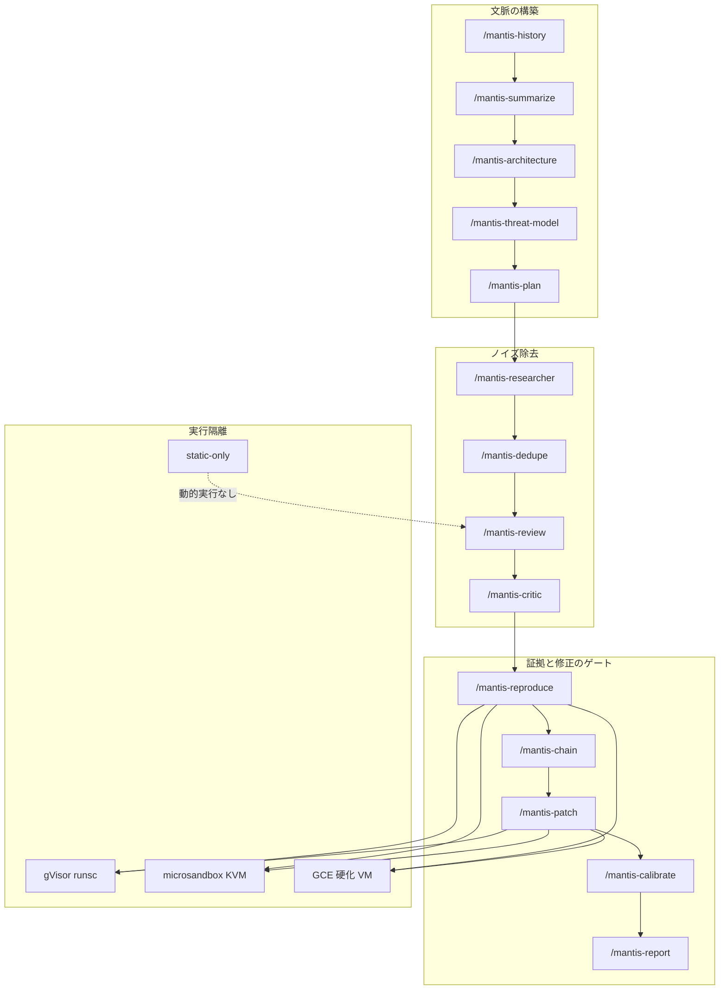

コーディングエージェントにセキュリティレビューを任せると、指摘はすぐ増えます。増えた指摘をそのままチケットにすると、開発者のキューは偽陽性で埋まります。Google が 2026-09-03 時点で公開している [Mantis](https://github.com/google/mantis) は、この問題への答えを「レビューを増やすこと」にしていません。再現条件と受入基準を満たしたものだけを開発者へ渡す、というゲートの作り方を示しています。

公開物は単一の SaaS ではありません。スキルキット、`schema.json` の契約、ADK 参照ハーネス (`reference/`) です。ライセンスは Apache-2.0 です。Google はこれを「内部で機械速度の発見・修正に使うアプローチの一部」として出しています。同時に、公開物は **core skills の概念実証** であり、内部の full-fledged 版とは別物だと明言しています。README 末尾は公式サポート外・デモ用途・本番非意図です。全 finding は報告前にセキュリティ専門家の手動検証が必須です。

この記事では、次の 4 点を扱います。

- Mantis OSS がつなぐ段階契約と、開発者へ渡す 3 つのキュー
- 公開版と Google 内部版の差
- 動的再現の隔離 backend と、修正後の `VERIFIED_SECURE`
- 発注側が今決めるべきゲートの所有

対象読者は、AI レビューを開発プロセスへ入れるかを判断する立場の方、およびセキュリティ品質ゲートを設計する方です。

*この記事の全体像。以下、順に解説します。*

## Mantis は何を公開したのか

起点は Google Cloud ブログ [Getting started with the Mantis harness to find and fix bugs](https://cloud.google.com/blog/products/identity-security/getting-started-with-the-mantis-harness-to-find-and-fix-bugs) です。2026-09-03 時点の HTML は `September 3, 2026` を返します。検索インデックスは 2026-09-02 を返すことがあります。日付の揺れはありますが、公開物の位置づけは同じです。

公開リポジトリは「開始点」です。推奨は 2 つです。

- 人間が curated した文脈を与える
- 再現用サイバーサンドボックスと **vulnerability acceptance criteria** を自前で持つ

受入基準は同梱完成品ではありません。外部 PR は受け付けません。採用は fork と自前運用が前提です。

真陽性対策の公式説明は 4 点です。

- critic / review
- リポジトリ履歴
- 階層セキュリティ要約木
- サンドボックス再現による grounding

naive な分散 AI スキャンの真陽性率は **7% 未満** です。これは Google 公式の説明です。Mantis OSS 自身の TP 率ではありません。階層要約木は、大規模リポジトリの構造文脈を残したうえで、トークン overhead を **85% 超削減** したと公式が述べます。測定条件の表はブログ本文にありません。効果量は公開測度として弱いです。

公開されたスキャン契約に言語 allowlist（閉集合）はありません。stack-agnostic と説明されます。既定は web/cloud アプリです。RTL / IaC / ML / ファームウェアへ適応可能、と文書化されています。

## 品質ゲートの本体はモデルではなくディスク契約である

品質ゲートの本体は「モデル」ではありません。ステージ間のディスク契約です。finding JSON が状態を持ち、後段は前段の status を機械的に消費します。

パイプラインは順次ステージです。履歴抽出、階層要約、脅威モデル、調査、重複排除、review、critic、reproduce、chain、patch、calibrate、reflect、report です。

開発者へ渡す経路は、作者契約では単線ではありません。

| キュー | 条件 | 扱い |
|---|---|---|
| 開発者修正キュー | `repro_status = reproduced` かつ専門家確認。パッチまで求めるなら `VERIFIED_SECURE` | 再現手順と到達証拠付きで実装へ渡す |
| 専門家調査キュー | `statically_confirmed`、再現不能だが VALID 寄りの指摘、exploit chain の静的確認 | 自動再現できない真陽性を落とさない |
| 棄却 | `FALSE_POSITIVE` 等、レビューが明確に否定したもの | チケット化しない |

再現失敗は偽陽性の証明ではありません。再現成功は全環境での exploitable 証明でもありません。作者自身がそう書いています。人間のセキュリティ専門家確認は全キュー共通の必須条件です。

再現は Tier-1/2 を `reproduced` にできません。public API 相当の Tier-3 と到達証拠が要ります。パッチは、PoC バイトだけを塞ぐ過剰適合を、変異再攻撃で潰す設計です。

## 公開版と内部版は別物である

Getting started ブログが案内するのは公開リポです。内部で顧客を守る full-fledged 版とは別レイヤです。差は次の表に落ちます。

| 軸 | 公開 OSS (`google/mantis`) | Google 内部（CISO Perspectives 2026-06-30） |
|---|---|---|
| 位置づけ | core skills を概念実証として公開。デモ。本番非意図 | full-fledged 版が顧客を守る、と記述 |
| オーケストレーション | 手動 slash / meta-agent / ADK `reference/` | Strategist / Research / Dedup / Review / Critic の協調 |
| 再現 | スキル指示 + 参照実装のコンテナ/VM | Reproduction sandbox が PoC を隔離実行してから開発者へ |
| 修正検証 | PoC 再実行 + benign control + 変異 3 件以上 | Evaluation agent が再コンパイルとテストの回帰ループ。通ったものだけ人間レビューへ |
| 周辺 | 公開スキルに fuzz 自動生成や ASPM は含まれない | self-healing fuzz、200 超の security requirements カタログ、ASPM、CodeMender / AI Threat Defense と並置 |
| サポート | 公式製品ではない。OSS VRP 対象外 | 内部 SLO 付きの脆弱性追跡 |

Mandiant の AVDH（Agentic Vulnerability Discovery Harness）も別レイヤです。2026-08 の Mandiant ブログは、human expert review と dynamic PoC を続け、CodeMender との二層、製品としては AI Threat Defense を案内します。AVDH が例示した [CVE-2026-13242](https://nvd.nist.gov/vuln/detail/CVE-2026-13242) / [CVE-2026-55803](https://nvd.nist.gov/vuln/detail/CVE-2026-55803) は NVD 上 Drupal 系です。**google/mantis OSS の成果としては記載されていません。**

内部の 4 教訓（2026-06-16）は、成果の条件を「専門家 + ハーネス + モデル」と書きます。2 つしか選べないなら **expertise と harness** を取れ、と明言します。モデル単体の増強ではありません。

公開 Issue も、この差を補強します。

| 番号 | 状態 | 内容 |
|---|---|---|
| [google/mantis#2](https://github.com/google/mantis/issues/2) | closed | インストール後、README の手動パイプラインが起動せず利用不能に見えた。メンテナは ADK `reference/` を案内 |
| [google/mantis#3](https://github.com/google/mantis/issues/3) | closed | fixture corpus と公開 precision/recall を提案。外部貢献は拒否。メンテナは `reference/` の初期 ADK eval を認め、改善不足とした |

公開 TP 数値は依然ありません。star 数は変動メトリクスです。2026-09-03 の `gh repo view` では約 870 です。default branch 最新コミットは 2026-08-28 です。

## 対応言語は契約上 stack-agnostic である

公開ドキュメントにスキャン言語の allowlist はありません。内部に非公開の対応表があるかは未確認です。

- リポジトリ説明は **stack-agnostic**
- 既定スキルは typical web/cloud の汎用欠陥、ビジネスロジック、認可
- 適応先として Hardware/RTL（SystemVerilog, VHDL）、IaC、ML（例: Pickle）、コンパイル済みバイナリ/ファームウェア（QEMU 等）を列挙
- 再現スキルは Python PoC、C 再現、raw payload、C/C++ の ASan/UBSan を例示する。言語ゲートではない
- 参照サンドボックスの Docker イメージは `python:3-slim`。ネットワーク無しのため、対象依存関係はイメージに焼き込む必要がある

最後の点は **実行イメージの制約** です。スキャン契約の言語制限ではありません。

「対応言語は何か」への正確な答えは次です。公開契約は stack-agnostic と書かれ、動的再現はオペレータがランタイムを用意したスタックに限ります。すべての言語を標準状態で扱える証明ではありません。

## 隔離はスキルを読ませただけでは契約にならない

動的実行サンドボックスは 4 つの backend family です。設定 alias を含めると `static-only` / `static` / `gvisor` / `microsandbox` / `gce` です。実装は `reference/core/environments/` です。README_AGENTS の `core/sandboxes/` 表記は古いです。

強度は「スキルを読ませただけ」と「決定論ハーネスが強制する」で段差があります。

| 段 | 動的実行 | 隔離の実体 | ネットワーク |
|---|---|---|---|
| static-only | なし | no-op。`execute` は exit 127 | 該当なし |
| gVisor (`runsc`) | あり | OCI + ホスト FS 非マウント。`/workspace` のみ | `--network=none` |
| microsandbox | あり | libkrun / KVM。`/dev/kvm` 必須 | `Network.none()` |
| GCE | あり | 短命 VM、private VPC、DNS blackhole、IAP、Shielded VM、IAM トークン抑制 | 外部インターネット無しが要件 |

スキル文面は host 実行禁止を命じます。メモリ安全性 PoC はネットワークと書き込みを極力封じます。ロジック/認可テストは **ローカル** サービスを許しますが、外部インターネットは禁止です。

作者免責は明確です。エージェントは手順を飛ばし得ます。指示は **absolute guarantee of safety ではない** です。専用隔離 VM を優先せよ、と書かれます。unattended は硬化 GCE（または同等）が STRICT REQUIREMENT です。理由は host-level prompt injection と単純な誤操作です。

一次資料は 4 backend を強度の線形順位としては定義していません。隔離の種類（コンテナ / microVM / 硬化 VM）と、ネットワーク無し・ホスト FS 非マウントなどの不変条件で選びます。

現場の含意は単純です。skills を対話エージェントに読ませるだけでは隔離は契約になりません。実行をハーネス側で強制したときだけ、隔離は品質ゲートの前提になります。動的実行が要るなら static-only ではなく gVisor、microsandbox、または硬化 GCE を脅威モデルに応じて選びます。対話エージェントの yolo は使いません。

## 「直った」は製品テスト全通過ではない

OSS の「直った」は、対象アプリの既存回帰テスト一式の自動実行ではありません。契約は次に狭いです。`VERIFIED_SECURE` に必要なものは `schema.json` / `mantis-patch` / README_AGENTS に書かれます。

1. 未パッチ snapshot で PoC が **到達証拠付き** で発火する
2. パッチ後ビルドが exit 0
3. benign（非攻撃）入力が sink に到達し、クラッシュしない。パッチがハーネスを壊していないことの証明
4. 攻撃入力がパッチ後に発火しない
5. 独立した `--reattack` が、境界をずらした **有効変異 3 件以上** を全て失敗させる。空配列や 3 未満は `VERIFICATION_INCOMPLETE`
6. HALT（snapshot を pin できない）では `VERIFIED_SECURE` を出さない

出さないものもあります。

- 対象アプリの既存回帰テスト一式の自動実行は、スキル必須成果物として書かれていない
- exploit chain の E2E 再現スクリプトは書かない。構成要素の個別再現のみ。chain は constituent が reproduced **または statically_confirmed** なら静的確認扱いになり得る
- `statically_confirmed` の finding は `VERIFIED_SECURE` 対象外。`MITIGATION_PROPOSED`
- バイナリ/ファームウェアはコードパッチせず mitigation 提案に落とす

内部版の Evaluation agent（再コンパイル + tests）は、公開スキル契約より広いです。OSS を内部と同じ回帰ゲートだと思わないでください。

Getting started は、クラッシュしてよいバグを直すな、といった **組織固有の受入基準** をパイプラインへ入れよと書きます。受入基準は Mantis が代わりに決めてくれません。

## 採用判断はゲートの所有に落ちる

Mantis OSS は、**証拠生成と再現試験を品質ゲートにする設計の参照実装** として読むべきです。そのまま本番の脆弱性管理製品として載せる対象ではありません。

支持できる点は一次ソースと整合します。

- 公式ブログが critic / review、履歴、階層要約、sandbox grounding を naive スキャンの対として置く
- ステージ契約と schema が「researcher の文章」ではなく JSON 状態機械になっている
- 再現は到達証拠付きの Tier-3 を要求する
- パッチは過剰適合を変異再攻撃で潰す
- Getting started が組織固有の受入基準をパイプラインへ入れよと書く
- Google 自身の OSS VRP 運用も、低品質な AI 報告を証拠バーで切る方向と理念が一致する

二次情報として、[InfoWorld 2026-03-20](https://www.infoworld.com/article/4148197/stop-using-ai-to-submit-bug-reports-says-google.html) は OSS-Fuzz 再現や merged patch を例示します。bughunters 本文は JS 依存のため、本記事では一次全文未照合です。

反証も同じ一次ソースから取れます。

- 「本番で現場採用できる完成ゲート」は、README の demonstration / not for production と正面衝突する
- OSS は core skills のデモ。内部 full-fledged とは別、と CISO が書く
- 手動のセキュリティ専門家検証が必須。再現ゲートは人間を置換しない
- 再現失敗 ≠ 偽陽性。再現成功 ≠ 常に exploitable。ゲートは閉じない
- サンドボックス指示に絶対保証は無い
- chain は E2E 非再現
- Mantis OSS 固有の TP / precision / recall は未公開。公開の 7% 未満は naive スキャンの話
- 外部 PR 不受理

日本語の google/mantis 固有批判は、2026-09-03 時点では見つかりませんでした。これは負の結果です。未検証の支持ではありません。

「内部でこの exact prompt が実脆弱性を見つけた」はブログ主張です。件数・言語・再現率は非公開です。200 超の security requirements は内部設計レビューの話であり、OSS Mantis の機能一覧ではありません。

本番スキャナとしての一括導入はブロックします。参照アーキテクチャとしての読みと、チケット化ゲートの設計はブロックしません。逆転条件は 2 つです。

- Google が OSS を公式サポート製品に格上げし、公開 eval と本番 SLA を出したとき
- 自組織が fork 上で golden corpus と隔離強制ハーネスを計測済みにしたとき

発注側が今決めるべきは、ツール導入の可否よりゲートの所有です。

1. **AI 指摘をチケット化しない。** 受入は最低でも (a) 再現手順、(b) 到達証拠、(c) 組織の vulnerability acceptance criteria、(d) セキュリティ専門家の確認
2. **OSS Mantis を本番ワーカーにしない。** skills は契約の見本。実行は決定論ハーネス側で sandbox を強制する
3. **動的実行には隔離 backend を選ぶ。** static-only は発見まで。再現とパッチ検証は gVisor、microsandbox、または硬化 GCE。unattended はネットワーク無し VM + 最小 IAM
4. **「直った」の定義を `VERIFIED_SECURE` 相当に固定する。** 変異 3 件と benign control を欠くパッチは開発者キューに入れない
5. **内部 Google と同等を期待しない。** fuzz 自動生成、ASPM、CodeMender、AVDH は別レイヤ。足りない部分は既存 SAST/DAST と人間レビューで埋める

直近の次のアクションは 3 つです。

1. 自組織の「直さなくてよいバグ」（例: ユーザー自身のクラッシュ）を 1 枚の受入基準に書く
2. 既存 AI レビュー出力を振り分ける。再現と到達証拠があるものだけ開発者修正キューへ。それ以外の有力指摘は専門家調査キューへ残す。`FALSE_POSITIVE` のみ棄却する
3. `google/mantis` は設計読書用に clone する。本番スキャンは `reference/` 相当の強制サンドボックスが揃うまで開始しない

## まとめ

Mantis OSS は、AI コーディングエージェント向けのセキュリティレビュー skills 一式です。公開物は概念実証であり、本番の脆弱性管理製品ではありません。品質ゲートの本体はモデルではなく、finding JSON の状態機械とサンドボックス再現です。開発者へ渡すのは `reproduced`（必要なら `VERIFIED_SECURE`）と専門家確認を満たしたものだけです。再現失敗は偽陽性の証明ではなく、再現成功も常に exploitable の証明ではありません。隔離はスキルを読ませただけでは契約にならず、ハーネス側で強制したときだけ前提になります。「直った」は製品テスト全通過ではなく、到達証拠・benign control・変異 3 件以上の再攻撃失敗です。発注側が今決めるのはツール導入の可否ではなく、チケット化ゲートの所有です。

この記事が少しでも参考になった、あるいは改善点などがあれば、ぜひリアクションやコメント、SNSでのシェアをいただけると励みになります！

## 参考リンク

一次:

- [Getting started with the Mantis harness to find and fix bugs](https://cloud.google.com/blog/products/identity-security/getting-started-with-the-mantis-harness-to-find-and-fix-bugs)
- [Cloud CISO Perspectives: How Google Cloud security uses AI internally](https://cloud.google.com/blog/products/identity-security/cloud-ciso-perspectives-how-google-cloud-security-uses-ai-internally/)
- [Cloud CISO Perspectives: The 4 lessons that guided AI Threat Defense](https://cloud.google.com/blog/products/identity-security/cloud-ciso-perspectives-the-4-lessons-that-guided-ai-threat-defense)
- [google/mantis](https://github.com/google/mantis)
- [README.md](https://raw.githubusercontent.com/google/mantis/main/README.md)
- [README_AGENTS.md](https://raw.githubusercontent.com/google/mantis/main/README_AGENTS.md)
- [mantis-reproduce/SKILL.md](https://raw.githubusercontent.com/google/mantis/main/mantis-reproduce/SKILL.md)
- [mantis-patch/SKILL.md](https://raw.githubusercontent.com/google/mantis/main/mantis-patch/SKILL.md)
- [schema.json](https://raw.githubusercontent.com/google/mantis/main/schema.json)
- [Staying ahead of adversarial AI through agentic source code review](https://cloud.google.com/blog/topics/threat-intelligence/staying-ahead-of-adversarial-ai-through-agentic-source-code-review/)
- [CVE-2026-13242](https://nvd.nist.gov/vuln/detail/CVE-2026-13242)
- [CVE-2026-55803](https://nvd.nist.gov/vuln/detail/CVE-2026-55803)
- [google/mantis#2](https://github.com/google/mantis/issues/2)
- [google/mantis#3](https://github.com/google/mantis/issues/3)

二次:

- [InfoWorld, 2026-03-20, Stop using AI to submit bug reports, says Google](https://www.infoworld.com/article/4148197/stop-using-ai-to-submit-bug-reports-says-google.html)
- [heise online, 2026-07-19, Googles cleverer KI-Schachzug](https://www.heise.de/hintergrund/Googles-cleverer-KI-Schachzug-oder-wer-kontrolliert-zukuenftig-den-KI-Markt-11368887.html)
