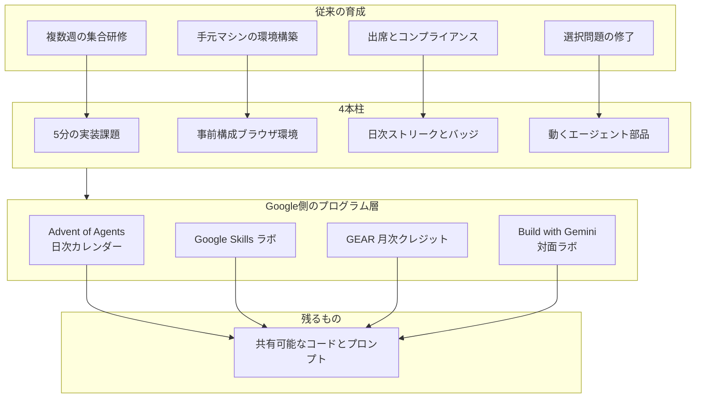

2026年9月19日、Google Cloud Consulting は企業の生成AI育成を、週単位の集合研修から1日5分の実装課題へ置き換える4本柱を公式ブログで示しました。
著者は Ryan Faris（Head of Agentic Transformation, Delta）と Enrique Chan（Product Manager, Delta）です。
ここでの Delta は航空会社ではなく、Google Cloud Consulting 内の戦略・変革チームです。
根拠プログラムは [Advent of Agents](https://adventofagents.com/) です。
同じ記事は隣接経路として、[Build with Gemini](https://cloud.google.com/events/build-with-gemini-2026) ワークショップ、[Gemini Enterprise Agent Ready（GEAR）](https://developers.google.com/program/gear)、[Google Skills](https://www.skills.google/) のハンズオンラボを案内します。

この記事では、4本柱が何を動かすか、公開数値の読み方、日本でいま使える公式経路を一次資料に沿って整理します。
読み終わると、育成KPIを修了率だけに置かない設計と、事前構成環境の製品名を決める判断ができます。

:::message
ブログ掲載の整数4件は Advent of Agents の Google Analytics 指標として自己申告されています。イベント定義と計測期間は公開されていません。
:::

*この記事の全体像。以下、順に解説します。*

## AI育成の日次ハーネスとは

対象は育成の実行ハーネスです。
人がカレンダーに研修を置くのではなく、短い実装課題、用意済み環境、反復の合図、動く成果物の4つを日常の作業時間に差し込みます。

Google Cloud Consulting の公式ブログ [How to upskill enterprise AI builders by using daily micro habits](https://cloud.google.com/blog/topics/consulting/upskill-your-ai-using-daily-micro-habits) が示す4本柱は次です。

1. 1スキル1課題の5分ハンズオン。例はモデルとDBスキーマの接続、構造化出力の検証です
2. 事前構成済みのブラウザ Sandbox。ローカルインストールと資格情報申請を外す、という設計です
3. 日次ストリーク、バッジ、チーム比較
4. 選択問題ではなく、デプロイ可能なエージェント部品と再利用コード

根拠プログラム Advent of Agents の公開情報は次です。

| 項目 | 内容 |
|---|---|
| Season 1 | 25日、2025年12月。公式ハブ [adventofagents.com](https://adventofagents.com/) |
| Season 2 | 31日、2026年3月。公式ニュースレターで Always Kata を再掲。5分以内にデプロイ、と書く |
| 技術スタック | Gemini、Agent Development Kit（ADK）、Vertex AI Agent Engine、Agent Starter Pack |
| Season 1 Day 1 の公式コピー | One feature, under 5 min to try。Copy-paste commands that actually work |

ブログ掲載の Advent 指標は次です。出典注記は Advent of Agents Google Analytics metrics です。

| 指標 | 値 |
|---|---|
| 参加者 | 150,000+ |
| ブラウザ環境でのコード実行 | 859,000+ |
| 日次再訪 | 31% |
| 動くエージェント部品を作った参加者 | 32,000+ |

隣接する実行経路は、柱と1対1ではありません。

- Advent of Agents は日次カレンダーです
- Google Skills / GEAR はクレジット付きラボです。GEAR は Google Developer Program 内のメンバーシップで、Google Skills 上で月35学習クレジットを使えます
- Build with Gemini 2026 はハンズオンです。no-code / low-code / code-first のトラック分けがあります。東京はハイブリッドで 2026-09-03/04 に開催済みです

育成用のブラウザ環境と、エージェントが生成したコードを隔離する本番 Sandbox（GKE Agent Sandbox、Agent Substrate、Cloud Run sandbox）は別レイヤです。
後者は本記事の対象外です。

4本柱はブログの対比表そのものです。
プログラム層は隣接する実行経路です。

## 注意点

ブログは到達宣言と4つの整数を並べています。
読者が信じてよい範囲は、次に限られます。

### 数値の出所は Google Analytics の自己申告である

150,000+ / 859,000+ / 31% / 32,000+ は、記事本文で Advent of Agents Google Analytics metrics と注記されています。
公開ダッシュボード、イベント定義、計測期間、Season 1 のみか累積かは書いていません。
サイト JS には Firebase Analytics `G-BNZP6MZPE6` があります。
859,000+ と 32,000+ と 31% は、このブログ以外の一次資料では出ていません。

150,000+ は「参加」の言い換えが時期で揺れます。

| 時点 | 文言 | ソース |
|---|---|---|
| 2025-12-26 | 100k+ AI developers | Shubham Saboo（Google Senior AI PM）の X |
| 2026-02-27/28 | over 150,000 of you joined us for the first season | 公式ニュースレター |
| 2026-09-19 | 150,000+ developers participated across global teams | Consulting ブログ |

joined と participated と builders の定義は公開されていません。
ニュースレター購読は Enrique Chan の LinkedIn で 4k+ と別規模です。

未解決の問いは次です。

- 859,000+ 実行はページビューか、ラボ start か、`adk web` か
- 31% の分母は全 150k か、1回以上実行した人か。連続日か、期間中の平均日次アクティブか
- 32,000+ の working 判定
- Advent 埋め込み runner の製品名
- Season 3 の有無。OG 画像ファイル名は `screenshot-season3.png`。JS カレンダーは Season 1 / Season 2 のみです

### 31%は業界平均の3倍、という比較は指標が違う

ブログは日次再訪 31% を、Vocaliv の self-paced tech 約10% と MOOC 5%から15% に掛けています。
リンク先 [Vocaliv 2026-08-12](https://blog.vocaliv.com/course-completion-rate-benchmarks-by-industry/) はコース修了率です。
上流は zahan.ai の合成です。edtech ベンダーブログであり、一次の業界統計ではありません。

| 数字 | 指標 | 出典 |
|---|---|---|
| 31% | 日次再訪。定義なし | Google Cloud Blog 2026-09-19 |
| 約10% | テック自己学習の修了 | Vocaliv |
| 5%から15% | 無償 MOOC の修了 | Vocaliv |
| 中央値 12.6%。範囲 0.7%から52.1% | MOOC 修了。2013年までのコース | Jordan 2015, IRRODL, [DOI 10.19173/irrodl.v16i3.2112](https://doi.org/10.19173/irrodl.v16i3.2112) |

再訪率と修了率は同じ KPI ではありません。
3倍の算術は、指標を同一とみなしたときにしか成立しません。

### 5分学習の出典は2015年調査の日割りである

ブログは HBR 2019（Bersin / Zao-Sanders）を、知識労働者が公式学習に1日5分、と引用します。
HBR 本編はペイウォールです。
Scholar キャッシュは次の文を持ちます。On average, knowledge workers carve out just five minutes for formal learning each day.
Bersin 自身の 2018年記事は、2015年に 700+ 組織を調べ、公式学習は週24分、と書いています。
週24分を5日で割ると約4.8分になります。
Bersin 本文は営業日とは書いていません。
2026年の実測ではありません。

### Sandboxは製品名が無い。資格情報不要は字義どおりではない

ブログは pre-configured, managed cloud environment と no credentials to request と書きます。
Advent サイトの埋め込み runner は、公開情報からは特定できていません。
近傍の公式経路は次です。

- Google Skills ラボ: Start Lab で一時 student 資格情報を発行します。[Help](https://support.google.com/qwiklabs/answer/9127466) は、個人アカウントでラボ GCP に入るな、と書きます
- Cloud Shell: 初回に Authorize して自分の資格情報を使います。組織が無効化できます。週50時間。SLA はありません
- Firebase Studio: Agent Starter Pack の zero setup リンク先です。公式ドキュメントは 2026-06-22 以降の新規 workspace / signup 停止、2027-03-22 sunset を掲げます
- ADK 公式 Quickstart: `GOOGLE_API_KEY` または Vertex の ADC が必要です

Season 1 Day 6 は Antigravity / Gemini CLI / Cursor / Firebase Studio を列挙します。
専用ホスト IDE 必須とは書いていません。
Enrique Chan の LinkedIn は、copy-paste して 300秒で結果が見えなければ Kata ではない、と書きます。
カレンダー JSON には 300秒はありません。

非公式クローン（例: `anxiong2025/25-Day-Agents-Course-by-Google`）は `.env` に `GOOGLE_API_KEY` を置くローカル実行です。
公式 runner の反証にはなりません。
参加者がローカル経路を選んだ事実ではあります。

[Agent Starter Pack](https://github.com/GoogleCloudPlatform/agent-starter-pack) は公式に Firebase Studio と Cloud Shell のゼロセットアップリンクを持ちます。
スター数は約 6.6k です（2026-09-21、`gh repo view`）。

### 動く部品32,000+は実務転移の証明ではない

working agent components の判定（サンドボックス成功、Agent Engine デプロイ、YAML コピー）は未定義です。
チーム共有ライブラリへの蓄積、本番エージェントの継続利用、Kirkpatrick の行動変容は一次ソースにありません。

隣接する L&D 文献は転移の低さを別指標で示します。
McKinsey 2023 は corporate learning の10%しか効果的でない、と書き、出典を HBR のメタ分析に付けています。メタ分析本文は未取得です。
HBR 2019-10（Glaveski）の転載本文には、L&D で学んだスキルを仕事に使う従業員は12%とあります。live HBR ティーザーでは未確認です。本文はペイウォールです。
Advent of Agents 固有の転移率ではありません。

カレンダー形式の脱落は、別プログラムの公式統計が参考になります。
Advent of Code 2024 の公開 stats（2026-09-21 取得、遅参を含む累積）は、Day 1 gold 268,375 に対し Day 25 gold 17,563 で約 6.5% です。
別イベントであり、当日脱落率ではありません。
AoA の日次表は非公開です。
AoA のコミュニティ苦情コーパス（Reddit / X）は、キーワード検索では見つかっていません。

### ベンダー中立の育成キットではない

カレンダーと kata は Gemini / ADK / Agent Engine 上で動きます。
著者は Consulting の Delta チームです。
CTA は Build with Gemini と GEAR です。
GEAR Get Certified は Google Cloud 顧客の Workspace 会社メール限定で、最長9週、週9時間以上です。
5分日次とは別物のコホートです。

ADK Web には、ブラウザでエージェントを動かす経路に紐づく脆弱性があります。

| ID | 内容 | 影響条件 | 修正 | 一次 |
|---|---|---|---|---|
| CVE-2026-4810 | 未認証のコード実行 | google-adk 1.7.0 以上 1.28.1 未満、および 2.0.0a1 以上 2.0.0a2 未満。Python OSS / Cloud Run / GKE。ローカル ADK Web も含む | 1.28.1 / 2.0.0a2 | [GitHub Advisory GHSA-rg7c-g689-fr3x](https://github.com/advisories/GHSA-rg7c-g689-fr3x) |
| CVE-2026-79696 | adk web のコードインジェクション | ADK Python 2.0.0 以上 2.7.0 未満。pytest が入っている環境で、細工した test session replay | 2.7.0 | [NVD](https://nvd.nist.gov/vuln/detail/CVE-2026-79696)（2026-09-09、Source: GoogleCloud） |

育成ラボを社内に常時公開する設計では、バージョン固定と公開面の制限が別問題になります。

### 日本公式は日次5分モデルを抄訳していない

`https://cloud.google.com/blog/ja/topics/consulting/upskill-your-ai-using-daily-micro-habits` は 2026-09-21 時点で 404 です。
日本語公式が厚いのは Google Skills（サンドボックスラボ、連続記録、月35クレジット）と GEAR と Build with Gemini Tokyo（2日、各日午後）です。
2025年12月のホリデー記事は Advent of Agents に触れず、Skills カタログを推しています。
Zenn 協賛の Agentic AI Hackathon は、リモート参加者にトレーニング環境をご自身でご準備、と書きます。
セットアップ除去は現地サポート付きのときに限ります。

## 4本柱と既存プログラムはどう対応するか

時間単位、環境、計測、成果物を横に置くと、対象の違いが見えます。

| 基準 | 従来の集合研修 | Advent of Agents | GEAR / Google Skills | Build with Gemini |
|---|---|---|---|---|
| 時間単位 | 複数日〜複数週 | 公式に5分 / 1日 | ラボは1時間前後が典型。Get Certified は週9h+ | 半日〜2日 |
| 環境 | 受講者のマシン | ブログはブラウザ。製品名なし | 一時資格情報 + 実 GCP | ハンズオンラボ。東京はハイブリッド。リモートは自己準備の例あり |
| 計測 | 出席、修了、資格 | GA の参加・実行・再訪・部品 | クレジット消費、バッジ、連続記録 | イベント参加 |
| 成果物 | テスト得点 | 動くエージェント部品、という宣言 | スキルバッジ、ラボ完了 | その場のエージェント |
| 形式 | 集合 | 日次カレンダー | カタログ学習 | ハンズオン。東京はハイブリッド |
| 日本公式 | 従来どおり厚い | 抄訳なし。Developer Advocate 個人が英語ハブを案内 | 抄訳・FAQ・パスが厚い | Tokyo 2026-09-03/04 実施 |
| 向き | コンプライアンス、資格 | 習慣化の実験 | カタログ学習と社内リーダーボード | 集中ハンズオン |

4本柱は、予定とセットアップを外し、短い実装を毎日残す、という骨格で一貫しています。
Advent of Agents の公開数値は、その習慣化を Google 自身の GA スナップショットとして示します。
実務への転移、業界平均との3倍比較、資格情報ゼロは、一次ソースでは支えられません。

支持できる点は次です。

- 公式対比表が、時間・環境・動機づけ・成果物の4点を同時に動かしています
- Season 1 Day 1 の公式コピーは One feature, under 5 min to try です
- Season 2 公式ニュースレターは Always Kata を deployed in under 5 minutes と再掲します
- Google Skills は日本語でもサンドボックス環境と学習の連続記録を公式に持ちます。柱2と柱3の実装は Advent 以外にもあります

数値の3倍、15万人の成功、は記事の根拠としては使えません。

## 発注側は何を測り、何を完了条件にするか

発注側が取るべきは、Google のカレンダーをコピーすることではありません。
計測の置き場を変えることです。

研修 KPI を修了率だけに置かない、が第一です。
反復参加、実行回数、残った成果物を並記します。
成果物は、リポジトリに残るコード、プロンプト、エージェント定義です。

5分は壁時計の SLA として書きます。
copy-paste して結果が出るまでの上限にします。
資格取得や本番設計の単位には使いません。

成果物を作った人数で終わらせません。
共有ライブラリへの取り込み、レビュー、本番リポジトリへの残存を完了条件にします。

4本柱の採用可否は、自組織で反復参加・実行回数・成果物の残存を測れるかどうかに依存します。
ブロック要因ではありません。
公開数値への確信度は下がります。

逆転条件は、Google が GA のイベント定義と期間を公開し、転移（本番デプロイまたは30日後の再利用）を別指標で出したときです。
そのときは 31% 再訪を習慣化の上限ではなく、参加の入口として再評価します。

## 日本でいま使える公式経路は何か

日本で今ある公式経路は GEAR + Google Skills + イベントです。
Advent of Agents は英語ハブとして残ります。
抄訳待ちを前提にしません。

GEAR Get Certified は週9時間以上、最長9週のコホートです。
日次5分の kata とは別物として扱います。
会社メールと顧客条件を満たすかを先に確認します。

Build with Gemini Tokyo は2日、各日午後のハイブリッドでした。
リモート参加は自己準備の例があります。
セットアップ除去を全経路の前提にしない、が実務上の境界です。

日本語の日次運用コストは、公開一次資料では裏付けが薄い領域です。
英語ハブを社内に案内する場合は、カレンダーの言語、資格情報の申請経路、成果物の保存先を別途決めます。

## 育成環境と本番隔離をどう分けるか

事前構成環境は製品名を決めます。
Skills ラボ、Cloud Shell、社内 Dev Container のどれかを明示します。
資格情報ゼロ、とは書きません。
一時資格情報か、組織が許可した Cloud Shell かを書きます。

育成環境と本番隔離は分けます。
GKE Agent Sandbox の密度数字（例: 毎秒300 sandbox）を kata の300秒と混ぜません。

社内に育成ラボを常時公開する設計では、ADK Web の版を固定し、公開面を制限します。
CVE-2026-4810 は未認証のコード実行、CVE-2026-79696 は pytest が入った環境でのコードインジェクションです。
どちらも修正版があります。
未修正のままブラウザ経路を社内公開しない、が完了条件です。

セキュリティ境界を含む社内展開は、公開一次資料では裏付けが弱い領域です。
Google のカレンダーをそのまま社内標準にしない理由になります。

## まとめ

Google Cloud Consulting が示したのは、集合研修を日次の実装課題へ置換する4本柱です。
短い課題、用意済み環境、反復の合図、動く部品です。
根拠プログラムは Advent of Agents です。
隣接経路は Google Skills、GEAR、Build with Gemini です。

公開数値は Google Analytics の自己申告です。
再訪31%を修了率の3倍と読む比較、資格情報不要、動く部品3.2万の実務転移は、一次ソースでは支えられません。
日本公式は日次5分モデルを抄訳しておらず、いま厚いのはクレジットラボとイベントです。

発注側の判断は、カレンダーの複製ではなく計測の置き場です。
反復参加、実行回数、残った成果物を並記し、事前構成環境の製品名と資格情報の種類を明示します。
育成ラボと本番隔離は分け、ADK Web の版を固定します。

この記事が少しでも参考になった、あるいは改善点などがあれば、ぜひリアクションやコメント、SNSでのシェアをいただけると励みになります！

## 参考リンク

- Google Cloud Blog, 2026-09-19, [How to upskill enterprise AI builders by using daily micro habits](https://cloud.google.com/blog/topics/consulting/upskill-your-ai-using-daily-micro-habits)
- [Advent of Agents](https://adventofagents.com/) / [Season 1 archive](https://adventofagents.com/2025/12/)
- Advent of Agents newsletter, 2026-02-27/28, [Season 2 kickoff](https://groups.google.com/g/advent-of-agents-newsletter/c/eFHyY5X_HNw)
- [GEAR](https://developers.google.com/program/gear) / [Get Certified](https://developers.google.com/program/gear/getcertified)
- [Build with Gemini 2026](https://cloud.google.com/events/build-with-gemini-2026) / [Tokyo Cloud OnAir](https://cloudonair.withgoogle.com/events/build-with-gemini26q3)
- [Google Skills](https://www.skills.google/) / [Skills ラボの一時資格情報](https://support.google.com/qwiklabs/answer/9127466)
- HBR sponsor content, 2026-02-12, [A blueprint for enterprise-wide agentic AI transformation](https://hbr.org/sponsored/2026/02/a-blueprint-for-enterprise-wide-agentic-ai-transformation)
- Bersin, 2018-06-03, [Learning In The Flow of Work](https://joshbersin.com/2018/06/a-new-paradigm-for-corporate-training-learning-in-the-flow-of-work/)
- HBR, 2019-02-19, [Making Learning a Part of Everyday Work](https://hbr.org/2019/02/making-learning-a-part-of-everyday-work)
- Jordan, 2015, [MOOC completion rates revisited](https://doi.org/10.19173/irrodl.v16i3.2112)
- Vocaliv, 2026-08-12, [Course Completion Rate Benchmarks](https://blog.vocaliv.com/course-completion-rate-benchmarks-by-industry/)
- Firebase Studio, [sunset banner](https://firebase.google.com/docs/studio)
- Cloud Shell, [quotas](https://docs.cloud.google.com/shell/docs/quotas-limits) / [SLA](https://cloud.google.com/shell/sla)
- ADK, [Python get started](https://adk.dev/get-started/python/)
- CVE-2026-4810, [GHSA-rg7c-g689-fr3x](https://github.com/advisories/GHSA-rg7c-g689-fr3x)
- CVE-2026-79696, [NVD](https://nvd.nist.gov/vuln/detail/CVE-2026-79696)
- Google Cloud 日本語, [ホリデーの無償 AI トレーニング](https://cloud.google.com/blog/ja/topics/training-certifications/upskill-for-the-holidays-no-cost-ai-training-from-google-skills) / [GEAR 提供開始](https://cloud.google.com/blog/ja/products/ai-machine-learning/gear-program-now-available)
- Agent Starter Pack, https://github.com/GoogleCloudPlatform/agent-starter-pack
