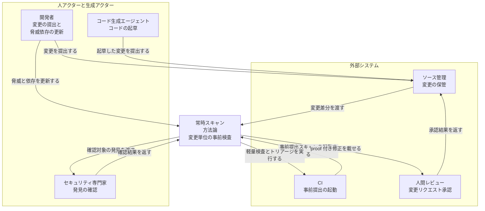
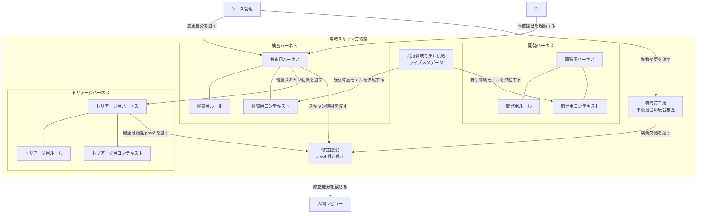
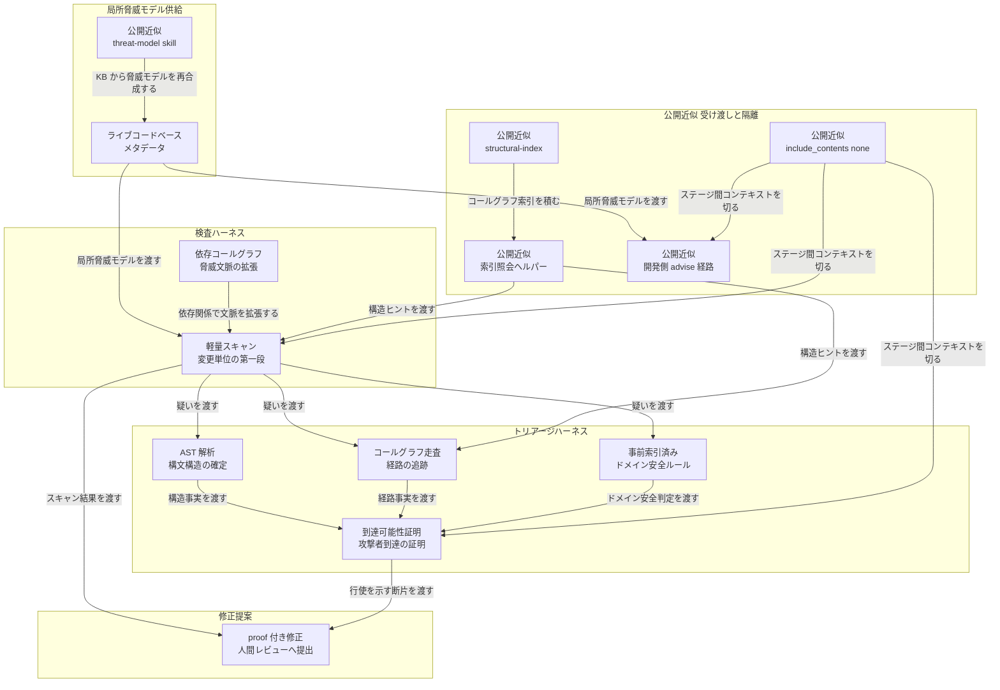
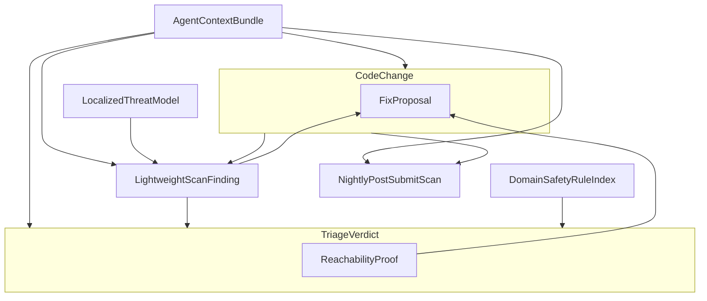
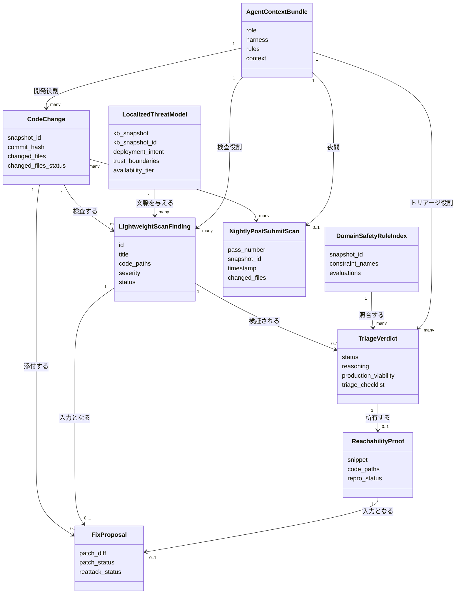

インフラへ載せるコードの各変更を、提出前に機械速度で検査する枠組みを、Google が 2026-09-18 に公開しました。対象はインフラへデプロイする数億行規模のコードです。公式が示す効果量は Google 内部運用の主張であり、公開キットのベンチマークではありません。

この記事では、[Changing the game: Using agentic AI to secure infrastructure code](https://cloud.google.com/blog/topics/systems/using-ai-agents-to-secure-google-infrastructure) が説明する常時スキャン方法論を、構造・データ・公開近似の入口まで整理します。内部運用が正本で、[Mantis](https://github.com/google/mantis) はその近似と公開入口です。著者は Andrés Lagar-Cavilla（Distinguished Engineer）と Parthasarathy Ranganathan（VP, Engineering Fellow）です。

読者が得られるのは次です。

- 開発・検査・トリアージを別ハーネスにする独立性設計
- 変更単位の事前提出と夜間第二層の二層防御
- 公開 OSS で試すときの CLI、workspace 分離、鮮度ゲート


*この記事の全体像。以下、順に解説します。*

## 常時セキュリティースキャンとは

目的は、インフラへ載せるコードの各変更を提出前に検査し、脆弱性がコードベースと本番へ入る前に止めることです。実施主体は Google AI and Infrastructure チームです。公式の効果量は、月あたり数百件の脆弱性がコードベースまたは本番へ到達する前に止まる、という主張です。

産業の従来慣行は、巨大な一回限りのセキュリティースキャンです。そのスキャンは遅く、文脈が薄く、発見時点が提出後に寄ります。本方法論の実行単位は、各コードチェックインの事前提出検査です。検査対象はスタックの全層で、開発者が既に使う提出ツールへ組み込みます。セキュリティは、ルールチェッカーや可読性レビューと同列の継続ルーチンになります。変更単位の方が巨大スキャンより必要文脈が小さく、検査の実効が上がる、と公式は書いています。

防御は二層です。

| 層 | 実行タイミング | 役割 |
|---|---|---|
| 事前提出スキャン | 各チェックイン時、リアルタイム | 変更単位の軽量 AI スキャンと、専門トリアージによる到達証明 |
| 事後提出スキャン | 夜間統合テスト | 複数変更にまたがる欠陥向けの第二層。オフピークの計算資源を使う |

局所脅威モデルの材料は live codebase metadata です。スキャンエージェントは、パッケージとライブラリを横断する dependence call graph で脅威モデル文脈を拡張します。脅威モデルを継続スキャンの一部にすると、開発者が脅威と依存を継続更新する、と Systems ブログは書いています。更新責任の一次記述は、開発者による継続更新までです。専用の配布サービス名は同記事に出ません。

検査の応答は二段です。

1. 軽量スキャンが指摘を出す。
2. 専門トリアージエージェントが、AST 解析、call-graph 走査、pre-indexed domain safety rules で、攻撃者が到達できる経路かをプログラム的に証明する。

トリアージの公式測度は、適合率（precision）92% 超、完了 1 分未満です。偽陽性率は、局所で精密な脅威モデルを使った一部ケースで 3% まで下がった、と主張します。

修正エージェントは、スキャン結果と generated proofs（脆弱性の行使を示すコード断片）から、内部コーディング標準に沿った修正を組み立てます。提出先は、元の変更リクエストの人間レビューです。

起点ブログは、この取り組みで [Mantis](https://github.com/google/mantis) を evolve し、局所脅威モデル群と組み合わせたと書いています。内部常時スキャンが正本です。`google/mantis` は近似と公開入口です。末尾の CTA は、Google Cloud、Gemini Enterprise、Trillium / Ironwood 上の Gemini を「このエージェントパイプラインを支えるプラットフォーム」として挙げます。ハーネス・ルール・コンテキストの分離やトリアージ手順との接続構成までは書いていません。


*公式図。Code Check-in から Pre-submit（脅威モデル、検査、トリアージ、修正提案）を経て Human review、Post-submit の夜間層へ続く。出典: [Using agentic AI to secure infrastructure code](https://cloud.google.com/blog/topics/systems/using-ai-agents-to-secure-google-infrastructure)*

## 特徴

- 実行単位は、各コード変更の事前提出検査です。
- 対象は、インフラへデプロイする数億行規模です。
- 公式の効果量は、月あたり数百件の脆弱性をコードベースまたは本番の手前で止める、です。
- 局所脅威モデルは live codebase metadata を使い、パッケージ横断の dependence call graph で文脈を広げます。
- 脅威モデルを継続スキャンへ入れると、開発者が脅威と依存を更新し続ける、と公式が書いています。
- 応答は二段です。軽量スキャンの後に、AST / call-graph / pre-indexed domain safety rules による到達証明が続きます。
- トリアージの公式測度は、適合率（precision）92% 超、完了 1 分未満です。
- 偽陽性率は、一部ケースで 3% まで下がった、と公式が主張します。
- 第二層は、夜間統合テストの事後提出スキャンです。
- 修正エージェントは generated proofs を材料にし、修正を元 CR の人間レビューへ載せます。
- 原則 1 は、開発・スキャン・トリアージのハーネス、規則、文脈の分離です。軽量 AI と決定論的構造検証を対にします。
- 原則 2 は、既存脅威モデルの投入です。最新の脅威モデルは事前提出スキャンの真陽性率を改善し、チームのセキュリティ態勢の最低水準を引き上げます。
- 原則 3 は、モデル選択よりマルチエージェントハーネスが変動を吸収する、という運用判断です。
- 原則 4 は、人間レビュー付きの自動修正で検出から解消までの時間を縮めることです。

### 関連技術比較

| 項目 | naive AI スキャン | 従来 SAST 一括 | CodeMender 製品 | 本方法論 |
|---|---|---|---|---|
| 実行単位 | リポジトリやファイルを分散して素朴に投げる | コードベース全体、または CI のベースライン一括 | リポジトリ接続のスキャン、検証、修正 | 各チェックインの事前提出。第二層は夜間統合 |
| レイテンシ | 巨大コンテキスト投入に寄り、開発フローから外れやすい | 巨大スキャンは遅く、発見が提出後に寄る | 深掘りスキャンと PoC 検証、パッチ生成を一連で回す | トリアージ完了は 1 分未満（Systems ブログ） |
| 偽陽性対策 | 素朴なモデル推論。真陽性率 7% 未満（CISO / Getting started。naive スキャンの主張） | パターン照合とポリシー | 隔離サンドボックスで PoC を実行してから修正へ進む | 局所脅威モデルと call graph。トリアージが到達を証明。一部ケース FP 3%、適合率（precision）92% 超 |
| 人間レビュー | 指摘の選別を後段で担う | チケット化された指摘をトリアージする | パッチは開発者が手動レビューしてから入れる | 修正を元の変更リクエストの人間レビューへ載せる |
| 公開可否 | 各組織が自前実装できる | 商用および OSS の SAST として流通 | Gemini Enterprise Agent Platform / AI Threat Defense のプレビュー | 内部運用の説明が正本。公開入口は Mantis OSS |

### ユースケース別推奨

| 場面 | 推奨 |
|---|---|
| 数億行規模のインフラコードで、各変更を提出前に止める | 本方法論（事前提出 + 専門トリアージ + 元 CR への修正レビュー） |
| 複数チェンジリストにまたがる欠陥を第二層で拾う | 本方法論の事後提出（夜間統合テスト） |
| 既存リポジトリの深掘り、PoC による悪用証明、テスト済みパッチを製品として回す | CodeMender |
| 自前ハーネスで発見・再現・修正の段階契約を試す公開入口 | Mantis OSS |

### 系譜の差分

| 時点 | 資料 | 実行単位 | エージェント関係 | 本方法論への差分 |
|---|---|---|---|---|
| 2026-06-30 | CISO Perspectives | 設計ゲート、全体スキャン、Fuzz、パッチ、ASPM | 閉ループの 5 ステージ | 全体スキャン中心。200 超 requirements / ASPM は本稼働の必須部品にしない |
| 2026-09-03 HTML / 索引 2026-09-02 | Getting Started（Mantis） | リポジトリ解析キャンペーン | critic / review / sandbox を同一ハーネスで協調 | 公開キットの入口。階層要約・85% 削減はこの段の話 |
| 2026-09-18 | Systems（本方法論の正本） | 各チェックインの事前提出 + 夜間第二層 | 開発 / 検査 / トリアージで harness・rules・context を共有しない | 変更単位。協調キャンペーンから役割分離へ |

### 公開近似との対応

| 内部運用の用語（Systems ブログ） | 公開近似（google/mantis） |
|---|---|
| 開発 / スキャン / トリアージの harnesses, rules, and context 分離 | ADK 参照ハーネスがステージ間で `include_contents="none"` |
| 既存脅威モデルを検査へ渡す | `/mantis-threat-model` の入力は KB のみ。出力は `workspace/kb/THREAT_MODEL.md` |
| 開発者が脅威と依存を更新する | `/mantis-advise` は開発側の読み経路。検査スキルとは別 |
| call-graph 走査 | `/mantis-structural-index` が HINT-only の索引を作る。配布面は `query_structural_index.py` |
| 生きたコードベース | 既定は静的スナップショット。`--sync` オプトインの snapshot-per-pass |

## 構造

登場するのはコンポーネント名と責務です。開発・検査・トリアージは会話履歴を共有しません。局所脅威モデルは共有アーティファクトとして供給します。

### システムコンテキスト図

人アクター、対象の枠組み、ソース管理と CI、人間レビューの関係です。



図のセキュリティ専門家経路は、公開キットを使う場合の追加統制です。内部方法論の一次記述は、修正を元の変更リクエストの人間レビューへ載せる工程です。

#### 人アクターと生成アクター

| 要素名 | 説明 |
|---|---|
| 開発者 | 変更をソース管理へ提出する役割です。局所脅威モデルの脅威と依存を継続更新する役割でもあります。 |
| セキュリティ専門家 | 公開 Mantis の追加統制です。全 finding は専門家の手動検証が必須、と README が書いています。Systems ブログが内部方法論として名付ける工程は、修正を元の変更リクエストでレビューすることです。 |
| コード生成エージェント | コードを起草し、開発者と同じ提出経路へ変更を乗せる役割です。 |

#### 対象フレームワーク

| 要素名 | 説明 |
|---|---|
| 常時スキャン方法論 | 各変更をリアルタイムに事前提出検査する枠組みです。 |

#### 外部システム

| 要素名 | 説明 |
|---|---|
| ソース管理 | 変更リクエストとコード差分を保管する外部システムです。 |
| CI | 開発者が既に使う提出経路上で、変更単位スキャンを起動する外部システムです。 |
| 人間レビュー | 元の変更リクエスト上で、自動修正を含む差分を承認する外部プロセスです。夜間第二層は方法論内部のコンテナです。 |

### コンテナ図

原則 1 をそのまま配置します。開発・検査・トリアージは、それぞれ独立したハーネス・ルール・コンテキストを持ちます。



#### 開発ハーネス

| 要素名 | 説明 |
|---|---|
| 開発用ハーネス | コード起草と提出を駆動する実行枠です。検査・トリアージの実行枠とは別物です。 |
| 開発用ルール | 開発側だけが読む安全な実装指針です。 |
| 開発用コンテキスト | 開発側が読む局所脅威モデルと履歴知見です。 |

#### 検査ハーネス

| 要素名 | 説明 |
|---|---|
| 検査用ハーネス | 変更単位の軽量 AI スキャンを回す実行枠です。 |
| 検査用ルール | 軽量スキャン専用の判定ルールです。 |
| 検査用コンテキスト | 当該変更と、供給された局所脅威モデル、依存コールグラフで拡張した文脈です。 |

#### トリアージハーネス

| 要素名 | 説明 |
|---|---|
| トリアージ用ハーネス | 軽量スキャン結果を受け、到達可能性をプログラム的に証明する実行枠です。 |
| トリアージ用ルール | 事前索引済みドメイン安全ルールを含む、トリアージ専用ルールです。 |
| トリアージ用コンテキスト | AST とコールグラフ走査に必要な構造情報です。 |

#### 局所脅威モデル供給

| 要素名 | 説明 |
|---|---|
| 局所脅威モデル供給 | ライブコードベースメタデータとして脅威モデルを保持するコンテナです。開発ハーネスと検査ハーネスへアーティファクトとして供給します。 |

#### 夜間第二層

| 要素名 | 説明 |
|---|---|
| 夜間第二層 | オフピークの統合テストで、複数変更横断の欠陥を見ます。 |

#### 修正提案

| 要素名 | 説明 |
|---|---|
| 修正提案 | スキャン結果と生成済み proof から修正差分を組み立て、元の変更リクエストの人間レビューへ載せます。 |

### コンポーネント図

一次ブログが名前を付けた部品はそのまま置きます。配布面が一次に無い部品は、公開近似とラベルします。



#### 検査ハーネス

| 要素名 | 説明 |
|---|---|
| 軽量スキャン | 提出レイテンシを抑える第一段です。変更差分を対象に疑いを出し、専門トリアージへ渡します。 |
| 依存コールグラフ | パッケージ／ライブラリ横断の依存関係で、局所脅威モデルの文脈を拡張する部品です。 |

#### トリアージハーネス

| 要素名 | 説明 |
|---|---|
| AST 解析 | コードの抽象構文木を確定し、軽量スキャンの疑いを構造事実へ落とします。 |
| コールグラフ走査 | 呼び出し経路をたどり、攻撃者が当該欠陥へ到達できるかを見ます。 |
| 事前索引済みドメイン安全ルール | トリアージが参照する、あらかじめ索引化した領域別の安全判定です。 |
| 到達可能性証明 | AST・コールグラフ・ドメイン安全ルールを組み合わせ、攻撃者到達をプログラム的に証明する部品です。 |

#### 局所脅威モデル供給

| 要素名 | 説明 |
|---|---|
| ライブコードベースメタデータ | 現行コードベースに紐づく脅威モデル本体です。 |
| 公開近似 threat-model skill | KB の architecture と entities だけを入力に脅威モデルを再合成する公開部品です。 |

#### 公開近似 受け渡しと隔離

| 要素名 | 説明 |
|---|---|
| 公開近似 structural-index | AST／SCIP／Kythe 等で意味単位の索引を作り、コールグラフと関数境界を HINT として出す公開部品です。 |
| 公開近似 索引照会ヘルパー | 索引の配布面です。検査側は境界付き照会で構造ヒントを受け取ります。 |
| 公開近似 include_contents none | ステージ間で会話コンテキストを切る公開ハーネス設定です。 |
| 公開近似 開発側 advise 経路 | 開発ハーネスが脅威モデルを読む専用経路です。検査エージェントとは別スキルです。 |

#### 修正提案

| 要素名 | 説明 |
|---|---|
| proof 付き修正 | スキャン結果と、脆弱性の行使を示すコード断片から修正を組み立て、元の変更リクエストの人間レビューへ載せます。 |

### 一次で言える範囲

| 問い | 一次で言えること | 言えないこと | 公開近似 |
|---|---|---|---|
| なぜ共有しないか | バイアス防止。軽量 AI と決定論的構造検証を対にする | 内部の具体的な隔離実装（プロセス境界、IAM） | ADK `include_contents="none"`。workspace 3 分割は実装案 |
| 脅威モデルの更新責任 | 継続スキャンの入力に置くと開発者が脅威と依存を更新する | 専用エージェント名、配布サービス名、鮮度 SLA | `/mantis-threat-model` は KB のみ。ソースは読まない |
| ルールの検査側配布 | トリアージが AST・call-graph・pre-indexed domain safety rules を使う、という用語 | 索引形式、配布 API、更新周期、内部ルール本体 | structural-index は HINT。domain safety rules と同一視しない |
| ステージ間に渡すもの | スキャン結果、generated proofs、既存脅威モデル | 会話履歴の共有 | finding JSON、THREAT_MODEL.md、catalog.sqlite の照会結果 |

トリアージ入力はスキャン結果と AST / コールグラフ / ルール索引です。脅威モデル供給からトリアージハーネスへ会話を張りません。開発側の読み経路は advise 相当です。

### 脅威モデル更新の責務

更新の置き場所は、局所脅威モデル供給コンテナです。一次ブログが書く更新行為の主体は開発者です。継続スキャンの入力に脅威モデルを置くことで、開発者は脅威と依存を継続更新します。

公開近似では、threat-model skill が供給コンテナ内の再合成役になります。入力は KB の architecture と entities に限定します。スナップショット ID が変わったパスではモデルを再合成します。開発側の参照は advise 経路です。検査側の参照は検査用コンテキストへのアーティファクト供給です。

### ルール索引の検査側への受け渡し

| 系統 | 置き場所 | 検査側への渡り方 |
|---|---|---|
| AST 解析 | トリアージハーネス | 当該変更の構文構造をその場で確定します。 |
| コールグラフ走査 | トリアージハーネス | 経路をたどり、到達可能性証明へ渡します。 |
| 事前索引済みドメイン安全ルール | トリアージ用ルール | あらかじめ索引化した判定をトリアージが参照します。 |

公開近似の配布面は structural-index の照会ヘルパーです。索引は HINT として、コールグラフ走査と軽量スキャンの順位付けに使います。ドメイン安全ルールはトリアージ用ルール側の事前索引であり、structural-index とは別系統です。ステージ間で渡すものは発見、構造ヒント、proof、脅威モデルアーティファクトです。会話履歴は渡しません。

## データ

エンティティの何が、どういう属性かを示します。属性名は起点ブログの用語、または公開 OSS 契約のキーに限ります。ブログに無いキーは公開近似と注記します。

### 概念モデル

検査の単位は CodeChange です。軽量検出は LightweightScanFinding、到達判定は TriageVerdict、修正は FixProposal として元の変更に載ります。



#### CodeChange

| 要素名 | 説明 |
|---|---|
| CodeChange | 事前提出検査の単位であるコードチェックイン。元の変更リクエストでもあります。 |
| FixProposal | スキャン結果と到達証明から組み立て、元の CodeChange の人間レビューに載せる修正提案です。 |

#### TriageVerdict

| 要素名 | 説明 |
|---|---|
| TriageVerdict | 軽量検出を専門トリアージが検証した到達可能性の判定です。 |
| ReachabilityProof | 攻撃者が脆弱パスを行使できることを示す生成済み証明断片です。 |

#### 独立エンティティ

| 要素名 | 説明 |
|---|---|
| LocalizedThreatModel | ライブなコードベースメタデータとパッケージ横断の dependence call graph で文脈を拡げる局所脅威モデルです。 |
| LightweightScanFinding | 低遅延の軽量スキャンが CodeChange に対して出す検出です。 |
| DomainSafetyRuleIndex | トリアージが AST 解析・コールグラフ走査と併用する、事前索引済みのドメイン安全ルールです。 |
| NightlyPostSubmitScan | 事後提出の夜間統合テストです。複数の CodeChange にまたがる欠陥向けの第二層です。 |
| AgentContextBundle | 開発・検査・トリアージ各役割の harness / rules / context です。役割ごとに別インスタンスです。 |

### 情報モデル

属性のみです。型は概念型です。Zenn の Mermaid 上限に合わせ、図中の型注釈は省略し、属性の根拠表でキーを示します。



図の箱は主要属性に絞っています。`threat_actors_and_vectors`、`discovery_commit`、`repro_file_path`、`include_contents` など図から省いたキーは、下の根拠表と公開 schema 側に残します。

#### 属性の根拠

| エンティティ | 一次で言えること | 公開近似のキー |
|---|---|---|
| CodeChange | 各コードチェックイン | `schema.json` の SNAPSHOT_ID / `changed_files` |
| LocalizedThreatModel | live codebase metadata、dependence call graph | `THREAT_MODEL.md` の `KB_SNAPSHOT`、Trust Boundaries |
| LightweightScanFinding | 軽量スキャンの検出 | `workspace/findings/<uuid>.json` |
| TriageVerdict | 攻撃者到達のプログラム的証明 | `finding.status`、`triage_checklist`、`production_viability` |
| DomainSafetyRuleIndex | pre-indexed domain safety rules の用語 | `triage_checklist` の 13 負制約。内部ルールそのものかは未確認 |
| ReachabilityProof | generated proofs / snippet of code | `repro_*` は動的 PoC 契約。事前提出の静的証明オブジェクトは schema に無い |
| NightlyPostSubmitScan | nightly integration testing | `pass_number` と `snapshot_history`。nightly 専用オブジェクトは無い |
| FixProposal | precise fixes を元 CR の人間レビューへ | `patch_diff` / `patch_status` / `reattack_variants` |
| AgentContextBundle | development / scanning / triage の分離 | ADK `include_contents="none"`。内部バンドルの完全スキーマは未公開 |

## 構築方法

本節は公開近似（`google/mantis` OSS + CI）の実装案です。内部常時スキャンの公開 API はありません。ブログの効果量は内部運用の主張であり、本節のコマンドの測度ではありません。キット自体の状態機械、隔離 backend、`VERIFIED_SECURE` は [Google Mantis OSSはAI指摘を増やす道具ではなく再現証拠の品質ゲートである](https://suwa-sh.github.io/zenn-contents/articles/google-mantis-oss-ai-sdlc-p2_20260903/) に書いています。以降は、変更単位の事前提出と三役の独立性へ近づける差分だけを扱います。

確認した公開リポは `google/mantis`、default branch `main`、ライセンス Apache-2.0 です。GitHub API 上の更新は `main` の SHA `6f523a39ccb535b4f5411310f31e872fab954e07`（committer date 2026-09-18T16:08:12Z）です。`stargazers_count` は 1608（2026-09-19 取得。ライブ指標）です。

### 必須パラメータ

| パラメータ | 必須 | 出典 | 役割 |
|---|---|---|---|
| スキャン対象パス | 必須 | `./run.sh` 第 1 引数 | ファイルまたはディレクトリ |
| `MANTIS_HOME` | 準必須 | `reference/install.sh` が `mantis-env.sh` を生成 | `advise.py` 等を絶対パスで呼ぶ錨 |
| LLM 認証 | 必須 | README Getting Started | Vertex AI なら ADC。Gemini API なら `GEMINI_API_KEY` |
| `--sandbox` | 初回は明示 | `launch.py` | `static-only` / `gvisor` / `microsandbox` / `gce` |
| 検査用 workspace | 実装案で必須 | 原則 1 | 開発エージェントの会話履歴とディスクを共有しない |

### 前提条件

- 隔離された作業ホストを用意します。README は本番システム・機微データ・内部網へ接続した機械での実行を禁じます。
- Python 3.14 以上を用意します。`reference/install.sh` が `sys.version_info >= (3, 14)` をゲートします。
- `python3-venv` を用意します。
- 動的再現を使う場合は Docker / Podman + gVisor、`/dev/kvm` の microsandbox、または隔離 VPC の GCE を用意します。
- ネイティブ Windows は `install.sh` が終了コード 1 で止めます。WSL2 を使います。

### インストール手段 1: ADK 参照ハーネス

```bash
git clone https://github.com/google/mantis.git
cd mantis
cd reference && ./install.sh
source .venv/bin/activate
gcloud auth application-default login
python3 scripts/configure.py --auto
python3 scripts/configure.py --test --probe
```

- `install.sh` は `.venv` を作り、`pip install --require-hashes -r requirements.txt` でハッシュ固定依存を入れます。子シェルの activate は呼び出し元へ残らないので、以降の `python3` 直呼びの前に `source .venv/bin/activate` するか、`.venv/bin/python3` を使います。
- `run.sh` は起動のたびに `.venv` を有効化します。
- `reference/mantis-env.sh` に `export MANTIS_HOME=<clone ルート>` を書きます。
- シェル起動時に `source "$MANTIS_HOME/reference/mantis-env.sh"` します。

### インストール手段 2: スキル CLI

[README_AGENTS.md](https://raw.githubusercontent.com/google/mantis/main/README_AGENTS.md) の記載コマンドです。

```shell
npx skills add google/mantis
```

2026-09-19 に `https://www.skills.sh/google/mantis` を開くと、ページ見出しは `google/mantis`、表示は 21 skills です。この経路はエージェントの skill ディレクトリへ SKILL.md を配ります。ADK の `.venv` と `./run.sh` は手段 1 が別途必要です。

### バージョン確認

```bash
cd reference
source .venv/bin/activate
python3 --version
python3 scripts/configure.py --show
python3 scripts/configure.py --test --probe
./run.sh /path/to/code --dry-run
```

- `--dry-run` は計画を印字してモデル実行前に戻ります。
- 運用記録には `git -C /path/to/mantis rev-parse HEAD` を残します。

### サンドボックスの初回選択

| `sandbox.type` | 動的実行 | ホスト要件 |
|---|---|---|
| `static-only` / `static` | スキップ | 追加ランタイム無し |
| `gvisor` | あり | docker または podman に runtime `runsc` |
| `microsandbox` | あり | Linux `/dev/kvm` または macOS arm64 |
| `gce` | あり | `gcloud` 認証と事前プロビジョンした隔離 VPC |

事前提出の軽量段は `static-only` で始めます（実装案）。トリアージ後の再現は `gvisor` または `microsandbox` へ切り替えます（実装案）。

## 利用方法

公開 CLI の入口から、変更単位の事前提出相当、トリアージ相当、脅威モデル更新、開発側コンテキストまでを順に示します。

### 公開 CLI の入口

キャンペーン起動の入口は `reference/run.sh` です。`launch.py` の argparse に載るフラグだけを公式操作として使います。`--sync` は README_AGENTS のスナップショット契約（オーケストレータ専用）です。`launch.py` の argparse にはありません。

```bash
cd reference
./run.sh path/to/code
./run.sh path/to/code --focus "look for IDOR"
./run.sh path/to/code --no-budget --parallel 32
./run.sh path/to/code --sandbox static-only --model gemini-3.7-flash
./run.sh path/to/code --dry-run
```

### 事前提出相当（変更単位）

起点ブログの事前提出は「各コードチェックインをリアルタイムに評価する」です。公開物はリポジトリ全体キャンペーンが既定です。公開近似では、スキャン対象パスはリポジトリ（またはファイル）のまま渡し、差分パスは `--focus` の自然言語に埋め込みます。`--focus` は planner への指示であり、非変更ファイルの読み取りを禁止する allowlist ではありません。

次の JSON は同梱 `reference/workflow.json` の既定キーではありません。`main.py` が `config["scan_mode"]` と `config["sarif_output"]` を読むオーバーレイで、置く場所は `workflow.local.json` です。SARIF はキーがあるときだけ `core.sarif.write_sarif` が出力します。

```json
{
  "config": {
    "scan_mode": "file-by-file",
    "sandbox": { "type": "static-only", "options": {} },
    "sarif_output": "workspace/mantis.sarif"
  }
}
```

```bash
source "$MANTIS_HOME/reference/mantis-env.sh"
cd "$MANTIS_HOME/reference"
CHANGED="$(git -C /path/to/app diff --name-only origin/main...HEAD | tr '\n' ' ')"
./run.sh /path/to/app \
  --sandbox static-only \
  --focus "pre-submit review of changed paths: ${CHANGED}" \
  --max-time 15m \
  --token-budget 2M \
  --db /var/mantis/presubmit/knowledge.db
```

### トリアージ相当

起点ブログのトリアージは AST、call-graph、pre-indexed domain safety rules で到達可能性をプログラム的に証明します。公開 OSS で一次確認できる近似は次の 2 段です。

1. `/mantis-structural-index` が `workspace/kb/structural_index/catalog.sqlite` を作り、`workspace/helpers/query_structural_index.py` が HINT-only のクエリ契約になります。
2. `/mantis-critic` が finding の本番実行可能性を更新します。

`pre-indexed domain safety rules` という設定キーは公開 CLI にありません。

```python
# workspace/helpers/query_structural_index.py の公開契約
# 操作名は SKILL.md。CLI サブコマンド名はリポに固定配布されていない。
def resolve_symbol(name, language=None, file=None, namespace=None):
    ...


def find_callers(symbol_id, limit=100, offset=0):
    ...


def find_callees(symbol_id, limit=100, offset=0):
    ...


def get_function_boundary(file, line):
    ...


def get_coverage(file=None):
    ...
```

```text
/mantis-review --state_root /var/mantis/presubmit --snapshot_root /var/mantis/presubmit/snap
/mantis-critic --state_root /var/mantis/presubmit --snapshot_id <SNAPSHOT_ID>
```

空の callers は HINT です。consumers は grep と和集合を取ります。

### 脅威モデル更新

OSS 契約では `/mantis-threat-model` はソースを読みません。読むのは `workspace/kb/architecture.md` と `workspace/kb/entities/*.md` です。出力は `workspace/kb/THREAT_MODEL.md` です。先頭行は `KB_SNAPSHOT: <CUR>` です。

```text
/mantis-architecture
/mantis-threat-model --state_root /var/mantis/presubmit --snapshot_id "<SNAPSHOT_ID>"
```

実装案の更新責任は次です。

- CI: `/mantis-architecture` の後に `/mantis-threat-model` を同じ検査 workspace で回します。
- 開発者: 検査結果を読んだあと、人間が KB エンティティを直します。次回パスがモデルを再合成します。
- `/mantis-advise` は脅威モデルを読む経路であり、THREAT_MODEL.md を書く経路ではありません。

### 開発側コンテキスト

検査キャンペーンの会話を引き継がず、`knowledge.db` だけを読みます。呼び出しは相対パス禁止です。

```bash
source "$MANTIS_HOME/reference/mantis-env.sh"
"$MANTIS_HOME/reference/.venv/bin/python3" "$MANTIS_HOME/reference/scripts/advise.py" --file src/auth.py
"$MANTIS_HOME/reference/.venv/bin/python3" "$MANTIS_HOME/reference/scripts/advise.py" --file src/auth.py --json
"$MANTIS_HOME/reference/.venv/bin/python3" "$MANTIS_HOME/reference/scripts/advise.py" --remediate <finding_id>
```

`--remediate` は knowledge.db から改修計画を照会します。パッチ適用ではありません。開発エージェントの rule pack は advise スキルだけを載せます（実装案、原則 1）。

### 原則 1 の操作化

| エージェント | workspace | prompt | rule pack | 渡すコンテキスト |
|---|---|---|---|---|
| 開発 | `/var/mantis/dev` | 実装指示 | `mantis-advise` | 対象ファイル + advise 出力 |
| 検査 | `/var/mantis/presubmit` | researcher / plan | `mantis-plan` `mantis-researcher` `mantis-structural-index` | 変更ツリー + 既存 KB |
| トリアージ | `/var/mantis/triage` | critic | `mantis-review` `mantis-critic` | findings JSON + index。会話ログは除外 |

同じ `session_id` を 3 役割で再利用する運用は、原則 1 の操作化から外します。

### GitHub Actions（実装案）

次の YAML は実装案です。`google/mantis` リポに公式 workflow は見当たらず、`./run.sh` に無いフラグは書いていません。

```yaml
# 実装案。公式同梱 workflow ではない。
# 意図の一次: https://cloud.google.com/blog/topics/systems/using-ai-agents-to-secure-google-infrastructure
name: mantis-presubmit-approx
on:
  pull_request:
    types: [opened, synchronize, reopened]
jobs:
  scan:
    runs-on: ubuntu-latest
    permissions:
      contents: read
      pull-requests: read
    env:
      MANTIS_HOME: ${{ github.workspace }}/mantis
      MANTIS_STATE: ${{ github.workspace }}/.mantis-presubmit
    steps:
      - uses: actions/checkout@v4
        with:
          fetch-depth: 0
          path: app
      - uses: actions/checkout@v4
        with:
          repository: google/mantis
          path: mantis
          # 2026-09-19 時点の main。ライブ HEAD ではない。
          ref: 6f523a39ccb535b4f5411310f31e872fab954e07
      - uses: actions/setup-python@v5
        with:
          python-version: "3.14"
      - name: install-harness
        working-directory: mantis/reference
        run: ./install.sh
      - name: configure-static-only
        working-directory: mantis/reference
        run: |
          source .venv/bin/activate
          python3 scripts/configure.py --sandbox static-only --auto
      - name: presubmit-scan
        working-directory: mantis/reference
        env:
          GEMINI_API_KEY: ${{ secrets.GEMINI_API_KEY }}
        run: |
          set -euo pipefail
          source ./mantis-env.sh
          mkdir -p "$MANTIS_STATE"
          CHANGED=$(git -C "$GITHUB_WORKSPACE/app" diff --name-only "${{ github.event.pull_request.base.sha }}...${{ github.sha }}" | paste -sd, -)
          ./run.sh "$GITHUB_WORKSPACE/app" \
            --sandbox static-only \
            --model gemini-3.7-flash \
            --focus "pre-submit: changed files ${CHANGED}" \
            --max-time 20m \
            --token-budget 2M \
            --db "$MANTIS_STATE/knowledge.db"
```

### よく使うオプション（launch.py 実在）

| フラグ | 意味 |
|---|---|
| `--sandbox` | 実行隔離の上書き |
| `--model` | LLM 上書き |
| `--focus` | planner への自然言語 |
| `--dry-run` | 計画印字のみ |
| `--no-budget` | 壁時計とトークン天井を外す。ループガードは残る |
| `--parallel` | 同時キャンペーン数。既定 1 |
| `--resume <run_id>` | 一時停止からの再開。予算はゼロから数え直す |

## 運用

稼働の主対象は、数億行規模のインフラコードへ載せる各変更の継続検査です。セキュリティを、ルールチェッカや可読性レビューと同じ日常工程にします。公開入口は Mantis OSS です。稼働設計の正本は内部の常時スキャンです。

### 稼働の位置づけ

- 主対象は、数億行規模のインフラコードへ載せる各変更の継続検査です。
- セキュリティを、ルールチェッカや可読性レビューと同じ日常工程にします。
- 公開入口は Mantis OSS です。稼働設計の正本は内部の常時スキャンです。

### 二層防御の役割分担

| 層 | タイミング | 見るもの | レイテンシ期待 |
|---|---|---|---|
| 事前提出 | 各チェックイン | 当該変更と局所脅威モデル | トリアージ完了を 1 分未満とする主張はここです |
| 夜間統合 | 事後提出・オフピーク | 複数変更にまたがる欠陥 | 開発ブロッキング対象外 |

### 事前提出のレイテンシ目標

チェックイン経路の検査は、開発を止めない応答速度が前提です。**1 分未満**は軽量スキャン全体ではなく、**専門トリアージエージェントの完了時間**です。

```bash
# 公開近似。内部 presubmit ゲートそのものではない。
"$MANTIS_HOME/reference/.venv/bin/python3" "$MANTIS_HOME/reference/scripts/launch.py" /path/to/repo --preflight-only
"$MANTIS_HOME/reference/.venv/bin/python3" "$MANTIS_HOME/reference/scripts/configure.py" --test --probe
```

### 夜間第二層

```bash
# 複数ファイルにまたがる欠陥向け。事前提出の代替ではない。
# scan_mode は workflow.local.json か python3 main.py 直呼び（launch.py argparse 外）。
"$MANTIS_HOME/reference/.venv/bin/python3" "$MANTIS_HOME/reference/main.py" /path/to/repo \
  --scan-mode cross-functional --yes
```

### 修正を元の変更リクエストへ載せる

修正エージェントは、スキャン結果と generated proofs から修正を組み立てます。提出先は新規チケットの洪水ではなく、元の変更リクエストの人間レビューです。OSS の `/mantis-patch` は独立したパッチ検証ループです。内部の「元 CR へ載せる」配線は未公開です。

```bash
"$MANTIS_HOME/reference/.venv/bin/python3" "$MANTIS_HOME/reference/scripts/advise.py" --file src/auth.py
"$MANTIS_HOME/reference/.venv/bin/python3" "$MANTIS_HOME/reference/scripts/advise.py" --remediate "<finding_id>"
```

`--remediate` は改修計画の照会です。内部の「元 CR へ載せる」配線の代替ではありません。

### 脅威モデル鮮度

内部の鮮度 SLA は未公開です。公開の機械契約は OSS にあります。

```markdown
KB_SNAPSHOT: abc123def
> STALE: Threat model NOT re-evaluated this pass; carried unchanged from snapshot abc123def.
```

```bash
python3 -c "import pathlib,re; p=pathlib.Path('workspace/kb/THREAT_MODEL.md'); t=p.read_text(); m=re.match(r'^KB_SNAPSHOT:\s*(.+)$', t.splitlines()[0]); print(m.group(1) if m else 'MISSING')"
```

### 検査と開発のコンテキスト分離

開発エージェント、スキャンエージェント、トリアージエージェントは、harnesses / rules / context を分けて動かします。脅威モデル成果物は検査へ渡します。開発チャットの生ログは検査へ渡しません。ADK 参照ハーネスはステージごとに `include_contents="none"` です。

```json
{
  "id": "researcher",
  "type": "agent",
  "include_contents": "none",
  "tools": [
    "read_file",
    "write_file",
    "list_files",
    "get_summary",
    "get_threat_model",
    "get_plan",
    "report_findings",
    "get_findings"
  ]
}
```

実ファイルの researcher ノードに `include_contents` は無く、`graph_loader.py` が未指定時に `"none"` を注入します。上はロード後の実効設定を再構成した例です。

### 状態確認と再開

```bash
"$MANTIS_HOME/reference/.venv/bin/python3" "$MANTIS_HOME/reference/scripts/launch.py" /path/to/repo --resume "<run_id>"
"$MANTIS_HOME/reference/.venv/bin/python3" "$MANTIS_HOME/reference/main.py" /path/to/repo --resume "<run_id>"
"$MANTIS_HOME/reference/.venv/bin/python3" "$MANTIS_HOME/reference/scripts/advise.py" --file src/auth.py --json
```

再開の公式入口は `launch.py` / `run.sh` です。`main.py` も `--resume` を受け付けます。

`--resume` は成果物を引き継ぎ、予算はゼロから始まります。

### スケール操作の公開近似

```bash
"$MANTIS_HOME/reference/run.sh" /path/to/repo --no-budget --parallel 32
"$MANTIS_HOME/reference/run.sh" /path/to/repo \
  --max-time 2h --token-budget 10M --max-steps 500 --max-node-visits 50
```

## ベストプラクティス

方法論の 4 原則を、公開近似の操作へ落とします。

### 原則 1: Keep systems separate

- 開発・スキャン・トリアージを、別ハーネス・別規則・別コンテキストで動かします。
- 同一会話履歴で「書いたコードを自分で検査」させません。
- 検査エージェントへ渡すのは成果物（脅威モデル、索引、finding JSON）です。
- OSS では開発側を `/mantis-advise`、検査側を researcher / review / critic に分けます。
- パッチ合成は検査判定と職務分離します。

### 軽量 AI と決定論的構造検証を組にする

第一段は軽いモデルで候補を出します。第二段は AST・コールグラフ・事前索引規則で到達を証明します。構造索引は HINT です。grep との和集合を監査集合にします。

1. grep で候補の床を作る
2. `resolve_symbol` から `find_callers` で順位を付ける
3. 和集合を監査する

### 原則 2: 脅威モデルは検査へ渡す

- 既存の局所脅威モデルをスキャン／トリアージへ渡します。
- 最新の脅威モデルは事前提出スキャンの真陽性率を改善し、チームのセキュリティ態勢の最低水準を引き上げます。
- 開発チャットの雑談は検査コンテキストへ入れません。
- Getting started の人間 curated 知識（直さないバグの定義）は検査コンテキストへ入れます。

### 原則 3: モデル選択よりマルチエージェントハーネス

- モデル入替の変動は、ステージ契約と決定論ハーネスで吸収します。
- スキルを対話セッションの記憶に頼らず、JSON / SQLite のディスク契約でつなぎます。
- critic / reproduce / sandbox 実行は、オーケストレータが強制します。

### 原則 4: 人間レビュー付きの自動修正

- 修正エージェントは proofs 付きの小さな diff を作ります。
- 提出先は元 CR です。
- 人間レビューを残します。
- OSS で `VERIFIED_SECURE` を出す条件は、未パッチ到達証拠、パッチ後ビルド成功、benign control、攻撃失敗、変異 3 件以上の再攻撃失敗です。

### 事前提出を止めない偽陽性制御

- 事前提出ゲートは、トリアージ済みの到達可能経路だけを開発者へ返します。
- 低リスク・hardening 項目は偽陽性へ混ぜず、キャリブレーションで別帯域にします。
- 最初から全リポジトリを全開にせず、小さなスキャン、人間サンプルレビュー、規則更新の順にします。

### 脅威モデル鮮度をゲートにする

- pinned 運転では、`KB_SNAPSHOT` と `SNAPSHOT_ID` の一致を critic の一括判定条件にします。
- コードが大きく動いたパスでは STALE のまま流さず、`/mantis-threat-model` を再導出します。
- `Intent: SAMPLE_OR_TEST_ONLY` は 5 項チェックリストがすべて真のときだけ書きます。sync 後は継承しません。

## 注意点

数値の帰属、ドキュメントと実装の差、資料間の食い違い、未確認事項をここに集約します。

### 数値と公開範囲の上限

| 数値 / 主張 | 帰属 | スコープ | 人間レビュー | 使ってよい場所 |
|---|---|---|---|---|
| 月数百件停止 | Systems 内部 | 測定表なし | 修正は元 CR レビュー | 効果の方向だけ |
| FP 3% / 適合率（precision）92% 超 | Systems 内部。3% は一部ケース | OSS ベンチではない | 全 finding は専門家確認（README） | 自組織 SLO の既定にしない |
| トリアージ 1 分未満 | Systems。専門トリアージ完了 | 再現・パッチ・夜間を含まない | ゲート設計の上限 | フルパイプライン SLA にしない |
| TP 7% 未満 | CISO / Getting Started。naive スキャン | Mantis / 本方法論の TP ではない | 対象外 | 素朴スキャンの反例 |
| トークン 85% 超削減 | CISO + Getting started。階層要約 | 事前提出トリアージの測度ではない | 対象外 | リポジトリ全体キャンペーンの話 |
| 公開キット | demonstration、公式サポート外 | 内部常時スキャンと同一完成ゲートではない | 必須 | 本番適格性の根拠にしない |

### ドキュメントと実装の乖離

| 対象 | 資料の記載 | 実態 | 読者への影響 |
|---|---|---|---|
| `--sync` | README_AGENTS がオーケストレータフラグとして書く | `launch.py` の argparse に `--sync` は無い | `./run.sh --sync` は公式入口としては使えない |
| `--scan-mode` / `--yes` | `reference/README.md` が `python3 main.py` の例として書く | `launch.py` は当該フラグを持たない | file-by-file は `workflow.local.json` か `main.py` 直呼び |
| サンドボックス実装パス | README_AGENTS の一部が `core/sandboxes/` と書く | 参照実装は `reference/core/environments/` | パス名で検索するときは environments を見る |
| Python | 二次記事が 3.11 を想定することがある | `install.sh` は 3.14 未満を exit 1 | 構築ホストのインタプリタを 3.14 にする |

### 資料間の食い違い

| 対象 | 資料の記載 | 実態 | 読者への影響 |
|---|---|---|---|
| 3% FP / 92% precision / hundreds per month / hundreds of millions of lines | Systems ブログ | 内部運用の主張。測定条件表はブログに無い | OSS ベンチマークや自組織 SLO の既定値にしない |
| naive スキャン TP 7% 未満 / 階層要約でトークン 85% 超削減 | CISO Perspectives（2026-06-30）と Getting started（2026-09-03） | naive スキャンと Mantis リポジトリ解析の話。OSS 自身の TP ではない | 公開キットを載せた瞬間に数値が乗り移る、という期待は資料と一致しない |
| 1 分未満 | 専門トリアージエージェントの完了 | フルパイプライン（再現・パッチ・夜間）の SLA ではない | 事前提出全体を 1 分未満と読むと設計が崩れる |
| 起点ブログの日付 | front matter 2026-09-18、本文見出し September 18, 2026 | WebFetch 表示は September 19, 2026 のことがある | ソース面ごとに日付を併記する |
| CISO 5 ステージ閉ループ vs 本記事 | 設計ゲート、全体スキャン、Fuzz、パッチ、ASPM | 本記事の主眼は変更単位の事前提出と役割分離 | 200 超 requirements や ASPM を本方法論の必須稼働部品にしない |
| CodeMender | 検出・PoC・パッチの閉ループ製品 | 本方法論のマネージド化、という一次記述は無い | 製品導入比較と方法論導入を同一視しない |
| ステージ数 | README_AGENTS は 15 canonical stages。launch 説明は 16-agent | history から report まで 15。configure / launch / advise は auxiliary | スキル契約の段数は 15 |

### 未確認事項

| 対象 | 資料の記載 | 実態 | 読者への影響 |
|---|---|---|---|
| 脅威モデルの更新オーナー | 開発者が脅威と依存を継続更新する | 専用エージェント名も配布サービス名もブログ本文に無い。OSS は KB 専用の threat-model skill | 内部運用の更新責任は開発者インセンティブまでが一次 |
| pre-indexed domain safety rules の配布 | トリアージが AST・コールグラフと併用する用語 | 索引形式、配布 API、更新周期は未公開。structural-index は HINT 索引 | ルール索引を structural-index と同一視すると、トリアージの決定論ルールを過大に一般化する |
| ReachabilityProof | プログラム的証明と generated proof snippet | 公開 `repro_*` は動的 PoC 契約。事前提出の静的証明オブジェクトは schema.json に無い | 事前提出の証明と OSS 再現ゲートを同一レコード視しない |
| AgentContextBundle の完全スキーマ | harnesses, rules, and context の分離 | 公開近似は `include_contents="none"` とステージ引数 | 役割インスタンスの完全フィールド集合は推測しない |
| Mantis OSS の本番適格性 | Systems ブログが公開入口として案内 | README は demonstration、公式サポート外、本番非意図。全 finding は専門家の手動検証が必須 | 内部常時スキャンと公開キットを同一の完成ゲートとして扱えない |
| 月あたり数百件の内訳 | Systems ブログ導入段落 | 言語別内訳、再現率、対象リポジトリ集合は非公開 | 効果量の再現実験は公開面ではできない |

## トラブルシューティング

利用者が稼働中に見る症状だけを書きます。ゲートはトリアージ済みの到達可能経路に限ります。索引は HINT としてだけ使い、grep との和集合を監査集合にします。開発会話を検査コンテキストへ渡しません。

### 事前提出が開発を止める

| 症状 | 原因 | 対処 |
|---|---|---|
| 偽陽性が事前提出を止め、開発が滞る | 軽量スキャンの生出力をゲートにしている。トリアージが未完、または 1 分未満枠を超えてブロックしている | ゲート対象をトリアージ済みの到達可能経路に限る。負フィルタをスキャンから分離する |

### 夜間だけ欠陥が出る

| 症状 | 原因 | 対処 |
|---|---|---|
| 単体 CL は通るが、夜間だけクロスチェンジ欠陥が出る | 事前提出は変更局所。欠陥が複数変更に分割されている | 夜間第二層を残す。OSS 近似では `cross-functional` をオフピークで回す。修正は関係する元 CR 群の人間レビューへ載せる |

### 脅威モデルと索引の誤用

| 症状 | 原因 | 対処 |
|---|---|---|
| 脅威モデルが STALE のまま検査が進む | スナップショット不変のため再導出を省略している。または `KB_SNAPSHOT` と現在 `SNAPSHOT_ID` が不一致 | pinned 運転では critic の鮮度ゲートを通す。コード変化後は `/mantis-threat-model` を再導出する |
| 明らかな呼び出し経路を見逃す | `catalog.sqlite` の「呼び出しゼロ」を MEMBERSHIP に使い、grep 床を外した | 索引は順序付けだけに使う。grep との和集合を監査集合にする |

### コンテキスト同調と再開

| 症状 | 原因 | 対処 |
|---|---|---|
| 検査が開発と同じ結論に流れ、欠陥を正当化する | 開発・スキャン・トリアージが同一コンテキスト。生成したコードの会話を検査へ渡している | harnesses / rules / context を分離する。脅威モデル成果物だけを検査へ渡す。開発側は `/mantis-advise` の別ドアにする |
| 同じファイルを何度も再評価し、同一バグが再掲される | KB が書けていない。plan が既解析領域をスキップできない | `/mantis-architecture` が `workspace/kb/` へ書けているか確認する |
| パッチは当たったが `VERIFIED_SECURE` にならない | 変異再攻撃が 3 件未満、または空配列。環境タイムアウト | 境界をずらした有効変異を 3 件以上用意する。インフラ失敗は `VERIFICATION_INCOMPLETE` として再実行する |
| 予算再開のたびにトークンが想定の倍数になる | `--resume` は成果物を引き継ぎ、予算はゼロから始まる | 累積上限はハーネス外の spend ledger で見る |
| サンドボックス動的検証がスキップされる | `static-only` は動的実行をスキップする | 動的再現が要るキャンペーンは `gvisor` / `microsandbox` / `gce` を選ぶ |

## まとめ

- Google の常時スキャン方法論は、各チェックインの事前提出検査を第一層、夜間統合を第二層にします。
- 核はモデル単体ではなく、開発・検査・トリアージのハーネス・ルール・コンテキストを共有しない独立性です。
- 軽量スキャンの疑いを、AST・コールグラフ・事前索引ルールで到達証明してから開発者へ返します。
- 修正は新規チケットではなく、元の変更リクエストの人間レビューへ載せます。
- 公開入口は Mantis OSS です。内部の効果量（月数百件、FP 3%、適合率（precision）92% 超、トリアージ 1 分未満）は内部運用の主張であり、公開キットの SLO にはしません。
- 試すときは workspace を 3 分割し、脅威モデル成果物だけを検査へ渡し、索引は HINT として grep と和集合を取ります。

この記事が少しでも参考になった、あるいは改善点などがあれば、ぜひリアクションやコメント、SNSでのシェアをいただけると励みになります！

## 参考リンク

### 一次（本フレームワーク）

- [Changing the game: Using agentic AI to secure infrastructure code](https://cloud.google.com/blog/topics/systems/using-ai-agents-to-secure-google-infrastructure)

### 系譜

- [Cloud CISO Perspectives: How Google Cloud Security uses AI internally](https://cloud.google.com/blog/products/identity-security/cloud-ciso-perspectives-how-google-cloud-security-uses-ai-internally)
- [Getting started with Mantis, our open-source bug finding-and-fixing harness](https://cloud.google.com/blog/products/identity-security/getting-started-with-the-mantis-harness-to-find-and-fix-bugs)

### 関連ツール公式

- [google/mantis](https://github.com/google/mantis)
- [README.md](https://raw.githubusercontent.com/google/mantis/main/README.md)
- [README_AGENTS.md](https://raw.githubusercontent.com/google/mantis/main/README_AGENTS.md)
- [schema.json](https://raw.githubusercontent.com/google/mantis/main/schema.json)
- [mantis-threat-model/SKILL.md](https://raw.githubusercontent.com/google/mantis/main/mantis-threat-model/SKILL.md)
- [mantis-structural-index/SKILL.md](https://raw.githubusercontent.com/google/mantis/main/mantis-structural-index/SKILL.md)
- [mantis-advise/SKILL.md](https://raw.githubusercontent.com/google/mantis/main/mantis-advise/SKILL.md)
- [mantis-critic/SKILL.md](https://raw.githubusercontent.com/google/mantis/main/mantis-critic/SKILL.md)
- [reference/scripts/launch.py](https://raw.githubusercontent.com/google/mantis/main/reference/scripts/launch.py)
- [skills.sh google/mantis](https://www.skills.sh/google/mantis)

### プロバイダ / 製品

- [Vulnerability management with AI](https://docs.cloud.google.com/docs/security/vuln-management-ai)
- [Now in preview: Find and fix software vulnerabilities with CodeMender](https://cloud.google.com/blog/products/identity-security/find-and-fix-software-vulnerabilities-with-codemender)
