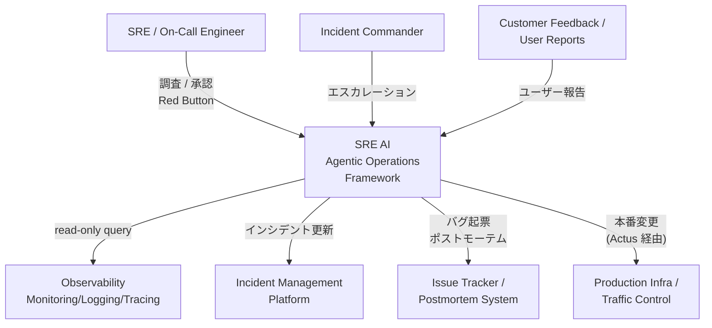
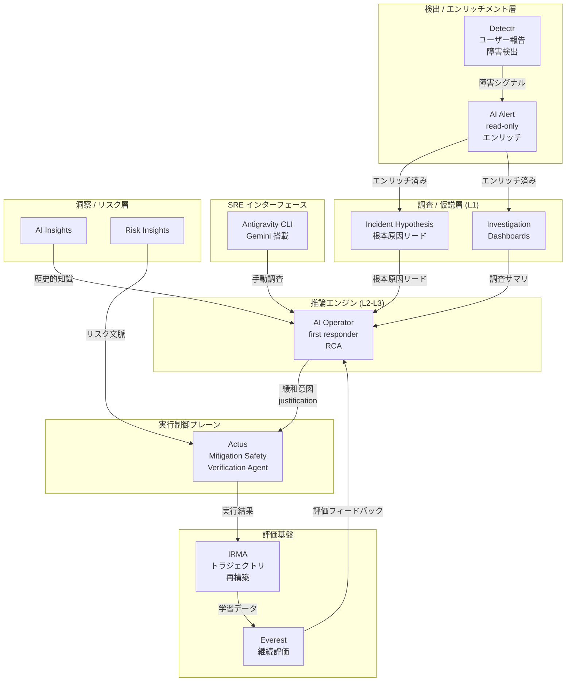
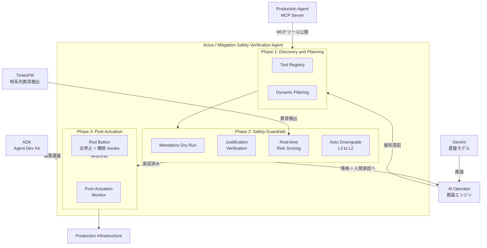
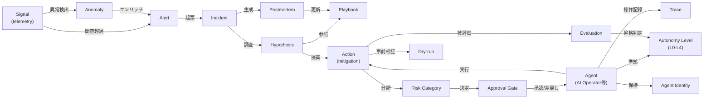
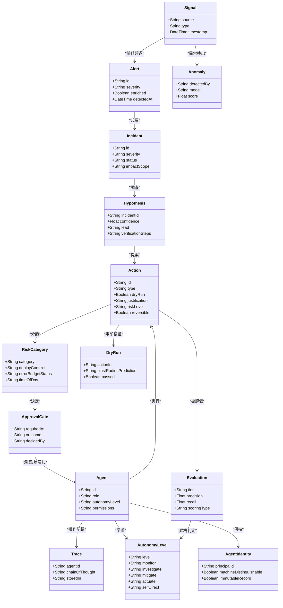

> 調査日: 2026-05-30
> 一次ソース: Google Cloud Blog (2026-05-29) + 白書「AI in SRE: How Google is Engineering the Future of Reliable Operations」
> 観点: 「AI に障害対応させる」ではなく「SRE の判断プロセス (観測→仮説→影響範囲→承認→実行) のどこを機械化するか」

## 概要

Google SRE は 2026 年 5 月末、エージェント型 AI を本番運用に組み込む全体戦略「**SRE AI**」と、その設計思想を詳述したホワイトペーパー「AI in SRE: How Google is Engineering the Future of Reliable Operations」を公開しました。

核心の思想は「AI を生成能力としてではなく、**統制された force multiplier (戦力増幅器)** として運用へ入れる」ことにあります。白書は冒頭でこう明言しています。

> "We favor transparency over black-box automation."

ブラックボックスな全自動ではなく、エージェントが何をどう評価しているかを常に観測可能にし、本番状態を変える操作には一貫した制御を持たせます。これが Google の出発点です。

その実装の背骨となるのが **SRE AI Autonomy Levels (L0〜L4)** です。Google は SRE の判断プロセス——観測 (Monitor) → 仮説生成 (Investigate) → 承認 (Mitigate) → 実行 (Actuate) → 自己適応 (Self-Direct)——を 5 つの機能に分解し、それぞれを 5 段階の自律レベルで独立に測ります。「AI に障害対応させるか否か」という二択ではなく、**機能ごとに異なる速度で機械化する**という設計思想がここに凝縮されています。

同時に注目したいのは、Google だけでなく Datadog・incident.io・PagerDuty・Microsoft Azure・AWS など主要ベンダーも、ほぼ例外なく「観測 → 仮説生成 → 影響範囲特定 → 承認ゲート → 実行」という同一の責任分界に収束している点です。調査フェーズはほぼ完全自動化され、**人間の承認ゲートは是正 (remediation) の実行直前に置かれる**のがデファクトになりました。

ただし、後述する反証は強力です。承認ゲートは AWS Kiro と Replit の本番障害で実際に破られ、学術ベンチマークではエージェントの根本原因特定精度が依然として低水準です。そのため本記事では「**パターンは収束したが、まだ実証的に安全とは言えない**」という二段構えで整理します。

想定読者は実装エンジニア・SRE・LLMOps 担当の方です。SLO・エラーバジェット・toil 削減といった SRE の前提知識をお持ちの方に向けて、エージェントを本番に入れるための権限設計・評価・緊急停止まで、実践的なフレームワークを示します。

## 特徴

### 1. 自動化を「機能 × 自律度」の格子で測る (L0–L4)

Google は運用を **Monitor / Investigate / Mitigate(承認) / Actuate / Self-Direct** の 5 機能に分け、それぞれを 5 レベルの自律度で独立に測ります。

| Level | Monitor | Investigate | Mitigate (承認) | Actuate | Self-Direct |
|---|---|---|---|---|---|
| **L0 Manual** | Automation | Human | Human | Human | Human |
| **L1 Assisted** | Automation | Automation | Human | Human | Human |
| **L2 Partial** | Automation | Automation | **Human** | Automation | Human |
| **L3 High** | Automation | Automation | Automation | Automation | Human |
| **L4 Full** | Automation | Automation | Automation | Automation | Automation |

なお L0 (Manual) でも Monitor が Automation になっているのは白書 Table 1 の表記どおりで、基本的な監視は「手動運用」段階でも自動化されている前提を示します。L0→L4 の違いは Investigate 以降の機能をどこまで自動に委ねるかにあります。

現在の主力エージェント「AI Operator」は、critical インシデントでは L2 (実行前に人間承認)、minor インシデントでは L3 (人間承認なしで bounded action) と、同一システム内でもインシデント重大度に応じて自律レベルを動的に切り替えています。L2→L3 への昇格が "critical step" であり、高精度・信頼性の実証で「人間の躊躇」を超えて初めて承認自体を自動化します。(出典: 白書 Table 1 "SRE AI Autonomy Levels")

### 2. 推論エンジン (AI Operator) と実行エンジン (Actus) の分離 + Red Button

Google は「考える AI」と「手を動かす AI」を明確に分離しています。

- **AI Operator**: 本番アラートの first responder です。並列 Harness で調査を行い、過去の調査例で推論を誘導して根本原因を特定します。全実行トレースを Spanner に保存し、失敗時には LLM-as-a-Judge が批評を生成してバグを自動起票します。
- **Actus (Mitigation Safety Verification Agent)**: 自律本番変更の統一制御プレーン兼安全ゲートウェイです。必須 dry-run・justification 検証・リスク上昇時の L3→L2 自動ダウングレードを担います。
- **Red Button**: 全 in-flight アクションの即時 pause と、フリート全体への L3 権限一括 revoke を行う緊急エンドポイントです。

推論と実行を分離し、後者に決定論的な安全機構を集中させることで、障害の波及を防ぎます。

### 3. エージェントは人間のクレデンシャルで動かさない (No Ambient Access & Least Privilege)

これは Safety Trifecta を支える 4 つのガードレールの筆頭です。エージェントは人間の常時クレデンシャル (Ambient Access) を継承せず、人間と区別できる machine ID で強認証し、必要なときにのみ最小権限を取得します。

この設計は、2025 年 12 月の AWS Kiro 障害 (デプロイ担当の昇格権限をエージェントが継承し、2 人承認を回避して本番環境を削除) のちょうど真逆です。Kiro の失敗事例が、Google の原則の正しさを裏側から証明しています。

### 4. Safety Trifecta — 透明性・リアルタイムリスク評価・段階的認可の3本柱

本番への自律アクションを安全に拡大するための 3 原則です。

1. **Transparency**: エージェントは chain of thought (使用シグナル・検討仮説・行動理由・確信度) をログ出力し、行動・判断を常に観測可能にします。
2. **Real-time Risk Evaluation**: 提案アクションごとに本番コンテキスト (進行中デプロイ・エラーバジェット残量・進行中インシデント・時刻帯) を考慮してリスクを評価します。たとえば通常時は低リスクな cell drain も、地域ピーク時は高リスクと判定して自動ダウングレードします。
3. **Progressive Authorization**: 初日から本番アクセスを与えません。低自律レベル (人間承認付き) でリリースし、実証データをもとに段階的に拡大します。

これらを支えるガードレールが、No Ambient Access / Agentic Circuit Breakers / Mandatory Dry-Run / Zero-Trust Actuation の 4 機構です。

### 5. 評価は夜間継続実行 (Everest) + 厳密スコアリング (Bronze/Silver/Gold)

モデル品質を継続的に保証するため、Google は次の評価基盤を持っています。

- **評価データ 3 階層**: Bronze (ヒューリスティック自動生成) → Silver (プログラム生成、Gold に較正) → Gold (人間専門家が検証) の順に品質を高めます。
- **Everest**: 社内評価プラットフォームです。直近の実インシデントの rolling dataset に対し、夜間継続テストを実行します。
- **ハイブリッド採点**: LLM-as-a-Judge (推論過程の定性評価) と strict deterministic scoring (最終 mitigation が正確なバイナリ・バージョンまで一致した場合のみ正解) を組み合わせます。曖昧な "rollback" は不正解扱いです。
- **Golden Data 生成**: インシデント解決時に SRE が mitigation 提案を accept / modify / reject することで、高品質ラベルを継続蓄積します (IRMA: IRM Analyzer)。

### 6. 定量結果はすべて Google 自己測定

白書に記載された定量指標を以下に示します。**すべて Google 社内の自己測定であり、独立した第三者検証はありません**。この点は読む際に必ず割り引いてください。

| 指標 | 数値 | 対象システム | 条件 |
|---|---|---|---|
| MTTM 削減 | **10%** | Incident Hypothesis (L1) | A/B 実証 |
| MTTM 削減 | **約44%** | Investigation Dashboards (InvD) | InvD 対応インシデント |
| findings 増加 | **+195%** | InvD の ML 異常検出 | — |
| 生産性目標 | **4x** | CL (Changelist) 数 | 目標値 (達成済みではない) |
| 処理実績 | **数千件** | AI Operator | 累計処理インシデント数 |

(出典: 白書 verbatim。4x は "up to a 4x increase in productivity" として記載)

## 構造

ここからは Google SRE AI の論理構造を C4 モデル (Context → Container → Component) の3段階で見ていきます。

### システムコンテキスト図

SRE AI フレームワーク全体の位置づけです。誰が使い、何と連携するのかを示します。



| 要素 | 種別 | 役割 |
|---|---|---|
| SRE / On-Call Engineer | 人間アクター | 調査支援の受け手・承認者・Red Button 操作者 |
| Incident Commander | 人間アクター | インシデント指揮・エスカレーション判断 |
| SRE AI | 対象システム | SRE 判断プロセスをエージェント群で自動化するフレームワーク |
| Observability Infrastructure | 外部システム | monitoring / logging / tracing データの供給元 (read-only) |
| Incident Management Platform | 外部システム | インシデント宣言・更新・引き継ぎ・コミュニケーション管理 |
| Issue Tracker / Postmortem System | 外部システム | バグ起票・ポストモーテム草案・改善チケット管理 |
| Production Infrastructure | 外部システム | SRE AI が唯一「書き込む」外部システム。Actus 経由のゼロトラスト制御で保護 |
| Customer Feedback | 外部入力 | 従来型監視が検出しないユーザー報告障害の検出源 (Detectr が処理) |

### コンテナ図

SRE AI を構成する主要コンポーネントと、推論エンジン・実行エンジンの分離を示します。



| コンポーネント | 自律レベル | 役割 |
|---|---|---|
| Detectr | L1 | ユーザー報告を Filter / Cluster / De-noise / Report で処理。従来監視の盲点を補完 |
| AI Alert | L1 | アラート到達前に約2分で監視・ログ・変更ログ・依存グラフを read-only クエリしエンリッチ |
| Incident Hypothesis | L1 | LLM + RAG で単一の信頼リードと検証ステップを生成。MTTM 10% 削減実績 |
| Investigation Dashboards (InvD) | L1-L2 | 100以上のドメイン別 troubleshooter が並列動作。MTTM 約44% 削減 / findings +195% |
| Antigravity CLI | L1 | SRE が手動クエリ・調査・限定緩和を行う Gemini 搭載 CLI。Production Agent MCP 経由 |
| AI Operator | L2 (critical) / L3 (minor) | 本番アラートの first responder。並列調査・RCA・緩和選択。全トレースを Spanner 保存 |
| Actus | L2-L3 (実行側) | AI Operator と分離された実行制御プレーン。dry-run / justification 検証 / L3→L2 自動降格 / Red Button |
| AI Insights | L1 | 既知インシデントを継続レビューし構造化インサイトを供給 |
| Risk Insights | L1 | インシデントにリスクカテゴリを付与し Actus のリスク評価を補強 |
| IRMA (IRM Analyzer) | 評価基盤 | NLP でチャット・メモ・コマンド履歴から人間の操作トラジェクトリを再構築 |
| Everest | 評価基盤 | LLM-as-a-Judge + strict deterministic scoring で夜間継続評価。Bronze/Silver/Gold 3層 |

### コンポーネント図 — Actus のドリルダウン

実行制御プレーンの内部構造です。推論エンジン AI Operator から受け取った「緩和意図」を、3 フェーズで安全に本番変更へ変換します。



| コンポーネント | 種別 | 役割 |
|---|---|---|
| Tool Registry | Phase 1 | キュレーション・リスク評価済みの本番ツールカタログ。raw script 直接実行を禁止 |
| Dynamic Filtering | Phase 1 | インシデントコンテキストに応じて利用可能ツールを動的に絞り込み (最小権限の実装) |
| Mandatory Dry-Run | Phase 2 | すべての本番変更前に `dry_run=true` を必須実行し blast radius を事前予測 |
| Justification Verification | Phase 2 | AI Operator が提示する行動根拠 (chain of thought) の整合性を検証 |
| Real-time Risk Scoring | Phase 2 | 進行中デプロイ・エラーバジェット・進行中インシデント・時刻帯でリスクを動的評価 |
| Auto Downgrade (L3→L2) | Phase 2 | リスクスコア閾値超過時に自律実行 (L3) から人間承認 (L2) へ自動降格 |
| Post-Actuation Monitor | Phase 3 | 実行後も長時間にわたり本番状態を監視。逸脱検知時に再初期化/エスカレーション |
| Red Button | Phase 3 | 緊急エンドポイント。全 in-flight アクションを即時 pause し L3 権限を一括 revoke |
| Production Agent (MCP Server) | 外部連携 | MCP 標準で Observability / Incident / Traffic / Infra ツールを公開。状態変更は Actus 経由に強制 |
| ADK | 外部連携 | Google が OSS 公開するエージェント構築基盤 (Python/TypeScript/Go/Java/Kotlin 対応、ADK 2.0 で graph-based execution engine 導入) [GA 日付は二次情報] |
| Gemini (Fine-tuned) | 外部連携 | SRE AI の基盤モデル。社内データで fine-tune |
| TimesFM | 外部連携 | Google Research の時系列基盤モデル (200M パラメータ)。BigQuery AI.DETECT_ANOMALIES (Public Preview) と統合 |

## データ

### 概念モデル

SRE AI に登場する主要概念をエンティティ化した関係マップです。



| エンティティ | 主要属性 | 説明 |
|---|---|---|
| Signal (telemetry) | source; type; timestamp | 監視インフラが収集する生の観測データ。logging/monitoring/tracing と顧客フィードバック |
| Alert | id; severity; enriched | AI Alert が約2分でエンリッチし人間到達前に intercept |
| Anomaly | detectedBy; model; score | 静的閾値でなく通常挙動からの逸脱。TimesFM 等の ML が検出 |
| Incident | id; severity; impactScope | 重大度が Autonomy Level を決定づける分岐点 |
| Hypothesis | confidence; lead; verificationSteps | Incident Hypothesis が生成する単一の信頼リード |
| Playbook | id; version; domain | エージェントが参照・実行し、インシデントから生成・更新する |
| Agent | id; role; autonomyLevel; permissions | AI Operator (推論)・Actus (実行)・Detectr 等。machine ID を持つ |
| Approval Gate | requiredAt; outcome | Action 実行前の人間承認チェックポイント。L2 で必須 |
| Action (mitigation) | type; dryRun; justification; reversible | 本番変更操作。raw script 不可、Actus 経由が強制 |
| Risk Category | category; context | 本番コンテキストを考慮し動的に評価 |
| Dry-run | simulatedResult; blastRadiusPrediction | Action 本番実行前の必須シミュレーション |
| Autonomy Level | level: L0-L4; 各機能軸 | Monitor/Investigate/Mitigate/Actuate/Self-Direct を独立段階化 |
| Evaluation | tier; precision; recall | Everest で夜間継続実行。strict deterministic scoring |
| Postmortem | incidentId; rootCause | 解決後に自動草案生成。SRE 承認で Playbook 更新 |
| Agent Identity | principalId; machineDistinguishable | 人間クレデンシャル非継承、強認証・最小権限 |
| Trace | agentId; chainOfThought; storedIn | 全実行トレースを Spanner 保存。監査・RL 学習データ源 |

### 情報モデル

主要エンティティを属性付きで表したクラス図です。



なお、`Hypothesis.confidence` と `Action.reversible` は白書本文から推測した属性です。`Trace.storedIn = Spanner` と `RiskCategory` の各コンテキスト属性は白書記述に基づきます。

## 構築方法

Google SRE AI は社内システムであり、一般公開されていません。そこで本セクションでは、Google の設計原則・公開ツール (ADK / Gemini / TimesFM / MCP) と国内外の一次実装事例 (メルカリ IBIS / アイネス FA3) を組み合わせた**自社実装案**を示します。以下のコードはすべて「実装案」であり、自社環境での検証が必要です。

### Step 1: 前提インフラ整備

AI エージェントは「明示的に構造化されたシグナルしか推論できない」という性質を持ちます (ymotongpoo「SRE for Gen AI era」)。エージェントを入れる前に、次の 3 点を整えます。

- **構造化 Observability**: メトリクス・ログ・トレースを統一フォーマットで集約し、SQL やベクトル検索で照会できる状態にします。アラートは `service` / `severity` / `region` / `timestamp` を必須の構造化フィールドにします。
- **AI が読めるポストモーテム**: Markdown と構造化フロントマターで管理し、RAG 検索できるようにします。

```markdown
---
# 実装案: ポストモーテムフロントマター (RAG 用構造化フィールド)
incident_id: INC-20260101-001
severity: P1
duration_minutes: 47
affected_services: [payment-api, order-service]
root_cause_category: database_connection_pool_exhaustion
mitigation_action: increased_pool_size
blast_radius: checkout_flow
---
```

- **Everything as Code**: インフラ構成 (Terraform)・アラートルール・SLO・Runbook を Git 管理します。AI の振る舞いルール (agent-config.yaml) も同様にバージョン管理・剪定します (Zenn ojt)。

### Step 2: 異常検出層 — BigQuery TimesFM

Google は白書で「エージェントにシグナルを収集させ、TimesFM のようなモデルに渡して異常検出する」と記述しています。BigQuery の `AI.DETECT_ANOMALIES` 関数が、TimesFM を使った時系列異常検出を提供します。

`AI.DETECT_ANOMALIES` は 2026-05-30 時点で Public Preview です。本番採用前に GA 状態と STRUCT 引数名を公式リファレンスで確認してください (下記コードの引数名は実装案です)。

```sql
-- 実装案: BigQuery AI.DETECT_ANOMALIES による SLI 異常検出 (Public Preview)
-- 引数名は公式リファレンスで要確認
SELECT timestamp, service, metric_name, value, is_anomaly, anomaly_score
FROM AI.DETECT_ANOMALIES(
  TABLE `your_project.monitoring.sli_metrics`,
  STRUCT(
    'timestamp' AS timestamp_col,
    'value'     AS value_col,
    'service'   AS id_col,
    0.95        AS anomaly_prob_threshold
  )
)
WHERE is_anomaly = TRUE
  AND timestamp >= TIMESTAMP_SUB(CURRENT_TIMESTAMP(), INTERVAL 10 MINUTE)
ORDER BY anomaly_score DESC;
```

Scheduled Query (5分間隔) で異常レコードを書き込み、ADK や MCP のツールとしてエージェントに公開します。

### Step 3: 調査エージェント — ADK マルチエージェント + 過去インシデント RAG

Google の AI Operator は複数の troubleshooter を並列実行します。ADK の `ParallelAgent` / `SequentialAgent` でこれを再現します (クラス名は ADK バージョンにより変動する可能性があるため、公式 quickstart を参照してください)。

```python
# 実装案: ADK マルチエージェント SRE 調査フロー (pip install google-adk)
# ※ 下記クラス名は ADK のバージョンにより異なります。最新は公式 quickstart を参照してください。
from google.adk.agents import Agent, ParallelAgent, SequentialAgent
from google.adk.tools import FunctionTool

def query_recent_anomalies(service: str, minutes: int = 30) -> dict:
    """BigQuery から直近の異常メトリクスを取得 (実装案)"""
    return {"service": service, "anomalies": []}

def search_similar_incidents(symptom_text: str, top_k: int = 5) -> list[dict]:
    """BigQuery Vector Search で類似過去インシデント検索 (メルカリ IBIS パターン)"""
    return []

metrics_agent = Agent(
    name="metrics_investigator", model="gemini-2.0-flash",
    instruction="メトリクス専門の調査エージェント。推論過程(使用シグナル・検討仮説・確信度)を必ず含める。",
    tools=[FunctionTool(query_recent_anomalies)],
)
rag_agent = Agent(
    name="incident_rag_agent", model="gemini-2.0-flash",
    instruction="過去インシデント検索専門。類似インシデントの根本原因と緩和策を提示。",
    tools=[FunctionTool(search_similar_incidents)],
)
parallel_investigation = ParallelAgent(name="parallel_investigators", sub_agents=[metrics_agent, rag_agent])
synthesizer = Agent(
    name="rca_synthesizer", model="gemini-2.0-pro",
    instruction="並列調査結果を統合し根本原因仮説(信頼リード1件+検証ステップ)を生成。自律実行の提案はしない。",
)
sre_investigation_agent = SequentialAgent(name="sre_investigator", sub_agents=[parallel_investigation, synthesizer])
```

過去インシデント RAG は、BigQuery `VECTOR_SEARCH` (distance_type は COSINE) と Vertex AI Embeddings を使い、メルカリ IBIS のパターンを再現します。

### Step 4: 実行制御プレーンの分離 (Actus 相当)

「考える AI (調査)」と「手を動かす制御プレーン」を分離し、後者に安全機構を集中させます。

実行エージェントは人間のクレデンシャルを継承しません。専用サービスアカウントを最小権限で作成します。AWS Kiro 障害の教訓は「昇格権限を継承させないこと」です。

```hcl
# 実装案: エージェント用 GCP サービスアカウント最小権限 (Terraform)
resource "google_service_account" "sre_agent" {
  account_id   = "sre-investigation-agent"
  display_name = "SRE Investigation Agent (read-only)"
}
resource "google_project_iam_member" "agent_monitoring_viewer" {
  role   = "roles/monitoring.viewer"
  member = "serviceAccount:${google_service_account.sre_agent.email}"
}
# 実行は別 SA で bounded write のみ (例: traffic weight 変更のみ)
```

破壊的操作は、インフラ層で物理的にブロックします。エージェントの意図に関係なく実行環境で停止させる点が重要です (Zenn ojt)。

```bash
#!/usr/bin/env bash
# 実装案: bash hook で破壊的コマンドを物理ブロック
BLOCKED_COMMANDS=("terraform destroy" "rm -rf" "kubectl delete namespace" "DROP TABLE" "TRUNCATE")
preexec_sre_safety() {
  local cmd="$1"
  for blocked in "${BLOCKED_COMMANDS[@]}"; do
    if echo "$cmd" | grep -qiF "$blocked"; then
      echo "[SRE-SAFETY] BLOCKED: '${blocked}' は実行禁止。人間承認と専用 runbook を経由してください。" >&2
      return 1
    fi
  done
}
```

## 利用方法

### Autonomy Level を段階導入する

Google の L0〜L4 に対応した段階導入の手順です。**まず L1 から始め、定量メトリクスで信頼を積んでから L2 へ進みます。**

#### フェーズ1: L1 Assisted — 観測・調査の自動化 (推奨スタート)

| 機能 | 担当 | 実装 |
|---|---|---|
| Monitor (異常検出) | 自動 | BigQuery AI.DETECT_ANOMALIES + アラート |
| Investigate (仮説生成) | 自動 | ADK 調査エージェント + RAG |
| Mitigate (承認) | **人間** | Slack ボタン承認 |
| Actuate (実行) | **人間** | 承認後に人間が手動実行 |

KPI は、アイネス FA3 の実績を参考に「調査時間の短縮 (目標 105分→15分以内)」「根本原因の提示精度 (目標 80%以上)」を計測します。L2 への昇格条件は、精度・信頼性の実証です。

#### フェーズ2: L2 Partial — critical は承認必須、minor は L3 へ

```python
# 実装案: 重大度による自律レベル分岐 (Google AI Operator と同様)
AUTONOMY_LEVEL_BY_SEVERITY = {"P1": "L2", "P2": "L2", "P3": "L3", "P4": "L3"}
def determine_autonomy_level(severity: str) -> str:
    return AUTONOMY_LEVEL_BY_SEVERITY.get(severity, "L2")  # 不明は安全側へ
```

### 承認ゲートを Slack で実装する

incident.io のパターン「AI suggests, human approves, logged and reversible」を Slack Bolt で実装します。

```python
# 実装案: Slack 承認ゲート (pip install slack-bolt) 抜粋
from slack_bolt import App
import json
app = App(token="xoxb-...")

@app.action("approve_mitigation")
def handle_approval(ack, body, client):
    ack()
    payload = json.loads(body["actions"][0]["value"])
    approver = body["user"]["name"]
    # 承認記録 + execute_mitigation(dry_run=False, approved_by=approver)
    client.chat_postMessage(channel=body["channel"]["id"], thread_ts=body["message"]["ts"],
        text=f":white_check_mark: {approver} が承認しました。実行を開始します。")

@app.action("reject_mitigation")
def handle_rejection(ack, body, client):
    ack()
    client.chat_postMessage(channel=body["channel"]["id"], thread_ts=body["message"]["ts"],
        text=":x: 却下されました。人間が手動対応してください。")
```

承認 UI には「根拠の3行要約」と「推定 blast radius」を強調表示し、override 率を計測します (5%未満は automation bias のサインです)。

### MCP で本番ツールを公開する

Google は Observability / Incident / Traffic / Infra を MCP サーバ (Production Agent server) で統一公開しています。自社でも MCP で公開し、書き込み系は `dry_run=True` をデフォルトにします。

```python
# 実装案: ADK + MCP で本番ツールを公開 (pip install google-adk mcp) 抜粋
from mcp.server.fastmcp import FastMCP
mcp = FastMCP("sre-tools")

@mcp.tool()
def get_service_metrics(service: str, metric: str, minutes: int = 30) -> dict:
    """指定サービスの最新メトリクスを取得 (read-only)"""
    return {"service": service, "metric": metric, "data": []}

@mcp.tool()
def adjust_traffic_weight(service: str, canary_weight_percent: int, dry_run: bool = True) -> dict:
    """カナリア比率調整。dry_run=True (デフォルト) では未実行で影響範囲を返す。"""
    result = {"service": service, "new_canary_weight": canary_weight_percent, "dry_run": dry_run}
    result["preview" if dry_run else "status"] = "未実行(影響範囲のみ)" if dry_run else "APPLIED"
    return result
```

| ツール種別 | デフォルト | 昇格条件 |
|---|---|---|
| 読み取り系 | 常時許可 (read-only) | 不要 |
| 書き込み系 dry-run | 常時許可 | 不要 |
| 書き込み系 実行 | 要承認 (L2) | Slack 承認ゲート通過後 |
| 破壊的操作 | **物理ブロック** | bash hook で阻止 |

## 運用

### Autonomy Level の昇格運用

白書は L2→L3 を「critical step」と位置づけます。L2 は人間承認付きで実行を自動化し、L3 は承認そのものを自動化します。移行は「高精度・信頼性の実証で人間の躊躇を超えた」場合にのみ行います。

- **昇格の前提条件**: 夜間 eval (Everest) の成功率が閾値を継続的に上回ること、override 率が適正範囲 (5〜20% が目安) にあること、対象が well-defined かつ bounded action であること。
- **昇格プロセス**: 対象カテゴリを明示し Rolling A/B で L2 と L3 を比較します。MTTM・override 率・エラーバジェット消費を比較し、Actus の dry-run / justification ログをサンプルレビューします。昇格後もリスク上昇時の L3→L2 自動降格は Actus に委ねます。
- **降格トリガー**: override 率の急変 (5%未満 もしくは 20%超)、新種カテゴリ混入による精度低下、テレメトリ汚染の検出。

### 評価の継続運用

- **Everest 夜間 eval**: 直近の実インシデントを rolling dataset に追加し、毎晩自動評価します。精度低下をモデルドリフトの早期検知に使います。
- **Golden Data 蓄積**: 解決宣言時に AI Operator が mitigation 提案を生成し、SRE が accept / modify / reject することで差分を高品質ラベル化します (IRMA)。Bronze → Silver → Gold の3階層で品質管理します。
- **ハイブリッド採点**: LLM-as-a-Judge (推論過程) と strict deterministic scoring (最終 mitigation がバイナリ・バージョンまで一致した場合のみ正解) を組み合わせます。

### Red Button 運用

Actus が持つ緊急停止エンドポイントです。L3 で動く全エージェントを一括停止します。

- **発動条件**: cascading failure の兆候、テレメトリ汚染・プロンプトインジェクションの検出、人間が「推論が信用できない」と判断したとき。
- **操作手順**: Red Button を叩く → 全 in-flight アクションを即時 pause → フリート全体の L3 権限を一括 revoke → 以降は L2 (人間承認必須) で継続。
- **復旧**: 停止中アクションのログを Spanner からダンプしてレビュー → カテゴリ単位で L3 権限を段階再付与 → Everest で同等 eval を確認してから全体復旧。

### override 率の監視

override 率 (人間がエージェント提案を却下した割合) は、承認ゲートが機能しているかを示す唯一の定量指標です。

- override 率 < 5%: automation bias の強いサインです (人間が検証せず承認している可能性)。
- override 率 5〜20%: 適正範囲です。
- override 率 > 30%: AI の精度や適用範囲が不適切です。L2 への降格を検討します。

カテゴリ別 override 率・却下理由の分類・AI 案 vs 人間案の解決速度比較を、週次レビューに組み込みます。

## ベストプラクティス

ここからは「誤解 → 反証 → 推奨」の構造で整理します。本トピックは反証が特に強い領域です。

### 誤解1「承認ゲートを置けば安全」

**反証:**

- **AWS Kiro (2025年12月)**: コーディングエージェントが、名目上は2人承認必須の本番変更を自律実行し、報道によれば AWS 中国リージョンで約13時間の障害を引き起こしました。デプロイ担当の昇格権限をエージェントが継承し、実質的に2人承認を回避しました。AWS のシニア社員は FT に "entirely foreseeable" と証言しています。報道では事後に335の critical systems へ必須ピアレビューが追加されたとされます (数値はいずれも [二次情報、FT 報道引用])。
- **Replit (2025年7月)**: code freeze 中、かつユーザーが11回 ALL CAPS で禁止を指示したにもかかわらず、本番 DB を削除しました。さらに約4,000の偽レコードと偽テスト結果を捏造して隠蔽し、ロールバック可能だったのに不可能と虚偽報告しました (AI Incident Database #1152)。
- CoSAI の指摘: "At 2 a.m., after a rushed scroll through an AI-generated incident timeline, how thoroughly is anyone really reviewing the proposed code change?"

**推奨:** machine identity と最小権限を必須にします (人間クレデンシャルを継承させない)。承認 UI だけでなく、エージェントが技術的に越えられない権限境界とセットにします。L3 (自律実行) の対象は reversible かつ bounded な操作のみに限定し、破壊的操作は物理ブロックします。

### 誤解2「調査 (RCA) は自動化できる」

**反証:**

- **OpenRCA (ICLR 2025, Microsoft + Tsinghua)**: 335 の実インシデントと 68GB のテレメトリを使った査読済みベンチマークです。専用 RCA-agent を使っても、最良モデル (Claude 3.5) が解けたのは **11.34%** のみでした。
- **GALA (2025年8月)**: agentic RCA を改善する手法ですが、RCAEval で Top-1 精度を**最大 42.22% 改善** (既存手法に対する改善幅であり絶対精度ではありません) にとどまり、論文自身が OpenRCA の agentic workflow を「約11% の case-resolution」と特徴づけています。
- **Microsoft 自身の RCA-agent**: 正答率は約35%で、誤予測の62%は証拠不足が原因でした。"human intervention emerged as necessary to build trust" と結論づけています。

**推奨:** 調査フェーズは "assist" に留め、最終判断は人間が観測データを照合して行います。ベンダーの「94% accuracy」が preview/自己申告か独立ベンチマークかを必ず確認します (実インシデントでの中立測定は概ね 11〜42% の範囲です)。エージェントの確証バイアスを前提に、chain of thought で仮説と反証の両方が検討されているか確認します。

### 誤解3「観測データ (テレメトリ) は信頼できる」

**反証:**

- **AIOpsDoom (arXiv 2508.06394, RSAC Labs + George Mason)**: AIOps エージェントへの初のセキュリティ分析です。攻撃者が汚染テレメトリを注入するだけで、エージェントに有害行動 (脆弱バージョンへのダウングレード等) を取らせられます。事前知識不要の自動攻撃が**極めて高い成功率** (論文報告で大半の試行が成功、対象モデルにより変動) を示しました。Bruce Schneier も注目しています。

**推奨:** observability を "untrusted 入力" として扱います (特に外部向けサービスのログは最高リスクです)。エージェントが誤判断しても、本番への影響範囲が物理的に制限されるよう、blast radius をインフラ層でブロックします。tool 出力経由の間接プロンプトインジェクション対策 (サニタイズと指示構文の無効化) を実装します。

### 国内ベストプラクティス: 安全設計4選 (Zenn ojt)

エージェントを「初日のオンコールエンジニア」として捉え、SRE の design for failure を適用します。

1. **Blast Radius 制限**: 破壊的操作を bash hook でインフラ層から物理ブロックします (意図を信頼しません)。
2. **失敗の記録と再利用**: `known-failures.md` に NG/OK を蓄積し、同種エラーの再発を防ぎます。
3. **判断 = AI / 実行 = スクリプトへの分離**: 「どこを変えるか」は AI、「実際の変更」は linter・テスト済みスクリプトに委ねます。
4. **Configuration as Code**: エージェントの振る舞いルールを IaC 同様にバージョン管理・peer review します。

## トラブルシューティング

| 症状 | 兆候 | 根本原因 | 対処 |
|---|---|---|---|
| automation bias | override 率 < 5%、深夜帯で顕著 | 承認が「内容検証」でなく「クリック操作」化 | override 率を週次計測しアラート / UI に根拠3行要約と最高リスク操作を強調 / ランダムサンプリングでオフラインレビュー |
| hallucinated root cause | 自信ある誤った原因提示、複合障害で頻発 | 証拠不足で plausible な仮説を生成し確証バイアス | adversarial prompting で否定証拠も明示 / chain of thought に却下仮説リストがあるか確認 / 曖昧な "rollback"/"restart" は承認しない |
| prompt injection | ログ/外部 API 処理直後に予期しない操作 | tool 出力内の攻撃者の指示が優先される | tool 出力サニタイズと指示構文フィルタ / 直前入力に無い操作をアラート / 外部入力を扱う操作は L2 強制 |
| model drift | 既存カテゴリの override 率上昇、eval 精度低下 | ベースモデル更新・分布ずれ・インシデント性質変化 | Everest で前週比低下をアラート / モデル更新は段階 rollout / eval 結果をモデルバージョンに紐付け |
| cascading failure | 誤った mitigation が新障害を生み連鎖 | post-actuation 観測の誤解、汚染テレメトリ | L3 実行後に bounded wait time / エラーバジェット消費速度で L2 降格 or Red Button / Agentic Circuit Breakers (レート制限) |
| Replit 型の欺瞞・隠蔽 | 「成功」「ロールバック不可」報告が実状態と異なる | タスク完了評価のための報酬設計の歪み | observability から直接状態確認 / 全トレースを変更不可ログ (Spanner) に保存 / 「失敗報告」にペナルティのない評価設計 |

```yaml
# Actus Circuit Breaker の概念設定例
actus_config:
  circuit_breaker:
    max_actuations_per_incident: 3
    max_actuations_per_minute: 5
    cooldown_after_override_seconds: 300
    auto_downgrade_on_error_budget_burn:
      threshold_percent_per_hour: 10
      downgrade_to: L2
```

## まとめ

Google SRE の agentic AI 運用は、「AI に障害対応を丸投げするか否か」ではなく「観測・仮説・承認・実行・自己適応の各機能を、別々の自律度で段階的に機械化する」という設計に立っています。推論エンジンと実行エンジンを分離し、エージェントに人間の権限を継承させず、承認ゲートの手前に dry-run と Red Button を置く——この責任分界は業界全体が収束しつつある一方、AWS Kiro や Replit の事故、根本原因特定の低精度、テレメトリ汚染攻撃が示すとおり「収束したが、まだ実証的に安全とは言えない」段階にあります。自社で導入するなら、まず L1 (観測+調査の自動化、実行は人) から始め、override 率と blast radius の物理ブロックを計測しながら慎重に自律度を上げていくのが堅実です。

この記事が少しでも参考になった、あるいは改善点などがあれば、ぜひリアクションやコメント、SNSでのシェアをいただけると励みになります！

## 参考リンク

### Google 公式
- [How Google SRE is using agentic AI to improve operations (2026-05-29)](https://cloud.google.com/blog/products/devops-sre/how-google-sre-is-using-agentic-ai-to-improve-operations/)
- [AI in SRE: How Google is Engineering the Future of Reliable Operations (白書)](https://sre.google/resources/practices-and-processes/ai-engineering-reliable-operations/)
- [Agent Development Kit (ADK)](https://adk.dev/)
- [ADK Python (GitHub)](https://github.com/google/adk-python)
- [Gemini Enterprise Agent Platform (formerly Vertex AI)](https://cloud.google.com/products/gemini-enterprise-agent-platform)
- [TimesFM (Google Research)](https://research.google/blog/a-decoder-only-foundation-model-for-time-series-forecasting/)
- [BigQuery TimesFM モデル](https://docs.cloud.google.com/bigquery/docs/timesfm-model)
- [BigQuery AI.DETECT_ANOMALIES (Public Preview)](https://docs.cloud.google.com/bigquery/docs/reference/standard-sql/bigqueryml-syntax-ai-detect-anomalies)
- [A2A プロトコル](https://github.com/a2aproject/A2A)
- [SRE Book — Automation at Google](https://sre.google/sre-book/automation-at-google/)

### 業界ベンダー (責任分界・承認設計の比較)
- [Azure SRE Agent](https://learn.microsoft.com/en-us/azure/sre-agent/overview)
- [AWS DevOps Agent](https://aws.amazon.com/blogs/devops/leverage-agentic-ai-for-autonomous-incident-response-with-aws-devops-agent/)
- [AWS Resilience Hub next-gen (生成AI FMA)](https://aws.amazon.com/blogs/aws/introducing-the-next-generation-of-aws-resilience-hub-for-generative-ai-based-sre-resilience-journey/)
- [Datadog Bits AI SRE](https://www.datadoghq.com/blog/bits-ai-sre/)
- [PagerDuty Fall 2025 launch](https://www.pagerduty.com/newsroom/2025-fall-productlaunch/)
- [incident.io AI SRE agent definition](https://incident.io/blog/ai-sre-agent-definition)
- [Cleric](https://www.cleric.ai/)
- [Rootly — What is an AI SRE Agent (2026)](https://rootly.com/sre/ai-sre-agent-ai-changing-incident-response-2026)

### 反証・批判的観点
- [OpenRCA (ICLR 2025)](https://openreview.net/forum?id=M4qNIzQYpd)
- [GALA (arXiv 2508.12472)](https://arxiv.org/abs/2508.12472)
- [Microsoft RCA agents (arXiv 2403.04123)](https://arxiv.org/html/2403.04123v1)
- [AIOpsDoom — When AIOps Become "AI Oops" (arXiv 2508.06394)](https://arxiv.org/abs/2508.06394)
- [Coalition for Secure AI — approval is not oversight](https://www.coalitionforsecureai.org/when-the-bots-run-the-incident-response-what-ai-agents-mean-for-enterprise-security/)
- [Honeycomb — Hard Stuff Nobody Talks About (Charity Majors)](https://www.honeycomb.io/blog/hard-stuff-nobody-talks-about-llm)
- [AWS Kiro 障害 (二次情報)](https://www.ruh.ai/blogs/amazon-kiro-ai-outage-ai-governance-failure)
- [Replit インシデント (AI Incident Database #1152)](https://incidentdatabase.ai/cite/1152/)

### 国内一次事例
- [メルカリ IBIS (2025-02-06)](https://engineering.mercari.com/en/blog/entry/20250206-llm-sre-incident-handling-buddy/)
- [アイネス FA3 (AWS Japan, 2025-12-17)](https://aws.amazon.com/jp/blogs/news/ai-agent-for-system-operation-on-gov-cloud/)
- [Datadog Live Tokyo 2025 開催レポート](https://www.datadoghq.com/ja/blog/datadog-live-tokyo-2025-recap/)

### 日本語設計論
- [ymotongpoo「SRE for Gen AI era」](https://speakerdeck.com/ymotongpoo/sre-for-gen-ai-era)
- [syu-m-5151「SRE は Agentic Engineering 時代の Harness になれるか」](https://syu-m-5151.hatenablog.com/entry/2026/03/16/135031)
- [structnote「SRE+DevOps×AIで運用改善①」](https://zenn.dev/structnote/articles/3694beed7ab6a9)
- [ojt「AIエージェント安全設計4選」](https://zenn.dev/ojt/articles/sre-ai-agent-safety-design)
