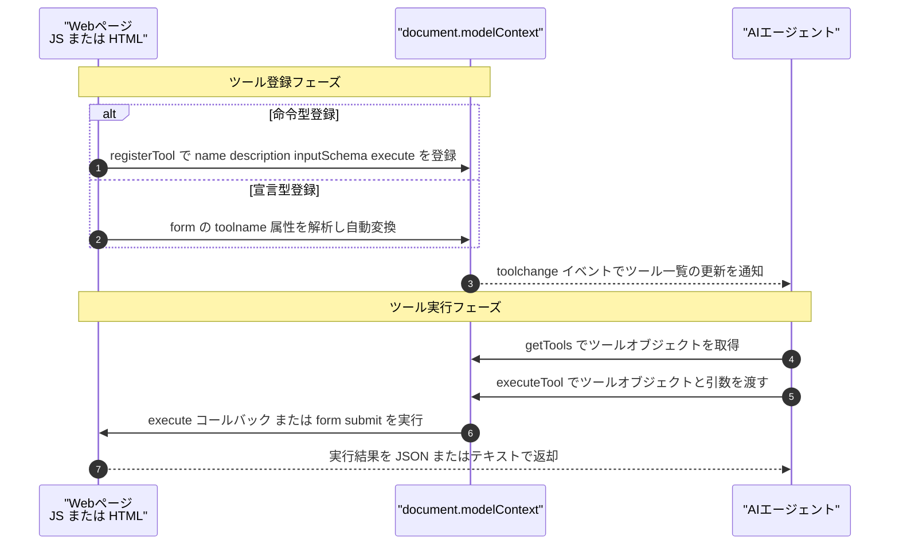
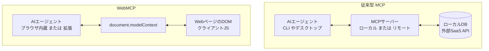
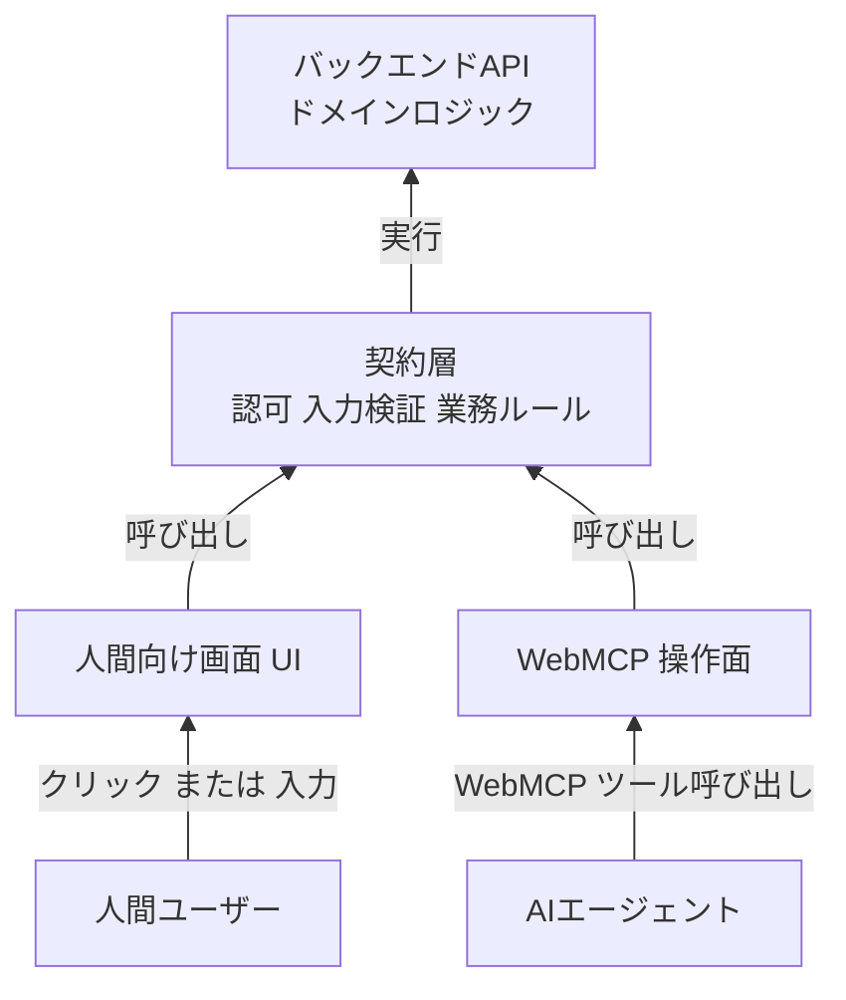

AIエージェントにWeb画面を操作させる方法は、これまで「見て推測する」しかありませんでした。画面のスクリーンショットをVisionモデルに読ませる、あるいはDOMツリーを解析して要素を探し当てて擬似クリックする。どちらもレイアウトやクラス名が変わった瞬間に壊れます。

**WebMCP (Web Model Context Protocol)** は、この前提をひっくり返すW3Cの標準ドラフトです。Webページ自身が「このページで実行できる操作」をツールとして宣言し、エージェントはそれを契約として呼び出します。推測が消え、プロトコルになります。

この記事では、2026年8月時点のドラフト仕様と、先行して実装・検証された知見をもとに、次の3点を整理します。

- WebMCPが何を宣言し、どこまで生きるのか（概念構造とライフサイクル）
- 既存のMCP（Anthropic系のサーバー型）と何が決定的に違うのか
- 自社Webアプリを「人間向け画面」と「エージェント向け操作面」の二面構造にするとき、どこが壊れるのか

対象読者は、Webアプリの設計・運用に責任を持つ方、およびAIエージェント導入の可否を判断する立場の方です。

:::message
本記事は2026年8月時点のドラフト仕様に基づきます。WebMCPはW3C Web Machine Learning Community Groupのドラフト段階であり、API名やエントリポイントは変動します。実際にAPIエントリポイントは旧 `navigator.modelContext` から `document.modelContext` へ移行しました。実装前に必ず一次情報を確認してください。
:::

## WebMCPは何を解決するのか

従来のエージェントによるWeb操作の課題は、**サイト側が何も約束していない**ことに尽きます。エージェントは画面を見て「たぶんこのボタンが送信だろう」と推測し、外れれば誤操作します。サイト側は、エージェントが来ることを想定していないので、壊れても気づけません。

WebMCPは、サイト側からエージェントへ次の4点を明示的に開示します。

| 開示する要素 | 内容 |
|---|---|
| `name` | ツール名。1〜128文字のASCII英数字・ハイフン・アンダースコア |
| `description` | ツールの説明文。エージェントが用途を判断する材料 |
| `inputSchema` | 入力のJSON Schema。型と必須項目の契約 |
| `execute` | 実行時に呼ばれるコールバック |

つまり「画面の見た目」ではなく「機能の契約」を公開します。この差は、エージェントの成功率よりも**サイト運営側の統制**にとって重要です。何を公開し何を公開しないかを、サイト側が決められるようになります。

## 概念構造：登録から実行までの流れ

WebMCPの中心は、ブラウザ内部の `document.modelContext` レジストリです。ページがツールを登録し、エージェント（ブラウザ内蔵・拡張機能・ブリッジ経由の外部CLI）がそれを取得して実行します。



登場人物は3つだけです。

- **`document.modelContext`** — ページごとのツールマップを管理するレジストリ。ツールの追加・削除時に `toolchange` イベントを発火します。
- **`ModelContextTool`** — ツール定義オブジェクト。上表の4要素を持ちます。
- **`agentInvoked`** — その操作が人間由来かエージェント由来かを示すフラグ。後述する安全設計の要です。

## ツールの宣言方法は2種類ある

### 命令型：JavaScriptから登録する

任意の処理をツール化できます。既存のAPI呼び出しやクライアント側ロジックを、そのままエージェントへ開けます。

```js
document.modelContext.registerTool({
  name: "search_products",
  description: "商品名で在庫を検索し、価格と在庫数を返す",
  inputSchema: {
    type: "object",
    properties: {
      keyword: { type: "string", description: "検索キーワード" },
    },
    required: ["keyword"],
  },
  execute: async ({ keyword }) => {
    const res = await fetch(`/api/products?q=${encodeURIComponent(keyword)}`);
    return await res.json();
  },
});
```

### 宣言型：HTMLのform属性だけで登録する

既存の `<form>` に属性を足すだけで、ブラウザがJSON Schemaを自動生成してツール化します。JavaScriptを1行も書かずに済むのが利点です。

```html
<form toolname="reserve_hotel"
      tooldescription="宿泊日と人数を指定してホテルを予約する"
      action="/reserve" method="post">
  <label for="date">宿泊日</label>
  <input id="date" name="date" type="date" required />
  <label for="guests">人数</label>
  <input id="guests" name="guests" type="number" min="1" required />
  <button type="submit">予約する</button>
</form>
```

宣言型は内部的に命令型の `registerTool()` へ正規化されます。つまり**宣言型はシンタックスシュガー**であり、2つの独立した仕組みではありません。実装を考えるときは命令型のモデルだけ理解しておけば足ります。

ここから導ける実務上の示唆は明快です。**`name` / `required` / `<label>` を正しく書いたセマンティックなHTMLは、そのままエージェント対応の下地になります**。WebMCPを今すぐ導入しなくても、この整備は無駄になりません。

### 人間とエージェントを見分ける

フォーム送信イベント (`SubmitEvent`) の `event.agentInvoked` を見れば、人間がボタンを押したのか、エージェントがツール経由で送信したのかを分岐できます。`event.respondWith()` でエージェントへ構造化レスポンスを直接返すこともできます。

```js
form.addEventListener("submit", (event) => {
  if (event.agentInvoked) {
    event.respondWith(Promise.resolve({ status: "accepted", id: "R-1024" }));
  }
});
```

この分岐があることで、「エージェント経由のときだけ追加の確認を挟む」「人間のときだけ画面遷移する」といった設計が可能になります。

## ライフサイクル：タブが閉じればツールは消える

WebMCPの最も特徴的な性質は、**ツールの寿命がページ（タブ）の寿命と完全に一致する**ことです。タブを閉じる、ドメインを遷移する。それだけでツールは消滅します。

これは制約であると同時に、安全性の根拠でもあります。ユーザーが画面を開いていない限り、そのサイトの機能はエージェントから見えません。「知らないうちにバックグラウンドで操作されていた」という事態が構造的に起きにくくなります。

一方で運用面ではストレスにもなります。エージェントがタブを切り替えた瞬間にツールが見えなくなるため、複数サイトをまたぐタスクは素直に書けません。この点は後述の課題で扱います。

## 従来のMCPとの違い

Anthropicが提唱したMCP（Model Context Protocol）とWebMCPは、名前は似ていますが**実行境界と生存期間が根本的に異なります**。



| 比較項目 | 従来型 MCP | WebMCP |
|---|---|---|
| 主な対象 | LLMエージェント全般。CLI、デスクトップアプリ、サーバー | ブラウザ内蔵エージェント、ブラウザ拡張機能エージェント |
| 実行・提供境界 | 独立プロセス、または遠隔APIサーバー | ブラウザの該当タブ内。クライアントサイドJSとDOM |
| 通信方式 | stdio、またはHTTP SSE / JSON-RPC 2.0 | JavaScriptメソッド呼び出し |
| 生存期間 | エージェントプロセスまたはサーバーが生きている限り永続 | **Webページ（タブ）が開かれている間のみ** |
| 認証・コンテキスト | APIキー、OAuth2、ローカル環境変数 | 同一起源ポリシーとブラウザセッションCookie |

判断のポイントは認証にあります。従来型MCPでは、APIキーやOAuthトークンをエージェント側に持たせる必要がありました。WebMCPでは**ユーザーが既にログインしているセッションCookieをそのまま使えます**。認証情報をエージェントへ渡さずに済む点は、統制上の大きな利点です。

裏を返せば、**ログイン済みセッションの権限がそのままエージェントの権限になる**ということでもあります。ここが次章の設計論につながります。

## 二面構造の落とし穴と契約層パターン

WebMCPを導入すると、Webアプリは「人間向け画面 (GUI)」と「エージェント向け操作面 (WebMCP)」の二面を持ちます。この2つを別々に実装すると、実装差がそのまま脆弱性になります。

### 起きる不整合は2種類

- **認可バイパス** — 画面UIでは「権限のないユーザーにはボタンを `disabled` にする」制御をしていても、WebMCPツール側で同じ認可チェックを書き忘れれば、エージェントから直接実行できてしまいます。UIの `disabled` は認可ではありません。
- **入力検証の乖離** — 画面のフォームバリデーションと `inputSchema` がずれていれば、画面経由では弾かれる値がツール経由では通ります。

どちらも「UIに業務ロジックが埋まっている」アプリで確実に起きます。そして厄介なことに、**画面をいくらテストしても検出できません**。

### 解決策：共有の契約層を挟む

UI側とWebMCP側の双方が、同一の契約層（認可・入力検証・業務ルール）を経由する構造にします。



契約層が満たすべき要件は3つです。

1. **認可の共通化** — セッションとロール権限の評価を、`execute` コールバックの冒頭で必ず行う。UIの `disabled` に依存しない。
2. **入力検証の一元化** — ZodやJSON Schemaを単一ソースとし、画面フォームのバリデーションと `inputSchema` の両方を自動生成する。手で二重管理しない。
3. **業務ルールのカプセル化** — 画面操作とツール実行が同一のドメインイベントを発生させるようにする。状態遷移の実装を分岐させない。

この構造は目新しいものではありません。UI非依存のサービス層 / UseCase層を持つアプリなら、既に達成されています。**WebMCPは新しい設計を要求するのではなく、これまで曖昧にしてきた層分離の甘さを露呈させます**。

## 実装検証で判明したハマりどころ

実機（Chrome for Testing等）でWebMCPやブリッジ実装を動かした際に発覚した、非直感的なエッジケースをまとめます。以下はドラフト仕様そのものではなく、先行実装者の検証ログに基づく知見です。仕様の更新で解消される可能性があります。

| 現象 | 原因 | 回避策 |
|---|---|---|
| `getTools()` が同期に見えて非同期 | 要約表現から同期APIと誤認しやすいが、実際は `Promise<ModelContextTool[]>` を返す | 必ず `await document.modelContext.getTools()` で呼ぶ |
| `executeTool()` に文字列を渡すと TypeError | ツール名文字列で実行できると勘違いしやすいが、`getTools()` で得たオブジェクトそのものを要求する | `getTools()` の配列から該当オブジェクトを検索して渡す |
| `file://` でハンドシェイクが永続停止 | 拡張機能の content script と injected script 間通信で `targetOrigin` に `location.origin` を使うと、`file://` では `"null"` になる | `targetOrigin: "*"` を使い、ランダムChannel IDでメッセージの正当性を検証する |
| `toolautosubmit` なしフォームがタイムアウト | 自動送信属性のない宣言型フォームは、セキュリティ上ボタンフォーカスで停止し人間の確認を待つ。自動化環境では `executeTool()` がブロックされ続ける | 呼び出し前に `requiresUserGesture` を確認するか、エージェント側から明示的に確定操作を送る |
| Service Worker の休眠で接続断 | MV3拡張のBackground Service Workerがアイドルサスペンドされ、WebSocket接続が切れる | イベント発生時の自動再接続を実装し、状態確認を挟む |
| MutationObserver とハンドシェイクの競合 | 命令型JSを持たない軽量な宣言型ページでは、DOM解析完了が通信チャネル確立より早い。ツール登録が握り潰される | チャネル確立前の登録試行をキャッシュし、ハンドシェイク完了後に再送する |

共通しているのは、**「同期に見える」「文字列で済みそう」といった直感が外れる**点です。ドキュメントの要約ではなく実地スペックを読む価値がここにあります。

## 現時点での課題と未解決の問い

導入判断の材料として、限界も明示しておきます。

**1. 主要エージェントとの不一致**

現在よく使われているエージェント（Claude Code、各種CLIエージェント等）はターミナルや外部環境で動作します。これらからWebMCPを使うには、ブリッジ拡張機能とローカルMCPサーバーの組み合わせが必要です。一般ユーザーが導入できる構成ではありません。**「ブラウザ内蔵エージェントが普及するかどうか」がWebMCPの実用性を左右します**。

**2. タブ切替によるツール消失**

前述のとおり、マルチタスクやクロスサイト操作を行うエージェントにとっては制約になります。安全性とのトレードオフです。

**3. Prompt Injection / Tool Poisoning**

悪意あるサイトが `description` に隠し命令を埋め込み、エージェントを誘導するリスクがあります。W3C仕様（Section 6.3.1）では Untrusted Content Hint や入力長制限などの緩和策が議論されていますが、確定した対策ではありません。**サイト側が公開するdescriptionは、エージェントにとって信頼できない入力である**という前提を崩さないことが重要です。

**4. 標準化の着地点**

Chromium以外のエンジン（WebKit / Firefox）が同仕様を公式サポートするかは未確定です。現時点ではChrome 149以降のOrigin Trialおよびテストフラグ (`chrome://flags/#enable-webmcp-testing`) 経由での検証段階にあります。

## 今、何をすべきか

仕様がドラフト段階である以上、本番実装を急ぐ判断は取りにくいはずです。それでも、**仕様が固まってから着手すると間に合わない準備**が2つあります。

| 打ち手 | 内容 | 仕様変動リスク |
|---|---|---|
| セマンティックHTMLの整備 | 主要な検索・申込フォームに正しい `name` / `required` / `<label>` を付ける | なし。宣言型WebMCPの下地になり、アクセシビリティとSEOにも効く |
| 契約層の分離リファクタリング | 画面コンポーネントに埋もれた認可チェックと業務ロジックを、UI非依存のサービス層へ抽出する | なし。WebMCPと無関係にテスト容易性が上がる |
| WebMCPツールの本番実装 | `registerTool` によるツール公開 | 高い。API名の変更実績あり。検証環境に留める |

上2つは**WebMCPが普及しなくても回収できる投資**です。逆に、これらを済ませていない状態でWebMCP対応を迫られると、認可バイパスを抱えたまま公開面を増やすことになります。

継続してモニタリングすべきは、W3C Web Machine Learning Community Groupの更新、Chromeの Origin Trial 仕様変更、そしてChromium以外のエンジンの反応の3点です。

## まとめ

- WebMCPは、Webページ自身が「実行可能な操作」を `name` / `description` / `inputSchema` / `execute` の契約として公開する標準ドラフトです。エージェントによるWeb操作から推測を排除します。
- ツールの寿命はタブの寿命と一致します。これが従来型MCPとの最大の差であり、安全性の根拠でもあり、運用上の制約でもあります。
- 認証はログイン済みセッションを流用できます。エージェントへAPIキーを渡さずに済む反面、**セッションの権限がそのままエージェントの権限になる**点に注意が必要です。
- 「人間向け画面」と「エージェント向け操作面」を別々に実装すると、認可バイパスと入力検証の乖離が起きます。共有の契約層を挟む設計が前提になります。
- 仕様はドラフト段階でAPIエントリポイントの変更実績もあります。本番実装より、セマンティックHTMLの整備と契約層の分離という**仕様変動に依存しない準備**から着手するのが合理的です。

この記事が少しでも参考になった、あるいは改善点などがあれば、ぜひリアクションやコメント、SNSでのシェアをいただけると励みになります！

## 参考リンク

- [WebMCP Specification (W3C Web Machine Learning Community Group, Draft Community Group Report, 28 July 2026)](https://webmachinelearning.github.io/webmcp/)
- [WebMCP: Exposing web page tools to AI agents (Chrome Developer Documentation)](https://developer.chrome.com/docs/ai/webmcp)
- [Googleが発表した新Web標準ドラフト――WebMCP。実際どうなの？ IO Extendedで実装・登壇して分かったこと (tanahiro2010 氏, 2026-08-02)](https://zenn.dev/tanahiro2010/articles/b62637d8e55d2b)
- [WebMCP Bridge MCP Server (GitHub)](https://github.com/tanahiro2010/webmcp-bridge-mcp)
- [WebMCP Bridge Chrome Extension (GitHub)](https://github.com/tanahiro2010/webmcp-bridge-extension)
