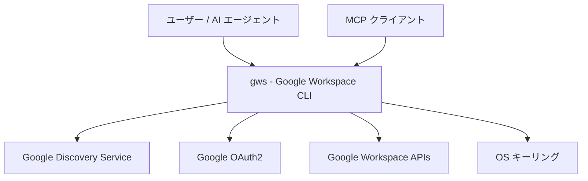
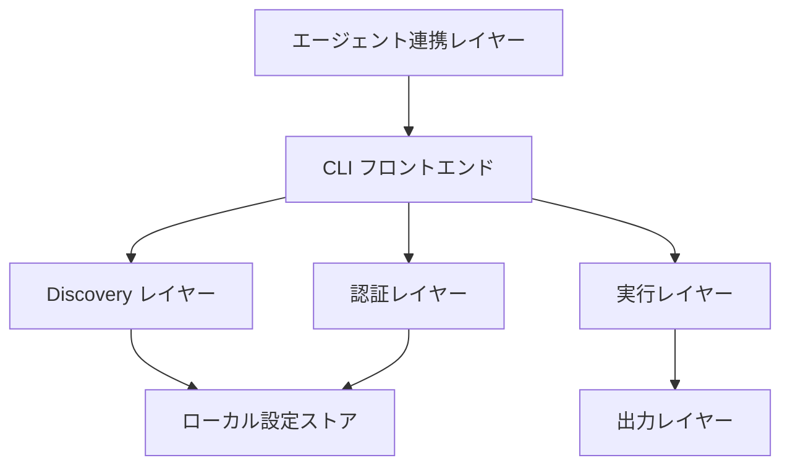
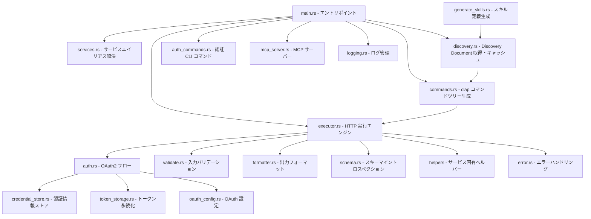
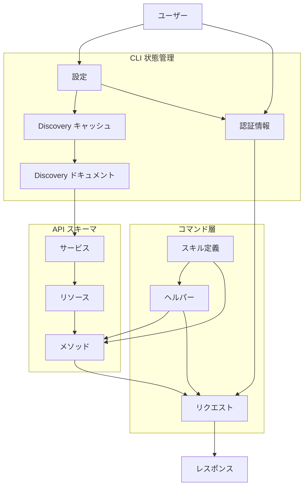
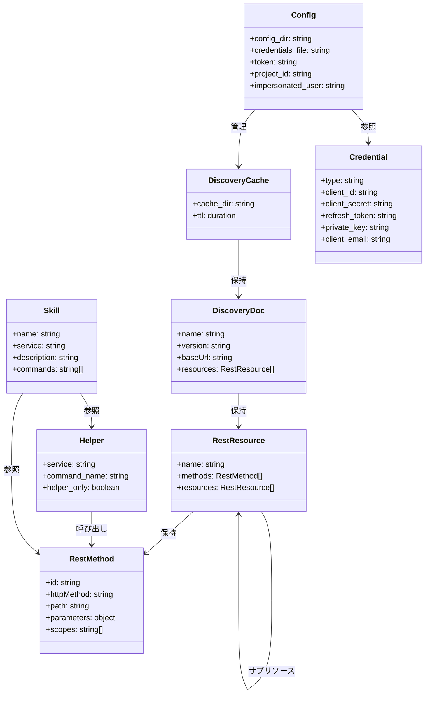

## 概要

Google Workspace CLI（`gws`）は、Drive・Gmail・Calendar・Sheets・Docs・Chat・Admin など、すべての Google Workspace API を操作するコマンドラインインターフェースです。

人間と AI エージェントの両方を対象とし、1つのツールで全 Workspace 操作を提供します。

npm パッケージ `@googleworkspace/cli` として配布される Rust 製バイナリです（Apache-2.0 ライセンス）。

> 注意: 本ツールは Google の公式サポート対象外製品です。

**この記事で分かること:**

- gws の内部アーキテクチャ（Discovery 動的生成、二段階引数解析、Rust モジュール構成）
- 通常コマンドとヘルパーコマンドの違い、Workflow によるクロスサービス連携
- MCP サーバー / AI エージェントスキルとの統合方法
- 認証セットアップから CI/CD 運用までの実践的な手順

## 特徴

### 動的コマンド生成

- 起動時に Google Discovery Service を参照し、コマンド体系を動的に構築
- Google が新しい API エンドポイントを追加した時点で、CLI の更新なしに利用可能
- 二段階引数解析で実現:
  1. **第1段階**: サービス名とグローバルフラグを解析（Discovery 取得前）
  2. **第2段階**: Discovery Document を取得し、リソース・メソッド・パラメータの clap::Command ツリーを動的構築
- Discovery Document は `~/.config/gws/discovery_cache/` に 24 時間キャッシュ

### 構造化出力

- すべてのレスポンスを JSON（または YAML・CSV・テーブル形式）で出力
- パイプラインや AI エージェントとの統合に適した形式

### AI エージェント対応

| 機能 | 内容 |
|---|---|
| Agent Skills | 100以上のスキルファイルを同梱し、LLM が gws を利用する方法を定義 |
| MCP サーバー | `gws mcp` で stdio 経由の MCP サーバーを起動し、Claude Desktop 等から直接呼び出し可能 |
| スキーマイントロスペクション | `gws schema` コマンドで API コールなしにリクエスト/レスポンスのスキーマを確認可能 |
| Model Armor 連携 | Google Cloud Model Armor によるレスポンスのサニタイズに対応 |

### 開発者向け機能

- `--dry-run` フラグで実際の API コールなしにリクエスト内容をプレビュー
- `--page-all` オプションで自動ページネーションを行い、NDJSON 形式でストリーム出力
- `+upload`・`+send`・`+append` などのヘルパーコマンドで複雑な操作を簡略化
- タブ補完とリソースごとの `--help` を提供

### 認証方式

| 方式 | 用途 |
|---|---|
| インタラクティブ OAuth | 開発・個人利用 |
| サービスアカウント | ドメイン全体の委任 |
| 事前取得アクセストークン | 外部フローとの連携 |
| ヘッドレス / CI 向けエクスポート | 自動化パイプライン |

## 構造

### システムコンテキスト図



| 要素名 | 説明 |
|---|---|
| ユーザー / AI エージェント | CLI を直接操作する人間またはスクリプト |
| gws - Google Workspace CLI | Google Workspace API への統一 CLI ツール |
| Google Discovery Service | API スキーマ定義を提供する外部サービス |
| Google OAuth2 | 認可コードの交換とトークン発行を担う外部サービス |
| Google Workspace APIs | Drive, Gmail, Calendar, Sheets, Docs, Chat, Admin などの REST API |
| OS キーリング | 認証情報を暗号化保存するプラットフォーム固有のストア |
| MCP クライアント | Model Context Protocol 経由で gws を呼び出す Claude Desktop などのクライアント |

### コンテナ図



| 要素名 | 説明 |
|---|---|
| CLI フロントエンド | 引数の二段階解析を制御するエントリポイント |
| Discovery レイヤー | Discovery Document の取得とコマンドツリーの動的構築 |
| 認証レイヤー | OAuth フローの実行と認証情報の解決 |
| 実行レイヤー | HTTP リクエストの構築・送信・レスポンス処理 |
| 出力レイヤー | JSON, YAML, CSV, テーブル形式への変換 |
| エージェント連携レイヤー | MCP サーバーとスキル生成 |
| ローカル設定ストア | Discovery キャッシュと認証情報を保存するファイルシステム上のストア |

### コンポーネント図



| 要素名 | 説明 |
|---|---|
| main.rs - エントリポイント | 二段階引数解析を制御し、各モジュールを統括 |
| services.rs - サービスエイリアス解決 | "drive" などのエイリアスを API 名とバージョンにマッピング |
| discovery.rs - Discovery Document 取得・キャッシュ | Google Discovery Service から API スキーマを取得し 24 時間キャッシュ |
| commands.rs - clap コマンドツリー生成 | Discovery スキーマから clap::Command ツリーを動的構築 |
| auth.rs - OAuth2 フロー | yup-oauth2 を使用してヘッドレス OAuth2 フローを実行 |
| auth_commands.rs - 認証 CLI コマンド | gws auth サブコマンドの実装 |
| credential_store.rs - 認証情報ストア | AES-256-GCM で暗号化した認証情報ファイルを管理 |
| token_storage.rs - トークン永続化 | アクセストークンとリフレッシュトークンを永続化 |
| oauth_config.rs - OAuth 設定 | クライアント ID, スコープなどの OAuth 設定を保持 |
| executor.rs - HTTP 実行エンジン | HTTP リクエストの構築・送信・ページネーション・ファイル操作 |
| validate.rs - 入力バリデーション | インジェクション攻撃に対する入力の安全性を検証 |
| formatter.rs - 出力フォーマット | レスポンスを JSON, YAML, CSV, テーブル形式に変換 |
| schema.rs - スキーマイントロスペクション | gws schema コマンドでリクエスト・レスポンス構造を表示 |
| helpers - サービス固有ヘルパー | +send, +upload, +agenda などのサービス固有ラッパー |
| mcp_server.rs - MCP サーバー | stdio 経由で Model Context Protocol を実装し API を公開 |
| generate_skills.rs - スキル定義生成 | Discovery Document から AI エージェント向けスキル定義を生成 |
| error.rs - エラーハンドリング | 構造化 JSON 形式でエラーを出力 |
| logging.rs - ログ管理 | ファイルまたは stderr へのログ出力を制御 |

## データ

### 概念モデル

gws 自身が管理するデータに焦点を当てています。各 Workspace API のドメインモデル（File, Message, Event 等）は gws が動的に扱う対象であり、gws 固有のデータモデルには含めていません。



| 要素名 | 説明 |
|---|---|
| ユーザー | CLI を操作する人間または AI エージェント |
| 設定 | CLI の動作設定。設定ディレクトリ・環境変数・.env ファイルから読み込み |
| Discovery キャッシュ | Discovery ドキュメントのローカルキャッシュ。24 時間有効 |
| 認証情報 | OAuth2 トークンまたはサービスアカウントキー。暗号化ストアまたは環境変数で管理 |
| Discovery ドキュメント | Google Discovery Service から取得する API スキーマ定義 |
| サービス | Google Workspace API の単位（drive / gmail / calendar 等） |
| リソース | サービス配下の操作対象（files / messages / events 等）。入れ子構造でサブリソースを保持 |
| メソッド | リソースに対する HTTP 操作（list / get / insert 等）。パラメータとスコープを保持 |
| ヘルパー | 複数の API コールや複雑なデータ変換を抽象化する高水準コマンド。+ プレフィックスで識別 |
| スキル定義 | AI エージェント向けにコマンドの使い方を定義する YAML ファイル |
| リクエスト | メソッドへの入力（パスパラメータ・クエリパラメータ・リクエストボディ） |
| レスポンス | メソッドからの出力（JSON / NDJSON / テーブル等） |

### 情報モデル



| 要素名 | 説明 |
|---|---|
| Config | CLI 設定。環境変数または設定ディレクトリのファイルから読み込み |
| DiscoveryCache | Discovery ドキュメントのローカルキャッシュ。cache_dir と ttl（24 時間）で管理 |
| Credential | 認証情報の実体。OAuth2 の場合は client_id / client_secret / refresh_token、サービスアカウントの場合は private_key / client_email を保持 |
| DiscoveryDoc | Google Discovery Service から取得する API 定義。name と version でサービスを識別 |
| RestResource | Discovery ドキュメント内のリソース定義。入れ子構造でサブリソースを保持 |
| RestMethod | リソース内の操作定義。HTTP メソッド・パス・パラメータ・スコープを保持 |
| Helper | サービスに紐づくヘルパーコマンド定義。helper_only が true の場合は Discovery コマンドを非表示 |
| Skill | AI エージェント向けのスキル定義。対象のサービス・ヘルパー・メソッドへの参照を保持 |

## 構築方法

### インストール方法の比較

| 方法 | コマンド | 前提条件 |
|------|----------|----------|
| npm（推奨） | `npm install -g @googleworkspace/cli` | Node.js 18+ |
| Cargo（ソースビルド） | `cargo install --git https://github.com/googleworkspace/cli --locked` | Rust ツールチェーン |
| ローカルビルド | `cargo install --path .` | Rust ツールチェーン + リポジトリクローン |
| Nix | `nix run github:googleworkspace/cli` | Nix |
| バイナリ直接 | GitHub Releases からダウンロード | - |

### npm インストール（推奨）

- プラットフォームごとにネイティブバイナリを同梱
- Rust ツールチェーンは不要

```bash
npm install -g @googleworkspace/cli
```

対応プラットフォーム:

| OS | アーキテクチャ |
|----|--------------|
| macOS | ARM - aarch64 |
| macOS | x86_64 |
| Linux | x86_64 |
| Windows | x86_64 |

### ソースからビルド

```bash
git clone https://github.com/googleworkspace/cli
cd cli
cargo install --path .
```

開発時のコマンド:

```bash
cargo build               # 開発ビルド
cargo clippy -- -D warnings  # リント
cargo test                # ユニットテスト
```

## 利用方法

### 認証セットアップ

#### 初回セットアップ

- `gws auth setup` は TUI ウィザードで Google Cloud プロジェクト作成・API 有効化・OAuth 設定を自動化
- `gcloud` CLI のインストールが前提条件

```bash
gws auth setup   # 初回のみ
gws auth login   # 2回目以降
```

#### 認証情報の優先順位

| 優先度 | 方法 | 設定値 |
|--------|------|--------|
| 1 | 環境変数（トークン直接指定） | `GOOGLE_WORKSPACE_CLI_TOKEN` |
| 2 | 環境変数（認証情報ファイル） | `GOOGLE_WORKSPACE_CLI_CREDENTIALS_FILE` |
| 3 | 暗号化済みストア | `~/.config/gws/credentials.enc` |
| 4 | プレーンテキスト | `~/.config/gws/credentials.json` |

#### CI / ヘッドレス環境

```bash
# 認証済みマシンでエクスポート
gws auth export --unmasked > credentials.json

# ヘッドレスマシンで利用
export GOOGLE_WORKSPACE_CLI_CREDENTIALS_FILE=/path/to/credentials.json
gws drive files list
```

#### サービスアカウント

```bash
export GOOGLE_WORKSPACE_CLI_CREDENTIALS_FILE=/path/to/service-account.json
export GOOGLE_WORKSPACE_CLI_IMPERSONATED_USER=admin@example.com
gws drive files list
```

### 基本コマンド構文

```
gws <service> <resource> [sub-resource] <method> [flags]
```

ヘルプは各レベルで参照できます:

```bash
gws --help
gws drive --help
gws drive files --help
gws drive files list --help
```

### 主要フラグ

| フラグ | 説明 |
|--------|------|
| `--params '<JSON>'` | クエリパラメータ・パス変数 |
| `--json '<JSON>'` | リクエストボディ（POST/PUT/PATCH） |
| `--fields '<mask>'` | レスポンスフィールドの絞り込み |
| `--dry-run` | 実行せずにリクエスト内容を確認 |
| `--format json\|table\|yaml\|csv` | 出力形式（デフォルト: json） |
| `--page-all` | ページネーション結果を NDJSON で全件取得 |
| `--page-limit <N>` | 取得ページ数の上限 |
| `--upload <path>` | ファイルのマルチパートアップロード |
| `--output <path>` | バイナリをファイルにダウンロード |
| `--sanitize <template>` | Cloud Model Armor でレスポンスをサニタイズ |

### サービス別コマンド例

#### Drive

```bash
# ファイル一覧（フィールド絞り込み）
gws drive files list --params '{"pageSize": 10}' --fields "files(id,name,mimeType)"

# ファイル検索
gws drive files list --params '{"q": "name contains \"Report\"", "pageSize": 10}'

# ファイルアップロード（ヘルパー）
gws drive +upload ./report.pdf --parent FOLDER_ID

# ファイルダウンロード
gws drive files get --params '{"fileId": "FILE_ID", "alt": "media"}' --output ./downloaded.pdf

# フォルダ作成
gws drive files create --json '{"name": "Project Files", "mimeType": "application/vnd.google-apps.folder"}'

# 権限付与
gws drive permissions create \
  --params '{"fileId": "FILE_ID"}' \
  --json '{"role": "reader", "type": "user", "emailAddress": "user@example.com"}'

# 全件ページネーション
gws drive files list --params '{"pageSize": 100}' --page-all | jq -r '.files[].name'
```

#### Gmail

```bash
# メール送信（ヘルパー）
gws gmail +send --to alice@example.com --subject 'Hello' --body 'Hi Alice!'

# 受信トレイのトリアージ
gws gmail +triage --max 5 --query 'from:boss'

# メッセージ検索
gws gmail users messages list --params '{"userId": "me", "q": "is:unread"}'

# メッセージ取得
gws gmail users messages get --params '{"userId": "me", "id": "MSG_ID"}'
```

#### Calendar

```bash
# 直近のイベント表示（ヘルパー）
gws calendar +agenda
gws calendar +agenda --week --format table

# イベント作成（ヘルパー）
gws calendar +insert \
  --summary 'Team Standup' \
  --start '2024-06-17T09:00:00-07:00' \
  --end '2024-06-17T09:30:00-07:00' \
  --attendee alice@example.com
```

#### Sheets

```bash
# スプレッドシート作成
gws sheets spreadsheets create --json '{"properties": {"title": "Q4 Budget"}}'

# 範囲の値を取得
gws sheets spreadsheets values get \
  --params '{"spreadsheetId": "ID", "range": "Sheet1!A1:C10"}'

# 行を追記（ヘルパー）
gws sheets +append --spreadsheet SHEET_ID --range 'Sheet1!A:C' --values '["col1","col2"]'
```

#### Docs

```bash
# ドキュメント作成
gws docs documents create --json '{"title": "Meeting Notes"}'

# テキスト追記（ヘルパー）
gws docs +write --document DOC_ID --text 'Hello, world!'
```

#### Chat

```bash
# スペース一覧
gws chat spaces list

# メッセージ送信（ヘルパー）
gws chat +send --space spaces/AAAAxxxx --text 'Hello team!'

# メッセージ送信（dry-run 付き）
gws chat spaces messages create \
  --params '{"parent": "spaces/xyz"}' \
  --json '{"text": "Deploy complete."}' \
  --dry-run
```

### ヘルパーコマンド - + プレフィックス

#### ヘルパーコマンドとは

ヘルパーコマンドは、通常の Discovery 自動生成コマンドでは冗長・複雑な操作を、シンプルなインターフェースで提供する高水準コマンド群です。

通常コマンドとの違い:

| 側面 | 通常の API コマンド | ヘルパーコマンド |
|---|---|---|
| 生成元 | Discovery Document から自動生成 | Rust の Helper トレイト実装 |
| API 対応 | REST メソッドと 1:1 マッピング | 複数ステップの操作を抽象化 |
| 名前形式 | `gws gmail users messages send` | `gws gmail +send` |
| 追加基準 | 全 API メソッドが対象 | 複雑さの抽象化が必要なもののみ |

ヘルパーコマンドは以下の条件を満たす場合のみ追加されます:

- **Complex Abstraction**: MIME エンコーディング、複雑な JSON 構造、複数 API コールの抽象化
- **Format Conversion**: ユーザーにとって面倒なデータ変換の処理
- 単純な API エイリアスは対象外

#### サービス別ヘルパーコマンド一覧

**Gmail**

| コマンド | 用途 | 内部の仕組み |
|---|---|---|
| `+send` | メール送信 | RFC 2822 MIME を構築し Base64url エンコードして `messages.send` を呼び出し |
| `+triage` | 未読メール一覧 | `messages.list` で ID 取得後、各メッセージの metadata を並行取得して結合 |
| `+reply` | メール返信 | 元メッセージのスレッド ID・Message-ID・References を解析して正しいスレッドに返信 |
| `+reply-all` | 全員返信 | `+reply` と同様だが To/Cc に元の全受信者を含める |
| `+forward` | メール転送 | 元メッセージを取得し転送フォーマットで送信 |
| `+watch` | 新着メール監視 | Pub/Sub と Gmail Push 通知を組み合わせて NDJSON ストリーム出力 |

```bash
gws gmail +send --to bob@example.com --subject "Notes" --body "Here are the notes..."
gws gmail +send --to bob@example.com --subject "HTML" --body "<b>Hello</b>" --html
gws gmail +triage --query 'label:support' --max 50
```

**Drive**

| コマンド | 用途 | 内部の仕組み |
|---|---|---|
| `+upload` | ファイルアップロード | ファイルパスから名前と MIME タイプを自動検出し、マルチパートアップロードで `files.create` を呼び出し |

```bash
gws drive +upload ./report.pdf
gws drive +upload ./data.csv --parent FOLDER_ID --name "Sales Data Q1.csv"
```

**Calendar**

| コマンド | 用途 | 内部の仕組み |
|---|---|---|
| `+agenda` | 予定一覧表示 | 全カレンダーのイベントを取得して見やすい形式で表示。アカウントタイムゾーンを自動取得 |
| `+insert` | イベント作成 | フラグから JSON を構築して `events.insert` を呼び出し |

```bash
gws calendar +agenda
gws calendar +agenda --week --format table
gws calendar +insert --summary "Standup" --start "2026-06-17T09:00:00-07:00" --end "2026-06-17T09:30:00-07:00" --attendee alice@example.com
```

**Sheets / Docs / Chat**

| サービス | コマンド | 用途 | 内部の仕組み |
|---|---|---|---|
| Sheets | `+append` | 行の追加 | ValueRange JSON を自動構築して `values.append` を呼び出し |
| Sheets | `+read` | セル値の読み取り | `values.get` を簡素化したインターフェースで呼び出し |
| Docs | `+write` | テキストの追記 | `batchUpdate` の InsertText リクエストを自動構築 |
| Chat | `+send` | メッセージ送信 | `spaces.messages.create` を簡素化して呼び出し |

**Workflow（クロスサービス）**

`workflow` サービスは Discovery コマンドを持たず、ヘルパーコマンドのみで構成されています。複数の Workspace API を組み合わせた高レベルなワークフローを提供します。

| コマンド | 用途 | 組み合わせる API |
|---|---|---|
| `+standup-report` | 今日のスタンドアップ | Calendar Settings → Calendar Events → Tasks |
| `+meeting-prep` | 次のミーティング準備 | Calendar Settings → Calendar Events |
| `+email-to-task` | メールをタスクに変換 | Gmail → Tasks |
| `+weekly-digest` | 週次サマリー | Calendar Settings → Calendar Events → Gmail |
| `+file-announce` | Drive ファイルをチャットで告知 | Drive Files → Chat Messages |

```bash
gws workflow +standup-report --format table
gws workflow +meeting-prep
gws workflow +email-to-task --message-id MSG_ID
gws workflow +weekly-digest --format table
gws workflow +file-announce --file-id FILE_ID --space spaces/ABC123
```

**Events / Model Armor**

| サービス | コマンド | 用途 |
|---|---|---|
| Events | `+subscribe` | Pub/Sub と Workspace Events API を組み合わせてイベントを NDJSON ストリーム出力 |
| Events | `+renew` | 購読の更新 |
| Model Armor | `+sanitize-prompt` | プロンプトの安全性チェック |
| Model Armor | `+sanitize-response` | レスポンスの安全性チェック |
| Model Armor | `+create-template` | サニタイズテンプレートの作成 |

### スキーマの確認

```bash
gws schema drive.files.list
gws schema drive.File --resolve-refs
```

### 環境変数

| 変数名 | 説明 |
|--------|------|
| `GOOGLE_WORKSPACE_CLI_TOKEN` | アクセストークン直接指定 |
| `GOOGLE_WORKSPACE_CLI_CREDENTIALS_FILE` | 認証情報ファイルのパス |
| `GOOGLE_WORKSPACE_CLI_CONFIG_DIR` | 設定ディレクトリの上書き |
| `GOOGLE_WORKSPACE_CLI_IMPERSONATED_USER` | Domain-Wide Delegation 対象ユーザー |
| `GOOGLE_WORKSPACE_CLI_SANITIZE_TEMPLATE` | デフォルト Model Armor テンプレート |
| `GOOGLE_WORKSPACE_CLI_SANITIZE_MODE` | `warn` または `block` |
| `GOOGLE_WORKSPACE_CLI_LOG` | ログレベル（例: `gws=debug`） |
| `GOOGLE_WORKSPACE_CLI_LOG_FILE` | JSON ログのローテーションディレクトリ |
| `GOOGLE_WORKSPACE_PROJECT_ID` | GCP プロジェクト ID の上書き |

カレントディレクトリの `.env` ファイルは自動で読み込まれます。

### 終了コード

| コード | 意味 |
|--------|------|
| `0` | 成功 |
| `1` | API エラー（4xx/5xx） |
| `2` | 認証失敗 |
| `3` | 引数不正 / パラメータ不足 |

### AI エージェント連携

#### スキルのインストール

```bash
# 全スキルのインストール
npx skills add https://github.com/googleworkspace/cli

# 特定サービスのスキルのみインストール
npx skills add https://github.com/googleworkspace/cli/tree/main/skills/gws-drive

# Gemini CLI 拡張機能として利用
gemini extensions install https://github.com/googleworkspace/cli
```

#### MCP サーバーの設定

Claude Desktop の `claude_desktop_config.json` に以下を追加します:

```json
{
  "mcpServers": {
    "gws": {
      "command": "gws",
      "args": ["mcp"]
    }
  }
}
```

MCP サーバーは stdio 経由で通信し、gws の全コマンドをツールとして公開します。

#### スキルファイルの構造

スキルファイルは `skills/` ディレクトリに YAML 形式で格納されています:

```
skills/
  gws-drive/         # Drive 操作スキル
  gws-gmail/         # Gmail 操作スキル
  gws-calendar/      # Calendar 操作スキル
  gws-sheets/        # Sheets 操作スキル
  gws-admin/         # Admin 操作スキル
  ...
```

各スキルファイルは、LLM がどのコマンドをどのような状況で使用すべきかを定義します。

## 運用

認証のセットアップ手順（初回セットアップ、CI/CD 環境、サービスアカウント）は「利用方法 > 認証セットアップ」を参照してください。

### ページネーション制御

```bash
# 全ページを自動取得（NDJSON 形式で出力）
gws drive files list --page-all

# ページ数を制限して取得
gws drive files list --page-all --page-limit 5 --page-delay 200
```

| フラグ | デフォルト | 用途 |
|--------|------------|------|
| `--page-all` | オフ | 全ページの自動取得を有効化 |
| `--page-limit` | 10 | 取得する最大ページ数 |
| `--page-delay` | 100ms | リクエスト間の待機時間 |

### 出力フォーマット

```bash
gws drive files list --format table
gws drive files list --format csv
gws drive files list --format yaml
```

| フォーマット | 特徴 |
|-------------|------|
| `json` | デフォルト。`--page-all` 使用時は NDJSON |
| `table` | 列揃えで表示。ネストはドット記法で展開 |
| `yaml` | ページごとに 1 ドキュメント |
| `csv` | ヘッダー行＋データ行形式 |

### Model Armor によるレスポンスのサニタイズ

エージェントワークフローでプロンプトインジェクション攻撃を防ぐために使用します。

```bash
# コマンドごとに指定
gws gmail users messages get \
  --params '{"userId": "me", "id": "MSG_ID"}' \
  --sanitize "projects/PROJECT/locations/LOCATION/templates/TEMPLATE"

# 環境変数でデフォルト設定
export GOOGLE_WORKSPACE_CLI_SANITIZE_TEMPLATE="projects/P/locations/L/templates/T"
export GOOGLE_WORKSPACE_CLI_SANITIZE_MODE="block"
```

## ベストプラクティス

### 書き込み前に --dry-run で検証する

実際の API 呼び出しを行わずにリクエストを検証します。

```bash
gws sheets spreadsheets create \
  --json '{"properties": {"title": "Q1 Budget"}}' \
  --dry-run
```

### --fields でレスポンスを絞り込む

不要なフィールドを除外して通信量とトークン消費を削減します。

```bash
gws drive files list \
  --params '{"pageSize": 10}' \
  --fields "files(id,name,mimeType)"
```

### スキーマ確認を先に行う

未知のメソッドを呼ぶ前にスキーマを確認して、正しいパラメータを把握します。

```bash
# メソッドのスキーマを確認
gws schema drive.files.list

# リソース型のスキーマを確認
gws schema drive.File

# $ref を再帰的に解決
gws schema drive.File --resolve-refs
```

### Sheets の範囲をシングルクォートで囲む

シェル展開を防ぐために、`!` を含む範囲指定はシングルクォートで囲みます。

```bash
gws sheets spreadsheets values get \
  --params '{"spreadsheetId": "ID", "range": "Sheet1!A1:C10"}'
```

### --page-all に --page-limit を組み合わせる

過剰な API 呼び出しを防ぐためにページ数を制限します。

```bash
gws drive files list --page-all --page-limit 20
```

### エージェントワークフローでは --sanitize を有効にする

メール・ドキュメントなど信頼できないコンテンツを処理する場合は、常に Model Armor を使用します。

```bash
export GOOGLE_WORKSPACE_CLI_SANITIZE_TEMPLATE="projects/P/locations/L/templates/T"
export GOOGLE_WORKSPACE_CLI_SANITIZE_MODE="block"
```

### 認証情報を標準出力に出力しない

gws は設計上、認証情報を stdout に出力しません。スクリプト内でも同様の扱いを徹底します。

## トラブルシューティング

### 終了コード一覧

スクリプト内でエラー種別を判定するために使用します。

| コード | 意味 |
|--------|------|
| 0 | 成功 |
| 1 | API エラー（4xx/5xx レスポンス） |
| 2 | 認証エラー（認証情報が未設定・期限切れ・無効） |
| 3 | バリデーションエラー（不正な引数・未知のサービス） |
| 4 | Discovery エラー（API スキーマの取得失敗） |
| 5 | 内部エラー（予期しない障害） |

### API が有効化されていない

- エラーレスポンスの `enable_url` フィールドに記載された URL で API を有効化
- 有効化後、約 10 秒待ってから再実行
- `gws auth setup` で API 有効化を自動化可能

### ログイン時に Access blocked または 403 エラーが発生する

- OAuth 同意画面でアカウントをテストユーザーとして登録
- GCP プロジェクトの OAuth 同意画面設定から追加

### ログイン時に Google hasn't verified this app 警告が表示される

- テストモードでは正常な表示
- 「詳細設定」から「安全でないページへ移動」をクリックして続行

### スコープ制限エラーが発生する

未検証アプリはスコープ数に上限（約 25）があります。必要なスコープのみを指定してログインします。

```bash
gws auth login --scopes drive,gmail,calendar
```

### redirect_uri_mismatch エラーが発生する

- OAuth クライアントの種類が「デスクトップアプリ」になっていない場合に発生
- GCP の認証情報画面で既存のクライアントを削除し、「デスクトップアプリ」タイプで新規作成
- 新しい JSON をダウンロードして再セットアップ

### デバッグログを有効にする

```bash
export GOOGLE_WORKSPACE_CLI_LOG=gws=debug
gws drive files list
```

### ヘルプコマンドでコマンド体系を確認する

```bash
gws --help                                    # 利用可能なサービス一覧
gws drive --help                              # サービス配下のリソース一覧
gws drive files --help                        # リソース配下のメソッド一覧
gws drive files list --help                   # メソッドのパラメータ詳細
```

## まとめ

Google Workspace CLI（gws）は、Discovery Service から動的にコマンドを生成する Rust 製 CLI で、40 以上の Workspace API を 1 つのツールで操作できます。MCP サーバーや 100 以上のスキルファイルにより、AI エージェントとの統合にも対応しています。

この記事が少しでも参考になった、あるいは改善点などがあれば、ぜひリアクションやコメント、SNSでのシェアをいただけると励みになります！

## 参考リンク

- 公式ドキュメント
  - [Google Workspace Developer Tools](https://developers.google.com/workspace/guides/developer-tools)
  - [Google Discovery Service](https://developers.google.com/discovery)
  - [Drive API Reference](https://developers.google.com/drive/api/reference/rest)
  - [Gmail API Reference](https://developers.google.com/gmail/api/reference/rest)
  - [Calendar API Reference](https://developers.google.com/calendar/api/v3/reference)
  - [Google Cloud Model Armor](https://cloud.google.com/model-armor)
  - [OAuth 2.0 for Desktop Apps](https://developers.google.com/identity/protocols/oauth2/native-app)
- GitHub
  - [Google Workspace CLI - GitHub](https://github.com/googleworkspace/cli)
  - [AGENTS.md - googleworkspace/cli](https://github.com/googleworkspace/cli/blob/main/AGENTS.md)
  - [Google Workspace CLI Releases](https://github.com/googleworkspace/cli/releases)
  - [Google Workspace CLI Issues](https://github.com/googleworkspace/cli/issues)
  - [Google Workspace CLI Discussions](https://github.com/googleworkspace/cli/discussions)
- 記事
  - [Google Workspace CLI - deepwiki](https://deepwiki.com/googleworkspace/cli)
  - [Google Workspace CLI - npm](https://www.npmjs.com/package/@googleworkspace/cli)
