> 調査対象: Google Cloud Security が社内で AI をどう使い、「自律的なソフトウェア開発ライフサイクル (autonomous SDLC) セキュリティ」へどう近づいているか。
> 一次情報: [Cloud CISO Perspectives: How Google Cloud Security uses AI internally](https://cloud.google.com/blog/products/identity-security/cloud-ciso-perspectives-how-google-cloud-security-uses-ai-internally/) (Google Cloud Blog, 2026-06-30)

## 概要

Google Cloud Security チームは、社内で実用化した AI セキュリティ基盤を「自律 SDLC セキュリティ (Autonomous SDLC Security)」として公開しました。中心的な主張は、ソフトウェア開発ライフサイクル全体のセキュリティを **human-dependent checklists から proactive multi-agent orchestration へ** 転換するというパラダイムシフトです。

従来の静的チェックや単発の AI 自動化では、脅威の検出・修正・知見の蓄積が断片化し、同じ脆弱性が繰り返し生まれる問題を防げませんでした。自律 SDLC セキュリティは、設計からデプロイ後の姿勢管理までを **閉じたループ (closed loop)** として設計し、エージェントが自己反省 (self-reflection) を通じて知見を蓄積することで「複利効果 (compounding-interest effect)」を生み出します。

長期ビジョンは **"immune" software development** です。アプリケーションが自らの弱点をリアルタイムに発見・検証・修正できる状態を指します。Google は、AI が脆弱性悪用の経済性を覆し、従来の patching window を実質的に消したと述べ、これに機械速度で対抗する基盤として自律 SDLC セキュリティを位置づけています。

### 自律 SDLC セキュリティの 5 ステージ閉ループ

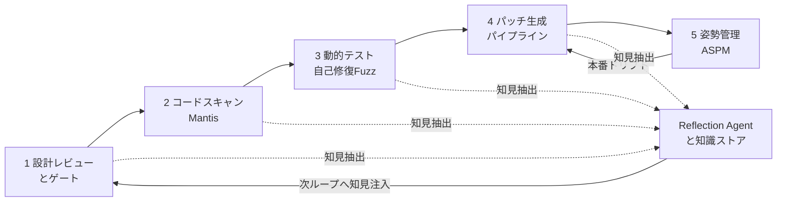

| 要素 | 説明 |
|---|---|
| 1 設計レビューとゲート | エージェントが設計を 200 以上のセキュリティ要件カタログと照合し、静的な脅威モデルを動的な product dossier に置換します |
| 2 コードスキャン Mantis | multi-agent orchestration でリポジトリを解析します。階層的セキュリティサマリツリーによりトークンオーバーヘッドを 85% 超削減します |
| 3 動的テスト 自己修復Fuzz | 自己修復型 fuzz testing で fuzz harness を自動生成・ビルド・実行します。AI 生成の PoC を隔離環境で動かし、実際の悪用可能性を検証します |
| 4 パッチ生成パイプライン | Reproduce から Bug Context、Patch、Evaluation の多段パイプラインです。再コンパイルと回帰テスト後、検証済み修正のみ人間レビューへ提出します |
| 5 姿勢管理 ASPM | 本番の設定ドリフトを継続監視し、違反検知時に agentic remediation を自動トリガします |
| Reflection Agent と知識ストア | 5 ステージを横断するフィードバックループです。ワークフロー完了後に成功軌跡を Global Knowledge Store に永続化し、次ループのエージェントへ注入します |

## 特徴

- **5 ステージ閉ループ**: 設計レビューからコードスキャン、動的テスト、パッチ生成、姿勢管理までを単一の closed-loop として設計し、工程間の断絶を排除します。
- **multi-agent orchestration**: Strategist・Research・Deduplicator・Critic・Reproduction・Hallucination Cleaner・Reflection など役割特化エージェントを組み合わせ、単一 LLM では届かない精度と規模を実現します。
- **Self-Reflection による状態蓄積**: Reflection Agent が実行ログ・ツール履歴・人間フィードバックを解析し、成功パターンを Global Knowledge Store に永続化します。次回のエージェント起動時にコンテキストウィンドウへ注入し「複利効果」を生みます。
- **stateless 失敗モードの克服**: 状態を持たない AI は同じ論理的罠に繰り返し陥り、存在しないコードを幻覚します。post-hoc self-reflection loop がこの失敗モードに対処します。
- **"immune software development" ビジョン**: アプリケーションが自らの弱点をリアルタイムに発見・検証・修正できる状態を最終目標に掲げます。
- **machine-speed threat response**: 従来の週から月単位の patching window を実質的に消し、脅威を悪用前に検出・修正する速度を目指します。
- **Mantis の 85% トークン削減**: 階層的セキュリティサマリツリーにより、大規模リポジトリのスキャンコストを大幅に抑制します。
- **Reproduction Sandbox**: AI 生成の PoC エクスプロイトを隔離環境で実行し、悪用可能性を事実として確認してからパッチ生成へ進みます。
- **人間を排除しない設計**: 高リスク指標と最終パッチ展開には人間の承認を残し、エージェントは検証済みの fix のみ人間レビューへ提出します。
- **産業規模へのスケール**: 人員数に依存しないスケーラビリティを設計原則とします。

### 関連技術・系譜との関係

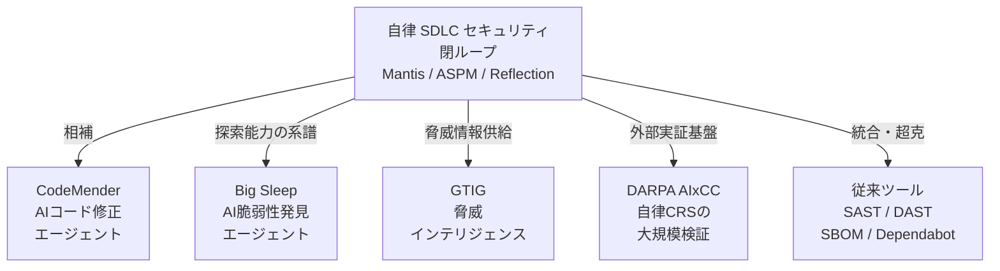

| 技術・プロジェクト | 説明 | 自律 SDLC との関係 |
|---|---|---|
| Mantis | Google 製のセキュリティレビュー用 Skills 群 (Apache-2.0, github.com/google/mantis)。Coding Agent から呼び出す | Stage 2 コードスキャンの中核実装 |
| CodeMender | Google DeepMind 製の AI コード修正エージェント。脆弱性の根本原因を特定し自動パッチを生成する | Stage 4 パッチ生成と相補的な独立製品 |
| Big Sleep | Google DeepMind と Project Zero の AI 脆弱性発見エージェント。実コードの未知脆弱性発見を実証した | Stage 2-3 の脅威発見能力を示す先行実証 |
| DARPA AIxCC | DARPA 主催の AI サイバー競技。多チームが大規模コードを自律分析した | 自律 CRS (Cyber Reasoning System) の外部実証基盤 |
| AI Threat Defense | Google Cloud の脅威防御サービス群 | 自律 SDLC の外側に位置する防御レイヤー |
| GTIG | Google Threat Intelligence Group。AI を利用した攻撃者行動を追跡する | Stage 1 設計・脅威モデルの脅威情報ソース |
| SAST / DAST | 静的・動的アプリケーションセキュリティテスト | 統合・超克される対象。単体では true-positive rate が低い |
| SBOM / Dependabot | ソフトウェア部品表と依存関係の既知脆弱性追跡 | 既知 CVE の依存管理に限定。コードロジックの脆弱性には対応しない |

> 注: Mantis は起点ブログ本文の中核です。CodeMender・VPC Service Controls・GTIG・Confidential Computing は起点ブログと同一ページ (本文または関連セクション) で言及されています。Big Sleep・DARPA AIxCC・従来ツール群はこのブログには直接登場せず、系譜・位置づけを示すための外部補完情報です。

### 従来手法との比較

| 軸 | 従来の human-checklist 型 | 単発 AI 自動化 | 自律 SDLC セキュリティ (閉ループ) |
|---|---|---|---|
| 対象工程 | 特定フェーズ (主にリリース前レビュー) | 個別ツール単位 (スキャン or パッチ) | 設計から本番姿勢管理までの全 SDLC |
| 状態保持 | なし (都度チェックリスト) | なし (stateless) | あり (Global Knowledge Store に永続化) |
| 人間の役割 | 全判断・全操作 | 結果確認と手動対応 | 高リスク判断の最終承認とパッチ最終レビュー |
| スケール特性 | 人員数に依存 | 単一ツールの処理上限内 | multi-agent 並列で産業規模 |
| true-positive rate | スキル依存。スケールで劣化 | 素朴な AI スキャンで 7% 未満 | Mantis の多段フィルタで改善 |
| トークンコスト | 非該当 | 大規模コードベースで膨大 | 階層サマリツリーで 85% 超削減 |
| 知見の蓄積 | ドキュメント依存 (陳腐化) | なし | Reflection Agent が自動更新し次ループへ注入 |
| 脅威への応答速度 | 週から月単位 | 数日単位 | machine-speed |

## 構造

C4 モデルを「提案フレームワークの論理構造」として読み替えて記述します (方法論を対象とするため)。

### システムコンテキスト図

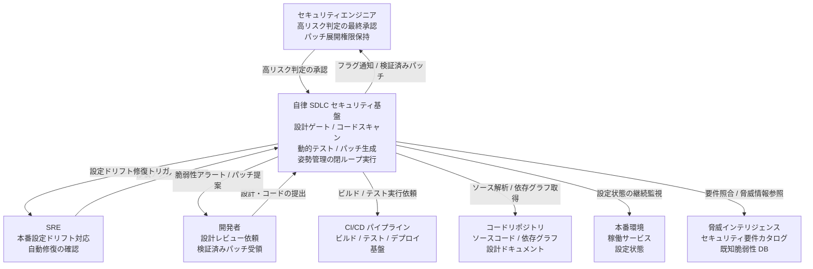

| 要素 | 説明 |
|---|---|
| セキュリティエンジニア | 高リスク指標のトリアージ結果を受け取り最終承認します。パッチ展開の最終権限を保持します |
| SRE | 本番の設定ドリフト修復アクションを確認し、必要に応じて介入します |
| 開発者 | 設計とコードを基盤に提出し、検証済みパッチおよび脆弱性アラートを受け取ります |
| 自律 SDLC セキュリティ基盤 | 設計レビューからパッチ生成・姿勢管理までを閉ループで実行する中核システムです |
| CI/CD パイプライン | ビルド・テスト・デプロイを担う外部基盤です。基盤から呼び出されてコード検証を実行します |
| コードリポジトリ | ソースコードと依存グラフ、設計ドキュメントを保管する外部システムです |
| 本番環境 | 稼働サービスの設定状態を継続監視される対象です |
| 脅威インテリジェンス | 200 超のセキュリティ要件カタログおよび既知脆弱性データベースを提供する外部情報源です |

### コンテナ図

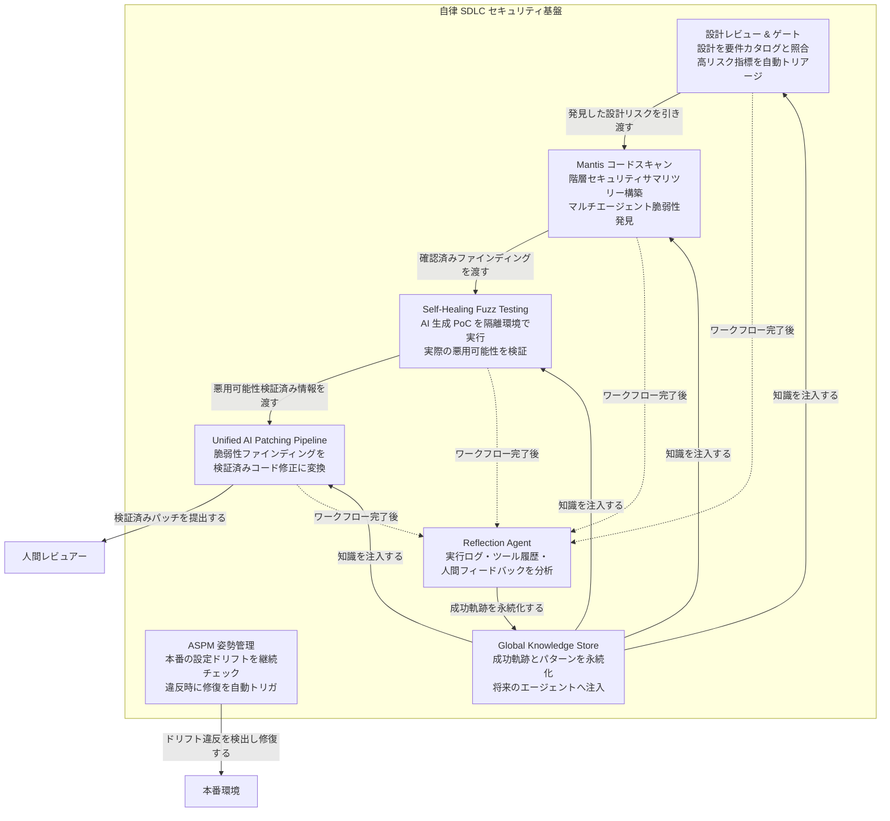

| コンテナ | 説明 |
|---|---|
| 設計レビュー & ゲート | エージェントが製品設計を 200 超のセキュリティ要件カタログと照合し、高リスク指標を自動トリアージして人間介入フラグを立てます |
| Mantis コードスキャン | 階層セキュリティサマリツリーを構築してトークンオーバーヘッドを 85% 超削減し、マルチエージェントで文脈を保持したリポジトリ解析を実行します |
| Self-Healing Fuzz Testing | コンテキスト合成からハーネス生成・ビルド・実行・品質調整までをエージェントが自律実行し、生成 PoC を隔離環境で動かして実際の悪用可能性を検証します |
| Unified AI Patching Pipeline | 脆弱性ファインディングを受け取り、再現・バグ文脈マッピング・パッチ生成・リグレッション検証の多段階処理で検証済み修正コードを生成します |
| ASPM 姿勢管理 | セキュリティ標準カタログをスキルファイルに変換して本番設定を継続監視し、ドリフト検出時にエージェント修復を自動トリガします |
| Reflection Agent | ワークフロー完了後に実行ログ・ツール履歴・人間フィードバックを分析し、成功軌跡を Global Knowledge Store に永続化します |
| Global Knowledge Store | 成功した軌跡と設計パターンを蓄積し、将来のエージェント起動時にコンテキストウィンドウへ注入して複利的な改善をもたらします |

### コンポーネント図

#### Mantis コードスキャン

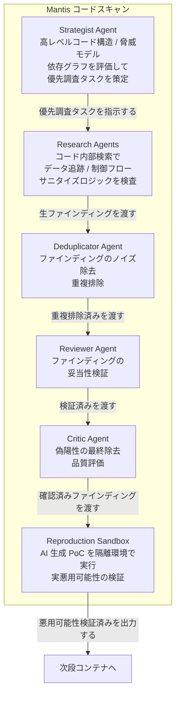

| コンポーネント | 説明 |
|---|---|
| Strategist Agent | リポジトリの高レベルコード構造・脅威モデル・依存グラフを評価し、リスクの高いアーキテクチャパターンを特定して優先調査タスクを策定します |
| Research Agents | Strategist が指示したタスクに沿ってコード内部検索を実行し、データ追跡・制御フロー・サニタイズロジックを詳細に検査します |
| Deduplicator Agent | Research Agents の生ファインディングからノイズを除去し、重複するバグ報告を排除します |
| Reviewer Agent | 重複排除済みファインディングの妥当性を検証します |
| Critic Agent | 偽陽性を最終除去し、ファインディング全体の品質を評価します |
| Reproduction Sandbox | 確認済みファインディングに対して AI 生成 PoC エクスプロイトを隔離環境で実行し、実際の悪用可能性を開発者アラート前に検証します |

#### Self-Healing Fuzz Testing

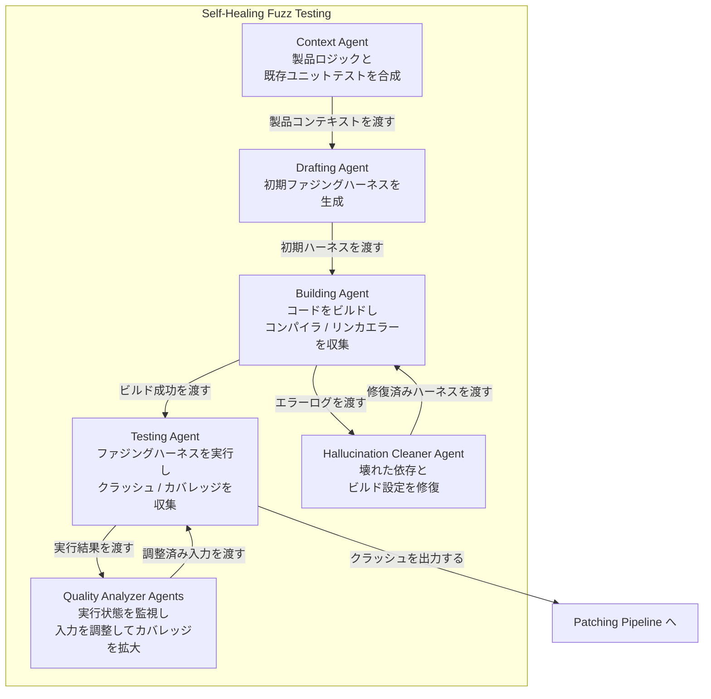

| コンポーネント | 説明 |
|---|---|
| Context Agent | 製品ロジックと既存ユニットテストを合成してファジングハーネス生成に必要なコンテキストを準備します |
| Drafting Agent | コンテキストをもとに初期ファジングハーネスを生成します |
| Building Agent | ハーネスをビルドし、コンパイラ・リンカエラーを収集して Hallucination Cleaner に渡します |
| Testing Agent | ビルド成功したハーネスを実行してクラッシュとカバレッジデータを収集します |
| Hallucination Cleaner Agent | Building Agent が収集したエラーをもとに壊れた依存関係とビルド設定を自動修復し、ハーネスを再ビルド可能な状態に戻します |
| Quality Analyzer Agents | Testing Agent の実行状態をリアルタイム監視し、コードブロッカーを回避して複雑なステートフル API の深部まで到達するよう入力を能動的に調整します |

#### Unified AI Patching Pipeline

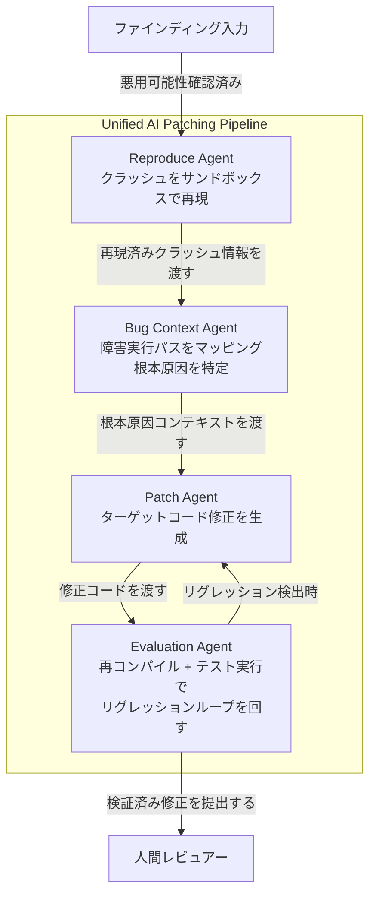

| コンポーネント | 説明 |
|---|---|
| Reproduce Agent | 受け取ったファインディングをサンドボックス内でクラッシュとして再現します |
| Bug Context Agent | 障害実行パスをトレースし、根本原因と影響範囲をマッピングします |
| Patch Agent | Bug Context Agent が特定した根本原因に基づきターゲットを絞ったコード修正を生成します |
| Evaluation Agent | 生成パッチを再コンパイルしてテストスイートを実行するリグレッションループで安全性を検証し、合格した修正のみ人間レビュアーに提出します |

#### ASPM 姿勢管理

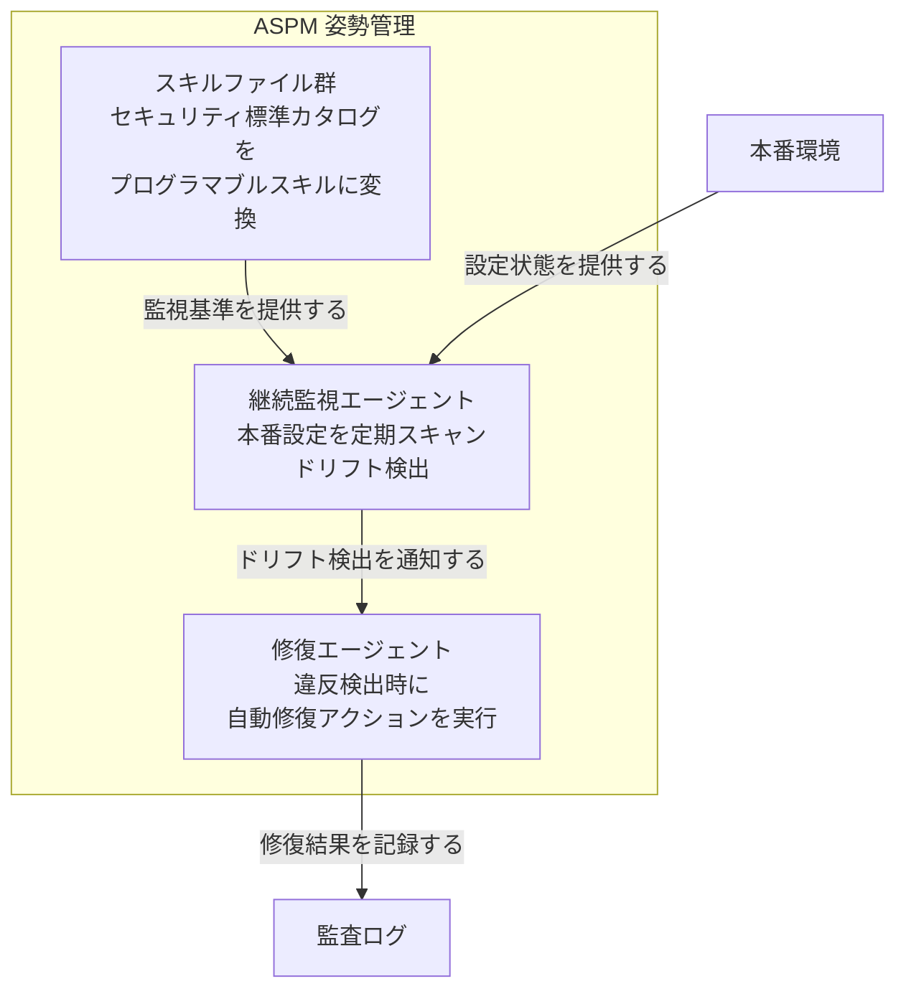

| コンポーネント | 説明 |
|---|---|
| スキルファイル群 | セキュリティ標準カタログをプログラマブルなスキルファイルに変換して監視基準として機能させます |
| 継続監視エージェント | スキルファイルの基準に照らして本番設定を継続的にスキャンし、設定ドリフトを検出します |
| 修復エージェント | ドリフト違反を検知した際に自動修復アクションをトリガし、本番環境の設定を基準状態に戻します |

#### Reflection Agent と Global Knowledge Store

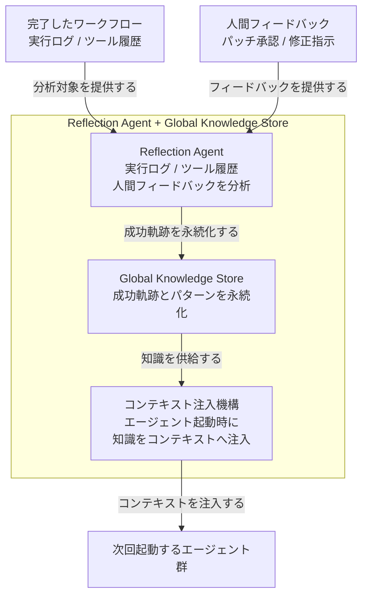

| コンポーネント | 説明 |
|---|---|
| Reflection Agent | ワークフロー完了後に実行ログ・ツール履歴・人間フィードバックを分析し、成功軌跡と設計パターンを抽出します |
| Global Knowledge Store | Reflection Agent が抽出した成功軌跡とパターンを永続化して蓄積します |
| コンテキスト注入機構 | 将来のエージェント起動時に Global Knowledge Store の知識をコンテキストウィンドウへ直接注入し、複利的な改善効果をもたらします |

### 閉ループのデータフロー / 制御フロー

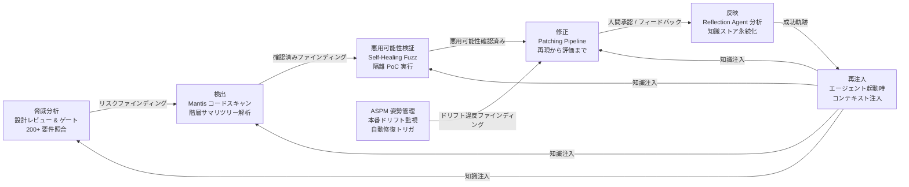

| フロー | 説明 |
|---|---|
| 脅威分析 → 検出 | 設計レビュー & ゲートが特定したリスクファインディングを Mantis コードスキャンに渡します |
| 検出 → 悪用可能性検証 | Mantis が確認したファインディングを Self-Healing Fuzz Testing が PoC 実行で実際の悪用可能性として検証します |
| 悪用可能性検証 → 修正 | 悪用可能性が確認されたファインディングを Patching Pipeline が受け取りパッチを生成します |
| 修正 → 反映 | 人間レビュアーの承認・フィードバックを Reflection Agent が分析して成功軌跡を抽出します |
| 反映 → 再注入 | 知識ストアに永続化した知識をコンテキスト注入機構が次回エージェント起動時に供給し、ループの精度を継続改善します |
| ASPM → 修正 | 本番環境の設定ドリフト違反を ASPM が検出し、Patching Pipeline に類似したアクションでエージェント修復をトリガします |

## データ

### 概念モデル

エンティティの所有関係を subgraph で、利用・生成関係を矢印で示します。

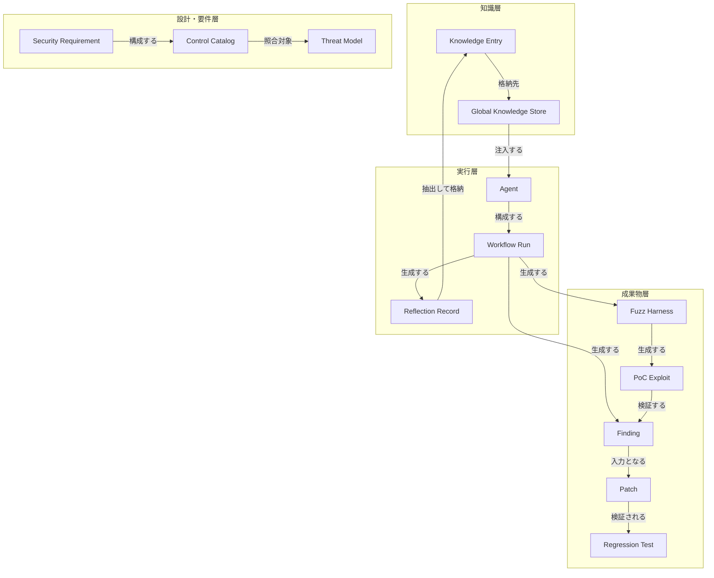

### 情報モデル

主要エンティティの属性と多重度を示します。ブログに明示のない属性は注記で補足します。

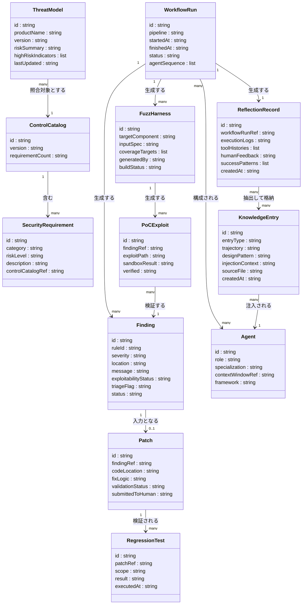

### エンティティ説明

| エンティティ | 説明 | 属性の根拠 |
|---|---|---|
| Finding (脆弱性発見) | Mantis のコードスキャンまたは Fuzz テストが出力する個別の脆弱性発見物。SARIF 標準の result オブジェクトに対応します | `ruleId` / `severity` / `location` は SARIF v2.1.0 から補完。`triageFlag` / `exploitabilityStatus` はブログ記述から推測 |
| ThreatModel (動的 product dossier) | 設計フェーズで生成される動的なセキュリティ分析ドキュメント。静的チェックリストを置き換え、200+ 要件カタログと照合します | `highRiskIndicators` / `lastUpdated` はブログ記述から推測 |
| SecurityRequirement | Control Catalog が保持する個別のセキュリティ管理項目 | ブログは「200+ のセキュリティ要件カタログ」と明示。`category` / `riskLevel` は一般的な脆弱性管理から補完 |
| ControlCatalog | 200+ の SecurityRequirement を束ねるカタログ。ASPM のスキルファイルの生成元でもあります | `requirementCount` はブログ明示値 200+ を反映 |
| FuzzHarness | 動的テストフェーズで Context/Drafting Agent が自動生成するテストケース生成器 | `coverageTargets` は推測。`buildStatus` は Hallucination Cleaner の修復対象であることから導出 |
| PoCExploit | AI が生成し、隔離 Reproduction Sandbox で実行する概念実証コード | `sandboxResult` はブログの「悪用可能性を検証する」記述から導出 |
| Patch | Patch Agent が生成し、Evaluation Agent が regression loop で検証後に人間レビューへ提出する修正物 | `validationStatus` / `submittedToHuman` はブログ記述から推測 |
| RegressionTest | パッチ適用後に Evaluation Agent が実行する再コンパイル + テスト | `scope` / `result` は一般的な脆弱性管理から補完 |
| ReflectionRecord | Workflow Run 完了後に Reflection Agent が生成する実行ログ・ツール履歴・人間フィードバックの集合 | `successPatterns` はブログ記述から推測 |
| KnowledgeEntry | Global Knowledge Store が保持する永続化済み学習成果物 | `trajectory` / `designPattern` はブログ明示の用語。`injectionContext` は注入記述から導出。`sourceFile` は実装上 Mantis の `learnings.jsonl` / `historical_learnings.jsonl` に対応 (README) |
| Agent | 各パイプラインで特化した役割を担う自律 AI | `framework` は Mantis / Fuzz Pipeline / Patching Pipeline のいずれかを格納 |
| WorkflowRun | 1 つのパイプライン実行単位 | `agentSequence` は推測。Reflection Agent が後処理の起点として参照します |

### 標準データモデルとの対応

| このモデルのエンティティ | 対応する業界標準の概念 |
|---|---|
| Finding | SARIF v2.1.0 の result オブジェクト (ruleId / level / message / locations) |
| SecurityRequirement | CWE エントリ、NIST SP 800-53 管理策 |
| FuzzHarness | OSS-Fuzz / libFuzzer の corpus entry |
| PoCExploit | CVSS v3 の exploitability 指標 (AV/AC/PR/UI) に相当 |
| Patch | CycloneDX / SPDX の patch タグ、VEX の remediation フィールド |
| RegressionTest | CI/CD の test result artifact |
| KnowledgeEntry | SBOM の component relationship + vulnerability reference の永続化版に相当 |

## 構築方法

自律 SDLC セキュリティを自社で検証・再現する出発点としては、Google が OSS 公開している **Mantis Skills** が使えます (README は "demonstration purposes only" と明記しており、そのままの本番導入は想定されていません)。Mantis Skills はコードスキャン・PoC 再現・パッチ生成などの中核スキルを実装しています。残りのステージ (設計ゲート・ASPM) は既存ツールや CI/CD パイプラインと組み合わせて構成します。

> 以降のコード例は、一次ブログの設計思想を自社環境で再現するための **実装案** です。Mantis のスキル名・状態ファイル名は github.com/google/mantis の README で確認済みですが、コーディングエージェントへの組み込み方法は利用するエージェント (Gemini CLI / Claude Code 等) の仕様に従って調整してください。

### Mantis Skills の取得

Mantis Skills は「Portable Toolkit for Building Security Review Harnesses」として GitHub に公開された、Coding Agent 向けのセキュリティレビュー用 Skills 群です。

- **リポジトリ**: `https://github.com/google/mantis` (Apache-2.0)
- **構成**: README は中核パイプラインを "ten distinct components (one supervisor and nine execution stages)" と定義します。これに前処理・補助スキル (`/mantis_history`・`/mantis_summarize`・`/mantis_chain`・`/mantis_calibrate`・`/mantis_pipeline_adapter`) を含め、リポジトリには計 16 個の `SKILL.md` モジュールがあります。`/mantis_meta_agent` (スーパーバイザ) が継続レビューループを統括します
- **公開範囲**: ブログは「core skills を OSS 公開、より完全な版を社内運用」と述べています
- **注意**: README は "not an officially supported Google product"、"USE AT YOUR OWN RISK"、そして "intended for demonstration purposes only. It is not intended for use in a production environment." と明記しています。本番相当の利用には自社での大幅な追加ハードニングと検証が前提です

```bash
# Mantis Skills を取得 (実装案)
# 参考: https://github.com/google/mantis README
git clone https://github.com/google/mantis
# 各 mantis_* ディレクトリの SKILL.md を、利用するコーディングエージェントが
# スキルとして発見できる場所に配置する (配置方法はエージェント仕様に従う)
```

### 前提条件

| 要件 | 詳細 |
|---|---|
| Coding Agent | SKILL.md を解釈できるエージェント (例: Gemini CLI、Claude Code 等) |
| 隔離環境 | `/mantis_reproduce` 等は自律生成コードを実行するため、本番・機微データ・内部ネットワークから隔離した環境が必須 |
| ビルド/実行ツール | スキャン対象のビルドシステムと、サンドボックス実行のためのコンテナ基盤 (例: Docker + gVisor) |
| 動的テスト併用時 | `oss-fuzz-gen` (Python 製) を併用する場合は Python 環境と Vertex AI 認証 |

### 作業ディレクトリ構造

Mantis のスキル群は、スキャン対象リポジトリ配下に状態ファイル群を読み書きします (README で確認)。

```
<target-repo>/
├── workspace/
│   ├── findings/   # finding ごとの JSON (workspace/findings/<id>.json)
│   └── kb/         # Markdown ナレッジベース (THREAT_MODEL.md 等。architecture / threat_model が生成)
├── <dir>/mantis_summary.md   # ディレクトリ別サマリ (mantis_summarize が生成)
├── plan.json                 # 調査計画 (mantis_plan が生成)
├── learnings.jsonl           # Reflection / Critic / Patch が追記、architecture が次ループ開始時にクリア
└── historical_learnings.jsonl # mantis_history が VCS 履歴から抽出
```

> 後続の利用方法 YAML 例に出てくる `threat_model.json` / `patch.json` / `reproduce.json` / `calibrate.json` などのファイル名は、CI に組み込む際の **実装案の例示** です。Mantis 本体の finding は `workspace/findings/<id>.json` 単位で管理され、脅威モデルは `workspace/kb/THREAT_MODEL.md` に出力されます (README)。

### Mantis スキルパイプラインの全体像

README の Architecture によると、パイプラインは `/mantis_meta_agent` (スーパーバイザ) が統括し、以下のステージが状態ファイルを介して順次連携します。`Pat` から `Rep` への「Re-attack Bypass Loop」、`Ref` から `Arch` への「Next Loop Iteration」で継続学習ループを構成します。

| ステージ (スキル) | 役割 |
|---|---|
| `/mantis_meta_agent` | スーパーバイザ。ループ起動・監視・エラー処理・発見物の報告・findings ディレクトリのアーカイブ |
| `/mantis_history` | (前処理・任意, meta_agent 常用ループ外) VCS 履歴から過去の脆弱性・修正パターンを抽出 |
| `/mantis_summarize` | (任意) ディレクトリ別サマリ生成。下流の計画・調査を最適化 |
| `/mantis_architecture` | ナレッジベース (workspace/kb/) を構築。learnings.jsonl をクリア |
| `/mantis_threat_model` | 脅威モデルを生成・更新 |
| `/mantis_plan` | 調査計画 (plan.json) を生成 |
| `/mantis_researcher` | 計画に沿ってコードを調査し finding を作成 |
| `/mantis_dedupe` | finding の重複統合 |
| `/mantis_review` | finding の妥当性検証 |
| `/mantis_critic` | 偽陽性の最終除去 |
| `/mantis_reproduce` | サンドボックスで PoC を再現 |
| `/mantis_chain` | マルチステップ exploit チェーンを構築 |
| `/mantis_patch` | パッチを生成 |
| `/mantis_calibrate` | リスクスコアを算出 |
| `/mantis_reflect` | trajectory を解析し learnings.jsonl に追記 |
| `/mantis_pipeline_adapter` | 外部パイプラインへの組み込み用アダプタ |

### 隔離サンドボックス環境の要件 (実装案)

自律実行を本番相当の環境で動かす場合、README が求める隔離要件を満たす構成例を示します。

```text
GCE ハードニング VM 構成 (実装案)
├── ネットワーク分離
│   ├── VPC Service Controls ペリメータ設定
│   ├── 外部インターネット接続を禁止
│   └── 信頼済みプロキシ経由のみ許可
├── IAM 最小権限
│   ├── カスタムロール: モデル推論に必要な権限のみ付与
│   └── 専用サービスアカウントによる実行
└── ストレージ
    └── GCS バケット: 追記専用 (append-only) + バージョニング有効
```

## 利用方法

各ステージの具体的な実装案を示します。コード例は実装案であり、一次ブログに存在しない実装詳細は補完元 (Mantis README / OSS 公式) を出典として明示します。

### ステージ 1: 設計ゲート (GitHub Actions 例)

ブログの説明: エージェントが設計を 200+ のセキュリティ要件カタログと照合し、静的な脅威モデルを動的な product dossier に置換します。

実装案として、PR 作成時に設計ドキュメントと脅威モデルの差分を AI エージェントでレビューし、要件カタログと照合するゲートを CI に組み込みます。

```yaml
# .github/workflows/security-design-gate.yml (実装案)
# 参考: GitHub Actions 公式ドキュメント https://docs.github.com/en/actions
name: Security Design Gate
on:
  pull_request:
    paths:
      - 'docs/design/**'
      - 'docs/threat-model/**'
      - 'src/**'
jobs:
  design-review:
    runs-on: ubuntu-latest
    steps:
      - uses: actions/checkout@v4
      - name: Run threat model skill (coding agent)
        env:
          GOOGLE_APPLICATION_CREDENTIALS: ${{ secrets.GCP_SA_KEY }}
        run: |
          # コーディングエージェントから /mantis_threat_model スキルを実行する
          ./scripts/run-agent-skill.sh mantis_threat_model
      - name: Check findings against requirements catalog
        run: |
          python3 scripts/check_requirements.py \
            --findings workspace/findings/threat_model.json \
            --catalog docs/security-requirements.json \
            --fail-on critical,high
      - name: Upload SARIF report
        uses: github/codeql-action/upload-sarif@v3
        with:
          sarif_file: workspace/findings/sarif_output.sarif
```

- `security-requirements.json` に 200 以上の要件を定義し、`check_requirements.py` が照合結果を SARIF 形式で出力する構成が実用的です。要件ファイルの最小スキーマ例 (実装案):

```json
{
  "version": "1.0",
  "requirements": [
    {
      "id": "SR-001",
      "category": "Authentication",
      "risk_level": "critical",
      "description": "外部通信を行うコンポーネントは相互 TLS 認証を必須とする",
      "control_catalog_ref": "NIST SP 800-53 IA-3"
    }
  ]
}
```

- ゲート閾値 (`--fail-on`) は初期は `critical` のみにし、安定後に `high` へ引き上げることが推奨されます (参考: GitHub Advanced Security)

### ステージ 2: コードスキャン (Mantis)

ブログの説明: Mantis がトークンオーバーヘッドを 85% 超削減しながら大規模リポジトリ全体の構造コンテキストを保持します。素朴な AI コードスキャンの true-positive rate が 7% 未満という問題に対処します。

実装案として、ターゲットリポジトリに対して Mantis のコアスキャンパイプラインを順次実行します。

```bash
# コーディングエージェントから Mantis スキルを順次実行する (実装案)
# 参考: https://github.com/google/mantis README

cd <target-repo>

# Phase 1: ナレッジベース構築
#   /mantis_history     (任意・VCS 履歴抽出)
#   /mantis_summarize   (任意・ディレクトリ別サマリ)
#   /mantis_architecture (workspace/kb/ 構築)

# Phase 2: 調査計画と実行
#   /mantis_threat_model
#   /mantis_plan
#   /mantis_researcher

# Phase 3: 偽陽性除去
#   /mantis_dedupe
#   /mantis_review
#   /mantis_critic
```

- Mantis は階層的なセキュリティサマリツリーを構築し、ブルートフォースなコード取り込みを排除します。これがトークン削減の核心メカニズムです (ブログ記載)
- `/mantis_meta_agent` をスーパーバイザとして使うと、上記ループの起動・監視・findings アーカイブを自動化できます (README 記載)

### ステージ 3: 動的テスト (OSS-Fuzz-Gen による Fuzz Harness 自動生成)

ブログの説明: self-healing fuzz testing。AI 生成 PoC exploit を隔離環境で実行し実際の悪用可能性を検証します。

実装案として、Google の `oss-fuzz-gen` を使い、LLM で fuzz harness を自動生成して OSS-Fuzz インフラで実行します。

```bash
# oss-fuzz-gen のセットアップ (実装案)
# 参考: https://github.com/google/oss-fuzz-gen
git clone https://github.com/google/oss-fuzz-gen
cd oss-fuzz-gen
python3 -m venv .venv
source .venv/bin/activate
pip install -r requirements.txt

# Vertex AI 認証
gcloud auth application-default login
export CLOUD_ML_PROJECT_ID=<your-gcp-project>
export VERTEX_AI_LOCATIONS=us-central1
```

- OSS-Fuzz-Gen は Fuzz Introspector でカバレッジの低い関数を特定し、その関数をターゲットにした harness を LLM で生成します (公式ドキュメント記載)
- ビルドエラーが出た場合は別の LLM クエリで自動修正する反復修正ループを内蔵します
- Mantis 連携では `/mantis_reproduce` がサンドボックス内で PoC を実行し、`/mantis_chain` がマルチステップ exploit チェーンを構築します

### ステージ 4: パッチ生成 (patch → regression → 人間レビュー)

ブログの説明: 脆弱性 finding を検証済みコード修正に変換する multi-stage pipeline。再コンパイル + テスト実行の regression loop 後、検証済み fix のみ人間レビューへ提出します。

実装案として、Mantis の `/mantis_patch` でパッチを生成し、`/mantis_calibrate` でリスクスコアを算出し、CI で regression を通過したものだけ PR として提出します。

```yaml
# .github/workflows/security-patch-review.yml (実装案)
# 参考: GitHub Actions 公式ドキュメント
name: Security Patch Regression Check
on:
  pull_request:
    branches: [security/*]
jobs:
  regression-check:
    runs-on: ubuntu-latest
    steps:
      - uses: actions/checkout@v4
      - name: Build patched code
        run: make build
      - name: Run regression tests
        run: make test SUITE=regression
      - name: Verify vulnerability fix
        run: |
          python3 scripts/verify_patch.py \
            --findings workspace/findings/patch.json \
            --exploit workspace/findings/reproduce.json
      - name: Auto-label PR with risk score
        uses: actions/github-script@v7
        with:
          script: |
            const score = require('./workspace/findings/calibrate.json').risk_score;
            const label = score >= 8 ? 'security:critical' : score >= 5 ? 'security:high' : 'security:medium';
            github.rest.issues.addLabels({
              ...context.repo,
              issue_number: context.payload.pull_request.number,
              labels: [label]
            });
```

- 高リスクスコアの場合は自動的に Security チームへのレビュー依頼をトリガする運用が実用的です
- パッチの最終展開権限は人間レビュアーが保持します (ブログ記載の human-in-the-loop 設計)

### ステージ 5: 姿勢管理 (ASPM 的な Config Drift 検知)

ブログの説明: 本番の config drift を継続チェックし、違反時に agentic remediation を自動トリガします。

実装案として、Open Policy Agent (OPA) や Conftest による設定検証を CI/CD + cron ジョブで継続実行し、違反検知時に修復スキルを起動します。

```yaml
# .github/workflows/config-drift-detect.yml (実装案)
# 参考: OPA 公式ドキュメント https://www.openpolicyagent.org/docs/latest/
name: Config Drift Detection
on:
  schedule:
    - cron: '0 */6 * * *'
  push:
    paths:
      - 'infra/**'
      - 'k8s/**'
jobs:
  drift-check:
    runs-on: ubuntu-latest
    steps:
      - uses: actions/checkout@v4
      - name: Install Conftest
        run: |
          curl -L https://github.com/open-policy-agent/conftest/releases/latest/download/conftest_Linux_x86_64.tar.gz | tar xz
          sudo mv conftest /usr/local/bin/
      - name: Check config against policy baseline
        id: drift
        run: |
          conftest test infra/ --policy policies/security/ --output json > drift_report.json
      - name: Trigger agentic remediation on violation
        if: steps.drift.outputs.violations != '0'
        run: |
          ./scripts/run-agent-skill.sh mantis_patch --input drift_report.json
```

- ASPM 専用ツール (Cycode / Wiz 等) との連携も選択肢です。これらはコード・クラウド間の追跡機能を備えます

### Reflection agent と Global Knowledge Store の運用

ブログの説明: ワークフロー完了後に Reflection agent が実行ログ・ツール履歴・人間フィードバックを分析し、成功 trajectory を global knowledge store に永続化します (compounding-interest effect)。

Mantis では `/mantis_reflect` が trajectory を解析して `learnings.jsonl` に追記し、次ループ開始時に `/mantis_architecture` がこれを読み込みつつクリアします。この継続学習ループにより、エージェントが同じ論理的罠を繰り返すことを防ぎます。

## 運用

### 監視・可観測性の設計

- Reflection agent は各ワークフロー完了後に実行ログ・ツール履歴・人間フィードバックを分析します。リアルタイム監視ではなく事後分析 (post-hoc) が基本設計です。
- エージェントに非人間アイデンティティ (non-human identity) を割り当て、パッケージ取得・API コール・ツール呼び出しを監査ログへ記録します。
- ログは不変かつクエリ可能な形式で保存します。コンプライアンス証跡がエンジニアリングプロセスの副産物として自動生成されるよう設計します。
- 既存の observability スタックに AI エージェントのメトリクス (実行回数・失敗率・トークン消費量) を統合します。

### 人間レビュー gate の運用

- Gate は 3 層で設計します。
  1. **設計レビュー gate**: 高リスク指標 (外部通信・権限昇格・暗号変更等) を自動 triage で人間エンジニアへエスカレーションします。
  2. **パッチ提出 gate**: 再コンパイル + テスト実行の regression loop を通過した fix のみ人間レビュアーへ提出します。
  3. **展開最終 gate**: パッチ展開の最終承認権限を人間が保持します。
- gate の閾値 (high-risk 判定基準) はポリシーファイルで明文化し、バージョン管理します。
- progressive autonomy を採用します。低リスクシステムで修正提案のみの半自律から始め、一貫性を確認後に自動化範囲を拡大します。

### 知識ストアの保守

- 知識ストアにはバージョン管理と検証プロセスが必要です。誤った学習パターンが蓄積すると、全エージェントの挙動が一様に劣化します。
- 知識エントリの削除・修正権限を SecOps チームが保持し、定期キュレーションサイクル (例: 四半期レビュー) を設けます。
- 知識ストアへの注入は context 汚染を防ぐため、関連性スコアで上位 N 件に絞ります。

### ASPM による config drift 監視

- 200 以上のセキュリティ要件カタログをプログラマブルなスキルファイルとして管理し、本番システムの config drift を継続チェックします。
- 違反検出時は agentic remediation を自動トリガします。修復試行ログを監査証跡として保存します。
- 違反ルールのオーナーシップ (チーム / サービス) を台帳で管理します。
- config drift の検出から修復確認までのサイクルタイムを SLO として定義します (例: Critical 違反は 4 時間以内)。

### エージェント実行の観測

- 各エージェント起動に一意の実行 ID を付与し、使用ツール・呼び出し順序・入出力ハッシュを構造化ログとして記録します。
- Mantis の Strategist → Research → Deduplicator → Reviewer → Critic の各エージェント間で実行トレースを連結し、finding の来歴を再現可能にします。
- Hallucination Cleaner agent が介入した箇所をログに記録し、幻覚の傾向をトラッキングします。

## ベストプラクティス

### human-in-the-loop 境界の設計

- **自律化の対象を限定します**: 定型的な修正 (既知 CVE の既存パッチ適用・設定値修正) は自律化候補です。複雑なアーキテクチャ変更・ビジネスロジック変更は人間判断を必須とします。
- **エスカレーション基準を事前定義します**: 高リスク指標 (外部 API 通信変更・認証フロー変更・暗号アルゴリズム変更) はポリシーで明示します。
- **「検証済み fix のみレビューへ」を厳守します**: パッチが regression loop を通過した証拠 (テスト結果ログ) をレビュー UI に表示します。

| 修正カテゴリ | 自律実行 | 人間レビュー必須 | 人間承認必須 |
|---|---|---|---|
| 設定値 drift 修復 | 可 (低リスク) | 要 (中リスク) | 要 (高リスク) |
| 既知 CVE パッチ | regression 通過後 | 常時 | 展開時 |
| ゼロデイ修正 | 不可 | 必須 | 必須 |
| アーキテクチャ変更 | 不可 | 不可 | 必須 |

### false positive 抑制

- 素朴な AI コードスキャンの true-positive rate は 7% 未満です (一次ブログ)。単体の LLM スキャンを本番アラートに直結させません。
- Mantis の多段フィルタリングを参考にパイプラインを構成します。
  1. Deduplicator agent で重複 finding を除去します。
  2. Reviewer + Critic agents で文脈を考慮した false positive 除去を行います。
  3. Reproduction sandbox で AI 生成 PoC を隔離環境で実行し、実際の悪用可能性を確認してからアラート発報します。
- LLM を SAST の後段フィルタとして使う手法が実証されています (Datadog)。CWE マッピングと周辺コードを LLM に評価させ、true/false positive を判定します。

### stateless 失敗モード対策 (self-reflection)

- stateless AI は同じ論理的罠に繰り返し陥り、特に存在しないコードを修正しようとする幻覚が起きやすいです。
- 対策として self-reflection ループを導入します。ワークフロー完了後に実行ログを分析し、失敗 trajectory を次回起動時の context に注入します。
- リアルタイムのフィードバックループも有効です。コンパイラ・リンカエラーを即時 Hallucination Cleaner agent へフィードし、幻覚サイクルを断ち切ります。

### エージェント workload の隔離 (VPC Service Controls perimeter)

- VPC Service Controls (VPC-SC) をエージェント workload のネットワークレベル・宛先ベースのペリメータとして設定します。有効な IAM 認証情報を持つ侵害済みエージェントからのデータ持ち出しも防げます。
- エージェントに IAM principal として個別アイデンティティを付与し、ingress/egress ルールで制御します。
- MCP ツール粒度の条件付きアクセスを設定します。read 権限のみを許可し、外部書き込みを明示的に拒否します。

| 脅威 | OWASP 参照 | VPC-SC の防止方法 |
|---|---|---|
| 間接プロンプトインジェクション | LLM01 系 | ペリメータ外 webhook へのデータ転送をブロック |
| ツール悪用 | Agentic AI 系 | 信頼ゾーン間のデータブリッジを拒否 |
| インサイダー脅威 / 持ち出し | Agentic AI 系 | 宛先リソースを評価しペリメータ外への転送を拒否 |

### 責任境界とレビュー工程の再設計

- AI エージェントが生成したパッチの責任所在を人間が保持することを組織ポリシーで明文化します。AI の高い確信度スコアは人間の判断を代替しません。
- どのエージェント・モデル・バージョンが修正を生成したかを追跡できるよう provenance を整備します。SLSA の provenance 要件に対応する基盤になります。
- NIST SSDF (SP 800-218) の PW.4 (レビュー)・PW.8 (テスト) を AI 工程にマッピングし、既存の SDLC 証跡体系に統合します。
- 規制対応システム (金融・医療・個人情報処理) では、自律修正の適用範囲を事前に監査委員会と合意します。

### SecOps の職務分解

自律化により SecOps の役割は「脆弱性を手動でトリアージ・修正する人」から「AI パイプラインを設計・監督・改善する人」へシフトします。

| 旧職務 | 新職務 | 担当の目安 |
|---|---|---|
| 手動 triage | エージェントポリシー・エスカレーション閾値の設計 | Senior SecOps |
| パッチ作成 | regression loop の品質監視・知識ストアのキュレーション | Mid SecOps |
| 修正確認 | 人間 gate での最終レビュー (検証済み fix の確認) | Junior SecOps |
| ログ確認 | 幻覚傾向分析・パイプライン改善提案 | SecOps + ML Eng |

## トラブルシューティング

| 症状 | 原因 | 対処 |
|---|---|---|
| AI が存在しないコードへの修正を試みる | stateless LLM が context 外のコードを幻覚 | Hallucination Cleaner agent を導入。コンパイラ・リンカエラーをリアルタイムフィードバックとして注入し幻覚サイクルを断ち切る。知識ストアから失敗 trajectory を除去する |
| ビルドが壊れる / 依存解決エラー | AI 生成ハーネスが存在しないライブラリを参照 | Building+Testing agents がエラーを Hallucination Cleaner へ転送する構成を確認する。依存グラフを Strategist agent の入力に含め存在確認を必須化する |
| PoC 自動生成の偽陽性が多発する | AI スキャンの true-positive rate が 7% 未満 | Reproduction sandbox での実悪用可能性確認を必須化する。Reviewer+Critic の除去ステップを追加し、アラートは sandbox 通過後のみ発報する |
| 反復改善でパッチ品質が低下する | 過度な refinement で新規脆弱性を導入 (研究知見) | refinement 回数の上限を設定する。各ラウンドで regression を完全実行し新規 vulnerability の導入を検出する。一定回数失敗で人間へエスカレーションする |
| 過剰自動化による監査性の低下 | パッチ来歴・承認者が追跡不能 | 全修正を provenance 記録する。エージェント実行 ID・使用モデル・テスト結果ログを PR に自動添付する。SLSA Build Level の attestation を CI/CD に組み込む |
| トークンコスト膨張 | 大規模リポジトリへの素朴な全体スキャン | Mantis の階層的サマリツリーによる分析を採用する (トークン overhead を 85% 超削減)。スキャン対象を差分ファイルに絞る incremental 戦略を取る |
| エージェントがペリメータ外へデータを転送しようとする | プロンプトインジェクションまたはツール設定ミス | VPC-SC ペリメータで宛先ベースの転送ブロックを確認する。MCP 属性で書き込み操作を拒否する。ingress/egress IAM ルールを最小権限で再設定する |
| 知識ストアに誤った学習パターンが蓄積する | 失敗した trajectory が成功として記録される | Reflection の記録条件に「regression 全通過」を必須とする。知識エントリに品質スコアと有効期限を付与し定期パージする |
| ASPM が誤検知で自動修復を過剰実行する | 要件カタログの曖昧な定義 | 要件を機械判定可能な条件で記述し直す。自動修復は低リスク違反のみに限定し、中・高リスクは人間 gate を必須とする |

### 反証・限界の明示 (過信しないための注意点)

- **AI 生成パッチの品質懸念**: 素朴な LLM ベースのコードスキャンの true-positive rate 7% 未満は、あくまで検出 (scan) 段階の指標であり、多段フィルタなしでは大半がノイズであることを意味します。これとは別に、AI 生成コード (パッチ) 自体が新たな脆弱性源になり得るという研究・観測報告もあります。検出精度とパッチ品質は分けて評価する必要があります。
- **自律修正の責任所在**: AI が自律的にパッチを生成・適用しても、法的・規制的な責任は組織と人間エンジニアが負います。「検証済み」ラベルは人間の最終判断を代替しません。
- **規制・監査要件との整合**: SLSA の provenance attestation、NIST SSDF の人間レビュー記録、OWASP の agentic AI リスク評価をそれぞれ別途満たす必要があります。AI 生成コードには従来のコミット履歴が乏しく、アーティファクト要件を満たすための工夫が要ります。
- **知識ストア汚染のリスク**: 失敗した trajectory が成功として誤記録されると、Global Knowledge Store 経由で全エージェントの挙動が一様に劣化します。成功と誤記録は同じ形式を持つため検出が難しく、発覚の契機がパッチ品質の突然の低下になりがちです。記録条件に「regression 全通過」を課し、知識エントリへ品質スコアと有効期限を付与し、汚染時に切り戻せるよう知識ストアをバージョン管理することが対策になります。
- **適用条件**: 本パターンは Google のような大規模セキュリティチームと成熟した ML インフラを前提とします。小規模組織では多段エージェントパイプラインの構築・保守コストが効果を上回るリスクがあります。自律 SDLC セキュリティは「人間不要」ではなく、人間の役割が「実行者」から「設計者・監督者」へ変化することを意味します。

## まとめ

Google Cloud は社内のセキュリティ業務を、設計レビューからコードスキャン・動的テスト・パッチ生成・姿勢管理までを閉じた multi-agent のループとして再設計し、Reflection による知見の蓄積で精度を継続的に改善しています。本記事ではその 5 ステージ構成と中核 OSS である Mantis Skills、そして自律化に伴う人間の責任境界と限界までを構造化しました。AI に「何を任せ、どこに人間の判断を残すか」を設計する観点で読んでいただければ幸いです。

この記事が少しでも参考になった、あるいは改善点などがあれば、ぜひリアクションやコメント、SNSでのシェアをいただけると励みになります！

## 参考リンク

### 一次情報 (Google 公式)

- [Cloud CISO Perspectives: How Google Cloud Security uses AI internally (2026-06-30)](https://cloud.google.com/blog/products/identity-security/cloud-ciso-perspectives-how-google-cloud-security-uses-ai-internally/)
- [Mantis Skills — GitHub (Apache-2.0)](https://github.com/google/mantis)
- [OSS-Fuzz-Gen — GitHub (LLM powered fuzzing via OSS-Fuzz)](https://github.com/google/oss-fuzz-gen)
- [OSS-Fuzz — GitHub](https://github.com/google/oss-fuzz)
- [Securing agentic AI: What's new in VPC Service Controls (Google Cloud Blog)](https://cloud.google.com/blog/products/identity-security/securing-agentic-ai-whats-new-in-vpc-service-controls)

### 系譜・関連プロジェクト

- [Introducing CodeMender: an AI agent for code security — Google DeepMind](https://deepmind.google/blog/introducing-codemender-an-ai-agent-for-code-security/)
- [Cloud CISO Perspectives: Our Big Sleep agent makes a big leap — Google Cloud Blog](https://cloud.google.com/blog/products/identity-security/cloud-ciso-perspectives-our-big-sleep-agent-makes-big-leap)
- [DARPA's AI Cyber Challenge reveals winning models — CyberScoop](https://cyberscoop.com/darpa-ai-cyber-challenge-winners-def-con-2025/)
- [GTIG AI Threat Tracker — Google Cloud Blog](https://cloud.google.com/blog/topics/threat-intelligence/distillation-experimentation-integration-ai-adversarial-use)

### データモデル・標準

- [SARIF v2.1.0 仕様 (OASIS)](https://docs.oasis-open.org/sarif/sarif/v2.1.0/sarif-v2.1.0.html)
- [OSS-Fuzz LLM target generation 公式ドキュメント](https://google.github.io/oss-fuzz/research/llms/target_generation/)
- [The 2026 Guide to Software Supply Chain Security (Cloudsmith)](https://cloudsmith.com/blog/the-2026-guide-to-software-supply-chain-security-from-static-sboms-to-agentic-governance)
- [NIST SSDF (SP 800-218)](https://nvlpubs.nist.gov/nistpubs/SpecialPublications/NIST.SP.800-218.pdf)
- [SLSA Framework v1.0 仕様](https://slsa.dev/spec/v1.0/)
- [CVSS v3.1 Specification (FIRST)](https://www.first.org/cvss/v3.1/specification-document)

### 反証・限界・運用知見

- [Agentic Remediation: The New Control Layer for AI-Generated Code (Software Analyst)](https://softwareanalyst.substack.com/p/agentic-remediation-the-new-control)
- [Addressing AI Hallucinations in Security Operations (Bridewell)](https://www.bridewell.com/us/insights/blogs/detail/addressing-ai-hallucinations-in-security-operations--a-practical-framework)
- [Using LLMs to filter out false positives from static code analysis (Datadog)](https://www.datadoghq.com/blog/using-llms-to-filter-out-false-positives/)
- [OWASP Top 10 for Large Language Model Applications](https://owasp.org/www-project-top-10-for-large-language-model-applications/)
- [OWASP Top 10 for Agentic AI Applications (Promptfoo)](https://www.promptfoo.dev/docs/red-team/owasp-agentic-ai/)
- [AI-Powered Vulnerability Detection and Patch Management: A Systematic Review (MDPI, 2025)](https://www.mdpi.com/2504-4990/8/1/19)
- [A Survey on Agentic Security: Applications, Threats and Defenses (arXiv)](https://arxiv.org/pdf/2510.06445)
