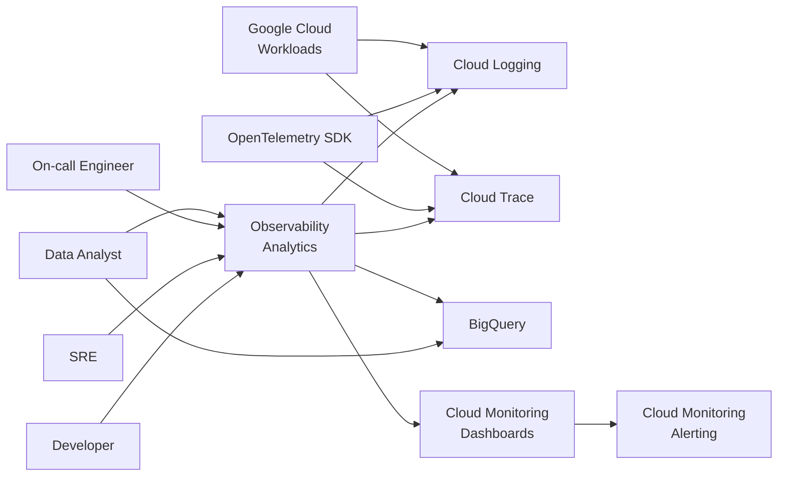
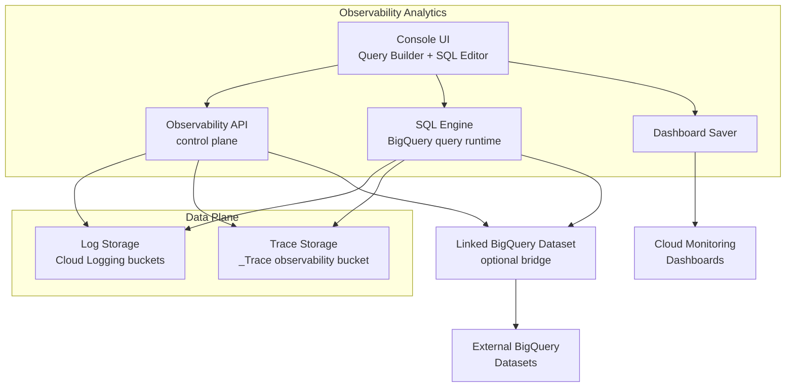
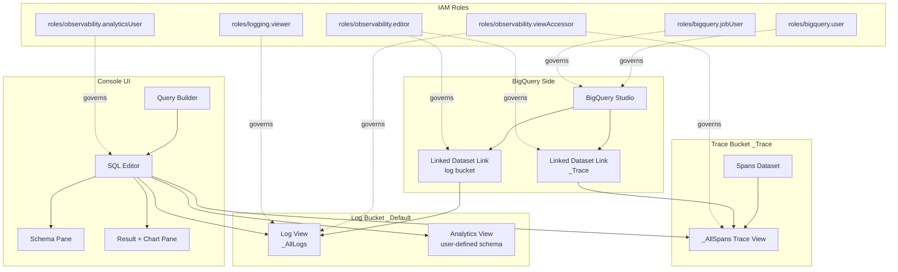
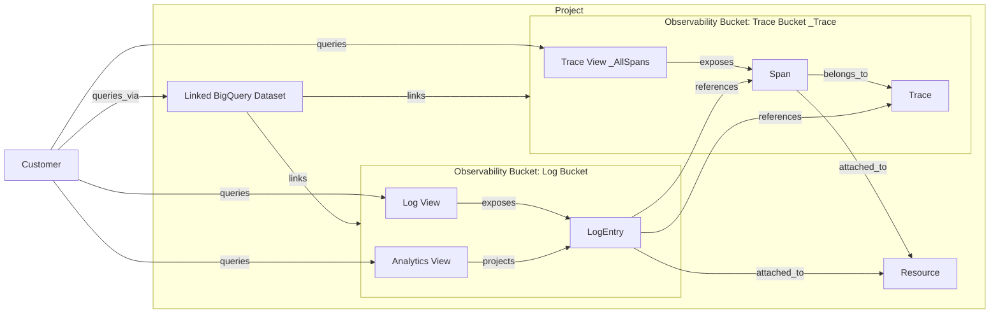
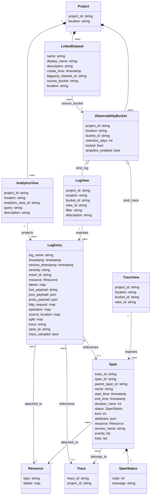

## ■概要

Observability Analytics は、Cloud Logging のログと Cloud Trace のスパンを SQL で横断分析するための統合基盤です。リリースの軸は次の 2 段階に分かれます。

- **2026-05-26 (GA)**: 3 件が同時 GA — **Cloud Trace のクエリ機能**、管理・構成用の **Observability API**、複数プロジェクトを 1 つのクエリ対象に束ねる **Trace scopes**
- **2026-06-24 (launch blog)**: 正式タイトル「**Log Analytics is now Observability Analytics: Query logs and traces with SQL**」として **リネームと公式の周知**。ログ専用基盤からテレメトリ統合分析基盤への位置づけ変更を表します

(リネームは launch blog で正式に周知された呼称変更で、release notes に独立した GA 項目はありません。)

クエリは BigQuery と同じ標準 SQL で記述します。データは Cloud Logging のログバケットと Cloud Trace の observability バケットに格納されたまま、in-place でクエリできます。BigQuery へのエクスポートやコピーを行わずに集計や JOIN を実行できる点が中心的な価値です。

業務データとの突合が必要な場合は、observability バケットに **linked BigQuery dataset** をはることで、業務テーブルと観測データを同じ BigQuery 上でクロス JOIN できます。linked dataset は ingest や storage の追加課金がなく、クエリ時に BigQuery analysis charges だけが発生する設計です。

主なユースケースは、AI エージェントのツール失敗率や P95 レイテンシの算出、エージェントの思考ログと分散トレースの SQL JOIN、顧客 ID 別のレイテンシ影響分析です。エージェント運用と SRE 観測を同じクエリ言語に寄せることが本機能の狙いです。

本記事の差別化ポイントは次の 3 つです。

1. エージェント観測の **tool failure rate / P95 latency / 思考ログと trace の JOIN / 顧客別影響** を 1 つの SQL 言語で書き切る運用設計
2. **LLM token 使用量 × 顧客 × モデル** のコスト相関を `gen_ai.*` semantic conventions の属性で標準化
3. Observability bucket と linked BigQuery dataset、それぞれの **IAM 設計と alerting/SQL の制約**を一次情報ベースで整理

## ■特徴

### GA とプレビューの範囲

構成要素ごとに段階が異なります。

- **2026-05-26 GA**: Cloud Trace のクエリ機能 / Observability API / Trace scopes の **3 件** (Trace release notes で確認できる範囲)
- **GA (既存機能)**: Log Analytics 由来の Log views、Observability Analytics 本体のクエリ機能
- **Public Preview**: Analytics views (ユーザー定義スキーマの分析専用ビュー)
- 注: Trace を SQL で分析する機能自体は GA ですが、docs 上の UI 表現として "Observability views are in Public Preview" の表記が混在する箇所があります

### 主要な価値

launch blog が掲げる 3 つの中核ベネフィットです。

- **Unified telemetry**: 大量のログとトレースを 1 か所で SQL JOIN して分析できる
- **Business correlation**: BigQuery にある業務データ (売上、コンバージョン率、運用コスト) と観測データを JOIN し、技術課題のビジネス影響を定量化できる
- **In-place analysis**: Cloud Logging と Cloud Trace に格納されたデータをそのままクエリし、重複エクスポートのコストと運用複雑度を削減する

### Observability API の役割

API の GA により、observability バケット・linked BigQuery dataset・暗号化キー・デフォルト保存先をプログラマブルに構成できます。

- observability バケットの linked BigQuery dataset を作成し、BigQuery エコシステムから直接参照可能にする
- Trace データのデフォルト保存ロケーションと CMEK を構成する
- AI エージェントや分析ワークロードが標準 BigQuery API・ツール経由でテレメトリを取得できる経路を整える

### BigQuery in-place の意味

データは Cloud Logging・Cloud Trace のバケットに常駐します。linked BigQuery dataset は BigQuery 側からの参照ビューとして機能し、データ実体の複製は行いません。

- ingest と storage の課金は Cloud Logging・Cloud Trace 側のままで、BigQuery 側の storage 課金は発生しない
- BigQuery Studio やデータポータルから観測データを直接クエリできる
- 業務テーブル (BigQuery 上) との JOIN や、reserved slots による性能チューニングは linked dataset 経由で実現する

### エージェント運用への適合性

launch blog は AI エージェント観測の文脈を前面に出しています。

- ツール呼び出し失敗率と P95/P99 レイテンシを span 集計で算出
- `agent_thoughts` や `llm_prompt` を含むログと trace span を `trace_id`・`span_id` で JOIN し、失敗の理由まで遡る
- 顧客 ID をログペイロードに埋めることで、顧客別 SLO 影響を業務 KPI と一緒に評価する

### SQL 機能と表示

標準 SQL の集計、グルーピング、JOIN、ネストクエリ、`REGEXP_EXTRACT`、`CAST`、フィルタ、ソート、`LIMIT` に対応します。結果はテーブルとチャートで可視化でき、カスタムダッシュボードに保存できます (BigQuery 一般機能としての pipe syntax `|>` も書ける場面はありますが、Observability Analytics UI 固有の公式記載はまだ確認できません)。

### リネームの背景

旧 Log Analytics はログ専用の SQL クエリ基盤でした。Trace データ対応の GA に伴い、テレメトリ統合分析の位置づけを反映するため Observability Analytics に改称されました。Cloud Trace の `_Trace.Spans._AllSpans` ビューを通じてスパンも同じ SQL で扱えるため、ログ単独・トレース単独・両者 JOIN の 3 パターンが 1 つの UI と API で完結します。

### 競合・既存機能との位置づけ

主要観測基盤との特性比較です。

| 観点 | Observability Analytics | Logs Explorer | Trace Explorer | Datadog | Honeycomb | Grafana Tempo (TraceQL) |
|---|---|---|---|---|---|---|
| クエリ言語 | 標準 SQL (GoogleSQL) + pipe syntax | Logging query language | UI フィルタ中心 | 独自 query syntax + Trace Queries | 独自 + Query Assistant (自然言語) | TraceQL (pipeline) |
| 集計力 | 高 (BigQuery 標準関数フル活用) | 低 (集計不可) | 中 (面別の集計のみ) | 中〜高 (専用関数) | 高 (wide event 集計に最適化) | 中 (span パイプライン集計) |
| トレース対応 | あり (GA) | なし | あり (UI 主体) | あり (Trace Explorer 連動) | あり (event ベース) | あり (TraceQL の主目的) |
| ログ JOIN | あり (SQL JOIN, trace_id・span_id) | なし | なし | 相関のみ (相関 ID リンク) | event ベースで暗黙統合 | Loki と外部相関 |
| コスト発生条件 | クエリ実行時の BigQuery analysis charges、本体クエリは Logging・Trace の保管課金内 | クエリ無料 (Logging 保管課金のみ) | クエリ無料 (Trace 保管課金のみ) | indexed span・log 量で課金 | event 件数で課金 | OSS は自前運用 |

Logs Explorer・Trace Explorer は集計や複雑 JOIN を扱う設計ではなく、調査の初手と単発フィルタ用途に寄っています。Observability Analytics はこの 2 つを SQL で束ねた上位レイヤとして位置づけられます。

| ユースケース | 推奨ツール | 理由 |
|---|---|---|
| 単発のエラー特定・実機ログ追跡 | Logs Explorer / Trace Explorer | UI フィルタが軽量で、調査の初手として最速 |
| アドホックなクロステレメトリ分析 | Observability Analytics | SQL で log + trace + 業務データを 1 クエリで束ねられる |
| ダッシュボード化 (経営・SRE 共通) | Observability Analytics + Cloud Monitoring dashboards | クエリ結果をテーブル・チャートで保存し dashboard で共有 |
| SLO レポートと業務 KPI 突合 | Observability Analytics + linked BigQuery dataset | BigQuery の売上・顧客テーブルと JOIN して SLO 影響金額を算出 |
| AI エージェントの tool 健全性監視 | Observability Analytics | span 集計と思考ログ JOIN を SQL で標準化できる |
| アラート (SQL ベース) | Observability Analytics + linked dataset | observability dataset の直接クエリアラートは未対応、linked dataset 経由で実現 |
| 大規模 OSS 観測スタック | Grafana Tempo + Loki | TraceQL と LogQL を Grafana で繋ぐ、OSS 自前運用向け |
| event 中心の高カーディナリティ調査 | Honeycomb | wide event + Query Assistant、カーディナリティ制約が緩い |

## ■構造

### ●システムコンテキスト図

開発者・SRE・オンコール・データアナリストが Observability Analytics を介して logs と traces を SQL で横断分析し、結果を Dashboard / Alerting に接続する全体像。OpenTelemetry SDK と各 Google Cloud サービスがテレメトリ供給元となります。



| 要素名 | 説明 |
|---|---|
| Developer | アプリケーション開発者。`agent.executeTool` などのアプリ span/log を SQL で深掘りし、デバッグや性能改善に使う |
| SRE | 信頼性エンジニア。SLI/SLO に直結するレイテンシ・エラー率を pipe syntax + SQL で集計する |
| On-call Engineer | 障害対応者。Logs Explorer から Observability Analytics に遷移し、trace と log を JOIN して根本原因を絞り込む |
| Data Analyst | ビジネスデータと相関させる利用者。Linked BigQuery dataset 経由で BigQuery Studio から SQL を実行する |
| Observability Analytics | 旧称 Log Analytics。Logs と Traces を BigQuery エンジン上で SQL クエリできる統合分析基盤 |
| Cloud Logging | Log エントリの収集・保持基盤。Observability bucket に upgrade すると Analytics 対象になる |
| Cloud Trace | Span の収集・保持基盤。`_Trace` Observability bucket に span を格納する |
| BigQuery | SQL 実行エンジン本体。Observability bucket をネイティブに読むほか、linked dataset として通常 BigQuery と JOIN 可能 |
| Cloud Monitoring Dashboards | クエリ結果をチャートとして保存する先 |
| Cloud Monitoring Alerting | SQL ベース alert の発火経路。Observability dataset 直クエリは不可で linked dataset 経由が必要 |
| OpenTelemetry SDK | アプリ計装からテレメトリを送出する経路 |
| Google Cloud Workloads | GKE / Cloud Run / Compute Engine など、ログ・トレース発生元のワークロード |

### ●コンテナ図

Observability API がコントロールプレーン、SQL Engine = BigQuery がクエリプレーン、データプレーンは Cloud Logging buckets と Cloud Trace `_Trace` bucket。Console UI が Query Builder / SQL Editor / Dashboard saver を提供し、Linked BigQuery Dataset がオプションで external BigQuery と接続します。



| 要素名 | 説明 |
|---|---|
| Console UI Query Builder + SQL Editor | Stackdriver Observability 画面の SQL UI。メニューベース Query Builder と SQL エディタ・スキーマペインを併設し pipe syntax にも対応 |
| Dashboard Saver | クエリ結果のチャートを Cloud Monitoring Dashboard に保存するサブ機能 |
| Observability API | 2026-05-26 GA のコントロールプレーン API。bucket / view / linked dataset の管理を担う |
| SQL Engine BigQuery query runtime | クエリ実行基盤。Observability bucket をネイティブ表として扱い、aggregate/join/regexp などの GoogleSQL を受ける |
| Log Storage Cloud Logging buckets | Observability Analytics 化された log bucket 群。`_Default` / `_Required` / カスタム bucket を含む |
| Trace Storage `_Trace` observability bucket | Cloud Trace 専用の observability bucket。span を `Spans` データセットとして保持する |
| Linked BigQuery Dataset (optional bridge) | observability bucket を BigQuery 側から参照可能にするリンク。BigQuery Studio・SQL alert はこの経路を使う |
| External BigQuery Datasets | ビジネス系 BigQuery データセット。linked dataset 経由で telemetry と cross-dataset JOIN できる |
| Cloud Monitoring Dashboards | 保存先の永続ダッシュボード。クエリ結果のチャートを共有する |

### ●コンポーネント図

Console UI と SQL Engine が触るオブジェクトレベルの構造。Log View / Analytics View / Trace `_AllSpans` がクエリ対象の最小単位で、Linked Dataset Link が `projects/.../buckets/.../datasets/.../links/<id>` リソースとして BigQuery 側にミラーします。IAM ロールがアクセス境界を引きます。



| 要素名 | 説明 |
|---|---|
| Query Builder | フィールド・条件をメニュー選択で組み立てる GUI。生成された SQL は SQL Editor に反映される |
| SQL Editor | GoogleSQL と pipe syntax を直接編集する入力エリア。実行対象 view を `PROJECT_ID.LOCATION.BUCKET_ID.LOG_VIEW_ID` 形式で参照する |
| Schema Pane | 選択中 view の列・型を示すサイドペイン。`json_payload` 等のネスト構造を辿る |
| Result + Chart Pane | クエリ結果のテーブル表示と簡易チャート描画。Dashboard Saver の入力にもなる |
| Log View `_AllLogs` | `_Default` などの log bucket 直下に自動生成される system-defined ビュー。全 log エントリを公開する |
| Analytics View | ユーザー定義スキーマの分析専用ビュー。Public Preview 段階 |
| Spans Dataset | `_Trace` bucket 内の span 格納データセット。`PROJECT_ID.LOCATION._Trace.Spans` で参照 |
| `_AllSpans` Trace View | Spans dataset 上の system view。`PROJECT_ID.LOCATION._Trace.Spans._AllSpans` として SELECT 可能 |
| Linked Dataset Link (log bucket) | log bucket を BigQuery dataset にミラーするリンクリソース。リソースパスは `projects/.../buckets/.../datasets/.../links/<id>` |
| Linked Dataset Link (`_Trace`) | `_Trace` bucket 用のリンク。`gcloud beta observability buckets datasets links create` で作成 |
| BigQuery Studio | linked dataset を読み書きする BigQuery 標準 UI。SQL alert・cross-dataset JOIN の入り口 |
| `roles/observability.editor` | bucket / linked dataset / view の作成・編集権限。linked dataset 作成側に必須 |
| `roles/observability.analyticsUser` | Observability Analytics でクエリを発行できる利用者ロール |
| `roles/observability.viewAccessor` | 個別 view への参照権を付与。BigQuery engine 経由クエリでも必要 |
| `roles/bigquery.user` | linked dataset 作成・参照で必要な BigQuery 側基本ロール |
| `roles/bigquery.jobUser` | BigQuery engine でクエリジョブを実行するための権限 |
| `roles/logging.viewer` | log bucket 系メタ情報を参照するための前提ロール |

## ■データ

### ●概念モデル



| 要素名 | 説明 |
|---|---|
| Project | Google Cloud プロジェクト。観測リソースの所有境界 |
| Observability Bucket (Log Bucket) | Cloud Logging のログを保持するバケット。`_Default` / `_Required` / カスタム |
| Observability Bucket (Trace Bucket `_Trace`) | Cloud Trace のスパンを保持する固定バケット |
| Log View | log bucket 直下の system-defined ビュー (`_AllLogs`) またはフィルタ付きビュー |
| Analytics View | ユーザー定義のクエリベース分析ビュー (Public Preview) |
| Trace View | `_Trace.Spans._AllSpans` の system view |
| LogEntry | ログエントリ実体 (`json_payload` / `text_payload` / `trace` / `span_id` 等) |
| Span | トレーススパン実体 (`trace_id` / `span_id` / `duration_nano` / `status` 等) |
| Trace | スパンの集合。`trace_id` で結ばれる |
| Resource | OpenTelemetry の `Resource` (`service.name`、`host.name` 等) |
| Linked BigQuery Dataset | observability bucket を BigQuery dataset として参照するリンク資源 |
| Customer | 観測データの利用者 (Dev / SRE / Analyst 等) |

### ●情報モデル



抽象型と BigQuery 物理型の対応:

| 抽象型 | BigQuery 物理型 |
|---|---|
| string | STRING |
| int | INT64 |
| bool | BOOL |
| timestamp | TIMESTAMP |
| map | RECORD (key/value) |
| list | ARRAY of RECORD |
| json | JSON (`JSON_VALUE` / `JSON_QUERY` でアクセス) |

ビューの完全修飾名:

| ビュー種別 | テーブル形式 |
|---|---|
| Log view | `PROJECT_ID.LOCATION.BUCKET_ID.LOG_VIEW_ID` |
| Analytics view | `analytics_view.PROJECT_ID.LOCATION.ANALYTICS_VIEW_ID` |
| Trace view | `PROJECT_ID.LOCATION._Trace.Spans._AllSpans` |

`LOG_VIEW_ID` / `ANALYTICS_VIEW_ID` は 100 文字以内、英数字 / アンダースコア / ハイフンのみです。

主要属性のアクセス例:

- `t.trace_id` / `t.span_id` / `t.parent_span_id` — Span 識別子 (STRING)
- `t.duration_nano` — 経過時間ナノ秒 (INT64)。ミリ秒換算は `t.duration_nano / 1000000` (query docs は `duration_nano`、schema reference には `duration_unix_nano` の表記もあり、samples / launch blog は `duration_nano` を採用)
- `t.status.code` — OTel 由来の状態コード (INT64)。`0 = UNSET` / `1 = OK` / `2 = ERROR` (launch blog のサンプルは `status.code = 2` で error を抽出する)
- `t.kind` — span 種別 (INT64、`0`-`5`)。OTel SpanKind に対応。launch blog では `t.kind.name = 'SPAN_KIND_SERVER'` 形式の参照も登場するが、`docs.cloud.google.com/trace/docs/analytics-samples` の正準サンプルは INT 比較 (`WHERE kind = 2` 等) を示す
- `JSON_VALUE(t.attributes, '$."agent.tool.name"')` — span attributes は JSON 型、キー指定で取り出す
- `l.trace` — `projects/PROJECT_ID/traces/TRACE_ID` 形式。trace_id 抽出は `REGEXP_EXTRACT(L.trace, r'/([^/]+)$')` (公式 docs の正準形)、または `SPLIT(l.trace, '/')[SAFE_OFFSET(3)]` (launch blog 流)
- `l.span_id` — Log 側の span 参照 (16 桁 hex)。**公式 docs の正準形は両側 `span_id` (snake_case)**。launch blog は Logs 側を `l.spanId` (camelCase) と書くが、docs 経由では `span_id` で揃える
- `l.json_payload.agent_thoughts` — JSON payload は `JSON_VALUE` で取り出す

Linked Dataset は Observability API の `Link` リソース (`projects.locations.buckets.datasets.links`) で表現されます。

```
projects/{PROJECT_ID}/locations/{LOCATION}/buckets/{BUCKET_ID}/datasets/{DATASET_ID}/links/{LINK_ID}
```

`bigquery_dataset_id` は Link 作成時に BigQuery 側に生成される dataset ID です。Trace では `BUCKET_ID` は通常 `_Trace`、Logs では `_Default` 等になります。

## ■構築方法

### 構築-前提条件 (API・課金・IAM)

| 項目 | 必須内容 |
|---|---|
| API | **Cloud Monitoring API** + **Observability API** (`observability.googleapis.com`) を有効化 |
| 課金 | プロジェクトで billing が有効化されていること |
| gcloud CLI | Trace の linked dataset 系コマンド (`gcloud beta observability buckets datasets links create`) は **563.0.0 以降**。Log bucket の `--enable-analytics` は旧来 (Log Analytics 時代) から利用可能 |
| ロール (link 作成側) | `roles/observability.editor` + `roles/bigquery.user` + `roles/logging.viewer` |
| ロール (link 参照側) | `roles/bigquery.dataViewer` |
| ロール (BigQuery Engine 経由実行) | `roles/bigquery.jobUser` + `roles/observability.viewAccessor` |
| ロール (Observability Analytics コンソール) | `roles/observability.analyticsUser` + `roles/observability.viewAccessor` + `roles/logging.viewer`。複数 log views を横断クエリする場合のみ `roles/logging.viewAccessor` を追加 |
| Log Bucket upgrade 条件 | プロジェクトレベルで作成 / `_Required` 以外は unlocked / pending update なし |

```bash
gcloud services enable \
  monitoring.googleapis.com \
  observability.googleapis.com \
  logging.googleapis.com \
  cloudtrace.googleapis.com \
  bigquery.googleapis.com \
  --project="${PROJECT_ID}"
```

```bash
PRINCIPAL="user:platform-team@example.com"
for ROLE in roles/observability.editor roles/bigquery.user roles/logging.viewer; do
  gcloud projects add-iam-policy-binding "${PROJECT_ID}" \
    --member="${PRINCIPAL}" --role="${ROLE}"
done
```

### 構築-Log Bucket を Observability Analytics 化する

`--enable-analytics` フラグが「Observability Analytics 化」のスイッチです。`--async` 推奨 (backfill 起動を待たない)。

```bash
gcloud logging buckets update _Default \
  --location=global \
  --enable-analytics \
  --async \
  --project="${PROJECT_ID}"

gcloud logging buckets create app-prod-logs \
  --location=us \
  --enable-analytics \
  --retention-days=30 \
  --project="${PROJECT_ID}"
```

公式の制約:

- **再構成は不可** (upgrade はワンウェイ。後から analytics を外す操作は提供されていない)
- **backfill (過去ログのインデックス化) には数日かかる**ことがある。upgrade 直後は新規ログのみ即時クエリ可能
- linked dataset 経由のクエリでも **BigQuery ingest / storage 課金は発生しない** (BigQuery analysis charge のみ)
- field-level access control が設定された log view は Observability Analytics から直接クエリ不可 (Logs Explorer または linked BQ 経由のみ)

Console 操作の場合は **Logs Storage** ページを開き、`_Default` の行で **Observability Analytics available** カラムに表示される `Upgrade` ボタンをクリックして確定します。

### 構築-Trace の Observability Analytics 化

Cloud Trace 側は **`_Trace` observability bucket が必要に応じて自動構成される**仕組みで、Log Analytics のような明示的な「upgrade」操作はありません。Trace ingest が動いていれば `PROJECT_ID.LOCATION._Trace.Spans._AllSpans` をそのままクエリ対象にできます。空クエリの場合はまず `_Trace` の存在と Trace ingest の有効化を確認します (トラブルシュート表参照)。

```bash
gcloud beta observability buckets list \
  --location=global \
  --project="${PROJECT_ID}"
```

Trace の bucket ID は `_Trace` (固定)、dataset ID は `Spans` (固定)、view ID は `_AllSpans` (デフォルト) です。

### 構築-Observability API による Bucket / View 管理

`gcloud beta observability` ファミリのコマンドで、ログ・トレースを横断する Bucket / View / Dataset Link を CLI で管理できます (GA は API のみ。CLI は beta)。

```bash
gcloud beta observability buckets list --location=us --project="${PROJECT_ID}"
gcloud beta observability buckets views list \
  --bucket=_Default --location=us --project="${PROJECT_ID}"

gcloud beta observability buckets create my-obs-bucket \
  --location=us --project="${PROJECT_ID}"

gcloud beta observability buckets views create errors-only \
  --bucket=_Default \
  --location=us \
  --filter='severity >= "ERROR"' \
  --project="${PROJECT_ID}"
```

`view` は IAM の付与単位でもあります (`roles/observability.viewAccessor` を view 粒度で付与可能)。

### 構築-Linked BigQuery Dataset の作成

Log Bucket の場合、Cloud Logging の薄いラッパが最短です。

```bash
gcloud logging links create app_prod_logs_ds \
  --bucket=app-prod-logs \
  --location=us \
  --project="${PROJECT_ID}"
```

- `LINK_ID` (例: `app_prod_logs_ds`) がそのまま BigQuery 上の dataset 名になる
- dataset 名なので英数字 + アンダースコア、プロジェクト内ユニーク、100 文字以内
- **Analytics 有効なバケットでなければ link は作れない**

Trace は `gcloud beta observability` 経由で、**位置引数に完全修飾 link resource name** を渡して作成します。

```bash
gcloud beta observability buckets datasets links create \
  projects/${PROJECT_ID}/locations/us/buckets/_Trace/datasets/Spans/links/trace_spans_ds
```

REST API でも同じです (`projects.locations.buckets.datasets.links.create`)。

```bash
curl -X POST \
  -H "Authorization: Bearer $(gcloud auth print-access-token)" \
  -H "Content-Type: application/json" \
  "https://observability.googleapis.com/v1/projects/${PROJECT_ID}/locations/us/buckets/_Trace/datasets/Spans/links?linkId=trace_spans_ds" \
  -d '{"description": "Linked BigQuery dataset for Trace Spans (us)"}'
```

作成後、BigQuery 側には `${PROJECT_ID}.trace_spans_ds._AllSpans` として linked dataset 上のビューが現れ、BigQuery Studio や SQL アラートポリシーから直接クエリできます (BigQuery 側からのクエリ path は dataset 名 `trace_spans_ds` + view 名 `_AllSpans` です)。

> **重要**: SQL ベースのアラートポリシーは Observability bucket 内のビューを**直接**は参照できません。SQL アラート化したい場合は必ず linked dataset 経由で投げます。

### 構築-必要 IAM ロール早見表

| シナリオ | ロール | 付与スコープ |
|---|---|---|
| Observability Analytics コンソールでクエリ | `roles/observability.analyticsUser` + `roles/observability.viewAccessor` + `roles/logging.viewer` (複数 log views 横断時のみ `roles/logging.viewAccessor` 追加) | Project / View |
| Log Bucket を analytics 化 | `roles/logging.admin` (または `logging.buckets.update`) | Project |
| Linked Dataset を作成 | `roles/observability.editor` + `roles/bigquery.user` + `roles/logging.viewer` | Project |
| Linked Dataset を参照 | `roles/bigquery.dataViewer` | Project / Dataset |
| BigQuery 実行エンジン経由 (Observability Analytics の "Run on BigQuery") | `roles/observability.viewAccessor` + `roles/logging.viewer` + `roles/bigquery.user` + `roles/bigquery.jobUser` | Project |
| linked dataset を BigQuery Studio から参照 | `roles/bigquery.dataViewer` (+ 必要に応じて `roles/bigquery.jobUser`) | Project / Dataset |
| OpenTelemetry エクスポータ (サービスアカウント) | `roles/logging.logWriter` + `roles/cloudtrace.agent` | Project |

### 構築-OpenTelemetry SDK でテレメトリを投入する

Observability Analytics の SQL ペイロードを充実させるための上流は OpenTelemetry です。エージェント観測では「OTel attribute を lower-case の dot 区切りで揃えるか」が後段の SQL JOIN の取りやすさを決めます。

```bash
pip install \
  opentelemetry-api opentelemetry-sdk \
  opentelemetry-exporter-gcp-trace \
  opentelemetry-exporter-gcp-logging \
  opentelemetry-instrumentation
```

```python
from opentelemetry import trace
from opentelemetry.sdk.trace import TracerProvider
from opentelemetry.sdk.trace.export import BatchSpanProcessor
from opentelemetry.exporter.cloud_trace import CloudTraceSpanExporter
from opentelemetry.sdk.resources import Resource

resource = Resource.create({
    "service.name": "agent-orchestrator",
    "service.version": "1.4.0",
})

provider = TracerProvider(resource=resource)
provider.add_span_processor(BatchSpanProcessor(CloudTraceSpanExporter()))
trace.set_tracer_provider(provider)

tracer = trace.get_tracer(__name__)

with tracer.start_as_current_span("Agent.executeTool") as span:
    span.set_attribute("agent.tool.name", "search_web")
    span.set_attribute("agent.tool.version", "2.1")
    span.set_attribute("agent.session.id", session_id)
```

ポイント:

- `service.name` は `resource.attributes` に入り、SQL 側で `JSON_VALUE(resource.attributes, '$."service.name"')` で参照できる
- カスタム属性は `agent.tool.name` のように **lower-case + dot 区切り** にしておくと OTel semantic conventions に揃う
- ログ側にも同じ `trace_id` / `span_id` を埋めると `_Default._AllLogs` と `_Trace.Spans._AllSpans` の JOIN が成立する
- GKE / Cloud Run / Cloud Functions のマネージド計装を有効化すると HTTP/gRPC span が自動取得される

## ■利用方法

### 利用-必須パラメータ早見表

| データ種別 | 参照形式 | 備考 |
|---|---|---|
| Log View | `` `PROJECT_ID.LOCATION.BUCKET_ID.LOG_VIEW_ID` `` | デフォルト = `_Default._AllLogs` |
| Analytics View | `` `analytics_view.PROJECT_ID.LOCATION.ANALYTICS_VIEW_ID` `` | プレフィックス必須 (Public Preview) |
| Trace View | `` `PROJECT_ID.LOCATION._Trace.Spans._AllSpans` `` | バケット・データセット・ビュー名は固定 |

| パラメータ | 例 | 制約 |
|---|---|---|
| `PROJECT_ID` | `my-prod-project` | 通常の GCP プロジェクト ID |
| `LOCATION` | `global` / `us` / `asia-northeast1` 等 | **ビューが同じロケーションでないと JOIN 不可** (例外: `global` と `us`) |
| `BUCKET_ID` | `_Default` / `_Required` / `_Trace` / カスタム | log view ID は 100 文字以内 |
| `VIEW_ID` | `_AllLogs` / `_AllSpans` / カスタム | 同上 (制限値は要一次確認) |

### 利用-Observability Analytics コンソールの UI

1. **Query Builder** — メニュー駆動で field 選択 → 集計 → group by を組み立てる
2. **SQL Editor** — そのまま SQL を書く。Builder ⇄ SQL は切替可能
3. **Run Query** — 実行ボタン
4. **Results Table** — 実行結果のテーブル表示
5. **Chart** — 結果から折れ線/棒/分布チャートを生成
6. **Save to Dashboard** — Cloud Monitoring の Custom Dashboard に保存
7. **Settings > Run in BigQuery** — クエリを BigQuery 実行エンジンに切替

### 利用-SQL クエリ例 (Logs only)

ログを全件取得:

```sql
SELECT
  timestamp, severity, resource.type, log_name,
  text_payload, proto_payload, json_payload
FROM `PROJECT_ID.LOCATION._Default._AllLogs`
LIMIT 1000
```

時間粒度 + ステータスごとに集計:

```sql
SELECT
  TIMESTAMP_TRUNC(timestamp, HOUR) AS hour,
  JSON_VALUE(json_payload.status) AS status,
  COUNT(*) AS count
FROM `PROJECT_ID.LOCATION.BUCKET_ID.LOG_VIEW_ID`
WHERE json_payload IS NOT NULL
  AND JSON_VALUE(json_payload.status) IS NOT NULL
GROUP BY hour, status
ORDER BY hour ASC
```

URL ごとの平均 HTTP レイテンシ:

```sql
SELECT
  JSON_VALUE(labels.checker_location) AS location,
  AVG(http_request.latency.seconds) AS secs,
  http_request.request_url
FROM `PROJECT_ID.LOCATION.BUCKET_ID.LOG_VIEW_ID`
WHERE http_request IS NOT NULL
  AND http_request.request_method = 'GET'
GROUP BY http_request.request_url, location
ORDER BY location
LIMIT 100
```

### 利用-SQL クエリ例 (Traces only)

サービス別の p50/p95/p99:

```sql
SELECT
  COALESCE(
    JSON_VALUE(resource.attributes, '$."service.name"'),
    JSON_VALUE(attributes,          '$."service.name"')
  ) AS service_name,
  COUNT(*)                                                    AS span_count,
  APPROX_QUANTILES(duration_nano, 100)[OFFSET(50)]            AS p50_duration_nano,
  APPROX_QUANTILES(duration_nano, 100)[OFFSET(95)]            AS p95_duration_nano,
  APPROX_QUANTILES(duration_nano, 100)[OFFSET(99)]            AS p99_duration_nano,
  COUNTIF(status.code = 2)                                    AS error_count
FROM `PROJECT_ID.LOCATION._Trace.Spans._AllSpans`
WHERE start_time > TIMESTAMP_SUB(CURRENT_TIMESTAMP(), INTERVAL 1 DAY)
GROUP BY service_name
ORDER BY span_count DESC
```

### 利用-SQL クエリ例 (Logs と Traces の JOIN)

`trace` フィールドは `projects/<pid>/traces/<trace_id>` 形式なので末尾を抽出して `trace_id` と突き合わせます。**公式 docs の正準形は両側 `span_id` (snake_case) で `REGEXP_EXTRACT` を使う形**です。

```sql
SELECT
  T.trace_id, T.span_id, T.name, T.start_time, T.duration_nano,
  L.log_name, L.severity, L.json_payload
FROM `PROJECT_ID.LOCATION._Trace.Spans._AllSpans` AS T
JOIN `PROJECT_ID.LOCATION._Default._AllLogs`      AS L
  ON T.span_id  = L.span_id
 AND T.trace_id = REGEXP_EXTRACT(L.trace, r'/([^/]+)$')
WHERE T.duration_nano > 1000000
LIMIT 10
```

launch blog のサンプルは `L.spanId` (camelCase) と `SPLIT(L.trace, '/')[SAFE_OFFSET(3)]` の組合せを使います。動作は同じですが、公式 docs に揃える場合は上記正準形を採用します。**`span_id` は globally unique ではないため、JOIN には `trace_id` も必ず併用します**。

### 利用-エージェント観測 SQL (起点 Pick の AI agent tool optimization)

ツール別の失敗率と P95 レイテンシをランキング:

```sql
SELECT
  JSON_VALUE(attributes, '$."agent.tool.name"')                       AS tool_name,
  COUNT(span_id)                                                      AS total_calls,
  SAFE_DIVIDE(COUNTIF(status.code = 2), COUNT(span_id)) * 100         AS failure_rate_pct,
  APPROX_QUANTILES(duration_nano / 1000000, 100)[OFFSET(95)]          AS p95_latency_ms
FROM `YOUR_PROJECT_ID.us._Trace.Spans._AllSpans`
WHERE name = 'Agent.executeTool'
  AND start_time BETWEEN TIMESTAMP_SUB(CURRENT_TIMESTAMP(), INTERVAL 7 DAY)
                     AND CURRENT_TIMESTAMP()
GROUP BY tool_name
ORDER BY failure_rate_pct DESC, p95_latency_ms DESC
LIMIT 10
```

flaky tool の失敗時に agent の思考ログと LLM プロンプトを引き出す:

```sql
SELECT
  t.name                                                  AS tool_name,
  l.timestamp,
  JSON_VALUE(l.json_payload.agent_thoughts)               AS agent_reasoning,
  JSON_VALUE(l.json_payload.llm_prompt)                   AS prompt_sent_to_llm
FROM `YOUR_PROJECT_ID.us._Trace.Spans._AllSpans` t
JOIN `YOUR_PROJECT_ID.us._Default._AllLogs`     l
  ON t.trace_id = REGEXP_EXTRACT(l.trace, r'/([^/]+)$')
 AND t.span_id  = l.span_id
WHERE t.name = 'Agent.executeTool'
  AND JSON_VALUE(t.attributes, '$."agent.tool.name"') = 'NameOfFlakyTool'
  AND t.status.code = 2
  AND l.severity = 'ERROR'
```

顧客別レイテンシ影響 (ビジネス相関):

```sql
SELECT
  JSON_VALUE(l.json_payload.customer_id)                             AS customer_id,
  AVG(t.duration_nano / 1000000)                                     AS avg_latency_ms,
  APPROX_QUANTILES(t.duration_nano / 1000000, 100)[OFFSET(95)]       AS p95_latency_ms,
  COUNT(t.span_id)                                                   AS total_requests
FROM `YOUR_PROJECT_ID.us._Trace.Spans._AllSpans` AS t
JOIN `YOUR_PROJECT_ID.us._Default._AllLogs`     AS l
  ON t.trace_id = REGEXP_EXTRACT(l.trace, r'/([^/]+)$')
 AND t.span_id  = l.span_id
WHERE t.start_time BETWEEN TIMESTAMP_SUB(CURRENT_TIMESTAMP(), INTERVAL 1 DAY)
                       AND CURRENT_TIMESTAMP()
  AND t.kind.name = 'SPAN_KIND_SERVER'
  AND JSON_VALUE(l.json_payload.customer_id) IS NOT NULL
GROUP BY customer_id
ORDER BY p95_latency_ms DESC
LIMIT 10
```

### 利用-Pipe syntax 例

GoogleSQL の **pipe syntax** (`|>` 演算子) もそのまま使えます。

```sql
FROM `PROJECT_ID.LOCATION._Trace.Spans._AllSpans`
|> WHERE start_time > TIMESTAMP_SUB(CURRENT_TIMESTAMP(), INTERVAL 1 HOUR)
|> EXTEND JSON_VALUE(attributes, '$."agent.tool.name"') AS tool_name,
          duration_nano / 1000000                       AS duration_ms
|> AGGREGATE COUNT(*)                                   AS calls,
             APPROX_QUANTILES(duration_ms, 100)[OFFSET(95)] AS p95_ms
   GROUP BY tool_name
|> ORDER BY p95_ms DESC
|> LIMIT 10
```

### 利用-BigQuery Studio から直接クエリ (linked dataset 経由)

Linked dataset を作っておくと、BigQuery Studio / Looker Studio / dbt / Connected Sheets などから「ふつうの BigQuery テーブル」として参照できます。

```bash
bq query --nouse_legacy_sql \
  'SELECT name, COUNT(*) AS n
   FROM `my-prod-project.trace_spans_ds._AllSpans`
   WHERE start_time > TIMESTAMP_SUB(CURRENT_TIMESTAMP(), INTERVAL 1 HOUR)
   GROUP BY name ORDER BY n DESC LIMIT 20'
```

linked dataset のメリット:

- **業務系の BigQuery テーブル** との JOIN が可能
- **BigQuery slot reservation** が効く
- **SQL ベースの Alerting Policy** を貼れる
- BigQuery Studio の Notebook / Saved Queries / Scheduled Queries が使える

## ■運用

### 運用-クエリ実行・結果のダッシュボード化

- クエリは Google Cloud console の **Observability > Analytics** から実行。結果はテーブルと chart で同時表示され、そのまま **dashboard に保存**できます
- 保存先 dashboard は **Cloud Monitoring custom dashboard**
- 同じクエリを **BigQuery Studio** で開きたい場合は、linked dataset を作成してから "Open in BigQuery" → BigQuery 上で notebook 化・Looker Studio 連携・スケジュールクエリ化が可能
- ダッシュボード化の単位:
  - **アドホック調査** → Observability Analytics の "Save as chart" だけで十分
  - **定型運用 KPI** → linked dataset 経由で BigQuery scheduled query にし、物化テーブルに落として Looker Studio / Grafana に繋ぐ

### 運用-SQL ベース alerting policy (linked dataset 経由のみ)

**重要制約**: Observability Analytics の view は **alerting policy から直接クエリできません**。SQL ベース alerting を組むには **linked BigQuery dataset を介す必要があります**。

```bash
gcloud beta observability buckets datasets links create \
  projects/PROJECT_ID/locations/us/buckets/_Trace/datasets/Spans/links/LINK_ID
```

注意点:

- alerting policy が使う SQL は **BigQuery engine (reserved slots)** での実行が前提。VPC SC 環境では BigQuery Enterprise Edition が必要
- linked dataset 経由でも、SQL は **scheduled evaluation** モデル。秒オーダの即時 alert には不向きで、通常 metric (log-based metric) を併用する
- alert 用クエリは **time-range selector ではなく WHERE 句で `start_time` 範囲を絞る** (alerting は selector を持たない)

### 運用-データ保持期間 / リテンション設定

- ログのリテンションは **log bucket 単位**。デフォルト `_Default` は 30 日、`_Required` は 400 日固定
- Trace は `_Trace` バケットに集約され、既定 30 日。長期保持は `retentionDays` を伸ばすことで設定可能 (上限値は要一次確認、30 日超は **長期保持課金**)
- Observability Analytics への upgrade は **bucket 単位**。upgrade 直後は **backfill** が走り数時間〜数日かかる
- 長期保持を BigQuery 側で持つ場合は linked dataset を起点に scheduled query で集計テーブルに落とすのが安価

```bash
gcloud logging buckets update _Default \
  --location=global \
  --retention-days=90
```

### 運用-クエリコスト監視

- linked dataset 自体には **ingest / storage コストはかからない** (ログは observability bucket に常駐)
- ただし **クエリ実行時には BigQuery on-demand pricing** が課金される。reserved slots を使うなら定額
- コストドライバの 9 割は **partition pruning が効いているか**。time-range selector または `timestamp` / `start_time` 範囲フィルタが無いと **全期間 full scan** になる

```sql
SELECT user_email, query, total_bytes_billed,
  ROUND(total_bytes_billed / POW(1024,4) * 6.25, 4) AS estimated_usd
FROM `region-us`.INFORMATION_SCHEMA.JOBS_BY_PROJECT
WHERE creation_time > TIMESTAMP_SUB(CURRENT_TIMESTAMP(), INTERVAL 7 DAY)
  AND statement_type = 'SELECT'
  AND referenced_tables[SAFE_OFFSET(0)].dataset_id LIKE '%Default%'
ORDER BY total_bytes_billed DESC
LIMIT 20;
```

### 運用-監査・アクセスログ

- Observability Analytics へのアクセスは **Cloud Audit Logs (Data Access logs)** に記録される (デフォルト無効)
- `observability.googleapis.com` と `logging.googleapis.com` の Data Access ログを有効化しておく
- 誰がどのログビューに SQL を投げたかは `bigquery.googleapis.com/data_access` の Job 実行ログを linked dataset でクエリすると追える (BigQuery エンジン経由のみ)

## ■ベストプラクティス

### ベスト-エージェント観測のためのスキーマ設計

エージェントを SRE 視点で観測する場合、**SQL JOIN が成立するスキーマ設計が前提**です。

- **理由ログを `jsonPayload` の構造化フィールドに格納**: `agent_thoughts` / `llm_prompt` / `tool_name` / `tool_args` / `customer_id` を文字列連結しない
- **trace_id / span_id を必ずログに付与**: OpenTelemetry SDK を使うと自動で `logging.googleapis.com/trace` と `logging.googleapis.com/spanId` が入る
- **trace.attributes をエージェント語彙で標準化**: `agent.tool.name`, `agent.session_id`, `agent.model.name` のような **`agent.*` ネームスペース**を決める。OTel Semantic Conventions の GenAI module (`gen_ai.*`) に揃えると将来安全
- **GenAI semantic conventions の代表属性**: `gen_ai.request.model` (使用モデル) / `gen_ai.request.temperature` / `gen_ai.usage.input_tokens` / `gen_ai.usage.output_tokens` / `gen_ai.response.id` / `gen_ai.response.finish_reasons` を `span.set_attribute` で必ず attach すると、token コスト × 顧客 × モデルの SQL 集計が標準形で書ける (source of truth は OpenTelemetry GenAI semantic conventions の専用リポジトリに移動済みで、属性名は今後変わる可能性があります)
- **span name を行動単位で命名**: `Agent.executeTool` / `Agent.callLLM` / `Agent.planStep` のように動詞 + 名詞
- **失敗の `status.code = 2` を必ず立てる**: 起点 Blog の P95 / failure rate 計算は全部これに依存する

### ベスト-コスト最適化 (クエリ書き方の鉄則)

| 原則 | やる | やらない |
|---|---|---|
| 時間範囲 | **time-range selector** または `WHERE start_time BETWEEN ...` で必ず絞る | full scan |
| 文字列マッチ | `CONTAINS_SUBSTR(col, "x")` | `REGEXP_EXTRACT(col, r".*x.*")` |
| 分位点 | `APPROX_QUANTILES(latency, 100)[OFFSET(95)]` | `PERCENTILE_CONT` window 関数 |
| 重複除去 | source 側で重複を出さない | `SELECT DISTINCT *` (自動 dedup しない) |
| JSON 比較 | `WHERE status.code IS NOT NULL` | `WHERE status IS NOT NULL` (RECORD を NULL 比較) |
| JSON 抽出 | RECORD はドットアクセス、JSON 型は `JSON_VALUE(...)` | 取り違える |

```sql
SELECT
  resource.labels.service_name AS service,
  APPROX_QUANTILES(duration_nano / 1000000, 100)[OFFSET(95)] AS p95_ms,
  COUNTIF(status.code = 2) AS errors
FROM `PROJECT.us._Trace.Spans._AllSpans`
WHERE start_time BETWEEN @from_ts AND @to_ts
  AND CONTAINS_SUBSTR(name, 'Agent.')
GROUP BY service
ORDER BY p95_ms DESC
LIMIT 50;
```

### ベスト-LLM token 使用量 × 顧客のコスト相関

GenAI semantic conventions に従い `gen_ai.usage.input_tokens` / `gen_ai.usage.output_tokens` / `gen_ai.request.model` を span 属性に詰めておけば、モデル単価テーブルを `crm.model_pricing` のような業務テーブルに置いて JOIN するだけで「顧客あたり LLM コスト」を出せます。

```sql
WITH usage AS (
  SELECT
    JSON_VALUE(l.json_payload.customer_id)                            AS customer_id,
    JSON_VALUE(t.attributes, '$."gen_ai.request.model"')              AS model,
    SUM(CAST(JSON_VALUE(t.attributes, '$."gen_ai.usage.input_tokens"')  AS INT64)) AS in_tokens,
    SUM(CAST(JSON_VALUE(t.attributes, '$."gen_ai.usage.output_tokens"') AS INT64)) AS out_tokens
  FROM `PROJECT.us._Trace.Spans._AllSpans` t
  JOIN `PROJECT.us._Default._AllLogs` l
    ON t.trace_id = REGEXP_EXTRACT(l.trace, r'/([^/]+)$')
   AND t.span_id  = l.span_id
  WHERE t.name = 'Agent.callLLM'
    AND t.start_time > TIMESTAMP_SUB(CURRENT_TIMESTAMP(), INTERVAL 1 DAY)
  GROUP BY customer_id, model
)
SELECT u.customer_id, u.model,
  u.in_tokens, u.out_tokens,
  ROUND(u.in_tokens / 1e6 * p.input_usd_per_mtoken
      + u.out_tokens / 1e6 * p.output_usd_per_mtoken, 4) AS cost_usd
FROM usage u
JOIN `PROJECT.crm.model_pricing` p USING (model)
ORDER BY cost_usd DESC
LIMIT 20;
```

### ベスト-BigQuery 業務データとの相関

- linked dataset を作れば observability の view と業務テーブルは **同じ BigQuery 上で JOIN 可能**
- 鉄則: **ログ側に business primary key を埋め込む**。`customer_id` / `invoice_id` / `order_id` を `jsonPayload` か `labels` に出す

```sql
WITH agg AS (
  SELECT JSON_VALUE(l.json_payload.customer_id) AS customer_id,
    APPROX_QUANTILES(t.duration_nano/1e6, 100)[OFFSET(95)] AS p95_ms,
    COUNT(*) AS req
  FROM `PROJECT.us._Trace.Spans._AllSpans` t
  JOIN `PROJECT.us._Default._AllLogs` l
    ON t.trace_id = REGEXP_EXTRACT(l.trace, r'/([^/]+)$')
   AND t.span_id = l.span_id
  WHERE t.start_time > TIMESTAMP_SUB(CURRENT_TIMESTAMP(), INTERVAL 1 DAY)
  GROUP BY customer_id
)
SELECT a.customer_id, c.plan, c.mrr_usd, a.p95_ms, a.req
FROM agg a
JOIN `PROJECT.crm.customers` c USING (customer_id)
WHERE c.plan = 'pro'
ORDER BY a.p95_ms DESC
LIMIT 20;
```

PII を含むログ列は別データセット / column-level access で隔離し、JOIN 時のみ昇格できるサービスアカウントに権限を寄せます。

### ベスト-マルチプロジェクト・マルチロケーション運用

- 1 つのクエリで参照する **すべての view は同じ location でなければならない**
- 例外: **`global` location は他 location との JOIN が可能**

| パターン | 配置 | メリット | デメリット |
|---|---|---|---|
| **Per-project bucket + global aggregator** | 各 project は `_Default` (region) のまま、aggregator に `global` の集約 bucket | location 制約を回避 | sink 設定が増える |
| **Single-region (us) 集約** | 全プロジェクトの sink を `us` の aggregator bucket へ | 全ログを 1 region で JOIN | EU 案件は GDPR で NG |
| **EU/US 二重運用** | region ごとに aggregator | 法的境界を守れる | 横断は ETL で別途 |

```bash
gcloud logging sinks create to-aggregator \
  logging.googleapis.com/projects/AGGREGATOR/locations/us/buckets/all-prod \
  --log-filter='severity>=INFO' \
  --project=PROJECT_A
```

### ベスト-field-level access control との互換性

- **Cloud Logging field-level access** が設定された log bucket は、**Observability Analytics から直接クエリできない**
- 回避策:
  - 機微フィールドは **別 bucket に分離**して書き込む (sink filter で振り分け)
  - メイン bucket では機微フィールドを **ハッシュ化 or マスク**してから書き込む
  - 機微データのクエリだけ Logs Explorer / linked BigQuery (BQ 側 column-level security) を使う

### ベスト-SLO / エラーバジェット計算を SQL で

```sql
WITH base AS (
  SELECT
    TIMESTAMP_TRUNC(start_time, HOUR) AS hour,
    COUNTIF(status.code = 2) AS bad,
    COUNT(*) AS total
  FROM `PROJECT.us._Trace.Spans._AllSpans`
  WHERE start_time > TIMESTAMP_SUB(CURRENT_TIMESTAMP(), INTERVAL 28 DAY)
    AND kind.name = 'SPAN_KIND_SERVER'
    AND CONTAINS_SUBSTR(name, 'api.')
  GROUP BY hour
)
SELECT
  SUM(total) AS requests,
  SUM(bad) AS errors,
  SAFE_DIVIDE(SUM(bad), SUM(total)) AS error_rate,
  1 - SAFE_DIVIDE(SUM(bad), SUM(total)) AS sli,
  SAFE_DIVIDE(
    SUM(bad) - SUM(total) * (1 - 0.995),
    SUM(total) * (1 - 0.995)
  ) AS budget_burn_ratio
FROM base;
```

multi-window multi-burn-rate (Google SRE Workbook) を実装する場合、上記を 1h / 6h / 3d ウィンドウで並列計算し、`budget_burn_ratio > 14.4` で alerting policy を組みます。

## ■トラブルシューティング

### 症状 → 原因 → 対処

| 症状 | 原因 | 対処 |
|---|---|---|
| **ログがクエリ結果に出ない** | bucket upgrade 直後で backfill 未完了 / location 不一致 / field-level access control 設定 | `gcloud logging operations list` で backfill 進捗確認 / `global` か同一 region に統一 / 機微フィールドを別 bucket に分離 |
| **JOIN が空になる** | `trace` 列は `projects/PROJECT/traces/TRACE_ID` 形式 / `l.span_id` を使う / traceparent 未伝播 | `REGEXP_EXTRACT(l.trace, r'/([^/]+)$') = t.trace_id` / `l.span_id = t.span_id` / OpenTelemetry SDK 導入 |
| **クエリが遅い・高額** | time-range selector 未使用 → full scan / `REGEXP_EXTRACT` 多用 / `SELECT DISTINCT` で大規模 dedup | selector を必ず使う / `CONTAINS_SUBSTR` 置換 / 上流で dedup |
| **`PERMISSION_DENIED` で Observability API が叩けない** | `roles/observability.viewAccessor` (閲覧) または `roles/observability.editor` (管理) が無い | 上記ロールを付与。linked dataset 経由なら `roles/bigquery.dataViewer` |
| **alerting policy が組めない** | observability dataset の view は **直接 alerting policy から参照不可** | **linked BigQuery dataset を作成**し、その上のテーブル/view を alerting policy のクエリ対象にする |
| **Analytics View が見えない / 作れない** | Analytics views 機能は **Public Preview** のためリージョン未対応 | bucket と Analytics view の location を `global` / `us` に揃える |
| **`Cannot compare RECORD type to NULL`** | RECORD 型 (`status`, `httpRequest` 等) を `IS NULL` 比較 | サブフィールドで比較: `WHERE status.code IS NOT NULL` |
| **alerting / scheduled query が VPC SC で失敗** | BigQuery on-demand では VPC SC 内の linked dataset を叩けない | **BigQuery Enterprise Edition (reserved slots)** を使う |
| **BigQuery 課金が予想の 10x** | ad-hoc クエリで time-range filter 抜け → 数 TiB scan | INFORMATION_SCHEMA.JOBS_BY_PROJECT で犯人特定 → `MAXIMUM_BYTES_BILLED` を設定 |
| **Cloud Trace の linked dataset が空** | Trace bucket (`_Trace`) を upgrade していない / Trace ingest 無し | console から `_Trace` を upgrade / アプリの計装と権限を確認 |

### 切り分けの定石

1. **`gcloud logging buckets describe`** で対象 bucket の状態確認 (`analyticsEnabled: true` / `lifecycleState: ACTIVE`)
2. **location** を `gcloud logging views list --bucket=...` で確認。クエリ対象が同一 location か
3. **linked dataset の有無** を `gcloud logging links list --bucket=... --location=...` で確認
4. **IAM 不足** は `gcloud projects get-iam-policy PROJECT --flatten="bindings[].members"` で対象アカウントの全ロールを列挙
5. **クエリの実コスト** は BigQuery `INFORMATION_SCHEMA.JOBS` の `total_bytes_billed` を見る。dry-run (`bq query --dry_run`) で事前確認

## ■まとめ

Observability Analytics は 2026-05-26 GA の Cloud Trace クエリと Observability API、6-24 launch blog のリネームを通じて、Cloud Logging と Cloud Trace を BigQuery SQL で in-place に束ねる統合分析基盤として位置づけ直されました。エージェント運用では「tool failure rate / P95 latency / 思考ログと trace の JOIN / 顧客別影響」を 1 つの SQL 言語で表現でき、観測スキーマを SQL 集計前提に設計しておくと評価基盤を別建てせずに済みます。

本記事が少しでも参考になった、あるいは改善点などがあれば、ぜひリアクションやコメント、SNS でのシェアをいただけると励みになります！

## ■参考リンク

### 概要・launch

- [Query logs and traces with SQL in Observability Analytics (launch blog, 2026-06-24)](https://cloud.google.com/blog/products/management-tools/query-logs-and-traces-with-sql-in-observability-analytics/)
- [Stackdriver release notes](https://docs.cloud.google.com/stackdriver/docs/release-notes)
- [Cloud Trace release notes](https://docs.cloud.google.com/trace/docs/release-notes)

### 構造・データ

- [Query and analyze telemetry with Observability Analytics (overview)](https://docs.cloud.google.com/stackdriver/docs/observability/analytics)
- [Cloud Logging LogEntry REST reference](https://docs.cloud.google.com/logging/docs/reference/v2/rest/v2/LogEntry)
- [Observability API: projects.locations.buckets.datasets.links](https://docs.cloud.google.com/stackdriver/docs/reference/observability/api/rest/v1/projects.locations.buckets.datasets.links)
- [Cloud Trace: Export to BigQuery (Span schema source)](https://docs.cloud.google.com/trace/docs/trace-export-bigquery)

### 構築・利用

- [Cloud Logging Log Analytics](https://docs.cloud.google.com/logging/docs/log-analytics)
- [Cloud Logging: Configure log buckets](https://docs.cloud.google.com/logging/docs/buckets)
- [Cloud Logging: Analyze logs with Observability Analytics](https://docs.cloud.google.com/logging/docs/analyze/query-and-view)
- [Cloud Trace: Linked BigQuery dataset](https://docs.cloud.google.com/trace/docs/analytics-query-linked-dataset)
- [Cloud Trace: Analytics samples](https://docs.cloud.google.com/trace/docs/analytics-samples)
- [Cloud Trace overview](https://docs.cloud.google.com/trace/docs/overview)
- [Sample SQL queries (Stackdriver)](https://docs.cloud.google.com/stackdriver/docs/observability/analytics-samples)
- [Observability Analytics samples (GitHub)](https://github.com/GoogleCloudPlatform/observability-analytics-samples)

### 運用・ベストプラクティス

- [Stackdriver pricing](https://cloud.google.com/stackdriver/pricing)
- [BigQuery on-demand pricing](https://cloud.google.com/bigquery/pricing)
- [Google SRE Workbook (multi-window multi-burn-rate alerting)](https://sre.google/workbook/alerting-on-slos/)
- [OpenTelemetry GenAI Semantic Conventions](https://opentelemetry.io/docs/specs/semconv/gen-ai/)

### 競合・比較

- [Datadog Trace Queries docs](https://docs.datadoghq.com/tracing/trace_explorer/trace_queries/)
- [Honeycomb query examples for traces](https://docs.honeycomb.io/investigate/query/examples-traces)
- [Grafana Tempo TraceQL documentation](https://grafana.com/docs/tempo/latest/traceql/)
