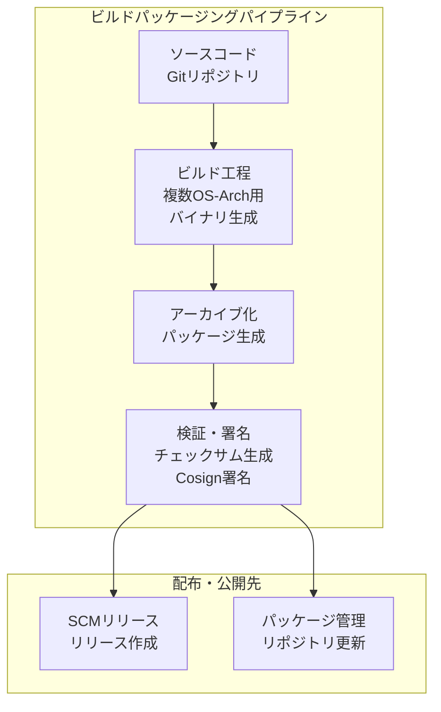
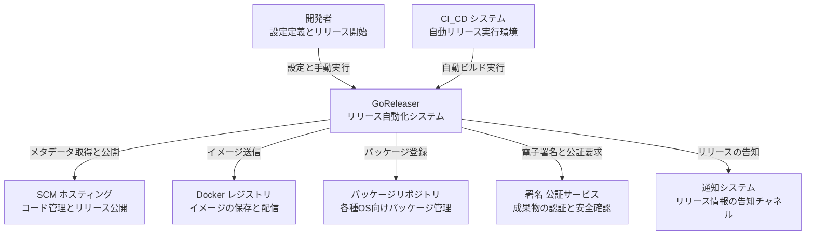
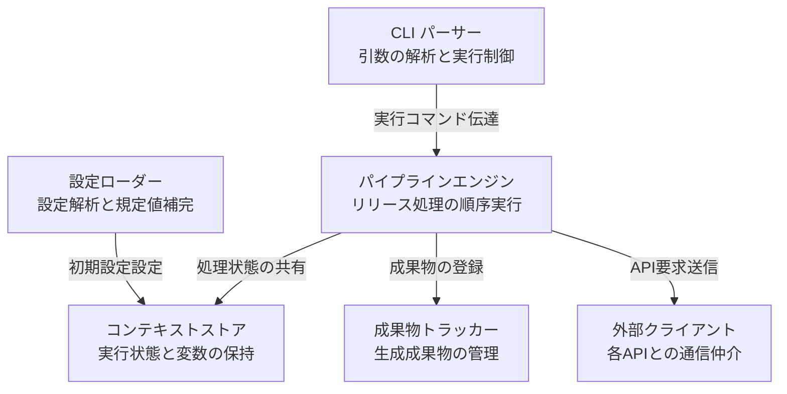
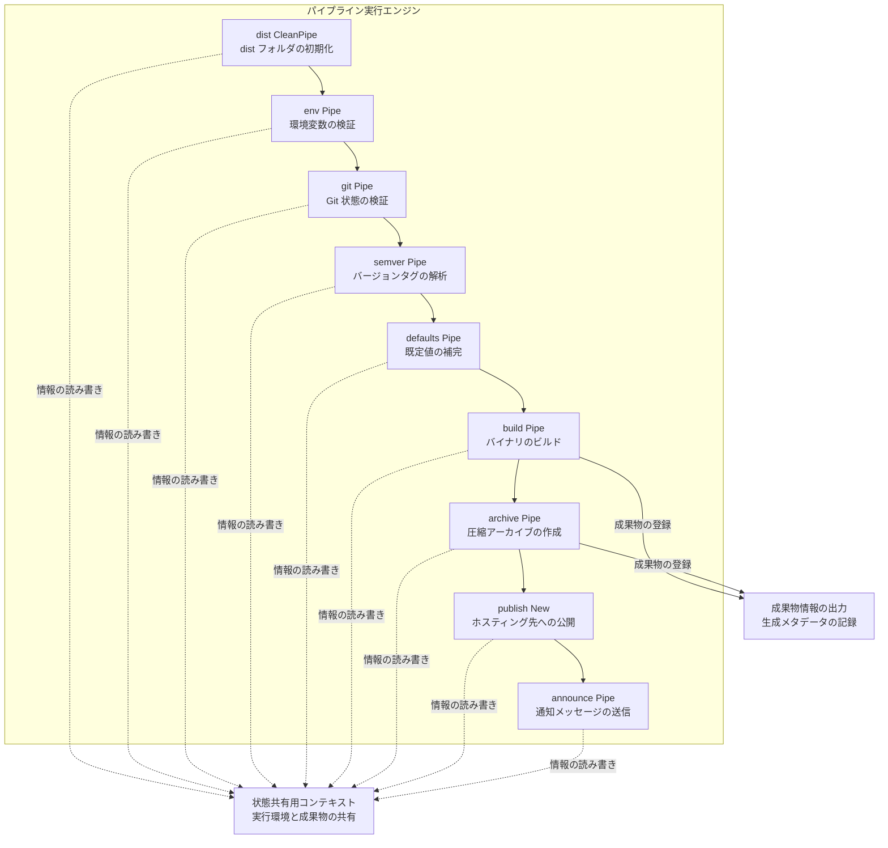
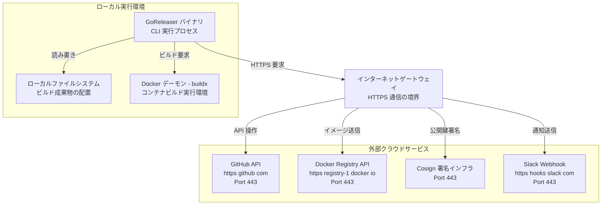
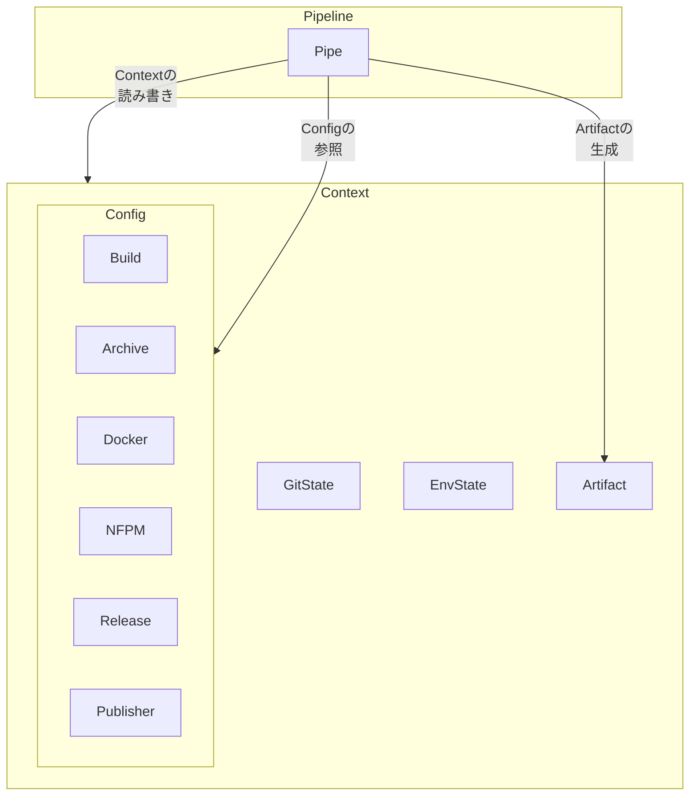
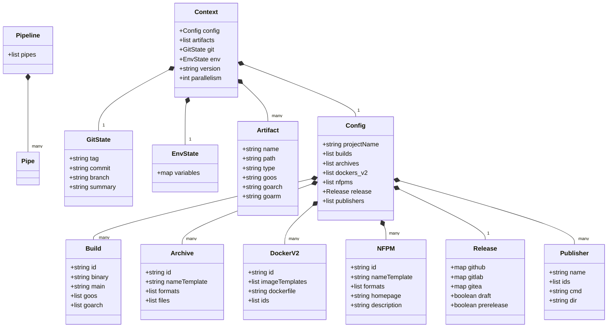
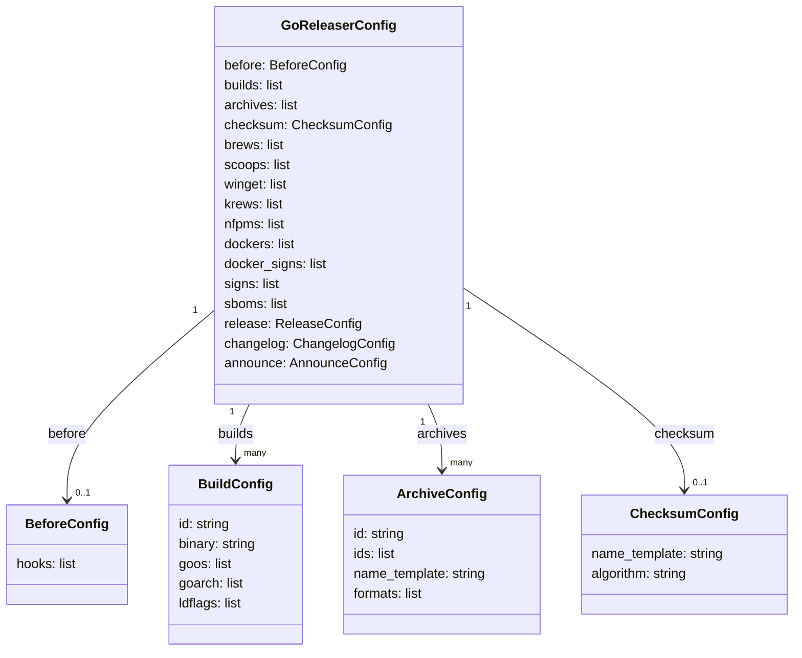
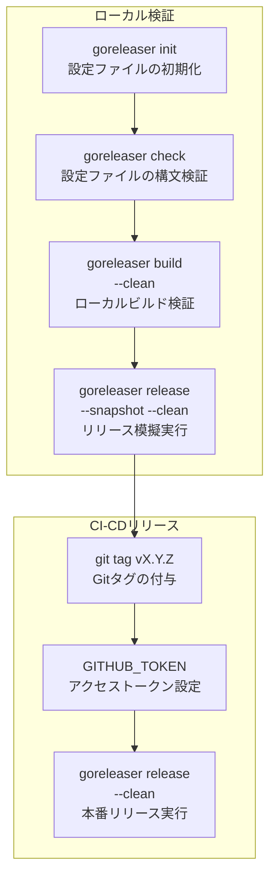

## ■概要

### GoReleaserの目的と位置づけ
GoReleaserは、Go言語で開発したアプリケーションのビルド、パッケージング、配布の全工程を自動化するツールです。
開発者は宣言的な設定ファイル（`.goreleaser.yml` または `.goreleaser.yaml`）を用意します。
これだけで、マルチプラットフォーム向けバイナリの構築から主要パッケージ管理システムへの公開までを一元管理できます。

### 関連技術との関係
GoReleaserと他のリリース自動化・ビルド関連技術との位置づけを以下に示します。

- **レガシークロスコンパイルツール（goxc, xgo）**
  - **goxc**: Go 1.5の標準クロスコンパイル機能導入前に広く使用されたラッパーツール。現在は開発を終了し、GoReleaserが役割を継承。
  - **xgo**: CGO（C言語ライブラリへの依存）を含むプロジェクトのクロスコンパイルに特化したDockerベースのツール。GoReleaserのCGOビルドバックエンドとしての活用や、近年はZigコンパイラ（`zig cc`）をGoReleaser内に組み込む構成が主流。
- **CI/CDツール標準機能（GitHub Actions, GitLab CIなど）**
  - シェルスクリプトの記述によるリリース処理の実現。
  - GoReleaser導入による複雑なスクリプト記述やMakefileの排除、および単一の設定ファイルによる保守性の高いリリースパイプラインの構築。

### 類似ツールとの比較
各リリースメソッドの特徴およびアーキテクチャの違いを比較します。

#### リリースメソッド比較テーブル
| 比較項目 | GoReleaser | カスタムシェルスクリプト / Make | xgo | goxc (レガシー) |
|---|---|---|---|---|
| **実行方式** | 宣言的YAML構成ファイルの解析と単一バイナリによるオーケストレーション | 命令的スクリプト（Bashなど）の逐次実行 | Dockerコンテナによるコンパイル環境の仮想化 | コマンドライン引数によるビルドとパッケージングの実行 |
| **リソース消費** | 中（Go言語の並行処理によるCPUの効率的な利用） | 低〜高（記述したスクリプトおよび外部コマンドへの依存） | 極めて高（Dockerコンテナの起動およびコンパイル環境全体のロード） | 低（シングルスレッド主体の順次処理） |
| **対応機能** | 豊富（ビルド、アーカイブ、署名、SBOM生成、外部レジストリ公開） | 限定的（開発者が独自にスクリプトで実装した機能のみ） | 限定的（CGO向けクロスコンパイル処理のみ） | 限定的（ビルドと単純なアーカイブ作成のみ） |
| **起動速度** | 高速（コンパイル済みのネイティブバイナリによる動作） | 高速（シェルインタプリタによる直接実行） | 低速（Dockerデーモンの呼び出しとイメージ初期化のオーバーヘッド） | 高速（コンパイル済みのネイティブバイナリによる動作） |

#### アーキテクチャの違いに関する技術的根拠
- **GoReleaser**: Go言語標準の強力なクロスプラットフォームビルドシステムの直接呼び出し。外部ツールチェーンへの依存の最小化、およびネイティブGoの並行処理機構によるマルチバイナリ生成。
- **xgo**: 各ターゲットアーキテクチャ向けのCクロスコンパイラを内包した巨大なDockerイメージの利用。CGOの依存関係解決を保証する一方、コンテナランタイムのオーバーヘッドが発生。
- **goxc**: Go言語の標準機能が未成熟だった時代のビルドラッパー。ファイル操作や古いビルドオプションの実行をスクリプトのように模倣。

### ユースケース別の推奨ツール
| ユースケース | 推奨手法 | 選定理由 |
|---|---|---|
| 純粋なGoコードのみで構成されたプロジェクトの配布自動化 | GoReleaser | YAML定義による、ビルドからHomebrew等のレジストリ公開までの最小コストでの自動化 |
| CGOを要求するプロジェクトの高速なクロスビルド | GoReleaser + Zig | Zigのクロスコンパイル機能（`zig cc`）の統合による、Dockerコンテナ不要の軽量かつ高速なビルド |
| 極めて独自のデプロイ要件や、環境特有のAPI連携がある場合 | カスタムシェルスクリプト | 記述の自由度の最優先、およびプロジェクト固有の環境依存処理の柔軟な制御 |
| CGOを利用し、かつビルド環境の複雑性をコンテナ内に隠蔽したい場合 | xgo | ツールチェーンのイメージ化による、CI環境の初期構築コストの抑制 |

### 全体処理フロー
全体の処理フローを示します。なお、実際の GoReleaser 実装（`internal/pipeline/pipeline.go`）では50以上の Pipe が動作していますが、本図は主要な流れを整理した簡略化された概念図です。


| 要素名 | 説明 |
|---|---|
| ソースコード | 開発者が作成したGo言語のプログラムコードとGitの履歴情報 |
| ビルド工程 | 設定に従い、複数のOSやCPUアーキテクチャ向けのバイナリを並行して生成する処理 |
| アーカイブ化 | 生成したバイナリファイルを圧縮ファイルにまとめる処理 |
| 検証・署名 | 成果物の完全性を保証するためのハッシュ値生成や、Cosignによる電子署名の実行 |
| SCMリリース | GitHubやGitLabなどのプラットフォーム上へのリリース作成、およびバイナリやチェンジログのアップロード |
| パッケージ管理 | HomebrewのFormulaやScoopのマニフェストを自動更新し、ユーザーがコマンドでインストール可能な状態にする処理 |

## ■特徴

GoReleaserの主要な特徴を以下に示します。

- **マルチプラットフォームビルドの並行実行**: 単一コマンドによるLinux、macOS、Windows、および複数のCPUアーキテクチャ向けバイナリの並行ビルド。
- **多様なパッケージングフォーマットへの対応**: ビルドしたバイナリのアーカイブ形式（zipやtar.gzなど）への圧縮、およびOS専用パッケージ（Debian形式のdeb、RedHat形式のrpm、Chocolateyなど）への自動梱包。
- **主要なソースコード管理（SCM）プラットフォームとのネイティブ統合**: GitHub、GitLab、GiteaのAPIとのシームレスな連携による、リリースページの作成、成果物のアップロード、およびGit履歴からの変更履歴（Changelog）の自動生成。
- **パッケージエコシステムへの自動公開**: macOS用のHomebrew（TapやCask）、Windows用のScoopやWinget、Kubernetes用のKrewなどのインストールマニフェストの自動生成、および所定のリポジトリへのコミット。
- **セキュリティ対応とコンプライアンス支援**: 生成した成果物に対するCosignを用いた署名、チェックサムファイルの自動生成、およびソフトウェア部品表（SBOM）の標準サポート。
- **Dockerコンテナイメージの構築とプッシュ**: マルチアーキテクチャに対応したDockerイメージの自動ビルド、およびDocker HubやGitHub Container Registry（GHCR）などのコンテナレジストリへのプッシュ。
- **柔軟なカスタマイズを可能にするフック機構**: ビルドや公開プロセスの前後における、独自スクリプトやコマンドの実行。

## ■構造

GoReleaserの構造をC4 modelに基づき3段階で記述します。

### ●システムコンテキスト図
システムコンテキスト図は、GoReleaserと外部システムとの関係を示します。



| 要素名 | 説明 |
|---|---|
| 開発者 | GoReleaserの設定ファイルを定義し、リリースの実行を指示する役割 |
| CI_CD システム | ソースコードの変更を検知し、GoReleaserを自動で起動するビルド実行環境 |
| GoReleaser | ビルド、パッケージング、リリースの一連の処理を自動化するCLIシステム |
| SCM ホスティング | ソースコードの管理や、リリース成果物を公開する外部システム |
| Docker レジストリ | ビルドしたコンテナイメージを格納し、配信する外部システム |
| パッケージリポジトリ | 各オペレーティングシステム向けにパッケージを管理する外部システム |
| 署名 公証サービス | リリースの安全性を担保するため、成果物に電子署名や公証を付与する外部システム |
| 通知システム | リリースの完了情報を開発者やユーザーに告知する外部システム |

### ●プロセスおよびモジュール構成（コンテナ図）
プロセスおよびモジュール構成（コンテナ図）は、GoReleaserシステム内部における機能モジュールの分割と役割を示します。なお、本図はC4 modelで厳密に定義されるContainer（プロセスやデータストアなどの独立した実行単位）の境界を示すものではなく、システム内部の主要な論理プロセスやモジュール構成を示したものです。



| 要素名 | 説明 |
|---|---|
| CLI パーサー | 起動引数や環境変数を解析し、パイプラインの起動を制御するモジュール |
| 設定ローダー | 設定ファイルを読み込み、未定義部分に初期値を適用するモジュール |
| コンテキストストア | リリースの処理状態や環境情報を実行中に保持するメモリ領域 |
| パイプラインエンジン | 個別の処理モジュールを定義した順序に従って実行する制御モジュール |
| 成果物トラッカー | 生成したバイナリやパッケージの情報を追跡し、記録する管理モジュール |
| 外部クライアント | 外部のサービスやAPIと通信を行うための通信モジュール |

### ●コンポーネント図
コンポーネント図は、パイプライン実行エンジン（Pipeline Engine）を構成する具体的なPipe実装を示します。なお、実際の GoReleaser 実装（`internal/pipeline/pipeline.go`）では50以上の Pipe が動作していますが、本図は主要な流れを整理した簡略化された概念図です。



| 要素名 | 説明 |
|---|---|
| dist CleanPipe | 過去の成果物を削除し、出力先ディレクトリを初期化する処理 |
| env Pipe | 外部サービスのトークンや環境変数の存在を検証する処理 |
| git Pipe | リポジトリのタグ情報やコミット履歴を取得する処理 |
| semver Pipe | バージョンタグを解析し、セマンティックバージョンを決定する処理 |
| defaults Pipe | プロジェクト設定に未定義の項目がある場合、既定値を補完する処理 |
| build Pipe | 指定された複数のプラットフォーム向けにバイナリをコンパイルする処理 |
| archive Pipe | バイナリを圧縮し、配布用のアーカイブファイルを生成する処理 |
| publish New | 生成されたアーカイブファイルを外部のホスティングサービスへ公開する処理 |
| announce Pipe | リリースの完了を告知チャンネルへ通知する処理 |
| 状態共有用コンテキスト | 各処理コンポーネント間で共通の環境や状態データを共有する仕組み |
| 成果物情報の出力 | 成果物のメタデータをJSON形式のファイルに出力する処理 |

### ●ネットワーク構成図
ネットワーク構成図は、GoReleaserが動作するローカル環境から外部のクラウドサービスに対する通信経路を示します。



| 要素名 | 説明 |
|---|---|
| GoReleaser バイナリ | CLIプロセスとして動作するGoReleaserの実行主体 |
| ローカルファイルシステム | ビルド成果物や一時ファイルを出力するストレージ |
| Docker デーモン - buildx | ローカル環境でコンテナイメージのビルドおよびパッケージングを実行する環境 |
| インターネットゲートウェイ | 外部ネットワークとの通信を媒介する境界線 |
| GitHub API | リリース作成や成果物アップロードに使用する接続先 |
| Docker Registry API | コンテナイメージのアップロードに使用する接続先 |
| Cosign 署名インフラ | 成果物への電子署名の実行に使用する接続先 |
| Slack Webhook | リリース告知のメッセージ送信に使用する接続先 |

※Cosign署名について、鍵ファイル（`--key`）を使用する署名処理はローカル環境で完結します。Keyless署名（公開鍵インフラを利用する署名）を実行する場合にのみ、外部のSigstoreインフラへのHTTPS通信が発生します。

## ■データ

GoReleaserのアーキテクチャを構成する概念モデルと、それを支える情報モデルを示します。

### ●概念モデル
所有関係は入れ子構造（subgraph）で表現します。利用関係は矢印で表現します。



| 要素名 | 説明 |
|---|---|
| Pipeline | 処理工程の順次実行を制御する実行エンジン |
| Pipe | 各処理フェーズを担当する個々の実行モジュール |
| Context | 実行時の状態や生成された成果物を共有するメモリ領域 |
| GitState | 対象リポジトリから取得したGitのメタデータ |
| EnvState | 処理で参照する環境変数 |
| Artifact | ビルドやパッケージングにより生成された成果物 |
| Config | 設定ファイルから読み込まれるプロジェクト全体の定義 |
| Build | Goバイナリのビルドオプションを定義する設定 |
| Archive | 生成されたバイナリを圧縮するアーカイブ設定 |
| Docker | Dockerイメージビルド用の設定 |
| NFPM | debやrpmなどのシステムパッケージ生成の設定 |
| Release | GitHubなどのリリースプラットフォーム用の設定 |
| Publisher | 成果物を外部にアップロードするための設定 |

### ●情報モデル
主要な属性とその関連を定義したクラス図を示します。



| 要素名 | 説明 |
|---|---|
| Pipeline | 実行するPipeのリストを保持するクラス |
| Pipe | 各リリース工程の処理ロジックを持つクラス |
| Context | 実行時のメタデータ、Config、生成されたArtifactを保持する共有クラス |
| GitState | タグ、コミット、ブランチなどのリポジトリ状態を保持するクラス |
| EnvState | 実行環境から取り込んだ環境変数を保持するクラス |
| Artifact | 生成された成果物のファイルパス、対象OS、アーキテクチャ等を保持するクラス |
| Config | プロジェクト全体のリリース設定を保持するルートクラス |
| Build | バイナリビルド用のソースコードパスや対象プラットフォームの設定クラス |
| Archive | パッケージング形式やアーカイブに含めるファイルの設定クラス |
| DockerV2 | GoReleaser v2に対応したDockerイメージ名やDockerfileのパスの設定クラス |
| NFPM | パッケージメタデータや生成するパッケージ形式の設定クラス |
| Release | 公開先のプラットフォーム名や下書き・プレリリース指定の設定クラス |
| Publisher | カスタムコマンドや実行ディレクトリを定義する外部配布用設定クラス |

## ■構築方法

### 前提条件
- リリース対象のGoプロジェクトの準備。
- ローカル環境へのGoツールチェーンのインストール。
- バージョン管理およびリリースの基準となるGitのインストールと初期化。

### インストール方法（複数手段）
- **Homebrew（macOS / Linux）**
  - OSS版 Tap 経由でのインストール：
    ```bash
    brew install goreleaser/tap/goreleaser
    ```
  - Pro版 Cask 経由でのインストール（補足）：
    ```bash
    brew install --cask goreleaser-pro
    ```
- **Goコマンド（開発環境共通）**
  - Goのツールチェーン導入環境における、以下のコマンドでの最新バイナリのインストール。
    ```bash
    go install github.com/goreleaser/goreleaser/v2@latest
    ```
- **Scoop（Windows）**
  - Windows環境における、パッケージマネージャーであるScoopを利用した以下のコマンドでのインストール。
    ```bash
    scoop bucket add goreleaser https://github.com/goreleaser/scoop-bucket.git
    scoop install goreleaser
    ```
- **Docker**
  - コンテナ環境における、以下のコマンドでの公式イメージの取得。
    ```bash
    docker pull goreleaser/goreleaser
    ```
- **シェルスクリプト（CI/CD環境）**
  - CI/CDパイプラインなどに組み込む場合の、以下のスクリプトのダウンロードおよび実行。
    ```bash
    curl -sfL https://goreleaser.com/static/run | bash
    ```

### バージョン確認
インストール完了後、以下のコマンドで実行可能なバージョンを確認します。
```bash
goreleaser --version
```

## ■利用方法

### 必須パラメータと前提条件
利用を開始する前に、以下のパラメータと環境変数を設定してください。
※利用する公開・配布先プラットフォーム（GitHub/GitLab/Gitea等）に応じて、必要なトークンのみを設定してください。すべてのトークンを同時に設定する必要はありません。
| パラメータ名 | 区分 | 必須条件と設定方法 | 説明 |
|---|---|---|---|
| Gitリポジトリ | 前提環境 | 実行ディレクトリにおける `.git` ディレクトリの存在 | Gitタグやコミット履歴を基準としたリリースの実行 |
| Gitタグ | 前提環境 | リリース対象コミットへの `git tag vX.Y.Z` の付与 | `release` コマンドでのリリース対象バージョンの特定 |
| GITHUB_TOKEN | 環境変数 | 環境変数への適切な権限を持つ個人アクセストークンの設定 | GitHubへのリリース作成、およびバイナリアセットのアップロード |
| GITLAB_TOKEN | 環境変数 | 環境変数への適切な権限を持つアクセストークンの設定 | GitLabへのリリース作成、およびバイナリアセットのアップロード |
| GITEA_TOKEN | 環境変数 | 環境変数への適切な権限を持つアクセストークンの設定 | Giteaへのリリース作成、およびバイナリアセットのアップロード |

### 主要リソースの CRUD 操作
GoReleaserは設定ファイル `.goreleaser.yaml` を制御用のリソースとして扱います。
- **新規作成（Create）**
  - プロジェクトのルートディレクトリにおける、以下のコマンド実行による標準構成の設定ファイルの生成。
    ```bash
    goreleaser init
    ```
- **取得と検証（Read）**
  - 以下のコマンド実行による設定ファイル内容の解析、および構文エラーの検証。
    ```bash
    goreleaser check
    ```
- **更新（Update）**
  - テキストエディタを使用した `.goreleaser.yaml` ファイルの編集、および必要なビルド構成やリリース先の追加・変更。
- **破棄（Delete）**
  - 設定を破棄する場合の、作成した `.goreleaser.yaml` のファイルシステムからの削除。

### 設定ファイルの書き方
`.goreleaser.yaml`の基本的な記述例を示します。
```yaml
# ビルド前の処理
before:
  hooks:
    - go mod tidy
    - go generate ./...

# ビルド設定
builds:
  - id: my-app
    dir: .
    main: ./cmd/main.go
    binary: my-app
    goos:
      - linux
      - darwin
      - windows
    goarch:
      - amd64
      - arm64
    ldflags:
      - "-s -w -X main.version={{.Version}}"

# アーカイブ（パッケージング）設定
archives:
  - id: default
    ids:
      - my-app
    name_template: "{{ .ProjectName }}_{{ .Version }}_{{ .Os }}_{{ .Arch }}"
    formats:
      - tar.gz
    format_overrides:
      - goos: windows
        formats:
          - zip

# チェックサムファイル設定
checksum:
  name_template: "{{ .ProjectName }}_{{ .Version }}_checksums.txt"
  algorithm: sha256
```

### 実践的・詳細な設定例（フルセット）
以下は、パッケージ配信、セキュリティ（署名・SBOM）、チェンジログ制御、およびリリース通知を含む実践的なフルセットの設定例です。
```yaml
# 全体設定
version: 2
project_name: my-app

before:
  hooks:
    - go mod tidy

builds:
  # CGO を無効化した標準的なビルド
  - id: my-app
    dir: .
    main: ./cmd/main.go
    binary: my-app
    goos:
      - linux
      - darwin
      - windows
    goarch:
      - amd64
      - arm64
    env:
      - CGO_ENABLED=0
    ldflags:
      - "-s -w -X main.version={{.Version}}"
    hooks:
      post:
        - cmd: echo "Build completed for {{ .Target }}"

  # CGO を有効化した Linux ビルドの例 (クロスコンパイル CC を指定)
  - id: my-app-cgo
    dir: .
    main: ./cmd/main.go
    binary: my-app-cgo
    goos:
      - linux
    goarch:
      - amd64
    env:
      - CGO_ENABLED=1
      - CC=x86_64-linux-gnu-gcc
    ldflags:
      - "-s -w -X main.version={{.Version}}"

archives:
  - id: default
    ids:
      - my-app
      - my-app-cgo
    name_template: "{{ .ProjectName }}_{{ .Version }}_{{ .Os }}_{{ .Arch }}"
    formats:
      - tar.gz
    format_overrides:
      - goos: windows
        formats:
          - zip

checksum:
  name_template: "{{ .ProjectName }}_{{ .Version }}_checksums.txt"
  algorithm: sha256

# パッケージ管理システムへの公開設定
homebrew_casks:
  - name: my-app
    repository:
      owner: suwa-sh
      name: homebrew-tap
    directory: Casks
    homepage: "https://github.com/suwa-sh/my-app"
    description: "Sample application description"

scoops:
  - name: my-app
    bucket:
      owner: suwa-sh
      name: scoop-bucket
    homepage: "https://github.com/suwa-sh/my-app"
    description: "Sample application description"

winget:
  - name: my-app
    publisher: suwa-sh
    license: MIT
    short_description: "Sample application short description"
    repository:
      owner: suwa-sh
      name: winget-pkgs
    homepage: "https://github.com/suwa-sh/my-app"
    description: "Sample application description"

krews:
  - name: my-app
    repository:
      owner: suwa-sh
      name: krew-index
    homepage: "https://github.com/suwa-sh/my-app"
    description: "Sample application description"

# deb/rpm/apk などのシステムパッケージ生成
nfpms:
  - id: my-app-package
    package_name: my-app
    formats:
      - deb
      - rpm
      - apk
    vendor: suwa-sh
    homepage: "https://github.com/suwa-sh/my-app"
    maintainer: "suwa-sh <admin@example.com>"
    description: "Sample application package"

# Docker イメージのビルドとプッシュ (v2形式)
dockers_v2:
  - image_templates:
      - "ghcr.io/suwa-sh/my-app:{{ .Version }}"
      - "ghcr.io/suwa-sh/my-app:latest"
    dockerfile: Dockerfile
    ids:
      - my-app
      - my-app-cgo

# Docker イメージの署名設定
docker_signs:
  - artifacts: all
    cmd: cosign
    args:
      - "sign"
      - "--key=cosign.key"
      - "${artifact}"

# 電子署名 (Cosign) 設定
signs:
  - artifacts: checksum
    cmd: cosign
    args:
      - "sign-blob"
      - "--key=cosign.key"
      - "--bundle=${signature}"
      - "${artifact}"
    signature: "${artifact}.sigstore.json"

# SBOM (Software Bill of Materials) 生成設定
sboms:
  - artifacts: archive
    cmd: syft
    args:
      - "${artifact}"
      - "--output"
      - "spdx-json"
      - "--file"
      - "${document}"
    documents:
      - "${artifact}.sbom.json"

# リリース制御とカスタムリリースノート設定
release:
  github:
    owner: suwa-sh
    name: my-app
  draft: false
  prerelease: false
  header: |
    ## Release {{ .Tag }} ({{ .Date }})
    Thank you for using my-app!
  footer: |
    --
    Generated by GoReleaser

# チェンジログ生成のグループ化・フィルタ設定
changelog:
  sort: asc
  filters:
    exclude:
      - '^docs:'
      - '^test:'
  groups:
    - title: 'New Features'
      regexp: '^feat(\(.*\))??:'
      order: 0
    - title: 'Bug Fixes'
      regexp: '^fix(\(.*\))??:'
      order: 1

# リリース通知 (Slack/Discord Webhook) 設定
announce:
  slack:
    enabled: true
    channel: '#releases'
    message_template: 'New version {{.Version}} has been released!'
```

### 設定ファイルのデータ構造
`.goreleaser.yaml`の主要な設定ブロックと属性の関係を示します。



| 要素名 | 説明 |
|---|---|
| GoReleaserConfig | 設定ファイル全体のルート構成の定義 |
| BeforeConfig | ビルド実行前に前処理として呼び出されるフックコマンドの定義 |
| BuildConfig | 対象プラットフォームやコンパイルオプションなどバイナリのビルド方法の定義 |
| ArchiveConfig | ビルドしたバイナリのパッケージング方法（圧縮形式やファイル名テンプレートなど）の定義 |
| ChecksumConfig | アーティファクトの整合性検証用チェックサムファイルの生成方法の定義 |

## ■利用・検証フロー

GoReleaserを使用したローカル開発での検証からCI/CD実行までのフローを示します。



| 要素名 | 説明 |
|---|---|
| Init | 設定ファイルを初期化して `.goreleaser.yaml` を生成する処理 |
| Check | `.goreleaser.yaml` の構文や設定項目を検証する処理 |
| Build | 対象プラットフォーム向けにバイナリのみをローカルビルドする処理 |
| Snapshot | タグや公開処理をスキップして、パッケージングまでをローカルで模擬実行する処理 |
| GitTag | リリースバージョンを特定するためのGitタグを付与する処理 |
| SetToken | プラットフォームへのアップロードに必要なアクセストークンを環境変数に設定する処理 |
| RunRelease | タグ情報を読み込み、ビルド、パッケージング、リリース公開までを一貫して実行する処理 |

### よく使うオプションの説明
- **`--clean`**: ビルド出力先である `dist/` ディレクトリを事前に削除し、クリーンな状態で処理を開始するオプション。
- **`--snapshot`**: Gitタグを省略したローカル環境における、一時的なバージョン名でのリリースビルドの試行オプション。
- **`--skip=publish`**: GitHub等へのバイナリ配布のスキップ、およびパッケージ作成までの処理のローカル環境への限定オプション。
- **`--single-target`**: 設定ファイルに記述されたプラットフォームの中から、現在の実行環境（OS・アーキテクチャ）向けのみをビルドするオプション（主に `build` コマンドのローカル検証で有効。`release` コマンドでの適用は GoReleaser Pro の機能）。

## ■運用

### 起動
ローカル環境における検証やCI/CDでの実行方法を説明します。
ローカル環境でビルドを検証する場合は、以下のコマンドを実行します。
```bash
goreleaser build --clean --snapshot
```
ローカル環境でリリース処理全体を擬似的に検証する場合は、以下のコマンドを実行します。
```bash
goreleaser release --clean --snapshot
```
本番リリースでは、Gitタグのプッシュ検知による自動実行が一般的です。
```bash
goreleaser release --clean
```

### 停止
実行中プロセスの停止方法やタイムアウトの設定を説明します。
ローカル環境で実行を中断する場合は、キーボードの `Ctrl + C` を入力します。
CI/CD環境におけるジョブのハングを回避するため、実行時間制限（タイムアウト）を設定します。
GitHub Actionsでは、以下のように `timeout-minutes` を指定します。
```yaml
jobs:
  release:
    runs-on: ubuntu-latest
    timeout-minutes: 15
    steps:
      - name: Run GoReleaser
        uses: goreleaser/goreleaser-action@v7
        with:
          args: release --clean
```

### 状態確認
GoReleaserの動作状態や設定ファイルの検証方法を説明します。
設定ファイル `.goreleaser.yaml` の構文や非推奨のオプションを検知するために、以下のコマンドを実行します。
```bash
goreleaser check
```
実行結果は終了コードで確認できます。正常終了時は 0、エラー発生時は 1 などの非ゼロのコードを返します。
インストールしたGoReleaserのバージョンを確認するために、以下のコマンドを実行します。
```bash
goreleaser --version
```

### ログ確認
動作詳細の確認やデバッグ方法を説明します。
内部処理のログを詳細に出力するために、`--verbose` フラグを追加します。
```bash
goreleaser release --clean --verbose
```
CI/CDのログ保存では、機密情報の露出を避けるために、本番環境でのデバッグ出力を一時的な有効化にとどめます。

### 更新
GoReleaser本体のアップデート手順を説明します。
macOS環境では、Homebrewを使用して更新します。
```bash
brew upgrade goreleaser
```
Go開発環境では、`go install` コマンドで最新のv2バージョンを取得します。
```bash
go install github.com/goreleaser/goreleaser/v2@latest
```
CI/CDパイプラインでは、公式のアクションタグを特定のバージョンに固定して更新を管理します。

### スケール操作
ビルド処理の並行数制御について説明します。
GoReleaserはデフォルトで、マシンのCPUコア数（`GOMAXPROCS`）に応じた並行数でビルドを実行します。
CIランナーのメモリ負荷を下げ、メモリ不足による異常終了を避けるために、`--parallelism` フラグで並行数を制限します。
```bash
goreleaser release --clean --parallelism 2
```

## ■ベストプラクティス

### CI/CD 連携
- GitHub Actionsを用いたリリース自動化の構成例。
- タグのプッシュ時のみに限定した実行トリガー条件の設定。
- リリースアセットのアップロード権限を付与するための、`permissions` における `contents: write` の明示。

### マルチ環境管理
- 検証用と本番リリース用での設定の切り替え方法。
- 設定ファイル内のパラメータへの環境変数の埋め込み、および動的な値の差し替え構成。
  ```yaml
  # .goreleaser.yaml の一部
  project_name: "{{ .Env.APP_NAME }}"
  ```
- 環境ごとに異なる設定ファイルを使用する場合の、`--config` フラグによるファイルの指定。

### リソース制限
- CI環境におけるCPUやメモリのリソース競合を避ける設定。
- 大規模な並行ビルド時におけるメモリ使用量の増加。
- `--parallelism` 設定による並行ビルド数の抑制、およびマシンのハングの防止。
- Goコマンド自体のスレッド制限における、環境変数 `GOMAXPROCS` の指定。

### セキュリティ
- 成果物の安全性を確保する設定方法。
- バイナリの改ざん検知に向けた、チェックサム（SHA256）ファイルの自動生成。
  ```yaml
  checksum:
    name_template: 'checksums.txt'
  ```
- 署名ツール（Cosignなど）との連携による、バイナリやDockerイメージへの署名の付与。
- SBOM（Software Bill of Materials）生成に向けた、Syftなどの外部ツールとの連携設定。
- 設定ファイルへの直接記述を避けた、CIシークレット変数から環境変数経由での機密情報（トークンやAPIキーなど）の引き渡し。

### 設定管理
- GoReleaserの設定ファイルを管理するためのプラクティス。
- `.goreleaser.yaml` のGitリポジトリルートへの配置、およびソースコードと同一バージョンでの管理。
- 設定スキーマの変更への追従に向けた、ファイル先頭での `version: 2` の明示。
- 非推奨設定の混入を避けるための、Pre-commitフックやCIの静的解析フェーズにおける `goreleaser check` の自動実行の導入。

## ■トラブルシューティング

頻出するエラーとその解決手順を以下の表に示します。

| 症状（エラーメッセージ例） | 原因 | 対処 |
|---|---|---|
| リリース実行時に `git is dirty` エラーが発生し処理が中断する<br/>（例: `git is dirty: 1 file(s) modified`） | 未コミットの変更や追跡対象外のファイルの存在、あるいはビルド時に生成された一時ファイルがGit管理対象外であること | `git status` によるコミット前のファイルの確認、およびコミットか退避（`git stash`）の実行。ビルド成果物ディレクトリ（`dist/`）の `.gitignore` への追加。ローカル環境でのテスト実行時における `--clean` や `--snapshot` フラグの使用 |
| GitHub APIやレジストリへのアップロード時に `unauthorized (401)` や `bad credentials` が発生する<br/>（例: `GitHub Releases: failed to publish release: ... unauthorized`） | 認証用トークン（`GITHUB_TOKEN` など）の指定の欠落、あるいはトークンのスコープ（権限）の不足 | CI設定における `GITHUB_TOKEN` が正しく環境変数に渡されているかの確認。GitHub Actionsの `permissions` 設定における `contents: write` の有効化 |
| CGOを有効（`CGO_ENABLED=1`）にしたビルドにおけるコンパイルエラーやヘッダーの未検出の発生<br/>（例: `gcc: command not found`） | クロスコンパイル先のアーキテクチャに対応するCツールチェーン（コンパイラやSDK）のビルド環境における不在 | クロスコンパイル用のCツールチェーンが導入されたDockerイメージ（`goreleaser/goreleaser-cross`）の利用、あるいはCGOを無効化する構成（`CGO_ENABLED=0`）への変更 |

## ■まとめ
GoReleaserは、Go言語で開発したアプリケーションのビルドから配布までを宣言的に自動化する強力なツールです。
本記事で紹介した全体構造や設定方法、CI/CDとの連携方法を活用することで、安全で保守性の高いリリースパイプラインを構築できます。

この記事が少しでも参考になった、あるいは改善点などがあれば、ぜひリアクションやコメント, SNSでのシェアをいただけると励みになります！

## ■参考リンク

### 公式ドキュメント
- [GoReleaser 公式サイト](https://goreleaser.com)
- [GoReleaser Core Concepts](https://goreleaser.com/getting-started/introduction/)
- [GoReleaser Install](https://goreleaser.com/getting-started/install/)
- [GoReleaser Quick Start](https://goreleaser.com/getting-started/quick-start/)
- [GoReleaser Customization - Builds](https://goreleaser.com/customization/builds/)
- [GoReleaser Customization - Archives](https://goreleaser.com/customization/archives/)
- [GoReleaser Customization - Checksums](https://goreleaser.com/customization/checksums/)
- [GoReleaser CLI Flags](https://goreleaser.com/cmd/goreleaser/)
- [CGO Cross Compilation with GoReleaser](https://goreleaser.com/errors/cgo/)

### GitHub
- [goreleaser/goreleaser - GitHub](https://github.com/goreleaser/goreleaser)
- [GoReleaser GitHub Action](https://github.com/goreleaser/goreleaser-action)
- [goreleaser/artwork - GitHub](https://github.com/goreleaser/artwork)
- [GoReleaser Pipeline Implementation](https://github.com/goreleaser/goreleaser/blob/main/internal/pipeline/pipeline.go)

### 外部リポジトリ
- [deepwiki - goreleaser/goreleaser](https://deepwiki.com/goreleaser/goreleaser)\n