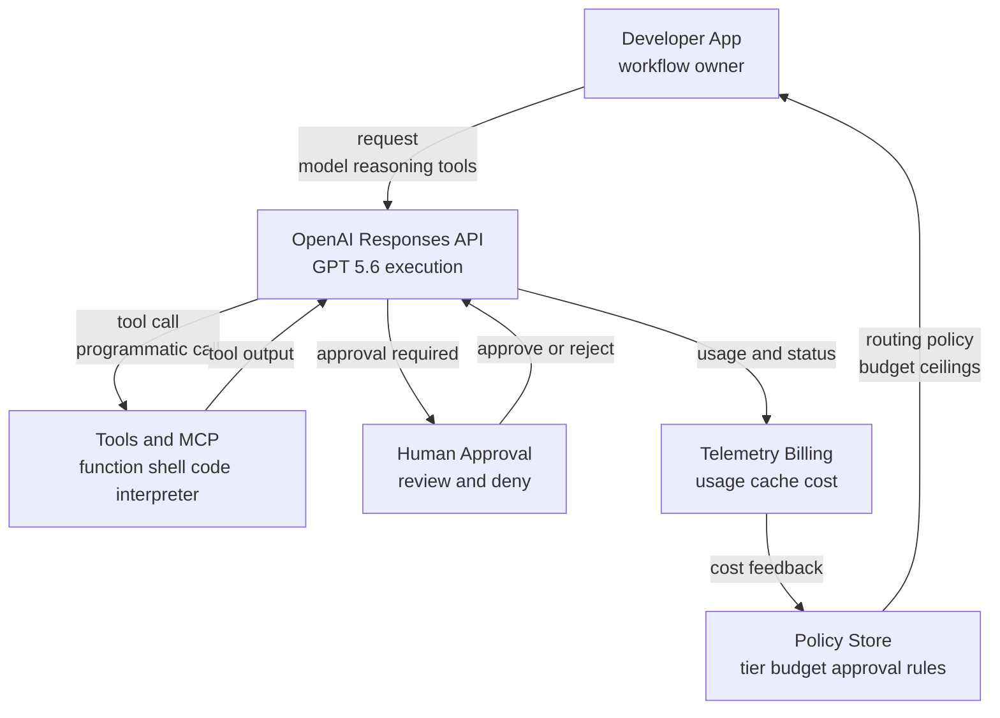
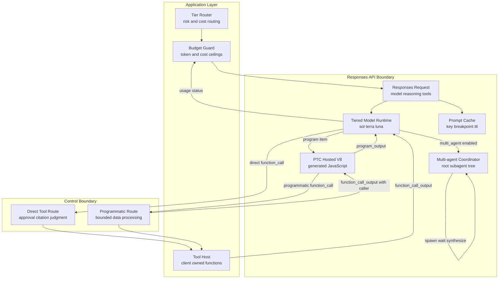
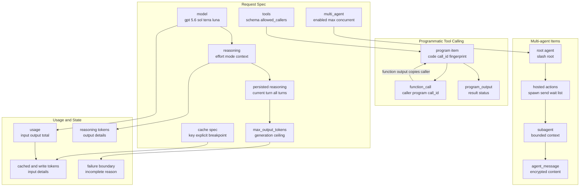
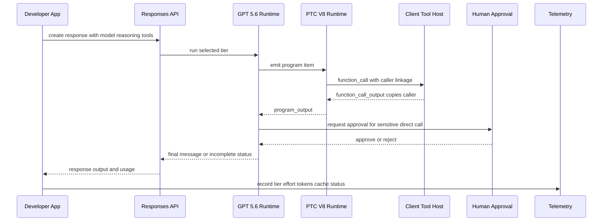
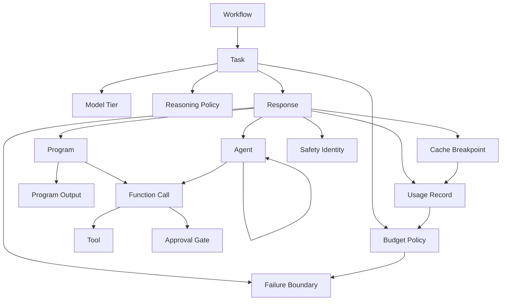
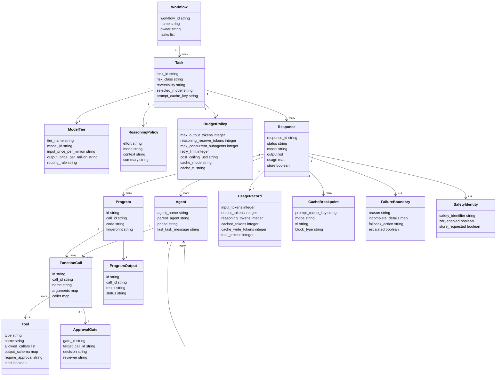
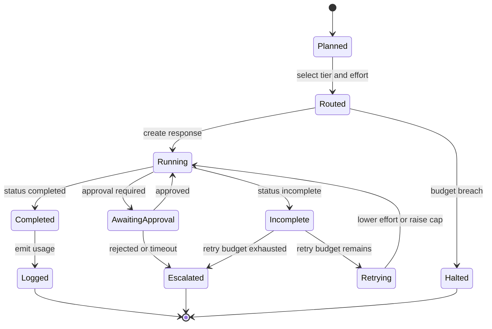

> 検証日: 2026-07-11。対象は GPT-5.6 三階層モデル Sol / Terra / Luna と Responses API 実行基盤です。
> 本記事は execution-infrastructure / API-platform の角度に限定します。政府配布統制、trusted partner 選定、EO 14409 の論点は扱いません。
> 価格は取得日時点の per 1M tokens の概数です。Programmatic Tool Calling や Multi-agent beta などの API 仕様は変更される可能性があります。

## 概要

GPT-5.6 は、単一の「一番強いモデル」を選ぶリリースではありません。**タスクごとに計算予算を割り当てる API 実行基盤**として読むと、設計判断をしやすくなります。OpenAI は `gpt-5.6-sol`、`gpt-5.6-terra`、`gpt-5.6-luna` の三層を提供し、`gpt-5.6` alias は Sol にルーティングされます。Sol はフラッグシップ、Terra は性能とコストのバランス、Luna は高頻度・低コスト処理向けです。

この三層に、Responses API の実行ノブが重なります。

| 実行ノブ | 役割 | 予算に効く点 |
|---|---|---|
| model tier | Sol / Terra / Luna を選ぶ | per-token 単価、レイテンシ、能力上限 |
| `reasoning.effort` | `none` / `low` / `medium` / `high` / `xhigh` / `max` で考える量を制御する | reasoning tokens と品質のトレードオフ |
| `reasoning.mode` | `standard` または `pro` を選ぶ | 難度の高い単一最終回答に追加のモデル作業を使う |
| Programmatic Tool Calling | モデル生成 JavaScript で複数ツールをまとめる | 中間出力を圧縮し、turn 数と context 投入量を減らす |
| Multi-agent beta | root agent が subagent を並列起動し統合する | wall-clock を短縮し得るが総 token は増えやすい |
| prompt caching | 共通 prefix を再利用する | cache write と cache read の損益管理が必要 |
| persisted reasoning | reasoning items を turn 間で再利用する | 長い workflow の品質と token 効率を改善する |

したがって GPT-5.6 の実装設計は、「Sol が強いか」ではなく、**どの workflow stage にどの tier と effort と orchestration を割り当てるか**を定義する作業になります。

実装前に固定する契約は、次の 5 つです。

| 契約 | 決めること |
|---|---|
| task class | 失敗時影響、検証方法、期待 latency |
| tier routing | Sol / Terra / Luna の選択条件 |
| reasoning policy | effort、mode、max output、retry 条件 |
| tool permission | direct / programmatic / approval の境界 |
| telemetry | token、cache、fallback、incomplete の記録粒度 |


## 特徴

### 特徴1: 三階層モデルを task-based budget として扱う

OpenAI 公式ページは GPT-5.6 の三層を、Sol、Terra、Luna として提示しています。価格は per 1M tokens の取得日時点の概数です。

| Tier | 位置づけ | Input | Output | 予算配分上の使いどころ |
|---|---|---:|---:|---|
| Sol | flagship | 約 $5 | 約 $30 | 不可逆性が高い判断、最終レビュー、長期 horizon agent、高難度 coding / security / research |
| Terra | balanced | 約 $2.50 | 約 $15 | 通常の agentic workflow、主要生成、検証可能な業務処理 |
| Luna | cost-efficient | 約 $1 | 約 $6 | 前処理、分類、候補抽出、低リスク大量処理 |

重要なのは、三層を「性能順の選択肢」ではなく、次のようなルーティング基準に変換することです。

| ルーティング軸 | Luna | Terra | Sol |
|---|---|---|---|
| 失敗時の影響 | やり直しが容易 | 人間レビューで回復可能 | 顧客影響、セキュリティ影響、データ損失があり得る |
| 検証コスト | 自動検証しやすい | 追加チェックで検証可能 | 検証自体が高コスト |
| 主要コスト | throughput | unit economics | quality / risk reduction |
| 推奨 effort | `none` / `low` | `low` / `medium` | `medium` / `high` / `xhigh` / `max` |

実務では、tier の境界を「月間 token 分布」と「失敗時影響」の両方で決めます。たとえば 1 task あたり input 20k / output 4k tokens の workflow を月 10,000 件流す場合、全件 Sol に置くと概算 $2,200、全件 Terra なら $1,100、全件 Luna なら $440 です。最初から全件 Sol に寄せるのではなく、Luna で 60%、Terra で 35%、Sol で 5% のように stage 分割すると、概算 $693 まで下がります。

| 配分例 | Luna 件数 | Terra 件数 | Sol 件数 | 月額概算 |
|---|---:|---:|---:|---:|
| 全件 Sol | 0 | 0 | 10,000 | 約 $2,200 |
| 全件 Terra | 0 | 10,000 | 0 | 約 $1,100 |
| 全件 Luna | 10,000 | 0 | 0 | 約 $440 |
| Stage 分割 | 6,000 | 3,500 | 500 | 約 $693 |

この表は単純化した概算です。実際には reasoning tokens、prompt cache、retry、tool output を含めて再計算します。それでも、**上位 tier を「全件の既定値」ではなく「失敗影響が高い一部 stage の保険」として使う**という設計判断を定量化できます。

### 特徴2: reasoning effort と pro mode が tier と直交する

`reasoning.effort` は、同じ model tier に対してどれだけ内部 reasoning tokens を使わせるかを制御します。OpenAI docs は、低い effort が速度と token usage を優先し、高い effort がより完全な計画、代替案検討、tool use、回復能力に寄与すると説明しています。

| Effort | 主な用途 | 運用上の注意 |
|---|---|---|
| `none` | latency-critical な分類、検索、短文応答 | tool-heavy task では `low` との比較が必要 |
| `low` | 軽い planning、customer support、通常のデータ処理 | Luna / Terra の標準候補 |
| `medium` | coding、research、spreadsheet / slides、長めの agentic task | まず比較する baseline |
| `high` | 複雑な debugging、deep planning、高価値 task | Sol に寄せる前に eval で効果を見る |
| `xhigh` | deep research、asynchronous workflow、security review | latency と token cost の増加を前提にする |
| `max` | GPT-5.6 の高難度探索・検証 | `xhigh` からの置換候補として代表タスクで比較する |

`reasoning.mode: "pro"` は、同じ GPT-5.6 model で追加のモデル作業を行い、より信頼性の高い単一最終回答を返す実行モードです。mode と effort は独立です。`pro` を「常に使う高級設定」として扱うのではなく、限界的な品質向上が事業上意味を持つ task だけに限定します。

### 特徴3: Programmatic Tool Calling は tool orchestration を API 内に寄せる

Programmatic Tool Calling は、モデルが JavaScript を生成し、OpenAI がホストする fresh isolated V8 runtime 上でそのプログラムを実行する機能です。runtime は Node.js、package install、direct network access、general-purpose filesystem、subprocess、console、永続 JavaScript state を持ちません。外部システムには、リクエストで有効化された tool 経由でのみ接続します。

programmatic caller を許可できる tool type は、公式 docs 上では `function` / `custom`、`mcp`、`apply_patch`、local / hosted `shell`、`code_interpreter` です。すべての tool が自動的に PTC 対応になるわけではないため、tool 定義ごとに `allowed_callers` と出力 schema を確認します。

| PTC に向く task | PTC を避ける task |
|---|---|
| 複数 tool 結果を filter / join / rank / dedupe / aggregate / validate する | 1 回の tool call で足りる |
| 依存 call の data flow が予測可能 | 各結果が次の semantic judgment を変える |
| 中間出力が大きく、最終的には小さな structured result でよい | citation や native artifact を最終検証する必要がある |
| retry / stop condition / failure shape を明示できる | write / destructive / approval-sensitive action を含む |

PTC は tool-heavy workflow の token 効率を改善し得ます。一方で、認可境界が曖昧な write action を program loop に入れると、責任境界が崩れます。副作用を伴う tool は direct path と approval に残す設計が安全です。

### 特徴4: Multi-agent beta は wall-clock を買う機能であり、安い機能ではない

Multi-agent beta は、root agent `/root` が subagent を spawn し、複数 workstream を並列に進めて統合する機能です。OpenAI docs は、コードベース探索、複数文書・仮説比較、並列リサーチ、独立コンポーネント実装、障害原因の並列調査などに有効だと説明しています。

GPT-5.6 launch page では、`ultra` が「4 agents を既定で並列調整する最高能力設定」として説明されています。一方、API docs で開発者が直接扱う surface は Responses API の Multi-agent beta です。Multi-agent beta の `max_concurrent_subagents` 既定値・推奨値は 3 であり、Codex / ChatGPT Work の `ultra` 呼称と Responses API の beta parameter は同一の設定名ではありません。API 実装では `multi_agent.enabled` と `max_concurrent_subagents` を明示的に扱います。

| Multi-agent を使う | 単一 agent を使う |
|---|---|
| 独立した bounded task に分割できる | 各 step が前 step に強く依存する |
| separate context が focus を上げる | 短い 1 run で終わる |
| 並列探索で wall-clock が下がる | 共有 mutable state を取り合う |
| 独立 findings の比較が coverage を上げる | 決定論的な固定実行グラフが必要 |

注意点として、Responses API の built-in Multi-agent では subagents がリクエストの model と tools を共有します。Sol root と Luna subagent のような**異種 tier subagent 構成を同一 Multi-agent request 内で実現する仕様ではありません**。異種 tier を使う場合は、アプリケーション側で複数 Responses request に分ける外部 orchestration が必要です。

### 特徴5: explicit prompt caching は write/read の損益分岐を管理する

GPT-5.6 以降では、prompt cache write が uncached input rate の 1.25 倍で課金され、cache read は 90% discount の対象です。`prompt_cache_key` を安定的に設定し、再利用される prefix を明示的な breakpoint で区切ることで、cache hit 率を上げられます。

| キャッシュ設計要素 | 役割 |
|---|---|
| static prefix | system prompt、tool schema、long instructions など再利用する内容 |
| dynamic suffix | user-specific data、現在の質問、最新ログ |
| `prompt_cache_key` | 同じ prefix を同じ cache に寄せる routing key |
| `prompt_cache_breakpoint` | reusable prefix の終端を明示する marker |
| `cached_tokens` | read された token 数 |
| `cache_write_tokens` | write された token 数。GPT-5.6 以降で課金管理が必要 |

キャッシュは最終出力を固定する仕組みではありません。cached prefix から新しい応答を生成するため、同じ入力でも非決定性は残ります。

## 構造

### システムコンテキスト図



| 要素名 | 説明 |
|---|---|
| Developer App | Responses API を呼ぶアプリケーション。workflow ごとの tier routing、budget cap、approval policy を保持します。 |
| OpenAI Responses API | GPT-5.6 tier、reasoning、tool calling、PTC、Multi-agent、prompt caching を扱う主要 boundary です。 |
| Tools and MCP | function、custom、MCP、shell、code interpreter など、モデルが外部に作用する唯一の接点です。 |
| Human Approval | 副作用のある action や sensitive action の前に挿入する人間レビュー境界です。 |
| Telemetry Billing | `usage`、cache read/write、status、latency、fallback を収集し、次のルーティング判断へ戻します。 |
| Policy Store | task class、tier、reasoning、retry、approval、fallback を定義するアプリ側の正本です。 |

### コンテナ図



| 要素名 | 説明 |
|---|---|
| Tier Router | task の不可逆性、検証コスト、失敗影響から Sol / Terra / Luna を選びます。 |
| Budget Guard | `max_output_tokens`、workflow cost ceiling、retry limit、subagent concurrency を適用します。 |
| Tool Host | client-owned function を実行し、`function_call_output` を返すアプリ側 runtime です。 |
| Responses Request | model、reasoning、tools、prompt cache、multi_agent を含む実行単位です。 |
| Tiered Model Runtime | 選択された GPT-5.6 tier が reasoning と tool decision を行う runtime です。 |
| PTC Hosted V8 | fresh isolated V8 runtime で generated JavaScript を実行します。 |
| Multi-agent Coordinator | `/root` と subagent tree、hosted collaboration actions を管理します。 |
| Prompt Cache | `prompt_cache_key` と explicit breakpoints に基づく cache read/write boundary です。 |
| Direct Tool Route | semantic judgment、approval、citation / artifact validation を保持する経路です。 |
| Programmatic Route | filter / join / aggregate など bounded data processing を任せる経路です。 |

### コンポーネント図



| 要素名 | 説明 |
|---|---|
| model | `gpt-5.6-sol`、`gpt-5.6-terra`、`gpt-5.6-luna`、または Sol へ解決される `gpt-5.6` alias です。 |
| reasoning | `effort`、`mode`、`context` をまとめる計算量制御 object です。 |
| persisted reasoning | `reasoning.context` により、現在 turn の reasoning だけを使うか、過去 turn の互換 reasoning items も使うかを選びます。 |
| max_output_tokens | reasoning tokens、visible output、非可視整形 token を含む生成 token 上限です。 |
| tools | function schema、`output_schema`、`allowed_callers`、MCP approval policy を含みます。 |
| multi_agent | beta の有効化と `max_concurrent_subagents` を持つ subtree 上限です。既定値は 3 です。 |
| cache spec | `prompt_cache_key`、`prompt_cache_options`、`prompt_cache_breakpoint` を含みます。 |
| program item | PTC が生成した JavaScript と `call_id` / `fingerprint` を持つ output item です。 |
| function_call | direct または programmatic によって発行される tool call です。programmatic の場合は `caller.caller_id` が program の `call_id` に対応します。 |
| program_output | program の最終結果です。`status` は `completed` または `incomplete` です。 |
| hosted actions | `spawn_agent`、`send_message`、`followup_task`、`wait_agent`、`interrupt_agent`、`list_agents` です。アプリ側で実行しません。 |
| usage | token、reasoning tokens、cached tokens、cache write tokens を集計する billing source です。 |
| failure boundary | `status: incomplete`、`incomplete_details.reason`、approval rejection、fallback decision の境界です。 |

### 実行シーケンス図



この sequence では、PTC が「tool を直接実行する」のではなく、tool call を発行し、client-owned Tool Host が実行して返す点が重要です。programmatic call でも、アプリ側は arguments と permissions を検査する責任を持ちます。

## データ

### 概念モデル



| 概念 | 説明 |
|---|---|
| Workflow | 複数 task から成る業務単位です。PR review、support triage、research などです。 |
| Task | 1 回または少数の Responses request に対応する作業単位です。 |
| Model Tier | Sol / Terra / Luna の選択です。 |
| Reasoning Policy | effort、mode、context の組です。 |
| Budget Policy | max output、retry、cache、subagent concurrency、cost ceiling の組です。 |
| Response | API の最上位応答です。output items と usage を含みます。 |
| Program | PTC の generated JavaScript item です。 |
| Agent | Multi-agent の root / subagent です。 |
| Tool | function、custom、MCP、shell、code interpreter などです。 |
| Function Call | tool 実行要求です。programmatic の場合は caller linkage を保持します。 |
| Program Output | program の結果 item です。 |
| Approval Gate | side-effecting action の前に置く承認境界です。 |
| Usage Record | token と cache の billing 正本です。 |
| Cache Breakpoint | 再利用 prefix の境界です。 |
| Failure Boundary | incomplete、approval rejection、budget breach、fallback を扱います。 |
| Safety Identity | abuse monitoring と incident response のための安定した匿名 user key です。 |

### 情報モデル



| フィールド | 出典に基づく意味 |
|---|---|
| `model` | `gpt-5.6-sol` / `gpt-5.6-terra` / `gpt-5.6-luna`。`gpt-5.6` alias は Sol へ向きます。 |
| `reasoning.effort` | GPT-5.6 では `none` / `low` / `medium` / `high` / `xhigh` / `max` を移行ガイドが示します。generic docs には model-dependent values として他値もあります。 |
| `reasoning.mode` | `standard` が既定で、`pro` は追加のモデル作業を標準 token rate で課金します。 |
| `reasoning.context` | `auto` / `current_turn` / `all_turns` により persisted reasoning の利用範囲を制御します。 |
| `max_output_tokens` | reasoning tokens、visible output、非可視 formatting tokens を含む生成 token 上限です。 |
| `tools[].allowed_callers` | omitted または `direct`、`programmatic`、両方を tool ごとに指定します。 |
| `function_call.caller` | programmatic call の発行元を示す nested object です。例として `caller.type` と `caller.caller_id` を持ち、`caller.caller_id` は親 program の `call_id` と対応します。返却時に `caller` object をそのまま copy します。 |
| `program_output.status` | program の結果が `completed` または `incomplete` かを示します。 |
| `multi_agent.max_concurrent_subagents` | root を除く subagent tree 全体の同時 active 数上限です。default / recommended は 3 です。 |
| `usage.output_tokens_details.reasoning_tokens` | reasoning tokens は output tokens に含まれ、課金対象です。 |
| `usage.input_tokens_details.cached_tokens` | cache read された input token 数です。 |
| `usage.input_tokens_details.cache_write_tokens` | GPT-5.6 以降で cache write された token 数です。 |
| `safety_identifier` | individual user を安定して追跡する privacy-preserving identifier です。 |
| `store` と ZDR | `store:false` は stateless continuation の指定です。ZDR は組織または project で別途有効化する必要があります。 |

## 構築方法

### 前提条件を揃える

- OpenAI API key を安全に保管します。
- Responses API を使います。reasoning、PTC、Multi-agent は Responses API を前提に設計します。
- Multi-agent beta を使う場合は beta SDK / beta header を確認します。
- ZDR が必要な workflow は、組織または project で ZDR が有効か確認します。`store:false` だけでは ZDR になりません。

```bash
python -m pip install --upgrade openai
export OPENAI_API_KEY="sk-..."
```

### 既存 GPT-5.5 / GPT-5.4 workload を棚卸する

1. 現在の model、reasoning effort、max output、tool 数、prompt prefix、cache 使用有無を記録します。
2. representative tasks を 20〜100 件程度選びます。
3. GPT-5.6 では同じ effort と 1 段階下げた effort を比較します。
4. Sol / Terra / Luna の routing rule を task class 単位で定義します。
5. PTC は direct tool calling baseline と比較します。
6. Multi-agent は単一 agent baseline と比較します。

```yaml
migration_inventory:
  workflow: pr-review
  current_model: gpt-5.5
  current_effort: medium
  candidate_configs:
    - model: gpt-5.6-terra
      effort: medium
    - model: gpt-5.6-terra
      effort: low
    - model: gpt-5.6-sol
      effort: medium
  eval_metrics:
    - correctness
    - missing_tests
    - security_findings
    - latency_ms
    - total_tokens
    - estimated_cost_usd
```

移行判断は「なんとなく速い」ではなく、次のような gate で固定します。

| Gate | 合格条件例 | 不合格時の扱い |
|---|---|---|
| quality floor | 既存 baseline の正解率・レビュー採択率を下回らない | tier を上げる、または effort を戻す |
| cost reduction | 同品質で total cost が 20%以上低下 | cache / prompt / tool schema を見直す |
| latency target | p95 latency が SLO 内 | Multi-agent / PTC を外す、または WebSocket 化する |
| evidence coverage | 必須 citation / file reference の欠落が baseline 以下 | direct tool route に戻す |
| safety / approval | side-effecting call がすべて approval gate を通る | `allowed_callers` と tool guardrail を修正する |

### routing policy を作る

```yaml
# tier-routing-policy.yaml 例
policies:
  - task_class: bulk_classification
    model: gpt-5.6-luna
    reasoning:
      effort: none
    max_output_tokens: 1200
    fallback: halt_on_uncertain

  - task_class: standard_agentic_work
    model: gpt-5.6-terra
    reasoning:
      effort: medium
    max_output_tokens: 12000
    fallback: retry_once_then_escalate

  - task_class: high_stakes_final_review
    model: gpt-5.6-sol
    reasoning:
      effort: high
      mode: standard
    max_output_tokens: 32000
    fallback: human_review_only
```

### PTC を導入する前に tool contract を定義する

PTC 対象 tool は、入力 schema と `output_schema`、error behavior、retry 上限、side effect の有無を明示します。

```json
{
  "type": "function",
  "name": "get_inventory",
  "description": "Return inventory for a sku.",
  "parameters": {
    "type": "object",
    "properties": {
      "sku": { "type": "string" }
    },
    "required": ["sku"],
    "additionalProperties": false
  },
  "output_schema": {
    "type": "object",
    "properties": {
      "sku": { "type": "string" },
      "available_units": { "type": "number" }
    },
    "required": ["sku", "available_units"],
    "additionalProperties": false
  },
  "allowed_callers": ["programmatic"]
}
```

### Multi-agent beta を隔離環境で有効化する

Multi-agent は beta であり、schema が変わる可能性があります。まず検証環境で `max_concurrent_subagents: 3` から始めます。

```http
POST /v1/responses
OpenAI-Beta: responses_multi_agent=v1
Content-Type: application/json

{
  "model": "gpt-5.6-sol",
  "input": "Review this diff with independent agents for correctness, security, and tests.",
  "multi_agent": {
    "enabled": true,
    "max_concurrent_subagents": 3
  }
}
```

## 利用方法

### 基本の tier routing 実装

```python
from openai import OpenAI

client = OpenAI()

TIER_POLICY = {
    "bulk": {
        "model": "gpt-5.6-luna",
        "reasoning": {"effort": "none"},
        "max_output_tokens": 1200,
    },
    "standard": {
        "model": "gpt-5.6-terra",
        "reasoning": {"effort": "medium"},
        "max_output_tokens": 12000,
    },
    "critical": {
        "model": "gpt-5.6-sol",
        "reasoning": {"effort": "high"},
        "max_output_tokens": 32000,
    },
}

def run_task(task_class: str, prompt: str, cache_key: str):
    policy = TIER_POLICY[task_class]
    return client.responses.create(
        model=policy["model"],
        reasoning=policy["reasoning"],
        input=[{"role": "user", "content": prompt}],
        max_output_tokens=policy["max_output_tokens"],
        prompt_cache_key=cache_key,
    )
```

### reasoning mode と incomplete を扱う

```python
response = client.responses.create(
    model="gpt-5.6-sol",
    reasoning={"mode": "pro", "effort": "high"},
    input="Review this database migration plan for data-loss failure modes.",
    max_output_tokens=25000,
)

if response.status == "incomplete":
    reason = response.incomplete_details.reason
    if reason == "max_output_tokens":
        # 自動リトライは 1 回に限定する
        response = client.responses.create(
            model="gpt-5.6-sol",
            reasoning={"mode": "standard", "effort": "medium"},
            input="Summarize the partial findings and list unresolved checks.",
            previous_response_id=response.id,
            max_output_tokens=32000,
        )
    else:
        raise RuntimeError(f"unexpected incomplete reason: {reason}")
```

### Programmatic Tool Calling を使う

```python
import json
from openai import OpenAI

client = OpenAI()

def get_inventory(sku: str):
    return {"sku": sku, "available_units": 42}

def get_demand(sku: str):
    return {"sku": sku, "requested_units": 31}

implementations = {
    "get_inventory": get_inventory,
    "get_demand": get_demand,
}

tools = [
    {
        "type": "function",
        "name": "get_inventory",
        "description": "Return sku and available_units.",
        "parameters": {
            "type": "object",
            "properties": {"sku": {"type": "string"}},
            "required": ["sku"],
            "additionalProperties": False,
        },
        "output_schema": {
            "type": "object",
            "properties": {
                "sku": {"type": "string"},
                "available_units": {"type": "number"},
            },
            "required": ["sku", "available_units"],
            "additionalProperties": False,
        },
        "allowed_callers": ["programmatic"],
    },
    {
        "type": "function",
        "name": "get_demand",
        "description": "Return sku and requested_units.",
        "parameters": {
            "type": "object",
            "properties": {"sku": {"type": "string"}},
            "required": ["sku"],
            "additionalProperties": False,
        },
        "output_schema": {
            "type": "object",
            "properties": {
                "sku": {"type": "string"},
                "requested_units": {"type": "number"},
            },
            "required": ["sku", "requested_units"],
            "additionalProperties": False,
        },
        "allowed_callers": ["programmatic"],
    },
    {"type": "programmatic_tool_calling"},
]

input_items = [{"role": "user", "content": "Compare inventory with demand for sku_123."}]

while True:
    response = client.responses.create(
        model="gpt-5.6-terra",
        store=False,
        include=["reasoning.encrypted_content"],
        input=input_items,
        tools=tools,
    )
    input_items.extend(item.model_dump(exclude_none=True) for item in response.output)
    calls = [item for item in response.output if item.type == "function_call"]
    if not calls:
        print(response.output_text)
        break
    for call in calls:
        result = implementations[call.name](**json.loads(call.arguments))
        input_items.append({
            "type": "function_call_output",
            "call_id": call.call_id,
            "output": json.dumps(result),
            "caller": call.caller.model_dump() if call.caller else None,
        })
```

### Multi-agent beta を使う

```python
from openai import OpenAI

client = OpenAI()

response = client.beta.responses.create(
    model="gpt-5.6-sol",
    input=(
        "Review this pull request with three agents: correctness, security, "
        "and missing tests. Reconcile duplicate findings and return a prioritized review."
    ),
    multi_agent={
        "enabled": True,
        "max_concurrent_subagents": 3,
    },
    betas=["responses_multi_agent=v1"],
)
```

Multi-agent では、hosted collaboration actions は OpenAI 側が処理します。アプリケーションは `multi_agent_call` を function call と誤認して実行してはいけません。developer-defined `function_call` は通常どおりアプリケーションが実行して結果を返します。

### prompt cache を明示する

```json
{
  "model": "gpt-5.6-terra",
  "prompt_cache_key": "tenant-acme-support-v1",
  "prompt_cache_options": { "mode": "explicit", "ttl": "30m" },
  "input": [
    {
      "type": "message",
      "role": "user",
      "content": [
        {
          "type": "input_text",
          "text": "Stable support policy and tool instructions...",
          "prompt_cache_breakpoint": { "mode": "explicit" }
        },
        {
          "type": "input_text",
          "text": "Current user question goes here."
        }
      ]
    }
  ]
}
```

## 運用

### コストと品質を同じ dashboard で見る

workflow ごとに、少なくとも以下を記録します。

| メトリクス | 取得元 | 用途 |
|---|---|---|
| selected model | request | tier routing の実績 |
| reasoning effort / mode | request | token cost の説明変数 |
| `usage.input_tokens` / `usage.output_tokens` | response usage | 基本 token cost |
| `usage.output_tokens_details.reasoning_tokens` | response usage | hidden reasoning cost |
| `usage.input_tokens_details.cached_tokens` | response usage | cache read 効果 |
| `usage.input_tokens_details.cache_write_tokens` | response usage | cache write cost |
| `status` / `incomplete_details.reason` | response | budget 超過、失敗分類 |
| fallback event | app log | 品質劣化の検知 |

```python
def emit_usage(workflow: str, task_class: str, response):
    usage = response.usage
    input_details = getattr(usage, "input_tokens_details", None)
    output_details = getattr(usage, "output_tokens_details", None)
    telemetry.emit(
        workflow=workflow,
        task_class=task_class,
        model=response.model,
        status=response.status,
        input_tokens=usage.input_tokens,
        output_tokens=usage.output_tokens,
        total_tokens=usage.total_tokens,
        cached_tokens=getattr(input_details, "cached_tokens", 0),
        cache_write_tokens=getattr(input_details, "cache_write_tokens", 0),
        reasoning_tokens=getattr(output_details, "reasoning_tokens", 0),
    )
```

### budget kill switch を workflow 単位で実装する

OpenAI API request の引数だけでは、業務 workflow 全体の「今月これ以上は止める」という circuit breaker を表現できません。platform 側の usage limit や請求 alert と併用しつつ、実行基盤側にも workflow 単位の kill switch を置きます。

```yaml
budget_kill_switch:
  workflow: pr-review
  monthly_cost_ceiling_usd: 300
  daily_cost_ceiling_usd: 25
  single_run_token_ceiling: 250000
  fallback_budget:
    max_retries: 1
    max_fallbacks_per_run: 1
  on_breach:
    action: halt_new_requests
    notify: platform-oncall
    preserve_partial_outputs: true
```

```python
def guard_budget(workflow: str, projected_cost_usd: float):
    spent = usage_store.month_to_date_cost(workflow)
    ceiling = policy_store.monthly_ceiling(workflow)
    if spent + projected_cost_usd > ceiling:
        circuit_breaker.open(workflow)
        raise RuntimeError(f"budget ceiling exceeded for {workflow}")
```

### 予算状態を state machine として扱う



| 状態 | 運用上の契約 |
|---|---|
| Planned | task class、risk、reversibility、evaluation target を確定します。 |
| Routed | tier、effort、cache、tool route を決めます。 |
| Halted | workflow cost ceiling を超えるため、新規 request を止めます。 |
| Running | Responses API の実行中です。 |
| AwaitingApproval | side-effecting action の前で人間承認を待ちます。 |
| Incomplete | `max_output_tokens` などの上限に達しました。 |
| Retrying | 自動 retry は回数と変更内容を固定します。 |
| Completed | output と usage が揃いました。 |
| Escalated | 人間判断または queue へ移します。 |

### 権限分離を tool 定義で強制する

副作用のある tool は PTC から呼べないようにします。

```json
{
  "type": "function",
  "name": "cancel_order",
  "description": "Cancel a customer order after explicit approval.",
  "parameters": {
    "type": "object",
    "properties": { "order_id": { "type": "number" } },
    "required": ["order_id"],
    "additionalProperties": false
  },
  "allowed_callers": ["direct"]
}
```

Agents SDK 側では approval state を同じ run として resume します。

```typescript
const cancelOrder = tool({
  name: "cancel_order",
  description: "Cancel a customer order.",
  parameters: z.object({ orderId: z.number() }),
  needsApproval: true,
  async execute({ orderId }) {
    return `Cancelled order ${orderId}`;
  },
});

let result = await run(agent, "Cancel order 123.");
if (result.interruptions?.length) {
  const state = result.state;
  for (const interruption of result.interruptions) {
    state.approve(interruption);
  }
  result = await run(agent, state);
}
```

### Multi-agent の HTTP / WebSocket を選ぶ

| 方式 | 特徴 | 推奨ケース |
|---|---|---|
| HTTP | active agents が完了または function call 待ちになるまで response が完結しません。function output は次 request で提出します。 | hosted tool 中心、function call が少ない workflow |
| WebSocket | function output を得た時点で active response に inject できます。待機 agent を早く再開できます。 | tool-heavy、long-running、subagent ごとに外部 call 時間が異なる workflow |

### データ保持と ZDR を混同しない

- OpenAI API に送信した data は、明示 opt-in しない限り training に使われないと docs は説明しています。
- abuse monitoring logs は通常最大 30 日保持されます。
- ZDR は承認済み組織または project の data retention control です。
- ZDR 有効時は `store` が常に false 扱いになります。
- PTC は ZDR workflow と両立しますが、eligibility は request 全体、tools、third-party service を含めて判断します。

ZDR 対象 workflow は、実装前に次の順序で確認します。

| 確認順 | チェック | 判定 |
|---:|---|---|
| 1 | org / project の data retention control で ZDR が有効か | 無効なら ZDR 前提の workflow として扱わない |
| 2 | endpoint が ZDR eligible か | `/v1/responses` は eligible だが、連携機能で state retention が生じ得る |
| 3 | request 内の tools が ZDR eligible か | third-party MCP や file/vector store を混ぜる場合は個別確認する |
| 4 | `store:false` と encrypted reasoning replay を実装しているか | stateless continuation の再現性を確認する |
| 5 | audit log が自社側に残るか | ZDR は自社監査ログの代替ではない |

## ベストプラクティス

### 1. 「tier」と「effort」を別々に eval する

Sol / Terra / Luna の選択と `reasoning.effort` の選択を混ぜないようにします。まず同一 tier で effort を比較し、次に同一 effort で tier を比較します。

| 比較 | 目的 |
|---|---|
| Terra medium vs Terra low | token 効率の改善余地を見る |
| Terra medium vs Sol medium | tier 上げの品質差を見る |
| Sol high vs Sol max | high-value task で追加 reasoning の効果を見る |
| Standard vs Pro | 単一最終回答の信頼性改善が cost に見合うかを見る |

### 2. PTC には bounded stage だけを渡す

PTC の prompt には、stage、eligible tools、output schema、evidence、retry、stop condition、direct tool に残す処理を明示します。

```text
<tool_orchestration>
Use Programmatic Tool Calling only for inventory-demand comparison.
Call get_inventory and get_demand concurrently.
Return exactly JSON with sku, available_units, requested_units, shortage_units.
Retry transient failures at most one time.
Do not call order-changing tools.
Use direct tool calls for approval before any inventory-changing action.
</tool_orchestration>
```

### 3. built-in Multi-agent と異種 tier orchestration を分ける

Built-in Multi-agent は同一 request の model/tools を subagents が共有します。異種 tier を使う workflow は次のように外部 orchestration として組みます。

```python
# 外部 orchestration 例
prep = client.responses.create(
    model="gpt-5.6-luna",
    reasoning={"effort": "low"},
    input="Extract candidate issues from these logs.",
)

draft = client.responses.create(
    model="gpt-5.6-terra",
    reasoning={"effort": "medium"},
    input=f"Draft remediation plan from candidates:\n{prep.output_text}",
)

final = client.responses.create(
    model="gpt-5.6-sol",
    reasoning={"effort": "high"},
    input=f"Review and risk-rank this plan:\n{draft.output_text}",
)
```

### 4. cache write を「投資」として扱う

cache write は初回に 1.25x input rate を払う投資です。`cache_write_tokens` に対し、後続の `cached_tokens` が十分に大きくない key は、explicit cache を外すか prefix を固定し直します。

```sql
-- 例: workflow ごとの cache read/write 比を見る
select
  workflow,
  sum(cached_tokens) as cache_reads,
  sum(cache_write_tokens) as cache_writes,
  sum(cached_tokens) * 1.0 / nullif(sum(cache_write_tokens), 0) as read_write_ratio
from llm_usage
where model like 'gpt-5.6%'
group by workflow
order by read_write_ratio asc;
```

### 5. fallback は品質劣化として必ず記録する

rate limit や safeguard 介入時の fallback は便利ですが、Sol から Terra / Luna へ落とす場合は品質も落ちる可能性があります。不可逆操作の最終判断では fallback せず、human review に上げます。

```yaml
fallback_policy:
  allowed:
    - from: gpt-5.6-sol
      to: gpt-5.6-terra
      only_if: "reversible and not final approval"
    - from: gpt-5.6-terra
      to: gpt-5.6-luna
      only_if: "classification or preprocessing"
  denied:
    - task_class: "payment approval"
    - task_class: "security final signoff"
    - task_class: "data migration go no-go"
```

## トラブルシューティング

### 実行時の症状別対応

| 症状 | 主な原因 | 確認 | 対処 |
|---|---|---|---|
| `status: incomplete` で可視出力がない | reasoning tokens が `max_output_tokens` を使い切った | `incomplete_details.reason` と `output_tokens_details.reasoning_tokens` | effort を下げる、上限を上げる、自動 retry は 1 回に限定する |
| PTC で program が進まない | client-owned function call の output を返していない | response output の `function_call` と `caller` | `function_call_output` に `call_id` と `caller` を保持して返す |
| 副作用 tool が program から実行されそう | `allowed_callers` が広すぎる | tool 定義 | write action は `direct` のみにし approval を必須にする |
| Multi-agent で cost が急増 | bounded でない task に subagents が増えた | subagent tree、usage、developer message | `max_concurrent_subagents` を 3 から始める。spawn 条件を developer message で制限する |
| Multi-agent HTTP が遅い | function output 提出の round trip が多い | pending function calls | WebSocket に切り替え、`response.inject` を使う |
| cache write が read を上回る | prefix が安定しない、key が分散しすぎる | `cache_write_tokens` / `cached_tokens` | static prefix を先頭に寄せ、key を安定化する |
| cache hit 率が低い | key あたり traffic が多すぎる、または prefix が変わる | key 別 QPS と rendered prefix | key を安定 partition し、可変情報を末尾に移す |
| ZDR のつもりで state が残る | `store:false` と ZDR を混同した | org / project data controls | ZDR 有効化を確認し、ZDR 非対応 tool を外す |
| security / bio 領域で拒否や遅延が出る | GPT-5.6 safeguards が real-time に介入 | refusal / block reason、`safety_identifier` | 正当な defensive context を明示し、必要に応じて人間 review / support に上げる |
| tier fallback 後の品質低下を見逃す | fallback を success と同一扱いにした | fallback log | fallback event を必ず telemetry に残し、critical task では fallback を禁止する |

### 診断用 checklist

- [ ] task class と selected tier が policy と一致している。
- [ ] effort / mode が eval で選ばれている。
- [ ] `max_output_tokens` に reasoning reserve がある。
- [ ] PTC tool の `allowed_callers` が最小権限である。
- [ ] `function_call_output.caller` を copy している。
- [ ] Multi-agent の `max_concurrent_subagents` を記録している。
- [ ] hosted `multi_agent_call` をアプリ側 function として実行していない。
- [ ] cache read/write を同じ dashboard で見ている。
- [ ] ZDR と `store:false` を区別している。
- [ ] fallback は不可逆 task に適用しない。

## まとめ

GPT-5.6 の三階層は、単なるモデル選択ではなく、task class ごとに計算予算、権限、失敗時の責任境界を割り当てる実行基盤として設計できます。Sol / Terra / Luna、reasoning effort、PTC、Multi-agent、prompt caching を同じ telemetry で評価し、上位 tier を全件の既定値ではなく高リスク stage の保険として使うことが重要です。

この記事が少しでも参考になった、あるいは改善点などがあれば、ぜひリアクションやコメント、SNSでのシェアをいただけると励みになります！

## 参考リンク

- 公式ドキュメント
  - [OpenAI: GPT-5.6 family launch](https://openai.com/index/gpt-5-6/)
  - [OpenAI API docs: Model guidance for GPT-5.6](https://developers.openai.com/api/docs/guides/latest-model)
  - [OpenAI API docs: Reasoning models](https://developers.openai.com/api/docs/guides/reasoning)
  - [OpenAI API docs: Tools overview](https://developers.openai.com/api/docs/guides/tools)
  - [OpenAI API docs: Function calling](https://developers.openai.com/api/docs/guides/function-calling)
  - [OpenAI API docs: Programmatic Tool Calling](https://developers.openai.com/api/docs/guides/tools-programmatic-tool-calling)
  - [OpenAI API docs: Multi-agent beta](https://developers.openai.com/api/docs/guides/responses-multi-agent)
  - [OpenAI API docs: Prompt caching](https://developers.openai.com/api/docs/guides/prompt-caching)
  - [OpenAI API docs: Agents overview](https://developers.openai.com/api/docs/guides/agents)
  - [OpenAI API docs: Guardrails and approvals](https://developers.openai.com/api/docs/guides/agents/guardrails-approvals)
  - [OpenAI API docs: Safety best practices](https://developers.openai.com/api/docs/guides/safety-best-practices)
  - [OpenAI API docs: Your data](https://developers.openai.com/api/docs/guides/your-data)
- 関連記事
  - [GPT-5.6 trusted partner governance](https://github.com/suwa-sh/zenn-contents/blob/main/articles/openai-gpt-5-6-trusted-partner-governance_20260627.md)
