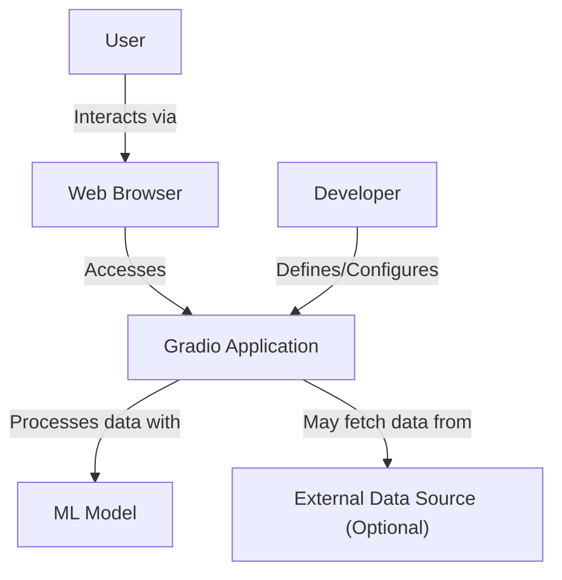
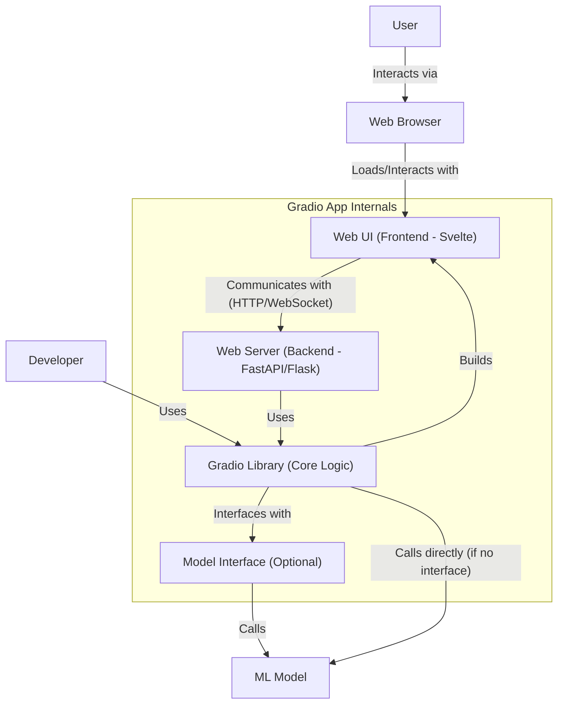
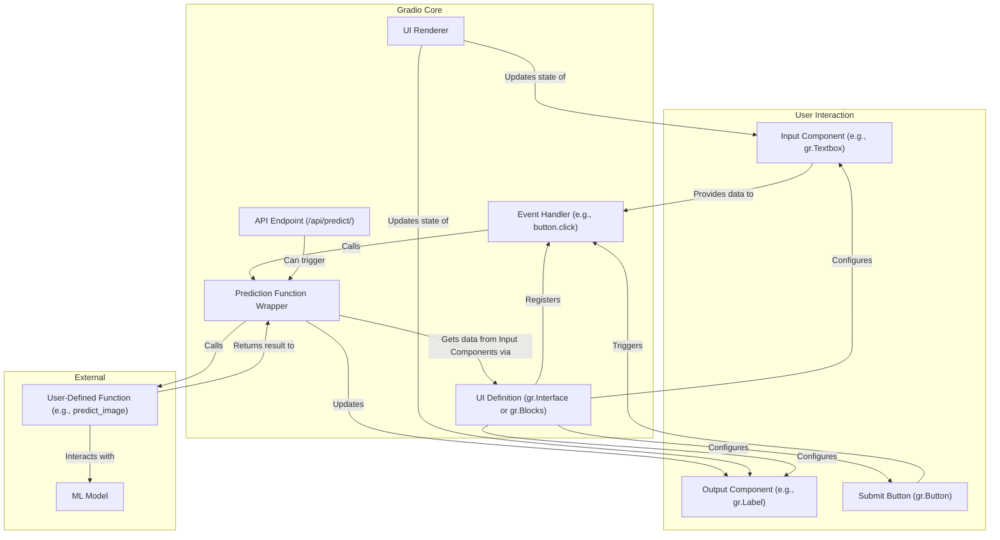
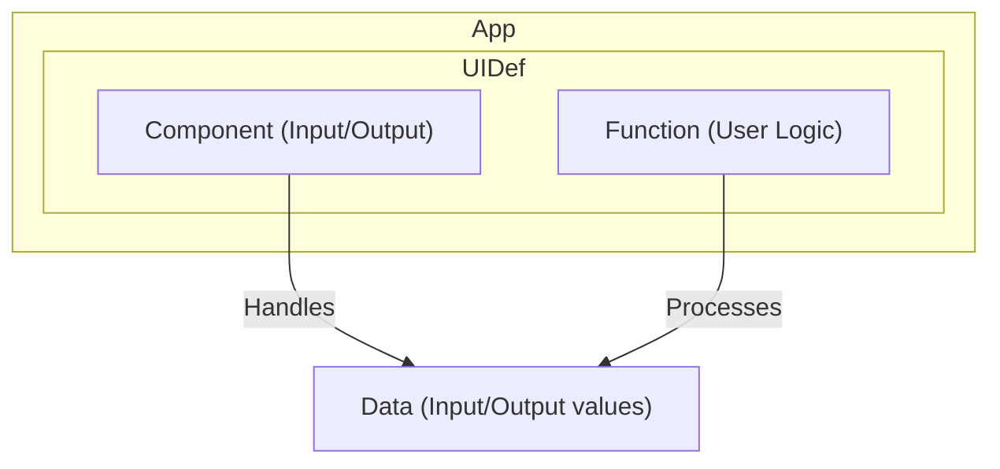
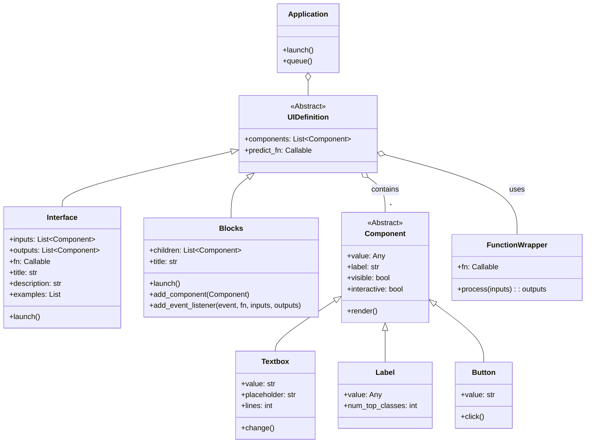

## ■概要

Gradioは、機械学習モデルのインタラクティブなWebインターフェースを迅速に作成するためのPythonライブラリです。
数行のコードで、モデルの入力（テキスト、画像、音声など）と出力（テキスト、画像、グラフなど）に対応するUIコンポーネントを定義し、Webアプリケーションとして起動できます。
デバッグ、デモンストレーション、ユーザーからのフィードバック収集などに活用されます。

## ■構造

C4 modelを用いてGradioアプリケーションの構造を図解します。

### ●システムコンテキスト図

Gradioアプリケーションがどのように利用され、外部システムと連携するかを示します。



| 要素名                  | 説明                                                                 |
| :---------------------- | :------------------------------------------------------------------- |
| User                    | Gradioアプリケーションを利用するエンドユーザーです。                   |
| Developer               | Gradioアプリケーションを開発・設定する開発者です。                 |
| Gradio Application      | Gradioライブラリを用いて構築されたWebアプリケーションです。            |
| Web Browser             | ユーザーがGradioアプリケーションにアクセスするためのクライアントです。 |
| ML Model                | Gradioアプリケーションが利用する機械学習モデルです。                  |
| External Data Source (Optional) | アプリケーションが必要に応じて参照する外部のデータソースです。       |

### ●コンテナ図

Gradio Applicationの主要な構成要素（コンテナ）を示します。



| 要素名                             | 説明                                                                                             |
| :--------------------------------- | :----------------------------------------------------------------------------------------------- |
| User                               | Gradioアプリケーションを利用するエンドユーザーです。                                                 |
| Developer                          | Gradioライブラリを使用してアプリケーションを定義する開発者です。                                   |
| Web Browser                        | ユーザーがWeb UIを表示・操作するためのクライアントです。                                           |
| Web UI (Frontend - Svelte)         | ユーザーインターフェースを提供するフロントエンド部分です。Svelteで構築されています。             |
| Web Server (Backend - FastAPI/Flask) | フロントエンドからのリクエストを受け付け、Gradio Libraryを呼び出すバックエンドサーバーです。       |
| Gradio Library (Core Logic)        | UI定義、イベント処理、モデル連携など、Gradioアプリケーションの中核ロジックを担うPythonライブラリです。 |
| Model Interface (Optional)         | 機械学習モデルとの連携を抽象化するインターフェース層です（直接呼び出す場合もあります）。         |
| ML Model                           | アプリケーションの核となる推論や処理を行う機械学習モデルです。                                     |

### ●コンポーネント図

Gradio Library（またはWeb Serverと連携する部分）の主要なコンポーネントと具体例を示します。



| 要素名                                     | 説明                                                                                                   |
| :----------------------------------------- | :----------------------------------------------------------------------------------------------------- |
| Input Component (e.g., gr.Textbox)       | ユーザーからの入力を受け付けるUI要素（テキストボックス、画像アップロードなど）です。                       |
| Output Component (e.g., gr.Label)        | 処理結果を表示するUI要素（ラベル、画像表示など）です。                                                     |
| Submit Button (gr.Button)                  | 処理の実行をトリガーするボタンです (`Interface`では自動生成されることもあります)。                       |
| UI Definition (gr.Interface or gr.Blocks) | アプリケーションのレイアウト、コンポーネント、イベントの流れを定義します (`Interface`は簡易、`Blocks`は高機能)。 |
| Event Handler (e.g., button.click)       | ボタンクリックなどのイベント発生時に実行される処理を定義します。                                           |
| Prediction Function Wrapper                | 開発者が定義した関数（推論実行など）をラップし、入力コンポーネントからのデータ渡しや出力コンポーネントへの結果反映を管理します。 |
| User-Defined Function (e.g., predict\_image) | 開発者が実装する、実際のデータ処理やモデル推論を行うPython関数です。                                   |
| ML Model                                   | User-Defined Functionから呼び出される機械学習モデルです。                                                |
| UI Renderer                                | コンポーネントの状態を更新し、フロントエンドの表示に反映させます。                                       |
| API Endpoint (/api/predict/)               | Gradioが自動生成するAPIエンドポイントで、外部からプログラムで処理を実行するために利用できます。            |

## ■情報

Gradioアプリケーションが内部で扱う主要なデータ（情報）とその構造を図解します。

### ●概念モデル

Gradioアプリケーションを構成する主要な概念とその関係性を示します。



| 要素名                           | 説明                                                                         |
| :------------------------------- | :--------------------------------------------------------------------------- |
| Application                      | Gradioアプリケーション全体を表します。                                           |
| UI Definition (Interface/Blocks) | アプリケーションのUI構造と動作を定義します。`Interface`または`Blocks`で構成されます。 |
| Component (Input/Output)         | ユーザーとのインタラクション（入力受付や結果表示）を行う個々のUI要素です。         |
| Function (User Logic)            | 開発者が定義する、入力データを受け取り、処理を実行して結果を返す関数です。       |
| Data (Input/Output values)       | コンポーネントを通じて入力され、関数で処理され、結果として出力されるデータです。   |

### ●情報モデル

概念モデルのエンティティをクラスとして表現し、主要な属性や関連を示します。



| クラス名         | 説明                                                                                                 | 主要な属性/メソッド例                                                               |
| :--------------- | :--------------------------------------------------------------------------------------------------- | :---------------------------------------------------------------------------------- |
| Application      | Gradioアプリケーションの起動や設定を管理するエントリーポイント（通常はInterface/Blocksが兼ねる）。       | `launch()`, `queue()`                                                               |
| UIDefinition     | UI定義の基底概念（抽象クラス）。                                                                        | `components`, `predict_fn`                                                          |
| Interface        | 入力、出力、関数を直接マッピングするシンプルなUI定義クラス。                                             | `inputs`, `outputs`, `fn`, `title`, `description`, `examples`, `launch()`             |
| Blocks           | コンポーネントを自由に配置し、イベントリスナーで複雑なデータフローを定義できる高機能なUI定義クラス。       | `children`, `title`, `launch()`, `add_component()`, `add_event_listener()`          |
| Component        | すべてのUIコンポーネントの基底クラス（抽象クラス）。                                                   | `value`, `label`, `visible`, `interactive`, `render()`                              |
| Textbox          | テキスト入力用コンポーネント。                                                                       | `value`, `placeholder`, `lines`, `change()` (event)                               |
| Label            | テキストや分類結果などの出力表示用コンポーネント。                                                     | `value`, `num_top_classes`                                                          |
| Button           | クリックイベントをトリガーするボタンコンポーネント。                                                   | `value`, `click()` (event)                                                          |
| FunctionWrapper  | ユーザー定義関数をラップし、Gradioの内部処理との連携を担う（内部的な概念）。                           | `fn`, `process()`                                                                   |

## ■構築方法

### ●インストール

1.  **Pythonの準備**: Python 3.8以上がインストールされていることを確認します。
2.  **仮想環境の作成 (推奨)**: プロジェクトごとに依存関係を分離するため、仮想環境を作成して有効化します。
    ```bash
    python -m venv venv
    source venv/bin/activate  # Linux/macOS
    .\venv\Scripts\activate  # Windows
    ```
3.  **Gradioのインストール**: pipを使用してGradioをインストールします。
    ```bash
    pip install gradio
    ```
4.  **インストールの確認**: PythonインタプリタでGradioをインポートし、バージョンを表示して確認します。
    ```python
    import gradio as gr
    print(gr.__version__)
    ```

### ●基本的なアプリケーションの作成

1.  **Pythonファイルの作成**: 例として `app.py` という名前でファイルを作成します。
2.  **コードの記述**:
      * Gradioライブラリをインポートします (`import gradio as gr`)。
      * 入力データを受け取り、処理結果を返すPython関数を定義します（例: `def greet(name): return "Hello " + name`)。
      * `gr.Interface` または `gr.Blocks` を使用してUIを定義します。
          * `gr.Interface(fn=関数名, inputs=入力コンポーネント, outputs=出力コンポーネント)`
          * `gr.Blocks()` を使用する場合は、`with`ブロック内でコンポーネントを配置し、イベントリスナーを設定します。
      * `launch()` メソッドを呼び出してアプリケーションを起動します (`iface.launch()`)。
3.  **実行**: コマンドラインからPythonファイルを実行します。
    ```bash
    python app.py
    ```
    実行後、ローカルサーバーのURL（例: `http://127.0.0.1:7860`）が表示されるので、Webブラウザでアクセスします。

## ■利用方法

### ●UIの定義

  * **`gr.Interface` を使う方法**:
      * 最も簡単な方法です。
      * 入力コンポーネント、出力コンポーネント、処理関数を直接指定します。
      * 基本的なレイアウトは自動で生成されます。
      * `inputs` と `outputs` には、コンポーネントのインスタンス (`gr.Textbox()`, `gr.Image()`) またはショートカット文字列 (`"text"`, `"image"`) をリストで指定します。
  * **`gr.Blocks` を使う方法**:
      * より複雑なレイアウトやデータフローを実現したい場合に使用します。
      * `with gr.Blocks() as demo:` のように `with` ステートメントを使用します。
      * `with` ブロック内でコンポーネント（`gr.Textbox`, `gr.Button`, `gr.Image` など）をインスタンス化して配置します。
      * レイアウト要素 (`gr.Row`, `gr.Column`, `gr.Tab`) を使ってコンポーネントの配置を調整できます。
      * イベントリスナー（例: `button.click(fn=関数, inputs=入力リスト, outputs=出力リスト)`）を使って、コンポーネント間のインタラクションを定義します。

### ●コンポーネントの利用

  * Gradioはテキスト、数値、画像、音声、動画、ファイル、データフレーム、グラフなど、多様な入出力に対応するコンポーネントを提供しています。
  * 各コンポーネントには、ラベル、プレースホルダー、表示/非表示、インタラクティブかどうかなどの設定オプションがあります。
  * 詳細は公式ドキュメントの Components セクションを参照してください。

### ●イベントリスナー (Blocks)

  * `gr.Blocks` では、特定のイベント（ボタンクリック、入力値の変更など）をトリガーにして関数を実行できます。
  * コンポーネントのメソッド（例: `button.click()`, `textbox.change()`, `slider.release()`）を使ってイベントリスナーを登録します。
  * `inputs` 引数で関数に渡す入力コンポーネントを、`outputs` 引数で関数の結果を反映させる出力コンポーネントを指定します。

### ●アプリケーションの起動

  * `Interface` または `Blocks` インスタンスの `launch()` メソッドを呼び出すと、Webサーバーが起動し、ブラウザでアクセス可能なURLが表示されます。
  * `launch(share=True)` とすると、一時的に外部からアクセス可能な公開URL (Share Link) が生成されます（72時間有効）。
  * `launch(server_name="0.0.0.0", server_port=8080)` のように、ホストやポートを指定できます。

## ■運用

### ●デプロイとホスティング

  * **Hugging Face Spaces**:
      * 無料でGradioアプリケーションをホスティングできる最も簡単な方法の一つです。
      * GitHubリポジトリ連携や、ローカルからの `gradio deploy` コマンド、Web UIからのアップロードでデプロイできます。
      * CPUやGPUリソースを選択できます（一部有料）。
  * **Gradio Cloud (ベータ)**:
      * Gradioチームが提供するホスティングサービスです。
  * **自前サーバー/クラウド**:
      * 任意のサーバーやクラウドプラットフォーム (AWS, GCP, Azure, Koyebなど) にデプロイできます。
      * 通常のPython Webアプリケーションと同様に、GunicornやUvicornなどのWSGI/ASGIサーバーと組み合わせて運用します。
      * Dockerコンテナ化してデプロイすることも一般的です。Dockerfileを用意し、コンテナレジストリ経由でデプロイします。

### ●共有

  * **Share Links**: `launch(share=True)` で生成される一時的な公開URLです。デバッグや簡単な共有に適しています。
  * **Permanent Hosting**: Hugging Face Spaces や自前のサーバーにデプロイすることで、恒久的なURLでアプリケーションを公開できます。
  * **埋め込み**:
      * Hugging Face SpacesなどでホストされているGradioアプリは、Web Components (`<gradio-app>`) や IFrame (`<iframe>`) を使って他のWebサイトに埋め込むことができます。

### ●スケーリングとパフォーマンス

  * **`queue()`**: `launch()` の前に `.queue()` メソッドを呼び出すことで、リクエストキューを有効にし、同時実行数を制御できます。これにより、高負荷時や時間のかかる処理でもサーバーがダウンするのを防ぎます。
    ```python
    demo.queue().launch()
    # 同時実行数を指定
    demo.queue(concurrency_count=5).launch()
    ```
  * **リソース**: 必要に応じて、ホスティング環境のCPU、メモリ、GPUリソースを調整します。

### ●認証

  * **パスワード認証**: `launch(auth=("username", "password"))` のように、簡単なユーザー名とパスワードによる認証を追加できます。複数の認証情報をリストで渡すことも可能です。
  * **OAuth (Hugging Face)**: Hugging Face Spacesにデプロイした場合、Spaceの設定でHugging Faceアカウントによるログインを要求できます。
  * **OAuth (外部プロバイダ)**: より高度なOAuth認証を実装することも可能です（カスタム実装が必要）。

### ●監視とロギング

  * Gradioアプリケーション自体には高度な監視機能は組み込まれていません。
  * ホスティング環境（クラウドプラットフォーム、サーバー）が提供する監視ツールやログ機能を利用します。
  * アプリケーション内で標準の `logging` モジュールなどを使ってカスタムログを出力することは可能です。

## ■参考リンク

### 概要

  * [Gradio Documentation](https://www.gradio.app/docs)
  * [Gradio – Posit Connect Documentation](https://docs.posit.co/connect/user/gradio/)
  * [Gradio Course - Create User Interfaces for Machine Learning Models - YouTube](https://www.youtube.com/watch?v=RiCQzBluTxU)

### 構造

  * [GradioのBlocksでwebアプリのレイアウトを定義する](https://bou7254.com/posts/gradio-blocks-web-app-layout)
  * [AIモデルの予測結果の可視化を楽にしたい? Gradioを使ってみよう!](https://zenn.dev/ohke/articles/9ce51323c44f80)
  * [Blocks And Event Listeners - Gradio](https://www.gradio.app/guides/blocks-and-event-listeners)
  * [gradio 入門 (3) - Blocks｜npaka](https://note.com/npaka/n/n2a5112208b8d)

### 情報

  * [Dataset - Gradio Docs](https://www.gradio.app/docs/gradio/dataset) (コンポーネントが扱うデータ形式の例)
  * [GradioのComponents（コンポーネント）の基本と使い方: webアプリのパーツを作ろう](https://bou7254.com/posts/gradio-components-basic-how-to-use-web-app)

### 構築方法

  * [Installing Gradio In A Virtual Environment - Gradio](https://www.gradio.app/guides/installing-gradio-in-a-virtual-environment)
  * [How To Install Gradio in 5 Simple Steps | Python | Machine Learning - YouTube](https://www.youtube.com/watch?v=nBpxdq9-O08)

### 利用方法

  * [Gradio Documentation - Quickstart](https://www.gradio.app/guides/quickstart)
  * [GradioアプリにExamplesで入力と出力の例を追加する](https://bou7254.com/posts/gradio-examples-how-to-use)
  * [インタラクティブな物体検出：Gradio &Ultralytics YOLO11 ｜日本経済新聞社](https://docs.ultralytics.com/ja/integrations/gradio/)
  * [ChatGPTとPythonで学ぶ Gradio：pandas可視化編 - Qiita](https://qiita.com/maskot1977/items/ad4369fd2fca58070e2c)

### 運用

  * [Sharing Your App - Gradio](https://www.gradio.app/guides/sharing-your-app)
  * [Deploy a Gradio App - Koyeb](https://www.koyeb.com/docs/deploy/gradio)
  * [Using Hugging Face Integrations - Gradio](https://www.gradio.app/guides/using-hugging-face-integrations)
