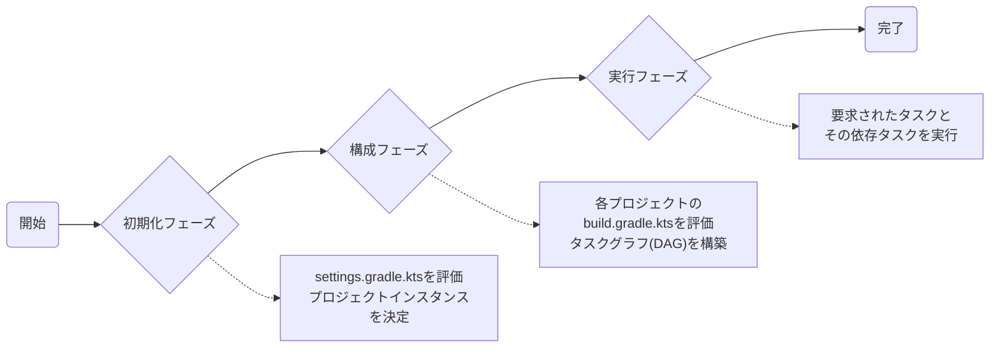
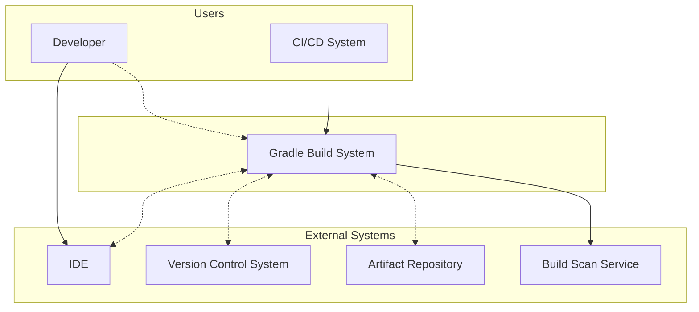
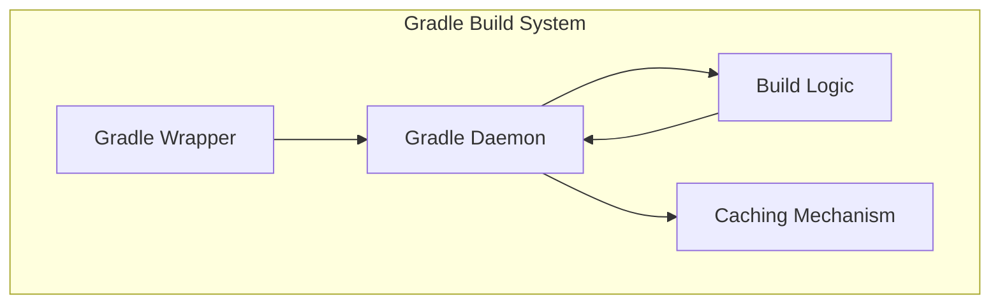
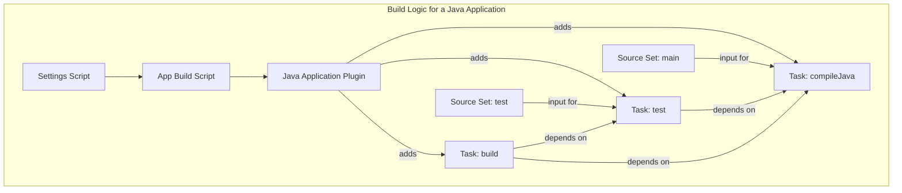
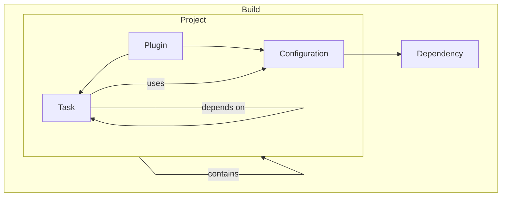
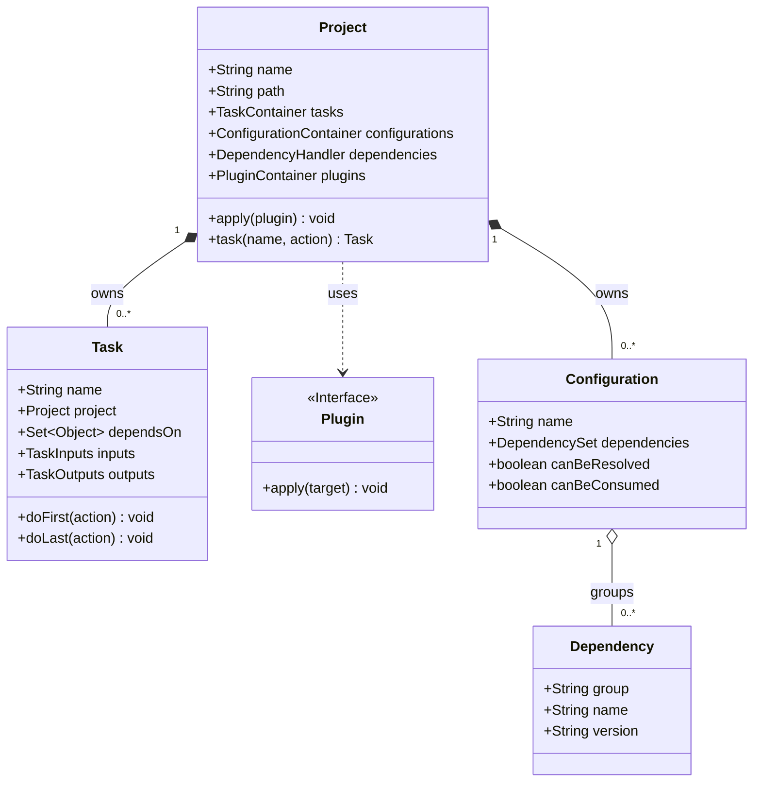

### 概要

この記事では、モダンなソフトウェア開発に不可欠なビルド自動化ツール「Gradle」について、その基本概念から内部構造、実践的な利用方法、そしてCI/CDとの連携までを体系的に解説します。

Gradleは、多言語ソフトウェア開発に対応するオープンソースのビルド自動化ツールです。ソースコードのコンパイル、テスト、パッケージング、デプロイといった一連のプロセスを自動化し、実行可能なアプリケーションやライブラリへと変換します。

Apache AntやMavenの思想を基盤としつつ、パフォーマンスと柔軟性の課題を解決するために設計されました。XMLベースのMavenとは異なり、GroovyまたはKotlinによる表現力豊かでプログラマブルなドメイン固有言語（DSL）でビルドスクリプトを記述できる点が大きな特徴です。

また、「**設定より規約（Convention over Configuration）**」の思想に基づき、一般的なプロジェクト構成には適切なデフォルト設定が適用されるため、開発者が記述する定型的なコードを最小限に抑えられます。もちろん、すべての規約は上書き可能で、プロジェクト固有の要件に合わせてビルドプロセスを柔軟にカスタマイズできます。

その多機能性から、Gradleは単なるビルドツールではなく、ソフトウェアデリバリーのライフサイクル全体を体系化する「**ビルドOS**」とも呼ばれます。豊富なAPI、強力なプラグインエコシステム、そして各種ツールとの緊密な連携により、現代の開発者生産性とDevOpsオートメーションの基盤となっています。

### 特徴

Gradleは、現代のソフトウェア開発に求められる速度、柔軟性、拡張性を満たす多彩な特徴を備えています。

#### パフォーマンスと速度

ビルドの高速化はGradleの最優先事項であり、複数の高度な機能によって実現されています。

  * **インクリメンタルビルド**: 前回ビルドから変更があったタスクのみを実行します。不要な再処理を回避し、ビルド時間を大幅に短縮します。
  * **ビルドキャッシュ**: 一度実行したタスクの出力をローカルまたはリモートのキャッシュに保存し、再利用します。リモートキャッシュをチームで共有すれば、CIビルドなどを劇的に高速化できます。
  * **設定キャッシュ**: ビルド設定の解析結果をキャッシュし、ビルドの起動時間を短縮する先進的な機能です。
  * **Gradleデーモン**: ビルド情報をメモリ上に保持する常駐プロセスです。ビルドごとのJVM起動オーバーヘッドを解消し、高速なビルド開始を実現します。
  * **並列実行**: マルチコアプロセッサを最大限に活用し、依存関係のないタスクを並列実行することで、特にマルチプロジェクト構成のビルド時間を短縮します。

#### 柔軟性と拡張性

固定的なルールに縛られず、あらゆるプロジェクト要件に対応できる柔軟な設計思想を持っています。

  * **豊富なDSL**: Groovy DSLに加え、静的型付け言語であるKotlin DSLを提供します。Kotlin DSLは、型安全性、IDEによる高度なコード補完、リファクタリングサポートにより、ビルドスクリプトの保守性と可読性を劇的に向上させます。
  * **プラグインベースのアーキテクチャ**: Javaのコンパイルやテスト実行など、具体的な機能の多くはプラグインとして提供されます。このモジュール化により、システムは軽量でありながら、プラグインを追加するだけであらゆる言語やプラットフォームに柔軟に適応できます。
  * **高度なAPIとカスタマイズ**: 豊富なAPIを通じて、独自のカスタムタスクやプラグインを容易に作成できます。これにより、プロジェクト固有の複雑なワークフローを自動化し、ビルドプロセスを完全に制御することが可能です。

#### 強力な依存関係管理

現代のソフトウェア開発に不可欠な、洗練された依存関係管理機能を提供します。

  * **多様なリポジトリサポート**: MavenやIvy形式のリポジトリと完全な互換性があり、既存の膨大なライブラリ資産をシームレスに利用できます。
  * **高度な機能**: 推移的依存関係の自動解決、バージョン競合の解決ルール、そして後述するバージョンカタログによる一元的なバージョン管理など、大規模プロジェクトを支える高度な機能を備えています。

### ビルドのライフサイクル

Gradleの強力な機能を理解する上で、ビルドがどのような段階を経て実行されるかを知ることは非常に重要です。Gradleのビルドは、大きく分けて3つのフェーズで構成されます。



1.  **初期化 (Initialization) フェーズ**
    ビルドにどのプロジェクトが含まれるかを決定する段階です。Gradleは`settings.gradle.kts`ファイルを評価し、ビルドに参加する`Project`のインスタンス群を生成します。（マルチプロジェクトビルドの場合、ここでどのサブプロジェクトが含まれるかが決まります。）

2.  **構成 (Configuration) フェーズ**
    ビルドの「設計図」を作成する段階です。初期化フェーズで決定された各プロジェクトに対して、対応する`build.gradle.kts`スクリプトを評価します。このプロセスで、利用可能なすべてのタスクとそれらの依存関係が洗い出され、**タスクの有向非巡回グラフ（DAG）**がメモリ上に構築されます。**この時点では、まだタスクの実際の処理（コンパイルやテストなど）は一切実行されません。**

3.  **実行 (Execution) フェーズ**
    実際に作業を行う段階です。構成フェーズで構築されたタスクグラフに基づき、コマンドラインで指定されたタスク（例: `build`）と、それが依存するすべてのタスクが、適切な順序で実行されます。

この **「構成」と「実行」の分離** こそが、インクリメンタルビルドやビルドキャッシュといったGradleの強力なパフォーマンス機能の基礎となっています。

### 構造

Gradleのアーキテクチャは非常に洗練されています。ここでは、ソフトウェアアーキテクチャを図解する**C4モデル**を用い、「システムコンテキスト」「コンテナ」「コンポーネント」の順に、その構造を掘り下げていきます。

#### システムコンテキスト図

まず、Gradleビルドシステム全体を一つの箱として捉え、外部のユーザーやシステムとの関係性を示します。



*この図は、開発者やCI/CDシステムがGradleをどのように利用し、GradleがIDEや各種リポジトリとどのように連携するかを示しています。*

| 要素名 | 説明 |
| :--- | :--- |
| Developer | ビルドスクリプトを定義し、IDEやCLIを通じてビルドを実行する開発者 |
| CI/CD System | ビルド実行を自動化するシステム (例: GitHub Actions, Jenkins) |
| IDE | Gradleプロジェクトを操作するための統合開発環境 (例: IntelliJ IDEA, VS Code) |
| Version Control System | ソースコードやビルドスクリプトを管理するバージョン管理システム (例: Git) |
| Artifact Repository | 外部ライブラリの取得や、生成した成果物を公開するためのリポジトリ (例: Maven Central, JFrog Artifactory) |
| Build Scan Service | ビルドのパフォーマンス分析やデバッグのために、ビルドデータを可視化する外部サービス (例: Develocity) |
| Gradle Build System | ソースコードを入力とし、アーティファクトを生成するビルド自動化システム |

#### コンテナ図

次に、Gradleビルドシステムの内部を、主要な構成要素（コンテナ）に分解し、その相互作用を示します。



この図は、ビルドの**実行エンジン**（Daemon, Cachingなど）と**定義**（Build Logic）が明確に分離されていることを示します。エンジンはタスクグラフの効率的な実行に専念し、Javaのコンパイルといった特定技術の知識はすべてプラグイン（Build Logicの一部）が担います。この関心の分離こそが、Gradleの高い柔軟性と拡張性の源泉です。

| 要素名 | 説明 |
| :--- | :--- |
| Gradle Wrapper | プロジェクト指定バージョンのGradleを自動で利用し、ビルドの再現性を保証するエントリポイント |
| Gradle Daemon | ビルドを実行する常駐バックグラウンドプロセス。プロジェクト情報をメモリ上に保持し、ビルドを高速化する実行エンジン |
| Build Logic | ユーザーが定義するビルドの指示を格納する論理コンテナ。ビルドスクリプト、プラグイン、カスタムタスクなどを含む |
| Caching Mechanism | パフォーマンスを支える各種キャッシュ機構。依存関係キャッシュ、ビルドキャッシュ、設定キャッシュなど |

#### コンポーネント図

さらに、「Build Logic」コンテナの内部を、典型的なJavaアプリケーションプロジェクトを例に分解します。



この図は、ビルドスクリプトがプラグインを適用し、そのプラグインがソースセットに基づいて具体的なタスク（`compileJava`など）を生成・設定する様子を示しています。

| 要素名 | 説明 |
| :--- | :--- |
| Settings Script (`settings.gradle.kts`) | ビルドのエントリポイント。プロジェクト構造やプラグインリポジトリを定義（**初期化フェーズ**で評価） |
| App Build Script (`app/build.gradle.kts`) | モジュールのビルドスクリプト。プラグインの適用、依存関係の宣言、タスク設定などを行う（**構成フェーズ**で評価） |
| Java Application Plugin | Javaアプリケーションをビルドするための規約やタスク群（`compileJava`, `test`など）を追加するコアプラグイン |
| Source Set: `main` | 本番用のソースコードやリソースの論理的なグループ |
| Source Set: `test` | テスト用のソースコードやリソースの論理的なグループ |
| Task: `compileJava` | `main`ソースセットのJavaコードをコンパイルするタスク |
| Task: `test` | `test`ソースセットのテストコードをコンパイルし、ユニットテストを実行するタスク |
| Task: `build` | `compileJava`や`test`など複数のタスクに依存する、ビルド全体を実行するライフサイクルタスク |

### データ

Gradleのビルドプロセスは、明確なデータモデルに基づいており、すべてがオブジェクトとして表現されます。

#### 概念モデル

まず、Gradleビルドを構成する主要な概念と、その関係性を抽象的に示します。



このモデルが示す通り、Gradleのデータモデルは単純な階層ではなく、 **有向非巡回グラフ（DAG）** 構造です。ビルドスクリプトの主な役割は、このグラフのノード（例: `tasks.register("myTask")`）とエッジ（例: `dependsOn`）を宣言的に定義することです。

| 要素名 | 説明 |
| :--- | :--- |
| Build | Gradleが実行するビルド全体。一つ以上のProjectで構成される |
| Project | ビルドの対象となる構成単位（例: ライブラリ、アプリケーション）。Task、Configurationなどを所有するコンテナ |
| Task | ビルドが実行する個別の作業単位（例: コンパイル、テスト実行）。他のTaskに依存することができる |
| Plugin | プロジェクトに特定の機能（タスクや規約）をまとめて追加する再利用可能な仕組み |
| Configuration | 依存関係をスコープごとにグループ化するための名前付き集合（例: コンパイル時、実行時） |
| Dependency | プロジェクトが依存する外部ライブラリや他のプロジェクト |

#### 情報モデル（クラス図）

次に、主要な概念をクラスとして捉え、その属性や関係をUMLクラス図の形式で示します。



*この図は、ビルドスクリプト内で操作するオブジェクト（`Project`, `Task`など）が、内部的にどのようなプロパティや関連を持っているかを示しています。*

| クラス名 | 説明 |
| :--- | :--- |
| Project | ビルドの構成単位を表す中心的なオブジェクト。タスク、設定、依存関係などを管理するコンテナへのアクセスポイントを提供 |
| Task | 個別のビルド処理を表すオブジェクト。名前、所属プロジェクト、依存関係、入出力などのプロパティを保持 |
| Plugin | プロジェクトに適用されるプラグインを表すインターフェース。`apply`メソッドを実装し、プロジェクトに設定を追加する |
| Configuration | 依存関係のスコープを定義するオブジェクト。解決可能か（`canBeResolved`）、消費可能か（`canBeConsumed`）といった振る舞いを制御 |
| Dependency | 外部ライブラリなどを表すオブジェクト。`group`, `name`, `version`の3つの座標（coordinates）で一意に識別される |

### 構築方法

ここでは、Gradleプロジェクトをゼロから構築する標準的な手順を解説します。

#### Gradleプロジェクトの初期化

`gradle init`タスクは、対話形式でプロジェクトの雛形を自動生成してくれる便利な機能です。

1.  **プロジェクト用ディレクトリの作成**

    ```bash
    mkdir my-java-app
    cd my-java-app
    ```

2.  **`gradle init`の実行**
    プロジェクトの要件に合わせて、表示されるプロンプトに回答します。

    ```bash
    gradle init

    Select type of project to generate:
    1: basic
    2: application
    3: library
    4: Gradle plugin
    Enter selection (default: basic) [1..4] 2

    Select implementation language:
    3: Java

    Select build script DSL:
    2: Kotlin

    Select test framework:
    4: JUnit Jupiter

    Project name (default: my-java-app):
    Source package (default: my.java.app):

    > Task :init
    BUILD SUCCESSFUL
    ```

#### 生成されるプロジェクト構造

`init`タスクが完了すると、標準的な規約に従ったプロジェクト構造が生成されます。

```
my-java-app/
├── .gradle/                     # ビルドキャッシュなどGradleが内部で使用
├── gradle/
│   └── wrapper/
│       ├── gradle-wrapper.jar      # ラッパーの実行可能JAR
│       └── gradle-wrapper.properties # ラッパーの設定ファイル
├── gradlew                         # Unix系OS用ラッパースクリプト
├── gradlew.bat                     # Windows用ラッパースクリプト
├── settings.gradle.kts             # プロジェクト構造を定義する設定ファイル
└── app/
    ├── build.gradle.kts            # appモジュールのビルドスクリプト
    └── src/
        ├── main/
        │   └── java/               # 本番用ソースコード
        └── test/
            └── java/               # テスト用ソースコード
```

#### Gradleラッパーの役割

Gradleラッパー（`gradlew`, `gradlew.bat`）は、ビルドの信頼性と再現性を保証する極めて重要な仕組みです。**原則として、常に`gradle`コマンドの代わりに`./gradlew`を使用してください。**

  * **ビルドの再現性**: `gradle-wrapper.properties`ファイルで指定された単一バージョンのGradleを、開発者全員が、そしてCI環境でも同じように使用することを保証します。
  * **インストールの不要**: 開発者のマシンにGradleを別途インストールする必要がありません。初回実行時に、必要なバージョンのGradleを自動的にダウンロードし、キャッシュします。
  * **バージョンのアップグレード**: 以下のコマンド一つで、プロジェクトが使用するGradleのバージョンを安全に更新できます。
    ```bash
    ./gradlew wrapper --gradle-version <新しいバージョン番号>
    ```

### 利用方法

日常的な開発では、タスクの実行、依存関係の宣言、そして独自のビルドロジックの作成が中心となります。

#### 一般的なタスクの実行

`java`プラグインなどを適用すると、以下の標準的なタスクが利用可能になります。

  * **`build`**: プロジェクトのコンパイル、テスト、成果物作成をすべて実行
    ```bash
    ./gradlew build
    ```
  * **`clean`**: `build`ディレクトリを削除し、以前のビルド成果物を消去
    ```bash
    ./gradlew clean
    ```
  * **`test`**: テストコードをコンパイルし、ユニットテストを実行
    ```bash
    ./gradlew test
    ```
  * **`run`**: (`application`プラグイン適用時) アプリケーションの`main`メソッドを実行
    ```bash
    ./gradlew run
    ```
  * **`tasks`**: 利用可能なすべてのタスク一覧を表示
    ```bash
    ./gradlew tasks --all
    ```

#### プラグインの適用

`build.gradle.kts`内の`plugins {}`ブロックで、プロジェクトに必要な機能を拡張します。

```kotlin
// app/build.gradle.kts
plugins {
    // Gradleに同梱されているコアプラグイン
    `java-library`

    // Gradle Plugin Portalから取得するコミュニティプラグイン
    // バージョンの指定が必須
    id("com.github.johnrengelman.shadow") version "8.1.1"
}
```

#### 依存関係の宣言

`dependencies {}`ブロック内で、プロジェクトが必要とする外部ライブラリを宣言します。依存関係のスコープは「コンフィギュレーション」で指定します。

| コンフィギュレーション | スコープ | 消費プロジェクトへの公開範囲 |
| :--- | :--- | :--- |
| `implementation` | コンパイル時 & 実行時 | 実行時のみ（APIを隠蔽） |
| `api` | コンパイル時 & 実行時 | コンパイル時 & 実行時（APIを公開） |
| `testImplementation` | テストコンパイル時 & テスト実行時 | なし |
| `compileOnly` | コンパイル時のみ（実行時には不要） | なし |
| `runtimeOnly` | 実行時のみ（コンパイル時には不要） | 実行時のみ |

:::message
**`api` vs `implementation`**
ライブラリを開発する際は、そのライブラリの公開API（publicメソッドの引数や返り値など）で利用する型以外は、**常に`implementation`を使用するべきです。** `api`で宣言した依存関係が変更されると、そのライブラリを利用するすべてのプロジェクトで再コンパイルが発生し、ビルドパフォーマンスが低下する原因となります。`implementation`は内部的な実装をカプセル化し、ビルド時間を最適化します。
:::

```kotlin
// app/build.gradle.kts
repositories {
    // 依存関係を検索するリポジトリを指定
    mavenCentral()
}

dependencies {
    // このモジュールの内部実装でのみ使用するライブラリ
    implementation("com.google.guava:guava:32.1.2-jre")

    // このモジュールの公開APIとして外部に公開するライブラリ
    api("org.apache.commons:commons-lang3:3.12.0")

    // テストコードでのみ使用するライブラリ
    testImplementation("org.junit.jupiter:junit-jupiter-api:5.10.0")
    testRuntimeOnly("org.junit.jupiter:junit-jupiter-engine:5.10.0")
}
```

#### カスタムタスクの作成

独自のビルド処理をタスクとして定義し、ビルドプロセスを拡張できます。

  * **シンプルなタスク（アドホックタスク）**
    `tasks.register`を使い、ビルドスクリプト内に直接処理を記述します。
    ```kotlin
    // app/build.gradle.kts
    tasks.register("showVersion") {
        group = "Help"
        description = "Displays the project version."
        doLast {
            println("Project version: ${project.version}")
        }
    }
    ```
  * **カスタムタスククラス**
    再利用性が高い複雑なタスクは、`buildSrc`ディレクトリ内に専用のKotlinクラスとして定義するのがベストプラクティスです。
    ```kotlin
    // buildSrc/src/main/kotlin/com/example/GreetingTask.kt
    package com.example
    import org.gradle.api.DefaultTask
    import org.gradle.api.provider.Property
    import org.gradle.api.tasks.Input
    import org.gradle.api.tasks.TaskAction

    abstract class GreetingTask : DefaultTask() {
        @get:Input
        abstract val greeterName: Property<String>

        init {
            // デフォルト値を設定
            greeterName.convention("World")
        }

        @TaskAction
        fun greet() {
            logger.quiet("Hello, ${greeterName.get()}!")
        }
    }
    ```
    このカスタムタスクは、ビルドスクリプトから以下のように型安全に登録して使用します。
    ```kotlin
    // app/build.gradle.kts
    import com.example.GreetingTask

    tasks.register<GreetingTask>("customGreeting") {
        group = "Greetings"
        description = "Greets a specific person."
        greeterName.set("Gradle User")
    }
    ```

### 運用

プロジェクトを効果的に運用するには、パフォーマンスの継続的な最適化、依存関係の健全な管理、そしてCI/CDパイプラインとの連携が不可欠です。

#### パフォーマンス最適化

`gradle.properties`ファイルに設定を追加することで、ビルドパフォーマンスを簡単に向上させることができます。

  * **各種キャッシュの有効化**
    ビルドキャッシュと設定キャッシュを有効にし、ビルド時間を大幅に短縮します。
    ```properties
    # gradle.properties
    org.gradle.caching=true
    org.gradle.configuration-cache=true
    ```
  * **並列実行の有効化**
    マルチプロジェクト構成の場合、タスクを並列実行してビルド時間を短縮します。
    ```properties
    # gradle.properties
    org.gradle.parallel=true
    ```
  * **ビルドスキャンの活用**
    `--scan`フラグを付けてビルドを実行すると、パフォーマンスのボトルネックや非効率な設定を特定するための詳細なWebレポートが生成されます。
    ```bash
    ./gradlew build --scan
    ```

#### 依存関係管理のモダン化

**バージョンカタログ**は、特に大規模なマルチプロジェクトにおいて、依存関係を効率的かつ安全に管理するための現代的な手法です。

  * **バージョンカタログとは**
    `gradle/libs.versions.toml`というファイルで、プロジェクト全体で使用する依存関係のバージョンと座標を一元管理する仕組みです。これにより、バージョンの不整合を防ぎ、依存関係の更新を容易にします。

    **`gradle/libs.versions.toml` の例:**

    ```toml
    [versions]
    kotlin = "1.9.22"
    junit = "5.10.0"
    guava = "32.1.2-jre"

    [libraries]
    junit-bundle = { group = "org.junit.jupiter", name = "junit-jupiter", version.ref = "junit" }
    guava = { module = "com.google.guava:guava", version.ref = "guava" }

    [plugins]
    kotlin-jvm = { id = "org.jetbrains.kotlin.jvm", version.ref = "kotlin" }
    ```

    **`app/build.gradle.kts` での利用例:**
    型安全なアクセサ（`libs`）が自動生成され、IDEの補完が効くようになります。

    ```kotlin
    plugins {
        alias(libs.plugins.kotlin.jvm)
    }
    dependencies {
        implementation(libs.guava)
        testImplementation(libs.junit.bundle)
    }
    ```

#### CI/CDとの連携

GradleビルドをCI/CDパイプラインに組み込み、テストとデプロイのプロセスを自動化します。

  * **GitHub Actionsのワークフロー例**
    公式の`gradle/actions/setup-gradle`アクションを利用すると、Gradleのキャッシュ機構とCIのキャッシュが賢く連携し、CIの実行時間を大幅に短縮できます。
    ```yaml
    # .github/workflows/build.yml
    name: Java CI with Gradle
    on: [push, pull_request]

    jobs:
      build:
        runs-on: ubuntu-latest
        steps:
        - name: Checkout repository
          uses: actions/checkout@v4

        - name: Set up JDK 17
          uses: actions/setup-java@v4
          with:
            java-version: '17'
            distribution: 'temurin'

        - name: Setup Gradle and Cache
          uses: gradle/actions/setup-gradle@v3

        - name: Build with Gradle
          run: ./gradlew build

        - name: Upload test reports
          if: always()
          uses: actions/upload-artifact@v4
          with:
            name: test-reports
            path: '**/build/reports/tests/test'
    ```

### まとめ

Gradleは、その高い**パフォーマンス**、**柔軟性**、そして**拡張性**により、単なるビルドツールを超えた開発基盤として機能します。インクリメンタルビルドや多層的なキャッシュ機構が日々のビルドを高速化し、Kotlin DSLとプラグインベースのアーキテクチャがあらゆるプロジェクトの複雑な要求に応えます。

特に、バージョンカタログを用いたモダンな依存関係管理や、CI/CDパイプラインとのシームレスな連携は、現代のチーム開発において生産性を飛躍的に向上させる鍵となります。

この記事が、あなたのGradleへの理解を深め、日々の開発をより効率的で楽しいものにする一助となれば幸いです。まずは`gradle init`から、あなたのプロジェクトにGradleを導入してみてはいかがでしょうか。

さらに学習を進めたい方は、「`buildSrc`やコンポジットビルドを用いたビルドロジックの共通化」や「リモートビルドキャッシュの活用」といった、より大規模な開発を効率化するためのトピックを探求してみることをお勧めします。

この記事が少しでも参考になった、あるいは改善点などがあれば、ぜひリアクションやコメント、SNSでのシェアをいただけると励みになります！

---

### 参考リンク

  * **公式ドキュメント**
      * [Gradle Build Tool](https://gradle.org/)
      * [User Manual](https://docs.gradle.org/current/userguide/userguide.html)
      * [Gradle Build Tool Features](https://gradle.org/features/)
      * [What's new in Gradle 8.0](https://gradle.org/whats-new/gradle-8/)
      * [What's new in Gradle 9.0.0](https://gradle.org/whats-new/gradle-9/)
      * [Improve the Performance of Gradle Builds](https://docs.gradle.org/current/userguide/performance.html)
      * [General Gradle Best Practices](https://docs.gradle.org/current/userguide/best_practices_general.html)
      * [Understanding Plugins - Gradle User Manual](https://docs.gradle.org/current/userguide/custom_plugins.html)
      * [Build Lifecycle - Gradle User Manual](https://docs.gradle.org/current/userguide/build_lifecycle.html)
      * [Inspecting Gradle Builds](https://docs.gradle.org/current/userguide/inspect.html)
      * [Gradle Wrapper Reference](https://docs.gradle.org/current/userguide/gradle_wrapper.html)
      * [Writing Settings Files - Gradle User Manual](https://docs.gradle.org/current/userguide/writing_settings_files.html)
      * [The Application Plugin - Gradle User Manual](https://docs.gradle.org/current/userguide/application_plugin.html)
      * [Building Java & JVM projects - Gradle User Manual](https://docs.gradle.org/current/userguide/building_java_projects.html)
      * [Command-Line Interface Reference - Gradle User Manual](https://docs.gradle.org/current/userguide/command_line_interface.html)
      * [Task (Gradle API 9.0.0)](https://docs.gradle.org/current/javadoc/org/gradle/api/Task.html)
      * [Declaring Dependency Configurations - Gradle User Manual](https://docs.gradle.org/current/userguide/declaring_configurations.html)
      * [1. Declaring dependencies - Gradle User Manual](https://docs.gradle.org/current/userguide/declaring_dependencies.html)
      * [Project - Gradle DSL Version 9.0.0](https://docs.gradle.org/current/dsl/org.gradle.api.Project.html)
      * [Building Java Applications Sample - Gradle User Manual](https://docs.gradle.org/current/samples/sample_building_java_applications.html)
      * [Build Init Plugin - Gradle User Manual](https://docs.gradle.org/current/userguide/build_init_plugin.html)
      * [Wrapper Basics - Gradle User Manual](https://docs.gradle.org/current/userguide/gradle_wrapper_basics.html)
      * [Installation - Gradle](https://gradle.org/install/)
      * [Part 2: Running Gradle Tasks](https://docs.gradle.org/current/userguide/part2_gradle_tasks.html)
      * [Using Plugins - Gradle User Manual](https://docs.gradle.org/current/userguide/plugins.html)
      * [Understanding Tasks - Gradle User Manual](https://docs.gradle.org/current/userguide/more_about_tasks.html)
      * [Migrating build logic from Groovy to Kotlin - Gradle User Manual](https://docs.gradle.org/current/userguide/migrating_from_groovy_to_kotlin_dsl.html)
      * [GitHub Actions - Gradle Cookbook](https://cookbook.gradle.org/ci/github-actions/)
  * **GitHub**
      * [gradle/gradle: Adaptable, fast automation for all](https://github.com/gradle/gradle)
      * [gradle/gradle-build-action: Execute your Gradle build and trigger dependency submission](https://github.com/gradle/gradle-build-action)
  * **記事**
      * [Gradle - Wikipedia](https://en.wikipedia.org/wiki/Gradle)
      * [Introduction to Gradle - GeeksforGeeks](https://www.geeksforgeeks.org/software-engineering/introduction-to-gradle/)
      * [Gradle build overview | Android Studio](https://developer.android.com/build/gradle-build-overview)
      * [Introduction to Gradle | Baeldung](https://www.baeldung.com/gradle)
      * [Gradle System Design: How Android's Build System Works Behind the Scenes | by Yodgorbek Komilov | Medium](https://medium.com/@YodgorbekKomilo/%EF%B8%8F-gradle-system-design-how-androids-build-system-works-behind-the-scenes-6b3aca56869e)
      * [Gradle best practices | Kotlin Documentation](https://kotlinlang.org/docs/gradle-best-practices.html)
      * [Gradle | Kotlin Documentation](https://kotlinlang.org/docs/gradle.html)
      * [7 Gradle Features Every Android Developer Should Master | by Artem Asoyan | Medium](https://artemasoyan.medium.com/7-gradle-features-every-android-developer-should-master-16288a461bf5)
      * [Writing Custom Gradle Plugins | Baeldung](https://www.baeldung.com/gradle-create-plugin)
      * [How to Create a Gradle Based Project using CLI? - GeeksforGeeks](https://www.geeksforgeeks.org/java/how-to-create-a-gradle-based-project-using-cli/)
      * [Configure your build | Android Studio](https://developer.android.com/build)
      * [Android Gradle plugin 8.13 release notes | Android Studio](https://developer.android.com/build/releases/gradle-plugin)
      * [Difference Between implementation and compile in Gradle | Baeldung](https://www.baeldung.com/gradle-implementation-vs-compile)
      * [Gradle Configurations Explained: What is the difference between API and Implementation? | by Vladimír Oraný | Stories by Agorapulse | Medium](https://medium.com/agorapulse-stories/gradle-configurations-explained-4b9608dd5e35)
      * [Gradle Custom Task | Baeldung](https://www.baeldung.com/gradle-custom-task)
      * [Custom Gradle Tasks with Kotlin - Medium](https://www.google.com/search?q=https://medium.com/android-news/custom-gradle-tasks-with-kotlin-e0f8659628a1)
