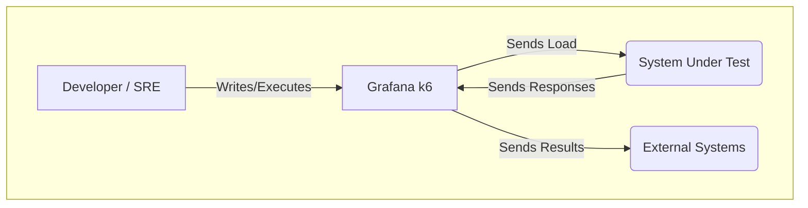
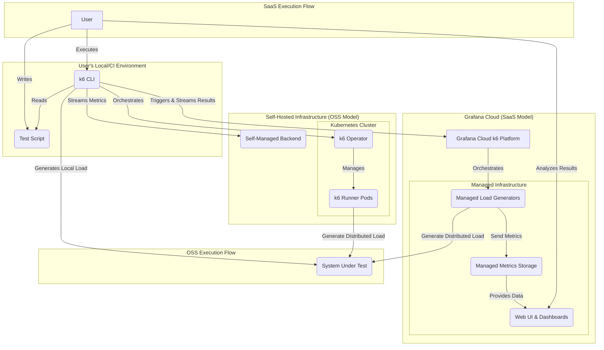
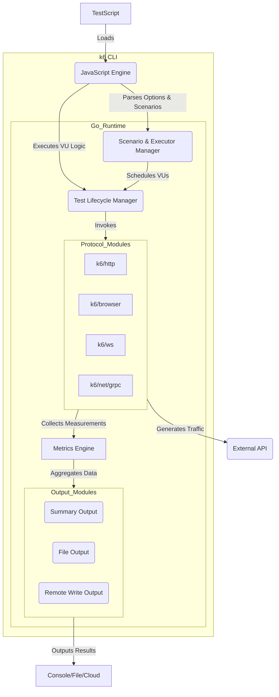
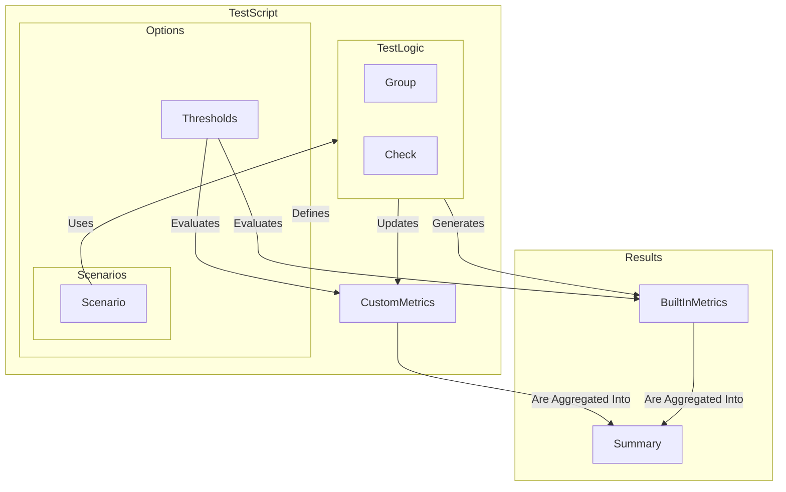
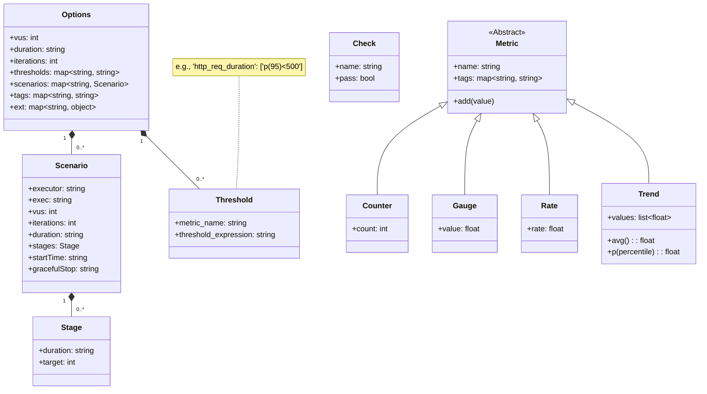

## ■概要

Grafana k6は、最新のDevOpsワークフローに適応するオープンソースの負荷・パフォーマンステストツールです。Grafana Labsが開発と維持を担い、開発者、SRE、QAエンジニアが開発ライフサイクルの早期段階でシステムの信頼性とパフォーマンスを検証することを支援します。

### ●テスト・アズ・コード

k6の最大の特徴は、テストシナリオを**JavaScript**または**TypeScript**で記述する「テスト・アズ・コード」にあります。これにより、以下のメリットが生まれます。

  * **バージョン管理**: Gitなどの使い慣れたツールでテストコードを管理できます。
  * **再利用とモジュール化**: 共通処理をモジュールとして切り出し、複数のテストで再利用できます。
  * **CI/CDとの親和性**: 自動化パイプラインにテストをシームレスに組み込めます。

### ●提供モデル

k6は、用途に応じて選べる2つのモデルで提供されています。

| モデル | 説明 | 主な用途 |
| :--- | :--- | :--- |
| **k6 Open Source (OSS)** | 無料で自己管理（セルフホスト）が可能なオープンソース版。 | ローカル開発、CIでの小〜中規模テスト、インフラを自前で管理したい場合。 |
| **Grafana Cloud k6** | Grafanaが提供するフルマネージドのSaaSプラットフォーム。 | 大規模な分散テスト、グローバルな負荷生成、結果の高度な分析・共有。 |

### ●アーキテクチャ

k6は、パフォーマンスと生産性を両立するハイブリッドアーキテクチャを採用しています。

  * **コアエンジン**: 高性能な**Go言語**で記述されており、単一のマシンからでも効率的に高い負荷を生成します。
  * **テスト実行環境**: Goで実装されたJavaScriptインタプリタ「goja」のフォークである「Sobek」を内部的に使用し、JSで書かれたテストスクリプトを実行します。

この設計により、開発者は書きやすいJavaScriptを使いながら、Go言語のパフォーマンスの恩恵を受けられるのです。

## ■特徴

Grafana k6が現代のエンジニアリングチームに支持される理由である、4つの強力な特徴を見ていきましょう。

  * **開発者中心のアプローチ**
      * テストをコードとして扱うため、使い慣れたIDEでJavaScriptやTypeScriptによるテストスクリプトを作成・管理できます。
      * `k6 new` コマンドで基本的なテストスクリプトのテンプレートを即座に生成し、迅速に開発を開始できます。
  * **高性能な負荷生成エンジン**
      * Go言語製のコアエンジンにより、少ないリソース消費で高いパフォーマンスを発揮します。
      * 単一のマシンからでも数万の仮想ユーザー（VUs）をシミュレートする高負荷を生成可能です。
      * システムの限界を探る**スパイクテスト**、高負荷状態を維持する**ストレステスト**、長期間の安定性を測る**ソークテスト**など、多様な負荷モデルを効果的に実行できます。
  * **多機能かつ拡張可能なテスト能力**
      * **プロトコルレベルテスト**: HTTP/1.1, HTTP/2, WebSockets, gRPCなど幅広いプロトコルを標準でサポートします。
      * **ブラウザレベルテスト**: `k6/browser`モジュールで、実際のブラウザ（Chromium）を操作し、Core Web Vitalsなどのフロントエンド固有のメトリクスを収集できます。
      * **多様なテストタイプ**: 負荷テストに加え、定期的な外形監視を行う**合成監視**、意図的に障害を発生させる**カオスエンジニアリング（Fault Injection）**、機能変更による性能劣化を防ぐ**回帰テスト**など、幅広い用途に対応します。
  * **豊富なエコシステムと連携機能**
      * PostmanコレクションやHARファイルからk6テストスクリプトを自動生成するコンバータを提供します。
      * `xk6`ツールキットを使えば、Go言語で独自の拡張機能（例: SQL, Kafka連携モジュール）を開発できます。
      * テスト結果をGrafana, Prometheus, Datadog, New Relic, OpenTelemetryなど、多数の外部監視・分析プラットフォームへリアルタイムに出力できます。

## ■構造

C4モデルを利用し、システムコンテキスト、コンテナ、コンポーネントの3つのレベルでGrafana k6の構造を解説します。

### ●システムコンテキスト図

Grafana k6が開発・運用エコシステムの中でどのような役割を果たし、どの外部要素と相互作用するかを示します。



| 要素名 | 説明 |
| :--- | :--- |
| **Developer / SRE** | k6のテストスクリプトを作成、実行、分析するユーザー。 |
| **Grafana k6** | 負荷テストを実行し、テスト対象システムからのレスポンスを測定し、メトリクスを収集する中心的なシステム。 |
| **System Under Test (SUT)** | パフォーマンステストの対象となるAPI、Webサイト、マイクロサービス、またはインフラ全体。 |
| **External Systems** | テスト結果の保存、可視化、アラート通知を行うための外部の監視・分析プラットフォーム（例: Grafana, Prometheus, Datadog）。 |

### ●コンテナ図

「Grafana k6」の内部を構成する主要なコンテナ（実行可能単位）を示し、OSS版とSaaS版のアーキテクチャ上の境界を明確にします。



| コンテナ名 | 説明 |
| :--- | :--- |
| **k6 CLI** | Go言語で記述されたコマンドライン実行ファイル。テストスクリプトを解釈し、負荷を生成するコアエンジン。 |
| **Test Script** | JavaScript/TypeScriptで記述されたテストロジック、シナリオ、オプションを含むファイル。 |
| **Self-Managed Backend** | ユーザーが自身で構築・運用する結果保存・可視化基盤（例: Prometheus, Grafana）。 |
| **k6 Operator** | OSS版で分散テストを実現するためのKubernetes Operator。Runner Podのライフサイクルを管理。 |
| **k6 Runner Pods** | k6 Operatorによって起動され、実際に負荷を生成するKubernetes上のPod群。 |
| **Grafana Cloud k6 Platform** | テストの実行管理、負荷生成、結果の保存・可視化、コラボレーション機能を一元的に提供するフルマネージドサービス。 |
| **Managed Load Generators** | Grafanaが世界中の複数の地理的ロケーションで管理する、スケーラブルな負荷生成インスタンス群。 |
| **Managed Metrics Storage** | テスト結果やメトリクスを長期間保存するための、Grafanaが管理する高可用性ストレージ。 |
| **Web UI & Dashboards** | テスト結果のリアルタイム分析、過去の実行との比較、チームでの共有を可能にするWebインターフェース。 |
| **System Under Test** | テスト対象システム。 |

OSS版とSaaS版では、テストエンジン（k6 CLI）は共通ですが 、**テストの実行方法（オーケストレーション）**と**結果の管理方法（ストレージと可視化）** の責任範囲が異なります。OSS版はユーザー自身が運用基盤を構築・管理する一方、SaaS版はGrafanaがマネージドサービスとして提供します。

### ●コンポーネント図

「k6 CLI」の内部を構成する主要なコンポーネントがどのように連携してテストを実行するかを示します。



| コンポーネント名 | 説明 |
| :--- | :--- |
| **Test Script** | ユーザーが記述したテストロジック（例: `login_test.js`）。 |
| **JavaScript Engine (goja)** | テストスクリプトを解釈し、Goで書かれたネイティブなk6の機能を呼び出すブリッジ。 |
| **Go Runtime** | k6のコア機能を提供するGo言語の実行環境。 |
| **Test Lifecycle Manager** | `init`, `setup`, `default`, `teardown`といったテストのライフサイクルステージの実行を管理。 |
| **Scenario & Executor Manager** | `options`で定義されたシナリオに基づき、仮想ユーザー（VU）の数やリクエストの流量をスケジュール。 |
| **Metrics Engine** | テスト中に収集された測定値を集計し、統計的なメトリクス（Counter, Gauge, Rate, Trend）を生成。 |
| **Protocol Modules** | 各種プロトコルでの通信を実装するモジュール群（`k6/http`, `k6/browser`など）。 |
| **Output Modules** | 処理されたメトリクスを様々な形式（コンソール、ファイル、外部サービス）で出力するモジュール群。 |

## ■情報

k6のテストを構成する主要なデータエンティティとそれらの関連性をモデル化します。

### ● VU, Scenario, Executorの関係

**VU** (仮想ユーザー)、**Scenario** (シナリオ)、**Executor** (エグゼキュータ)は、k6で現実的かつ柔軟な負荷テストを設計するための中心的な概念です。それぞれの役割を理解することで、テストの目的（例えば、通常の負荷、急激なスパイク、長時間の安定性など）に応じた適切なワークロードをモデル化できます。

#### ▷関係性の概要

VU、Scenario、Executorの関係は、階層的で明確な役割分担に基づいています。

  - **VU (Virtual User)**: 負荷を生成する「**実行者**」です。各VUは独立したJavaScriptランタイムとして、テストスクリプトのロジックを並行して実行します。
  - **Scenario (シナリオ)**: 特定の負荷パターンやユーザー行動を定義する「**計画書**」です。テストスクリプトの`options`内で複数定義でき、それぞれが異なるテストロジックを持つことができます。
  - **Executor (エグゼキュータ)**: シナリオという計画書をどのように実行するかを指示する「**監督**」です。各シナリオ内に必ず1つ指定され、そのシナリオのVUの数やイテレーション（反復処理）をどのようにスケジュールするかを決定します。

つまり、「**Scenarioが定義した負荷計画を、Executorが監督し、VUが実行する**」 という関係になります。

#### ▷各要素の詳細とバリエーション

**1. VU (Virtual User)**

仮想ユーザー（VU）は、システムに負荷をかけるための基本的な単位です。k6では、各VUが独立したJavaScriptエンジン上でテストスクリプト（`default`関数または`exec`で指定された関数）を繰り返し実行します。VUの数を増やすことで、システムへの同時アクセス数を増やし、より高い負荷をシミュレートします。

**2. Scenario (シナリオ)**

シナリオは、テストの`options`オブジェクト内で定義される、より高度な負荷制御の仕組みです。シナリオを利用することで、単一のテストスクリプト内で複数の異なるワークロードを同時に、あるいは連続して実行できます。

  - **シナリオの利点**:

      - **現実的なトラフィックの再現**: 例えば、「80%のユーザーは商品を閲覧し、20%のユーザーは商品をカートに入れて決済する」といった、より現実に近い複雑なユーザー行動をモデル化できます。
      - **柔軟なテスト構成**: 各シナリオに異なるexecutor、`exec`（実行関数）、タグ、環境変数を割り当てることができます。
      - **実行タイミングの制御**: `startTime`プロパティを使って、各シナリオの開始時間をずらし、シーケンシャルなテストフローを構築することも可能です。

  - **設定例**:

    ```javascript
    export const options = {
      scenarios: {
        // シナリオ1: ユーザーがコンタクトリストを閲覧する
        contacts: {
          executor: 'ramping-vus', // ramping-vus executorを使用
          exec: 'contacts',        // 'contacts'関数を実行
          vus: 10,
          stages: [
            { duration: '10s', target: 10 },
          ],
        },
        // シナリオ2: ユーザーがニュースを閲覧する (30秒後から開始)
        news: {
          executor: 'constant-arrival-rate', // constant-arrival-rate executorを使用
          exec: 'news',                      // 'news'関数を実行
          rate: 5,
          timeUnit: '1s',
          duration: '20s',
          preAllocatedVUs: 2,
          maxVUs: 10,
          startTime: '30s', // 30秒遅れて開始
        },
      },
    };
    export function contacts() { /*... */ }
    export function news() { /*... */ }
    ```

**3. Executor (エグゼキュータ)**

エグゼキュータは、シナリオの心臓部であり、負荷の「形状」を決定します。k6には、テストの目的に応じて選択できる複数のエグゼキュータが用意されています。これらは大きく「**クローズドモデル**」と「**オープンモデル**」の2種類に分類されます。

  - **クローズドモデル (VUベース)**: 同時実行ユーザー数（VU数）を制御します。新しいイテレーションは、前のイテレーションが完了してから開始されます。システムの同時接続数に対する応答性をテストするのに適しています。

  - **オープンモデル (Arrival-rateベース)**: イテレーションの到着率（単位時間あたりの開始数）を制御します。システムの応答時間に関わらず、一定の流入量をシミュレートするため、スループット（RPS）ベースのSLAをテストするのに適しています。

  - **Executorのバリエーション一覧**

| Executor | モデル | 説明 | 主なユースケース |
| :--- | :--- | :--- | :--- |
| **shared-iterations** | クローズド | 全VUで指定された総イテレーション数を共有して実行します。早く処理が終わったVUが多く実行します。 | 特定の回数のタスク（例: テストデータ生成）を可能な限り早く完了させたい場合。 |
| **per-vu-iterations** | クローズド | 各VUがそれぞれ指定された回数のイテレーションを実行します。 | 各VUにテストデータを均等に割り当てたい場合。ただし、早く終わったVUは待機するため非効率になる可能性があります。 |
| **constant-vus** | クローズド | 指定された時間、一定数のVUを維持し、可能な限り多くのイテレーションを実行します。 | シンプルな負荷テストや、システムの基本的な安定性を確認するスモークテスト。 |
| **ramping-vus** | クローズド | ステージ設定に従い、VU数を段階的に増減させます。 | 一般的な負荷テスト。徐々に負荷を上げてシステムの限界点を探るストレステストなど、柔軟な負荷プロファイルが必要な場合。 |
| **constant-arrival-rate** | オープン | 指定された時間、一定のレートでイテレーションを開始します。負荷を維持するためにVU数は動的に調整されます。 | 秒間リクエスト数（RPS）など、スループットベースの目標値をテストする場合。 |
| **ramping-arrival-rate** | オープン | ステージ設定に従い、イテレーションの到着レートを段階的に増減させます。 | 新機能リリース時のトラフィック急増や、マーケティングキャンペーンによる突発的なアクセスをシミュレートするスパイクテスト。 |
| **externally-controlled** | 特殊 | テスト実行中にCLIやAPIを介して、VU数を手動で一時停止、再開、スケールさせることができます。 | 障害復旧テストや、リアルタイムの結果を見ながら負荷を調整したい対話的なストレステスト。 |

これらの要素を組み合わせることで、k6は非常に表現力豊かで強力なパフォーマンステストを実現します。テストの目的に合わせて最適なExecutorを選択し、Scenarioを設計することが成功の鍵となります。

### ●概念モデル

k6のテスト定義における主要な概念と、それらの間の関係性を図示します。



### ●情報モデル

各エンティティの主要な属性をクラス図で表現します。



`Options`オブジェクトはテスト実行全体の設定を保持します。特に`Scenarios`オブジェクトは柔軟性が高く、それぞれ異なる実行ロジックや負荷パターンを持つ複数のワークロードを単一のスクリプト内で並行して定義できます。

## ■構築方法

k6を利用するための環境構築方法を、OSS版とSaaS版に分けて説明します。

### ●OSS版のインストール

  * **macOS (Homebrew)**
    ```bash
    brew install k6
    ```
  * **Windows (Chocolatey / winget)**
    ```powershell
    # Chocolatey
    choco install k6

    # winget
    winget install k6 --source winget
    ```
  * **Linux (Debian/Ubuntu)**
    ```bash
    sudo gpg --no-default-keyring --keyring /usr/share/keyrings/k6-archive-keyring.gpg --keyserver hkp://keyserver.ubuntu.com:80 --recv-keys C5AD17C747E3415A3642D57D77C6C491D6AC1D69
    echo "deb [signed-by=/usr/share/keyrings/k6-archive-keyring.gpg] https://dl.k6.io/deb stable main" | sudo tee /etc/apt/sources.list.d/k6.list
    sudo apt-get update
    sudo apt-get install k6
    ```
  * **Linux (Fedora/CentOS)**
    ```bash
    sudo dnf install https://dl.k6.io/rpm/repo.rpm
    sudo dnf install k6
    ```

### ●Dockerを利用した構築

  * **標準イメージの利用**
    ```bash
    # イメージのプル
    docker pull grafana/k6

    # 実行例
    docker run --rm -i grafana/k6 run - <script.js
    ```
  * **ブラウザテスト用イメージの利用**
    ```bash
    docker pull grafana/k6:master-with-browser
    ```

### ●SaaS版の利用開始

1.  Grafana Cloudの公式サイトにアクセスし、無料アカウントを作成します。
2.  ログイン後、左側のメニューから「Performance testing」を選択し、k6の管理画面にアクセスします。

## ■利用方法

k6を実際に利用してパフォーマンステストを実施する方法を解説します。

### ●テストライフサイクル

k6のスクリプトは以下の順序で実行されます。

1.  **`init`コンテキスト**: 各VUに対して一度だけ実行。モジュールのインポートや`options`の定義など、テストの準備を行います。**この段階では外部通信はできません。**
2.  **`setup`関数**: テスト全体で一度だけ、VUの実行前に実行。テストデータの生成や認証トークンの取得など、テストの前処理を行います。ここで返されたデータはVUコードで利用できます。
3.  **VUコード (`default`関数など)**: 各VUが繰り返し実行するメインロジック。HTTPリクエストの送信やレスポンスの検証（`check`）を行います。
4.  **`teardown`関数**: テスト全体で一度だけ、すべてのVUの実行後に実行。`setup`で作成したリソースのクリーンアップなど、テストの後処理を行います。

```javascript
// 1. init context
import http from 'k6/http';
import { check } from 'k6';

export const options = {
  vus: 1,
  duration: '10s',
};

// 2. setup function
export function setup() {
  console.log('--- Setting up the test ---');
  const authToken = 'my-secret-token';
  return { token: authToken };
}

// 4. teardown function
export function teardown(data) {
  console.log('--- Tearing down the test ---');
}

// 3. VU code
export default function (data) {
  console.log(`Executing test with token: ${data.token}`);
  const headers = { 'Authorization': `Bearer ${data.token}` };
  const res = http.get('https://httpbin.test.k6.io/get', { headers: headers });

  check(res, {
    'status is 200': (r) => r.status === 200,
  });
}
```

### ●テスト種別の実践例

#### ▷APIテスト (OAuth 2.0認証付き)

`setup`ステージでアクセストークンを取得し、VUステージで再利用します。

```javascript
import http from 'k6/http';
import { check } from 'k6';

const OAUTH_CLIENT_ID = __ENV.CLIENT_ID;
const OAUTH_CLIENT_SECRET = __ENV.CLIENT_SECRET;
const TOKEN_URL = 'https://your-auth-server.com/oauth/token';

export function setup() {
  const body = {
    client_id: OAUTH_CLIENT_ID,
    client_secret: OAUTH_CLIENT_SECRET,
    grant_type: 'client_credentials',
  };
  const res = http.post(TOKEN_URL, body);
  const accessToken = res.json('access_token');
  if (!accessToken) {
    throw new Error('Could not get access token');
  }
  return { token: accessToken };
}

export default function (data) {
  const params = {
    headers: { 'Authorization': `Bearer ${data.token}` },
  };
  const res = http.get('https://api.your-service.com/v1/resource', params);
  check(res, {
    'API returned 200 OK': (r) => r.status === 200,
  });
}
```

#### ▷ブラウザテスト (E2E)

`k6/browser`モジュールを使い、実際のユーザー操作をシミュレートします。

```javascript
import { browser } from 'k6/browser';
import { check } from 'k6';

export const options = {
  scenarios: {
    ui: {
      executor: 'shared-iterations',
      options: { browser: { type: 'chromium' } },
    },
  },
};

export default async function () {
  const page = await browser.newPage();
  try {
    await page.goto('https://test.k6.io/my_messages.php');
    await page.locator('input[name="login"]').type('admin');
    await page.locator('input[name="password"]').type('123');
    await page.locator('input[type="submit"]').click();

    check(page, {
      'header says Welcome, admin!': async (p) => {
        const headerText = await p.locator('h2').textContent();
        return headerText === 'Welcome, admin!';
      },
    });
  } finally {
    await page.close();
  }
}
```

#### ▷WebSocketテスト

WebSocketサーバーへの接続、メッセージの送受信、イベントのハンドリングをテストします。

```javascript
import ws from 'k6/ws';
import { check } from 'k6';

export default function () {
  const url = 'wss://ws.postman-echo.com/raw';
  const res = ws.connect(url, {}, function (socket) {
    socket.on('open', () => {
      socket.send('Hello, world!');
    });
    socket.on('message', (data) => {
      check(data, { 'message is "Hello, world!"': (msg) => msg === 'Hello, world!' });
    });
    socket.on('close', () => console.log('WebSocket connection closed.'));
    socket.setTimeout(() => socket.close(), 5000);
  });
  check(res, { 'status is 101': (r) => r && r.status === 101 });
}
```

#### ▷gRPCテスト

`.proto`ファイルをロードし、gRPCサービスに接続してUnary RPCを呼び出します。

```javascript
import grpc from 'k6/net/grpc';
import { check, sleep } from 'k6';

const client = new grpc.Client();
client.load(['definitions'], 'hello.proto');

export default () => {
  client.connect('grpc-server.your-domain.com:443', { plaintext: false });
  const data = { name: 'k6' };
  const response = client.invoke('hello.HelloService/SayHello', data);

  check(response, {
    'status is OK': (r) => r && r.status === grpc.StatusOK,
    'response message is correct': (r) => r.message.reply === 'Hello k6',
  });

  client.close();
  sleep(1);
};
```

## ■運用

k6をプロジェクトで継続的に運用する方法を解説します。

### ●テスト結果の出力と可視化

  * **ローカルでの結果確認**
      * **標準出力サマリー**: `k6 run`実行後、コンソールに主要メトリクスを表示します。
      * **カスタムHTMLレポート**: `handleSummary()`関数と`k6-reporter`ライブラリを使い、リッチなHTMLレポートを生成します。
        ```javascript
        import { htmlReport } from "https://raw.githubusercontent.com/benc-uk/k6-reporter/main/dist/bundle.js";

        export function handleSummary(data) {
          return {
            "summary.html": htmlReport(data),
          };
        }
        ```
  * **外部システム連携**
      * `--out`フラグで、テストメトリクスをPrometheusやDatadogなどの外部システムにリアルタイムでストリーミングします。
      * **Prometheus連携**: `experimental-prometheus-rw`出力を使い、メトリクスをPrometheusに送信し、Grafanaで可視化します。
        ```bash
        k6 run --out experimental-prometheus-rw="http://localhost:9090/api/v1/write" script.js
        ```

### ●CI/CDパイプラインへの統合

パフォーマンスリグレッションを早期に発見するため、k6テストをCI/CDパイプラインに組み込みます。

  * **GitHub Actions**: 公式の`setup-k6-action`と`run-k6-action`を利用してワークフローを構築します。
    ```yaml
    #.github/workflows/k6-test.yml
    name: k6 Load Test
    on: [push, pull_request]
    jobs:
      loadtest:
        runs-on: ubuntu-latest
        steps:
          - name: Checkout
            uses: actions/checkout@v4
          - name: Run k6 local test
            uses: grafana/k6-action@v0.3.1
            with:
              filename: tests/performance/script.js
    ```
  * **GitLab CI/CD**: `.gitlab-ci.yml`に`grafana/k6`のDockerイメージを利用したジョブを定義します。
    ```yaml
    #.gitlab-ci.yml
    stages:
      - performance

    load_test:
      stage: performance
      image:
        name: grafana/k6:latest
        entrypoint: [""]
      script:
        - k6 run tests/performance/script.js
    ```
  * **Jenkins**: `Jenkinsfile`内でシェルステップを使い、`k6 run`コマンドを実行します。

### ●分散実行

大規模な負荷を生成する場合、テストを複数のマシンに分散して実行します。

  * **OSS版 (k6-operator)**: Kubernetesと`k6-operator`を利用します。`TestRun`カスタムリソースを定義し、指定した並列数でk6のPodを自動でデプロイ・管理します。
    ```yaml
    # testrun.yaml
    apiVersion: k6.io/v1alpha1
    kind: TestRun
    metadata:
      name: my-k6-test
    spec:
      parallelism: 4 # 4つのPodで分散実行
      script:
        configMap:
          name: my-k6-script
          file: script.js
    ```
  * **SaaS版 (Grafana Cloud k6)**: `k6 cloud script.js`コマンドを実行するだけで、Grafanaが管理するインフラ上で自動的にテストが分散実行されます。

## ■OSS版とSaaS版の比較と移行

OSS版を自前で運用するか、SaaS版であるGrafana Cloud k6を利用するかの選択は重要です。

### ●機能と責任範囲の比較

| 機能カテゴリ | k6 OSS (オープンソース) | Grafana Cloud k6 (SaaS) |
| :--- | :--- | :--- |
| **テスト作成** | スクリプティング、Test Builder、コンバータ | OSS版の機能に加え、統合されたGUIベースのTest Builder |
| **テスト実行** | ローカルマシン、CIサーバー | **世界20以上の拠点**からオンデマンドで分散実行 |
| **オーケストレーション** | k6-operatorを自己管理（Kubernetesの専門知識が必要） | **フルマネージド**（`k6 cloud`コマンド一発で実行） |
| **結果の保存** | 含まれない（外部ストレージの構築・運用が必要） | **フルマネージド**（スケーラブルなDBが組込済み） |
| **可視化・分析** | 含まれない（外部ツールの設定が必要） | リアルタイムダッシュボード、高度な分析UIが組込済み |
| **共同作業** | 含まれない（Git等に依存） | 共同ワークスペース、RBAC、共有レポート機能 |
| **サポート** | コミュニティベース | プレミアムサポートプランが利用可能 |
| **総コスト** | インフラコストと**運用人件費**が発生 | VUh（仮想ユーザー時間）に基づくサブスクリプション費用 |

### ●OSS版からSaaS版への移行手順

1.  **Grafana Cloudアカウントの準備**: Grafana Cloudでアカウントをサインアップします。
2.  **APIトークンの取得**: Grafana Cloudのk6プロジェクトページからAPIトークンを生成します。
3.  **CLIでの認証**: ローカル環境でAPIトークンを使ってログインします。
    ```bash
    k6 login cloud --token YOUR_API_TOKEN
    ```
4.  **クラウドでのテスト実行**: `k6 run`コマンドを`k6 cloud`コマンドに変更します。
    ```bash
    # 変更前 (OSS版)
    k6 run script.js

    # 変更後 (SaaS版)
    k6 cloud script.js
    ```
5.  **結果の確認**: ターミナルに出力されるURLにアクセスし、Grafana CloudのUIで結果を確認します。

### ●移行時の注意点

  * **ネットワークアクセス**: テスト対象システムが、Grafana Cloudの負荷生成インスタンスからのアクセスを許可しているか確認します（ファイアウォール設定など）。
  * **テストデータ**: ローカルファイルを参照している場合、`k6 archive`コマンドでスクリプトと依存ファイルをバンドルするか、`SharedArray`でデータをスクリプトに埋め込みます。
  * **シークレット管理**: APIキーなどの機密情報は、Grafana Cloud k6が提供するシークレット管理機能を使って再設定します。
  * **コスト管理**: SaaS版は従量課金モデルのため、テスト規模を小さく始めて段階的にスケールアップし、コストを監視します。
  * **カスタム拡張機能（xk6）**: xk6でビルドしたカスタムバイナリは直接使用できないため、代替アプローチを検討します。

## ■まとめ

Grafana k6は、単なる負荷テストツールではありません。**「テスト・アズ・コード」の文化をチームに根付かせ、開発者自身がパフォーマンスへのオーナーシップを持つことを可能にする、強力な触媒です。**

本記事では、その全体像から具体的な実践方法までを駆け足で解説しました。まずはローカル環境にk6をインストールし、`k6 new`コマンドから小さなテストを始めてみてください。そこからCI/CDに組み込み、パフォーマンスのベースラインを継続的に計測することで、あなたのプロジェクトの信頼性は着実に向上していくはずです。

OSS版でスモールスタートするもよし、Grafana Cloud k6で一気に高度な分析環境を手に入れるもよし。この記事が、あなたのチームに合った方法で、モダンなパフォーマンスエンジニアリングの第一歩を踏み出すための一助になれば幸いです。

少しでも参考になった、あるいは改善点などがあれば、ぜひリアクションやコメント、SNSでのシェアをいただけると励みになります！

## ■参考リンク

### ●公式ドキュメント

  * **k6.io**
      * [Grafana k6: Load testing for engineering teams](https://k6.io/)
      * [Open-source load testing tool for developers | k6 OSS](https://k6.io/open-source/)
      * [Comparing k6 Open Source and k6 Cloud - Grafana k6](https://k6.io/oss-vs-cloud/)
  * **Grafana k6 Docs**
      * [Open source load testing tool - Grafana k6](https://grafana.com/oss/k6/)
      * [Grafana Cloud vs Grafana OSS | Key differences](https://grafana.com/oss-vs-cloud/)
      * [Grafana Cloud k6 | Performance testing tool](https://grafana.com/ja/products/cloud/k6/)
      * [Test lifecycle | Grafana k6 documentation](https://grafana.com/docs/k6/latest/using-k6/test-lifecycle/)
      * [Scenarios | Grafana k6 documentation](https://grafana.com/docs/k6/latest/using-k6/scenarios/)
      * [Results output | Grafana k6 documentation](https://grafana.com/docs/k6/latest/get-started/results-output/)
      * [Running distributed tests | Grafana k6 documentation](https://grafana.com/docs/k6/latest/testing-guides/running-distributed-tests/)
      * [Using k6 browser | Grafana k6 documentation](https://grafana.com/docs/k6/latest/using-k6-browser/)

### ●GitHub

  * [grafana/k6: A modern load testing tool, using Go and JavaScript - GitHub](https://github.com/grafana/k6)

### ●記事・ブログ

  * [k6 で実現する負荷試験のモダナイゼーション - Orenge Diary](https://www.ren510.dev/blog/k6-load-testing)
  * [負荷テストツール「k6」入門 - Zenn](https://zenn.dev/pharmax/articles/98ed49994cdaf2)
  * [Grafana k6 × AWS Fargate で実現する効果的な負荷テスト | 株式会社ヌーラボ(Nulab inc.)](https://nulab.com/ja/blog/nulab/grafana-k6-aws-fargate-load-testing/)
  * [Organizing your Grafana k6 performance testing suite: Best practices to get started](https://grafana.com/blog/2024/04/30/organizing-your-grafana-k6-performance-testing-suite-best-practices-to-get-started/)
  * [Performance testing with Grafana k6 and GitHub Actions](https://grafana.com/blog/2024/07/15/performance-testing-with-grafana-k6-and-github-actions/)
