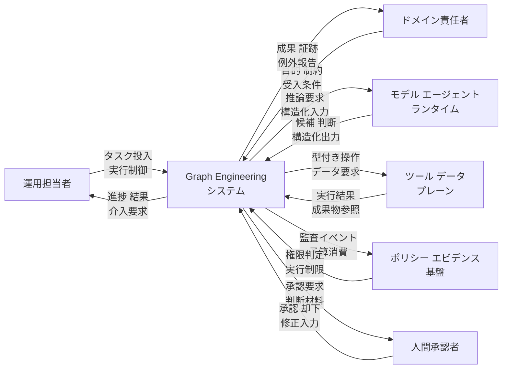
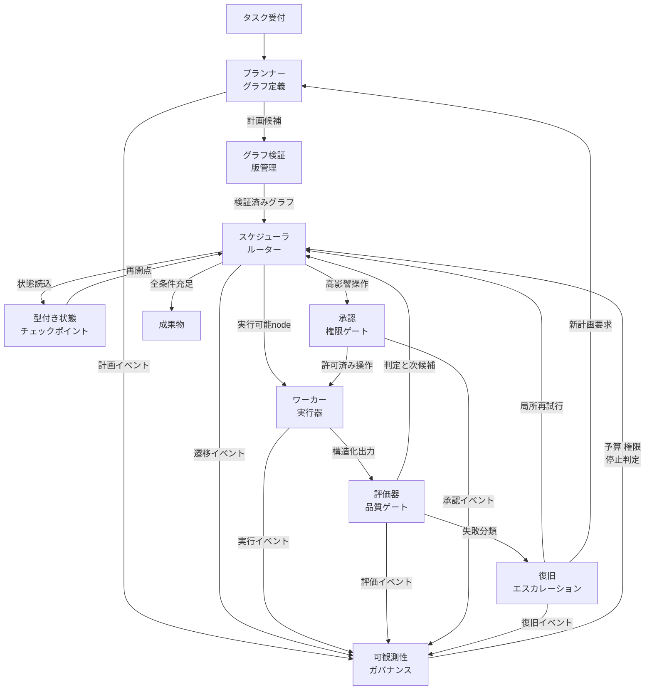
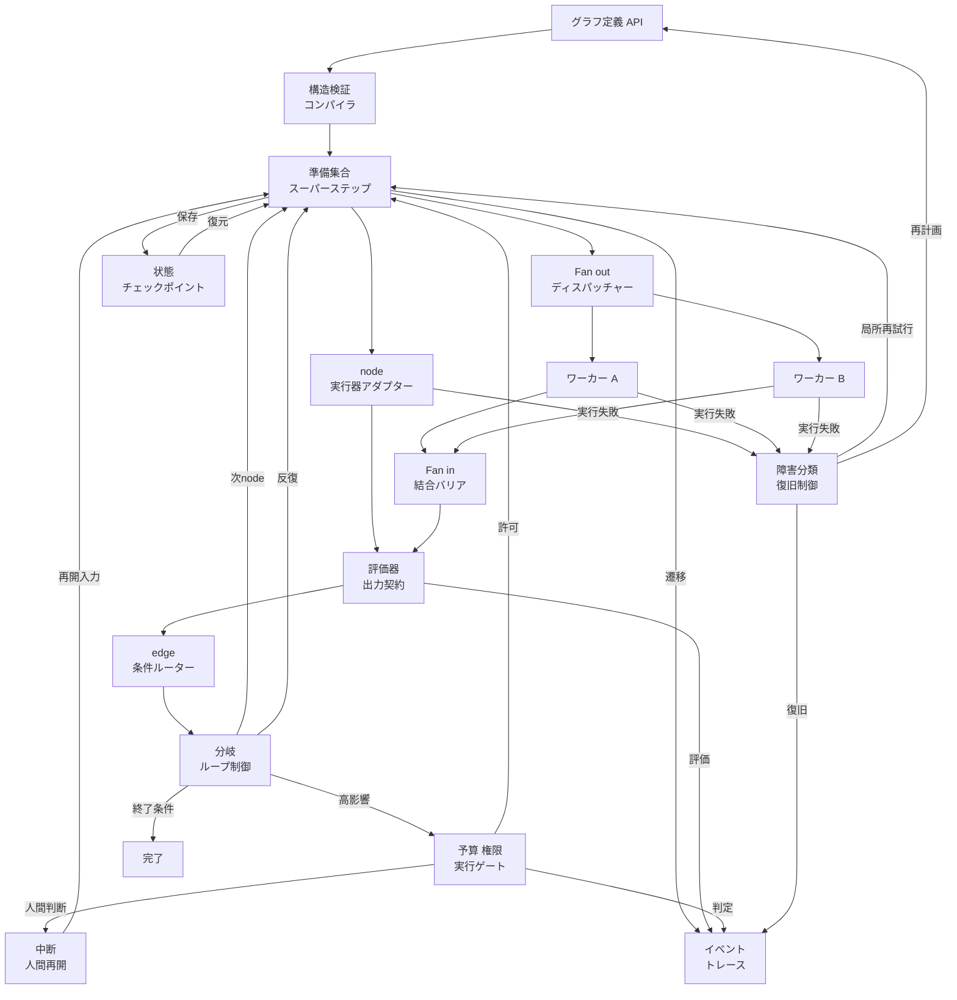
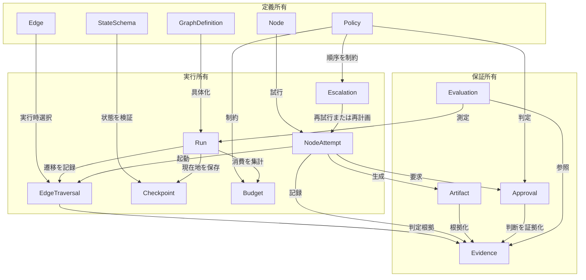
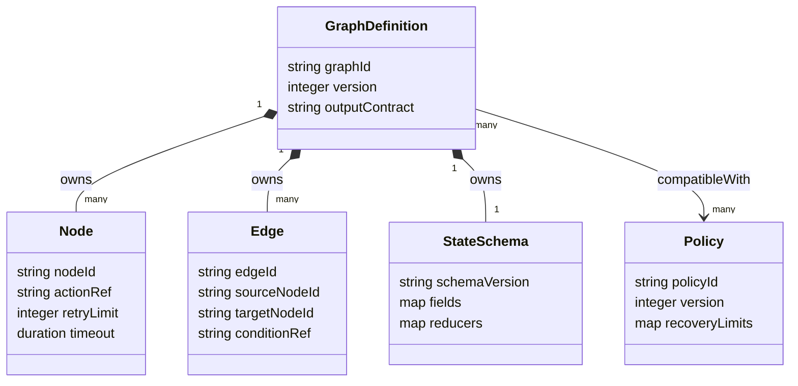
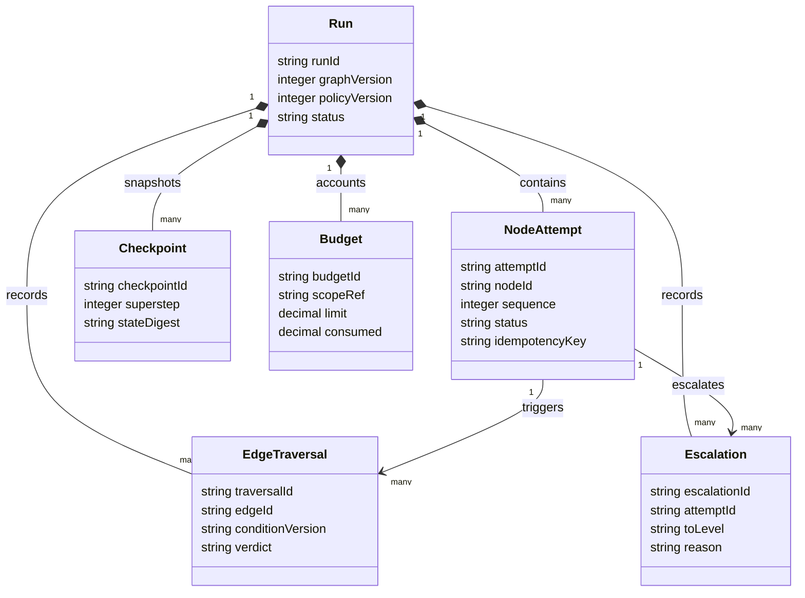
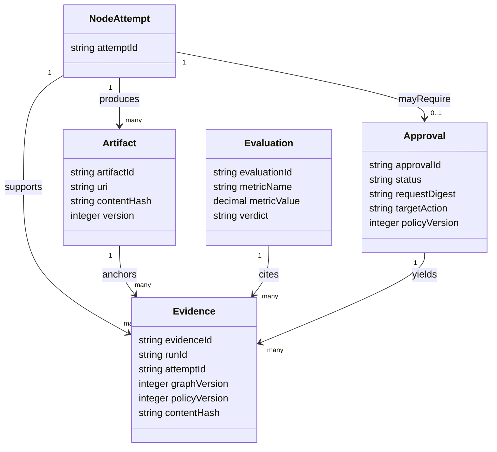

AIエージェントが長いタスクを担うと、1つのloopへ判断・状態・副作用が集中し、再開や監査が難しくなります。Graph Engineeringは、agent、決定的関数、evaluator、人間承認を明示的な実行グラフへ分離し、型付きstateと検査可能なedgeで接続する方法論です。

> 検証日: 2026-07-27  
> 対象: AIエージェント文脈のGraph Engineering

設計方式を選びたい方は「概要」「反証・限界・適用条件」から読むと、graphを採用すべき条件を短時間で判断できます。実装へ進みたい方は「構造」「データ」「構築方法」を読み、運用担当者は「運用」「トラブルシューティング」を参照してください。

> 本稿の Graph Engineering は Knowledge Graph Engineering や GraphRAG ではありません。agent、決定的関数、evaluator、人間承認を実行nodeとして接続し、状態・遷移・権限・予算・回復を明示的に設計する方法論を扱います。

## 概要

### 調査対象と用語の境界

本稿が扱う Graph Engineering は、AI エージェントの実行を明示的なグラフとして設計する方法論です。Knowledge Graph Engineering、GraphRAG、グラフデータベースのスキーマ設計、グラフアルゴリズムの実装は別の領域です。

| 用語 | 本稿での意味 |
|---|---|
| Graph Engineering | agent、決定的関数、evaluator、human gate をnodeとして構成し、型付き状態と検査可能な遷移で接続する設計活動 |
| Execution Graph | 1 回の仕事について、何が実行可能で、何に依存し、どの状態を受け渡すかを表す制御構造 |
| Knowledge Graph | 実世界のエンティティと関係を表す知識構造。実行順序の制御を主目的としない |
| GraphRAG | 知識グラフやグラフ由来の構造を検索・生成に利用する手法。実行オーケストレーションとは役割が異なる |
| Graph database | グラフ構造の保存・問い合わせを担うデータ基盤。Graph Engineering の必須要件ではない |

### 出典の種類を分けた定義

| 区分 | 内容 |
|---|---|
| 一次情報：Josh C. Simmons の定義 | 2026 年 7 月 4 日の論考は、Graph Engineering を「暗黙の loop ではなく明示的な graph として agentic system を設計すること」と定義しています。主要要素は単一責務の node、state を運ぶ typed edge、schema を持つ checkpointed state です。loop は消えるのではなく node 内部へ位置づけられます。 |
| 一次情報：Hu Wei の提案 | 2026 年 4 月 13 日提出の position paper は Agent Loop を single-ready-unit scheduler と捉え、明示的な静的 DAG を使う Structured Graph Harness を提案しています。これは Graph Engineering 全般より狭い設計点です。 |
| 一次情報：既存フレームワーク | LangGraph、Google ADK、Microsoft Agent Framework は、呼称の流行より前から、agent と決定的処理を node、edge、state、checkpoint として扱う実装を提供しています。 |
| 筆者の見解：Simmons | model の単一ステップ能力より、多数のステップの協調がボトルネックになったため、次の実務領域が graph の設計へ移ったと主張しています。 |
| 筆者の見解：iii | graph の形は新しいパラダイムではなく、state machine、DAG、distributed system が扱ってきた既存の問題だと批判しています。長期的な価値は topology より、worker、function、trigger、queue、trace のような substrate にあると主張しています。 |
| この記事の統合定義 | Graph Engineering は、複数の異質な実行単位を明示的な有向グラフへ配置し、状態スキーマ、遷移条件、並列・合流、権限、予算、評価、承認、停止、回復を node 間の契約として設計・検証・運用する方法論です。各 node の内部では agent loop を利用できます。静的 DAG、周期を持つ graph、実行時に展開される dynamic graph は、この方法論の異なる設計点です。 |

この統合定義では「複数 agent」を必須条件にしません。単一 agent、決定的関数、evaluator、人間を組み合わせた graph も対象です。また、edge の型は単なる矢印の名前ではなく、入力・出力 schema、遷移条件、許可される副作用、失敗時の扱いを含む境界契約として扱います。

### 起点と普及の時系列

@[tweet](https://x.com/steipete/status/2078277297791189132)

「誰が用語を提唱したか」は、確認できた一次資料と普及の契機を分けて扱う必要があります。

| 時点 | 確認できた事実 | 位置づけ |
|---|---|---|
| 2024-12-19 | Anthropic は predefined code path で LLM と tool を編成する workflow と、LLM が過程を動的に決める agent を区別しました。prompt chaining、routing、parallelization、orchestrator-workers、evaluator-optimizer を composable pattern として整理しました。 | 「Graph Engineering」という呼称より前の実務的系譜 |
| 2025-03-17 | Cemri らの multi-agent failure 研究 v1 は、5 つの代表的 MAS framework と 150 超の task を調査し、14 の failure mode を system design、inter-agent misalignment、verification / termination の 3 群に整理しました。 | graph 化で新しく顕在化する協調問題の反証材料。後続版と集計規模を混同しません。 |
| 2025-05-30 | AGORA 論文は graph-based workflow engine で複数の language-agent algorithm を統一し、単純な Chain-of-Thought が低い計算 overhead で堅牢な場合も示しました。 | graph orchestration の先行研究 |
| 2026-04-13 | Hu Wei が *From Agent Loops to Structured Graphs* を arXiv に提出しました。Agent Loop を single-ready-unit scheduler と定式化し、静的 DAG、計画・実行・回復の分離、bounded recovery を提案しました。 | Graph Engineering という流行語に先行する理論的設計提案 |
| 2026-07-04 | Josh C. Simmons が *We Are Entering the Graph Engineering Phase* を公開し、Graph Engineering を node、typed edge、checkpointed state の 3 要素で明示的に定義しました。 | この記事で確認できた、AI agent 文脈の用語を題名と定義の双方で示す初期一次資料 |
| 2026-07-18 | Peter Steinberger が X に「Are we still talking loops or did we shift to graphs yet?」と投稿しました。投稿 ID の Snowflake timestamp は 2026-07-18 00:34:54 UTC です。iii の保存画面は 1:34 AM、Digg の集約表示は前日 5:34 PM と表示し、いずれも表示 timezone の差として整合します。 | 定義の提唱というより、広範な議論を起こした普及の契機 |
| 2026-07-21 | iii が反論記事を公開し、loop / graph は有用な pattern である一方、古典的な workflow・state machine・distributed system の再命名でもあると論じました。 | 呼称と実質を分ける批判 |

以上から、Josh C. Simmons は少なくとも 2026 年 7 月 4 日に AI agent 文脈の Graph Engineering を明示的に定義した人物と確認できます。ただし、公開 Web 全体で最初に語を使った人物だと証明する資料は確認できません。Peter Steinberger は 7 月中旬の議論を広げた人物ですが、当該投稿は定義を提示していません。「Steinberger が発明し、Simmons が後から定義した」という時系列は一次資料と整合しません。

### 主要主張の証拠マトリクス

| 主張 | 根拠 | 種類 | 確認日 |
|---|---|---|---|
| Graph Engineering は node、typed edge、checkpointed state を中心に定義されました | [Josh C. Simmons, *We Are Entering the Graph Engineering Phase*](https://www.drjoshcsimmons.com/writing/we-are-entering-the-graph-engineering-phase) | 提唱者の一次論考 | 2026-07-27 |
| Structured Graph Harness は静的 DAG と段階的復旧を提案します | [arXiv:2604.11378](https://arxiv.org/html/2604.11378v1) | position paper | 2026-07-27 |
| 同論文は実装・実験結果を提示せず、主張を仮説として置いています | [arXiv:2604.11378, Limitations](https://arxiv.org/html/2604.11378v1#S9.SS5) | position paper の自己制約 | 2026-07-27 |
| LangGraph は graph state の checkpoint と interrupt / resume を提供します | [LangGraph Persistence](https://docs.langchain.com/oss/python/langgraph/persistence)、[Interrupts](https://docs.langchain.com/oss/python/langgraph/interrupts) | 公式ドキュメント | 2026-07-27 |
| Microsoft Agent Framework は superstep ごとに共有 state を同期します | [Microsoft Agent Framework Workflows](https://learn.microsoft.com/en-us/agent-framework/workflows/) | 公式ドキュメント | 2026-07-27 |
| Google ADK 2.0 は agent と決定的 node を graph workflow に構成できます | [Google Developers Blog: ADK 2.0](https://developers.googleblog.com/en/why-we-built-adk-20/) | 公式発表 | 2026-07-27 |
| multi-agent の性能・token 倍率は特定の Anthropic Research 構成に限られます | [Anthropic, *How we built our multi-agent research system*](https://www.anthropic.com/engineering/multi-agent-research-system) | 開発元の事例報告 | 2026-07-27 |
| graph という呼称には既存 workflow / state machine の再命名という反論があります | [iii, *Loops, Graphs, and the Layer That Matters*](https://iii.dev/blog/loops-graphs-and-the-layer-that-matters/) | 批評・反証 | 2026-07-27 |

### 技術的な系譜

Graph Engineering の構成要素は新規発明の集合ではありません。AI agent 固有の不確実性を、既存の software / distributed systems engineering の技法へ接続した再編成です。

| 系譜 | 継承する考え方 | AI agent 文脈で追加される論点 |
|---|---|---|
| State machine | 明示状態、許可された遷移、終端状態、不変条件 | LLM 出力の非決定性、意味的 validation、human waiting、budget exhaustion |
| DAG scheduler | dependency、ready set、topological scheduling、fan-out / fan-in | node の所要時間と成功確率が揺れること、LLM planner が依存関係を誤ること |
| Workflow engine | retry、timeout、checkpoint、event history、compensation | prompt / model / tool call の版管理、trajectory evaluation、token・金額 budget |
| Actor / multi-agent systems | mailbox、役割分担、message passing、supervision | context handoff の欠落、role drift、相互誤認、複数 agent の誤った合意 |
| Agent harness | model provider、tool interface、sandbox、policy gate、session / context management | graph node を安全に動かす共通 runtime。graph topology そのものとは別層 |
| Software testing | unit test、contract test、integration test、fault injection | non-deterministic node の統計評価、edge routing と trajectory の評価 |

### 関連概念との違い

| 概念 | 主に設計する対象 | Graph Engineering との関係 |
|---|---|---|
| Prompt Engineering | 1 回の model 呼び出しへ与える指示 | node 内部の品質を支える下位レイヤーです。 |
| Context Engineering | model が各 turn で読む情報と圧縮・記憶 | node 内部の判断材料と、node 間で受け渡す state の選別を支えます。 |
| [Loop Engineering](https://zenn.dev/suwash/articles/loop-engineering_20260610) | 1 agent の think-act-observe、tool、stop condition、compaction | graph の node 内部で継続します。Graph Engineering は loop 間の依存、handoff、gate、join を主に扱います。 |
| Agent harness | loop を実行する runtime、tool、sandbox、policy、session store | graph の各 node を動かす substrate です。1 つの harness は loop と graph の双方を実行できます。 |
| State machine | 状態集合と遷移規則 | Graph Engineering の制御意味論を厳密化します。各 node の lifecycle と graph 全体の進行状態に利用できます。 |
| DAG | cycle を含まない有向 graph | 既知の依存と有限実行に向く graph topology の一種です。Graph Engineering 全体は cyclic / dynamic graph も含みます。 |
| Workflow | code で規定した処理経路 | Graph Engineering は workflow engineering と大きく重なります。LLM node、model-driven routing、semantic evaluation、token budget を第一級の対象とする点が特徴です。 |
| Multi-agent orchestration | 複数 agent の役割と対話 | agent 数に注目する概念です。明示 graph を持たない会話型 MAS もあります。Graph Engineering は単一 agent と関数だけでも成立します。 |
| Durable execution | 障害後の replay / resume、timer、signal、retry | graph を本番運用可能にする実行基盤です。graph topology と durable runtime は独立に選べます。Temporal は loop も graph も durable にできます。 |

### 実行構成の明示度を比較する

以下は方法論を排他的に比べる表ではありません。loopをnode内部で使い、workflowをgraphの実行基盤にする包含関係を前提に、制御構造をどこまで明示するかを比較します。「起動」はtaskの設計から最初の有効な実行までを指します。実測値はmodel、tool、runtime、並列上限に依存します。

| 方式 | 実行方式 | リソース消費 | 対応機能 | 起動速度 |
|---|---|---|---|---|
| 単一 LLM 呼び出し | 1 request / 1 response。必要に応じて retrieval を付加 | 最小。state persistence と coordination がほぼ不要 | 要約、分類、抽出、短い生成 | 最速。schema と評価だけで開始しやすい |
| 単一 Agent Loop | 1 つの active context が tool を選び、stop まで逐次反復 | 中。turn 数と transcript が増える | open-ended exploration、未知の手順、逐次 tool use | 速い。目的・tool・stop condition を定義すれば開始できる |
| 決定的 workflow / DAG | code または DSL が順序、分岐、並列を規定 | 中。scheduler と state store が必要だが LLM 呼び出しを限定しやすい | 定型 business process、ETL、CI/CD、承認 | 中。依存関係と failure policy の事前設計が必要 |
| 明示graph構成 | agent loop、関数、evaluator、人間をnodeとし、typed state / transitionで接続 | 中〜大。checkpoint、trace、validation、join、複数contextが加わる | 長期実行、fan-out / fan-in、混合決定性、trajectory eval、段階的承認 | 中〜遅。state schemaとedge contractの設計を先に行う |
| 自由会話型 Multi-Agent | 複数 agent が message で役割分担し、会話から次動作を決める | 大。agent 数に応じて token と handoff が増える | emergent collaboration、role-based deliberation | prototype は速い。再現性・回復・監査の整備に追加時間が必要 |

技術的には、Graph Engineering の overhead は node 数そのものより、node 境界の永続化、serialization、schema validation、routing、join、trace、retry に生じます。一方、独立 branch の wall-clock time は並列化で短縮できます。依存が密な task、rate limit が厳しい tool、共有 context が大きい task では、この利点が小さくなります。

Anthropic は、Claude Opus 4 を lead agent、Claude Sonnet 4 を subagent とする multi-agent 構成が、単体の Claude Opus 4 を社内 research eval で 90.2% 上回ったと報告しています。同記事は別途、breadth-first query が multi-agent に適する傾向と、通常の agent が chat の約 4 倍、multi-agent が chat の約 15 倍の token を使うという観測も述べています。いずれも Anthropic Research の構成と内部評価に限られるため、Graph Engineering 一般の性能値には転用できません。

### 適用ユースケース

| ユースケース | 推奨方式 | 理由 |
|---|---|---|
| 複数情報源を独立に調べ、最後に統合・査読する調査 | dynamic orchestrator-worker graph | 独立 branch の context 分離と並列探索、reviewer への fan-in が効きます。 |
| 仕様策定 → 実装 → test → security review → human approval → deploy | static / versioned graph + durable execution | 依存、権限、証跡、失敗箇所、承認待ちを明示できます。 |
| 高リスクの外部副作用を伴う業務 | deterministic node + human gate を含む graph | 支払い、削除、公開などの権限境界を edge で強制できます。 |
| 長時間停止し、後日再開する業務 | checkpointed graph または durable workflow | human waiting と process crash を通常の状態遷移として扱えます。 |
| 評価基準が明確な反復改善 | generator-evaluator cycle を含む graph | artifact、evidence、score、stop condition を分離して追跡できます。 |
| 依存が既知の大規模 batch | 決定的 DAG | LLM routing より通常の scheduler が低コストで高い再現性を提供します。 |
| 未知の探索を含むが一部に厳格な gate が必要な task | agent loop node + deterministic outer graph | node 内の柔軟性と node 間の統制を両立できます。 |

### Graph Engineering を選ぶ前に単純な方式を優先するケース

| 条件 | 優先方式 | 判断根拠 |
|---|---|---|
| 1〜3 step の短い task | 単一 call または小さな loop | graph の checkpoint と routing overhead を回収しにくい条件です。SGH 論文も fixed-overhead hypothesis として挙げています。 |
| 手順が完全に決定的 | 通常の関数、queue、workflow engine | LLM node と model-driven edge を加える価値が小さい条件です。 |
| task 構造が探索中に大きく変わる | 単一 loop または dynamic orchestrator | 静的 DAG の cold start と replan cost が支配的になります。 |
| 全 worker が巨大な同一 context を必要とする | 単一 loop または逐次 workflow | context 複製と handoff の費用が並列化の利点を上回りやすい条件です。 |
| 独立 branch がほとんどない coding task | 単一 agent + deterministic test gate | Anthropic は多くの coding task で、research より真に並列化できる部分が少ないと報告しています。 |
| 低 latency・低 cost が最優先 | 単一 call、retrieval、in-context example | Anthropic は複雑性を必要に応じて増やす方針を推奨しています。 |
| 目的が知識の意味関係の探索 | Knowledge Graph / GraphRAG | 実行 graph ではなく knowledge model が主問題です。両者は組み合わせられます。 |

### 採用判断チェックリスト

次の問いのうち「はい」が少なければ、単一 call、loop、または通常の workflow を先に選びます。graph を採用する場合も、最初に必要な node と edge だけを実装します。

| 問い | 「はい」のとき graph が与える価値 |
|---|---|
| 独立に実行できる branch が複数ありますか | fan-out / fan-in と branch ごとの failure isolation |
| agent、決定的関数、人間承認を同一 run で連携させますか | 異質な実行主体を共通の state transition として追跡 |
| 数分を超える待機、process restart、後日の再開がありますか | checkpoint、durable resume、versioned state |
| 支払い、削除、公開など authority の異なる副作用がありますか | edge ごとの policy gate、approval、evidence |
| 中間 artifact と経路を監査・再評価する必要がありますか | trajectory、provenance、replay の記録 |
| retry、replan、escalation の上限を局所的に変えますか | node / edge 単位の failure policy と budget |
| state schema と merge 規則を事前に定義できますか | 並列更新と handoff を契約として検証 |
| topology の追加費用を上回る品質・回復性の改善を測れますか | canary と比較評価による採用継続判断 |

## 特徴

- **loop を node 内へ保存します。** Graph Engineering は loop の置換ではなく、複数 loop と決定的処理の外側に協調層を置きます。
- **異質な node を同じ実行モデルで扱います。** LLM agent、通常関数、retrieval、evaluator、人間を同じ graph に配置できます。
- **state を transcript から分離します。** schema を持つ task state、artifact、evidence、budget、approval を checkpoint 可能な値として扱います。
- **edge を判断と契約として扱います。** 固定遷移、条件分岐、model-decided routing、human approval を区別し、決定的に表現できる箇所へ決定的規則を使います。
- **並列性を明示します。** ready な node を fan-out し、all-of、any-of、quorum などの join policy で fan-in します。
- **評価を出力から trajectory へ広げます。** 最終回答だけでなく、どの経路を、どの cost と authority で通ったかを評価対象にします。
- **failure domain を node 境界へ限定します。** idempotency、retry、timeout、compensation、replan、escalation を node / edge ごとに定義できます。
- **人間を例外処理ではなく実行主体として扱います。** approval、編集、拒否、追加証拠の要求を永続状態を伴う遷移として設計できます。
- **budget と authority を状態へ含めます。** token、金額、wall-clock、tool permission、remaining retries を edge crossing で検査できます。
- **static と dynamic の trade-off を選択できます。** 静的 DAG は監査性を高め、dynamic graph は探索の柔軟性を高めます。
- **framework から独立した方法論です。** LangGraph、Google ADK、Microsoft Agent Framework、Temporal、通常の queue / database の組み合わせでも実装できます。

### 主張に対する批判・反証

| 主張・期待 | 反証・制約 | 実務上の読み替え |
|---|---|---|
| graph は loop の次世代である | loop は graph node の内部で必要です。iii は loop を 1 node の graph と見なし、形の差を新しい paradigm と扱う姿勢を批判しています。 | loop 対 graph の二者択一ではなく、局所的自律と全体的統制の境界を設計します。 |
| graph は新しい技術である | state machine、DAG scheduling、workflow、actor、distributed tracing は長年使われています。 | 新規性は topology 自体より、非決定的 LLM node と semantic evaluation を既存技法へ統合する点に置きます。 |
| graph 化すれば信頼性が上がる | 誤った planner が誤った dependency を作ると、明示 graph は誤りを再現可能に実行します。複数 agent は同じ誤情報へ整然と合意できます。 | deterministic test、外部 measurement、human judgment など graph 外部の evidence anchor を置きます。 |
| multi-agent と graph は同義である | 単一 agent と複数関数でも graph は成立します。会話だけで協調する MAS は明示 graph を持たない場合があります。 | 「agent の数」と「制御構造の明示性」を別の設計軸にします。 |
| branch を増やせば速くなる | 並列化は token、tool call、rate limit、join waiting、shared-state conflict を増やします。Anthropic の事例でも multi-agent は chat の約 15 倍の token を使いました。 | branch の独立性、task value、critical path、concurrency limit を測ってから fan-out します。 |
| graph は複雑 task で常に高品質になる | AGORA の実験は、単純な Chain-of-Thought が低い computational overhead で堅牢な場合を示しました。 | 単純方式を baseline とし、graph の追加価値を task class ごとに評価します。 |
| 明示的役割と topology で multi-agent failure を解消できる | Cemri らは 14 failure mode を報告し、role specification と orchestration topology の単純な改善だけでは効果が一貫しないと述べています。 | strong verification、communication protocol、uncertainty、memory / state management を合わせて設計します。 |
| checkpoint だけで安全に再開できる | 非決定的処理と副作用を replay すると重複実行が起こります。 | LLM call と外部 I/O を replay-safe な activity / task 境界へ隔離し、idempotency key と compensation を用意します。 |
| topology が本番品質を決める | iii は、queue、state store、retry、trace、policy gate など substrate が長期的な work product だと主張しています。 | graph 図と同じ比重で durable runtime、schema migration、observability、deployment を設計します。 |

### arXiv:2604.11378 の扱いに関する注意

Hu Wei の論文は、Graph Engineering の理論的背景として有用です。一方、著者自身が position paper / design proposal と明記し、production implementation と empirical result を提供していません。静的 DAG が loop より優れるという性能主張は、将来検証する仮説です。

同論文の 70-project survey は、著者自身が peer-reviewed survey ではなく qualitative evidence だと明記しています。また、本文は Agent Loop を 42 / 70 と記載する一方、Appendix A.7 の見出しは 41 projects と記載します。Appendix の category 件数は 41 + 11 + 4 + 5 + 7 = 68 で、同じ project 名が複数 category に現れる箇所もあります。したがって、「60%」は産業全体の普及率として一般化せず、著者の sample における概算として扱います。

## 構造

ここでいう Graph Engineering の対象は、AI エージェントの制御フローです。制御をnode、型付きedge、状態、ゲートとして外在化します。Knowledge Graph Engineering の対象は、知識をnodeと関係として格納する情報構造です。Josh C. Simmons は、nodeを交換可能な能力単位、edgeを意思決定、状態をチェックポイント可能なスキーマとして捉えています。一方、arXiv:2604.11378 の Structured Graph Harness は、静的 DAG、計画・実行・復旧の分離、段階的復旧を採用する厳格な設計案です。以下の図は Graph Engineering 全般を表し、論文固有の制約は境界として明記します。

### システムコンテキスト図



| 要素名 | 説明 |
|---|---|
| 運用担当者 | タスクを投入し、実行状況を監視し、停止や再開などの運用操作を行います。 |
| ドメイン責任者 | 業務目的、禁止事項、受入条件、品質基準を定義し、成果と例外を確認します。 |
| 人間承認者 | 高影響操作や曖昧な判断をレビューし、承認、却下、修正入力を返します。人間を制御グラフ上の参加者として扱います。 |
| Graph Engineering システム | タスクを明示的な実行グラフとして定義し、依存関係、ルーティング、並列性、状態、復旧、統制を一体で管理します。 |
| モデル エージェント ランタイム | LLM 推論やnode内のエージェントループを実行します。Graph Engineering はループを境界の明確なnode内部へ配置します。 |
| ツール データ プレーン | API、コード実行、検索、データストアなどの副作用を伴う能力と、その結果や成果物を提供します。 |
| ポリシー エビデンス基盤 | 権限、予算、リスク分類を判定し、計画版、ルーティング、実行結果、承認を追跡可能な証跡として保持します。 |

この境界では、LLM は制約された推論コンポーネントとして、計画生成、分類、評価、node内部の推論に参加します。検査可能なグラフとポリシーが、実行可否、依存関係、予算、権限、承認を制御します。

### コンテナ図



| 要素名 | 説明 |
|---|---|
| タスク受付 | 依頼、実行主体、期限、予算、許可された能力を正規化し、計画へ渡します。 |
| プランナー グラフ定義 | 目的を責務の小さいnodeへ分解し、依存、分岐、結合、ループ、受入条件を定義します。テンプレート、決定的コード、LLM、またはその組合せで実装できます。 |
| グラフ検証 版管理 | 到達可能性、型整合性、停止条件、権限、副作用、予算を実行前に検証し、実行対象のグラフ版を固定します。静的 DAG を採用する設計では循環も拒否します。 |
| スケジューラ ルーター | 依存条件を満たす準備済みnodeを求め、直列、条件分岐、fan-out、fan-in、ループを進めます。LLM が返す分類を使う場合も、許可された遷移先に制限します。 |
| 型付き状態 チェックポイント | node入出力、実行位置、保留中要求、予算、計画版をスキーマ付きで保存し、障害や人間待ちからの再開点を提供します。 |
| ワーカー 実行器 | LLM、決定的関数、ツール、サブグラフなど、単一責務のnodeを実行します。副作用を伴う処理は冪等性キーや補償境界を持たせます。 |
| 評価器 品質ゲート | 出力型、テスト、ポリシー、意味品質、受入条件を検査し、通過、再実行、修正、エスカレーションを判定します。 |
| 承認 権限ゲート | 操作主体の権限、影響度、データ境界を検査し、必要な操作を人間承認まで停止します。 |
| 復旧 エスカレーション | 障害を一時的、入力起因、契約違反、構造起因に分類し、局所再試行、局所修正、再計画、人間介入へ段階的に上げます。 |
| 可観測性 ガバナンス | node、edge、状態遷移、モデルとツールの呼出し、費用、承認、復旧を相関付けます。予算超過や権限違反ではスケジューラへ停止判定を返します。 |
| 成果物 | 出力契約と必要なゲートを満たし、証跡と対応付いた最終結果です。 |

コンテナ境界は方法論上の責務分離です。単一プロセスにも分散サービスにも実装できます。特に、チェックポイントの粒度は製品ごとに異なります。LangGraph はグラフの各 step に状態スナップショットを保存します。Microsoft Agent Framework は superstep の完了時に全 executor 状態、次のメッセージ、保留要求、共有状態を保存します。Temporal は Workflow と Activity の履歴、再試行、待機を耐久化する下位実行基盤を担い、agent graph のモデルは上位アプリケーションやフレームワークが定義します。

### コンポーネント図



| 要素名 | 説明 |
|---|---|
| グラフ定義 API | nodeとedgeを宣言します。代表例は LangGraph の `StateGraph`、Microsoft Agent Framework の `WorkflowBuilder`、Google ADK 2.0 の `Workflow` です。API 名は似ていますが、状態、再開、版管理の意味論は別々です。 |
| 構造検証 コンパイラ | 到達不能node、型不一致、無制限ループ、未設定の終了経路を検出します。Structured Graph Harness では、静的 DAG と計画版不変条件の検証も担います。 |
| 準備集合 スーパーステップ | 実行条件を満たしたnodeを選びます。論文は ready set をスケジューラ比較の中心概念にします。Microsoft Agent Framework は同じ superstep で起動した executor を並列実行し、全完了後に次へ進みます。 |
| node 実行器アダプター | LLM エージェント、通常関数、ツール、サブグラフを同じ実行単位へ適合させます。node内部では従来の agent loop を利用できます。 |
| edge 条件ルーター | 成功、失敗、分類、ポリシー判定を型付き遷移へ変換します。LangGraph は通常 edge、conditional edge、`Command` を持ち、Google ADK は route を持つ `Event` と route edge を使います。 |
| Fan out ディスパッチャー | 独立した作業を複数の準備済みnodeへ展開します。LangGraph の複数 outgoing edge や `Send`、Microsoft の fan-out edge、Google ADK の複数経路が代表例です。 |
| ワーカー A | fan-out された独立作業の一方を、分離された入力で実行します。 |
| ワーカー B | fan-out された独立作業の他方を、分離された入力で実行します。 |
| Fan in 結合バリア | 必要な先行結果を集約して後続へ渡します。Google ADK 2.0 は `JoinNode`、Microsoft Agent Framework は fan-in barrier を提供します。LangGraph は reducer 付き共有 state と後続 node で集約します。 |
| 評価器 出力契約 | 型、形式、テスト、意味品質を検証します。決定的検証と人間判断を優先し、LLM 評価をリスクに応じて組み合わせます。 |
| 分岐 ループ制御 | 判定結果を次node、反復、承認、終了へ写像します。LangGraph は conditional edge、Google ADK は back-edge、Microsoft Agent Framework は条件 edge や Functional API のループで表現できます。全ループに回数、時間、費用の上限を付けます。 |
| 状態 チェックポイント | 型付き状態と進行位置を保存します。LangGraph の checkpointer、Microsoft Agent Framework の checkpoint storage、Temporal の durable Workflow history は目的が重なり、保存境界と replay の契約は製品ごとに異なります。 |
| 中断 人間再開 | 人間入力を待つ間に実行を停止し、同じ実行識別子と保存状態から再開します。代表例は LangGraph の `interrupt` と `Command`、Microsoft の request response、Google ADK 2.0 の `RequestInput` です。 |
| 予算 権限 実行ゲート | token、費用、時間、試行回数、tool 権限、データ境界を遷移前に検査します。モデルへの指示に加え、ランタイムの強制条件として実装します。 |
| 障害分類 復旧制御 | 一時障害を局所再試行し、契約や設定の問題を局所修正し、構造上の問題を再計画へ送ります。Structured Graph Harness は retry、patch、replan の順序を機械的に強制する設計を提案します。 |
| イベント トレース | node開始・終了、edge 選択、状態版、評価、承認、復旧、費用を run ID と計画版へ関連付けます。Microsoft Agent Framework は workflow、executor、edge group、message の span を提供します。 |
| 完了 | すべての必須依存、出力契約、権限、承認を満たした終端です。 |

コンポーネント図は実装可能な共通パターンを示します。各フレームワークの機能と Structured Graph Harness の保証は別々に追跡します。LangGraph と Google ADK は条件付き back-edge や動的経路を表現できます。Structured Graph Harness は計画版内の静的 DAG を選び、動的な構造変更を新しい計画版へ限定します。したがって、Graph Engineering の設計時には、探索性を優先する動的グラフと、監査性を優先する静的グラフのどちらを採用するかを明示します。

また、「各 edge で checkpoint する」は Josh C. Simmons の実践上の推奨です。各製品は独自の保存境界を定義します。実装では、チェックポイント境界、再開時に再実行される範囲、副作用の冪等性をフレームワークの契約に合わせます。LangGraph の interrupt は再開時に中断した node を先頭から実行します。Microsoft Agent Framework は superstep 境界で保存します。Temporal は耐久実行の基盤として Workflow state と Activity 結果を復元します。

## データ

本節の Graph Engineering は、AI エージェントの制御フローをグラフとして設計し、実行履歴を追跡するためのデータ設計を指します。ドメイン知識を triple や ontology として表現する Knowledge Graph Engineering とは対象が異なります。ここで扱うグラフの頂点は実行単位であり、辺は依存関係またはルーティング条件です。

起点論文の Graph Harness は、実行計画を `Π=(id, version, V, E, σ, κ)` と定義します。論文はnode状態、回復プロトコル、予算、承認待ちを定義しています。一方、永続化スキーマや監査台帳は将来の engineering details としています。そのため、以下では論文の概念と、公式フレームワークから補完した「実装モデル案」を区別します。

### モデルの出典境界

| エンティティ | 区分 | 根拠と位置づけ |
|---|---|---|
| GraphDefinition | 論文概念の正規化名 | 論文の `Execution Plan Π` に対応します。`id` と `version`、node集合、辺集合、node設定写像、出力契約を持ちます。 |
| Node | 論文概念 | 実行可能単位 `V` に対応します。アクション、再試行方針、副作用レベル、出力契約を持ちます。 |
| Edge | 論文概念 | 有向辺集合 `E` と join semantics に対応します。論文は `all_of` と `any_of` を定義し、`first_of` を対象外とします。 |
| StateSchema | framework 公式実装から補完 | 論文のnode状態集合と実行コンテキストを、永続化可能な state channel のスキーマへ落とした実装モデル案です。LangGraph の state schema と reducer を参照します。 |
| Run | 論文概念から導出した実装モデル案 | 論文が要求する plan version ごとの execution trace を識別する集約です。Microsoft Agent Framework の `Run` と LangGraph の thread を参考にします。 |
| NodeAttempt | 論文概念から導出した実装モデル案 | node状態遷移、timeout、retry budget、recovery counter を試行単位で記録します。 |
| EdgeTraversal | 論文概念から導出した実装モデル案 | 論文の dependency と node 状態遷移を、実行時に選択された edge、condition version、判定根拠として記録します。属性はこの記事の提案です。 |
| Checkpoint | framework 公式実装から補完 | 論文は fault-tolerant persistence を将来課題としています。LangGraph と Microsoft Agent Framework の superstep checkpoint を参照します。 |
| Artifact | 論文概念と framework 補完 | 論文の execution context にある visible artifacts を、Google ADK の版管理された artifact として具体化します。 |
| Evidence | 実装モデル案 | 出力契約の検証方法、観測、承認根拠、artifact digest を結び付ける追記型の監査レコードです。論文は検証方法を audit trail に残す要件を示しますが、属性は定義していません。 |
| Evaluation | 論文概念から導出した実装モデル案 | 論文の experimental protocol にある成功率、実行時間、token cost、node count、recovery action などの測定結果を表します。 |
| Budget | 論文概念 | 実行コンテキストの budget、nodeの retry budget と timeout、実験条件の token budget を統一して表します。 |
| Approval | 論文概念から導出した実装モデル案 | `running → waiting_human` と、承認または再開による `ready` への遷移を監査可能な判断レコードにします。 |
| Policy | 論文概念から導出した実装モデル案 | 論文の scheduling policy、side-effect threshold、recovery invariant を版管理する集約です。 |
| Escalation | 論文概念から導出した実装モデル案 | `local_retry → local_patch → request_replan` の順序と診断結果を記録します。 |

### 概念モデル



#### 定義所有

| 要素名 | 説明 |
|---|---|
| GraphDefinition | 変更不能な一つの plan version を表します。再計画は既存定義の更新ではなく、新しい version の生成として扱います。 |
| Node | エージェント、ツール、検証器などの実行単位を表します。 |
| Edge | node間の依存関係と join または分岐条件を表します。 |
| StateSchema | nodeが読み書きする共有状態の型、scope、merge 規則、terminal state を定義します。 |
| Policy | scheduling、budget、approval、recovery に適用する版管理された制約を表します。 |

#### 実行所有

| 要素名 | 説明 |
|---|---|
| Run | 特定の GraphDefinition version を実行した一回の履歴を表します。 |
| NodeAttempt | nodeの一回の実行または再実行を表します。再試行回数と冪等性キーを保持します。 |
| EdgeTraversal | Run 中に実際に選ばれた Edge と、その condition version、判定、Evidence を表します。 |
| Checkpoint | superstep 境界などで保存した状態スナップショットと次に実行する単位を表します。 |
| Budget | token、時間、金額、再試行回数などの上限、予約量、確定消費量を表します。 |
| Escalation | 障害診断と、local retry、local patch、request replan の段階遷移を表します。 |

#### 保証所有

| 要素名 | 説明 |
|---|---|
| Artifact | nodeが生成または参照したファイル、構造化出力、外部オブジェクトへの不変参照を表します。 |
| Evidence | 契約検証、承認、評価の根拠を content hash 付きで記録します。 |
| Evaluation | Run または NodeAttempt を metric と threshold で評価した結果を表します。 |
| Approval | 高副作用操作などに対する要求、判断、判断者、policy version を表します。 |

### 情報モデル

以下の3図は、ZennのMermaid上限に合わせて定義・実行・保証へ分割した情報モデルです。図には主要属性だけを示し、追加属性と制約は各図の直後の表で補足します。

#### 定義エンティティ



| 要素名 | 説明 |
|---|---|
| GraphDefinition | `(graphId, version)` を一意キーにします。同一 version の Node と Edge は不変です。 |
| Node | `actionRef` は実行コードや agent definition の版固定参照です。`outputContract` は成功判定に使います。 |
| Edge | `joinMode` は論文仕様では `all_of` または `any_of` です。一般化した Graph Engineering では `conditionRef` に決定的な条件式の版固定参照を置きます。 |
| StateSchema | `reducers` は state key ごとの merge 関数識別子です。`terminalStates` は状態機械の終了集合です。 |
| Policy | 実行順、副作用の承認閾値、再試行と再計画の上限を一つの version に固定します。 |

#### 実行エンティティ



| 要素名 | 説明 |
|---|---|
| Run | `graphVersion` と `policyId` / `policyVersion` を必須にして、実行中の topology・policy 更新から履歴を分離します。 |
| NodeAttempt | `sequence` は同一 Run と Node における試行番号です。`idempotencyKey` は外部副作用の重複抑止に使います。 |
| EdgeTraversal | 静的な Edge 定義とは分離し、実行時に選ばれた condition の版、判定、起点 attempt、遷移先、時刻を記録します。routing の根拠は Evidence と結び付けます。 |
| Checkpoint | `stateDigest` で状態の改変を検知します。`parentCheckpointId` により replay や fork の系譜を表します。 |
| Budget | `reserved` と `consumed` を分け、並列 dispatch 前の過剰予約を防ぎます。`scopeRef` は Run、Node、Escalation、Approval の対象 ID を指します。 |
| Escalation | 対象 `attemptId`、診断 `reason`、`confidence` を保持し、policy が許す次の段階だけを Evidence とともに記録します。 |

#### 保証エンティティ



| 要素名 | 説明 |
|---|---|
| Artifact | `contentHash` と `version` で、同名オブジェクトの上書きから検証対象を守ります。 |
| Evidence | ログ、契約検証結果、承認判断、artifact digest などの根拠を一つの形式に正規化し、Run・attempt・graph・policy の版へ直接相関させます。 |
| Evaluation | metric の値だけでなく threshold と verdict を保存し、後日の再評価を可能にします。 |
| Approval | request と decision を同一 ID で相関させます。判断時に適用した `policyVersion` を固定します。 |

### 実行時遷移モデル

Edge は graph version に属する不変の定義、EdgeTraversal は Run に属する実行記録です。この分離により、「経路が定義されていたこと」と「その経路が実際に、どの判定で選ばれたか」を混同しません。

| 不変条件 | 検査 |
|---|---|
| `EdgeTraversal.edgeId` は Run が固定した graph version の Edge を参照します | dispatch 前の外部キー検査 |
| `sourceAttemptId` は成功または許可済みの終端状態です | scheduler の state-machine 検査 |
| `conditionVersion` は Edge の `conditionRef` が解決した版です | version registry と照合 |
| `verdict` と Evidence が欠けた model-driven route は遷移できません | edge contract validation |
| checkpoint 後の replay は保存済み traversal を再利用します | event history と digest の照合 |

### 状態更新と reducer

起点論文は global state の merge 方式を定義していません。以下は framework 公式実装から補完した実装モデル案です。

| 論点 | 実装モデル案 | 一次資料との対応 |
|---|---|---|
| key 単位の merge | StateSchema の各 field に reducer を割り当てます。指定がない field は置換とします。 | LangGraph は state key ごとに reducer を持ち、未指定時は新しい値で上書きします。 |
| 並列更新 | append、set union、ID 付き upsert、数値加算など、順序依存を避ける reducer を選びます。reducer は純粋関数として版管理します。 | LangGraph の reducer は現在値と node update を合成します。1.2.9 の DeltaChannel は bulk reducer に associative を必須としますが、beta であり API と保存表現は変更される可能性があります。 |
| 可視性 | 同一 superstep の書き込みを収集し、barrier 後の次 superstep から共有状態として公開します。 | Microsoft Agent Framework は更新元 executor には即時、他 executor には次 superstep から可視とします。 |
| 変更履歴 | state mutation を event delta として保存し、Checkpoint は再構成後の snapshot と pending work を保持します。 | Google ADK は `EventActions.state_delta` を SessionService が event append 時に適用します。LangGraph は各 step の snapshot を thread に保存します。 |
| 競合 | 同じ key への複数 write を許す場合は reducer を必須にします。決定できない競合は NodeAttempt を failed にして Evidence を生成します。 | 競合時の失敗規則はこの記事の実装モデル案です。 |

Google ADK の state は serializable な key-value です。`session:` 相当の無接頭辞、`user:`、`app:`、`temp:` の scope を持ちます。本モデルの StateSchema は scope を明示し、Run 内状態と長期状態の誤混入を防ぎます。Artifact は state にバイナリを埋め込まず、版と URI を state から参照します。

### edge condition と終端状態

| 項目 | 論文仕様 | 実装モデル案 |
|---|---|---|
| `all_of` | すべての predecessor が `executed` のとき successor を ready にします。 | Edge 群を同一 join group として記録し、必要 predecessor ID の集合を固定します。 |
| `any_of` | candidate のいずれかが `executed` になると successor を ready にし、残りの非終端 candidate を `skipped` にします。全 candidate が失敗または取消なら join を失敗させます。 | 勝者の attempt ID と sibling skip の Evidence を残します。 |
| node lifecycle | 論文の10状態は `pending`、`ready`、`running`、`waiting_human`、`blocked`、`executed`、`failed_retryable`、`failed`、`cancelled`、`skipped` です。依存喪失は `ready → blocked`、解消は `blocked → pending`、一時障害は `running → failed_retryable → pending`、retry budget 消尽は `failed_retryable → failed`、構造的エラーは `running → failed` です。 | この状態集合と主要遷移は論文仕様です。実装では timeout を一時障害として retry するか即時 `failed` とするかを error class と Policy で固定し、無期限の `running` を禁止します。 |
| conditional edge | Graph Harness の静的 DAG では、実行中に topology を追加しません。 | `conditionRef` は state を入力に既存の target を選ぶ決定的な関数とします。LangGraph の conditional edge と同様に、戻り値を既存 node ID へ写像します。 |
| terminal state | `executed`、`failed`、`cancelled`、`skipped` は absorbing state です。 | StateSchema の terminalStates を GraphDefinition version に固定し、terminal に入った NodeAttempt の状態更新を拒否します。 |
| human wait | 高い副作用レベルで `running` から `waiting_human` に移ります。承認または resume で `ready`、取消または有限 timeout で `cancelled` に移ります。 | Approval を独立レコードにし、Checkpoint が pending request と response correlation を保持します。 |

LangGraph は通常 edge、conditional edge、`START`、`END` を持ちます。通常 edge と動的 routing を同じ node から併用すると両経路が動くため、公式資料は一つの routing mechanism を選ぶよう求めています。本モデルでも Node ごとに static または conditional の一方を選びます。

### versioning と checkpoint

| version | 変更単位 | 互換性規則 |
|---|---|---|
| GraphDefinition version | Node、Edge、Policy、出力契約 | Graph Harness の plan invariant に従い、Run 中は不変です。replan は version `v+1` を生成し、元 Run と診断根拠を保持します。 |
| StateSchema version | field、型、reducer、scope | field の追加は default を定義します。rename は移行表を必須にします。型や reducer の非互換変更は新しい GraphDefinition version に束縛します。 |
| Artifact version | 同一論理名の内容 | Google ADK と同様に保存時に単調増加する版を割り当て、Evidence は latest ではなく特定 version と contentHash を参照します。 |
| Checkpoint version | Run の superstep または event boundary | Checkpoint は上書きせず追記します。fork は parentCheckpointId を持つ新しい系列にします。 |

LangGraph は checkpoint を thread と checkpoint ID で識別し、`StateSnapshot` に values、next、config、metadata、tasks を保持します。過去 checkpoint の replay では、その checkpoint より前を再利用し、後続 node を再実行します。Microsoft Agent Framework は各 superstep の終了時に全 executor state、次 superstep の pending messages、pending requests and responses、shared state を保存します。したがって Checkpoint は state map だけでなく、次の dispatch と未解決 approval を含む必要があります。

Graph migration の実務では、paused thread が次に参照する node の rename や delete が危険です。LangGraph 公式資料も interrupted thread では node の rename と remove を制約し、state key の rename は保存値を失うと説明しています。本モデルでは進行中 Run を旧 GraphDefinition version に固定し、移行は新規 Run または明示的な checkpoint migration として扱います。

### provenance と idempotency

Evidence は「誰が、どの定義で、何を入力し、何を生成し、何で成功と判定したか」を追跡します。最低限、`runId`、`attemptId`、`graphVersion`、`policyVersion`、`sourceRef`、`contentHash`、`capturedAt` を保持します。Artifact は内容本体または URI を持ち、Evidence はその特定 version と digest を引用します。これにより、可変 URL や latest artifact への参照だけで監査根拠が変わる事態を防ぎます。

durable execution は node の一回だけの実行を自動的には保証しません。LangGraph の interrupt は resume 時に node の先頭から再実行します。checkpoint より後の処理や完了記録前に落ちた task も再実行されます。そのため、外部副作用には次の実装モデルを適用します。

- `idempotencyKey = hash(runId, graphVersion, nodeId, logicalEffectId)` とし、retry sequence をキーに含めません。
- 外部 API が idempotency key を受け付ける場合は同じ key を渡します。
- DB 更新は unique constraint 付き upsert または compare-and-set を使います。
- 副作用の結果を Artifact と Evidence に保存し、再実行前に確認します。
- approval 前の副作用を避けます。必要な準備操作は別 Node に分け、冪等にします。

### budget accounting

Graph Harness は各 Node に timeout と retry budget を持たせ、execution context に budget を含めます。実装では一つの数値へ丸めず、次の ledger を分けます。

| scope | kind | accounting |
|---|---|---|
| Run | wall time | deadline と elapsed を記録します。並列 NodeAttempt の時間を単純加算せず、wall-clock と worker-time を分けます。 |
| Run | token | input、output、cached token を provider usage event から確定します。見積りは `reserved`、応答後は `consumed` に移します。 |
| Run | money | model、tool、infrastructure の単価版と通貨を保持します。 |
| Node | retry | `retryLimit` と消費 attempt 数を記録します。limit 到達時に `failed_retryable → failed` とします。 |
| Recovery | escalation | local retry、local patch、request replan の各上限を Policy に持たせます。下位段階の消尽を Evidence で確認してから上位段階へ移ります。 |
| Approval | human wait | `T_human` と期限を記録します。期限到達時は `cancelled` とし、無期限の資源予約を解放します。 |

並列 dispatch では、実行前に各 NodeAttempt の worst-case cost を `reserved` に計上します。完了後に実使用量へ精算し、未使用予約を解放します。この予約方式と費用元帳の属性は論文未記載の実装モデル案です。

### approval と evidence

Approval は boolean だけで表現しません。request payload digest、対象 action、side-effect level、適用 Policy version、要求者、判断者、判断時刻、decision、任意のコメントを保持します。Microsoft Agent Framework の checkpoint が pending requests and responses を保存し、LangGraph の interrupt が serializable payload と同じ thread ID による resume を要求するため、Approval ID を request と response の相関キーにします。

承認済みでも出力契約の検証は省略しません。Approval は「副作用を実行してよい」という判断です。Evidence は「何が実行され、どの結果が得られ、どの契約に合格したか」という観測です。Evaluation は Evidence を参照して verdict を生成します。この三つを分けることで、人の許可、実行事実、品質判定を混同せずに追跡できます。

## 構築方法

> **実装案の位置づけ**: Graph Engineering は、AI エージェントを型付き状態と明示的な遷移で構成する方法論です。以下はその意図を LangGraph に写像した参考実装です。Graph Engineering の「標準実装」を示すコードではありません。

ここからのコードは、外部LLMやAPIキーを使わずに制御フローだけを検証します。LLMやtoolを組み込む場合も、state・edge・停止条件の契約を維持したままnode内部を差し替えます。

### 前提条件とバージョン固定

- Python 3.12 の独立した仮想環境を使います。
- LangGraph 公式 Graph API は `StateGraph`、`START`、`END`、`Send`、reducer、conditional edge を提供します。
- 本稿の最小例は外部 LLM を呼び出しません。API キーを用意せずに再現できます。
- 調査時の再現確認には `langgraph==1.2.9` を使いました。実プロジェクトは lock file で検証済みバージョンを固定します。

`uv` と `pip` のどちらか一方を使います。

```bash
# uv
uv init --python 3.12 graph-engineering-sample
cd graph-engineering-sample
uv add 'langgraph==1.2.9'
uv run python -c 'import importlib.metadata as m; print(m.version("langgraph"))'

# pip
python3.12 -m venv .venv
source .venv/bin/activate
python -m pip install 'langgraph==1.2.9'
python -c 'import importlib.metadata as m; print(m.version("langgraph"))'
```

### loop から graph への段階移行


出典: [Google Developers Blog image](https://storage.googleapis.com/gweb-developer-goog-blog-assets/images/workflow_comparison.original.png)（取得日: 2026-07-27）

最初から大きな graph を設計せず、既存 loop の安定した責務を一つずつ明示化します。

| 段階 | 構築対象 | 完了条件 |
|---:|---|---|
| 1 | 境界と契約の抽出 | loop の入力、出力、副作用、停止条件を列挙できる |
| 2 | typed state | node 間で受け渡す実行状態、成果物、評価、budget を schema で固定できる |
| 3 | deterministic node | パース、検証、集約、budget 判定を通常の関数に分離できる |
| 4 | conditional edge | LLM の自由記述ではなく、列挙済みの route 値で次の node を選択できる |
| 5 | fan-out / fan-in | 独立した作業単位を並列化し、reducer で競合なく集約できる |
| 6 | evaluator / gate | 評価値と受入基準が state に残り、受入・再作業・停止が分岐する |
| 7 | checkpoint / HITL | 同じ `thread_id` から承認待ちを再開できる |
| 8 | budget / stop | 試行回数、コスト、期限のいずれかが上限に達すると終端へ遷移する |


出典: [Google Developers Blog image](https://storage.googleapis.com/gweb-developer-goog-blog-assets/images/workflow-diagram.original.png)（取得日: 2026-07-27）。この図は ADK の例であり、後続の LangGraph コードの API 図ではありません。

### typed edge contract を先に固定する

edge を単なる `source -> target` とせず、遷移を許可する入力状態、判定の版、出力、失敗時の扱いを版管理します。次はフレームワーク非依存の最小例です。

```yaml
edge_id: evaluate_to_publish
version: 3
source: evaluate
target: publish
preconditions:
  state.status: evaluated
  evaluation.verdict: accepted
  approval.status: approved
condition_ref: policy://publish-gate@7
emits:
  state.status: ready_to_publish
requires_evidence:
  - evaluation_id
  - approval_id
on_contract_violation: stop
on_transient_failure: retry
retry_limit: 2
side_effect_class: external_publish
```

この契約に対して、存在しない node、到達不能な target、schema 不整合、版なし condition、承認を迂回する path、上限なし retry を静的 lint で拒否します。実行時には EdgeTraversal と Evidence を原子的に保存してから target を dispatch します。

### API キー不要の最小 graph

以下の例は、契約抽出、typed state、deterministic node、conditional edge、`Send` による fan-out、reducer による fan-in、evaluator、gate、budget/stop を一つの graph にまとめます。並列 branch が `results` を同時更新するため、`Annotated[list[str], operator.add]` を明示します。

```python
# graph_example.py
import operator
from typing import Annotated, Literal
from typing_extensions import NotRequired, TypedDict

from langgraph.graph import END, START, StateGraph
from langgraph.types import Send


class GraphState(TypedDict):
    request: str
    work_items: list[str]
    work_item: NotRequired[str]
    results: Annotated[list[str], operator.add]
    score: int
    required_score: int
    attempt: int
    max_attempts: int
    status: str


def extract_contract(state: GraphState):
    items = [x.strip() for x in state["request"].split(",") if x.strip()]
    return {"work_items": items, "status": "planned" if items else "invalid"}


def dispatch(state: GraphState):
    if state["status"] == "invalid":
        return END
    return [Send("worker", {"work_item": item}) for item in state["work_items"]]


def worker(state: GraphState):
    # 実際の LLM ・ツール呼び出しと置換する境界です。
    suffix = "failed" if state["work_item"].startswith("fix:") else "done"
    return {"results": [f'{state["work_item"]}:{suffix}']}


def aggregate(state: GraphState):
    return {"status": f'aggregated:{len(state["results"])}'}


def evaluate(state: GraphState):
    completed = {
        item.removesuffix(":done")
        for item in state["results"]
        if item.endswith(":done")
    }
    score = len(completed & set(state["work_items"]))
    return {"score": score}


def choose_next(state: GraphState) -> Literal["gate", "revise", "stop"]:
    if state["score"] >= state["required_score"]:
        return "gate"
    if state["attempt"] >= state["max_attempts"]:
        return "stop"
    return "revise"


def revise(state: GraphState):
    failed = next(
        (item.removesuffix(":failed") for item in state["results"]
         if item.endswith(":failed")),
        None,
    )
    update = {"attempt": state["attempt"] + 1}
    if failed is not None:
        update["results"] = [f"{failed}:done"]
    return update


def gate(state: GraphState):
    return {"status": "accepted"}


def stop(state: GraphState):
    return {"status": "budget_exhausted"}


builder = StateGraph(GraphState)
for name, fn in {
    "extract_contract": extract_contract,
    "worker": worker,
    "aggregate": aggregate,
    "evaluate": evaluate,
    "revise": revise,
    "gate": gate,
    "stop": stop,
}.items():
    builder.add_node(name, fn)

builder.add_edge(START, "extract_contract")
builder.add_conditional_edges("extract_contract", dispatch)
builder.add_edge("worker", "aggregate")
builder.add_edge("aggregate", "evaluate")
builder.add_conditional_edges("evaluate", choose_next)
builder.add_edge("revise", "evaluate")
builder.add_edge("gate", END)
builder.add_edge("stop", END)

graph = builder.compile()
```

`worker` は同じ入力に同じ更新を返す決定的な境界です。`fix:` で始まるitemを失敗させ、`revise` が同じitemの成功結果を追加します。`evaluate` はwork itemごとの成功を一度だけ数えるため、再試行回数だけでscoreは増えません。LLMや外部APIを組み込む場合は、その呼び出しをnode内部の明示的な副作用として扱います。

### graph definition の静的 lint

`compile()` はgraph構造を検査します。次の例は、宣言的なgraph仕様に対するlintの最小形で、直前の`graph_example.py`とは独立しています。実プロジェクトでは、この仕様から`StateGraph`とlint入力の両方を生成するか、`graph.get_graph()`から実node・edgeを取得し、定義と検査の二重管理を避けます。

```python
# lint_graph.py
from collections import defaultdict, deque
from langgraph.graph import END, START

NODES = {
    "extract_contract", "worker", "aggregate", "evaluate",
    "revise", "gate", "stop",
}
FIXED_EDGES = {
    (START, "extract_contract"),
    ("worker", "aggregate"),
    ("aggregate", "evaluate"),
    ("revise", "evaluate"),
    ("gate", END),
    ("stop", END),
}
ROUTE_TARGETS = {
    "extract_contract": {"worker", END},
    "evaluate": {"gate", "revise", "stop"},
}


def lint_graph_definition() -> list[str]:
    errors: list[str] = []
    allowed = NODES | {START, END}
    edges = set(FIXED_EDGES)
    for source, targets in ROUTE_TARGETS.items():
        edges.update((source, target) for target in targets)

    unknown = {x for edge in edges for x in edge if x not in allowed}
    if unknown:
        errors.append(f"unknown nodes: {sorted(unknown)}")

    forward = defaultdict(set)
    reverse = defaultdict(set)
    for source, target in edges:
        forward[source].add(target)
        reverse[target].add(source)

    def walk(root, adjacency):
        seen, queue = {root}, deque([root])
        while queue:
            for node in adjacency[queue.popleft()]:
                if node not in seen:
                    seen.add(node)
                    queue.append(node)
        return seen

    reachable = walk(START, forward)
    can_finish = walk(END, reverse)
    if unreachable := NODES - reachable:
        errors.append(f"unreachable nodes: {sorted(unreachable)}")
    if trapped := (NODES & reachable) - can_finish:
        errors.append(f"nodes without END path: {sorted(trapped)}")
    if "stop" not in ROUTE_TARGETS["evaluate"]:
        errors.append("evaluate route requires a budget stop target")
    return errors


assert lint_graph_definition() == []
```

## 利用方法

### 必須パラメータと契約

| 項目 | 必須条件 | 役割 |
|---|---|---|
| `request` | 非空の文字列 | 処理対象をカンマ区切りの work item へ変換する |
| `results` | 初回は `[]` | reducer が fan-out の出力を結合する |
| `required_score` | 0 以上の整数 | evaluator の受入閾値を固定する |
| `attempt` | 初回は `0` | 再作業回数を監査可能にする |
| `max_attempts` | 0 以上の整数 | loop の上限と stop 条件を与える |
| `thread_id` | persistence 利用時に必須 | checkpoint、interrupt、resume の対象を特定する |

### 基本実行と budget stop

次の入力は3件をfan-outします。`fix:validate`だけが初回に失敗し、`revise`が同じitemを修復します。3つのwork itemが成功した段階で`gate`へ進みます。

```python
from graph_example import graph

result = graph.invoke({
    "request": "parse,fix:validate,publish",
    "work_items": [],
    "results": [],
    "score": 0,
    "required_score": 3,
    "attempt": 0,
    "max_attempts": 1,
    "status": "new",
})

assert set(result["results"]) == {
    "parse:done", "fix:validate:failed",
    "fix:validate:done", "publish:done",
}
assert result["attempt"] == 1
assert result["status"] == "accepted"
```

`required_score`をwork item数より大きい4にすると、再作業後もscoreは3から増えません。1回の再作業で`max_attempts`へ達し、`budget_exhausted`で終了します。

```python
stopped = graph.invoke({
    "request": "parse,fix:validate,publish",
    "work_items": [],
    "results": [],
    "score": 0,
    "required_score": 4,
    "attempt": 0,
    "max_attempts": 1,
    "status": "new",
})
assert stopped["attempt"] == 1
assert stopped["status"] == "budget_exhausted"
```

### persistence と human-in-the-loop

interrupt を使う graph は checkpointer 付きで compile します。同じ `thread_id` と `Command(resume=...)` を使うと、承認値が `interrupt()` の戻り値になります。`InMemorySaver` は局所的な再現用です。実運用では SQLite、PostgreSQL 等の持続 checkpointer を選びます。

```python
from typing_extensions import TypedDict

from langgraph.checkpoint.memory import InMemorySaver
from langgraph.graph import END, START, StateGraph
from langgraph.types import Command, interrupt


class ApprovalState(TypedDict):
    change_id: str
    approved: bool
    status: str


pending: dict[str, str] = {}


def upsert_pending(change_id: str) -> None:
    # 同じ key の更新なので再実行時も結果が安定します。
    pending[change_id] = "pending_approval"


def approval(state: ApprovalState):
    upsert_pending(state["change_id"])
    approved = interrupt({
        "question": "Apply change?",
        "change_id": state["change_id"],
    })
    return {
        "approved": bool(approved),
        "status": "approved" if approved else "rejected",
    }


builder = StateGraph(ApprovalState)
builder.add_node("approval", approval)
builder.add_edge(START, "approval")
builder.add_edge("approval", END)
approval_graph = builder.compile(checkpointer=InMemorySaver())

config = {"configurable": {"thread_id": "change-42"}}
paused = approval_graph.invoke(
    {"change_id": "chg-42", "approved": False, "status": "pending"},
    config,
)
print(paused["__interrupt__"])

resumed = approval_graph.invoke(Command(resume=True), config)
assert resumed["status"] == "approved"
```

resume 時は `interrupt()` を呼んだ node の先頭から再実行します。そのため interrupt 前の副作用には upsert と idempotency key を使います。新規作成や外部通知は interrupt 後の別 node に配置すると、重複実行の境界が明確になります。

### node 契約テスト

node 単体の決定性、route の列挙範囲、reducer 必須キーを、外部 API から切り離して検査します。

```python
# test_graph_contracts.py
from typing import Annotated, get_origin, get_type_hints

from graph_example import GraphState, choose_next, extract_contract, worker
from lint_graph import lint_graph_definition


def test_nodes_are_deterministic_and_schema_bounded():
    state = {
        "request": "parse,validate",
        "work_items": [],
        "results": [],
        "score": 0,
        "required_score": 2,
        "attempt": 0,
        "max_attempts": 1,
        "status": "new",
    }
    assert extract_contract(state) == extract_contract(state)
    assert worker({**state, "work_item": "parse"}) == {"results": ["parse:done"]}
    assert set(extract_contract(state)) <= set(GraphState.__annotations__)


def test_routes_and_reducer_contract():
    state = {
        "request": "x", "work_items": ["x"], "results": ["x:done"],
        "score": 1, "required_score": 1, "attempt": 0,
        "max_attempts": 1, "status": "aggregated:1",
    }
    assert choose_next(state) in {"gate", "revise", "stop"}
    hints = get_type_hints(GraphState, include_extras=True)
    assert get_origin(hints["results"]) is Annotated
    assert lint_graph_definition() == []
```

### 故障注入と checkpoint からの recovery

故障注入では、成功済み node の状態が checkpoint に残り、同じ `thread_id` と `None` 入力で未完了 node から再開することを確認します。

```python
from typing_extensions import TypedDict
from langgraph.checkpoint.memory import InMemorySaver
from langgraph.graph import END, START, StateGraph


class RecoveryState(TypedDict):
    trace: list[str]


failure = {"remaining": 1}


def stable(state: RecoveryState):
    return {"trace": state["trace"] + ["stable"]}


def flaky(state: RecoveryState):
    if failure["remaining"]:
        failure["remaining"] -= 1
        raise TimeoutError("injected")
    return {"trace": state["trace"] + ["flaky"]}


def finish(state: RecoveryState):
    return {"trace": state["trace"] + ["finish"]}


b = StateGraph(RecoveryState)
b.add_node("stable", stable)
b.add_node("flaky", flaky)
b.add_node("finish", finish)
b.add_edge(START, "stable")
b.add_edge("stable", "flaky")
b.add_edge("flaky", "finish")
b.add_edge("finish", END)
recovery_graph = b.compile(checkpointer=InMemorySaver())
config = {"configurable": {"thread_id": "fault-1"}}

try:
    recovery_graph.invoke({"trace": []}, config)
except TimeoutError:
    pass

snapshot = recovery_graph.get_state(config)
assert snapshot.values["trace"] == ["stable"]
assert snapshot.next == ("flaky",)

recovered = recovery_graph.invoke(None, config)
assert recovered["trace"] == ["stable", "flaky", "finish"]
```

### 履歴からの replay

`get_state_history()` は新しい checkpoint から順に返します。調査したい checkpoint の config を `invoke(None, checkpoint.config)` に渡すと、その分岐から実行を再現できます。本番データに影響する replay は、副作用をモックまたは隔離環境へ差し替えます。

```python
history = list(recovery_graph.get_state_history(config))
before_flaky = next(item for item in history if item.next == ("flaky",))
replayed = recovery_graph.invoke(None, before_flaky.config)

assert replayed["trace"] == ["stable", "flaky", "finish"]
```

### 調査環境での再現確認

掲載コードは構文例として眺めるだけでなく、2026-07-27 に隔離した `uv` 環境で実行しました。外部 API と API key は使用していません。

| 検証対象 | 実行条件 | 結果 |
|---|---|---|
| `graph_example.py` と「基本実行と budget stop」の invocation を統合した一時 harness | Python 3.12、`uv run --with 'langgraph==1.2.9'` | `accepted` 経路と `budget_exhausted` 経路が assertion を通過 |
| interrupt / approval 例 | 同上、`InMemorySaver` と固定 `thread_id` | interrupt 後に `Command(resume=True)` で完走 |
| recovery 例 | 同上、最初の `flaky` 呼び出しへ `TimeoutError` を注入 | `stable` を再実行せず `flaky` から再開して完走 |
| Mermaid 図 7 点 | `npx md-mermaid-lint`と1ブロック2,000字以内の検査 | 全図が構文・Zenn字数制約を通過 |

依存関係を固定して一時 harness を実行したコマンドの基準形は次です。`graph_example.py` 単体は graph を定義・compile するコードであり、経路 assertion は「基本実行と budget stop」のコードも同じファイルへ続けて保存して実行します。approval と recovery は state 型が異なるため別スクリプトとして検証します。

```bash
uv run --with 'langgraph==1.2.9' python graph_example.py
npx md-mermaid-lint 'articles/graph-engineering_20260727.md'
```

`langgraph==1.2.9` は検証時点の PyPI 公開版です。将来の最新版での動作を保証する記述ではないため、導入時には lock file と CI で再検証します。

### 実装選択の読み替え

Graph Engineering の設計要素は複数の実行基盤に写像できます。各製品の API を共通仕様のように混ぜず、以下の対応関係だけを利用します。

| 実行基盤 | 公式資料で確認できる対応要素 | Graph Engineering での使い方 |
|---|---|---|
| LangGraph | state、node、normal/conditional edge、`Send`、checkpointer、interrupt | 局所 graph の参考実装とテストに使う |
| Microsoft Agent Framework Workflows | executor、direct/conditional edge、fan-out/fan-in、superstep、checkpoint | .NET/Python/Go 環境の graph-based execution の選択肢とする |
| Google ADK 2.0 | graph workflow、programmatic routing、strict state boundary、HITL、dynamic workflow | deterministic step と agent node の境界設計を照合する |
| Temporal | durable Workflow、Activity、event history、replay、retry | 長期実行と外部副作用の耐障害性を強化する |

Temporal では Workflow コードの決定性を保ち、LLM や外部 API の呼び出しを Activity に配置します。この境界は、Graph Engineering の deterministic control plane と probabilistic work node の分離に応用できます。

## 運用

### 運用上の前提

Graph Engineering は、AI エージェントの実行単位をnode、許可された遷移をedgeとして扱う設計上の呼称です。2026 年 7 月時点では標準規格や確立済みの独立分野ではありません。arXiv:2604.11378 の Structured Graph Harness は position paper と設計提案であり、本番実装と実験結果を伴いません。論文が主張する性能向上、安定性向上、コスト効率は将来の実験で検証する仮説です。

本番運用では、Graph Engineering 固有の用語より、durable execution、イベント履歴、冪等実行、分散トレーシング、バックプレッシャー、dead-letter queue、SLO、canary、incident response という既存の分散システム原語を正本にします。論文自身も、永続化、ハートビート、ワーカー再配置、リーダー選出を既存の workflow engine と distributed systems が扱ってきた課題として位置づけています。

| 区分 | 位置づけ | 運用で採用する扱い |
|---|---|---|
| Graph Engineering | 2026 年に広がった新しい実務ラベル | アーキテクチャを説明する補助語として使います |
| Structured Graph Harness | 静的 DAG を採用する position paper の提案 | 実証済み製品ではなく、設計仮説として評価します |
| workflow / state machine | 長期運用されてきた制御フローの実装技法 | 再開、履歴、再試行、バージョン管理の基盤にします |
| multi-agent | 複数の自律的な agent loop を協調させる構成 | graph の必要条件にも十分条件にも設定しません |

### 運用ポリシーを graph definition から分離する

topology と、環境ごとに変わる予算・retry・承認閾値を別 artifact として版管理します。Run は両方の版を固定し、途中変更を反映しません。次は設定例であり、標準仕様ではありません。

```yaml
policy_id: production-default
version: 12
admission:
  max_active_runs_per_tenant: 20
budgets:
  run_token_limit: 250000
  run_cost_usd_limit: 25
  wall_clock_minutes: 120
recovery:
  node_retry_limit: 3
  graph_replan_limit: 1
  require_idempotency_for_side_effects: true
approval:
  external_publish: human
  destructive_action: two_person
backpressure:
  queue_age_seconds_warn: 300
  queue_age_seconds_reject: 1800
retention:
  event_days: 90
  redact_model_content: true
```

policy 更新は canary run で旧版と比較し、成功率だけでなく token、遅延、escalation、human override を判定します。上限超過は例外ログだけでなく、`budget_exhausted` や `escalated` という明示的な終端状態へ遷移させます。

### run・node・edge のトレース

- 1 回の graph run を root span にします。各 node 実行を child span にします。
- edge は、単なる静的定義ではなく「どの条件、どの証拠、どの plan version により遷移したか」をイベントとして記録します。
- 並列分岐は共通の parent span から分けます。別 trace に分離する場合は span link で因果関係を保持します。
- `trace_id`、`run_id`、`graph_version`、`node_id`、`attempt`、`input_artifact_ids`、`output_artifact_ids` を相関キーにします。
- OpenTelemetry の `invoke_agent`、`chat`、`execute_tool` と token usage 属性を利用できます。Graph 固有 ID はアプリケーション側の custom attribute として名前空間を固定します。
- prompt、completion、tool result は機微情報を含みます。本文記録を opt-in にし、既定では hash、サイズ、分類ラベル、artifact ID を記録します。

| span / event | 必須属性 | 目的 |
|---|---|---|
| graph run | run ID、graph name、graph version、tenant、start trigger | 実行単位の追跡と版別比較 |
| node attempt | node ID、node type、attempt、model、permission profile | 遅延、失敗、権限、モデル利用の分析 |
| edge selected | source、target、condition ID、evidence artifact | routing の説明可能性 |
| model call | provider、model、input tokens、output tokens、latency | コストと品質の分析 |
| tool call | tool、operation、idempotency key、side-effect class | 重複実行と副作用の監査 |
| approval | approver class、decision、policy version、artifact hash | 独立承認と監査証跡 |

以下は JSONL の実行履歴から、node の開始と終端が対応するかを確認する診断例です。これは Graph Engineering の規格ではなく、運用実装例です。

```python
#!/usr/bin/env python3
import json
import sys
from collections import defaultdict

events = defaultdict(list)
for line in open(sys.argv[1], encoding="utf-8"):
    event = json.loads(line)
    key = (event["run_id"], event["node_id"], event["attempt"])
    events[key].append(event["type"])

terminal = {"node.succeeded", "node.failed", "node.skipped", "node.cancelled"}
broken = []
for key, types in events.items():
    starts = types.count("node.started")
    ends = sum(types.count(t) for t in terminal)
    if starts != 1 or ends != 1:
        broken.append({"key": key, "starts": starts, "ends": ends, "types": types})

print(json.dumps(broken, ensure_ascii=False, indent=2))
raise SystemExit(1 if broken else 0)
```

### state・checkpoint・replay

- graph definition、runtime state、artifact を分離します。graph definition は versioned immutable artifact にします。
- run state は node transition の append-only event と定期 checkpoint で保存します。checkpoint 単体より event history を監査の正本にします。
- LangGraph の checkpointer は thread 単位の graph state snapshot を保存し、fault tolerance、time travel、human-in-the-loop に利用できます。長期・thread 横断データは store に分けます。
- Temporal は Workflow の進行を永続化し、障害後に同じ履歴を replay して再開します。LLM 呼び出しや外部 API のような非決定的処理は Activity に隔離し、結果を履歴へ固定します。
- replay はモデルを再呼び出す操作と区別します。監査 replay は保存済み output を読む処理にします。再評価は別 run ID と parent run ID を持つ新規実行にします。
- checkpoint には prompt や secret の平文を保存せず、暗号化、短期 retention、参照 ID、redaction を組み合わせます。

以下は checkpoint と node event の整合性を確認する SQL 例です。テーブル名は実装例です。

```sql
WITH latest_checkpoint AS (
  SELECT run_id, MAX(sequence_no) AS checkpoint_sequence
  FROM graph_checkpoints
  GROUP BY run_id
), latest_event AS (
  SELECT run_id, MAX(sequence_no) AS event_sequence
  FROM graph_events
  GROUP BY run_id
)
SELECT e.run_id, c.checkpoint_sequence, e.event_sequence,
       e.event_sequence - c.checkpoint_sequence AS unapplied_events
FROM latest_event e
LEFT JOIN latest_checkpoint c USING (run_id)
WHERE c.checkpoint_sequence IS NULL
   OR e.event_sequence - c.checkpoint_sequence > 1000
ORDER BY unapplied_events DESC;
```

### SLO と予算

可用性だけでなく、終了品質と資源消費を同じ run に結び付けます。初期値は実測に基づき、例示値をそのまま本番目標に転用しません。

| SLI | 計測単位 | SLO の設計例 | 予算超過時の制御 |
|---|---|---|---|
| end-to-end success | 契約と外部検証を通過した run の割合 | タスク種別・リスク別に設定 | 新版 rollout 停止、既知安定版へ戻す |
| correctness | 決定的 evaluator と human audit の合格率 | gold set と実トラフィックを分離 | 自動 action を read-only に降格 |
| wall-clock latency | trigger から terminal state まで | p50、p95、p99 を併記 | fan-out 縮小、低優先度 run の admission 制限 |
| queue age | 最古 ready node の待ち時間 | provider / tenant / priority 別 | consumer 増強または受入制限 |
| token usage | run・node・model 別の入出力 token | task class 別上限 | 残予算不足時に branch を閉じ human escalation |
| monetary cost | model、tool、storage、egress の合計 | run と期間の二重上限 | 高価な model と並列度を段階的に制限 |
| retry consumption | node と run の retry 回数 | error class 別上限 | DLQ または人間へ escalation |

Google SRE の error budget と同様に、SLO 超過時の行動を先に文書化します。Graph Engineering では「品質を満たさない run」「deadline 超過」「予算超過」も error budget 消費へ含めます。予算は token だけでなく、wall-clock、tool call、並列 node 数、外部副作用回数を同時に制限します。

以下は run budget を診断し、次の node を許可するかを決める実装例です。

```python
from dataclasses import dataclass

@dataclass(frozen=True)
class Budget:
    max_input_tokens: int
    max_output_tokens: int
    max_wall_seconds: float
    max_tool_calls: int

def admission(used: dict, estimate: dict, budget: Budget) -> tuple[bool, list[str]]:
    checks = {
        "input_tokens": used["input_tokens"] + estimate["input_tokens"] <= budget.max_input_tokens,
        "output_tokens": used["output_tokens"] + estimate["output_tokens"] <= budget.max_output_tokens,
        "wall_seconds": used["wall_seconds"] + estimate["wall_seconds"] <= budget.max_wall_seconds,
        "tool_calls": used["tool_calls"] + estimate["tool_calls"] <= budget.max_tool_calls,
    }
    violations = [name for name, ok in checks.items() if not ok]
    return not violations, violations
```

### queue・backpressure・dead-letter・escalation

- ready node を直接無制限に起動せず、priority queue と admission control を通します。
- provider、model、tool、tenant、failure domain ごとに concurrency limit と rate limit を設定します。
- queue depth より queue age を主な利用者影響指標にします。古い task が新しい task に埋もれる starvation を監視します。
- fan-out 上限を run 単位と全体単位に持たせます。下流の許容量に合わせて親 node の生成速度を落とします。
- transient error、contract error、policy denial、budget exhaustion、human decision required を別の error class にします。
- retry は指数 backoff、jitter、maximum attempts、maximum elapsed time を持ちます。Temporal の Activity は既定で retry されるため、agent workload では明示上限を設定します。
- 同一 payload が上限回数を超えた場合は DLQ に移します。AWS SQS の `maxReceiveCount` と redrive は、この既存パターンの具体例です。
- DLQ は放置場所ではなく、owner、SLA、redrive 条件、廃棄条件を持つ triage queue とします。
- 論文の三段階 recovery は、local retry、bounded patch、full replan の順です。本番では、その外側に policy denial、human approval、incident escalation を追加します。

以下は queue、trace、budget の観測値から stalled run を列挙する診断例です。

```sql
SELECT run_id,
       graph_version,
       COUNT(*) FILTER (WHERE state = 'ready') AS ready_nodes,
       COUNT(*) FILTER (WHERE state = 'blocked') AS blocked_nodes,
       COUNT(*) FILTER (WHERE state = 'running') AS running_nodes,
       MAX(EXTRACT(EPOCH FROM (CURRENT_TIMESTAMP - ready_at)))
         FILTER (WHERE state = 'ready') AS oldest_ready_seconds,
       MAX(EXTRACT(EPOCH FROM (CURRENT_TIMESTAMP - state_entered_at)))
         FILTER (WHERE state = 'blocked') AS oldest_blocked_seconds,
       SUM(input_tokens + output_tokens) AS tokens_used,
       MAX(attempt) AS max_attempt
FROM graph_node_attempts
WHERE run_state IN ('queued', 'running', 'waiting')
GROUP BY run_id, graph_version
HAVING MAX(EXTRACT(EPOCH FROM (CURRENT_TIMESTAMP - ready_at)))
         FILTER (WHERE state = 'ready') > 300
    OR MAX(EXTRACT(EPOCH FROM (CURRENT_TIMESTAMP - state_entered_at)))
         FILTER (WHERE state = 'blocked') > 300
    OR MAX(attempt) > 3
ORDER BY oldest_ready_seconds DESC NULLS LAST;
```

### graph version migration・canary・replay

- graph definition、node contract、policy、prompt、model routing、evaluator を個別に version 管理します。run には解決済みの version set を固定します。
- in-flight run は開始時の graph version で完了させる方式を基本にします。強制 migration は変換関数、互換性検証、rollback point を用意した場合に限定します。
- LangGraph は完了済み thread の topology 変更を扱えます。interrupt 中の thread では、次に進む可能性がある node の rename と remove に制約があります。state key の rename は既存 state を失うため、copy-and-deprecate migration を使います。
- canary は run の一部を新しい graph version に固定して流します。Anthropic が multi-agent research system で説明する rainbow deployment と同様に、旧版と新版を並行稼働させ、長時間 run を途中で壊さず traffic を移します。
- canary 判定は success、quality、latency、token、tool error、human override、DLQ の差を同じ task class で比較します。
- replay 検証は保存済み nondeterministic output を使います。モデルを再呼び出した結果との差は regression test として別管理します。

以下は version 間で同じ保存済み node output を流し、routing 差分を検査する擬似コードです。

```python
def replay_route(graph, event_history):
    state = graph.initial_state(event_history[0].input)
    route_log = []
    for event in event_history:
        if event.type == "node.output.recorded":
            state = graph.apply_recorded_output(state, event.node_id, event.output)
            route_log.append(graph.next_nodes(state, event.node_id))
    return route_log

old_routes = replay_route(load_graph("2026-07-20"), load_history("run-123"))
new_routes = replay_route(load_graph("2026-07-27"), load_history("run-123"))
for index, (old, new) in enumerate(zip(old_routes, new_routes)):
    if old != new:
        print({"step": index, "old": old, "new": new})
```

### incident response

1. run intake を止め、影響する graph version、tenant、tool、model provider を切り分けます。
2. in-flight run を freeze、cancel、safe-complete のいずれかに分類します。副作用済み node は compensation の要否を確認します。
3. trace から最初の failure node、直前 edge、共有 state、同一 idempotency key を確認します。
4. credential leak または privilege misuse を含む場合は、secret rotation と downstream revoke を先に実行します。
5. replay は保存済み出力で再現します。外部世界の状態は reality anchor の時点情報と突き合わせます。
6. canary を旧安定版へ戻し、DLQ と保留中 human approval を棚卸しします。
7. blameless postmortem に、detection、containment、recovery、graph design、contract、budget、permission の改善項目を残します。

## ベストプラクティス

### 実行の安全性

| 原則 | 実装 | 確認方法 |
|---|---|---|
| idempotency | 副作用 node に stable idempotency key と effect ledger を持たせます | 同一入力を 2 回配信し、外部効果が 1 回であることを確認します |
| bounded retry | error class ごとに回数と経過時間の上限を設定します | fault injection で DLQ または escalation へ到達することを確認します |
| failure domain | provider、tenant、tool、shared state を分離します | 1 provider の障害が全 graph を枯渇させないことを確認します |
| compensation | irreversible action の前に reversible stage を置きます | rollback と reconcile の演習を行います |
| human gate | 金銭、公開、削除、権限変更の前で interrupt します | 全到達経路の静的列挙と runtime policy test で approval bypass がないことを確認します |

### 契約と評価

- node 入出力を typed contract にします。JSON Schema、Pydantic、Protocol Buffers などを使い、自然言語の期待だけに依存しません。
- schema validation と semantic validation を分離します。形式合格を事実合格として扱いません。
- evaluator は可能な限り deterministic にします。unit test、SQL constraint、policy engine、checksum、compiler、external API status を優先します。
- LLM evaluator を使う場合は、実行 agent と model、context、prompt を分離し、calibration set で再現性を測ります。
- external reality anchor を保存します。URL、取得時刻、commit SHA、artifact digest、database version、ticket ID を結果へ結び付けます。
- approval と audit を実行 agent から独立させます。高リスク action では同一 agent の自己承認を許可しません。

### 権限とデータ保護

- least privilege を node 単位で適用します。graph 全体で 1 個の強権限 credential を共有しません。
- read、propose、approve、execute を別 capability にします。子 agent の権限は親の権限以下に制限します。
- OWASP の Excessive Agency 対策に合わせ、利用可能 tool、tool の機能、downstream identity、scope を必要最小限にします。
- PII、secret、prompt、tool result は収集前に redaction します。trace backend に原文を送る場合は opt-in、暗号化、retention、access audit を必須にします。
- checkpoint と long-term memory を信頼済みデータとして扱いません。provenance、TTL、write authority、quarantine を持たせます。

### 並列処理と merge

- 並列化は独立性を証明できる node に限定します。共有ファイル、同一 database row、同一 checkpoint namespace への write は直列化または reducer を使います。
- merge policy を edge より先に定義します。append、set union、last-write-wins、rank-and-select、human resolution を型ごとに固定します。
- Anthropic の実運用報告では、multi-agent system は chat の約 15 倍の token を消費し、非同期化には state consistency と error propagation の課題があります。この値は同社の research system における観測であり、一般的な固定倍率ではありません。
- LangGraph も parallel branch が同じ state key を reducer なしで更新すると concurrent update error を返します。parallelism は latency の短縮と同時に、誤りの増幅、merge 競合、token・tool cost の増加を持ち込みます。

## 反証・限界・適用条件

### 主張を過大評価しないための反証

| 誤解 | 反証 | 実務上の結論 |
|---|---|---|
| 複数 loop をつなげれば統制済み graph です | typed edge、join semantics、state ownership、retry bound、version、audit が欠ける構成では統制を説明できません | 接続数より contract と runtime invariant を評価します |
| 静的 DAG は探索的タスクにも適します | arXiv:2604.11378 自身が、探索的研究、未知の failure mode を持つ debugging、動的 goal evolution を静的 DAG の適用境界外に置きます | 構造が実行中に判明する仕事では agent loop または dynamic graph を選びます |
| Structured Graph Harness の優位性は実証済みです | 論文は position paper で、prototype と empirical result を提供していません | 理論仮説として canary と対照実験で検証します |

iii.dev の批判はベンダ自身の立場を含む論説です。ただし「新しいラベルの下で queue、state、retry、trace、dead-letter を再発明しない」という検査観点は、Temporal、OpenTelemetry、SQS、SRE の一次資料と整合します。

### 方式の適用判断

| 方式 | 適する条件 | 得られる利点 | 主な注意点 |
|---|---|---|---|
| 単一 prompt | 1 回で完結し、外部副作用がなく、失敗コストが低い | 最小の latency と実装量 | 長い依存、再開、監査に弱いです |
| 単一 agent loop | 手順が探索中に変わり、次の行動を事前列挙しにくい | 高い適応性と低い構造化コスト | stop condition、budget、durability を外付けします |
| 決定的 workflow | 手順と分岐が既知で、各 step が機械検証できます | replay、SLO、変更管理が容易です | LLM を必要な Activity に限定します |
| graph | 独立 branch、明示 join、複数 failure domain、human gate があり、topology 自体を監査したい | 並列化、責務分離、遷移の可視化 | planner error、merge、migration、運用コストが増えます |

選択順序は、単一 prompt、loop、決定的 workflow、graph の順に複雑性を追加します。複数 agent の存在だけを graph 採用理由にしません。既知の決定的処理へ LLM node を追加する場合は、workflow を基礎にして該当 step だけを非決定的 Activity として隔離します。

## トラブルシューティング

### 症状からの切り分け

| 症状 | 主な原因 | 確認 | 対処 |
|---|---|---|---|
| run が `running` のまま進みません | worker heartbeat 消失、interrupt 待ち、join の未到着、visibility timeout 不整合 | 最終 node event、queue age、heartbeat、pending approval、join 入力を確認します | stale lease を失効し、冪等性確認後に再配置します。approval には owner と期限を設定します |
| 同じ外部 action が複数回実行されます | at-least-once delivery、短い visibility timeout、idempotency key 欠落 | tool span と effect ledger を idempotency key で集約します | stable key、unique constraint、outbox/inbox、適切な timeout を導入します |
| 並列 branch の結果が消えます | shared state に reducer がなく、last-write または concurrent update が発生します | 同一 superstep の state key write を列挙します | append-only artifact と deterministic reducer を使います |
| token と費用が急増します | fan-out 過多、retry loop、全 branch 再評価、巨大 checkpoint の再投入 | run・node・attempt 別 token と branch count を確認します | admission、fan-out 上限、cache、budget-aware stop、DLQ を設定します |
| replay が nondeterminism error になります | Workflow 内で LLM、時刻、乱数、外部 API を直接呼びました | event history と現行コードの command 差を比較します | 非決定的処理を Activity に移し、結果を履歴に固定します |
| graph 更新後に interrupt 中 run が再開できません | node rename/remove、state key rename、型の非互換変更です | run の graph version と pending node、checkpoint schema を確認します | 旧 worker を維持し、copy-and-deprecate migration または旧版完走を選びます |
| human gate を迂回して action が実行されます | dynamic routing と static edge の併用、policy が node 内だけに存在します | 到達可能経路を列挙し、action node の全 predecessor を確認します | gate を runtime policy と graph invariant の両方で強制します |
| 正常終了なのに結果が誤っています | schema validator だけが合格し、semantic truth を検証していません | external anchor、gold test、independent evaluator を照合します | deterministic evaluator と独立 approval を terminal 条件へ追加します |
| DLQ が増え続けます | permanent error を retry、schema migration 不備、credential 失効、owner 不在です | error class、graph version、tool、tenant で集約します | retryable 分類を修正し、redrive 前に patch と dry-run を実施します |
| PII や secret が trace に残ります | prompt/tool body の自動収集、redaction の後段実行です | telemetry exporter 直前の payload を sampling 検査します | 収集前 redaction、allowlist、暗号化、retention 短縮、削除手順を適用します |

### 並列 write の診断

以下は同じ run・step・state key に複数 node が書いた箇所を検出します。

```sql
SELECT run_id, superstep, state_key,
       COUNT(DISTINCT node_id) AS writers,
       ARRAY_AGG(DISTINCT node_id ORDER BY node_id) AS node_ids
FROM graph_state_writes
GROUP BY run_id, superstep, state_key
HAVING COUNT(DISTINCT node_id) > 1
ORDER BY run_id, superstep, state_key;
```

### effect ledger の重複診断

以下は同じ idempotency key に異なる payload digest が対応する危険な状態を検出します。

```sql
SELECT idempotency_key,
       COUNT(*) AS attempts,
       COUNT(DISTINCT payload_digest) AS payload_variants,
       COUNT(*) FILTER (WHERE effect_status = 'committed') AS commits
FROM tool_effect_ledger
GROUP BY idempotency_key
HAVING COUNT(DISTINCT payload_digest) > 1
    OR COUNT(*) FILTER (WHERE effect_status = 'committed') > 1;
```

### 予算超過 run の停止確認

以下は予算を超えた後にも node が開始された run を検出します。

```python
#!/usr/bin/env python3
import json
import sys

events = [json.loads(line) for line in open(sys.argv[1], encoding="utf-8")]
exhausted_at = {}
violations = []
for event in sorted(events, key=lambda x: (x["run_id"], x["sequence_no"])):
    run_id = event["run_id"]
    if event["type"] == "budget.exhausted":
        exhausted_at.setdefault(run_id, event["sequence_no"])
    if event["type"] == "node.started" and run_id in exhausted_at:
        violations.append({
            "run_id": run_id,
            "node_id": event["node_id"],
            "started_after": exhausted_at[run_id],
        })

print(json.dumps(violations, ensure_ascii=False, indent=2))
raise SystemExit(1 if violations else 0)
```

## まとめ

Graph Engineeringの本質は、loopを捨てることではありません。loopをnode内部へ閉じ込め、node間のstate、権限、予算、停止、回復を検査可能な契約として設計することです。まず単一call、loop、決定的workflowを検討し、並列分岐・長期再開・監査可能なhuman gateが必要になった段階でgraphを採用してください。

この記事が参考になった、あるいは改善点が見つかった場合は、リアクションやコメント、SNSで共有していただけると励みになります。

## 関連記事

- [Loop Engineering入門](https://zenn.dev/suwash/articles/loop-engineering_20260610) — graph が node 内部へ閉じ込める loop そのものを設計する
- [AI Harness Engineering入門](https://zenn.dev/suwash/articles/ai-harness-engineering_20260515) — node を実行する層の責務と証跡を契約として定義する
- [Context Engineering入門](https://zenn.dev/suwash/articles/context_engineering_20250719) — 型付き state に載せる情報を、何を渡すかの側から設計する
- [LangGraph技術調査](https://zenn.dev/suwash/articles/lang_graph_20251110)

## 参考リンク

### 論文・記事

- [Peter Steinberger の起点投稿](https://x.com/steipete/status/2078277297791189132)
- [We Are Entering the Graph Engineering Phase — Josh C. Simmons](https://www.drjoshcsimmons.com/writing/we-are-entering-the-graph-engineering-phase)
- [From Agent Loops to Structured Graphs — arXiv abstract](https://arxiv.org/abs/2604.11378)
- [From Agent Loops to Structured Graphs — arXiv HTML full text](https://arxiv.org/html/2604.11378)
- [Loops, Graphs, and the Layer That Matters — iii](https://iii.dev/blog/loops-graphs-and-the-layer-that-matters/)
- [Building effective agents — Anthropic](https://www.anthropic.com/engineering/building-effective-agents)
- [How we built our multi-agent research system — Anthropic](https://www.anthropic.com/engineering/multi-agent-research-system)

- [Why Do Multi-Agent LLM Systems Fail? v1 — arXiv](https://arxiv.org/abs/2503.13657v1)
- [Unifying Language Agent Algorithms with Graph-based Orchestration Engine — arXiv](https://arxiv.org/abs/2505.24354)

### 公式ドキュメント

- [LangGraph overview](https://docs.langchain.com/oss/python/langgraph/overview)
- [LangGraph Graph API](https://docs.langchain.com/oss/python/langgraph/graph-api)
- [LangGraph use the Graph API](https://docs.langchain.com/oss/python/langgraph/use-graph-api)
- [LangGraph Persistence](https://docs.langchain.com/oss/python/langgraph/persistence)
- [LangGraph Interrupts](https://docs.langchain.com/oss/python/langgraph/interrupts)
- [LangGraph Test](https://docs.langchain.com/oss/python/langgraph/test)
- [Microsoft Agent Framework Workflows](https://learn.microsoft.com/en-us/agent-framework/workflows/)
- [Microsoft Workflow Builder and Execution](https://learn.microsoft.com/en-us/agent-framework/workflows/workflows)
- [Microsoft Workflow Checkpoints](https://learn.microsoft.com/en-us/agent-framework/workflows/checkpoints)
- [Google ADK Graph workflows](https://adk.dev/graphs/)
- [Google ADK Template workflows](https://adk.dev/agents/workflow-agents/)
- [Why we built ADK 2.0 — Google Developers Blog](https://developers.googleblog.com/en/why-we-built-adk-20/)

- [Temporal Workflow Execution](https://docs.temporal.io/workflow-execution)
- [Temporal Retry Policies](https://docs.temporal.io/encyclopedia/retry-policies)
- [OpenTelemetry GenAI observability](https://opentelemetry.io/blog/2026/genai-observability/)
- [OpenTelemetry trace semantic conventions](https://opentelemetry.io/docs/specs/semconv/general/trace/)
- [Google SRE Workbook — Error Budget Policy](https://sre.google/workbook/error-budget-policy/)
- [Google SRE Workbook — Canarying Releases](https://sre.google/workbook/canarying-releases/)
- [Amazon SQS visibility timeout](https://docs.aws.amazon.com/AWSSimpleQueueService/latest/SQSDeveloperGuide/sqs-visibility-timeout.html)
- [Amazon SQS dead-letter queues](https://docs.aws.amazon.com/AWSSimpleQueueService/latest/SQSDeveloperGuide/sqs-dead-letter-queues.html)
- [OWASP LLM06:2025 Excessive Agency](https://genai.owasp.org/llmrisk/llm062025-excessive-agency/)
