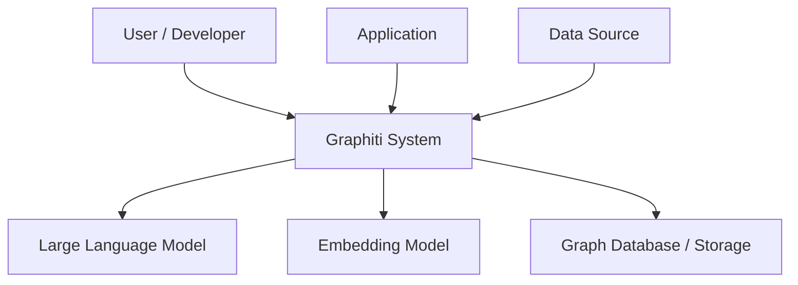
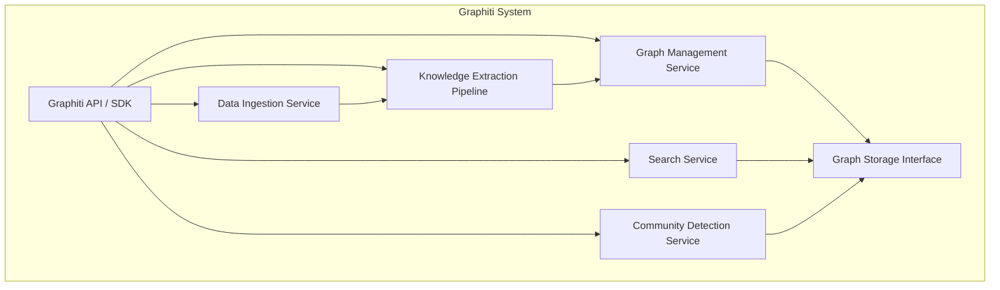
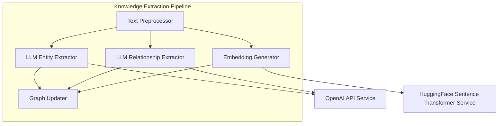
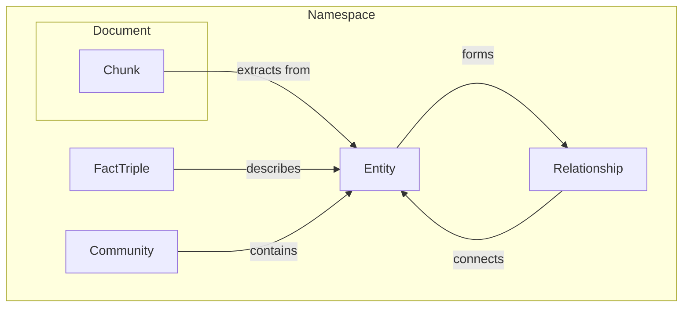
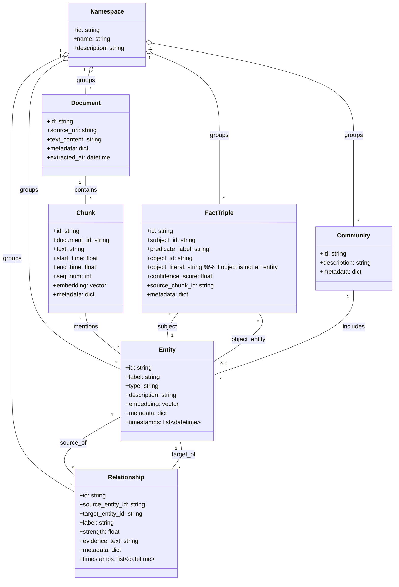

## ■概要
Graphitiは、テキストデータからナレッジグラフを自動的に構築、管理、検索するためのPythonライブラリおよびシステムです。大規模言語モデル（LLM）を活用して、テキストからエンティティ、関係性、事実を抽出し、時間的な文脈も考慮に入れた知識構造を形成します。これにより、情報の関連性の発見、高度な検索、パターン分析などができるようになります。特に、時間経過に伴う情報の変化を捉える能力に特色があります。

https://github.com/getzep/graphiti

## ■特徴
- **自動ナレッジグラフ構築:** LLMを利用して、テキストからエンティティ、関係性、ファクトを自動的に抽出します。
- **時間的認識:** データに時間情報を付与し、時間経過に伴う情報の変化や関連性を追跡できます。
- **LLM連携:** エンティティ抽出、関係性推論、質問応答などのタスクにLLMを統合的に利用します。
- **高度な検索機能:** キーワード検索、セマンティック検索、ファセット検索など、グラフに対する多様な検索方法を提供します。
- **コミュニティ検出:** グラフ内の密接に関連するエンティティのグループ（コミュニティ）を自動的に識別します。
- **拡張性:** カスタムエンティティタイプを定義したり、独自のデータ処理ロジックを組み込んだりすることが可能です。
- **永続化と管理:** 構築したナレッジグラフを永続化し、CRUD操作を通じて管理できます。
- **LangGraph連携:** LangGraphのエージェントのツールとして統合し、より複雑な推論タスクにナレッジグラフを活用できます。

## ■構造

Graphitiの構造をC4 modelを用いて段階的に説明します。

### ●システムコンテキスト図



| 要素名                 | 説明                                                                 |
| ---------------------- | -------------------------------------------------------------------- |
| User / Developer       | Graphitiを利用してナレッジグラフを構築・分析する人間。                   |
| Application            | Graphitiの機能を組み込んで利用する外部アプリケーション。                 |
| Graphiti System        | 本調査対象。ナレッジグラフの構築、管理、検索機能を提供するシステム。     |
| Large Language Model (LLM)   | エンティティ抽出、関係性抽出などの自然言語処理タスクを実行する外部AIモデル。 |
| Embedding Model        | テキストやエンティティのベクトル表現（埋め込み）を生成する外部モデル。     |
| Data Source            | ナレッジグラフ構築の元となるテキストデータを提供する外部ソース。         |
| Graph Database / Storage | 構築されたナレッジグラフを永続的に格納する外部または内部のストレージ。     |

### ●コンテナ図



| 要素名                          | 説明                                                                                   |
| ------------------------------- | -------------------------------------------------------------------------------------- |
| Graphiti API / SDK              | ユーザーや外部アプリケーションがGraphitiの機能を利用するためのインターフェース。             |
| Data Ingestion Service          | 外部データソースからテキストデータを取り込み、前処理を行うサービス。                         |
| Knowledge Extraction Pipeline   | テキストデータからエンティティ、関係性、ファクトなどを抽出する一連の処理パイプライン。         |
| Graph Management Service        | ナレッジグラフの作成、更新、削除（CRUD操作）など、グラフ全体のライフサイクルを管理するサービス。 |
| Search Service                  | ナレッジグラフに対するキーワード検索、セマンティック検索などの検索機能を提供するサービス。     |
| Community Detection Service     | グラフ内のコミュニティ（密接に関連するエンティティ群）を検出するサービス。                 |
| Graph Storage Interface         | 内部データ構造や外部グラフデータベースとの間でグラフデータを永続化・読み出しするためのインターフェース。 |

### ●コンポーネント図
Knowledge Extraction Pipelineコンテナ内部の主要なコンポーネントと、その具体例を示します。



| 要素名                                   | 説明                                                                                                |
| ---------------------------------------- | --------------------------------------------------------------------------------------------------- |
| Text Preprocessor                        | 入力テキストをチャンクに分割したり、不要な文字を除去したりする前処理コンポーネント。具体例: テキストクリーナー、セグメンター。 |
| LLM Entity Extractor                     | 大規模言語モデルを利用してテキストからエンティティ（例: 人物、組織、場所）を抽出するコンポーネント。具体例: OpenAI GPTを利用したエンティティ抽出モジュール。 |
| LLM Relationship Extractor               | 大規模言語モデルを利用してエンティティ間の関係性を抽出するコンポーネント。具体例: OpenAI GPTを利用した関係性抽出モジュール。 |
| Embedding Generator                      | テキストチャンクやエンティティの埋め込みベクトルを生成するコンポーネント。具体例: Sentence Transformersを利用した埋め込み生成モジュール。 |
| Graph Updater                            | 抽出されたエンティティ、関係性、埋め込みをナレッジグラフに追加・更新するコンポーネント。                 |
| OpenAI API Service                       | LLM Entity ExtractorやLLM Relationship Extractorが利用する外部のOpenAI APIサービス。                     |
| HuggingFace Sentence Transformer Service | Embedding Generatorが利用する外部またはローカルのSentence Transformerモデルサービス。                      |

## ■情報
Graphitiが内部で扱う主要なデータを、概念モデルと情報モデルで説明します。

### ●概念モデル



| 要素名         | 説明                                                                 |
| -------------- | -------------------------------------------------------------------- |
| Namespace      | グラフデータを論理的に分離・管理するためのスコープ。                     |
| Document       | 分析対象となる元のテキストデータ全体。                                   |
| Chunk          | Documentを処理しやすい単位に分割したもの。時間情報を持つこともあります。 |
| Entity         | テキストから抽出された主要な概念や対象（例: 人物、組織、トピック）。     |
| Relationship   | 2つ以上のエンティティ間の関連性。                                      |
| FactTriple     | 主語-述語-目的語の形式で表現される具体的な事実。                       |
| Community      | ナレッジグラフ内で密接に関連しあうエンティティの集まり。                 |

### ●情報モデル



| クラス名       | 説明                                                                                                |
| -------------- | --------------------------------------------------------------------------------------------------- |
| Namespace      | グラフデータの分離スコープ。ID、名前、説明を持ちます。                                                  |
| Document       | 元データ。ID、ソースURI、テキスト内容、メタデータ、抽出日時を持ちます。                                 |
| Chunk          | ドキュメントの分割単位。ID、ドキュメントID、テキスト、開始/終了時間、シーケンス番号、埋め込み、メタデータを持ちます。 |
| Entity         | 抽出されたエンティティ。ID、ラベル（名前）、タイプ、説明、埋め込み、メタデータ、出現タイムスタンプリストを持ちます。 |
| Relationship   | エンティティ間の関係。ID、ソース/ターゲットエンティティID、ラベル、強度、証拠テキスト、メタデータ、タイムスタンプリストを持ちます。 |
| FactTriple     | 主語-述語-目的語形式の事実。ID、主語ID、述語ラベル、目的語IDまたはリテラル値、信頼度、ソースチャンクID、メタデータを持ちます。 |
| Community      | エンティティのグループ。ID、説明、メタデータを持ちます。関連エンティティのリストを内部的に管理します。         |

## ■構築方法
Graphitiを利用するための環境構築と初期設定について説明します。

### ●前提条件
- Python (3.8以上推奨) 環境がセットアップされていること。
- 必要に応じて、OpenAI APIキーなどのLLMプロバイダーの認証情報。
- Sentence Transformersなどの埋め込みモデルを利用する場合は、そのインストールやアクセス設定。

### ●インストール
- GraphitiはPyPIを通じてインストールできます。
  ```bash
  pip install graphiti-core
  ```

### ●設定
- **LLMプロバイダーの設定:**
    - OpenAIを利用する場合、環境変数 `OPENAI_API_KEY` を設定します。
    - 他のLLMプロバイダーを利用する場合は、Graphitiの初期化時に対応する設定を行います。
- **埋め込みモデルの設定:**
    - `Graph` オブジェクトを初期化する際に、使用する埋め込みモデル名を指定できます（例: `embedding_model_name="all-MiniLM-L6-v2"`）。
- **グラフの初期化:**
    - Graphitiを利用する際には、まず `Graph` オブジェクトをインスタンス化します。
      ```python
      from graphiti import Graph
      graph = Graph(graph_name="my_knowledge_graph", llm_provider="openai", embedding_model_name="all-MiniLM-L6-v2")
      ```

### ●グラフバックエンド
- Graphitiは、デフォルトではグラフデータをメモリ上に保持しますが、ファイルへの保存・読み込み機能を提供しています。
    - `graph.save("path/to/graphfile.graphiti")`
    - `Graph.load("path/to/graphfile.graphiti")`
- より大規模な永続化や、Zepエコシステムとの連携については、ZepのドキュメントやGraphitiの高度な設定を参照してください。

## ■利用方法
Graphitiの基本的な利用手順と主要な機能について説明します。

### ●グラフの初期化と設定
- 上記「構築方法」の「グラフの初期化」を参照してください。
- 必要に応じて、カスタムエンティティタイプを定義できます。
  ```python
  graph.add_custom_entity_types(["PRODUCT", "EVENT_TYPE"])
  ```

### ●データの追加とナレッジ抽出
- **ドキュメントの追加:**
  ```python
  doc_text = "Apple Inc. announced the new iPhone 15 in Cupertino. Tim Cook presented the features."
  graph.add_document(doc_id="news_article_01", text=doc_text, metadata={"source": "web"})
  ```
  ドキュメント追加時に、内部でチャンキング、エンティティ抽出、関係性抽出、埋め込み生成が行われます。
- **エピソード（時系列セグメント）の追加:** ポッドキャストのトランスクリプトなど、時間情報を持つセグメントデータに適しています。
  ```python
  from graphiti.domain import Segment
  segments = [
      Segment(text="First part of the discussion.", start_time=0.0, end_time=30.5),
      Segment(text="Second part about AI.", start_time=30.5, end_time=60.0),
  ]
  graph.add_episode(episode_id="podcast_ep_123", segments=segments)
  ```
- **ファクトトリプルの直接追加:** 明示的な知識（主語-述語-目的語）を追加します。
  ```python
  graph.add_fact_triples([
      ("iPhone 15", "announced_by", "Apple Inc."),
      ("Tim Cook", "is_ceo_of", "Apple Inc.")
  ])
  ```

### ●データの検索と取得
- **エンティティ検索:**
  ```python
  # キーワード検索
  entities_by_keyword = graph.search_entities(query="Apple", search_type="keyword")
  # セマンティック検索
  entities_by_semantic = graph.search_entities(query="fruit company", search_type="semantic")
  ```
- **関係性検索:**
  ```python
  relationships = graph.search_relationships(entity_id="<entity_id_of_Apple_Inc>")
  ```
- **テキストコンテンツ検索:** 埋め込みを利用して関連性の高いテキストチャンクを検索します。
  ```python
  relevant_chunks = graph.search_text(query="new product features")
  ```
- **エンティティ/関係性の取得:**
  ```python
  all_entities = graph.get_entities()
  specific_entity = graph.get_entity(entity_id="<entity_id>")
  ```

### ●コミュニティ検出
- グラフ内の密接に関連するエンティティ群を発見します。
  ```python
  communities = graph.get_communities()
  for community in communities:
      print(f"Community ID: {community.id}, Entities: {[e.label for e in community.entities]}")
  ```

### ●CRUD操作
- エンティティや関係性を個別に取得、更新、削除する機能が提供されています（詳細はAPIドキュメント参照）。

### ●LangGraphとの連携
- GraphitiをLangGraphエージェントのツールとして統合し、ナレッジグラフに基づいた複雑な推論や応答生成が可能です。
  ```python
  # 利用イメージ
  tool = GraphitiTool(graph=graph)
  agent = create_agent(tools=[tool], llm=...)
  agent.invoke({"input": "Tell me about Apple's recent announcements."})
  ```

### ●データの永続化
- 構築したグラフはファイルに保存し、後で読み込むことができます。
  ```python
  graph.save("my_knowledge_graph.graphiti")
  loaded_graph = Graph.load("my_knowledge_graph.graphiti")
  ```

## ■運用
Graphitiシステムを安定して運用するための考慮事項です。

### ●データ管理
- **バックアップとリストア:**
    - `graph.save()` を利用して定期的にグラフデータをファイルにバックアップしてください。
    - 必要に応じて、バックアップファイルから `Graph.load()` でリストアします。
- **データ量の管理:**
    - 大量のデータを扱う場合、メモリ使用量やファイルサイズに注意してください。
    - 不要になったグラフや名前空間は適切に削除 (`graph.clear_graph()`, `graph.delete_namespace()`) してください。

### ●パフォーマンス
- **抽出処理時間:**
    - エンティティや関係性の抽出はLLMへのAPIコールを伴うため、データ量に応じて時間がかかります。バッチ処理や非同期処理の検討が必要になる場合があります。
    - 埋め込み生成も計算リソースを必要とします。
- **検索速度:**
    - グラフの規模が大きくなると検索パフォーマンスに影響が出ることがあります。適切なインデックス（Graphiti内部または利用するバックエンドDBによる）が重要です。
    - セマンティック検索は計算コストが高めになることがあります。

### ●コスト管理
- **LLM API利用料:**
    - OpenAIなどの商用LLM APIを利用する場合、呼び出し回数やトークン数に応じたコストが発生します。利用状況を監視し、予算内で運用する工夫が必要です。
- **埋め込みモデル利用料:**
    - クラウドベースの埋め込みモデルサービスを利用する場合も同様にコスト管理が必要です。

### ●エラーハンドリングと監視
- **外部API連携:** LLMや埋め込みモデルAPIの呼び出しエラー（ネットワークエラー、レート制限など）に対するリトライ処理やフォールバック処理を検討してください。
- **リソース監視:** システムのCPU、メモリ使用量、ディスクI/Oなどを監視し、必要に応じてリソースを調整してください。
- **ログ:** Graphitiや関連ライブラリが出力するログを収集・分析し、問題発生時の原因究明に役立ててください。

### ●セキュリティ
- **APIキー管理:** LLMプロバイダーのAPIキーなどの認証情報は安全に管理してください（環境変数、シークレット管理サービスなど）。
- **データプライバシー:** 入力データに機密情報が含まれる場合は、取り扱いに十分注意し、適切なアクセス制御やマスキング処理を検討してください。

### ●バージョニングと互換性
- Graphitiライブラリのバージョンアップ時には、変更点や互換性を確認してください。
- 保存したグラフデータのフォーマットが将来のバージョンでも読み込めるか、注意が必要です。

## ■参考リンク

- **概要**
    - [Graphiti - Overview | Zep Help Center](https://help.getzep.com/graphiti/graphiti/overview)
    - [DeepWiki - getzep/graphiti - 1-overview](https://deepwiki.com/getzep/graphiti/1-overview)
- **構造**
    - [DeepWiki - getzep/graphiti - 4-system-architecture](https://deepwiki.com/getzep/graphiti/4-system-architecture)
    - [DeepWiki - getzep/graphiti - 4.1-graphiti-core](https://deepwiki.com/getzep/graphiti/4.1-graphiti-core)
    - [DeepWiki - getzep/graphiti - 4.2-search-system](https://deepwiki.com/getzep/graphiti/4.2-search-system)
    - [DeepWiki - getzep/graphiti - 4.3-llm-integration](https://deepwiki.com/getzep/graphiti/4.3-llm-integration)
    - [DeepWiki - getzep/graphiti - 4.4-embedding-and-reranking](https://deepwiki.com/getzep/graphiti/4.4-embedding-and-reranking)
- **情報**
    - [DeepWiki - getzep/graphiti - 3-core-concepts](https://deepwiki.com/getzep/graphiti/3-core-concepts)
    - [DeepWiki - getzep/graphiti - 3.1-knowledge-graph-model](https://deepwiki.com/getzep/graphiti/3.1-knowledge-graph-model)
    - [Graphiti - Custom Entity Types | Zep Help Center](https://help.getzep.com/graphiti/graphiti/custom-entity-types)
    - [Graphiti - Adding Fact Triples | Zep Help Center](https://help.getzep.com/graphiti/graphiti/adding-fact-triples)
- **構築方法**
    - [Graphiti - Installation | Zep Help Center](https://help.getzep.com/graphiti/graphiti/installation)
    - [DeepWiki - getzep/graphiti - 2-getting-started](https://deepwiki.com/getzep/graphiti/2-getting-started)
    - [DeepWiki - getzep/graphiti - 5-deployment-options](https://deepwiki.com/getzep/graphiti/5-deployment-options)
- **利用方法**
    - [Graphiti - Quick Start | Zep Help Center](https://help.getzep.com/graphiti/graphiti/quick-start)
    - [Graphiti - Adding Episodes | Zep Help Center](https://help.getzep.com/graphiti/graphiti/adding-episodes)
    - [Graphiti - Searching | Zep Help Center](https://help.getzep.com/graphiti/graphiti/searching)
    - [Graphiti - Communities | Zep Help Center](https://help.getzep.com/graphiti/graphiti/communities)
    - [Graphiti - CRUD Operations | Zep Help Center](https://help.getzep.com/graphiti/graphiti/crud-operations)
    - [Graphiti - LangGraph Agent | Zep Help Center](https://help.getzep.com/graphiti/graphiti/lang-graph-agent)
    - [DeepWiki - getzep/graphiti - 6-advanced-usage](https://deepwiki.com/getzep/graphiti/6-advanced-usage)
- **運用**
    - [Graphiti - Graph Namespacing | Zep Help Center](https://help.getzep.com/graphiti/graphiti/graph-namespacing)


この記事が少しでも参考になった、あるいは改善点などがあれば、ぜひリアクションやコメント、SNSでのシェアをいただけると励みになります！
