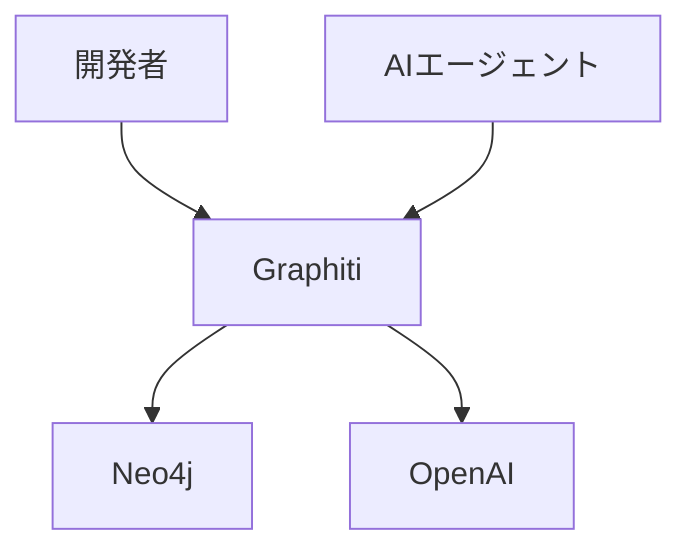
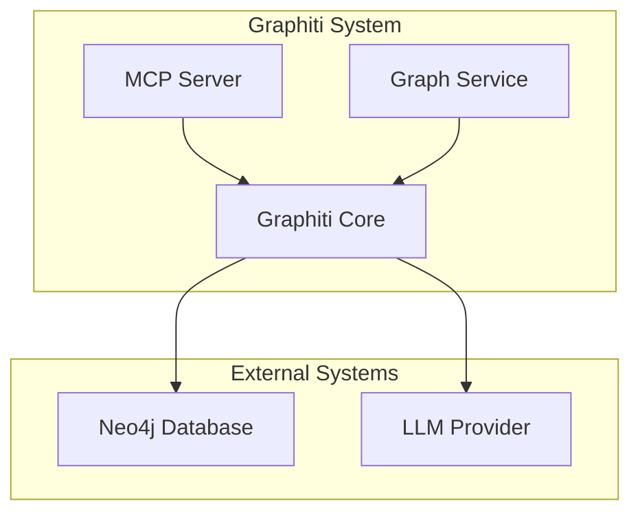
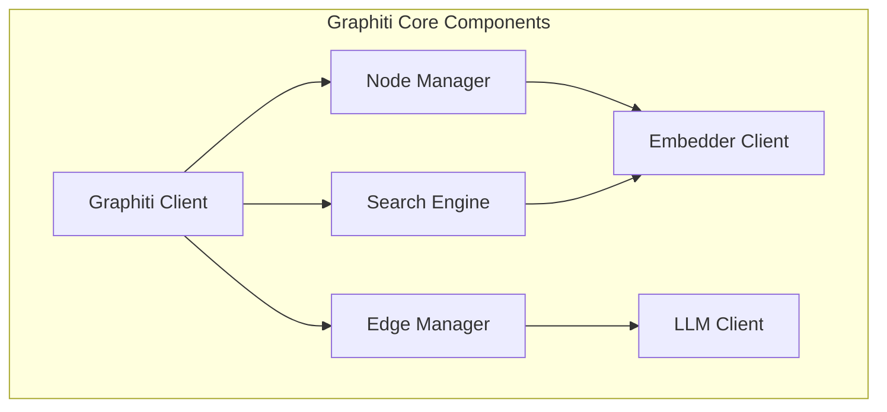
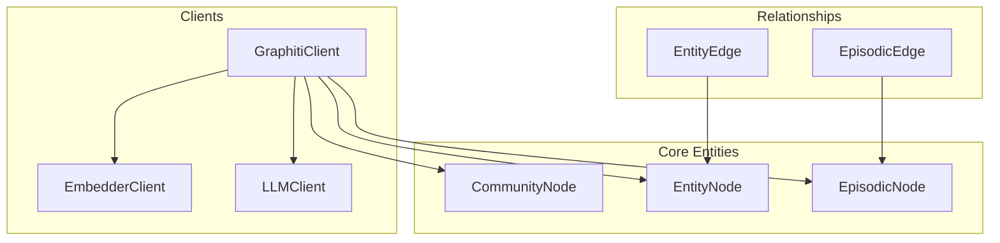
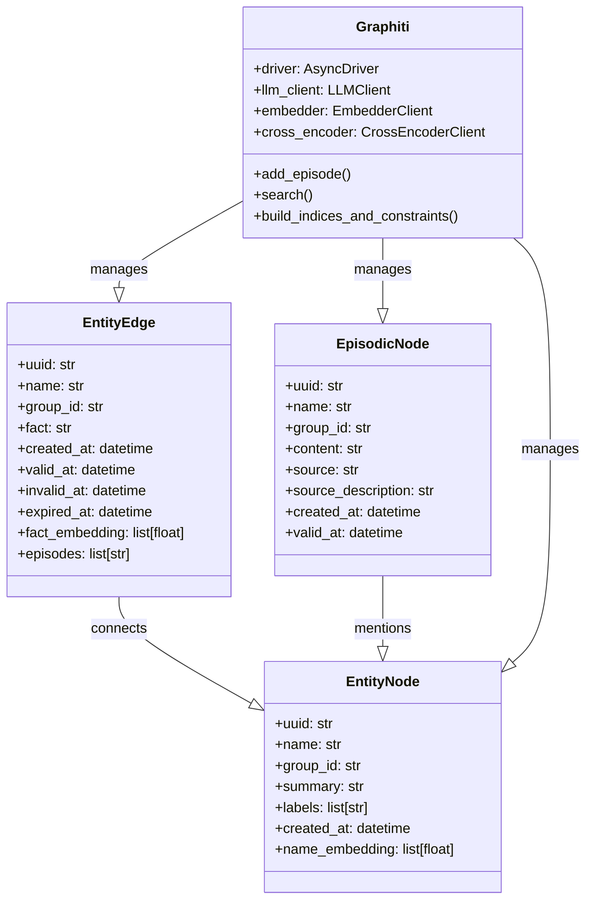

## 概要

Graphitiは、AIエージェント向けの時間認識型ナレッジグラフを構築し、クエリを実行するためのフレームワークです。

動的な環境で動作するAIエージェント専用に設計されています。ユーザーとの対話、構造化・非構造化された企業データ、外部情報源からの情報を継続的に統合します。これにより、一貫性を持ち、クエリ可能なナレッジグラフを構築します。

https://github.com/getzep/graphiti

## 特徴

- **リアルタイム増分更新**:
  - バッチ処理での再計算をせず、新しいデータエピソードを即時に統合
- **双時間データモデル**:
  - イベントの発生時刻とデータ取り込み時刻を個別に追跡し、正確な時点でのクエリを実行
- **効率的なハイブリッド検索**:
  - セマンティック埋め込み、キーワード検索、グラフトラバーサルを組み合わせ、低遅延のクエリを実現
- **カスタムエンティティ定義**:
  - Pydanticモデルを使用して、柔軟なオントロジー作成と開発者によるエンティティ定義をサポート
- **スケーラビリティ**:
  - 並列処理により大規模なデータセットを効率的に管理し、エンタープライズ環境へ適用可能

## システム構造

### システムコンテキスト図

| 要素名 | 説明 |
| :--- | :--- |
| 開発者 | Graphitiを使用してナレッジグラフアプリケーションを構築する開発者 |
| AIエージェント | Graphitiのナレッジグラフ機能を利用するAIエージェント |
| Graphiti | 時間認識型ナレッジグラフフレームワーク |
| Neo4j | グラフデータベースとして使用する外部システム |
| OpenAI | LLM推論と埋め込み生成に使用する外部システム |

### コンテナ図

| 要素名 | 説明 |
| :--- | :--- |
| MCP Server | Model Context Protocol（MCP）サーバーの実装。AIアシスタントとの統合を提供 |
| Graph Service | FastAPIを基盤としたREST APIサービス |
| Graphiti Core | 中核となるナレッジグラフ機能を提供するメインライブラリ |
| Neo4j Database | グラフデータを永続的に保管するストレージ |
| LLM Provider | 自然言語処理タスクを実行する言語モデルプロバイダー |

### コンポーネント図

| 要素名 | 説明 |
| :--- | :--- |
| Graphiti Client | メインクライアントクラス。グラフ操作のための統合インターフェースを提供 |
| Node Manager | `EntityNode`、`EpisodicNode`、`CommunityNode`の管理 |
| Edge Manager | `EntityEdge`、`EpisodicEdge`の管理と関係性の抽出 |
| Search Engine | ハイブリッド検索機能の提供 |
| Embedder Client | テキストの埋め込みベクトル生成 |
| LLM Client | 自然言語処理タスクの実行 |

## 情報モデル

### 概念モデル

### データモデル

## 構築方法

### 前提条件
- Python 3.10以上のインストール
- Neo4j 5.26以上の準備
- OpenAI APIキーの取得

### インストール
- コアライブラリのインストール: `pip install graphiti-core`
- 追加プロバイダーのインストール（任意）: `pip install graphiti-core[anthropic,groq,google-genai]`

### 初期設定
1.  Neo4jデータベースへの接続を設定します。
2.  環境変数 `OPENAI_API_KEY` を設定します。
3.  Graphitiクライアントを初期化します。
4.  `build_indices_and_constraints()` を実行して、データベースのインデックスを構築します。

## 利用方法

### エピソードの追加
`add_episode()` メソッドを使用して、テキスト、JSON、メッセージ形式のデータを追加します。`group_id` パラメータでデータを論理的にグループ化できます。

### 検索機能
- `search_memory_nodes()`: エンティティノードを検索します。
- `search_memory_facts()`: 関係性（エッジ）を検索します。
- **ハイブリッド検索**: セマンティック検索、キーワード検索、グラフベース検索を組み合わせて実行します。

### MCP統合
MCPサーバーを使用して、Claude DesktopやCursor IDEと統合します。接続にはSSEまたはstdioトランスポートを使用します。

## 運用方法

### Dockerによる展開
Docker Composeを使用して、MCPサーバーとNeo4jを展開します。設定は環境変数で管理します。

### ヘルスモニタリング
Graph Serviceが提供する `/healthcheck` エンドポイントで、システムの稼働状態を監視します。デバッグ情報が必要な場合は、ログレベルを設定して取得します。

### バックグラウンド処理
エピソードの処理には、非同期のキューシステムを使用します。データは `group_id` ごとに専用のワーカータスクで順次処理します。

## 補足

Graphitiは、リアルタイムなデータ更新と時間的コンテキストの管理に優れています。従来のGraphRAGアプローチと比較して、動的なデータ管理に特化している点が特徴です。MCPサーバーとGraph Serviceという2つの展開オプションがあり、様々な統合シナリオに対応します。

## ■参考リンク

- **概要**
    - [Graphiti - Overview | Zep Help Center](https://help.getzep.com/graphiti/graphiti/overview)
    - [DeepWiki - getzep/graphiti - 1-overview](https://deepwiki.com/getzep/graphiti/1-overview)
    - [arxiv - Zep: A Temporal Knowledge Graph Architecture for Agent Memory](https://arxiv.org/abs/2501.13956)
- **構造**
    - [DeepWiki - getzep/graphiti - 4-system-architecture](https://deepwiki.com/getzep/graphiti/4-system-architecture)
    - [DeepWiki - getzep/graphiti - 4.1-graphiti-core](https://deepwiki.com/getzep/graphiti/4.1-graphiti-core)
    - [DeepWiki - getzep/graphiti - 4.2-search-system](https://deepwiki.com/getzep/graphiti/4.2-search-system)
    - [DeepWiki - getzep/graphiti - 4.3-llm-integration](https://deepwiki.com/getzep/graphiti/4.3-llm-integration)
    - [DeepWiki - getzep/graphiti - 4.4-embedding-and-reranking](https://deepwiki.com/getzep/graphiti/4.4-embedding-and-reranking)
- **情報**
    - [DeepWiki - getzep/graphiti - 3-core-concepts](https://deepwiki.com/getzep/graphiti/3-core-concepts)
    - [DeepWiki - getzep/graphiti - 3.1-knowledge-graph-model](https://deepwiki.com/getzep/graphiti/3.1-knowledge-graph-model)
    - [Graphiti - Custom Entity Types | Zep Help Center](https://help.getzep.com/graphiti/graphiti/custom-entity-types)
    - [Graphiti - Adding Fact Triples | Zep Help Center](https://help.getzep.com/graphiti/graphiti/adding-fact-triples)
- **構築方法**
    - [Graphiti - Installation | Zep Help Center](https://help.getzep.com/graphiti/graphiti/installation)
    - [DeepWiki - getzep/graphiti - 2-getting-started](https://deepwiki.com/getzep/graphiti/2-getting-started)
    - [DeepWiki - getzep/graphiti - 5-deployment-options](https://deepwiki.com/getzep/graphiti/5-deployment-options)
- **利用方法**
    - [Graphiti - Quick Start | Zep Help Center](https://help.getzep.com/graphiti/graphiti/quick-start)
    - [Graphiti - Adding Episodes | Zep Help Center](https://help.getzep.com/graphiti/graphiti/adding-episodes)
    - [Graphiti - Searching | Zep Help Center](https://help.getzep.com/graphiti/graphiti/searching)
    - [Graphiti - Communities | Zep Help Center](https://help.getzep.com/graphiti/graphiti/communities)
    - [Graphiti - CRUD Operations | Zep Help Center](https://help.getzep.com/graphiti/graphiti/crud-operations)
    - [Graphiti - LangGraph Agent | Zep Help Center](https://help.getzep.com/graphiti/graphiti/lang-graph-agent)
    - [DeepWiki - getzep/graphiti - 6-advanced-usage](https://deepwiki.com/getzep/graphiti/6-advanced-usage)
- **運用**
    - [Graphiti - Graph Namespacing | Zep Help Center](https://help.getzep.com/graphiti/graphiti/graph-namespacing)

この記事が少しでも参考になった、あるいは改善点などがあれば、ぜひリアクションやコメント、SNSでのシェアをいただけると励みになります！
