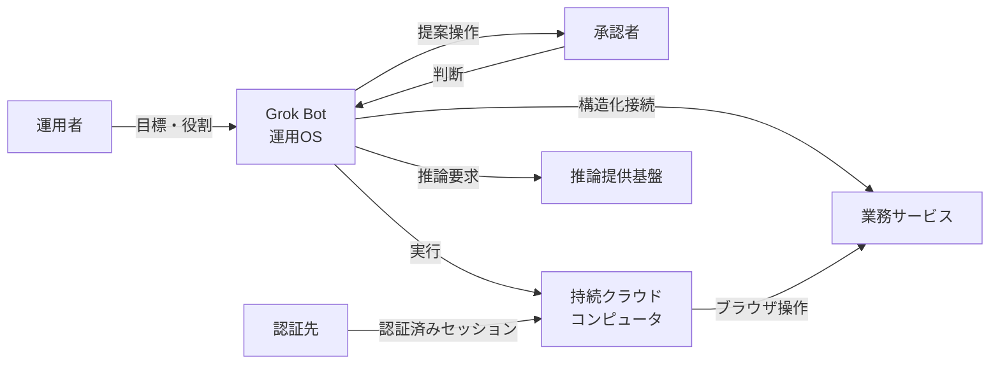
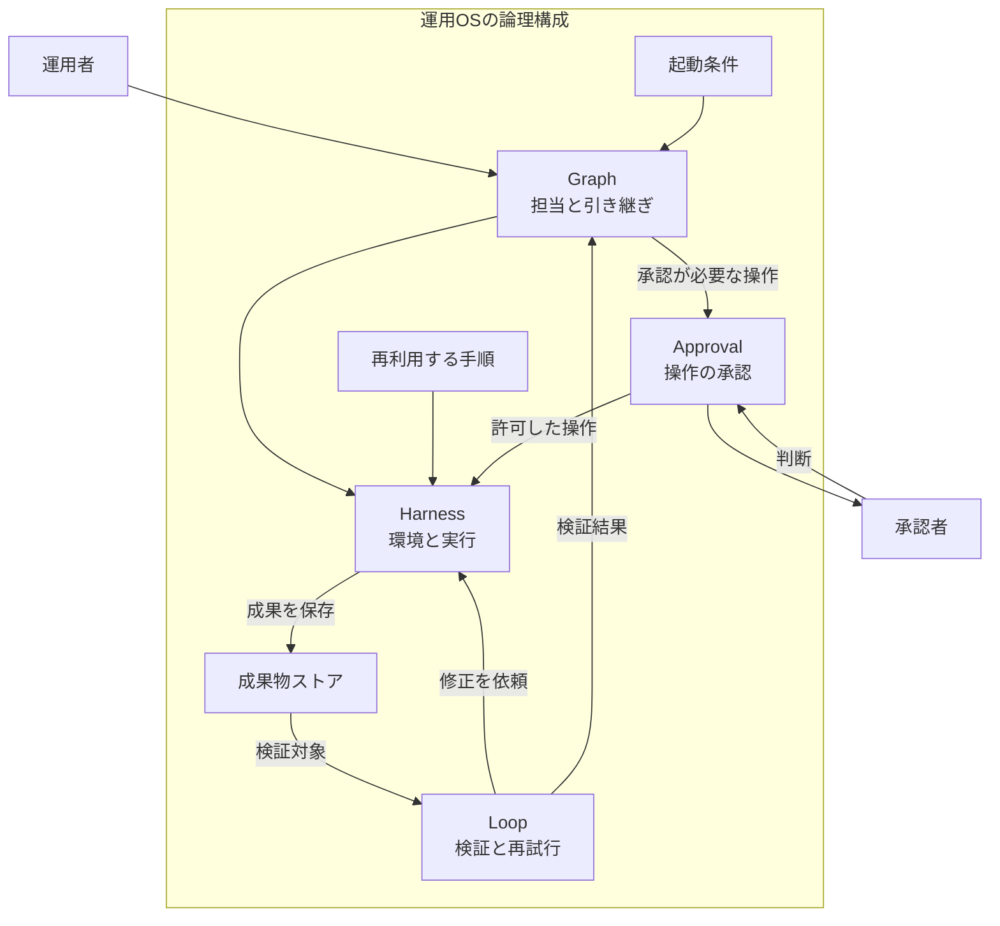
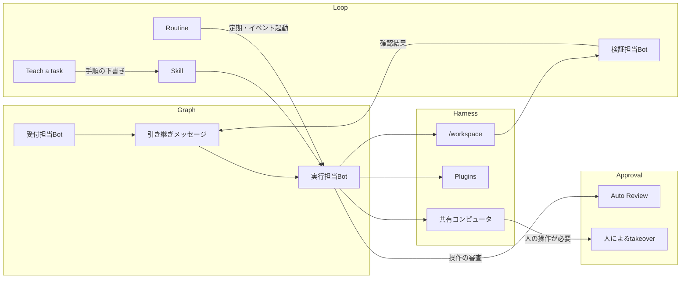
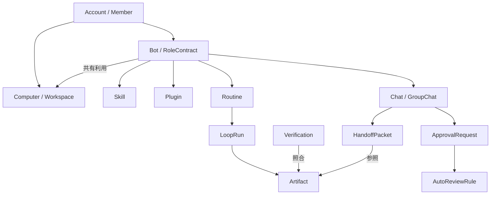
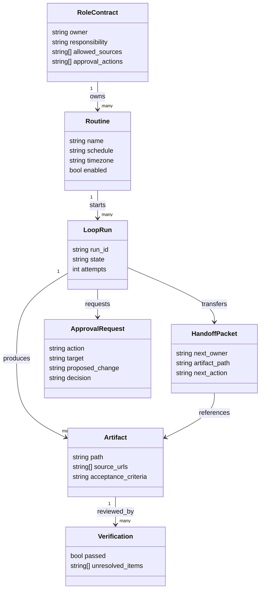

Grok Botに繰り返し仕事を任せるには、役割、実行環境、成果物の検証、引き継ぎ先を決める必要があります。本記事では、0xwhrrariが提案する「運用OS」の考え方を、構造図とデータモデル、実際に渡せる指示例で説明します。定期調査やコンテンツ制作など、複数の工程をBotに任せたい人を対象にしています。

扱うのは第三者による運用方法論と、その実行先となるGrok Botの機能です。製品情報の確認日は2026年9月10日です。


*この記事の全体像。以下、順に解説します。*

## Grok Botの運用OSとは

Grok Botの運用OSは、AIに仕事を任せる仕組みを、**Harness・Loop・Graphと、その外側に置くApprovalの境界**で整理する考え方です。0xwhrrariは[2026年9月3日の投稿](https://x.com/0xwhrrari/status/2095497109524934750)で、モデルの推論と、それを継続的な仕事にする周辺の設計を説明しています。

ここでいうOSは、役割と仕事の進め方を設計するための比喩です。Grok Botという製品の上に、次の責務を割り当てます。

| 要素 | 決めること | 週次レポートなら |
|---|---|---|
| Harness | 使う道具、接続先、作業場所 | 指定ダッシュボードと保存フォルダ |
| Loop | 検証、再試行、定期実行 | 件数照合、再取得の上限、月曜朝の実行 |
| Graph | 担当、協調、引き継ぎ | 収集担当から検証担当、執筆担当へ |
| Approval | 人に判断を戻す操作 | 社外送信や公開前の確認 |

Grok Botは、名前と役割を持つ継続的なエージェントとして仕事を受け取り、クラウドのコンピュータや接続したサービスを使います。成果の置き場所を文書や表、レビュー待ちの下書きとして指定すると、次の工程が結果を受け取れます。[製品発表](https://x.ai/news/introducing-grok-bot)と[公式設計記事](https://x.ai/news/designing-grok-bot)は、この継続する担当者を中心にUIを組み立てています。

たとえば週次調査なら、「最近の動きを調べる」に加えて、対象期間、参照先、保存形式、確認条件を書きます。検証担当は保存された表と根拠を読み、執筆担当は確認済みの項目から本文を作ります。この受け渡しまでを含めて仕事を設計するのが運用OSです。

### 関連する製品と設計の位置づけ

| 対象 | 主な役割 |
|---|---|
| Grok Bot | 継続する担当者、会話、共有コンピュータ、Skill、Routine |
| Grok 4.6 | 投稿が推論エンジンとして扱うモデル。モデルAPIも提供 |
| Grok Build | 開発者の作業ディレクトリで使うコーディングCLI |
| Cursor Cloud Agents | リポジトリの実装・テスト・PR作成を担うクラウド実行先 |

公式設計の基本要素はBots、Chats、Prompts、Tools、Artifactsです。運用OSでは、それらを「環境を整える」「仕事を検証する」「担当を渡す」という責務に対応づけます。[Grok Build](https://docs.x.ai/build/overview)と[Cloud Agents](https://cursor.com/docs/cloud-agent)は、用途に応じた別の実行先として整理すると理解しやすくなります。

## 特徴

この方法論の特徴は、仕事の依頼と同時に、完了を確認する方法まで設計する点です。

- **役割を継続させる**：毎回の依頼に共通する責任をBotのdescriptionに置きます。
- **成果物を中心に引き継ぐ**：ファイルの場所、検証状態、次の担当を渡します。
- **成功した手順を再利用する**：一度の仕事を安定させてから、SkillとRoutineに展開します。
- **検証と実行を分ける**：生成担当の説明に加えて、別の担当が根拠と成果を確認します。
- **再試行を有限にする**：失敗時の回数、停止条件、報告内容を決めます。
- **承認点を明確にする**：準備済みの成果と、実行したい変更を人に提示します。

たとえば「収集に失敗したら前週の数値を使って埋める」経路を許すと、表の完成と情報の鮮度が一致しなくなります。「取得できなかった項目を空欄と理由付きで返す」と決めれば、失敗を含めて検証できる成果になります。

## 構造

以下は、提案されている責務をC4の粒度で整理した**論理モデル**です。Grok Bot内部のサービス配置や、実装リポジトリの構成を示す図ではありません。

### システムコンテキスト図

運用者が目標を渡し、Botが実ツール上の仕事を進め、承認者が境界上の操作を判断します。一人で使う場合は、運用者と承認者を同じ人が担います。



| 要素 | 運用上の責任 |
|---|---|
| 運用者 | 目的、入力、受け入れ条件を定義 |
| 承認者 | 提示された変更内容と影響を確認 |
| コンピュータ・業務サービス | ファイルや業務データの実際の保存先 |
| 認証先 | 利用するアカウントの認証 |
| 推論提供基盤 | 次の行動や生成内容の推論 |

### コンテナ図

Graphが担当を決め、Harnessが実行環境を提供し、Loopが成果の検証と再実行を管理します。Approvalを独立して描くことで、完了した準備作業と、人の判断を待つ操作を区別できます。



| 責務 | 設計するときの問い |
|---|---|
| Harness | どのアカウント・道具・ファイルを使えるか |
| Loop | 成功を何で確認し、何回まで修正するか |
| Graph | 現在の担当と、次に結果を受け取る担当は誰か |
| Approval | どの具体的な操作で人へ戻すか |

### コンポーネント図

論理上の責務は、Botのプロフィール、共有コンピュータ、Skill、Routine、承認機能へ落とし込めます。図中のReviewerは運用者が置く検証担当です。Auto Reviewはアクションの安全性を評価する製品機能として別に扱います。



| 構成要素 | 設定・保存する内容 |
|---|---|
| Bot・引き継ぎ | 役割、今回の担当、成果物の場所 |
| コンピュータ・Plugins | ブラウザ操作と構造化されたサービス接続 |
| Skill・Routine | 作業手順と、それを起動する条件 |
| 検証担当 | 受け入れ条件との照合結果 |
| Auto Review・takeover | アクション審査と、人が直接操作する経路 |

### 記事レイヤと公式着地点

運用OSの用語を、Grok Botの画面上で設定する対象に対応づけます。ここでの対応は、0xwhrrariの方法論を運用へ落とし込むための解釈です。

| 方法論の責務 | 製品上の着地点 | 設定例 |
|---|---|---|
| Harness | コンピュータ、Plugins、成果物 | 利用する業務サービスと保存先 |
| Loop | Skills、Routines、Test run | 入力、検証条件、失敗時の停止 |
| Graph | Bot、グループ、非同期メッセージ | 各工程の担当と次の担当 |
| Approval | Auto-review規則、承認カード | 外部送信や本番更新の確認 |

製品上の操作は[Work with Grok Bot](https://cursor.com/docs/grok-bot/work)、承認機能は[Security](https://cursor.com/docs/grok-bot/security)に対応します。

## データ

運用で追うデータは、担当者、手順、実行記録、成果物、判断に分けられます。以下の名前とフィールドは、本記事で説明するための概念モデルです。Grok Bot製品の公開APIや、そのレスポンス型を表してはいません。

### 概念モデル

個人利用では、アカウントと利用者をほぼ同じ単位で考えられます。組織利用ではメンバーごとにコンピュータを持ち、そのメンバーのBotが共有します。組織の管理規則は、各メンバーの実行環境へ適用する層として扱います。[Teams and Enterprise](https://cursor.com/docs/grok-bot/teams)



| データのまとまり | 含まれる概念 | 役割 |
|---|---|---|
| 利用主体 | Account、Member | 利用資格と環境の所有者 |
| 実行環境 | Computer、Workspace、Plugin | 作業場所と接続先 |
| 担当者 | Bot、RoleContract | 継続する役割と責任 |
| 反復実行 | Skill、Routine、LoopRun | 手順、起動条件、実行履歴 |
| 成果と確認 | Artifact、Verification | 出力と確認結果 |
| 協調 | Chat、GroupChat、HandoffPacket | 会話と担当の受け渡し |
| 判断 | ApprovalRequest、AutoReviewRule | 提案された操作と適用規則 |

### 情報モデル

自前で実行台帳を用意するなら、成果物の場所と確認状態を中心にします。会話を保存するだけでは、「誰が次を担当するか」「どこまで確認済みか」を集計しづらいためです。



| フィールド | 記録する理由 |
|---|---|
| `allowed_sources` | 今回の調査に使ってよい情報源の範囲を固定 |
| `attempts` | 同じ失敗の無制限な繰り返しを検出 |
| `acceptance_criteria` | 完了と判定する条件を保存 |
| `unresolved_items` | 未確認事項を次の担当へ残す |
| `next_owner` | 引き継ぎ後の責任の所在を明示 |
| `target`、`proposed_change` | 承認時に変更先と差分を提示 |

成果物の内容を検証する`Verification`と、行動の許可を判断する`ApprovalRequest`は別の記録です。文章が正しいことと、その文章を外部へ送ってよいことを、同じ真偽値にまとめないようにします。

### 制約

製品側にはグループ参加数やRoutineの履歴保持などの上限があります。2026年9月10日の[Work](https://cursor.com/docs/grok-bot/work)では、グループは2〜6 Bot、RoutineはBotごとに最大50、実行履歴は各Routineの直近20件です。長期の傾向を見る用途では、別途必要な実行記録を残す設計が必要です。

また、説明用の型を製品APIの型として使うことはできません。実際の作成・変更は製品UIと会話から行い、自前の台帳は成果物として管理します。

## 構築方法

### 利用環境を用意する

Grok Botの導入は、[公式ダウンロード](https://cursor.com/download/bot)からアプリを入れ、Cursorアカウントでサインインするところから始まります。組織利用では既存のCursorの認証設定を確認します。[Get started](https://cursor.com/docs/grok-bot/get-started)と[Sign in](https://cursor.com/help/grok-bot/sign-in)が導入手順です。

```text
1. 公式ダウンロードでOSとCPUに合う配布物を選ぶ
2. アプリを起動し、使用するCursorアカウントでサインインする
3. 対象プランと組織の利用設定を確認する
4. Botを作り、役割と最初の成果物を指定する
```

対象プランにはCursorの有料個人プラン、Teams、対象のSuperGrokやX Premium+とのリンクなどがあります。Enterpriseは管理者や契約担当による確認が必要です。契約条件は[Plans and billing](https://cursor.com/help/grok-bot/plans)を基準にしてください。

### 最初の役割を一文で決める

最初は、入力と成果物がはっきりした仕事を選びます。次は週次の製品情報を扱うBotのdescription例です。本記事で作成した指示例であり、製品に入力して調整するためのものです。

```text
担当: 指定した公式情報源から、過去7日間の製品変更を整理する。
成果物: 変更点、公開日、出典URL、影響を記した表。
保存先: /workspace/product-watch/
継続する境界: 外部送信、公開、購買、本番設定変更は実行前に確認する。
```

続いて、一回だけの仕事を渡します。

```text
この3つの公式URLから、過去7日間の変更を表にしてください。
各行に出典と公開日を付け、日付を確認できない項目は別表に分けてください。
結果を /workspace/product-watch/first-run.md に保存してください。
取得できないURLは、理由を報告してください。
```

ここでは、取得件数よりも「どの入力をどう処理し、何を返したか」を確認します。役割を増やすのは、この一回の仕事をレビューしてからです。

### 作業場所を決める

継続利用する成果は、プロジェクトごとのフォルダにまとめます。以下は本記事の保存構成例です。

```text
/workspace/product-watch/
  instructions.md
  sources.md
  runs/
    2026-09-10/
      findings.md
      verification.md
      handoff.md
```

変化する事実は出典や業務システムで確認し、Botの記憶には継続する作業方針を残す、という分担にすると、前回の文脈を次の実行へ持ち込みやすくなります。

## 利用方法

### Skillに手順を保存する

一回の仕事をレビューできたら、入力、順序、検証、失敗時の扱いをSkillにまとめます。[Work](https://cursor.com/docs/grok-bot/work)では、Skillを再利用する手順、Routineを起動条件として扱っています。

```text
今の製品変更確認の手順を「週次製品ウォッチ」というSkillにしてください。
次を含めてください。
・使用する公式情報源
・対象期間の決め方
・出力表の列
・日付と出典の検証
・取得失敗の報告方法
・最大2回で止める再取得ルール
・公開前に確認を求める境界
```

ブラウザ操作を実演して手順の下書きを作る経路がTeach a taskです。実演から得た手順にも、確認条件と失敗時の扱いを加えてから使用します。

### Routineで起動条件を設定する

手順が安定してから、担当Botにスケジュールを持たせます。時刻に加えてタイムゾーン、保存先、情報源の欠落時の動作まで指定します。

```text
毎週月曜09:00、日本時間で「週次製品ウォッチ」を実行してください。
対象期間は実行時点から過去7日間です。
その週のフォルダへ表と確認結果を保存し、この会話へリンクを返してください。
情報源が使えない場合は取得失敗を明示してください。
外部送信や公開は行わず、確認できる成果物まで完成させてください。
```

作成・変更後はTest runを行い、入力期間、形式、根拠、承認点を確認します。Test runも実際にツールを使う実行なので、検証用の入力や保存先を用意します。

### Graphとして担当をつなぐ

収集、検証、執筆のように責務が分かれるときは、グループで共通の成果を指定します。

```text
@収集担当 公式情報源から変更点を集め、findings.md に保存してください。
@検証担当 出典、対象期間、重複を照合し、verification.md に結果を残してください。
@執筆担当 確認済みの項目から下書きを作成してください。
公開はせず、各段階の完了時に成果物パスと次の担当を明示してください。
```

次のような短い引き継ぎを成果物に添えると、全文の会話を読み返さずに再開できます。

```yaml
next_owner: 検証担当
artifact_path: /workspace/product-watch/runs/2026-09-10/findings.md
state: 収集完了
verified: 各行に出典URLを記載
unresolved: 2件の公開日が未確認
next_action: 日付と変更内容を一次情報と照合
```

このYAMLは運用上の書式例です。Bot間メッセージの公式API形式ではありません。別々の情報源の収集は並行できますが、同じファイルの更新は担当を一人にすると、上書きと重複を抑えられます。

### Approvalで判断材料を返す

承認依頼には、変更先、現在値、提案値、確認済み事項を含めます。次は本記事の依頼例です。

```text
公開前に次を提示してください。
1. 公開する下書きの場所
2. 公開先
3. 変更する内容
4. 根拠と確認結果
5. 未確認事項
確認の返答を受けるまで、公開操作を実行しないでください。
```

製品では、アクションごとの承認やAuto-review規則を使用します。Cursorの[Security](https://cursor.com/docs/grok-bot/security)では、`Ask first`と`Allow automatically`が競合した場合、`Ask first`を優先します。ログインや本人操作が必要な場面では、コンピュータをtakeoverして該当手順を完了します。

### モデルAPIから組み立てる場合

同じ責務分割を自前実装する場合は、モデル呼び出しの外側にツール実行、台帳、検証、承認を置きます。[Grok 4.6 API](https://docs.x.ai/developers/grok-4-6)の最小呼び出しは次の形です。APIキーは環境変数で用意します。

```bash
curl https://api.x.ai/v1/responses \
  -H "Content-Type: application/json" \
  -H "Authorization: Bearer $XAI_API_KEY" \
  -d '{
    "model": "grok-4.6",
    "input": "出典付きの週次変更一覧を検証する観点を挙げてください。"
  }'
```

この呼び出しはモデルへの依頼です。Grok BotのBotやRoutineを作成する操作は含みません。自前のツール実行器では、たとえば次のように、既知の操作だけを自動許可し、それ以外を確認対象にできます。

```python
def requires_approval(tool_name: str, scope: str) -> bool:
    allowed = {
        ("read_report", "product-watch"),
        ("write_draft", "product-watch"),
    }
    return (tool_name, scope) not in allowed

assert not requires_approval("read_report", "product-watch")
assert requires_approval("publish", "product-watch")
assert requires_approval("unknown_tool", "product-watch")
```

これは判定部分だけの説明用コードです。実際には実行側でも対象パスやアカウント、引数を検証し、承認した具体的な操作と結び付ける必要があります。サーバー側で実行されるツールと自前の関数実行の違いは、[Advanced tool usage](https://docs.x.ai/developers/tools/advanced-usage)で確認できます。

## 運用

### 実行状態と停止を管理する

実行中の仕事、次回の定期起動、保存した手順を、それぞれ管理対象として扱います。進行中のターンは会話から停止を指示し、繰り返し実行はRoutineをpauseします。

```text
このRoutineを一時停止してください。
進行中の作業があれば、その状態と完了済み操作を報告してください。
Skill、成果物、会話は残してください。
```

Botをサイドバーから隠す操作は、停止操作とは異なります。また、停止しても完了済みの変更は巻き戻りません。停止後に何が残っているかを確認する手順まで用意します。[Work](https://cursor.com/docs/grok-bot/work)

### 実行記録を残す

Routineの履歴に加えて、必要なら週次の運用台帳を作ります。以下は本記事で用意した記録例です。

```yaml
period: 2026-09-07/2026-09-13
routine: 週次製品ウォッチ
result: review_required
artifact: /workspace/product-watch/runs/2026-09-10/findings.md
source_failures: 1
retry_count: 2
pending_action: 公開可否の判断
```

記録には、成果物の参照、情報源の欠落、再試行、承認待ちを含めます。週ごとの比較では「実行した数」に加えて、レビュー後に使えた成果と、人に戻った理由を見ます。

EnterpriseではAudit logs、Action Recording、OpenTelemetry Exportなどの監査機能があります。管理変更の記録と、エージェントの行動記録は別の経路なので、必要な証跡に対応する機能を確認します。[Teams and Enterprise](https://cursor.com/docs/grok-bot/teams)、[OpenTelemetry Export](https://cursor.com/docs/enterprise/opentelemetry-export)

### コンピュータを復旧する

アプリとクラウドコンピュータは更新対象が分かれています。接続できない場合は、再試行やアプリの再起動から確認し、必要に応じてRecover、Update、Resetへ進みます。Resetでは未同期の変更を失う可能性があるため、状態を確認して選びます。[Computer recovery](https://cursor.com/help/grok-bot/computer-recovery)

```text
接続障害時に残す情報:
・発生時刻とタイムゾーン
・対象BotとRoutine
・直前の操作
・保存済み成果物
・Request IDまたはconversation ID
・再試行、再起動、Recoverの実施状況
```

### 接続と権限を棚卸しする

仕事を廃止するときは、Routineの停止、プラグインの接続解除、業務サイトのサインアウト、保存データの扱いを順に確認します。Botの削除だけでは、共有コンピュータ上のログイン状態やファイルを回収しきれません。

組織のネットワーク制御と、コネクタの利用制御も別です。業務サイトへの到達制限が必要なら、[Security](https://cursor.com/docs/grok-bot/security)で提供される制御範囲を確認します。

## ベストプラクティス

### 一つの仕事から段階的に広げる

次の表は、0xwhrrariの運用方法論を製品機能へ対応づけた実践順です。各段階で、次へ進める証拠を残します。

| 段階 | 行うこと | 次へ進む確認 |
|---|---|---|
| 1 | 繰り返す仕事を一つ選ぶ | 入力と出力を言える |
| 2 | Botの責任を定義する | 継続する境界が書かれている |
| 3 | 完了条件を先に決める | 第三者が成果を判定できる |
| 4 | 必要な接続先を用意する | 使用する情報源とアカウントが明確 |
| 5 | 一度実行・実演する | 操作と出力を確認できる |
| 6 | 手順をSkillにする | 別の入力でも再現できる |
| 7 | 検証担当を置く | 生成内容と根拠を独立に照合できる |
| 8 | 再試行と停止を決める | 失敗が明示される |
| 9 | 必要な担当を追加する | 分業で解消する負荷がある |
| 10 | 週次で見直す | 成果、費用、承認待ちを確認できる |

定期化した後に品質が下がったら、まずRoutineをpauseし、一回の仕事として条件を見直します。再現性を確かめた段階へ戻すことで、原因を調べる対象を小さくできます。

### 使いやすい三つのワークフロー

| 用途 | 担当の流れ | 完了させる成果 | 人の判断へ戻す点 |
|---|---|---|---|
| 夜間の情報収集 | 収集 → 照合 → 整理 → 要約 | 出典付きのレビュー待ち一覧 | 配信や公開 |
| バグの再現と修正 | 再現 → 原因分析 → 修正 → 検証 | 再現手順、ログ、修正案 | 本番変更 |
| コンテンツ制作 | 調査 → 執筆 → レビュー | 確認可能な下書き | 投稿や予約 |

各工程の担当には、受け取る入力と返す成果を指定します。「レビューしておいて」よりも、「事実の裏付けと未解決事項を一覧にし、次の担当へ渡す」と書く方が、後続の仕事を設計できます。

### 検証担当へ渡すものを絞る

検証担当へは、成果物、一次情報、受け入れ条件を渡します。生成担当が書いた説明だけで判断しないようにします。

```text
この成果物を、指定した出典と受け入れ条件で確認してください。
各指摘に、該当箇所、根拠、必要な修正を付けてください。
確認できなかった項目を明示してください。
生成担当の自己評価は判断根拠に含めないでください。
```

この検証は内容の品質を確認する工程です。外部操作を承認する工程も、必要な位置に残します。

## 注意点

### Botの役割と、資格情報の隔離を分ける

同一ユーザーのBotは、共有コンピュータのファイル、ブラウザセッション、CLI資格情報を共有します。Botごとの画面や役割名を分けても、資格情報が隔離されるわけではありません。別の資格情報境界が必要なら、ユーザー単位の隔離を前提に設計します。[Teams and Enterprise](https://cursor.com/docs/grok-bot/teams)

また、descriptionに書いた利用範囲は運用指示です。システム側で強制するネットワーク規則や認可と、同じ保証を持つものとして扱わないようにします。

### 手順の学習、定期起動、成果の検証を区別する

Teach a taskが作るのは手順の下書きです。Routineは実行のタイミングを持ちます。Test runを行ったという事実だけで品質が保証されるわけではなく、出力と根拠の確認が必要です。

同様に、Auto Reviewの対象はアクションです。出力したレポートの事実関係や、要求した表の網羅性は、別の検証工程で確認します。

### プランと提供状況を確認する

Network Controls、Enforce Auto-review、Action Recordingなどの組織向け制御はEnterpriseに限定されています。self-serve Teamsで使える会話上の指示と、管理者が強制する制御を区別してください。[Security](https://cursor.com/docs/grok-bot/security)

SuperGrokやX Premium+とのリンクは、Cursorの利用枠への単純な加算にはなりません。リンク後の解除・移動にも制約があるため、使用するアカウントを確認してから設定します。[Plans and billing](https://cursor.com/help/grok-bot/plans)

モバイル対応や設定名などは、[Get started](https://cursor.com/docs/grok-bot/get-started)と[Mobile Help](https://cursor.com/help/grok-bot/mobile)で案内の粒度が異なる場合があります。導入前に対象端末と必要な操作を確認します。

### 方法論の解釈と製品仕様を混ぜない

本記事の構造図、型、指示例は、運用を説明するために整理したものです。0xwhrrariの[X記事本体](https://x.com/i/article/2095160247639777284)にはログインが必要な部分があり、取得できた本文で確認できない列挙の段名を補って引用することはしていません。

また、投稿がGrok 4.6を頭脳として説明することと、利用者がBotの実行モデルを固定できることは別です。Grok Botのモデル選択・提供構成はホスト側で管理されるため、固定モデルが必要な自前実装とは条件を分けて考えます。[Security FAQ](https://cursor.com/docs/grok-bot/security-faq)

## トラブルシューティング

| 症状 | 確認する点 | 対処 |
|---|---|---|
| 毎回それらしい文章だけが返る | 成果物と完了条件の有無 | 保存先、出力形式、検証条件を明示 |
| 引き継ぎで仕事が重複する | 現在と次の担当 | 成果物パスと担当一人を指定 |
| 同じ失敗を繰り返す | 再試行上限、情報源の障害 | 回数を制限し、欠落理由を返して停止 |
| 使わない仕事が夜間も走る | Routineの状態 | 対象Routineをpause。Hideとは区別 |
| レビュー担当が根拠なく承認する | 検証へ渡した入力 | 一次情報と受け入れ条件を渡す |
| Botを分けても同じログインを使う | 共有コンピュータの利用単位 | 必要な資格情報境界でユーザーを分離 |
| コンピュータに接続できない | アプリ、ネットワーク、VMの状態 | Retry、再起動、Recoverの順で確認 |
| プラグインが利用できない | 認証と組織の接続方針 | 接続状態と管理者の許可を確認 |
| 定期実行の時刻がずれる | タイムゾーンとスケジュール | 起動条件を確認してTest run |

症状を切り分けるときは、対象Bot、Routine、発生時刻、成果物の場所、実行済みの操作をまとめます。コンピュータの接続障害は[復旧手順](https://cursor.com/help/grok-bot/computer-recovery)、TLS検査環境は[プロキシ設定](https://cursor.com/docs/grok-bot/proxies)を参照できます。

## まとめ

Grok Botの運用OSは、環境を用意するHarness、検証と反復を担うLoop、担当をつなぐGraph、判断を人へ戻すApprovalで仕事を設計します。

まず一つの仕事について、入力、成果物、完了条件、停止点を定めます。結果を確認できたら手順をSkillにし、Routineで起動し、必要な工程を担当Botへ分けます。成果物と確認結果を受け渡す仕組みができると、繰り返す仕事を継続して改善できます。

この記事が少しでも参考になった、あるいは改善点などがあれば、ぜひリアクションやコメント、SNSでのシェアをいただけると励みになります！

## 参考リンク

### 方法論と製品設計

- [0xwhrrariによる運用OSの投稿](https://x.com/0xwhrrari/status/2095497109524934750)
- [Introducing Grok Bot](https://x.ai/news/introducing-grok-bot)
- [Designing Grok Bot](https://x.ai/news/designing-grok-bot)
- [Introducing Grok 4.6](https://x.ai/news/grok-4-6)

### 導入と日常操作

- [Get started](https://cursor.com/docs/grok-bot/get-started)
- [Work with Grok Bot](https://cursor.com/docs/grok-bot/work)
- [Plans and billing](https://cursor.com/help/grok-bot/plans)
- [公式ダウンロード](https://cursor.com/download/bot)
- [Grok 4.6 API](https://docs.x.ai/developers/grok-4-6)

### 運用と管理

- [Teams and Enterprise](https://cursor.com/docs/grok-bot/teams)
- [Security](https://cursor.com/docs/grok-bot/security)
- [Security FAQ](https://cursor.com/docs/grok-bot/security-faq)
- [Computer recovery](https://cursor.com/help/grok-bot/computer-recovery)
- [OpenTelemetry Export](https://cursor.com/docs/enterprise/opentelemetry-export)
