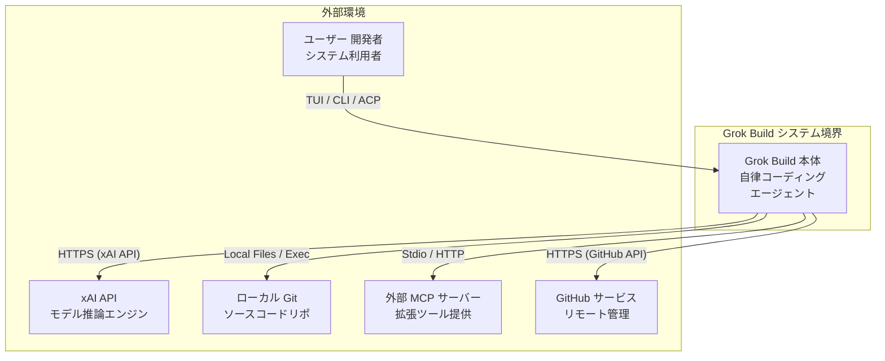
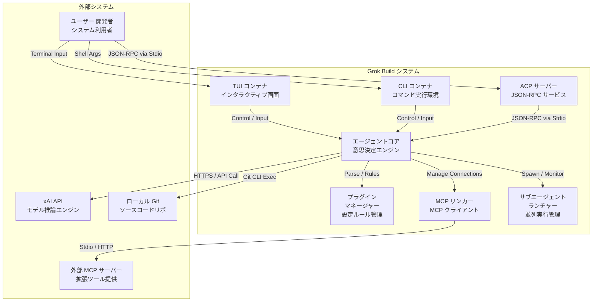
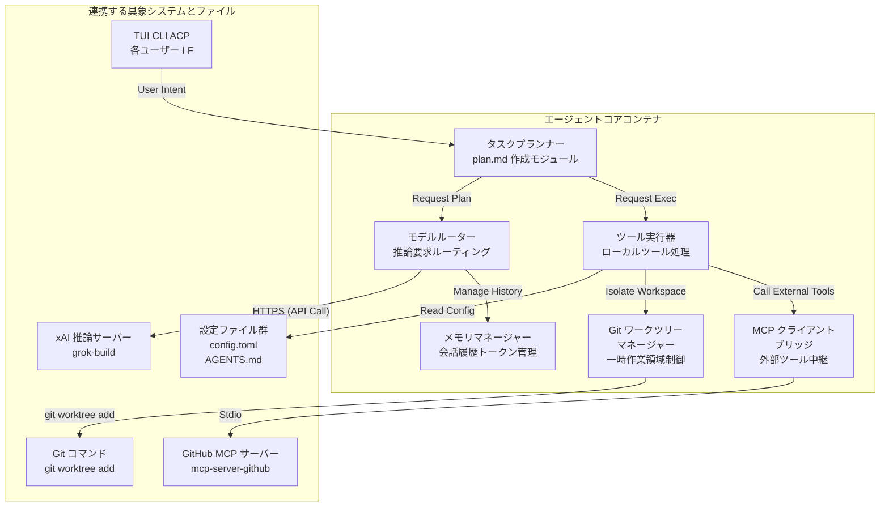
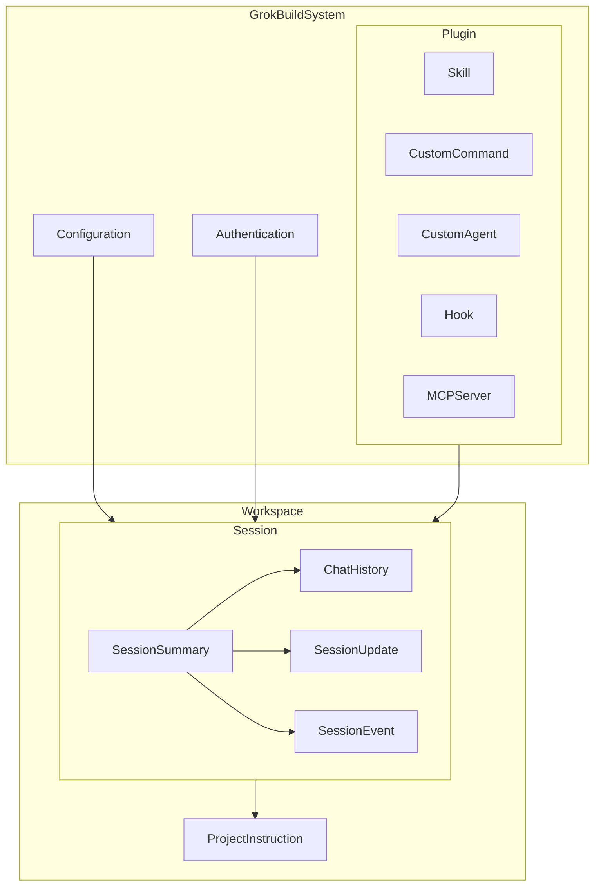
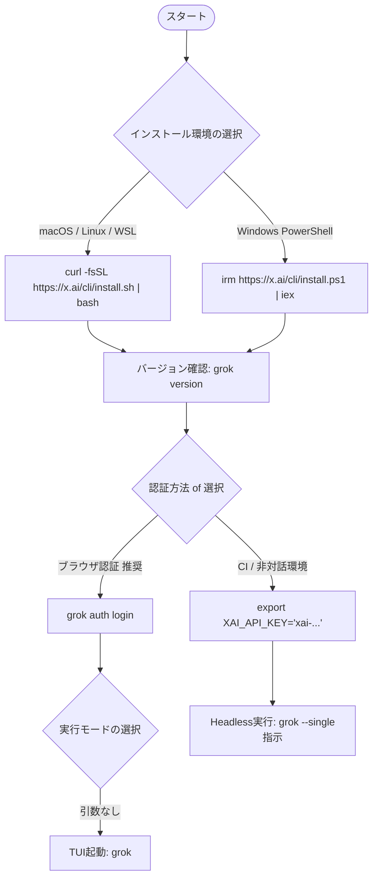
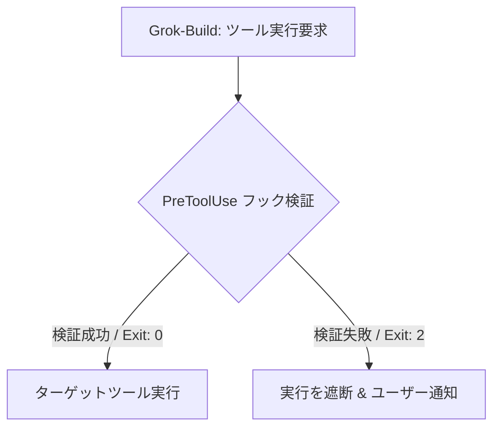

## 概要

Grok-Buildは、xAIが開発するターミナルネイティブな自律的コーディングエージェントです。開発プロジェクト内において、コードの変更や実行計画の作成を自律的に行います。

:::message
**本記事の位置づけについて**
本記事で解説する C4 Model や内部データスキーマ、フォルダ構成などは、公式ドキュメント（docs.x.ai）で公開されている情報と、実際の動作環境における挙動や観測データに基づいて筆者が再構成した論理モデルです。公式の確定仕様ではない箇所（推定されるアーキテクチャ）が含まれるため、将来のアップデートによって変更される可能性があります。
:::

### 関連技術との関係

xAIが提供する関連技術とGrok-Buildの関係は以下の通りです。

| 技術名 | 位置づけと関係 |
|---|---|
| xAI API | クラウド上のLLM（Large Language Model）を利用するための通信窓口。Grok-Buildは本APIを介してモデルと通信。 |
| xAI CLI | xAIのアカウント管理やAPIキー設定を行う管理ツール。Grok-Buildとは役割が異なる。 |

### 類似ツールとの比較

類似の自律的コーディングツールとの比較は以下の通りです。

| 比較項目 | Grok-Build | Claude Code | Codex CLI |
|---|---|---|---|
| 開発元 | xAI | Anthropic | OpenAI |
| 動作モード | TUI / CLI / ACP | インタラクティブCLI | CLI |
| 対応OS | macOS / Linux / WSL / Windows | macOS / Linux / WSL | macOS / Linux / Windows |
| 主要モデル | grok-build | Claude 3.7 Sonnet | gpt-4o |
| 拡張性 | MCP / AGENTS.md / プラグイン | MCP | シェル連携 / カスタムプロンプト |
| 承認モード | インタラクティブ承認 / 自律実行 | インタラクティブ承認 / 一括承認 | 実行前確認 |
| 課金体系 | サブスクリプション / API従量課金 | API従量課金 / サブスクリプション | API従量課金 |

- **モデルの補足**: Grok-Build 起動時の既定（default）の coding / agent session 推奨モデルは `grok-build` です。背景にある LLM 系統として xAI の最新フラグシップモデル（Grok 4.5 など）が動作します。

### アーキテクチャの違い

各ツールのアーキテクチャにおける技術的根拠は以下の通りです。

| ツール名 | アーキテクチャの特徴と技術的根拠 |
|---|---|
| Grok-Build | 最大8つのサブエージェントを並行で実行。これにより、大規模コードベースの並行編集や迅速な解析を実行。また、ACP（Agent Client Protocol）を標準サポートし、外部IDEとの接続を容易にする。 |
| Claude Code | 単一エージェントによる逐次処理を採用。MCP（Model Context Protocol）サーバーを介してリソースを操作し、きめ細かな対話型制御を行う。 |
| Codex CLI | 一発実行型（Single-shot）のシンプルなシェルコード生成に特化。シェルスクリプトの迅速な実行を重視。 |

### ユースケース別の推奨ツール

開発目的や規模に応じた推奨ツールは以下の通りです。

| 開発の状況 | 推奨するツール |
|---|---|
| 複数ファイルの並行編集や、大規模なリファクタリングを迅速に行う場合 | Grok-Build |
| MCPサーバーを活用し、外部APIやデータベースと密に連携する場合 | Claude Code |
| ターミナル上で短いコマンドの生成や、簡単なシェル操作の支援を得る場合 | Codex CLI |

---

## 特徴

Grok-Buildの主な特徴は以下の通りです。

- マウス操作に対応したフルスクリーンTUI（Terminal User Interface）の提供
- 最大8つのサブエージェントを並列で起動してタスクを分担
- 実行計画を作成し、事前にユーザーへ提示
- Agent Client Protocol (ACP) をサポートし、外部IDEと双方向で通信（Stdio経由のJSON-RPCを主とする）
- AGENTS.md を用いたプロジェクト固有ルールの適用
- MCPのサポートによる外部ツールやデータの活用
- visionモデルを用いた視覚的な動作検証の実施
- ヘッドレスモードのサポートによるCI/CDなどの自動化プロセスへの対応

---

## 構造

Grok-Buildの構造について、C4 modelに基づき「システムコンテキスト」「コンテナ」「コンポーネント」の3段階で説明します。
*※本構造は、公式マニュアルの機能説明と実機挙動から再構成した論理アーキテクチャモデルです。*

### システムコンテキスト図

Grok-Buildと、その周囲を取り囲むユーザーや外部システムとの関係性を示すシステムコンテキスト図です。



#### Grok Build システム境界
| 要素名 | 説明 |
|---|---|
| Grok Build 本体 | xAIが提供する、ローカル環境で動作する TUI および CLI 形式の自律的コーディングエージェント。 |

#### 外部環境
| 要素名 | 説明 |
|---|---|
| ユーザー 開発者 | 端末を通じてエージェントに指示を与え、提案された計画やコードのレビューおよび承認を実施。 |
| xAI API | Grok-Build に思考能力を提供する推論サーバー。 |
| ローカル Git | エージェントが直接ファイルを操作し、コードの作成、修正、バージョン管理を行うローカルの開発環境。 |
| 外部 MCP サーバー | Model Context Protocol に基づき、データベース接続や Web 検索などの外部ツール機能を提供するサーバー。 |
| GitHub サービス | リモートでのソースコード管理やプルリクエスト作成などの連携を行う外部の構成管理システム。 |

### コンテナ図

Grok-Build内部の主要な実行単位やインターフェースを示すコンテナ図です。



#### Grok Build システム
| 要素名 | 説明 |
|---|---|
| TUI コンテナ | ターミナル上でフルスクリーン動作する、マウスおよびキーボード対応の視覚的なユーザーインターフェース。 |
| CLI コンテナ | スクリプトや CI/CD パイプラインから非対話式でエージェントを動かすためのコマンドラインインターフェース。 |
| ACP サーバー | Agent Client Protocol に従い、IDE と双方向の JSON-RPC 通信を行うインターフェース。 |
| エージェントコア | 指示の解釈、計画の立案、ツールの実行指示など、エージェントのメインロジックを制御するコアモジュール。 |
| プラグイン マネージャー | プロジェクト固有のルールやカスタム定義を読み込み、コアエンジンを拡張するモジュール。 |
| MCP リンカー | Model Context Protocol に基づき、外部 MCP サーバーとの接続やツールの動的ロードを担う接続モジュール。 |
| サブエージェント ランチャー | 大規模なタスクにおいて、複数の子エージェントを並行して生成・管理する実行モジュール。 |

#### 外部システム
| 要素名 | 説明 |
|---|---|
| ユーザー 開発者 | Grok-Buildの各インターフェースを通じて、命令の入力や結果 of 確認を実施。 |
| xAI API | エージェントの意思決定やコード生成に必要な推論処理を提供する外部のクラウドサービス。 |
| ローカル Git | プロジェクトファイルが配置され、バージョン管理が行われているローカルのソースコード領域。 |
| 外部 MCP サーバー | データベースやブラウザなど、エージェントが利用可能な追加ツールを提供する外部サービス。 |

### コンポーネント図

「エージェントコア（Agent Core）」内部をドリルダウンし、具象モデルや実ツールを用いた相互作用を示すコンポーネント図です。



#### エージェントコアコンテナ
| 要素名 | 説明 |
|---|---|
| タスクプランナー | ユーザーからの指示に基づき、具体的な作業手順を記した plan.md を設計・生成するモジュール。 |
| モデルルーター | 入力内容やタスクの特性に応じて、最適な LLM への接続とパラメーターの調整を行う経路制御モジュール。 |
| ツール実行器 | ファイルの編集やローカルコマンドの実行など、具体的なタスクを安全に行うための制御モジュール。 |
| Git ワークツリー マネージャー | サブエージェントの並行作業時に、一時的な Git worktree を作成・削除して作業の衝突を防ぐ管理モジュール。 |
| MCP クライアント ブリッジ | LLM が提示したツールスキーマを MCP 形式に変換し、接続されたサーバーへリクエストを転送する仲介モジュール。 |
| メモリマネージャー | 過去の試行履歴やコンテキストウィンドウ内のトークン数を監視し、LLM へ送るメッセージ履歴を最適化する管理モジュール。 |

#### 連携する具象システムとファイル
| 要素名 | 説明 |
|---|---|
| TUI CLI ACP | ユーザーがエージェントの挙動を監視、指示するために使用する各インターフェース。 |
| xAI 推論サーバー | 具体的な LLM モデルである grok-build や grok-4.5 が稼働する API サーバー。 |
| 設定ファイル群 | グローバル設定ファイルである ~/.grok/config.toml や、プロジェクト固有の命令が書かれた AGENTS.md。 |
| Git コマンド | サブエージェントが独立して動作するために、git worktree add 等を実行するローカルの Git コマンドラインツール。 |
| GitHub MCP サーバー | プルリクエストの作成や Issue の取得などのために使用する、具体的な拡張 MCP サーバー mcp-server-github。 |

---

## データ

Grok-Buildが扱う各種設定ファイルや履歴データの構造について説明します。
*※本データモデルは、動作時に保存されるファイルを観測してモデル化した挙動ベースのスキーマです。*

### ディレクトリ構成とファイル配置

Grok-Buildが使用するローカル環境のディレクトリ構成とファイルの役割は以下の通りです。

```
~/.grok/
├── auth.json             # 認証資格情報キャッシュ（OAuth/APIキー情報）
├── config.toml           # グローバル設定ファイル
├── logs/
│   └── grok.log          # ログファイル
└── sessions/
    └── [session_id]/     # ユニークなセッションID
            ├── chat_history.jsonl  # 会話の往復履歴ログ
            ├── summary.json        # セッションメタデータおよび圧縮された要約
            ├── updates.jsonl       # リアルタイムな更新ログ
            └── events.jsonl        # ツール実行や各種システムイベントのストリーミングログ
```

### 概念モデル

Grok-Buildが読み書きする主要データ間の関係を示します。



| 要素名 | 説明 |
| :--- | :--- |
| GrokBuildSystem | Grok-Build の実行システム全体。 |
| Configuration | ユーザー設定やシステム設定を管理するファイル群（`config.toml`）。 |
| Authentication | API アクセスに必要な OAuth トークンなどの認証情報（`auth.json`）。 |
| Plugin | エージェントの機能を拡張するためのディレクトリおよびパッケージ構成。 |
| Skill | 特定のタスクや手順（`skills/`）を定義した指示書。 |
| CustomCommand | TUI または CLI で実行可能な独自のスラッシュコマンド。 |
| CustomAgent | 特定のプロンプトや役割を定義したサブエージェントの設定。 |
| Hook | 特定のライフサイクルイベントで実行するスクリプト定義（`hooks/*.json`）。 |
| MCPServer | Model Context Protocol（MCP）に基づく外部ツールとの連携設定。 |
| Workspace | 開発プロジェクトが展開されている作業用ディレクトリ。 |
| ProjectInstruction | プロジェクト固有の規約やコマンドを定義する指示書（`AGENTS.md`）。 |
| Session | 各作業や対話内容を保持・追跡する実行セッション。 |
| SessionSummary | セッションメタデータおよび圧縮された対話要約情報（`summary.json`）。 |
| ChatHistory | 過去のすべての対話ログ（`chat_history.jsonl`）を保持する履歴情報。 |
| SessionUpdate | 会話セッションでリアルタイムに発生する更新ログ（`updates.jsonl`）。 |
| SessionEvent | ツール実行やシステム動作などの構造化イベントログ（`events.jsonl`）。 |

### 情報モデル

各データが保持する主要な属性と関連関係を示すクラス図です。

```mermaid
classDiagram
    class Configuration {
        String user_config_path
        String system_config_path
        String default_model
        Boolean auto_update
        String permission_mode
        Boolean disable_telemetry
    }
    class Authentication {
        String auth_file_path
        String access_token
        String refresh_token
        String expires_at
        String team_uuid
        String user_email
    }
    class ProjectInstruction {
        String instruction_file_path
        list rules
        list build_commands
        list test_commands
    }
    class Session {
        String session_id
        String workspace_path
    }
    class SessionMetadata {
        String session_id
        String model_name
        String created_at
        String updated_at
        Integer token_count
    }
    class SessionSummary {
        String session_id
        String context_summary
        map key_variables
    }
    class ChatHistory {
        String history_file_path
        list turns
    }
    class SessionUpdate {
        String update_file_path
        list events
    }
    class Plugin {
        String plugin_id
        String plugin_path
        String name
        String version
    }
    class Skill {
        String skill_file_path
        String description
        list instructions
    }
    class CustomCommand {
        String command_name
        String handler_path
    }
    class CustomAgent {
        String agent_name
        String system_prompt
    }
    class Hook {
        String hook_file_path
        list lifecycle_events
    }
    class MCPServer {
        String server_name
        String command
        list args
        map env
    }

    Session "1" --> "1" SessionMetadata
    Session "1" --> "0..1" SessionSummary
    Session "1" --> "many" ChatHistory
    Session "1" --> "many" SessionUpdate
    Session "1" --> "many" ProjectInstruction

    Plugin "1" --> "many" Skill
    Plugin "1" --> "many" CustomCommand
    Plugin "1" --> "many" CustomAgent
    Plugin "1" --> "0..1" Hook
    Plugin "1" --> "many" MCPServer

    Configuration "1" --> "many" MCPServer
```



| 要素名 | 説明 |
| :--- | :--- |
| Configuration | 構成設定情報の主要なパラメーター群を定義するクラスモデル。 |
| Authentication | 認証トークンやチームIDなどを格納する情報の構造を定義するクラスモデル。 |
| ProjectInstruction | コード規約や各種コマンドをリスト形式で保持するプロジェクト指示書のクラスモデル。 |
| Session | セッションを識別する ID と対象の作業フォルダパスを紐付けるクラスモデル。 |
| SessionMetadata | 使用したモデルやタイムスタンプ、トークン使用量を保持するクラスモデル。 |
| SessionSummary | 会話履歴の圧縮された要約、使用モデルやトークン統計などのメタデータを保持するクラスモデル。 |
| ChatHistory | ターン（対話の往復）リストを管理する会話履歴のクラスモデル。 |
| SessionUpdate | ストリーミングされる会話やコマンドの実行ログを保持するクラスモデル。 |
| Plugin | 拡張機能パッケージの基本メタデータを保持するクラスモデル。 |
| Skill | 各スキルの手順や動作に関する指示をリスト形式で定義するクラスモデル。 |
| CustomCommand | コマンドの名称とハンドラーの実行パスを保持するクラスモデル。 |
| CustomAgent | 特定サブエージェントの名前と起動時の指示を定義するクラスモデル。 |
| Hook | 実行対象イベントをリスト化し、対応するスクリプトをトリガーするクラスモデル。 |
| MCPServer | 実行プログラムや引数、必要な環境変数を管理する MCP サーバー用の設定クラスモデル。 |

---

## 構築方法

Grok-Buildのインストール、前提条件、バージョン確認、および認証ログインの手順を説明します。



### 前提条件

Grok-Build を利用するために、以下の前提条件を確認してください。

- **対応OS**
  - macOS、Linux、Windows (WSL2 または PowerShell) でネイティブ動作。
- **プラン契約**
  - 利用には SuperGrok / X Premium Plus のアカウント契約、または公式プラン（無料体験枠等あり）への登録が必要。
- **システム要件**
  - バイナリ提供のため、Node.js や Rust などのコンパイル環境は不要。

### インストール方法

- **macOS / Linux / WSL でのインストール**
  - 公式のインストール用シェルスクリプトを実行。
  ```bash
  curl -fsSL https://x.ai/cli/install.sh | bash
  ```
- **Windows (PowerShell) でのインストール**
  - PowerShell から直接インストーラーをダウンロードして実行。
  ```powershell
  irm https://x.ai/cli/install.ps1 | iex
  ```

### バージョン確認

- **インストール状況の検証**
  - `grok version` サブコマンドを実行してバージョン情報を出力。
  ```bash
  grok version
  ```

### 認証ログイン

- **対話型ログイン (推奨)**
  - コマンドを実行し、ブラウザで起動する OAuth 認証画面に従ってログイン。
  - 認証資格情報は `~/.grok/auth.json` にキャッシュ。
  ```bash
  grok auth login
  ```
- **非対話型・CI環境向けログイン (APIキー)**
  - 環境変数 `XAI_API_KEY` を設定。
  ```bash
  export XAI_API_KEY="xai-..."
  ```
- **ログアウト**
  - キャッシュされた認証情報を削除し、セッションを破棄。
  ```bash
  grok auth logout
  ```

### 設定ファイルの初期配置 (config.toml)

- **グローバル設定の配置場所**
  - 個人設定ファイルは `~/.grok/config.toml` に配置。
- **設定例**
  - ツールの実行確認をスキップする設定や、Vimキーバインドの有効化などを記述。
  ```toml
  [ui]
  permission_mode = "always-approve" # ツール実行時の確認をスキップする設定
  vim_mode = true                   # Vimキーバインドを有効化する設定

  [models]
  default = "grok-build"            # デフォルトで使用するモデル名
  ```

### 設定・パラメーターの適用優先順位

Grok-Buildの実行において、設定パラメーターやモデル設定が競合した場合、以下の優先順位で適用されます。

1. **コマンドライン引数** (起動時に渡す `--always-approve` や `--model` など)
2. **環境変数** (`XAI_API_KEY` や `GROK_MODELS_BASE_URL` などの変数によるオーバーライド)
3. **プロジェクト固有設定** (対象プロジェクトのルートにある `.grok/config.toml` ※ただしプロジェクト固有設定は主に MCPサーバー、プラグイン、個別権限ルール定義に限定され、一般の `[models]` や `[ui]` 設定のオーバーライドはサポートされません)
4. **グローバル個人設定** (`~/.grok/config.toml`)

APIプロバイダーが自動検出される際は、以下の優先順位で有効なAPIキーが探索されます。
`xai (grok)` > `openai` > `anthropic` > `google` > `openrouter` > `groq` > `azure` > `github` > `custom` > `ollama`

---

## 利用方法

Grok-Build の主要コマンド、UIモード、および各種パラメーターについて説明します。

### 必須パラメータ一覧

Grok-Build の実行における主要なパラメーターとオプションは以下の通りです。

| パラメーター/オプション | 設定内容 | 必須/任意 | 説明 |
| :--- | :--- | :--- | :--- |
| `grok` | なし | 必須 | 基本コマンド。引数なしでインタラクティブTUIを起動。 |
| `-p`, `--single <PROMPT>` | テキスト | ヘッドレス時は必須 | AIエージェントへの単発の指示（プロンプト）を指定。 |
| `--model <model_name>` | モデル名 | 任意 | 使用する xAI モデルを上書き指定（例: `grok-build`）。 |
| `--always-approve` | フラグ | 任意 | ツール実行の承認要求をすべてスキップ（YOLOモード）。 |
| `--output-format <format>` | 出力フォーマット | 任意 | 出力形式を指定（例: `streaming-json`）。 |

### 主要コマンド

- **ヘルプの表示**
  - 利用可能なコマンドやオプション一覧を表示。
  ```bash
  grok --help
  ```
- **ツールのアップデート**
  - インストール済みの CLI ツールを最新バージョンに更新。
  ```bash
  grok update
  ```

### TUI と Headless モードの使い分け

- **TUI (Terminal User Interface) モード**
  - 対象のプロジェクトディレクトリで引数なしの `grok` コマンドを実行。
  - リッチな全画面表示で、対話的にコーディング作業を進めるのに適する。
- **Headless モード**
  - `-p` (または `--single`) オプションで指示を直接渡して実行。
  - スクリプトや CI/CD パイプラインでの自動実行に適する。
  - 実行例：
  ```bash
  grok -p "Fix the bugs in main.rs" --always-approve --output-format streaming-json
  ```

### TUI モードの基本操作とキーバインド

- **基本ショートカットキー**
  - `Ctrl+.` (または `Ctrl+X`): キーボードショートカット一覧画面の表示
  - `Enter`: プロンプトの送信
  - `Esc` (または `Ctrl+C`): 実行中のターン（命令処理）の中止
  - `Ctrl+Enter` (または `Ctrl+I`): 実行中の操作への割り込み（Interject）
  - `Shift+Tab`: セッションモードの切り替え (Normal / Plan / Always-approve)
  - `F2` (または `Ctrl+,`): 設定画面の起動
  - `Ctrl+Q` (または `Ctrl+D` 二回押し): TUI の終了
- **画面スクロールとナビゲーション**
  - `Tab`: プロンプト入力欄と会話履歴表示エリアのフォーカス切り替え
  - `Ctrl+R`: プロンプト履歴の検索
  - `Shift+H` / `Shift+L`: ターン（指示の履歴）の切り替え（※ Vim Mode が有効な場合のみ動作）
  - `Shift+K` / `Shift+J`: 応答（AIからの返答履歴）の切り替え（※ Vim Mode が有効な場合のみ動作）

### TUI モードのスラッシュコマンド

- **セッション管理**
  - `/help`: コマンドとショートカットのヘルプ表示
  - `/plan [指示内容]`: 実行前に手順を設計する「Plan Mode」の開始（※タスクグラフの構築や進捗は `/tasks` や `/dashboard` コマンドで確認します）
  - `/new` (保存して新規) または `/clear` (現在の対話履歴クリア): セッションの初期化
  - `/resume`: 過去のセッション一覧の表示および切り替え
- **設定・機能拡張**
  - `/always-approve`: ツール実行の自動承認モードのトグル切り替え
  - `/memory` (または `/mem`): 永続記憶（cross-session memory）機能の検索と直接編集（※本機能が有効な場合にのみ表示されます）
  - `/skills` (または `/plugins` / `/mcps`): 拡張機能（MCP/プラグイン等）を管理するモーダルの表示

---

## 運用

### 起動・停止方法

- **起動**
  - インタラクティブモードでエージェントを起動。
    ```bash
    grok
    ```
  - ヘッドレスモード（ワンショット実行）で起動。
    ```bash
    grok -p "ここに指示を入力します"
    ```
- **停止**
  - 起動中のインタラクティブセッションを停止。
    - ターミナル上で `Ctrl + C` を入力。
    - チャット欄で `/exit` コマンドを実行。

### 状態確認

- 現在のアクティブな設定や自動検出されたプラグイン、フックを確認。
  ```bash
  grok inspect
  ```
- 登録されているMCP（Model Context Protocol）サーバーの状態を確認。
  ```bash
  grok mcp list
  ```

### ログ確認

- エージェントの動作ログファイルを参照。
  - macOS/Linuxにおけるデフォルトのログ保存先。
    ```bash
    tail -f ~/.grok/logs/grok.log
    ```
  - Windowsにおけるデフォルトのログ保存先。
    ```cmd
    type %USERPROFILE%\.grok\logs\grok.log
    ```

### 更新方法

- CLIツールを最新バージョンへ更新。
  ```bash
  grok update
  ```

### MCPサーバーの登録・管理

- 開発用ツールの機能を拡張するためのMCPサーバーを追加。
- ローカルで実行するStdioベースのMCPサーバーを追加するコマンド。
  ```bash
  grok mcp add <name> -- npx -y <package-name> <args>
  ```
- リモートで提供されるHTTPベースのMCPサーバーを追加するコマンド。
  ```bash
  grok mcp add --transport http <name> <url>
  ```
- プロジェクト限定でMCPサーバーを追加する場合は、`--scope project` オプションを付与。
- 設定ファイル `config.toml` に直接記述して管理することも可能。
  - 記述例（`~/.grok/config.toml` または `<project>/.grok/config.toml`）：
    ```toml
    [mcp_servers.filesystem]
    command = "npx"
    args = ["-y", "@modelcontextprotocol/server-filesystem", "/path/to/dir"]
    env = { API_KEY = "${MY_API_KEY}" }
    startup_timeout_sec = 30
    ```

### プラグインの管理

- 拡張機能やカスタムスキル、MCP設定を内包したプラグインパッケージを登録。
- プロジェクトのルートに作成した `.grok/plugins/` ディレクトリ配下にプラグインを配置。
- 起動時に自動検出され、利用可能になる。
- `grok inspect` を実行してプラグインの読み込み状況を確認。

---

## ベストプラクティス

### 設定管理

- 個人環境用とプロジェクト共有用の設定を分離して管理。
  - グローバルな個人設定は `~/.grok/config.toml` に保存し、`[models]` や `[ui]` 設定を定義。
  - 共有するプロジェクト設定は `.grok/config.toml` に保存し、Gitリポジトリにコミット。※ただしプロジェクト固有設定はMCPサーバーやプラグイン、セキュリティ承認ルールの定義のみをサポートし、モデルやUI設定のオーバーライドはグローバル設定で行う必要がある。
- 設定ファイルにAPIキーなどの機密情報を直接記述しないように徹底。
  - 環境変数参照機能（`${ENV_VAR}`）を利用。

### フック（Hooks）の活用

- ライフサイクルイベントごとに実行する処理をJSONファイルで記述。
- 定義ファイルは `~/.grok/hooks/*.json` や `.grok/hooks/*.json` に任意の名前で配置可能（Grok-Build起動時にすべてのJSONファイルが自動ロードされます）。
- **主要なフックのライフサイクルイベント一覧**

| イベント名 | 実行タイミング | 遮断(ブロッキング)可否 | ユースケース |
|---|---|:---:|---|
| `SessionStart` | セッション開始時に実行 | 不可 |環境チェック、ブランチ情報の通知 |
| `UserPromptSubmit` | ユーザーがプロンプトを送信した直後に実行 | 不可 | プロンプトの解析、カスタムログの記録 |
| `PreToolUse` | エージェントがツール（ファイル編集、シェル実行など）を呼び出す直前 | **可能** (Exit: 2 で遮断) | セキュリティスキャン、禁止コマンドの検知、Linter実行 |
| `PostToolUse` | ツール呼び出しの直後に実行 | 不可 | 実行ログの外部転送、ビルドキャッシュのクリーンアップ |
| `PostToolUseFailure` | ツールの実行が失敗した直後に実行 | 不可 | エラー時のクリーンアップや通知 |
| `PermissionDenied` | ツール実行の承認が拒否された場合に実行 | 不可 | 拒否ログの記録、代替手段の検討 |
| `SubagentStart` | サブエージェントが動作を開始したときに実行 | 不可 | 子エージェントの起動ログの記録 |
| `SubagentStop` | サブエージェントが動作を終了したときに実行 | 不可 | 子エージェントの終了ログの記録 |
| `Stop` | セッションの中断要求が発生したときに実行 | 不可 | 中断時のクリーンアップ |
| `StopFailure` | セッションの中断に失敗したときに実行 | 不可 | エラーハンドリング |
| `Notification` | システム通知が送信されるときに実行 | 不可 | 外部通知連携 |
| `PreCompact` | 履歴圧縮の直前に実行 | 不可 | 圧縮前メタデータの記録 |
| `PostCompact` | 履歴圧縮の直後に実行 | 不可 | 圧縮後のトークン統計更新 |
| `SessionEnd` | セッション終了時に実行 | 不可 | 一時ファイルの削除、終了ステータスの報告 |

- 遮断可能（ブロッキング）なフックである `PreToolUse` を活用。
  - Linterやセキュリティスキャンを実行。
  - エラーを検知した場合は終了コード `2` または拒否判定のJSONを返して、Grok-Buildによる不正なコマンド実行やファイル書き換えを防ぐ。
- フックの定義例（`PreToolUse`）です。
  ```json
  {
    "hooks": {
      "PreToolUse": [
        {
          "matcher": "Bash",
          "hooks": [
            {
              "type": "command",
              "command": "bin/safety-check.sh",
              "timeout": 10
            }
          ]
        }
      ]
    }
  }
  ```

### スキル（Skills）の定義方法

Grok-Buildでは、特定の複雑なタスクや手順を「スキル」として追加定義し、TUI上で `/スキル名` として実行させることが可能です。

- **配置場所**: `./.grok/skills/` または `~/.grok/skills/` に配置。
- **記述形式**: Markdown形式（例: `SKILL.md`）で定義し、先頭に YAMLフロントマターを記述。
- **記述例 (`.grok/skills/db-migrate/SKILL.md`)**:
  ```markdown
  ---
  name: db-migrate
  description: データベースのマイグレーションを実行し、最新の状態に同期します。
  arguments: "<環境名 例: development, staging>"
  ---

  # データベースマイグレーションの手順

  指定された環境に対して、スキーマのマイグレーションを安全に適用します。

  1. 前提条件の確認：
     - `database.yml` が存在し、環境変数がロードされていることを確認します。
  2. ドライランの実行：
     - `bundle exec rails db:migrate:status` で未適用のマイグレーションを一覧化します。
  3. マイグレーション実行：
     - `bundle exec rails db:migrate RAILS_ENV=$ARGUMENTS` を実行します。
  4. スキーマの整合性チェック：
     - `git diff db/schema.rb` で差分を確認し、エラーが無いかチェックします。
  ```

#### フックの処理フロー


### チーム開発でのAGENTS.md運用と他ツール互換

- リポジトリのルート（またはサブディレクトリ）に `AGENTS.md` を作成して配置。プロジェクトのコーディング規約、ビルド・テスト実行ルールをドキュメント内に明記すると、エージェントが自動でこれを読み込みルールを遵守。
- **他ツールとの互換検出機能**:
  - Grok-Buildは他ツールからの移行を支援するため、`CLAUDE.md`, `Claude.md`, `CLAUDE.local.md` や、`.grok/rules/`, `.claude/rules/`, `.cursor/rules/` に置かれた任意の `*.md` ルールファイルも起動時に自動検出して読み込む。

### CI/CD連携

ヘッドレスモード（`grok -p` または `--single`）を活用して、CIのジョブ内でコードの検証やLinterの自動実行、あるいはコードの自動修正（パッチ）を組み込むことが可能です。

例として、GitHub Actions で Grok-Build を実行するための YAML 定義例を示します。

```yaml
name: CI with Grok-Build
on: [push]

jobs:
  code-check:
    runs-on: ubuntu-latest
    steps:
      - name: Checkout Code
        uses: actions/checkout@v4

      - name: Install Grok-Build
        run: |
          curl -fsSL https://x.ai/cli/install.sh | bash
          echo "$HOME/.grok/bin" >> $GITHUB_PATH

      - name: Run Grok Agent for Code Quality Check
        env:
          XAI_API_KEY: ${{ secrets.XAI_API_KEY }}
        run: |
          grok --single "Check code style and output unified diff if there are any issues" --always-approve
```

自動生成されたコードが人間によるレビューを経ずに直接デプロイされることを防ぐため、プルリクエスト（PR）の自動作成にとどめる運用を推奨します。

### セキュリティ制約

- プロジェクト固有の設定やフックを有効化するためには、実行ディレクトリの信頼（Trust）が必要。
  - `/hooks-trust` コマンドを実行するか、起動時に `--trust` オプションを明示的に指定。
- **MCPツール呼び出しのセキュリティ境界**:
  - MCPサーバーを介してローカルディレクトリ外のファイルをエージェントが操作するのを防ぐため、一部のMCPサーバー（filesystemサーバーなど）では起動オプションに `allowed_paths`（許可パス）を設定可能。
  - `config.toml` 内で対象 MCP サーバーの起動引数に明示的に許可するディレクトリ制限を指定。
    ```toml
    args = ["--allowed-paths", "/Users/suwa_sh/src/github.com/suwa-sh/pkm"]
    ```
- ログや一時ファイルに機密情報が含まれる可能性があるため、`~/.grok/logs/` などのディレクトリを共有しないよう注意。

### ローカルとリモートの使い分け

- **ローカル環境**：
  - インタラクティブな対話型開発やバグ修正には、TUIでのローカル実行を使用。
- **リモート/クラウド環境**：
  - 複雑な環境のディープリサーチやバッチ処理には、ヘッドレスモードをリモートの実行用インスタンスで実行。

---

## トラブルシューティング

### 大規模スキャン時のタイムアウトへの対処

大規模なモノリシックリポジトリやファイル数が数万件を超えるプロジェクトでは、Grok-Buildが起動時や実行計画の立案時にすべてのディレクトリをスキャンするため、インデックス処理が非常に遅くなる、またはタイムアウト（`504` 等）する場合があります。

- **`.gitignore` の徹底**: Grok-BuildはGitの追跡対象ファイルを基準にするため、ビルドアセットや外部モジュール（`node_modules` など）は必ず `.gitignore` に登録。
- **除外設定の明記**: 設定ファイル `config.toml` 内の `[project]` セクションの `exclude` フィールドに配列形式で除外パターンを記述するか、一部環境では `.grokignore` ファイルを作成してスキャン対象外とするディレクトリやファイルのパターンを明示。

### 頻出エラーと解決手順

| 症状 | 原因 | 対処 |
| :--- | :--- | :--- |
| **起動時に `Unauthorized (401)` エラーが発生する** | セッション認証情報の期限切れ、またはプランの無効化 | セッションの再認証。`grok auth login` を実行。 |
| **コマンド実行時にタイムアウト（`504 Gateway Time-out`）が発生する** | 会話の履歴が長すぎてコンテキスト上限に達している、またはネットワーク遅延 | 新しいセッションを開始（`/new`）してコンテキストをクリア。 |
| **プロジェクト内のカスタムフックが動作しない** | プロジェクトディレクトリに対する信頼（Trust）が設定されていない | セッション内で `/hooks-trust` を実行するか、`grok --trust` で起動。 |
| **MCPサーバーに接続できずエラーになる** | `config.toml` 内のコマンド記述ミス、または起動タイムアウトの超過 | `grok mcp doctor <server-name>` を実行して接続状態を確認。`startup_timeout_sec` の設定値を長くする。 |
| **起動時に `EADDRINUSE` エラーが表示される** | 通信に使用するポートがすでに他のプロセスに占有されている | 競合しているプロセスを特定して停止。 |
| **「Command not found: grok」と表示される** | インストールしたバイナリのパスが環境変数 `PATH` に追加されていない | バイナリの配置先（デフォルトは `~/.grok/bin/` など）をシステム環境変数 `PATH` に追加。 |

---

## まとめ

Grok-Buildは、並行サブエージェント実行やリッチなTUIなどの特徴を持ち、大規模リファクタリングを強力に支援する自律コーディングエージェントです。公式ドキュメントと照らし合わせたフック機能やセキュリティ設定を最適化することで、CI/CDや日常のコーディングにおいて安全かつ高速に活用できます。

この記事が少しでも参考になった、あるいは改善点などがあれば、ぜひリアクションやコメント、SNSでのシェアをいただけると励みになります！

---

## 参考リンク

- **公式ドキュメント**
  - [xAI Build Overview (docs.x.ai/build/overview)](https://docs.x.ai/build/overview)
  - [xAI Build CLI Headless Scripting (docs.x.ai/build/cli/headless-scripting)](https://docs.x.ai/build/cli/headless-scripting)
  - [xAI Build CLI Reference (docs.x.ai/build/cli/reference)](https://docs.x.ai/build/cli/reference)
  - [xAI Build Keyboard Shortcuts (docs.x.ai/build/keyboard-shortcuts)](https://docs.x.ai/build/keyboard-shortcuts)
  - [xAI Build Features Hooks (docs.x.ai/build/features/hooks)](https://docs.x.ai/build/features/hooks)
  - [xAI Build Features MCP Servers (docs.x.ai/build/features/mcp-servers)](https://docs.x.ai/build/features/mcp-servers)
  - [xAI Build Settings (docs.x.ai/build/settings)](https://docs.x.ai/build/settings)
  - [xAI CLI Install Guide (x.ai/cli)](https://x.ai/cli)
- **関連仕様**
  - [Model Context Protocol Specification (MCP)](https://modelcontextprotocol.io)
