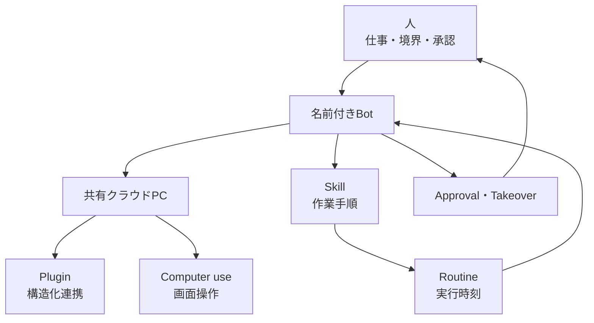
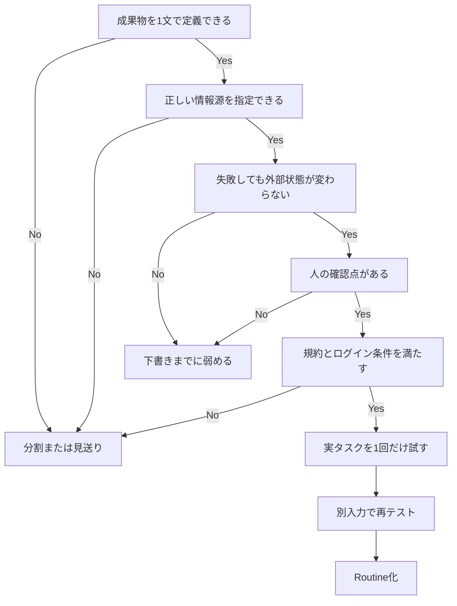

Grok Botは、名前を付けたBotにクラウド上のコンピュータを与え、ブラウザや業務アプリを操作させられる常駐型エージェントです。アプリや手元のPCを閉じても仕事を続け、成功した手順をSkill、実行時刻をRoutineとして再利用できます。

では、実際に何を任せるとよいのでしょうか。

2026年8月11日の早期ベータ公開から約3週間の公式情報と利用報告を追うと、向いているのは「何でもこなすデジタル社員」ではありません。現時点で最も再現しやすいのは、**情報を読み、照合し、下書きまで作る仕事**です。送信、購入、本番変更など、後戻りしにくい操作は人が止めます。

この記事では、確認できた実例と公式ユースケースをもとに、仕事の選び方、具体的な任せ方、避けるべき領域を整理します。なお、製品は公開直後です。大規模な第三者検証や日本企業の本番導入事例は、2026年9月2日時点で確認できていません。


*この記事の全体像。以下、順に解説します。*

## Grok Botならではの価値は「既存ツールに成果を残すこと」

通常のチャットAIは、質問に対して文章を返すのが中心です。Grok Botは、CRM、メールの下書き、チケット、表、スライドなど、普段使っているツールの中に成果を残せます。

利用者が扱う要素は、次の4つです。

- Bot：役割、会話、記憶を持つ担当者
- クラウドPC：ブラウザ、ターミナル、ファイルを持つ実行環境
- SkillとRoutine：作業手順と実行タイミング
- 人：ログイン、承認、停止、最終判断

ここで重要なのが、公式FAQにあるセキュリティ上の注意です。画面上はBotごとに分かれていても、クラウドPCはアカウント単位で共有されます。Cookie、ファイル、CLIの資格情報は、同じアカウントのBot間で分離されません。機密性が異なる仕事は、Botを分けるだけでは隔離できないと考える必要があります。



## 活用事例を確度別に読む

公開直後の製品には、実証済みの事例と「できそうなこと」のカタログが混在します。本記事では、次の順で根拠を扱います。

1. 公式ドキュメントに手順と制約があるもの
2. 開発元の社員が実際に使ったもの
3. 独立した利用者が入力と結果を公開したもの
4. 類似するコンピュータ操作エージェントで実証されたもの
5. アイデア集や二次解説だけにあるもの

「任せられる」と判断する際は、公式手順と独立利用者の実例を重く見ます。社員の利用例は社内ツールが整った環境として割り引き、類似製品の事例は主に失敗モードを知るために使います。

## まず検討したい8つの活用パターン

Grok Botの公式ユースケースと実機報告は、次の8パターンに整理できます。共通点は、最初から自動実行を目指さず、人が確認できる成果物で止めることです。

| 活用パターン | Botへの入力 | 成果物 | 人が止める操作 |
|---|---|---|---|
| 公開情報の棚卸し | URL、確認項目 | URL一覧、比較表、指摘 | サイト変更 |
| 定期調査と監視 | テーマ、期間、一次情報の条件 | 根拠付き週次メモ | SlackやSNSへの投稿 |
| 営業準備 | CRMビュー、ICP、文体例 | 優先順位、メール下書き | 送信、シーケンス登録 |
| 経費と請求の準備 | 明細、レシート、社内規程 | 差分、例外、確認依頼の下書き | 支払い、払い戻し変更 |
| 顧客対応 | 問い合わせ、製品資料 | 回答案、要確認リスト | 顧客への送信 |
| プロジェクト運営 | メール、Slack、カレンダー、議事録 | 変化と判断事項の一覧 | メッセージ送信、予定変更 |
| バグ再現 | バグ報告、staging環境 | 手順、画像、ログ、最小ケース | 本番操作、顧客データ利用 |
| 生活支援 | 条件、店舗、予定 | 候補、カート、予約案 | 購入、予約確定 |

### 公開サイトの棚卸しは最初の一歩に向く

日本のVISKは、Grok Botで自社サイト41ページを巡回し、titleとdescriptionの重複などをスプレッドシートにまとめました。公開された実測では、重複件数がシートと一致し、巡回からGoogle Driveへの書き出しまででトライアル枠の22%を消費しています。

この事例が優れているのは、失敗しても公開サイトを変更せず、結果を表で検証できる点です。一方、Google Driveの接続権限は広く、出力先だけを限定したつもりでもDrive全体への権限になり得ます。最初はファイル出力で済ませ、コネクタは必要になってから追加する方が安全です。

### 定期調査は「調べる」と「投稿する」を分ける

日本語の実機報告では、直近7日間の技術ニュースを調べるSkillを作り、毎朝8時のRoutineに設定し、Slack投稿をApprovalの後ろに置く流れが確認されています。

この分離は、競合価格の監視、法改正のウォッチ、広告実績の確認にも転用できます。調査に失敗したときは古いデータを再利用せず、「取得できなかったソース」を報告させることが重要です。

### バックオフィスは「突合と通知」までにする

公式のExpense Managerは、経費システム、レシート、社内ポリシーを突き合わせ、例外の根拠とフォロー文案を返します。送信と払い戻し変更は、最初から禁止する設計です。

独立利用者の例では、APIのないカード明細サイトを毎朝確認し、前日との差分と推奨アクションを通知するRoutineが1週間以上使われました。見覚えのない課金の発見にもつながっています。ただし、ここから自動支払いへ進めるべきではありません。読み取り、比較、通知は戻せますが、送金は戻せないからです。

### 現場業務は一体型Botよりシステム別の分業が効く

配管業者の事例では、Gmail、Slack、ServiceTitanなどを横断し、ワークオーダーの取り込み、空き枠の確認、顧客確認後の予約まで試されています。しかし、すべてを担当するDispatcherは遅く、誤りも多いため停止されました。その後、担当システムごとのBotへ分割されています。

この失敗は示唆的です。「一人の万能Bot」に業務全体を背負わせるより、受付、調査、予約案、品質確認のように成果物と責任を分けた方が、失敗箇所と権限を特定しやすくなります。

## 複数Botを使うなら役割ではなく境界で分ける

Botを分ける基準は、キャラクターではありません。次のいずれかが異なるときに分けます。

- 所有する成果物
- 使用するツール
- 文体や判断基準
- 人の承認が必要な地点
- 実行頻度

たとえばコンテンツ制作なら、Researcherが一次情報を集め、Writerが下書きを作り、Reviewerがソースと照合する編成にできます。ただし、Botを分けても共有クラウドPC上のログインやファイルは分離されません。権限の隔離が必要なら、アカウントや利用環境そのものを分けます。

また、Coordinatorを増やしすぎると、重複作業やBot同士の会話ループが起きます。公開初期には、Bot同士が会話を続けて利用枠を消費したという社員報告もあります。2〜3体から始め、それぞれの終了条件を明記する方が管理しやすいでしょう。

## 任せる仕事を選ぶ8つの質問

候補の仕事に対して、次の8問を順番に確認します。途中でNoになったら、仕事を分割するか、下書きまでに弱めます。

1. 成果物を1文で定義できるか
2. 正しい情報の所在を指定できるか
3. 失敗してもメール、お金、本番データ、公開ページが変わらないか
4. 送信、公開、購入、削除、本番変更の前に、人の確認点を置けるか
5. ログインと2要素認証を人がTakeoverで行えるか
6. 対象サイトの利用規約がBot操作を禁止していないか
7. 週1回以上繰り返す仕事か
8. 利用枠が尽きても人が代行できるか



特に「繰り返す仕事か」は見落とされがちです。一度しか行わない複雑な作業をSkill化すると、教えるコストの方が大きくなります。まず一度だけ実タスクを任せ、成功した手順だけを保存します。

## 安全な依頼文は成果物と禁止事項を対で書く

最初の依頼では、自由度の高い役職名より、成果物と停止点を具体的にします。

```text
仕事: （所有する成果物を1行で書く）
ソース: （アプリ、URL、ファイルを指定する）
手順: （読む、突合する、下書きする）
成果物: （表、メモ、下書き。根拠リンクを含める）
禁止: （送らない、変更しない、本番を触らない）
欠損時: （古いデータを使わず、失敗と理由を報告する）
確認: （人が確認する項目を列挙する）
```

### 例1 公開サイトを棚卸しする

```text
[公開サイトURL]について、トップページからリンクで到達できる
同一ドメインのページだけを棚卸ししてください。

各URLのtitle、meta description、文字数、重複の有無を表にしてください。
事実と推測を分け、巡回したURL数を末尾に書いてください。
サイトの設定は変更しないでください。新しい表だけを作ってください。
```

### 例2 直近のニュースを定期調査する

```text
直近7日間に公開された[製品]の[領域]の更新を調査してください。
重要なものを最大5件選び、発表内容、従来との差、重要性、
利用者への影響、一次情報のURLと公開日を書いてください。

一次情報を優先し、事実と推測を分けてください。
外部へ投稿しないでください。取得できないソースは理由を報告してください。
```

### 例3 営業準備を下書きまで任せる

```text
このCRMビューのアカウントを最大25件まで調査してください。
ICPと直近のintentで優先順位を付け、担当者は各社3名までにしてください。
添付した文体例でメールの下書きとレビュー用リストを作ってください。

すでにシーケンスに登録済みの人は除外してください。
メール送信、SNS操作、シーケンス登録はしないでください。
```

## 今は避けたい仕事

「クラウドPCで画面を操作できる」ことと、「どのサイトでも安定して操作できる」ことは別です。現時点では、次の仕事を後回しにするのが無難です。

- 銀行振込、購入確定、契約締結
- 顧客への無人送信
- 本番環境や顧客データの変更
- LinkedInの自動接続、メッセージ、いいね
- Xの非APIブラウザ自動操作
- CAPTCHAやBot対策を回避する前提の仕事
- 規制業務など、完全な操作監査が契約条件になる仕事
- 1体で複数システムの判断と実行を担う万能Dispatcher

公式トラブル情報でも、ShopifyなどのBot対策で画面操作を断念し、API利用へ切り替える案内があります。Cloudflare、hCaptcha、Impervaなどの壁は、人が一度ログインすれば必ず解決するものではありません。

利用規約にも注意が必要です。LinkedInは未承認のBotによるアクセスやメッセージ、非真正なエンゲージメントを禁止しています。Gmailにもインターフェース自動化に関するポリシーがあります。Grok Botの公式Sales Outboundも、professional networksは規約が許す範囲に限定しています。

## 24時間稼働でも無制限ではない

常駐できることは、利用量や費用が予測できることを意味しません。2026年9月2日時点では、週次利用枠の具体的なサイズは公開されておらず、Grok Bot固有の支出上限も未提供です。

独立利用者からは、Routineの作成を含む2日間で週次使用量の約半分を消費した例や、ライブ案件の途中でトライアルを使い切った例が報告されています。別の利用者はCursor Ultraでも1日で週次枠を使い切ったとしています。プランや作業内容が異なるため単純比較はできませんが、Routineを増やす前に利用量を測る必要があります。

さらに、Test runは模擬実行ではなく実作業です。本番データで試せば、本番と同じ損害が起こり得ます。最初は公開情報、添付ファイル、staging環境を使い、オンデマンド課金やクレジットへの切り替わりも確認します。

## 最初の一週間は小さく育てる

最初のBotは、次の順で育てると安全です。

1. 公開サイトの棚卸し、添付PDFの突合など、読み取り中心の仕事を1つ選ぶ
2. 成果物、情報源、禁止事項、確認点をDescriptionに書く
3. コネクタを追加せず、1回だけ実行する
4. 結果を人が原本と突き合わせ、修正理由を伝える
5. 成功した手順をSkillに保存する
6. 別の入力で再テストする
7. 失敗時の動作を追加してからRoutineにする
8. 投稿、送信、購入、変更はApprovalの後ろに残す

おすすめの開始順は、公開サイトの棚卸し、週次の調査メモ、添付ファイルの突合です。メール、CRM、カード明細は価値が高い一方、権限の半径も大きくなります。低権限の仕事で精度と利用量を把握してから接続先を増やします。

## まとめ

Grok Botの強みは、チャットで答えることではなく、クラウドPC上で既存ツールを横断し、繰り返し使える成果物を残すことです。ただし、公開から約3週間の段階では、「全面委任」よりも「可逆な準備作業」の方が実証と公式の安全設計に合っています。

最初に任せるなら、公開情報の棚卸し、根拠付きの定期調査、添付ファイルの突合が有力です。営業、経費、顧客対応に広げる場合も、読み取りと下書きまでに止め、送信、購入、本番変更は人が承認します。万能Botを作るのではなく、成果物と承認境界ごとに小さく分けることが、実例から見える現実的な使い方です。

この記事が少しでも参考になった、あるいは改善点などがあれば、ぜひリアクションやコメント、SNSでのシェアをいただけると励みになります！

## 参考リンク

- [Introducing Grok Bot](https://x.ai/news/introducing-grok-bot)
- [Grok Bot Overview](https://docs.x.ai/grok-bot/overview)
- [Grok Bot Use cases](https://docs.x.ai/grok-bot/use-cases)
- [Get started](https://docs.x.ai/grok-bot/get-started)
- [Approvals, security, and privacy](https://docs.x.ai/grok-bot/approvals-security-and-privacy)
- [Skills and routines](https://docs.x.ai/grok-bot/skills-routines-and-automations)
- [Teams and enterprises](https://docs.x.ai/grok-bot/teams-and-enterprises)
- [Plans and billing](https://cursor.com/help/grok-bot/plans)
- [VISKによるSEO棚卸しの実機報告](https://visk.co.jp/blog/grok-bot-no-settings-screen)
- [はじめてのGrok Bot](https://zenn.dev/tec/articles/648fa51b83772e)
- [inady氏による1週間の利用記録](https://note.com/inady/n/na45c77524c68)
- [HodaPress Reviewの複数Bot運用記録](https://review.waction.org/tools/cursor/grok-bot)
- [配管業者Jon ONeill氏の利用記録](https://x.com/HouseHackerJon/status/2087635639701573962)
- [Use Claude Cowork safely](https://support.claude.com/en/articles/13364135-use-claude-cowork-safely)
- [Operator System Card](https://openai.com/index/operator-system-card/)
- [LinkedInのProhibited software方針](https://www.linkedin.com/help/linkedin/answer/a1341387)
- [Gmail Program Policies](https://support.google.com/mail/answer/16734397)
