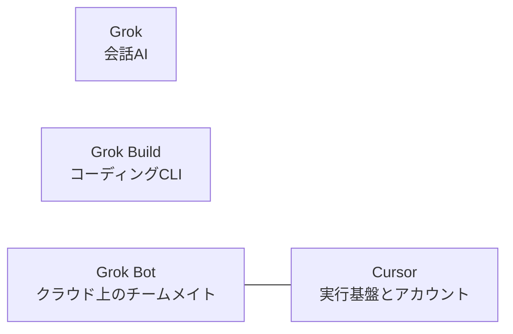
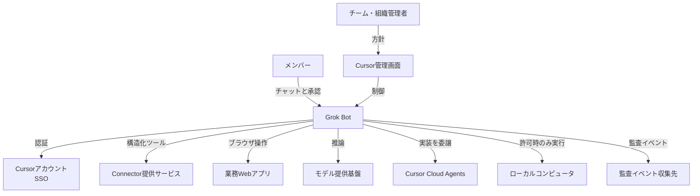
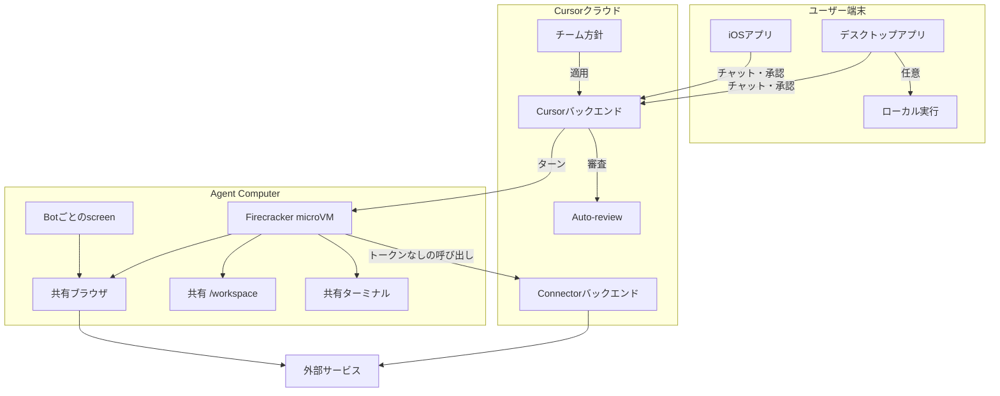
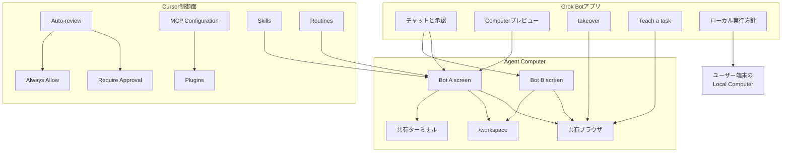
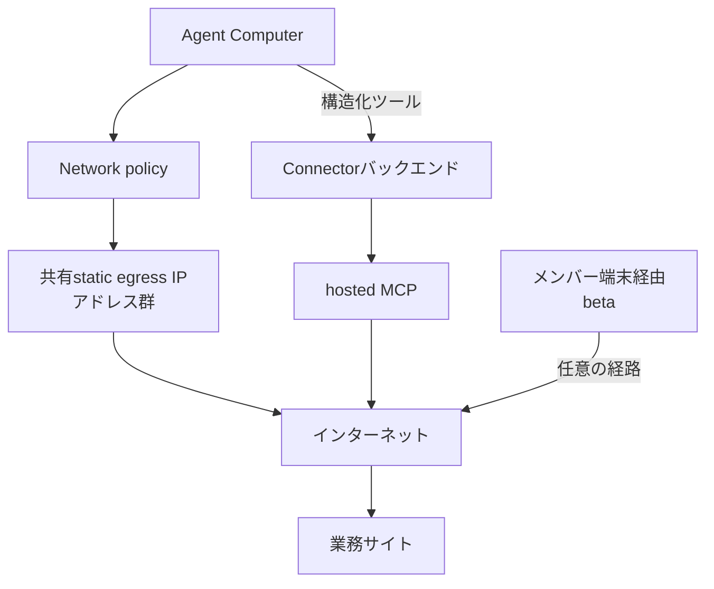
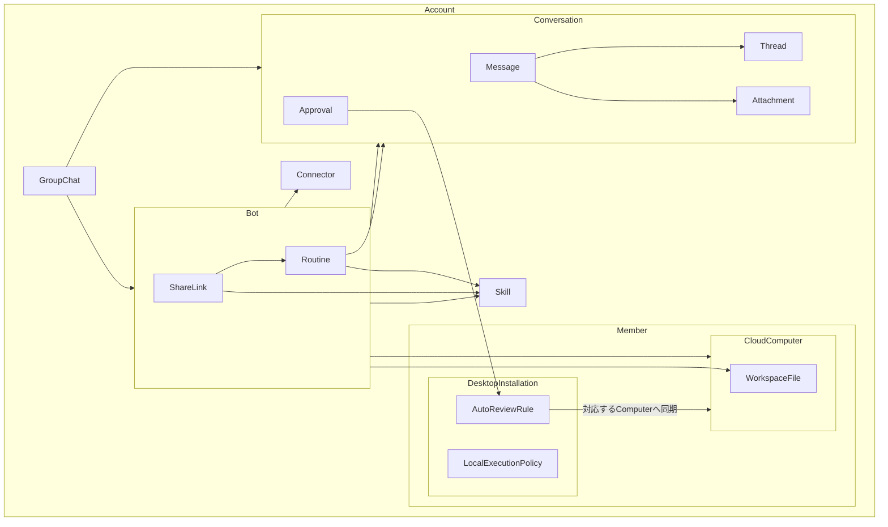
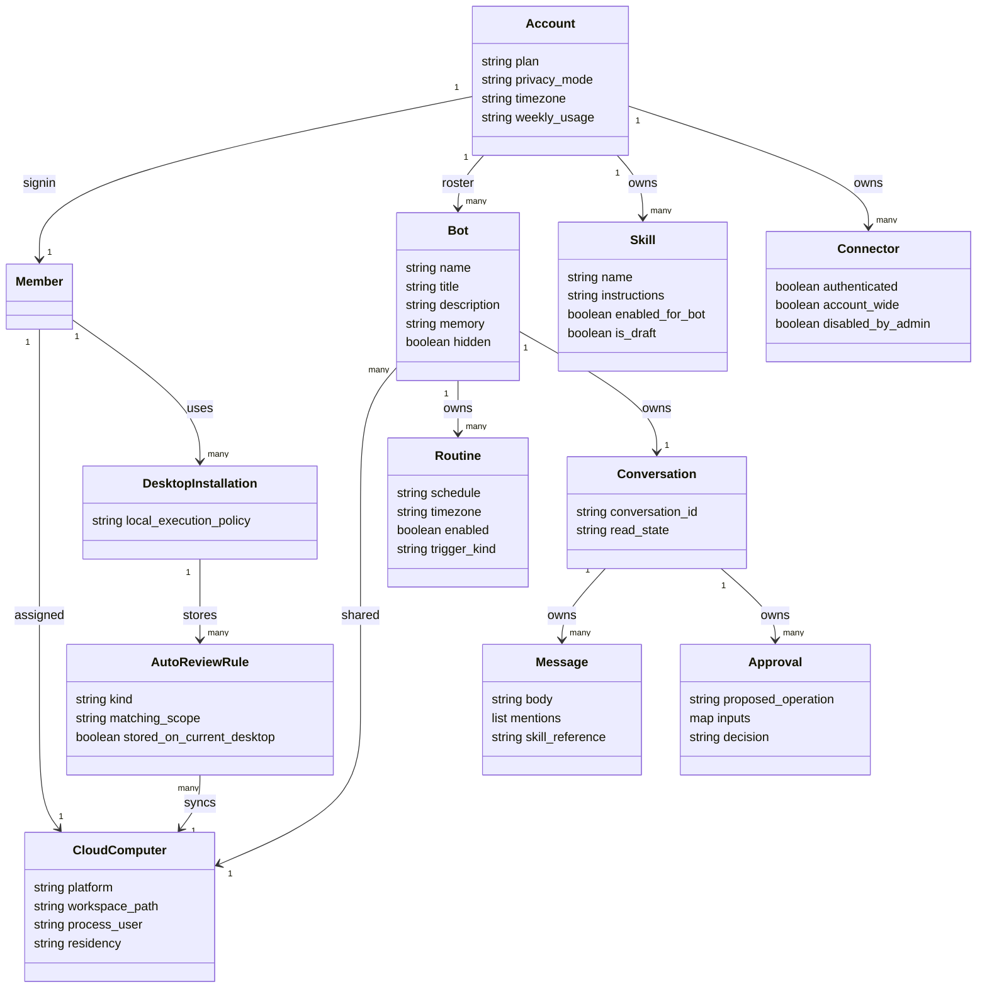
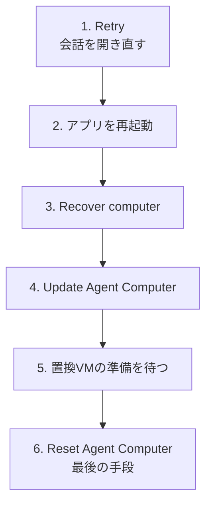

Grok Botは、チャットで答えるだけではなく、クラウド上のコンピュータを使って仕事を最後まで進めるAIチームメイトです。名前の似た会話AIのGrokや、コーディングCLIのGrok Buildとは別製品で、実行基盤と認証はCursor側にあります。

この記事では、2026年9月2日時点の公式情報をもとに、Grok Botを次の観点から整理します。

- どこで動き、何を共有するのか
- Bot、会話、Skill、Routine、Connectorがどう結び付くのか
- 導入時に必要なアカウント、プラン、クライアント
- 承認、資格情報、ネットワークをどう設計すべきか
- 止まったときに、どの順番で復旧すべきか

特に重要なのは、同じユーザーが作った複数のBotは、人格や会話が分かれていても、ファイル、ブラウザセッション、CLI資格情報を含む1台のクラウドコンピュータを共有する点です。この前提を外すと、権限分離や運用設計を誤ります。


*この記事の全体像。以下、順に解説します。*

## 概要

Grok Botは、既存のWebサイト、ブラウザ、ターミナル、ファイル、Connectorを使い、依頼された成果まで作業するホステッドSaaSです。デスクトップアプリとiOSアプリは、依頼、進捗確認、レビュー、承認を行うクライアントです。実作業はCursorクラウド上の永続的なLinux microVMで進みます。



Grok Botの基本的な仕事の流れはシンプルです。

1. ユーザーがメッセージで成果、入力源、制約を渡します。
2. BotがConnector、ブラウザ、ターミナル、ファイルを使います。
3. 送信、公開、購入、削除、本番変更などは、依頼文やAuto-reviewルールで承認境界を設定し、実行前に人が確認します。
4. 完成した成果物と根拠を会話へ返します。

ノートPCを閉じてもクラウド側のターンとRoutineは動き続けます。Botはターンごとに初期化されず、名前、役割、説明、会話、記憶、Routineを持つ永続的なチームメイトとして扱われます。

### Grok、Grok Build、Cursor Cloud Agentsとの違い

| 製品 | 主な用途 | 実行場所 | 主な入口 |
|---|---|---|---|
| Grok | 質問応答、生成 | grok.com、X | チャット |
| Grok Build | ローカルリポジトリのコーディング | ユーザーの端末 | `grok` CLI |
| Cursor Cloud Agents | 実装、テスト、PR | タスク単位の隔離VM | Cursor IDE、Web、Slack、GitHub |
| Grok Bot | 既存ツールを横断する業務 | ユーザー単位の永続microVM | デスクトップ、iOS |

リポジトリを修正してPRを作ることが中心ならCursor Cloud Agents、手元のリポジトリで対話的に実装するならGrok Buildが自然です。CRM、広告、経費、サポート、定期レポートのように、複数ツールをまたいで下書きや成果物を作る仕事はGrok Botに向きます。

### 認証とプラン

認証主体は常にCursorアカウントです。SuperGrokやX Premium+から利用資格を付与する場合も、Grok側のアカウントをCursorアカウントへリンクします。リンクはCursorプランを置き換えるものではなく、同じCursorアカウントへGrok Bot用usageを付与する仕組みです。一度リンクしたアカウントは別のCursorアカウントへ移せないため、リンク前のアカウント確認が重要です。

2026年9月2日時点では、Grok Bot単体の固定価格ではありません。有料Individual Cursorプランとself-serve Teamsには含まれ、対象のSuperGrokまたはX Premium+からもusageを付与できます。Enterpriseは自動付与ではなく、アカウント担当者による有効化が必要です。週次included usageを使い切った後は、on-demandが有効なら継続します。対象プランや金額は更新されるため、[CursorのPlans and billing](https://cursor.com/help/grok-bot/plans)と[Cursor pricing](https://cursor.com/pricing)を利用直前に確認してください。

公式ページ間には更新タイミングの差があります。古いdocs.x.aiのページがPro+以上のみを列挙していても、2026年8月26日の対象拡大後はCursor Proなども対象です。判断時はplanとusage matrixの正本であるCursor HelpのPlans and billingを最初に確認し、liveの料金ページと公式ニュースを突き合わせるのが安全です。

## 特徴

Grok Botの特徴は、モデルそのものより、持続する実行環境とメッセージングUXの組み合わせにあります。

| 機構 | 役割 | 主なスコープ | 制約 |
|---|---|---|---|
| Bot | 名前付きのAIチームメイト | アカウント | Botとgroup chatの合計50 |
| Agent Computer | 実作業を行うmicroVM | ユーザー | 1ユーザーに1台、全Botで共有 |
| screen | Botごとの作業画面 | Bot | 1 Botの同時computer-useは1タスク |
| Connector | 構造化API接続 | アカウント | チームMCP方針の影響を受ける |
| Skill | 作業手順 | アカウント | private skillはBot単位で有効化 |
| Routine | 実行タイミング | Bot | Botあたり50、履歴は直近20 |
| Group chat | 複数Botの協調 | 会話 | 2〜6 Bot、handoffは現状text-only |

### 名前付きBotと共有コンピュータ

各Botは名前、担当、説明、会話、記憶を持ちます。一方、計算資源はBotごとではありません。同じユーザーの全Botが、ファイル、Cookie、ブラウザのログイン状態、CLI資格情報を共有します。Botごとのscreenは並列作業のための表示面であり、セキュリティ境界ではありません。

この構造には利点があります。あるBotが`/workspace`に置いた成果物を、別のBotがすぐに読めます。複数のサイトへ毎回ログインし直す必要もありません。反面、本番用Botと下書き用Botを分けても資格情報は分離されません。厳密な分離が必要なら、BotではなくCursorユーザーを分けます。

### Connector、ブラウザ、ターミナル

構造化APIがあるサービスはConnectorを使い、APIがない、または人間向けUIでしか完了できない仕事はcomputer-useで進めます。ブラウザログインはAgent Computerに残り、hosted MCPのトークンはCursorバックエンド側に保持されます。

パスワード、パスキー、2FA、CAPTCHA、支払いは、人がAgent Computerをtakeoverして入力します。チャット欄へ秘密値を貼り付けてはいけません。対応ConnectorがAPIキーなどを求める場合は、文字起こしやモデル入力へ値を入れないmasked secret cardを使います。

### Skill、Routine、Teach a task

Skillは「どう実行するか」、Routineは「いつ実行するか」です。まず会話で作業を一度成功させ、入力源、期待する出力、例外処理、承認境界をSkillへ保存します。その後でRoutineを作り、Test runを行います。Test runも実作業なので、本番送信や変更を含む手順には承認境界が必要です。

Teach a taskは、デスクトップ上のブラウザ操作を最大10分録画し、draft skillを作ります。マイク音声は録りません。録画から得た手順はそのまま自動化せず、対象データ、失敗時の扱い、送信や変更の禁止事項を追記してから使います。

### 承認とAuto-review

Auto-reviewは、シェル、Connector、computer-use、Routineやイベントトリガーの作成・変更、Cloud Agentsやsubagentの起動を、実行前に評価します。Routineの定期実行そのものが毎回この審査対象になるという意味ではありません。個人ルールには`Require Approval`と`Always Allow`があり、同じアクションへ両方が一致した場合は`Require Approval`が優先されます。

Auto-reviewは補助的な審査モデルです。最小権限、ネットワーク制限、サービス側権限を代替しません。外部送信、公開、購入、削除、上書き、本番変更は、結果と差分を見てから承認する設計にします。

## 構造

製品本体のソースコードは公開されていません。ここでは公式文書で確認できる境界と構成要素を、C4に近い粒度で整理します。

### システムコンテキスト図

利用者はGrok Botへチャットで依頼し、管理者はCursorの管理面から方針を配布します。Grok Botは外部Connector、Webアプリ、モデル基盤、必要に応じてCloud Agentsやユーザーのローカルコンピュータへ接続します。



ここでの主要な境界は、ユーザー、Cursorクラウド、外部サービス、ローカル端末です。チーム管理者はチーム方針を設定できますが、実行中のコンピュータを停止する操作には組織管理者権限が必要です。

### コンテナ図

デスクトップとiOSはシンクライアントです。会話、Botプロファイル、Routine、承認カードはCursorバックエンドが扱い、実作業はAgent Computerで進みます。



Agent ComputerはユーザーごとのFirecracker microVMです。Botはnon-rootユーザーとして動きます。ユーザー間はmicroVMで隔離されますが、同一ユーザー内のBotはVMと永続状態を共有します。

### コンポーネント図

制御面では、Auto-review、承認ルール、Plugins、MCP Configuration、Skills、Routines、Cloud Agentsの許可設定が連携します。実行面では、Botごとのscreenが共有ブラウザ、共有ターミナル、`/workspace`を使います。



`Require Approval`と`Always Allow`は単純な許可リストではありません。衝突時には承認要求が勝ちます。また、個人Auto-reviewルールは現在のデスクトップに保存され、そのデスクトップに対応するAgent Computerへ同期されます。別のデスクトップを使う場合は設定を再確認します。

### ネットワーク

TeamsおよびEnterpriseでは、Agent Computerの通信先をチームのNetwork policyで制御できます。ホストされたコンピュータは、複数顧客で共有するstatic egress IPアドレス群からインターネットへ出ます。顧客専用IP、オンプレミス配置、顧客ネットワークへのVPN、トンネル、プライベートリンクは提供されていません。



チーム向けNetwork policyには、制限なし、全許可、既定宛先とチームallowlist、チームallowlistのみ、といったモードがあります。方針はコンピュータの作成または再作成時に適用されます。allowlistへ登録する現行のegress rangeは、アカウント担当者へ確認します。

Connectorを拒否しても、同じサービスのWebサイトをブラウザで開ける可能性があります。逆にネットワークを閉じても、Connectorバックエンド経由の構造化呼び出しを別途許可していれば到達できる場合があります。構造化API経路とブラウザ経路は別々に制御します。

## データ

Grok Botの公開APIスキーマはありません。ここでは公式文書に現れる概念を、所有関係とライフサイクルが分かるモデルに落とします。アプリ上の`Plugin`はConnector、`Agent Computer`はCloudComputerとして表します。

### 概念モデル

アカウントはSkill、Connector、Bot、GroupChatを持ちます。BotはRoutineとShareLinkを持ち、BotまたはGroupChatがConversationを持ちます。一方、CloudComputerはMemberに割り当てられ、複数Botから共有されます。ローカル実行方針と個人Auto-reviewルールは、Memberアカウント全体ではなく、現在のDesktopInstallationに属します。



| 概念 | 所有・スコープ | 削除時の注意 |
|---|---|---|
| Account | 認証、プラン、usage、Timezone、Bot上限 | アカウント全体の基準 |
| Member | CloudComputerの割り当て主体 | TeamsではOrganizationが複数Memberを持つ |
| DesktopInstallation | ローカル実行方針と個人Auto-reviewルール | 別デスクトップへ自動同期される前提にしない |
| CloudComputer | Memberに1台 | Bot削除とは独立して残る |
| Bot | Accountが所有 | profile、会話、Routineを削除 |
| WorkspaceFile | CloudComputerが所有 | Bot削除後も残り得る |
| Connector | Account全体 | サービス側の認可も別途revokeが必要 |
| Skill | Account全体 | private skillの有効化はBot単位 |
| Routine | Botが所有 | Bot削除で消える、削除にundoなし |
| Conversation | BotまたはGroupChat | VM外に保存される |

`Hide`は表示だけを隠し、BotやRoutineを止めません。`Delete`はBotのprofile、conversation、routinesを削除しますが、共有コンピュータ上のファイルとログインは残ります。機密データの撤去には、Bot削除とは別にサインアウト、Connectorのrevoke、`/workspace`の整理が必要です。

### 情報モデル

公開スキーマがないため、次の属性名は概念上の表現です。公式が明示する制約値と、内部形式が未公開の属性を分けて読んでください。



重要な属性と制約は次のとおりです。

| 対象 | 属性または制約 | 意味 |
|---|---|---|
| Account | `privacy_mode` | Legacy Privacy ModeではGrok Botを利用不可 |
| DesktopInstallation | `local_execution_policy` | 目の前のデスクトップに適用。既定はAsk every time |
| AutoReviewRule | `stored_on_current_desktop` | 現在のデスクトップに保存し、対応するComputerへ同期 |
| CloudComputer | `workspace_path` | 公式の永続作業ルートは`/workspace` |
| CloudComputer | `process_user` | Botはnon-rootで実行 |
| CloudComputer | `residency` | 2026年9月2日時点で米国 |
| Bot | name、title、description、memory | 名前付きの役割と継続情報 |
| GroupChat | member bots | 2〜6 Bot |
| Account | Bot + group chat | 合計50まで |
| Routine | recent runs | 直近20件 |
| Bot | routines | 最大50 |
| Attachment | desktop | 同時6件 |
| Attachment | document、image、audio | 各25MB |
| Attachment | video | 200MB |
| Teach a task | recording | 最大10分、マイク音声なし |

Routineのschedule表現、Bot memoryの内部構造、ThreadやReactionの格納形式、Connector toolの属性名などは公開されていません。公開されていない内部形式を推測し、API契約のように扱わないことが重要です。

## 構築方法

Grok BotはデスクトップまたはiOSアプリから使います。Grok BuildのようなCLIフラグはありません。

### 前提条件

- Cursorアカウント
- 対象プラン、または対象Grok/XプランをリンクしたCursorアカウント
- クラウドデータ保存を許可する設定
- 文書上の対応クライアントであるmacOS、Windows、iPhone（iOS 18以降）のいずれか

公式ドキュメントはmacOS、Windows、iPhone（iOS 18以降）を対応クライアントとして説明しています。一方、2026年9月2日時点の[ダウンロードページ](https://cursor.com/download/bot)には、x64とARM64向けのLinux版deb、RPM、AppImageも正式に掲載されています。Linuxはバイナリ配布があるものの、文書上のサポート表記と一致していません。利用前にサポート範囲を確認してください。iPadとAndroidは非対応です。

### SuperGrokまたはX Premium+をリンクする

1. リンク先にする正しいCursorアカウントを確認します。
2. Grok BotのGet Startedにあるpaywall画面を開きます。
3. `Link Grok Account`または`Link X Account`を選びます。
4. 対象のindividual SuperGrok、SuperGrok Plus、SuperGrok Heavy、またはX Premium+で認証します。
5. Grok Botへ戻り、usage付与を確認します。

Settings内にはリンク項目がありません。すでにオンボーディングを通過した場合は、アプリをQuitして再起動し、Get Started画面からやり直します。反映には最大24時間かかる場合があります。SuperGrok Lite、SuperGrok Team、SuperGrok Enterpriseは個人向けリンクの対象外です。

### インストールとサインイン

公式の入口は[x.ai/bot](https://x.ai/bot)、[Cursorのオンボーディング](https://cursor.com/bot/onboarding)、[ダウンロードページ](https://cursor.com/download/bot)です。

1. 端末アーキテクチャに合うインストーラーを選びます。
2. macOSではdmgを開き、Grok BotをApplicationsへ移します。
3. Windowsではx64またはArm64のインストーラーを実行します。
4. iPhoneでは[App Store](https://apps.apple.com/us/app/grok-bot/id6794501026)から導入します。
5. `Get started`または`Sign In with Cursor`を選び、ブラウザで認証します。
6. 組織SSOを使う場合は、個人アカウントではなく組織のCursorアカウントで完了します。

初回はBots、共有コンピュータ、Routinesの紹介、利用ツールの質問、Agent Computerの準備、最初のチームメイト作成という順に進みます。ツールの質問へ答えた時点では、外部サービスへの接続はまだ行われません。

### 最初のBotを設計する

Botには短い名前、主担当を1つ、継続的な働き方を設定します。説明には、入力源、期待する成果、証拠の残し方、禁止事項を入れます。

```markdown
Name: Piper
Job: Product performance
Description: Investigate product-performance questions using our
observability tools. Preserve links and screenshots, separate evidence
from hypotheses, and return the highest-impact issue first.
Never change production settings.
```

「データを見る」のような活動ではなく、「根拠リンク付きの週次watch listを返す」のように、完了条件を成果物で書くと安定します。

## 利用方法

日常利用では、依頼を「成果」「ソース」「制約」「承認点」に分けます。

```markdown
このPDFは署名済みポリシー、スプレッドシートは今月の取引です。
取引をポリシーと照合し、例外ごとに該当箇所を示してください。
元のファイルは変更せず、新しいスプレッドシートと短い要約を返してください。
外部への送信は行わないでください。
```

### Botを管理する

- 作成: `Cmd/Ctrl+N`またはサイドバーのNewから`Create new agent`
- 編集: Bot actionsから`Edit Profile`
- Pin: サイドバー先頭へ固定
- Hide: 一覧から隠す。Routineは継続
- Duplicate: profile、settings、skills、routines、avatarを複製。conversation、memory、attachmentsは複製しない
- Share: identity、description、skills、routinesを公開リンクとして共有。computer、logins、conversationは共有しない
- Delete: profile、conversation、routinesを削除。共有ファイルとログインは残る

共有リンクへAPIキー、顧客データ、内部URLを含めないでください。公開されたBotは設定のコピーであり、実行環境の複製ではありません。

### メッセージ、添付、停止

メッセージでは、`/`で保存済みSkill、`@`でBot、group、routine、connectorを指定します。デスクトップでは同時に6ファイルまで添付できます。文書、画像、音声は各25MB、動画は200MBです。

作業中でも追加指示を送れます。緊急停止は、曖昧な依頼ではなく次の明示的なメッセージを送ります。

```text
Stop now
```

停止は今後の作業を止めますが、完了済みの送信や変更を取り消しません。取り消しが必要な操作は、サービス側のロールバック手順も用意します。

### Connectorとtakeover

ConnectorはSettingsのPlugins、サイドバーのPlugins、またはチャット内のConnectカードから追加します。認証後、チャットで`@connector`としてタスクへ含めます。チームMCP方針に拒否される場合は`Disabled by team admin`と表示されます。

ブラウザ上のパスワード、2FA、CAPTCHA、支払いはtakeoverします。

```markdown
現在のサインイン画面から続けてください。
パスワードやワンタイムコードをチャットへ貼るよう依頼しないでください。
認証が必要になったら、コンピュータの操作を私へ戻してください。
```

### SkillとRoutineを作る

一度成功した作業をSkillへ保存します。

```markdown
いま使った手順を「Weekly account health」というSkillとして保存してください。
入力システム、リスク定義、出力形式、ソース不足時の失敗方法、
顧客への連絡は常に承認が必要という規則を含めてください。
```

その後でRoutineを作ります。

```markdown
毎週月曜の午前8時、Asia/TokyoでWeekly account healthを実行してください。
リンク付きwatch listをこの会話へ投稿してください。
顧客への連絡は行わないでください。
入力が取得できない場合は古いデータで補わず、失敗を報告してください。
```

作成後はTimezoneとnext runを確認し、Test runを実行します。イベント起動のSlackやGitHub連携は、通常のPluginとは別のCursorアカウント連携です。広いイベントlistenerはusageを消費するため、対象チャンネル、キーワード、イベントを絞ります。

### Group chatで協調する

Group chatには2〜6 Botを参加させられます。担当を明示しない場合はBot同士で応答者を決めます。確実な分担が必要なら、個別にメンションします。

```markdown
@Researcher 一次資料を集め、各主張へリンクを付けてください。
@Writer 調査結果から公開前の下書きを作ってください。
@Reviewer 根拠と下書きを照合し、公開を止める問題だけを列挙してください。
何も公開しないでください。
```

Botからgroupへのhandoffは現状text-onlyです。ファイルや画面の状態が自動的に引き渡される前提にせず、`/workspace`のパスや根拠リンクをメッセージへ明示します。

## 運用

運用では、アプリの状態とクラウドコンピュータの状態を分けて考えます。アプリを閉じてもクラウド作業は続き、アイドル時のハイバネーションは削除ではありません。

### 状態確認

- サイドバーの`Needs attention`、`Unread activity`、`Working or typing`を確認
- Agent Computerでログイン、CAPTCHA、secret request、承認待ちを確認
- composer上のNotificationsとrequest IDを確認
- Routineの直近20件のrun historyを確認
- `Weekly usage`と[usage dashboard](https://cursor.com/dashboard/usage)を確認

Grok Bot専用のログAPI、syslog、Prometheus endpointは公開されていません。EnterpriseのAction Recordingは既定offで、通常のAudit Logとは別系統です。必要に応じてOpenTelemetry Exportを構成します。

### 使用量と上限

usageは週次includedとon-demandの組み合わせです。Grok Bot専用のspend capはなく、Cursorアカウント全体のon-demand制御を使います。macOSとiOSは同じCursorアカウントの同じusage bucketを共有します。

| 対象 | 上限または性質 |
|---|---|
| Agent Computer | ユーザーあたり1台 |
| Bot + group chat | アカウントあたり合計50 |
| Group chat | 2〜6 Bot |
| Routine | Botあたり50 |
| Routine history | 直近20件 |
| computer-use | 1 Botあたり同時1タスク |

VMをBot単位で増やすことはできません。並列作業面はBotを増やせますが、コンピュータと資格情報は共有したままです。計算資源、データ、権限を独立させる場合はメンバーを分けます。

### アプリ更新とAgent Computer復旧

デスクトップアプリの更新とAgent Computerの更新は別です。到達不能時は、破壊性の低い操作から順に試します。



RecoverとUpdateはdurable filesと対応ログインを保持します。Resetは最新のdurable snapshotへ戻すため、未同期作業を失う可能性があります。desktopからのみ実行し、最後の手段にします。

| 保持されるもの | 置換または失われ得るもの |
|---|---|
| `/workspace`のdurable files | 一時ディレクトリ |
| 対応するブラウザCookieとログイン | 手動導入したパッケージ |
| VM外の会話 | 未同期の作業、Reset直前の差分 |

VM内でファイルを消した、または空のコンピュータへ再水和する場合は、アプリを更新し、メニューバーからQuitして再起動します。再水和中にResetを連打したりforce-quitしたりしないでください。

### チーム運用

Cursor dashboardのGrok Botページで、Cloud Agents、Network policy、公開テンプレート、Team Setupなどを管理します。Cloud Agentsは既定on、Network policyは既定allow-allです。導入時に明示的に見直します。

Team Setupのスクリプトへ秘密値を直書きしてはいけません。パスワードマネージャーや認証手段を導入し、秘密値は専用の保管経路から取得します。また、Team Rulesは文脈上の指示であり、強制境界ではありません。強制が必要な操作はAuto-review、MCP Configuration、Network policy、サービス側IAMで制御します。

## ベストプラクティス

### 最初は読み取りと下書きに限定する

導入直後から送信や本番変更を任せるのではなく、読み取り、照合、要約、下書きから始めます。根拠リンク、スクリーンショット、差分を成果に含め、人が検証できる形にします。次に承認付きアクションを追加し、安定してからRoutine化します。

### Botを権限境界と考えない

名前や担当を分けても、同じユーザーのBotはVM、ファイル、Cookie、CLI資格情報、ローカル実行権限を共有します。次のような分離が必要ならCursorユーザー自体を分けます。

- 本番と開発で資格情報を分けたい
- 顧客ごとにファイルとブラウザセッションを隔離したい
- 片方のBotから別の環境へ到達できないことを保証したい

### RoutineをCI/CDのように扱う

Routineには、入力源、期待結果、承認境界、ソースが取得できない場合の振る舞いを含めます。一回成功させてから自動化し、変更後はTest runします。Webサイト、Connector、入力形式が変わったら再テストします。

古いデータで成功したように見せるより、明示的に失敗させる方が安全です。送信、購入、削除、公開、本番変更は、現在値、提案値、予想影響を表示してから承認を求めます。

### 資格情報を経路別に扱う

| 資格情報 | 安全な経路 |
|---|---|
| パスワード、パスキー、2FA、CAPTCHA、支払い | Agent Computerのtakeover |
| ConnectorのAPIキーなど | masked secret card |
| hosted MCP OAuth token | Cursorバックエンド |
| CLI資格情報 | Agent Computer内で全Bot共有と認識 |

チャット本文、共有Botのdescription、公開リンク、Team Setupへ秘密を書きません。離任時はBotを消すだけではなく、Webサイトからのサインアウト、Connectorとサービス側認可のrevoke、`/workspace`の機密ファイル削除、IdPセッションのrevokeまで行います。

### 制御を重ねる

安全性は1つの仕組みに依存させません。

1. サービス側IAMで最小権限にします。
2. MCP ConfigurationでConnectorを制御します。
3. Network policyでブラウザとシェルの到達先を制御します。
4. Auto-reviewで危険な操作を承認待ちにします。
5. RoutineとSkillへ明示的な禁止事項を書きます。
6. Action Recordingや外部監視で事後確認できるようにします。

外部コンテンツはuntrusted dataとしてモデルへ渡されますが、prompt injectionの危険が消えるわけではありません。外部ページの指示に従って送信、秘密取得、設定変更を行わないよう、承認境界と権限の双方を狭めます。

```text
Require Approval: send any external email
Require Approval: change a production dashboard
Require Approval: delete or overwrite files outside /workspace
Always Allow: run git status in /workspace/reports
```

## トラブルシューティング

まず、アプリの表示、Agent Computer、承認、認証、usageのどこで止まっているかを切り分けます。

| 症状 | 主な原因 | 対処 |
|---|---|---|
| サインインが完了しない | 別アカウント、SSO未完了、アプリへの復帰失敗 | ブラウザのCursor認証成功を確認し、アプリへ戻る |
| Legacy Privacy Modeエラー | 必要なクラウド保存が禁止 | Cursor data settingを変更、または管理者へ依頼 |
| ComputerがStartingのまま | image更新中、一時障害 | 進行中は待つ。失敗後にRetry、アプリ再起動、Update |
| Computerへ到達できない | VM障害、クライアント切断 | Retry、再起動、Recover、Update、最後にReset |
| Botが止まったように見える | 承認、質問、ログイン、CAPTCHA、usage枯渇 | sidebar、Agent Computer、Usage & Billingを確認 |
| サイトが再ログインを要求 | セッション期限、datacenter IP、VM再作成 | takeoverでログイン。自社サイトはegress IPをallowlist |
| Pluginが使えない | 認証失敗、MCP方針 | Pluginsで再認証。管理者にallowlistを確認 |
| 添付を読めない | サイズ、個数、暗号化、形式 | 同時6件、25MB、動画200MBの上限を確認 |
| Routineが動かない | pause、TZ、所有Bot、認可、usage | enabled、schedule、Timezone、run historyを確認 |
| 承認カードが進まない | 失効、Require Approval優先 | CancelまたはRejectし、scopeを直して再生成 |
| ローカル実行が拒否 | クラウド権限と別設定 | Execution on Local Computerを確認 |
| Hide後もRoutineが動く | Hideは非表示だけ | Routineをpauseまたはdelete |
| Bot削除後もログインが残る | Computerは共有で別ライフサイクル | サインアウト、Connector revoke、機密ファイル削除 |
| SuperGrokのusageが付かない | 未リンク、対象外プラン、別Cursorアカウント | Get Startedから再確認。反映は最大24時間 |

### サポートへ渡す情報

再現できない問題は、次の情報を揃えます。

```text
Grok Bot version:
OS and version:
Exact error:
Bot or routine name:
Time and timezone:
Request ID or conversation ID:
Tried Retry / app restart / Update Agent Computer?:
```

パスワード、ワンタイムコード、private key、API tokenなどの秘密は含めません。request IDやconversation IDは省略せず、表示された全文を渡します。

## まとめ

Grok Botは、チャットUIの背後にユーザー単位の永続microVMを持ち、既存ツールを横断して仕事を完了するAIチームメイトです。複数Botを作っても、同じユーザー内ではコンピュータ、ファイル、ブラウザセッション、CLI資格情報を共有します。したがって、Botは役割分担の単位であり、セキュリティ分離の単位ではありません。

導入は、読み取りと下書きから始め、成果物と根拠を確認できる形にします。作業が安定したらSkillへ手順を保存し、承認境界と失敗条件を明記してRoutine化します。安全な運用には、サービス側IAM、MCP Configuration、Network policy、Auto-review、takeoverを重ねることが欠かせません。

この記事が少しでも参考になった、あるいは改善点などがあれば、ぜひリアクションやコメント、SNSでのシェアをいただけると励みになります！

## 参考リンク

- [Grok Bot製品ページ](https://x.ai/bot)
- [Introducing Grok Bot](https://x.ai/news/introducing-grok-bot)
- [Grok Bot is now included with more plans](https://x.ai/news/grok-bot-more-plans)
- [Grok Bot overview](https://docs.x.ai/grok-bot/overview)
- [Grok Bot use cases](https://docs.x.ai/grok-bot/use-cases)
- [Get started](https://docs.x.ai/grok-bot/get-started)
- [Use the computer and apps](https://docs.x.ai/grok-bot/computer-and-apps)
- [Create and manage Bots](https://docs.x.ai/grok-bot/bots)
- [Message and collaborate](https://docs.x.ai/grok-bot/chat-and-collaboration)
- [Files and results](https://docs.x.ai/grok-bot/files-and-results)
- [Skills and routines](https://docs.x.ai/grok-bot/skills-routines-and-automations)
- [Approvals, security, and privacy](https://docs.x.ai/grok-bot/approvals-security-and-privacy)
- [Troubleshooting](https://docs.x.ai/grok-bot/troubleshooting)
- [Grok Bot for teams and enterprises](https://docs.x.ai/grok-bot/teams-and-enterprises)
- [Cursor DocsのGrok Bot for Teams and Enterprise](https://cursor.com/docs/grok-bot/teams)
- [Cursor HelpのPlans and billing](https://cursor.com/help/grok-bot/plans)
- [Link SuperGrok for Grok Bot](https://cursor.com/help/grok-bot/supergrok)
- [Store secrets securely](https://cursor.com/help/grok-bot/secrets)
- [Recover Grok Bot computer data](https://cursor.com/help/grok-bot/computer-recovery)
- [Cursor Security](https://cursor.com/security)
- [Cursor Trust portal](https://trust.cursor.com)
