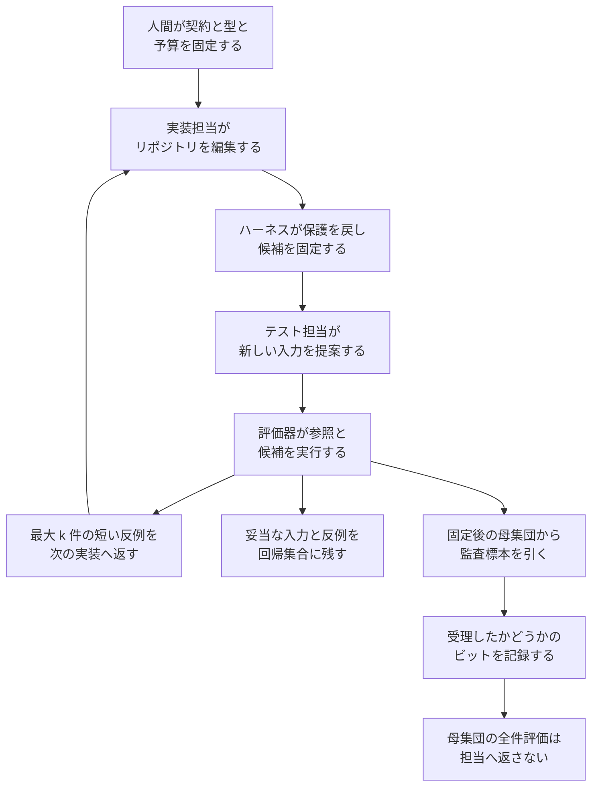

GTDD（Generative Test-Driven Development）は、AI コーディングエージェント向けのテスト駆動開発の手順です。人間が振る舞いの契約、入力の型、テストの予算を決めます。実装担当が候補を編集したあと、ハーネスがその候補と実行設定を固定します。別のテスト担当が、固定された候補に対する新しい入力を提案します。評価器が参照実装で期待応答を計算し、失敗を短くした反例を次の実装ラウンドへ返し、妥当だった入力と反例を回帰集合に残します。受け入れに使う標本は、この開発のやりとりとは別に、固定後の候補に対して母集団から引きます。

この記事は、コーディングエージェントの成果物を受け入れる人向けに、1 ラウンドの情報の流れ、見せたテストと固定後の監査で必要な件数、キーバリュー実験が比べた条件、業務へ移すときに先に固定するものをまとめます。著者は Masahiro Kato（加藤真大）です。論文に書かれた所属は Mizuho-DL Financial Technology Co., Ltd. で、連絡先メールは mkato-csecon@g.ecc.u-tokyo.ac.jp です。記述の範囲は 2026-10-02 投稿の [arXiv:2610.02952v1](https://arxiv.org/abs/2610.02952) で、2026-10-06 時点の abs ページに会議や査読誌の採録は書かれていません。

*この記事の全体像。以下、順に解説します。*

## GTDDとは

GTDD は、実装担当とテスト担当を分け、候補を固定してから新しい入力を提案させる手順です。著者の公開業績ページでは、著者の日本語名が加藤真大です。

1 ラウンドの順序は、実装の終了、候補の固定、テスト生成、監査の抽出、受理の記録、母集団評価です。母集団評価の結果は、実装担当にもテスト担当にも返しません。

テスト担当の目的は、契約に合う入力のうち、候補と参照実装が一致しないものを見つけることです。論文はこの担当を adversarial と呼びます。監査標本と母集団の結果は、この担当に渡しません。

ソースを読める担当と、契約・型・過去の反例だけを見る担当の両方を定義しています。監査標本と母集団の結果は、どちらの担当にも渡しません。

評価器は、1 ラウンドあたり最大 k 件の縮小反例を返します。元の長い入力との対応は実装担当に見せません。通った生成入力も回帰集合に残します。開発中に見せるテストと、受け入れ用の新鮮な標本は、別の集合です。見せたテストが通ることと、母集団の失敗率が許容以下であることは、別の事象として定義されています。

実証の対象は、状態を持つインメモリのキーバリューストアです。課題の中身と比較した失敗率は、後の節で条件名とともに扱います。

### 1ラウンドで動く情報

実装担当が受け取るのは、縮小反例と、受理したかどうかの 1 ビットだけです。監査の入力そのものは返りません。

人間が先に固定するのは、契約、入力の型、予算です。そのあと実装担当がリポジトリを編集し、ハーネスが保護ファイルを戻して候補を固定します。テスト担当は、その固定された候補に対する新しい入力を提案します。評価器は参照実装と候補の両方を実行します。次の実装へ返すのは短い反例だけで、妥当な入力と反例は回帰集合に残します。監査標本は固定後の母集団から引き、受理ビットを記録したうえで、母集団の全件評価は担当へ返しません。

### 損失と族ごとのリスク

候補の損失は、参照実装と応答が違うか、実行契約に違反したときに 1 になります。族ごとのリスクは、その族の有限な入力集合での失敗割合です。目標は、すべての族でリスクが許容 ρ 以下であることです。分析は、この損失が再実行で変わらないことを前提にします。

この定義が使える場面は、同じ入力に対する正答を参照が返すときです。論文の節 3.5 は、自然言語の応答のように正答が複数あるときは、ルーブリック、モデル判定、人間の判定を損失にできると書きます。そのとき保証の対象は、その判定器が付けた損失です。

## 注意点

このプレプリントは、2026-10-06 時点で v1 です。abs ページと [arXiv Atom API](https://export.arxiv.org/api/query?id_list=2610.02952) に journal_ref はありません。査読済みの実証としては読めません。未査読であることは、後述の表の数値を自動的には偽にしません。

論文 HTML に実験コードや評価トレースの公開先はありません。2026-10-06 の GitHub リポジトリ検索では、arXiv ID `2610.02952` も題名 "Generative Test-Driven Development" も 0 件でした。コード検索のヒットは抄録ミラーとダイジェストであり、実験を再実行するリポジトリではありません。[著者の業績ページ](https://masakat0.github.io/research) を同日に開いた範囲では、この arXiv ID は一覧にありませんでした。ページが投稿直後で未更新の可能性は残ります。私的な保管までは否定しません。

実験は、論文が定義したプロトコルと 4 点で違います。

- 実装モデルはツールを持たない単発の要求で、保護ファイルを編集できません。
- 候補は評価器のプロセス内で動き、トレースあたりの壁時計は 0.5 秒です。
- 反例の縮小は、指定した不一致ではなく、参照との任意の不一致を保ちます。
- 4 ラウンドのあいだ、受け入れ規則は動きません。

したがって、後の表の失敗率は、監査を開発ループに入れた結果ではありません。テストの改ざんが起きた環境の測定でもありません。

「開発中にテストを作り直すと失敗率が下がる」は、論文自身が単一の原因として切っていません。追加の 4 条件は、最初の結果を見たあとに探索として足したもので、隣接する条件の差は検出されていません。平均の差 −0.131 は、同じモデルでテストを一度だけ作る条件（後述の Static LLM）だけがほぼ全敗した 3 ブロックに強く依存します。中央値の差は −0.044 です。

評価に使う母集団と同じ分布から、開発前に 400 本引いた固定テスト（後述の Static property）の最終平均は 0.298 です。動的方針との差は検出されていません。Static LLM の最終平均 0.405 は、公開例だけの条件（0.342）とも統計的に区別されていません。

150 軌跡のうち、評価失敗率が 0.01 以下になったものは 1 つです。記録された候補に事後のゼロ失敗監査を当てると、軌跡が受理されずに終わる平均確率は 0.993 です。平均が下がっても、論文の監査が通す実装が普通に残る、という読みはできません。

ライセンスは CC BY-NC-ND 4.0 です。本文の長いままの転載は、このライセンスの範囲外になりえます。

まだ測れていないことは、次のとおりです。

- ツール付きのコーディングエージェントが、保護されたテストを書き換えようとする頻度は、この実験では測れません。
- gpt-4.1-mini 以外、および 30 ブロックより多い業務課題で、動的方針とプロパティテストの差が開くかは不明です。
- 参照実装を書く人日は、620 行という規模からの類推にとどまります。画面や権限の正答をどう固定するかは論文の外です。
- 回帰集合の再実行を含めた総実行回数は、公開された表からは復元できません。
- 著者実装が後日公開されるかは、2026-10-06 の検索では判断できません。

## 固定した候補をゼロ失敗で通す件数

制限のないケース別の候補クラスでは、見せたテストの正解をすべて特例実装できます。そのとき、n 件の既知テストが通っても、残りのケースをすべて失敗させる候補があります。受け入れるリスクの上限は 1 − n/N です。すべての受け入れ候補のリスクを ρ 以下にするには、n ≥ N − floor(ρ N) が必要です。N = 500、ρ = 0.05 では 475 件です。これは母集団の 95% です。命題 4.3 と 4.4 が、このクラスでは見せたテストだけでは母集団のほぼ全件が必要になることを示します。

候補を固定したあとに、母集団から一様に n 件引いて、失敗ゼロなら受け入れる規則は別です。悪い候補、つまり失敗数が floor(ρ N) + 1 以上の候補が、この監査を通る確率は超幾何分布で計算できます。同じ N = 500、ρ = 0.05、誤差 0.05 では、1 候補・1 族で 54 件です。このときの上限 q は 0.0472088 です。表 2 は、固定後のゼロ失敗監査なら同じ数値例で 54 件から始まることを示します。

候補に依存して選んだテストは、選択分布と母集団の関係が無ければ、母集団リスクを同定しません。命題 4.9 は、狙って作ったテストの失敗率が、被覆条件なしでは母集団リスクにならないことを示します。失敗を多く見つけることと、リスクを推定することは別の目的です。GTDD は、狙った生成を開発のフィードバックとして測り、受け入れには明示的なランダム標本を使います。

隠した固定テストを繰り返し、失敗したケースを返していくと、適応する候補はその集合を避けられます。論文は、3 つの領域を順に探る構成で、N = 500 のとき n = 131 でも、許容を超えた最終候補が隠れたテストに通る確率の正確値が 0.8082 だと計算しています。同じ 131 件を、候補固定後の新鮮な監査に使うと、悪い族が通る確率は約 0.000292 です。テストを隠すだけでは、新鮮な監査の代わりになりません。

候補クラスが、テストと独立に固定された有限集合である場合は、見せたテストでも和の上界が付きます。実装に構造の制約があれば、475 件という必要数は下がります。業務の候補クラスの大きさは、この論文は測っていません。候補クラスが小さく、見せたテストに対する和の上界で足りるなら、新鮮な監査は定理の必須条件ではなくなります。失敗ケースを返すフィードバックが続くなら、テストを隠しただけではこの関係は逆転しません。

数値例の監査サイズは次のとおりです。設定は N = 500、ρ = 0.05、誤差目標 0.05、8 軌跡、4 ラウンド、5 族です。この表は、後のキーバリュー実験（母集団 2,000、族 8、ブロック 30）とは別の数値例です。

| 保証の対象 | 正確な n | 指数の十分条件の n | その n での q |
|---|---:|---:|---:|
| 1 候補・1 族 | 54 | 59 | 0.0472088 |
| リポジトリ受理 32 機会（8 軌跡 × 4 ラウンド） | 108 | 126 | 0.00148353 |
| 族ごとの結論 160 個（32 × 5） | 131 | 158 | 0.000291773 |

ゼロ失敗監査は、許容内の候補も落としやすいです。失敗 5 件（リスク 0.01）が n = 131 を通る確率は 0.217358 です。許容境界の失敗 25 件（リスク 0.050）では 0.000403 です。失敗を少数許す監査に変えると、同じ候補を通しやすくなる代わりに、必要な n は増えます。論文の例では、リポジトリ受理を誤差 0.05 / 32 で守るとき、ゼロ失敗は族あたり 108 件です。失敗を 4 件まで許す規則は、命題 4.2 により族あたり 221 件です。失敗 5 件の同じ候補が通る確率は、221 件の規則で約 0.984、108 件のゼロ失敗で約 0.295 です。

## キーバリューストアで残った平均の差

課題は、単一クライアントのインメモリ・キーバリューストアです。Redis の部分集合で、コマンドは 61、振る舞いの族は 8 です。1 ラウンドに返す縮小反例は最大 6 件です。仕様は 2,072 語で、期待応答は 620 行の参照実装が計算します。評価集合は、固定の生成器から一度引いた 2,000 トレースで、全条件・全ラウンドで共通であり、モデルには返しません。各評価トレースは新しいサービスに 10 から 40 操作を行います。生成トレースは最大 40 操作です。

実装とテストの両方に gpt-4.1-mini、スナップショット 2025-04-14 を使います。ツールはありません。温度、nucleus、seed は API の既定です。30 ブロックは、仕様だけから作った同じ初期モジュールを共有し、その後に修復を 3 回行います。コーディングは合計 4 ラウンドです。受理ゲートはありません。

| 条件 | テストの作り方 | Round 4 の平均失敗率 | Round 3 の新しい反例の平均 |
|---|---|---:|---:|
| Public only | 公開例の成否だけ | 0.342 | なし |
| Static property | 評価と同じ分布から開発前に 400 本。別 seed | 0.298 | 4.93 |
| Static LLM | 仕様からジェネレータを 1 回。400 本を固定 | 0.405 | 3.40 |
| Dynamic blind | 修復のたびに新しいジェネレータ。仕様と過去の反例。各回 200 本 | 0.279 | 5.77 |
| Dynamic informed | Dynamic blind に加え、現在のモジュールを渡す | 0.274 | 5.37 |

全条件の Round 1 の平均は 0.548 です。主比較は Dynamic informed から Static LLM を引いたブロック内差で、−0.131、95% 区間 [−0.228, −0.050]、p = 0.0015 です。30 ブロック中 19 で Dynamic informed が低く、7 で高いです。中央値は −0.044、10% トリム平均は −0.076、同点を除く 26 ブロックの符号検定は p = 0.029 です。表 5 と表 6 は、この差を 30 ブロックの対応あり比較として示します。符号検定も負の側に残ります。

隣の条件との差は、次のとおりです。

- Dynamic informed と Dynamic blind の差は −0.005、区間 [−0.044, +0.034]、p = 0.810 です。ソースを見せた追加の検出差は、この値です。
- Dynamic informed と Static property の差は −0.024、p = 0.534 です。
- Dynamic blind と Static LLM の差は −0.126、区間 [−0.223, −0.044]、p = 0.0012 です。

妥当な生成トレースのうち、その時点の候補が失敗した割合は、Dynamic informed で 37.2%、Dynamic blind で 35.7% です。要求に対して実際に使えた本数は、Dynamic blind が 13,816 / 18,000、Dynamic informed が 14,760 / 18,000、Static LLM が 9,386 / 12,000 です。Static LLM の妥当本数の平均は 312.9 で、30 ブロック中 4 ブロックは妥当なトレースが 0 でした。動的方針では、ジェネレータ要求 90 回のうち、妥当なトレースが 0 だったのが 17 回と 13 回です。ジェネレータ出力の上限は 8,000 トークンです。

追加条件は、要求本数を 600 に揃えたうえで、一度に渡すか、200 本ずつ段階的に渡すか、毎ラウンド仕様だけで作り直すか、過去の反例も渡すかを分けたものです。Round 4 の平均は、Static LLM 600 が 0.355、Staged 600 が 0.311、履歴なしの再生成が 0.297、Dynamic blind の再実行が 0.308 です。隣接差は検出されていません。再実行と Static LLM 600 の差は −0.047、区間 [−0.121, +0.037]、p = 0.282 です。再生成、本数、過去の反例は、この追加条件では分離されていません。

反例選択時の比較は Python の等価で、報告した失敗率は JSON の等価です。JSON で件数が変わったのは 1 候補で、2,000 件中 7 件です。フィードバックを受けた候補の件数は、両方の比較で同じだと論文は書いています。

記録された 600 候補のうち、ρ = 0.05 以内は 13 です。最終候補が許容内の軌跡は 6 です。2,000 件を 1 つの母集団とみなし、1 軌跡・4 ラウンドで誤受理を 0.05 に抑えるゼロ失敗監査は 83 件です。150 軌跡で最初の受理で止めると、期待される偽受理は 0.074、許容内の期待受理は 1.01 です。600 の監査機会すべてで 0.05 を守るには 174 件で、期待偽受理は 0.00027、許容内の期待受理は 0.251 です。この計算は、監査が停止にだけ効き、候補の中身を変えない、という仮定の上にあります。節 6.3 の事後監査は、実験の失敗率の候補を論文の規則にかけると、ほぼ受理されないことを示します。

## 業務機能で同じ件数を使う条件

次の件数は、論文の式を論文の数値例に当てはめたものです。人日への換算は論文にありません。

| 読み方 | 1 回の判断で実行する検査 | 件数の出どころ | 先に要るもの |
|---|---|---|---|
| 見せたテストの合格だけで、特例実装も含めてリスク 5% 以下と保証する | N = 500 なら 475。実験の母集団 N = 2,000 なら 1,900 | 475 は節 4.2。1,900 は命題 4.4 の n ≥ N − floor(ρ N) を N = 2,000、ρ = 0.05 に当てた計算 | 各ケースの正答。候補が任意のケースを特例実装できる、というクラスの仮定 |
| 候補を固定し、1 候補・1 族を失敗ゼロで監査する | 54 | 表 2。N = 500、ρ = 0.05、α = 0.05 | 開発前に固定した母集団。再実行で損失が変わらないこと |
| 8 軌跡 × 4 ラウンドのリポジトリ受理を、誤差 0.05 で守る | 族あたり 108。族が 5 なら 540 | 108 は表 2。540 は 108 × 5 の計算 | 同上。族ごとの母集団 |
| 同じ設定で、族ごとの結論も同時に守る | 族あたり 131。5 族なら 655 | 131 は表 2。655 は 131 × 5 の計算 | 同上 |
| 実験の 2,000 トレースを 1 母集団にし、1 軌跡 4 ラウンドを守る | 83 | 節 6.3。族ごとではない | 参照との一致で定義した集計失敗率 |
| 実験の動的な開発ループそのもの | 修復 3 回で要求 600 本（200 × 3）。30 ブロック合計の妥当本数は Dynamic blind で 13,816 | 節 6.2 | 参照実装、ジェネレータ、候補と参照の両方での実行 |

開発ループの要求本数（1 ブロック 600）は、事後監査の例（83 や 54）より大きいです。監査の標本サイズだけを見ると、開発中に回すトレースより少ないです。この少なさは、正答を返すものと、事前に凍結した母集団があるときの話です。

KV 実験の正答は、620 行の参照実装と 2,072 語の仕様です。業務機能にこれに相当する参照が無い場合、失敗率は定義できません。人間が 1 件ずつ見るなら、上の 54 から 655 は、受理 1 回あたりの判定回数になります。これは標本サイズからの読み替えであり、論文が人件費として書いた数ではありません。

付録 B は、縮小の最悪回数を、元トレース 1 本あたり最大 L + L^2、1 ラウンドあたり最大 4k(L + L^2) と置いています。実験の k = 6、生成長の上限 40 を入れると、1 ラウンドあたり 4 × 6 × (40 + 1,600) = 39,360 回です。これは観測された実行回数ではなく、プロトコルの上限です。実験は、24 本のプールから族の被覆と長さで最大 6 件を選んでいます。

節 2.1 は、機械負荷で結果が変わる壁時計制限を、固定損失の仮定を破るものとして挙げています。実験はトレースあたり 0.5 秒の壁時計を使うので、この破れ方に該当しえます。負荷によって結果が変わったとは、論文は報告していません。画面、永続データベース、権限、外部 API のように、同じ入力でも結果が変わる業務では、54 件や 83 件の超幾何の確率を、その候補の母集団リスクとして使えません。母集団を候補のあとで定義し直す場合も、同じ確率は使えません。

回帰集合を毎ラウンド再実行する回数の合計は、論文が報告していません。開発コストの下限として使えるのは、要求したトレース本数と、返した反例の再実行です。

## 緑のテストを受け入れ完了にしない

開発中の回帰と、候補を固定したあとの受け入れ検査は分けます。分ける理由は、失敗率の平均が 0.131 下がったことではなく、見せたテストの合格が母集団リスクにならないクラスが論文の中で明示されていることです。

1. セッションに見せたテストが緑でも、受け入れ完了と記録しません。テストの作成者（人、プロパティ生成器、LLM テスター）と、そのテストを実装が固定の前に見ていたかを残します。
2. 受け入れ用の標本は、固定のあとで引き、実装担当へ返しません。件数は、母集団サイズ、許容失敗率、誤差、ラウンド数、族の数から決めます。見せたテストの件数を流用しません。N = 500、ρ = 0.05 の数値例では、1 候補・1 族のゼロ失敗で 54 件、見せたテストだけで同じ保証をするなら 475 件です。
3. テスターにソースを見せることを、この実験を理由に必須にしません。検出された追加の差は −0.005 で、p = 0.810 です。
4. 評価したい入力分布を自分で書けるなら、動的な LLM 生成の前に、その分布からの固定テストを置きます。実験では、この固定テスト（Static property、最終平均 0.298）と動的方針の差は検出されていません。
5. 業務機能では、監査件数の前に、正答を返す参照か再現可能な判定手順と、開発前に凍結する入力リストを見積もります。リストを凍結できない、または同じ入力の結果が負荷や外部状態で変わるなら、54 件や 83 件という数は使いません。
6. 失敗率が実験の最終平均（0.27 前後）のままなら、論文の事後計算では監査はほぼ却下します。監査の分離は、緑の意味を限定する手続きであり、実装を合格圏まで上げる手続きではありません。

読むときは、次の 2 つに分けます。実装担当に見せたテストの合格は、受け入れの証拠として読みません。作成主体と、候補がそのテストを見る前に固定されていたかを残し、受け入れは固定後の別標本で行います。実験の動的方針は、同じモデルの一回生成より最終失敗率の平均が低いです。この差を、再生成という単一要因の効果としては読みません。

## まとめ

GTDD は、人間が契約・型・予算を固定し、実装候補を凍結してから別担当に新しい入力を提案させ、短い反例だけを次の実装へ返す手順です。受け入れ用の標本は、そのやりとりの外で、固定後の母集団から引きます。見せたテストの合格だけでリスク 5% を保証するには、N = 500 の数値例で 475 件が必要です。候補固定後のゼロ失敗監査なら、同じ設定の 1 候補・1 族で 54 件から始まります。

キーバリュー実験では、Dynamic informed の Round 4 平均失敗率 0.274 が、Static LLM の 0.405 より低いです。ブロック内差の平均は −0.131 で、中央値は −0.044 です。目標分布から先に引いた固定テストとの差、およびソースを見せたことによる差は、検出されていません。実験は単一モデル、ツール無し、監査ゲート無しです。画面や外部状態で結果が変わる業務では、54 件や 83 件を母集団リスクの監査サイズとして使いません。

この記事が少しでも参考になった、あるいは改善点などがあれば、ぜひリアクションやコメント、SNSでのシェアをいただけると励みになります！

## 参考リンク

- Kato, Masahiro. "GTDD: Generative Test-Driven Development for AI Coding Agents with Adversarial Testing." arXiv:2610.02952v1, 2026-10-02. [abs](https://arxiv.org/abs/2610.02952) / [HTML](https://arxiv.org/html/2610.02952v1) / [DOI](https://doi.org/10.48550/arXiv.2610.02952)（abs ページは登録が pending と注記しています）
- 著者の業績一覧（この arXiv ID は 2026-10-06 取得時の一覧に無い）: [masakat0.github.io/research](https://masakat0.github.io/research)
- 書誌の機械可読版: [arXiv Atom API](https://export.arxiv.org/api/query?id_list=2610.02952)
