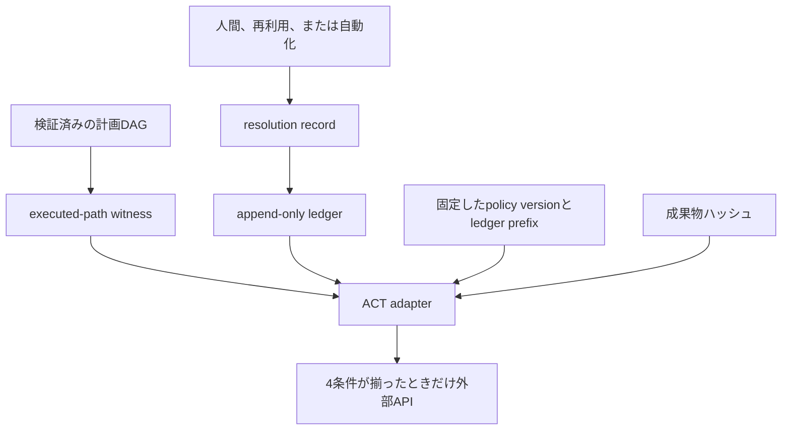
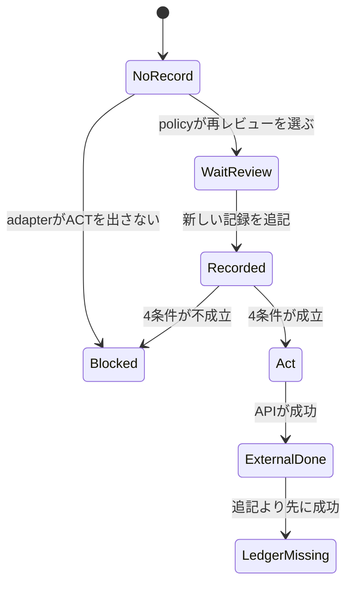

LLM のワークフローが、送信、課金、削除、保護ブランチへの merge のように取り消せない外部操作を行うとき、人間の承認をどこに置くかが問題になります。画面のクリックや、終わったあとの監査ログに置くと、ワークフロー自身は「危険な経路がゲートを通ったか」を実行直前に検査できません。

本稿は、2026年9月2日提出の preprint [arXiv:2610.00037v1](https://arxiv.org/abs/2610.00037) が述べる Guarded Commits を、その直前検査の設計として読みます。ライセンスは [CC BY 4.0](http://creativecommons.org/licenses/by/4.0/) です。読後に残るものは、承認記録がどの入力に束縛されるか、既存の待機や必須レビューとどこが違うか、送信・課金・削除へ読み替えたときに何が残るか、の3点です。

*この記事の全体像。以下、順に解説します。*

## Guarded Commitsとは

Guarded Commits は、LLM ワークフローが取り消せない外部操作を実行する直前に、人間の承認がその操作の経路、ポリシー版、成果物に束縛されているかを検査する設計です。著者は Laurent Bindschaedler（MPI-SWS）、Ferdi Kossmann（MIT CSAIL）、Chunwei Liu（Purdue University）、Jason Mohoney（MIT CSAIL）です。主分類は cs.DB、横断に cs.SE があります。会議採録の記載は無く、code と data の URL も文書にありません。

承認は、追記専用台帳の resolution record になります。監査ログは過去の説明に残ります。次の操作を認可するのは、型付きの記録です。

設計の前提として、外部 API を呼ぶ資格情報は ACT adapter だけが持ちます。エージェントプロセスはコミットを認可しません。

計画は RETRIEVE、VERIFY、HUMAN、ACT の DAG です。HUMAN の決定は APPROVE、EDIT（差分 Δ）、REJECT です。ゲートあたりの decision source は1つです。多者承認、連続ストリーム、信頼基盤の侵害は、この設計の対象外です。

決議の出どころは、人間、過去決定の再利用、宣言済みの自動化ルールのいずれかです。出どころが変わっても検査は同じです。再利用のたびに、新しい derived record を追記します。

ガバナンスポリシーは「何を承認するか」を定めます。レゾリューションポリシーは「どう承認を得るか」を定めます。後者は、コミット述語を変えずに差し替えられます。

ここでの transaction は、不可逆な副作用に対するコミット規律です。原子的ロールバック、二相ロック、任意ツール状態のスナップショット分離は、この設計の提供範囲に入りません。

実行直前の検査は、検証済みの計画、追記された決議、固定したポリシーと台帳、成果物ハッシュを、adapter が突き合わせる構造です。

コミット時の述語は、次の4条件の連言です。1つでも欠けると、adapter は ACT を出しません。計画または経路の失敗は検証へ戻ります。決議が無いか無効なら、レゾリューションポリシーへ戻ります。そのポリシーは、新鮮な人間レビューを要求できます。

| 条件 | 検査するもの |
|---|---|
| 1. 経路被覆 | witness が検証済み DAG の1本の obligation に一致し、その obligation に適格な解決済みバリアを含む。別経路のバリアでは、この経路を満たさない |
| 2. ピン留め | 決議が、トランザクション開始時に固定した governance-policy version と ledger prefix の下で作られている |
| 3. 成果物 | ACT が消費するハッシュが、決議に束縛されたものと一致する。EDIT は (Hpre, HΔ, Hpost)。追記後の改変は記録を無効にする |
| 4. 再利用または自動化 | 再利用は、正規形の一致、資格情報の鮮度、非派生の根への推移、新鮮な derived record。自動化は、宣言された verifier の通過 |

たとえば merge なら、adapter は「この実行経路の、この diff ハッシュを、固定したポリシー版の下で解決した記録があるか」を見てから API を呼びます。記録が「Alice が承認した」とだけ言う場合、成果物、経路、ポリシー版は特定できません。

## 注意点

論文が示した範囲は、合成計画の単体テストと、公開トレースからの記録再構成です。デプロイ済みの承認パイプラインより安全であること、判断が正しかったことは、示していません。[§6](https://arxiv.org/pdf/2610.00037) は、契約が保証するのは「記録された証拠に対する、ポリシー上有効な resolution」であり、レビュア、ポリシー、自動化ルールの判断の正しさではない、と書きます。

| 見てよいもの | 見てはいけない読み |
|---|---|
| 無故障計画の受理と、注入した3種の故障（ゲート欠落、種類の違い、経路被覆の不足）の拒否。false accept 0、false reject 0。精度 1.000（999/999 の合成 DAG） | 本番の迂回耐性、資格情報の閉じ込め、adapter の安全性。999件が無故障と故障にどう割れるかは、本文に分解が無い |
| 成果物があるトレース 252,386/252,386 で、記録された content hash を Playback が再生した | ライブのエンドポイント再生、レビュー画面の忠実性。Live Re-run は評価外 |
| 台帳が、W-Tran の不一致増加を1本の bypass ルールに帰属できた | そのルールが安全であること。迂回コホートの条件付き不一致は 5.20 / 8.21 でおよそ 63% と論文が書く |
| 公開トレース合計 271,035件（W-PR 33,056、W-Tran 236,532、W-Sugg 1,447） | AIDev 論文 [arXiv:2602.09185](https://arxiv.org/abs/2602.09185) の要旨にある AIDev-pop 33,596 PR。差 540 の理由は Guarded Commits 内に無い。実験規模には 33,056 traces だけを使う |

評価を読むときの限定は、ほかにもあります。

- ネイティブな credential proof は、3ワークロードとも 0% です。Cache only の回避率は、資格検査まで通った再利用ではありません。保守的な正規化の下での、文脈の再出現です。
- 能力述語のブロック率 30.0% / 28.9% / 16.7%（W-PR / W-Tran / W-Sugg）は、trace id を valid 75%、missing 10%、wrong-role 10%、expired 5% に振った合成です。実在の認可失敗率ではありません。
- 不一致は、記録された人間の決定との食い違いです。正しさの指標ではありません。severity で重み付けした損失の上界でも下界でもありません。
- 設計上、保護ブランチへの merge は「局所ロールバックではきれいに取り消せない操作」です。評価上、W-PR と W-Sugg の決定はおおむね可逆で、W-Tran は外部に見える出版である、とも書きます。同じ語の「取り消し」が、設計の定義と評価の被害の重さで違います。
- 再現用のコードとデータの URL は、abs と本文にありません。2026年10月3日の GitHub リポジトリ検索（題名クエリ）は 0件でした。別名の実装が無いことまでは言えません。

## 既存のゲートは何をすでに持つか

論文 Appendix A の Table 3 は、調査した機構が4条件を初期状態で一式は持たない、とします。2026年10月3日に開いた公式ページは、その記号と正面から衝突しませんでした。同時に、待機や必須レビューは既にあります。「既存はクリックか監査ログだけ」と言うと、公式ページより狭くなります。

C1 は executed-path witness です。C2 は policy と ledger のピン留めです。C3 は成果物の束縛です。C4 は、再利用のたびに新しい derived record を残すことです。

| 機構 | 論文 Table 3 | 2026年10月3日に確認した公式の機能 | この設計との差 |
|---|---|---|---|
| GitHub branch protection と Copilot agent（論文 Table 3 の行名）。公式で開いたのは [protected branches](https://docs.github.com/en/repositories/configuring-branches-and-merges-in-your-repository/managing-protected-branches/about-protected-branches) | C1 部分、C2 無し、C3 部分、C4 無し | マージ前の必須レビュー。既定では admin と bypass 権限は制限の外に置ける。承認時点の diff を記録し、diff が変わると承認を stale にするのは、「Dismiss stale pull request approvals」を有効にしたときの任意設定 | merge という1操作には、すでにコミット時ゲートがある。凍結した証拠一式、ポリシー版、実行経路、再利用のたびに新しい記録、まではこのページに無い。Copilot 側の差分は未確認 |
| [Temporal の Approval pattern](https://docs.temporal.io/design-patterns/approval) | BPM / Temporal 行は C1 部分、C2 部分、C3 無し、C4 無し | Signal が届くまで待つ。タイムアウト経路は、実装により拒否、エスカレーション、または timeout 状態になる。公式は typically rejection or escalation と書き、基本例は TIMEOUT を返す。承認者、理由、時刻を Signal に載せられる | 待つこと自体は既存のパターンである。コンテンツアドレスされた証拠、台帳接頭辞、derived record、資格情報の閉じ込めは、このパターン単体には無い |
| Claude Code / Cursor のコマンド時許可 | 4条件とも無し | 論文が参照する範囲では、許可プロンプト、allowlist、監査ログ。論文は、bash が利用者のシェル資格情報に届くため、adapter を迂回できる、と書く | コマンド時のゲートは残してよい。コミット述語の代わりにはならない、というのが論文の位置である |
| Guarded-commit 層 | 4条件とも設計として提供 | 公開された実装は論文から辿れない | 設計の有無と、動く adapter の有無は分ける |

## 設計文と実証の境目

現時点で論文にあるのは、「不可逆操作の直前条件として、承認記録を経路・ポリシー版・成果物に束縛する」という設計文です。その設計が送信、課金、削除を安全にする、という実証は論文にありません。

支持として残るものは、次の4点です。

- ログは過去の記述であり、次の操作の認可述語ではありません。
- エージェントが merge 資格情報を持ち、人間が別の画面で diff を見る、という分離があります。資格情報の閉じ込めが無いと、承認ゲートを呼ばずに API を叩けます。
- 4条件を欠く ACT を、adapter は出しません。
- 自動化が危険側に振れたとき、台帳がルールを指せた、という W-Tran の帰属があります。Cache only は回避 16.79%、全体不一致 5.35% です。ルールが回避を 8.21 ポイント、全体不一致を 5.20 ポイント足しました。

結論を弱めるものは、次の5点です。

- 追記の前に外部 API が成功すると、次の読み手はコミットが無いと見ます。論文がそこから行うのは、同じ対象への追加 ACT を止めるか、再レビューを求めることです。局所ロールバックはありません。起きた送信、課金、削除は残ります。
- 追記のあと API が失敗した再試行は、resolution-record のハッシュから導いた冪等キーに依存します。相手がキーを守らなければ、二重実行は残りえます。exactly-once は adapter の冪等契約次第です。この論文は決済 API で測っていません。
- バリデータは、著者生成の非巡回 DAG の単体テストです。巡回（リトライや別レビュアのループ）は、トランザクションごとに有限 DAG へ展開する前提です。
- 信頼基盤（transaction manager、plan validator、ACT adapter、台帳追記）のどれかを支配されると、保証は落ちます。基盤は正直だと仮定しています。
- 近接する preprint は別設計です。[arXiv:2610.00327](https://arxiv.org/abs/2610.00327) は主張と実行 prefix の receipt、[arXiv:2610.00354](https://arxiv.org/abs/2610.00354) はオンチェーン取引の署名前検査、[arXiv:2607.10487](https://arxiv.org/abs/2607.10487) は古い権限証拠のコミット時拒否、[arXiv:2608.21159](https://arxiv.org/abs/2608.21159) は予約を1つに保つ配送です。これらの数値を、この論文の安全性の根拠には使いません。

## 送信、課金、削除に読み替える

論文は、送信、課金、削除の3操作を定義していません。承認者不在を「待つ、拒否、他経路は進む」という3状態としても定義していません。次の表は、失敗意味論をその3操作へ当てはめた読み替えです。状態名は本稿の名前であり、論文の結果ではありません。

論文が操作の種類を問わず言うことは1つです。一致する記録が無い ACT は、adapter が出しません。決議が無ければレゾリューションポリシーへ戻り、そのポリシーは人間レビューを要求できます。要求は may であり、待機の義務ではありません。不可逆でないエージェントのやり取りは、人間レビューの対象にしなくてよい、と論文は書きます。これは「同じ ACT への別経路を進めてよい」ではありません。別経路で解決したバリアは、この経路の被覆になりません。

| 読み替えの状態 | 論文の制御 | 送信 | 課金 | 削除 |
|---|---|---|---|---|
| 待つ | レゾリューションポリシーが新鮮な HUMAN を要求する | 送る API は呼ばない。承認が付くまで同じ送信は出さない | 同じ。承認者が1人の契約しか論文は扱わない | 同じ。削除 API は呼ばない |
| 拒否 | adapter が ACT を出さない | 未送信のまま終わる経路を選べる | 未課金のまま終わる経路を選べる | 未削除のまま終わる経路を選べる |
| 他経路は進む | 不可逆でない処理は人間レビューの対象外。同じ ACT の別経路は被覆にならない | 下書きや照会は進んでよい。別経路の承認ではこの送信を出さない | 残高照会は進んでよい。別経路の承認ではこの課金を出さない | 一覧表示は進んでよい。別経路の承認ではこの削除を出さない |
| 記録が無い成功 | 追記前に API が成功すると、台帳上は未コミット。追加 ACT を止めるか再レビューする | 送信済みは残る。台帳は未完了のままである | 課金済みは残る。再試行で二重課金しうる | 削除済みは戻らない。台帳は未完了のままである |

上の図は読み替えです。`LedgerMissing` は「外部 API は成功し、台帳にはコミットが無い」です。操作の取り消しではありません。

多者承認は Appendix C の未解決問題です。単一 resolver を k-of-n や、役割の異なる複数バリアへ広げる余地は、論文が書きます。独立性、利益相反、連鎖するエスカレーションは未評価です。課金で二人の承認を必須にする制御は、この論文の結果からは出ません。

## 取引相手の確認は別の述語になる

取引相手の身元確認は、論文の述語にありません。別レイヤーのコミット条件として置くことは、構成上の提案です。論文がすでに分けている層は、次の3つです。

| 層 | 固定するもの | 論文での位置 |
|---|---|---|
| 承認者の能力 | 誰がこのバリアを解決してよいか。資格情報は今も有効か | 条件4の鮮度検査。ゲートあたり1 resolver |
| 経路と成果物 | どの実行経路の、どのハッシュを承認したか | 条件1と条件3 |
| 鍵の所在 | 外部 API を呼べる資格情報は adapter だけが持つか | 前提。IDE 上のエージェントでは未解決、と論文が書く |

ここに「誰に送るか、誰に払うか」を足すなら、それは4つ目の述語です。承認者が正しい人でも、送り先が違えば条件3の成果物ハッシュが変わる、という形で条件3に吸収できる場合があります。吸収できない相手確認（口座名義、制裁リスト、本人確認）は、この4条件の外に置きます。外に置いた検査も、実行直前の必須入力にし、欠ければ ACT を出さない、という同じ失敗意味論に乗せられます。その乗せ方は、論文の実験対象ではありません。

## まだ数値が閉じていない点

次の点は、論文と公開資料だけでは閉じていません。

- 33,056 traces と、AIDev 論文 arXiv:2602.09185 の要旨にある 33,596 PR の差 540 は、フィルタか版違いか。Guarded Commits は説明しません。Hugging Face [`hao-li/AIDev`](https://huggingface.co/datasets/hao-li/AIDev/blob/main/README.md) の main（2026年10月3日時点の v4 カード）には、33,596 はありませんでした。
- 999件の合成 DAG のうち、無故障が何件か。333トポロジ × 故障3種 = 999 と、無故障を含む 999 が、本文だけでは決まりません。
- 資格情報を閉じ込めた本番の agent runtime で、4条件を迂回せずに強制できるか。論文はデプロイ問題として残しています。
- 追記前成功と、冪等キーを守らない相手 API の組み合わせで、送信、課金、削除が何件二重化するか。測定はありません。
- 日本語の二次解説は、2026年10月3日の検索では確認できませんでした。

## 運用に書くならこの3点まで

承認を画面のゲートではなく、外部操作の直前の必須入力として書く、というのがこの設計から取れる運用です。書いてよい主張は、次の3つに限られます。

1. 記録が経路、ポリシー版、成果物に束縛されていない承認は、コミット述語になりません。ログに成功とあっても、台帳に対応する resolution が無ければ、ワークフロー上のコミットはありません。
2. その「無い」は台帳の状態です。追記より先に API が成功していれば、送信、課金、削除は残ります。未完了の記録は、補償トランザクションを別に要求する理由になります。
3. 承認者の能力と、取引相手の身元は、別の述語です。論文が実験したのは前者を含む4条件です。後者は、本稿が重ねる層です。多者承認は未解決として書きます。

書いてはいけない主張は、999/999 や 252,386件のハッシュ一致を安全性の証明にすること、33,596 PR をこの実験の規模にすること、承認者不在の3状態を論文の定義として書くことです。

自動化ルールを、この設計の推奨には含めません。W-Tran の約 63% は、そのルールが新たに回避したコホートについて、記録された人間の決定と条件付きで食い違った割合（5.20 / 8.21）です。論文はこのルールを、単体では安全でないクラス単位の bypass と呼びます。宣言した verifier が拾わない失敗モードのラベルは別監査で、不一致 25,004件のうち 3,444件（13.8%）の例示です。残り 86.2% は未分類で、精度と再現率の手監査はしていません。

## まとめ

Guarded Commits は、取り消せない外部操作の直前に、resolution record を経路、ポリシー版、成果物ハッシュ、再利用または自動化の妥当性と突き合わせる設計です。資格情報は ACT adapter に閉じ込め、エージェントプロセスにはコミットを認可させません。

論文の証拠は、合成 DAG の故障注入と、271,035件の公開トレースの再生に限られます。判断の正しさ、本番の迂回耐性、送信・課金・削除の安全性は示していません。追記より前に API が成功すれば、台帳が未完了でも副作用は残ります。

既存の protected branch や Temporal の Approval は、必須レビューや待機をすでに持ちます。凍結した証拠一式と、再利用のたびに新しい記録と、資格情報の閉じ込めまでは、それらのページだけでは足りません。公開された adapter 実装は、論文から辿れません。

運用に書くなら、束縛されていない承認はコミット述語にならないこと、台帳上の未完了は副作用の取り消しではないこと、相手の身元は別述語であること、の3点に留めます。多者承認と、危険側に振れた自動化ルールは、未解決のままにします。

この記事が少しでも参考になった、あるいは改善点などがあれば、ぜひリアクションやコメント、SNSでのシェアをいただけると励みになります！

## 引用文献

- Bindschaedler, L., Kossmann, F., Liu, C., Mohoney, J. Guarded Commits: Transactional Human Approvals for LLM Workflows. arXiv:2610.00037v1, 2026-09-02. [abs](https://arxiv.org/abs/2610.00037) / [PDF](https://arxiv.org/pdf/2610.00037) / [doi:10.48550/arXiv.2610.00037](https://doi.org/10.48550/arXiv.2610.00037)
- Li, H., Zhang, H., Hassan, A. E. AIDev: Studying AI Coding Agents on GitHub. MSR 2026. doi:10.1145/3793302.3797249. arXiv:2602.09185。要旨の AIDev-pop は、star が 100 を超えるリポジトリからの 33,596 PR。[abs](https://arxiv.org/abs/2602.09185)
- Hugging Face `hao-li/AIDev` の main README は、2026年10月3日時点では AIDev v4 のカードであり、33,596 の出典には使いません。[README](https://huggingface.co/datasets/hao-li/AIDev/blob/main/README.md)
- GitHub Docs. About protected branches. [公式](https://docs.github.com/en/repositories/configuring-branches-and-merges-in-your-repository/managing-protected-branches/about-protected-branches)
- Temporal Docs. Approval pattern. [公式](https://docs.temporal.io/design-patterns/approval)
- Laxström, N., Giner, P., Thottingal, S. Content translation. EAMT 2015. [論文](https://aclanthology.org/W15-4925/)
- Lee, M., Liang, P., Yang, Q. CoAuthor. CHI 2022. doi:10.1145/3491102.3502030

参考文献には Content translation と CoAuthor も挙がっています。本稿の数値は、これらを W-Tran や W-Sugg の定義としては結び付けていません。近接 preprint は本文のリンクだけを置き、この論文の安全性の根拠には使いません。
