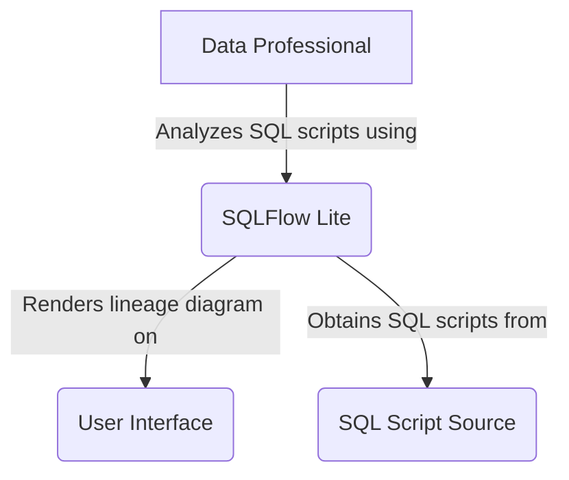
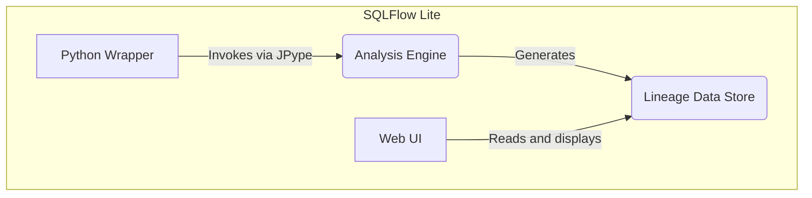
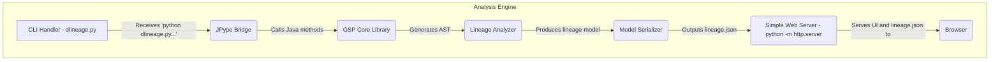
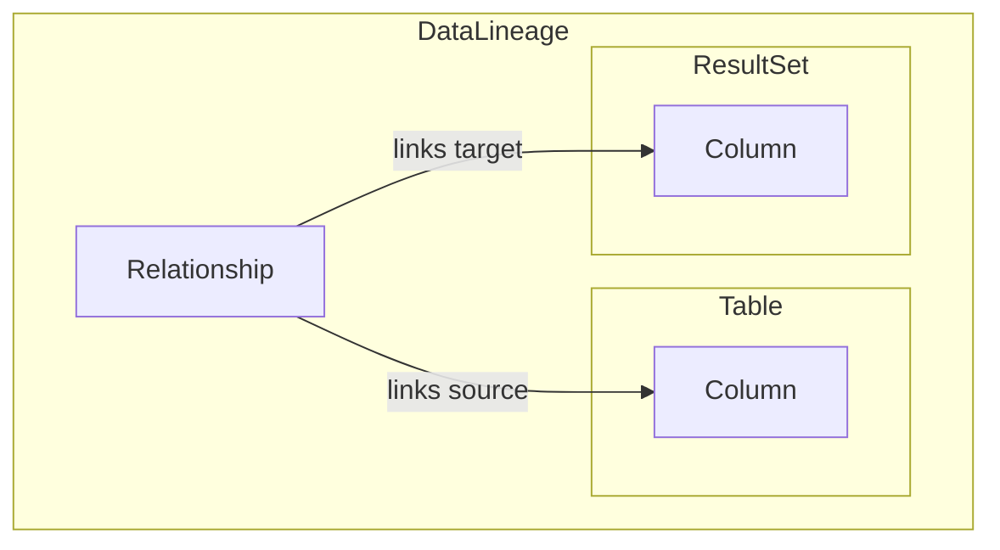
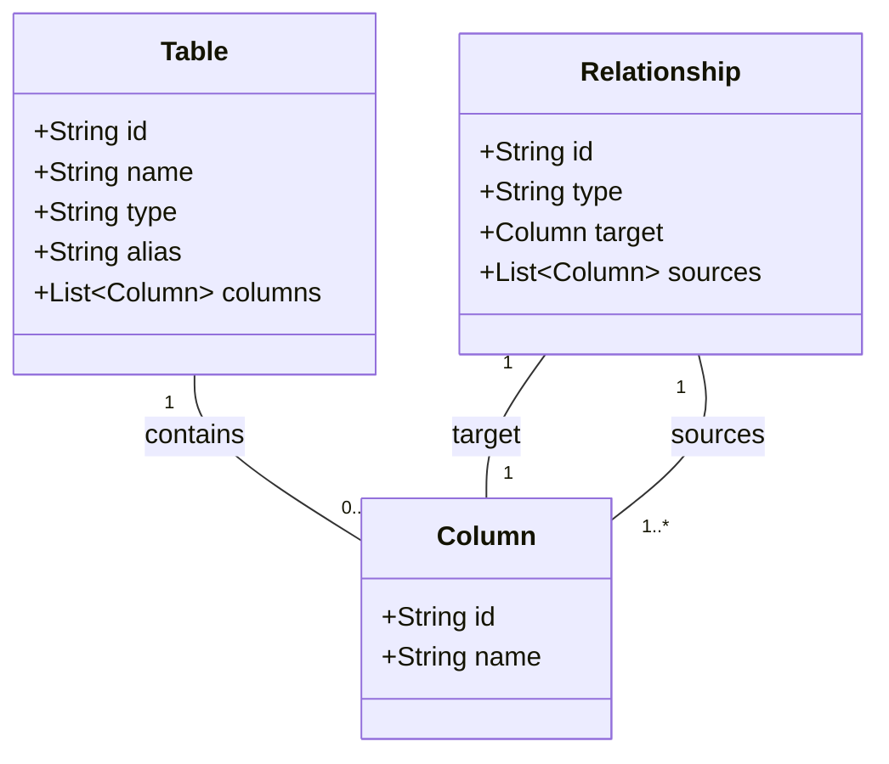

データエンジニアやデータアナリストにとって、複雑に絡み合ったSQLが「どのテーブルのどのカラムからデータを取得し、どこへ流しているのか」を正確に追跡する「データリネージ」は、データ品質の保証や影響範囲の調査に不可欠です。しかし、手作業での追跡はしばしば悪夢のような作業になりがちです。

https://zenn.dev/suwash/articles/stored_procedure_analysis_20250625

この記事では、前回紹介した製品の中から「Gudu SQLFlow」の無償版「Gudu SQLFlow Lite」の情報を整理します。

## ■概要

Gudu SQLFlowは、SQLクエリを解析し、データの流れを可視化する自動データリネージツールです。データベース、ETLプロセス、BI環境にまたがるデータの移動を、カラムレベルの粒度で追跡し、図で表示します。

この記事が対象とする「Gudu SQLFlow Lite」は、GitHubで公開されているJava版（`java_data_lineage`）およびPython版（`python_data_lineage`）の無償パッケージを指します。これらは非商用利用に限定され、開発者がアプリケーションにデータリネージ解析機能を組み込んだり、ローカル環境でSQLスクリプトを分析したりするために利用します。

この名称は、GuduSoftが提供する有償クラウドサービス「Lite Account」とは異なります。名称を合わせているのはマーケティング戦略の一環と考えられます。無償のGitHub版を入口として開発者に強力なコアエンジンを体験してもらい、商用利用や高度な機能が必要になったユーザーは、有償プラン（Lite Account, Premium Account）やOn-Premise版に切り替えられます。利用者は、非商用の開発か商用利用かという目的に応じて、適切なバージョンを選択する必要があります。

## ■特徴

Gudu SQLFlow Liteは、データリネージ解析ツールとして以下の主要な特徴を持ちます。

  * **カラムレベルのデータリネージ**
      * カラム間の依存関係を詳細に追跡し、データの発生源から最終出力までの流れを可視化します。これにより、影響分析や根本原因分析が可能です。
  * **広範なSQL方言のサポート**
      * Oracle、Snowflake、Amazon Redshift、Google BigQuery、SQL Server、Hiveなど、20種類以上の主要なデータベースのSQL方言に対応します。
  * **複雑なSQLの処理能力**
      * 最大10,000文字までの複雑なSQLステートメントを処理します。ストアドプロシージャや動的SQLといった高度な構文も含まれます。
  * **対話的な可視化**
      * 解析結果をウェブブラウザ上で操作可能な対話型のダイアグラムで表示します。ノードをクリックすると、関連するデータの流れがハイライトされます。
  * **多様な出力フォーマット**
      * 解析したリネージメタデータを、JSON、CSV、GraphML形式で出力できます。これにより、他のデータガバナンスツールとの連携が容易になります。
  * **オフラインでの実行**
      * GitHubで提供されるLite版は、インターネットやデータベースへの接続を必要とせず、ローカル環境で完結して実行できます。これにより、データのプライバシーを保ちながら利用可能です。
  * **ER図の自動生成**
      * DDL（Data Definition Language）スクリプトを解析し、テーブル間の関係性に基づいたER（Entity-Relationship）図を自動で生成します。

## ■商用版とLite版の違い

Gudu SQLFlowは、利用目的や規模に応じて複数の製品を提供しています。以下の表は、無償のLite版（GitHub）からエンタープライズ向け製品までの主な違いをまとめたものです。

| 項目 | Lite (GitHub) | Lite (Cloud) | Premium (Cloud) | On-Premise | Enterprise |
| :--- | :--- | :--- | :--- | :--- | :--- |
| **費用** | 無料 (非商用) | $10/月 | $49.99/月 | $500/月〜 | 要問い合わせ |
| **デプロイ** | セルフホスト | クラウド (SaaS) | クラウド (SaaS) | セルフホスト | セルフホスト |
| **ライセンス** | 非商用 | 商用 (サブスク) | 商用 (サブスク) | 商用 (サブスク/永続) | 商用 (再配布権) |
| **SQL解析上限** | 無制限 (ローカル) | 300 SQL/月 | 10,000 SQL/月 | 無制限 | 無制限 |
| **REST API** | × | ○ | ○ | ○ | ○ |
| **DB直接接続** | × | ○ | ○ | ○ | ○ |
| **Gitリポジトリ連携** | × | ○ | ○ | ○ | ○ |
| **Javaライブラリ組込** | ○ | × | × | × | ○ |
| **サポート** | コミュニティ | スタンダード | スタンダード | プレミアム | コア開発チーム |
| **データソース数** | 5 | 7 | 14 | 14 | 14 |

この比較から、GitHubのLite版は開発、評価、非商用プロジェクト向けのツールであることがわかります。一方、商用環境での利用や、REST API、データベース直接接続などの高度な機能を求める場合は、有償のクラウドプランやOn-Premise版が必要です。

## ■Java版、Python版、依存ライブラリの関係性

Gudu SQLFlow LiteのJava版とPython版は、異なる言語で提供されていますが、内部構造は密接に関係しています。

### ●関係性

Python版（`python_data_lineage`）は、SQL解析のコアロジックを自身に含んでいません。実体は、Javaで記述されたSQL解析エンジン（`gsp.jar`）を呼び出すラッパープログラムです。Pythonスクリプトはユーザーからの入力を受け付け、処理を内部のJavaライブラリに委譲します。

この言語間連携は`jpype`ライブラリが実現します。`jpype`はPythonプロセス内でJava仮想マシン（JVM）を起動し、PythonコードからJavaのメソッドを呼び出せるようにします。

結果として、`python_data_lineage`は以下の3つの技術要素で構成されます。

1.  **Javaライブラリ**: SQLを解析するコンパイル済みのコアエンジン
2.  **Pythonスクリプト**: ユーザーが操作するコマンドラインインターフェース
3.  **JavaScriptライブラリ**: 解析結果をブラウザで可視化する静的ウェブコンテンツ

この設計により、GuduSoft社は高性能なJava製パーサーを一つ維持するだけで、Pythonユーザーにも機能を提供できます。しかし、Python開発者がこのツールを利用するには、通常は不要なJava開発キット（JDK）を環境にインストールする必要があります。

### ●依存ライブラリ

各バージョンの実行に必要な主要な依存関係は以下の通りです。

| バージョン | 依存関係 | 役割 |
| :--- | :--- | :--- |
| **Java版** | Java JDK 1.8 | 実行環境 |
| | Maven | ビルドツール |
| **Python版** | Python 3 | 実行環境 |
| | Java JDK 1.8 | コアエンジン(Java)の実行環境 |
| | jpype | Python-Java連携ブリッジ |

## ■構造

Gudu SQLFlow LiteのアーキテクチャをC4モデルで段階的に説明します。

### ●システムコンテキスト図



| 要素名 | 説明 |
| :--- | :--- |
| Data Professional | データアナリスト、データエンジニア、開発者など、SQLのデータリネAGEを分析するユーザー |
| SQLFlow Lite | SQLスクリプトを解析し、データリネージ情報を生成する対象システム本体 |
| SQL Script Source | 解析対象のSQLスクリプトが格納されている場所（ローカルファイルシステムなど） |
| User Interface | 解析結果のデータリネージ図を表示するインターフェース（通常はウェブブラウザ） |

### ●コンテナ図 (python版)



| 要素名 | 説明 |
| :--- | :--- |
| Python Wrapper | ユーザーからのコマンドを受け付け、解析エンジンを呼び出すPythonスクリプト |
| Analysis Engine | SQLの構文解析とリネージ計算を行うJava製のコア解析エンジン（JARファイル） |
| Lineage Data Store | 解析結果のデータリネージ情報が格納される場所（ファイルシステム上のJSONファイルなど） |
| Web UI | Lineage Data Storeから情報を読み込み、対話的なダイアグラムを描画する静的なHTML/JavaScript |

### ●コンポーネント図 (python版)

Analysis Engineコンテナの内部コンポーネントと連携を示します。



| 要素名 | 説明 |
| :--- | :--- |
| CLI Handler | コマンドライン引数を解釈し、解析プロセス全体を制御する `dlineage.py` スクリプト |
| JPype Bridge | PythonとJava間の通信を仲介し、Javaの解析ライブラリを呼び出すコンポーネント |
| GSP Core Library | SQLテキストを解析し、抽象構文木（AST）を生成する中核ライブラリ |
| Lineage Analyzer | ASTを走査し、テーブルやカラム間の依存関係を特定してデータリネージモデルを構築 |
| Model Serializer | 構築したデータリネージモデルをJSONなどのファイル形式に変換（シリアライズ） |
| Simple Web Server | 可視化UIと生成したJSONファイルをブラウザに提供する簡易Webサーバー |
| Browser | 最終的な可視化を行う場所 |

このアーキテクチャの中心は、GuduSoft社の知的財産であるGSP Core Libraryです。Lite版のユーザーはこのパーサー自体を改変できず、ツールの解析精度はプロプライエタリなコアエンジンに完全に依存します。これは、ツールを評価する上で理解しておくべき重要な特性です。

## ■情報モデル

データリネージを構成する主要なエンティティとそれらの関係性を示します。

### ●概念モデル



| 要素名 | 説明 |
| :--- | :--- |
| DataLineage | SQL解析によって生成されるデータリネージ結果の全体 |
| Table | データベース内の物理的なテーブルやビュー |
| ResultSet | クエリのSELECT句などによって生成される中間的な仮想テーブル（結果セット） |
| Column | テーブルまたは結果セットに属するカラム |
| Relationship | ソースカラムからターゲットカラムへのデータの流れや影響関係 |

### ●情報モデル



| 要素名 | 説明 |
| :--- | :--- |
| **Table** | `id`: ツール内で一意なID<br/>`name`: テーブル名<br/>`type`: オブジェクト種別（例: table, pseudoTable）<br/>`alias`: SQL内で使用されるエイリアス名 |
| **Column** | `id`: ツール内で一意なID<br/>`name`: カラム名 |
| **Relationship** | `id`: ツール内で一意なID<br/>`type`: 関係性の種類。主要なものに以下があります。<br/>  - `fdd` (flow of data dependency): 直接的なデータの流れ。ソースカラムがターゲットカラムを直接構成します（例: `SELECT a INTO b`）。<br/>  - `fdr` (flow of data recordset): 間接的な影響。ソースカラムがターゲットカラムのレコードセットに影響を与えます（例: `WHERE`句や`GROUP BY`句の列）。<br/>  - `join`: テーブル間の結合関係。<br/>`target`: データの流れの終点となるカラム<br/>`sources`: データの流れの始点となるカラムのリスト |

この情報モデルは、データの流れを直接的な依存関係（`fdd`）と間接的な影響（`fdr`）に区別します。例えば、`GROUP BY dept_id`句の`dept_id`カラムは、`SUM(salary)`の結果に直接は流れ込みませんが、集計対象のレコードを決定するため結果に影響を与えます。この間接的な関係を捉える能力は、より正確な影響分析を可能にする、成熟したデータリネージモデルの特徴です。

## ■構築方法

### ●Java版 (`java_data_lineage`)

#### ▷前提条件

  * Java Development Kit (JDK) 1.8のインストール
  * Apache Mavenのインストール（自身でビルドする場合）

#### ▷構築手順

1.  **リポジトリのクローン**

    ```bash
    git clone https://github.com/sqlparser/java_data_lineage.git
    cd java_data_lineage
    ```

2.  **コンパイル（任意）**
    リポジトリの`bin`ディレクトリにコンパイル済みのJARファイルが含まれているため、この手順は通常不要です。自身でビルドする場合は、以下のコマンドを実行します。

    ```bash
    mvn package
    ```

### ●Python版 (`python_data_lineage`)

#### ▷前提条件

  * Python 3のインストール
  * Java Development Kit (JDK) 1.8のインストール（コアエンジンがJavaのため必須）
      * Ubuntu系OSでJDK 1.8が見つからない場合は、リポジトリを追加してからインストールします。
        ```bash
        sudo add-apt-repository ppa:openjdk-r/ppa
        sudo apt-get update
        sudo apt install openjdk-8-jdk
        ```

#### ▷構築手順

1.  **リポジトリのクローン**
    必要なスクリプトとライブラリ一式を取得します。
    ```bash
    git clone https://github.com/sqlparser/python_data_lineage.git
    cd python_data_lineage
    ```

## ■利用方法

構築したGudu SQLFlow Liteを実行し、データリネージを解析する方法を説明します。

### ●Java版 (`java_data_lineage`)

1.  **アプリケーションの実行**
    `bin`ディレクトリ内のJARファイルを指定してJavaアプリケーションを起動します。

    ```bash
    java -jar bin/java_data_lineage-1.1.2.jar
    ```

2.  **ブラウザからのアクセス**
    起動後、Webブラウザで `http://localhost:9600` にアクセスします。表示されたUIにSQLを貼り付けると、データリネージを解析・可視化できます。

### ●Python版 (`python_data_lineage`)

コマンドラインからスクリプトを実行します。可視化する場合は、簡易Webサーバーの起動も必要です。

#### ▷可視化を伴う実行

1.  **Webサーバーの起動**
    可視化UIを提供するため、一つのターミナルで`widget`ディレクトリに移動し、簡易Webサーバーを起動します。

    ```bash
    cd widget
    python -m http.server 8000
    ```

2.  **解析スクリプトの実行**
    別のターミナルを開き、プロジェクトのルートディレクトリで`dlineage.py`を実行します。`/graph`オプションを付けると、解析後に自動でブラウザが開き、結果が表示されます。

    ```bash
    # 例: OracleのSQLファイルを解析して可視化
    python dlineage.py /t oracle /f test.sql /graph
    ```

#### ▷コマンドラインパラメータ

`dlineage.py`は、以下の主要なコマンドラインパラメータを持ちます。

| パラメータ | 説明 |
| :--- | :--- |
| `/t <db_type>` | **必須**。`oracle`, `snowflake`など、解析対象のSQL方言の指定 |
| `/f <file_path>` | 解析対象の単一SQLファイルのパス指定 |
| `/d <dir_path>` | 指定ディレクトリ内の全SQLファイルの解析 |
| `/graph` | 解析結果のブラウザでのグラフィカル表示 |
| `/er` | DDLを解析し、ER図をグラフィカルに表示 |
| `/json` | 解析結果のJSON形式での標準出力 |
| `/csv` | 解析結果のCSV形式での標準出力 |
| `/s` | 中間的な結果セットを無視した、最終リネージのみの出力 |
| `/j` | テーブル間のJOIN関係の出力 |
| `/transform` | カラムの変換ロジック（関数や式）の出力 |
| `/defaultDatabase <db>` | 未修飾テーブルに適用するデフォルトデータベース名の指定 |
| `/defaultSchema <schema>` | 未修飾テーブルに適用するデフォルトスキーマ名の指定 |

## ■運用

Gudu SQLFlow Liteは主に開発・分析用途のツールであり、本格的な本番運用向けの機能は限定的です。

### ●設定

#### ▷ポート設定

  * **Java版**: 起動時に引数を指定してWebサーバーのポート番号を変更します。
    ```bash
    java -jar bin/java_data_lineage-1.1.2.jar --server.port=8080
    ```
  * **Python版**: UI用Webサーバーのポートは`http.server`コマンドで変更できます。その場合、`dlineage.py`スクリプト内の`widget_server_url`変数の値も合わせる必要があります。
    ```python
    # dlineage.py 内の変更箇所
    widget_server_url = 'http://localhost:8080'
    ```

### ●ロギングと監視

Lite版には、高度なロギング設定、外部監視システムとの連携、ヘルスチェックエンドポイントに関する情報はありません。これらのツールは永続的なサービスではなく、一時的なプロセスとしての実行を前提に設計されています。

### ●トラブルシューティング

#### ▷Python版のJPypeエラー

Ubuntu系のOSでPython版を実行した際に、`java.lang.ClassNotFoundException: org.jpype.classloader.DynamicClassLoader` というエラーが発生することがあります。これは、`jpype`が必要とする`org.jpype.jar`ファイルをPython環境が見つけられないことが原因です。以下のコマンドでファイルを適切な場所にコピーすると解決できます。

```bash
cp /usr/share/java/org.jpype.jar /usr/lib/python3/dist-packages/org.jpype.jar
```

## ■まとめ

無償のデータリネージツール「Gudu SQLFlow Lite」を多角的に整理しました。

**キーポイント:**
  * **強力な無償ツール**: カラムレベルの詳細なデータリネージを、20以上のSQL方言に対応してオフラインで解析できます。
  * **Python版の正体**: Python版は高性能なJava製解析エンジンのラッパーであり、利用にはJDKのインストールが必要です。
  * **優れたアーキテクチャ**: C4モデルで解明したように、関心事が分離されたクリーンな構造を持っています。
  * **詳細な情報モデル**: データの直接的な流れ（`fdd`）と間接的な影響（`fdr`）を区別することで、精度の高い分析を可能にします。

Gudu SQLFlow Liteは、プロプライエタリなコアエンジンに依存するという制約はあるものの、その機能性と手軽さは、多くのデータ専門家にとって強力な武器となるでしょう。特に、**複雑なSQLの影響範囲を手早く調査したい開発者や、データリネージの概念を実践的に学びたいアナリストに最適なツール**です。

この記事が、あなたのデータリネージ業務の一助となれば幸いです。

この記事が少しでも参考になった、あるいは改善点などがあれば、ぜひリアクションやコメント、SNSでのシェアをいただけると励みになります！


## ■参考リンク

* **公式サイト**
    * [Pricing - Data lineage visualization: analyzing complex SQL queries](https://www.gudusoft.com/pricing/)
    * [Purchase Lite Account - Data lineage visualization: analyzing complex SQL queries](https://www.gudusoft.com/purchase-lite-account/)
    * [Purchase Premium Account - Data lineage visualization: analyzing complex SQL queries](https://www.gudusoft.com/purchase-premium-account/)
    * [Python Data Lineage: visualize lineage in 5 minutes for free - Data Lineage Tool](https://www.gudusoft.com/python-data-lineage/)
    * [Welcome to SQLFlow - Data lineage visualization: analyzing complex SQL queries](https://www.gudusoft.com/sqlflow-sign-up-welcome/)
    * [SQLFlow On-Premise - Data lineage visualization: analyzing complex SQL queries](https://www.gudusoft.com/sqlflow-on-premise-version/)
* **公式ドキュメント**
    * [Architecture Overview | Gudu SQLFlow Product Docs](https://docs.gudusoft.com/1.-introduction/readme/overview)
    * [What SQLFlow can do | Gudu SQLFlow Product Docs](https://docs.gudusoft.com/1.-introduction/readme/what-sqlflow-can-do)
    * [Data Lineage Basics | Gudu SQLFlow Product Docs](https://docs.gudusoft.com/2.-concepts/data-lineage)
    * [Dataflow | Gudu SQLFlow Product Docs](https://docs.gudusoft.com/2.-concepts/data-lineage/dataflow)
    * [What is Gudu SQLFlow? | Gudu SQLFlow Product Docs](https://docs.gudusoft.com/)
* **GitHub**
    * [sqlparser/java_data_lineage: Analyze SQL and stored ... - GitHub](https://github.com/sqlparser/java_data_lineage)
    * [sqlparser/python_data_lineage: Data lineage tools in python - GitHub](https://github.com/sqlparser/python_data_lineage)
    * [sqlparser/sqlflow_public: Document, sample code and other materials for SQLFlow - GitHub](https://github.com/sqlparser/sqlflow_public)

* **記事**
    * [SQLFlow - DBMS Tools](https://dbmstools.com/tools/sqlflow)
    * [About Gudu SQLFlow - ComponentSource](https://www.componentsource.com/product/gudu-sql-flow/about)
    * [10 Best Data Lineage Tools in 2024 - SQL Pretty Printer](https://www.dpriver.com/blog/2023/12/best-data-lineage-tools/)
    * [Gudu SQLFlow : What's it and why it is important? - SQL Pretty Printer](https://www.dpriver.com/blog/2022/05/gudu-sqlflow-whats-it-why-it-important/)
