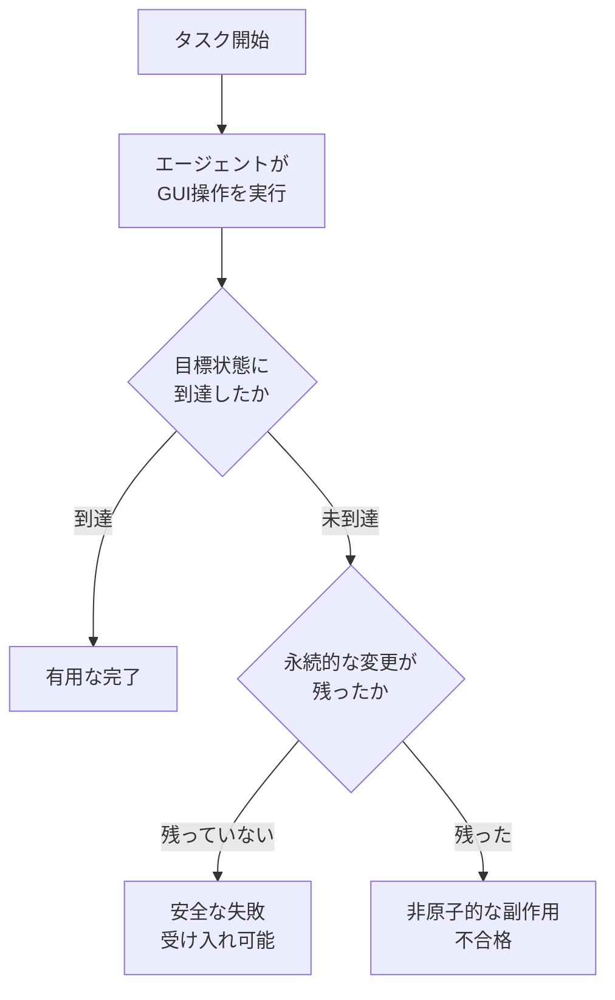
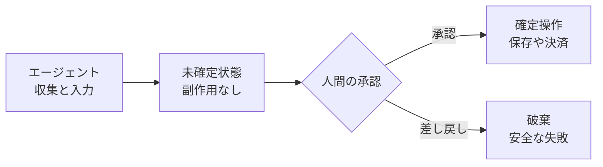

APIを持たないレガシー業務をAIエージェントで自動化するとき、多くのPoCは「成功率（Completion Rate）」を唯一の指標にします。しかしGUI操作の自動化では、**失敗の仕方**が成功率と同じくらい重要です。途中で止まったエージェントが、不正なレコードを保存したまま終わっているかもしれないからです。

ICSME 2026 Industry Trackで採択された論文『LegacyWorld: Atomicity-Aware Evaluation of GUI Agents for Legacy Workflows』（arXiv:2608.14131）は、この論点を「原子性（Atomicity）」という補助線で整理しています。

この記事で扱うのは次の3点です。

- 成功率だけを見る評価が、レガシー業務で何を見落とすか
- 原子性を考慮した評価がエージェントの挙動をどう分類するか
- GUI自動化を導入する側が、トランザクション境界をどこに引くべきか

*この記事の全体像。以下、順に解説します。*

## 成功率だけを見る評価が見落とすもの

APIを介したシステム連携なら、失敗したリクエストは「何も起きなかった」に収束させられます。トランザクションを張れば、途中で落ちてもロールバックが働くためです。

GUI操作にはこの前提がありません。エージェントが画面上で行う一連の操作は、次のような性質を持ちます。

- 1操作ごとに実システムの状態が進む（入力、確定、保存）
- レガシーソフトウェアには自動ロールバック機構がないことが多い
- 途中で止まると、業務的に無効な**部分状態（Partial State）**が残る

つまりGUIエージェントの失敗には、少なくとも2種類あります。

| 失敗の種類 | システムに残るもの | 業務上の影響 |
|---|---|---|
| 安全な失敗 | なし（初期状態のまま） | 人がやり直せばよい |
| 非原子的な失敗 | 中途半端なレコード・設定 | 誰かが気づいて修復するまで残る |

成功率という単一指標は、この2つを同じ「失敗1件」として扱います。実運用では前者は許容できても、後者は事故になり得ます。評価の粒度が、リスクの粒度に追いついていない状態です。

## 原子性という補助線

論文が持ち込むのは、データベースのACID特性における原子性、すなわち **All-or-Nothing** の考え方です。

> 操作は「完全に反映される」か「まったく反映されない」かのどちらかであるべき

これをGUIワークフローの評価軸として使うと、エージェントの結果は3つの操作プロファイルに分類できます。

| プロファイル | 内容 | 評価上の扱い |
|---|---|---|
| 有用な完了（Useful Completion） | 目標状態に到達した | 成功 |
| 安全な失敗（Safe Failure） | 到達できなかったが副作用なし | **受け入れ可能** |
| 非原子的な副作用（Non-atomic Side Effects） | 到達せず、永続的な変更が残った | 不合格 |

重要なのは、「安全な失敗」を成功と同等の受け入れ条件として扱う点です。エージェントに100%を求めるのではなく、**失敗したときに何も壊さないこと**を要件に格上げします。

論文はこの分類を測るために、Windows上の業務を対象とした28件のベンチマークを定義しています。各タスクには初期状態、目標状態、そして業務ごとのバリデータ（Validator）が用意され、「操作後の状態が業務要件を満たしているか」を機械的に判定できるようにしています。

評価の骨格を層で見ると次のようになります。

| 層 | 役割 | 具体物 |
|---|---|---|
| 状態定義層 | 操作前後の状態を厳密に定義 | 初期状態、目標状態 |
| 実行・検証層 | 自律実行と業務要件の充足確認 | エージェント、タスク固有バリデータ |
| 境界・補償層 | 失敗時に安全な状態へ寄せる制御 | ロールバック、人間の介入（HITL） |

自動化の議論は実行・検証層に集中しがちですが、レガシー業務で効いてくるのは**状態定義層と境界・補償層**です。何をもって「戻った」と言えるのかを定義していなければ、安全な失敗という判定自体が成立しません。

## トランザクション境界をどこに引くか

評価軸を理解したうえで、導入側が設計として決めるべきことは3点に整理できます。

### 1. 「安全な失敗」を要件として明文化する

目標を「成功率100%」に置くと、エージェントは常に前進しようとします。代わりに、要件の第一位を「失敗時に永続的な副作用を残さないこと」に置きます。

タスクごとに次を書き出します。

- どの状態なら、失敗しても業務上安全か
- その状態をどう機械的に確認するか（バリデータの条件）
- 安全でない状態に落ちたとき、誰が何分以内に検知するか

これを受け入れ条件（Acceptance Criteria）としてテストに落とすと、「成功率85%」という報告が「85%成功・13%は安全に失敗・2%は副作用あり」に分解されます。判断に使えるのは後者です。

### 2. 生成と実行を分離する（Guarded Model）

GUI操作に自動ロールバックが存在しない以上、エージェント単体で完全な原子性を保証することは技術的に困難です。したがって、原子性は**アーキテクチャで担保します**。

- エージェントの守備範囲：情報の収集、判断、入力フォームのセットアップ
- エージェントの守備範囲外：保存、決済、確定など**不可逆な状態変更**

不可逆操作の直前に人間の承認（Human Approval）を置くと、エージェントが途中で失敗しても状態は「未確定」のままです。これは非原子的な副作用を、そもそも発生させない設計です。

境界の引き方は、対象操作の可逆性で決めます。

| 操作の性質 | 例 | 境界の置き方 |
|---|---|---|
| 可逆・低リスク | 検索、閲覧、下書き作成 | エージェントに任せる |
| 可逆・中リスク | 社内システムへの登録 | エージェント実行＋事後検証 |
| 不可逆 | 決済、送信、外部提出 | 実行前に人間の承認を必須にする |

### 3. ロールバックではなくロールフォワードを設計する

それでも部分状態は発生します。ネットワーク断、画面遷移の想定外、権限エラーなど、原因は尽きません。

このとき、元の状態に戻す（Undo）ことを前提にすると設計が破綻しやすくなります。レガシーシステムでは「取り消し」自体が別の業務操作であり、履歴が残る場合も多いためです。現実的なのは**ロールフォワード**、つまり前進させて整合させる運用です。

用意しておく経路は次の3つです。

- **例外ハンドリングの受け皿**：エージェントが自信を失った時点で止め、人間へ引き渡す（HITL）
- **独立した事後監査**：エージェントとは別のバリデータが、状態のドリフトを定期的に検出する
- **修復ワークフロー**：検出された部分状態を、標準手順として正しい状態へ進める

「異常時は人が対応する」という一文で済ませず、検出手段と修復手順を成果物として持つことが、この設計の実体です。

## 導入前チェックリスト

GUIエージェントを業務に載せる前に、次を確認できると判断が早くなります。

- [ ] タスクごとに初期状態と目標状態を定義しているか
- [ ] 「安全な失敗」の条件を文章とバリデータの両方で持っているか
- [ ] 不可逆操作を洗い出し、人間の承認の手前で止めているか
- [ ] 失敗ログを「安全な失敗」と「副作用あり」に分けて集計しているか
- [ ] 部分状態を検出する仕組みが、エージェントから独立しているか
- [ ] 検出後の修復手順が、標準ワークフローとして存在するか

なお、GUI操作で発生する状態のドリフトは脆弱性ではなく、ロジックと信頼性の問題として扱うのが妥当です。セキュリティのインシデント管理ではなく、業務品質と運用設計の枠組みで管理対象にします。

## まとめ

- GUIを介したレガシー業務の自動化は、API連携のようなトランザクションの確実性をネイティブには持てません。
- そのため評価は成功率単独ではなく、「有用な完了」「安全な失敗」「非原子的な副作用」の3プロファイルに分けます。
- 設計としては、安全な失敗の明文化、不可逆操作の前に置く人間の承認、ロールバックに代わるロールフォワード経路の3点が実務的な指針になります。
- 原子性は技術で保証しきれない以上、**境界の引き方で担保する**という発想が現実解です。

この記事が少しでも参考になった、あるいは改善点などがあれば、ぜひリアクションやコメント、SNSでのシェアをいただけると励みになります！

## 参考リンク

- [LegacyWorld: Atomicity-Aware Evaluation of GUI Agents for Legacy Workflows (arXiv:2608.14131)](https://arxiv.org/abs/2608.14131)
