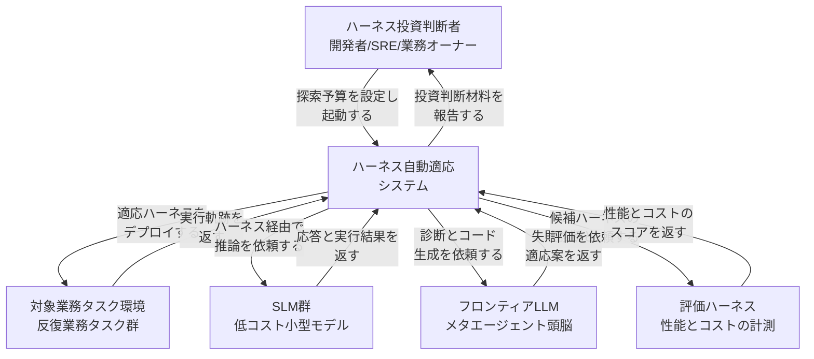
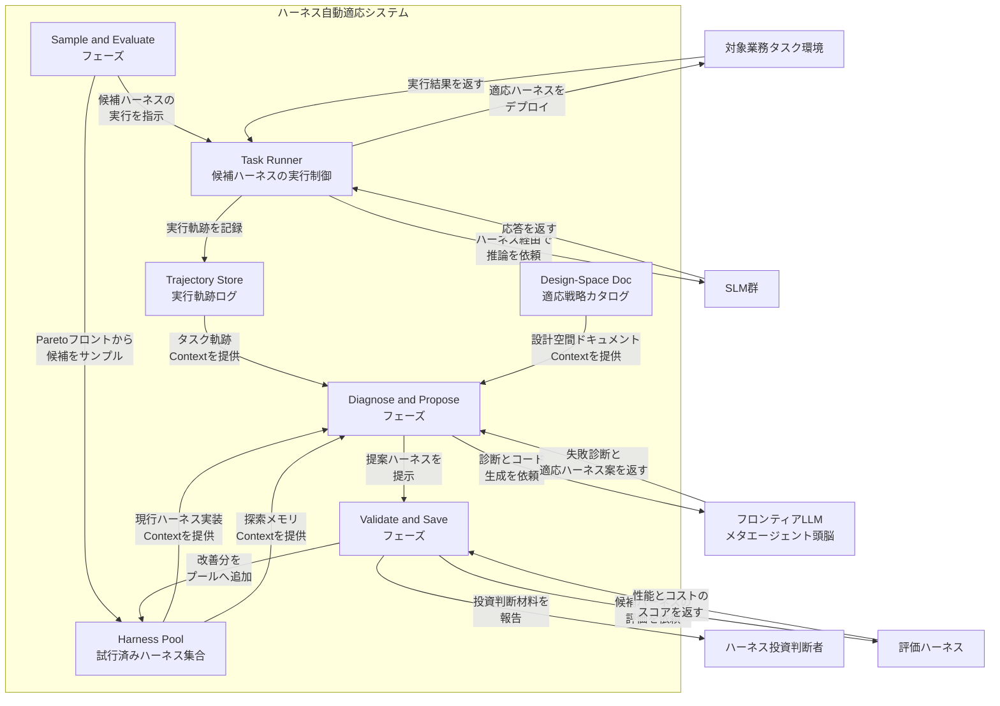
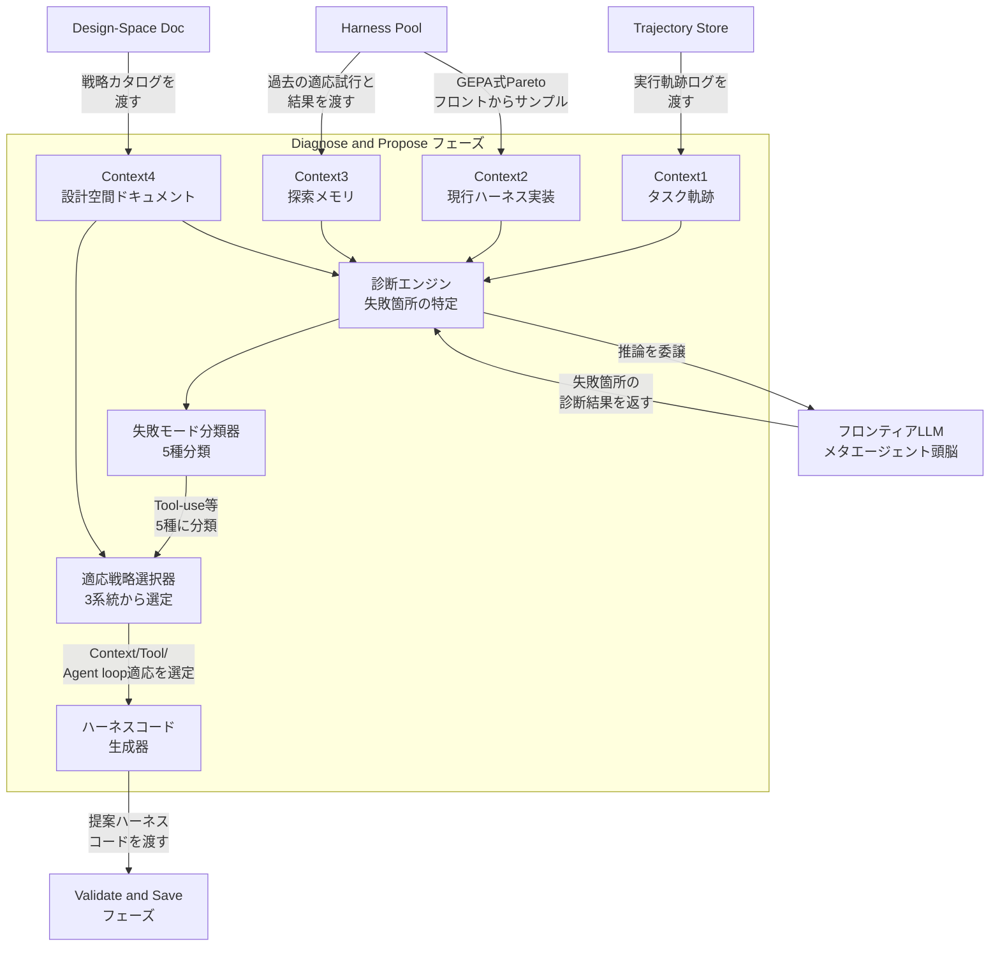
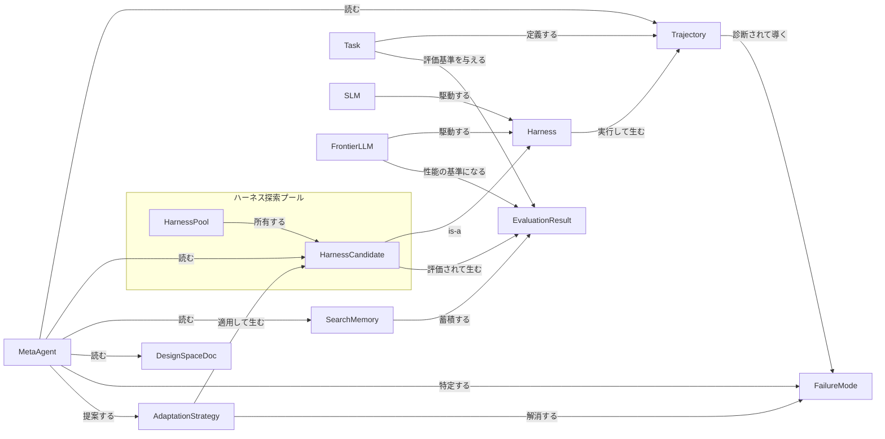
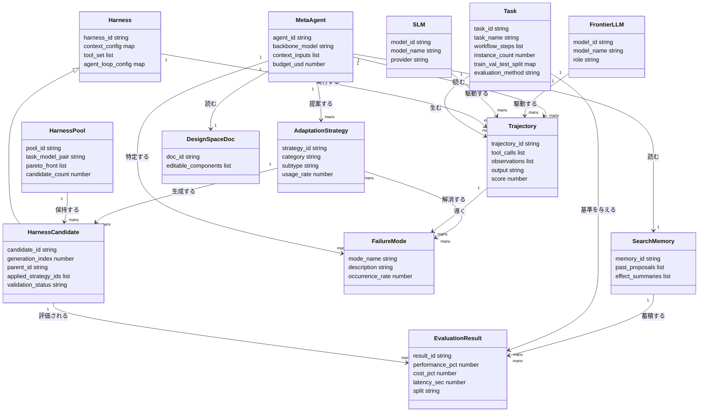

> 調査対象: arXiv 2607.08938「Better Harnesses, Smaller Models: Building 90% Cheaper Agents via Automated Harness Adaptation」(Chenyang Yang, Xinran Zhao, Tongshuang Wu, Christian Kästner / Carnegie Mellon University / cs.SE / 2026-07-09 / プレプリント)
> 実装 (リプリケーションパッケージ): [malusamayo/migration-analysis](https://github.com/malusamayo/migration-analysis)

## ■概要

フロンティア LLM エージェントは、推論コストが高く、大規模展開が持続しません。

小型言語モデル (SLM) は安価です。しかし、フロンティア LLM 向けに設計したハーネス (指示・ツール・実行ループ一式) へそのまま差し込むと、性能が落ちます。

本論文は、この問題へメタエージェントによる**自動ハーネス適応**を提案します。

メタエージェントは、SLM の失敗軌跡を分析し、失敗モードに応じてハーネスを自動で書き換えます。

結果として、多くの反復的業務タスクでは、適応後の SLM がフロンティア LLM 性能の 89% を、コスト 4% (96% 削減) で回復します。

具体例として `gemma-4-26b-a4b` は、LLM 性能の 89% をコスト 4% で回復し、レイテンシも 25% 削減しました。

検証には、勤怠監査・予算承認・在庫アラート・異常検知・E2E テスト生成・ウェブサイト運用・コードリファクタという 7 つの業務指向タスクを用います。

対象 SLM は Gemma・Qwen・Ministral の 3 系統です。3 SLM × 7 タスク = 21 の SLM-タスクペアで評価します。

### 位置づけ

本論文の核心は、「ハーネスをモデルと切り離し、組織資産として適応・版管理する」という発想です。

従来のモデル選定論は、タスクに対してどのモデルを採用するかを問います。

本論文は、この問いを「モデル×タスクの組ごとに、ハーネスをどう最適化するか」という問いへ拡張します。

AI コスト管理の文脈では、モデル単価の比較だけでなく、業務ごとのハーネス投資判断が新たな統制対象になります。

ハーネスは、コードと同様にバージョン管理し、失敗パターンの蓄積とともに継続的に改善する対象になります。

#### 3 路線比較 (モデルを大きくする / ファインチューニング / ハーネス適応)

| 路線 | コスト削減効果 | 汎用性 | 運用負荷 | 本論文の立場 |
|---|---|---|---|---|
| モデルを大きくする (フロンティア維持) | 低い (高性能だが高コストのまま) | 高い (タスク非依存で使い回せる) | 低い (モデル契約のみで完結) | 比較対象。コスト構造が持続不能と位置づけ |
| ファインチューニング (SLM を鍛える) | 中程度 (学習・データ整備コストが別途必要) | 低い (タスクごとに再学習が必要) | 高い (データ収集・再学習の継続運用が必要) | 直接の実験対象外。モデル重みを変えない代替として提案手法と対比 |
| ハーネス適応 (本論文の提案) | 高い (コスト 90% 削減、探索コスト平均 $20/ペア) | 中程度 (反復業務かつ一定能力以上の SLM に限定) | 中程度 (メタエージェントが自動探索、平均 13 回の実行で投資回収) | 提案手法。モデル重みは固定し、指示・ツール・実行ループを最適化 |

#### 近接研究との差分

| 研究 | 対象・評価環境 | 適応方式 | 本論文との主な差分 |
|---|---|---|---|
| 本論文 (arXiv 2607.08938) | 業務指向 7 タスク × SLM 3 系統 | GEPA スタイル遺伝的探索 + メタエージェント診断。失敗モード 5 種を適応戦略 3 系統にマッピング | 比較の基準 |
| LIFE-HARNESS (arXiv 2605.22166) | 決定論的・ルール支配ドメイン、18 モデルバックボーン | 学習軌跡を再利用可能な介入に変換し、評価時はハーネスを固定 | 転移先モデルバックボーンの幅が広い。評価時にハーネスを固定する点が、タスク-モデルペアごとに個別最適化する本論文と相違 |
| HarnessX (arXiv 2606.14249) | ALFWorld / GAIA / WebShop / SWE-bench Verified 等 | 型付きハーネスプリミティブの合成代数 + 軌跡駆動マルチエージェント進化 | ハーネス更新とモデル訓練信号を同時生成し、モデル自体も co-evolve させる点が特徴。本論文はモデル重み非変更が前提 |
| Continual Harness (sethkarten/continual-harness) | 組込み型エージェント環境 | リセット不要のオンライン in-context 洗練。実行中にハーネス状態を CRUD 編集 | エピソードリセットなしにオンライン適応する点が特徴。本論文はオフラインの探索ループ (sample→diagnose→validate) を利用 |
| AutoHarness (aiming-lab/AutoHarness) | 汎用エージェント運用 (ガバナンス・監査) | ガバナンスパイプライン、YAML constitution、コスト追跡 | 目的が安全性・監査・観測性の担保に寄る。本論文は SLM で LLM 性能に到達するコスト最適化が目的 |

## ■特徴

- **失敗モード起点の適応**: Tool-use・Instruction-following・Knowledge・Long-context・Planning/reasoning の 5 種の失敗モードを特定し、それぞれに Context adaptations・Tool adaptations・Agent loop adaptations の 3 系統の戦略で対応します。
- **GEPA スタイル探索**: メタエージェントは、試行済みハーネスのプールから Pareto フロントに基づき候補をサンプルし、遺伝的探索でハーネスを進化させます。
- **3 フェーズの最適化ループ**: Sample and evaluate (サンプルと評価) → Diagnose and propose (診断と提案) → Validate and save (検証と保存) を繰り返します。
- **平均 $20/ペアの探索コスト**: タスク-モデルペアあたり平均 $20 程度の探索コストでハーネス最適化を完結させます (タスク別の予算上限は設定で可変)。
- **89% 性能を 4% コストで回復**: 最良の適応 SLM は、フロンティア LLM 性能の 89% を、コスト 96% 削減 (コスト 4%) で回復します。
- **21 ペア中 16 ペアで有意改善**: 21 の SLM-タスクペアのうち 16 ペアで有意な性能改善が見られ、うち 7 ペアで SLM-LLM 性能ギャップが解消しました。
- **平均 13 回の実行で投資回収**: 最適化コストは、平均 13 回のエージェント実行の節約分で回収できます。
- **タスクの多様性で効果が減衰**: 単一タスクでの性能 89.1% に対し、タスクの多様性が上がると 68.0% まで低下します。
- **改善対象の失敗は指示追従と知識が中心**: 成功した適応が主に対処した失敗は、instruction-following 81%、knowledge 81% でした。
- **主要戦略は context 追加**: 採用された戦略は adding contexts 86%、creating new tools 43%、managing tools 29% の順に多く見られました。

## ■構造

本論文は具体プロダクトではなく提案フレームワーク (メタエージェントによる SLM ハーネス自動適応システム) です。そのため C4 モデルを「提案手法の論理構造」に読み替えて記述します。システムコンテキスト図は本システムを取り巻くアクターと外部システム、コンテナ図は最適化ループを構成する主要要素、コンポーネント図は Diagnose and Propose フェーズのドリルダウンを示します。

### ●システムコンテキスト図



| 要素名 | 説明 |
|---|---|
| ハーネス投資判断者 | 開発者・SRE・業務オーナーを束ねた総称アクター。反復業務へのハーネス投資可否を判断し、探索予算を設定してシステムを起動 |
| ハーネス自動適応システム | 本論文が提案するメタエージェント方式のハーネス最適化システム本体。Sample and Evaluate・Diagnose and Propose・Validate and Save の 3 フェーズを反復 |
| 対象業務タスク環境 | 勤怠監査や予算承認など、反復的な業務タスクを実行する対象環境。適応済みハーネスの投入先 |
| SLM群 | gemma-4-26b-a4b・qwen3-coder-30b-a3b・ministral-3-8b など、低コストな小型言語モデルの集合。ハーネス経由で対象タスクを解く主体 |
| フロンティアLLM | メタエージェントの頭脳として診断・提案・コード生成を担う高性能モデル (gemini-3.1-pro-preview)。SLM 自体の推論には未使用 |
| 評価ハーネス | 候補ハーネスの性能とコストを計測し、フロンティア LLM ベースラインとの比較スコアを返す評価系 |

### ●コンテナ図



| 要素名 | 説明 |
|---|---|
| Harness Pool | 試行済みのハーネス実装を蓄積するプール。Sample and Evaluate フェーズは GEPA スタイルの遺伝的探索で Pareto フロント上の候補をサンプル。Diagnose and Propose フェーズには現行ハーネス実装と探索メモリの両方を提供 |
| Task Runner | サンプルされた候補ハーネスを対象業務タスク環境と SLM 群に対して実行する制御コンテナ |
| Sample and Evaluate フェーズ | Harness Pool の試行済みハーネスから、GEPA スタイルの遺伝的探索で Pareto フロント上の候補を選び、Task Runner に実行を指示するフェーズ |
| Diagnose and Propose フェーズ | タスク軌跡・現行ハーネス実装・探索メモリ・設計空間ドキュメントの 4 種 context を受け取り、フロンティア LLM に診断とハーネスコード生成を依頼するフェーズ |
| Validate and Save フェーズ | 提案されたハーネスを評価ハーネスで検証し、改善が確認できれば Harness Pool に追加し、投資判断者へ結果を報告するフェーズ |
| Trajectory Store | Task Runner が記録した実行軌跡ログを保持し、Diagnose and Propose フェーズへタスク軌跡 context として提供 |
| Design-Space Doc | Context adaptations・Tool adaptations・Agent loop adaptations の 3 系統からなる適応戦略カタログ。Diagnose and Propose フェーズへ設計空間ドキュメント context として提供 |

### ●コンポーネント図

Diagnose and Propose フェーズのドリルダウンです。4 種の context 入力がメタエージェントの診断エンジンに集約され、失敗モード分類・適応戦略選択・ハーネスコード生成の順に処理されます。



| 要素名 | 説明 |
|---|---|
| Context1 タスク軌跡 | Trajectory Store から渡される実行軌跡ログ。SLM がどこでつまずいたかを示す一次情報 |
| Context2 現行ハーネス実装 | Harness Pool から GEPA スタイルの Pareto フロントサンプリングで渡される、診断対象のハーネスコード |
| Context3 探索メモリ | Harness Pool に蓄積された過去の適応試行とその結果。同じ失敗モードへの重複対応を避けるための参照元 |
| Context4 設計空間ドキュメント | Design-Space Doc から渡される、Context/Tool/Agent loop の 3 系統適応戦略カタログ |
| 診断エンジン | 4 種 context を検査し、フロンティア LLM へ推論を委譲して失敗箇所を特定 |
| 失敗モード分類器 | 診断結果を Tool-use・Instruction-following・Knowledge・Long-context・Planning/reasoning の 5 種に分類 |
| 適応戦略選択器 | 分類された失敗モードと設計空間ドキュメントを突き合わせ、Context adaptations・Tool adaptations・Agent loop adaptations の 3 系統から適応戦略を選定 |
| ハーネスコード生成器 | 選定された適応戦略に基づき、提案ハーネスの実装コードを生成し Validate and Save フェーズへ受け渡し |

## ■データ

論文に登場する主要な概念をエンティティ化し、概念モデル・情報モデルとして整理します。

### ●概念モデル



| 要素名 | 説明 |
|---|---|
| Task | 業務指向の 7 タスク (勤怠監査・予算承認・在庫アラート・異常検知・Playwright テスト生成・Web サイト管理・コードリファクタ) のいずれか。各タスクが評価用の入力データと正解基準を保持 |
| SLM | 適応対象の小型言語モデル 3 系統 (Gemma / Qwen / Ministral)。Harness に組み込まれて動作 |
| FrontierLLM | 性能の基準となるフロンティア LLM (gemini-3.1-pro-preview)。無適応ベースラインとして Harness を駆動し、メタエージェントの分析役も兼務 |
| Harness | 指示・ツール群・エージェントループを束ねた実行可能な制御プログラム。Context/Tool/Agent-loop の各要素で構成される抽象 |
| HarnessCandidate | 最適化ループ中にメタエージェントが提案・生成する具体的な Harness の派生版。Harness の一種 (is-a) |
| HarnessPool | 試行済み HarnessCandidate を保持するプール。GEPA スタイルの遺伝的探索で Pareto フロントから次のサンプルを選定 |
| Trajectory | Task を Harness が実行して残る軌跡 (ツール呼び出し・中間観測・出力・スコア) |
| FailureMode | Trajectory の診断から特定される失敗の分類 (Tool-use / Instruction-following / Knowledge / Long-context / Planning-reasoning の 5 種) |
| AdaptationStrategy | FailureMode を解消するために提案される適応策。Context / Tool / Agent-loop の 3 系統に分かれ、適用されると新しい HarnessCandidate を生成 |
| MetaAgent | Trajectory・HarnessCandidate・SearchMemory・DesignSpaceDoc の 4 種の context を読み、FailureMode を診断して AdaptationStrategy を提案する主体。分析には gemini-3.1-pro-preview を利用 |
| SearchMemory | 過去に試した提案とその効果のサマリを蓄積する外部メモリ。MetaAgent が重複探索を避けるための参照元 |
| DesignSpaceDoc | Harness を編集する際に参照する設計空間ドキュメント (編集可能なコンポーネントの手引き) |
| EvaluationResult | HarnessCandidate を Task で評価した結果。性能%・コスト%・レイテンシを保持 |

### ●情報モデル



| 要素名 | 説明 |
|---|---|
| Task | task_id・task_name・workflow_steps (共通ワークフローの手順列)・instance_count・train_val_test_split・evaluation_method (真値照合 / テスト実行 / AST 確認) を保持 |
| SLM | model_id・model_name (gemma-4-26b-a4b / qwen3-coder-30b-a3b / ministral-3-8b)・provider を保持 |
| FrontierLLM | model_id・model_name (gemini-3.1-pro-preview)・role (baseline / meta-agent-analyzer) を保持 |
| Harness | harness_id・context_config (システムプロンプト・スキル等)・tool_set・agent_loop_config (フック・サブエージェント構成等) を保持 |
| HarnessCandidate | candidate_id・generation_index (探索の世代)・parent_id (派生元)・applied_strategy_ids・validation_status (サニティチェック結果) を保持 |
| HarnessPool | pool_id・task_model_pair (タスク×モデルの組)・pareto_front (性能とコストの Pareto フロント上の候補群)・candidate_count を保持 |
| Trajectory | trajectory_id・tool_calls・observations (中間観測)・output・score を保持 |
| FailureMode | mode_name (5 種の失敗分類名)・description・occurrence_rate (発生率、instruction-following/knowledge が各 81%) を保持 |
| AdaptationStrategy | strategy_id・category (Context/Tool/Agent-loop)・subtype (adding contexts 等)・usage_rate (adding contexts 86% 等) を保持 |
| MetaAgent | agent_id・backbone_model (gemini-3.1-pro-preview)・context_inputs (4 種の context 名)・budget_usd (タスク-モデルペアあたり $20) を保持 |
| SearchMemory | memory_id・past_proposals (過去の提案一覧)・effect_summaries (各提案の効果サマリ) を保持 |
| DesignSpaceDoc | doc_id・editable_components (編集可能な Harness コンポーネントの手引き) を保持 |
| EvaluationResult | result_id・performance_pct (フロンティア LLM 比の性能回復率)・cost_pct (コスト比、最良例で 4%)・latency_sec・split (train/val/test) を保持 |

## ■構築方法

本セクションは本論文の手法を、自分の業務に再現するための実装案です。

論文チームは実装をリプリケーションパッケージとして公開しています。以下のコード例は、この公式 repo の実ファイルを裏取りしたうえで、**自分の業務タスクに合わせて簡略化した実装案**です。論文本体・repo に存在しないコードは「実装案」と明示し、補完元を都度示します。

- 公式 repo: [malusamayo/migration-analysis](https://github.com/malusamayo/migration-analysis) (`gh api` で実在確認済み、README に replication package と明記)
- GEPA (探索アルゴリズム) 本体: [gepa-ai/gepa](https://github.com/gepa-ai/gepa) (PyPI `gepa`)。論文は別物の [arXiv 2507.19457](https://arxiv.org/abs/2507.19457)「GEPA: Reflective Prompt Evolution Can Outperform Reinforcement Learning」。migration-analysis は実際にこのライブラリを import します。

### ① タスク環境と評価ハーネス (成功判定関数) の用意

- 論文の各タスクは「エージェントの最終状態を検査し 0.0〜1.0 のスコアと feedback 文字列を返す関数」を評価ハーネスとして持ちます。
- 実物の設計は「チェックポイント単位の加重平均 + 最終チェックポイントが通れば満点」というルールです。
- 以下は、自分の業務タスク (例: 経費精算チェック) 向けに簡略化した**実装案**です。

```python
# 実装案: 業務タスク用の成功判定関数（migration-analysis の task_evals パターンを簡略化）
from pathlib import Path
import json


def run_single_instance_eval(workspace_dir: str, example: dict) -> dict:
    """エージェントの作業ディレクトリと期待値を比較し score/feedback を返す。"""
    workspace = Path(workspace_dir)
    expected = json.loads(Path(example["expected_path"]).read_text())
    actual_state = json.loads((workspace / "state.json").read_text())

    checkpoints: list[tuple[str, bool]] = [
        ("required_contacts_reached", _contacted_all(actual_state, expected["contacts"])),
        ("required_docs_read", _docs_accessed(actual_state, expected["doc_paths"])),
        ("final_decision_correct", actual_state.get("decision") == expected["decision"]),
    ]
    # 最終チェックポイントが通れば満点、それ以外は通過数の加重平均
    if checkpoints[-1][1]:
        score = 1.0
    else:
        score = sum(ok for _, ok in checkpoints) / len(checkpoints)

    feedback = "; ".join(f"{name}={ok}" for name, ok in checkpoints)
    return {"workspace_dir": workspace_dir, "score": score, "feedback": feedback}
```

- ハーネス構築の最小要件は次の 3 点です。
  - 入力: エージェントの作業ディレクトリ (またはログ) と期待値。
  - 出力: `score` (0.0〜1.0) と `feedback` (人間可読な失敗理由)。
  - 決定性: 同一入力に対して同一スコアを返す (探索ループが比較に使うため)。

### ② SLM/フロンティア LLM のエンドポイント設定

- 公式 repo は推論用ラッパーとエージェント実行用ラッパーの二重構成です。
- モデル一覧は YAML (環境変数展開対応) で管理し、ローダが推論用の辞書を構築し、実行用の SDK ラッパーに変換します。
- 実モデル名 (SLM: `gemma-4-26b-a4b` / `qwen3-coder-30b-a3b` / `ministral-3-8b`、フロンティア: `gemini-3.1-pro-preview`) は、実際のタスク設定ファイルにもそのまま登場します。

```yaml
# 実装案: モデルカタログ (configs/models.yaml 相当、環境変数はダミー)
models:
  - name: gemma-4-26b-a4b          # SLM 候補
    model: openrouter/google/gemma-4-26b-a4b
    api_key: ${OPENROUTER_API_KEY}
    input_cost_per_token: 0.0000001
    output_cost_per_token: 0.0000003
  - name: gemini-3.1-pro-preview   # フロンティア baseline / メタエージェントの分析用 LM
    model: vertex_ai/gemini-3.1-pro-preview
    vertex_credentials: ${GOOGLE_APPLICATION_CREDENTIALS}
```

```python
# 実装案: モデル辞書のロードと実行用ラッパーへの変換
import dspy, yaml, os

def load_lmdict(yaml_path: str) -> dict:
    config = yaml.safe_load(open(yaml_path))
    lm_dict = {}
    for m in config["models"]:
        kwargs = {k: (os.getenv(v[2:-1]) if isinstance(v, str) and v.startswith("${") else v)
                  for k, v in m.items() if k not in ("name", "model")}
        lm_dict[m["name"]] = dspy.LM(m["model"], **kwargs)
    return lm_dict

LM_DICT = load_lmdict("configs/models.yaml")
task_lm = LM_DICT["gemma-4-26b-a4b"]               # SLM: タスク実行本体
reflection_lm = LM_DICT["gemini-3.1-pro-preview"]  # メタエージェントの分析用
```

- 用途別に **LM ロール**を分けるのが実装のポイントです。
  - タスク実行 LM (`task_lm`): 適応対象の SLM。
  - 分析 LM (`reflection_lm`): メタエージェントの診断・改訂案生成 (`gemini-3.1-pro-preview` 固定)。

### ③ ハーネスプールと探索メモリの初期化

- 「ハーネスプール」= GEPA の候補集団、「探索メモリ」= 各候補の系譜・スコア・フィードバックを永続化する構造です。
- 公式 repo では候補レコードが「世代番号・コードハッシュ・エージェント実装・親ハッシュ (系譜)・サブサンプル評価・検証スコア・採否ステータス」を保持し、JSON に書き出します。
- 初期プールは「素朴なハーネス (seed candidate)」1 件から始まります。

```python
# 実装案: 探索メモリと初期ハーネス（seed candidate）の初期化
from dataclasses import dataclass, asdict
import json, os


@dataclass
class CandidateRecord:
    iteration: int
    code_hash: str
    agent_code: str            # ハーネス実装そのもの (build_agent 関数)
    parent_hash: str | None
    status: str | None = None  # "seed" | "accepted_on_subsample" | "rejected_on_subsample"
    val_score: float | None = None


class HarnessMemory:
    def __init__(self, run_dir: str):
        self.path = os.path.join(run_dir, "memory.json")
        self.records: list[CandidateRecord] = []

    def add(self, record: CandidateRecord) -> None:
        self.records.append(record)
        json.dump([asdict(r) for r in self.records], open(self.path, "w"), indent=2)

    def pareto_frontier(self) -> list[CandidateRecord]:
        # 検証済み (val_score が入っている) 候補のみを対象にスコア降順
        scored = [r for r in self.records if r.val_score is not None]
        return sorted(scored, key=lambda r: r.val_score, reverse=True)


SEED_AGENT_CODE = '''
def build_agent(base_dir: str, llm):
    # 最小構成のベースラインハーネス。ここから GEPA が改訂を重ねる。
    from openhands.sdk import Agent
    return Agent(llm=llm, system_prompt_filename="system_prompt.md")
'''

memory = HarnessMemory(run_dir="results/budget_approval/gemma-4-26b-a4b/seed0")
memory.add(CandidateRecord(iteration=0, code_hash="seed", agent_code=SEED_AGENT_CODE,
                            parent_hash=None, status="seed"))
```

### ④ GEPA スタイル探索ループの骨格

- migration-analysis は探索アルゴリズム自体を自作せず、**PyPI の `gepa` パッケージを利用**します。アダプタが `gepa.GEPAAdapter` を実装し、`gepa.optimize()` に渡す構成です。
- 予算ベースの停止条件は「累積コストが USD 予算を超えたら停止」というシンプルな設計です。

```python
# 実装案: 予算超過で停止する Stopper（migration-analysis の CostBudgetStopper を簡略化）
class CostBudgetStopper:
    """Stop optimization when total accumulated cost exceeds a budget in USD."""

    def __init__(self, max_cost: float, cost_tracker: dict):
        self.max_cost = max_cost
        self._cost_tracker = cost_tracker

    def __call__(self, gepa_state) -> bool:
        total = sum(bucket["accumulated_cost"] for bucket in self._cost_tracker.values())
        return total >= self.max_cost
```

- 自分のタスクに合わせて `gepa.optimize()` を直接呼ぶ場合の骨格は次の**実装案**です。

```python
# 実装案: GEPA スタイル探索ループの骨格
from gepa import optimize

adapter = AgentOptimizationAdapter(  # gepa.GEPAAdapter を実装した自作クラス（③のメモリ・②の LM を内包）
    task_id="budget_approval",
    task_lm=task_lm,
    reflection_lm=reflection_lm,
    eval_fn=run_single_instance_eval,   # ①の成功判定関数
    memory=memory,                      # ③の探索メモリ
)
stopper = CostBudgetStopper(max_cost=20.0, cost_tracker=adapter.cost_tracker)  # ペア予算 $20

result = optimize(
    seed_candidate={"agent_code": SEED_AGENT_CODE},
    trainset=trainset,
    valset=valset,
    adapter=adapter,
    stopper=stopper,
)
```

## ■利用方法

### ① 失敗軌跡の収集

- 各候補ハーネスをタスクの学習/検証分割で実行し、実行ログ (tool call・出力・中間状態) を「軌跡 (trajectory)」として保存します。
- 公式 repo では SLM 自身の軌跡と、比較用のフロンティア LLM の同一タスク軌跡 (教師軌跡、任意) の 2 種類を分けて保持します。

```python
# 実装案: 軌跡の保存（SLM 軌跡と教師軌跡を分離）
import json, os

def save_trajectory(run_dir: str, example_id: str, steps: list, is_teacher: bool = False):
    subdir = "teacher_trajectories" if is_teacher else "trajectories"
    dest = os.path.join(run_dir, "memory", "current", subdir)
    os.makedirs(dest, exist_ok=True)
    json.dump(steps, open(os.path.join(dest, f"{example_id}.json"), "w"), indent=2)
```

- 教師軌跡 (フロンティア LLM) との突き合わせは、メタエージェントが「SLM がどのステップ・ツール選択・終了判断で teacher と乖離したか」を特定するために使います。

### ② 失敗モード分類 (5種) → 適応戦略 (3系統) マッピングの適用

- 論文 §II-A/§II-B の分類は、公式 repo の [`docs/adaptation.md`](https://github.com/malusamayo/migration-analysis/blob/main/docs/adaptation.md) に「メタエージェント向け診断ガイド」として実装されています。各失敗モードの節に「観測される SLM の挙動」と「推奨される具体的な適応 (サブ戦術)」が対応付けられています。

| 失敗モード (5種) | 主な適応戦略 (3系統) |
|---|---|
| Tool-use | Tool adaptations (新規ツール作成・フィルタ・スキーマ調整) |
| Instruction-following | Context adaptations (指示の外在化・再注入) + Agent loop adaptations (hook 強制) |
| Knowledge | Context adaptations (暗黙知の追加) |
| Long-context | Context adaptations (要約・段階開示・外部ストレージ・刈り込み・分割) |
| Planning/reasoning | Agent loop adaptations (決定的チェック・multi-agent オーケストレーション) |

論文が報告する実測比率は、性質の異なる 2 系統です。取り違えないよう分けて読みます。

- **失敗モードの分布 (成功した適応が対処した失敗の割合)**: instruction-following 81%・knowledge 81% が中心。「どの失敗に効いたか」を示す比率です。
- **適応戦略の採用比率 (全適応での戦略種別の使用割合)**: adding contexts 86%・creating new tools 43%・managing tools 29%。「どの戦略が多く使われたか」を示す全体比率で、特定の失敗モード専用の値ではありません。

- 実装上は、①で保存した軌跡と feedback をこの表 (またはメタエージェントが直接読む `docs/adaptation.md`) に照らして「どの適応系統を試すか」の候補を絞り込みます。

### ③ メタエージェントに 4 種 context を渡してハーネス改訂案を生成

- 公式 repo のメタエージェント (proposer) は、システムプロンプトで次の 4 種類の context をワークスペースとして明示的に渡します。

```text
- project/agent.py                      # 現行ハーネス実装
- memory/current/trajectories/          # タスク軌跡（SLM 自身）
- memory/current/teacher_trajectories/  # タスク軌跡（教師、任意）
- memory/scoreboard.md, past_agents.md  # 探索メモリ（履歴サマリ・過去候補）
- docs/adaptation.md, docs/sdk_reference.md  # 設計空間ドキュメント（失敗モード→適応 / 実装 API）
```

- メタエージェント (分析 LM = `gemini-3.1-pro-preview`) は `agent.py` を直接書き換えるコーディングエージェントとして動作し、**`build_agent(base_dir, llm) -> Agent` を返す自己完結した Python** を出力する制約が課されています。

```python
# 実装案: メタエージェント呼び出しの骨格
PROPOSER_SYSTEM_PROMPT = """You are an agent optimization expert.
You improve an AI agent's task performance by analyzing execution trajectories
and modifying the agent's configuration code.

## Workspace
- project/agent.py            # 現行ハーネス実装
- memory/current/trajectories/ # タスク軌跡
- memory/scoreboard.md         # 探索メモリ (履歴サマリ)
- docs/adaptation.md           # 設計空間ドキュメント (失敗モード→適応)

## Constraints
- MUST define `build_agent(base_dir, llm) -> Agent`.
- Code must be valid, self-contained Python with explicit imports.
"""

def propose_new_harness(workspace_dir: str, reflection_lm) -> str:
    """4種 context を読み込んだコーディングエージェントに改訂 agent.py を書かせる。"""
    conversation = build_coding_agent(system_prompt=PROPOSER_SYSTEM_PROMPT,
                                       workspace=workspace_dir, llm=reflection_lm)
    conversation.run("軌跡と探索メモリを分析し、adaptation.md を参照して agent.py を改訂してください。")
    return open(os.path.join(workspace_dir, "project", "agent.py")).read()
```

### ④ $20/ペア予算内でのイテレーション

- 実測値では、探索コストはタスク-モデルペアあたり平均 **$20**、平均 **13 回の実行**で回収されるとされています。
- 実装上は③の `CostBudgetStopper` を `max_cost=20.0` で GEPA の `optimize()` に渡すだけで、予算超過時に自動停止します。
- タスクごとの予算・例数・分割比は設定ファイルで管理し、難易度別 (low/medium/high/extra_high) の複数バリエーションを用意します。

```yaml
# 実装案: タスク設定 (gepa_optimize.yaml 相当、抜粋)
task_id: "budget_approval_s2l"
model_name: "ministral-3-8b"
reflection_lm: "gemini-3.1-pro-preview"
max_cost: 10.0        # ペア予算 (paper 全体では平均 $20)
max_examples: 20
train_ratio: 0.5
use_adaptation_guide: true
```

- イテレーションのたびに探索メモリに候補レコード (採否・スコア・コスト) が積み上がり、コストが `max_cost` に達した時点でループを打ち切ります。予算を使い切っても改善が見込めない場合は、連続未改善許容回数でも早期停止できます。

### ⑤ 性能×コスト Pareto での候補選定

- 探索ループが生成した候補群から、最終的に**性能とコストの Pareto フロント**上の候補を選びます (最良の適応 SLM は「LLM 性能の 89% をコスト 4% で回復」)。
- 公式 repo では性能×コストの 4 象限図を生成するスクリプトがあり、論文の Pareto 選定はこの可視化と対応します。
- 自分の業務で候補選定を自動化する場合の**実装案**は次のとおりです。

```python
# 実装案: 性能×コストの Pareto フロント抽出
def pareto_frontier(candidates: list) -> list:
    """candidates: [{"val_score": float, "cost_ratio": float, ...}, ...]
    性能は高いほど・コストは低いほど良い、の 2 目的 Pareto。"""
    frontier = []
    for c in candidates:
        dominated = any(
            o["val_score"] >= c["val_score"] and o["cost_ratio"] <= c["cost_ratio"]
            and (o["val_score"] > c["val_score"] or o["cost_ratio"] < c["cost_ratio"])
            for o in candidates
        )
        if not dominated:
            frontier.append(c)
    return sorted(frontier, key=lambda c: c["cost_ratio"])
```

- 最終判断は自動選定だけに委ねず、**業務要件 (許容レイテンシ・監査要件) に照らして Pareto フロント上から人間が選ぶ**運用が現実的です。

## ■運用

適応ハーネスは「1 回作って終わり」の成果物ではありません。モデル・タスク・データが変わるたびに再学習が必要な**資産**として扱います。

### ① ハーネスのバージョン管理 (版=資産)

- 適応ハーネスは、探索コスト $20 を投じて得た成果物です。コードと同様にバージョン管理します。
- タスク × モデルのペアごとに、採用した適応戦略 (context 追加 / tool 作成 / agent-loop 変更) と評価スコアを記録します。
- ロールバック可能性を確保します。旧版ハーネスを破棄せず、Pareto フロントのプールとして保持します。

```yaml
# harness-registry/attendance-auditing_gemma-4-26b-a4b.yaml
task: attendance-auditing
model: gemma-4-26b-a4b
version: v3
baseline_llm_score: 1.00          # gemini-3.1-pro-preview 基準
score: 0.89                       # LLM 比 89%
cost_ratio: 0.04                  # LLM 比 4%
latency_delta: -0.25              # 25% 削減
adaptation_strategies:
  - type: context_addition
    detail: "勤怠規則の暗黙知を context として外在化"
  - type: tool_creation
    detail: "複雑な承認パターンを単純 IF に変換するツール"
failure_modes_addressed:
  - instruction-following
  - knowledge
exploration_cost_usd: 20
promoted: true
```

### ② 性能×コスト×レイテンシの継続監視

- 単一指標では判断しません。性能 (LLM 比 %)・コスト (LLM 比 %)・レイテンシの 3 軸を並べて監視します。
- 論文のベストケース (`gemma-4-26b-a4b` で性能 89% / コスト 4% / レイテンシ 25% 削減) を基準線に、乖離を追跡します。
- 監視対象は「絶対スコア」ではなく「LLM baseline との相対比」です。絶対スコアだけを見ると、タスク自体の難易度変化と適応劣化を混同します。

| 指標 | 基準線 (論文最良例) | 監視粒度 |
|---|---|---|
| 性能比 (SLM/LLM) | 89% | タスク×モデルペアごと・週次 |
| コスト比 (SLM/LLM) | 4% | 実行ごと・累積 |
| レイテンシ削減 | 25% | 実行ごと・p50/p95 |

### ③ 再最適化トリガ (データドリフトで劣化検知)

再最適化は定期スケジュールでなく、劣化シグナルで駆動します。

```python
def should_retrigger_optimization(pair_metrics, baseline):
    """性能比が基準線から一定閾値を下回ったら再最適化を起票する"""
    perf_drop = baseline.perf_ratio - pair_metrics.perf_ratio
    diversity_up = pair_metrics.input_diversity > baseline.input_diversity * 1.3

    if perf_drop > 0.10:          # 例: 89% -> 79% 未満
        return "perf_degradation"
    if diversity_up:              # 論文: 89.1% -> 68.0% の多様性減衰パターン
        return "input_diversity_shift"
    if pair_metrics.model_version != baseline.model_version:
        return "model_migration"  # SLM 差し替えは一律再学習が必要
    return None
```

- 監視すべきドリフトは 3 種類です。①性能比の低下、②入力分布の多様化、③SLM のモデル差し替え (論文は「one-size-fits-all harness は存在しない」と明言)。
- 特にモデル差し替えは、既存ハーネスをそのまま流用せず、再探索を前提にします。

### ④ 探索コスト会計 ($20/ペア、平均 13 回で回収)

- 1 タスク×モデルペアあたりの探索コストは平均 $20 です。
- 損益分岐は「平均 13 回の実行」で到達します。1 回あたりの節約額を試算し、回収見込みを事前に見積もります。

```python
def breakeven_runs(exploration_cost_usd=20, per_run_saving_usd=None,
                    llm_cost_per_run=None, slm_cost_per_run=None):
    """探索コストの回収に必要な実行回数を試算する"""
    if per_run_saving_usd is None:
        per_run_saving_usd = llm_cost_per_run - slm_cost_per_run
    return exploration_cost_usd / per_run_saving_usd

# 論文の実測平均: breakeven_runs ≈ 13 回（$20 / 平均節約額）
```

- 低頻度タスク (月次実行など) は、回収に要する期間が長くなります。実行頻度の低いタスクへの適応投資は優先度を下げます。
- メタエージェント自体のコストも会計に含めます。メタエージェントのモデルグレードを安易に下げると、診断品質の低下が追加イテレーション分の利得を相殺しうるため、探索コスト回収の前提として十分なグレードを維持します。

## ■ベストプラクティス

| # | 項目 | 実務ポイント |
|---|---|---|
| 1 | 反復業務に限定して適用 | 同一パターンが繰り返されるタスク (勤怠監査・在庫アラート等) が対象です。一回性の意思決定業務は、探索コストを回収する反復回数が確保できません |
| 2 | 一定能力以上の SLM を選ぶ | `ministral-3-8b` は stock-alert・anomaly-detection で 0%→0%、website-management で 5.6%→5.6% と、適応後も変化しませんでした。ハーネス改善はコア能力の不足を補いません。導入前に候補 SLM の素の到達点を確認します |
| 3 | 「adding contexts」を優先 | 成功した適応が対処した失敗は instruction-following 81%・knowledge 81% です。これに最も効く戦略は adding contexts (86%) です。tool 作成 (43%)・tool 管理 (29%) は次点に位置づけます |
| 4 | 入力分布を狭く保つ | タスク多様性が上がると性能比は 89.1%→68.0% に減衰します。単一ハーネスに多様なワークフローを詰め込まず、多様なら用途ごとにハーネスを分割します |
| 5 | 探索費と本番費を分けて評価 | メタエージェント (フロンティア LLM、`gemini-3.1-pro-preview`) の探索コストと、本番稼働する SLM のコストは別会計にします。ROI 評価は「探索費 $20 の回収」と「本番運用コスト比 4%」を混同しないようにします |

### 優先戦略の選び方 (擬似コード)

```python
def pick_adaptation_strategy(failure_mode):
    """成功実績の高い順に適応戦略を提案する"""
    priority = {
        "instruction-following": ["context_addition", "tool_creation", "tool_management"],
        "knowledge": ["context_addition", "tool_creation", "tool_management"],
        "tool-use": ["tool_management", "tool_creation", "context_addition"],
        "long-context": ["context_compression", "context_addition"],
        "planning-reasoning": ["multi_agent_orchestration", "deterministic_check"],
    }
    return priority.get(failure_mode, ["context_addition"])
```

## ■トラブルシューティング

| 症状 | 原因 | 対処 |
|---|---|---|
| 適応後も性能が上がらないペアがある | SLM のコア能力不足 (例: playwright-testing はコーディング能力そのものが不足)。ハーネス改善では代替できない領域 | 対象タスクを SLM 適用対象から外し、モデルグレードを引き上げる。無理にハーネス探索を継続しない |
| 多様な入力で劣化する | ハーネスが単一ワークフロー前提で最適化され、テンプレート数が増えると汎化しない (89.1%→68.0%) | 入力を用途別に分割し、ハーネスごと分岐する。多様性メトリクスを監視指標に追加し、閾値超過で再最適化トリガを起票する |
| 探索費が回収されない | 実行頻度が低い、またはタスクあたりの節約額が小さく、平均 13 回の損益分岐に到達しない | 低頻度タスクを適応対象から除外する。事前に breakeven_runs を試算し、想定実行頻度で回収可能か確認してから探索に着手する |
| ハーネスが特定タスクに過適合する | メタエージェントが特定の軌跡サンプルに強く最適化し、one-size-fits-all で流用しようとした | モデル・タスクのペアごとに個別探索する前提を崩さない。モデル差し替え時は必ず再学習する |
| メタエージェント自体のコストが増える | 廉価なメタエージェントモデルに切り替えたところ、診断・提案品質が下がり、追加イテレーションで相殺されてトータルコストが増加 | メタエージェントには十分なグレードのモデル (論文では `gemini-3.1-pro-preview`) を維持する。探索費削減は本番 SLM 側で行い、メタエージェント側では行わない |

### 反証エビデンスの統合 (過信への歯止め)

過信を避けるため、関連研究の反証観点を「誤解 → 反証 → 推奨」の構造で整理します。

**誤解1: ハーネス最適化さえすれば小さいモデルほど得をする**

- **誤解**: HarnessX (arXiv 2606.14249) の inverse-scaling 結果 (弱いタスクほど恩恵大) を見ると、モデルが小さいほどハーネス改善の恩恵が大きい、と一般化したくなります。
- **反証**: これは「弱いモデルは自己修正できない挙動ギャップをハーネスが埋める」という条件付きの現象です。本論文 (2607.08938) でも `ministral-3-8b` は一部タスクで 0%→0% のまま変化せず、能力閾値を下回るモデルはハーネス側の工夫で救えないことを示しています。
- **推奨**: 「小さいモデルほど得をする」と単純化せず、適用対象を「一定能力以上の SLM」に絞ります。導入前に候補モデルの素の到達点 (適応前スコア) を確認し、ゼロ近傍のタスクは対象から外します。

**誤解2: ハーネスを更新し続ければ性能は伸び続ける**

- **誤解**: メタエージェントによる継続的なハーネス更新 (self-evolving harness) を回し続ければ、性能は単調に改善する、と期待しがちです。
- **反証**: 「Harness Updating Is Not Harness Benefit」(arXiv 2605.30621) は、有用な更新を生成する能力と、更新から実際に恩恵を得る能力を分離して評価し、後者は非単調になりうると報告しています。安価なモデルは更新自体はそれなりに書けても、その更新を読み込んで正しく従う能力が不足することがあります。
- **推奨**: 適応ハーネスを提案するメタエージェントの品質だけでなく、**それを実際に使う本番 SLM 側が提案内容を理解・遵守できるか**を検証ステップに含めます。従えない場合は、ハーネスをさらに複雑化するのでなく、SLM のグレードを一段階上げる判断を検討します。

## ■まとめ

本論文は、フロンティア LLM 向けハーネスをメタエージェントで自動適応させ、小型モデルがコスト 4% で性能 89% を回復できることを示しました。要点は、モデル単価の比較から「業務ごとにハーネスを版管理・投資判断する」統制へ視点を移すことにあります。

この記事が少しでも参考になった、あるいは改善点などがあれば、ぜひリアクションやコメント、SNSでのシェアをいただけると励みになります！

## ■参考リンク

- 一次論文 (本フレームワーク)
  - [Better Harnesses, Smaller Models: Building 90% Cheaper Agents via Automated Harness Adaptation (arXiv 2607.08938)](https://arxiv.org/abs/2607.08938)
  - [同 HTML 全文 (arXiv html 2607.08938)](https://arxiv.org/html/2607.08938)
- GitHub
  - [malusamayo/migration-analysis (公式リプリケーション repo)](https://github.com/malusamayo/migration-analysis)
  - [migration-analysis README.md](https://github.com/malusamayo/migration-analysis/blob/main/README.md)
  - [migration-analysis docs/adaptation.md (失敗モード→適応の設計空間ドキュメント)](https://github.com/malusamayo/migration-analysis/blob/main/docs/adaptation.md)
  - [migration-analysis docs/sdk_reference.md (実装 API の詳細)](https://github.com/malusamayo/migration-analysis/blob/main/docs/sdk_reference.md)
  - [Continual Harness (sethkarten/continual-harness)](https://github.com/sethkarten/continual-harness)
  - [AutoHarness (aiming-lab/AutoHarness)](https://github.com/aiming-lab/AutoHarness)
  - [GEPA (gepa-ai/gepa)](https://github.com/gepa-ai/gepa)
- 関連学術論文 (系譜・反証)
  - [LIFE-HARNESS: Adapting the Interface, Not the Model (arXiv 2605.22166)](https://arxiv.org/abs/2605.22166)
  - [GEPA: Reflective Prompt Evolution Can Outperform Reinforcement Learning (arXiv 2507.19457)](https://arxiv.org/abs/2507.19457)
  - [HarnessX: A Composable, Adaptive, and Evolvable Agent Harness Foundry (arXiv 2606.14249)](https://arxiv.org/abs/2606.14249)
  - [Harness Updating Is Not Harness Benefit: Disentangling Evolution Capabilities in Self-Evolving LLM Agents (arXiv 2605.30621)](https://huggingface.co/papers/2605.30621)
