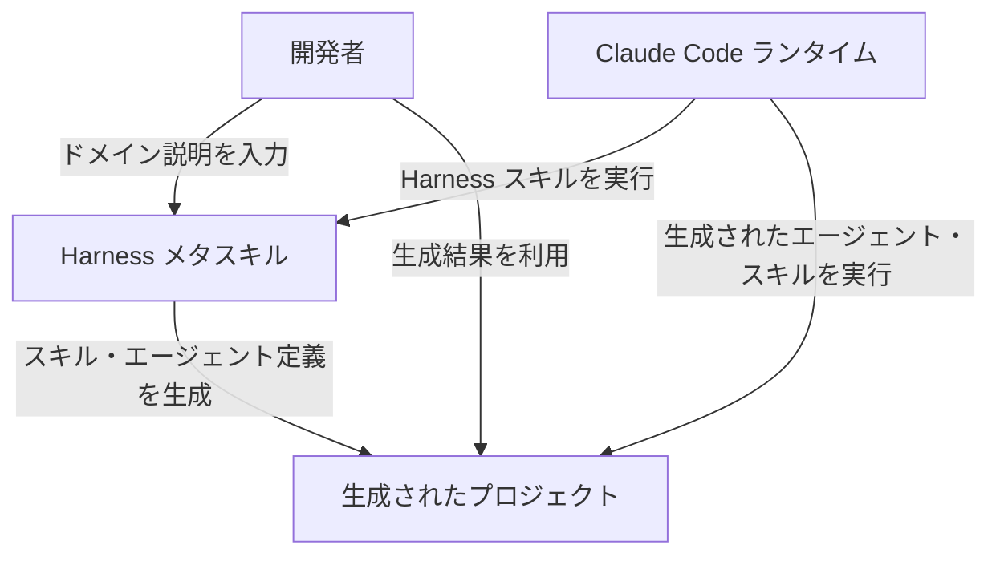
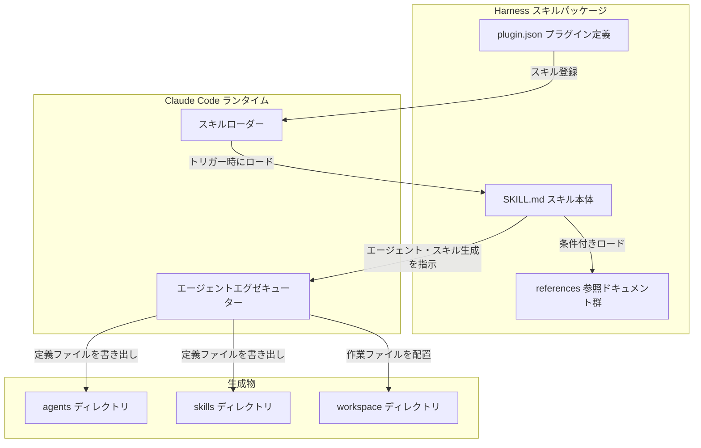
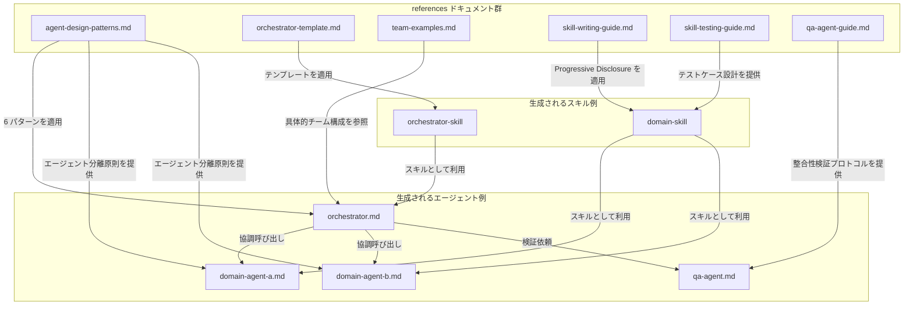
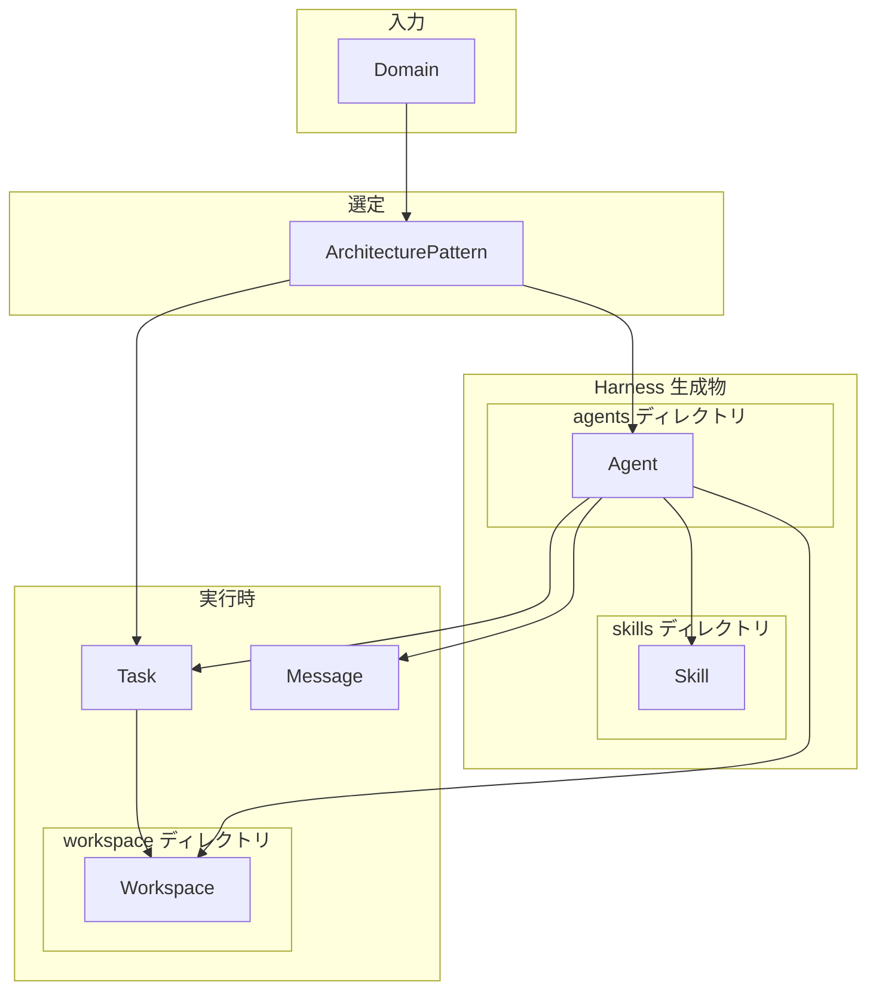
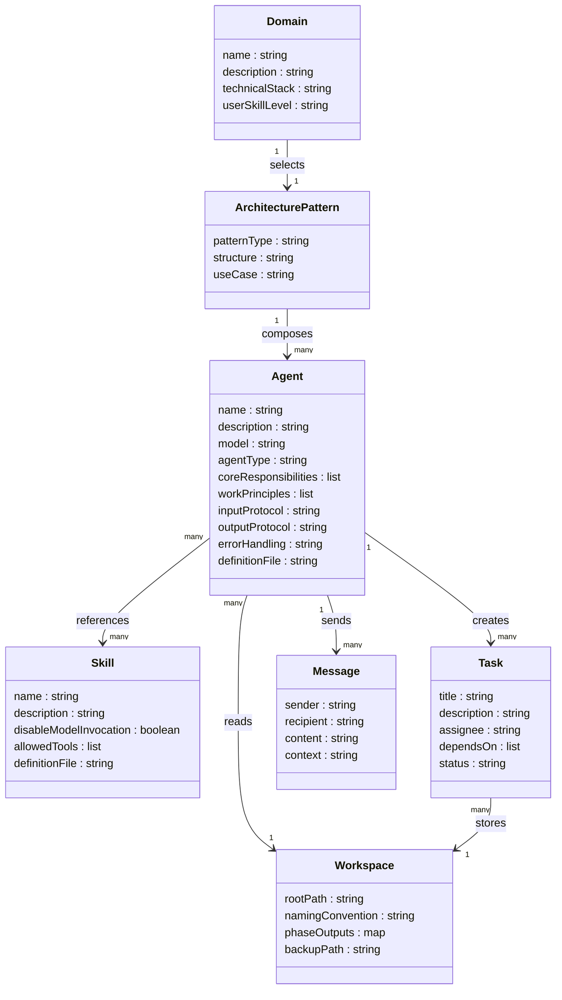

## 概要

harness（revfactory/harness）は、Claude Code 向けのメタスキルプラグインです。「このプロジェクト向けの harness を作って」という一言から、ドメイン特化のエージェントチームと専用スキルを自動生成します。

### Claude Code エコシステムにおける位置づけ

harness は Claude Code エコシステムを 3 層で捉えたときの **L3 Meta-Factory 層** に位置します。各層の役割は以下のとおりです。

| 層 | 役割 | 代表例 |
| --- | --- | --- |
| L1: Runtime 層 | エージェント・スキルを実際に実行する基盤 | Claude Code 本体（CLI / IDE 拡張） |
| L2: Agent / Skill 層 | 個別のエージェント定義・スキル定義そのもの | `.claude/agents/*.md`、`.claude/skills/*/SKILL.md` |
| L3: Meta-Factory 層 | L2 のエージェント・スキルを **生成する**メタツール群 | harness、Archon |

L3 はさらに 2 つのサブ層に分かれ、harness は前者を担います。

```
L3 Meta-Factory 層
├── Team-Architecture Factory  ← harness（チーム構造とメッセージプロトコルを生成）
└── Runtime-Configuration Factory  ← Archon（実行時の決定論的設定を生成）
```

| 要素名 | 説明 |
| --- | --- |
| Team-Architecture Factory | チーム構造・メッセージプロトコル・スキル定義を出力するサブ層 |
| Runtime-Configuration Factory | 実行時の確定的な設定を生成するサブ層（Archon が担当） |

この層モデルは Martin Fowler の "Harness Engineering" 記事および revfactory/harness の README で整理されています。詳細は本記事末尾の参考リンクを参照してください。

### Claude Code の構成要素との関係

harness は Claude Code の Agent Teams・Subagents・Skills の 3 つすべてを活用します。

| Claude Code の構成要素 | harness との関係 |
| --- | --- |
| Agent Teams | 2 体以上の協調エージェントを `TeamCreate + SendMessage + TaskCreate` で編成 |
| Subagents | エージェント間通信が不要な単発タスクを直接呼び出しで処理 |
| Skills | Progressive Disclosure 方式でコンテキスト効率を高めた専用スキルを自動生成 |

harness を実行すると、`.claude/agents/` と `.claude/skills/` 配下に Markdown 形式のエージェント定義とスキルファイルが生成されます。

### 類似ツールとの比較

#### revfactory エコシステム内の関連リポジトリ

| リポジトリ | 位置づけ | harness との関係 |
| --- | --- | --- |
| revfactory/harness | Team-Architecture Factory（本体） | — |
| revfactory/claude-code-harness | 研究・実験リポジトリ | harness の効果を A/B テストで検証した実験実装 |
| revfactory/harness-100 | プロダクション向けテンプレート集 | harness が生成したチームの実例 100 件（英語・韓国語で計 200 件） |

#### 周辺ツールとの比較

| ツール | 層・位置づけ | harness との関係 |
| --- | --- | --- |
| Archon | L3 / Runtime-Configuration Factory | 隣接サブ層。実行時の決定論的設定が必要な場合に選択 |
| meta-harness | L3（Codex ポート） | 同一コンセプトの別ランタイム実装 |
| ECC | harness の上位層 | 複数 harness をまたぐワークフローの標準化を担う |
| wshobson/agents | エージェント・スキルカタログ | harness が設計したチームのパーツ供給元 |
| LangGraph | 状態グラフ型オーケストレーション | 長期実行・状態回復が必要なシステム向けの別トラック |

#### 手動構成方式との比較

| 比較項目 | 手動構成（従来方式） | harness（自動生成） |
| --- | --- | --- |
| 自動化レベル | なし（設計・定義をすべて手動で記述） | 高（プロンプト一文から自動生成） |
| 対象ユーザー | エージェント設計の知識を持つ開発者 | ドメイン知識はあるがエージェント設計を知らないユーザー |
| 成果物 | 個別作成の Markdown ファイル | `.claude/agents/` と `.claude/skills/` の構造化ファイル群 |
| 再現性 | 担当者依存 | 6 種のアーキテクチャパターンに基づく一定品質 |

### A/B テスト結果

`revfactory/claude-code-harness` リポジトリで実施した 15 タスク（Basic・Advanced・Expert 各 5 件）の比較実験結果です。

| 指標 | harness なし | harness あり | 変化 |
| --- | --- | --- | --- |
| 平均品質スコア | 49.5 | 79.3 | +60% |
| 勝率 | — | — | 15/15（100%） |
| 出力ばらつき | — | — | −32% |

タスク難易度別の品質向上幅は、Basic +23.8 点、Advanced +29.6 点、Expert +36.2 点であり、タスクが複雑になるほど改善効果が大きくなります。著者による計測値（n=15）であり、第三者による再現検証は未実施です。

## 特徴

- メタスキルとしての自律生成: 単一のプロンプトから、エージェント定義・スキル・オーケストレーション設定を一括生成
- 6 種のアーキテクチャパターン: Pipeline・Fan-out/Fan-in・Expert Pool・Producer-Reviewer・Supervisor・Hierarchical Delegation から最適なパターンを自動選択
- Progressive Disclosure によるコンテキスト最適化: 詳細情報を必要なときだけロードし、コンテキストウィンドウを効率的に使用
- 2 つの実行モード: 複数エージェントが協調する Agent Teams モードと、単体で動作する Subagents モードを使い分け
- 検証フレームワーク内蔵: トリガー検証・ドライランテスト・A/B 比較テストで生成物の品質を担保
- 進化ループ: 初期設計と最終成果物の差分を蓄積し、次回生成の品質を継続改善
- harness-100 によるテンプレート提供: 10 ドメイン・100 種のプロダクション対応チーム構成を参照可能

### ユースケース別推奨パターン

| ユースケース | 推奨パターン | 適用例 |
| --- | --- | --- |
| Deep Research | Fan-out/Fan-in または Expert Pool | 複数視点からのクロスバリデーション調査 |
| Software Dev | Pipeline または Hierarchical Delegation | 設計・フロントエンド・バックエンド・QA の連携 |
| Content | Producer-Reviewer | 執筆・編集・一貫性チェックの分業 |
| Code Review | Fan-out/Fan-in | セキュリティ・パフォーマンス・スタイルの並列レビュー |

#### Deep Research チームの構成例（Fan-out/Fan-in パターン）

| エージェント | 役割 | 担当スキル例 |
| --- | --- | --- |
| orchestrator | タスク配分・結果統合 | `research-orchestrator/SKILL.md` |
| source-analyst | 公式情報・一次資料の収集 | `source-analysis/SKILL.md` |
| community-analyst | コミュニティ・二次資料の収集 | `community-analysis/SKILL.md` |
| synthesis-agent | 並列収集結果のクロスバリデーション統合 | `synthesis/SKILL.md` |
| qa-agent | 境界整合性の検証 | `qa/SKILL.md` |

#### Code Review チームの構成例（Fan-out/Fan-in パターン）

| エージェント | 役割 | 担当スキル例 |
| --- | --- | --- |
| orchestrator | レビュー範囲の配分と結果集約 | `review-orchestrator/SKILL.md` |
| security-reviewer | 脆弱性・認可・データ漏洩の検査 | `security-review/SKILL.md` |
| performance-reviewer | 計算量・メモリ・I/O 効率の検査 | `performance-review/SKILL.md` |
| style-reviewer | コーディング規約・命名・可読性の検査 | `style-review/SKILL.md` |
| synthesis-agent | 優先度付きレポートの統合 | `synthesis/SKILL.md` |

## 構造


### システムコンテキスト図



| 要素名 | 説明 |
| --- | --- |
| 開発者 | Harness にドメイン説明を与え、生成されたエージェントチームとスキルを利用するユーザー |
| Harness メタスキル | ドメイン説明を受け取り、エージェントチームとスキルを自動生成するメタスキル |
| Claude Code ランタイム | Harness スキルおよび生成されたスキル・エージェントを実行するプラットフォーム |
| 生成されたプロジェクト | Harness が出力するエージェント定義・スキル定義・ワークスペースの総体 |

### コンテナ図



#### Harness スキルパッケージ — 要素説明

| 要素名 | 説明 |
| --- | --- |
| SKILL.md スキル本体 | Harness の主要な実行仕様。500 行以内に収め、詳細は references/ に委譲 |
| references 参照ドキュメント群 | 条件に応じてロードされる補助ドキュメント群。Progressive Disclosure を実現 |
| plugin.json プラグイン定義 | Claude Code のスキルローダーに対してスキル名・説明・バージョンを宣言するマニフェスト |

#### Claude Code ランタイム — 要素説明

| 要素名 | 説明 |
| --- | --- |
| スキルローダー | plugin.json のメタデータを読み込み、ユーザー入力に合致した場合に SKILL.md をトリガー |
| エージェントエグゼキューター | Agent Teams モードおよび Subagents モードでエージェントを実行する Claude Code の実行基盤 |

#### 生成物 — 要素説明

| 要素名 | 説明 |
| --- | --- |
| agents ディレクトリ | `.claude/agents/` に配置するエージェント定義ファイル群。各ファイルは役割・原則・プロトコル・エラーハンドリングを含む |
| skills ディレクトリ | `.claude/skills/` に配置するスキル定義ファイル群。各スキルは SKILL.md と references/ サブディレクトリから構成される |
| workspace ディレクトリ | `_workspace/` として配置する作業領域。エージェント実行中の中間ファイルや最終成果物を保管 |

### コンポーネント図



#### references ドキュメント群 — 要素説明

| 要素名 | 説明 |
| --- | --- |
| agent-design-patterns.md | Pipeline・Fan-out/Fan-in・Expert Pool・Producer-Reviewer・Supervisor・Hierarchical Delegation の 6 パターンを定義 |
| orchestrator-template.md | Agent Team モード・Subagent モード・Hybrid モードの 3 テンプレートを提供し、各フェーズの処理手順を規定 |
| team-examples.md | リサーチチーム・SF 小説執筆チーム・コードレビューチームなど具体的なチーム構成例を収録 |
| skill-writing-guide.md | SKILL.md の記述原則、メタデータ規約、Progressive Disclosure の実装方法を説明 |
| skill-testing-guide.md | スキルの定性・定量テスト手順、評価サイクル、反復的改善ループを規定 |
| qa-agent-guide.md | コンポーネント境界の整合性検証を担う QA エージェントの役割・検証レイヤー・通信プロトコルを定義 |

#### 生成されるエージェント例 — 要素説明

| 要素名 | 説明 |
| --- | --- |
| orchestrator.md | チーム全体のタスク割り当てと進捗管理を担うエージェント定義。`model: opus` を必須とする |
| domain-agent-a.md | 特定の専門領域に特化したエージェント定義。役割・原則・プロトコル・エラーハンドリングを含む |
| domain-agent-b.md | domain-agent-a と並行または逐次的に協調する別ドメイン専門エージェント定義 |
| qa-agent.md | 生成されたコンポーネント間の境界整合性を検証する QA エージェント定義 |

#### 生成されるスキル例 — 要素説明

| 要素名 | 説明 |
| --- | --- |
| orchestrator-skill | オーケストレーターの実行仕様を記述したスキル。orchestrator-template.md を基に生成 |
| domain-skill | ドメイン固有の処理手順を記述したスキル。skill-writing-guide.md の原則に基づいて生成 |

## データ

### 概念モデル



#### 概念モデル補足

| 関係 | 説明 |
| --- | --- |
| Domain → ArchitecturePattern | ドメイン分析により 6 パターンから 1 つを選択 |
| ArchitecturePattern → Agent | パターンが必要なエージェント構成を決定 |
| Agent → Skill | エージェントがスキルを参照・呼び出し |
| Agent → Message | エージェントが `SendMessage` でメッセージを送受信 |
| Agent → Task | エージェントが `TaskCreate` / `TaskUpdate` でタスクを操作 |
| Agent → Workspace | エージェントが中間成果物を `_workspace/` に読み書き |
| Task → Workspace | タスクの成果物がワークスペースに保存 |

### エージェント間データ受け渡し方式

harness は用途に応じて 4 方式を使い分けます。

| 方式 | API | リアルタイム性 | 永続性 | 適用モード | 主な用途 |
| --- | --- | :---: | :---: | --- | --- |
| メッセージベース | `SendMessage` | 高 | 低 | Agent Teams | 即時調整・進捗確認・割り込み指示 |
| タスクベース | `TaskCreate` / `TaskUpdate` / `TaskGet` | 中 | 中 | Agent Teams | 依存関係管理・非同期配分・進捗モニタリング |
| ファイルベース | Read / Write | 低 | 高 | Agent Teams / Subagent | 大容量成果物・フェーズ間引き継ぎ |
| 戻り値ベース | Agent ツールの返り値 | 高 | 低 | Subagent のみ | 結果の直接収集 |

Agent Teams モードのライフサイクルは `TeamCreate` でチーム編成 → `TaskCreate` で作業分配 → `SendMessage` / `TaskGet` で調整 → `TeamDelete` でチーム解散の順で進みます。Phase 間でチームを再構成する場合、一度 `TeamDelete` で解散し、成果物を `_workspace/` に保存してから次の `TeamCreate` を呼び出します（エージェント・チームはネストできないためこの手順が必須です）。

- ファイルベースは `_workspace/` 配下で命名規則 `{phase}_{agent}_{artifact}.{ext}` に従って配置します。

```
_workspace/
├── phase1_analyst_domain-summary.md
├── phase2_architect_team-design.md
└── phase3_builder_agent-definitions.md
```

- 2 体以上のエージェントが協調する場合は Agent Teams をデフォルトとし、メッセージ・タスク・ファイルを組み合わせます。
- Subagent モードでは `SendMessage` / `TaskCreate` を使えないため、戻り値ベースとファイルベースの 2 方式のみ選択できます。

### 情報モデル



#### 属性一覧

##### Domain

| 属性 | 型 | 説明 |
| --- | --- | --- |
| name | string | ドメイン識別子（例: deep-research） |
| description | string | 問題領域の概要 |
| technicalStack | string | 関連技術スタック |
| userSkillLevel | string | ユーザーの習熟度（Phase 1 で判定） |

##### ArchitecturePattern

| 属性 | 型 | 説明 |
| --- | --- | --- |
| patternType | string | Pipeline / Fan-out-Fan-in / Expert-Pool / Producer-Reviewer / Supervisor / Hierarchical-Delegation |
| structure | string | エージェント配置の構造説明 |
| useCase | string | 適用ユースケース |

##### Agent

| 属性 | 型 | 説明 |
| --- | --- | --- |
| name | string | エージェント識別子 |
| description | string | 役割説明 + トリガーキーワード |
| model | string | 使用モデル（常に `opus`） |
| agentType | string | general-purpose / custom |
| coreResponsibilities | list | 主要機能（2〜4 項目） |
| workPrinciples | list | 意思決定ルールと制約 |
| inputProtocol | string | データ入力仕様 |
| outputProtocol | string | データ出力仕様 |
| errorHandling | string | 障害・タイムアウト時の振る舞い |
| definitionFile | string | `.claude/agents/{name}.md` のパス |

##### Skill

| 属性 | 型 | 説明 |
| --- | --- | --- |
| name | string | スキル識別子 |
| description | string | 主要なトリガー機構（具体的なユースケースを含む。`when_to_use` フィールドと併用する場合あり） |
| disable-model-invocation | boolean | 自動呼び出し無効フラグ |
| allowed-tools | list | 使用可能ツール一覧 |
| definitionFile | string | `.claude/skills/{name}/SKILL.md` のパス |

##### Task

| 属性 | 型 | 説明 |
| --- | --- | --- |
| title | string | 作業単位の名称 |
| description | string | 詳細な指示内容 |
| assignee | string | 担当エージェント名 |
| dependsOn | list | 依存タスクの識別子リスト |
| status | string | pending / in-progress / complete |

##### Message

| 属性 | 型 | 説明 |
| --- | --- | --- |
| sender | string | 送信エージェント名 |
| recipient | string | 受信エージェント名（または `all`） |
| content | string | 情報ペイロード |
| context | string | 関連タスク・成果物への参照 |

##### Workspace

| 属性 | 型 | 説明 |
| --- | --- | --- |
| rootPath | string | `_workspace/` のルートパス |
| namingConvention | string | `{phase}_{agent}_{artifact}.{ext}` |
| phaseOutputs | map | フェーズごとの成果物ファイルマップ |
| backupPath | string | `_workspace_{YYYYMMDD_HHMMSS}/` |

## 構築方法

### 前提条件

- Claude Code がインストール済みであること
- バージョン 1.2.0 以降の harness プラグインに対応する Claude Code が必要
- Agent Teams 機能を有効にするため、環境変数 `CLAUDE_CODE_EXPERIMENTAL_AGENT_TEAMS=1` を設定

```shell
export CLAUDE_CODE_EXPERIMENTAL_AGENT_TEAMS=1
```

### インストール方法 1: マーケットプレイス経由

Claude Code のプラグインマーケットプレイスを使って 2 ステップでインストールします。

```shell
/plugin marketplace add revfactory/harness
/plugin install harness@harness
```

### インストール方法 2: 直接コピー

リポジトリを clone し、スキルディレクトリを手動でコピーします。

```shell
git clone https://github.com/revfactory/harness.git
cp -r harness/skills/harness ~/.claude/skills/harness
```

### バージョン確認

インストール後、プラグイン情報でバージョンを確認します。

```shell
/plugin list
```

`harness@1.2.0` のように表示されれば正常にインストール済みです。

### プラグイン構成

```
harness/
├── .claude-plugin/
│   └── plugin.json
├── skills/
│   └── harness/
│       ├── SKILL.md
│       └── references/
│           ├── agent-design-patterns.md
│           ├── orchestrator-template.md
│           ├── team-examples.md
│           ├── skill-writing-guide.md
│           ├── skill-testing-guide.md
│           └── qa-agent-guide.md
└── README.md
```

## 利用方法


### 重要パラメータ一覧

| パラメータ | 値 | 役割 |
| --- | --- | --- |
| `CLAUDE_CODE_EXPERIMENTAL_AGENT_TEAMS` | `1` | Agent Teams 機能を有効化する必須環境変数 |
| Agent 呼び出し時の `model` | `"opus"` | 全エージェントに Opus モデルを指定し品質を最大化 |

### トリガーコマンド

Claude Code のプロンプトに以下のいずれかを入力して harness を起動します。

```
Build a harness for this project
Design an agent team for this domain
Set up a harness
```

日本語でも起動できます。

```
ハーネスを構成して
ハーネス構築して
```

### 8 フェーズワークフローの実行

トリガー後、harness スキルは以下の 8 フェーズ（Phase 0〜7）を自動で進行します。なお公式 README は中核となる 6-Phase（Phase 1〜6）を前面に出しており、Phase 0（現況監査）と Phase 7（ハーネス進化・運用保守）は内部 SKILL.md に含まれる拡張フローです。

```
Phase 0: 現況監査
  ↓
Phase 1: ドメイン分析
  ↓
Phase 2: チームアーキテクチャ設計
  ↓
Phase 3: エージェント定義の生成
  ↓
Phase 4: スキル生成
  ↓
Phase 5: 統合とオーケストレーション
  ↓
Phase 6: 検証とテスト
  ↓
Phase 7: ハーネス進化（フィードバック反映・運用/保守）
```

#### フェーズごとの入出力・参照 references 対応表

| Phase | 入力 | 出力 | 参照する references ファイル |
| --- | --- | --- | --- |
| Phase 0 | 既存 `.claude/` 配下のファイル | 実行モード判定（新規/拡張/保守） | — |
| Phase 1 | ユーザー要求・プロジェクトコード | ドメイン分析結果・技術スタック情報 | — |
| Phase 2 | Phase 1 の分析結果 | 選択パターン名・エージェント配置・実行モード | `agent-design-patterns.md`, `team-examples.md` |
| Phase 3 | Phase 2 の設計 | `.claude/agents/*.md` 群 | `agent-design-patterns.md`, `qa-agent-guide.md` |
| Phase 4 | Phase 3 のエージェント定義 | `.claude/skills/{name}/SKILL.md` 群 | `skill-writing-guide.md` |
| Phase 5 | Phase 3・4 の成果物 | オーケストレータースキル、`CLAUDE.md` ポインタ | `orchestrator-template.md` |
| Phase 6 | Phase 5 の統合成果物 | テスト結果、with/without 比較レポート | `skill-testing-guide.md` |
| Phase 7 | 本番投入後のフィードバック・差分 | 次回生成の出発点データ、CLAUDE.md 変更履歴 | `orchestrator-template.md`（Phase 7-5 運用・保守） |

#### Phase 0: 現況監査

- `.claude/agents/`・`.claude/skills/`・`CLAUDE.md` を読み込み、既存 harness の状態を確認します
- 「新規構築」「既存拡張」「運用・保守」の 3 モードに分岐します
- 監査結果をユーザーに報告し、実行計画の確認を求めます

#### Phase 1: ドメイン分析

- ユーザーの要求からドメインと核心的な作業種別を特定します
- プロジェクトのコードベースを探索し、技術スタック・データモデルを把握します
- 既存エージェント・スキルとの重複や競合を検出します

#### Phase 2: チームアーキテクチャ設計

- 実行モード（Agent Teams / Subagent / Hybrid）を決定します
- 6 アーキテクチャパターンから最適なものを選択します（`agent-design-patterns.md` を参照）
- エージェント分離基準（専門性・並列性・コンテキスト・再利用性）で構成を決定します

#### Phase 3: エージェント定義の生成

- 各エージェントを `プロジェクト/.claude/agents/{name}.md` として出力します
- 必須セクション: 核心的役割、作業原則、入出力プロトコル、エラーハンドリング、協働方式
- 全 Agent 呼び出しに `model: "opus"` パラメータを明示します
- `.claude/agents/{name}.md` の最小スケルトン例:

```markdown
---
name: analyst
description: Domain analysis specialist. Triggered by orchestrator for Phase 1 tasks.
model: opus
---
## Core Responsibilities
- ユーザー要求からドメインと作業種別を特定する
- 技術スタックとデータモデルを把握する

## Work Principles
- 既存スキル・エージェントとの重複を検出して報告する

## Input Protocol
- orchestrator からの `SendMessage` でタスク内容を受領する

## Output Protocol
- `_workspace/phase1_analyst_domain-summary.md` に分析結果を書き出す

## Error Handling
- 要求が曖昧な場合は orchestrator へ追加情報を要求する
```

#### Phase 4: スキル生成

- 各エージェントが使うスキルを `プロジェクト/.claude/skills/{name}/SKILL.md` として出力します
- スキル本文は 500 行以内を目標とし、超過する場合は `references/` に分離します
- `description` はトリガーを積極的に誘導する文章で記述します
- `.claude/skills/{name}/SKILL.md` の最小スケルトン例:

```markdown
---
name: analyze
description: Use when the user requests domain analysis, asks to analyze codebase, or mentions "analyze this project". Triggers automatically on analysis requests.
disable-model-invocation: false
allowed-tools: [Read, Glob, Grep, Bash]
---

# Analyze Skill

## 目的
ドメイン分析を構造化されたワークフローで実行する。

## 手順
1. プロジェクトのコードベースを探索する
2. 技術スタックを `_workspace/phase1_analyst_stack.md` に記録する

## 参照ドキュメント
- 詳細ルールは `references/domain-taxonomy.md` を参照する
```

#### Phase 5: 統合とオーケストレーション

- オーケストレータースキルを 1 つ生成し、エージェント間のデータフローとエラーハンドリングを定義します
- 中間成果物の保存先として `_workspace/` ディレクトリを使用します（ファイル名規則: `{phase}_{agent}_{artifact}.{ext}`）
- `CLAUDE.md` にトリガー規則と変更履歴のみを記録します（エージェント一覧は記録しない）

```markdown
## ハーネス: {ドメイン名}

**目標:** {ハーネスの核心的目標を一行で}

**トリガー:** {ドメイン} 関連の作業要求時に `{orchestrator-skill-name}` スキルを使用する。

**変更履歴:**
| 日付       | 変更内容 | 対象 | 理由 |
| ---------- | -------- | ---- | ---- |
| YYYY-MM-DD | 初期構築 | 全体 | -    |
```

#### Phase 6: 検証とテスト

- 全エージェントファイルの存在・配置を確認します（構造検証）
- 各スキルに対して 2〜3 個のテストプロンプトを実行します（with-skill vs without-skill 比較）
- should-trigger クエリ 10 個・should-NOT-trigger クエリ 10 個（合計 20 個）でトリガーを検証します
- オーケストレーターのフェーズ順序・データ連結・エラー経路をドライランで確認します

#### Phase 7: ハーネス進化

- 本番投入直後にフィードバックと差分（delta）を収集し、次回生成の出発点を改善します
- 既存ハーネスの点検・修正・同期（運用/保守）もこのフェーズの一部として扱います
- 変更内容は `CLAUDE.md` の変更履歴テーブルに記録します
- 修正範囲がトリガーに影響する場合、Phase 6 のトリガー検証を再実行します

### 6 アーキテクチャパターン概要

| パターン | 説明 | 適用シナリオ |
| --- | --- | --- |
| Pipeline | 前工程の出力が次工程の入力になる順次依存型 | 要件定義 → 設計 → 実装 → テストの線形フロー |
| Fan-out/Fan-in | 複数エージェントが並列に独立作業し結果を集約 | コードレビュー（アーキ・セキュリティ・パフォーマンスを同時検査） |
| Expert Pool | 状況に応じて最適な専門エージェントを選択的に呼び出し | ドメインが複数あり、毎回異なる専門知識が必要な場合 |
| Producer-Reviewer | 生成エージェントが成果物を作り、レビューエージェントが品質検証 | コンテンツ生成・コード生成の品質管理 |
| Supervisor | 中央エージェントが状態管理・タスクの動的分配 | タスク数が変動し状況に応じてリソース割り当てを変える場合 |
| Hierarchical Delegation | 上位エージェントが下位エージェントへ再帰的に委任 | 大規模プロジェクトで作業を段階的に分解する場合 |

#### エージェント構成例と実行モード適性

| パターン | 構成例 | Agent Teams / Subagent 適性 |
| --- | --- | --- |
| Pipeline | 分析 → 設計 → 実装 → 検証 | Subagent 寄り。並列区間があれば Teams 化 |
| Fan-out/Fan-in | 配分 → 並列ワーカー A/B/C → 統合 | Teams 必須（相互発見の共有で品質向上） |
| Expert Pool | ルーター → 専門家 A または B または C | Subagent 向き（必要な専門家のみを呼び出し） |
| Producer-Reviewer | 生成 → 検証 → 再生成ループ | Teams 推奨（SendMessage でリアルタイムフィードバック） |
| Supervisor | 監督者 → ワーカー A/B/C（動的配分） | Teams 最適（共有タスク一覧と自然適合） |
| Hierarchical Delegation | 総括 → チーム長 → 実務者 | チームネスト不可のため 2 段階以内に平坦化 |

### 生成物の配置と確認方法

ハーネス生成後のプロジェクト構造は以下のとおりです。

```
your-project/
├── CLAUDE.md
└── .claude/
    ├── agents/
    │   ├── analyst.md
    │   ├── builder.md
    │   └── qa.md
    └── skills/
        ├── orchestrator/
        │   └── SKILL.md
        ├── analyze/
        │   └── SKILL.md
        └── build/
            ├── SKILL.md
            └── references/
```

生成完了チェックリスト（Phase 6 でも確認されます）:

```
- [ ] .claude/agents/ にエージェント定義ファイルが存在する
- [ ] .claude/skills/ にスキルファイルが存在する（SKILL.md + references/）
- [ ] オーケストレータースキルが 1 つ存在する
- [ ] 全 Agent 呼び出しに model: "opus" が明示されている
- [ ] .claude/commands/ には何も生成されていない
- [ ] CLAUDE.md にハーネスポインタが登録されている
- [ ] スキル description に後続作業キーワードが含まれている
```

### 生成された Agent / Skill の実行方法

- 生成後は、`CLAUDE.md` に登録されたトリガー語句でオーケストレータースキルが自動起動します

```
ディープリサーチを実行して
```

- 個別エージェントはオーケストレーターが `TeamCreate` + `SendMessage` + `TaskCreate` を使って自律的に管理します
- 後続作業（再実行・部分修正）もトリガー語句で実行できます

```
前回の結果を更新して
分析部分だけもう一度やり直して
```

### Harness 100 リポジトリの利用方法

`revfactory/harness-100` は harness プラグインで生成された 100 種類のプロダクションレディなハーネスを収録したコレクションです。英語（`en/`）・韓国語（`ko/`）の 2 言語で提供され、合計 200 パッケージを含みます。

| # | カテゴリ | ハーネス番号 | 例 |
| --- | --- | --- | --- |
| 1 | コンテンツ制作 | 01〜15 | YouTube、ポッドキャスト、ゲームナラティブ、コミック、翻訳 |
| 2 | ソフトウェア開発・DevOps | 16〜30 | フルスタック、API、CI/CD、セキュリティ監査、IaC |
| 3 | データ・AI/ML | 31〜42 | ML 実験、NLP、RAG/LLM アプリ |
| 4 | ビジネス・戦略 | 43〜55 | スタートアップ、市場調査、価格設定、財務モデリング |
| 5 | 教育・学習 | 56〜65 | 言語チューター、試験対策、ディベートシミュレーター |
| 6 | 法務・コンプライアンス | 66〜72 | 契約書、特許、GDPR/PIPA |
| 7 | 健康・ライフスタイル | 73〜80 | 食事計画、フィットネス、税務、旅行 |
| 8 | コミュニケーション・ドキュメント | 81〜88 | 技術文書、SOP、提案書 |
| 9 | 運営・プロセス | 89〜95 | 採用、オンボーディング、調達 |
| 10 | 専門ドメイン | 96〜100 | 不動産、EC、ESG、IP ポートフォリオ |

目的に合うハーネスを選び、プロジェクトの `.claude/` に直接コピーして使用できます。

```shell
git clone https://github.com/revfactory/harness-100.git
cp -r harness-100/en/01-youtube-production/.claude/ /path/to/my-project/.claude/
```

コピー後は `CLAUDE.md` のトリガー規則を確認し、プロジェクトのドメインに合わせて編集します。各ハーネスは以下の 3 層スキル構造で提供されます。

| スキル層 | 役割 | 例 |
| --- | --- | --- |
| Orchestrator | チーム調整・ワークフロー・エラーハンドリング | `youtube-production/skill.md` |
| Agent-Extending | エージェントの専門知識を拡張するドメイン知識 | `hook-writing/skill.md` |
| External | 既存ツールの呼び出し | `gemini-3-pro-imagegen` |

## 運用

### プラグイン更新

Marketplace 経由でインストールした場合は、以下のコマンドで更新します。

```bash
/plugin marketplace add revfactory/harness
/plugin install harness@harness
```

直接インストールした場合は、リポジトリを pull してスキルディレクトリを上書きします。

```bash
git pull origin main
cp -r skills/harness ~/.claude/skills/harness
```

- 更新後は既存の Agent・Skill ファイルとの互換性を確認します
- `~/.claude/agents/` と `~/.claude/skills/` 配下の生成済みファイルは上書き対象外のため、手動マージが必要です

### Skill バージョン管理

- 生成された Skill ファイル（`~/.claude/skills/{name}/SKILL.md`）はプロジェクトの Git で管理します
- 変更履歴は `CLAUDE.md` に「変更ログ」として記録します
- `SKILL.md` は 500 行以内を維持します。超過分は `references/` ディレクトリに分割します

### Skill の Evolution（進化）メカニズム

- `/harness:evolve` スキルを使って、初期アーキテクチャと本番リリース後のアーキテクチャの差分（delta）を取得します
- 差分は harness ファクトリーにフィードバックされ、次回生成時の出発点を改善します

```
/harness:evolve
```

- 実行タイミングは「プロジェクト本番投入直後」が推奨です
- 蓄積された進化データにより、同一ドメインの次回生成品質が向上します

### Agent Team のテスト実行

- テストは「with-skill あり」と「なし」の 2 つのサブエージェントを並行して比較します
- 最低 2〜3 件の現実的なプロンプトでコアユースケース・エッジケースをカバーします
- タイミングデータ（トークン数・実行時間）はエージェント完了直後に取得します（後から取得不可）

```json
// eval_metadata.json
{
  "prompt": "...",
  "assertions": []
}
// grading.json
{
  "expectations": [
    { "text": "PDFをMarkdownに変換する", "passed": true, "evidence": "出力に Markdown が含まれる" }
  ],
  "summary": {
    "passed": 2,
    "failed": 0,
    "total": 2,
    "pass_rate": 1.00
  }
}
// timing.json
{
  "tokens": 1234,
  "duration_ms": 5678
}
```

### 検証・テスト手順

1. should-trigger クエリ 10 件で起動確認します
2. should-NOT-trigger クエリ 10 件（合計 20 件）で誤起動がないことを確認します
3. エッジケースや near-miss を重点的に検証します
4. 既存スキルとの description 競合がないことを確認します

## ベストプラクティス

### 6 アーキテクチャパターンの使い分け指針

| パターン | 選択基準 | 適した例 |
| --- | --- | --- |
| Pipeline | 前段の出力を次段が必要とする逐次依存 | 小説執筆（世界観→キャラ→プロット→執筆→編集） |
| Fan-out/Fan-in | 同一入力を複数エージェントが並列処理し集約 | 多角的リサーチ、複数言語翻訳 |
| Expert Pool | 入力タイプに応じて専門家を動的選択 | ドメイン横断タスク（Subagent 向き） |
| Producer-Reviewer | 生成と検証をペアで実施 | コード生成＋レビュー、文書作成＋校閲 |
| Supervisor | 実行中にタスク配分を動的調整する中央管理 | 大規模プロジェクト管理 |
| Hierarchical Delegation | 複雑問題を再帰的に分解 | エンタープライズ階層タスク（2 層推奨） |

- 複合パターンも有効です。例: Fan-out（並列翻訳）＋ Producer-Reviewer（ネイティブチェック）
- 2 つ以上のエージェントが協調する場合は Agent Team をデフォルトとします
- Subagent はエージェント間通信が「不要」と明確な場合のみ採用します

### Progressive Disclosure の 3 層構造

| 層 | ロードタイミング | 内容 | サイズ目安 |
| --- | --- | --- | --- |
| Layer 1: Metadata | 常時（スキルローダーが読む） | `name` と `description` のみ | 約 100 語 |
| Layer 2: SKILL.md 本体 | トリガー時に自動ロード | Why ベースの手順・原則 | 500 行以内 |
| Layer 3: references/ | 条件が満たされたときのみロード | 詳細仕様・ドメイン固有情報 | 無制限（300 行超は ToC 必須） |

各層を分離することで、未使用の詳細情報をコンテキストウィンドウに載せず、トークンコストを最小化しながら精度を維持します。

### Progressive Disclosure の黄金則

- SKILL.md には「常にロードすべきメタデータ」のみ記載します
- 詳細コンテンツは `references/` ディレクトリに分割し、必要時のみロードします
- 300 行超の参照ファイルには目次（Table of Contents）を必ず付けます
- すべての文章は「トークンコストを正当化できるか」で取捨選択します
- Claude がすでに知っている一般知識は記載しません。エラー防止に必要な情報のみ残します

```
~/.claude/skills/my-skill/
├── SKILL.md
└── references/
    ├── overview.md
    ├── detail-a.md
    └── detail-b.md
```

### 命名規約

- Agent ファイル: `~/.claude/agents/{role-name}.md`（ケバブケース、役割を表す名詞）
- Skill ファイル: `~/.claude/skills/{domain-name}/SKILL.md`（ドメイン名 + SKILL.md 固定）
- `description` は「何をするか」と「いつ使うか（トリガー条件）」を明示します

```markdown
<!-- 良い例 -->
Use when PDF files are mentioned, PDFs are requested as output, 
or text/table extraction from PDF occurs.

<!-- 悪い例 -->
A PDF processing skill.
```

### Skill と Agent の責務分離

| 要素 | Skill | Agent |
| --- | --- | --- |
| 配置場所 | `.claude/skills/` | `.claude/agents/` |
| 役割 | 「どう行うか」（手順・ツール束） | 「誰が行うか」（ペルソナ・原則） |
| 起動方法 | キーワードマッチング | Agent ツール経由で明示呼び出し |
| 再利用 | セッション横断で再利用可 | セッション横断で再利用可 |

- スキルには「why-first」アプローチで記述します（「ALWAYS 使え」より「なぜそれが良いか」を説明）
- 一般化を優先します（特定ファイル名への narrow fix より原則レベルの修正）

### QA の組み込み方

- Producer-Reviewer パターンで QA エージェントを配置します
- QA エージェントは単独コンポーネントの正しさより「コンポーネント間の境界整合性」を検証します
- 各モジュール完成後に逐次実行します（全工程完了後まとめて実施しない）
- 検証観点: API レスポンス形状 ↔ フロントエンド型定義、ルーティングパス ↔ ページファイル存在、状態遷移定義 ↔ 実コード
- 最大リトライ回数は 2〜3 回に制限して無限ループを防止します

### エージェント設計のアンチパターン

- CLAUDE.md への実装詳細の埋め込み: 実装詳細は Agent/Skill ファイルに記載し、CLAUDE.md にはトリガー規則と変更履歴のみを置きます
- 3 層超の階層化: ネストが 3 層を超えると遅延とコンテキスト消失が増大します。2 層推奨です
- Agent Team のネスト: チームメンバーはサブチームを生成できません。設計時に注意します
- 全エージェント `opus` 未指定: すべての Agent 呼び出しで `model: "opus"` を明示指定します
- 500 行超の SKILL.md: コンテキスト肥大化を招くため、超過分を `references/` に分割します
- description の受動的記述: トリガー条件を具体的に列挙しない description は誤起動・未起動の原因になります

## トラブルシューティング

| 症状 | 原因 | 対処 |
| --- | --- | --- |
| Agent Team が起動しない / `TeamCreate` が使えない | `CLAUDE_CODE_EXPERIMENTAL_AGENT_TEAMS=1` が未設定 | シェルの環境変数または `.env` に `CLAUDE_CODE_EXPERIMENTAL_AGENT_TEAMS=1` を追加して再起動 |
| Skill が認識されない | `description` のトリガー条件が曖昧、または他スキルと競合 | description に具体的なトリガーキーワードを追加し、should-NOT-trigger テストで競合を確認 |
| Skill が誤起動する | `description` が過剰に広範 | should-NOT-trigger クエリ 10 件で境界を検証し、description に除外条件を明記 |
| エージェント間通信が失敗する | Subagent モードで `SendMessage` を使用 | Agent Team モード（`TeamCreate` + `SendMessage`）を使用しているか確認 |
| Context が肥大化してパフォーマンスが低下する | `SKILL.md` が 500 行超、または `references/` の常時ロード設定が多すぎる | Progressive Disclosure を徹底し、常時ロード部分を要約のみにする |
| 生成品質が低い | Agent 定義ファイルに入出力プロトコルやエラーハンドリング戦略が未記載 | `.claude/agents/{name}.md` にペルソナ・原則・入出力プロトコル・チーム通信パターンを明記 |
| 階層が深く遅延が大きい | Hierarchical Delegation で 3 層以上ネストしている | ネストを 2 層以内に再設計 |
| Producer-Reviewer が無限ループする | リトライ上限未設定 | 最大リトライ回数を 2〜3 に制限する設計に変更 |
| 更新後に既存 Agent/Skill が動かなくなった | プラグイン更新で参照テンプレートの仕様が変わった | 生成済みファイルと最新テンプレートの差分を確認し、必要箇所を手動マージ |
| `/harness:evolve` が機能しない | harness スキルが正しくインストールされていない、または Agent Team が無効 | インストール状態を確認し、`CLAUDE_CODE_EXPERIMENTAL_AGENT_TEAMS=1` を再設定 |

## まとめ

harness は Claude Code 向けのメタスキルプラグインで、ドメイン説明の一文から 8 フェーズワークフローを通じてエージェントチームと専用スキルを自動生成します。6 種のアーキテクチャパターンと Progressive Disclosure を組み合わせ、A/B テスト（著者計測 n=15・第三者による再現検証は未実施）では品質スコア +60%・全勝という効果が報告されており、Claude Code でドメイン特化エージェントを構築したい開発者にとって有力な選択肢になります。

この記事が少しでも参考になった、あるいは改善点などがあれば、ぜひリアクションやコメント、SNS でのシェアをいただけると励みになります！

## 参考リンク

- 公式ドキュメント
  - [Harness — Agent Team & Skill Architect for Claude Code（公式サイト）](https://revfactory.github.io/harness/)
  - [Claude Code Agent Teams](https://code.claude.com/docs/en/agent-teams)
  - [Claude Code Skills](https://code.claude.com/docs/en/skills)
- GitHub
  - [revfactory/harness](https://github.com/revfactory/harness)
  - [revfactory/harness — README（英語）](https://raw.githubusercontent.com/revfactory/harness/main/README.md)
  - [revfactory/harness — README（日本語）](https://raw.githubusercontent.com/revfactory/harness/main/README_JA.md)
  - [revfactory/harness — README（韓国語）](https://github.com/revfactory/harness/blob/main/README_KO.md)
  - [revfactory/harness — SKILL.md](https://raw.githubusercontent.com/revfactory/harness/main/skills/harness/SKILL.md)
  - [revfactory/harness — references ディレクトリ](https://github.com/revfactory/harness/tree/main/skills/harness/references)
  - [revfactory/harness-100 — 100 事例集](https://github.com/revfactory/harness-100)
  - [revfactory/claude-code-harness — A/B テスト実験リポジトリ](https://github.com/revfactory/claude-code-harness)
- 記事
  - [deepwiki: revfactory/harness](https://deepwiki.com/revfactory/harness)
  - [Harness Engineering for Coding Agent Users — Martin Fowler](https://martinfowler.com/articles/harness-engineering.html)
  - [Inside Claude Code Skills: Structure, prompts, invocation](https://mikhail.io/2025/10/claude-code-skills/)
  - [SkillsLLM — harness](https://skillsllm.com/skill/harness)
