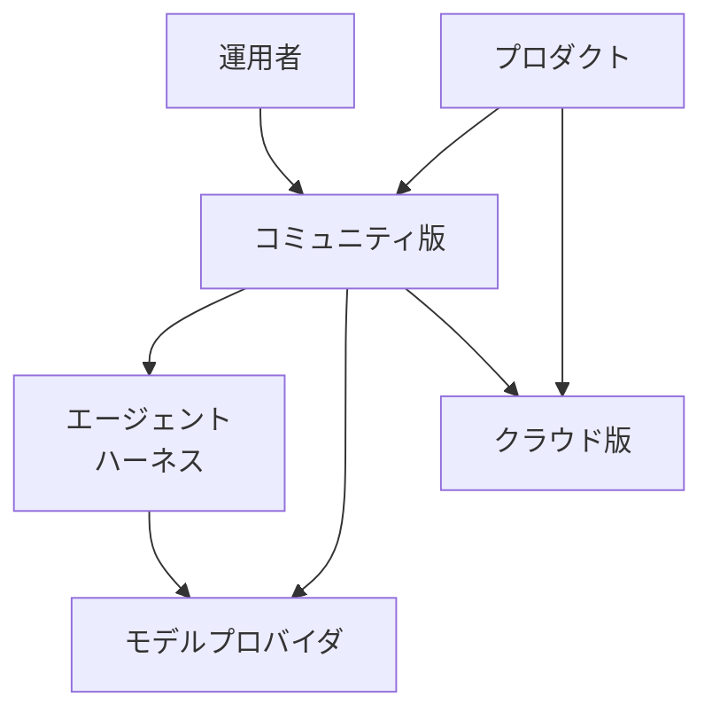
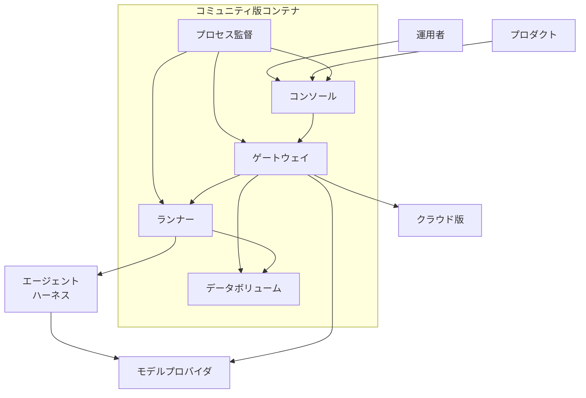
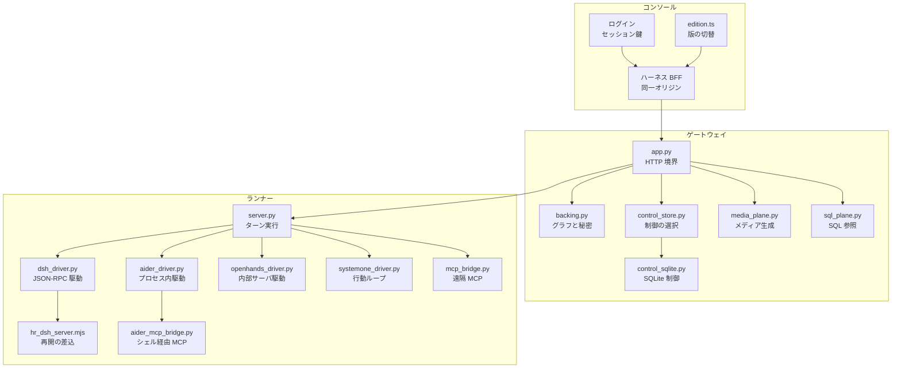
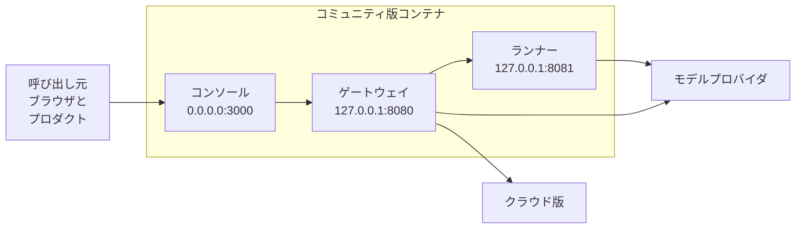
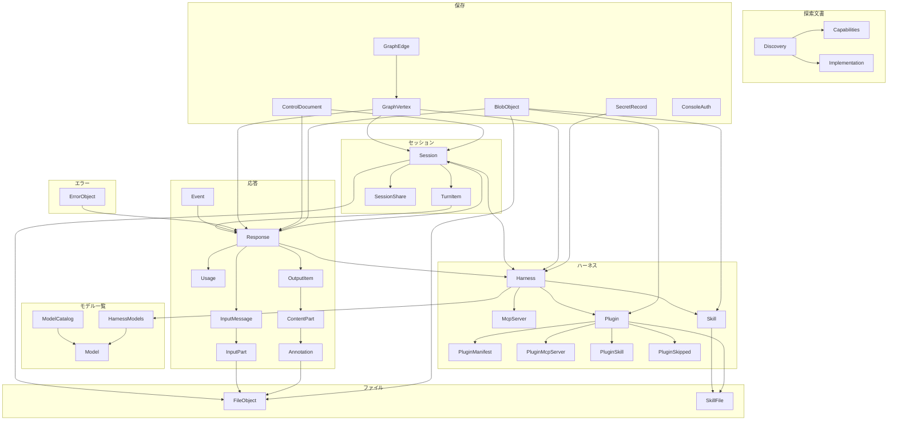
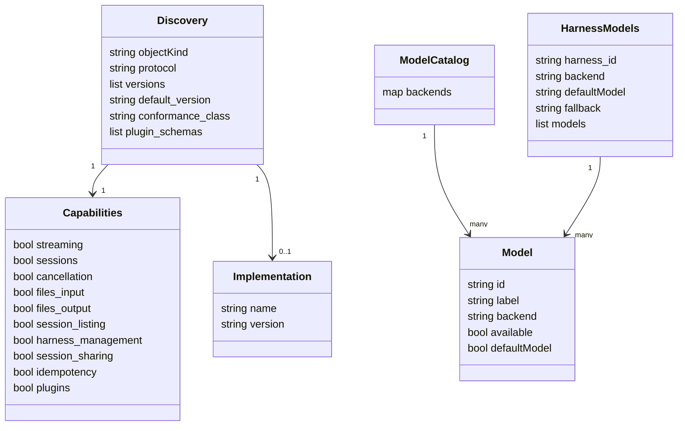
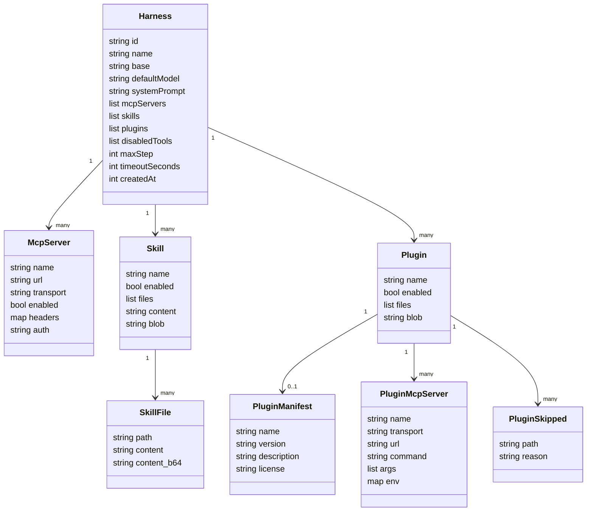
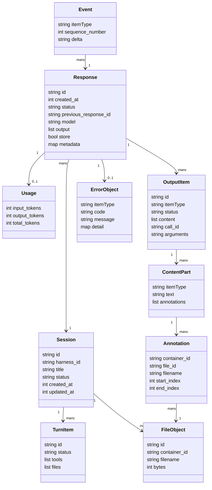
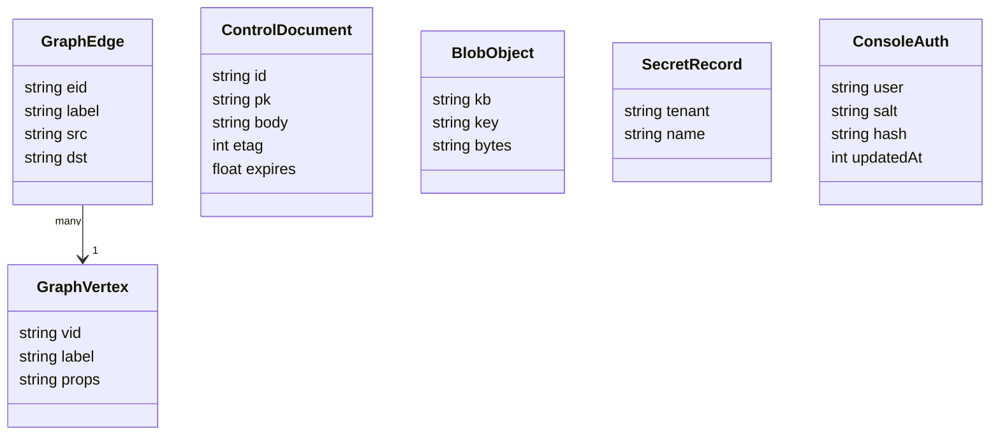

HarnessRouter Community Edition（以下 CE）は、Claude Code や Codex などの既存エージェントハーネスを、製品のバックエンドとして 1 つの HTTP API から呼び出す自己ホスト型の実行レイヤです。
この記事では、CE の構造、データ、Docker での構築、API の使い方、運用の勘所を、2026-09-23 時点の `main` ブランチとリリース v0.23.7 に基づいて整理します。


*この記事の全体像。以下、順に解説します。*

## HarnessRouterとは

HarnessRouter CE は、既存のエージェントハーネスを製品のバックエンドとして使うための自己ホスト型実行レイヤです。
ライセンスは Apache-2.0 です。
リポジトリには Unified Harness Protocol（UHP）の参照実装、機械可読スキーマ、適合性スイートが同梱されています。

UHP は、アプリケーションとハーネスのあいだを 1 つの HTTP 契約でつなぐ公開仕様です。
`protocol/README.md` は現行版を `2026-09-12`、ステータスを Draft standard と宣言しています。
仕様上のハーネスは、計画し、ツールを呼び、ファイルを編集し、結果を返す一式のエージェントランタイムです。

UHP 2026-09-12 は、タスク面を OpenAI Responses API に揃える方針です。
CE はそのサーバ実装です。
製品は自前のインスタンスへタスクを送り、ハーネスの選択、セッションの継続、進捗、ファイル、キャンセル、失敗の記録を同じ API で扱えます。
モデルへの推論リクエストは、利用者が接続したプロバイダへ向かいます。
鍵、セッション、ファイル、ワークスペースは利用者のボリュームに残ります。

HarnessRouter Cloud（https://harnessrouter.ai/ ）は、同じ UHP 契約をホスト側が運用する別サービスです。
Cloud のサイトは、サーバレスの隔離サンドボックス、保守、スケールを提供内容として説明しています。
CE の Quickstart が挙げる前提は、Docker、約 4 GB のディスク、プロバイダ API キーの 3 点です。

リポジトリの基本情報です。
Stars と forks は 2026-09-23 08:51 JST 時点の値で、日々変わります。

| 項目 | 値 |
|---|---|
| エディション | Community Edition（自己ホスト） |
| ライセンス | Apache-2.0 |
| 作成 | 2026-08-09T20:19:14Z（JST では 2026-08-10） |
| 最新リリース | v0.23.7（2026-09-22T18:06:06Z） |
| 言語 | Python（GitHub の primary language） |
| Stars / Forks | 2265 / 221 |
| Open issues | 16（pull request を除く） |
| ファイル数 | `main` の blob が 431 |
| トップディレクトリ | `gateway` / `runner` / `protocol` / `ui` / `docker` / `docs` / `scripts` |
| UHP | 現行宣言は `2026-09-12`。README の適合バッジは UHP Full |
| プロトコルサイト | https://unifiedharnessprotocol.org |

近い選択肢との違いを、各公式が述べている実行の単位で比べます。

| 選択肢 | 実行方式 | 状態の持ち方 | 利用者が持つもの |
|---|---|---|---|
| HarnessRouter CE | 自分のインフラ上の UHP サーバが既存ハーネスへタスクを渡す。呼び出し面は Responses 形式（`tools` などは非対応） | セッションがタスクをまたいで残り、`previous_response_id` で継続する。ワークスペースとファイルは利用者のボリューム | Docker 環境、プロバイダ API キー、CE が発行する API キー |
| OpenAI Responses API | OpenAI がホストする `/v1/responses`。組み込みツールは API 内で実行される。カスタム関数は呼び出し側が実行し、結果を後続リクエストの `function_call_output` で返す | `previous_response_id` でつなぎ、`store: true` でターン間の状態を OpenAI 側が保持する | OpenAI API キーとアプリケーション。カスタム関数の実装は呼び出し側 |
| ハーネス CLI の直接組み込み | 製品が選んだ CLI を、その CLI の起動方法で実行する | セッション、ストリーミング、ファイル、再開、トレースを製品側の実装が持つ | 各 CLI、その認証、周辺ランタイムの実装 |
| LangGraph | 利用者が StateGraph として手順を定義し、LangGraph ランタイムが実行する | persistence、短期メモリ、長期メモリを公式概要が挙げる | グラフ定義、モデルとツールの接続、永続化の設定 |

向く場面は次のとおりです。

| 場面 | 選択 |
|---|---|
| 複数の既存ハーネスを製品機能の裏側に置き、API を維持したままハーネスやモデルを切り替える | HarnessRouter CE |
| スライド、表計算、ダッシュボード、動画のような知識作業の製品を、設定済みエージェントから始める | CE の Starter Kits |
| OpenAI のモデルと組み込みツールで、ホストされたエージェントループを 1 つの API にまとめる | OpenAI Responses API |
| ハーネスを 1 つに定め、セッションやファイル取得まで製品コードで持つ | CLI の直接組み込み |
| 手順のどこをコードで固定し、どこをモデルに任せるかをグラフとして自作する | LangGraph |
| サンドボックスのプロビジョニングとスケールをホスト側に寄せる | HarnessRouter Cloud |

## 特徴

- 製品からの利用単位はタスクです。仕事を渡し、ハーネス自身のツールとセッションで進め、結果とファイルを返します。
- アプリケーション側で扱えるのは、タスクの開始、セッションの継続、進捗のストリーム、ファイルの入出力、タスクのキャンセル、構造化エラーと実行トレースの 6 項目です。
- ハーネスの指定は `metadata.harness_id`、継続は `previous_response_id`、進捗は Server-Sent Events です。
- UHP の拡張は `metadata`、少数の追加フィールド、追加のオブジェクト型に置かれます。ワイヤの形が Responses に揃っているため、既存の Responses クライアントからもタスクを送れます。
- ただし完全互換ではありません。`tools` と `include` は予約フィールドとして受理だけされ、無視されます。ツールは呼び出し側ではなく、ハーネス側の設定として持たせます。
- カスタムハーネスとして、名前、ベース、既定モデル、エージェント指示、ツール、スキルを保存して再利用できます。ツールには MCP サーバを加えられます。
- プロバイダ鍵はコンソールから Bring Your Own Key として接続します。製品連携用の API キーは同じインスタンスの API Keys で発行し、表示は一度だけです。
- 配備は Docker コンテナ 1 つです。公開される入口はコンソールだけです。名前付きボリュームが、データベース、ファイル、導入済みハーネス CLI、ワークスペースを保持します。
- セッションごとに別のワークスペースを持ち、ネイティブなファイルシステム、シェル、Git のワークフローを使えます。
- 初回起動時に、有効なハーネス CLI がボリュームへ入ります。各 CLI のライセンスは上流のままです。
- CE のコンソールでは、製品アナリティクスのパイプラインが停止しています。

接続できるハーネスは、プロバイダ種別ごとに self-hosting guide が次のように列挙しています。

| プロバイダ | その接続を使えるハーネス |
|---|---|
| `anthropic` | Claude Code、Hermes、Pi、DeepSeek Harness、OpenCode、Qwen Code、Cline、Oh My Pi、goose、Kimi Code CLI、Aider、OpenHands |
| `openai` | Codex、Hermes、Pi、DeepSeek Harness、OpenCode、Qwen Code、Cline、Oh My Pi、goose、Kimi Code CLI、Aider、OpenHands |
| `openrouter` | `openai` の一覧に System One を加えたもの |
| `azure-foundry` | `openai` と同じ一覧 |
| `google` | Hermes、Pi、DeepSeek Harness、OpenCode、Qwen Code、Gemini CLI、Cline、Oh My Pi、Kimi Code CLI、Aider、OpenHands |
| `typesafe` | System One（`jev-latest` と `jev-preview`） |
| `bedrock` | Claude Code、Hermes |
| `tokenrouter` | Claude Code、Codex、Gemini CLI を含む 14 ハーネス |
| `vercel` / `llmtr` | Claude Code と Codex を含む 13 ハーネス |
| `custom` | Claude Code、Codex（Responses format）ほか 13 ハーネス |

検証と計測の公開資料も付いています。

- `docs/support-matrix.md` は、first turn、follow-up、model switch、artifact、recycle の 5 シナリオを、プロバイダ節ごとの表で記録しています。2026-09-23 時点で 40 節あり、各節末の件数を足すと pairs 1421、passed 6918、scenario runs 6974 です。全体の総計文はファイルにありません。
- 公開ベンチマーク（Care Prep）は、同一タスクと同一入力に対する 8 つのハーネス×モデル構成を比べています。コストは 0.47〜223 credits、レイテンシは 1 分 25 秒〜4 分 36 秒です。同ページは、この幅の大部分がモデル階層の差で、同一モデルでのハーネス差はコスト 1.5〜2.1 倍、レイテンシ最大 1.95 倍と説明しています。
- README の Starter Kits は Slides、Sheets、Dashboards、Videos の 4 種です。ライセンスは CE とは別条件です。
- ローカルで保存したカスタムハーネスは、設定として Cloud の宛先へアップロードできます。

## 構造

CE の実行時構造を、C4 のシステムコンテキスト、コンテナ、コンポーネントの順に示します。
待受の境界が明確なので、ネットワーク図も加えます。
CE は 1 つのコンテナで動きます。
Cloud は、同じ UHP をサーバレスの隔離サンドボックスで提供する別の実行境界です。
ゲートウェイの探索文書は `default_version` に `2026-09-12`、適合クラスに `full` を返し、`versions` には `2026-08-11` も並びます。

### システムコンテキスト図



| 要素名 | 説明 |
| --- | --- |
| 運用者 | コンソールからハーネス設定、タスク、プロバイダ鍵、API キーを扱います。 |
| プロダクト | UHP のクライアントとしてタスクを送り、進捗と成果物を受け取ります。 |
| コミュニティ版 | 自前の鍵とボリュームで UHP サーバをホストする実行単位です。 |
| クラウド版 | harnessrouter.ai 上の管理された UHP サーバです。 |
| モデルプロバイダ | 推論とメディア生成の呼び出し先です。 |
| エージェントハーネス | 計画、ツール、ファイル編集を自分のループで行う実行系です。 |

プロトコル上の役割は Client、Server、Harness の 3 つです。
CE と Cloud はどちらも Server の実装で、クライアントが Server へ送る契約は UHP だけです。
図のエージェントハーネスには、Codex、Claude Code、Hermes、DeepSeek Harness、Gemini CLI、Pi、OpenCode、Qwen、Cline、Oh My Pi、goose、Kimi、Aider、OpenHands、System One が入ります。

### コンテナ図



#### コミュニティ版コンテナ

| 要素名 | 説明 |
| --- | --- |
| プロセス監督 | tini 配下の entrypoint が 3 プロセスを起動します。Gateway か Runner の終了、または Console の非 0 終了でコンテナが終わります。Console の exit 0 は資格情報の再読込で、Console だけを再起動します。 |
| コンソール | Next.js の harnessrouter-console です。画面と同一オリジンの API 入口を兼ねます。 |
| ゲートウェイ | FastAPI の `app.py` です。UHP、ハーネスのライフサイクル、保存を担当します。 |
| ランナー | FastAPI の `server.py` です。セッションのワークスペース上でハーネスを 1 ターンずつ実行します。 |
| データボリューム | `/data` に SQLite、ブロブ、秘密、ワークスペース、導入済みハーネス CLI を置きます。 |

- コンソールとゲートウェイはユーザー `agent` で動きます。
- ランナーは root で動き、エージェントプロセスをセッションごとの uid に切り替えます。
- 既定の資格情報の渡し方は `HR_SANDBOX_TRUST=owner` です。ゲートウェイが解決したプロバイダ鍵を、ランナー経由でハーネスへ渡します。
- メディア生成の鍵解決は、ゲートウェイ内の `media_plane` が行います。
- 保存の既定は `HR_BACKING=local` です。`COSMOS_ENDPOINT` が空のとき、制御状態は `control_sqlite` に置かれます。

#### コンテナ外

| 要素名 | 説明 |
| --- | --- |
| 運用者 | 公開ポートのコンソールへブラウザで到達します。 |
| プロダクト | コンソールの `/api/harness` 経由でゲートウェイの UHP を呼びます。 |
| モデルプロバイダ | ハーネスのモデル呼び出しと、ゲートウェイのメディア生成の宛先です。 |
| エージェントハーネス | 初回起動でデータボリュームへ導入される上流の CLI または SDK です。 |
| クラウド版 | カスタムハーネス設定のアップロード先です。 |

Cloud へのアップロードが写すのはハーネス設定だけです。
プロバイダ鍵、セッション、生成ファイルはローカルのボリュームに残ります。

### コンポーネント図



#### コンソール

| 要素名 | 説明 |
| --- | --- |
| edition.ts | `NEXT_PUBLIC_HR_EDITION=selfhost` で単一テナントの local を定め、表示面を CE に合わせます。 |
| ハーネス BFF | `/api/harness` をゲートウェイへ転送します。セッション確認後に内部鍵と local の org・member を付与します。 |
| ログイン | コンソールの資格情報からセッション鍵を作ります。プロフィール変更時はコンソールプロセスだけを再起動します。 |

コンソールの実体は Next.js 15 と React 19 のスタンドアロンサーバです。
ホスト版と同じコードベースで、版フラグが CE の表示面を選びます。
CE で案内される面は、キット、ハーネス、タスク、API キー、統合です。
ホスト版のアカウントサービス向けの `/api/engine` は、CE では 501 を返します。

#### ゲートウェイ

| 要素名 | 説明 |
| --- | --- |
| app.py | `/v1/uhp`、`/v1/responses`、セッション、ファイル、ハーネス、キット、共有、クラウド転送を提供します。ターン実行では `_resp_execute` が Runner の `POST /turn` を呼びます。 |
| backing.py | GraphStore、BlobStore、SecretStore の local 実装です。SQLite とファイルにセッションと秘密を置きます。 |
| control_store.py | 冪等予約、セッションリース、応答の終端状態を、ホスト版ストアと SQLite で同じ操作列に乗せます。 |
| control_sqlite.py | CE の制御ストアです。ETag 相当の比較交換を SQLite のトランザクションで行います。 |
| media_plane.py | 能力名からメディア提供者を選び、ゲートウェイ内で鍵を解決して生成と書き出しを行います。 |
| sql_plane.py | 読み取り専用の SQL データ面です。データベース MCP の問い合わせとスキーマ参照を担います。 |

`app.py` は `/v1/llm` で、サンドボックス向けの資格情報ブローカも持ちます。
owner モードの CE では、ハーネスがプロバイダへ直接通信します。
ランナーへの指示は、ループバックの `/turn`、`/hydrate`、`/checkpoint`、`/produced`、`/file` です。

#### ランナー

| 要素名 | 説明 |
| --- | --- |
| server.py | ターンの起動と取消、ワークスペースの隔離、成果物の収集、イベントの正規化を行います。 |
| dsh_driver.py | DeepSeek Harness の SDK で JSON-RPC ランタイムを駆動し、イベントを NDJSON で返します。 |
| hr_dsh_server.mjs | DeepSeek Harness の JSON-RPC サーバへ、既存セッションの resume を先に試させるプラグインです。 |
| aider_driver.py | Aider をプロセス内 API で 1 ターン駆動し、診断と本文を分けて NDJSON にします。 |
| aider_mcp_bridge.py | Aider のシェルツールから、設定済み MCP サーバの tools と call を呼び出します。 |
| openhands_driver.py | ターンごとに OpenHands の agent server をループバックで起動し、HTTP と WebSocket で 1 ターン進めます。 |
| systemone_driver.py | System One Harness の観察、行動、リスク判定のループを 1 ターン実行します。 |
| mcp_bridge.py | 標準入出力の MCP として起動され、SSE または Streamable HTTP の遠隔サーバへ転送します。 |

`server.py` の `BACKENDS` は、各ハーネスのイベントを Claude Code の stream-json 形式へ揃えます。
レジストリ名は claude、codex、hermes、pi、dsh、opencode、qwen、gemini、cline、omp、goose、kimi、aider、openhands、systemone の 15 個です。
Hermes だけは専用のビルダーを持たず、`_run_hermes_bg` が state.db をポーリングして Claude 形式のイベントを合成します。
セッションディレクトリはそのセッションの uid が所有し、ワークスペースの親はセッションから一覧も書き込みもできないモードです。

### ネットワーク図



| 要素名 | 説明 |
| --- | --- |
| コンソール | コンテナ内の全インタフェースでポート 3000 を待ち受けます。公開される入口です。 |
| ゲートウェイ | `127.0.0.1:8080` で UHP とヘルスチェックを待ち受けます。 |
| ランナー | `127.0.0.1:8081` でターン API を待ち受けます。 |
| 呼び出し元 | ブラウザはコンソールへ、プロダクトは `/api/harness` へ到達します。 |
| モデルプロバイダ | owner モードではハーネスプロセスから、メディア生成ではゲートウェイから通信が出ます。 |
| クラウド版 | ゲートウェイのクラウド転送が、保存した宛先のワークスペース API へ設定を送ります。 |

- Dockerfile の HEALTHCHECK は `127.0.0.1:8080/healthz` を見ます。
- README の `docker run` は、ホスト側を `127.0.0.1:3000` にバインドします。
- プロダクト向けの公開基点は `http://localhost:3000/api/harness` です。ゲートウェイ直下の `/v1` はその先にあります。

## データ

対象は UHP `2026-09-12` のオブジェクトと、CE のゲートウェイがそれを置く保存領域です。
属性名は OpenAPI と仕様本文のワイヤ名です。
保存側の列名は `gateway/backing.py`、`gateway/control_sqlite.py`、`gateway/control_store.py` の定義です。

### 概念モデル

所有関係を subgraph で、利用関係を矢印で表します。



| 区分 | 要素名 | 説明 |
| --- | --- | --- |
| 探索文書 | Discovery | `GET /v1/uhp` の文書です。`object` は `uhp.discovery` です。 |
| 探索文書 | Capabilities | 名前付きの真偽値です。`2026-09-12` では `plugins` を含む 10 個が列挙されています。 |
| 探索文書 | Implementation | 任意の識別情報です。`name` と `version` を持ちます。 |
| ハーネス | Harness | 実行主体の設定です。`id` は `chrn_` で始まり、`base` は不透明な文字列です。 |
| ハーネス | McpServer | ハーネスに直接書いた遠隔 MCP です。`transport` は `http` または `sse` です。 |
| ハーネス | Skill | ハーネスに直接書いたスキルフォルダです。`SKILL.md` を含みます。 |
| ハーネス | Plugin | Agent Plugins パッケージを取り付けた記録です。`2026-09-12` で増えました。 |
| ハーネス | PluginManifest / PluginMcpServer / PluginSkill / PluginSkipped | パッケージの `plugin.json`、`mcp.json` から導出した MCP、`skills/` 配下のスキル、読み込まなかった部品です。`stdio` の MCP は PluginMcpServer だけが持てます。 |
| モデル一覧 | ModelCatalog / HarnessModels / Model | `GET /v1/models` のカタログ、ハーネス単位の一覧、1 モデルです。`available` はその時点で提供できるかの計算結果です。 |
| セッション | Session | 会話と作業ディレクトリの継続単位です。最初のタスクでサーバが作ります。 |
| セッション | TurnItem | `GET /v1/sessions/{session_id}/turns` の 1 行です。`id` はそのターンの response id です。 |
| セッション | SessionShare | 読み取り専用の公開です。`id` と `url` が必須です。 |
| 応答 | Response | `POST /v1/responses` の 1 タスクです。`id` は `resp_` で始まります。 |
| 応答 | Usage | トークン計上です。計上が無いときは JSON の null です。 |
| 応答 | OutputItem / ContentPart / Annotation | 出力要素、メッセージの部分、成果物引用（`container_file_citation`）です。 |
| 応答 | InputMessage / InputPart | 入力メッセージと、`input_text`、`input_file`、`input_image` の部分です。 |
| 応答 | Event | SSE の 1 イベントです。`type` と `sequence_number` が必須です。 |
| ファイル | FileObject / SkillFile | アップロードと成果物のファイル記録、スキルやプラグインの 1 ファイルです。 |
| エラー | ErrorObject | 非 2xx の `error` です。タスク失敗も同じ形を HTTP 200 の Response の中に持ちます。 |
| 保存 | GraphVertex / GraphEdge | `graph.db` の頂点と辺です。辺のラベルは `OWNS` と `USES` です。 |
| 保存 | ControlDocument | `control.db` の 1 行です。本文 JSON の `kind` で役割が分かれます。 |
| 保存 | BlobObject | `blobs/{kb}/` 配下の 1 ファイルです。応答 JSON、成果物、パッケージ、トレース、ワークスペース tar が入ります。 |
| 保存 | SecretRecord / ConsoleAuth | 接続とポリシーの秘密、コンソールログインの JSON です。 |

### 情報モデル

属性を 4 つの図に分けて示します。
型名は `string`、`int`、`bool`、`float`、`list`、`map` です。
図中の `objectKind` はワイヤの `object`、`itemType` はワイヤの `type`、`defaultModel` はワイヤの `default` を表します。

探索文書とモデル一覧です。



ハーネスとプラグインです。



セッション、応答、ファイルです。



保存領域です。



#### 主なオブジェクトの必須フィールド

| 要素名 | 説明 |
| --- | --- |
| Discovery | 必須は `object`、`protocol`、`versions`、`default_version`、`conformance_class`、`capabilities` です。`conformance_class` は `core`、`extended`、`full` のいずれかです。 |
| Capabilities | 提供する能力は true、残りは false です。クライアントはキーの欠落を false として扱います。 |
| Harness | OpenAPI の required は `id`、`name`、`base` です。`createdAt` は Unix ミリ秒です。 |
| HarnessCreate | 作成ボディは別オブジェクトで、必須は `base` です。フィールドは `default_model` のようなスネークケースです。読み取りの Harness はキャメルケースです。 |
| McpServer | 必須は `name` と `url` です。`transport` の既定は `http` です。 |
| Plugin | クライアントが書くのは `files` または `blob` と、任意の `name`・`enabled` です。`manifest`、`mcpServers`、`skills`、`skipped` はサーバが書き込みのたびに再計算します。 |
| PluginManifest | 必須は `$schema` と `name` です。`name` は最大 64 文字の小文字・数字・`.`・`-` です。 |
| Session | 仕様の必須は `id` です。時刻は Unix 秒です。 |
| Response | OpenAPI の required は `id`、`object`、`created_at`、`status`、`output`、`model` です。`status` は `in_progress`、`completed`、`failed`、`incomplete`、`cancelled` です。 |
| OutputItem | 型は `message`、`reasoning`、`function_call`、`function_call_output` です。`arguments` は JSON 文字列です。 |
| Event | `sequence_number` は 0 始まりで 1 ずつ増えます。終端は `response.completed`、`response.incomplete`、`response.failed` のいずれか 1 つです。 |
| ErrorObject | OpenAPI の required は `type`、`code`、`message` です。`type` は `invalid_request_error`、`authentication_error`、`permission_error`、`rate_limit_error`、`harness_error`、`server_error` です。 |

Response の `metadata` で仕様が名前を持つキーは、`session_id`、`requested_model`、`model_fallback`、`model_fallback_reason`、`ignored_fields` です。
リクエスト側の `metadata.harness_id` がハーネスの選択です。
`tools` と `include` は予約フィールドで、送ると `ignored_fields` にその名前が入ります。
`2026-09-12` で増えたエラーコードは、`plugin_not_found`、`plugin_conflict`、`plugin_invalid`、`unsupported_plugin_schema`、`unsupported_transport` です。

#### 識別子の形

| 対象 | 形 |
| --- | --- |
| ハーネス | `chrn_` と 32 桁 hex |
| 応答 | `resp_` と 32 桁 hex |
| セッション | `hsess` と 32 桁 hex（区切り文字なし） |
| アップロード | `file_` と 32 桁 hex |
| 成果物 | `cfile_` と 32 桁 hex |
| ワークスペース上のファイル | `wf_` とパスの urlsafe base64 |
| コンテナ | セッション id と同じ値 |
| プラグイン blob / スキル blob | `plg_` / `skb_` と 32 桁 hex |
| 出力要素 | `rs_`、`msg_`、`fc_`、`fco_`、`call_` と 32 桁 hex |
| 共有 | `shr` と 32 桁 hex |
| API キー | `sk-hr-` と 64 桁 hex |

#### 保存の実体

3 つの設定、Dockerfile の `HR_DATA_DIR=/data`、`docker-compose.yml` のマウント、entrypoint の `DATA_DIR`、がすべて `/data` を指します。

| 要素名 | 説明 |
| --- | --- |
| GraphVertex | `/data/graph.db` の表 `vertices` です。列は `vid`、`label`、`props` で、`props` はマージ更新される JSON です。 |
| GraphEdge | 同じファイルの表 `edges` です。列は `eid`、`label`、`src`、`dst` です。 |
| ControlDocument | `/data/control.db` の表 `control` です。列は `id`、`pk`、`body`、`etag`、`expires` です。`etag` は単調増加の整数で、期限切れの行は読み取り時に消し込まれます。 |
| BlobObject | `/data/blobs/{kb}/{key}` のファイルです。既定の kb は `harness-responses`、`harness-sessions`、`traces` です。 |
| SecretRecord | `/data/secrets/{tenant}/{name}` のファイルです。`HR_SECRET_KEY` があるとき、本文は `hrenc1:` と AES-256-GCM 暗号文の base64 です。 |
| ConsoleAuth | `/data/selfhost-auth.json` です。フィールドは `user`、`salt`、`hash`、`updatedAt` です。 |

- 両 SQLite は WAL モードです。entrypoint は `*.db` を owner `agent`・mode `600` に、`blobs` と `secrets` を mode `700` にします。
- グラフのラベルは `Harness`、`HarnessSession`、`HarnessResponse`、`HarnessApiKey`、`Workspace` です。`OWNS` 辺は `acct.{org}` からセッションへ、`USES` 辺はセッションからハーネスへ張られます。
- 応答の正本は blob の `responses/{id}.json` です。グラフの `HarnessResponse` は索引です。

`control.body` の `kind` ごとの役割です。

| kind | id | 本文のフィールド |
| --- | --- | --- |
| idem | `idem::{org}::{sha}` | `resp_id`、`req_hash`、`state`、`ts`、`ttl` |
| lease | `lease::{org}::{sid}` | `fence`、`owner`、`expires`、`ts`、`ttl` |
| resp | `resp::{org}::{rid}` | `status`、`sid`、`runner_turn_id`、`harvest_cursor`、`ts`、`ttl` |
| lock | `lock::{name}` | `ts`、`ttl` |
| apikey | `apikey::{sha}` | `org`、`member`、`workspace`、`revoked`、`ts`、`ttl` |

ソースが固定している主な blob の key です。

| kb 既定 | key | 中身 |
| --- | --- | --- |
| harness-responses | `responses/{resp_id}.json` | 応答レコード |
| harness-responses | `containers/{session_id}/{cfile_id}` と `.meta` | 成果物のバイトとメタ情報 |
| harness-responses | `uploads/{file_id}` と `.meta` | アップロード本体とメタ情報 |
| harness-responses | `previews/{container_id}/{file_id}.pdf` | PDF プレビュー |
| harness-sessions | `skills/{skb_id}.json` / `plugins/{org}/{plg_id}.json` | スキルフォルダとプラグインパッケージ |
| harness-sessions | `sessions/{session_id}/workspace.tgz` | ワークスペースの tar |
| traces | `{org}/{created_at_inv}_{session_id}` | トレース |

## 構築方法

### 前提

- 必要なものは Docker、約 4 GB のディスク、モデルプロバイダの API キーです。
- イメージ名は `harnessrouter/harnessrouter` で、初回の取得サイズは約 700 MB です。
- 1 コンテナの中に Console、Gateway、Runner が入り、公開するのは Console だけです。
- コンテナは uid 0 で起動します。Console と Gateway はユーザー `agent` で、Runner はセッション uid の切替のため root のまま動きます。
- データベース接続と Cloud 宛先キーの暗号化には `HR_SECRET_KEY` を使います。ダッシュボード接続を置く前にこのパスフレーズを決めておきます。

```text
┌─ HarnessRouter container ─────────────────────────────────┐
│  Console :3000   ← only published port                    │
│       │ same-origin proxy                                 │
│       ▼                                                   │
│  Gateway :8080   Responses API + harness lifecycle        │
│       │ loopback                                          │
│       ▼                                                   │
│  Runner  :8081   runs harnesses in session workspaces     │
│                                                           │
│  /data volume   database · files · secrets · workspaces   │
└───────────────────────────────────────────────────────────┘
```

### Docker での起動

README の最短手順は、名前付きボリューム `harnessrouter` を `/data` に付けて起動する形です。

```bash
docker run -d --name harnessrouter \
  -p 127.0.0.1:3000:3000 \
  -v harnessrouter:/data \
  harnessrouter/harnessrouter
```

初回はログを追い、準備完了の行を待ちます。

```bash
docker logs -f harnessrouter
```

```text
[harnessrouter] ready on :3000
```

- 別のホストポートを使うときは左側だけを変えます（例: `-p 127.0.0.1:3100:3000`）。
- ログの `backends available:` が、そのボリュームで導入済みのバックエンドです。
- 導入するバックエンドは `HR_BACKENDS` で選びます。既定は `claude,codex,hermes,pi,dsh,opencode,qwen,gemini,cline,omp,goose,kimi,aider,openhands,systemone` の 15 個です。
- ソースからビルドするときにブラウザ層を入れるには、ビルド引数 `WITH_BROWSER=1` を使います。

Compose を使う場合、リポジトリの `docker-compose.yml` は `ports` が `"3000:3000"` です。
self-hosting guide の手順は次の順です。

1. `ports` を `127.0.0.1:3000:3000` に書き換える
2. `cp .env.example .env` で `.env` を作る
3. `docker compose up -d` で起動する

```yaml
services:
  harnessrouter:
    image: harnessrouter/harnessrouter:latest
    ports:
      - "127.0.0.1:3000:3000"
    env_file:
      - .env
    volumes:
      - harnessrouter-data:/data
    restart: unless-stopped
```

### 認証の初期値


- Console の初期ユーザー名とパスワードは、どちらも `harnessrouter` です。
- サインイン URL は `http://localhost:3000`、セッション Cookie の名前は `hr_selfhost` です。
- 起動時に初期値を差し替える変数は `HR_AUTH_USER` と `HR_AUTH_PASSWORD` です。
- Profile で保存した資格情報は `/data/selfhost-auth.json` に入り、保存後は環境変数より優先されます。
- 製品バックエンドの資格情報は、Console の **API Keys**（`http://localhost:3000/keys`）で作る `sk-hr-` で始まるキーです。`Authorization: Bearer` で送ります。

| 資格情報 | 保持者 | 用途 |
|---|---|---|
| Console のユーザー名とパスワード | ブラウザを使う人 | インスタンスの管理と Console 上のタスク |
| プロバイダ API キー | インスタンス | Integrations で設定したモデル呼び出し |
| HarnessRouter API キー（`sk-hr-`） | 製品バックエンド | CE への API 呼び出し |

```bash
docker run -d --name harnessrouter \
  -p 127.0.0.1:3000:3000 \
  -v harnessrouter:/data \
  -e HR_AUTH_USER=you \
  -e HR_AUTH_PASSWORD=the-password-you-chose \
  harnessrouter/harnessrouter
```

ローカルでの確認には、Cookie でログインしてからカタログを取得する方法も使えます。

```bash
curl --fail-with-body -sS -c hr.cookies http://localhost:3000/api/selfhost/login \
  -H 'content-type: application/json' \
  -d '{"username":"harnessrouter","password":"<your-password>"}'

curl --fail-with-body -sS -b hr.cookies http://localhost:3000/api/harness/v1/models
```

BFF は、有効な Cookie のときだけ内部ヘッダ `x-harness-internal` を付けてゲートウェイへ転送します。
Bearer だけのリクエストでは Authorization をそのまま渡し、成否はゲートウェイの API キー解決が決めます。

### プロバイダ接続


- Console の **Bring Your Own Key** で **Add Integration** を押し、名前、プロバイダ、API キーを入力します。
- このキーはモデル呼び出し用で、Console パスワードとも `sk-hr-` キーとも別物です。
- カスタムエンドポイントは、API 形式、URL、キー、モデル行を持ちます。モデル行は、ハーネスが選ぶ id と、エンドポイントが受け取る名前の組です。
- Console の一括設定 API は `PUT /api/harness/v1/admin/integrations` です。`GET` はキーを伏せて返します。

スクリプトで配備するときは環境変数を使います。
接続の秘密名は `harness-conn-{name}`、バックエンドのポリシー名は `harness-policy-{backend}` です。

```bash
-e HR_SECRET_GLOBAL_HARNESS_CONN_ANTHROPIC='{"name":"anthropic","provider":"anthropic","api_key":"sk-ant-…"}'
-e HR_SECRET_GLOBAL_HARNESS_POLICY_CLAUDE='{"chain":["anthropic"]}'
```

OpenAI 互換のエンドポイントは、`provider` を `openai` にして `base_url` を加えます。

```bash
-e HR_SECRET_GLOBAL_HARNESS_CONN_LOCAL='{"name":"local","provider":"openai","api_key":"…","base_url":"https://api.example.com/v1"}'
-e HR_SECRET_GLOBAL_HARNESS_POLICY_CODEX='{"chain":["local"]}'
```

プロバイダもポリシーも空のまま Codex にタスクを送ると、ゲートウェイは HTTP 400 で次のエラーを返します。

```json
{"error":{"type":"invalid_request_error","code":"invalid_input","message":"no provider configured for backend 'codex'. Add an integration for a provider that serves 'gpt-5.4-mini', or configure a connection policy"}}
```

### 設定するキー

ゲートウェイが読む主な環境変数です。
テナントの既定は `global` です。

| キー | 意味 |
|---|---|
| `HR_DATA_DIR` | データディレクトリ。entrypoint の既定は `/data` |
| `HR_SECRET_KEY` | 秘密ファイルの暗号化キー。データベース接続の保存はこのキーがあるときだけ行われる |
| `HR_SECRET_GLOBAL_HARNESS_CONN_{NAME}` | 秘密名 `harness-conn-{name}` の接続 JSON |
| `HR_SECRET_GLOBAL_HARNESS_POLICY_{BACKEND}` | 秘密名 `harness-policy-{backend}` のポリシー JSON。形は `{"chain":["接続名"]}` |

環境変数名は、`FileSecretStore._env_key` が次の規則で組み立てます。
環境変数の値は、ディスク上の秘密より優先されます。

```python
def _env_key(tenant: str, name: str) -> str:
    return "HR_SECRET_" + re.sub(r"[^A-Za-z0-9]", "_", f"{tenant}_{name}").upper()
```

### カスタムハーネス

- 組み込みハーネスは、この手順なしでも使えます。
- **Agent harnesses** の **New harness** で、Name、Base harness、Default model を指定し、**Create and configure** を押します。
- **Harness Settings** で Agent instructions、Tools、必要なら **Add MCP**、Skills を足します。
- **Save Changes** のあと **Run Task** で設定を試します。
- 既定モデルは作成後に変更できますが、base は作成時の値のままです。
- API で作るときは `POST /api/harness/v1/harnesses` です。読み取りの id は `chrn_` で始まります。
- 組み込みハーネスは、`metadata.harness_id` に `codex` のようなベース名を渡して指定します。

## 利用方法

呼び出しのベース URL は、バックエンドから見た CE の URL です。
同一マシンの既定は次のとおりです。

```bash
export HARNESSROUTER_BASE_URL=http://localhost:3000/api/harness
```

OpenAPI は `$HARNESSROUTER_BASE_URL/v1/openapi.json` から取得できます。
以降の説明では UHP の論理パス（`/v1/...`）を使います。
CE では、すべてのパスの前に `/api/harness` を付けます。

### 必須パラメータ

`tasks.md` で必須とされているのは `input` だけです。
README の例は、これに `model`、`metadata.harness_id`、`stream` を添えています。

| フィールド | 必須 | 意味 |
|---|---|---|
| `input` | はい | 仕事の内容。文字列はユーザーメッセージ 1 件の短縮形 |
| `model` | 任意 | モデル id。省略時はハーネスの既定 |
| `metadata.harness_id` | 任意 | ハーネスの選択。未知の id は `404` と `harness_not_found` |
| `stream` | 任意 | `true` で SSE。既定は `false` で、終了時に JSON 1 件 |
| `previous_response_id` | 継続時 | その応答を生んだセッションを続ける |
| `instructions` | 任意 | そのタスクだけの追加指示 |
| `store` | 任意 | 応答を後から読めるように残すか。既定は `true` |
| `max_output_tokens` / `max_step` / `timeout_seconds` | 任意 | 生成トークン、ステップ、壁時計時間の上限 |
| `background` | 任意 | 受理後すぐ返し、イベント端点で追う |
| `tools` / `include` | 予約 | 受理はするが `metadata.ignored_fields` に名前が入る |

- `previous_response_id` と `harness_id` が別のハーネスを指すと、`409` と `harness_mismatch` です。
- 要求モデルをそのハーネスが提供していないときは、`422` と `model_unavailable`、または既定モデルへの置換です。置換時は `metadata.requested_model` と `metadata.model_fallback` が付きます。
- `Idempotency-Key` ヘッダは初回では任意ですが、`POST /v1/responses` を再送するときは同じ鍵が必須です。

### ターンの実行


Console では **Agent harnesses** からハーネスを選び、**New task** でモデルを選んで指示を送ります。
API では `POST /v1/responses` を呼びます。
モデル id は、接続したプロバイダが提供するものに合わせます。

```bash
curl --fail-with-body -sS "$HARNESSROUTER_BASE_URL/v1/responses" \
  -H "Authorization: Bearer ${HARNESSROUTER_API_KEY:?}" \
  -H 'content-type: application/json' \
  -d '{
    "input":"Reply with exactly: it works.",
    "metadata":{"harness_id":"codex"},
    "model":"gpt-5.4-mini",
    "stream":false
  }'
```

カスタムハーネスを使うときは、`chrn_` で始まる id を渡します。

```json
{
  "input": "Summarise README.md in three bullets.",
  "model": "claude-sonnet-4.6",
  "metadata": { "harness_id": "chrn_08dae611630d467ab3e67ed792570ae5" },
  "stream": true
}
```

- self-hosting guide の成功例では、`status: completed`、`message` 内の `output_text`、`metadata.session_id` が返ります。ただし仕様上、何も生成しなかったタスクの `output` は空になり得ます。
- 同じタスクの再読取は `GET /v1/responses/{response_id}`、入力の再取得は `GET /v1/responses/{response_id}/input_items` です。
- カタログは `GET /v1/harnesses` と `GET /v1/models` です。
- モデルの `available: true` は、その時点で資格情報があり、そのハーネスにそのモデルを提供できることを意味します。

### セッションの継続

次のタスクのボディに、直前の応答の `id` を `previous_response_id` として置きます。
サーバは同じ作業ディレクトリ、同じハーネス、同じ `metadata.session_id` で実行します。
`model` はターンごとに変えられます。

```json
{
  "input": "Now add tests for the function you just wrote.",
  "previous_response_id": "resp_a1b2c3"
}
```

- 未知の応答 id は `404` と `response_not_found` です。
- セッションの一覧は `GET /v1/sessions` です。クエリは `limit`、`cursor`、`harness` で、最終ページの `next_cursor` は `null` です。
- 1 件の取得は `GET /v1/sessions/{session_id}`、履歴は `GET /v1/sessions/{session_id}/turns` です。
- 共有は `POST`・`GET`・`DELETE /v1/sessions/{session_id}/share` です。共有ビューは読み取り専用です。

### ファイルと成果物

小さなファイルは、`input` 配列の `input_file` に data URL で埋め込みます。

```json
{
  "input": [
    { "role": "user", "content": [
        { "type": "input_text", "text": "Summarise this." },
        { "type": "input_file", "filename": "q3.pdf",
          "file_data": "data:application/pdf;base64,…" }
    ]}
  ]
}
```

大きなファイルは `POST /v1/files`（`multipart/form-data`）で先にアップロードし、`file_id` で参照します。

```json
{ "type": "input_file", "file_id": "file_abc123" }
```

- 画像は `input_image` です。
- 上限を超えたアップロードは `413` と `file_too_large` です。
- 成果物は、アシスタントメッセージの `annotations` に `container_file_citation` として載ります。CE の `container_id` はセッション id、成果物の `file_id` は `cfile_` で始まります。
- セッションのファイル一覧は `GET /v1/sessions/{session_id}/files`、一括取得は `GET /v1/sessions/{session_id}/files/archive` です。
- バイト列の取得は `GET /v1/containers/{container_id}/files/{file_id}/content` です。PDF プレビューは末尾の `/content` を `/pdf` に置き換えた `GET /v1/containers/{container_id}/files/{file_id}/pdf` です。
- README は、長いトークンをプロンプト本文に書かず、ファイルとして渡すよう勧めています。

### ストリームとキャンセル

`"stream": true` の `POST /v1/responses` は `text/event-stream` を返します。

```text
data: {"type":"response.created","sequence_number":0,"response":{…}}

data: {"type":"response.output_text.delta","sequence_number":7,"item_id":"msg_1","output_index":0,"content_index":0,"delta":"Sum"}

data: {"type":"response.completed","sequence_number":42,"response":{…}}
```

- 先頭は `response.created`、終端は `response.completed`、`response.incomplete`、`response.failed` のいずれか 1 件です。
- テキストの断片は `response.output_text.delta` です。
- 切断してもタスクはサーバ側で続きます。`GET /v1/responses/{response_id}` で追えます。ハーネス単位のライブ供給は `GET /v1/harnesses/{harness_id}/events` です。
- タスク単位の停止は `POST /v1/responses/{response_id}/cancel`、セッション内の実行中作業の停止は `POST /v1/sessions/{session_id}/cancel` です。
- キャンセルしたタスクの終端イベントは `response.failed` で、応答の `status` は `cancelled` です。それまでの出力とセッションは残ります。
- `"stream": false` の結果は、同じ入力のストリームが組み立てる `output` と同じです。

## 運用

### 起動確認

- `docker run` は約 1 秒で戻ります。ブラウザを開くのは、ログに ready 行が出てからです。
- 初回は有効なハーネス CLI をボリュームへ入れるため時間がかかります。2 回目以降はキャッシュ分だけ速くなります。
- ready 行の直後に接続が拒否されるときは、Console サーバの起動を数秒待ちます。
- Aider と OpenHands は各約 700 MB あり、新しいボリュームでは 1〜2 分かかります。
- `Ctrl+C` はログの追跡を終えるだけで、コンテナは動き続けます。

### ログ

- `backends available:` が、その起動で実際に入ったバックエンドの一覧です。失敗した名前は `requested but not installed` の警告に残り、他のバックエンドは動き続けます。
- 既定パスワードのままでは、起動のたびに次の警告が出ます。

```text
[harnessrouter] WARNING: using the DEFAULT password. Set HR_AUTH_PASSWORD, or change it from the profile page, before exposing this instance.
```

- Profile でパスワードを保存したあとは、資格情報の出所が起動ログに出ます。

```text
[harnessrouter] sign in as 'harnessrouter' (credentials set from the profile page)
```

- 0.8.2 以降、root 以外での起動は拒否され、その旨がログに 1 行出ます。

### ボリューム

- 名前付きボリューム `harnessrouter` を `/data` にマウントします。データベース、ファイル、導入済み CLI、ワークスペースが再起動後も残ります。
- セッション作業ディレクトリの既定は `/data/workspaces` です。
- アイドル状態の作業ディレクトリは、既定 72 時間（`HR_WORKSPACE_TTL_HOURS`）で削除されます。削除後のセッションはチェックポイントから再構成されます。`0` にすると作業ディレクトリを残します。
- エージェントはセッションごとの OS ユーザーで動きます。別セッションのファイルや秘密ストアは、所有者の違いで読み取りが拒否されます。
- ボリュームを削除すると永続データも消えます。`docker compose down -v` はボリュームも消します。

### 再起動とイメージ更新

```bash
docker start harnessrouter
docker restart harnessrouter
```

`docker pull` はイメージを取得するだけで、動いているコンテナは旧イメージのままです。
更新の手順は、バックアップ、pull、古いコンテナの stop と rm、同じボリューム・ポート・設定での作り直し、の順です。

```bash
docker pull harnessrouter/harnessrouter
docker stop harnessrouter
docker rm harnessrouter
docker run -d --name harnessrouter \
  -p 127.0.0.1:3000:3000 \
  -v harnessrouter:/data \
  harnessrouter/harnessrouter
```

- `HR_AUTH_PASSWORD`、`HR_SECRET_KEY`、`HR_BACKENDS` を付けていた場合は、作り直し時にも同じ値を渡します。
- Compose では `docker compose pull` のあと `docker compose up -d` です。
- `latest` は現行リリースを追います。特定リリースはバージョンタグ、同一バイトはイメージダイジェストで固定します。
- Profile でパスワードを保存すると Console が短時間再起動します。実行中のターンは継続し、他のブラウザはサインアウトします。

### バックアップ

- コピーの前にコンテナを止めます。停止中の SQLite とファイルが一貫したバックアップになります。
- ボリュームのパーミッションを保ち、`HR_SECRET_KEY` をデプロイ記録と一緒に保管します。
- 復元は、ボリュームと設定を戻してから代替インスタンスを起動します。
- `HR_SECRET_KEY` が保存時と違うと、データベース接続と Cloud 宛先キーの復号に失敗します。

### サポートマトリクスの読み方

- シナリオは 5 個です。first turn、同一セッションの follow-up、途中の model switch、artifact、recycle です。
- 判定語は `pass`、`FAIL`（理由は Notes）、`n/a`（not run）の 3 つです。
- 40 のプロバイダ節の節末件数を足すと pairs 1421、passed 6918、scenario runs 6974 です。同じハーネスとモデルが複数のプロバイダ節に出る点に注意します。
- 表の Harness 列に出る名前は 11 個です。`claude-code`、`cline`、`codex`、`dsh`、`gemini`、`goose`、`hermes`、`omp`、`opencode`、`pi`、`qwen` です。
- `docs/support-matrix-notes.md` の Totals（695 pairs over eight columns）は、2026-09-06 の v0.13.5〜v0.13.13 での別時点の記録です。
- 合格は、完了に加えて `docs/harness-verification.md` の 4 規則で判定されます。接続の一致、頼んだ model id、ファイルカードと保存ファイルの一致、Responses 専用モデルを chat/completions 専用ハーネスのカタログから外すこと、です。

再現コマンドは `scripts/support-matrix/README.md` にあり、Playwright と Chromium が必要です。

```bash
export BASE=https://your-instance HR_USER=harnessrouter HR_PASS=... PROVIDER=tokenrouter
HARNESSES=claude-code,codex,opencode,pi RESULTS=results-A.json LOG=log-A.txt node run.mjs
HARNESSES=hermes,dsh,qwen,cline       RESULTS=results-B.json LOG=log-B.txt node run.mjs
HR_API_KEY=... python3 fill-connection.py results-A.json results-B.json
python3 render.py <(jq -s add results-A.json results-B.json) > ../../docs/support-matrix.md
```

### 認証情報のローテーション

- Console パスワードは Profile で変更します。保存時は現在のパスワードも求められます。
- パスワードを失ったときは、`/data/selfhost-auth.json` を削除して再起動します。資格情報は `HR_AUTH_USER` と `HR_AUTH_PASSWORD` の値に戻ります。

```bash
docker exec harnessrouter rm /data/selfhost-auth.json
docker restart harnessrouter
```

- API キーは Console の API Keys で作ります。秘密は作成時に一度だけ表示されます。ワークスペース単位で、同じページでローテーションと失効ができます。
- プロバイダキーは Integrations で管理します。`PUT` は文書全体を置き、`name` が一致する行を差し替えます。
- タスクに渡す秘密は、ファイルかハーネスの `env` で渡します。`vault:name` 参照は `PUT /v1/mcp-secrets/{ref}` で自分のワークスペースに入れた秘密だけを読み、応答やトレースからは伏せられます。
- README は、エージェントが読める値はプロンプトやページの指示で外へ送られうると注意しています。渡すトークンは短寿命・最小権限にします。
- 脆弱性の報告は、GitHub Security タブの Report a vulnerability か `contact@harnessrouter.ai` です。

### 公開 URL とストリーム

- 既定の publish は `127.0.0.1:3000:3000` で、ホストのループバックからだけ届きます。
- 外部に公開するときは、ループバックの前に TLS 終端プロキシを置きます。ガイドの Caddy の例では、`flush_interval -1` でイベントストリームを即時に流します。

```caddyfile
console.example.com {
    encode zstd gzip
    reverse_proxy 127.0.0.1:3000 {
        flush_interval -1
    }
}
```

- サインインゲートが入ったのは `0.3.0` です。`0.1.x` と `0.2.0` は、ポートに届いた相手がそのまま入れます。
- 別マシンや別コンテナからの API ベース URL は、呼び出し側から届く CE の URL にします。呼び出し側の `localhost` は呼び出し側自身を指します。
- ストリームの期限は無通信タイムアウトで判定します。サーバは 30 秒ごとに `: keep-alive` コメントを出すべき、と仕様は定めています。
- 非ストリームのクライアント期限は、タスクの `timeout_seconds` に余裕を足した値以上にします。

### バックエンドの選択と同時実行

- `HR_BACKENDS` を絞ると、初回の容量と時間を減らせます（例: `HR_BACKENDS=opencode`）。
- Console はゲートウェイのカタログにある base をすべて表示します。インストールに失敗した base へのタスクは最初のターンで失敗し、失敗名はコンテナログに出ます。
- ターンは global と tenant の 2 つのセマフォを取ります。値は `HARNESS_GLOBAL_CONCURRENCY` と `HARNESS_TENANT_CONCURRENCY` で、未設定時のローカル既定は `max(2, os.cpu_count() or 2)` です。実効値は 2 つの小さい方です。
- `PUT /v1/harnesses/{id}` は可変設定の全体を置き換え、省略したフィールドはクリアされます。読み取りのキャメルケースを、書き込みのスネークケースに戻してから送ります。
- Cloud にアップロードできるのはカスタムハーネスです。組み込みハーネスは、先にカスタムハーネスを作ってからアップロードします。

## ベストプラクティス

### 鍵の持ち方

- Console パスワード、プロバイダ API キー、HarnessRouter API キーを、それぞれ別の保管場所に置きます。
- API キーは製品バックエンドの秘密ストアに置き、ブラウザのコードや Git には置きません。
- 長いトークン、ID、ハッシュはプロンプト本文に書かず、ファイル添付か `env` の参照で渡します。モデルが文字を落とすことがあるためです。
- ダッシュボード接続と Cloud 宛先を保存する前に `HR_SECRET_KEY` を固定し、更新と再起動のたびに同じ値を渡します。
- ダッシュボード用の DB アカウントには `SELECT` 権限だけを与えます。文パーサに加えた第二の防御になります。

### バインドアドレス

- 初期資格情報のあいだは `127.0.0.1` への publish を維持します。
- 公開するときは、パスワード変更のあとに TLS 終端プロキシの背後へ置きます。
- プロキシでは `flush_interval -1` 相当の設定で、イベントをバッファさせないようにします。
- イメージは `0.3.0` 以降のバージョンに固定します。
- `--user` と Compose の `user:` は付けません。0.8.2 以降は root 以外の起動を拒否します。

### ボリューム

- 名前付きボリュームを `/data` に付けたまま運用します。`-v` を省くと、データベースと CLI と作業ディレクトリがコンテナの寿命に閉じ込められます。
- バックアップと更新の前にコンテナを止めます。
- 更新手順では `docker compose down -v` を使いません。
- ディスクを優先するなら作業ディレクトリの TTL は既定の 72 時間のまま、作業ディレクトリを残すなら `HR_WORKSPACE_TTL_HOURS=0` にします。
- 検証ノートには、プロバイダあたり 170 セッションで 62 GB のディスクを使った記録があります。大量に回す場合は終わったセッションを削除します。

### ハーネス選択

- タスクに使うハーネスとモデルの組は、先に Console で 1 回通して実行経路を確認します。
- モデルは、接続したプロバイダが実際に提供する id を選びます。
- Responses API 専用のモデルは、chat/completions 専用のハーネスでは使えません。
- Codex の `gpt-5.3-codex` は、同じタスクで別モデルを使ったあとにツールが拒否される例がサポートマトリクスに記録されています。このモデルは新しいタスクで始めます。
- カスタムエンドポイントでは、行ごとの `provider_id` でエンドポイントに送るモデル名を指定します。拒否される組み込みツールは接続の `disabled_tools` に書きます。
- 定常運用の接続追加は、環境変数ポリシーより Integrations 画面を使います。表の外の組み合わせが空ターンになるのを避けられます。
- `systemone` は型付き行動空間の決定ループで、ワークスペース上の CLI とは別種です。

### 検証

- ハーネス対応を変更したら、1 ターンの応答ではなく 5 シナリオとカスタムハーネスで確認します。`CONTRIBUTING.md` は出荷前に `docs/harness-verification.md` を読むよう指定しています。
- 検証の 1 列はプロバイダ 1 つにし、他の integration を削除して隔離します。
- 別インスタンスの合格リストは引き継ぎません。経路とキーがインスタンスごとに違うためです。
- SpreadsheetBench Verified の先頭 50 タスク（`deepseek-v4.1-flash`、ウェブツール無効）では、resolved が pi 40/47、opencode 39/48、dsh 36/46、cline 36/47 です。トークンは fresh input、cached input、output に分けて扱います。
- 適合スイートの日付付き結果として、2026-09-04 に protocol `2026-08-11` で 64 チェック全通過、2026-09-15 に CE 0.17.2 で full の 74/74 通過の記録があります。

## 注意点

### ドキュメントと実装の乖離

| 対象 | 資料の記載 | 実態 | 読者への影響 |
|---|---|---|---|
| 公開 API のパス | `protocol/README.md` の curl は `/v1/harnesses` と `/v1/responses` | CE の製品ベースは `http://localhost:3000/api/harness` | 公開ポートへ仕様のパスをそのまま送ると入口がずれる |
| ハーネス ID の形 | 仕様の Harness `id` は `chrn_` 始まり。README の例は `"harness_id":"codex"` | ゲートウェイは base 名と `chrn_` の両方を受け付ける | 組み込みは base 名、カスタムは Console の Harness ID を渡す |
| コンテナ ID | `files.md` の例は `cntr_…` | CE は `container_id` にセッション id を入れ、成果物 id は `cfile_` | 例の `cntr_` を CE のパスに使わない |
| 実行中ステータス | Response の `status` は `in_progress` | 制御ドキュメントの実行中は `running` | 制御ストアの値と応答の値は別フィールド |
| ハーネスの読み書き | 作成ボディはスネークケース | 読み取りはキャメルケース。`PUT` は可変フィールドを全部同梱する | 読み取った JSON をそのまま PUT するとフィールドが欠落する |
| 必須フィールド | 仕様本文は Response の `error`、`usage`、`metadata`、`store` も必須と書く箇所がある | OpenAPI の required は 6 フィールド。`schema.md` はスキーマ優先と書く | クライアントの必須判定は OpenAPI を使う |
| アイデンティティ | `.env.example` のコメントは entrypoint が no auth を組むと書く | entrypoint は `HR_IDENTITY_MODE` を `off` で export する | ゲートウェイのアイデンティティと Console ログインは別レイヤ |
| ポート公開 | README の `docker run` は `127.0.0.1:3000:3000` | `docker-compose.yml` は `"3000:3000"` | Compose をそのまま起動すると全インタフェースで 3000 を公開する |
| 旧タスクパス | `CONNECTING.md` は `POST /v1/tasks` を案内する | 仕様とゲートウェイは `POST /v1/responses` | `tasks.md` のパスを使う |
| 適合レポートの版 | README のバッジは UHP Full | 同梱の full レポートは CE 0.17.2（2026-09-15）。v0.23.7 のレポートは無い | v0.23.7 の合否は別に測る必要がある |
| ワークスペース TTL | ガイドは 72 時間を entrypoint の設定と書く | 既定値は Runner の `server.py` が持つ | 変更は環境変数 `HR_WORKSPACE_TTL_HOURS` で行う |
| Cloud 保存のモジュール | `backing.py` は `backing_vg.py` に言及する | そのファイルはリポジトリに無い | CE の保存先は `/data` の SQLite とファイル |

### 資料間の食い違い

| 対象 | 資料の記載 | 実態 | 読者への影響 |
|---|---|---|---|
| プロトコル版 | self-hosting guide は仕様ディレクトリを `versions/2026-08-11/` と書く | 現行版は `2026-09-12`。ゲートウェイは両方を宣言する | 現行仕様は `versions/2026-09-12` を読む |
| サポートマトリクスの母数 | 「55 pairs, 267 of 273 scenario runs passed」という要約が出回っている | それは OpenAI 節だけの数。全 40 節の合計は pairs 1421 | 1 節の数を全体の成績と読まない |
| ベンチマーク | トップページは「90% 以上のコスト削減」、ベンチマークページは約 475 倍・99.8% 減 | どちらも同じ Care Prep の両端の比較。`docs/benchmark.md` の SpreadsheetBench は別計測 | 数字の出どころを分けて読む |
| ハーネス一覧 | `HR_BACKENDS` の既定は 15 個 | サポートマトリクスの行は 11 個。kimi、aider、openhands、systemone は表に無い | 表に行が無いハーネスを測定済みと読まない |
| OpenAPI の版例 | 現行仕様は `2026-09-12` | 応答ヘッダ `UHPVersion` の example は `2026-08-11` のまま | ヘッダ例の日付を現行版と同一視しない |
| カスタム接続の provider | `.env.example` は `"provider":"openai-api"` | ガイドは `"provider":"openai"` と `base_url` | OpenAI 互換エンドポイントはガイドの形を使う |
| リリース日 | v0.23.7 の `published_at` は 2026-09-22T18:06:06Z | JST では 2026-09-23 03:06 | 日付はタイムゾーンを添えて読む |
| issue 件数 | `open_issues_count` は 17 | issue だけなら 16、残り 1 は pull request | issue の件数は 16 |
| DeepWiki | 索引は 2026-08-19 付近の内容を要約している | 現行は v0.23.7、仕様 `2026-09-12` | 最新の挙動は README と `main` のソースで確認する |

### 未確認事項と未解決の Issue

| 対象 | 状況 | 読者への影響 |
|---|---|---|
| Docker Hub のタグ | Issue #204 は、image tag `0.17.3` に対応する git タグが無いと報告している | 固定するタグは git と Docker Hub の両方で存在を確認する |
| Starter Kits の条項 | README は CE と別条件と書き、本文は starter-kit リポジトリ側にある | 製品へ取り込む前にそのリポジトリのライセンスを読む |
| 環境変数の custom provider | Issue #201（open）は、`provider: custom` の環境変数接続が起動時に無視されると報告している | Custom は Console の Add Integration か `PUT /v1/admin/integrations` で設定する |
| Codex の custom Responses | Issue #202（open）は、`web_search` が既定で送られ `apply_patch_tool_type` を設定できないと報告している | カスタム Responses 上の Codex は Issue の再現条件と突き合わせる |

## トラブルシューティング

エラーコードは `protocol/versions/2026-09-12/errors.md` の定義です。
HTTP 200 の `status: "failed"` はタスクの失敗で、非 2xx のエラー封筒はリクエストの失敗です。

| 症状 | 原因 | 対処 |
|---|---|---|
| ブラウザが接続を拒否する | ready 前、または ready 直後の Console 起動中 | `ready on :3000` を待ち、数秒後に開き直す |
| ホストのポート 3000 が使用中 | ホスト側の publish が衝突している | `-p 127.0.0.1:3100:3000` のように左側だけ変える |
| 起動のたびに DEFAULT password 警告 | 既定パスワードのまま | Profile で変更する。公開前に行う |
| Console のサインインが拒否される | Profile 変更後はボリューム上のハッシュが環境変数より優先される | 変更後のパスワードを使う。失ったら `/data/selfhost-auth.json` を消して再起動する |
| 401 `missing_credential` / `invalid_credential` | Bearer が空、形式違い、未知、失効のいずれか | API Keys で鍵を作り直し、`Authorization: Bearer` に入れる |
| 403 `insufficient_scope` | 操作が資格情報の範囲外 | キーのワークスペースと対象ハーネスが一致するか確認する |
| 409 `session_busy` | そのセッションで実行中のタスクがある | 実行中タスクの終端後に、`Idempotency-Key` 付きで再送する |
| 409 `harness_mismatch` | 継続先セッションと別のハーネスを指定した | セッションを始めたハーネス id を維持する |
| 422 `model_unavailable` | そのハーネスが要求モデルを提供しない | `GET /v1/models` でカタログを確認する |
| 404 `harness_not_found` | 呼び出し元の範囲にそのハーネスが無い | Console の Harness ID か、組み込みの base 名を使う |
| 503 `harness_unavailable` | ハーネスを動かす容量が空いていない | 指数バックオフで再試行する。同時実行数の設定も見直す |
| 失敗応答の `timeout` | タスクが壁時計予算を超えた | `timeout_seconds` を広げ、HTTP クライアントの期限もそれ以上にする |
| 失敗応答の `provider_error` | 上流のプロバイダが拒否または失敗した | メッセージのプロバイダ原文を見て、キー、ベース URL、`provider_id`、`disabled_tools` を直す |
| 失敗応答の `harness_error` | ハーネスは動いたが作業を完了できなかった | `GET /v1/traces/{session_id}` とセッションのターンを見る |
| 400 `invalid_input` でプロバイダ未設定 | integration と接続ポリシーがどちらも空 | Bring Your Own Key でプロバイダを追加する |
| プロバイダの Not Found / Resource not found | ベース URL に API パスが無い、またはモデル名がエンドポイントの一覧に無い | Azure は `/openai/v1`、Anthropic は `/v1` をベースに含める。`provider_id` をエンドポイントが受ける名前にする |
| ツール拒否の 400 | エンドポイントがそのモデルの組み込みツールを拒否する（例: Codex の `web_search`） | 接続またはハーネスの `disabled_tools` にツール名を書く |
| 環境変数ポリシーでターンが長く空のまま | 対応表の外の provider と backend の組み合わせ | Integrations 画面で、その backend に使える provider を選ぶ |
| トレースもログも失敗理由が空 | Issue #207（open）で報告されている事象 | Console のタスク表示を先に読み、`backends available:` とインストール警告も見る |
| 再起動のたびに CLI の再インストールとパスワードの初期化が起きる | `/data` にボリュームが付いていない | 同じ名前付きボリュームを付けて作り直す |
| `--user` で起動が拒否される | 0.8.2 以降は root 以外を拒否する | `--user` と Compose の `user:` を外す |
| `docker pull` 後も古い挙動 | 実行中のコンテナは旧イメージのまま | コンテナだけ作り直す。ボリュームは残す |
| SSE がターン終了まで止まる | 前段プロキシがイベントをバッファしている | Caddy なら `flush_interval -1` を付ける |
| 特定ハーネスがメニューにあるのに失敗する | インストールに失敗している | ログの `requested but not installed` を見て、`HR_BACKENDS` を絞って起動し直す |
| 接続文字列や Cloud 宛先の復号に失敗する | `HR_SECRET_KEY` が保存時と違う | 保存時と同じ鍵で起動する。鍵を失った接続は入れ直す |
| 413 `file_too_large` | サーバ上限を超えた（`detail.max_bytes`） | ファイルを分割する |
| 409 `plugin_conflict` / 422 `plugin_invalid` | 名前の衝突、マニフェスト不正、ルート外パス | `detail` の `component`、`name`、`path`、`reason` を読んでパッケージを直す |
| 429 `rate_limited` | 要求が多すぎる | `Retry-After` の時間を待ってから再送する |
| 429 `quota_exhausted` | 予算を使い切った | 再送しても改善しない。予算の追加や期間の更新で回復してから再送する |
| キャンセルしたつもりが作業が続く | クライアントのタイムアウトはタスクを止めない | `POST /v1/responses/{response_id}/cancel` を送る |

## まとめ

HarnessRouter CE は、Claude Code や Codex をはじめとする既存のエージェントハーネスを、OpenAI Responses の形に揃えた UHP という 1 つの API の裏に並べる自己ホスト基盤です。
Console、Gateway、Runner を 1 つのコンテナに収め、鍵、セッション、成果物を利用者のボリュームに残したまま、ハーネスやモデルを切り替えられます。
導入は `docker run` 1 行で始められます。
製品で使う際は、ループバックバインド、パスワード変更、`HR_SECRET_KEY` の固定、`Idempotency-Key` 付きの再送、の 4 点を最初に押さえると安全です。
サポートマトリクスとベンチマークは計測条件と時点が資料ごとに異なるため、採用判断には自分のプロバイダとタスクで 5 シナリオを通して確かめることをおすすめします。

この記事が少しでも参考になった、あるいは改善点などがあれば、ぜひリアクションやコメント、SNSでのシェアをいただけると励みになります！

## 参考リンク

- [HarnessRouter/harnessrouter](https://github.com/HarnessRouter/harnessrouter)
- [README](https://raw.githubusercontent.com/HarnessRouter/harnessrouter/main/README.md)
- [protocol/README.md](https://raw.githubusercontent.com/HarnessRouter/harnessrouter/main/protocol/README.md)
- [UHP architecture 2026-09-12](https://raw.githubusercontent.com/HarnessRouter/harnessrouter/main/protocol/versions/2026-09-12/architecture.md)
- [UHP tasks](https://raw.githubusercontent.com/HarnessRouter/harnessrouter/main/protocol/versions/2026-09-12/tasks.md)
- [UHP sessions](https://raw.githubusercontent.com/HarnessRouter/harnessrouter/main/protocol/versions/2026-09-12/sessions.md)
- [UHP files](https://raw.githubusercontent.com/HarnessRouter/harnessrouter/main/protocol/versions/2026-09-12/files.md)
- [UHP harnesses](https://raw.githubusercontent.com/HarnessRouter/harnessrouter/main/protocol/versions/2026-09-12/harnesses.md)
- [UHP plugins](https://raw.githubusercontent.com/HarnessRouter/harnessrouter/main/protocol/versions/2026-09-12/plugins.md)
- [UHP errors](https://raw.githubusercontent.com/HarnessRouter/harnessrouter/main/protocol/versions/2026-09-12/errors.md)
- [UHP schema](https://raw.githubusercontent.com/HarnessRouter/harnessrouter/main/protocol/versions/2026-09-12/schema.md)
- [OpenAPI 2026-09-12](https://raw.githubusercontent.com/HarnessRouter/harnessrouter/main/protocol/schema/uhp-2026-09-12.openapi.yaml)
- [Unified Harness Protocol](https://unifiedharnessprotocol.org)
- [HarnessRouter Cloud](https://harnessrouter.ai/)
- [Care Prep benchmark](https://harnessrouter.ai/benchmarks)
- [self-hosting guide](https://raw.githubusercontent.com/HarnessRouter/harnessrouter/main/docs/self-hosting-guide.md)
- [.env.example](https://raw.githubusercontent.com/HarnessRouter/harnessrouter/main/.env.example)
- [docker-compose.yml](https://raw.githubusercontent.com/HarnessRouter/harnessrouter/main/docker-compose.yml)
- [Dockerfile](https://raw.githubusercontent.com/HarnessRouter/harnessrouter/main/Dockerfile)
- [entrypoint.sh](https://raw.githubusercontent.com/HarnessRouter/harnessrouter/main/docker/entrypoint.sh)
- [support matrix](https://raw.githubusercontent.com/HarnessRouter/harnessrouter/main/docs/support-matrix.md)
- [support matrix notes](https://raw.githubusercontent.com/HarnessRouter/harnessrouter/main/docs/support-matrix-notes.md)
- [harness verification](https://raw.githubusercontent.com/HarnessRouter/harnessrouter/main/docs/harness-verification.md)
- [SpreadsheetBench column](https://raw.githubusercontent.com/HarnessRouter/harnessrouter/main/docs/benchmark.md)
- [conformance report 2026-09-15](https://raw.githubusercontent.com/HarnessRouter/harnessrouter/main/protocol/conformance/reports/harnessrouter-ce/2026-09-15T0046Z-full.json)
- [Release v0.23.7](https://github.com/HarnessRouter/harnessrouter/releases/tag/v0.23.7)
- [Docker Hub](https://hub.docker.com/r/harnessrouter/harnessrouter)
- [SECURITY.md](https://raw.githubusercontent.com/HarnessRouter/harnessrouter/main/SECURITY.md)
- [Issue 201](https://github.com/HarnessRouter/harnessrouter/issues/201)
- [Issue 202](https://github.com/HarnessRouter/harnessrouter/issues/202)
- [Issue 207](https://github.com/HarnessRouter/harnessrouter/issues/207)
