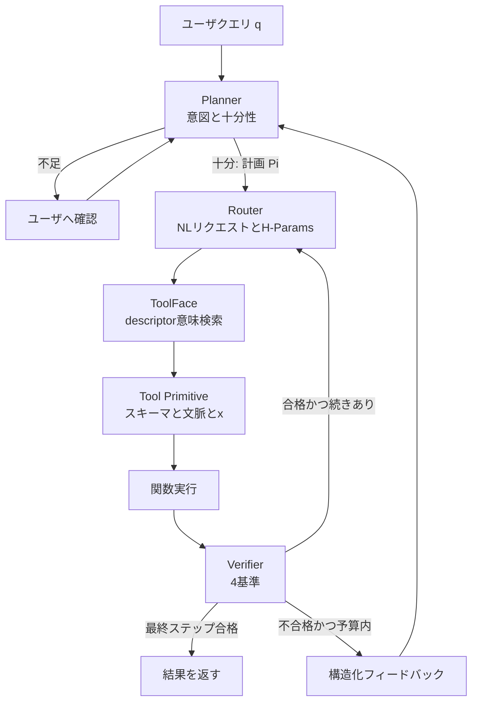

ツール定義をコンテキストへ全部載せると、選択は遅くなり、入れ子呼び出しは壊れやすくなります。
Jinらによる [Harness Engineering in LLM Tool Use via Agent-Native Reusable Tool Primitives](https://arxiv.org/abs/2609.01736) は、25,519件のカタログをモデルへ列挙せず、計画、言語化、実行、合否を分けて呼び出すハーネス HEART を提案します。
本稿は、その設計と数値を発注側の判断材料に再構成します。
先に取るべきは HEART の再実装ではありません。
既に製品化されている遅延ロードと、実行直前の構造検証です。

:::message alert
本記事は 2026-09-01 投稿の arXiv preprint（[arXiv:2609.01736v1](https://arxiv.org/abs/2609.01736)）を解説したものです。会議採録は確認していません。2026-09-04 時点で公式コードと 25,519 件レジストリの公開も確認できていません。数値は本文より表を正とします。
:::

*この記事の全体像。以下、順に解説します。*

## カタログを全部載せないことが先の問題である

大規模言語モデルにツールを使わせるとき、失敗の主因はモデルの知識不足だけではありません。
候補が増えると、スキーマ全文がプロンプトを圧迫し、次ツールへ渡す引数の写像が崩れます。
[LongFuncEval](https://arxiv.org/abs/2505.10570) は、カタログが 8K トークンから 120K トークンへ膨らむと性能が 7〜85% 落ちると報告しています。
HEART の第1節もこの観察を出発点にしています。

実務の既定に近い MCP は、サーバのツール定義を typed schema のままコンテキストへ載せます。
ツールが十本前後なら、このやり方は監査しやすいです。
本数が増えると、定義トークンそのものが性能劣化の入力になります。

Anthropic の [Tool Search](https://www.anthropic.com/engineering/advanced-tool-use) は、この問題へ別解を出しています。
`defer_loading` で定義を遅延展開し、公式例では 72K トークンから 8.7K トークンへ、約 85% 減っています。
[Agent Skills](https://platform.claude.com/docs/en/agents-and-tools/agent-skills/overview) は、L1 メタデータだけ先に載せ、本体は必要時に展開します。
1 Skill あたり約 100 トークンです。

HEART は同じ「全部載せない」を、自然言語のラッパで解こうとします。
Router には JSON 引数を組ませません。
ツールごとの **Tool Primitive** が、自然言語リクエストをスキーマへ解決して実行します。

## HEARTは計画と実行の責任を分ける

論文の問いを言い換えると、「モデルに API を話させる」のではなく「ツールにモデル語を話させる」です。
異種スキーマの写像失敗と、カタログ拡大による選択劣化を同時に狙います。

役割は4つです。

- **Planner**：意図と情報十分性を見る。足りなければユーザーに聞く。足りれば順序付き計画を出す
- **Router**：計画ステップを自然言語リクエストへ落とす。`$step_j.field` のような参照を文に埋め、retry（1〜5）、priority、timeout（既定 30 秒）を付ける。スキーマ検証はしない
- **Tool Primitive**：スキーマ、上流結果、自然言語リクエストを LLM 入力にして関数を実行する。成功時は一文の `summary` を下流へ渡す。失敗時は `SCHEMA_RESOLUTION`、`CONSTRAINT_VIOLATION`、`RUNTIME_ERROR` を返す。計画の書き換えと独自リトライはしない
- **Verifier**：完了、引数一貫、実行妥当、制約の4基準で見る。どれか一つでも fail なら計画全体をやり直す。ツール再実行はしない

索引は **ToolFace** です。
25,519 の schema–function 対を持ち、Router は descriptor の意味検索で候補を取ります。
内訳は ToolBench 16,464、NESTFUL 40+4,348、τ²-Bench 68、ACEBench 4,538、BFCLv4 7、人手 54 です。
加算は論文本文と一致します。
スキーマは人手執筆です（論文 §3.2 と Appendix G）。

失敗時の再計画予算は **B=3** です。
Algorithm 1 はステップ局所のリトライではありません。
Verifier が fail した時点で計画全体を戻します。

backbone の既定は Qwen3-8B を4役割に載せた構成です。
Appendix E.3 は、計画層だけ GPT-5.4 にし、Primitive だけ 8B にするハイブリッドも示します。
論文が Primitive を差し替え可能なモジュールだと主張する根拠は、この分離にあります。

見えてよいものと、やってはいけないことは次の通りです。

| 役割 | 見えてよいもの | 見えない、やらないこと |
|---|---|---|
| Planner | クエリ、履歴、Verifier のフィードバック | 生スキーマ、関数実行 |
| Router | 計画ステップ、文脈値 | スキーマ検証（Primitive へ委譲） |
| Tool Primitive | スキーマ、NL リクエスト、上流結果 | 計画の書き換え、独自リトライ |
| Verifier | 結果、ステップ目標、スキーマ制約 | ツール再実行 |
| ToolFace | 25,519 件の対と descriptor 索引 | モデルコンテキストへの全列挙 |

## 数値は表を正にする

比較は「HEART ハーネス付き」対「ベンチマーク既定のモデル呼び出し」です。
同一ハーネスを frontier モデルへ付けた対照ではありません。

| ベンチ | HEART | 強い対照 | 差 |
|---|---|---|---|
| ToolBench Avg Pass / Win | 75.1 / 75.7 | Claude-4.6-Sonnet DFSDT 73.4 / 73.8 | +1.7 / +1.9 |
| NESTFUL Full Acc（1-shot / 3-shot） | 0.44 / 0.47 | GPT-5.4 0.40 / 0.42 | +0.04 / +0.05 |
| ACEBench Overall | 86.9 | GPT-5.4 86.0 | +0.9 |
| BFCLv4 Web Search Overall | 86（表） | Claude-4.6 83 | +3 |
| BFCLv4 Memory Overall | 69.38 | Claude-4.6 68.28 | +1.10 |
| 50 実タスク完了率 | 84 | frontier 3 モデル平均 22 | 3.8× |

アブストラクトの「SFT 平均 +10%、商用平均 +6%」は、集計式が本文にありません。
個別セルは上表の通りで、ACEBench と ToolBench の商用差は小さいです。
NESTFUL では、SFT 系（xLAM、ToolACE）の one-shot Full Acc が 0.00、DeepSeek-V3 が 0.09 です。
入れ子呼び出しは、フラット軌道の教師あり学習だけでは崩れやすい、という主張は表と整合します。

本文と表の不一致は、表を採用します。

- BFCLv4 Web Search Overall は表 86、本文 84
- ToolHijacker の Gradient-Free ASR は表で最大 82.2%、本文は「最大 70%」
- backbone コスト比は Table 12 Retail で 0.30684 / 0.0152 ≈ 20.2×、本文は over 12×（ハイブリッド $0.19666 との取り違えの可能性）

Ablation（ToolBench Pass）は、カタログ分離の寄与が大きいことを示します。

| 除去 | Pass |
|---|---|
| ToolFace と Primitives | 16.1 |
| Verifier | 47.6 |
| Planner | 57.2 |
| Router | 62.4 |
| フル HEART | 75.1 |

再計画回数も飽和します。
B=0 は 47.6（Verifier 無しと同じ）、B=2 で 65.9、B=3 で 75.1、B=5 で 75.3 です。
飽和は B=3 です。

コストは、トークンが増えてドルが下がる形です。
τ²-Bench Retail は HEART 21,684 tok / $0.0152 / 18.72s、GPT-5.4 は 7,842 tok / $0.1176 / 16.24s です。
Retail セルの削減率は約 87% で、アブストラクトの「up to 85%」と同系です。
駆動因は **8B の単価**であり、トークン効率ではありません。
価格は論文 Table 10（Qwen3-8B in $0.18 / out $0.70 per 1M、GPT-5.4 $2.50 / $15.00）です。
2026-09-04 に OpenAI 公式料金表を再確認し、GPT-5.4 Standard は一致しています。
latency は Gemini-3.1-Pro の 9.15s より悪化します。

## 遅延ロードと自然言語ラッパとコード実行は別解である

「全部載せない」は一つの方針です。
型を残すか、自然言語へ落とすか、コードへ出すかは別判断です。

| 基準 | スキーマ全載せ | Tool Search / Skills | HEART の NL Primitive | Code Mode / PTC |
|---|---|---|---|---|
| カタログ拡大 | 8K→120K tok で 7〜85% 劣化（LongFuncEval） | 定義を遅延。公式例 72K→8.7K、約 85% 減 | 索引は ToolFace。Router には NL だけ | ツールをコード API 化。中間結果をモデル外へ |
| 型保証 | JSON Schema がプロンプトに残る | 展開後は typed schema | Primitive 内。Router と Planner は型を持たない | コードと生成された関数シグネチャ |
| 入れ子 | モデルが出力から入力への写像を自分でやる | モデルがスキーマ付きで連鎖 | Primitive 間は `summary` と文脈 | 変数と関数呼び出し |
| 攻撃面 | プロンプト内の tool document | 検索ヒットした description はコンテキストに入る | retrieval は descriptor 検索。Primitive はスキーマを読む | コード実行サンドボックス依存 |
| 運用成熟度 | 現状の MCP 既定に近い | 公式 API と Claude Code | preprint。成果物未確認 | 公式 PTC と Cloudflare Code Mode |
| 向く条件 | ツールが十本前後 | 10+ ツール、MCP 複数サーバ | 異種スキーマの長い入れ子（再現できるなら） | 大量中間データ、並列、集約 |

選ぶ基準は次です。

- **Tool Search / Skills が良い場合**：カタログが大きく、型と監査を残したい。MCP を既に使っている
- **HEART 型が意味を持ち得る場合**：入れ子が深く、スキーマ不一致が主因で、自前で Primitive と Verifier を運用できる
- **Code Mode / PTC が良い場合**：中間結果が巨大で、ループやフィルタが本体。自然言語を一回ずつ推論したくない

Anthropic の [Programmatic Tool Calling](https://www.anthropic.com/engineering/advanced-tool-use) は、中間結果をモデル外へ出し、内部平均で 43,588 トークンから 27,297 トークンへ、37% 減っています。
Cloudflare の [Code Mode](https://blog.cloudflare.com/code-mode/) は、MCP を TypeScript API にします。
どちらも、NL ラッパではありません。

## 支持できる点と、今は採らない理由

大規模カタログ問題の実務解は、「全スキーマを載せない」ことです。
計画と検証の役割分割は、入れ子と失敗回復に効きます。
自然言語でスキーマを消すこと自体は、安全性の根拠になりません。

支持できる観察は次です。

- ToolFace 除去で Pass が 75.1 から 16.1 へ落ちる。この実験設定では、カタログ分離と NL インタフェースが支配的です
- NESTFUL で SFT が Full Acc 0、HEART が 0.44。入れ子は軌道学習だけでは足りません
- B=3 まで Pass が伸び、B=5 で止まる。回復ループには上限があります
- LongFuncEval と Anthropic 公式は、カタログ拡大と定義トークンが実害だと独立に示します

今は製品基盤を HEART へ置き換えない理由もあります。

再現不能です。
abs にコードリンクはなく、2026-09-04 時点で 25,519 件 ToolFace の公式リポジトリも確認できていません。
ToolFace の embedding、top-k、descriptor 文面は非公開です。
retrieval 毒の耐性は測れません。

0% ASR の解釈は過剰です。
[ToolHijacker](https://arxiv.org/abs/2504.19793) は tool document の retrieve-then-select を攻撃します。
HEART も schema descriptors を意味検索します（§4.1）。
Primitive はスキーマを読みます。
Appendix G は「selection 段階のみ。compromised tool outputs は未検討」と書いています。

比較は非対称です。
8B×4 と再計画を、素の frontier 呼び出しと並べています。
50 タスクについて論文は「推薦はできるが代行実行できない」と書いており、権限とツールセットが揃っていない可能性が高いです。

コスト言明も取り違えやすいです。
トークンは増え、ドルは 8B 単価で減り、latency は悪化します。
ACEBench +0.9、ToolBench Pass +1.7 は、アブストラクトの +6% よりセルが小さいです。

型と責任の喪失は、設計そのものが示しています。
NL ラッパは異種スキーマを吸収する一方、実行直前の構造検証が必須です。
Verifier も同一 8B の LLM-as-judge です。
決定的なスキーマ検証ではありません。

未解決の問いは、意思決定を止めます。

- 「平均 +10% / +6%」の定義
- 50 タスクの採点者とツール権限
- GPT-5.4 / Claude-4.6 評価時のツール提示方法（DFSDT の有無は ToolBench 表に列がある）
- HEART を MCP サーバ群へ接続したときの OWASP MCP03（Tool Poisoning）耐性。論文は未評価

製品のツール実行基盤を HEART に置き換える判断は、コードと攻撃評価が揃うまでブロックしてよいです。
遅延ロードと Verifier 相当（実行結果の構造チェック）は、ブロックしません。

## 現場が先に取る判断

今やることは2つです。

1. MCP ツール定義がコンテキストの一割を超えたら、[Tool Search](https://platform.claude.com/docs/en/agents-and-tools/tool-use/tool-search-tool) の `defer_loading`、または Skills の L1 メタデータだけ先に載せる。スキーマは捨てない
2. ツール呼び出しを Planner（何を）、Router（どれを、何を渡す）、Verifier（結果は契約を満たすか）に分ける。Verifier は可能ならスキーマ検証を決定的コードにし、LLM-as-judge だけにしない

やらないことは、25,519 件の NL Primitive を自前再実装することです。
成果物がありません。

条件付きで検討してよいのは、入れ子 API が主戦場で、typed function calling が連続失敗するときです。
その場合だけ、Primitive 相当（スキーマ解決 LLM）を **実行層に限定**して試します。
計画層は強いモデル、実行層は安いモデル、という Table 12 のハイブリッドは、コスト設計として使えます。

逆転条件は明確です。
ToolFace が再現可能な形で公開され、retrieval 毒と tool-output 注入の両方で ASR が低いままなら、再評価します。

自然言語ラッパは異種スキーマを吸収できます。
その代償で、型保証と責任境界は弱まります。
実行直前の構造検証（JSON Schema、許可リスト、副作用の人間確認）は、HEART を採る採らないに関わらず残します。

## まとめ

HEART は、25,519 件のツールをコンテキストへ全載せせず、Planner、Router、Tool Primitive、Verifier で呼び出すハーネスです。
表の数値は、カタログ分離と入れ子回復が効くことを示します。
ただし公式成果物は未確認で、比較は非対称、安全性評価は selection 段階に閉じます。
現場が先に取るのは、typed のまま遅延ロードすることと、実行結果を決定的に検証することです。
NL Primitive の全面再実装は、コードと攻撃評価が揃うまで見送ります。

この記事が少しでも参考になった、あるいは改善点などがあれば、ぜひリアクションやコメント、SNSでのシェアをいただけると励みになります！

## 参考リンク

- Haibo Jin, Suijin Wang, Xucheng Yu, Haojing Luo, Haohan Wang. *Harness Engineering in LLM Tool Use via Agent-Native Reusable Tool Primitives*. arXiv:2609.01736v1, 2026-09-01. https://arxiv.org/abs/2609.01736
- Anthropic. *Introducing advanced tool use on the Claude Developer Platform*. 2025-11-24. https://www.anthropic.com/engineering/advanced-tool-use
- Anthropic. *Tool search tool*. https://platform.claude.com/docs/en/agents-and-tools/tool-use/tool-search-tool
- Anthropic. *Agent Skills overview*. https://platform.claude.com/docs/en/agents-and-tools/agent-skills/overview
- Jiawen Shi et al. *Prompt Injection Attack to Tool Selection in LLM Agents* (ToolHijacker). arXiv:2504.19793. https://arxiv.org/abs/2504.19793
- Kinjal Basu et al. *NESTFUL*. EMNLP 2025 / arXiv:2409.03797. https://arxiv.org/abs/2409.03797
- Yujia Qin et al. *ToolLLM / ToolBench*. arXiv:2307.16789. https://arxiv.org/abs/2307.16789
- Kiran Kate et al. *LongFuncEval*. arXiv:2505.10570. https://arxiv.org/abs/2505.10570
- Anthropic. *Code execution with MCP*. https://www.anthropic.com/engineering/code-execution-with-mcp
- Cloudflare. *Code Mode*. https://blog.cloudflare.com/code-mode/
